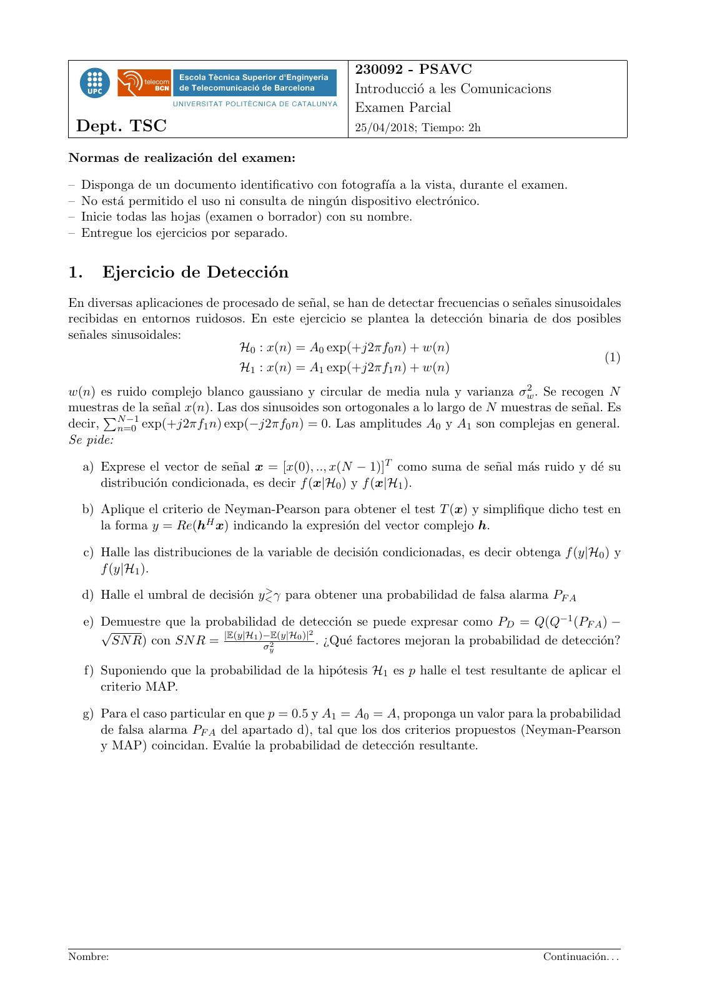
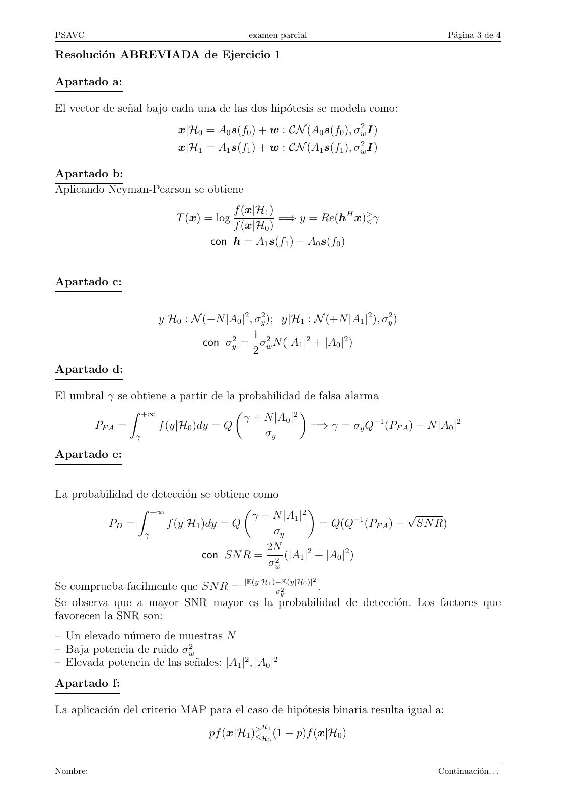
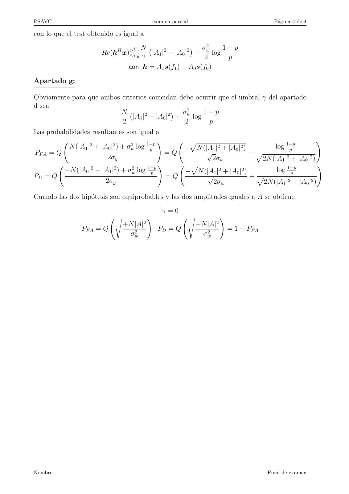

# 2018 04 PSAVC_Parcial resuelto

- Source PDF: `Examenes/2018 04 PSAVC_Parcial resuelto.pdf`
- PDF title: `2018 04 PSAVC_Parcial resuelto`
- Pages: 4
- Note: Transcribed from the embedded PDF text layer. Each page links to a rendered page image so figures, plots, handwriting, and formula layout can be checked against the original.

## Page 1



```text
                                                       230092 - PSAVC
                                                       Introducció a les Comunicacions
                                                       Examen Parcial
 Dept. TSC                                             25/04/2018; Tiempo: 2h

Normas de realización del examen:

– Disponga de un documento identificativo con fotografı́a a la vista, durante el examen.
– No está permitido el uso ni consulta de ningún dispositivo electrónico.
– Inicie todas las hojas (examen o borrador) con su nombre.
– Entregue los ejercicios por separado.


1.      Ejercicio de Detección
En diversas aplicaciones de procesado de señal, se han de detectar frecuencias o señales sinusoidales
recibidas en entornos ruidosos. En este ejercicio se plantea la detección binaria de dos posibles
señales sinusoidales:
                               H0 : x(n) = A0 exp(+j2πf0 n) + w(n)
                                                                                                    (1)
                               H1 : x(n) = A1 exp(+j2πf1 n) + w(n)
w(n) es ruido complejo blanco gaussiano y circular de media nula y varianza σw    2 . Se recogen N

muestras
      PNde  la señal x(n). Las dos sinusoides son ortogonales a lo largo de N muestras de señal. Es
          −1
decir, n=0 exp(+j2πf1 n) exp(−j2πf0 n) = 0. Las amplitudes A0 y A1 son complejas en general.
Se pide:

  a) Exprese el vector de señal x = [x(0), .., x(N − 1)]T como suma de señal más ruido y dé su
     distribución condicionada, es decir f (x|H0 ) y f (x|H1 ).

  b) Aplique el criterio de Neyman-Pearson para obtener el test T (x) y simplifique dicho test en
     la forma y = Re(hH x) indicando la expresión del vector complejo h.

     c) Halle las distribuciones de la variable de decisión condicionadas, es decir obtenga f (y|H0 ) y
        f (y|H1 ).
                                   >
  d) Halle el umbral de decisión y< γ para obtener una probabilidad de falsa alarma PF A

     e) Demuestre que la probabilidad de detección se puede expresar como PD = Q(Q−1 (PF A ) −
        √                                       2
          SN R) con SN R = |E(y|H1 )−E(y|H
                                    σ2
                                           0 )|
                                                  . ¿Qué factores mejoran la probabilidad de detección?
                                       y


     f) Suponiendo que la probabilidad de la hipótesis H1 es p halle el test resultante de aplicar el
        criterio MAP.

  g) Para el caso particular en que p = 0.5 y A1 = A0 = A, proponga un valor para la probabilidad
     de falsa alarma PF A del apartado d), tal que los dos criterios propuestos (Neyman-Pearson
     y MAP) coincidan. Evalúe la probabilidad de detección resultante.


Nombre:                                                                                   Continuación. . .
```

## Page 2


```text
PSAVC                                      examen parcial                                Página 2 de 4


Vector de frecuencias: Se facilita su definición por si resulta útil para simplificar nomenclatura:
s(f ) = [1, exp(j2πf ), .., exp(j2πf (N − 1))]T

Distribución de un vector aleatorio complejo gaussiano y circular

                                                 1
               x ∈ CN : CN (m, C); f (x) =               exp(−(x − m)H C −1 (x − m))                 (2)
                                               π N |C|

Dada la variable aleatoria escalar y compleja z = hH x, donde x sigue la distribución gaussiana
dada en (2), y dada su parte real y = Re(z) se obtiene que
                                                                  1
                      z : CN (hH m, hH Ch);       y : N (Re(hH m), hH Ch);
                                                                  2


Nombre:                                                                                Continuación. . .
```

## Page 3



```text
PSAVC                                       examen parcial                            Página 3 de 4

Resolución ABREVIADA de Ejercicio 1

Apartado a:

El vector de señal bajo cada una de las dos hipótesis se modela como:
                            x|H0 = A0 s(f0 ) + w : CN (A0 s(f0 ), σw2 I)
                            x|H1 = A1 s(f1 ) + w : CN (A1 s(f1 ), σw2 I)

Apartado b:
Aplicando Neyman-Pearson se obtiene
                                       f (x|H1 )
                           T (x) = log           =⇒ y = Re(hH x)><γ
                                       f (x|H0 )
                                   con h = A1 s(f1 ) − A0 s(f0 )


Apartado c:


                       y|H0 : N (−N |A0 |2 , σy2 ); y|H1 : N (+N |A1 |2 ), σy2 )
                                            1
                                con σy2 = σw2 N (|A1 |2 + |A0 |2 )
                                            2
Apartado d:

El umbral γ se obtiene a partir de la probabilidad de falsa alarma
               Z +∞
                                       γ + N |A0 |2
                                                   
       PF A =       f (y|H0 )dy = Q                   =⇒ γ = σy Q−1 (PF A ) − N |A0 |2
                γ                          σy
Apartado e:


La probabilidad de detección se obtiene como
                Z +∞
                                         γ − N |A1 |2                    √
                                                     
          PD =        f (y|H1 )dy = Q                   = Q(Q−1 (PF A ) − SN R)
                 γ                           σy
                                            2N
                              con SN R = 2 (|A1 |2 + |A0 |2 )
                                            σw
                                                             2
Se comprueba facilmente que SN R = |E(y|H1 )−E(y|H
                                            σy2
                                                   0 )|
                                                        .
Se observa que a mayor SNR mayor es la probabilidad de detección. Los factores que
favorecen la SNR son:
– Un elevado número de muestras N
– Baja potencia de ruido σw2
– Elevada potencia de las señales: |A1 |2 , |A0 |2
Apartado f:

La aplicación del criterio MAP para el caso de hipótesis binaria resulta igual a:
                                               H
                                   pf (x|H1 )> 1
                                             <H (1 − p)f (x|H0 )
                                                 0


Nombre:                                                                            Continuación. . .
```

## Page 4



```text
PSAVC                                     examen parcial                                Página 4 de 4

con lo que el test obtenido es igual a

                                   H N                 σ2     1−p
                       Re(hH x)<
                               > 1
                                 H
                                       |A1 |2 − |A0 |2 + w log
                                   0 2                    2     p
                                 con h = A1 s(f1 ) − A0 s(f0 )

Apartado g:

Obviamente para que ambos criterios coincidan debe ocurrir que el umbral γ del apartado
d sea
                          N                   σ2     1−p
                              |A1 |2 − |A0 |2 + w log
                          2                     2      p
Las probabilidades resultantes son igual a

           N (|A1 |2 + |A0 |2 ) + σw2 log 1−p                                           1−p
                                              !     p                                               !
                                           p       +  N (|A 1 |2 + |A |2 )
                                                                      0            log    p
PF A = Q                                        =Q       √                  +p
                          2σy                              2σw                 2N (|A1 | + |A0 |2 )
                                                                                        2

         −N (|A0 |2 + |A1 |2 ) + σw2 log 1−p                                            1−p
                                              !      p                                              !
                                           p       −  N (|A 1  |2 + |A |2 )
                                                                      0             log   p
PD = Q                                          =Q        √                 +p
                         2σy                                2σw                2N (|A1 | + |A0 |2 )
                                                                                         2


Cuando las dos hipótesis son equiprobables y las dos amplitudes iguales a A se obtiene

                                               γ=0
                            s             !            s             !
                                +N |A|2                    −N |A|2
                PF A = Q                      PD = Q                     = 1 − PF A
                                 σw2                        σw2


Nombre:                                                                               Final de examen
```
