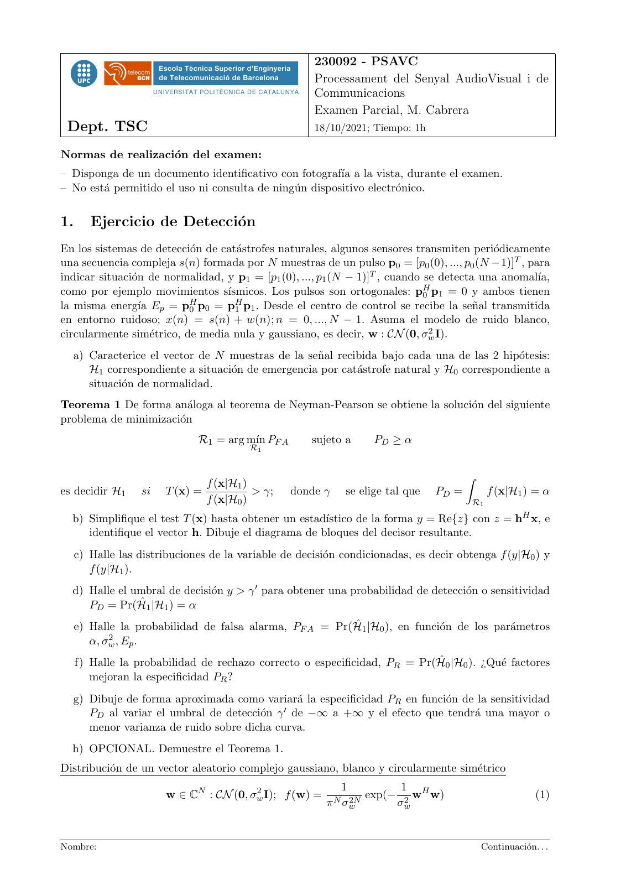
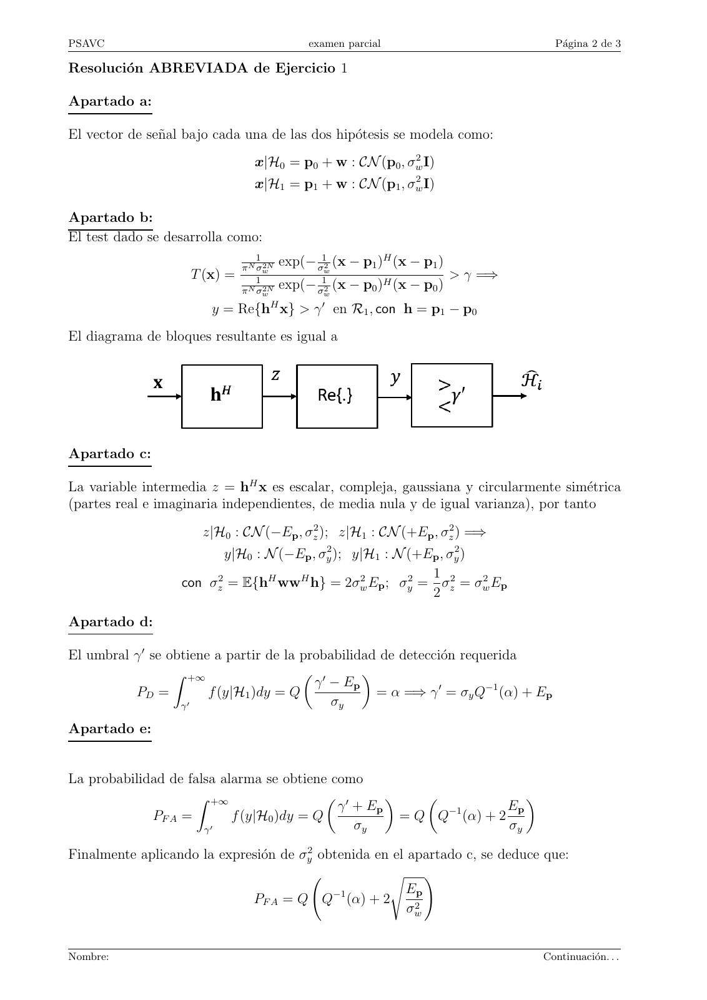
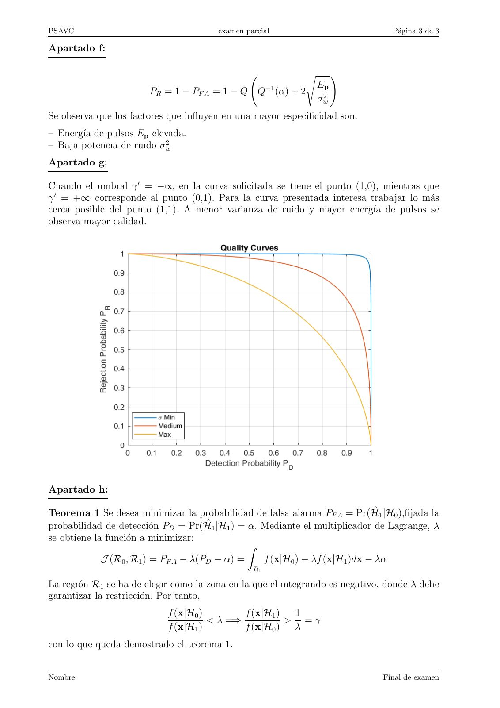

# 2021_10_ParcialG40_Resuelto

- Source PDF: `Examenes/2021_10_ParcialG40_Resuelto.pdf`
- PDF title: `2021_10_ParcialG40_Resuelto`
- Pages: 3
- Note: Transcribed from the embedded PDF text layer. Each page links to a rendered page image so figures, plots, handwriting, and formula layout can be checked against the original.

## Page 1



```text
                                                       230092 - PSAVC
                                                       Processament del Senyal AudioVisual i de
                                                       Communicacions
                                                       Examen Parcial, M. Cabrera
 Dept. TSC                                             18/10/2021; Tiempo: 1h

Normas de realización del examen:
– Disponga de un documento identificativo con fotografı́a a la vista, durante el examen.
– No está permitido el uso ni consulta de ningún dispositivo electrónico.


1.      Ejercicio de Detección
En los sistemas de detección de catástrofes naturales, algunos sensores transmiten periódicamente
una secuencia compleja s(n) formada por N muestras de un pulso p0 = [p0 (0), ..., p0 (N −1)]T , para
indicar situación de normalidad, y p1 = [p1 (0), ..., p1 (N − 1)]T , cuando se detecta una anomalı́a,
como por ejemplo movimientos sı́smicos. Los pulsos son ortogonales: pH       0 p1 = 0 y ambos tienen
la misma energı́a Ep = pH  0 p 0 = p H p . Desde el centro de control se recibe la señal transmitida
                                     1  1
en entorno ruidoso; x(n) = s(n) + w(n); n = 0, ..., N − 1. Asuma el modelo de ruido blanco,
circularmente simétrico, de media nula y gaussiano, es decir, w : CN (0, σw  2 I).


  a) Caracterice el vector de N muestras de la señal recibida bajo cada una de las 2 hipótesis:
     H1 correspondiente a situación de emergencia por catástrofe natural y H0 correspondiente a
     situación de normalidad.
Teorema 1 De forma análoga al teorema de Neyman-Pearson se obtiene la solución del siguiente
problema de minimización
                              R1 = arg mı́n PF A      sujeto a     PD ≥ α
                                         R1


                                                                                       Z
                                f (x|H1 )
es decidir H1      si   T (x) =           > γ;     donde γ   se elige tal que   PD =        f (x|H1 ) = α
                                f (x|H0 )                                              R1

  b) Simplifique el test T (x) hasta obtener un estadı́stico de la forma y = Re{z} con z = hH x, e
     identifique el vector h. Dibuje el diagrama de bloques del decisor resultante.
     c) Halle las distribuciones de la variable de decisión condicionadas, es decir obtenga f (y|H0 ) y
        f (y|H1 ).
  d) Halle el umbral de decisión y > γ 0 para obtener una probabilidad de detección o sensitividad
     PD = Pr(Ĥ1 |H1 ) = α
     e) Halle la probabilidad de falsa alarma, PF A = Pr(Ĥ1 |H0 ), en función de los parámetros
            2,E .
        α, σw   p

     f) Halle la probabilidad de rechazo correcto o especificidad, PR = Pr(Ĥ0 |H0 ). ¿Qué factores
        mejoran la especificidad PR ?
  g) Dibuje de forma aproximada como variará la especificidad PR en función de la sensitividad
     PD al variar el umbral de detección γ 0 de −∞ a +∞ y el efecto que tendrá una mayor o
     menor varianza de ruido sobre dicha curva.
  h) OPCIONAL. Demuestre el Teorema 1.
Distribución de un vector aleatorio complejo gaussiano, blanco y circularmente simétrico
                                                             1          1
                        w ∈ CN : CN (0, σw
                                         2
                                           I); f (w) =            exp(− 2 wH w)                          (1)
                                                         π N σw2N      σw


Nombre:                                                                                    Continuación. . .
```

## Page 2



```text
PSAVC                                   examen parcial                             Página 2 de 3

Resolución ABREVIADA de Ejercicio 1

Apartado a:

El vector de señal bajo cada una de las dos hipótesis se modela como:
                               x|H0 = p0 + w : CN (p0 , σw2 I)
                               x|H1 = p1 + w : CN (p1 , σw2 I)

Apartado b:
El test dado se desarrolla como:
                                1           1           H
                            π N σw2N exp(− σ 2 (x − p1 ) (x − p1 )
                                            w
                    T (x) = 1               1           H
                                                                   > γ =⇒
                            π N σw2N exp(− σ 2 (x − p0 ) (x − p0 )
                                            w

                        y = Re{hH x} > γ 0 en R1 , con h = p1 − p0
El diagrama de bloques resultante es igual a


Apartado c:

La variable intermedia z = hH x es escalar, compleja, gaussiana y circularmente simétrica
(partes real e imaginaria independientes, de media nula y de igual varianza), por tanto
                      z|H0 : CN (−Ep , σz2 ); z|H1 : CN (+Ep , σz2 ) =⇒
                         y|H0 : N (−Ep , σy2 ); y|H1 : N (+Ep , σy2 )
                                                            1
                  con σz2 = E{hH wwH h} = 2σw2 Ep ; σy2 = σz2 = σw2 Ep
                                                            2

Apartado d:

El umbral γ 0 se obtiene a partir de la probabilidad de detección requerida
                  Z +∞                   0       
                                          γ − Ep
          PD =          f (y|H1 )dy = Q             = α =⇒ γ 0 = σy Q−1 (α) + Ep
                   γ 0                      σ y

Apartado e:


La probabilidad de falsa alarma se obtiene como
                     Z +∞                   0                      
                                            γ + Ep        −1       Ep
             PF A =        f (y|H0 )dy = Q           = Q Q (α) + 2
                      γ0                       σy                  σy

Finalmente aplicando la expresión de σy2 obtenida en el apartado c, se deduce que:
                                                     s !
                                                         Ep
                             PF A = Q Q−1 (α) + 2
                                                         σw2


Nombre:                                                                       Continuación. . .
```

## Page 3



```text
PSAVC                                   examen parcial                           Página 3 de 3

Apartado f:

                                                            s         !
                                                                Ep
                       PR = 1 − PF A = 1 − Q Q−1 (α) + 2
                                                                σw2
Se observa que los factores que influyen en una mayor especificidad son:
– Energı́a de pulsos Ep elevada.
– Baja potencia de ruido σw2
Apartado g:

Cuando el umbral γ 0 = −∞ en la curva solicitada se tiene el punto (1,0), mientras que
γ 0 = +∞ corresponde al punto (0,1). Para la curva presentada interesa trabajar lo más
cerca posible del punto (1,1). A menor varianza de ruido y mayor energı́a de pulsos se
observa mayor calidad.


Apartado h:

Teorema 1 Se desea minimizar la probabilidad de falsa alarma PF A = Pr(Ĥ1 |H0 ),fijada la
probabilidad de detección PD = Pr(Ĥ1 |H1 ) = α. Mediante el multiplicador de Lagrange, λ
se obtiene la función a minimizar:
                                               Z
             J (R0 , R1 ) = PF A − λ(PD − α) =    f (x|H0 ) − λf (x|H1 )dx − λα
                                                 R1

La región R1 se ha de elegir como la zona en la que el integrando es negativo, donde λ debe
garantizar la restricción. Por tanto,
                            f (x|H0 )        f (x|H1 )  1
                                      < λ =⇒           > =γ
                            f (x|H1 )        f (x|H0 )  λ
con lo que queda demostrado el teorema 1.


Nombre:                                                                       Final de examen
```
