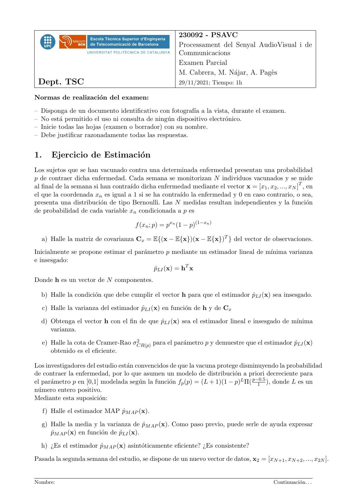
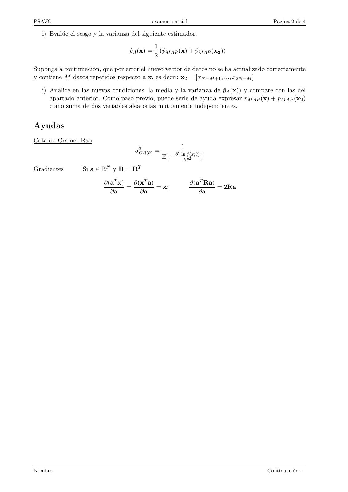
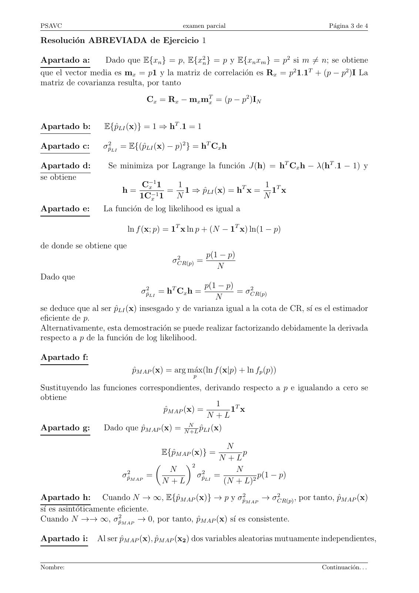
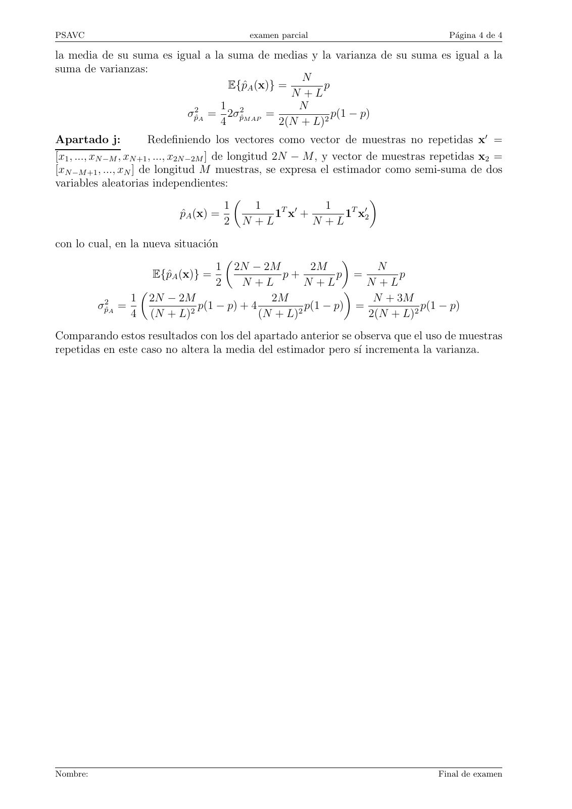

# 2021 11 Parcial 2 PSAVC G40_Solved

- Source PDF: `Examenes/2021 11 Parcial 2 PSAVC G40_Solved.pdf`
- PDF title: `2021 11 Parcial 2 PSAVC G40_Solved`
- Pages: 4
- Note: Transcribed from the embedded PDF text layer. Each page links to a rendered page image so figures, plots, handwriting, and formula layout can be checked against the original.

## Page 1



```text
                                                       230092 - PSAVC
                                                       Processament del Senyal AudioVisual i de
                                                       Communicacions
                                                       Examen Parcial
                                                       M. Cabrera, M. Nájar, A. Pagès
 Dept. TSC                                             29/11/2021; Tiempo: 1h

Normas de realización del examen:
– Disponga de un documento identificativo con fotografı́a a la vista, durante el examen.
– No está permitido el uso ni consulta de ningún dispositivo electrónico.
– Inicie todas las hojas (examen o borrador) con su nombre.
– Debe justificar razonadamente todas las respuestas.


1.      Ejercicio de Estimación
Los sujetos que se han vacunado contra una determinada enfermedad presentan una probabilidad
p de contraer dicha enfermedad. Cada semana se monitorizan N individuos vacunados y se mide
al final de la semana si han contraı́do dicha enfermedad mediante el vector x = [x1 , x2 , ..., xN ]T , en
el que la coordenada xn es igual a 1 si se ha contraı́do la enfermedad y 0 en caso contrario, o sea,
presenta una distribución de tipo Bernoulli. Las N medidas resultan independientes y la función
de probabilidad de cada variable xn condicionada a p es

                                      f (xn ; p) = pxn (1 − p)(1−xn )

  a) Halle la matriz de covarianza Cx = E{(x − E{x})(x − E{x})T } del vector de observaciones.
Inicialmente se propone estimar el parámetro p mediante un estimador lineal de mı́nima varianza
e insesgado:
                                         p̂LI (x) = hT x
Donde h es un vector de N componentes.

  b) Halle la condición que debe cumplir el vector h para que el estimador p̂LI (x) sea insesgado.

     c) Halle la varianza del estimador p̂LI (x) en función de h y de Cx

  d) Obtenga el vector h con el fin de que p̂LI (x) sea el estimador lineal e insesgado de mı́nima
     varianza.
                                     2
     e) Halle la cota de Cramer-Rao σCR(p) para el parámetro p y demuestre que el estimador p̂LI (x)
        obtenido es el eficiente.

Los investigadores del estudio están convencidos de que la vacuna protege disminuyendo la probabilidad
de contraer la enfermedad, por lo que asumen un modelo de distribución a priori decreciente para
el parámetro p en [0,1] modelada según la función fp (p) = (L + 1)(1 − p)L Π( p−0.5
                                                                                   1 ), donde L es un
número entero positivo.
Mediante esta suposición:
     f) Halle el estimador MAP p̂M AP (x).

  g) Halle la media y la varianza de p̂M AP (x). Como paso previo, puede serle de ayuda expresar
     p̂M AP (x) en función de p̂LI (x).

  h) ¿Es el estimador p̂M AP (x) asintóticamente eficiente? ¿Es consistente?
Pasada la segunda semana del estudio, se dispone de un nuevo vector de datos, x2 = [xN +1 , xN +2 , ..., x2N ].


Nombre:                                                                                    Continuación. . .
```

## Page 2



```text
PSAVC                                       examen parcial                            Página 2 de 4

   i) Evalúe el sesgo y la varianza del siguiente estimador.
                                               1
                                   p̂A (x) =     (p̂M AP (x) + p̂M AP (x2 ))
                                               2

Suponga a continuación, que por error el nuevo vector de datos no se ha actualizado correctamente
y contiene M datos repetidos respecto a x, es decir: x2 = [xN −M +1 , ..., x2N −M ]

  j) Analice en las nuevas condiciones, la media y la varianza de p̂A (x)) y compare con las del
     apartado anterior. Como paso previo, puede serle de ayuda expresar p̂M AP (x) + p̂M AP (x2 )
     como suma de dos variables aleatorias mutuamente independientes.


Ayudas
Cota de Cramer-Rao
                                      2                    1
                                     σCR(θ) =          2
                                                  E{− ∂ ln∂θf 2(x;θ) }
Gradientes        Si a ∈ RN y R = RT

                          ∂(aT x)   ∂(xT a)                    ∂(aT Ra)
                                  =         = x;                        = 2Ra
                            ∂a        ∂a                          ∂a


Nombre:                                                                             Continuación. . .
```

## Page 3



```text
PSAVC                                     examen parcial                            Página 3 de 4

Resolución ABREVIADA de Ejercicio 1

Apartado a:       Dado que E{xn } = p, E{x2n } = p y E{xn xm } = p2 si m ̸= n; se obtiene
que el vector media es mx = p1 y la matriz de correlación es Rx = p2 1.1T + (p − p2 )I La
matriz de covarianza resulta, por tanto

                               Cx = Rx − mx mTx = (p − p2 )IN


Apartado b:       E{p̂LI (x)} = 1 ⇒ hT .1 = 1

Apartado c:       σp̂2LI = E{(p̂LI (x) − p)2 } = hT Cx h

Apartado d:        Se minimiza por Lagrange la función J(h) = hT Cx h − λ(hT .1 − 1) y
se obtiene
                              C−1
                               x 1  1                     1
                       h=       −1
                                   = 1 ⇒ p̂LI (x) = hT x = 1T x
                             1Cx 1  N                     N
Apartado e:       La función de log likelihood es igual a

                          ln f (x; p) = 1T x ln p + (N − 1T x) ln(1 − p)

de donde se obtiene que
                                        2          p(1 − p)
                                       σCR(p) =
                                                      N
Dado que
                                                p(1 − p)
                              σp̂2LI = hT Cx h =             2
                                                         = σCR(p)
                                                   N
se deduce que al ser p̂LI (x) insesgado y de varianza igual a la cota de CR, sı́ es el estimador
eficiente de p.
Alternativamente, esta demostración se puede realizar factorizando debidamente la derivada
respecto a p de la función de log likelihood.

Apartado f:
                           p̂M AP (x) = arg máx(ln f (x|p) + ln fp (p))
                                              p

Sustituyendo las funciones correspondientes, derivando respecto a p e igualando a cero se
obtiene
                                                 1
                                  p̂M AP (x) =      1T x
                                               N +L
Apartado g:       Dado que p̂M AP (x) = NN+L p̂LI (x)

                                                       N
                                   E{p̂M AP (x)} =         p
                                                     N +L
                                         2
                        2            N                   N
                       σp̂M AP =             σp̂2LI =          p(1 − p)
                                   N +L               (N + L)2
Apartado h: Cuando N → ∞, E{p̂M AP (x)} → p y σp̂2M AP → σCR(p)   2
                                                                       , por tanto, p̂M AP (x)
sı́ es asintóticamente eficiente.
Cuando N →→ ∞, σp̂2M AP → 0, por tanto, p̂M AP (x) sı́ es consistente.

Apartado i:     Al ser p̂M AP (x), p̂M AP (x2 ) dos variables aleatorias mutuamente independientes,


Nombre:                                                                           Continuación. . .
```

## Page 4



```text
PSAVC                                     examen parcial                              Página 4 de 4

la media de su suma es igual a la suma de medias y la varianza de su suma es igual a la
suma de varianzas:
                                                 N
                                  E{p̂A (x)} =       p
                                               N +L
                                1               N
                         σp̂2A = 2σp̂2M AP =           p(1 − p)
                                4            2(N + L)2
Apartado j:              Redefiniendo los vectores como vector de muestras no repetidas x′ =
[x1 , ..., xN −M , xN +1 , ..., x2N −2M ] de longitud 2N − M , y vector de muestras repetidas x2 =
[xN −M +1 , ..., xN ] de longitud M muestras, se expresa el estimador como semi-suma de dos
variables aleatorias independientes:
                                                                        
                                            1      1    T ′     1    T ′
                                  p̂A (x) =            1 x +        1 x2
                                            2 N +L           N +L
con lo cual, en la nueva situación
                                                           
                                  1 2N − 2M          2M          N
                    E{p̂A (x)} =               p+         p =       p
                                  2    N +L         N +L       N +L
                                                           
           2     1 2N − 2M                   2M                 N + 3M
          σp̂A =            2
                              p(1 − p) + 4        2
                                                    p(1 − p) =           p(1 − p)
                 4 (N + L)                 (N + L)             2(N + L)2
Comparando estos resultados con los del apartado anterior se observa que el uso de muestras
repetidas en este caso no altera la media del estimador pero sı́ incrementa la varianza.


Nombre:                                                                            Final de examen
```
