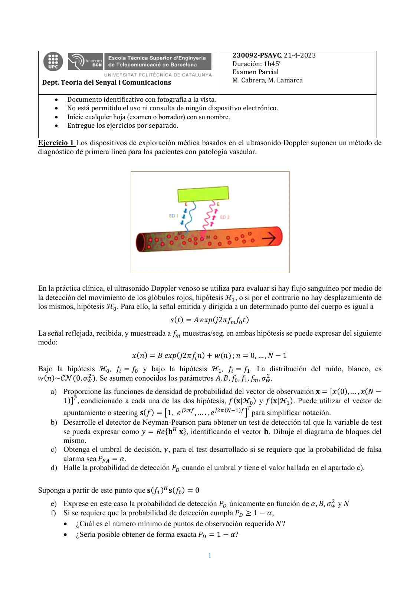
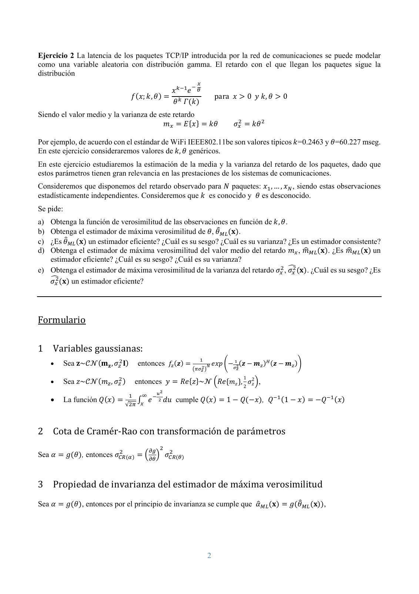
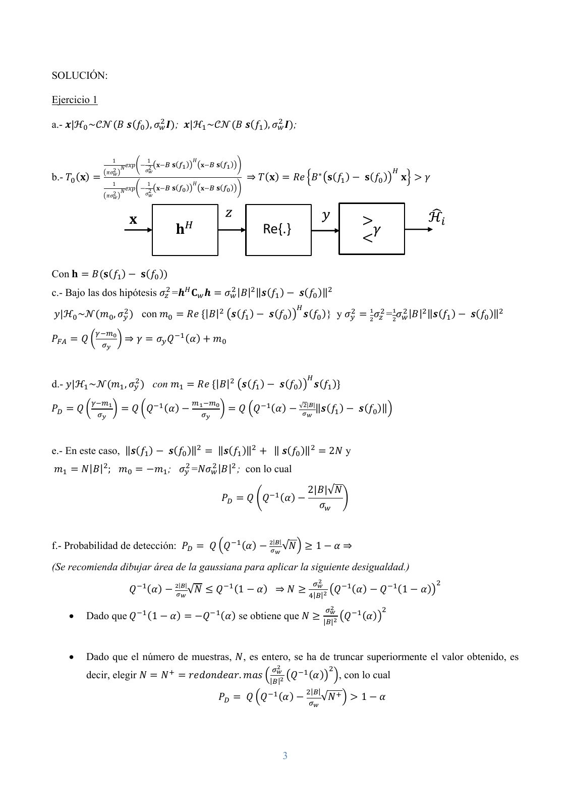
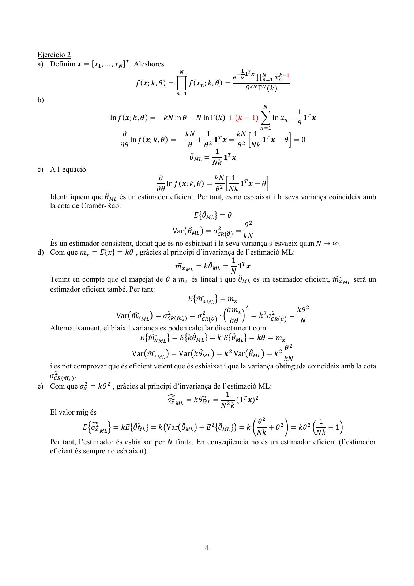

# 2023 04 PSAVC Parcial

- Source PDF: `Examenes/2023 04 PSAVC Parcial.pdf`
- PDF title: `Microsoft Word - PSAVC Parcial 2023 04`
- Pages: 4
- Note: Transcribed from the embedded PDF text layer. Each page links to a rendered page image so figures, plots, handwriting, and formula layout can be checked against the original.

## Page 1



```text
                                                                230092‐PSAVC. 21-4-2023
                                                                Duración: 1h45’
                                                                Examen Parcial
 Dept. Teoria del Senyal i Comunicacions                        M. Cabrera, M. Lamarca

        Documento identificativo con fotografía a la vista.
        No está permitido el uso ni consulta de ningún dispositivo electrónico.
        Inicie cualquier hoja (examen o borrador) con su nombre.
        Entregue los ejercicios por separado.

Ejercicio 1 Los dispositivos de exploración médica basados en el ultrasonido Doppler suponen un método de
diagnóstico de primera línea para los pacientes con patología vascular.


En la práctica clínica, el ultrasonido Doppler venoso se utiliza para evaluar si hay flujo sanguíneo por medio de
la detección del movimiento de los glóbulos rojos, hipótesis ℋ , o si por el contrario no hay desplazamiento de
los mismos, hipótesis ℋ . Para ello, la señal emitida y dirigida a un determinado punto del cuerpo es igual a
                                           𝑠 𝑡     𝐴 𝑒𝑥𝑝 𝑗2𝜋𝑓 𝑓 𝑡
La señal reflejada, recibida, y muestreada a 𝑓 muestras/seg. en ambas hipótesis se puede expresar del siguiente
modo:
                               𝑥 𝑛     𝐵 𝑒𝑥𝑝 𝑗2𝜋𝑓 𝑛         𝑤 𝑛 ;𝑛    0, … , 𝑁     1
Bajo la hipótesis ℋ , 𝑓 𝑓 y bajo la hipótesis ℋ , 𝑓 𝑓 . La distribución del ruido, blanco, es
𝑤 𝑛 ~𝒞𝒩 0, 𝜎 . Se asumen conocidos los parámetros 𝐴, 𝐵, 𝑓 , 𝑓 , 𝑓 , 𝜎 .
    a) Proporcione las funciones de densidad de probabilidad del vector de observación 𝐱 𝑥 0 ,…,𝑥 𝑁
       1 , condicionado a cada una de las dos hipótesis, 𝑓 𝐱|ℋ y 𝑓 𝐱|ℋ . Puede utilizar el vector de
       apuntamiento o steering 𝐬 𝑓      1, 𝑒    ,….,𝑒              para simplificar notación.
    b) Desarrolle el detector de Neyman-Pearson para obtener un test de detección tal que la variable de test
       se pueda expresar como 𝑦 𝑅𝑒 𝐡 𝐱 , identificando el vector 𝐡. Dibuje el diagrama de bloques del
       mismo.
    c) Obtenga el umbral de decisión, 𝛾, para el test desarrollado si se requiere que la probabilidad de falsa
       alarma sea 𝑃       𝛼.
    d) Halle la probabilidad de detección 𝑃 cuando el umbral 𝛾 tiene el valor hallado en el apartado c).

Suponga a partir de este punto que 𝐬 𝑓     𝐬 𝑓      0
    e) Exprese en este caso la probabilidad de detección 𝑃 únicamente en función de 𝛼, 𝐵, 𝜎 y 𝑁
    f) Si se requiere que la probabilidad de detección cumpla 𝑃  1 𝛼,
        ¿Cuál es el número mínimo de puntos de observación requerido 𝑁?
        ¿Sería posible obtener de forma exacta 𝑃        1 𝛼?

                                                        1
```

## Page 2



```text
Ejercicio 2 La latencia de los paquetes TCP/IP introducida por la red de comunicaciones se puede modelar
como una variable aleatoria con distribución gamma. El retardo con el que llegan los paquetes sigue la
distribución

                                                  𝑥  𝑒
                                  𝑓 𝑥; 𝑘, 𝜃                   para 𝑥            0 𝑦 𝑘, 𝜃       0
                                                  𝜃 𝛤 𝑘
Siendo el valor medio y la varianza de este retardo
                                        𝑚       𝐸 𝑥       𝑘𝜃            𝜎        𝑘𝜃

Por ejemplo, de acuerdo con el estándar de WiFi IEEE802.11be son valores típicos 𝑘=0.2463 y 𝜃=60.227 mseg.
En este ejercicio consideraremos valores de 𝑘, 𝜃 genéricos.
En este ejercicio estudiaremos la estimación de la media y la varianza del retardo de los paquetes, dado que
estos parámetros tienen gran relevancia en las prestaciones de los sistemas de comunicaciones.
Consideremos que disponemos del retardo observado para 𝑁 paquetes: 𝑥 , … , 𝑥 , siendo estas observaciones
estadísticamente independientes. Consideremos que 𝑘 es conocido y 𝜃 es desconocido.
Se pide:
a) Obtenga la función de verosimilitud de las observaciones en función de 𝑘, 𝜃.
b) Obtenga el estimador de máxima verosimilitud de 𝜃, 𝜃 𝐱 .
c) ¿Es 𝜃 𝐱 un estimador eficiente? ¿Cuál es su sesgo? ¿Cuál es su varianza? ¿Es un estimador consistente?
d) Obtenga el estimador de máxima verosimilitud del valor medio del retardo 𝑚 , 𝑚      𝐱 . ¿Es 𝑚      𝐱 un
   estimador eficiente? ¿Cuál es su sesgo? ¿Cuál es su varianza?
e) Obtenga el estimador de máxima verosimilitud de la varianza del retardo 𝜎 , 𝜎 𝐱 . ¿Cuál es su sesgo? ¿Es
   𝜎 𝐱 un estimador eficiente?


Formulario

1 Variables gaussianas:
          Sea 𝐳~𝒞𝒩 𝐦𝐳 , 𝜎 𝐈        entonces 𝑓 𝒛              𝑒𝑥𝑝           𝒛     𝒎        𝒛   𝒎
                                                                            1
          Sea 𝑧~𝒞𝒩 𝑚 , 𝜎          entonces 𝑦      𝑅𝑒 𝑧 ~𝒩 𝑅𝑒 𝑚𝑧 , 𝜎2𝑧 ,
                                                                            2

          La función 𝑄 𝑥              𝑒      𝑑𝑢 cumple 𝑄 𝑥         1       𝑄     𝑥 , 𝑄        1     𝑥    𝑄    𝑥
                              √


2 Cota de Cramér-Rao con transformación de parámetros

Sea 𝛼      𝑔 𝜃 , entonces 𝜎                   𝜎


3 Propiedad de invarianza del estimador de máxima verosimilitud
Sea 𝛼      𝑔 𝜃 , entonces por el principio de invarianza se cumple que 𝛼               𝐱           𝑔 𝜃   𝐱 ,


                                                          2
```

## Page 3



```text
SOLUCIÓN:

Ejercicio 1

a.- 𝒙|ℋ ~𝒞𝒩 𝐵 𝒔 𝑓 , 𝜎 𝑰 ; 𝒙|ℋ ~𝒞𝒩 𝐵 𝒔 𝑓 , 𝜎 𝑰 ;


                  1             1                      𝐻
                       𝑁 𝑒𝑥𝑝         𝐱       𝐬             𝐱    𝐬
                 𝜋𝜎2           𝜎2
                                𝑤
b.- 𝑇 𝐱            𝑤
                                                       𝐻
                                                                             ⇒𝑇 𝐱              𝑅𝑒 𝐵∗ 𝐬 𝑓                      𝐬 𝑓      𝐱   𝛾
                  1             1
                       𝑁 𝑒𝑥𝑝      𝐱          𝐬             𝐱    𝐬
                 𝜋𝜎2           𝜎2
                                𝑤
                   𝑤


                                                                                 Re{.}

Con 𝐡        𝐵 𝐬 𝑓             𝐬 𝑓
c.- Bajo las dos hipótesis 𝜎 =𝒉 𝐂 𝒉                                 𝜎 |𝐵| ‖𝒔 𝑓                  𝒔 𝑓 ‖

𝑦|ℋ ~𝒩 𝑚 , 𝜎                   con 𝑚               𝑅𝑒 |𝐵|               𝒔 𝑓          𝒔 𝑓         𝒔 𝑓 } y𝜎                         𝜎 = 𝜎 |𝐵| ‖𝒔 𝑓   𝒔 𝑓 ‖

𝑃       𝑄               ⇒𝛾           𝜎 𝑄               𝛼        𝑚


d.- 𝑦|ℋ ~𝒩 𝑚 , 𝜎                    con 𝑚                  𝑅𝑒 |𝐵|         𝒔 𝑓          𝒔 𝑓          𝒔 𝑓
                                                                                                √ | |
𝑃       𝑄                 𝑄 𝑄            𝛼                               𝑄 𝑄          𝛼                 ‖𝒔 𝑓              𝒔 𝑓 ‖


e.- En este caso, ‖𝒔 𝑓                   𝒔 𝑓 ‖                  ‖𝒔 𝑓 ‖               ‖𝒔 𝑓 ‖                  2𝑁 y
𝑚       𝑁|𝐵| ; 𝑚                    𝑚 ; 𝜎 =𝑁𝜎 |𝐵| ; con lo cual
                                                                                                  2|𝐵|√𝑁
                                                                    𝑃         𝑄 𝑄          𝛼
                                                                                                    𝜎


                                                                                     | |
f.- Probabilidad de detección: 𝑃                               𝑄 𝑄           𝛼             √𝑁           1         𝛼⇒

(Se recomienda dibujar área de la gaussiana para aplicar la siguiente desigualdad.)
                                                 | |
                         𝑄          𝛼                  √𝑁       𝑄        1       𝛼    ⇒𝑁            | |
                                                                                                                  𝑄       𝛼        𝑄   1   𝛼

           Dado que 𝑄              1        𝛼              𝑄       𝛼 se obtiene que 𝑁                      | |
                                                                                                                      𝑄       𝛼


           Dado que el número de muestras, 𝑁, es entero, se ha de truncar superiormente el valor obtenido, es
            decir, elegir 𝑁              𝑁             𝑟𝑒𝑑𝑜𝑛𝑑𝑒𝑎𝑟. 𝑚𝑎𝑠 | | 𝑄                         𝛼             , con lo cual
                                                                                                   | |
                                                                𝑃            𝑄 𝑄           𝛼             √𝑁               1        𝛼


                                                                                           3
```

## Page 4



```text
Ejercicio 2
a) Definim 𝒙      𝑥 ,…,𝑥      . Aleshores
                                                                             𝟏 𝒙
                                                                     𝑒         ∏   𝑥
                                𝑓 𝒙; 𝑘, 𝜃             𝑓 𝑥 ; 𝑘, 𝜃
                                                                             𝜃 Γ 𝑘
b)
                                                                                           1
                        ln 𝑓 𝒙; 𝑘, 𝜃        𝑘𝑁 ln 𝜃       𝑁 ln Γ 𝑘       𝑘     1   ln 𝑥      𝟏 𝒙
                                                                                           𝜃
                            𝜕                     𝑘𝑁        1        𝑘𝑁 1
                              ln 𝑓 𝒙; 𝑘, 𝜃                    𝟏 𝒙         𝟏 𝒙          𝜃    0
                           𝜕𝜃                      𝜃        𝜃        𝜃 𝑁𝑘
                                                               1
                                                      𝜃          𝟏 𝒙
                                                              𝑁𝑘
c) A l’equació
                                        𝜕                  𝑘𝑁 1
                                           ln 𝑓 𝒙; 𝑘, 𝜃             𝟏 𝒙 𝜃
                                       𝜕𝜃                  𝜃 𝑁𝑘
   Identifiquem que 𝜃 és un estimador eficient. Per tant, és no esbiaixat i la seva variança coincideix amb
   la cota de Cramér-Rao:
                                                    𝐸 𝜃         𝜃
                                                                      𝜃
                                             Var 𝜃         𝜎
                                                                     𝑘𝑁
   És un estimador consistent, donat que és no esbiaixat i la seva variança s’esvaeix quan 𝑁 → ∞.
d) Com que 𝑚        𝐸 𝑥     𝑘𝜃 , gràcies al principi d’invariança de l’estimació ML:
                                                                 1
                                              𝑚         𝑘𝜃         𝟏 𝒙
                                                                 𝑁
   Tenint en compte que el mapejat de 𝜃 a 𝑚 és lineal i que 𝜃 és un estimador eficient, 𝑚               serà un
   estimador eficient també. Per tant:
                                                  𝐸 𝑚           𝑚
                                                                𝜕𝑚                     𝑘𝜃
                         Var 𝑚            𝜎           𝜎                    𝑘 𝜎
                                                                 𝜕𝜃                     𝑁
   Alternativament, el biaix i variança es poden calcular directament com
                                 𝐸 𝑚           𝐸 𝑘𝜃         𝑘𝐸 𝜃          𝑘𝜃 𝑚
                                                                                   𝜃
                               Var 𝑚           Var 𝑘𝜃         𝑘 Var 𝜃          𝑘
                                                                                  𝑘𝑁
   i es pot comprovar que és eficient veient que és esbiaixat i que la variança obtinguda coincideix amb la cota
   𝜎        .
e) Com que 𝜎        𝑘𝜃 , gràcies al principi d’invariança de l’estimació ML:
                                                               1
                                           𝜎        𝑘𝜃              𝟏 𝒙
                                                             𝑁 𝑘
   El valor mig és
                                                                          𝜃                   1
               𝐸 𝜎         𝑘𝐸 𝜃         𝑘 Var 𝜃          𝐸 𝜃           𝑘        𝜃      𝑘𝜃          1
                                                                          𝑁𝑘                 𝑁𝑘
   Per tant, l’estimador és esbiaixat per 𝑁 finita. En conseqüència no és un estimador eficient (l’estimador
   eficient és sempre no esbiaixat).


                                                            4
```
