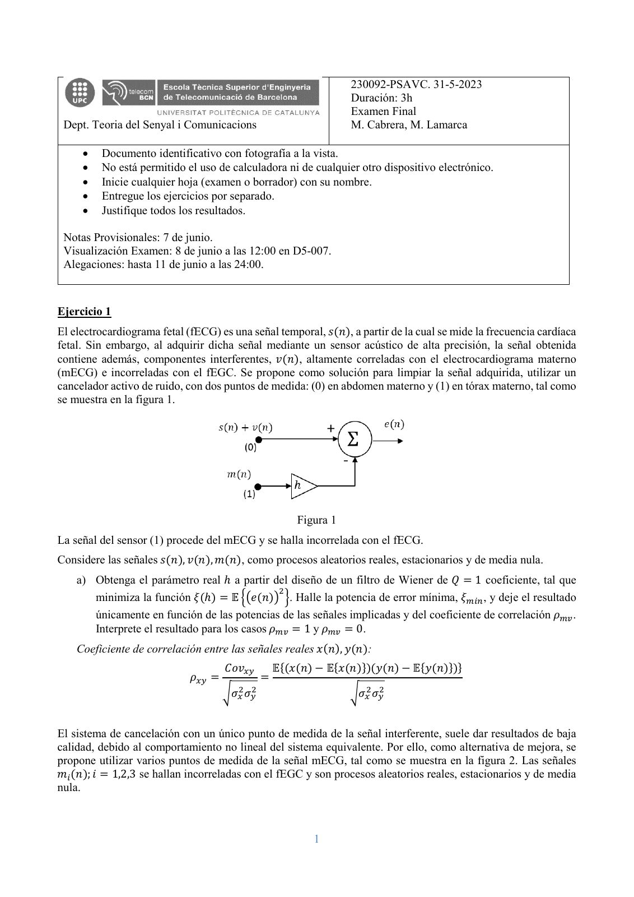
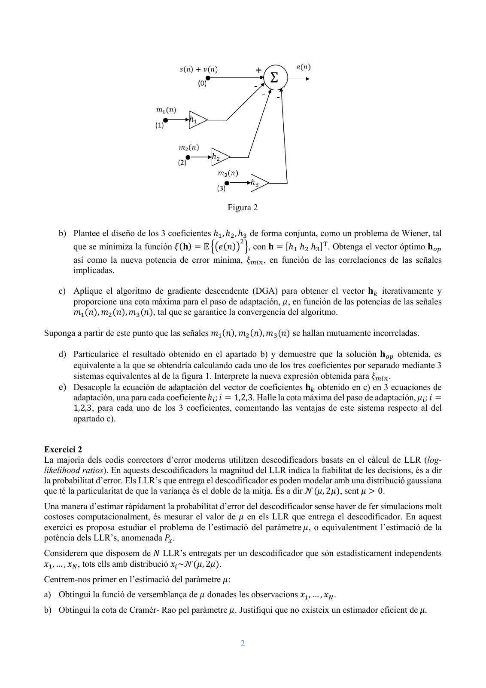
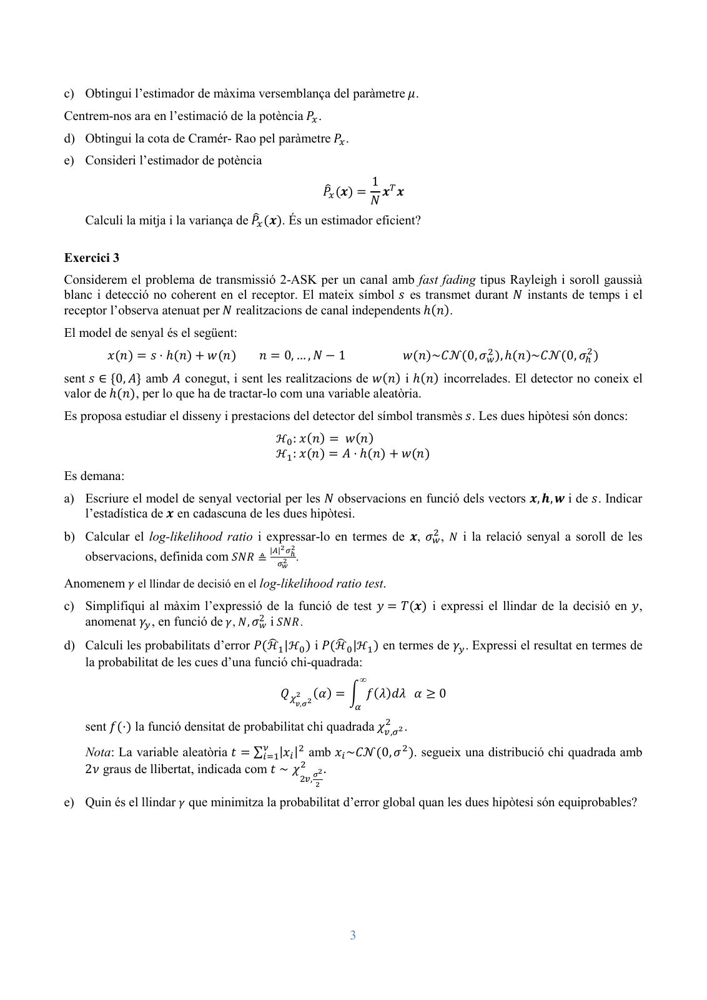
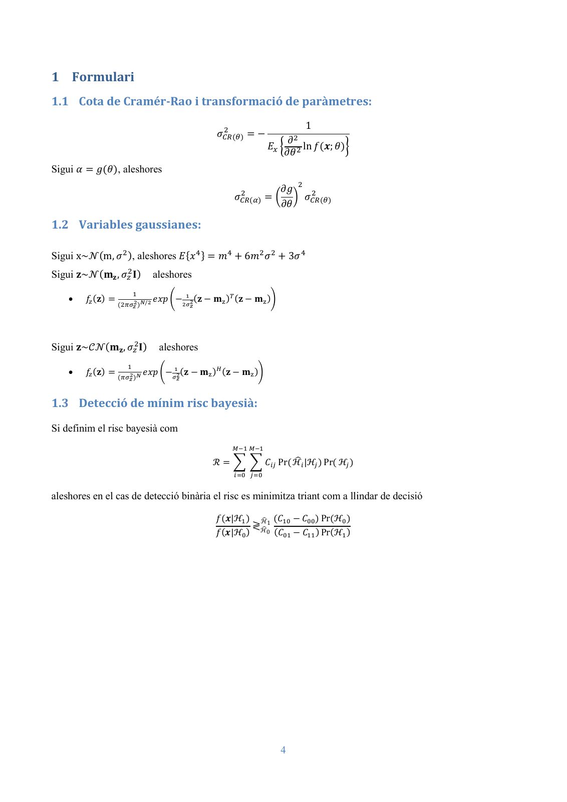
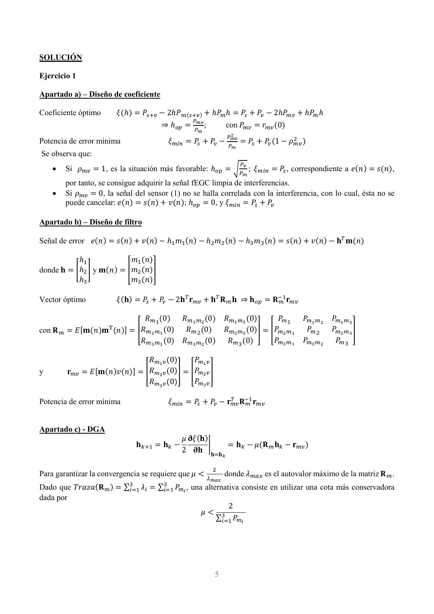
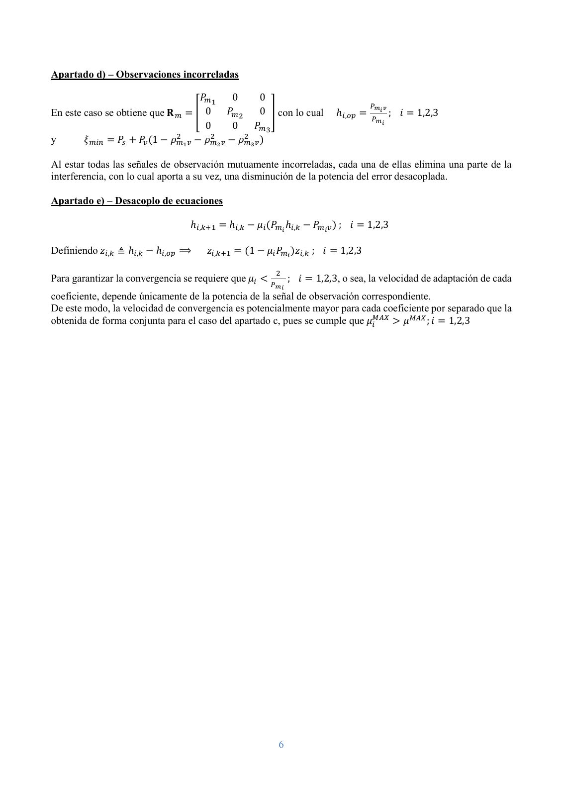
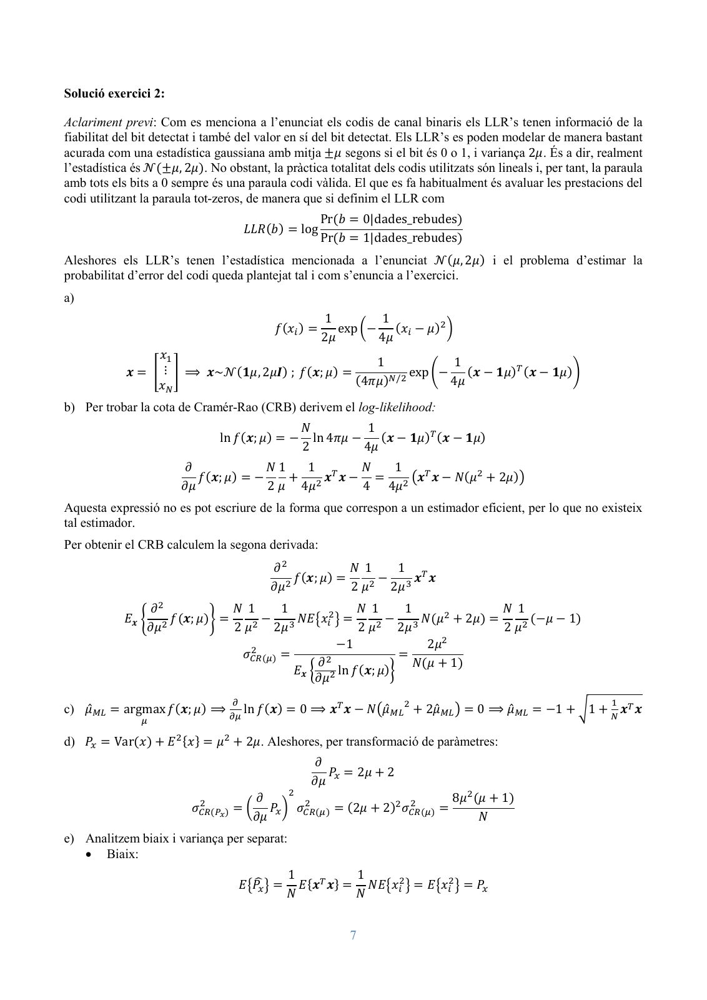
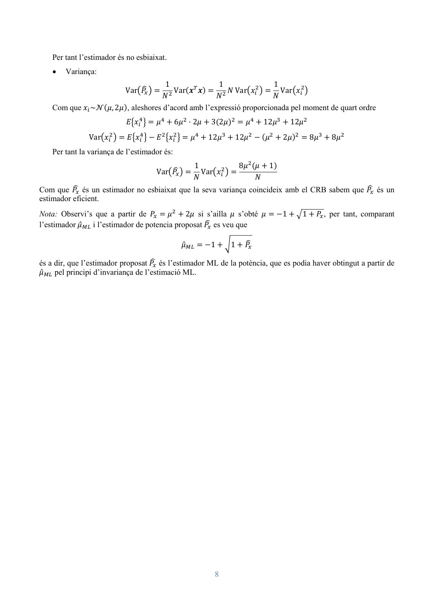
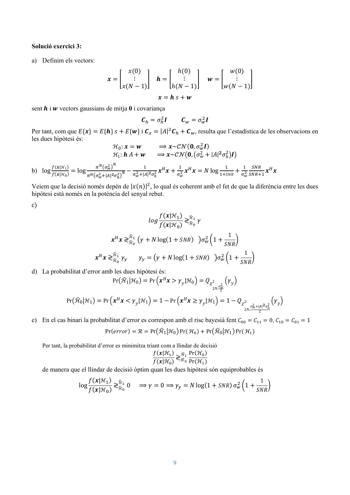

# 2023 05 PSAVC Final Resolt

- Source PDF: `Examenes/2023 05 PSAVC Final Resolt.pdf`
- PDF title: `2023 05 PSAVC Final Resolt`
- Pages: 9
- Note: Transcribed from the embedded PDF text layer. Each page links to a rendered page image so figures, plots, handwriting, and formula layout can be checked against the original.
- Text-layer caveat: `�` marks a glyph that the PDF text layer does not map to Unicode; use the rendered page image for that formula or symbol.

## Page 1



```text
                                                                             230092-PSAVC. 31-5-2023
                                                                             Duración: 3h
                                                                             Examen Final
 Dept. Teoria del Senyal i Comunicacions                                     M. Cabrera, M. Lamarca

     •   Documento identificativo con fotografía a la vista.
     •   No está permitido el uso de calculadora ni de cualquier otro dispositivo electrónico.
     •   Inicie cualquier hoja (examen o borrador) con su nombre.
     •   Entregue los ejercicios por separado.
     •   Justifique todos los resultados.

 Notas Provisionales: 7 de junio.
 Visualización Examen: 8 de junio a las 12:00 en D5-007.
 Alegaciones: hasta 11 de junio a las 24:00.


Ejercicio 1
El electrocardiograma fetal (fECG) es una señal temporal, 𝑠𝑠(𝑛𝑛), a partir de la cual se mide la frecuencia cardíaca
fetal. Sin embargo, al adquirir dicha señal mediante un sensor acústico de alta precisión, la señal obtenida
contiene además, componentes interferentes, 𝑣𝑣(𝑛𝑛), altamente correladas con el electrocardiograma materno
(mECG) e incorreladas con el fEGC. Se propone como solución para limpiar la señal adquirida, utilizar un
cancelador activo de ruido, con dos puntos de medida: (0) en abdomen materno y (1) en tórax materno, tal como
se muestra en la figura 1.


                                                                Figura 1
La señal del sensor (1) procede del mECG y se halla incorrelada con el fECG.
Considere las señales 𝑠𝑠(𝑛𝑛), 𝑣𝑣(𝑛𝑛), 𝑚𝑚(𝑛𝑛), como procesos aleatorios reales, estacionarios y de media nula.
    a) Obtenga el parámetro real ℎ a partir del diseño de un filtro de Wiener de 𝑄𝑄 = 1 coeficiente, tal que
                                                 2
       minimiza la función 𝜉𝜉(ℎ) = 𝔼𝔼 ��𝑒𝑒(𝑛𝑛)� �. Halle la potencia de error mínima, 𝜉𝜉𝑚𝑚𝑚𝑚𝑚𝑚 , y deje el resultado
       únicamente en función de las potencias de las señales implicadas y del coeficiente de correlación 𝜌𝜌𝑚𝑚𝑚𝑚 .
       Interprete el resultado para los casos 𝜌𝜌𝑚𝑚𝑚𝑚 = 1 y 𝜌𝜌𝑚𝑚𝑚𝑚 = 0.
    Coeficiente de correlación entre las señales reales 𝑥𝑥(𝑛𝑛), 𝑦𝑦(𝑛𝑛):
                                        𝐶𝐶𝐶𝐶𝐶𝐶𝑥𝑥𝑥𝑥         𝔼𝔼{(𝑥𝑥(𝑛𝑛) − 𝔼𝔼{𝑥𝑥(𝑛𝑛)})(𝑦𝑦(𝑛𝑛) − 𝔼𝔼{𝑦𝑦(𝑛𝑛)})}
                             𝜌𝜌𝑥𝑥𝑥𝑥 =                  =
                                        �𝜎𝜎𝑥𝑥2 𝜎𝜎𝑦𝑦2                         �𝜎𝜎𝑥𝑥2 𝜎𝜎𝑦𝑦2


El sistema de cancelación con un único punto de medida de la señal interferente, suele dar resultados de baja
calidad, debido al comportamiento no lineal del sistema equivalente. Por ello, como alternativa de mejora, se
propone utilizar varios puntos de medida de la señal mECG, tal como se muestra en la figura 2. Las señales
𝑚𝑚𝑖𝑖 (𝑛𝑛); 𝑖𝑖 = 1,2,3 se hallan incorreladas con el fEGC y son procesos aleatorios reales, estacionarios y de media
nula.


                                                                    1
```

## Page 2



```text
                                                      Figura 2

    b) Plantee el diseño de los 3 coeficientes ℎ1 , ℎ2 , ℎ3 de forma conjunta, como un problema de Wiener, tal
                                                         2
       que se minimiza la función 𝜉𝜉(𝐡𝐡) = 𝔼𝔼 ��𝑒𝑒(𝑛𝑛)� �, con 𝐡𝐡 = [ℎ1 ℎ2 ℎ3 ]T . Obtenga el vector óptimo 𝐡𝐡𝑜𝑜𝑜𝑜
       así como la nueva potencia de error mínima, 𝜉𝜉𝑚𝑚𝑚𝑚𝑚𝑚 , en función de las correlaciones de las señales
       implicadas.

    c) Aplique el algoritmo de gradiente descendente (DGA) para obtener el vector 𝐡𝐡𝑘𝑘 iterativamente y
       proporcione una cota máxima para el paso de adaptación, 𝜇𝜇, en función de las potencias de las señales
       𝑚𝑚1 (𝑛𝑛), 𝑚𝑚2 (𝑛𝑛), 𝑚𝑚3 (𝑛𝑛), tal que se garantice la convergencia del algoritmo.

Suponga a partir de este punto que las señales 𝑚𝑚1 (𝑛𝑛), 𝑚𝑚2 (𝑛𝑛), 𝑚𝑚3 (𝑛𝑛) se hallan mutuamente incorreladas.

    d) Particularice el resultado obtenido en el apartado b) y demuestre que la solución 𝐡𝐡𝑜𝑜𝑜𝑜 obtenida, es
       equivalente a la que se obtendría calculando cada uno de los tres coeficientes por separado mediante 3
       sistemas equivalentes al de la figura 1. Interprete la nueva expresión obtenida para 𝜉𝜉𝑚𝑚𝑚𝑚𝑚𝑚 .
    e) Desacople la ecuación de adaptación del vector de coeficientes 𝐡𝐡𝑘𝑘 obtenido en c) en 3 ecuaciones de
       adaptación, una para cada coeficiente ℎ𝑖𝑖 ; 𝑖𝑖 = 1,2,3. Halle la cota máxima del paso de adaptación, 𝜇𝜇𝑖𝑖 ; 𝑖𝑖 =
       1,2,3, para cada uno de los 3 coeficientes, comentando las ventajas de este sistema respecto al del
       apartado c).


Exercici 2
La majoria dels codis correctors d’error moderns utilitzen descodificadors basats en el càlcul de LLR (log-
likelihood ratios). En aquests descodificadors la magnitud del LLR indica la fiabilitat de les decisions, és a dir
la probabilitat d’error. Els LLR’s que entrega el descodificador es poden modelar amb una distribució gaussiana
que té la particularitat de que la variança és el doble de la mitja. És a dir 𝒩𝒩(𝜇𝜇, 2𝜇𝜇), sent 𝜇𝜇 > 0.
Una manera d’estimar ràpidament la probabilitat d’error del descodificador sense haver de fer simulacions molt
costoses computacionalment, és mesurar el valor de 𝜇𝜇 en els LLR que entrega el descodificador. En aquest
exercici es proposa estudiar el problema de l’estimació del paràmetre 𝜇𝜇, o equivalentment l’estimació de la
potència dels LLR’s, anomenada 𝑃𝑃𝑥𝑥 .
Considerem que disposem de 𝑁𝑁 LLR’s entregats per un descodificador que són estadísticament independents
𝑥𝑥1 , … , 𝑥𝑥𝑁𝑁 , tots ells amb distribució 𝑥𝑥𝑖𝑖 ~𝒩𝒩(𝜇𝜇, 2𝜇𝜇).
Centrem-nos primer en l’estimació del paràmetre 𝜇𝜇:
a) Obtingui la funció de versemblança de 𝜇𝜇 donades les observacions 𝑥𝑥1 , … , 𝑥𝑥𝑁𝑁 .
b) Obtingui la cota de Cramér- Rao pel paràmetre 𝜇𝜇. Justifiqui que no existeix un estimador eficient de 𝜇𝜇.


                                                          2
```

## Page 3



```text
c) Obtingui l’estimador de màxima versemblança del paràmetre 𝜇𝜇.
Centrem-nos ara en l’estimació de la potència 𝑃𝑃𝑥𝑥 .
d) Obtingui la cota de Cramér- Rao pel paràmetre 𝑃𝑃𝑥𝑥 .
e) Consideri l’estimador de potència
                                                                                      1 𝑇𝑇
                                                                       𝑃𝑃�𝑥𝑥 (𝒙𝒙) =      𝒙𝒙 𝒙𝒙
                                                                                      𝑁𝑁
    Calculi la mitja i la variança de 𝑃𝑃�𝑥𝑥 (𝒙𝒙). És un estimador eficient?

Exercici 3
Considerem el problema de transmissió 2-ASK per un canal amb fast fading tipus Rayleigh i soroll gaussià
blanc i detecció no coherent en el receptor. El mateix símbol 𝑠𝑠 es transmet durant 𝑁𝑁 instants de temps i el
receptor l’observa atenuat per 𝑁𝑁 realitzacions de canal independents ℎ(𝑛𝑛).
El model de senyal és el següent:
        𝑥𝑥(𝑛𝑛) = 𝑠𝑠 · ℎ(𝑛𝑛) + 𝑤𝑤(𝑛𝑛)     𝑛𝑛 = 0, … , 𝑁𝑁 − 1                                  𝑤𝑤(𝑛𝑛)~𝐶𝐶𝐶𝐶(0, 𝜎𝜎𝑤𝑤2 ), ℎ(𝑛𝑛)~𝐶𝐶𝐶𝐶(0, 𝜎𝜎ℎ2 )
sent 𝑠𝑠 ∈ {0, 𝐴𝐴} amb 𝐴𝐴 conegut, i sent les realitzacions de 𝑤𝑤(𝑛𝑛) i ℎ(𝑛𝑛) incorrelades. El detector no coneix el
valor de ℎ(𝑛𝑛), per lo que ha de tractar-lo com una variable aleatòria.
Es proposa estudiar el disseny i prestacions del detector del símbol transmès 𝑠𝑠. Les dues hipòtesi són doncs:
                                             ℋ0 : 𝑥𝑥(𝑛𝑛) = 𝑤𝑤(𝑛𝑛)
                                             ℋ1 : 𝑥𝑥(𝑛𝑛) = 𝐴𝐴 · ℎ(𝑛𝑛) + 𝑤𝑤(𝑛𝑛)
Es demana:
a) Escriure el model de senyal vectorial per les 𝑁𝑁 observacions en funció dels vectors 𝒙𝒙, 𝒉𝒉, 𝒘𝒘 i de 𝑠𝑠. Indicar
   l’estadística de 𝒙𝒙 en cadascuna de les dues hipòtesi.
b) Calcular el log-likelihood ratio i expressar-lo en termes de 𝒙𝒙, 𝜎𝜎𝑤𝑤2 , 𝑁𝑁 i la relació senyal a soroll de les
                                           |𝐴𝐴|2 𝜎𝜎ℎ2
    observacions, definida com 𝑆𝑆𝑆𝑆𝑆𝑆 ≜        2
                                             𝜎𝜎𝑤𝑤
                                                        .

Anomenem 𝛾𝛾 el llindar de decisió en el log-likelihood ratio test.
c) Simplifiqui al màxim l’expressió de la funció de test 𝑦𝑦 = 𝑇𝑇(𝒙𝒙) i expressi el llindar de la decisió en 𝑦𝑦,
   anomenat 𝛾𝛾𝑦𝑦 , en funció de 𝛾𝛾, 𝑁𝑁, 𝜎𝜎2𝑤𝑤 i 𝑆𝑆𝑆𝑆𝑆𝑆.
d) Calculi les probabilitats d’error 𝑃𝑃( �
                                        ℋ1 |ℋ0 ) i 𝑃𝑃( �
                                                      ℋ0 |ℋ1 ) en termes de 𝛾𝛾𝑦𝑦 . Expressi el resultat en termes de
   la probabilitat de les cues d’una funció chi-quadrada:
                                                                                  ∞
                                               𝑄𝑄𝜒𝜒2 2 (𝛼𝛼) = � 𝑓𝑓(𝜆𝜆)𝑑𝑑𝑑𝑑 𝛼𝛼 ≥ 0
                                                        𝑣𝑣,𝜎𝜎                  𝛼𝛼
                                                                 2
    sent 𝑓𝑓(·) la funció densitat de probabilitat chi quadrada 𝜒𝜒𝑣𝑣,𝜎𝜎 2.


    Nota: La variable aleatòria 𝑡𝑡 = ∑𝜈𝜈𝑖𝑖=1|𝑥𝑥𝑖𝑖 |2 amb 𝑥𝑥𝑖𝑖 ~𝐶𝐶𝐶𝐶(0, 𝜎𝜎 2 ). segueix una distribució chi quadrada amb
    2𝜈𝜈 graus de llibertat, indicada com 𝑡𝑡 ∼ 𝜒𝜒 2 𝜎𝜎2 .
                                                            2𝑣𝑣,
                                                                   2

e) Quin és el llindar 𝛾𝛾 que minimitza la probabilitat d’error global quan les dues hipòtesi són equiprobables?


                                                                              3
```

## Page 4



```text
1 Formulari
1.1 Cota de Cramér-Rao i transformació de paràmetres:

                                                                 2                                 1
                                                              𝜎𝜎𝐶𝐶𝐶𝐶(𝜃𝜃) =−
                                                                                           𝜕𝜕 2
                                                                                 𝐸𝐸𝑥𝑥 �            ln 𝑓𝑓(𝒙𝒙; 𝜃𝜃)�
                                                                                          𝜕𝜕𝜃𝜃 2
Sigui 𝛼𝛼 = 𝑔𝑔(𝜃𝜃), aleshores

                                                                       2          𝜕𝜕𝜕𝜕 2 2
                                                                    𝜎𝜎𝐶𝐶𝐶𝐶(𝛼𝛼) = � � 𝜎𝜎𝐶𝐶𝐶𝐶(𝜃𝜃)
                                                                                  𝜕𝜕𝜕𝜕

1.2 Variables gaussianes:

Sigui x~𝒩𝒩(m, 𝜎𝜎 2 ), aleshores 𝐸𝐸{𝑥𝑥 4 } = 𝑚𝑚4 + 6𝑚𝑚2 𝜎𝜎 2 + 3𝜎𝜎 4
Sigui 𝐳𝐳~𝒩𝒩(𝐦𝐦𝐳𝐳 , 𝜎𝜎𝑧𝑧2 𝐈𝐈)              aleshores
                                 1
     •    𝑓𝑓𝑧𝑧 (𝐳𝐳) =                     𝑒𝑒𝑒𝑒𝑒𝑒 �−2𝜎𝜎12(𝐳𝐳 − 𝐦𝐦z )𝑇𝑇 (𝐳𝐳 − 𝐦𝐦z )�
                        (2𝜋𝜋𝜎𝜎𝑧𝑧2 )𝑁𝑁/2               𝑧𝑧


Sigui 𝐳𝐳~𝒞𝒞𝒞𝒞(𝐦𝐦𝐳𝐳 , 𝜎𝜎𝑧𝑧2 𝐈𝐈)              aleshores
                             1
     •    𝑓𝑓𝑧𝑧 (𝐳𝐳) =                  𝑒𝑒𝑒𝑒𝑒𝑒 �−𝜎𝜎12(𝐳𝐳 − 𝐦𝐦z )𝐻𝐻 (𝐳𝐳 − 𝐦𝐦z )�
                        (𝜋𝜋𝜎𝜎𝑧𝑧2 )𝑁𝑁             𝑧𝑧


1.3 Detecció de mínim risc bayesià:
Si definim el risc bayesià com
                                                                   𝑀𝑀−1 𝑀𝑀−1
                                                                                �𝑖𝑖 |ℋ𝑗𝑗 ) Pr( ℋ𝑗𝑗 )
                                                             ℛ = � � 𝐶𝐶𝑖𝑖𝑖𝑖 Pr( ℋ
                                                                    𝑖𝑖=0 𝑗𝑗=0


aleshores en el cas de detecció binària el risc es minimitza triant com a llindar de decisió

                                                              𝑓𝑓(𝒙𝒙|ℋ1 ) ℋ�1 (𝐶𝐶10 − 𝐶𝐶00 ) Pr(ℋ0 )
                                                                        ≷
                                                              𝑓𝑓(𝒙𝒙|ℋ0 ) ℋ�0 (𝐶𝐶01 − 𝐶𝐶11 ) Pr(ℋ1 )


                                                                                     4
```

## Page 5



```text
SOLUCIÓN

Ejercicio 1

Apartado a) – Diseño de coeficiente

Coeficiente óptimo          𝜉𝜉(ℎ) = 𝑃𝑃𝑠𝑠+𝑣𝑣 − 2ℎ𝑃𝑃𝑚𝑚(𝑠𝑠+𝑣𝑣) + ℎ𝑃𝑃𝑚𝑚 ℎ = 𝑃𝑃𝑠𝑠 + 𝑃𝑃𝑣𝑣 − 2ℎ𝑃𝑃𝑚𝑚𝑚𝑚 + ℎ𝑃𝑃𝑚𝑚 ℎ
                                                            𝑃𝑃
                                              ⇒ ℎ𝑜𝑜𝑜𝑜 = 𝑃𝑃𝑚𝑚𝑚𝑚 ;                 con 𝑃𝑃𝑚𝑚𝑚𝑚 = 𝑟𝑟𝑚𝑚𝑚𝑚 (0)
                                                                 𝑚𝑚
                                                                                 𝑃𝑃2                  2
Potencia de error mínima                         𝜉𝜉𝑚𝑚𝑚𝑚𝑚𝑚 = 𝑃𝑃𝑠𝑠 + 𝑃𝑃𝑣𝑣 − 𝑃𝑃𝑚𝑚𝑚𝑚 = 𝑃𝑃𝑠𝑠 + 𝑃𝑃𝑣𝑣 (1 − 𝜌𝜌𝑚𝑚𝑚𝑚 )
                                                                                   𝑚𝑚
Se observa que:
                                                                                        𝑃𝑃
    •    Si 𝜌𝜌𝑚𝑚𝑚𝑚 = 1, es la situación más favorable: ℎ𝑜𝑜𝑜𝑜 = �𝑃𝑃 𝑣𝑣 ; 𝜉𝜉𝑚𝑚𝑚𝑚𝑚𝑚 = 𝑃𝑃𝑠𝑠 , correspondiente a 𝑒𝑒(𝑛𝑛) = 𝑠𝑠(𝑛𝑛),
                                                                                         𝑚𝑚
         por tanto, se consigue adquirir la señal fEGC limpia de interferencias.
    •    Si 𝜌𝜌𝑚𝑚𝑚𝑚 = 0, la señal del sensor (1) no se halla correlada con la interferencia, con lo cual, ésta no se
         puede cancelar: 𝑒𝑒(𝑛𝑛) = 𝑠𝑠(𝑛𝑛) + 𝑣𝑣(𝑛𝑛); ℎ𝑜𝑜𝑜𝑜 = 0, y 𝜉𝜉𝑚𝑚𝑚𝑚𝑚𝑚 = 𝑃𝑃𝑠𝑠 + 𝑃𝑃𝑣𝑣

Apartado b) – Diseño de filtro

Señal de error 𝑒𝑒(𝑛𝑛) = 𝑠𝑠(𝑛𝑛) + 𝑣𝑣(𝑛𝑛) − ℎ1 𝑚𝑚1 (𝑛𝑛) − ℎ2 𝑚𝑚2 (𝑛𝑛) − ℎ3 𝑚𝑚3 (𝑛𝑛) = 𝑠𝑠(𝑛𝑛) + 𝑣𝑣(𝑛𝑛) − 𝐡𝐡𝑇𝑇 𝐦𝐦(𝑛𝑛)

            ℎ1               𝑚𝑚1 (𝑛𝑛)
donde 𝐡𝐡 = �ℎ2 � y 𝐦𝐦(𝑛𝑛) = �𝑚𝑚2 (𝑛𝑛)�
            ℎ3               𝑚𝑚3 (𝑛𝑛)

Vector óptimo               𝜉𝜉(𝐡𝐡) = 𝑃𝑃𝑠𝑠 + 𝑃𝑃𝑣𝑣 − 2𝐡𝐡𝑇𝑇 𝐫𝐫𝑚𝑚𝑚𝑚 + 𝐡𝐡𝑇𝑇 𝐑𝐑 𝑚𝑚 𝐡𝐡 ⇒ 𝐡𝐡𝑜𝑜𝑜𝑜 = 𝐑𝐑−1
                                                                                             𝑚𝑚 𝐫𝐫𝑚𝑚𝑚𝑚

                                   𝑅𝑅𝑚𝑚 1 (0) 𝑅𝑅𝑚𝑚1 𝑚𝑚2 (0) 𝑅𝑅𝑚𝑚1 𝑚𝑚3 (0)        𝑃𝑃𝑚𝑚 1                    𝑃𝑃𝑚𝑚1 𝑚𝑚2   𝑃𝑃𝑚𝑚1 𝑚𝑚3
                        T        𝑅𝑅
con 𝐑𝐑 𝑚𝑚 = 𝐸𝐸[𝐦𝐦(𝑛𝑛)𝐦𝐦 (𝑛𝑛)] = � 𝑚𝑚2 𝑚𝑚1  (0)   𝑅𝑅𝑚𝑚 2 (0)  𝑅𝑅𝑚𝑚2 𝑚𝑚3 (0)     𝑃𝑃
                                                                          � = � 𝑚𝑚2 𝑚𝑚1                      𝑃𝑃𝑚𝑚 2    𝑃𝑃𝑚𝑚2 𝑚𝑚3 �
                                 𝑅𝑅𝑚𝑚3 𝑚𝑚1 (0) 𝑅𝑅𝑚𝑚3 𝑚𝑚2 (0) 𝑅𝑅𝑚𝑚 3 (0)        𝑃𝑃𝑚𝑚3 𝑚𝑚1                   𝑃𝑃𝑚𝑚3 𝑚𝑚2     𝑃𝑃𝑚𝑚 3

                                      𝑅𝑅𝑚𝑚1 𝑣𝑣 (0) 𝑃𝑃𝑚𝑚1 𝑣𝑣
y        𝐫𝐫𝑚𝑚𝑚𝑚 = 𝐸𝐸[𝐦𝐦(𝑛𝑛)𝑣𝑣(𝑛𝑛)] = � 𝑚𝑚2 𝑣𝑣 � = �𝑃𝑃𝑚𝑚2 𝑣𝑣 �
                                      𝑅𝑅       (0)
                                      𝑅𝑅𝑚𝑚3 𝑣𝑣 (0) 𝑃𝑃𝑚𝑚3 𝑣𝑣

                                                                            𝑇𝑇
Potencia de error mínima                         𝜉𝜉𝑚𝑚𝑚𝑚𝑚𝑚 = 𝑃𝑃𝑠𝑠 + 𝑃𝑃𝑣𝑣 − 𝐫𝐫𝑚𝑚𝑚𝑚 𝐑𝐑−1
                                                                                   𝑚𝑚 𝐫𝐫𝑚𝑚𝑚𝑚


Apartado c) - DGA
                                                       𝜇𝜇 𝛛𝛛𝜉𝜉(𝐡𝐡)
                                    𝐡𝐡𝑘𝑘+1 = 𝐡𝐡𝑘𝑘 −                � = 𝐡𝐡𝑘𝑘 − 𝜇𝜇(𝐑𝐑 𝑚𝑚 𝐡𝐡𝑘𝑘 − 𝐫𝐫𝑚𝑚𝑚𝑚 )
                                                       2 𝛛𝛛𝛛𝛛 𝐡𝐡=𝐡𝐡
                                                                            𝑘𝑘

                                                                         2
Para garantizar la convergencia se requiere que 𝜇𝜇 <                           donde 𝜆𝜆𝑚𝑚𝑚𝑚𝑚𝑚 es el autovalor máximo de la matriz 𝐑𝐑 𝑚𝑚 .
                                                                      𝜆𝜆𝑚𝑚𝑚𝑚𝑚𝑚
Dado que 𝑇𝑇𝑇𝑇𝑇𝑇𝑇𝑇𝑇𝑇(𝐑𝐑 𝑚𝑚 ) = ∑3𝑖𝑖=1 𝜆𝜆𝑖𝑖 = ∑3𝑖𝑖=1 𝑃𝑃𝑚𝑚𝑖𝑖 , una alternativa consiste en utilizar una cota más conservadora
dada por
                                                                        2
                                                               𝜇𝜇 < 3
                                                                    ∑𝑖𝑖=1 𝑃𝑃𝑚𝑚𝑖𝑖


                                                                        5
```

## Page 6



```text
Apartado d) – Observaciones incorreladas

                                               𝑃𝑃𝑚𝑚 1       0           0
                                                                                                        𝑃𝑃𝑚𝑚𝑖𝑖 𝑣𝑣
En este caso se obtiene que 𝐑𝐑 𝑚𝑚 = � 0                   𝑃𝑃𝑚𝑚 2        0 � con lo cual    ℎ𝑖𝑖,𝑜𝑜𝑜𝑜 =               ; 𝑖𝑖 = 1,2,3
                                                                                                        𝑃𝑃𝑚𝑚𝑖𝑖
                                                 0          0       𝑃𝑃𝑚𝑚 3
                                      2             2            2
y       𝜉𝜉𝑚𝑚𝑚𝑚𝑚𝑚 = 𝑃𝑃𝑠𝑠 + 𝑃𝑃𝑣𝑣 (1 − 𝜌𝜌𝑚𝑚 1 𝑣𝑣
                                              −  𝜌𝜌𝑚𝑚2 𝑣𝑣 −   𝜌𝜌 𝑚𝑚3 𝑣𝑣 )


Al estar todas las señales de observación mutuamente incorreladas, cada una de ellas elimina una parte de la
interferencia, con lo cual aporta a su vez, una disminución de la potencia del error desacoplada.

Apartado e) – Desacoplo de ecuaciones

                                            ℎ𝑖𝑖,𝑘𝑘+1 = ℎ𝑖𝑖,𝑘𝑘 − 𝜇𝜇𝑖𝑖 (𝑃𝑃𝑚𝑚𝑖𝑖 ℎ𝑖𝑖,𝑘𝑘 − 𝑃𝑃𝑚𝑚𝑖𝑖𝑣𝑣 ) ; 𝑖𝑖 = 1,2,3

Definiendo 𝑧𝑧𝑖𝑖,𝑘𝑘 ≜ ℎ𝑖𝑖,𝑘𝑘 − ℎ𝑖𝑖,𝑜𝑜𝑜𝑜 ⟹         𝑧𝑧𝑖𝑖,𝑘𝑘+1 = (1 − 𝜇𝜇𝑖𝑖 𝑃𝑃𝑚𝑚𝑖𝑖 )𝑧𝑧𝑖𝑖,𝑘𝑘 ; 𝑖𝑖 = 1,2,3

                                                                        2
Para garantizar la convergencia se requiere que 𝜇𝜇𝑖𝑖 <                        ;   𝑖𝑖 = 1,2,3, o sea, la velocidad de adaptación de cada
                                                                      𝑃𝑃𝑚𝑚 𝑖𝑖
coeficiente, depende únicamente de la potencia de la señal de observación correspondiente.
De este modo, la velocidad de convergencia es potencialmente mayor para cada coeficiente por separado que la
obtenida de forma conjunta para el caso del apartado c, pues se cumple que 𝜇𝜇𝑖𝑖𝑀𝑀𝑀𝑀𝑀𝑀 > 𝜇𝜇𝑀𝑀𝑀𝑀𝑀𝑀 ; 𝑖𝑖 = 1,2,3


                                                                         6
```

## Page 7



```text
Solució exercici 2:

Aclariment previ: Com es menciona a l’enunciat els codis de canal binaris els LLR’s tenen informació de la
fiabilitat del bit detectat i també del valor en sí del bit detectat. Els LLR’s es poden modelar de manera bastant
acurada com una estadística gaussiana amb mitja ±𝜇𝜇 segons si el bit és 0 o 1, i variança 2𝜇𝜇. És a dir, realment
l’estadística és 𝒩𝒩(±𝜇𝜇, 2𝜇𝜇). No obstant, la pràctica totalitat dels codis utilitzats són lineals i, per tant, la paraula
amb tots els bits a 0 sempre és una paraula codi vàlida. El que es fa habitualment és avaluar les prestacions del
codi utilitzant la paraula tot-zeros, de manera que si definim el LLR com
                                                                Pr(𝑏𝑏 = 0|dades_rebudes)
                                          𝐿𝐿𝐿𝐿𝐿𝐿(𝑏𝑏) = log
                                                                Pr(𝑏𝑏 = 1|dades_rebudes)
Aleshores els LLR’s tenen l’estadística mencionada a l’enunciat 𝒩𝒩(𝜇𝜇, 2𝜇𝜇) i el problema d’estimar la
probabilitat d’error del codi queda plantejat tal i com s’enuncia a l’exercici.
a)
                                                                 1         1
                                                  𝑓𝑓(𝑥𝑥𝑖𝑖 ) =       exp �− (𝑥𝑥𝑖𝑖 − 𝜇𝜇)2 �
                                                                2𝜇𝜇       4𝜇𝜇
                   𝑥𝑥1
                                                                1              1
             𝒙𝒙 = � ⋮ � ⟹ 𝒙𝒙~𝒩𝒩(𝟏𝟏𝜇𝜇, 2𝜇𝜇𝑰𝑰) ; 𝑓𝑓(𝒙𝒙; 𝜇𝜇) =        𝑁𝑁/2
                                                                        exp �− (𝒙𝒙 − 𝟏𝟏𝜇𝜇)𝑇𝑇 (𝒙𝒙 − 𝟏𝟏𝜇𝜇)�
                   𝑥𝑥𝑁𝑁                                     (4𝜋𝜋𝜋𝜋)           4𝜇𝜇

b) Per trobar la cota de Cramér-Rao (CRB) derivem el log-likelihood:
                                                           𝑁𝑁             1
                                    ln 𝑓𝑓(𝒙𝒙; 𝜇𝜇) = −         ln 4𝜋𝜋𝜋𝜋 −     (𝒙𝒙 − 𝟏𝟏𝜇𝜇)𝑇𝑇 (𝒙𝒙 − 𝟏𝟏𝜇𝜇)
                                                           2             4𝜇𝜇
                             𝜕𝜕                 𝑁𝑁 1   1          𝑁𝑁 1
                                 𝑓𝑓(𝒙𝒙; 𝜇𝜇) = −      + 2 𝒙𝒙𝑇𝑇 𝒙𝒙 − = 2 �𝒙𝒙𝑇𝑇 𝒙𝒙 − 𝑁𝑁(𝜇𝜇2 + 2𝜇𝜇)�
                            𝜕𝜕𝜕𝜕                2 𝜇𝜇 4𝜇𝜇          4 4𝜇𝜇
Aquesta expressió no es pot escriure de la forma que correspon a un estimador eficient, per lo que no existeix
tal estimador.
Per obtenir el CRB calculem la segona derivada:
                                                  𝜕𝜕 2               𝑁𝑁 1     1
                                                      2
                                                        𝑓𝑓(𝒙𝒙; 𝜇𝜇) =      2
                                                                            − 3 𝒙𝒙𝑇𝑇 𝒙𝒙
                                                 𝜕𝜕𝜇𝜇                2 𝜇𝜇    2𝜇𝜇
                      𝜕𝜕 2               𝑁𝑁 1         1                 𝑁𝑁 1     1                   𝑁𝑁 1
            𝐸𝐸𝒙𝒙 �         𝑓𝑓(𝒙𝒙; 𝜇𝜇)� =         −       𝑁𝑁𝑁𝑁�𝑥𝑥𝑖𝑖2 � =      −       𝑁𝑁(𝜇𝜇2 + 2𝜇𝜇) =       (−𝜇𝜇 − 1)
                     𝜕𝜕𝜇𝜇2               2 𝜇𝜇2 2𝜇𝜇 3                    2 𝜇𝜇2 2𝜇𝜇 3                  2 𝜇𝜇2
                                              2                     −1                2𝜇𝜇2
                                           𝜎𝜎𝐶𝐶𝐶𝐶(𝜇𝜇) =                         =
                                                               𝜕𝜕 2                𝑁𝑁(𝜇𝜇 + 1)
                                                        𝐸𝐸𝒙𝒙 � 2 ln 𝑓𝑓(𝒙𝒙; 𝜇𝜇)�
                                                              𝜕𝜕𝜇𝜇
                                        𝜕𝜕                                                                                  1
c) 𝜇𝜇̂ 𝑀𝑀𝑀𝑀 = argmax 𝑓𝑓(𝒙𝒙; 𝜇𝜇) ⟹           ln 𝑓𝑓(𝒙𝒙) = 0 ⟹ 𝒙𝒙𝑇𝑇 𝒙𝒙 − 𝑁𝑁�𝜇𝜇̂ 𝑀𝑀𝑀𝑀 2 + 2𝜇𝜇̂ 𝑀𝑀𝑀𝑀 � = 0 ⟹ 𝜇𝜇̂ 𝑀𝑀𝑀𝑀 = −1 + �1 + 𝒙𝒙𝑇𝑇 𝒙𝒙
                𝜇𝜇                     𝜕𝜕𝜕𝜕                                                                                 𝑁𝑁

d) 𝑃𝑃𝑥𝑥 = Var(𝑥𝑥) + 𝐸𝐸 2 {𝑥𝑥} = 𝜇𝜇2 + 2𝜇𝜇. Aleshores, per transformació de paràmetres:
                                                               𝜕𝜕
                                                                  𝑃𝑃 = 2𝜇𝜇 + 2
                                                              𝜕𝜕𝜕𝜕 𝑥𝑥
                                                        2
                                 2              𝜕𝜕           2                  2 2
                                                                                              8𝜇𝜇2 (𝜇𝜇 + 1)
                              𝜎𝜎𝐶𝐶𝐶𝐶(𝑃𝑃     = �    𝑃𝑃  �  𝜎𝜎         = (2𝜇𝜇 + 2) 𝜎𝜎         =
                                       𝑥𝑥 )    𝜕𝜕𝜕𝜕 𝑥𝑥      𝐶𝐶𝐶𝐶(𝜇𝜇)               𝐶𝐶𝐶𝐶(𝜇𝜇)
                                                                                                    𝑁𝑁
e) Analitzem biaix i variança per separat:
   • Biaix:
                                                        1               1
                                         𝐸𝐸�𝑃𝑃�𝑥𝑥 � =      𝐸𝐸{𝒙𝒙𝑇𝑇 𝒙𝒙} = 𝑁𝑁𝑁𝑁�𝑥𝑥𝑖𝑖2 � = 𝐸𝐸�𝑥𝑥𝑖𝑖2 � = 𝑃𝑃𝑥𝑥
                                                        𝑁𝑁              𝑁𝑁


                                                                       7
```

## Page 8



```text
    Per tant l’estimador és no esbiaixat.
    •   Variança:
                                          1                  1                 1
                           Var�𝑃𝑃�𝑥𝑥 � =    2
                                              Var(𝒙𝒙𝑇𝑇 𝒙𝒙) = 2 𝑁𝑁 Var�𝑥𝑥𝑖𝑖2 � = Var�𝑥𝑥𝑖𝑖2 �
                                         𝑁𝑁                 𝑁𝑁                 𝑁𝑁
    Com que 𝑥𝑥𝑖𝑖 ~𝒩𝒩(𝜇𝜇, 2𝜇𝜇), aleshores d’acord amb l’expressió proporcionada pel moment de quart ordre
                            𝐸𝐸�𝑥𝑥𝑖𝑖4 � = 𝜇𝜇4 + 6𝜇𝜇2 · 2𝜇𝜇 + 3(2𝜇𝜇)2 = 𝜇𝜇4 + 12𝜇𝜇3 + 12𝜇𝜇2
               Var�𝑥𝑥𝑖𝑖2 � = 𝐸𝐸�𝑥𝑥𝑖𝑖4 � − 𝐸𝐸 2 �𝑥𝑥𝑖𝑖2 � = 𝜇𝜇4 + 12𝜇𝜇3 + 12𝜇𝜇2 − (𝜇𝜇2 + 2𝜇𝜇)2 = 8𝜇𝜇3 + 8𝜇𝜇2
    Per tant la variança de l’estimador és:
                                                       1                8𝜇𝜇2 (𝜇𝜇 + 1)
                                       Var�𝑃𝑃�𝑥𝑥 � =      Var�𝑥𝑥𝑖𝑖2 � =
                                                       𝑁𝑁                     𝑁𝑁
Com que 𝑃𝑃�𝑥𝑥 és un estimador no esbiaixat que la seva variança coincideix amb el CRB sabem que 𝑃𝑃�𝑥𝑥 és un
estimador eficient.
Nota: Observi’s que a partir de 𝑃𝑃𝑥𝑥 = 𝜇𝜇2 + 2𝜇𝜇 si s’ailla 𝜇𝜇 s’obté 𝜇𝜇 = −1 + �1 + 𝑃𝑃𝑥𝑥 , per tant, comparant
l’estimador 𝜇𝜇̂ 𝑀𝑀𝑀𝑀 i l’estimador de potencia proposat 𝑃𝑃�𝑥𝑥 es veu que

                                                𝜇𝜇̂ 𝑀𝑀𝑀𝑀 = −1 + �1 + 𝑃𝑃�𝑥𝑥

és a dir, que l’estimador proposat 𝑃𝑃�𝑥𝑥 és l’estimador ML de la potència, que es podia haver obtingut a partir de
𝜇𝜇̂ 𝑀𝑀𝑀𝑀 pel principi d’invariança de l’estimació ML.


                                                              8
```

## Page 9



```text
Solució exercici 3:

a) Definim els vectors:
                                               𝑥𝑥(0)                             ℎ(0)                             𝑤𝑤(0)
                                      𝒙𝒙 = �      ⋮   �               𝒉𝒉 = �       ⋮    �        𝒘𝒘 = �              ⋮    �
                                            𝑥𝑥(𝑁𝑁 − 1)                         ℎ(𝑁𝑁 − 1)                        𝑤𝑤(𝑁𝑁 − 1)
                                                                      𝒙𝒙 = 𝒉𝒉 𝑠𝑠 + 𝒘𝒘
sent 𝒉𝒉 i 𝒘𝒘 vectors gaussians de mitja 0 i covariança
                                                              𝑪𝑪ℎ = 𝜎𝜎ℎ2 𝑰𝑰        𝑪𝑪𝑤𝑤 = 𝜎𝜎𝑤𝑤2 𝑰𝑰
Per tant, com que 𝐸𝐸{𝒙𝒙} = 𝐸𝐸{𝒉𝒉} 𝑠𝑠 + 𝐸𝐸{𝒘𝒘} i 𝑪𝑪𝑥𝑥 = |𝐴𝐴|2 𝑪𝑪ℎ + 𝑪𝑪𝑤𝑤 , resulta que l’estadística de les observacions en
les dues hipòtesi és:
                                 ℋ0 : 𝒙𝒙 = 𝒘𝒘         ⟹ 𝒙𝒙~𝒞𝒞𝒞𝒞(𝟎𝟎, 𝜎𝜎𝑤𝑤2 𝑰𝑰)
                                 ℋ1 : 𝒉𝒉 𝐴𝐴 + 𝒘𝒘      ⟹ 𝒙𝒙~𝒞𝒞𝒞𝒞�𝟎𝟎, �𝜎𝜎2𝑤𝑤 + |𝐴𝐴|𝟐𝟐 𝜎𝜎2ℎ �𝑰𝑰�
                                         𝑁𝑁
         𝑓𝑓(𝒙𝒙|ℋ )            𝜋𝜋𝑁𝑁 �𝜎𝜎𝑤𝑤
                                      2�                       1            𝐻𝐻     1 𝐻𝐻                 1         1 𝑆𝑆𝑆𝑆𝑆𝑆       𝐻𝐻
b) log 𝑓𝑓(𝒙𝒙| 1 ) = log 𝑁𝑁      2 +|𝐴𝐴|𝟐𝟐 𝜎𝜎 2 �𝑁𝑁
                                                     −     2 +|𝐴𝐴|𝟐𝟐 𝜎𝜎 2 𝒙𝒙 𝒙𝒙 + 𝜎𝜎 2 𝒙𝒙 𝒙𝒙 = 𝑁𝑁 log 1+𝑆𝑆𝑆𝑆𝑆𝑆 + 𝜎𝜎 2 𝑆𝑆𝑆𝑆𝑆𝑆+1 𝒙𝒙 𝒙𝒙
             ℋ0         𝜋𝜋   �𝜎𝜎𝑤𝑤                       𝜎𝜎𝑤𝑤          ℎ            𝑤𝑤                             𝑤𝑤
                                            ℎ

Veiem que la decisió només depèn de |𝑥𝑥(𝑛𝑛)|2 , lo qual és coherent amb el fet de que la diferència entre les dues
hipòtesi està només en la potència del senyal rebut.
c)
                                                                          𝑓𝑓(𝒙𝒙|ℋ1 ) �ℋ1
                                                                 𝑙𝑙𝑙𝑙𝑙𝑙             ≷ 𝛾𝛾
                                                                          𝑓𝑓(𝒙𝒙|ℋ0 ) �ℋ0
                                                     �
                                                     ℋ                                                            1
                                        𝒙𝒙𝐻𝐻 𝒙𝒙 ≷ �ℋ1 �𝛾𝛾 + 𝑁𝑁 log(1 + 𝑆𝑆𝑆𝑆𝑆𝑆) �𝜎𝜎𝑤𝑤2 �1 +                               �
                                                         0                                                      𝑆𝑆𝑆𝑆𝑆𝑆
                                         �
                                         ℋ                                                                                     1
                             𝒙𝒙𝐻𝐻 𝒙𝒙 ≷ �ℋ1 𝛾𝛾𝑦𝑦              𝛾𝛾𝑦𝑦 = �𝛾𝛾 + 𝑁𝑁 log(1 + 𝑆𝑆𝑆𝑆𝑆𝑆) �𝜎𝜎𝑤𝑤2 �1 +                              �
                                              0                                                                              𝑆𝑆𝑆𝑆𝑆𝑆
d) La probabilitat d’error amb les dues hipòtesi és:
                              Pr�ℋ �1 �ℋ0 � = Pr �𝒙𝒙𝐻𝐻 𝒙𝒙 > 𝛾𝛾 |ℋ0 � = 𝑄𝑄 2                                     �𝛾𝛾𝑦𝑦 �
                                                              𝑦𝑦         𝜒𝜒
                                                                                                         𝜎𝜎2
                                                                                                     2𝑁𝑁, 2𝑤𝑤


                   �0 �ℋ1 � = Pr �𝒙𝒙𝐻𝐻 𝒙𝒙 < 𝛾𝛾 |ℋ1 � = 1 − Pr �𝒙𝒙𝐻𝐻 𝒙𝒙 ≥ 𝛾𝛾 |ℋ1 � = 1 − 𝑄𝑄 2
                Pr�ℋ                                                                                                                                   �𝛾𝛾𝑦𝑦 �
                                              𝑦𝑦                           𝑦𝑦             𝜒𝜒                                                 𝟐𝟐 2
                                                                                                                                   𝜎𝜎2
                                                                                                                                     𝑤𝑤 +|𝐴𝐴| 𝜎𝜎ℎ
                                                                                                                               2𝑁𝑁,       2

e) En el cas binari la probabilitat d’error es correspon amb el risc bayesià fent 𝐶𝐶00 = 𝐶𝐶11 = 0, 𝐶𝐶10 = 𝐶𝐶01 = 1
                                                            �1 �ℋ0 � Pr( ℋ0 ) + Pr�ℋ
                                    Pr(𝑒𝑒𝑒𝑒𝑒𝑒𝑒𝑒𝑒𝑒) = ℛ = Pr�ℋ                      �0 �ℋ1 � Pr( ℋ1 )

     Per tant, la probabilitat d’error es minimitza triant com a llindar de decisió
                                                       𝑓𝑓(𝒙𝒙|ℋ1 ) ℋ�1 Pr(ℋ0 )
                                                                 ≷
                                                       𝑓𝑓(𝒙𝒙|ℋ0 ) ℋ�0 Pr(ℋ1 )
     de manera que el llindar de decisió òptim quan les dues hipòtesi són equiprobables és
                           𝑓𝑓(𝒙𝒙|ℋ1 ) �ℋ1                                                                                                   1
                     log             ≷ 0                     ⟹ 𝛾𝛾 = 0 ⟹ 𝛾𝛾𝑦𝑦 = 𝑁𝑁 log(1 + 𝑆𝑆𝑆𝑆𝑆𝑆) 𝜎𝜎𝑤𝑤2 �1 +                                       �
                           𝑓𝑓(𝒙𝒙|ℋ0 ) �ℋ0                                                                                                 𝑆𝑆𝑆𝑆𝑆𝑆


                                                                               9
```
