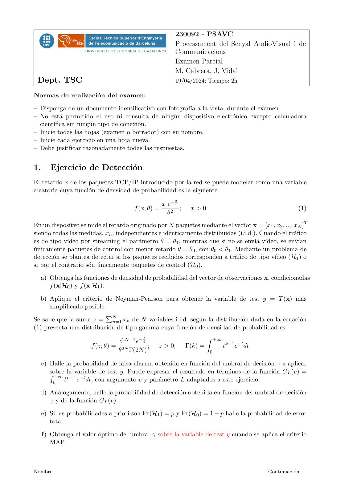
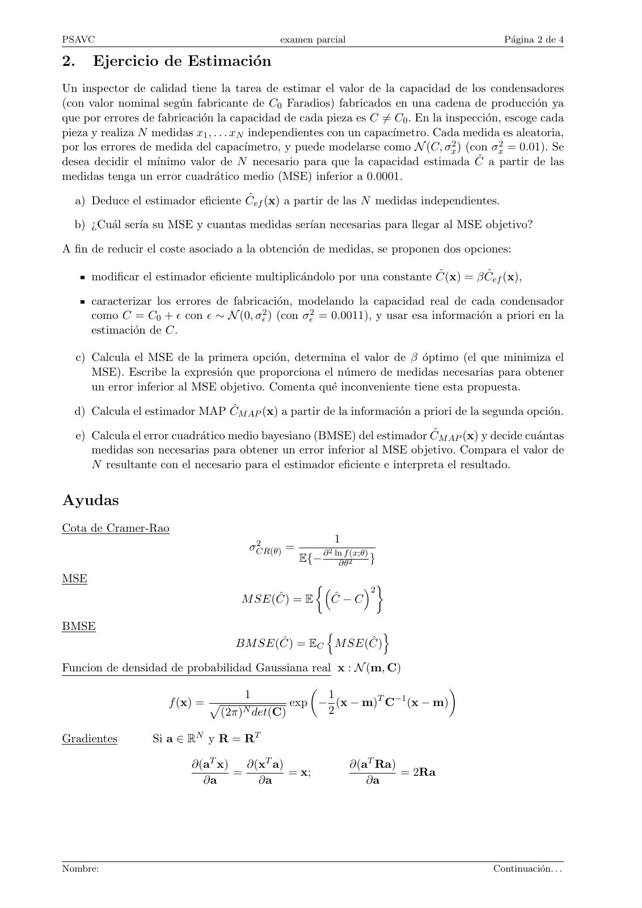
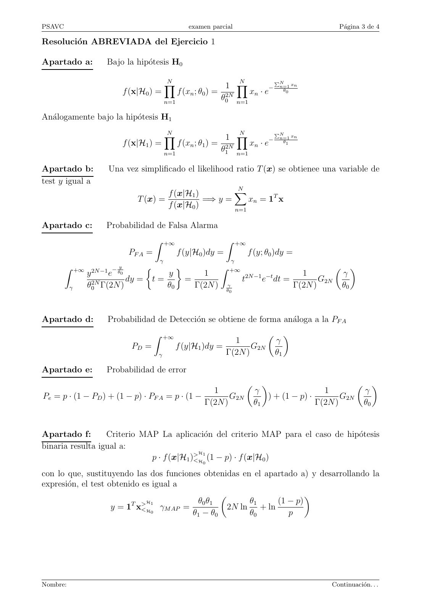
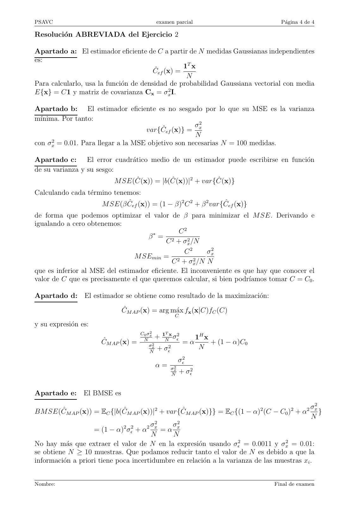

# 2024_04_Parcial_PSAVC

- Source PDF: `Examenes/2024_04_Parcial_PSAVC.pdf`
- PDF title: `2024_04_Parcial_PSAVC`
- Pages: 4
- Note: Transcribed from the embedded PDF text layer. Each page links to a rendered page image so figures, plots, handwriting, and formula layout can be checked against the original.

## Page 1



```text
                                                           230092 - PSAVC
                                                           Processament del Senyal AudioVisual i de
                                                           Communicacions
                                                           Examen Parcial
                                                           M. Cabrera, J. Vidal
 Dept. TSC                                                 19/04/2024; Tiempo: 2h

Normas de realización del examen:
– Disponga de un documento identificativo con fotografı́a a la vista, durante el examen.
– No está permitido el uso ni consulta de ningún dispositivo electrónico excepto calculadora
  cientı́fica sin ningún tipo de conexión.
– Inicie todas las hojas (examen o borrador) con su nombre.
– Inicie cada ejercicio en una hoja nueva.
– Debe justificar razonadamente todas las respuestas.


1.      Ejercicio de Detección
El retardo x de los paquetes TCP/IP introducido por la red se puede modelar como una variable
aleatoria cuya función de densidad de probabilidad es la siguiente.
                                                           x
                                                      x e− θ
                                         f (x; θ) =          ;    x>0                                        (1)
                                                        θ2
En un dispositvo se mide el retardo originado por N paquetes mediante el vector x = [x1 , x2 , ..., xN ]T
siendo todas las medidas, xn , independientes e idénticamente distribuidas (i.i.d.). Cuando el tráfico
es de tipo vı́deo por streaming el parámetro θ = θ1 , mientras que si no se envı́a vı́deo, se envı́an
únicamente paquetes de control con menor retardo θ = θ0 , con θ0 < θ1 . Mediante un problema de
detección se plantea detectar si los paquetes recibidos corresponden a tráfico de tipo vı́deo (H1 ) o
si por el contrario són únicamente paquetes de control (H0 ).
  a) Obtenga las funciones de densidad de probabilidad del vector de observaciones x, condicionadas
     f (x|H0 ) y f (x|H1 ).

  b) Aplique el criterio de Neyman-Pearson para obtener la variable de test y = T (x) más
      simplificado posible.
Se sabe que la suma z = N
                           P
                             n=1 xn de N variables i.i.d. según la distribución dada en la ecuación
(1) presenta una distribución de tipo gamma cuya función de densidad de probabilidad es:
                                             z
                                  z 2N −1 e− θ
                                                                          Z +∞
                       f (z; θ) = 2N           ;   z > 0;        Γ(k) =          tk−1 e−t dt
                                 θ Γ(2N )                                 0

     c) Halle la probabilidad de falsa alarma obtenida en función del umbral de decisión γ a aplicar
        Rsobre  la variable de test y. Puede expresar el resultado en términos de la función GL (v) =
           +∞ L−1 −t
          v   t     e dt, con argumento v y parámetro L adaptados a este ejercicio.

  d) Análogamente, halle la probabilidad de detección obtenida en función del umbral de decisión
     γ y de la función GL (v).

     e) Si las probabilidades a priori son Pr(H1 ) = p y Pr(H0 ) = 1 − p halle la probabilidad de error
        total.

     f) Obtenga el valor óptimo del umbral γ sobre la variable de test y cuando se aplica el criterio
        MAP.


Nombre:                                                                                        Continuación. . .
```

## Page 2



```text
PSAVC                                         examen parcial                               Página 2 de 4

2.      Ejercicio de Estimación
Un inspector de calidad tiene la tarea de estimar el valor de la capacidad de los condensadores
(con valor nominal según fabricante de C0 Faradios) fabricados en una cadena de producción ya
que por errores de fabricación la capacidad de cada pieza es C ̸= C0 . En la inspección, escoge cada
pieza y realiza N medidas x1 , . . . xN independientes con un capacı́metro. Cada medida es aleatoria,
por los errores de medida del capacı́metro, y puede modelarse como N (C, σx2 ) (con σx2 = 0.01). Se
desea decidir el mı́nimo valor de N necesario para que la capacidad estimada Ĉ a partir de las
medidas tenga un error cuadrático medio (MSE) inferior a 0.0001.

  a) Deduce el estimador eficiente Ĉef (x) a partir de las N medidas independientes.

  b) ¿Cuál serı́a su MSE y cuantas medidas serı́an necesarias para llegar al MSE objetivo?

A fin de reducir el coste asociado a la obtención de medidas, se proponen dos opciones:

        modificar el estimador eficiente multiplicándolo por una constante Ĉ(x) = β Ĉef (x),

        caracterizar los errores de fabricación, modelando la capacidad real de cada condensador
        como C = C0 + ϵ con ϵ ∼ N (0, σϵ2 ) (con σϵ2 = 0.0011), y usar esa información a priori en la
        estimación de C.

     c) Calcula el MSE de la primera opción, determina el valor de β óptimo (el que minimiza el
        MSE). Escribe la expresión que proporciona el número de medidas necesarias para obtener
        un error inferior al MSE objetivo. Comenta qué inconveniente tiene esta propuesta.

  d) Calcula el estimador MAP ĈM AP (x) a partir de la información a priori de la segunda opción.

     e) Calcula el error cuadrático medio bayesiano (BMSE) del estimador ĈM AP (x) y decide cuántas
        medidas son necesarias para obtener un error inferior al MSE objetivo. Compara el valor de
        N resultante con el necesario para el estimador eficiente e interpreta el resultado.


Ayudas
Cota de Cramer-Rao
                                        2                  1
                                       σCR(θ) =        2
                                                  E{− ∂ ln∂θf 2(x;θ) }
MSE                                                               2 
                                      M SE(Ĉ) = E         Ĉ − C

BMSE                                               n        o
                                     BM SE(Ĉ) = EC M SE(Ĉ)

Funcion de densidad de probabilidad Gaussiana real x : N (m, C)
                                                                    
                                      1           1       T −1
                       f (x) = p             exp − (x − m) C (x − m)
                                (2π)N det(C)      2

Gradientes          Si a ∈ RN y R = RT

                            ∂(aT x)   ∂(xT a)                  ∂(aT Ra)
                                    =         = x;                      = 2Ra
                              ∂a        ∂a                        ∂a


Nombre:                                                                                  Continuación. . .
```

## Page 3



```text
PSAVC                                              examen parcial                                    Página 3 de 4

Resolución ABREVIADA del Ejercicio 1

Apartado a:          Bajo la hipótesis H0

                                          N                         N                    PN
                                          Y                       1 Y                −    n=1 xn
                           f (x|H0 ) =          f (xn ; θ0 ) =              xn · e         θ0

                                          n=1
                                                                 θ02N n=1

Análogamente bajo la hipótesis H1
                                          N                         N                    PN
                                          Y                       1 Y                −    n=1 xn
                           f (x|H1 ) =          f (xn ; θ1 ) =              xn · e         θ1

                                          n=1
                                                                 θ12N n=1

Apartado b:          Una vez simplificado el likelihood ratio T (x) se obtienee una variable de
test y igual a
                                                         N
                                       f (x|H1 )        X
                               T (x) =           =⇒ y =     xn = 1T x
                                       f (x|H0 )        n=1

Apartado c:         Probabilidad de Falsa Alarma
                                     Z +∞                         Z +∞
                            PF A =              f (y|H0 )dy =            f (y; θ0 )dy =
                                      γ                            γ
        Z +∞          −y                            Z +∞
               y 2N −1 e θ0
                                                                                
                                       y        1         2N −1 −t      1         γ
                            dy =    t=      =            t     e dt =        G2N
          γ    θ02N Γ(2N )             θ0     Γ(2N ) θγ               Γ(2N )      θ0
                                                                   0


Apartado d:          Probabilidad de Detección se obtiene de forma análoga a la PF A
                                     Z +∞                                                    
                                                              1                          γ
                             PD =             f (y|H1 )dy =        G2N
                                      γ                     Γ(2N )                       θ1

Apartado e:         Probabilidad de error
                                                                                                         
                                                 1                           γ                   1         γ
Pe = p · (1 − PD ) + (1 − p) · PF A = p · (1 −        G2N                        ) + (1 − p) ·        G2N
                                               Γ(2N )                        θ1                Γ(2N )      θ0


Apartado f:       Criterio MAP La aplicación del criterio MAP para el caso de hipótesis
binaria resulta igual a:
                                            H1
                             p · f (x|H1 )>
                                          <H (1 − p) · f (x|H0 )
                                                        0

con lo que, sustituyendo las dos funciones obtenidas en el apartado a) y desarrollando la
expresión, el test obtenido es igual a
                                                                     
                          T >H1          θ0 θ1         θ1     (1 − p)
                     y = 1 x<H γM AP =            2N ln + ln
                               0        θ1 − θ0        θ0        p


Nombre:                                                                                            Continuación. . .
```

## Page 4



```text
PSAVC                                     examen parcial                         Página 4 de 4

Resolución ABREVIADA del Ejercicio 2

Apartado a: El estimador eficiente de C a partir de N medidas Gaussianas independientes
es:
                                                   1T x
                                        Ĉef (x) =
                                                    N
Para calcularlo, usa la función de densidad de probabilidad Gaussiana vectorial con media
E{x} = C1 y matriz de covarianza Cx = σx2 I.

Apartado b: El estimador eficiente es no sesgado por lo que su MSE es la varianza
mı́nima. Por tanto:
                                                    σ2
                                    var{Ĉef (x)} = x
                                                    N
con σx2 = 0.01. Para llegar a la MSE objetivo son necesarias N = 100 medidas.

Apartado c: El error cuadrático medio de un estimador puede escribirse en función
de su varianza y su sesgo:
                          M SE(Ĉ(x)) = |b(Ĉ(x))|2 + var{Ĉ(x)}
Calculando cada término tenemos:
                      M SE(β Ĉef (x)) = (1 − β)2 C 2 + β 2 var{Ĉef (x)}
de forma que podemos optimizar el valor de β para minimizar el M SE. Derivando e
igualando a cero obtenemos:
                                               C2
                                    β∗ = 2
                                           C + σx2 /N
                                                 C2     σx2
                                M SEmin = 2
                                            C + σx2 /N N
que es inferior al MSE del estimador eficiente. El inconveniente es que hay que conocer el
valor de C que es precisamente el que queremos calcular, si bien podrı́amos tomar C = C0 .

Apartado d: El estimador se obtiene como resultado de la maximización:

                            ĈM AP (x) = arg máx fx (x|C)fC (C)
                                                 C
y su expresión es:
                                     C0 σx2      T
                                      N
                                              + 1Nx σϵ2     1H x
                      ĈM AP (x) =       σx 2           = α      + (1 − α)C0
                                              + σϵ2          N
                                          N
                                                     σϵ2
                                          α = σ2
                                                N
                                                 x
                                                     + σϵ2


Apartado e: El BMSE es
                                                                                             σ2
BM SE(ĈM AP (x)) = EC {|b(ĈM AP (x))|2 + var{ĈM AP (x)}} = EC {(1 − α)2 (C − C0 )2 + α2 x }
                                                                                             N
                                         2     2
                                       σ     σ
                    = (1 − α)2 σϵ2 + α2 x = α x
                                        N    N
No hay más que extraer el valor de N en la expresión usando σϵ2 = 0.0011 y σx2 = 0.01:
se obtiene N ≥ 10 muestras. Que podamos reducir tanto el valor de N es debido a que la
información a priori tiene poca incertidumbre en relación a la varianza de las muestras xi .


Nombre:                                                                        Final de examen
```
