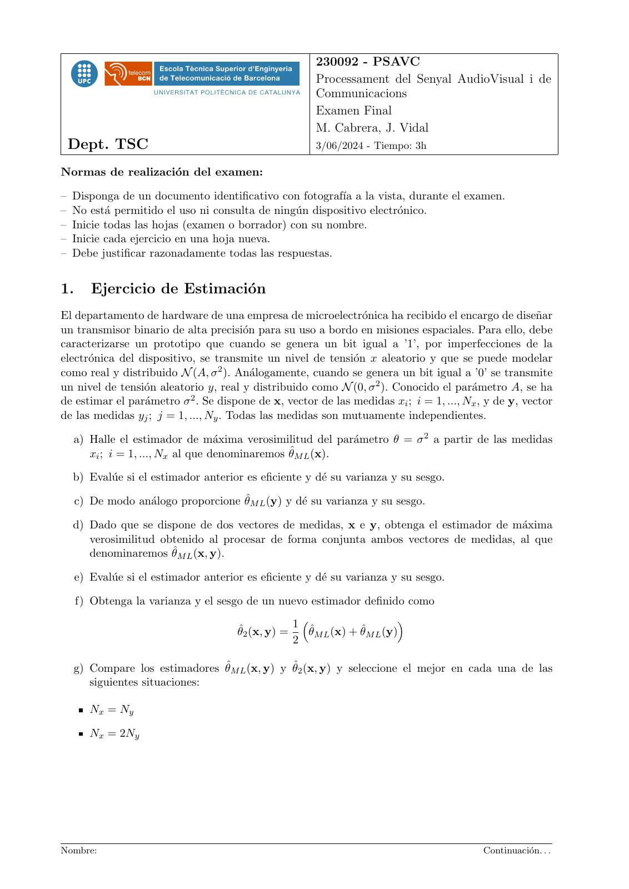
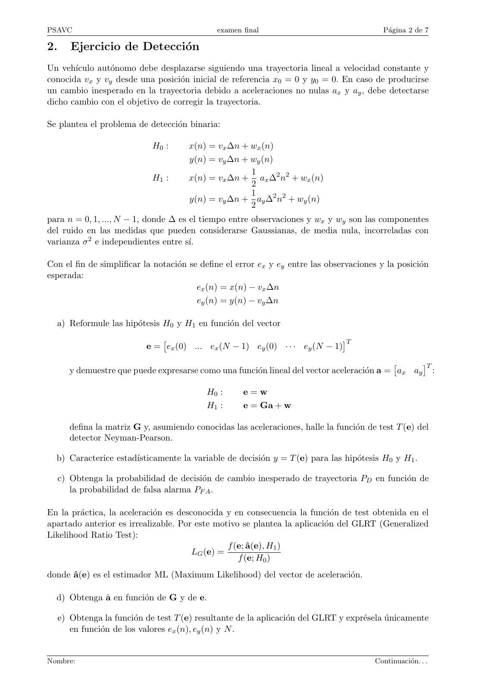
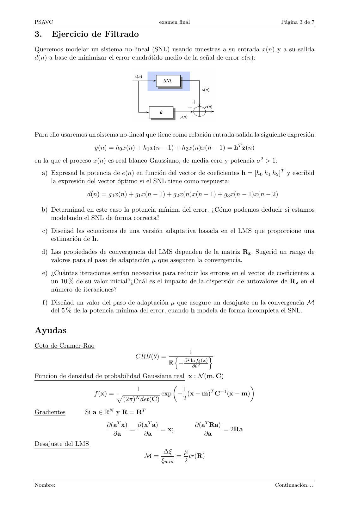
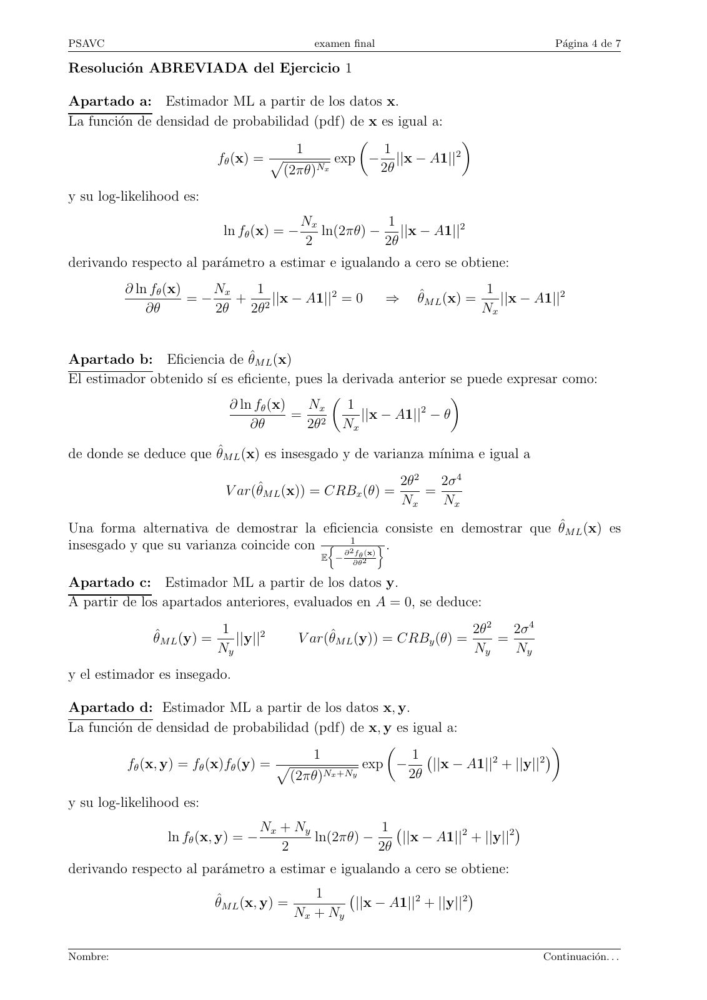
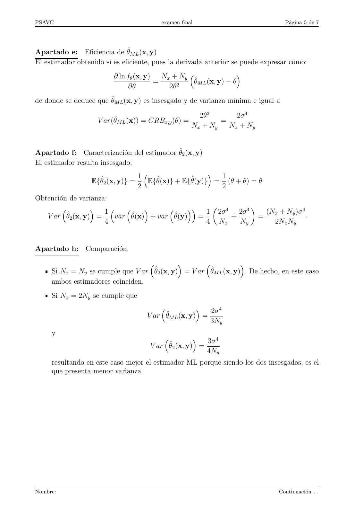
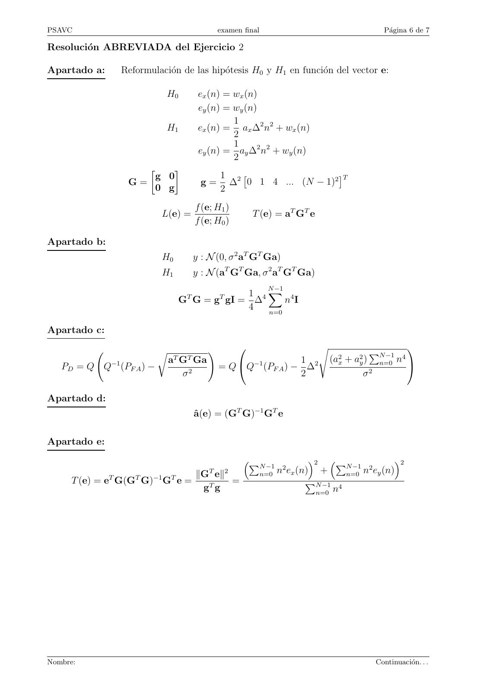
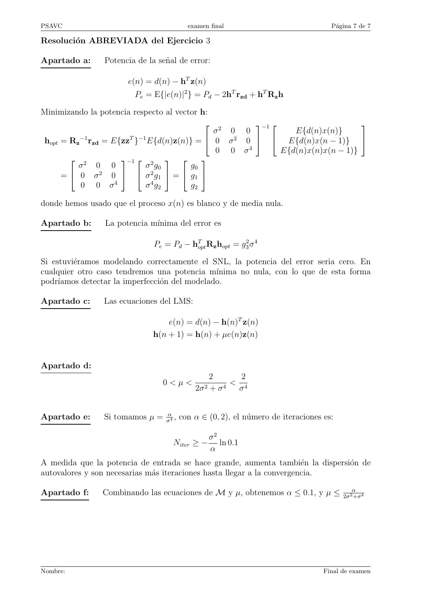

# 2024 06 Final_PSAVC

- Source PDF: `Examenes/2024 06 Final_PSAVC.pdf`
- PDF title: `2024 06 Final_PSAVC`
- Pages: 7
- Note: Transcribed from the embedded PDF text layer. Each page links to a rendered page image so figures, plots, handwriting, and formula layout can be checked against the original.

## Page 1



```text
                                                           230092 - PSAVC
                                                           Processament del Senyal AudioVisual i de
                                                           Communicacions
                                                           Examen Final
                                                           M. Cabrera, J. Vidal
 Dept. TSC                                                 3/06/2024 - Tiempo: 3h

Normas de realización del examen:

– Disponga de un documento identificativo con fotografı́a a la vista, durante el examen.
– No está permitido el uso ni consulta de ningún dispositivo electrónico.
– Inicie todas las hojas (examen o borrador) con su nombre.
– Inicie cada ejercicio en una hoja nueva.
– Debe justificar razonadamente todas las respuestas.


1.      Ejercicio de Estimación
El departamento de hardware de una empresa de microelectrónica ha recibido el encargo de diseñar
un transmisor binario de alta precisión para su uso a bordo en misiones espaciales. Para ello, debe
caracterizarse un prototipo que cuando se genera un bit igual a ’1’, por imperfecciones de la
electrónica del dispositivo, se transmite un nivel de tensión x aleatorio y que se puede modelar
como real y distribuido N (A, σ 2 ). Análogamente, cuando se genera un bit igual a ’0’ se transmite
un nivel de tensión aleatorio y, real y distribuido como N (0, σ 2 ). Conocido el parámetro A, se ha
de estimar el parámetro σ 2 . Se dispone de x, vector de las medidas xi ; i = 1, ..., Nx , y de y, vector
de las medidas yj ; j = 1, ..., Ny . Todas las medidas son mutuamente independientes.

  a) Halle el estimador de máxima verosimilitud del parámetro θ = σ 2 a partir de las medidas
     xi ; i = 1, ..., Nx al que denominaremos θ̂M L (x).

  b) Evalúe si el estimador anterior es eficiente y dé su varianza y su sesgo.

     c) De modo análogo proporcione θ̂M L (y) y dé su varianza y su sesgo.

  d) Dado que se dispone de dos vectores de medidas, x e y, obtenga el estimador de máxima
     verosimilitud obtenido al procesar de forma conjunta ambos vectores de medidas, al que
     denominaremos θ̂M L (x, y).

     e) Evalúe si el estimador anterior es eficiente y dé su varianza y su sesgo.

     f) Obtenga la varianza y el sesgo de un nuevo estimador definido como
                                                      1                      
                                       θ̂2 (x, y) =      θ̂M L (x) + θ̂M L (y)
                                                      2

  g) Compare los estimadores θ̂M L (x, y) y θ̂2 (x, y) y seleccione el mejor en cada una de las
     siguientes situaciones:

        Nx = Ny

        Nx = 2Ny


Nombre:                                                                                    Continuación. . .
```

## Page 2



```text
PSAVC                                          examen final                                Página 2 de 7

2.      Ejercicio de Detección
Un vehı́culo autónomo debe desplazarse siguiendo una trayectoria lineal a velocidad constante y
conocida vx y vy desde una posición inicial de referencia x0 = 0 y y0 = 0. En caso de producirse
un cambio inesperado en la trayectoria debido a aceleraciones no nulas ax y ay , debe detectarse
dicho cambio con el objetivo de corregir la trayectoria.

Se plantea el problema de detección binaria:

                              H0 :      x(n) = vx ∆n + wx (n)
                                        y(n) = vy ∆n + wy (n)
                                                       1
                              H1 :      x(n) = vx ∆n + ax ∆2 n2 + wx (n)
                                                       2
                                                       1
                                        y(n) = vy ∆n + ay ∆2 n2 + wy (n)
                                                       2
para n = 0, 1, ..., N − 1, donde ∆ es el tiempo entre observaciones y wx y wy son las componentes
del ruido en las medidas que pueden considerarse Gaussianas, de media nula, incorreladas con
varianza σ 2 e independientes entre sı́.

Con el fin de simplificar la notación se define el error ex y ey entre las observaciones y la posición
esperada:
                                         ex (n) = x(n) − vx ∆n
                                          ey (n) = y(n) − vy ∆n

  a) Reformule las hipótesis H0 y H1 en función del vector
                                                                            T
                            e = ex (0) ... ex (N − 1) ey (0) · · · ey (N − 1)
                                                                                                  T
        y demuestre que puede expresarse como una función lineal del vector aceleración a = ax ay :

                                            H0 :      e=w
                                            H1 :      e = Ga + w

        defina la matriz G y, asumiendo conocidas las aceleraciones, halle la función de test T (e) del
        detector Neyman-Pearson.

  b) Caracterice estadı́sticamente la variable de decisión y = T (e) para las hipótesis H0 y H1 .

     c) Obtenga la probabilidad de decisión de cambio inesperado de trayectoria PD en función de
        la probabilidad de falsa alarma PF A .

En la práctica, la aceleración es desconocida y en consecuencia la función de test obtenida en el
apartado anterior es irrealizable. Por este motivo se plantea la aplicación del GLRT (Generalized
Likelihood Ratio Test):
                                                 f (e; â(e), H1 )
                                        LG (e) =
                                                    f (e; H0 )
donde â(e) es el estimador ML (Maximum Likelihood) del vector de aceleración.

  d) Obtenga â en función de G y de e.

     e) Obtenga la función de test T (e) resultante de la aplicación del GLRT y exprésela únicamente
        en función de los valores ex (n), ey (n) y N .


Nombre:                                                                                  Continuación. . .
```

## Page 3



```text
PSAVC                                          examen final                                 Página 3 de 7

3.      Ejercicio de Filtrado
Queremos modelar un sistema no-lineal (SNL) usando muestras a su entrada x(n) y a su salida
d(n) a base de minimizar el error cuadrátido medio de la señal de error e(n):


Para ello usaremos un sistema no-lineal que tiene como relación entrada-salida la siguiente expresión:
                       y(n) = h0 x(n) + h1 x(n − 1) + h2 x(n)x(n − 1) = hT z(n)
en la que el proceso x(n) es real blanco Gaussiano, de media cero y potencia σ 2 > 1.
  a) Expresad la potencia de e(n) en función del vector de coeficientes h = [h0 h1 h2 ]T y escribid
     la expresión del vector óptimo si el SNL tiene como respuesta:
                     d(n) = g0 x(n) + g1 x(n − 1) + g2 x(n)x(n − 1) + g3 x(n − 1)x(n − 2)

  b) Determinad en este caso la potencia mı́nima del error. ¿Cómo podemos deducir si estamos
     modelando el SNL de forma correcta?
     c) Diseñad las ecuaciones de una versión adaptativa basada en el LMS que proporcione una
        estimación de h.
  d) Las propiedades de convergencia del LMS dependen de la matriz Rz . Sugerid un rango de
     valores para el paso de adaptación µ que aseguren la convergencia.
     e) ¿Cuántas iteraciones serı́an necesarias para reducir los errores en el vector de coeficientes a
        un 10 % de su valor inicial?¿Cuál es el impacto de la dispersión de autovalores de Rz en el
        número de iteraciones?
     f) Diseñad un valor del paso de adaptación µ que asegure un desajuste en la convergencia M
        del 5 % de la potencia mı́nima del error, cuando h modela de forma incompleta el SNL.


Ayudas
Cota de Cramer-Rao
                                                         1
                                      CRB(θ) =      n 2              o
                                                   E − ∂ ln∂θf2θ (x)
Funcion de densidad de probabilidad Gaussiana real x : N (m, C)
                                                                 
                                  1              1         T −1
                   f (x) = p              exp − (x − m) C (x − m)
                             (2π)N det(C)        2

Gradientes          Si a ∈ RN y R = RT
                            ∂(aT x)   ∂(xT a)                 ∂(aT Ra)
                                    =         = x;                     = 2Ra
                              ∂a        ∂a                       ∂a
Desajuste del LMS
                                                 ∆ξ   µ
                                          M=         = tr(R)
                                                ξmin  2


Nombre:                                                                                  Continuación. . .
```

## Page 4



```text
PSAVC                                           examen final                                   Página 4 de 7

Resolución ABREVIADA del Ejercicio 1

Apartado a: Estimador ML a partir de los datos x.
La función de densidad de probabilidad (pdf) de x es igual a:
                                                                
                                     1             1           2
                        fθ (x) = p         exp − ||x − A1||
                                   (2πθ)Nx         2θ

y su log-likelihood es:
                                              Nx          1
                             ln fθ (x) = −       ln(2πθ) − ||x − A1||2
                                              2           2θ
derivando respecto al parámetro a estimar e igualando a cero se obtiene:
          ∂ ln fθ (x)    Nx   1                                                    1
                      =−    + 2 ||x − A1||2 = 0                ⇒     θ̂M L (x) =      ||x − A1||2
              ∂θ         2θ  2θ                                                    Nx


Apartado b: Eficiencia de θ̂M L (x)
El estimador obtenido sı́ es eficiente, pues la derivada anterior se puede expresar como:
                                                                 
                           ∂ ln fθ (x)    Nx     1           2
                                       = 2         ||x − A1|| − θ
                                ∂θ        2θ    Nx

de donde se deduce que θ̂M L (x) es insesgado y de varianza mı́nima e igual a
                                                                   2θ2   2σ 4
                              V ar(θ̂M L (x)) = CRBx (θ) =             =
                                                                   Nx    Nx
Una forma alternativa de demostrar la eficiencia consiste en demostrar que θ̂M L (x) es
insesgado y que su varianza coincide con  ∂ 21f (x)  .
                                                 E −    θ
                                                       ∂θ 2


Apartado c: Estimador ML a partir de los datos y.
A partir de los apartados anteriores, evaluados en A = 0, se deduce:
                            1                                                   2θ2   2σ 4
              θ̂M L (y) =      ||y||2        V ar(θ̂M L (y)) = CRBy (θ) =           =
                            Ny                                                  Ny    Ny
y el estimador es insegado.

Apartado d: Estimador ML a partir de los datos x, y.
La función de densidad de probabilidad (pdf) de x, y es igual a:
                                                                                 
                                          1              1            2       2
                                                                                
          fθ (x, y) = fθ (x)fθ (y) = p             exp −    ||x − A1|| + ||y||
                                       (2πθ)Nx +Ny       2θ

y su log-likelihood es:
                                    Nx + Ny           1
                                                         ||x − A1||2 + ||y||2
                                                                              
                 ln fθ (x, y) = −           ln(2πθ) −
                                       2              2θ
derivando respecto al parámetro a estimar e igualando a cero se obtiene:
                                                1
                                                     ||x − A1||2 + ||y||2
                                                                          
                            θ̂M L (x, y) =
                                             Nx + Ny


Nombre:                                                                                      Continuación. . .
```

## Page 5



```text
PSAVC                                    examen final                              Página 5 de 7


Apartado e: Eficiencia de θ̂M L (x, y)
El estimador obtenido sı́ es eficiente, pues la derivada anterior se puede expresar como:
                         ∂ ln fθ (x, y)   Nx + Ny                   
                                        =           θ̂M L (x, y) − θ
                               ∂θ           2θ2
de donde se deduce que θ̂M L (x, y) es insesgado y de varianza mı́nima e igual a

                                                       2θ2       2σ 4
                    V ar(θ̂M L (x)) = CRBx,y (θ) =           =
                                                     Nx + Ny   Nx + Ny


Apartado f: Caracterización del estimador θ̂2 (x, y)
El estimador resulta insesgado:
                                  1                    1
                  E{θ̂2 (x, y)} =   E{θ̂(x)} + E{θ̂(y)} = (θ + θ) = θ
                                  2                      2
Obtención de varianza:
                  1                     1  2σ 4 2σ 4  (N + N )σ 4
                                                                  x    y
   V ar θ̂2 (x, y) =    var θ̂(x) + var θ̂(y) =         +      =
                      4                         4 Nx      Ny      2Nx Ny


Apartado h: Comparación:
                                                              
     Si Nx = Ny se cumple que V ar θ̂2 (x, y) = V ar θ̂M L (x, y) . De hecho, en este caso
     ambos estimadores coinciden.
     Si Nx = 2Ny se cumple que
                                                      2σ 4
                                    V ar θ̂M L (x, y) =
                                                        3Ny
     y
                                                     3σ 4
                                     V ar θ̂2 (x, y) =
                                                       4Ny
     resultando en este caso mejor el estimador ML porque siendo los dos insesgados, es el
     que presenta menor varianza.


Nombre:                                                                        Continuación. . .
```

## Page 6



```text
PSAVC                                            examen final                                             Página 6 de 7

Resolución ABREVIADA del Ejercicio 2

Apartado a:      Reformulación de las hipótesis H0 y H1 en función del vector e:

                             H0            ex (n) = wx (n)
                                           ey (n) = wy (n)
                                                    1
                             H1            ex (n) = ax ∆2 n2 + wx (n)
                                                    2
                                                    1
                                           ey (n) = ay ∆2 n2 + wy (n)
                                                    2
                                
                     g 0                         1 2                   T
                  G=                        g=     ∆ 0 1 4 ... (N − 1)2
                     0 g                         2
                                          f (e; H1 )
                            L(e) =                         T (e) = aT GT e
                                          f (e; H0 )

Apartado b:
                            H0            y : N (0, σ 2 aT GT Ga)
                            H1            y : N (aT GT Ga, σ 2 aT GT Ga)
                                                 N −1
                                     T        1 4X 4
                                                 T
                                  G G = g gI = ∆      nI
                                              4  n=0

Apartado c:
                                                                                   s                               
                            r                !                                                         PN −1
                                aT GT Ga                           1                    (a2x + a2y )     n=0   n4
   PD = Q Q−1 (PF A ) −                          = Q Q−1 (PF A ) − ∆2                                              
                                     σ2                            2                              σ2

Apartado d:
                                          â(e) = (GT G)−1 GT e

Apartado e:
                                                        P                     2       P                     2
                                                                N −1 2                       N −1 2
                                          ∥GT e∥2               n=0 n ex (n) +               n=0 n ey (n)
      T (e) = eT G(GT G)−1 GT e =                 =                        PN −1
                                           gT g                                 n=0 n
                                                                                     4


Nombre:                                                                                                 Continuación. . .
```

## Page 7



```text
PSAVC                                   examen final                             Página 7 de 7

Resolución ABREVIADA del Ejercicio 3

Apartado a:     Potencia de la señal de error:

                       e(n) = d(n) − hT z(n)
                         Pe = E{|e(n)|2 } = Pd − 2hT rzd + hT Rz h

Minimizando la potencia respecto al vector h:
                                                     −1                      
                                              σ2 0 0           E{d(n)x(n)}
 hopt = Rz −1 rzd = E{zzT }−1 E{d(n)z(n)} =  0 σ 2 0   E{d(n)x(n − 1)} 
                                              0 0 σ4        E{d(n)x(n)x(n − 1)}
         2           −1  2            
          σ     0 0          σ g0       g0
      =  0 σ 2 0   σ 2 g1  =  g1 
           0 0 σ4            σ 4 g2     g2

donde hemos usado que el proceso x(n) es blanco y de media nula.

Apartado b:      La potencia mı́nima del error es

                              Pe = Pd − hTopt Rz hopt = g32 σ 4

Si estuviéramos modelando correctamente el SNL, la potencia del error seria cero. En
cualquier otro caso tendremos una potencia mı́nima no nula, con lo que de esta forma
podrı́amos detectar la imperfección del modelado.

Apartado c:     Las ecuaciones del LMS:

                                  e(n) = d(n) − h(n)T z(n)
                              h(n + 1) = h(n) + µe(n)z(n)


Apartado d:
                                               2            2
                                 0<µ<                   <
                                           2σ 2 + σ 4       σ4


Apartado e:     Si tomamos µ = σα4 , con α ∈ (0, 2), el número de iteraciones es:

                                             σ2
                                    Niter ≥ − ln 0.1
                                             α
A medida que la potencia de entrada se hace grande, aumenta también la dispersión de
autovalores y son necesarias más iteraciones hasta llegar a la convergencia.

Apartado f:     Combinando las ecuaciones de M y µ, obtenemos α ≤ 0.1, y µ ≤ 2σ2α+σ4


Nombre:                                                                        Final de examen
```
