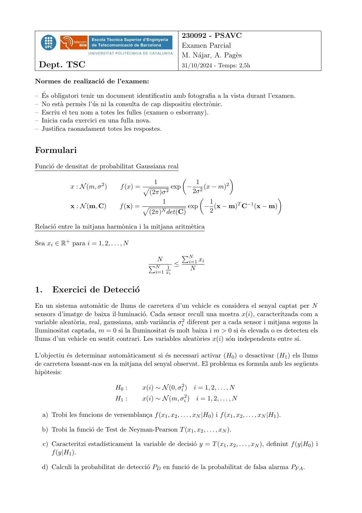
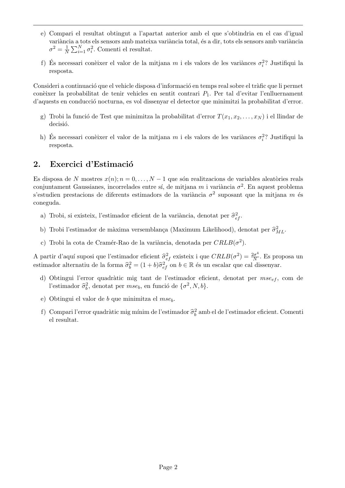
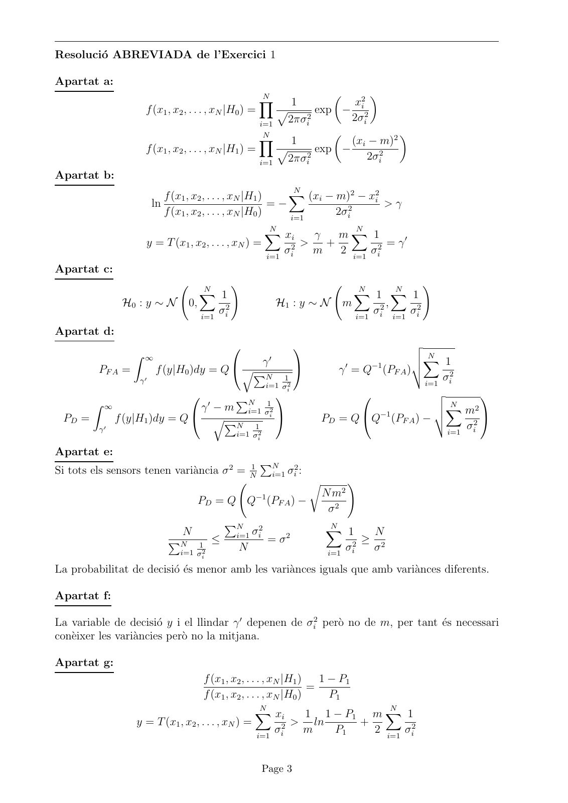
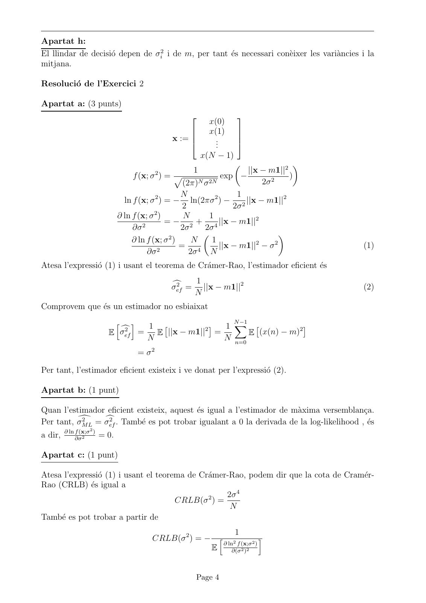
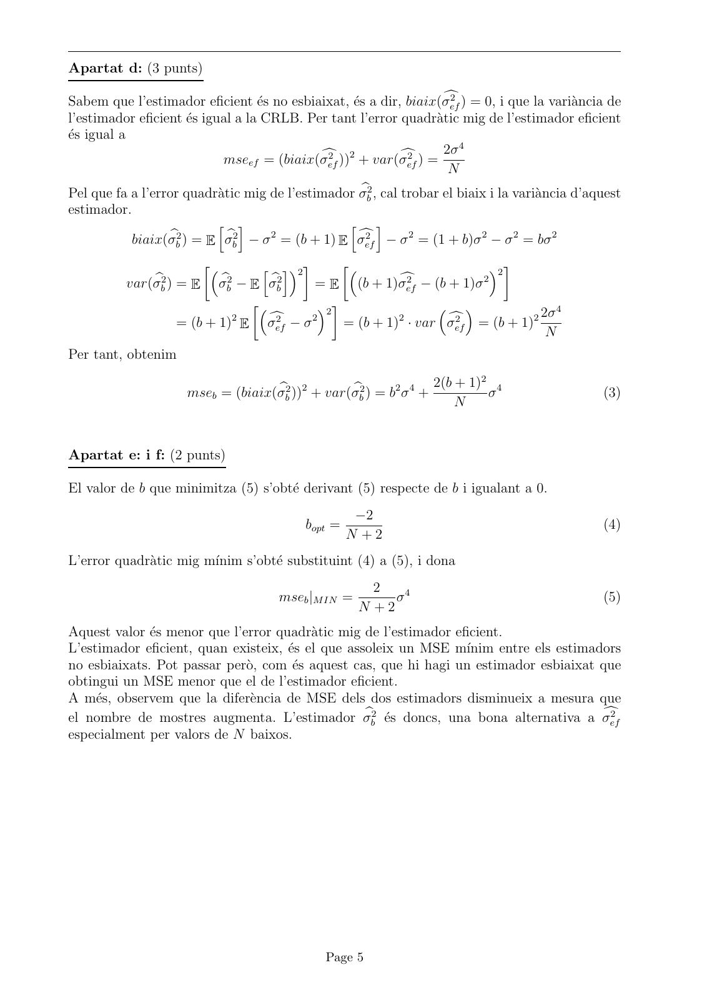

# 2024-11_Parcial_PSAVC_Nov24-Solucio

- Source PDF: `Examenes/2024-11_Parcial_PSAVC_Nov24-Solucio.pdf`
- PDF title: `2024-11_Parcial_PSAVC_Nov24-Solucio`
- Pages: 5
- Note: Transcribed from the embedded PDF text layer. Each page links to a rendered page image so figures, plots, handwriting, and formula layout can be checked against the original.

## Page 1



```text
                                                              230092 - PSAVC
                                                              Examen Parcial
                                                              M. Nájar, A. Pagès
 Dept. TSC                                                    31/10/2024 - Temps: 2,5h

Normes de realizació de l’examen:

– És obligatori tenir un document identificatiu amb fotografia a la vista durant l’examen.
– No està permès l’ús ni la consulta de cap dispositiu electrònic.
– Escriu el teu nom a totes les fulles (examen o esborrany).
– Inicia cada exercici en una fulla nova.
– Justifica raonadament totes les respostes.


Formulari
Funció de densitat de probabilitat Gaussiana real
                                                                      
                            2                    1          1        2
               x : N (m, σ )       f (x) = p         exp − 2 (x − m)
                                             (2π)σ 2       2σ
                                                                               
                                                 1             1         T −1
               x : N (m, C)        f (x) = p             exp − (x − m) C (x − m)
                                            (2π)N det(C)       2

Relació entre la mitjana harmònica i la mitjana aritmètica

Sea xi ∈ R+ para i = 1, 2, . . . , N
                                                              PN
                                                  N               i=1 xi
                                              PN     1
                                                          ≤
                                                 i=1 xi
                                                                  N


1.      Exercici de Detecció
En un sistema automàtic de llums de carretera d’un vehicle es considera el senyal captat per N
sensors d’imatge de baixa il·luminació. Cada sensor recull una mostra x(i), caracteritzada com a
variable aleatòria, real, gaussiana, amb variància σi2 diferent per a cada sensor i mitjana segons la
lluminositat captada, m = 0 si la lluminositat és molt baixa i m > 0 si és elevada o es detecten els
llums d’un vehicle en sentit contrari. Les variables aleatòries x(i) són independents entre sı́.

L’objectiu és determinar automàticament si és necessari activar (H0 ) o desactivar (H1 ) els llums
de carretera basant-nos en la mitjana del senyal observat. El problema es formula amb les següents
hipòtesis:

                                 H0 :       x(i) ∼ N (0, σi2 )     i = 1, 2, . . . , N
                                 H1 :       x(i) ∼ N (m, σi2 )        i = 1, 2, . . . , N

  a) Trobi les funcions de versemblança f (x1 , x2 , . . . , xN |H0 ) i f (x1 , x2 , . . . , xN |H1 ).

  b) Trobi la funció de Test de Neyman-Pearson T (x1 , x2 , . . . , xN ).

     c) Caracteritzi estadı́sticament la variable de decisió y = T (x1 , x2 , . . . , xN ), definint f (y|H0 ) i
        f (y|H1 ).

  d) Calculi la probabilitat de detecció PD en funció de la probabilitat de falsa alarma PF A .
```

## Page 2



```text
     e) Compari el resultat obtingut a l’apartat anterior amb el que s’obtindria en el cas d’igual
        variànciaPa tots els sensors amb mateixa variància total, és a dir, tots els sensors amb variància
        σ 2 = N1 N       2
                    i=1 σi . Comenti el resultat.

     f) És necessari conèixer el valor de la mitjana m i els valors de les variànces σi2 ? Justifiqui la
        resposta.

Consideri a continuació que el vehicle disposa d’informació en temps real sobre el tràfic que li permet
conèixer la probabilitat de tenir vehicles en sentit contrari P1 . Per tal d’evitar l’enlluernament
d’aquests en conducció nocturna, es vol dissenyar el detector que minimitzi la probabilitat d’error.

  g) Trobi la funció de Test que minimitza la probabilitat d’error T (x1 , x2 , . . . , xN ) i el llindar de
     decisió.

  h) És necessari conèixer el valor de la mitjana m i els valors de les variànces σi2 ? Justifiqui la
     resposta.


2.      Exercici d’Estimació
Es disposa de N mostres x(n); n = 0, . . . , N − 1 que són realitzacions de variables aleatòries reals
conjuntament Gaussianes, incorrelades entre sı́, de mitjana m i variància σ 2 . En aquest problema
s’estudien prestacions de diferents estimadors de la variància σ 2 suposant que la mitjana m és
coneguda.

  a) Trobi, si existeix, l’estimador eficient de la variància, denotat per σ 2 .
                                                                            bef

  b) Trobi l’estimador de màxima versemblança (Maximum Likelihood), denotat per σ
                                                                                  bM2 .
                                                                                     L

     c) Trobi la cota de Cramér-Rao de la variància, denotada per CRLB(σ 2 ).
                                                                                           4
A partir d’aquı́ suposi que l’estimador eficient σ 2 existeix i que CRLB(σ 2 ) = 2σ . Es proposa un
                                                 bef                               N
estimador alternatiu de la forma σ bb2 = (1 + b)b 2 on b ∈ R és un escalar que cal dissenyar.
                                                σef

  d) Obtingui l’error quadràtic mig tant de l’estimador eficient, denotat per mseef , com de
                 bb2 , denotat per mseb , en funció de {σ 2 , N, b}.
     l’estimador σ

     e) Obtingui el valor de b que minimitza el mseb .

                                                             bb2 amb el de l’estimador eficient. Comenti
     f) Compari l’error quadràtic mig mı́nim de l’estimador σ
        el resultat.


                                                    Page 2
```

## Page 3



```text
Resolució ABREVIADA de l’Exercici 1

Apartat a:
                                                       N
                                                                      x2i
                                                                          
                                                       Y               1
                    f (x1 , x2 , . . . , xN |H0 ) =     p      exp − 2
                                                    i=1  2πσi
                                                             2       2σi
                                                     N
                                                                     (xi − m)2
                                                                              
                                                    Y     1
                    f (x1 , x2 , . . . , xN |H1 ) =            exp −
                                                                          2σi2
                                                        p
                                                             2
                                                    i=1  2πσi
Apartat b:
                                                             N
                           f (x1 , x2 , . . . , xN |H1 )    X   (xi − m)2 − x2i
                        ln                               =−                     >γ
                           f (x1 , x2 , . . . , xN |H0 )    i=1
                                                                      2σi2
                                                           N        N
                                                           X xi
                                                             γ   mX 1
                    y = T (x1 , x2 , . . . , xN ) =      2
                                                           >   +        2
                                                                          = γ′
                                                       σ
                                                    i=1 i
                                                             m   2    σ
                                                                   i=1 i
Apartat c:
                                     N
                                                 !                                    N      N
                                                                                                    !
                                     X 1                                             X   1 X 1
               H0 : y ∼ N       0,                              H1 : y ∼ N         m       ,
                                     i=1
                                           σi2                                          σ2     σ2
                                                                                     i=1 i i=1 i

Apartat d:
                                                                                             v
                  Z ∞                                                                          u N
                                                            ′
                                            γ                                      ′    −1
                                                                                               uX 1
         PF A =         f (y|H0 )dy = Q  qP                                     γ = Q (PF A )t
                   γ′
                                                           N    1                                     σ2
                                                                                                   i=1 i
                                                           i=1 σi2
                                                                                                  v         
                               γ′ − m N     1
        Z ∞                          P                                                               u N
                                       i=1 σi2                                                       uX m2
 PD =         f (y|H1 )dy = Q  qP                                            PD = Q Q−1 (PF A ) − t       2
                                                                                                               
         γ′
                                     N   1
                                                                                                       i=1
                                                                                                           σ i
                                                 i=1 σi2

Apartat e:
                                                       PN
Si tots els sensors tenen variància σ 2 = N1                        2
                                                                i=1 σi :
                                                                           r          !
                                                      −1                       N m2
                                     PD = Q Q (PF A ) −
                                                                                σ2
                                            PN        2                        N
                               N                 i=1 σi                          1            N
                                                                               X
                                                                   2
                                        ≤                   =σ                            ≥
                                                                                   σ2
                           PN      1
                              i=1 σi2
                                                 N                              i=1 i
                                                                                              σ2
La probabilitat de decisió és menor amb les variànces iguals que amb variànces diferents.

Apartat f:

La variable de decisió y i el llindar γ ′ depenen de σi2 però no de m, per tant és necessari
conèixer les variàncies però no la mitjana.

Apartat g:
                                    f (x1 , x2 , . . . , xN |H1 )   1 − P1
                                                                  =
                                    f (x1 , x2 , . . . , xN |H0 )     P1
                                                      N                         N
                                                    X     xi      1 1 − P1 m X 1
                  y = T (x1 , x2 , . . . , xN ) =             > ln         +
                                                     i=1 i
                                                          σ2      m    P1    2 i=1 σi2


                                                           Page 3
```

## Page 4



```text
Apartat h:
El llindar de decisió depen de σi2 i de m, per tant és necessari conèixer les variàncies i la
mitjana.

Resolució de l’Exercici 2

Apartat a: (3 punts)

                                                         x(0)
                                                                 
                                                        x(1)     
                                             x :=         ..     
                                                           .     
                                                       x(N − 1)
                                                                   ||x − m1||2
                                                                                    
                                         2         1
                                 f (x; σ ) = p               exp −               )
                                                 (2π)N σ 2N             2σ 2
                                                N                1
                              ln f (x; σ 2 ) = − ln(2πσ 2 ) − 2 ||x − m1||2
                                                 2              2σ
                                         2
                            ∂ ln f (x; σ )       N       1
                                    2
                                             = − 2 + 4 ||x − m1||2
                                 ∂σ             2σ     2σ
                                              2
                                                                              
                                 ∂ ln f (x; σ )     N     1           2      2
                                                = 4         ||x − m1|| − σ                   (1)
                                      ∂σ 2         2σ    N
Atesa l’expressió (1) i usant el teorema de Crámer-Rao, l’estimador eficient és
                                                   1
                                              2
                                             σc
                                              ef =   ||x − m1||2                             (2)
                                                   N
Comprovem que és un estimador no esbiaixat
                                                     N −1
                        h i
                           2   1            2
                                                  1 X               2
                                                                        
                         σ
                         c
                       E ef  =   E ||x − m1||    =        E (x(n) − m)
                               N                   N n=0
                                  = σ2

Per tant, l’estimador eficient existeix i ve donat per l’expressió (2).

Apartat b: (1 punt)

Quan l’estimador eficient existeix, aquest és igual a l’estimador de màxima versemblança.
           2     2
Per tant, σM
          d = σc
             L   ef . També es pot trobar igualant a 0 la derivada de la log-likelihood , és
                2
a dir, ∂ ln ∂σ
            f (x;σ )
               2     = 0.

Apartat c: (1 punt)

Atesa l’expressió (1) i usant el teorema de Crámer-Rao, podem dir que la cota de Cramér-
Rao (CRLB) és igual a
                                                    2σ 4
                                       CRLB(σ 2 ) =
                                                     N
També es pot trobar a partir de
                                                           1
                                      CRLB(σ 2 ) = − h 2              i
                                                      ∂ ln f (x;σ 2 )
                                                    E     ∂(σ 2 )2


                                                    Page 4
```

## Page 5



```text
Apartat d: (3 punts)
                                                                      2
Sabem que l’estimador eficient és no esbiaixat, és a dir, biaix(σc  ef ) = 0, i que la variància de
l’estimador eficient és igual a la CRLB. Per tant l’error quadràtic mig de l’estimador eficient
és igual a
                                              2    2          2      2σ 4
                            mseef = (biaix(σc ef ))  + var( σc
                                                              ef ) =
                                                                      N
Pel que fa a l’error quadràtic mig de l’estimador σb2 , cal trobar el biaix i la variància d’aquest
                                                        b
estimador.
                             h i                    h i
                                                            2          2   2     2
             biaix(σbb2 ) = E σbb2 − σ 2 = (b + 1) E σc
                                                      2
                                                      ef − σ = (1 + b)σ − σ = bσ

                               h i2                               2 
                                                           2          2
          var(σbb2 ) = E    2
                           σb − E σb
                           b       b2
                                          = E (b + 1)σef − (b + 1)σ
                                                         c

                                                                                      4
                                         2 
                                                                                 2 2σ
                                                                 
                             2           2
                                   c2
                    = (b + 1) E σef − σ         = (b + 1)2 · var σc
                                                                  2
                                                                  ef =  (b  + 1)
                                                                                    N
Per tant, obtenim
                                                                            2
                                                                    2(b + 1) 4
                     mseb = (biaix(σbb2 ))2 + var(σbb2 ) = b2 σ 4 +         σ                     (3)
                                                                        N


Apartat e: i f: (2 punts)

El valor de b que minimitza (5) s’obté derivant (5) respecte de b i igualant a 0.
                                                     −2
                                           bopt =                                                 (4)
                                                    N +2
L’error quadràtic mig mı́nim s’obté substituint (4) a (5), i dona
                                                       2
                                      mseb |M IN =        σ4                                      (5)
                                                     N +2
Aquest valor és menor que l’error quadràtic mig de l’estimador eficient.
L’estimador eficient, quan existeix, és el que assoleix un MSE mı́nim entre els estimadors
no esbiaixats. Pot passar però, com és aquest cas, que hi hagi un estimador esbiaixat que
obtingui un MSE menor que el de l’estimador eficient.
A més, observem que la diferència de MSE dels dos estimadors disminueix a mesura que
el nombre de mostres augmenta. L’estimador σbb2 és doncs, una bona alternativa a σc     2
                                                                                         ef
especialment per valors de N baixos.


                                               Page 5
```
