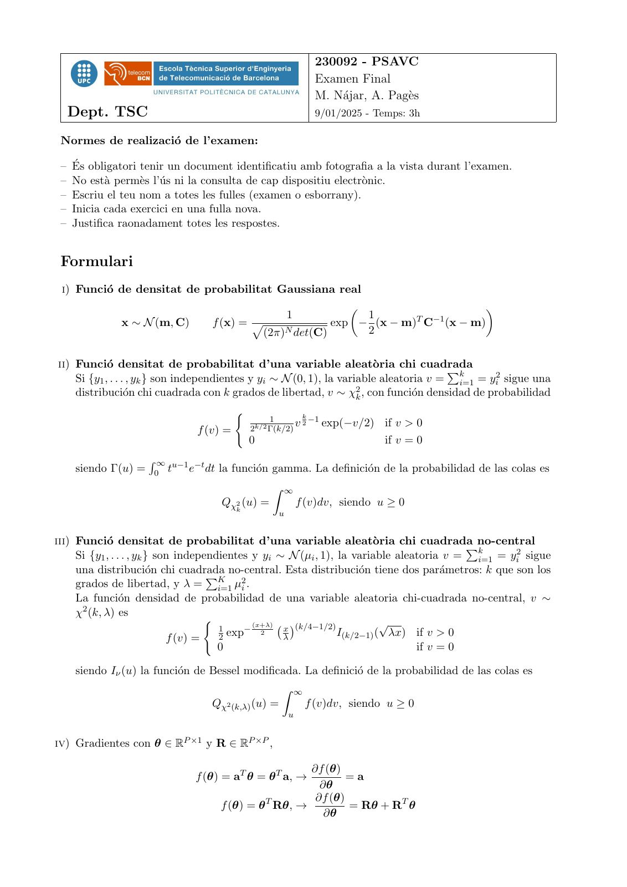
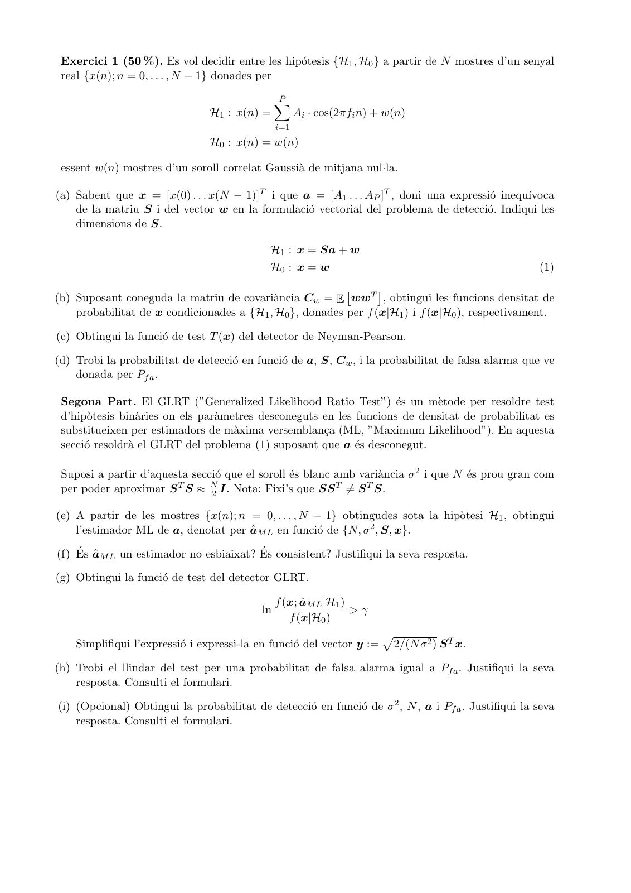
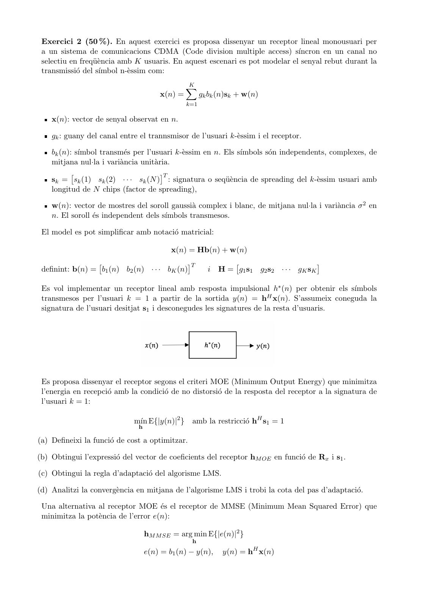
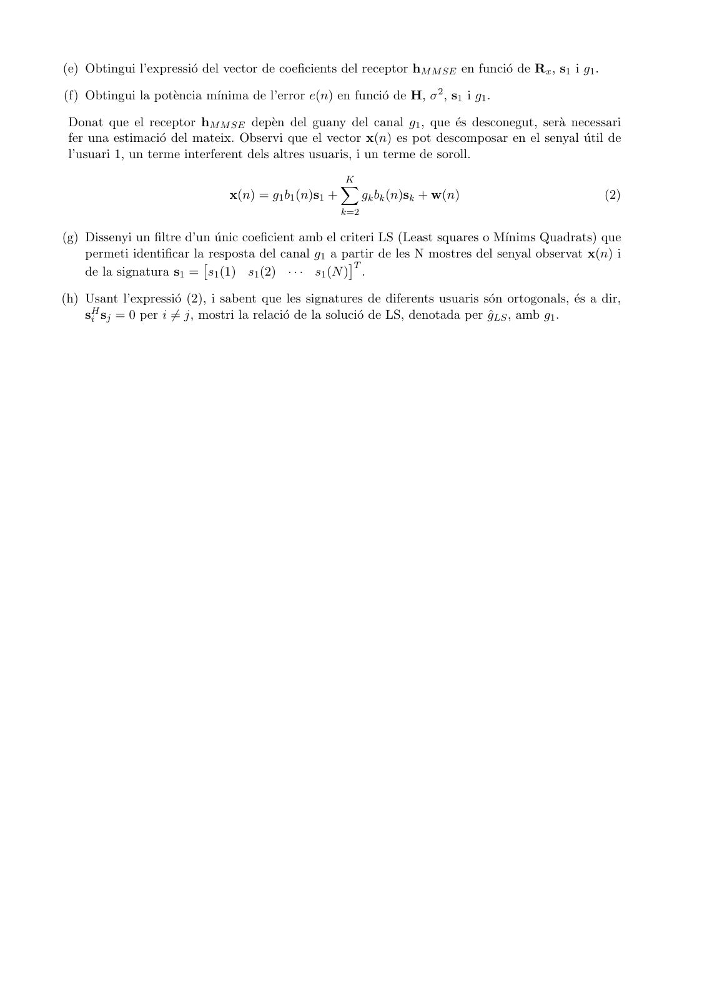
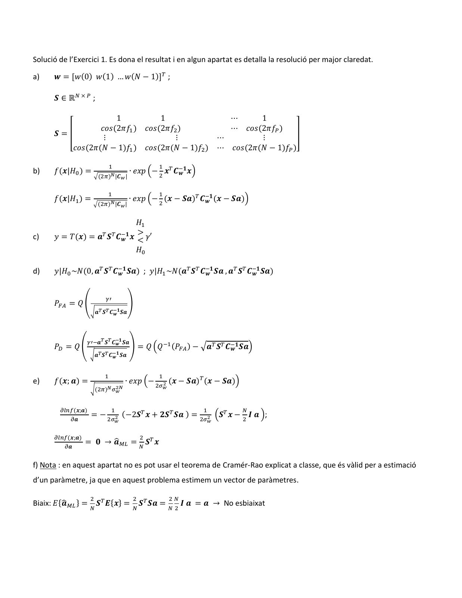
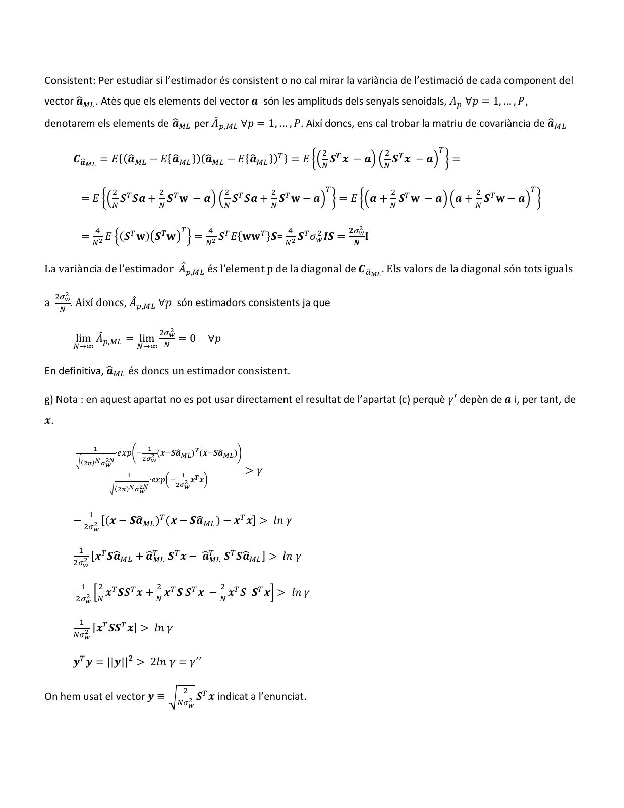
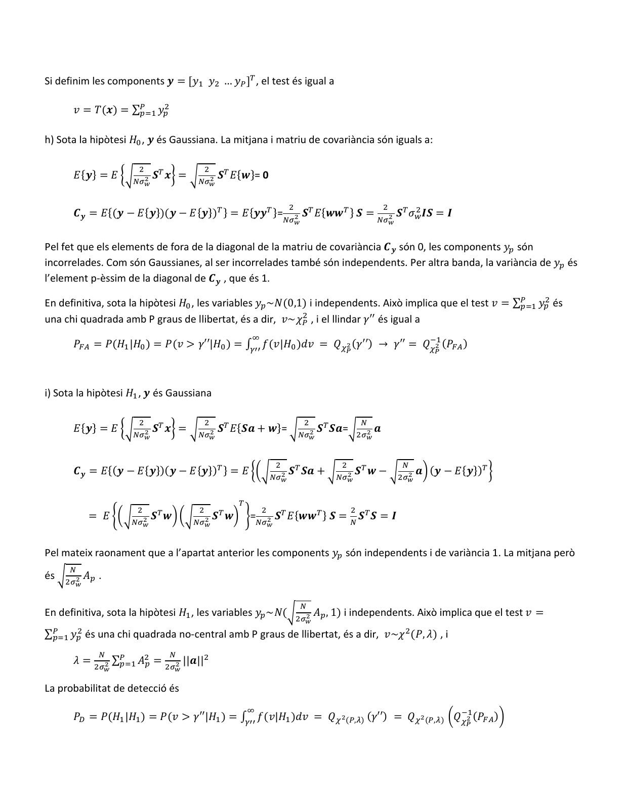
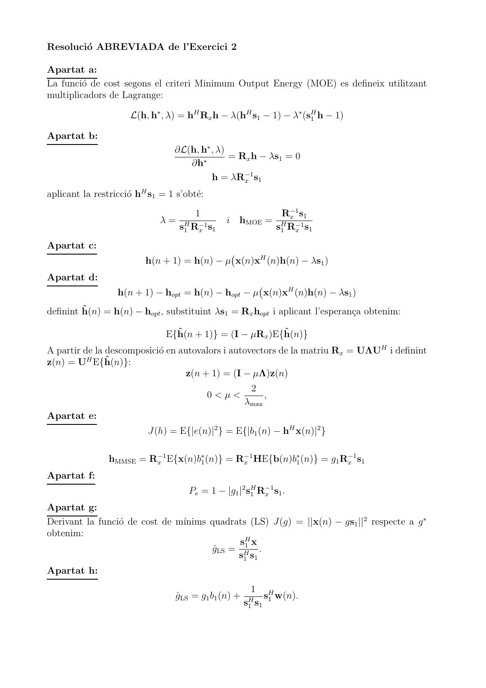

# 2025-01_Final_PSAVC

- Source PDF: `Examenes/2025-01_Final_PSAVC.pdf`
- PDF title: `2025-01_Final_PSAVC`
- Pages: 8
- Note: Transcribed from the embedded PDF text layer. Each page links to a rendered page image so figures, plots, handwriting, and formula layout can be checked against the original.

## Page 1



```text
                                                              230092 - PSAVC
                                                              Examen Final
                                                              M. Nájar, A. Pagès
  Dept. TSC                                                   9/01/2025 - Temps: 3h

 Normes de realizació de l’examen:

 – És obligatori tenir un document identificatiu amb fotografia a la vista durant l’examen.
 – No està permès l’ús ni la consulta de cap dispositiu electrònic.
 – Escriu el teu nom a totes les fulles (examen o esborrany).
 – Inicia cada exercici en una fulla nova.
 – Justifica raonadament totes les respostes.


 Formulari
 i) Funció de densitat de probabilitat Gaussiana real
                                                                               
                                                       1     1       T −1
              x ∼ N (m, C)        f (x) = p             exp − (x − m) C (x − m)
                                           (2π)N det(C)      2

ii) Funció densitat de probabilitat d’una variable aleatòria chi cuadrada
    Si {y1 , . . . , yk } son independientes y yi ∼ N (0, 1), la variable aleatoria v = ki=1 = yi2 sigue una
                                                                                       P
    distribución chi cuadrada con k grados de libertad, v ∼ χ2k , con función densidad de probabilidad
                                         (                 k
                                                  1
                                             2k/2 Γ(k/2)
                                                         v 2 −1 exp(−v/2)   if v > 0
                               f (v) =
                                             0                              if v = 0
                    R ∞ u−1 −t
    siendo Γ(u) =    0 t   e dt la función gamma. La definición de la probabilidad de las colas es
                                                  Z ∞
                                    Qχ2 (u) =              f (v)dv, siendo u ≥ 0
                                         k
                                                   u


iii) Funció densitat de probabilitat d’una variable aleatòria chi cuadrada               Pno-central
     Si {y1 , . . . , yk } son independientes y yi ∼ N (µi , 1), la variable aleatoria v = ki=1 = yi2 sigue
     una distribución chi cuadrada  P no-central.    Esta distribución tiene dos parámetros: k que son los
     grados de libertad, y λ = K           µ
                                       i=1 i
                                             2.

     La función densidad de probabilidad de una variable aleatoria chi-cuadrada no-central, v ∼
     χ2 (k, λ) es
                                     (
                                       1     − 2
                                                (x+λ)
                                                      x (k/4−1/2)
                                                                           √
                             f (v) =   2 exp          λ           I(k/2−1) (  λx) if v > 0
                                       0                                          if v = 0

    siendo Iν (u) la función de Bessel modificada. La definició de la probabilidad de las colas es
                                                 Z ∞
                                 Qχ2 (k,λ) (u) =     f (v)dv, siendo u ≥ 0
                                                       u


iv) Gradientes con θ ∈ RP ×1 y R ∈ RP ×P ,

                                                      ∂f (θ)
                               f (θ) = aT θ = θ T a, →        =a
                                                        ∂θ
                                                       ∂f (θ)
                                    f (θ) = θ T Rθ, →         = Rθ + RT θ
                                                         ∂θ
```

## Page 2



```text
 Exercici 1 (50 %). Es vol decidir entre les hipótesis {H1 , H0 } a partir de N mostres d’un senyal
 real {x(n); n = 0, . . . , N − 1} donades per
                                                P
                                                X
                                H1 : x(n) =           Ai · cos(2πfi n) + w(n)
                                                i=1
                                H0 : x(n) = w(n)

 essent w(n) mostres d’un soroll correlat Gaussià de mitjana nul·la.

(a) Sabent que x = [x(0) . . . x(N − 1)]T i que a = [A1 . . . AP ]T , doni una expressió inequı́voca
    de la matriu S i del vector w en la formulació vectorial del problema de detecció. Indiqui les
    dimensions de S.

                                             H1 : x = Sa + w
                                             H0 : x = w                                               (1)

(b) Suposant coneguda la matriu de covariància Cw = E wwT , obtingui les funcions densitat de
                                                                

    probabilitat de x condicionades a {H1 , H0 }, donades per f (x|H1 ) i f (x|H0 ), respectivament.

(c) Obtingui la funció de test T (x) del detector de Neyman-Pearson.

(d) Trobi la probabilitat de detecció en funció de a, S, Cw , i la probabilitat de falsa alarma que ve
    donada per Pf a .

 Segona Part. El GLRT (”Generalized Likelihood Ratio Test”) és un mètode per resoldre test
 d’hipòtesis binàries on els paràmetres desconeguts en les funcions de densitat de probabilitat es
 substitueixen per estimadors de màxima versemblança (ML, ”Maximum Likelihood”). En aquesta
 secció resoldrà el GLRT del problema (1) suposant que a és desconegut.

 Suposi a partir d’aquesta secció que el soroll és blanc amb variància σ 2 i que N és prou gran com
 per poder aproximar S T S ≈ N2 I. Nota: Fixi’s que SS T ̸= S T S.

(e) A partir de les mostres {x(n); n = 0, . . . , N − 1} obtingudes sota la hipòtesi H1 , obtingui
    l’estimador ML de a, denotat per âM L en funció de {N, σ 2 , S, x}.

(f) És âM L un estimador no esbiaixat? És consistent? Justifiqui la seva resposta.

(g) Obtingui la funció de test del detector GLRT.

                                                f (x; âM L |H1 )
                                           ln                     >γ
                                                   f (x|H0 )
                                                                        p
    Simplifiqui l’expressió i expressi-la en funció del vector y :=       2/(N σ 2 ) S T x.

(h) Trobi el llindar del test per una probabilitat de falsa alarma igual a Pf a . Justifiqui la seva
    resposta. Consulti el formulari.

(i) (Opcional) Obtingui la probabilitat de detecció en funció de σ 2 , N , a i Pf a . Justifiqui la seva
    resposta. Consulti el formulari.
```

## Page 3



```text
 Exercici 2 (50 %). En aquest exercici es proposa dissenyar un receptor lineal monousuari per
 a un sistema de comunicacions CDMA (Code division multiple access) sı́ncron en un canal no
 selectiu en freqüència amb K usuaris. En aquest escenari es pot modelar el senyal rebut durant la
 transmissió del sı́mbol n-èssim com:
                                               K
                                               X
                                      x(n) =         gk bk (n)sk + w(n)
                                               k=1

    x(n): vector de senyal observat en n.

    gk : guany del canal entre el trannsmisor de l’usuari k-èssim i el receptor.

    bk (n): sı́mbol transmés per l’usuari k-èssim en n. Els sı́mbols són independents, complexes, de
    mitjana nul·la i variància unitària.
                                     T
    sk = sk (1) sk (2) · · · sk (N ) : signatura o seqüència de spreading del k-èssim usuari amb
    longitud de N chips (factor de spreading),

    w(n): vector de mostres del soroll gaussià complex i blanc, de mitjana nul·la i variància σ 2 en
    n. El soroll és independent dels sı́mbols transmesos.

 El model es pot simplificar amb notació matricial:

                                          x(n) = Hb(n) + w(n)
                                           T                                        
 definint: b(n) = b1 (n) b2 (n) · · · bK (n)           i   H = g1 s1 g2 s2 · · · gK sK

 Es vol implementar un receptor lineal amb resposta impulsional h∗ (n) per obtenir els sı́mbols
 transmesos per l’usuari k = 1 a partir de la sortida y(n) = hH x(n). S’assumeix coneguda la
 signatura de l’usuari desitjat s1 i desconegudes les signatures de la resta d’usuaris.


 Es proposa dissenyar el receptor segons el criteri MOE (Minimum Output Energy) que minimitza
 l’energia en recepció amb la condició de no distorsió de la resposta del receptor a la signatura de
 l’usuari k = 1:

                             mı́n E{|y(n)|2 } amb la restricció hH s1 = 1
                              h

(a) Defineixi la funció de cost a optimitzar.

(b) Obtingui l’expressió del vector de coeficients del receptor hM OE en funció de Rx i s1 .

(c) Obtingui la regla d’adaptació del algorisme LMS.

(d) Analitzi la convergència en mitjana de l’algorisme LMS i trobi la cota del pas d’adaptació.

 Una alternativa al receptor MOE és el receptor de MMSE (Minimum Mean Squared Error) que
 minimitza la potència de l’error e(n):

                                  hM M SE = arg min E{|e(n)|2 }
                                                 h
                                  e(n) = b1 (n) − y(n),     y(n) = hH x(n)
```

## Page 4



```text
(e) Obtingui l’expressió del vector de coeficients del receptor hM M SE en funció de Rx , s1 i g1 .

(f) Obtingui la potència mı́nima de l’error e(n) en funció de H, σ 2 , s1 i g1 .

 Donat que el receptor hM M SE depèn del guany del canal g1 , que és desconegut, serà necessari
 fer una estimació del mateix. Observi que el vector x(n) es pot descomposar en el senyal útil de
 l’usuari 1, un terme interferent dels altres usuaris, i un terme de soroll.
                                                      K
                                                      X
                               x(n) = g1 b1 (n)s1 +         gk bk (n)sk + w(n)                          (2)
                                                      k=2

(g) Dissenyi un filtre d’un únic coeficient amb el criteri LS (Least squares o Mı́nims Quadrats) que
    permeti identificar la resposta del canal g1 a partir de les N mostres del senyal observat x(n) i
                                                    T
    de la signatura s1 = s1 (1) s1 (2) · · · s1 (N ) .

(h) Usant l’expressió (2), i sabent que les signatures de diferents usuaris són ortogonals, és a dir,
    sH
     i sj = 0 per i ̸= j, mostri la relació de la solució de LS, denotada per ĝLS , amb g1 .
```

## Page 5



```text
Solució de l’Exercici 1. Es dona el resultat i en algun apartat es detalla la resolució per major claredat.

a)    𝒘 = [𝑤(0) 𝑤(1) … 𝑤(𝑁 − 1)]𝑇 ;

      𝑺 ∈ ℝ𝑁 × 𝑃 ;

                    1          1               ⋯      1
                𝑐𝑜𝑠(2𝜋𝑓1 ) 𝑐𝑜𝑠(2𝜋𝑓2 )          ⋯ 𝑐𝑜𝑠(2𝜋𝑓𝑃 )
      𝑺=[                                                       ]
                 ⋮                 ⋮         ⋯        ⋮
         𝑐𝑜𝑠(2𝜋(𝑁 − 1)𝑓1 ) 𝑐𝑜𝑠(2𝜋(𝑁 − 1)𝑓2 ) ⋯ 𝑐𝑜𝑠(2𝜋(𝑁 − 1)𝑓𝑃 )

                              1                        1
b)    𝑓(𝒙|𝐻0 ) =                    ∙ 𝑒𝑥𝑝 (− 2 𝒙𝑇 𝑪−𝟏
                                                   𝒘 𝒙)
                     √(2𝜋)𝑁 |𝑪𝑤 |


                           1                           1
      𝑓(𝒙|𝐻1 ) =                    ∙ 𝑒𝑥𝑝 (− (𝒙 − 𝑺𝒂)𝑇 𝑪−𝟏
                                                        𝒘 (𝒙 − 𝑺𝒂))
                     √(2𝜋)𝑁 |𝑪𝑤 |                      2


                            𝐻1
                            >
c)    𝑦 = 𝑇(𝒙) = 𝒂𝑇 𝑺𝑇 𝑪−𝟏
                        𝒘 𝒙 < 𝛾′
                            𝐻0

d)    𝑦|𝐻0 ~𝑁(0, 𝒂𝑇 𝑺𝑇 𝑪−𝟏               𝑇 𝑇 −𝟏      𝑇 𝑇 −𝟏
                        𝒘 𝑺𝒂) ; 𝑦|𝐻1 ~𝑁(𝒂 𝑺 𝑪𝒘 𝑺𝒂 , 𝒂 𝑺 𝑪𝒘 𝑺𝒂)


                          𝛾′
      𝑃𝐹𝐴 = 𝑄 (                     )
                    √𝒂𝑇 𝑺𝑇 𝑪−𝟏
                            𝒘 𝑺𝒂


                  𝛾′−𝒂𝑇 𝑺𝑇 𝑪−𝟏
                            𝒘 𝑺𝒂
      𝑃𝐷 = 𝑄 (                      ) = 𝑄 (𝑄−1 (𝑃𝐹𝐴 ) − √𝒂𝑇 𝑺𝑇 𝑪−𝟏
                                                                𝒘 𝑺𝒂)
                    √𝒂𝑇 𝑺𝑇 𝑪−𝟏
                            𝒘 𝑺𝒂


                          1                            1
e)    𝑓(𝒙; 𝒂) =                   ∙ 𝑒𝑥𝑝 (−          2      (𝒙 − 𝑺𝒂)𝑇 (𝒙 − 𝑺𝒂))
                            2𝑁                    2𝜎𝑤
                    √(2𝜋)𝑁 𝜎𝑤


        𝜕𝑙𝑛𝑓(𝒙;𝒂)      1                        1          𝑁
                  = − 2𝜎2 (−2𝑺𝑇 𝒙 + 𝟐𝑺𝑇 𝑺𝒂 ) = 2𝜎2 (𝑺𝑇 𝒙 − 2 𝑰 𝒂 );
           𝜕𝒂           𝑤                        𝑤


      𝜕𝑙𝑛𝑓(𝒙;𝒂)                             2
                  = 𝟎 →̂
                       𝒂𝑀𝐿 =                    𝑺𝑇 𝒙
          𝜕𝒂                                𝑁


f) Nota : en aquest apartat no es pot usar el teorema de Cramér-Rao explicat a classe, que és vàlid per a estimació
d’un paràmetre, ja que en aquest problema estimem un vector de paràmetres.

                    2                   2                  2𝑁
         ̂ 𝑀𝐿 } =
Biaix: 𝐸{𝒂              𝑺𝑇 𝑬{𝒙} =           𝑺𝑇 𝑺𝒂 =             𝑰 𝒂 = 𝒂 → No esbiaixat
                    𝑁               𝑁                      𝑁2
```

## Page 6



```text
Consistent: Per estudiar si l’estimador és consistent o no cal mirar la variància de l’estimació de cada component del
vector ̂
       𝒂𝑀𝐿 . Atès que els elements del vector 𝒂 són les amplituds dels senyals senoidals, 𝐴𝑝 ∀𝑝 = 1, … , 𝑃,
                          𝒂𝑀𝐿 per 𝐴̂𝑝,𝑀𝐿 ∀𝑝 = 1, … , 𝑃. Així doncs, ens cal trobar la matriu de covariància de ̂
denotarem els elements de ̂                                                                                    𝒂𝑀𝐿

                                                                           2           2       𝑇
         𝑪𝒂̂𝑀𝐿 = 𝐸{(𝒂       ̂ 𝑀𝐿 })(𝒂
                    ̂𝑀𝐿 − 𝐸{𝒂               ̂𝑀𝐿 })𝑇 } = 𝐸 {( 𝑺𝑻 𝒙 − 𝒂) ( 𝑺𝑻 𝒙 − 𝒂) } =
                                    ̂𝑀𝐿 − 𝐸{𝒂
                                                            𝑁           𝑁


                      2              2                    2        2       𝑇               2       2          𝑇
          = 𝐸 {(𝑁 𝑺𝑇 𝑺𝒂 + 𝑁 𝑺𝑇 𝐰 − 𝒂) (𝑁 𝑺𝑇 𝑺𝒂 + 𝑁 𝑺𝑇 𝐰 − 𝒂) } = 𝐸 {(𝒂 + 𝑁 𝑺𝑇 𝐰 − 𝒂) (𝒂 + 𝑁 𝑺𝑇 𝐰 − 𝒂) }

                  4                         𝑇         4                4         2
                                                                               𝟐𝜎𝑤
          = 𝑁2 𝐸 {(𝑺𝑇 𝐰)(𝑺𝑻𝐰) } = 𝑁2 𝑺𝑇 𝐸{𝐰𝐰 𝑇 }𝑺= 𝑁2 𝑺𝑇 𝜎𝑤2 𝑰𝑺 =                  I
                                                                                𝑵


La variància de l’estimador 𝐴̂𝑝,𝑀𝐿 és l’element p de la diagonal de 𝑪𝑎̂𝑀𝐿 . Els valors de la diagonal són tots iguals

       2
     2𝜎𝑤
a        . Així doncs, 𝐴̂𝑝,𝑀𝐿 ∀𝑝 són estimadors consistents ja que
      𝑁

                                   2
                                 2𝜎𝑤
         lim 𝐴̂𝑝,𝑀𝐿 = lim            =0             ∀𝑝
         𝑁→∞                  𝑁→∞ 𝑁


En definitiva, ̂
               𝒂𝑀𝐿 és doncs un estimador consistent.

g) Nota : en aquest apartat no es pot usar directament el resultat de l’apartat (c) perquè 𝛾′ depèn de 𝒂 i, per tant, de
𝒙.

              1                1
                       ∙𝑒𝑥𝑝(−         ̂𝑀𝐿 )𝑻(𝒙−𝑺𝒂
                                  (𝒙−𝑺𝒂         ̂𝑀𝐿 ))
                              2𝜎2
         √(2𝜋)𝑁 𝜎2𝑁
                 𝑤
                                𝑤

                          1                 1 𝑻
                                                              >𝛾
                                   ∙𝑒𝑥𝑝(−      𝒙 𝒙)
                                           2𝜎2
                      √(2𝜋)𝑁 𝜎2𝑁
                              𝑤
                                             𝑤


              1
                      ̂𝑀𝐿 )𝑇 (𝒙 − 𝑺𝒂
         − 2𝜎2 [(𝒙 − 𝑺𝒂            ̂ 𝑀𝐿 ) − 𝒙𝑇 𝒙] > 𝑙𝑛 𝛾
              𝑤


          1     𝑇 ̂
            2 [𝒙 𝑺𝒂      𝒂𝑇𝑀𝐿 𝑺𝑇 𝒙 − ̂
                    𝑀𝐿 + ̂           𝒂𝑇𝑀𝐿 𝑺𝑇 𝑺𝒂
                                              ̂𝑀𝐿 ] > 𝑙𝑛 𝛾
         2𝜎𝑤

          1       2                 2                     2
           2 𝑁[ 𝒙𝑇 𝑺𝑺𝑇 𝒙 + 𝒙𝑇 𝑺 𝑺𝑇 𝒙 − 𝒙𝑇 𝑺 𝑺𝑇 𝒙] > 𝑙𝑛 𝛾
         2𝜎𝑤                        𝑁                     𝑁

          1     𝑇  𝑇
         𝑁𝜎𝑤2 [𝒙 𝑺𝑺 𝒙] >            𝑙𝑛 𝛾


         𝒚𝑇 𝒚 = ||𝒚||𝟐 > 2𝑙𝑛 𝛾 = 𝛾′′

                                            2
On hem usat el vector 𝒚 ≡ √𝑁𝜎2 𝑺𝑇 𝒙 indicat a l’enunciat.
                                                𝑤
```

## Page 7



```text
Si definim les components 𝒚 = [𝑦1 𝑦2 … 𝑦𝑃 ]𝑇 , el test és igual a

      𝑣 = 𝑇(𝒙) = ∑𝑃𝑝=1 𝑦𝑝2

h) Sota la hipòtesi 𝐻0 , 𝒚 és Gaussiana. La mitjana i matriu de covariància són iguals a:

                      2                       2
      𝐸{𝒚} = 𝐸 {√𝑁𝜎2 𝑺𝑇 𝒙} = √𝑁𝜎2 𝑺𝑇 𝐸{𝒘}= 0
                          𝑤                       𝑤


                                                                  2                           2
      𝑪𝒚 = 𝐸{(𝒚 − 𝐸{𝒚})(𝒚 − 𝐸{𝒚})𝑇 } = 𝐸{𝒚𝒚𝑇 }=𝑁𝜎2 𝑺𝑇 𝐸{𝒘𝒘𝑇 } 𝑺 = 𝑁𝜎2 𝑺𝑇 𝜎𝑤2 𝑰𝑺 = 𝑰
                                                                      𝑤                           𝑤


Pel fet que els elements de fora de la diagonal de la matriu de covariància 𝑪𝒚 són 0, les components 𝑦𝑝 són
incorrelades. Com són Gaussianes, al ser incorrelades també són independents. Per altra banda, la variància de 𝑦𝑝 és
l’element p-èssim de la diagonal de 𝑪𝒚 , que és 1.

En definitiva, sota la hipòtesi 𝐻0 , les variables 𝑦𝑝 ~𝑁(0,1) i independents. Això implica que el test 𝑣 = ∑𝑃𝑝=1 𝑦𝑝2 és
una chi quadrada amb P graus de llibertat, és a dir, 𝑣~𝜒𝑃2 , i el llindar 𝛾′′ és igual a
                                                      ∞
      𝑃𝐹𝐴 = 𝑃(𝐻1 |𝐻0 ) = 𝑃(𝑣 > 𝛾′′|𝐻0 ) = ∫𝛾′′ 𝑓(𝑣|𝐻0 )𝑑𝑣 = 𝑄𝜒𝑃2 (𝛾′′) → 𝛾′′ = 𝑄𝜒−12 (𝑃𝐹𝐴 )
                                                                                                          𝑃


i) Sota la hipòtesi 𝐻1 , 𝒚 és Gaussiana

                      2                       2                           2               𝑁
      𝐸{𝒚} = 𝐸 {√𝑁𝜎2 𝑺𝑇 𝒙} = √𝑁𝜎2 𝑺𝑇 𝐸{𝑺𝒂 + 𝒘}= √𝑁𝜎2 𝑺𝑇 𝑺𝒂=√2𝜎2 𝒂
                          𝑤                       𝑤                           𝑤           𝑤


                                                          2                       2                   𝑁
      𝑪𝒚 = 𝐸{(𝒚 − 𝐸{𝒚})(𝒚 − 𝐸{𝒚})𝑇 } = 𝐸 {(√𝑁𝜎2 𝑺𝑇 𝑺𝒂 + √𝑁𝜎2 𝑺𝑇 𝒘 − √2𝜎2 𝒂) (𝒚 − 𝐸{𝒚})𝑇 }
                                                              𝑤                       𝑤               𝑤


                                                 𝑇
                     2                    2          2                 2
           = 𝐸 {(√    2       𝑺𝑇 𝒘) (   √𝑁𝜎2 𝑺 𝒘) }=𝑁𝜎2 𝑺𝑇 𝐸{𝒘𝒘𝑇 } 𝑺 = 𝑁 𝑺𝑇 𝑺 = 𝑰
                                              𝑇
                    𝑁𝜎𝑤                    𝑤           𝑤


Pel mateix raonament que a l’apartat anterior les components 𝑦𝑝 són independents i de variància 1. La mitjana però
     𝑁
és √2𝜎2 𝐴𝑝 .
       𝑤


                                                                          𝑁
En definitiva, sota la hipòtesi 𝐻1 , les variables 𝑦𝑝 ~𝑁(√2𝜎2 𝐴𝑝 , 1) i independents. Això implica que el test 𝑣 =
                                                                          𝑤

∑𝑃𝑝=1 𝑦𝑝2 és una chi quadrada no-central amb P graus de llibertat, és a dir, 𝑣~𝜒 2 (𝑃, 𝜆) , i
            𝑁                    𝑁
      𝜆 = 2𝜎2 ∑𝑃𝑝=1 𝐴2𝑝 = 2𝜎2 ||𝒂||2
               𝑤                  𝑤


La probabilitat de detecció és
                                                      ∞
      𝑃𝐷 = 𝑃(𝐻1 |𝐻1 ) = 𝑃(𝑣 > 𝛾′′|𝐻1 ) = ∫𝛾′′ 𝑓(𝑣|𝐻1 )𝑑𝑣 = 𝑄𝜒2 (𝑃,𝜆) (𝛾′′) = 𝑄𝜒2 (𝑃,𝜆) (𝑄𝜒−12 (𝑃𝐹𝐴 ))
                                                                                                              𝑃
```

## Page 8



```text
Resolució ABREVIADA de l’Exercici 2

Apartat a:
La funció de cost segons el criteri Minimum Output Energy (MOE) es defineix utilitzant
multiplicadors de Lagrange:

                      L(h, h∗ , λ) = hH Rx h − λ(hH s1 − 1) − λ∗ (sH
                                                                   1 h − 1)

Apartat b:
                                  ∂L(h, h∗ , λ)
                                                = Rx h − λs1 = 0
                                     ∂h∗
                                           h = λR−1x s1

aplicant la restricció hH s1 = 1 s’obté:
                                       1                           R−1
                                                                     x s1
                              λ=    H −1
                                                i hMOE =           H −1
                                   s1 Rx s 1                      s1 Rx s1
Apartat c:
                          h(n + 1) = h(n) − µ x(n)xH (n)h(n) − λs1 )
Apartat d:
                  h(n + 1) − hopt = h(n) − hopt − µ x(n)xH (n)h(n) − λs1 )
definint ĥ(n) = h(n) − hopt , substituint λs1 = Rx hopt i aplicant l’esperança obtenim:

                               E{ĥ(n + 1)} = (I − µRx )E{ĥ(n)}
A partir de la descomposició en autovalors i autovectors de la matriu Rx = UΛUH i definint
z(n) = UH E{ĥ(n)}:
                                   z(n + 1) = (I − µΛ)z(n)
                                                        2
                                             0<µ<             ,
                                                       λmax
Apartat e:
                           J(h) = E{|e(n)|2 } = E{|b1 (n) − hH x(n)|2 }

                hMMSE = R−1       ∗         −1        ∗            −1
                         x E{x(n)b1 (n)} = Rx HE{b(n)b1 (n)} = g1 Rx s1

Apartat f:
                                                          −1
                                      Pe = 1 − |g1 |2 sH
                                                       1 Rx s1 .

Apartat g:
Derivant la funció de cost de mı́nims quadrats (LS) J(g) = ||x(n) − gs1 ||2 respecte a g ∗
obtenim:
                                              sH x
                                       ĝLS = H1 .
                                             s1 s1
Apartat h:
                                                         1 H
                                  ĝLS = g1 b1 (n) +        s w(n).
                                                       s1 s1 1
                                                        H
```
