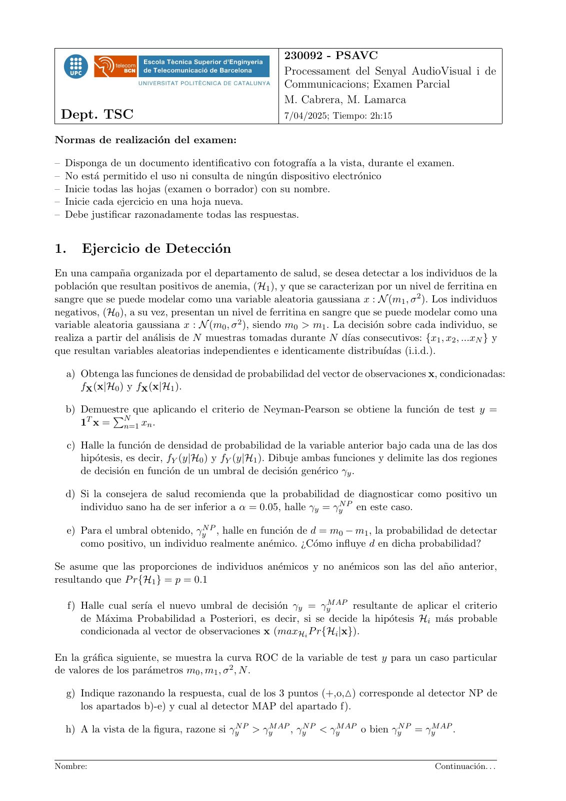
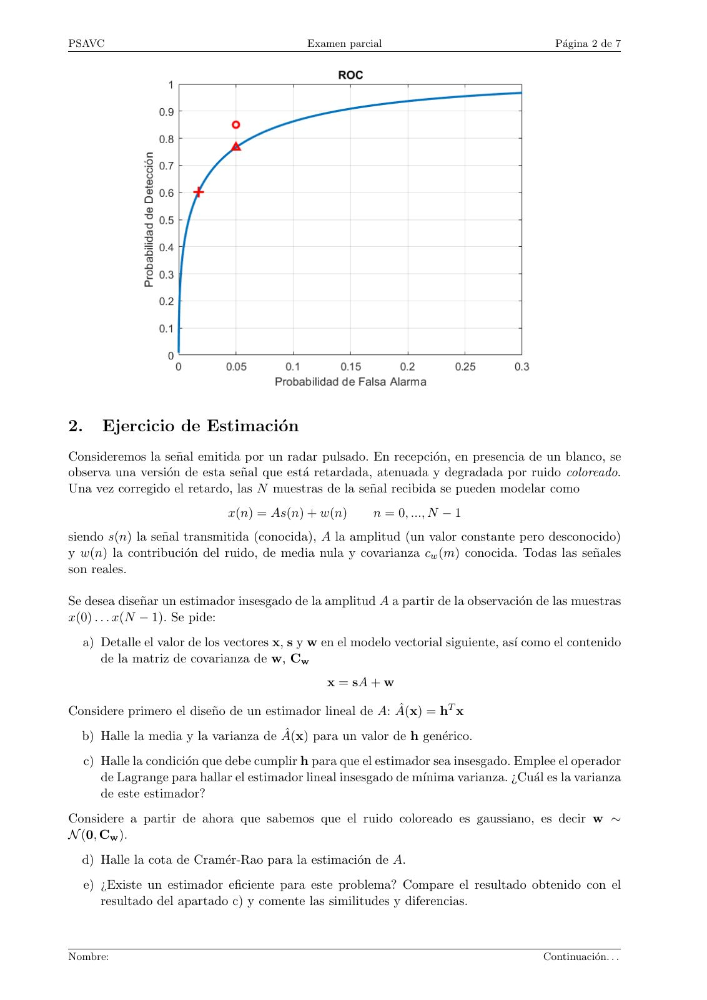
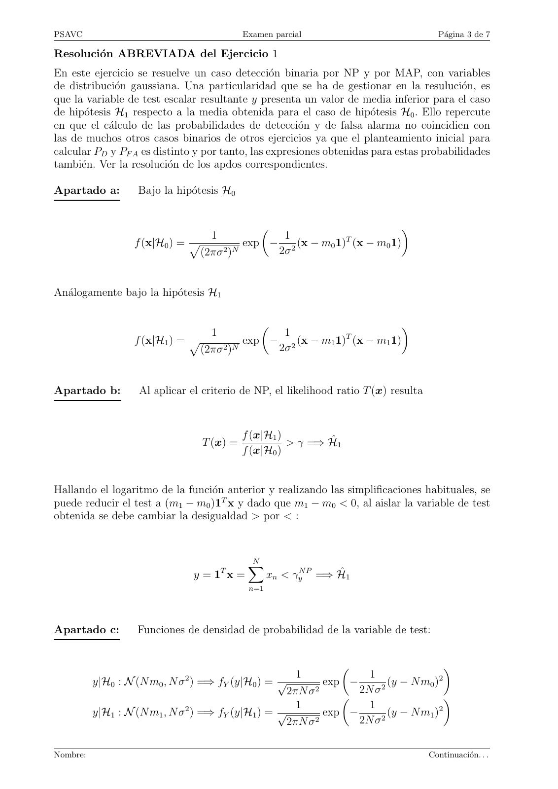
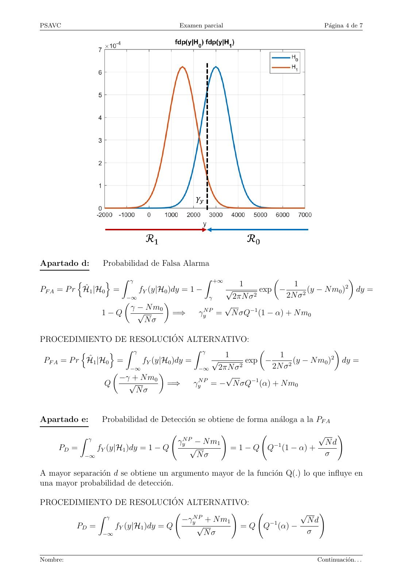
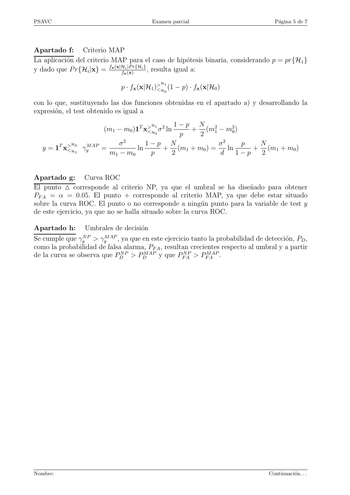
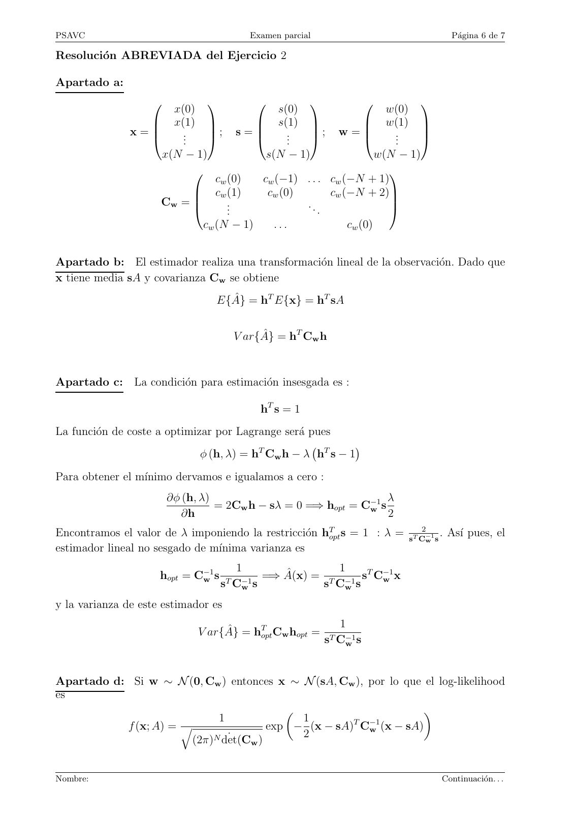
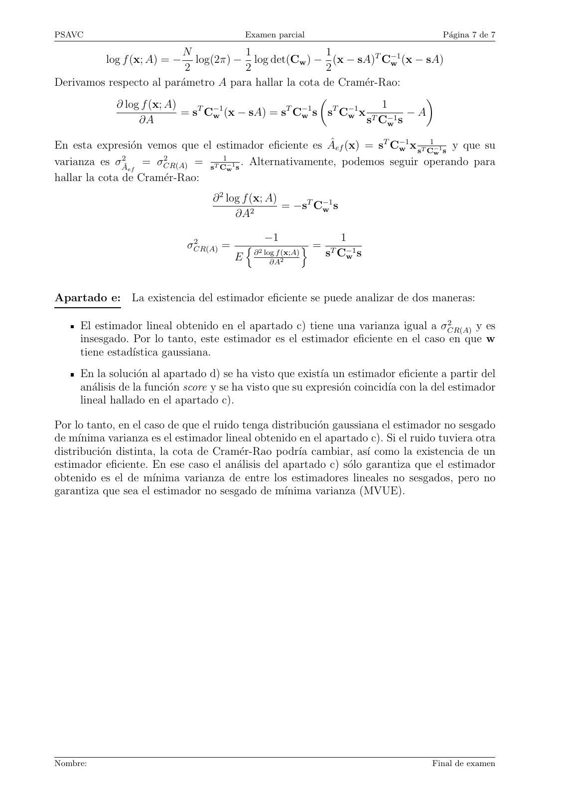

# 2025-04_Parcial_PSAVC

- Source PDF: `Examenes/2025-04_Parcial_PSAVC.pdf`
- PDF title: `2025-04_Parcial_PSAVC`
- Pages: 7
- Note: Transcribed from the embedded PDF text layer. Each page links to a rendered page image so figures, plots, handwriting, and formula layout can be checked against the original.

## Page 1



```text
                                                       230092 - PSAVC
                                                       Processament del Senyal AudioVisual i de
                                                       Communicacions; Examen Parcial
                                                       M. Cabrera, M. Lamarca
 Dept. TSC                                             7/04/2025; Tiempo: 2h:15

Normas de realización del examen:

– Disponga de un documento identificativo con fotografı́a a la vista, durante el examen.
– No está permitido el uso ni consulta de ningún dispositivo electrónico
– Inicie todas las hojas (examen o borrador) con su nombre.
– Inicie cada ejercicio en una hoja nueva.
– Debe justificar razonadamente todas las respuestas.


1.      Ejercicio de Detección
En una campaña organizada por el departamento de salud, se desea detectar a los individuos de la
población que resultan positivos de anemia, (H1 ), y que se caracterizan por un nivel de ferritina en
sangre que se puede modelar como una variable aleatoria gaussiana x : N (m1 , σ 2 ). Los individuos
negativos, (H0 ), a su vez, presentan un nivel de ferritina en sangre que se puede modelar como una
variable aleatoria gaussiana x : N (m0 , σ 2 ), siendo m0 > m1 . La decisión sobre cada individuo, se
realiza a partir del análisis de N muestras tomadas durante N dı́as consecutivos: {x1 , x2 , ...xN } y
que resultan variables aleatorias independientes e identicamente distribuı́das (i.i.d.).

  a) Obtenga las funciones de densidad de probabilidad del vector de observaciones x, condicionadas:
     fX (x|H0 ) y fX (x|H1 ).

  b) Demuestre
           P que aplicando el criterio de Neyman-Pearson se obtiene la función de test y =
     1T x = Nn=1 xn .

     c) Halle la función de densidad de probabilidad de la variable anterior bajo cada una de las dos
        hipótesis, es decir, fY (y|H0 ) y fY (y|H1 ). Dibuje ambas funciones y delimite las dos regiones
        de decisión en función de un umbral de decisión genérico γy .

  d) Si la consejera de salud recomienda que la probabilidad de diagnosticar como positivo un
     individuo sano ha de ser inferior a α = 0.05, halle γy = γyN P en este caso.

     e) Para el umbral obtenido, γyN P , halle en función de d = m0 − m1 , la probabilidad de detectar
        como positivo, un individuo realmente anémico. ¿Cómo influye d en dicha probabilidad?

Se asume que las proporciones de individuos anémicos y no anémicos son las del año anterior,
resultando que P r{H1 } = p = 0.1

     f) Halle cual serı́a el nuevo umbral de decisión γy = γyM AP resultante de aplicar el criterio
        de Máxima Probabilidad a Posteriori, es decir, si se decide la hipótesis Hi más probable
        condicionada al vector de observaciones x (maxHi P r{Hi |x}).

En la gráfica siguiente, se muestra la curva ROC de la variable de test y para un caso particular
de valores de los parámetros m0 , m1 , σ 2 , N .

  g) Indique razonando la respuesta, cual de los 3 puntos (+,o,△) corresponde al detector NP de
     los apartados b)-e) y cual al detector MAP del apartado f).

  h) A la vista de la figura, razone si γyN P > γyM AP , γyN P < γyM AP o bien γyN P = γyM AP .


Nombre:                                                                                   Continuación. . .
```

## Page 2



```text
PSAVC                                         Examen parcial                               Página 2 de 7


2.      Ejercicio de Estimación
Consideremos la señal emitida por un radar pulsado. En recepción, en presencia de un blanco, se
observa una versión de esta señal que está retardada, atenuada y degradada por ruido coloreado.
Una vez corregido el retardo, las N muestras de la señal recibida se pueden modelar como
                               x(n) = As(n) + w(n)        n = 0, ..., N − 1
siendo s(n) la señal transmitida (conocida), A la amplitud (un valor constante pero desconocido)
y w(n) la contribución del ruido, de media nula y covarianza cw (m) conocida. Todas las señales
son reales.

Se desea diseñar un estimador insesgado de la amplitud A a partir de la observación de las muestras
x(0) . . . x(N − 1). Se pide:
  a) Detalle el valor de los vectores x, s y w en el modelo vectorial siguiente, ası́ como el contenido
     de la matriz de covarianza de w, Cw
                                                 x = sA + w

Considere primero el diseño de un estimador lineal de A: Â(x) = hT x
  b) Halle la media y la varianza de Â(x) para un valor de h genérico.
     c) Halle la condición que debe cumplir h para que el estimador sea insesgado. Emplee el operador
        de Lagrange para hallar el estimador lineal insesgado de mı́nima varianza. ¿Cuál es la varianza
        de este estimador?
Considere a partir de ahora que sabemos que el ruido coloreado es gaussiano, es decir w ∼
N (0, Cw ).
  d) Halle la cota de Cramér-Rao para la estimación de A.
     e) ¿Existe un estimador eficiente para este problema? Compare el resultado obtenido con el
        resultado del apartado c) y comente las similitudes y diferencias.


Nombre:                                                                                  Continuación. . .
```

## Page 3



```text
PSAVC                                       Examen parcial                             Página 3 de 7

Resolución ABREVIADA del Ejercicio 1
En este ejercicio se resuelve un caso detección binaria por NP y por MAP, con variables
de distribución gaussiana. Una particularidad que se ha de gestionar en la resulución, es
que la variable de test escalar resultante y presenta un valor de media inferior para el caso
de hipótesis H1 respecto a la media obtenida para el caso de hipótesis H0 . Ello repercute
en que el cálculo de las probabilidades de detección y de falsa alarma no coincidien con
las de muchos otros casos binarios de otros ejercicios ya que el planteamiento inicial para
calcular PD y PF A es distinto y por tanto, las expresiones obtenidas para estas probabilidades
también. Ver la resolución de los apdos correspondientes.

Apartado a:        Bajo la hipótesis H0


                                                                     
                                   1           1           T
                  f (x|H0 ) = p          exp − 2 (x − m0 1) (x − m0 1)
                               (2πσ 2 )N      2σ


Análogamente bajo la hipótesis H1

                                                                     
                                   1           1           T
                  f (x|H1 ) = p          exp − 2 (x − m1 1) (x − m1 1)
                               (2πσ 2 )N      2σ


Apartado b:        Al aplicar el criterio de NP, el likelihood ratio T (x) resulta


                                            f (x|H1 )
                                  T (x) =             > γ =⇒ Ĥ1
                                            f (x|H0 )


Hallando el logaritmo de la función anterior y realizando las simplificaciones habituales, se
puede reducir el test a (m1 − m0 )1T x y dado que m1 − m0 < 0, al aislar la variable de test
obtenida se debe cambiar la desigualdad > por < :


                                             N
                                             X
                                       T
                                 y=1 x=            xn < γyN P =⇒ Ĥ1
                                             n=1


Apartado c:        Funciones de densidad de probabilidad de la variable de test:


                                                                                   
                             2                           1        1               2
          y|H0 : N (N m0 , N σ ) =⇒ fY (y|H0 ) = √        exp −        (y − N m0 )
                                                  2πN σ 2       2N σ 2
                                                                                   
                              2                     1             1               2
          y|H1 : N (N m1 , N σ ) =⇒ fY (y|H1 ) = √        exp −        (y − N m1 )
                                                  2πN σ 2       2N σ 2


Nombre:                                                                              Continuación. . .
```

## Page 4



```text
PSAVC                                    Examen parcial                               Página 4 de 7


Apartado d:        Probabilidad de Falsa Alarma

          n       o Z γ                     Z +∞
                                                     1
                                                              
                                                                   1
                                                                                     
                                                                                   2
PF A = P r Ĥ1 |H0 =     fY (y|H0 )dy = 1 −      √         exp −        (y − N m0 ) dy =
                     −∞                       γ    2πN σ 2       2N σ 2
                                                 √
                               
                       γ − N m0
                 1−Q     √         =⇒     γyN P = N σQ−1 (1 − α) + N m0
                          Nσ

PROCEDIMIENTO DE RESOLUCIÓN ALTERNATIVO:
                   o Z γ                  Z γ                                      
           n                                        1             1               2
 PF A = P r Ĥ1 |H0 =      fY (y|H0 )dy =       √         exp −        (y − N m0 ) dy =
                        −∞                  −∞    2πN σ 2       2N σ 2
                                                    √
                               
                      −γ + N m0
                  Q     √         =⇒      γyN P = − N σQ−1 (α) + N m0
                          Nσ


Apartado e:        Probabilidad de Detección se obtiene de forma análoga a la PF A
                                                        !                           √       !
                                         γyN P − N m1
            Z γ
                                                                                       Nd
     PD =         fY (y|H1 )dy = 1 − Q       √              = 1 − Q Q−1 (1 − α) +
             −∞                                Nσ                                      σ

A mayor separación d se obtiene un argumento mayor de la función Q(.) lo que influye en
una mayor probabilidad de detección.

PROCEDIMIENTO DE RESOLUCIÓN ALTERNATIVO:
                                               !               √ !
                                 −γyN P + N m1
            Z γ
                                                                Nd
       PD =     fY (y|H1 )dy = Q     √           = Q Q−1 (α) −
             −∞                         Nσ                      σ


Nombre:                                                                             Continuación. . .
```

## Page 5



```text
PSAVC                                    Examen parcial                              Página 5 de 7


Apartado f: Criterio MAP
La aplicación del criterio MAP para el caso de hipótesis binaria, considerando p = pr{H1 }
                                   )P r{Hi }
y dado que P r{Hi |x} = fx (x|Hfxi (x)       , resulta igual a:
                                             H
                              p · fx (x|H1 )> 1
                                            <H (1 − p) · fx (x|H0 )
                                              0


con lo que, sustituyendo las dos funciones obtenidas en el apartado a) y desarrollando la
expresión, el test obtenido es igual a
                                         H   1−p N 2
                        (m1 − m0 )1T x<
                                      > 1 2
                                        H
                                          σ ln   + (m1 − m20 )
                                         0    p     2
             H                σ 2
                                      1−p N               σ2     p   N
   y = 1T x <
            > 0
                  γyM AP =         ln      + (m1 + m0 ) =    ln     + (m1 + m0 )
             H1            m1 − m0     p    2             d     1−p  2


Apartado g: Curva ROC
El punto △ corresponde al criterio NP, ya que el umbral se ha diseñado para obtener
PF A = α = 0.05. El punto + corresponde al criterio MAP, ya que debe estar situado
sobre la curva ROC. El punto o no corresponde a ningún punto para la variable de test y
de este ejercicio, ya que no se halla situado sobre la curva ROC.

Apartado h: Umbrales de decisión
Se cumple que γyN P > γyM AP , ya que en este ejercicio tanto la probabilidad de detección, PD ,
como la probabilidad de falsa alarma, PF A , resultan crecientes respecto al umbral y a partir
de la curva se observa que PDN P > PDM AP y que PFNAP > PFMAAP .


Nombre:                                                                            Continuación. . .
```

## Page 6



```text
PSAVC                                       Examen parcial                               Página 6 de 7

Resolución ABREVIADA del Ejercicio 2

Apartado a:

                          x(0)                     s(0)                     w(0)
                                                                              
                         x(1)                   s(1)                   w(1)   
               x=          ..    ;    s=          ..   ;    w=          ..    
                            .                      .                     .    
                        x(N − 1)                 s(N − 1)        w(N − 1)

                                cw (0)  cw (−1) . . . cw (−N + 1)
                                                                  
                            cw (1)      cw (0)       cw (−N + 2)
                      Cw = 
                                  .
                                   ..           . ..
                                                                   
                                                                   
                             cw (N − 1)   ...             cw (0)


Apartado b: El estimador realiza una transformación lineal de la observación. Dado que
x tiene media sA y covarianza Cw se obtiene
                                    E{Â} = hT E{x} = hT sA


                                        V ar{Â} = hT Cw h


Apartado c: La condición para estimación insesgada es :

                                              hT s = 1
La función de coste a optimizar por Lagrange será pues
                                 ϕ (h, λ) = hT Cw h − λ hT s − 1
                                                                

Para obtener el mı́nimo dervamos e igualamos a cero :
                        ∂ϕ (h, λ)                                 λ
                                  = 2Cw h − sλ = 0 =⇒ hopt = C−1
                                                              w s
                           ∂h                                     2
Encontramos el valor de λ imponiendo la restricción hTopt s = 1 : λ = sT C2−1 s . Ası́ pues, el
                                                                            w
estimador lineal no sesgado de mı́nima varianza es
                                    1               1
                      hopt = C−1                        T −1
                              w s T −1 =⇒ Â(x) = T −1 s Cw x
                                 s Cw s          s Cw s
y la varianza de este estimador es
                                                                1
                                 V ar{Â} = hTopt Cw hopt =
                                                              sT C−1
                                                                  w s


Apartado d: Si w ∼ N (0, Cw ) entonces x ∼ N (sA, Cw ), por lo que el log-likelihood
es
                                                                  
                            1              1        T −1
           f (x; A) = q              exp − (x − sA) Cw (x − sA)
                           N  ˙            2
                       (2π) det(Cw )


Nombre:                                                                                Continuación. . .
```

## Page 7



```text
PSAVC                                        Examen parcial                            Página 7 de 7

                           N           1               1
           log f (x; A) = −   log(2π) − log det(Cw ) − (x − sA)T C−1w (x − sA)
                           2           2               2
Derivamos respecto al parámetro A para hallar la cota de Cramér-Rao:
                                                                          
            ∂ log f (x; A)     T −1            T −1      T −1     1
                           = s Cw (x − sA) = s Cw s s Cw x T −1 − A
                 ∂A                                            s Cw s

En esta expresión vemos que el estimador eficiente es Âef (x) = sT C−1     1
                                                                      w x sT C−1  y que su
                                                                              w s
               2      2          1
varianza es σ = σCR(A) = sT C−1 s . Alternativamente, podemos seguir operando para
                 ef               w
hallar la cota de Cramér-Rao:
                                   ∂ 2 log f (x; A)
                                             2
                                                    = −sT C−1
                                                           w s
                                         ∂A

                               2                   −1                 1
                              σCR(A) =       n 2               o=
                                         E     ∂ log f (x;A)        sT C−1
                                                                        w s
                                                   ∂A2


Apartado e: La existencia del estimador eficiente se puede analizar de dos maneras:

                                                                                  2
     El estimador lineal obtenido en el apartado c) tiene una varianza igual a σCR(A)  y es
     insesgado. Por lo tanto, este estimador es el estimador eficiente en el caso en que w
     tiene estadı́stica gaussiana.
     En la solución al apartado d) se ha visto que existı́a un estimador eficiente a partir del
     análisis de la función score y se ha visto que su expresión coincidı́a con la del estimador
     lineal hallado en el apartado c).

Por lo tanto, en el caso de que el ruido tenga distribución gaussiana el estimador no sesgado
de mı́nima varianza es el estimador lineal obtenido en el apartado c). Si el ruido tuviera otra
distribución distinta, la cota de Cramér-Rao podrı́a cambiar, ası́ como la existencia de un
estimador eficiente. En ese caso el análisis del apartado c) sólo garantiza que el estimador
obtenido es el de mı́nima varianza de entre los estimadores lineales no sesgados, pero no
garantiza que sea el estimador no sesgado de mı́nima varianza (MVUE).


Nombre:                                                                             Final de examen
```
