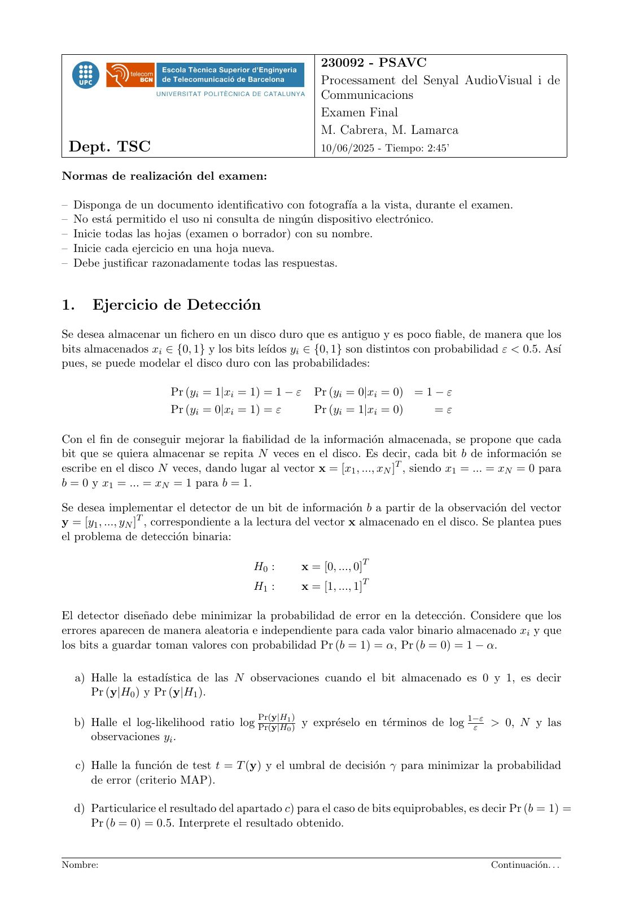
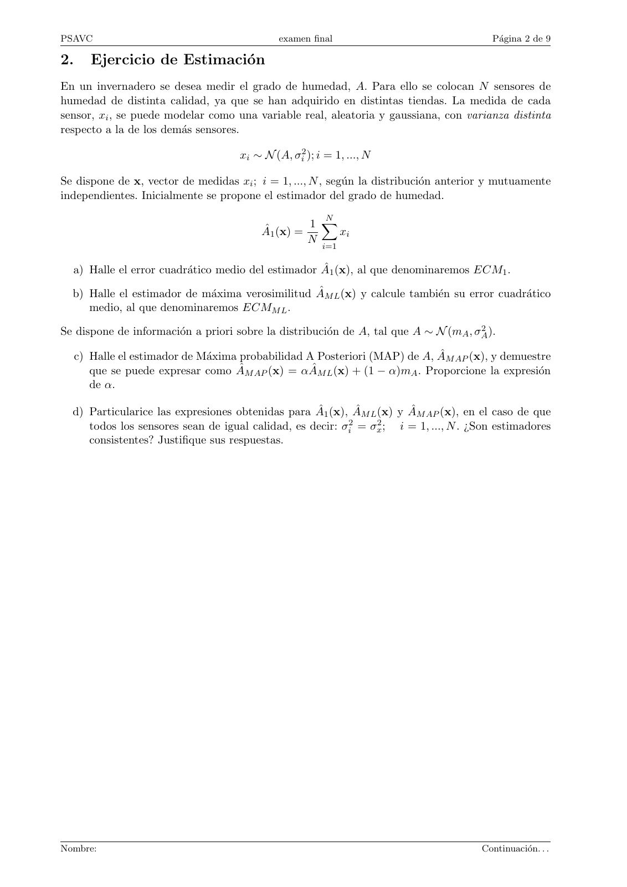
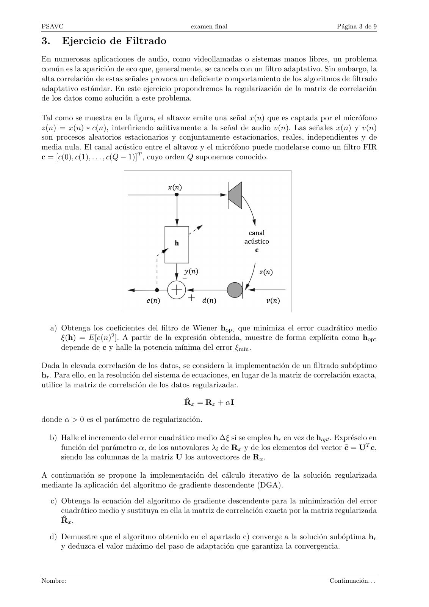
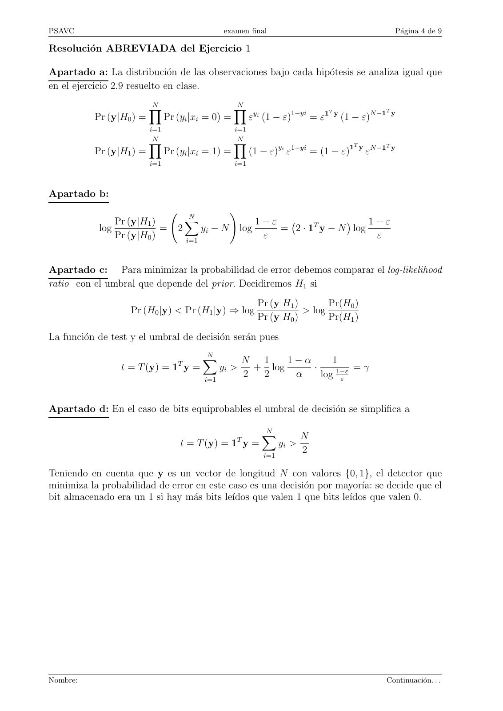
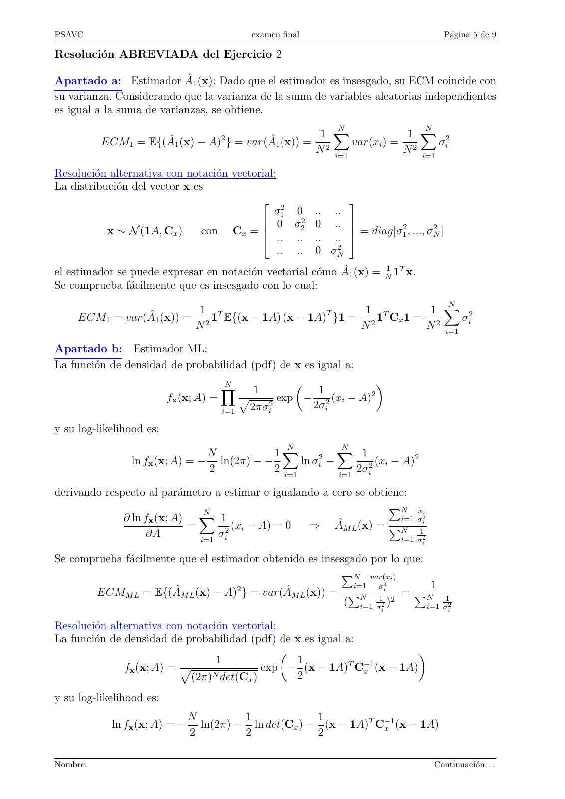
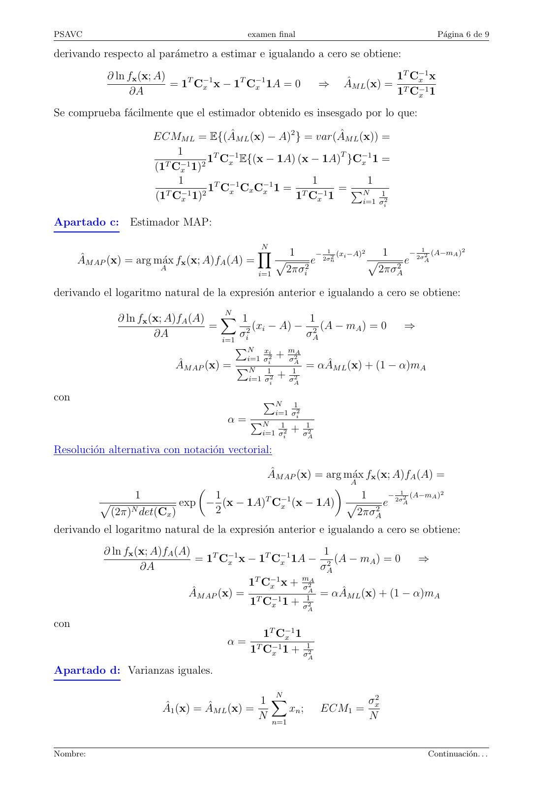
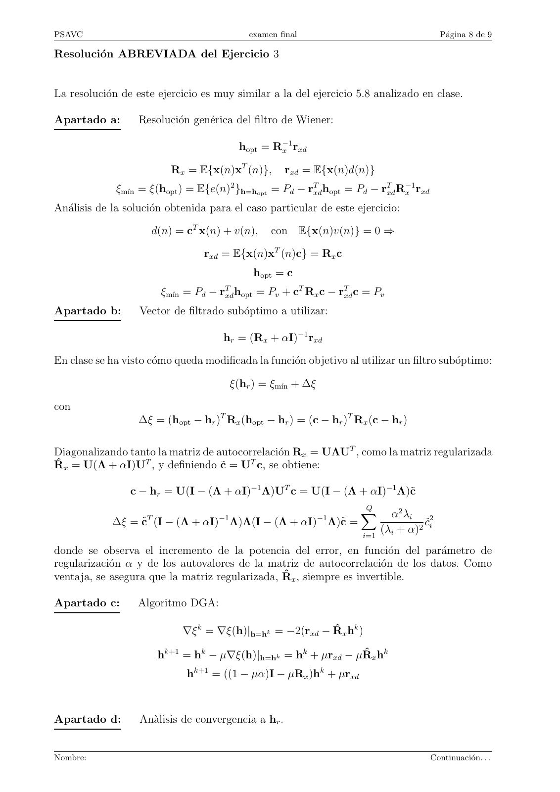
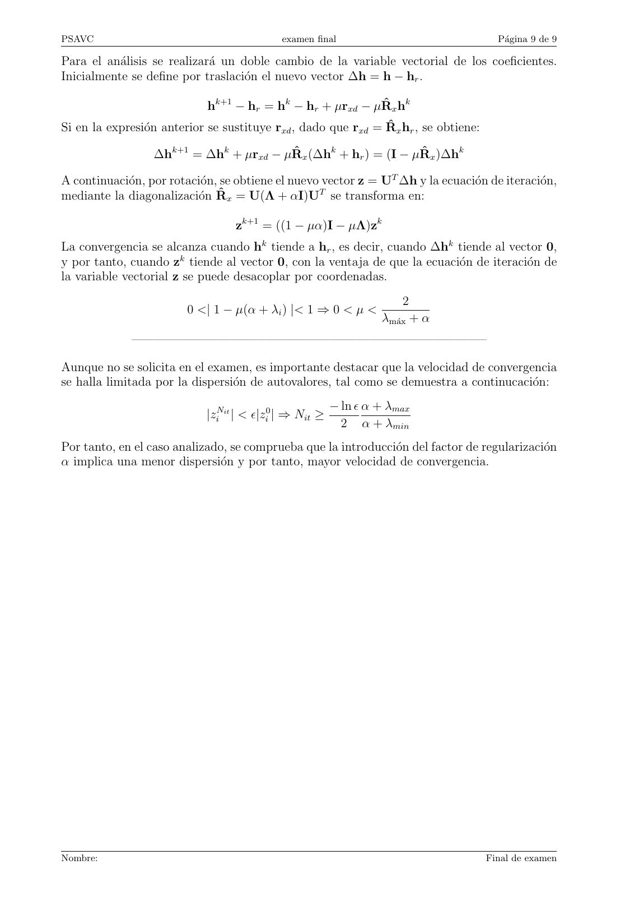

# 2025-06_Final_PSAVC

- Source PDF: `Examenes/2025-06_Final_PSAVC.pdf`
- PDF title: `2025-06_Final_PSAVC`
- Pages: 9
- Note: Transcribed from the embedded PDF text layer. Each page links to a rendered page image so figures, plots, handwriting, and formula layout can be checked against the original.

## Page 1



```text
                                                     230092 - PSAVC
                                                     Processament del Senyal AudioVisual i de
                                                     Communicacions
                                                     Examen Final
                                                     M. Cabrera, M. Lamarca
 Dept. TSC                                           10/06/2025 - Tiempo: 2:45’

Normas de realización del examen:

– Disponga de un documento identificativo con fotografı́a a la vista, durante el examen.
– No está permitido el uso ni consulta de ningún dispositivo electrónico.
– Inicie todas las hojas (examen o borrador) con su nombre.
– Inicie cada ejercicio en una hoja nueva.
– Debe justificar razonadamente todas las respuestas.


1.      Ejercicio de Detección
Se desea almacenar un fichero en un disco duro que es antiguo y es poco fiable, de manera que los
bits almacenados xi ∈ {0, 1} y los bits leı́dos yi ∈ {0, 1} son distintos con probabilidad ε < 0.5. Ası́
pues, se puede modelar el disco duro con las probabilidades:

                       Pr (yi = 1|xi = 1) = 1 − ε   Pr (yi = 0|xi = 0) = 1 − ε
                       Pr (yi = 0|xi = 1) = ε       Pr (yi = 1|xi = 0)       =ε

Con el fin de conseguir mejorar la fiabilidad de la información almacenada, se propone que cada
bit que se quiera almacenar se repita N veces en el disco. Es decir, cada bit b de información se
escribe en el disco N veces, dando lugar al vector x = [x1 , ..., xN ]T , siendo x1 = ... = xN = 0 para
b = 0 y x1 = ... = xN = 1 para b = 1.

Se desea implementar el detector de un bit de información b a partir de la observación del vector
y = [y1 , ..., yN ]T , correspondiente a la lectura del vector x almacenado en el disco. Se plantea pues
el problema de detección binaria:

                                        H0 :     x = [0, ..., 0]T
                                        H1 :     x = [1, ..., 1]T

El detector diseñado debe minimizar la probabilidad de error en la detección. Considere que los
errores aparecen de manera aleatoria e independiente para cada valor binario almacenado xi y que
los bits a guardar toman valores con probabilidad Pr (b = 1) = α, Pr (b = 0) = 1 − α.

  a) Halle la estadı́stica de las N observaciones cuando el bit almacenado es 0 y 1, es decir
     Pr (y|H0 ) y Pr (y|H1 ).

                                       Pr(y|H1 )
  b) Halle el log-likelihood ratio log Pr(y|H0)
                                                 y expréselo en términos de log 1−ε
                                                                                   ε  > 0, N y las
     observaciones yi .

     c) Halle la función de test t = T (y) y el umbral de decisión γ para minimizar la probabilidad
        de error (criterio MAP).

  d) Particularice el resultado del apartado c) para el caso de bits equiprobables, es decir Pr (b = 1) =
     Pr (b = 0) = 0.5. Interprete el resultado obtenido.


Nombre:                                                                                  Continuación. . .
```

## Page 2



```text
PSAVC                                         examen final                               Página 2 de 9

2.      Ejercicio de Estimación
En un invernadero se desea medir el grado de humedad, A. Para ello se colocan N sensores de
humedad de distinta calidad, ya que se han adquirido en distintas tiendas. La medida de cada
sensor, xi , se puede modelar como una variable real, aleatoria y gaussiana, con varianza distinta
respecto a la de los demás sensores.

                                     xi ∼ N (A, σi2 ); i = 1, ..., N

Se dispone de x, vector de medidas xi ; i = 1, ..., N , según la distribución anterior y mutuamente
independientes. Inicialmente se propone el estimador del grado de humedad.
                                                         N
                                                      1 X
                                          Â1 (x) =       xi
                                                      N
                                                        i=1

  a) Halle el error cuadrático medio del estimador Â1 (x), al que denominaremos ECM1 .

  b) Halle el estimador de máxima verosimilitud ÂM L (x) y calcule también su error cuadrático
     medio, al que denominaremos ECMM L .
                                                                                      2 ).
Se dispone de información a priori sobre la distribución de A, tal que A ∼ N (mA , σA

     c) Halle el estimador de Máxima probabilidad A Posteriori (MAP) de A, ÂM AP (x), y demuestre
        que se puede expresar como ÂM AP (x) = αÂM L (x) + (1 − α)mA . Proporcione la expresión
        de α.

  d) Particularice las expresiones obtenidas para Â1 (x), ÂM L (x) y ÂM AP (x), en el caso de que
     todos los sensores sean de igual calidad, es decir: σi2 = σx2 ; i = 1, ..., N . ¿Son estimadores
     consistentes? Justifique sus respuestas.


Nombre:                                                                                Continuación. . .
```

## Page 3



```text
PSAVC                                          examen final                                  Página 3 de 9

3.      Ejercicio de Filtrado
En numerosas aplicaciones de audio, como videollamadas o sistemas manos libres, un problema
común es la aparición de eco que, generalmente, se cancela con un filtro adaptativo. Sin embargo, la
alta correlación de estas señales provoca un deficiente comportamiento de los algoritmos de filtrado
adaptativo estándar. En este ejercicio propondremos la regularización de la matriz de correlación
de los datos como solución a este problema.

Tal como se muestra en la figura, el altavoz emite una señal x(n) que es captada por el micrófono
z(n) = x(n) ∗ c(n), interfiriendo aditivamente a la señal de audio v(n). Las señales x(n) y v(n)
son procesos aleatorios estacionarios y conjuntamente estacionarios, reales, independientes y de
media nula. El canal acústico entre el altavoz y el micrófono puede modelarse como un filtro FIR
c = [c(0), c(1), . . . , c(Q − 1)]T , cuyo orden Q suponemos conocido.


  a) Obtenga los coeficientes del filtro de Wiener hopt que minimiza el error cuadrático medio
     ξ(h) = E[e(n)2 ]. A partir de la expresión obtenida, muestre de forma explı́cita como hopt
     depende de c y halle la potencia mı́nima del error ξmı́n .

Dada la elevada correlación de los datos, se considera la implementación de un filtrado subóptimo
hr . Para ello, en la resolución del sistema de ecuaciones, en lugar de la matriz de correlación exacta,
utilice la matriz de correlación de los datos regularizada:.

                                             R̂x = Rx + αI

donde α > 0 es el parámetro de regularización.

  b) Halle el incremento del error cuadrático medio ∆ξ si se emplea hr en vez de hopt . Expréselo en
     función del parámetro α, de los autovalores λi de Rx y de los elementos del vector c̃ = UT c,
     siendo las columnas de la matriz U los autovectores de Rx .

A continuación se propone la implementación del cálculo iterativo de la solución regularizada
mediante la aplicación del algoritmo de gradiente descendente (DGA).

     c) Obtenga la ecuación del algoritmo de gradiente descendente para la minimización del error
        cuadrático medio y sustituya en ella la matriz de correlación exacta por la matriz regularizada
        R̂x .

  d) Demuestre que el algoritmo obtenido en el apartado c) converge a la solución subóptima hr
     y deduzca el valor máximo del paso de adaptación que garantiza la convergencia.


Nombre:                                                                                    Continuación. . .
```

## Page 4



```text
PSAVC                                              examen final                                  Página 4 de 9

Resolución ABREVIADA del Ejercicio 1

Apartado a: La distribución de las observaciones bajo cada hipótesis se analiza igual que
en el ejercicio 2.9 resuelto en clase.
                          N                           N
                          Y                           Y                           T          T
           Pr (y|H0 ) =         Pr (yi |xi = 0) =           εyi (1 − ε)1−yi = ε1 y (1 − ε)N −1 y
                          i=1                         i=1
                           N                           N
                          Y                           Y                               T      T
           Pr (y|H1 ) =         Pr (yi |xi = 1) =           (1 − ε)yi ε1−yi = (1 − ε)1 y εN −1 y
                          i=1                         i=1


Apartado b:

                                       N
                                                      !
                Pr (y|H1 )             X                        1−ε                    1−ε
                                                                    = 2 · 1T y − N log
                                                                                  
            log            =       2         yi − N       log
                Pr (y|H0 )             i=1
                                                                 ε                      ε


Apartado c: Para minimizar la probabilidad de error debemos comparar el log-likelihood
ratio con el umbral que depende del prior. Decidiremos H1 si
                                                                Pr (y|H1 )       Pr(H0 )
                   Pr (H0 |y) < Pr (H1 |y) ⇒ log                           > log
                                                                Pr (y|H0 )       Pr(H1 )
La función de test y el umbral de decisión serán pues
                                             N
                                   T
                                             X            N  1    1−α      1
                 t = T (y) = 1 y =                 yi >     + log     ·         =γ
                                             i=1
                                                          2  2     α    log 1−ε
                                                                             ε


Apartado d: En el caso de bits equiprobables el umbral de decisión se simplifica a

                                                                 N
                                                      T
                                                                 X            N
                                    t = T (y) = 1 y =                  yi >
                                                                 i=1
                                                                              2

Teniendo en cuenta que y es un vector de longitud N con valores {0, 1}, el detector que
minimiza la probabilidad de error en este caso es una decisión por mayorı́a: se decide que el
bit almacenado era un 1 si hay más bits leı́dos que valen 1 que bits leı́dos que valen 0.


Nombre:                                                                                      Continuación. . .
```

## Page 5



```text
PSAVC                                     examen final                                      Página 5 de 9

Resolución ABREVIADA del Ejercicio 2

Apartado a: Estimador Â1 (x): Dado que el estimador es insesgado, su ECM coincide con
su varianza. Considerando que la varianza de la suma de variables aleatorias independientes
es igual a la suma de varianzas, se obtiene.
                                                              N                       N
                                     2              1 X             1 X 2
          ECM1 = E{(Â1 (x) − A) } = var(Â1 (x)) = 2    var(xi ) = 2   σ
                                                   N i=1           N i=1 i

Resolución alternativa con notación vectorial:
La distribución del vector x es
                                             2                
                                               σ1 0      .. ..
                                             0 σ22      0 .. 
           x ∼ N (1A, Cx )      con Cx =                       = diag[σ12 , ..., σN
                                                                                    2
                                                                                      ]
                                             .. ..      .. .. 
                                                             2
                                                 .. ..   0 σN
el estimador se puede expresar en notación vectorial cómo Â1 (x) = N1 1T x.
Se comprueba fácilmente que es insesgado con lo cual:
                                                                     N
                           1 T                    T     1 T        1 X 2
     ECM1 = var(Â1 (x)) = 2 1 E{(x − 1A) (x − 1A) }1 = 2 1 Cx 1 = 2   σ
                          N                            N          N i=1 i

Apartado b: Estimador ML:
La función de densidad de probabilidad (pdf) de x es igual a:
                                    N                           
                                   Y     1            1        2
                       fx (x; A) =     p      exp − 2 (xi − A)
                                   i=1  2πσi
                                            2        2σi

y su log-likelihood es:
                                               N           N
                                N           1X            X    1
                ln fx (x; A) = − ln(2π) − −           2
                                                  ln σi −        2
                                                                   (xi − A)2
                                2           2 i=1         i=1
                                                              2σ i

derivando respecto al parámetro a estimar e igualando a cero se obtiene:
                               N
                                                                      PN xi
              ∂ ln fx (x; A) X 1                                       i=1 σi2
                            =        (x i − A) = 0  ⇒    Â M L (x) =
                   ∂A             σ2                                   N    1
                                                                      P
                              i=1 i                                    i=1 2     σi

Se comprueba fácilmente que el estimador obtenido es insesgado por lo que:
                                                          PN var(xi )
                                                            i=1  σ4     1
          ECMM L = E{(ÂM L (x) − A)2 } = var(ÂM L (x)) = PN 1 i = PN 1
                                                           ( i=1 σ2 )2 i=1 σ 2
                                                                        i                    i


Resolución alternativa con notación vectorial:
La función de densidad de probabilidad (pdf) de x es igual a:
                                                                     
                                  1                1         T −1
               fx (x; A) = p                exp − (x − 1A) Cx (x − 1A)
                             (2π)N det(Cx )        2
y su log-likelihood es:
                               N         1             1
            ln fx (x; A) = −     ln(2π) − ln det(Cx ) − (x − 1A)T C−1
                                                                   x (x − 1A)
                               2         2             2

Nombre:                                                                                   Continuación. . .
```

## Page 6



```text
PSAVC                                       examen final                                        Página 6 de 9

derivando respecto al parámetro a estimar e igualando a cero se obtiene:
            ∂ ln fx (x; A)                                                            1T C−1
                                                                                          x x
                           = 1T C−1     T −1
                                 x x − 1 Cx 1A = 0                  ⇒   ÂM L (x) =
                 ∂A                                                                   1 C−1
                                                                                       T
                                                                                          x 1

Se comprueba fácilmente que el estimador obtenido es insesgado por lo que:

                      ECMM L = E{(ÂM L (x) − A)2 } = var(ÂM L (x)) =
                          1                                T     −1
                        T  −1 2
                                 1T C−1
                                     x E{(x − 1A) (x − 1A) }Cx 1 =
                      (1 Cx 1)
                          1                          1            1
                        T  −1  2
                                 1T C−1    −1
                                     x Cx Cx 1 = T −1 = PN           1
                      (1 Cx 1)                    1 Cx 1         i=1 2           σi

Apartado c: Estimador MAP:

                                                N
                                                Y     1     − 12 (xi −A)2   1     − 12 (A−mA )2
                                                                                   2σ
      ÂM AP (x) = arg máx fx (x; A)fA (A) =       p
                                                         2
                                                           e 2σn          p
                                                                               2
                                                                                 e    A
                        A
                                                i=1  2πσi                  2πσA

derivando el logaritmo natural de la expresión anterior e igualando a cero se obtiene:
                                        N
              ∂ ln fx (x; A)fA (A) X 1                       1
                                    =        2
                                               (x i − A)  −   2
                                                                (A − mA ) = 0    ⇒
                       ∂A              i=1
                                           σi               σA
                                           PN xi        mA
                                             i=1 σi2 + σA 2
                            ÂM AP (x) = PN 1            1
                                                            = αÂM L (x) + (1 − α)mA
                                              i=1 σ 2 + σ 2
                                                  i        A

con                                              PN        1
                                                      i=1 σi2
                                       α = PN        1     1
                                                i=1 σi2 + σA
                                                           2


Resolución alternativa con notación vectorial:

                                        ÂM AP (x) = arg máx fx (x; A)fA (A) =
                                                       A
                1              1                             1      − 12 (A−mA )2
          p               exp − (x − 1A)T C−1
                                           x  (x − 1A) p          e  2σ
                                                                        A
           (2π)N det(Cx )      2                            2πσA2
derivando el logaritmo natural de la expresión anterior e igualando a cero se obtiene:
           ∂ ln fx (x; A)fA (A)                           1
                                 = 1T C−1      T −1
                                        x x − 1 Cx 1A − 2 (A − mA ) = 0       ⇒
                    ∂A                                   σA
                                                      mA
                                            1T C−1
                                                x x + σ2
                               ÂM AP (x) = T −1       A
                                                         = αÂM L (x) + (1 − α)mA
                                            1 Cx 1 + σ12
                                                                A

con
                                               1T C−1
                                                    x 1
                                       α=
                                            1 Cx 1 + σ12
                                             T   −1
                                                                A

Apartado d: Varianzas iguales.

                                                      N
                                              1 X                          σx2
                        Â1 (x) = ÂM L (x) =       xn ;            ECM1 =
                                              N n=1                        N


Nombre:                                                                                    Continuación. . .
```

## Page 7


```text
PSAVC                                      examen final                          Página 7 de 9

En este caso los estimadores Â1 (x) y ÂM L (x) son el mismo estimador, que además resulta
consistente debido a que cuando N → ∞, su ECM tiende a cero.

El estimador ÂM AP (x) resulta

                                                                  N σA2
                  ÂM AP (x) = αÂM L (x) + (1 − α)mA ;      α= 2
                                                               σx + N σA2
El estimador resulta sesgado

                               E{ÂM AP (x)} = αA + (1 − α)mA

y su varianza es igual a
                                  var(ÂM AP ) = α2 var(ÂM L )
Dado que cuando N → ∞, α tiende a 1, el estimador resulta asintóticamente insesgado y
su varianza tiende a cero, por lo que también es un estimador consistente.


Nombre:                                                                        Continuación. . .
```

## Page 8



```text
PSAVC                                          examen final                                Página 8 de 9

Resolución ABREVIADA del Ejercicio 3


La resolución de este ejercicio es muy similar a la del ejercicio 5.8 analizado en clase.

Apartado a:       Resolución genérica del filtro de Wiener:

                                              hopt = R−1
                                                      x rxd

                          Rx = E{x(n)xT (n)},          rxd = E{x(n)d(n)}
             ξmı́n = ξ(hopt ) = E{e(n) }h=hopt = Pd − rTxd hopt = Pd − rTxd R−1
                                          2
                                                                             x rxd

Análisis de la solución obtenida para el caso particular de este ejercicio:

                     d(n) = cT x(n) + v(n),         con E{x(n)v(n)} = 0 ⇒

                                 rxd = E{x(n)xT (n)c} = Rx c
                                                hopt = c
                        ξmı́n = Pd − rTxd hopt = Pv + cT Rx c − rTxd c = Pv
Apartado b:        Vector de filtrado subóptimo a utilizar:

                                      hr = (Rx + αI)−1 rxd

En clase se ha visto cómo queda modificada la función objetivo al utilizar un filtro subóptimo:

                                          ξ(hr ) = ξmı́n + ∆ξ

con
                  ∆ξ = (hopt − hr )T Rx (hopt − hr ) = (c − hr )T Rx (c − hr )

Diagonalizando tanto la matriz de autocorrelación Rx = UΛUT , como la matriz regularizada
R̂x = U(Λ + αI)UT , y definiendo c̃ = UT c, se obtiene:

                 c − hr = U(I − (Λ + αI)−1 Λ)UT c = U(I − (Λ + αI)−1 Λ)c̃
                                                                     Q
                                     −1                         −1
                                                                     X       α2 λi
                    T
            ∆ξ = c̃ (I − (Λ + αI) Λ)Λ(I − (Λ + αI) Λ)c̃ =                            c̃2
                                                                                    2 i
                                                                      i=1
                                                                          (λi +  α)
donde se observa el incremento de la potencia del error, en función del parámetro de
regularización α y de los autovalores de la matriz de autocorrelación de los datos. Como
ventaja, se asegura que la matriz regularizada, R̂x , siempre es invertible.

Apartado c:       Algoritmo DGA:

                            ∇ξ k = ∇ξ(h)|h=hk = −2(rxd − R̂x hk )

                        hk+1 = hk − µ∇ξ(h)|h=hk = hk + µrxd − µR̂x hk
                             hk+1 = ((1 − µα)I − µRx )hk + µrxd


Apartado d:        Anàlisis de convergencia a hr .


Nombre:                                                                                Continuación. . .
```

## Page 9



```text
PSAVC                                       examen final                                Página 9 de 9

Para el análisis se realizará un doble cambio de la variable vectorial de los coeficientes.
Inicialmente se define por traslación el nuevo vector ∆h = h − hr .

                            hk+1 − hr = hk − hr + µrxd − µR̂x hk
Si en la expresión anterior se sustituye rxd , dado que rxd = R̂x hr , se obtiene:

                  ∆hk+1 = ∆hk + µrxd − µR̂x (∆hk + hr ) = (I − µR̂x )∆hk

A continuación, por rotación, se obtiene el nuevo vector z = UT ∆h y la ecuación de iteración,
mediante la diagonalización R̂x = U(Λ + αI)UT se transforma en:

                                  zk+1 = ((1 − µα)I − µΛ)zk
La convergencia se alcanza cuando hk tiende a hr , es decir, cuando ∆hk tiende al vector 0,
y por tanto, cuando zk tiende al vector 0, con la ventaja de que la ecuación de iteración de
la variable vectorial z se puede desacoplar por coordenadas.
                                                                      2
                        0 <| 1 − µ(α + λi ) |< 1 ⇒ 0 < µ <
                                                                  λmáx + α
             ————————————————————————————–

Aunque no se solicita en el examen, es importante destacar que la velocidad de convergencia
se halla limitada por la dispersión de autovalores, tal como se demuestra a continucación:
                                                         − ln ϵ α + λmax
                            |ziNit | < ϵ|zi0 | ⇒ Nit ≥
                                                           2 α + λmin
Por tanto, en el caso analizado, se comprueba que la introducción del factor de regularización
α implica una menor dispersión y por tanto, mayor velocidad de convergencia.


Nombre:                                                                               Final de examen
```
