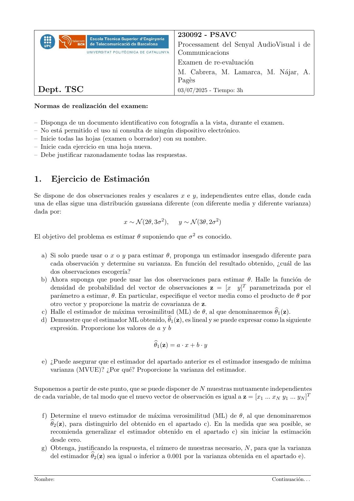
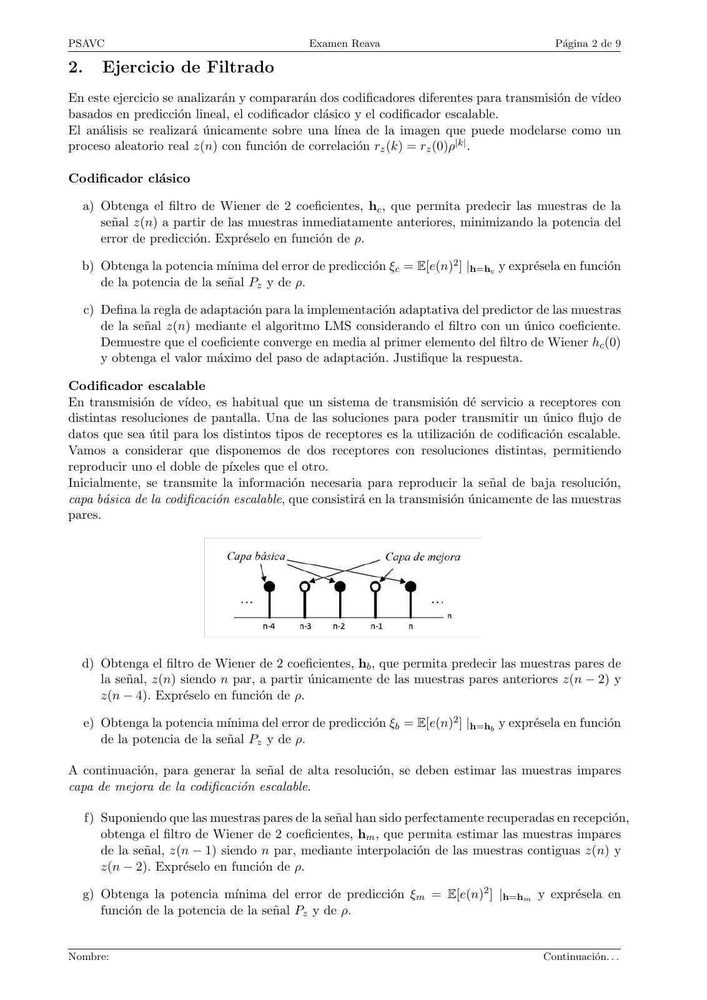
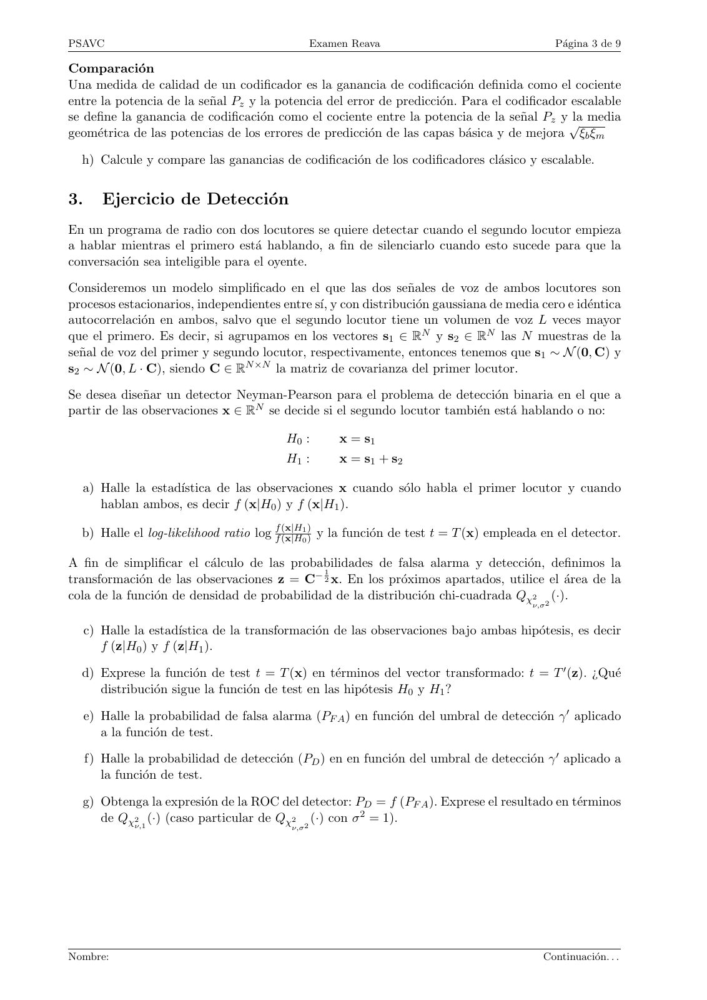
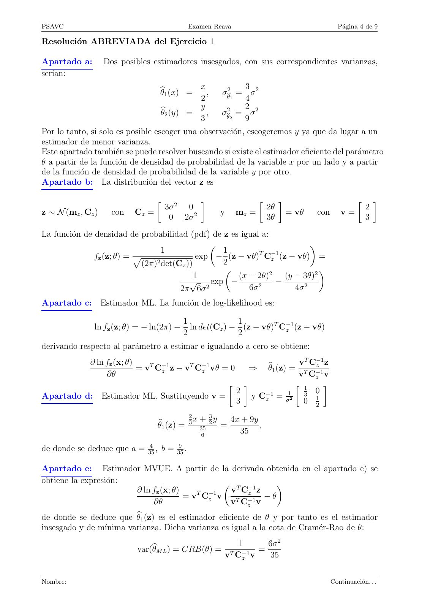
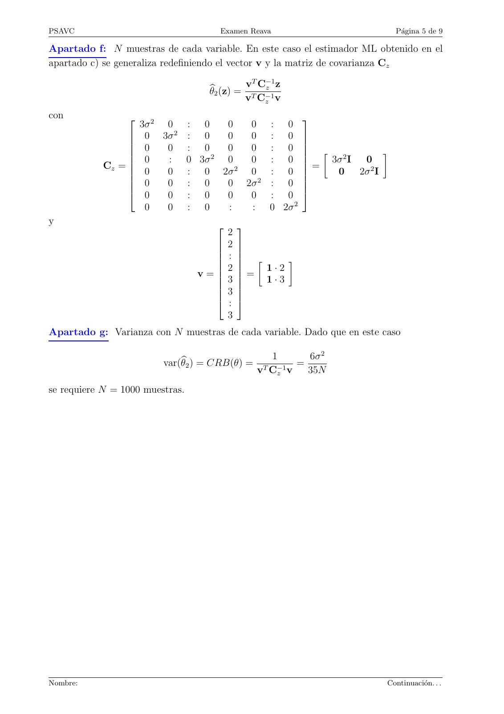
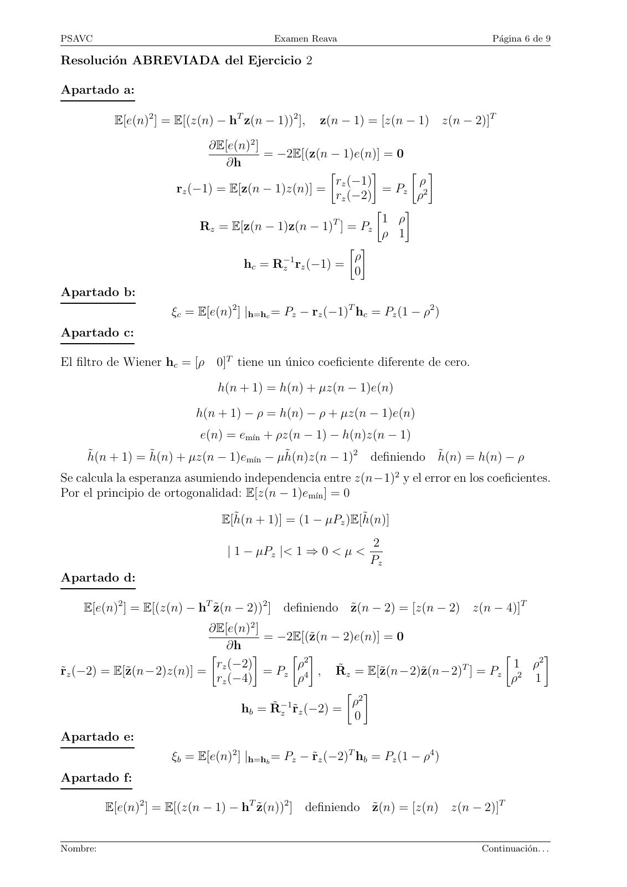
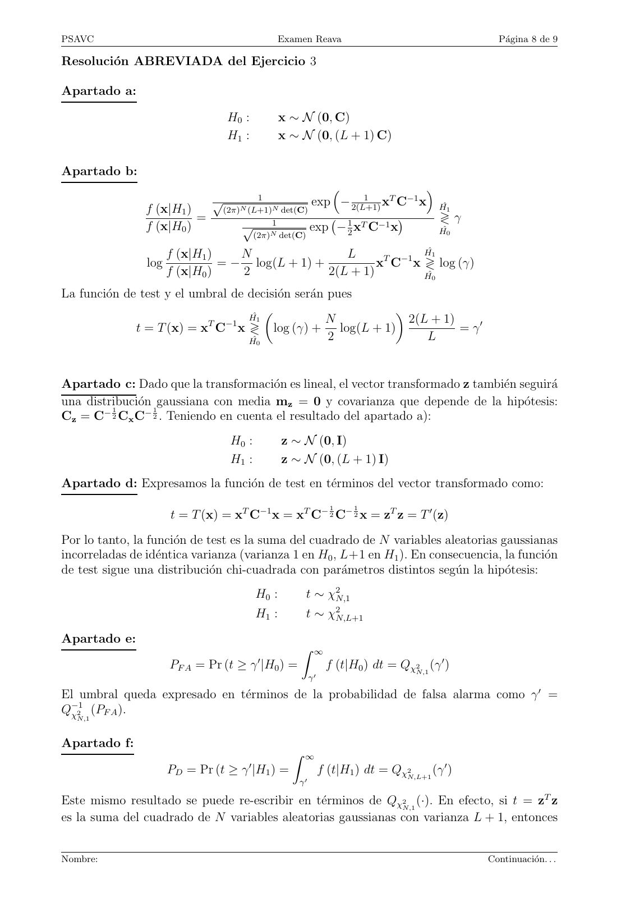
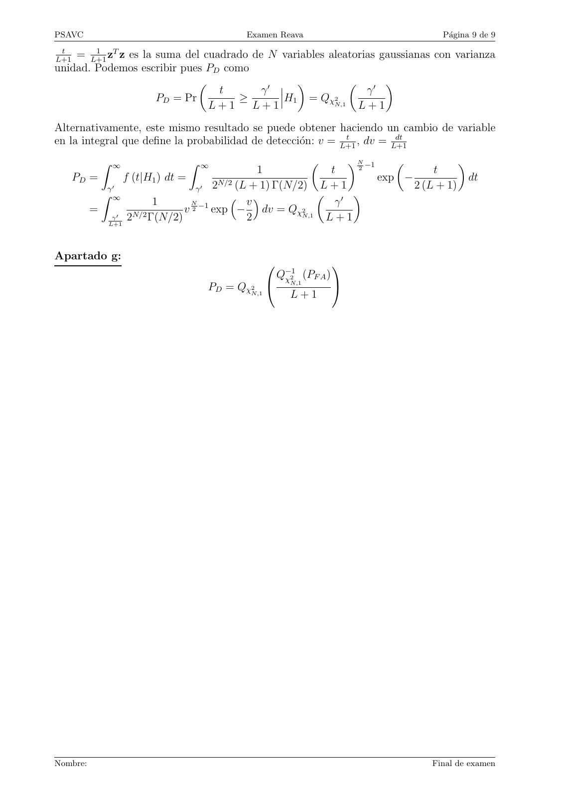
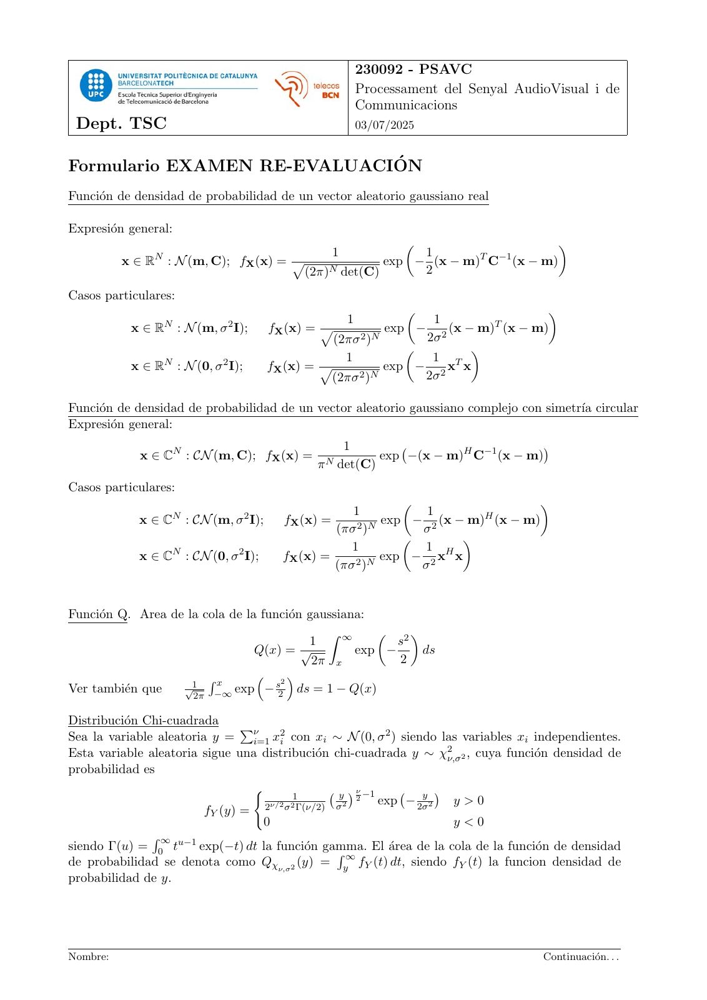
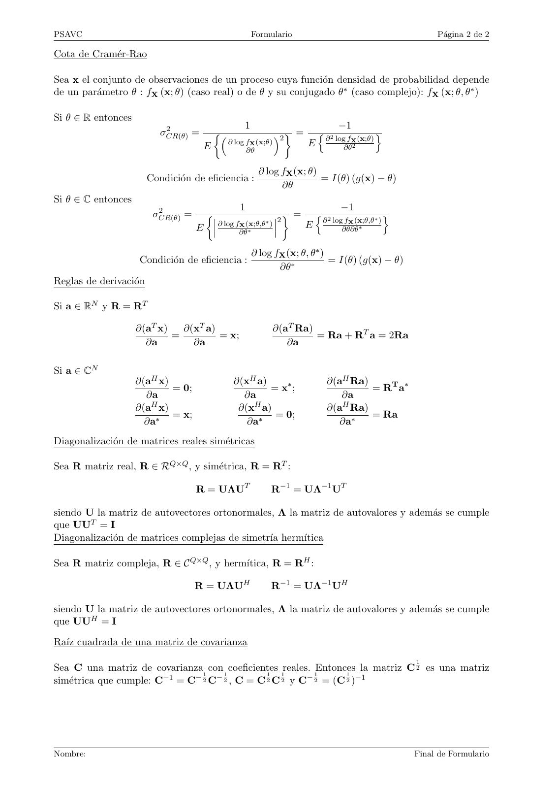

# 2025-07_REAVA_PSAVC_RESUELTO_FORMULARIO

- Source PDF: `Examenes/2025-07_REAVA_PSAVC_RESUELTO_FORMULARIO.pdf`
- PDF title: `2025-07_REAVA_PSAVC_RESUELTO_FORMULARIO`
- Pages: 11
- Note: Transcribed from the embedded PDF text layer. Each page links to a rendered page image so figures, plots, handwriting, and formula layout can be checked against the original.

## Page 1



```text
                                                       230092 - PSAVC
                                                       Processament del Senyal AudioVisual i de
                                                       Communicacions
                                                       Examen de re-evaluación
                                                       M. Cabrera, M. Lamarca, M. Nájar, A.
                                                       Pagès
 Dept. TSC                                             03/07/2025 - Tiempo: 3h

Normas de realización del examen:

– Disponga de un documento identificativo con fotografı́a a la vista, durante el examen.
– No está permitido el uso ni consulta de ningún dispositivo electrónico.
– Inicie todas las hojas (examen o borrador) con su nombre.
– Inicie cada ejercicio en una hoja nueva.
– Debe justificar razonadamente todas las respuestas.


1.      Ejercicio de Estimación
Se dispone de dos observaciones reales y escalares x e y, independientes entre ellas, donde cada
una de ellas sigue una distribución gaussiana diferente (con diferente media y diferente varianza)
dada por:
                                 x ∼ N (2θ, 3σ 2 ),    y ∼ N (3θ, 2σ 2 )

El objetivo del problema es estimar θ suponiendo que σ 2 es conocido.

  a) Si solo puede usar o x o y para estimar θ, proponga un estimador insesgado diferente para
     cada observación y determine su varianza. En función del resultado obtenido, ¿cuál de las
     dos observaciones escogerı́a?
  b) Ahora suponga que puede usar las dos observaciones para estimar θ. Halle la función de
     densidad de probabilidad del vector de observaciones z = [x y]T parametrizada por el
     parámetro a estimar, θ. En particular, especifique el vector media como el producto de θ por
     otro vector y proporcione la matriz de covarianza de z.
  c) Halle el estimador de máxima verosimilitud (ML) de θ, al que denominaremos θb1 (z).
  d) Demuestre que el estimador ML obtenido, θb1 (z), es lineal y se puede expresar como la siguiente
     expresión. Proporcione los valores de a y b

                                             θb1 (z) = a · x + b · y

     e) ¿Puede asegurar que el estimador del apartado anterior es el estimador insesgado de mı́nima
        varianza (MVUE)? ¿Por qué? Proporcione la varianza del estimador.

Suponemos a partir de este punto, que se puede disponer de N muestras mutuamente independientes
de cada variable, de tal modo que el nuevo vector de observación es igual a z = [x1 ... xN y1 ... yN ]T

  f) Determine el nuevo estimador de máxima verosimilitud (ML) de θ, al que denominaremos
     θb2 (z), para distinguirlo del obtenido en el apartado c). En la medida que sea posible, se
     recomienda generalizar el estimador obtenido en el apartado c) sin iniciar la estimación
     desde cero.
  g) Obtenga, justificando la respuesta, el número de muestras necesario, N , para que la varianza
     del estimador θb2 (z) sea igual o inferior a 0.001 por la varianza obtenida en el apartado e).


Nombre:                                                                                  Continuación. . .
```

## Page 2



```text
PSAVC                                          Examen Reava                                  Página 2 de 9

2.      Ejercicio de Filtrado
En este ejercicio se analizarán y compararán dos codificadores diferentes para transmisión de vı́deo
basados en predicción lineal, el codificador clásico y el codificador escalable.
El análisis se realizará únicamente sobre una lı́nea de la imagen que puede modelarse como un
proceso aleatorio real z(n) con función de correlación rz (k) = rz (0)ρ|k| .

Codificador clásico

  a) Obtenga el filtro de Wiener de 2 coeficientes, hc , que permita predecir las muestras de la
     señal z(n) a partir de las muestras inmediatamente anteriores, minimizando la potencia del
     error de predicción. Expréselo en función de ρ.

  b) Obtenga la potencia mı́nima del error de predicción ξc = E[e(n)2 ] |h=hc y exprésela en función
     de la potencia de la señal Pz y de ρ.

     c) Defina la regla de adaptación para la implementación adaptativa del predictor de las muestras
        de la señal z(n) mediante el algoritmo LMS considerando el filtro con un único coeficiente.
        Demuestre que el coeficiente converge en media al primer elemento del filtro de Wiener hc (0)
        y obtenga el valor máximo del paso de adaptación. Justifique la respuesta.

Codificador escalable
En transmisión de vı́deo, es habitual que un sistema de transmisión dé servicio a receptores con
distintas resoluciones de pantalla. Una de las soluciones para poder transmitir un único flujo de
datos que sea útil para los distintos tipos de receptores es la utilización de codificación escalable.
Vamos a considerar que disponemos de dos receptores con resoluciones distintas, permitiendo
reproducir uno el doble de pı́xeles que el otro.
Inicialmente, se transmite la información necesaria para reproducir la señal de baja resolución,
capa básica de la codificación escalable, que consistirá en la transmisión únicamente de las muestras
pares.


  d) Obtenga el filtro de Wiener de 2 coeficientes, hb , que permita predecir las muestras pares de
     la señal, z(n) siendo n par, a partir únicamente de las muestras pares anteriores z(n − 2) y
     z(n − 4). Expréselo en función de ρ.

     e) Obtenga la potencia mı́nima del error de predicción ξb = E[e(n)2 ] |h=hb y exprésela en función
        de la potencia de la señal Pz y de ρ.

A continuación, para generar la señal de alta resolución, se deben estimar las muestras impares
capa de mejora de la codificación escalable.

     f) Suponiendo que las muestras pares de la señal han sido perfectamente recuperadas en recepción,
        obtenga el filtro de Wiener de 2 coeficientes, hm , que permita estimar las muestras impares
        de la señal, z(n − 1) siendo n par, mediante interpolación de las muestras contiguas z(n) y
        z(n − 2). Expréselo en función de ρ.

  g) Obtenga la potencia mı́nima del error de predicción ξm = E[e(n)2 ] |h=hm y exprésela en
     función de la potencia de la señal Pz y de ρ.


Nombre:                                                                                    Continuación. . .
```

## Page 3



```text
PSAVC                                            Examen Reava                                 Página 3 de 9

Comparación
Una medida de calidad de un codificador es la ganancia de codificación definida como el cociente
entre la potencia de la señal Pz y la potencia del error de predicción. Para el codificador escalable
se define la ganancia de codificación como el cociente entre la potencia de la señal Pz y √ la media
geométrica de las potencias de los errores de predicción de las capas básica y de mejora ξb ξm

  h) Calcule y compare las ganancias de codificación de los codificadores clásico y escalable.


3.      Ejercicio de Detección
En un programa de radio con dos locutores se quiere detectar cuando el segundo locutor empieza
a hablar mientras el primero está hablando, a fin de silenciarlo cuando esto sucede para que la
conversación sea inteligible para el oyente.

Consideremos un modelo simplificado en el que las dos señales de voz de ambos locutores son
procesos estacionarios, independientes entre sı́, y con distribución gaussiana de media cero e idéntica
autocorrelación en ambos, salvo que el segundo locutor tiene un volumen de voz L veces mayor
que el primero. Es decir, si agrupamos en los vectores s1 ∈ RN y s2 ∈ RN las N muestras de la
señal de voz del primer y segundo locutor, respectivamente, entonces tenemos que s1 ∼ N (0, C) y
s2 ∼ N (0, L · C), siendo C ∈ RN ×N la matriz de covarianza del primer locutor.

Se desea diseñar un detector Neyman-Pearson para el problema de detección binaria en el que a
partir de las observaciones x ∈ RN se decide si el segundo locutor también está hablando o no:

                                          H0 :        x = s1
                                          H1 :        x = s1 + s2

  a) Halle la estadı́stica de las observaciones x cuando sólo habla el primer locutor y cuando
     hablan ambos, es decir f (x|H0 ) y f (x|H1 ).

  b) Halle el log-likelihood ratio log ff (x|H 1)
                                          (x|H0 ) y la función de test t = T (x) empleada en el detector.

A fin de simplificar el cálculo de las probabilidades de falsa alarma y detección, definimos la
                                              1
transformación de las observaciones z = C− 2 x. En los próximos apartados, utilice el área de la
cola de la función de densidad de probabilidad de la distribución chi-cuadrada Qχ2 2 (·).
                                                                                        ν,σ


     c) Halle la estadı́stica de la transformación de las observaciones bajo ambas hipótesis, es decir
        f (z|H0 ) y f (z|H1 ).

  d) Exprese la función de test t = T (x) en términos del vector transformado: t = T ′ (z). ¿Qué
     distribución sigue la función de test en las hipótesis H0 y H1 ?

     e) Halle la probabilidad de falsa alarma (PF A ) en función del umbral de detección γ ′ aplicado
        a la función de test.

     f) Halle la probabilidad de detección (PD ) en en función del umbral de detección γ ′ aplicado a
        la función de test.

  g) Obtenga la expresión de la ROC del detector: PD = f (PF A ). Exprese el resultado en términos
     de Qχ2ν,1 (·) (caso particular de Qχ2 2 (·) con σ 2 = 1).
                                           ν,σ


Nombre:                                                                                   Continuación. . .
```

## Page 4



```text
PSAVC                                      Examen Reava                                        Página 4 de 9

Resolución ABREVIADA del Ejercicio 1

Apartado a:        Dos posibles estimadores insesgados, con sus correspondientes varianzas,
serı́an:
                                             x                 3
                                  θb1 (x) =    ,        σθ2b1 = σ 2
                                             2                 4
                                             y                 2
                                   θb2 (y) =   ,        σθ2b2 = σ 2
                                             3                 9
Por lo tanto, si solo es posible escoger una observación, escogeremos y ya que da lugar a un
estimador de menor varianza.
Este apartado también se puede resolver buscando si existe el estimador eficiente del parámetro
θ a partir de la función de densidad de probabilidad de la variable x por un lado y a partir
de la función de densidad de probabilidad de la variable y por otro.
Apartado b: La distribución del vector z es

                                                                                                          
                                      3σ 2 0                           2θ                                  2
z ∼ N (mz , Cz )     con   Cz =                         y   mz =                = vθ   con      v=
                                       0 2σ 2                          3θ                                  3
La función de densidad de probabilidad (pdf) de z es igual a:
                                                                       
                                   1               1        T −1
               fz (z; θ) = p                 exp − (z − vθ) Cz (z − vθ) =
                             (2π)2 det(Cz ))       2
                                                      (x − 2θ)2 (y − 3θ)2
                                                                         
                                             1
                                           √    exp −          −
                                        2π 6σ 2          6σ 2      4σ 2
Apartado c: Estimador ML. La función de log-likelihood es:

                                          1              1
              ln fz (z; θ) = − ln(2π) −     ln det(Cz ) − (z − vθ)T C−1
                                                                     z (z − vθ)
                                          2              2
derivando respecto al parámetro a estimar e igualando a cero se obtiene:
                                                                     T −1
          ∂ ln fz (x; θ)
                         = vT C−1 z − v T −1
                                         C   vθ = 0   ⇒   b1 (z) = v Cz z
                                                          θ
                               z           z
               ∂θ                                                   vT C−1
                                                                        z v
                                                                  1     
                                                    2    −1      1      0
Apartado d: Estimador ML. Sustituyendo v =            y Cz = σ 2 3 1
                                                    3                0 2
                                           2        3
                                             x+ y    4x + 9y
                                  θb1 (z) = 3 35 2 =         ,
                                              6
                                                       35
                           4         9
de donde se deduce que a = 35 , b = 35 .

Apartado e: Estimador MVUE. A partir de la derivada obtenida en el apartado c) se
obtiene la expresión:                          T −1      
                       ∂ ln fz (x; θ)    T −1   v Cz z
                                      = v Cz v          −θ
                            ∂θ                  vT C−1
                                                    z v

de donde se deduce que θb1 (z) es el estimador eficiente de θ y por tanto es el estimador
insesgado y de mı́nima varianza. Dicha varianza es igual a la cota de Cramér-Rao de θ:
                                                           1      6σ 2
                           var(θbM L ) = CRB(θ) =               =
                                                        vT C−1
                                                            z v    35


Nombre:                                                                                      Continuación. . .
```

## Page 5



```text
PSAVC                                  Examen Reava                             Página 5 de 9

Apartado f: N muestras de cada variable. En este caso el estimador ML obtenido en el
apartado c) se generaliza redefiniendo el vector v y la matriz de covarianza Cz
                                              T    −1
                                              v Cz z
                                     θb2 (z) = T −1
                                              v Cz v
con
                   3σ 2 0        : 0    0  0        : 0
                                                          
                  0 3σ 2        : 0    0  0        : 0 
                  0    0        : 0    0  0        : 0  
                                                          
                                      2
                                                                            
                  0    :        0 3σ   0  0        : 0      3σ 2 I  0
                                                          
            Cz =                                          =
                  0    0        : 0 2σ 2 0         : 0       0     2σ 2 I
                  0
                       0        : 0    0 2σ 2      : 0   
                  0    0        : 0    0  0        : 0 
                    0   0        : 0    :  :        0 2σ 2
y
                                      2
                                       
                                     2 
                                     :  
                                     
                                                
                                     2    1·2
                                     
                                  v= =
                                     3    1·3
                                     3 
                                     
                                     : 
                                      3
Apartado g: Varianza con N muestras de cada variable. Dado que en este caso

                                                     1      6σ 2
                         var(θb2 ) = CRB(θ) =             =
                                                  vT C−1
                                                      z v   35N
se requiere N = 1000 muestras.


Nombre:                                                                     Continuación. . .
```

## Page 6



```text
PSAVC                                      Examen Reava                            Página 6 de 9

Resolución ABREVIADA del Ejercicio 2

Apartado a:

           E[e(n)2 ] = E[(z(n) − hT z(n − 1))2 ],   z(n − 1) = [z(n − 1) z(n − 2)]T
                             ∂E[e(n)2 ]
                                        = −2E[(z(n − 1)e(n)] = 0
                                ∂h
                                                                   
                                                      rz (−1)        ρ
                       rz (−1) = E[z(n − 1)z(n)] =              = Pz 2
                                                      rz (−2)        ρ
                                                                  
                                                                1 ρ
                            Rz = E[z(n − 1)z(n − 1)T ] = Pz
                                                               ρ 1
                                                          
                                                          ρ
                                   hc = R−1z rz (−1) = 0

Apartado b:
                      ξc = E[e(n)2 ] |h=hc = Pz − rz (−1)T hc = Pz (1 − ρ2 )
Apartado c:

El filtro de Wiener hc = [ρ 0]T tiene un único coeficiente diferente de cero.

                               h(n + 1) = h(n) + µz(n − 1)e(n)

                           h(n + 1) − ρ = h(n) − ρ + µz(n − 1)e(n)
                            e(n) = emı́n + ρz(n − 1) − h(n)z(n − 1)
     h̃(n + 1) = h̃(n) + µz(n − 1)emı́n − µh̃(n)z(n − 1)2     definiendo h̃(n) = h(n) − ρ
Se calcula la esperanza asumiendo independencia entre z(n−1)2 y el error en los coeficientes.
Por el principio de ortogonalidad: E[z(n − 1)emı́n ] = 0

                                E[h̃(n + 1)] = (1 − µPz )E[h̃(n)]
                                                              2
                                 | 1 − µPz |< 1 ⇒ 0 < µ <
                                                              Pz
Apartado d:

    E[e(n)2 ] = E[(z(n) − hT z̃(n − 2))2 ] definiendo z̃(n − 2) = [z(n − 2) z(n − 4)]T
                            ∂E[e(n)2 ]
                                       = −2E[(z̃(n − 2)e(n)] = 0
                                ∂h
                                           2                                   
                              rz (−2)         ρ                       T        1 ρ2
r̃z (−2) = E[z̃(n−2)z(n)] =            = Pz 4 , R̃z = E[z̃(n−2)z̃(n−2) ] = Pz 2
                              rz (−4)         ρ                                ρ 1
                                                        2
                                                        ρ
                                   hb = R̃−1
                                          z r̃z (−2) =  0
Apartado e:
                      ξb = E[e(n)2 ] |h=hb = Pz − r̃z (−2)T hb = Pz (1 − ρ4 )
Apartado f:

          E[e(n)2 ] = E[(z(n − 1) − hT z̃(n))2 ] definiendo z̃(n) = [z(n) z(n − 2)]T


Nombre:                                                                          Continuación. . .
```

## Page 7


```text
PSAVC                                   Examen Reava                              Página 7 de 9

                                ∂E[e(n)2 ]
                                            = −2E[(z̃(n)e(n)] = 0
                                    ∂h
                                                                                   
                                    rz (1)         ρ                      T        1 ρ2
    r̃z (1) = E[z̃(n)z(n − 1)] =             = Pz     , R̃z = E[z̃(n)z̃(n) ] = Pz 2
                                   rz (−1)         ρ                               ρ 1
                                                             
                                           −1           ρ    1
                                 hm = R̃z r̃z (1) =
                                                     1+ρ 12

Apartado g:
                                                                    1 − ρ2
                    ξem = E[e(n)2 ] |h=hm = Pz − r̃z (1)T hm = Pz
                                                                    1 + ρ2
Apartado h:
                                            Pz     1
                                     Gc =      =
                                            ξc   1 − ρ2
                                       s
                              Pz                 1 + ρ2          1
                       Ge = √      =              4       2
                                                             =
                             ξb ξm          (1 − ρ )(1 − ρ )   1 − ρ2


Nombre:                                                                         Continuación. . .
```

## Page 8



```text
PSAVC                                               Examen Reava                                         Página 8 de 9

Resolución ABREVIADA del Ejercicio 3

Apartado a:

                                  H0 :              x ∼ N (0, C)
                                  H1 :              x ∼ N (0, (L + 1) C)

Apartado b:
                                                                                            
                              √           1
                                                      exp                     1
                                                                         − 2(L+1) xT C−1 x
                f (x|H1 )         (2π)N (L+1)N det(C)                                            Ĥ1
                          =                                                                      ≷γ
                                      √         1
                                                                        − 21 xT C−1 x
                                                                                        
                f (x|H0 )                                    exp                                 Ĥ0
                                           (2π)N det(C)

                      f (x|H1 )    N                L              Ĥ1
                log             = − log(L + 1) +          xT C−1 x ≷ log (γ)
                      f (x|H0 )    2             2(L + 1)          Ĥ0

La función de test y el umbral de decisión serán pues
                                                        
                           T −1
                                   Ĥ1             N       2(L + 1)
              t = T (x) = x C x ≷ log (γ) + log(L + 1)              = γ′
                                   Ĥ0              2         L


Apartado c: Dado que la transformación es lineal, el vector transformado z también seguirá
una distribución gaussiana con media mz = 0 y covarianza que depende de la hipótesis:
         1       1
Cz = C− 2 Cx C− 2 . Teniendo en cuenta el resultado del apartado a):
                                   H0 :             z ∼ N (0, I)
                                   H1 :             z ∼ N (0, (L + 1) I)
Apartado d: Expresamos la función de test en términos del vector transformado como:
                                                                    1      1
                      t = T (x) = xT C−1 x = xT C− 2 C− 2 x = zT z = T ′ (z)
Por lo tanto, la función de test es la suma del cuadrado de N variables aleatorias gaussianas
incorreladas de idéntica varianza (varianza 1 en H0 , L+1 en H1 ). En consecuencia, la función
de test sigue una distribución chi-cuadrada con parámetros distintos según la hipótesis:
                                           H0 :           t ∼ χ2N,1
                                           H1 :           t ∼ χ2N,L+1
Apartado e:
                                                        Z ∞
                                            ′
                      PF A = Pr (t ≥ γ |H0 ) =                     f (t|H0 ) dt = Qχ2N,1 (γ ′ )
                                                             γ′

El umbral queda expresado en términos de la probabilidad de falsa alarma como γ ′ =
Q−1
 χ2
    (PF A ).
  N,1


Apartado f:
                                                      Z ∞
                                       ′
                      PD = Pr (t ≥ γ |H1 ) =                      f (t|H1 ) dt = Qχ2N,L+1 (γ ′ )
                                                        γ′

Este mismo resultado se puede re-escribir en términos de Qχ2N,1 (·). En efecto, si t = zT z
es la suma del cuadrado de N variables aleatorias gaussianas con varianza L + 1, entonces


Nombre:                                                                                                Continuación. . .
```

## Page 9



```text
PSAVC                                     Examen Reava                             Página 9 de 9
 t      1
L+1
    = L+1 zT z es la suma del cuadrado de N variables aleatorias gaussianas con varianza
unidad. Podemos escribir pues PD como
                                         γ′
                                                         ′ 
                                 t                            γ
                     PD = Pr        ≥       H1 = Qχ2N,1
                               L+1     L+1                  L+1
Alternativamente, este mismo resultado se puede obtener haciendo un cambio de variable
                                                              t          dt
en la integral que define la probabilidad de detección: v = L+1 , dv = L+1
            Z ∞               Z ∞                              N2 −1                
                                             1              t                    t
      PD =      f (t|H1 ) dt =       N/2 (L + 1) Γ(N/2)
                                                                       exp −             dt
            γ′                   γ′ 2                     L+1                2 (L + 1)
           Z ∞                                            ′ 
                      1         N
                                  −1
                                        v                  γ
         =        N/2
                              v 2 exp − dv = Qχ2N,1
             γ′
            L+1
                 2 Γ(N/2)                  2               L+1


Apartado g:
                                                               
                                                  Q−1
                                                   χ2
                                                      (PF A )
                                                    N,1
                                  PD = Qχ2N,1                  
                                                    L+1


Nombre:                                                                          Final de examen
```

## Page 10



```text
                                                           230092 - PSAVC
                                                           Processament del Senyal AudioVisual i de
                                                           Communicacions
 Dept. TSC                                                 03/07/2025


Formulario EXAMEN RE-EVALUACIÓN
Función de densidad de probabilidad de un vector aleatorio gaussiano real

Expresión general:
                                                                               
                N                                  1         1       T −1
          x∈R       : N (m, C); fX (x) = p              exp − (x − m) C (x − m)
                                           (2π)N det(C)      2

Casos particulares:
                                                                                      
                                                       1            1
           x ∈ RN : N (m, σ 2 I);        fX (x) = p           exp − 2 (x − m)T (x − m)
                                                    (2πσ 2 )N      2σ
                                                                          
                                                      1             1
           x ∈ RN : N (0, σ 2 I);        fX (x) = p           exp − 2 xT x
                                                    (2πσ 2 )N      2σ

Función de densidad de probabilidad de un vector aleatorio gaussiano complejo con simetrı́a circular
Expresión general:
                                                       1
             x ∈ CN : CN (m, C); fX (x) =                      exp −(x − m)H C−1 (x − m)
                                                                                           
                                                 π N det(C)
Casos particulares:
                                                                                   
                    N               2                  1              1       H
             x∈C        : CN (m, σ I);     fX (x) =          exp − 2 (x − m) (x − m)
                                                    (πσ 2 )N         σ
                                                                           
                                                       1             1 H
             x ∈ CN : CN (0, σ 2 I);       fX (x) =          exp   −    x x
                                                    (πσ 2 )N         σ2


Función Q. Area de la cola de la función gaussiana:
                                              Z ∞      2
                                           1             s
                                 Q(x) = √          exp −   ds
                                            2π x         2
                        Rx        2
Ver también que   √1        exp   − s2 ds = 1 − Q(x)
                     2π −∞

Distribución Chi-cuadrada
Sea la variable aleatoria y = νi=1 x2i con xi ∼ N (0, σ 2 ) siendo las variables xi independientes.
                                P
Esta variable aleatoria sigue una distribución chi-cuadrada y ∼ χ2ν,σ2 , cuya función densidad de
probabilidad es
                                                         ν
                                                     y  2 −1
                                  (
                                            1
                                                              exp − 2σy 2
                                                                          
                                    2 ν/2 σ 2 Γ(ν/2) σ2
                                                                            y>0
                         fY (y) =
                                   0                                        y<0
               R ∞ u−1
siendo Γ(u) = 0 t       exp(−t) dt la función gamma.R ∞ El área de la cola de la función de densidad
de probabilidad se denota como Qχν,σ2 (y) = y fY (t) dt, siendo fY (t) la funcion densidad de
probabilidad de y.


Nombre:                                                                                 Continuación. . .
```

## Page 11



```text
PSAVC                                                   Formulario                                             Página 2 de 2

Cota de Cramér-Rao

Sea x el conjunto de observaciones de un proceso cuya función densidad de probabilidad depende
de un parámetro θ : fX (x; θ) (caso real) o de θ y su conjugado θ∗ (caso complejo): fX (x; θ, θ∗ )

Si θ ∈ R entonces
                            2                       1                                −1
                           σCR(θ) =                             2  =       n 2               o
                                               ∂ log fX (x;θ)                   ∂ log fX (x;θ)
                                      E                                    E         ∂θ2
                                                     ∂θ

                                                          ∂ log fX (x; θ)
                        Condición de eficiencia :                        = I(θ) (g(x) − θ)
                                                                ∂θ
Si θ ∈ C entonces
                          2                       1                                  −1
                         σCR(θ) =                                    =       n 2                    o
                                            ∂ log fX  (x;θ,θ∗ )
                                                                  2             ∂ log fX (x;θ,θ ∗ )
                                    E                                      E         ∂θ∂θ∗
                                                   ∂θ∗

                                                         ∂ log fX (x; θ, θ∗ )
                    Condición de eficiencia :                                = I(θ) (g(x) − θ)
                                                                ∂θ∗
Reglas de derivación

Si a ∈ RN y R = RT

                    ∂(aT x)   ∂(xT a)                             ∂(aT Ra)
                            =         = x;                                 = Ra + RT a = 2Ra
                      ∂a        ∂a                                   ∂a

Si a ∈ CN
                    ∂(aH x)                     ∂(xH a)                          ∂(aH Ra)
                            = 0;                        = x∗ ;                            = RT a∗
                      ∂a                          ∂a                                ∂a
                    ∂(aH x)                      ∂(xH a)                         ∂(aH Ra)
                            = x;                         = 0;                             = Ra
                      ∂a∗                          ∂a∗                             ∂a∗
Diagonalización de matrices reales simétricas

Sea R matriz real, R ∈ RQ×Q , y simétrica, R = RT :

                                    R = UΛUT                  R−1 = UΛ−1 UT

siendo U la matriz de autovectores ortonormales, Λ la matriz de autovalores y además se cumple
que UUT = I
Diagonalización de matrices complejas de simetrı́a hermı́tica

Sea R matriz compleja, R ∈ C Q×Q , y hermı́tica, R = RH :

                                    R = UΛUH                  R−1 = UΛ−1 UH

siendo U la matriz de autovectores ortonormales, Λ la matriz de autovalores y además se cumple
que UUH = I

Raı́z cuadrada de una matriz de covarianza
                                                                                                          1
Sea C una matriz de covarianza con coeficientes reales. Entonces la matriz C 2 es una matriz
                                1    1         1   1      1      1
simétrica que cumple: C−1 = C− 2 C− 2 , C = C 2 C 2 y C− 2 = (C 2 )−1


Nombre:                                                                                                   Final de Formulario
```
