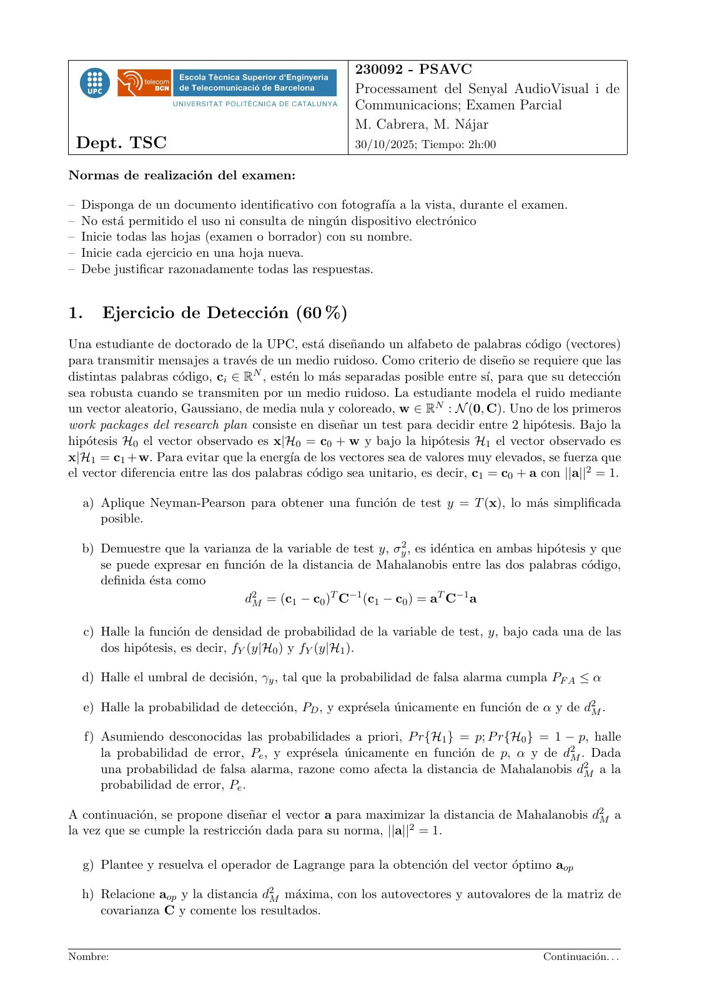
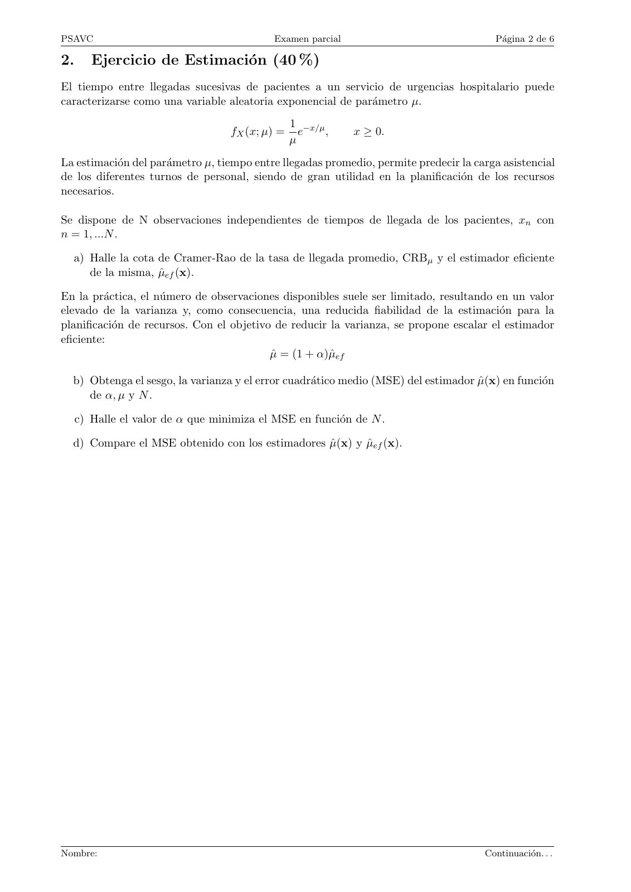
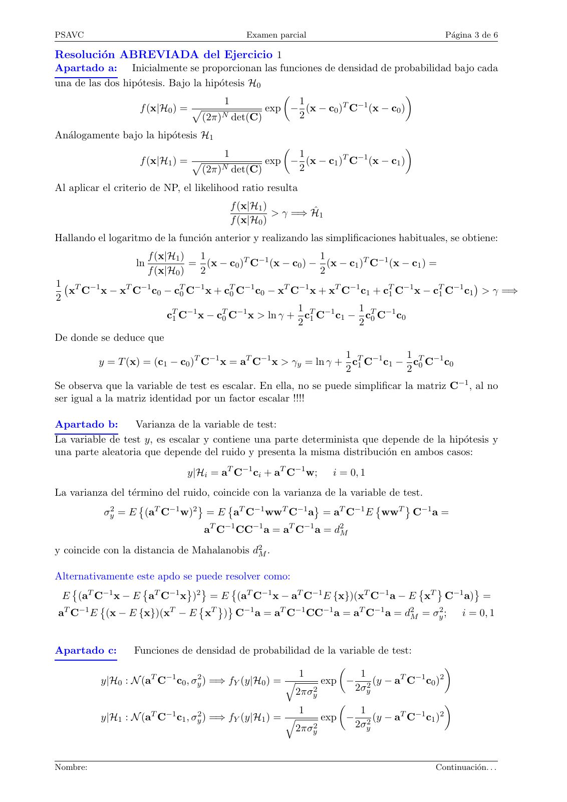
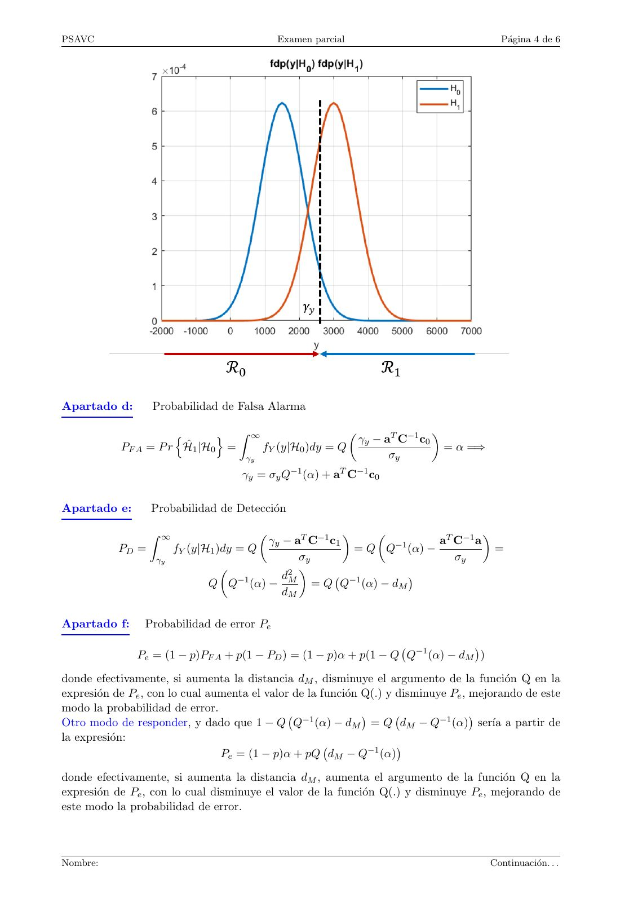
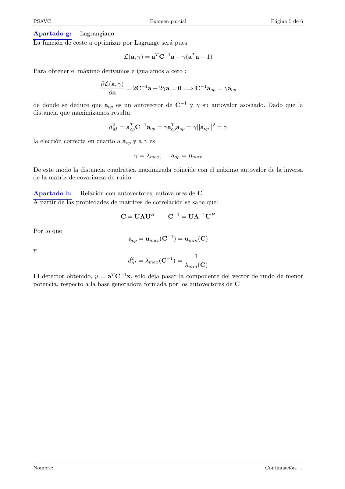
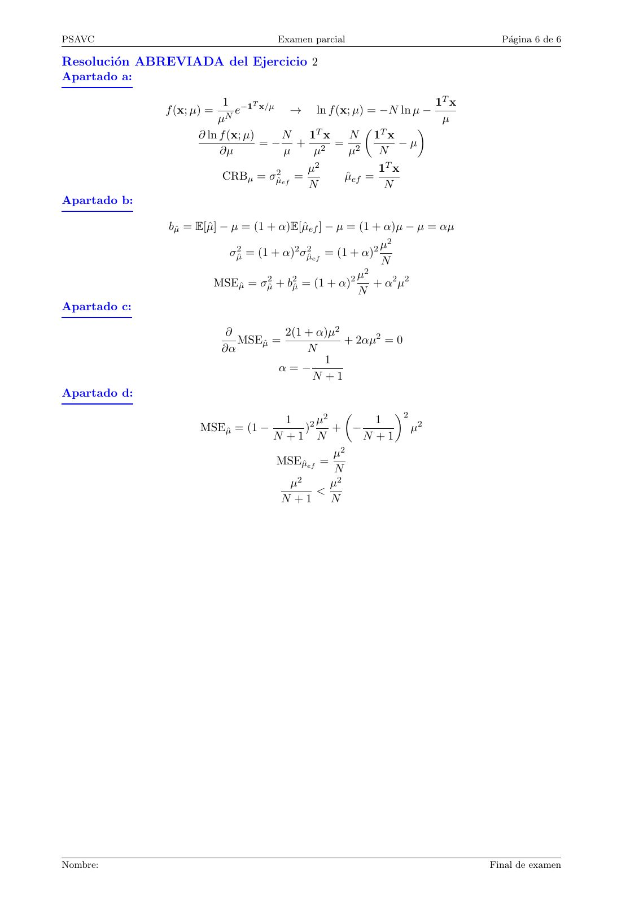

# 2025-10_Parcial_PSAVC

- Source PDF: `Examenes/2025-10_Parcial_PSAVC.pdf`
- PDF title: `2025-10_Parcial_PSAVC`
- Pages: 6
- Note: Transcribed from the embedded PDF text layer. Each page links to a rendered page image so figures, plots, handwriting, and formula layout can be checked against the original.

## Page 1



```text
                                                       230092 - PSAVC
                                                       Processament del Senyal AudioVisual i de
                                                       Communicacions; Examen Parcial
                                                       M. Cabrera, M. Nájar
 Dept. TSC                                             30/10/2025; Tiempo: 2h:00

Normas de realización del examen:

– Disponga de un documento identificativo con fotografı́a a la vista, durante el examen.
– No está permitido el uso ni consulta de ningún dispositivo electrónico
– Inicie todas las hojas (examen o borrador) con su nombre.
– Inicie cada ejercicio en una hoja nueva.
– Debe justificar razonadamente todas las respuestas.


1.      Ejercicio de Detección (60 %)
Una estudiante de doctorado de la UPC, está diseñando un alfabeto de palabras código (vectores)
para transmitir mensajes a través de un medio ruidoso. Como criterio de diseño se requiere que las
distintas palabras código, ci ∈ RN , estén lo más separadas posible entre sı́, para que su detección
sea robusta cuando se transmiten por un medio ruidoso. La estudiante modela el ruido mediante
un vector aleatorio, Gaussiano, de media nula y coloreado, w ∈ RN : N (0, C). Uno de los primeros
work packages del research plan consiste en diseñar un test para decidir entre 2 hipótesis. Bajo la
hipótesis H0 el vector observado es x|H0 = c0 + w y bajo la hipótesis H1 el vector observado es
x|H1 = c1 + w. Para evitar que la energı́a de los vectores sea de valores muy elevados, se fuerza que
el vector diferencia entre las dos palabras código sea unitario, es decir, c1 = c0 + a con ||a||2 = 1.

  a) Aplique Neyman-Pearson para obtener una función de test y = T (x), lo más simplificada
     posible.

  b) Demuestre que la varianza de la variable de test y, σy2 , es idéntica en ambas hipótesis y que
     se puede expresar en función de la distancia de Mahalanobis entre las dos palabras código,
     definida ésta como
                             d2M = (c1 − c0 )T C−1 (c1 − c0 ) = aT C−1 a

     c) Halle la función de densidad de probabilidad de la variable de test, y, bajo cada una de las
        dos hipótesis, es decir, fY (y|H0 ) y fY (y|H1 ).

  d) Halle el umbral de decisión, γy , tal que la probabilidad de falsa alarma cumpla PF A ≤ α

     e) Halle la probabilidad de detección, PD , y exprésela únicamente en función de α y de d2M .

     f) Asumiendo desconocidas las probabilidades a priori, P r{H1 } = p; P r{H0 } = 1 − p, halle
        la probabilidad de error, Pe , y exprésela únicamente en función de p, α y de d2M . Dada
        una probabilidad de falsa alarma, razone como afecta la distancia de Mahalanobis d2M a la
        probabilidad de error, Pe .

A continuación, se propone diseñar el vector a para maximizar la distancia de Mahalanobis d2M a
la vez que se cumple la restricción dada para su norma, ||a||2 = 1.

  g) Plantee y resuelva el operador de Lagrange para la obtención del vector óptimo aop

  h) Relacione aop y la distancia d2M máxima, con los autovectores y autovalores de la matriz de
     covarianza C y comente los resultados.


Nombre:                                                                                   Continuación. . .
```

## Page 2



```text
PSAVC                                       Examen parcial                               Página 2 de 6

2.      Ejercicio de Estimación (40 %)
El tiempo entre llegadas sucesivas de pacientes a un servicio de urgencias hospitalario puede
caracterizarse como una variable aleatoria exponencial de parámetro µ.
                                                 1 −x/µ
                                   fX (x; µ) =     e    ,    x ≥ 0.
                                                 µ
La estimación del parámetro µ, tiempo entre llegadas promedio, permite predecir la carga asistencial
de los diferentes turnos de personal, siendo de gran utilidad en la planificación de los recursos
necesarios.

Se dispone de N observaciones independientes de tiempos de llegada de los pacientes, xn con
n = 1, ...N .

  a) Halle la cota de Cramer-Rao de la tasa de llegada promedio, CRBµ y el estimador eficiente
     de la misma, µ̂ef (x).

En la práctica, el número de observaciones disponibles suele ser limitado, resultando en un valor
elevado de la varianza y, como consecuencia, una reducida fiabilidad de la estimación para la
planificación de recursos. Con el objetivo de reducir la varianza, se propone escalar el estimador
eficiente:
                                           µ̂ = (1 + α)µ̂ef

  b) Obtenga el sesgo, la varianza y el error cuadrático medio (MSE) del estimador µ̂(x) en función
     de α, µ y N .

     c) Halle el valor de α que minimiza el MSE en función de N .

  d) Compare el MSE obtenido con los estimadores µ̂(x) y µ̂ef (x).


Nombre:                                                                                Continuación. . .
```

## Page 3



```text
PSAVC                                         Examen parcial                                Página 3 de 6

Resolución ABREVIADA del Ejercicio 1
Apartado a: Inicialmente se proporcionan las funciones de densidad de probabilidad bajo cada
una de las dos hipótesis. Bajo la hipótesis H0
                                                                           
                                        1             1         T −1
                   f (x|H0 ) = p                 exp − (x − c0 ) C (x − c0 )
                                  (2π)N det(C)        2
Análogamente bajo la hipótesis H1
                                                                       
                                    1             1         T −1
                   f (x|H1 ) = p             exp − (x − c1 ) C (x − c1 )
                                (2π)N det(C)      2
Al aplicar el criterio de NP, el likelihood ratio resulta
                                          f (x|H1 )
                                                    > γ =⇒ Ĥ1
                                          f (x|H0 )
Hallando el logaritmo de la función anterior y realizando las simplificaciones habituales, se obtiene:
                        f (x|H1 )  1                          1
                   ln             = (x − c0 )T C−1 (x − c0 ) − (x − c1 )T C−1 (x − c1 ) =
                        f (x|H0 )  2                          2
1 T −1
  x C x − xT C−1 c0 − cT0 C−1 x + cT0 C−1 c0 − xT C−1 x + xT C−1 c1 + cT1 C−1 x − cT1 C−1 c1 > γ =⇒
                                                                                            
2
                                                     1            1
                       cT1 C−1 x − cT0 C−1 x > ln γ + cT1 C−1 c1 − cT0 C−1 c0
                                                     2            2
De donde se deduce que
                                                                1            1
          y = T (x) = (c1 − c0 )T C−1 x = aT C−1 x > γy = ln γ + cT1 C−1 c1 − cT0 C−1 c0
                                                                2            2
Se observa que la variable de test es escalar. En ella, no se puede simplificar la matriz C−1 , al no
ser igual a la matriz identidad por un factor escalar !!!!

Apartado b:       Varianza de la variable de test:
La variable de test y, es escalar y contiene una parte determinista que depende de la hipótesis y
una parte aleatoria que depende del ruido y presenta la misma distribución en ambos casos:
                                y|Hi = aT C−1 ci + aT C−1 w;     i = 0, 1
La varianza del término del ruido, coincide con la varianza de la variable de test.
          σy2 = E (aT C−1 w)2 = E aT C−1 wwT C−1 a = aT C−1 E wwT C−1 a =
                                                                      

                                    aT C−1 CC−1 a = aT C−1 a = d2M
y coincide con la distancia de Mahalanobis d2M .

Alternativamente este apdo se puede resolver como:
 E (aT C−1 x − E aT C−1 x )2 = E (aT C−1 x − aT C−1 E {x})(xT C−1 a − E xT C−1 a) =
                                                                    

aT C−1 E (x − E {x})(xT − E xT ) C−1 a = aT C−1 CC−1 a = aT C−1 a = d2M = σy2 ;
                              
                                                                                i = 0, 1


Apartado c:      Funciones de densidad de probabilidad de la variable de test:
                                                                                 
                     T −1     2                     1             1        T −1 2
          y|H0 : N (a C c0 , σy ) =⇒ fY (y|H0 ) = q      exp − 2 (y − a C c0 )
                                                   2πσy2         2σy
                                                                                 
                     T −1     2                     1             1        T −1 2
          y|H1 : N (a C c1 , σy ) =⇒ fY (y|H1 ) = q      exp − 2 (y − a C c1 )
                                                   2πσy2         2σy


Nombre:                                                                                 Continuación. . .
```

## Page 4



```text
PSAVC                                          Examen parcial                            Página 4 de 6


Apartado d:       Probabilidad de Falsa Alarma

                      n       o Z ∞                  
                                                       γy − aT C−1 c0
                                                                      
            PF A = P r Ĥ1 |H0 =    fY (y|H0 )dy = Q                    = α =⇒
                                 γy                          σy
                                     γy = σy Q−1 (α) + aT C−1 c0

Apartado e:       Probabilidad de Detección

                  Z ∞
                                      γy − aT C−1 c1                 aT C−1 a
                                                                           
           PD =         fY (y|H1 )dy = Q               = Q Q−1 (α) −            =
                   γy                        σy                         σy
                                         d2M
                                            
                                 −1
                                                = Q Q−1 (α) − dM
                                                                 
                              Q Q (α) −
                                         dM

Apartado f:      Probabilidad de error Pe

               Pe = (1 − p)PF A + p(1 − PD ) = (1 − p)α + p(1 − Q Q−1 (α) − dM )
                                                                              

donde efectivamente, si aumenta la distancia dM , disminuye el argumento de la función Q en la
expresión de Pe , con lo cual aumenta el valor de la función Q(.) y disminuye Pe , mejorando de este
modo la probabilidad de error.
Otro modo de responder, y dado que 1 − Q Q−1 (α) − dM = Q dM − Q−1 (α) serı́a a partir de
                                                                                    

la expresión:
                                 Pe = (1 − p)α + pQ dM − Q−1 (α)
                                                                      

donde efectivamente, si aumenta la distancia dM , aumenta el argumento de la función Q en la
expresión de Pe , con lo cual disminuye el valor de la función Q(.) y disminuye Pe , mejorando de
este modo la probabilidad de error.


Nombre:                                                                                Continuación. . .
```

## Page 5



```text
PSAVC                                       Examen parcial                          Página 5 de 6

Apartado g: Lagrangiano
La función de coste a optimizar por Lagrange será pues

                                  L(a, γ) = aT C−1 a − γ(aT a − 1)

Para obtener el máximo derivamos e igualamos a cero :

                         ∂L(a, γ)
                                  = 2C−1 a − 2γa = 0 =⇒ C−1 aop = γaop
                           ∂a
de donde se deduce que aop es un autovector de C−1 y γ su autovalor asociado. Dado que la
distancia que maximizamos resulta

                            d2M = aTop C−1 aop = γaTop aop = γ||aop ||2 = γ

la elección correcta en cuanto a aop y a γ es

                                      γ = λmax ;    aop = umax

De este modo la distancia cuadrática maximizada coincide con el máximo autovalor de la inversa
de la matriz de covarianza de ruido.

Apartado h: Relación con autovectores, autovalores de C
A partir de las propiedades de matrices de correlación se sabe que:

                                 C = UΛUH          C−1 = UΛ−1 UH

Por lo que
                                   aop = umax (C−1 ) = umin (C)
y
                                                             1
                                   d2M = λmax (C−1 ) =
                                                          λmin (C)
El detector obtenido, y = aT C−1 x, solo deja pasar la componente del vector de ruido de menor
potencia, respecto a la base generadora formada por los autovectores de C


Nombre:                                                                           Continuación. . .
```

## Page 6



```text
PSAVC                                    Examen parcial                        Página 6 de 6

Resolución ABREVIADA del Ejercicio 2
Apartado a:

                          1 −1T x/µ                                   1T x
              f (x; µ) =     e          →   ln f (x; µ) = −N   ln µ −
                        µN                                             µ
                                            T
                                                         T        
                    ∂ ln f (x; µ)     N    1 x      N 1 x
                                  =− + 2 = 2                  −µ
                         ∂µ            µ    µ       µ     N
                                           µ2             1T x
                          CRBµ = σµ̂2 ef =         µ̂ef =
                                           N               N
Apartado b:

               bµ̂ = E[µ̂] − µ = (1 + α)E[µ̂ef ] − µ = (1 + α)µ − µ = αµ
                                                                   µ2
                              σµ̂2 = (1 + α)2 σµ̂2 ef = (1 + α)2
                                                                   N
                                                            µ2
                           MSEµ̂ = σµ̂2 + bµ̂2 = (1 + α)2      + α 2 µ2
                                                            N
Apartado c:

                             ∂         2(1 + α)µ2
                               MSEµ̂ =            + 2αµ2 = 0
                            ∂α             N
                                              1
                                      α=−
                                            N +1
Apartado d:
                                             2
                                                        2
                                    1     2µ          1
                     MSEµ̂ = (1 −       )      + −          µ2
                                  N +1 N            N +1
                                               µ2
                                  MSEµ̂ef =
                                                N
                                     µ2        µ2
                                           <
                                   N +1        N


Nombre:                                                                      Final de examen
```
