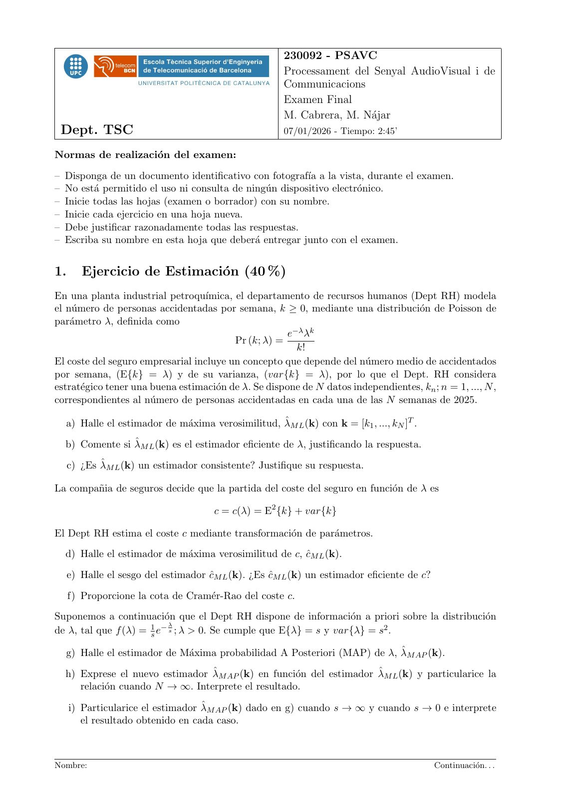
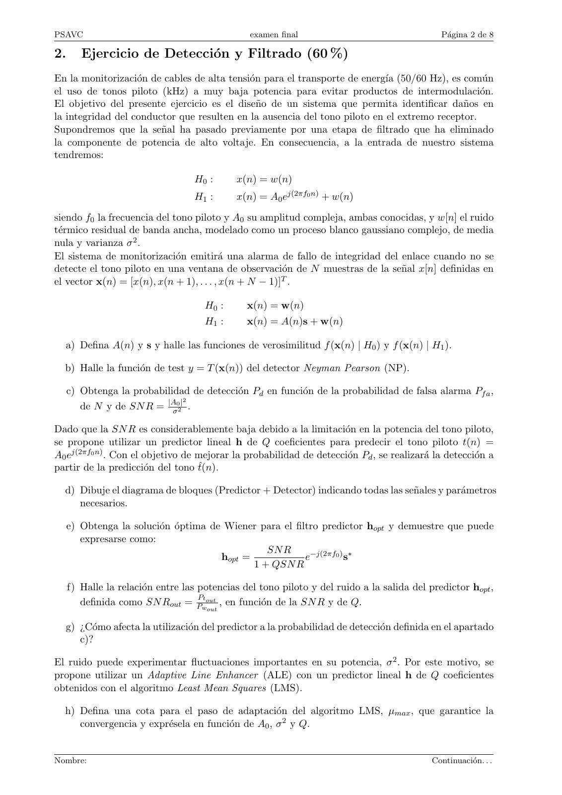
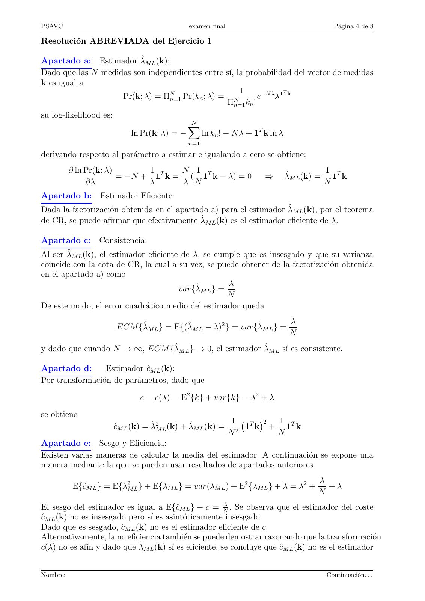
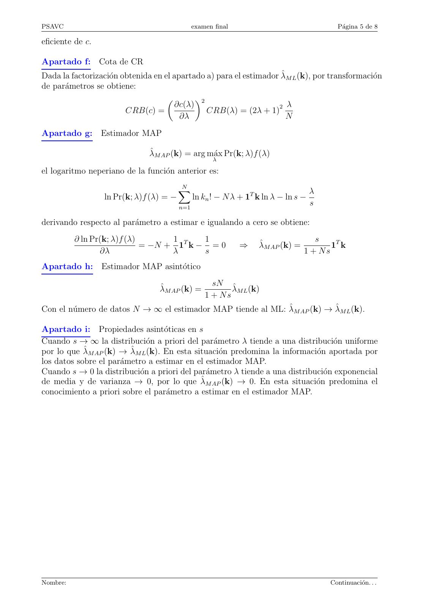
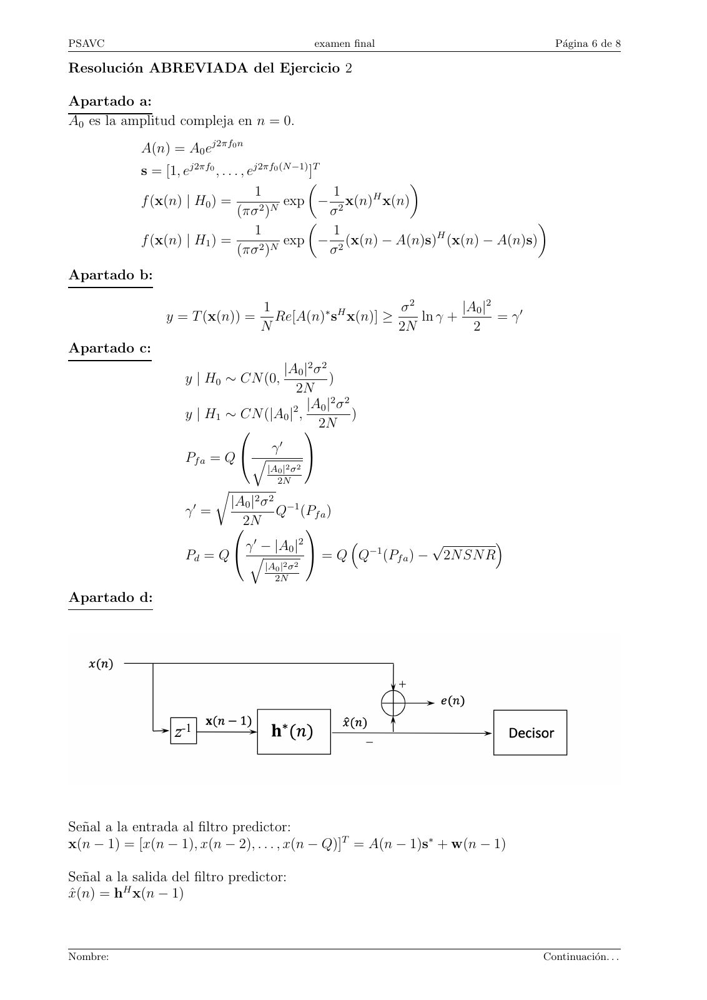
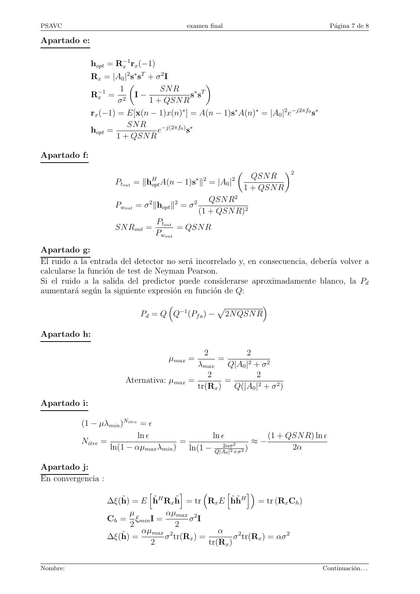

# 2026-01_Final_PSAVC

- Source PDF: `Examenes/2026-01_Final_PSAVC.pdf`
- PDF title: `2026-01_Final_PSAVC`
- Pages: 8
- Note: Transcribed from the embedded PDF text layer. Each page links to a rendered page image so figures, plots, handwriting, and formula layout can be checked against the original.

## Page 1



```text
                                                       230092 - PSAVC
                                                       Processament del Senyal AudioVisual i de
                                                       Communicacions
                                                       Examen Final
                                                       M. Cabrera, M. Nájar
 Dept. TSC                                             07/01/2026 - Tiempo: 2:45’

Normas de realización del examen:
– Disponga de un documento identificativo con fotografı́a a la vista, durante el examen.
– No está permitido el uso ni consulta de ningún dispositivo electrónico.
– Inicie todas las hojas (examen o borrador) con su nombre.
– Inicie cada ejercicio en una hoja nueva.
– Debe justificar razonadamente todas las respuestas.
– Escriba su nombre en esta hoja que deberá entregar junto con el examen.


1.      Ejercicio de Estimación (40 %)
En una planta industrial petroquı́mica, el departamento de recursos humanos (Dept RH) modela
el número de personas accidentadas por semana, k ≥ 0, mediante una distribución de Poisson de
parámetro λ, definida como
                                                       e−λ λk
                                          Pr (k; λ) =
                                                         k!
El coste del seguro empresarial incluye un concepto que depende del número medio de accidentados
por semana, (E{k} = λ) y de su varianza, (var{k} = λ), por lo que el Dept. RH considera
estratégico tener una buena estimación de λ. Se dispone de N datos independientes, kn ; n = 1, ..., N ,
correspondientes al número de personas accidentadas en cada una de las N semanas de 2025.

  a) Halle el estimador de máxima verosimilitud, λ̂M L (k) con k = [k1 , ..., kN ]T .

  b) Comente si λ̂M L (k) es el estimador eficiente de λ, justificando la respuesta.

     c) ¿Es λ̂M L (k) un estimador consistente? Justifique su respuesta.

La compañia de seguros decide que la partida del coste del seguro en función de λ es

                                       c = c(λ) = E2 {k} + var{k}

El Dept RH estima el coste c mediante transformación de parámetros.
  d) Halle el estimador de máxima verosimilitud de c, ĉM L (k).

     e) Halle el sesgo del estimador ĉM L (k). ¿Es ĉM L (k) un estimador eficiente de c?

     f) Proporcione la cota de Cramér-Rao del coste c.
Suponemos a continuación que el Dept RH dispone de información a priori sobre la distribución
                            λ
de λ, tal que f (λ) = 1s e− s ; λ > 0. Se cumple que E{λ} = s y var{λ} = s2 .

  g) Halle el estimador de Máxima probabilidad A Posteriori (MAP) de λ, λ̂M AP (k).

  h) Exprese el nuevo estimador λ̂M AP (k) en función del estimador λ̂M L (k) y particularice la
     relación cuando N → ∞. Interprete el resultado.

     i) Particularice el estimador λ̂M AP (k) dado en g) cuando s → ∞ y cuando s → 0 e interprete
        el resultado obtenido en cada caso.


Nombre:                                                                                      Continuación. . .
```

## Page 2



```text
PSAVC                                           examen final                                  Página 2 de 8

2.      Ejercicio de Detección y Filtrado (60 %)
En la monitorización de cables de alta tensión para el transporte de energı́a (50/60 Hz), es común
el uso de tonos piloto (kHz) a muy baja potencia para evitar productos de intermodulación.
El objetivo del presente ejercicio es el diseño de un sistema que permita identificar daños en
la integridad del conductor que resulten en la ausencia del tono piloto en el extremo receptor.
Supondremos que la señal ha pasado previamente por una etapa de filtrado que ha eliminado
la componente de potencia de alto voltaje. En consecuencia, a la entrada de nuestro sistema
tendremos:

                                   H0 :      x(n) = w(n)
                                   H1 :      x(n) = A0 ej(2πf0 n) + w(n)
siendo f0 la frecuencia del tono piloto y A0 su amplitud compleja, ambas conocidas, y w[n] el ruido
térmico residual de banda ancha, modelado como un proceso blanco gaussiano complejo, de media
nula y varianza σ 2 .
El sistema de monitorización emitirá una alarma de fallo de integridad del enlace cuando no se
detecte el tono piloto en una ventana de observación de N muestras de la señal x[n] definidas en
el vector x(n) = [x(n), x(n + 1), . . . , x(n + N − 1)]T .

                                     H0 :       x(n) = w(n)
                                     H1 :       x(n) = A(n)s + w(n)

  a) Defina A(n) y s y halle las funciones de verosimilitud f (x(n) | H0 ) y f (x(n) | H1 ).

  b) Halle la función de test y = T (x(n)) del detector Neyman Pearson (NP).

     c) Obtenga la probabilidad de detección Pd en función de la probabilidad de falsa alarma Pf a ,
                               2
        de N y de SN R = |Aσ02| .

Dado que la SN R es considerablemente baja debido a la limitación en la potencia del tono piloto,
se propone utilizar un predictor lineal h de Q coeficientes para predecir el tono piloto t(n) =
A0 ej(2πf0 n) . Con el objetivo de mejorar la probabilidad de detección Pd , se realizará la detección a
partir de la predicción del tono t̂(n).

  d) Dibuje el diagrama de bloques (Predictor + Detector) indicando todas las señales y parámetros
     necesarios.

     e) Obtenga la solución óptima de Wiener para el filtro predictor hopt y demuestre que puede
        expresarse como:
                                                 SN R
                                       hopt =             e−j(2πf0 ) s∗
                                              1 + QSN R

     f) Halle la relación entre las potencias del tono piloto y del ruido a la salida del predictor hopt ,
                                     P
        definida como SN Rout = Pwtout , en función de la SN R y de Q.
                                      out


  g) ¿Cómo afecta la utilización del predictor a la probabilidad de detección definida en el apartado
     c)?

El ruido puede experimentar fluctuaciones importantes en su potencia, σ 2 . Por este motivo, se
propone utilizar un Adaptive Line Enhancer (ALE) con un predictor lineal h de Q coeficientes
obtenidos con el algoritmo Least Mean Squares (LMS).

  h) Defina una cota para el paso de adaptación del algoritmo LMS, µmax , que garantice la
     convergencia y exprésela en función de A0 , σ 2 y Q.


Nombre:                                                                                     Continuación. . .
```

## Page 3


```text
PSAVC                                         examen final                                  Página 3 de 8

   i) Considerando un paso de adaptación µ = αµmax siendo α ≪ 1 y sabiendo que el mı́nimo
      autovalor de la matriz de correlación de la señal x(n) es σ 2 , obtenga el número de iteraciones
      Nite necesario para la convergencia con un error residual en los coeficientes igual a ϵ. Expréselo
      en función de ϵ, α, Q y SN R.

La diferencia entre los coeficientes del predictor obtenidos adaptativamente con el algoritmo LMS
y los coeficientes de la solución óptima del filtro de Wiener produce un incremento de potencia
que puede interpretarse como una distorsión a la salida del predictor ∆ξ(h̃), definiéndose h̃ =
h(n) − hopt para n > Nite . Se define la Signal to Noise and Distorsion Ratio (SNDR) como:

                                                       Ptout
                                      SN DR =
                                                  Pwout + ∆ξ(h̃)

A continuación, asumiendo convergencia y un número de coeficientes del predictor elevado tal que
QSN R ≫ 1, considere las siguientes aproximaciones:

     x(n) y h(n) son estadı́sticamente independientes.

     Solución óptima de Wiener: hopt ≈ Q1 e−j(2πf0 ) s∗

     Mı́nimo error cuadrático medio: ξmin ≈ σ 2 .

  j) Obtenga ∆ξ(h̃) en función de α y de σ 2 . (Tenga en cuenta la propiedad de circularidad de
     la traza del producto de matrices)

  k) Obtenga la SN DR en función de SN R, α y Q. Razone cómo afectará la elección del número
     de coeficientes del predictor y del paso de adaptación del LMS en la Pd del detector.


Nombre:                                                                                   Continuación. . .
```

## Page 4



```text
PSAVC                                           examen final                                      Página 4 de 8

Resolución ABREVIADA del Ejercicio 1

Apartado a: Estimador λ̂M L (k):
Dado que las N medidas son independientes entre sı́, la probabilidad del vector de medidas
k es igual a
                                                      1            T
                    Pr(k; λ) = ΠN
                                n=1 Pr(kn ; λ) =    N
                                                           e−N λ λ1 k
                                                 Πn=1 kn !
su log-likelihood es:
                                                N
                                                X
                             ln Pr(k; λ) = −          ln kn ! − N λ + 1T k ln λ
                                                n=1

derivando respecto al parámetro a estimar e igualando a cero se obtiene:
          ∂ ln Pr(k; λ)       1      N 1                                                        1 T
                        = −N + 1T k = ( 1T k − λ) = 0                    ⇒        λ̂M L (k) =     1 k
               ∂λ             λ      λ N                                                        N
Apartado b: Estimador Eficiente:
Dada la factorización obtenida en el apartado a) para el estimador λ̂M L (k), por el teorema
de CR, se puede afirmar que efectivamente λ̂M L (k) es el estimador eficiente de λ.

Apartado c: Consistencia:
Al ser λ̂M L (k), el estimador eficiente de λ, se cumple que es insesgado y que su varianza
coincide con la cota de CR, la cual a su vez, se puede obtener de la factorización obtenida
en el apartado a) como
                                                      λ
                                        var{λ̂M L } =
                                                      N
De este modo, el error cuadrático medio del estimador queda
                                                                                   λ
                        ECM {λ̂M L } = E{(λ̂M L − λ)2 } = var{λ̂M L } =
                                                                                   N
y dado que cuando N → ∞, ECM {λ̂M L } → 0, el estimador λ̂M L sı́ es consistente.

Apartado d:       Estimador ĉM L (k):
Por transformación de parámetros, dado que
                                c = c(λ) = E2 {k} + var{k} = λ2 + λ
se obtiene
                                                                1     T
                                                                          2  1
                        ĉM L (k) = λ̂2M L (k) + λ̂M L (k) =      2
                                                                    1   k    + 1T k
                                                               N              N
Apartado e: Sesgo y Eficiencia:
Existen varias maneras de calcular la media del estimador. A continuación se expone una
manera mediante la que se pueden usar resultados de apartados anteriores.
                                                                                            λ
          E{ĉM L } = E{λ2M L } + E{λM L } = var(λM L ) + E2 {λM L } + λ = λ2 +               +λ
                                                                                            N
El sesgo del estimador es igual a E{ĉM L } − c = Nλ . Se observa que el estimador del coste
ĉM L (k) no es insesgado pero sı́ es asintóticamente insesgado.
Dado que es sesgado, ĉM L (k) no es el estimador eficiente de c.
Alternativamente, la no eficiencia también se puede demostrar razonando que la transformación
c(λ) no es afı́n y dado que λ̂M L (k) sı́ es eficiente, se concluye que ĉM L (k) no es el estimador


Nombre:                                                                                         Continuación. . .
```

## Page 5



```text
PSAVC                                          examen final                               Página 5 de 8

eficiente de c.

Apartado f: Cota de CR
Dada la factorización obtenida en el apartado a) para el estimador λ̂M L (k), por transformación
de parámetros se obtiene:
                                           2
                                      ∂c(λ)                           λ
                        CRB(c) =               CRB(λ) = (2λ + 1)2
                                        ∂λ                            N
Apartado g: Estimador MAP

                               λ̂M AP (k) = arg máx Pr(k; λ)f (λ)
                                                      λ

el logaritmo neperiano de la función anterior es:
                                         N
                                         X                                          λ
                  ln Pr(k; λ)f (λ) = −         ln kn ! − N λ + 1T k ln λ − ln s −
                                         n=1
                                                                                    s

derivando respecto al parámetro a estimar e igualando a cero se obtiene:
          ∂ ln Pr(k; λ)f (λ)       1      1                                         s
                             = −N + 1T k − = 0                ⇒   λ̂M AP (k) =          1T k
                 ∂λ                λ      s                                      1 + Ns
Apartado h: Estimador MAP asintótico
                                                     sN
                                  λ̂M AP (k) =            λ̂M L (k)
                                                   1 + Ns
Con el número de datos N → ∞ el estimador MAP tiende al ML: λ̂M AP (k) → λ̂M L (k).

Apartado i: Propiedades asintóticas en s
Cuando s → ∞ la distribución a priori del parámetro λ tiende a una distribución uniforme
por lo que λ̂M AP (k) → λ̂M L (k). En esta situación predomina la información aportada por
los datos sobre el parámetro a estimar en el estimador MAP.
Cuando s → 0 la distribución a priori del parámetro λ tiende a una distribución exponencial
de media y de varianza → 0, por lo que λ̂M AP (k) → 0. En esta situación predomina el
conocimiento a priori sobre el parámetro a estimar en el estimador MAP.


Nombre:                                                                                 Continuación. . .
```

## Page 6



```text
PSAVC                                              examen final                         Página 6 de 8

Resolución ABREVIADA del Ejercicio 2

Apartado a:
A0 es la amplitud compleja en n = 0.
             A(n) = A0 ej2πf0 n
             s = [1, ej2πf0 , . . . , ej2πf0 (N −1) ]T
                                                               
                                       1               1  H
             f (x(n) | H0 ) =                 exp − 2 x(n) x(n)
                                   (πσ 2 )N            σ
                                                                                   
                                       1               1            H
             f (x(n) | H1 ) =                 exp − 2 (x(n) − A(n)s) (x(n) − A(n)s)
                                   (πσ 2 )N            σ
Apartado b:

                                     1                     σ2        |A0 |2
                 y = T (x(n)) =        Re[A(n)∗ sH x(n)] ≥    ln γ +        = γ′
                                     N                     2N          2
Apartado c:
                                    |A0 |2 σ 2
                     y | H0 ∼ CN (0,           )
                                        2N
                                               2 2
                                       2 |A0 | σ
                     y | H1 ∼ CN (|A0 | ,          )
                                          2N
                                        γ′
                     Pf a = Q  q                  
                                      |A0 |2 σ 2
                                        2N
                            r
                                |A0 |2 σ 2 −1
                     γ′ =                 Q (Pf a )
                                2N           
                             γ ′ − |A0 |2                  √        
                     Pd = Q  q             = Q Q−1 (Pf a ) − 2N SN R
                                      |A0 |2 σ 2
                                        2N

Apartado d:


Señal a la entrada al filtro predictor:
x(n − 1) = [x(n − 1), x(n − 2), . . . , x(n − Q)]T = A(n − 1)s∗ + w(n − 1)

Señal a la salida del filtro predictor:
x̂(n) = hH x(n − 1)


Nombre:                                                                             Continuación. . .
```

## Page 7



```text
PSAVC                                       examen final                               Página 7 de 8

Apartado e:

              hopt = R−1
                      x rx (−1)
              Rx = |A0 |2 s∗ sT + σ 2 I
                                                   
                −1    1            SN R         ∗ T
              Rx = 2 I −                      ss
                      σ         1 + QSN R
              rx (−1) = E[x(n − 1)x(n)∗ ] = A(n − 1)s∗ A(n)∗ = |A0 |2 e−j2πf0 s∗
                        SN R
              hopt =              e−j(2πf0 ) s∗
                     1 + QSN R

Apartado f:
                                                                               2
                                             ∗ 2       2              QSN R
                      Ptout = ∥hH
                                opt A(n − 1)s ∥ = |A0 |
                                                                    1 + QSN R
                                                      QSN R2
                      Pwout = σ 2 ∥hopt ∥2 = σ 2
                                                   (1 + QSN R)2
                                  Ptout
                      SN Rout =         = QSN R
                                  Pwout
Apartado g:
El ruido a la entrada del detector no será incorrelado y, en consecuencia, deberı́a volver a
calcularse la función de test de Neyman Pearson.
Si el ruido a la salida del predictor puede considerarse aproximadamente blanco, la Pd
aumentará según la siguiente expresión en función de Q:
                                              p         
                                          −1
                             Pd = Q Q (Pf a ) − 2N QSN R

Apartado h:

                                                    2    2
                                       µmax =           =
                                            λmax    Q|A0 |2 + σ 2
                                               2            2
                         Aternativa: µmax =         =
                                            tr(Rx )   Q(|A0 |2 + σ 2 )

Apartado i:

           (1 − µλmin )Nitre = ϵ
                            ln ϵ               ln ϵ             (1 + QSN R) ln ϵ
           Nitre =                     =               2     ≈−
                   ln(1 − αµmax λmin )            2ασ
                                         ln(1 − Q|A |2 +σ2 )          2α
                                                            0


Apartado j:
En convergencia :
                              h         i           h        i
                    ∆ξ(h̃) = E h̃H Rx h̃ = tr Rx E h̃h̃H = tr (Rx Ch )
                          µ        αµmax 2
                    Ch = ξmin I =         σ I
                          2           2
                             αµmax 2               α
                    ∆ξ(h̃) =       σ tr(Rx ) =          σ 2 tr(Rx ) = ασ 2
                               2                tr(Rx )


Nombre:                                                                              Continuación. . .
```

## Page 8


```text
PSAVC                                    examen final                            Página 8 de 8

Apartado k:

                              Ptout = |A0 |2
                                       σ2
                              Pwout =
                                       Q
                                         |A0 |2     QSN R
                              SN DR = σ2          =
                                      Q
                                          + ασ  2   1 + αQ
Un incremento en el valor de Q aumenta la Pd detección porque mejora la SN R a la entrada
del decisor pero incrementa el ruido de desajuste aumentando la SN DR.
Un decremento del valor de α reduce la distorsión pero incrementa el número de iteraciones
necesarias para la convergencia, aumentando el retardo en la toma de decisiones.


Nombre:                                                                       Final de examen
```
