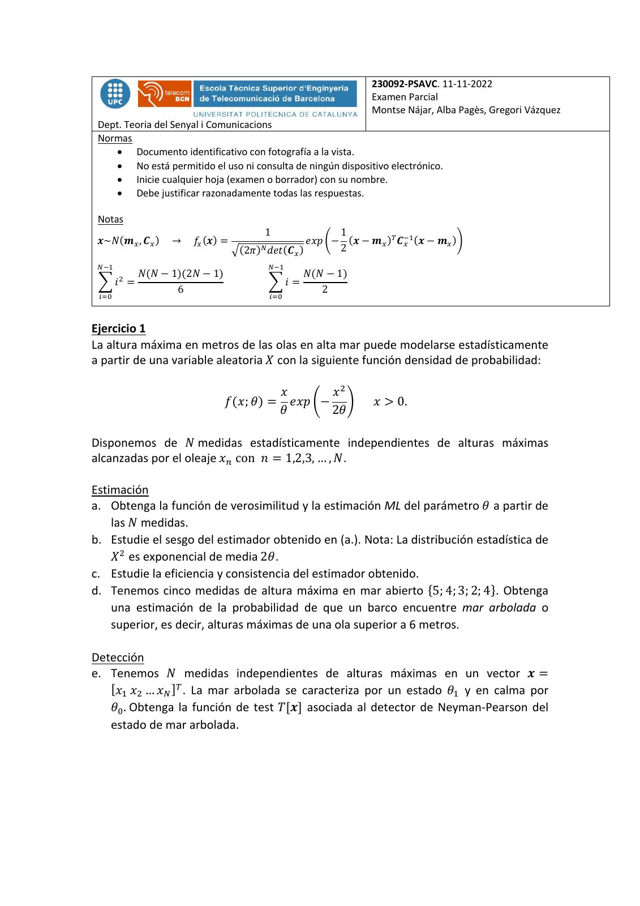
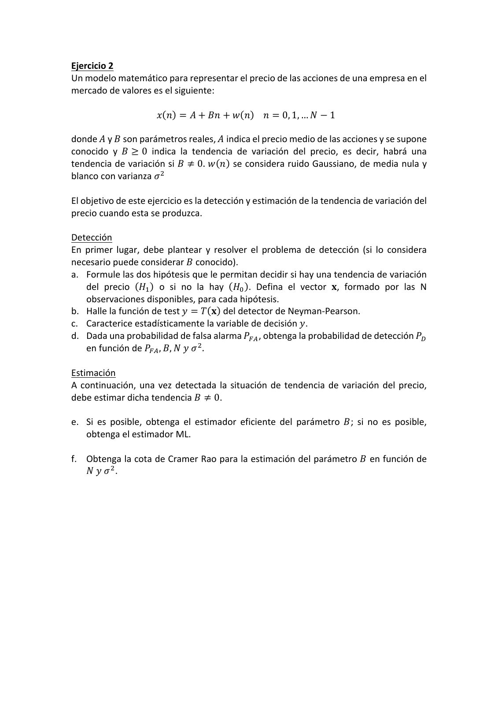
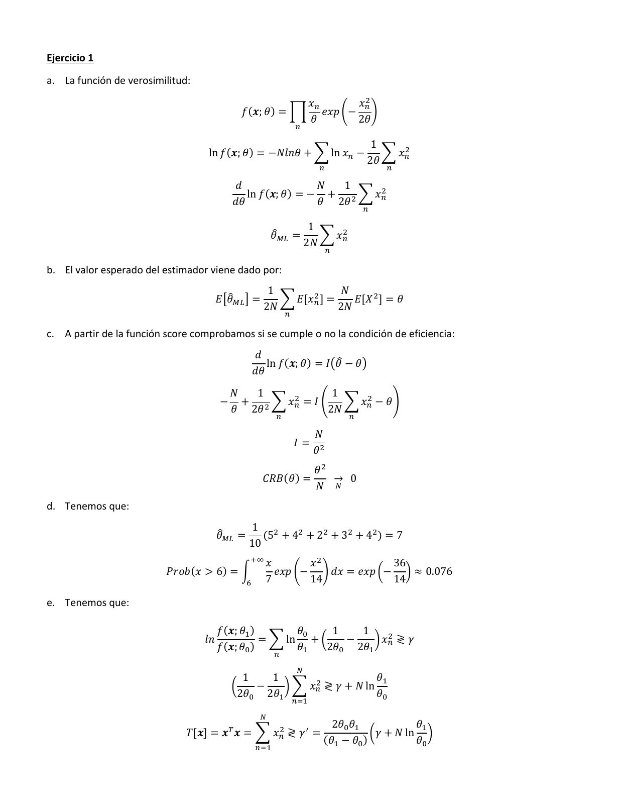
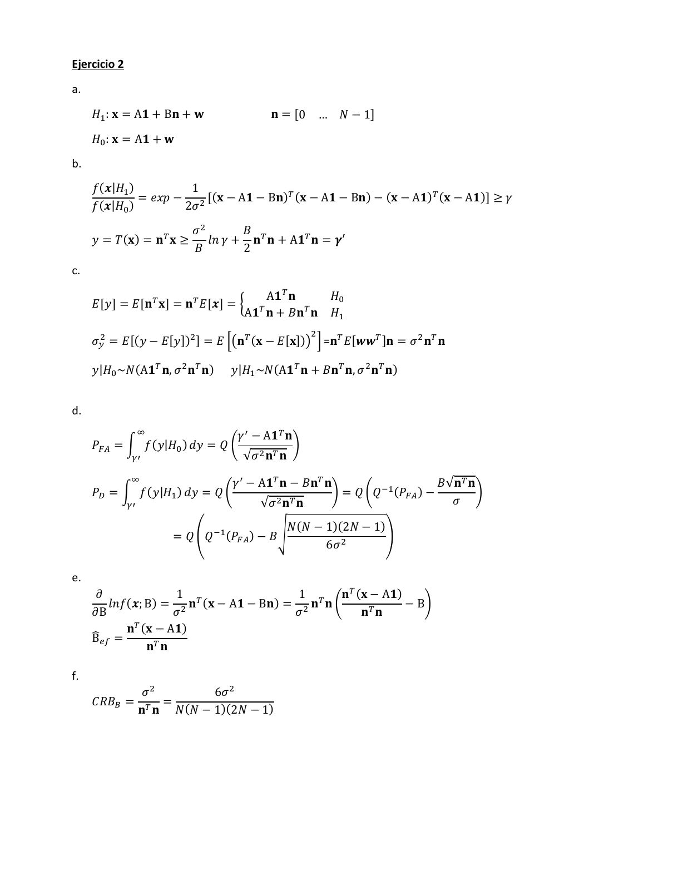

# Control Nov 2022

- Source PDF: `Examenes/Control Nov 2022.pdf`
- PDF title: `Control_v1`
- Pages: 4
- Note: Transcribed from the embedded PDF text layer. Each page links to a rendered page image so figures, plots, handwriting, and formula layout can be checked against the original.

## Page 1



```text
                                                             230092-PSAVC. 11-11-2022
                                                             Examen Parcial
                                                             Montse Nájar, Alba Pagès, Gregori Vázquez
 Dept. Teoria del Senyal i Comunicacions
 Normas
    • Documento identificativo con fotografía a la vista.
    • No está permitido el uso ni consulta de ningún dispositivo electrónico.
    • Inicie cualquier hoja (examen o borrador) con su nombre.
    • Debe justificar razonadamente todas las respuestas.

 Notas
                                       1               1
 𝒙~𝑁(𝒎! , 𝑪! )   →    𝑓! (𝒙) =                   𝑒𝑥𝑝 6− (𝒙 − 𝒎! )# 𝑪$%
                                                                    ! (𝒙 − 𝒎! )8
                                 .(2𝜋)" 𝑑𝑒𝑡(𝑪! )       2
 "$%                                    "$%
      𝑁(𝑁 − 1)(2𝑁 − 1)
       &
                                               𝑁(𝑁 − 1)
 9𝑖 =                                   9𝑖 =
             6                                    2
 '()                                    '()


Ejercicio 1
La altura máxima en metros de las olas en alta mar puede modelarse estadísticamente
a partir de una variable aleatoria 𝑋 con la siguiente función densidad de probabilidad:

                                      𝑥      𝑥!
                             𝑓(𝑥; 𝜃) = 𝑒𝑥𝑝 +− .              𝑥 > 0.
                                      𝜃      2𝜃

Disponemos de 𝑁 medidas estadísticamente independientes de alturas máximas
alcanzadas por el oleaje 𝑥" con 𝑛 = 1,2,3, … , 𝑁.

Estimación
a. Obtenga la función de verosimilitud y la estimación ML del parámetro 𝜃 a partir de
    las 𝑁 medidas.
b. Estudie el sesgo del estimador obtenido en (a.). Nota: La distribución estadística de
    𝑋 ! es exponencial de media 2𝜃.
c. Estudie la eficiencia y consistencia del estimador obtenido.
d. Tenemos cinco medidas de altura máxima en mar abierto {5; 4; 3; 2; 4}. Obtenga
    una estimación de la probabilidad de que un barco encuentre mar arbolada o
    superior, es decir, alturas máximas de una ola superior a 6 metros.

Detección
e. Tenemos 𝑁 medidas independientes de alturas máximas en un vector 𝒙 =
   [𝑥# 𝑥! … 𝑥$ ]% . La mar arbolada se caracteriza por un estado 𝜃# y en calma por
   𝜃& . Obtenga la función de test 𝑇[𝒙] asociada al detector de Neyman-Pearson del
   estado de mar arbolada.
```

## Page 2



```text
Ejercicio 2
Un modelo matemático para representar el precio de las acciones de una empresa en el
mercado de valores es el siguiente:

                     𝑥(𝑛) = 𝐴 + 𝐵𝑛 + 𝑤(𝑛) 𝑛 = 0, 1, … 𝑁 − 1

donde 𝐴 y 𝐵 son parámetros reales, 𝐴 indica el precio medio de las acciones y se supone
conocido y 𝐵 ≥ 0 indica la tendencia de variación del precio, es decir, habrá una
tendencia de variación si 𝐵 ≠ 0. 𝑤(𝑛) se considera ruido Gaussiano, de media nula y
blanco con varianza 𝜎 !

El objetivo de este ejercicio es la detección y estimación de la tendencia de variación del
precio cuando esta se produzca.

Detección
En primer lugar, debe plantear y resolver el problema de detección (si lo considera
necesario puede considerar 𝐵 conocido).
a. Formule las dos hipótesis que le permitan decidir si hay una tendencia de variación
   del precio (𝐻# ) o si no la hay (𝐻& ). Defina el vector 𝐱, formado por las N
   observaciones disponibles, para cada hipótesis.
b. Halle la función de test 𝑦 = 𝑇(𝐱) del detector de Neyman-Pearson.
c. Caracterice estadísticamente la variable de decisión 𝑦.
d. Dada una probabilidad de falsa alarma 𝑃'( , obtenga la probabilidad de detección 𝑃)
   en función de 𝑃'( , 𝐵, 𝑁 𝑦 𝜎 ! .

Estimación
A continuación, una vez detectada la situación de tendencia de variación del precio,
debe estimar dicha tendencia 𝐵 ≠ 0.

e. Si es posible, obtenga el estimador eficiente del parámetro 𝐵; si no es posible,
   obtenga el estimador ML.

f. Obtenga la cota de Cramer Rao para la estimación del parámetro 𝐵 en función de
   𝑁 𝑦 𝜎!.
```

## Page 3



```text
Ejercicio 1

a. La función de verosimilitud:

                                                                        𝑥!       𝑥!"
                                               𝑓(𝒙; 𝜃) = (                 𝑒𝑥𝑝 ,− /
                                                                        𝜃        2𝜃
                                                                  !

                                                                                      1
                                   ln 𝑓(𝒙; 𝜃) = −𝑁𝑙𝑛𝜃 + 6 ln 𝑥! −                       6 𝑥!"
                                                                                     2𝜃
                                                                         !               !

                                           𝑑                𝑁  1
                                              ln 𝑓(𝒙; 𝜃) = − + " 6 𝑥!"
                                           𝑑𝜃               𝜃 2𝜃
                                                                                     !

                                                                       1
                                                         𝜃9#$ =          6 𝑥!"
                                                                      2𝑁
                                                                             !

b. El valor esperado del estimador viene dado por:
                                                       1              𝑁
                                       𝐸;𝜃9#$ < =        6 𝐸[𝑥!" ] =    𝐸[𝑋 " ] = 𝜃
                                                      2𝑁             2𝑁
                                                              !

c. A partir de la función score comprobamos si se cumple o no la condición de eficiencia:
                                                    𝑑
                                                       ln 𝑓(𝒙; 𝜃) = 𝐼A𝜃9 − 𝜃B
                                                    𝑑𝜃
                                           𝑁   1             1
                                       −     + " 6 𝑥!" = 𝐼 C 6 𝑥!" − 𝜃D
                                           𝜃 2𝜃             2𝑁
                                                          !                      !

                                                                        𝑁
                                                                  𝐼=
                                                                        𝜃"
                                                                         𝜃"
                                                      𝐶𝑅𝐵(𝜃) =              → 0
                                                                         𝑁 %
d. Tenemos que:
                                                 1 "
                                       𝜃9#$ =      (5 + 4" + 2" + 3" + 4" ) = 7
                                                10
                                                &'
                                                       𝑥       𝑥"            36
                          𝑃𝑟𝑜𝑏(𝑥 > 6) = U                𝑒𝑥𝑝 ,− / 𝑑𝑥 = 𝑒𝑥𝑝 V− W ≈ 0.076
                                                (      7       14            14

e. Tenemos que:

                                       𝑓(𝒙; 𝜃) )       𝜃*    1   1
                                  𝑙𝑛             = 6 ln + V    −   W 𝑥" ≷ 𝛾
                                       𝑓(𝒙; 𝜃* )       𝜃)   2𝜃* 2𝜃) !
                                                          !
                                                                  %
                                              1   1                     𝜃)
                                           V    −    W 6 𝑥!" ≷ 𝛾 + 𝑁 ln
                                             2𝜃* 2𝜃)                    𝜃*
                                                                  !+)

                                                     %
                                                                            2𝜃* 𝜃)            𝜃)
                              𝑇[𝒙] = 𝒙 𝒙 = 6 𝑥!" ≷ 𝛾 - =
                                           ,
                                                                                     V𝛾 + 𝑁 ln W
                                                                          (𝜃) − 𝜃* )          𝜃*
                                                    !+)
```

## Page 4



```text
Ejercicio 2

a.

     𝐻) : 𝐱 = A𝟏 + B𝐧 + 𝐰                𝐧 = [0 … 𝑁 − 1]

     𝐻* : 𝐱 = A𝟏 + 𝐰
b.
     𝑓(𝒙|𝐻) )          1
               = 𝑒𝑥𝑝 − " [(𝐱 − A𝟏 − B𝐧), (𝐱 − A𝟏 − B𝐧) − (𝐱 − A𝟏), (𝐱 − A𝟏)] ≥ 𝛾
     𝑓 (𝒙|𝐻* )        2𝜎
                           𝜎"       𝐵
     𝑦 = 𝑇(𝐱) = 𝐧, 𝐱 ≥        𝑙𝑛 𝛾 + 𝐧, 𝐧 + A𝟏, 𝐧 = 𝜸′
                           𝐵        2
c.

                                    A𝟏, 𝐧    𝐻*
     𝐸[𝑦] = 𝐸[𝐧, 𝐱] = 𝐧, 𝐸[𝒙] = l ,       ,
                                 A𝟏 𝐧 + 𝐵𝐧 𝐧 𝐻)
                                                "
     𝜎." = 𝐸[(𝑦 − 𝐸[𝑦])" ] = 𝐸 mA𝐧, (𝐱 − 𝐸[𝐱])B n =𝐧, 𝐸[𝒘𝒘, ]𝐧 = 𝜎 " 𝐧, 𝐧

     𝑦|𝐻* ~𝑁(A𝟏, 𝐧, 𝜎 " 𝐧, 𝐧)    𝑦|𝐻) ~𝑁(A𝟏, 𝐧 + 𝐵𝐧, 𝐧, 𝜎 " 𝐧, 𝐧)


d.
             '
                              𝛾 - − A𝟏, 𝐧
     𝑃/0 = U 𝑓(𝑦|𝐻* ) 𝑑𝑦 = 𝑄 ,           /
            1-                 √𝜎 " 𝐧, 𝐧
               '
                                  𝛾 - − A𝟏, 𝐧 − 𝐵𝐧, 𝐧                    𝐵√𝐧, 𝐧
     𝑃2 = U 𝑓(𝑦|𝐻) ) 𝑑𝑦 = 𝑄 ,                        / = 𝑄 ,𝑄3) (𝑃/0 ) −       /
              1-                        √𝜎 " 𝐧, 𝐧                          𝜎

                                             𝑁(𝑁 − 1)(2𝑁 − 1)
                        = 𝑄 t𝑄3) (𝑃/0 ) − 𝐵 u                v
                                                   6𝜎 "

e.
      𝜕             1                    1       𝐧, (𝐱 − A𝟏)
        𝑙𝑛𝑓(𝒙; B) = " 𝐧, (𝐱 − A𝟏 − B𝐧) = " 𝐧, 𝐧 ,            − B/
     𝜕B             𝜎                   𝜎            𝐧, 𝐧
           𝐧, (𝐱 − A𝟏)
     x
     B45 =
               𝐧, 𝐧

f.
                    𝜎"        6𝜎 "
     𝐶𝑅𝐵6 =            =
                   𝐧, 𝐧 𝑁(𝑁 − 1)(2𝑁 − 1)
```
