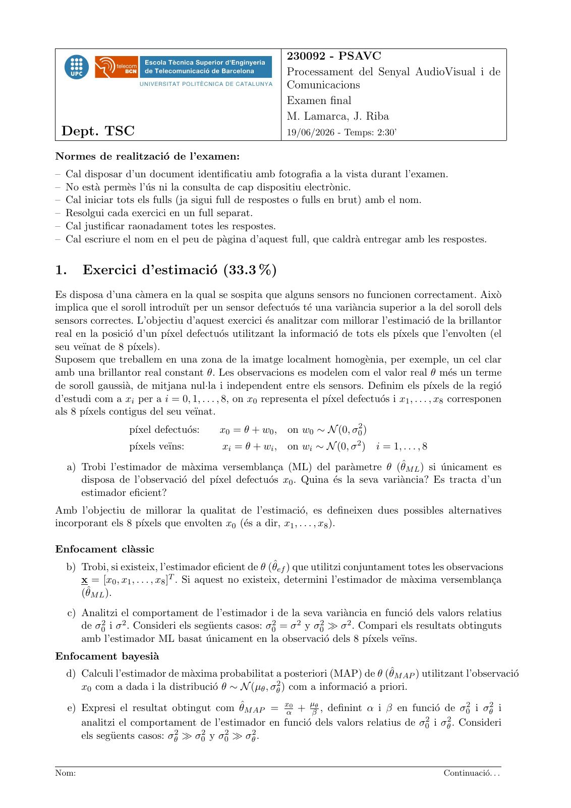
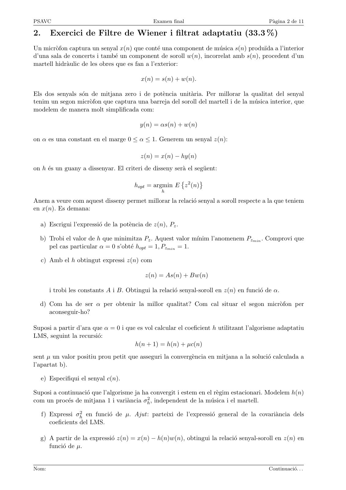
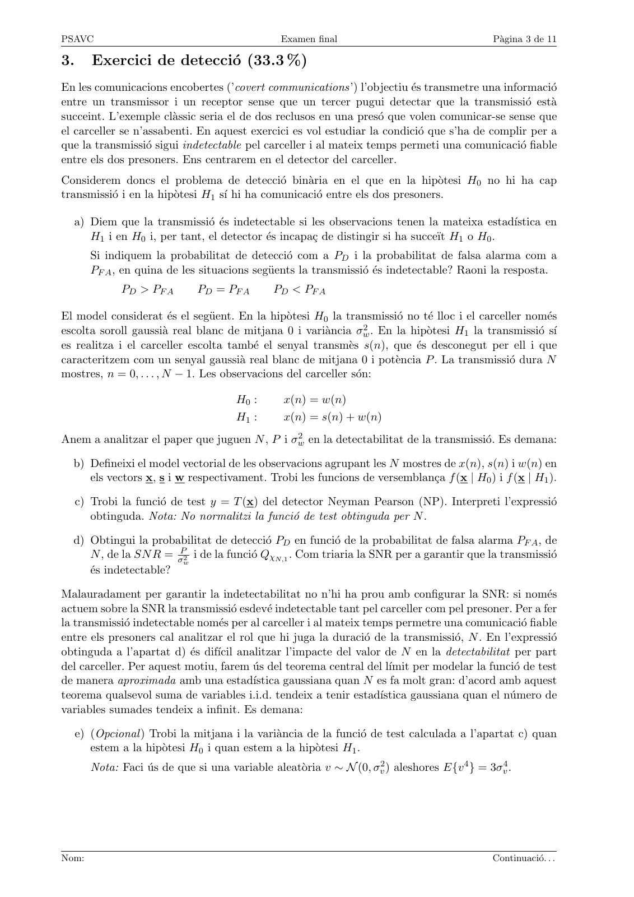
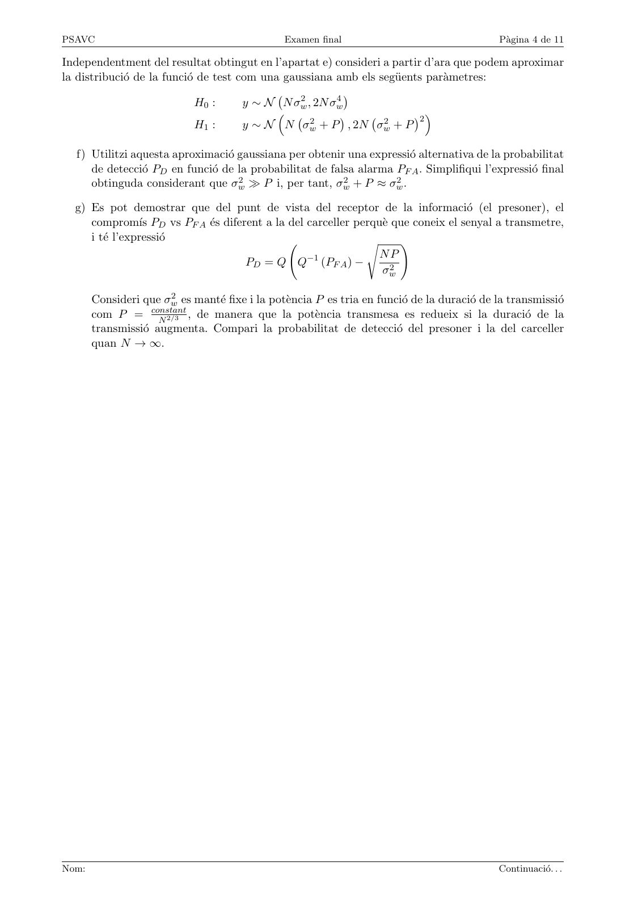
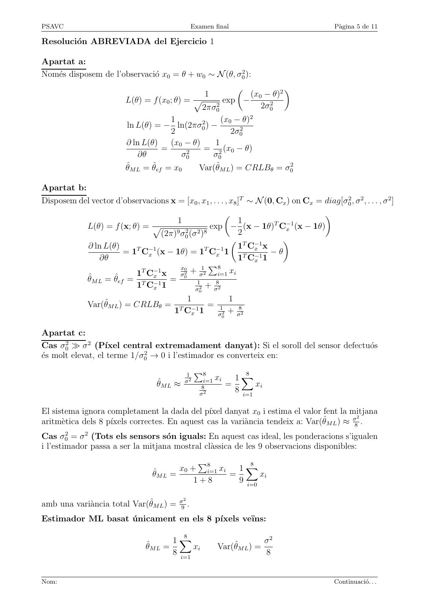
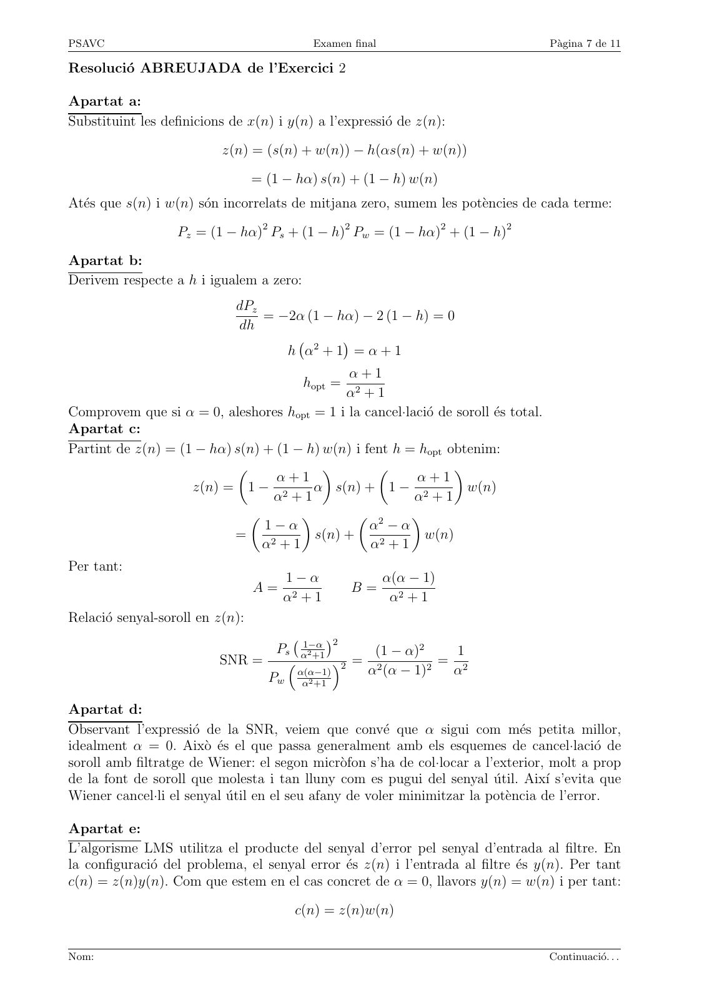
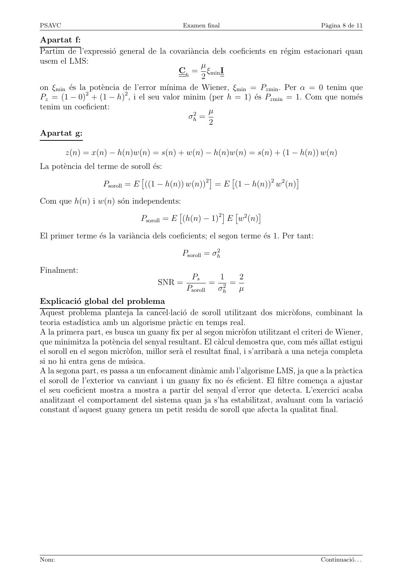
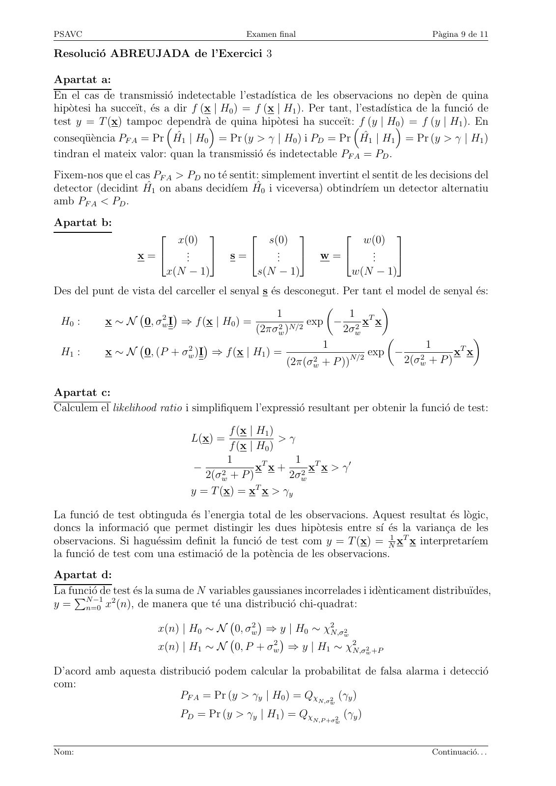
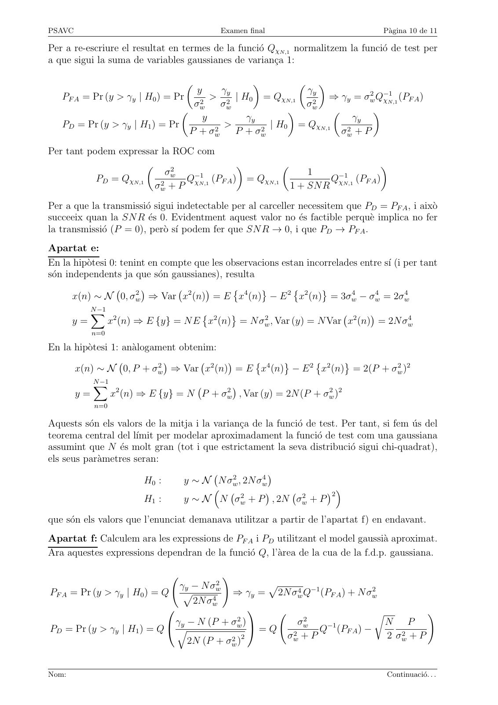
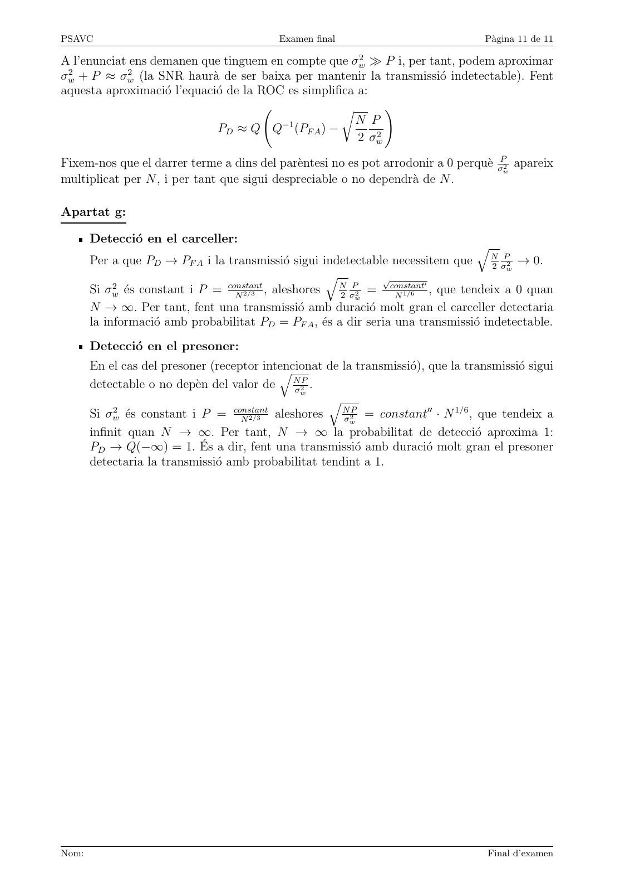

# Examen final de PSAVC 19juny2026 Resolt

- Source PDF: `~/Downloads/Examen final de PSAVC 19juny2026 Resolt.pdf`
- PDF title: `Examen final de PSAVC 19juny2026 Resolt`
- Pages: 11
- Note: Transcribed from the embedded PDF text layer. Each page links to a rendered page image so figures, plots, handwriting, and formula layout can be checked against the original.

## Page 1



```text
                                                           230092 - PSAVC
                                                           Processament del Senyal AudioVisual i de
                                                           Comunicacions
                                                           Examen final
                                                           M. Lamarca, J. Riba
 Dept. TSC                                                 19/06/2026 - Temps: 2:30’

Normes de realització de l’examen:
– Cal disposar d’un document identificatiu amb fotografia a la vista durant l’examen.
– No està permès l’ús ni la consulta de cap dispositiu electrònic.
– Cal iniciar tots els fulls (ja sigui full de respostes o fulls en brut) amb el nom.
– Resolgui cada exercici en un full separat.
– Cal justificar raonadament totes les respostes.
– Cal escriure el nom en el peu de pàgina d’aquest full, que caldrà entregar amb les respostes.


1.      Exercici d’estimació (33.3 %)
Es disposa d’una càmera en la qual se sospita que alguns sensors no funcionen correctament. Això
implica que el soroll introduı̈t per un sensor defectuós té una variància superior a la del soroll dels
sensors correctes. L’objectiu d’aquest exercici és analitzar com millorar l’estimació de la brillantor
real en la posició d’un pı́xel defectuós utilitzant la informació de tots els pı́xels que l’envolten (el
seu veı̈nat de 8 pı́xels).
Suposem que treballem en una zona de la imatge localment homogènia, per exemple, un cel clar
amb una brillantor real constant θ. Les observacions es modelen com el valor real θ més un terme
de soroll gaussià, de mitjana nul·la i independent entre els sensors. Definim els pı́xels de la regió
d’estudi com a xi per a i = 0, 1, . . . , 8, on x0 representa el pı́xel defectuós i x1 , . . . , x8 corresponen
als 8 pı́xels contigus del seu veı̈nat.
                   pı́xel defectuós:    x0 = θ + w0 ,     on w0 ∼ N (0, σ02 )
                   pı́xels veı̈ns:        x i = θ + wi ,   on wi ∼ N (0, σ 2 )   i = 1, . . . , 8
  a) Trobi l’estimador de màxima versemblança (ML) del paràmetre θ (θ̂M L ) si únicament es
     disposa de l’observació del pı́xel defectuós x0 . Quina és la seva variància? Es tracta d’un
     estimador eficient?
Amb l’objectiu de millorar la qualitat de l’estimació, es defineixen dues possibles alternatives
incorporant els 8 pı́xels que envolten x0 (és a dir, x1 , . . . , x8 ).

Enfocament clàssic
  b) Trobi, si existeix, l’estimador eficient de θ (θ̂ef ) que utilitzi conjuntament totes les observacions
     x = [x0 , x1 , . . . , x8 ]T . Si aquest no existeix, determini l’estimador de màxima versemblança
     (θ̂M L ).
     c) Analitzi el comportament de l’estimador i de la seva variància en funció dels valors relatius
        de σ02 i σ 2 . Consideri els següents casos: σ02 = σ 2 y σ02 ≫ σ 2 . Compari els resultats obtinguts
        amb l’estimador ML basat únicament en la observació dels 8 pı́xels veı̈ns.
Enfocament bayesià
  d) Calculi l’estimador de màxima probabilitat a posteriori (MAP) de θ (θ̂M AP ) utilitzant l’observació
     x0 com a dada i la distribució θ ∼ N (µθ , σθ2 ) com a informació a priori.

     e) Expresi el resultat obtingut com θ̂M AP = xα0 + µβθ , definint α i β en funció de σ02 i σθ2 i
        analitzi el comportament de l’estimador en funció dels valors relatius de σ02 i σθ2 . Consideri
        els següents casos: σθ2 ≫ σ02 y σ02 ≫ σθ2 .


Nom:                                                                                                Continuació. . .
```

## Page 2



```text
PSAVC                                          Examen final                                 Pàgina 2 de 11

2.      Exercici de Filtre de Wiener i filtrat adaptatiu (33.3 %)
Un micròfon captura un senyal x(n) que conté una component de música s(n) produı̈da a l’interior
d’una sala de concerts i també un component de soroll w(n), incorrelat amb s(n), procedent d’un
martell hidràulic de les obres que es fan a l’exterior:

                                           x(n) = s(n) + w(n).

Els dos senyals són de mitjana zero i de potència unitària. Per millorar la qualitat del senyal
tenim un segon micròfon que captura una barreja del soroll del martell i de la música interior, que
modelem de manera molt simplificada com:

                                          y(n) = αs(n) + w(n)

on α es una constant en el marge 0 ≤ α ≤ 1. Generem un senyal z(n):

                                          z(n) = x(n) − hy(n)
on h és un guany a dissenyar. El criteri de disseny serà el següent:

                                        hopt = argmin E z 2 (n)
                                                       
                                                  h

Anem a veure com aquest disseny permet millorar la relació senyal a soroll respecte a la que teniem
en x(n). Es demana:

  a) Escrigui l’expressió de la potència de z(n), Pz .

  b) Trobi el valor de h que minimitza Pz . Aquest valor mı́nim l’anomenem Pzmin . Comprovi que
     pel cas particular α = 0 s’obté hopt = 1, Pzmin = 1.

     c) Amb el h obtingut expressi z(n) com

                                            z(n) = As(n) + Bw(n)

        i trobi les constants A i B. Obtingui la relació senyal-soroll en z(n) en funció de α.

  d) Com ha de ser α per obtenir la millor qualitat? Com cal situar el segon micròfon per
     aconseguir-ho?

Suposi a partir d’ara que α = 0 i que es vol calcular el coeficient h utilitzant l’algorisme adaptatiu
LMS, seguint la recursió:
                                     h(n + 1) = h(n) + µc(n)
sent µ un valor positiu prou petit que asseguri la convergència en mitjana a la solució calculada a
l’apartat b).

     e) Especifiqui el senyal c(n).

Suposi a continuació que l’algorisme ja ha convergit i estem en el règim estacionari. Modelem h(n)
com un procés de mitjana 1 i variància σh2 , independent de la música i el martell.

     f) Expressi σh2 en funció de µ. Ajut: parteixi de l’expressió general de la covariància dels
        coeficients del LMS.

  g) A partir de la expressió z(n) = x(n) − h(n)w(n), obtingui la relació senyal-soroll en z(n) en
     funció de µ.


Nom:                                                                                       Continuació. . .
```

## Page 3



```text
PSAVC                                            Examen final                                  Pàgina 3 de 11

3.      Exercici de detecció (33.3 %)
En les comunicacions encobertes (’covert communications’) l’objectiu és transmetre una informació
entre un transmissor i un receptor sense que un tercer pugui detectar que la transmissió està
succeint. L’exemple clàssic seria el de dos reclusos en una presó que volen comunicar-se sense que
el carceller se n’assabenti. En aquest exercici es vol estudiar la condició que s’ha de complir per a
que la transmissió sigui indetectable pel carceller i al mateix temps permeti una comunicació fiable
entre els dos presoners. Ens centrarem en el detector del carceller.
Considerem doncs el problema de detecció binària en el que en la hipòtesi H0 no hi ha cap
transmissió i en la hipòtesi H1 sı́ hi ha comunicació entre els dos presoners.

  a) Diem que la transmissió és indetectable si les observacions tenen la mateixa estadı́stica en
     H1 i en H0 i, per tant, el detector és incapaç de distingir si ha succeı̈t H1 o H0 .
        Si indiquem la probabilitat de detecció com a PD i la probabilitat de falsa alarma com a
        PF A , en quina de les situacions següents la transmissió és indetectable? Raoni la resposta.
              PD > PF A        PD = PF A       PD < PF A

El model considerat és el següent. En la hipòtesi H0 la transmissió no té lloc i el carceller només
escolta soroll gaussià real blanc de mitjana 0 i variància σw  2 . En la hipòtesi H la transmissió sı́
                                                                                      1
es realitza i el carceller escolta també el senyal transmès s(n), que és desconegut per ell i que
caracteritzem com un senyal gaussià real blanc de mitjana 0 i potència P . La transmissió dura N
mostres, n = 0, . . . , N − 1. Les observacions del carceller són:

                                       H0 :      x(n) = w(n)
                                       H1 :      x(n) = s(n) + w(n)
                                              2 en la detectabilitat de la transmissió. Es demana:
Anem a analitzar el paper que juguen N , P i σw

  b) Defineixi el model vectorial de les observacions agrupant les N mostres de x(n), s(n) i w(n) en
     els vectors x, s i w respectivament. Trobi les funcions de versemblança f (x | H0 ) i f (x | H1 ).

     c) Trobi la funció de test y = T (x) del detector Neyman Pearson (NP). Interpreti l’expressió
        obtinguda. Nota: No normalitzi la funció de test obtinguda per N .

  d) Obtingui la probabilitat de detecció PD en funció de la probabilitat de falsa alarma PF A , de
     N , de la SN R = σP2 i de la funció QχN,1 . Com triaria la SNR per a garantir que la transmissió
                        w
     és indetectable?

Malauradament per garantir la indetectabilitat no n’hi ha prou amb configurar la SNR: si només
actuem sobre la SNR la transmissió esdevé indetectable tant pel carceller com pel presoner. Per a fer
la transmissió indetectable només per al carceller i al mateix temps permetre una comunicació fiable
entre els presoners cal analitzar el rol que hi juga la duració de la transmissió, N . En l’expressió
obtinguda a l’apartat d) és difı́cil analitzar l’impacte del valor de N en la detectabilitat per part
del carceller. Per aquest motiu, farem ús del teorema central del lı́mit per modelar la funció de test
de manera aproximada amb una estadı́stica gaussiana quan N es fa molt gran: d’acord amb aquest
teorema qualsevol suma de variables i.i.d. tendeix a tenir estadı́stica gaussiana quan el número de
variables sumades tendeix a infinit. Es demana:

     e) (Opcional ) Trobi la mitjana i la variància de la funció de test calculada a l’apartat c) quan
        estem a la hipòtesi H0 i quan estem a la hipòtesi H1 .
        Nota: Faci ús de que si una variable aleatòria v ∼ N (0, σv2 ) aleshores E{v 4 } = 3σv4 .


Nom:                                                                                          Continuació. . .
```

## Page 4



```text
PSAVC                                            Examen final                                  Pàgina 4 de 11

Independentment del resultat obtingut en l’apartat e) consideri a partir d’ara que podem aproximar
la distribució de la funció de test com una gaussiana amb els següents paràmetres:
                                                 2       4
                                                           
                             H0 :      y ∼ N N σw  , 2N σw
                                                                      2 
                                                    2            2
                                                          
                             H1 :      y ∼ N N σw     + P , 2N σw  +P

  f) Utilitzi aquesta aproximació gaussiana per obtenir una expressió alternativa de la probabilitat
     de detecció PD en funció de la probabilitat de falsa alarma PF A . Simplifiqui l’expressió final
     obtinguda considerant que σw  2 ≫ P i, per tant, σ 2 + P ≈ σ 2 .
                                                         w         w

  g) Es pot demostrar que del punt de vista del receptor de la informació (el presoner), el
     compromı́s PD vs PF A és diferent a la del carceller perquè que coneix el senyal a transmetre,
     i té l’expressió                                      s       !
                                                                N  P
                                    PD = Q Q−1 (PF A ) −          2
                                                                σw

       Consideri que σw 2 es manté fixe i la potència P es tria en funció de la duració de la transmissió
                   constant
       com P = N 2/3 , de manera que la potència transmesa es redueix si la duració de la
       transmissió augmenta. Compari la probabilitat de detecció del presoner i la del carceller
       quan N → ∞.


Nom:                                                                                           Continuació. . .
```

## Page 5



```text
PSAVC                                               Examen final                               Pàgina 5 de 11

Resolución ABREVIADA del Ejercicio 1

Apartat a:
Només disposem de l’observació x0 = θ + w0 ∼ N (θ, σ02 ):

                                                                 (x0 − θ)2
                                                                                
                                                          1
                           L(θ) = f (x0 ; θ) = p        exp    −
                                                 2πσ02              2σ02
                                        1              (x0 − θ)2
                           ln L(θ) = − ln(2πσ02 ) −
                                        2                 2σ02
                           ∂ ln L(θ)    (x0 − θ)    1
                                     =       2
                                                 = 2 (x0 − θ)
                               ∂θ           σ0     σ0
                           θ̂M L = θ̂ef = x0          Var(θ̂M L ) = CRLBθ = σ02

Apartat b:
Disposem del vector d’observacions x = [x0 , x1 , . . . , x8 ]T ∼ N (0, Cx ) on Cx = diag[σ02 , σ 2 , . . . , σ 2 ]
                                                                              
                                            1                  1       T −1
              L(θ) = f (x; θ) = p                    exp − (x − 1θ) Cx (x − 1θ)
                                   (2π)9 σ02 (σ 2 )8           2
                                                             T −1        
              ∂ ln L(θ)      T −1                  T −1        1 Cx x
                          = 1 Cx (x − 1θ) = 1 Cx 1                     −θ
                  ∂θ                                           1T C−1
                                                                   x 1
                                         x0       1
                                                     P8
                             1T C−1 x    σ 2 + σ2       i=1 xi
              θ̂M L = θ̂ef = T x−1 = 0 1
                             1 Cx 1            σ2
                                                    + σ82
                                                      0
                                      1       1
              Var(θ̂M L ) = CRLBθ = T −1 = 1
                                   1 Cx 1  σ2
                                              + σ82
                                                               0


Apartat c:
Cas σ02 ≫ σ 2 (Pı́xel central extremadament danyat): Si el soroll del sensor defectuós
és molt elevat, el terme 1/σ02 → 0 i l’estimador es converteix en:

                                                1
                                                     P8            8
                                                σ2     i=1 xi   1X
                                     θ̂M L ≈          8       =       xi
                                                      σ2
                                                                8 i=1

El sistema ignora completament la dada del pı́xel danyat x0 i estima el valor fent la mitjana
                                                                                             2
aritmètica dels 8 pı́xels correctes. En aquest cas la variància tendeix a: Var(θ̂M L ) ≈ σ8 .
Cas σ02 = σ 2 (Tots els sensors són iguals: En aquest cas ideal, les ponderacions s’igualen
i l’estimador passa a ser la mitjana mostral clàssica de les 9 observacions disponibles:
                                                              8
                                            x0 + 8i=1 xi
                                                 P
                                                           1X
                                    θ̂M L =              =       xi
                                                1+8        9 i=0

                                                2
amb una variància total Var(θ̂M L ) = σ9 .
Estimador ML basat únicament en els 8 pı́xels veı̈ns:
                                                8
                                         1X                                 σ2
                                 θ̂M L =       xi             Var(θ̂M L ) =
                                         8 i=1                              8


Nom:                                                                                           Continuació. . .
```

## Page 6


```text
PSAVC                                   Examen final                        Pàgina 6 de 11

Apartat d:

                                        (x0 − θ)2                (θ − µθ )2
                                                                         
                              1                       1
         f (x0 | θ)f (θ) = p      exp −                    exp −
                                           2σ02                     2σθ2
                                                    p
                            2πσ02                    2πσθ2
         ∂ ln (f (x0 | θ)f (θ))   x0 − θ θ − µθ
                                =       −       =0
                   ∂θ               σ02    σθ2
                    x0
                    σ02
                        + µσθ2
                            θ
         θ̂M AP = 1        1
                    σ2
                        + σ2
                  0     θ

Apartat e:

                            x0 µ θ            σ02           σθ2
                   θ̂M AP =   +           α=1+ 2       β =1+ 2
                            α   β             σθ            σ0
                   si       σ02 ≫ σθ2   θ̂M AP ≈ µθ
                   si       σθ2 ≫ σ02   θ̂M AP ≈ x0


Nom:                                                                        Continuació. . .
```

## Page 7



```text
PSAVC                                      Examen final                              Pàgina 7 de 11

Resolució ABREUJADA de l’Exercici 2

Apartat a:
Substituint les definicions de x(n) i y(n) a l’expressió de z(n):

                           z(n) = (s(n) + w(n)) − h(αs(n) + w(n))

                                  = (1 − hα) s(n) + (1 − h) w(n)
Atés que s(n) i w(n) són incorrelats de mitjana zero, sumem les potències de cada terme:

                   Pz = (1 − hα)2 Ps + (1 − h)2 Pw = (1 − hα)2 + (1 − h)2

Apartat b:
Derivem respecte a h i igualem a zero:
                             dPz
                                 = −2α (1 − hα) − 2 (1 − h) = 0
                             dh
                                    h α2 + 1 = α + 1
                                             

                                               α+1
                                          hopt =
                                              α2 + 1
Comprovem que si α = 0, aleshores hopt = 1 i la cancel·lació de soroll és total.
Apartat c:
Partint de z(n) = (1 − hα) s(n) + (1 − h) w(n) i fent h = hopt obtenim:
                                                             
                                  α+1                     α+1
                    z(n) = 1 − 2         α s(n) + 1 − 2            w(n)
                                  α +1                   α +1
                                               2      
                                1−α               α −α
                           =             s(n) +            w(n)
                                α2 + 1            α2 + 1
Per tant:
                                       1−α                α(α − 1)
                                  A=               B=
                                       α2 + 1              α2 + 1
Relació senyal-soroll en z(n):
                                           2
                                 Ps α1−α
                                      2 +1        (1 − α)2     1
                          SNR =             2 =             =
                                                 α2 (α − 1)2   α2
                                   
                                Pw α(α−1)
                                     α2 +1

Apartat d:
Observant l’expressió de la SNR, veiem que convé que α sigui com més petita millor,
idealment α = 0. Això és el que passa generalment amb els esquemes de cancel·lació de
soroll amb filtratge de Wiener: el segon micròfon s’ha de col·locar a l’exterior, molt a prop
de la font de soroll que molesta i tan lluny com es pugui del senyal útil. Aixı́ s’evita que
Wiener cancel·li el senyal útil en el seu afany de voler minimitzar la potència de l’error.

Apartat e:
L’algorisme LMS utilitza el producte del senyal d’error pel senyal d’entrada al filtre. En
la configuració del problema, el senyal error és z(n) i l’entrada al filtre és y(n). Per tant
c(n) = z(n)y(n). Com que estem en el cas concret de α = 0, llavors y(n) = w(n) i per tant:

                                         c(n) = z(n)w(n)


Nom:                                                                                 Continuació. . .
```

## Page 8



```text
PSAVC                                       Examen final                               Pàgina 8 de 11

Apartat f:
Partim de l’expressió general de la covariància dels coeficients en régim estacionari quan
usem el LMS:                                    µ
                                         Ch = ξmin I
                                                2
on ξmin és la potència de l’error mı́nima de Wiener, ξmin = Pzmin . Per α = 0 tenim que
Pz = (1 − 0)2 + (1 − h)2 , i el seu valor minim (per h = 1) és Pzmin = 1. Com que només
tenim un coeficient:                              µ
                                            σh2 =
                                                  2
Apartat g:

        z(n) = x(n) − h(n)w(n) = s(n) + w(n) − h(n)w(n) = s(n) + (1 − h(n)) w(n)
La potència del terme de soroll és:

                   Psoroll = E ((1 − h(n)) w(n))2 = E (1 − h(n))2 w2 (n)
                                                                     

Com que h(n) i w(n) són independents:

                           Psoroll = E (h(n) − 1)2 E w2 (n)
                                                        

El primer terme és la variància dels coeficients; el segon terme és 1. Per tant:

                                            Psoroll = σh2

Finalment:
                                               Ps          1    2
                                    SNR =              =    2
                                                              =
                                             Psoroll       σh   µ
Explicació global del problema
Aquest problema planteja la cancel·lació de soroll utilitzant dos micròfons, combinant la
teoria estadı́stica amb un algorisme pràctic en temps real.
A la primera part, es busca un guany fix per al segon micròfon utilitzant el criteri de Wiener,
que minimitza la potència del senyal resultant. El càlcul demostra que, com més aı̈llat estigui
el soroll en el segon micròfon, millor serà el resultat final, i s’arribarà a una neteja completa
si no hi entra gens de música.
A la segona part, es passa a un enfocament dinàmic amb l’algorisme LMS, ja que a la pràctica
el soroll de l’exterior va canviant i un guany fix no és eficient. El filtre comença a ajustar
el seu coeficient mostra a mostra a partir del senyal d’error que detecta. L’exercici acaba
analitzant el comportament del sistema quan ja s’ha estabilitzat, avaluant com la variació
constant d’aquest guany genera un petit residu de soroll que afecta la qualitat final.


Nom:                                                                                   Continuació. . .
```

## Page 9



```text
PSAVC                                       Examen final                               Pàgina 9 de 11

Resolució ABREUJADA de l’Exercici 3

Apartat a:
En el cas de transmissió indetectable l’estadı́stica de les observacions no depèn de quina
hipòtesi ha succeı̈t, és a dir f (x | H0 ) = f (x | H1 ). Per tant, l’estadı́stica de la funció de
test y = T (x) tampoc      dependràde quina hipòtesi ha succeı̈t:f (y | H 0 ) = f (y | H1 ). En

conseqüència PF A = Pr Ĥ1 | H0 = Pr (y > γ | H0 ) i PD = Pr Ĥ1 | H1 = Pr (y > γ | H1 )
tindran el mateix valor: quan la transmissió és indetectable PF A = PD .
Fixem-nos que el cas PF A > PD no té sentit: simplement invertint el sentit de les decisions del
detector (decidint Ĥ1 on abans decidı́em Ĥ0 i viceversa) obtindrı́em un detector alternatiu
amb PF A < PD .
Apartat b:
                              x(0)                s(0)                      w(0)
                                                                              

                   x=          ..       s=        ..         w=           ..
                                 .                 .                       .
                            x(N − 1)        s(N − 1)              w(N − 1)
Des del punt de vista del carceller el senyal s és desconegut. Per tant el model de senyal és:
                                                                        
                       2
                                                 1               1 T
 H0 :     x ∼ N 0, σw I ⇒ f (x | H0 ) =                 exp − 2 x x
                                            (2πσw2 )N/2         2σw
                                                                                            
                             2
                                                           1                     1       T
 H1 :     x ∼ N 0, (P + σw )I ⇒ f (x | H1 ) =                         exp −              x x
                                                    (2π(σw2 + P ))N/2        2(σw2 + P )

Apartat c:
Calculem el likelihood ratio i simplifiquem l’expressió resultant per obtenir la funció de test:

                                         f (x | H1 )
                                L(x) =               >γ
                                         f (x | H0 )
                                         1              1
                                −      2
                                                xT x + 2 xT x > γ ′
                                   2(σw + P )         2σw
                                                T
                                y = T (x) = x x > γy

La funció de test obtinguda és l’energia total de les observacions. Aquest resultat és lògic,
doncs la informació que permet distingir les dues hipòtesis entre sı́ és la variança de les
observacions. Si haguéssim definit la funció de test com y = T (x) = N1 xT x interpretarı́em
la funció de test com una estimació de la potència de les observacions.
Apartat d:
La funció
    P −1de 2test és la suma de N variables gaussianes incorrelades i idènticament distribuı̈des,
y= N  n=0 x (n), de manera que té una distribució chi-quadrat:

                         x(n) | H0 ∼ N 0, σw2 ⇒ y | H0 ∼ χ2N,σw2
                                             

                         x(n) | H1 ∼ N 0, P + σw2 ⇒ y | H1 ∼ χ2N,σw2 +P
                                                 


D’acord amb aquesta distribució podem calcular la probabilitat de falsa alarma i detecció
com:
                         PF A = Pr (y > γy | H0 ) = QχN,σ2 (γy )
                                                                w

                              PD = Pr (y > γy | H1 ) = QχN,P +σ2 (γy )
                                                                    w


Nom:                                                                                   Continuació. . .
```

## Page 10



```text
PSAVC                                         Examen final                                   Pàgina 10 de 11

Per a re-escriure el resultat en termes de la funció QχN,1 normalitzem la funció de test per
a que sigui la suma de variables gaussianes de variança 1:

                                                              
                                   y     γy                     γy
   PF A = Pr (y > γy | H0 ) = Pr       >     | H 0   = Q χ N,1
                                                                    ⇒ γy = σw2 Q−1
                                                                                χN,1 (PF A )
                                  σw2    σw2                    σw2
                                                                           
                                     y          γy                       γy
   PD = Pr (y > γy | H1 ) = Pr            >           | H0 = QχN,1
                                 P + σw2     P + σw2                  σw2 + P

Per tant podem expressar la ROC com

                           σw2
                                                                          
                                −1                         1    −1
           PD = QχN,1          Q     (PF A ) = QχN,1           Q     (PF A )
                        σw2 + P χN,1                   1 + SN R χN,1

Per a que la transmissió sigui indetectable per al carceller necessitem que PD = PF A , i això
succeeix quan la SN R és 0. Evidentment aquest valor no és factible perquè implica no fer
la transmissió (P = 0), però sı́ podem fer que SN R → 0, i que PD → PF A .
Apartat e:
En la hipòtesi 0: tenint en compte que les observacions estan incorrelades entre sı́ (i per tant
són independents ja que són gaussianes), resulta

       x(n) ∼ N 0, σw2 ⇒ Var x2 (n) = E x4 (n) − E 2 x2 (n) = 3σw4 − σw4 = 2σw4
                                                         

             N
             X −1
                    x2 (n) ⇒ E {y} = N E x2 (n) = N σw2 , Var (y) = N Var x2 (n) = 2N σw4
                                                                               
       y=
             n=0

En la hipòtesi 1: anàlogament obtenim:

      x(n) ∼ N 0, P + σw2 ⇒ Var x2 (n) = E x4 (n) − E 2 x2 (n) = 2(P + σw2 )2
                                                    

             N
             X −1
                    x2 (n) ⇒ E {y} = N P + σw2 , Var (y) = 2N (P + σw2 )2
                                              
        y=
             n=0

Aquests són els valors de la mitja i la variança de la funció de test. Per tant, si fem ús del
teorema central del lı́mit per modelar aproximadament la funció de test com una gaussiana
assumint que N és molt gran (tot i que estrictament la seva distribució sigui chi-quadrat),
els seus paràmetres seran:

                                 y ∼ N N σw2 , 2N σw4
                                                       
                        H0 :
                                                                     2 
                                 y ∼ N N σw2 + P , 2N σw2 + P
                                                      
                        H1 :

que són els valors que l’enunciat demanava utilitzar a partir de l’apartat f) en endavant.
Apartat f: Calculem ara les expressions de PF A i PD utilitzant el model gaussià aproximat.
Ara aquestes expressions dependran de la funció Q, l’àrea de la cua de la f.d.p. gaussiana.

                                                  !
                                     γy − N σw2                p
PF A = Pr (y > γy | H0 ) = Q          p               ⇒ γy =    2N σw4 Q−1 (PF A ) + N σw2
                                        2N σw4
                                                                                         r                 !
                                                2
                                  γy − N (P + σw )                  σw2                      N P
PD = Pr (y > γy | H1 ) = Q           q                      =Q             Q−1 (PF A ) −
                                                                   σw2 + P                     2 σw2 + P
                                      2N (P + σw2 )2


Nom:                                                                                           Continuació. . .
```

## Page 11



```text
PSAVC                                       Examen final                            Pàgina 11 de 11

A l’enunciat ens demanen que tinguem en compte que σw2 ≫ P i, per tant, podem aproximar
σw2 + P ≈ σw2 (la SNR haurà de ser baixa per mantenir la transmissió indetectable). Fent
aquesta aproximació l’equació de la ROC es simplifica a:
                                                     r        !
                                                       N   P
                             PD ≈ Q Q−1 (PF A ) −
                                                        2 σw2

Fixem-nos que el darrer terme a dins del parèntesi no es pot arrodonir a 0 perquè σP2 apareix
                                                                                      w
multiplicat per N , i per tant que sigui despreciable o no dependrà de N .

Apartat g:

       Detecció en el carceller:
                                                                                  q
       Per a que PD → PF A i la transmissió sigui indetectable necessitem que N2 σP2 → 0.
                                                                                         w
                                                     q          √
                                                                         ′
       Si σw2 és constant i P = constant
                                   N 2/3
                                          , aleshores N2 σP2 = constant
                                                                   N 1/6
                                                                           , que tendeix a 0 quan
                                                           w
       N → ∞. Per tant, fent una transmissió amb duració molt gran el carceller detectaria
       la informació amb probabilitat PD = PF A , és a dir seria una transmissió indetectable.
       Detecció en el presoner:
       En el cas del presoner (receptor intencionat
                                           q        de la transmissió), que la transmissió sigui
                                              NP
       detectable o no depèn del valor de     2 .
                                              σw
                                                    q
       Si σw2 és constant i P = constant
                                    N 2/3
                                          aleshores    NP
                                                         2
                                                        σw
                                                            = constant′′ · N 1/6 , que tendeix a
       infinit quan N → ∞. Per tant, N → ∞ la probabilitat de detecció aproxima 1:
       PD → Q(−∞) = 1. És a dir, fent una transmissió amb duració molt gran el presoner
       detectaria la transmissió amb probabilitat tendint a 1.


Nom:                                                                                 Final d’examen
```
