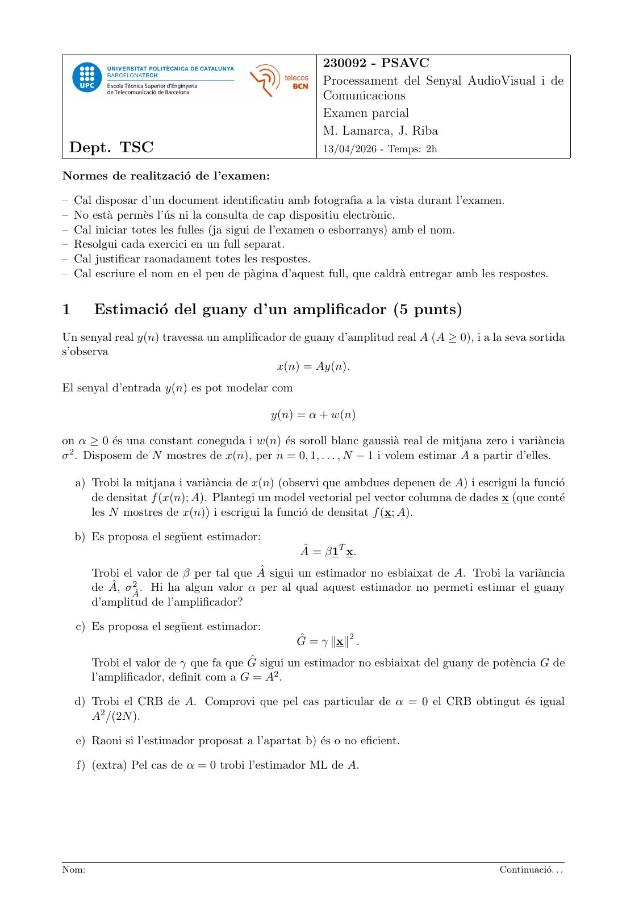
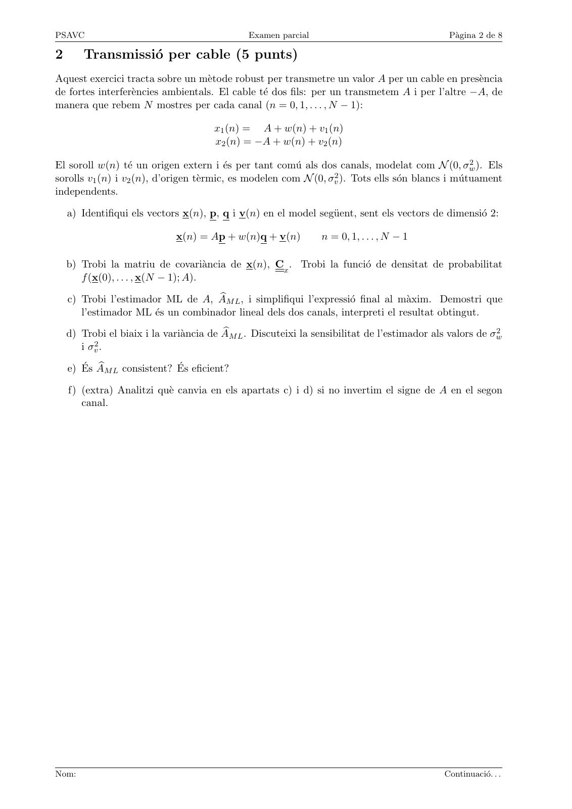
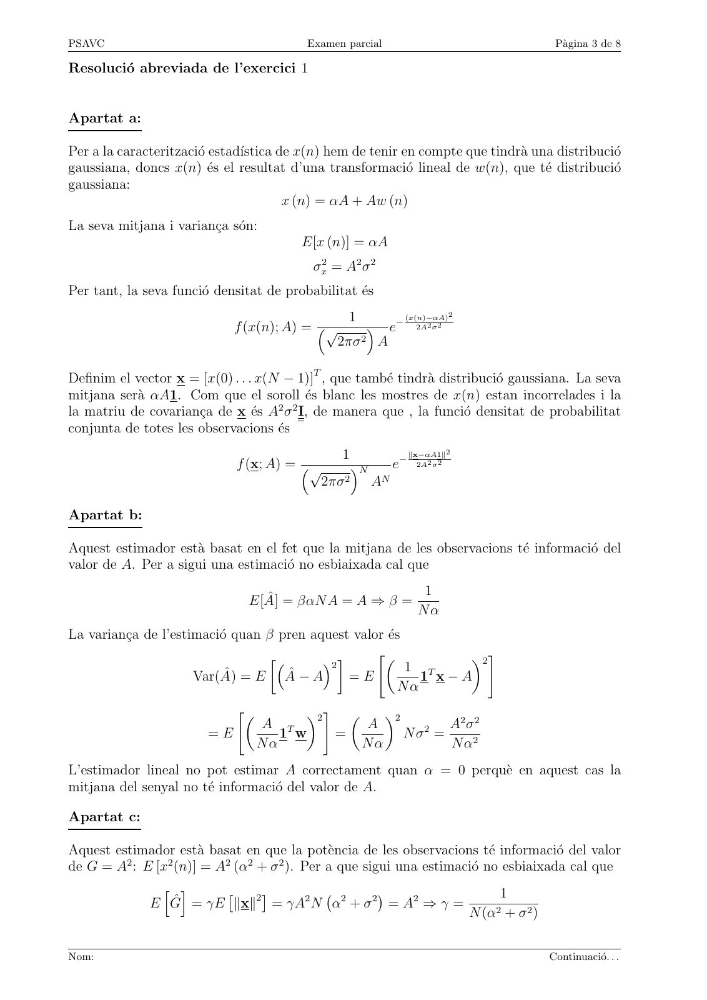
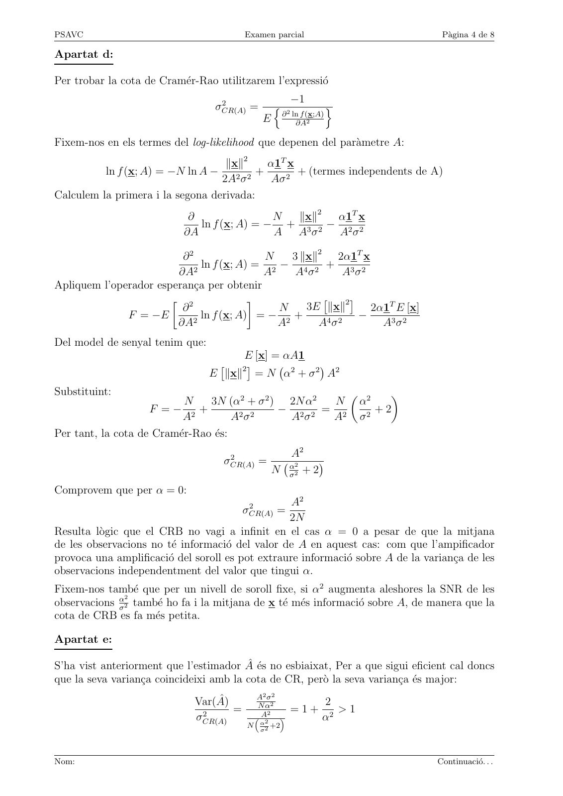
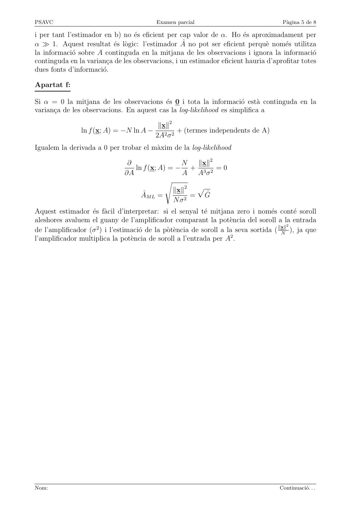
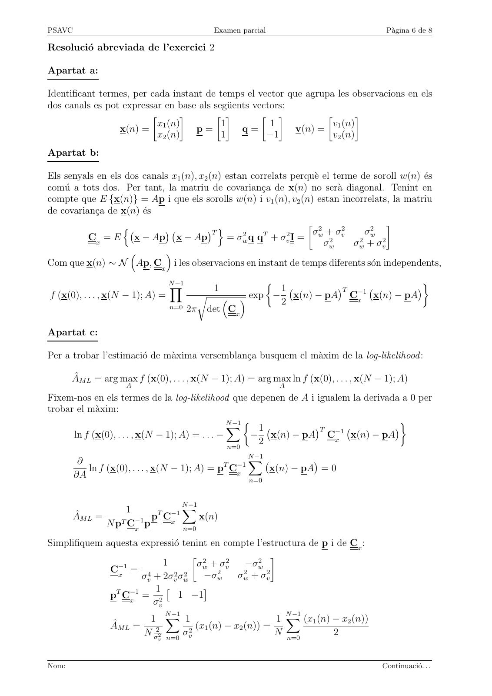
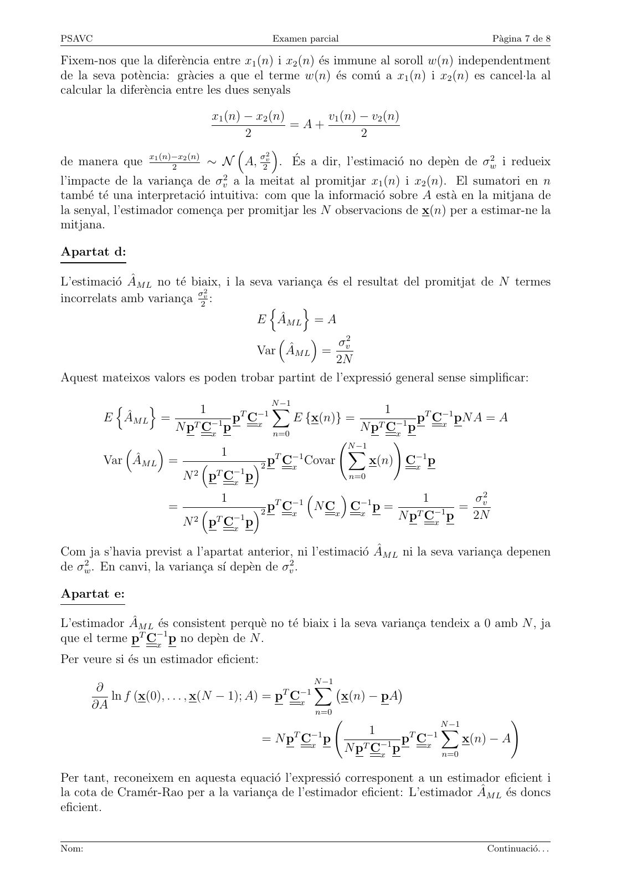
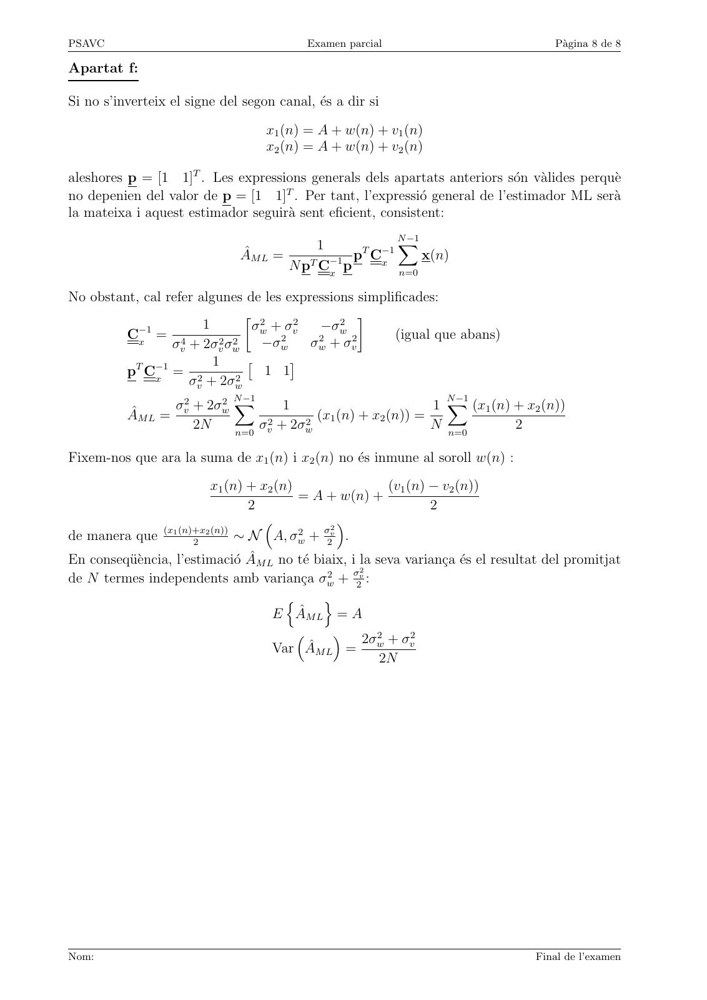

# Examen Parcial PSAVC 13abril2026 resolt

- Source PDF: `~/Downloads/Examen Parcial PSAVC 13abril2026 resolt.pdf`
- PDF title: `Examen Parcial PSAVC 13abril2026 resolt`
- Pages: 8
- Note: Transcribed from the embedded PDF text layer. Each page links to a rendered page image so figures, plots, handwriting, and formula layout can be checked against the original.

## Page 1



```text
                                                      230092 - PSAVC
                                                      Processament del Senyal AudioVisual i de
                                                      Comunicacions
                                                      Examen parcial
                                                      M. Lamarca, J. Riba
 Dept. TSC                                            13/04/2026 - Temps: 2h

Normes de realització de l’examen:

– Cal disposar d’un document identificatiu amb fotografia a la vista durant l’examen.
– No està permès l’ús ni la consulta de cap dispositiu electrònic.
– Cal iniciar totes les fulles (ja sigui de l’examen o esborranys) amb el nom.
– Resolgui cada exercici en un full separat.
– Cal justificar raonadament totes les respostes.
– Cal escriure el nom en el peu de pàgina d’aquest full, que caldrà entregar amb les respostes.


1      Estimació del guany d’un amplificador (5 punts)
Un senyal real y(n) travessa un amplificador de guany d’amplitud real A (A ≥ 0), i a la seva sortida
s’observa
                                          x(n) = Ay(n).
El senyal d’entrada y(n) es pot modelar com

                                           y(n) = α + w(n)

on α ≥ 0 és una constant coneguda i w(n) és soroll blanc gaussià real de mitjana zero i variància
σ 2 . Disposem de N mostres de x(n), per n = 0, 1, . . . , N − 1 i volem estimar A a partir d’elles.

    a) Trobi la mitjana i variància de x(n) (observi que ambdues depenen de A) i escrigui la funció
       de densitat f (x(n); A). Plantegi un model vectorial pel vector columna de dades x (que conté
       les N mostres de x(n)) i escrigui la funció de densitat f (x; A).

    b) Es proposa el següent estimador:
                                                 Â = β1T x.
       Trobi el valor de β per tal que  sigui un estimador no esbiaixat de A. Trobi la variància
               2 . Hi ha algun valor α per al qual aquest estimador no permeti estimar el guany
       de Â, σÂ
       d’amplitud de l’amplificador?

    c) Es proposa el següent estimador:
                                                Ĝ = γ ∥x∥2 .
       Trobi el valor de γ que fa que Ĝ sigui un estimador no esbiaixat del guany de potència G de
       l’amplificador, definit com a G = A2 .

    d) Trobi el CRB de A. Comprovi que pel cas particular de α = 0 el CRB obtingut és igual
       A2 /(2N ).

    e) Raoni si l’estimador proposat a l’apartat b) és o no eficient.

    f) (extra) Pel cas de α = 0 trobi l’estimador ML de A.


Nom:                                                                                    Continuació. . .
```

## Page 2



```text
PSAVC                                         Examen parcial                                  Pàgina 2 de 8

2       Transmissió per cable (5 punts)
Aquest exercici tracta sobre un mètode robust per transmetre un valor A per un cable en presència
de fortes interferències ambientals. El cable té dos fils: per un transmetem A i per l’altre −A, de
manera que rebem N mostres per cada canal (n = 0, 1, . . . , N − 1):

                                      x1 (n) = A + w(n) + v1 (n)
                                      x2 (n) = −A + w(n) + v2 (n)

El soroll w(n) té un origen extern i és per tant comú als dos canals, modelat com N (0, σw      2 ). Els

sorolls v1 (n) i v2 (n), d’origen tèrmic, es modelen com N (0, σv2 ). Tots ells són blancs i mútuament
independents.

    a) Identifiqui els vectors x(n), p, q i v(n) en el model següent, sent els vectors de dimensió 2:

                             x(n) = Ap + w(n)q + v(n)          n = 0, 1, . . . , N − 1

    b) Trobi la matriu de covariància de x(n), Cx . Trobi la funció de densitat de probabilitat
       f (x(0), . . . , x(N − 1); A).

    c) Trobi l’estimador ML de A, A bM L , i simplifiqui l’expressió final al màxim. Demostri que
       l’estimador ML és un combinador lineal dels dos canals, interpreti el resultat obtingut.

    d) Trobi el biaix i la variància de A                                                               2
                                         bM L . Discuteixi la sensibilitat de l’estimador als valors de σw
       i σv2 .

    e) És A
           bM L consistent? És eficient?

    f) (extra) Analitzi què canvia en els apartats c) i d) si no invertim el signe de A en el segon
       canal.


Nom:                                                                                         Continuació. . .
```

## Page 3



```text
PSAVC                                      Examen parcial                              Pàgina 3 de 8

Resolució abreviada de l’exercici 1


Apartat a:

Per a la caracterització estadı́stica de x(n) hem de tenir en compte que tindrà una distribució
gaussiana, doncs x(n) és el resultat d’una transformació lineal de w(n), que té distribució
gaussiana:
                                        x (n) = αA + Aw (n)
La seva mitjana i variança són:
                                         E[x (n)] = αA
                                            σx2 = A2 σ 2
Per tant, la seva funció densitat de probabilitat és
                                                      1             (x(n)−αA)2
                             f (x(n); A) = √                 e−      2A2 σ 2

                                                  2πσ 2 A

Definim el vector x = [x(0) . . . x(N − 1)]T , que també tindrà distribució gaussiana. La seva
mitjana serà αA1. Com que el soroll és blanc les mostres de x(n) estan incorrelades i la
la matriu de covariança de x és A2 σ 2 I, de manera que , la funció densitat de probabilitat
conjunta de totes les observacions és
                                             1       −
                                                       ∥x−αA1∥2
                             f (x; A) = √     N  e     2A2 σ 2

                                          2πσ 2 AN

Apartat b:

Aquest estimador està basat en el fet que la mitjana de les observacions té informació del
valor de A. Per a sigui una estimació no esbiaixada cal que
                                                                       1
                               E[Â] = βαN A = A ⇒ β =
                                                                      Nα
La variança de l’estimació quan β pren aquest valor és
                                                  "            2 #
                                           2            1 T
                      Var(Â) = E Â − A        =E          1 x−A
                                                        Nα
                             "            2 #                2
                                                                             A2 σ 2
                                                      
                                  A T                     A
                        =E           1 w          =                 N σ2 =
                                  Nα                      Nα                 N α2
L’estimador lineal no pot estimar A correctament quan α = 0 perquè en aquest cas la
mitjana del senyal no té informació del valor de A.

Apartat c:

Aquest estimador està basat en que la potència de les observacions té informació del valor
de G = A2 : E [x2 (n)] = A2 (α2 + σ 2 ). Per a que sigui una estimació no esbiaixada cal que
               h i                                                         1
             E Ĝ = γE ∥x∥2 = γA2 N α2 + σ 2 = A2 ⇒ γ =
                                                    
                                                                    N (α + σ 2 )
                                                                          2


Nom:                                                                                  Continuació. . .
```

## Page 4



```text
PSAVC                                     Examen parcial                                Pàgina 4 de 8

Apartat d:

Per trobar la cota de Cramér-Rao utilitzarem l’expressió
                                   2                    −1
                                  σCR(A) =        n 2              o
                                                    ∂ ln f (x;A)
                                              E        ∂A2

Fixem-nos en els termes del log-likelihood que depenen del paràmetre A:
                                   ∥x∥2     α1T x
          ln f (x; A) = −N ln A −         +       + (termes independents de A)
                                  2A2 σ 2   Aσ 2
Calculem la primera i la segona derivada:
                            ∂                N ∥x∥2  α1T x
                              ln f (x; A) = − + 3 2 − 2 2
                           ∂A                A Aσ    Aσ

                         ∂2                 N    3 ∥x∥2 2α1T x
                             ln f (x; A) =    −           + 3 2
                        ∂A2                A2     A4 σ 2       Aσ
Apliquem l’operador esperança per obtenir
                                                    3E ∥x∥2
                                                               
                                                                    2α1T E [x]
                        2              
                         ∂                    N
              F = −E         ln f (x; A)  = −    +                −
                        ∂A2                   A2        A4 σ 2        A3 σ 2
Del model de senyal tenim que:
                                      E [x] = αA1
                                 E ∥x∥2 = N α2 + σ 2 A2
                                                  

Substituint:
                                3N (α2 + σ 2 ) 2N α2                       α2
                                                                                  
                           N                         N
                    F =− 2 +           2 2
                                              − 2 2 = 2                       +2
                          A           Aσ       Aσ    A                     σ2
Per tant, la cota de Cramér-Rao és:

                                     2               A2
                                    σCR(A) =          2
                                                  N ασ2 + 2
                                                            

Comprovem que per α = 0:
                                           2       A2
                                          σCR(A) =
                                                  2N
Resulta lògic que el CRB no vagi a infinit en el cas α = 0 a pesar de que la mitjana
de les observacions no té informació del valor de A en aquest cas: com que l’ampificador
provoca una amplificació del soroll es pot extraure informació sobre A de la variança de les
observacions independentment del valor que tingui α.
Fixem-nos també que per un nivell de soroll fixe, si α2 augmenta aleshores la SNR de les
               2
observacions ασ2 també ho fa i la mitjana de x té més informació sobre A, de manera que la
cota de CRB es fa més petita.

Apartat e:

S’ha vist anteriorment que l’estimador  és no esbiaixat, Per a que sigui eficient cal doncs
que la seva variança coincideixi amb la cota de CR, però la seva variança és major:
                                           A2 σ 2
                              Var(Â)       N α2               2
                               2
                                      =        2        =1+       >1
                              σCR(A)        A2               α2
                                          N α2 +2
                                             σ


Nom:                                                                                   Continuació. . .
```

## Page 5



```text
PSAVC                                      Examen parcial                               Pàgina 5 de 8

i per tant l’estimador en b) no és eficient per cap valor de α. Ho és aproximadament per
α ≫ 1. Aquest resultat és lògic: l’estimador  no pot ser eficient perquè només utilitza
la informació sobre A continguda en la mitjana de les observacions i ignora la informació
continguda en la variança de les observacions, i un estimador eficient hauria d’aprofitar totes
dues fonts d’informació.

Apartat f:

Si α = 0 la mitjana de les observacions és 0 i tota la informació està continguda en la
variança de les observacions. En aquest cas la log-likelihood es simplifica a

                                            ∥x∥2
                ln f (x; A) = −N ln A −            + (termes independents de A)
                                           2A2 σ 2
Igualem la derivada a 0 per trobar el màxim de la log-likelihood

                                 ∂                N   ∥x∥2
                                   ln f (x; A) = − + 3 2 = 0
                                ∂A                 A Aσ
                                              s
                                                ∥x∥2 p
                                     ÂM L =         = Ĝ
                                                N σ2
Aquest estimador és fàcil d’interpretar: si el senyal té mitjana zero i només conté soroll
aleshores avaluem el guany de l’amplificador comparant la potència del soroll a la entrada
                                                                                          2
de l’amplificador (σ 2 ) i l’estimació de la pòtència de soroll a la seva sortida ( ∥x∥
                                                                                        N
                                                                                            ), ja que
                                                                      2
l’amplificador multiplica la potència de soroll a l’entrada per A .


Nom:                                                                                   Continuació. . .
```

## Page 6



```text
PSAVC                                        Examen parcial                              Pàgina 6 de 8

Resolució abreviada de l’exercici 2

Apartat a:

Identificant termes, per cada instant de temps el vector que agrupa les observacions en els
dos canals es pot expressar en base als següents vectors:
                                                                  
                           x1 (n)         1           1            v1 (n)
                 x(n) =             p=         q=          v(n) =
                           x2 (n)         1          −1            v2 (n)
Apartat b:

Els senyals en els dos canals x1 (n), x2 (n) estan correlats perquè el terme de soroll w(n) és
comú a tots dos. Per tant, la matriu de covariança de x(n) no serà diagonal. Tenint en
compte que E {x(n)} = Ap i que els sorolls w(n) i v1 (n), v2 (n) estan incorrelats, la matriu
de covariança de x(n) és
                                                                  2                  
                                                                  σw + σv2     σw2
                  n                     T o     2    T     2
                            
          Cx = E x − Ap x − Ap               = σw q q + σv I =
                                                                     σw2    σw2 + σv2
                           
Com que x(n) ∼ N Ap, Cx i les observacions en instant de temps diferents són independents,
                                  N −1                                                
                                  Y          1               1          T −1        
f (x(0), . . . , x(N − 1); A) =            r         exp − 2 x(n) − pA Cx x(n) − pA
                                  n=0 2π    det Cx

Apartat c:

Per a trobar l’estimació de màxima versemblança busquem el màxim de la log-likelihood :

       ÂM L = arg max f (x(0), . . . , x(N − 1); A) = arg max ln f (x(0), . . . , x(N − 1); A)
                     A                                        A
Fixem-nos en els termes de la log-likelihood que depenen de A i igualem la derivada a 0 per
trobar el màxim:
                                                 N −1                             
                                                 X       1         T −1          
      ln f (x(0), . . . , x(N − 1); A) = . . . −        − x(n) − pA Cx x(n) − pA
                                                 n=0
                                                         2
                                                    N −1
         ∂                                     T −1
                                                    X             
           ln f (x(0), . . . , x(N − 1); A) = p Cx       x(n) − pA = 0
        ∂A                                          n=0


                                N −1
                   1       T −1
                                X
       ÂM L =            p Cx       x(n)
               N pT C−1
                     x
                        p       n=0

Simplifiquem aquesta expressió tenint en compte l’estructura de p i de Cx :
                                     2                   
                −1           1       σw + σv2     −σw2
              Cx = 4
                      σv + 2σv2 σw2    −σw2     σw2 + σv2
                         1 
              pT C−1
                                       
                      =         1   −1
                   x     σv2
                             N −1                             N −1
                        1 X 1                               1 X (x1 (n) − x2 (n))
              ÂM L =                (x1 (n) − x2 (n)) =
                      N σ22 n=0 σv2                        N n=0        2
                             v


Nom:                                                                                    Continuació. . .
```

## Page 7



```text
PSAVC                                      Examen parcial                             Pàgina 7 de 8

Fixem-nos que la diferència entre x1 (n) i x2 (n) és immune al soroll w(n) independentment
de la seva potència: gràcies a que el terme w(n) és comú a x1 (n) i x2 (n) es cancel·la al
calcular la diferència entre les dues senyals

                            x1 (n) − x2 (n)     v1 (n) − v2 (n)
                                            =A+
                                   2                   2
                                      2
                                         
de manera que x1 (n)−x
                    2
                      2 (n)
                            ∼ N A, σ2v . És a dir, l’estimació no depèn de σw2 i redueix
l’impacte de la variança de σv2 a la meitat al promitjar x1 (n) i x2 (n). El sumatori en n
també té una interpretació intuitiva: com que la informació sobre A està en la mitjana de
la senyal, l’estimador comença per promitjar les N observacions de x(n) per a estimar-ne la
mitjana.

Apartat d:

L’estimació ÂM L no té biaix, i la seva variança és el resultat del promitjat de N termes
                            2
incorrelats amb variança σ2v :
                                         n      o
                                       E ÂM L = A
                                                      σ2
                                       Var ÂM L = v
                                                        2N
Aquest mateixos valors es poden trobar partint de l’expressió general sense simplificar:
                                        N −1
          n     o         1       T −1
                                        X                     1      T −1
         E ÂM L =      T   −1 p Cx          E {x(n)} =     T   −1 p Cx pN A = A
                     N p Cx p           n=0
                                                         N p Cx p
                                                        −1
                                                      N
                                                                !
                            1         T −1
                                                       X
         Var ÂM L =               2 p Cx Covar          x(n) C−1x
                                                                      p
                      N 2 pT C−1x
                                   p                   n=0

                              1         T −1
                                                    
                                                         −1          1       σv2
                    =               2 p Cx N Cx Cx p =                    =
                                                                N pT C−1 p   2N
                          
                      N 2 pT C−1x
                                   p                                   x


Com ja s’havia previst a l’apartat anterior, ni l’estimació ÂM L ni la seva variança depenen
de σw2 . En canvi, la variança sı́ depèn de σv2 .

Apartat e:

L’estimador ÂM L és consistent perquè no té biaix i la seva variança tendeix a 0 amb N , ja
que el terme pT C−1
                  x
                     p no depèn de N .
Per veure si és un estimador eficient:
                                                   N −1
        ∂                                     T −1
                                                   X             
          ln f (x(0), . . . , x(N − 1); A) = p Cx       x(n) − pA
       ∂A                                          n=0
                                                                             N −1
                                                                                             !
                                                                1            X
                                          = N pT C−1 p                  T −1
                                                                       p Cx       x(n) − A
                                                  x         N pT C−1
                                                                  x
                                                                     p       n=0

Per tant, reconeixem en aquesta equació l’expressió corresponent a un estimador eficient i
la cota de Cramér-Rao per a la variança de l’estimador eficient: L’estimador ÂM L és doncs
eficient.


Nom:                                                                                 Continuació. . .
```

## Page 8



```text
PSAVC                                      Examen parcial                               Pàgina 8 de 8

Apartat f:

Si no s’inverteix el signe del segon canal, és a dir si

                                    x1 (n) = A + w(n) + v1 (n)
                                    x2 (n) = A + w(n) + v2 (n)

aleshores p = [1 1]T . Les expressions generals dels apartats anteriors són vàlides perquè
no depenien del valor de p = [1 1]T . Per tant, l’expressió general de l’estimador ML serà
la mateixa i aquest estimador seguirà sent eficient, consistent:
                                                        N −1
                                           1       T −1
                                                        X
                               ÂM L =            p Cx       x(n)
                                       N pT C−1
                                             x
                                                p       n=0

No obstant, cal refer algunes de les expressions simplificades:
                                 2                   
           −1           1        σw + σv2     −σw2
         Cx = 4                                            (igual que abans)
                 σv + 2σv2 σw2    −σw2      σw2 + σv2
                          1
         pT C−1
                                        
                 =                 1   1
              x      σv2 + 2σw2
                             N −1                                   N −1
                  σv2 + 2σw2 X         1                          1 X (x1 (n) + x2 (n))
         ÂM L =                             (x1 (n) + x2 (n)) =
                      2N     n=0 v
                                  σ 2 + 2σw2                     N n=0        2

Fixem-nos que ara la suma de x1 (n) i x2 (n) no és inmune al soroll w(n) :
                         x1 (n) + x2 (n)              (v1 (n) − v2 (n))
                                         = A + w(n) +
                                2                             2
                                            2
                                               
de manera que (x1 (n)+x
                     2
                       2 (n))
                              ∼ N A, σw2 + σ2v .
En conseqüència, l’estimació ÂM L no té biaix, i la seva variança és el resultat del promitjat
                                                      2
de N termes independents amb variança σw2 + σ2v :
                                       n       o
                                     E ÂM L = A
                                                 2σ 2 + σ 2
                                     Var ÂM L = w             v
                                                          2N


Nom:                                                                                 Final de l’examen
```
