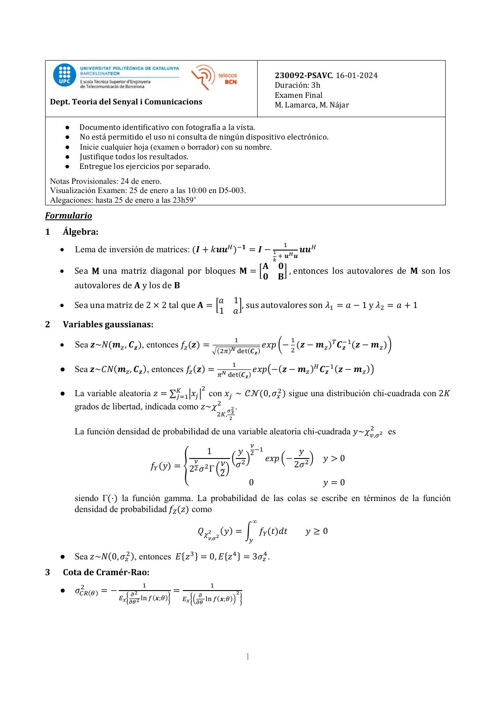
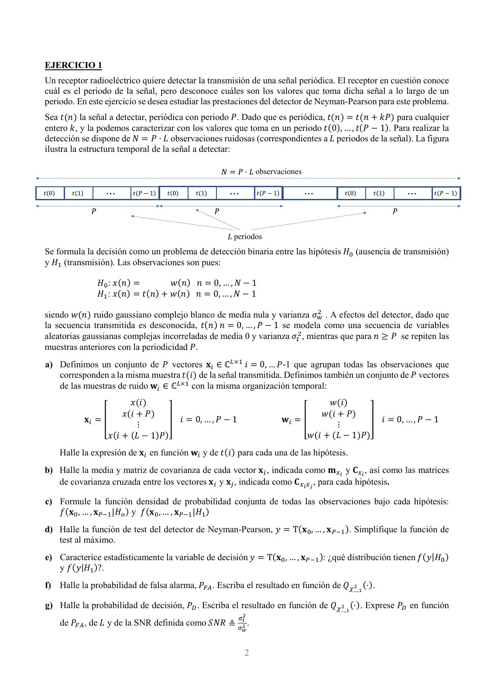
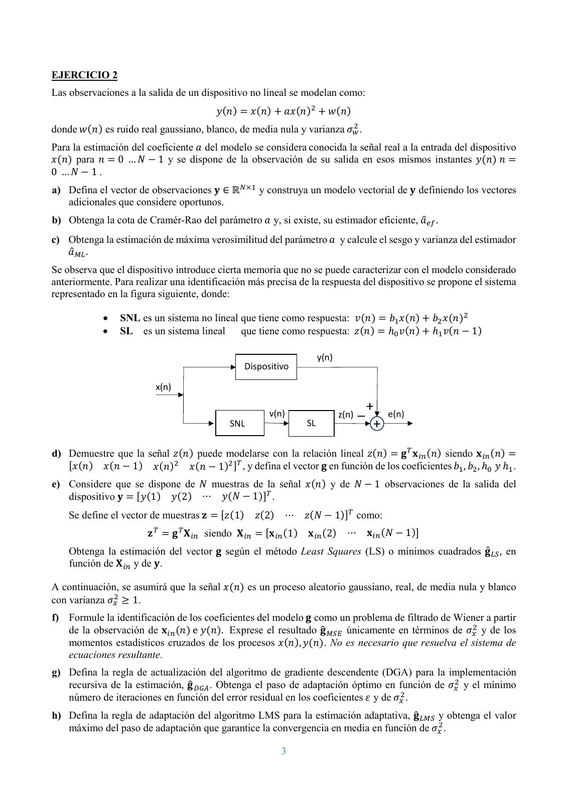
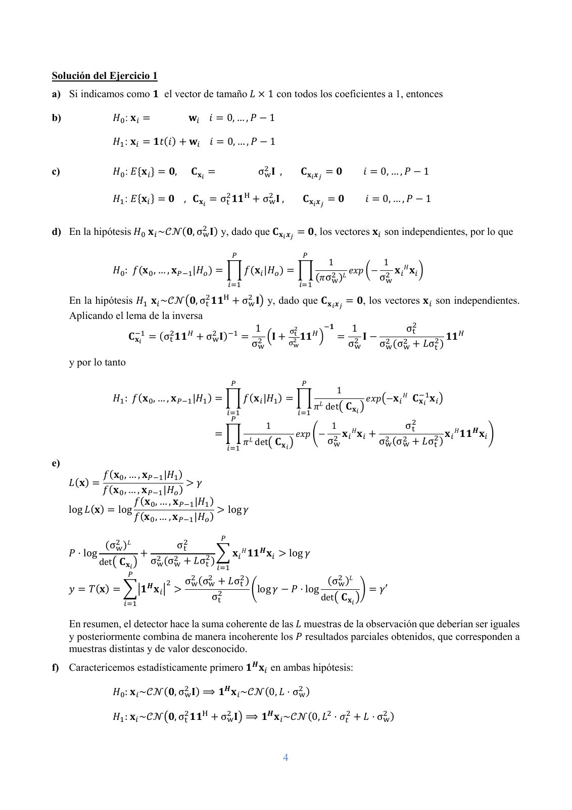
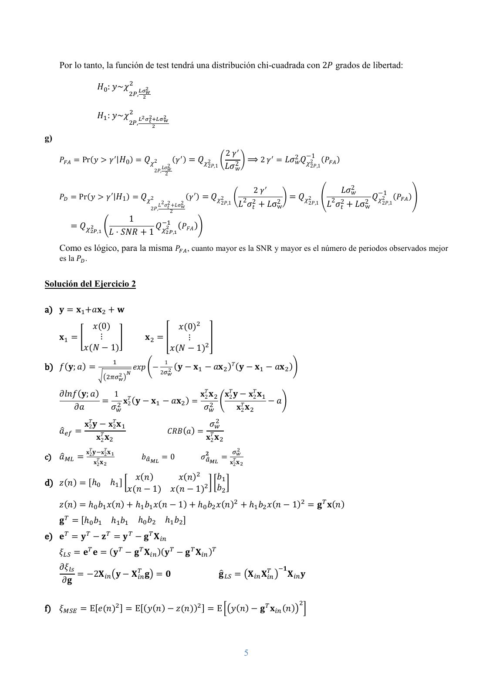
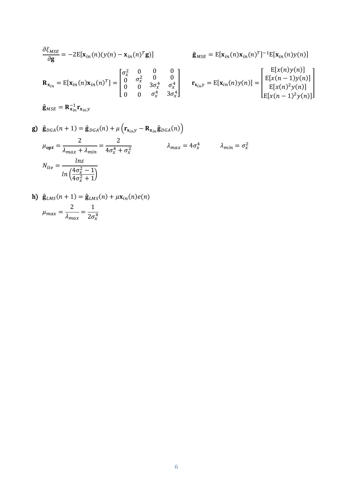

# PSAVC Final 2024 01 16 resolt

- Source PDF: `Examenes/PSAVC Final 2024 01 16 resolt.pdf`
- PDF title: `PSAVC Final 2024 01 16 resolt`
- Pages: 6
- Note: Transcribed from the embedded PDF text layer. Each page links to a rendered page image so figures, plots, handwriting, and formula layout can be checked against the original.
- Text-layer caveat: `�` marks a glyph that the PDF text layer does not map to Unicode; use the rendered page image for that formula or symbol.

## Page 1



```text
                                                                                                        230092-PSAVC. 16-01-2024
                                                                                                        Duración: 3h
                                                                                                        Examen Final
 Dept. Teoria del Senyal i Comunicacions                                                                M. Lamarca, M. Nájar

        ●    Documento identificativo con fotografía a la vista.
        ●    No está permitido el uso ni consulta de ningún dispositivo electrónico.
        ●    Inicie cualquier hoja (examen o borrador) con su nombre.
        ●    Justifique todos los resultados.
        ●    Entregue los ejercicios por separado.
 Notas Provisionales: 24 de enero.
 Visualización Examen: 25 de enero a las 10:00 en D5-003.
 Alegaciones: hasta 25 de enero a las 23h59’
Formulario
1   Álgebra:
                                                                                                              1
    •       Lema de inversión de matrices: (𝑰𝑰 + 𝑘𝑘𝒖𝒖𝒖𝒖𝐻𝐻 )−𝟏𝟏 = 𝑰𝑰 − 1                                                 𝒖𝒖𝒖𝒖𝐻𝐻
                                                                                                            + 𝒖𝒖𝐻𝐻 𝒖𝒖
                                                                                                       𝑘𝑘
                                                        𝐀𝐀 𝟎𝟎
    •       Sea M una matriz diagonal por bloques 𝐌𝐌 = �      � , entonces los autovalores de 𝐌𝐌 son los
                                                         𝟎𝟎 𝐁𝐁
            autovalores de 𝐀𝐀 y los de 𝐁𝐁
                                                                            𝑎𝑎         1
    •       Sea una matriz de 2 × 2 tal que 𝐀𝐀 = �                                        �, sus autovalores son 𝜆𝜆1 = 𝑎𝑎 − 1 y 𝜆𝜆2 = 𝑎𝑎 + 1
                                                                            1          𝑎𝑎
2   Variables gaussianas:
                                                                                       1                          1
    •       Sea 𝒛𝒛~𝑁𝑁(𝒎𝒎𝑧𝑧 , 𝑪𝑪𝒛𝒛 ), entonces 𝑓𝑓𝑧𝑧 (𝒛𝒛) =                                           𝑒𝑒𝑒𝑒𝑒𝑒 �− (𝒛𝒛 − 𝒎𝒎𝑧𝑧 )𝑇𝑇 𝑪𝑪−1
                                                                                                                               𝒛𝒛 (𝒛𝒛 − 𝒎𝒎𝑧𝑧 )�
                                                                        �(2𝜋𝜋)𝑁𝑁 det(𝑪𝑪𝒛𝒛 )                       2

                                                                                  1
    ●       Sea 𝒛𝒛~𝐶𝐶𝐶𝐶(𝒎𝒎𝑧𝑧 , 𝑪𝑪𝒛𝒛 ), entonces 𝑓𝑓𝑧𝑧 (𝒛𝒛) =                                 𝑒𝑒𝑒𝑒𝑒𝑒�−(𝒛𝒛 − 𝒎𝒎𝑧𝑧 )𝐻𝐻 𝑪𝑪−1
                                                                                                                     𝒛𝒛 (𝒛𝒛 − 𝒎𝒎𝑧𝑧 )�
                                                                            𝜋𝜋𝑁𝑁 det(𝑪𝑪𝒛𝒛 )

                                                                2
    ●       La variable aleatoria 𝑧𝑧 = ∑𝐾𝐾                                2
                                        𝑗𝑗=1�𝑥𝑥𝑗𝑗 � con 𝑥𝑥𝑗𝑗 ~ 𝒞𝒞𝒩𝒩(0, 𝜎𝜎𝑥𝑥 ) sigue una distribución chi-cuadrada con 2𝐾𝐾
            grados de libertad, indicada como 𝑧𝑧~𝜒𝜒 2 𝜎𝜎2𝑥𝑥 .
                                                                            2𝐾𝐾,
                                                                                   2
                                                                                            2
            La función densidad de probabilidad de una variable aleatoria chi-cuadrada 𝑦𝑦~𝜒𝜒𝑣𝑣,𝜎𝜎 2 es

                                                                                               𝜈𝜈
                                                                    1 𝑦𝑦 2−1           𝑦𝑦
                                                        𝜈𝜈           � 2�    𝑒𝑒𝑒𝑒𝑒𝑒 �− 2 � 𝑦𝑦 > 0
                                                                  𝜈𝜈
                                          𝑓𝑓𝑌𝑌 (𝑦𝑦) = �22 𝜎𝜎 2 Γ � � 𝜎𝜎               2𝜎𝜎
                                                                  2
                                                                         0                 𝑦𝑦 = 0
            siendo Γ(·) la función gamma. La probabilidad de las colas se escribe en términos de la función
            densidad de probabilidad 𝑓𝑓𝑍𝑍 (𝑧𝑧) como
                                                                                               ∞
                                                              𝑄𝑄𝜒𝜒2 2 (𝑦𝑦) = � 𝑓𝑓𝑌𝑌 (𝑡𝑡)𝑑𝑑𝑑𝑑                              𝑦𝑦 ≥ 0
                                                                    𝑣𝑣,𝜎𝜎                  𝑦𝑦

    ●       Sea 𝑧𝑧~𝑁𝑁(0, 𝜎𝜎𝑧𝑧2 ), entonces 𝐸𝐸{𝑧𝑧 3 } = 0, 𝐸𝐸{𝑧𝑧 4 } = 3𝜎𝜎𝑧𝑧4 .
3   Cota de Cramér-Rao:
               2                      1                              1
    ●       𝜎𝜎𝐶𝐶𝐶𝐶(𝜃𝜃) =−          𝜕𝜕2
                                                     =           𝜕𝜕           2
                            𝐸𝐸𝑥𝑥 � 2 ln 𝑓𝑓(𝒙𝒙;𝜃𝜃)�       𝐸𝐸𝑥𝑥 �� ln 𝑓𝑓(𝒙𝒙;𝜃𝜃)� �
                                  𝜕𝜕𝜃𝜃                          𝜕𝜕𝜕𝜕


                                                                                           1
```

## Page 2



```text
EJERCICIO 1
Un receptor radioeléctrico quiere detectar la transmisión de una señal periódica. El receptor en cuestión conoce
cuál es el periodo de la señal, pero desconoce cuáles son los valores que toma dicha señal a lo largo de un
periodo. En este ejercicio se desea estudiar las prestaciones del detector de Neyman-Pearson para este problema.
Sea 𝑡𝑡(𝑛𝑛) la señal a detectar, periódica con periodo 𝑃𝑃. Dado que es periódica, 𝑡𝑡(𝑛𝑛) = 𝑡𝑡(𝑛𝑛 + 𝑘𝑘𝑘𝑘) para cualquier
entero 𝑘𝑘, y la podemos caracterizar con los valores que toma en un periodo 𝑡𝑡(0), … , 𝑡𝑡(𝑃𝑃 − 1). Para realizar la
detección se dispone de 𝑁𝑁 = 𝑃𝑃 · 𝐿𝐿 observaciones ruidosas (correspondientes a 𝐿𝐿 periodos de la señal). La figura
ilustra la estructura temporal de la señal a detectar:

                                                                     observaciones


                                                        periodos
Se formula la decisión como un problema de detección binaria entre las hipótesis 𝐻𝐻0 (ausencia de transmisión)
y 𝐻𝐻1 (transmisión). Las observaciones son pues:

               𝐻𝐻0 : 𝑥𝑥(𝑛𝑛) =          𝑤𝑤(𝑛𝑛) 𝑛𝑛 = 0, … , 𝑁𝑁 − 1
               𝐻𝐻1 : 𝑥𝑥(𝑛𝑛) = 𝑡𝑡(𝑛𝑛) + 𝑤𝑤(𝑛𝑛) 𝑛𝑛 = 0, … , 𝑁𝑁 − 1

siendo 𝑤𝑤(𝑛𝑛) ruido gaussiano complejo blanco de media nula y varianza 𝜎𝜎𝑤𝑤2 . A efectos del detector, dado que
la secuencia transmitida es desconocida, 𝑡𝑡(𝑛𝑛) 𝑛𝑛 = 0, … , 𝑃𝑃 − 1 se modela como una secuencia de variables
aleatorias gaussianas complejas incorreladas de media 0 y varianza 𝜎𝜎𝑡𝑡2 , mientras que para 𝑛𝑛 ≥ 𝑃𝑃 se repiten las
muestras anteriores con la periodicidad 𝑃𝑃.
a) Definimos un conjunto de 𝑃𝑃 vectores 𝐱𝐱𝑖𝑖 ∈ ℂ𝐿𝐿×1 𝑖𝑖 = 0, … 𝑃𝑃-1 que agrupan todas las observaciones que
   corresponden a la misma muestra 𝑡𝑡(𝑖𝑖) de la señal transmitida. Definimos también un conjunto de 𝑃𝑃 vectores
   de las muestras de ruido 𝐰𝐰𝑖𝑖 ∈ ℂ𝐿𝐿×1 con la misma organización temporal:
                            𝑥𝑥(𝑖𝑖)                                                         𝑤𝑤(𝑖𝑖)
                         𝑥𝑥(𝑖𝑖 + 𝑃𝑃)                                                     𝑤𝑤(𝑖𝑖 + 𝑃𝑃)
           𝐱𝐱𝑖𝑖 = �                   � 𝑖𝑖 = 0, … , 𝑃𝑃 − 1                  𝐰𝐰𝑖𝑖 = �                   � 𝑖𝑖 = 0, … , 𝑃𝑃 − 1
                               ⋮                                                               ⋮
                   𝑥𝑥(𝑖𝑖 + (𝐿𝐿 − 1)𝑃𝑃)                                              𝑤𝑤(𝑖𝑖 + (𝐿𝐿 − 1)𝑃𝑃)
    Halle la expresión de 𝐱𝐱 𝑖𝑖 en función 𝐰𝐰𝑖𝑖 y de 𝑡𝑡(𝑖𝑖) para cada una de las hipótesis.
b) Halle la media y matriz de covarianza de cada vector 𝐱𝐱 𝑖𝑖 , indicada como 𝐦𝐦𝑥𝑥𝑖𝑖 y 𝐂𝐂𝑥𝑥𝑖𝑖 , así como las matrices
   de covarianza cruzada entre los vectores 𝐱𝐱 𝑖𝑖 y 𝐱𝐱𝑗𝑗 , indicada como 𝐂𝐂𝑥𝑥𝑖𝑖𝑥𝑥𝑗𝑗 , para cada hipótesis.

c) Formule la función densidad de probabilidad conjunta de todas las observaciones bajo cada hipótesis:
   𝑓𝑓(𝐱𝐱0 , … , 𝐱𝐱𝑃𝑃−1 |𝐻𝐻𝑜𝑜 ) y 𝑓𝑓(𝐱𝐱0 , … , 𝐱𝐱𝑃𝑃−1 |𝐻𝐻1 )
d) Halle la función de test del detector de Neyman-Pearson, 𝑦𝑦 = T(𝐱𝐱0 , … , 𝐱𝐱𝑃𝑃−1 ). Simplifique la función de
   test al máximo.
e) Caracterice estadísticamente la variable de decisión 𝑦𝑦 = T(𝐱𝐱0 , … , 𝐱𝐱𝑃𝑃−1 ): ¿qué distribución tienen 𝑓𝑓(𝑦𝑦|𝐻𝐻0 )
   y 𝑓𝑓(𝑦𝑦|𝐻𝐻1 )?.
f) Halle la probabilidad de falsa alarma, 𝑃𝑃𝐹𝐹𝐹𝐹 . Escriba el resultado en función de 𝑄𝑄𝜒𝜒…,1
                                                                                          2 (·).


g) Halle la probabilidad de decisión, 𝑃𝑃𝐷𝐷 . Escriba el resultado en función de 𝑄𝑄𝜒𝜒…,1
                                                                                    2 (·). Exprese 𝑃𝑃𝐷𝐷 en función

                                                             𝜎𝜎𝑡𝑡2
    de 𝑃𝑃𝐹𝐹𝐹𝐹 , de 𝐿𝐿 y de la SNR definida como 𝑆𝑆𝑆𝑆𝑆𝑆 ≜       2.
                                                             𝜎𝜎𝑤𝑤


                                                               2
```

## Page 3



```text
EJERCICIO 2
Las observaciones a la salida de un dispositivo no lineal se modelan como:
                                             𝑦𝑦(𝑛𝑛) = 𝑥𝑥(𝑛𝑛) + 𝑎𝑎𝑥𝑥(𝑛𝑛)2 + 𝑤𝑤(𝑛𝑛)
donde 𝑤𝑤(𝑛𝑛) es ruido real gaussiano, blanco, de media nula y varianza 𝜎𝜎𝑤𝑤2 .
Para la estimación del coeficiente 𝑎𝑎 del modelo se considera conocida la señal real a la entrada del dispositivo
𝑥𝑥(𝑛𝑛) para 𝑛𝑛 = 0 … 𝑁𝑁 − 1 y se dispone de la observación de su salida en esos mismos instantes 𝑦𝑦(𝑛𝑛) 𝑛𝑛 =
0 … 𝑁𝑁 − 1 .
a) Defina el vector de observaciones 𝐲𝐲 ∈ ℝ𝑁𝑁×1 y construya un modelo vectorial de 𝐲𝐲 definiendo los vectores
   adicionales que considere oportunos.
b) Obtenga la cota de Cramér-Rao del parámetro 𝑎𝑎 y, si existe, su estimador eficiente, 𝑎𝑎�𝑒𝑒𝑒𝑒 .
c) Obtenga la estimación de máxima verosimilitud del parámetro 𝑎𝑎 y calcule el sesgo y varianza del estimador
   𝑎𝑎�𝑀𝑀𝑀𝑀 .
Se observa que el dispositivo introduce cierta memoria que no se puede caracterizar con el modelo considerado
anteriormente. Para realizar una identificación más precisa de la respuesta del dispositivo se propone el sistema
representado en la figura siguiente, donde:

             •    SNL es un sistema no lineal que tiene como respuesta: 𝑣𝑣(𝑛𝑛) = 𝑏𝑏1 𝑥𝑥(𝑛𝑛) + 𝑏𝑏2 𝑥𝑥(𝑛𝑛)2
             •    SL es un sistema lineal que tiene como respuesta: 𝑧𝑧(𝑛𝑛) = ℎ0 𝑣𝑣(𝑛𝑛) + ℎ1 𝑣𝑣(𝑛𝑛 − 1)

                                                                            y(n)
                                                     Dispositivo

                           x(n)

                                                            v(n)                   z(n) _
                                                                                            + e(n)
                                                 SNL                   SL                    +
d) Demuestre que la señal 𝑧𝑧(𝑛𝑛) puede modelarse con la relación lineal 𝑧𝑧(𝑛𝑛) = 𝐠𝐠 𝑇𝑇 𝐱𝐱𝑖𝑖𝑖𝑖 (𝑛𝑛) siendo 𝐱𝐱𝑖𝑖𝑖𝑖 (𝑛𝑛) =
   [𝑥𝑥(𝑛𝑛) 𝑥𝑥(𝑛𝑛 − 1) 𝑥𝑥(𝑛𝑛)2 𝑥𝑥(𝑛𝑛 − 1)2 ]𝑇𝑇 , y defina el vector 𝐠𝐠 en función de los coeficientes 𝑏𝑏1 , 𝑏𝑏2 , ℎ0 𝑦𝑦 ℎ1 .
e) Considere que se dispone de 𝑁𝑁 muestras de la señal 𝑥𝑥(𝑛𝑛) y de 𝑁𝑁 − 1 observaciones de la salida del
   dispositivo 𝐲𝐲 = [𝑦𝑦(1) 𝑦𝑦(2) ⋯ 𝑦𝑦(𝑁𝑁 − 1)]𝑇𝑇 .
    Se define el vector de muestras 𝐳𝐳 = [𝑧𝑧(1) 𝑧𝑧(2) ⋯ 𝑧𝑧(𝑁𝑁 − 1)]𝑇𝑇 como:
                         𝐳𝐳 𝑇𝑇 = 𝐠𝐠 𝑇𝑇 𝐗𝐗 𝑖𝑖𝑖𝑖 siendo 𝐗𝐗 𝑖𝑖𝑖𝑖 = [𝐱𝐱𝑖𝑖𝑖𝑖 (1) 𝐱𝐱𝑖𝑖𝑖𝑖 (2) ⋯ 𝐱𝐱𝑖𝑖𝑖𝑖 (𝑁𝑁 − 1)]
    Obtenga la estimación del vector 𝐠𝐠 según el método Least Squares (LS) o mínimos cuadrados 𝐠𝐠� 𝐿𝐿𝐿𝐿 , en
    función de 𝐗𝐗 𝑖𝑖𝑖𝑖 y de 𝐲𝐲.

A continuación, se asumirá que la señal 𝑥𝑥(𝑛𝑛) es un proceso aleatorio gaussiano, real, de media nula y blanco
con varianza 𝜎𝜎𝑥𝑥2 ≥ 1.
f) Formule la identificación de los coeficientes del modelo 𝐠𝐠 como un problema de filtrado de Wiener a partir
   de la observación de 𝐱𝐱𝑖𝑖𝑖𝑖 (𝑛𝑛) e 𝑦𝑦(𝑛𝑛). Exprese el resultado 𝐠𝐠� 𝑀𝑀𝑀𝑀𝑀𝑀 únicamente en términos de 𝜎𝜎𝑥𝑥2 y de los
   momentos estadísticos cruzados de los procesos 𝑥𝑥(𝑛𝑛), 𝑦𝑦(𝑛𝑛). No es necesario que resuelva el sistema de
   ecuaciones resultante.
g) Defina la regla de actualización del algoritmo de gradiente descendente (DGA) para la implementación
   recursiva de la estimación, 𝐠𝐠� 𝐷𝐷𝐷𝐷𝐷𝐷 . Obtenga el paso de adaptación óptimo en función de 𝜎𝜎𝑥𝑥2 y el mínimo
   número de iteraciones en función del error residual en los coeficientes 𝜀𝜀 y de 𝜎𝜎𝑥𝑥2 .
h) Defina la regla de adaptación del algoritmo LMS para la estimación adaptativa, 𝐠𝐠� 𝐿𝐿𝐿𝐿𝐿𝐿 y obtenga el valor
   máximo del paso de adaptación que garantice la convergencia en media en función de 𝜎𝜎𝑥𝑥2 .

                                                                3
```

## Page 4



```text
Solución del Ejercicio 1
a) Si indicamos como 𝟏𝟏 el vector de tamaño 𝐿𝐿 × 1 con todos los coeficientes a 1, entonces

b)                𝐻𝐻0 : 𝐱𝐱𝑖𝑖 =            𝐰𝐰𝑖𝑖 𝑖𝑖 = 0, … , 𝑃𝑃 − 1

                  𝐻𝐻1 : 𝐱𝐱𝑖𝑖 = 𝟏𝟏𝑡𝑡(𝑖𝑖) + 𝐰𝐰𝑖𝑖 𝑖𝑖 = 0, … , 𝑃𝑃 − 1

c)                𝐻𝐻0 : 𝐸𝐸{𝐱𝐱𝑖𝑖 } = 𝟎𝟎,    𝐂𝐂𝐱𝐱𝑖𝑖 =                    σ2w 𝐈𝐈 ,       𝐂𝐂𝐱𝐱𝑖𝑖𝒙𝒙𝑗𝑗 = 𝟎𝟎          𝑖𝑖 = 0, … , 𝑃𝑃 − 1

                  𝐻𝐻1 : 𝐸𝐸{𝐱𝐱𝑖𝑖 } = 𝟎𝟎 , 𝐂𝐂𝐱𝐱𝑖𝑖 = σ2t 𝟏𝟏𝟏𝟏H + σ2w 𝐈𝐈 ,                 𝐂𝐂𝐱𝐱𝑖𝑖𝒙𝒙𝑗𝑗 = 𝟎𝟎          𝑖𝑖 = 0, … , 𝑃𝑃 − 1


d) En la hipótesis 𝐻𝐻0 𝐱𝐱𝑖𝑖 ~𝒞𝒞𝒩𝒩(𝟎𝟎, σ2w 𝐈𝐈) y, dado que 𝐂𝐂𝐱𝐱𝑖𝑖𝒙𝒙𝑗𝑗 = 𝟎𝟎, los vectores 𝐱𝐱𝑖𝑖 son independientes, por lo que

                                                             𝑃𝑃                        𝑃𝑃
                                                                                                 1                  1
                  𝐻𝐻0 : 𝑓𝑓(𝐱𝐱 0 , … , 𝐱𝐱𝑃𝑃−1 |𝐻𝐻𝑜𝑜 ) = � 𝑓𝑓(𝐱𝐱𝑖𝑖 |𝐻𝐻𝑜𝑜 ) = �                              𝑒𝑒𝑒𝑒𝑒𝑒 �− 2 𝐱𝐱 𝑖𝑖 𝐻𝐻 𝐱𝐱 𝑖𝑖 �
                                                                                             (𝜋𝜋σ2w )𝐿𝐿            σ   w
                                                            𝑖𝑖=1                      𝑖𝑖=1

     En la hipótesis 𝐻𝐻1 𝐱𝐱𝑖𝑖 ~𝒞𝒞𝒩𝒩�𝟎𝟎, σ2t 𝟏𝟏𝟏𝟏H + σ2w 𝐈𝐈� y, dado que 𝐂𝐂𝐱𝐱𝑖𝑖 𝒙𝒙𝑗𝑗 = 𝟎𝟎, los vectores 𝐱𝐱𝑖𝑖 son independientes.
     Aplicando el lema de la inversa
                                2
                                                        1         σ2t
                                                                              −𝟏𝟏    1              σ2t
                   𝐂𝐂𝐱𝐱−1  = (σ t 𝟏𝟏𝟏𝟏𝐻𝐻
                                         + σ 2 −1
                                             w 𝐈𝐈) =        �𝐈𝐈 +     𝟏𝟏𝟏𝟏𝐻𝐻
                                                                             �    =     𝐈𝐈 −                    𝟏𝟏𝟏𝟏𝐻𝐻
                        𝑖𝑖
                                                       σ2w        σ2w               σ2w      σ2w (σ2w + 𝐿𝐿σ2t )
     y por lo tanto
                                                             𝑃𝑃                        𝑃𝑃
                                                                                                     1
                  𝐻𝐻1 : 𝑓𝑓(𝐱𝐱 0 , … , 𝐱𝐱𝑃𝑃−1 |𝐻𝐻1 ) = � 𝑓𝑓(𝐱𝐱𝑖𝑖 |𝐻𝐻1 ) = � 𝐿𝐿                                   𝑒𝑒𝑒𝑒𝑒𝑒�−𝐱𝐱 𝑖𝑖 𝐻𝐻 𝐂𝐂𝐱𝐱−1
                                                                                                                                      𝑖𝑖
                                                                                                                                         𝐱𝐱𝑖𝑖 �
                                                                                             𝜋𝜋 det� 𝐂𝐂𝐱𝐱𝑖𝑖 �
                                                            𝑖𝑖=1                      𝑖𝑖=1
                                                              𝑃𝑃
                                                                          1                   1                      σ2t
                                                  = � 𝐿𝐿                            𝑒𝑒𝑒𝑒𝑒𝑒 �− 2 𝐱𝐱 𝑖𝑖 𝐻𝐻 𝐱𝐱 𝑖𝑖 + 2 2            𝐱𝐱 𝐻𝐻 𝟏𝟏𝟏𝟏𝑯𝑯 𝐱𝐱𝑖𝑖 �
                                                                   𝜋𝜋 det� 𝐂𝐂𝐱𝐱𝑖𝑖 �          σw                 σw (σw + 𝐿𝐿σ2t ) 𝑖𝑖
                                                            𝑖𝑖=1

e)
               𝑓𝑓(𝐱𝐱0 , … , 𝐱𝐱𝑃𝑃−1 |𝐻𝐻1 )
     𝐿𝐿(𝐱𝐱) =                              > 𝛾𝛾
               𝑓𝑓(𝐱𝐱0 , … , 𝐱𝐱𝑃𝑃−1 |𝐻𝐻𝑜𝑜 )
                         𝑓𝑓(𝐱𝐱0 , … , 𝐱𝐱𝑃𝑃−1 |𝐻𝐻1 )
     log 𝐿𝐿(𝐱𝐱) = log                                > log 𝛾𝛾
                         𝑓𝑓(𝐱𝐱0 , … , 𝐱𝐱𝑃𝑃−1 |𝐻𝐻𝑜𝑜 )
                                                       𝑃𝑃
                (σ2w )𝐿𝐿         σ2t
     𝑃𝑃 · log              + 2 2             � 𝐱𝐱𝑖𝑖 𝐻𝐻 𝟏𝟏𝟏𝟏𝑯𝑯 𝐱𝐱𝑖𝑖 > log 𝛾𝛾
              det� 𝐂𝐂𝐱𝐱𝑖𝑖 � σw (σw + 𝐿𝐿σ2t )
                                                      𝑖𝑖=1
                       𝑃𝑃
                                2  σ2w (σ2w + 𝐿𝐿σ2t )                     (σ2w )𝐿𝐿
     𝑦𝑦 = 𝑇𝑇(𝐱𝐱) = ��𝟏𝟏𝑯𝑯 𝐱𝐱𝑖𝑖 � >                    �log 𝛾𝛾 − 𝑃𝑃 · log              � = 𝛾𝛾′
                                          σ2t                            det� 𝐂𝐂𝐱𝐱𝑖𝑖 �
                      𝑖𝑖=1

     En resumen, el detector hace la suma coherente de las 𝐿𝐿 muestras de la observación que deberían ser iguales
     y posteriormente combina de manera incoherente los 𝑃𝑃 resultados parciales obtenidos, que corresponden a
     muestras distintas y de valor desconocido.
f) Caractericemos estadísticamente primero 𝟏𝟏𝑯𝑯 𝐱𝐱𝑖𝑖 en ambas hipótesis:

                  𝐻𝐻0 : 𝐱𝐱𝑖𝑖 ~𝒞𝒞𝒩𝒩(𝟎𝟎, σ2w 𝐈𝐈) ⟹ 𝟏𝟏𝑯𝑯 𝐱𝐱𝑖𝑖 ~𝒞𝒞𝒩𝒩(0, 𝐿𝐿 · σ2w )

                  𝐻𝐻1 : 𝐱𝐱𝑖𝑖 ~𝒞𝒞𝒩𝒩�𝟎𝟎, σ2t 𝟏𝟏𝟏𝟏H + σ2w 𝐈𝐈� ⟹ 𝟏𝟏𝑯𝑯 𝐱𝐱𝑖𝑖 ~𝒞𝒞𝒩𝒩(0, 𝐿𝐿2 · 𝜎𝜎𝑡𝑡2 + 𝐿𝐿 · σ2w )


                                                                                  4
```

## Page 5



```text
     Por lo tanto, la función de test tendrá una distribución chi-cuadrada con 2𝑃𝑃 grados de libertad:

                       𝐻𝐻0 : 𝑦𝑦~𝜒𝜒 2 𝐿𝐿𝜎𝜎2𝑤𝑤
                                            2𝑃𝑃, 2


                       𝐻𝐻1 : 𝑦𝑦~𝜒𝜒 2 𝐿𝐿2𝜎𝜎2+𝐿𝐿σ2w
                                            2𝑃𝑃,     𝑡𝑡
                                                          2

g)
                                                                                                2 𝛾𝛾 ′                            −1
     𝑃𝑃𝐹𝐹𝐹𝐹 = Pr(𝑦𝑦 > 𝛾𝛾 ′ |𝐻𝐻0 ) = 𝑄𝑄𝜒𝜒2                             (𝛾𝛾 ′ ) = 𝑄𝑄𝜒𝜒2       �               � ⟹ 2 𝛾𝛾 ′ = 𝐿𝐿𝜎𝜎2𝑤𝑤𝑄𝑄𝜒𝜒2 (𝑃𝑃𝐹𝐹𝐹𝐹 )
                                                              𝐿𝐿𝜎𝜎2
                                                          2𝑃𝑃, 2𝑤𝑤
                                                                                    2𝑃𝑃,1       𝐿𝐿𝜎𝜎2𝑤𝑤                                  2𝑃𝑃,1


                                                                                                                 2 𝛾𝛾 ′                                𝐿𝐿𝜎𝜎2𝑤𝑤
     𝑃𝑃𝐷𝐷 = Pr(𝑦𝑦 > 𝛾𝛾 ′ |𝐻𝐻1 ) = 𝑄𝑄𝜒𝜒2                                    (𝛾𝛾 ′ ) = 𝑄𝑄𝜒𝜒2           � 2                   � = 𝑄𝑄𝜒𝜒2             � 2                 𝑄𝑄−1
                                                                                                                                                                       𝜒𝜒2 (𝑃𝑃𝐹𝐹𝐹𝐹 )�
                                                      2𝑃𝑃,
                                                          𝐿𝐿2 𝜎𝜎2      2
                                                                𝑡𝑡 +𝐿𝐿σw
                                                                                             2𝑃𝑃,1      𝐿𝐿 𝜎𝜎2𝑡𝑡 + 𝐿𝐿σ2w                 2𝑃𝑃,1    𝐿𝐿 𝜎𝜎2𝑡𝑡 + 𝐿𝐿σ2w      2𝑃𝑃,1
                                                                  2
                                        1
         = 𝑄𝑄𝜒𝜒2𝑃𝑃,1
               2     �                         𝑄𝑄 −1
                                                   2   (𝑃𝑃 )�
                                𝐿𝐿 · 𝑆𝑆𝑆𝑆𝑆𝑆 + 1 𝜒𝜒2𝑃𝑃,1 𝐹𝐹𝐹𝐹
     Como es lógico, para la misma 𝑃𝑃𝐹𝐹𝐹𝐹 , cuanto mayor es la SNR y mayor es el número de periodos observados mejor
     es la 𝑃𝑃𝐷𝐷 .


Solución del Ejercicio 2

a) 𝐲𝐲 = 𝐱𝐱1 +𝑎𝑎𝐱𝐱2 + 𝐰𝐰
                𝑥𝑥(0)                                          𝑥𝑥(0)2
     𝐱𝐱1 = �       ⋮   �                            𝐱𝐱 2 = �      ⋮     �
             𝑥𝑥(𝑁𝑁 − 1)                                     𝑥𝑥(𝑁𝑁 − 1)2
                                   1                           1
b) 𝑓𝑓(𝐲𝐲; 𝑎𝑎) =                              𝑒𝑒𝑒𝑒𝑒𝑒 �−           2    (𝐲𝐲 − 𝐱𝐱1 − 𝑎𝑎𝐱𝐱 2 )𝑇𝑇 (𝐲𝐲 − 𝐱𝐱1 − 𝑎𝑎𝐱𝐱 2 )�
                               2 �𝑁𝑁                          2𝜎𝜎𝑤𝑤
                        ��2𝜋𝜋𝜎𝜎𝑤𝑤

     𝜕𝜕𝜕𝜕𝜕𝜕𝜕𝜕(𝐲𝐲; 𝑎𝑎)   1                             𝐱𝐱𝑇𝑇2 𝐱𝐱 2 𝐱𝐱𝑇𝑇2 𝐲𝐲 − 𝐱𝐱𝑇𝑇2 𝐱𝐱1
                      = 2 𝐱𝐱𝑇𝑇2 (𝐲𝐲 − 𝐱𝐱1 − 𝑎𝑎𝐱𝐱 2 ) = 2 �                            − 𝑎𝑎�
            𝜕𝜕𝜕𝜕       𝜎𝜎𝑤𝑤                             𝜎𝜎𝑤𝑤            𝐱𝐱𝑇𝑇2 𝐱𝐱 2

                 𝐱𝐱𝑇𝑇2 𝐲𝐲 − 𝐱𝐱𝑇𝑇2 𝐱𝐱1                                                𝜎𝜎𝑤𝑤2
     𝑎𝑎�𝑒𝑒𝑒𝑒 =                                                  𝐶𝐶𝐶𝐶𝐶𝐶(𝑎𝑎) =
                       𝐱𝐱𝑇𝑇2 𝐱𝐱 2                                                  𝐱𝐱𝑇𝑇2 𝐱𝐱 2
                 𝐱𝐱𝑇𝑇 𝐲𝐲−𝐱𝐱𝑇𝑇 𝐱𝐱                                                                     𝜎𝜎 2
c) 𝑎𝑎�𝑀𝑀𝑀𝑀 = 2 𝑇𝑇 2 1                              𝑏𝑏𝑎𝑎�𝑀𝑀𝑀𝑀 = 0                 𝜎𝜎𝟐𝟐𝑎𝑎�𝑀𝑀𝑀𝑀 = 𝑇𝑇 𝑤𝑤
                     𝐱𝐱2 𝐱𝐱 2                                                                     𝐱𝐱2 𝐱𝐱 2

                                         𝑥𝑥(𝑛𝑛)     𝑥𝑥(𝑛𝑛)2      𝑏𝑏1
d) 𝑧𝑧(𝑛𝑛) = [ℎ0                 ℎ1 ] �                      2 � �𝑏𝑏 �
                                      𝑥𝑥(𝑛𝑛 − 1) 𝑥𝑥(𝑛𝑛 − 1)        2

     𝑧𝑧(𝑛𝑛) = ℎ0 𝑏𝑏1 𝑥𝑥(𝑛𝑛) + ℎ1 𝑏𝑏1 𝑥𝑥(𝑛𝑛 − 1) + ℎ0 𝑏𝑏2 𝑥𝑥(𝑛𝑛)2 + ℎ1 𝑏𝑏2 𝑥𝑥(𝑛𝑛 − 1)2 = 𝐠𝐠 𝑇𝑇 𝐱𝐱(𝑛𝑛)
     𝐠𝐠 𝑇𝑇 = [ℎ0 𝑏𝑏1               ℎ1 𝑏𝑏1      ℎ0 𝑏𝑏2           ℎ1 𝑏𝑏2 ]
e) 𝐞𝐞𝑇𝑇 = 𝐲𝐲 𝑇𝑇 − 𝐳𝐳 𝑇𝑇 = 𝐲𝐲 𝑇𝑇 − 𝐠𝐠 𝑇𝑇 𝐗𝐗 𝑖𝑖𝑖𝑖
     𝜉𝜉𝐿𝐿𝐿𝐿 = 𝐞𝐞𝑇𝑇 𝐞𝐞 = (𝐲𝐲 𝑇𝑇 − 𝐠𝐠 𝑇𝑇 𝐗𝐗 𝑖𝑖𝑖𝑖 )(𝐲𝐲 𝑇𝑇 − 𝐠𝐠 𝑇𝑇 𝐗𝐗 𝑖𝑖𝑖𝑖 )𝑇𝑇
     𝜕𝜕𝜉𝜉𝑙𝑙𝑙𝑙                                                                                                             −𝟏𝟏
              = −2𝐗𝐗 𝑖𝑖𝑖𝑖 �𝐲𝐲 − 𝐗𝐗 𝑇𝑇𝑖𝑖𝑖𝑖 𝐠𝐠� = 𝟎𝟎                                          𝐠𝐠� 𝐿𝐿𝐿𝐿 = �𝐗𝐗 𝑖𝑖𝑖𝑖 𝐗𝐗 𝑇𝑇𝑖𝑖𝑖𝑖 � 𝐗𝐗 𝑖𝑖𝑖𝑖 𝐲𝐲
      𝜕𝜕𝐠𝐠

                                                                                                                                  2
f) 𝜉𝜉𝑀𝑀𝑀𝑀𝑀𝑀 = E[𝑒𝑒(𝑛𝑛)2 ] = E[(𝑦𝑦(𝑛𝑛) − 𝑧𝑧(𝑛𝑛))2 ] = E ��𝑦𝑦(𝑛𝑛) − 𝐠𝐠 𝑇𝑇 𝐱𝐱𝑖𝑖𝑖𝑖 (𝑛𝑛)� �


                                                                                                             5
```

## Page 6



```text
      𝜕𝜕𝜉𝜉𝑀𝑀𝑀𝑀𝑀𝑀
                 = −2E[𝐱𝐱𝑖𝑖𝑖𝑖 (𝑛𝑛)(𝑦𝑦(𝑛𝑛) − 𝐱𝐱𝑖𝑖𝑖𝑖 (𝑛𝑛)𝑇𝑇 𝐠𝐠)]                            𝐠𝐠� 𝑀𝑀𝑀𝑀𝑀𝑀 = E[𝐱𝐱𝑖𝑖𝑖𝑖 (𝑛𝑛)𝐱𝐱𝑖𝑖𝑖𝑖 (𝑛𝑛)𝑇𝑇 ]−1 E[𝐱𝐱𝑖𝑖𝑖𝑖 (𝑛𝑛)𝑦𝑦(𝑛𝑛)]
         𝜕𝜕𝐠𝐠

                                                  𝜎𝜎𝑥𝑥2     0        0        0                                                    E[𝑥𝑥(𝑛𝑛)𝑦𝑦(𝑛𝑛)]
                                                                                                                               ⎡                     ⎤
                                                           𝜎𝜎𝑥𝑥2     0        0                                                  E[𝑥𝑥(𝑛𝑛 − 1)𝑦𝑦(𝑛𝑛)]
      𝐑𝐑 𝐱𝐱𝑖𝑖𝑖𝑖 = E[𝐱𝐱𝑖𝑖𝑖𝑖 (𝑛𝑛)𝐱𝐱𝑖𝑖𝑖𝑖 (𝑛𝑛)𝑇𝑇 ] = � 0               3𝜎𝜎𝑥𝑥4    𝜎𝜎𝑥𝑥4 �      𝐫𝐫𝐱𝐱𝑖𝑖𝑖𝑖 𝑦𝑦 = E[𝐱𝐱𝑖𝑖𝑖𝑖 (𝑛𝑛)𝑦𝑦(𝑛𝑛)] = ⎢          2
                                                                                                                                                     ⎥
                                                   0        0                                                                  ⎢ E[𝑥𝑥(𝑛𝑛) 𝑦𝑦(𝑛𝑛)] ⎥
                                                   0        0       𝜎𝜎𝑥𝑥4    3𝜎𝜎𝑥𝑥4                                            ⎣E[𝑥𝑥(𝑛𝑛 − 1)2 𝑦𝑦(𝑛𝑛)]⎦
      𝐠𝐠� 𝑀𝑀𝑀𝑀𝑀𝑀 = 𝐑𝐑−1
                     𝐱𝐱𝑖𝑖𝑖𝑖 𝐫𝐫𝐱𝐱𝑖𝑖𝑖𝑖 𝑦𝑦


g) 𝐠𝐠� 𝐷𝐷𝐷𝐷𝐷𝐷 (𝑛𝑛 + 1) = 𝐠𝐠� 𝐷𝐷𝐷𝐷𝐷𝐷 (𝑛𝑛) + 𝜇𝜇 �𝐫𝐫𝐱𝐱𝑖𝑖𝑖𝑖 𝑦𝑦 − 𝐑𝐑 𝐱𝐱𝑖𝑖𝑖𝑖 𝐠𝐠� 𝐷𝐷𝐷𝐷𝐷𝐷 (𝑛𝑛)�
                            2                2
      𝜇𝜇𝒐𝒐𝒐𝒐𝒐𝒐 =                      = 4                                    𝜆𝜆𝑚𝑚𝑚𝑚𝑚𝑚 = 4𝜎𝜎𝑥𝑥4           𝜆𝜆𝑚𝑚𝑚𝑚𝑚𝑚 = 𝜎𝜎𝑥𝑥2
                   𝜆𝜆𝑚𝑚𝑚𝑚𝑚𝑚 + 𝜆𝜆𝑚𝑚𝑚𝑚𝑚𝑚 4𝜎𝜎𝑥𝑥 + 𝜎𝜎𝑥𝑥2
                          𝑙𝑙𝑙𝑙𝑙𝑙
      𝑁𝑁𝑖𝑖𝑖𝑖𝑖𝑖 =
                         4𝜎𝜎 2 − 1
                   𝑙𝑙𝑙𝑙 � 𝑥𝑥2     �
                         4𝜎𝜎𝑥𝑥 + 1

h) 𝐠𝐠� 𝐿𝐿𝐿𝐿𝐿𝐿 (𝑛𝑛 + 1) = 𝐠𝐠� 𝐿𝐿𝐿𝐿𝐿𝐿 (𝑛𝑛) + 𝜇𝜇𝐱𝐱𝑖𝑖𝑖𝑖 (𝑛𝑛)𝑒𝑒(𝑛𝑛)
                         2            1
      𝜇𝜇𝑚𝑚𝑚𝑚𝑚𝑚 =                =
                     𝜆𝜆𝑚𝑚𝑚𝑚𝑚𝑚        2𝜎𝜎𝑥𝑥4


                                                                                 6
```
