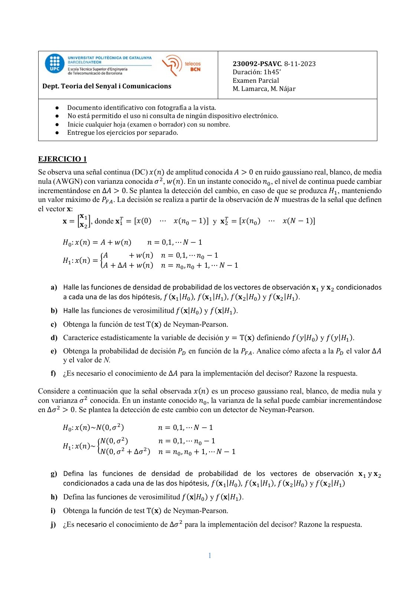
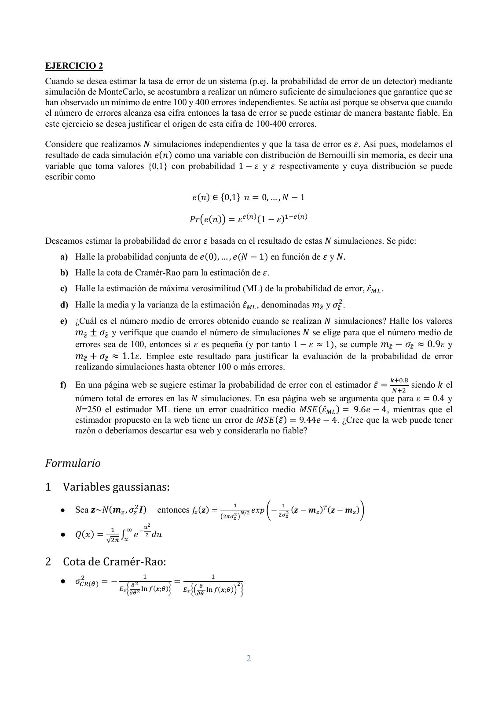
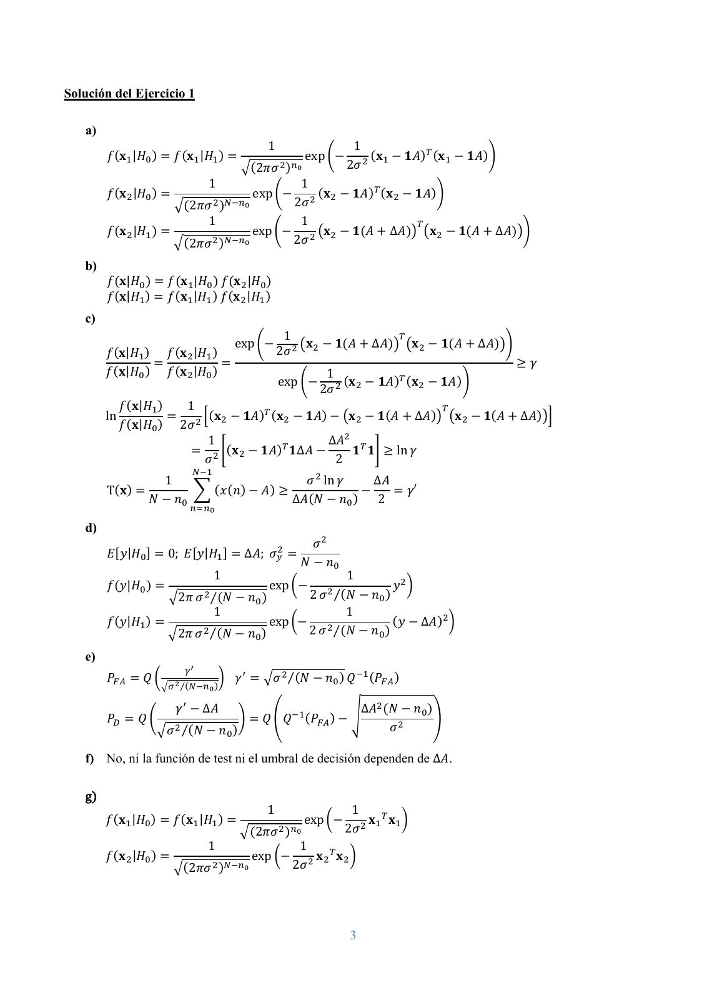
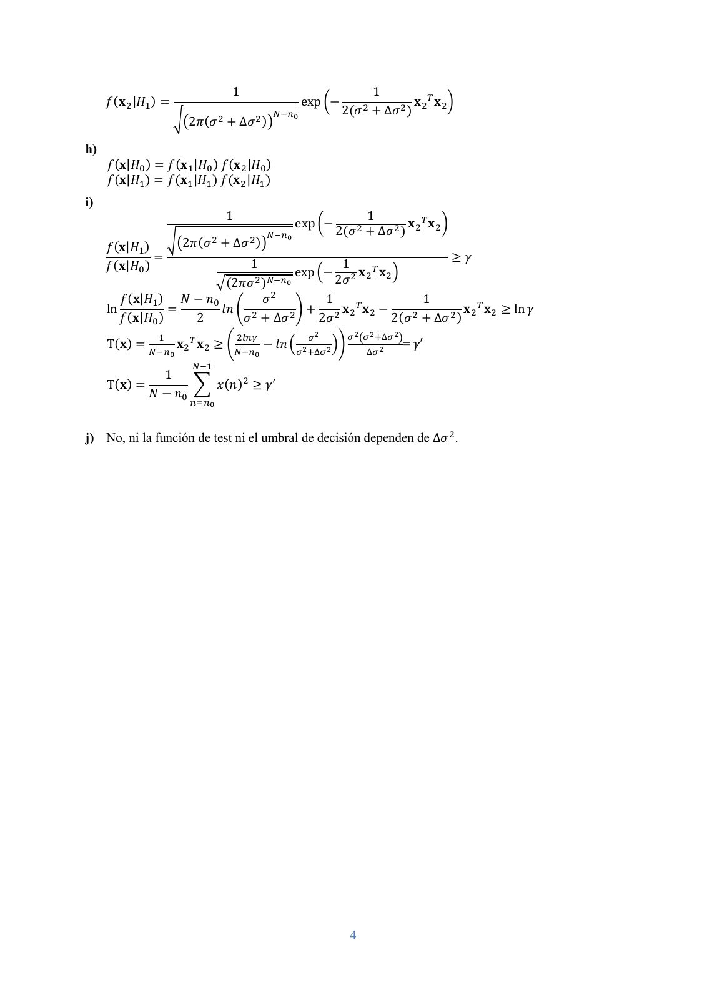
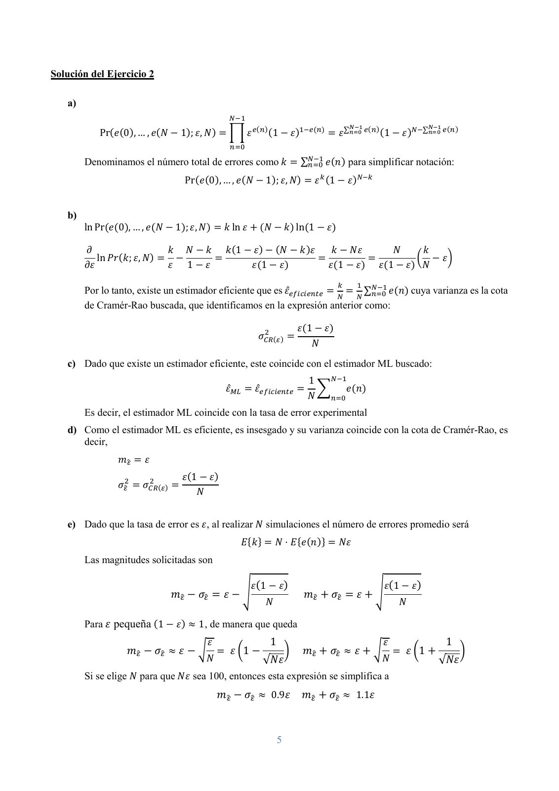

# PSAVC Parcial 2023 11 08 Solució

- Source PDF: `Examenes/PSAVC Parcial 2023 11 08 Solució.pdf`
- PDF title: `PSAVC Parcial 2023 11 08 Solució`
- Pages: 6
- Note: Transcribed from the embedded PDF text layer. Each page links to a rendered page image so figures, plots, handwriting, and formula layout can be checked against the original.
- Text-layer caveat: `�` marks a glyph that the PDF text layer does not map to Unicode; use the rendered page image for that formula or symbol.

## Page 1



```text
                                                                       230092-PSAVC. 8-11-2023
                                                                       Duración: 1h45’
                                                                       Examen Parcial
 Dept. Teoria del Senyal i Comunicacions                               M. Lamarca, M. Nájar

     ●    Documento identificativo con fotografía a la vista.
     ●    No está permitido el uso ni consulta de ningún dispositivo electrónico.
     ●    Inicie cualquier hoja (examen o borrador) con su nombre.
     ●    Entregue los ejercicios por separado.


EJERCICIO 1
Se observa una señal continua (DC) 𝑥𝑥(𝑛𝑛) de amplitud conocida 𝐴𝐴 > 0 en ruido gaussiano real, blanco, de media
nula (AWGN) con varianza conocida 𝜎𝜎 2 , 𝑤𝑤(𝑛𝑛). En un instante conocido 𝑛𝑛0 , el nivel de continua puede cambiar
incrementándose en ∆𝐴𝐴 > 0. Se plantea la detección del cambio, en caso de que se produzca 𝐻𝐻1 , manteniendo
un valor máximo de 𝑃𝑃𝐹𝐹𝐹𝐹 . La decisión se realiza a partir de la observación de 𝑁𝑁 muestras de la señal que definen
el vector 𝐱𝐱:
              𝐱𝐱1
        𝐱𝐱 = �𝐱𝐱 �, donde 𝐱𝐱1𝑇𝑇 = [𝑥𝑥(0) ⋯ 𝑥𝑥(𝑛𝑛0 − 1)] y 𝐱𝐱 2𝑇𝑇 = [𝑥𝑥(𝑛𝑛0 ) ⋯ 𝑥𝑥(𝑁𝑁 − 1)]
                2

         𝐻𝐻0 : 𝑥𝑥(𝑛𝑛) = 𝐴𝐴 + 𝑤𝑤(𝑛𝑛)     𝑛𝑛 = 0,1, ⋯ 𝑁𝑁 − 1
                         𝐴𝐴       + 𝑤𝑤(𝑛𝑛) 𝑛𝑛 = 0,1, ⋯ 𝑛𝑛0 − 1
         𝐻𝐻1 : 𝑥𝑥(𝑛𝑛) = �
                         𝐴𝐴 + ∆𝐴𝐴 + 𝑤𝑤(𝑛𝑛) 𝑛𝑛 = 𝑛𝑛0 , 𝑛𝑛0 + 1, ⋯ 𝑁𝑁 − 1

    a) Halle las funciones de densidad de probabilidad de los vectores de observación 𝐱𝐱1 y 𝐱𝐱 2 condicionados
       a cada una de las dos hipótesis, 𝑓𝑓(𝐱𝐱1 |𝐻𝐻0 ), 𝑓𝑓(𝐱𝐱1 |𝐻𝐻1 ), 𝑓𝑓(𝐱𝐱2 |𝐻𝐻0 ) y 𝑓𝑓(𝐱𝐱2 |𝐻𝐻1 ).
    b) Halle las funciones de verosimilitud 𝑓𝑓(𝐱𝐱|𝐻𝐻0 ) y 𝑓𝑓(𝐱𝐱|𝐻𝐻1 ).
    c) Obtenga la función de test T(𝐱𝐱) de Neyman-Pearson.
    d) Caracterice estadísticamente la variable de decisión 𝑦𝑦 = T(𝐱𝐱) definiendo 𝑓𝑓(𝑦𝑦|𝐻𝐻0 ) y 𝑓𝑓(𝑦𝑦|𝐻𝐻1 ).
    e) Obtenga la probabilidad de decisión 𝑃𝑃𝐷𝐷 en función de la 𝑃𝑃𝐹𝐹𝐹𝐹 . Analice cómo afecta a la 𝑃𝑃𝐷𝐷 el valor ∆𝐴𝐴
       y el valor de N.
    f) ¿Es necesario el conocimiento de ∆𝐴𝐴 para la implementación del decisor? Razone la respuesta.

Considere a continuación que la señal observada 𝑥𝑥(𝑛𝑛) es un proceso gaussiano real, blanco, de media nula y
con varianza 𝜎𝜎 2 conocida. En un instante conocido 𝑛𝑛0 , la varianza de la señal puede cambiar incrementándose
en ∆𝜎𝜎 2 > 0. Se plantea la detección de este cambio con un detector de Neyman-Pearson.

         𝐻𝐻0 : 𝑥𝑥(𝑛𝑛)~𝑁𝑁(0, 𝜎𝜎 2 )          𝑛𝑛 = 0,1, ⋯ 𝑁𝑁 − 1
                        𝑁𝑁(0, 𝜎𝜎 2 )         𝑛𝑛 = 0,1, ⋯ 𝑛𝑛0 − 1
         𝐻𝐻1 : 𝑥𝑥(𝑛𝑛)~ �
                        𝑁𝑁(0, 𝜎𝜎 2 + ∆𝜎𝜎 2 ) 𝑛𝑛 = 𝑛𝑛0 , 𝑛𝑛0 + 1, ⋯ 𝑁𝑁 − 1

    g) Defina las funciones de densidad de probabilidad de los vectores de observación 𝐱𝐱1 y 𝐱𝐱 2
       condicionados a cada una de las dos hipótesis, 𝑓𝑓(𝐱𝐱1 |𝐻𝐻0 ), 𝑓𝑓(𝐱𝐱1 |𝐻𝐻1 ), 𝑓𝑓(𝐱𝐱2 |𝐻𝐻0 ) y 𝑓𝑓(𝐱𝐱2 |𝐻𝐻1 )
    h) Defina las funciones de verosimilitud 𝑓𝑓(𝐱𝐱|𝐻𝐻0 ) y 𝑓𝑓(𝐱𝐱|𝐻𝐻1 ).
    i) Obtenga la función de test T(𝐱𝐱) de Neyman-Pearson.
    j) ¿Es necesario el conocimiento de ∆𝜎𝜎 2 para la implementación del decisor? Razone la respuesta.


                                                              1
```

## Page 2



```text
EJERCICIO 2
Cuando se desea estimar la tasa de error de un sistema (p.ej. la probabilidad de error de un detector) mediante
simulación de MonteCarlo, se acostumbra a realizar un número suficiente de simulaciones que garantice que se
han observado un mínimo de entre 100 y 400 errores independientes. Se actúa así porque se observa que cuando
el número de errores alcanza esa cifra entonces la tasa de error se puede estimar de manera bastante fiable. En
este ejercicio se desea justificar el origen de esta cifra de 100-400 errores.

Considere que realizamos 𝑁𝑁 simulaciones independientes y que la tasa de error es 𝜀𝜀. Así pues, modelamos el
resultado de cada simulación 𝑒𝑒(𝑛𝑛) como una variable con distribución de Bernouilli sin memoria, es decir una
variable que toma valores {0,1} con probabilidad 1 − 𝜀𝜀 y 𝜀𝜀 respectivamente y cuya distribución se puede
escribir como

                                                               𝑒𝑒(𝑛𝑛) ∈ {0,1} 𝑛𝑛 = 0, … , 𝑁𝑁 − 1

                                                              𝑃𝑃𝑃𝑃�𝑒𝑒(𝑛𝑛)� = 𝜀𝜀 𝑒𝑒(𝑛𝑛) (1 − 𝜀𝜀)1−𝑒𝑒(𝑛𝑛)

Deseamos estimar la probabilidad de error 𝜀𝜀 basada en el resultado de estas 𝑁𝑁 simulaciones. Se pide:
    a) Halle la probabilidad conjunta de 𝑒𝑒(0), … , 𝑒𝑒(𝑁𝑁 − 1) en función de 𝜀𝜀 y 𝑁𝑁.
    b) Halle la cota de Cramér-Rao para la estimación de 𝜀𝜀.
    c) Halle la estimación de máxima verosimilitud (ML) de la probabilidad de error, 𝜀𝜀̂𝑀𝑀𝑀𝑀 .
    d) Halle la media y la varianza de la estimación 𝜀𝜀̂𝑀𝑀𝑀𝑀 , denominadas 𝑚𝑚𝜀𝜀� y 𝜎𝜎𝜀𝜀�2 .
    e) ¿Cuál es el número medio de errores obtenido cuando se realizan 𝑁𝑁 simulaciones? Halle los valores
       𝑚𝑚𝜀𝜀� ± 𝜎𝜎𝜀𝜀� y verifique que cuando el número de simulaciones 𝑁𝑁 se elige para que el número medio de
       errores sea de 100, entonces si 𝜀𝜀 es pequeña (y por tanto 1 − 𝜀𝜀 ≈ 1), se cumple 𝑚𝑚𝜀𝜀� − 𝜎𝜎𝜀𝜀� ≈ 0.9𝜀𝜀 y
       𝑚𝑚𝜀𝜀� + 𝜎𝜎𝜀𝜀� ≈ 1.1𝜀𝜀. Emplee este resultado para justificar la evaluación de la probabilidad de error
       realizando simulaciones hasta obtener 100 o más errores.
                                                                                                                                                     𝑘𝑘+0.8
    f) En una página web se sugiere estimar la probabilidad de error con el estimador 𝜀𝜀̃ =        siendo 𝑘𝑘 el
                                                                                              𝑁𝑁+2
       número total de errores en las 𝑁𝑁 simulaciones. En esa página web se argumenta que para 𝜀𝜀 = 0.4 y
       𝑁𝑁=250 el estimador ML tiene un error cuadrático medio 𝑀𝑀𝑀𝑀𝑀𝑀(𝜀𝜀̂𝑀𝑀𝑀𝑀 ) = 9.6𝑒𝑒 − 4, mientras que el
       estimador propuesto en la web tiene un error de 𝑀𝑀𝑀𝑀𝑀𝑀(𝜀𝜀̃) = 9.44𝑒𝑒 − 4. ¿Cree que la web puede tener
       razón o deberíamos descartar esa web y considerarla no fiable?


Formulario

1 Variables gaussianas:
                                                                                     1                         1
    ●   Sea 𝒛𝒛~𝑁𝑁(𝒎𝒎𝑧𝑧 , 𝜎𝜎𝑧𝑧2 𝑰𝑰)             entonces 𝑓𝑓𝑧𝑧 (𝒛𝒛) =                       𝑁𝑁/2   𝑒𝑒𝑒𝑒𝑒𝑒 �−
                                                                                                             2𝜎𝜎𝑧𝑧2
                                                                                                                      (𝒛𝒛 − 𝒎𝒎𝑧𝑧 )𝑇𝑇 (𝒛𝒛 − 𝒎𝒎𝑧𝑧 )�
                                                                               �2𝜋𝜋𝜎𝜎𝑧𝑧2 �
                                           2
                    1     ∞ −𝑢𝑢
    ●   𝑄𝑄(𝑥𝑥) =        ∫𝑥𝑥
                            𝑒𝑒 2 𝑑𝑑𝑑𝑑
                   √2𝜋𝜋


2 Cota de Cramér-Rao:
           2                           1                                   1
    ●   𝜎𝜎𝐶𝐶𝐶𝐶(𝜃𝜃) =−             𝜕𝜕2
                                                       =              𝜕𝜕               2
                        𝐸𝐸𝑥𝑥 �         ln 𝑓𝑓(𝒙𝒙;𝜃𝜃)�       𝐸𝐸𝑥𝑥 ��        ln 𝑓𝑓(𝒙𝒙;𝜃𝜃)� �
                                 𝜕𝜕𝜃𝜃2                               𝜕𝜕𝜕𝜕


                                                                                            2
```

## Page 3



```text
Solución del Ejercicio 1

   a)
                                                    1                   1
        𝑓𝑓(𝐱𝐱1 |𝐻𝐻0 ) = 𝑓𝑓(𝐱𝐱1 |𝐻𝐻1 ) =                      exp �−         (𝐱𝐱 − 𝟏𝟏𝐴𝐴)𝑇𝑇 (𝐱𝐱1 − 𝟏𝟏𝐴𝐴)�
                                        �(2𝜋𝜋𝜎𝜎 2 )𝑛𝑛0                 2𝜎𝜎 2 1
                               1                      1
        𝑓𝑓(𝐱𝐱 2 |𝐻𝐻0 ) =                   exp �− 2 (𝐱𝐱2 − 𝟏𝟏𝐴𝐴)𝑇𝑇 (𝐱𝐱2 − 𝟏𝟏𝐴𝐴)�
                         �(2𝜋𝜋𝜎𝜎 2 )𝑁𝑁−𝑛𝑛0          2𝜎𝜎
                               1                      1                    𝑇𝑇
        𝑓𝑓(𝐱𝐱 2 |𝐻𝐻1 ) =                   exp �− 2 �𝐱𝐱2 − 𝟏𝟏(𝐴𝐴 + ∆𝐴𝐴)� �𝐱𝐱2 − 𝟏𝟏(𝐴𝐴 + ∆𝐴𝐴)��
                         �(2𝜋𝜋𝜎𝜎 2 )𝑁𝑁−𝑛𝑛0          2𝜎𝜎
   b)
        𝑓𝑓(𝐱𝐱|𝐻𝐻0 ) = 𝑓𝑓(𝐱𝐱1 |𝐻𝐻0 ) 𝑓𝑓(𝐱𝐱 2 |𝐻𝐻0 )
        𝑓𝑓(𝐱𝐱|𝐻𝐻1 ) = 𝑓𝑓(𝐱𝐱1 |𝐻𝐻1 ) 𝑓𝑓(𝐱𝐱2 |𝐻𝐻1 )
   c)
                                                         1                      𝑇𝑇
                                            exp �−           �𝐱𝐱 − 𝟏𝟏(𝐴𝐴 + ∆𝐴𝐴)� �𝐱𝐱2 − 𝟏𝟏(𝐴𝐴 + ∆𝐴𝐴)��
        𝑓𝑓(𝐱𝐱|𝐻𝐻1 ) 𝑓𝑓(𝐱𝐱2 |𝐻𝐻1 )                       2𝜎𝜎 2 2
                   =              =                                                                       ≥ 𝛾𝛾
        𝑓𝑓(𝐱𝐱|𝐻𝐻0 ) 𝑓𝑓(𝐱𝐱2 |𝐻𝐻0 )                              1
                                                        exp �− 2 (𝐱𝐱2 − 𝟏𝟏𝐴𝐴)𝑇𝑇 (𝐱𝐱2 − 𝟏𝟏𝐴𝐴)�
                                                              2𝜎𝜎
             𝑓𝑓(𝐱𝐱|𝐻𝐻1 )   1                                                     𝑇𝑇
        ln               = 2 �(𝐱𝐱2 − 𝟏𝟏𝐴𝐴)𝑇𝑇 (𝐱𝐱2 − 𝟏𝟏𝐴𝐴) − �𝐱𝐱 2 − 𝟏𝟏(𝐴𝐴 + ∆𝐴𝐴)� �𝐱𝐱2 − 𝟏𝟏(𝐴𝐴 + ∆𝐴𝐴)��
             𝑓𝑓(𝐱𝐱|𝐻𝐻0 ) 2𝜎𝜎
                              1                          ∆𝐴𝐴2 𝑇𝑇
                            = 2 �(𝐱𝐱2 − 𝟏𝟏𝐴𝐴)𝑇𝑇 𝟏𝟏∆𝐴𝐴 −       𝟏𝟏 𝟏𝟏� ≥ ln 𝛾𝛾
                             𝜎𝜎                            2
                               𝑁𝑁−1
                   1                          𝜎𝜎 2 ln 𝛾𝛾    ∆𝐴𝐴
        T(𝐱𝐱) =          � (𝑥𝑥(𝑛𝑛) − 𝐴𝐴) ≥                −     = 𝛾𝛾′
                𝑁𝑁 − 𝑛𝑛0                   ∆𝐴𝐴(𝑁𝑁 − 𝑛𝑛0 )    2
                              𝑛𝑛=𝑛𝑛0

   d)
                                                               𝜎𝜎 2
        𝐸𝐸[𝑦𝑦|𝐻𝐻0 ] = 0; 𝐸𝐸[𝑦𝑦|𝐻𝐻1 ] = ∆𝐴𝐴; 𝜎𝜎𝑦𝑦2 =
                                                            𝑁𝑁 − 𝑛𝑛0
                                      1                                1
        𝑓𝑓(𝑦𝑦|𝐻𝐻0 ) =                                exp �−                         𝑦𝑦 2 �
                        �2𝜋𝜋 𝜎𝜎 2 ⁄(𝑁𝑁 − 𝑛𝑛0 )                2 𝜎𝜎 2 ⁄(𝑁𝑁 − 𝑛𝑛0 )
                                      1                                1
        𝑓𝑓(𝑦𝑦|𝐻𝐻1 ) =                                exp �−                         (𝑦𝑦 − ∆𝐴𝐴)2 �
                        �2𝜋𝜋 𝜎𝜎 2 ⁄(𝑁𝑁 − 𝑛𝑛0 )                2 𝜎𝜎 2 ⁄(𝑁𝑁 − 𝑛𝑛0 )
   e)
                            𝛾𝛾 ′
        𝑃𝑃𝐹𝐹𝐹𝐹 = 𝑄𝑄 �                    � 𝛾𝛾 ′ = �𝜎𝜎 2 ⁄(𝑁𝑁 − 𝑛𝑛0 ) 𝑄𝑄 −1 (𝑃𝑃𝐹𝐹𝐹𝐹 )
                      �𝜎𝜎 2 ⁄(𝑁𝑁−𝑛𝑛0 )

                          𝛾𝛾 ′ − ∆𝐴𝐴                              ∆𝐴𝐴2 (𝑁𝑁 − 𝑛𝑛0 )
        𝑃𝑃𝐷𝐷 = 𝑄𝑄 �                     � = 𝑄𝑄 �𝑄𝑄−1 (𝑃𝑃𝐹𝐹𝐹𝐹 ) − �                �
                      �𝜎𝜎 2 ⁄(𝑁𝑁 − 𝑛𝑛0 )                                𝜎𝜎 2

   f) No, ni la función de test ni el umbral de decisión dependen de ∆𝐴𝐴.

   g)
                                                    1                   1
        𝑓𝑓(𝐱𝐱1 |𝐻𝐻0 ) = 𝑓𝑓(𝐱𝐱1 |𝐻𝐻1 ) =                      exp �−         𝐱𝐱 𝑇𝑇 𝐱𝐱 �
                                       �(2𝜋𝜋𝜎𝜎 2 )𝑛𝑛0                  2𝜎𝜎 2 1 1
                                   1                 1
        𝑓𝑓(𝐱𝐱2 |𝐻𝐻0 ) =                   exp �− 2 𝐱𝐱2 𝑇𝑇 𝐱𝐱2 �
                        �(2𝜋𝜋𝜎𝜎 2 )𝑁𝑁−𝑛𝑛0          2𝜎𝜎


                                                                        3
```

## Page 4



```text
                                      1                                      1                𝑇𝑇
     𝑓𝑓(𝐱𝐱2 |𝐻𝐻1 ) =                                       exp �−                   𝐱𝐱             𝐱𝐱2 �
                                                  𝑁𝑁−𝑛𝑛0            2(𝜎𝜎 2 + ∆𝜎𝜎 2 ) 2
                       ��2𝜋𝜋(𝜎𝜎 2 + ∆𝜎𝜎 2 )�

h)
     𝑓𝑓(𝐱𝐱|𝐻𝐻0 ) = 𝑓𝑓(𝐱𝐱1 |𝐻𝐻0 ) 𝑓𝑓(𝐱𝐱 2 |𝐻𝐻0 )
     𝑓𝑓(𝐱𝐱|𝐻𝐻1 ) = 𝑓𝑓(𝐱𝐱1 |𝐻𝐻1 ) 𝑓𝑓(𝐱𝐱2 |𝐻𝐻1 )
i)
                                    1                                    1
                                                       exp �−                     𝐱𝐱 𝑇𝑇 𝐱𝐱 �
                                               𝑁𝑁−𝑛𝑛              2(𝜎𝜎 2 + ∆𝜎𝜎 2 ) 2 2
     𝑓𝑓(𝐱𝐱|𝐻𝐻1 ) ��2𝜋𝜋(𝜎𝜎 + ∆𝜎𝜎 )�
                           2         2      0

                 =                                                           ≥ 𝛾𝛾
     𝑓𝑓(𝐱𝐱|𝐻𝐻0 )                     1                 1
                                              exp �− 2 𝐱𝐱2 𝑇𝑇 𝐱𝐱2 �
                            �(2𝜋𝜋𝜎𝜎 2 )𝑁𝑁−𝑛𝑛0         2𝜎𝜎
                                          2
        𝑓𝑓(𝐱𝐱|𝐻𝐻1 ) 𝑁𝑁 − 𝑛𝑛0           𝜎𝜎          1                    1
     ln             =        𝑙𝑙𝑙𝑙 � 2          � + 2 𝐱𝐱2 𝑇𝑇 𝐱𝐱2 −               𝐱𝐱 𝑇𝑇 𝐱𝐱 ≥ ln 𝛾𝛾
        𝑓𝑓(𝐱𝐱|𝐻𝐻0 )    2           𝜎𝜎 + ∆𝜎𝜎  2    2𝜎𝜎             2(𝜎𝜎 + ∆𝜎𝜎 2 ) 2 2
                                                                      2

                 1                    2𝑙𝑙𝑙𝑙𝑙𝑙             𝜎𝜎 2     𝜎𝜎 2 �𝜎𝜎 2 +∆𝜎𝜎 2 �
     T(𝐱𝐱) =          𝐱𝐱2 𝑇𝑇 𝐱𝐱2 ≥ �          − 𝑙𝑙𝑙𝑙 �𝜎𝜎2 +∆𝜎𝜎2 ��        ∆𝜎𝜎 2
                                                                                      = 𝛾𝛾′
               𝑁𝑁−𝑛𝑛0                𝑁𝑁−𝑛𝑛0
                           𝑁𝑁−1
                1
     T(𝐱𝐱) =          � 𝑥𝑥(𝑛𝑛)2 ≥ 𝛾𝛾′
             𝑁𝑁 − 𝑛𝑛0
                          𝑛𝑛=𝑛𝑛0


j) No, ni la función de test ni el umbral de decisión dependen de ∆𝜎𝜎 2 .


                                                                      4
```

## Page 5



```text
Solución del Ejercicio 2

   a)
                                                       𝑁𝑁−1
                                                                                                       𝑁𝑁−1                 𝑁𝑁−1
            Pr(𝑒𝑒(0), … , 𝑒𝑒(𝑁𝑁 − 1); 𝜀𝜀, 𝑁𝑁) = � 𝜀𝜀 𝑒𝑒(𝑛𝑛) (1 − 𝜀𝜀)1−𝑒𝑒(𝑛𝑛) = 𝜀𝜀 ∑𝑛𝑛=0 𝑒𝑒(𝑛𝑛) (1 − 𝜀𝜀)𝑁𝑁−∑𝑛𝑛=0 𝑒𝑒(𝑛𝑛)
                                                       𝑛𝑛=0

        Denominamos el número total de errores como 𝑘𝑘 = ∑𝑁𝑁−1
                                                          𝑛𝑛=0 𝑒𝑒(𝑛𝑛) para simplificar notación:

                                         Pr(𝑒𝑒(0), … , 𝑒𝑒(𝑁𝑁 − 1); 𝜀𝜀, 𝑁𝑁) = 𝜀𝜀 𝑘𝑘 (1 − 𝜀𝜀)𝑁𝑁−𝑘𝑘


   b)
        ln Pr(𝑒𝑒(0), … , 𝑒𝑒(𝑁𝑁 − 1); 𝜀𝜀, 𝑁𝑁) = 𝑘𝑘 ln 𝜀𝜀 + (𝑁𝑁 − 𝑘𝑘) ln(1 − 𝜀𝜀)

         𝜕𝜕                       𝑘𝑘 𝑁𝑁 − 𝑘𝑘 𝑘𝑘(1 − 𝜀𝜀) − (𝑁𝑁 − 𝑘𝑘)𝜀𝜀    𝑘𝑘 − 𝑁𝑁𝑁𝑁     𝑁𝑁     𝑘𝑘
             ln 𝑃𝑃𝑃𝑃(𝑘𝑘; 𝜀𝜀, 𝑁𝑁) = −        =                         =            =         � − 𝜀𝜀�
        𝜕𝜕𝜕𝜕                      𝜀𝜀 1 − 𝜀𝜀        𝜀𝜀(1 − 𝜀𝜀)           𝜀𝜀(1 − 𝜀𝜀) 𝜀𝜀(1 − 𝜀𝜀) 𝑁𝑁
                                                                                                  𝑘𝑘     1
        Por lo tanto, existe un estimador eficiente que es 𝜀𝜀̂𝑒𝑒𝑒𝑒𝑒𝑒𝑒𝑒𝑒𝑒𝑒𝑒𝑒𝑒𝑒𝑒𝑒𝑒 = = 𝑁𝑁 ∑𝑁𝑁−1
                                                                                         𝑛𝑛=0 𝑒𝑒(𝑛𝑛) cuya varianza es la cota
                                                                                  𝑁𝑁
        de Cramér-Rao buscada, que identificamos en la expresión anterior como:

                                                                      2             𝜀𝜀(1 − 𝜀𝜀)
                                                                   𝜎𝜎𝐶𝐶𝐶𝐶(𝜀𝜀) =
                                                                                        𝑁𝑁
   c) Dado que existe un estimador eficiente, este coincide con el estimador ML buscado:
                                                                                          1    𝑁𝑁−1
                                                      𝜀𝜀̂𝑀𝑀𝑀𝑀 = 𝜀𝜀̂𝑒𝑒𝑒𝑒𝑒𝑒𝑒𝑒𝑒𝑒𝑒𝑒𝑒𝑒𝑒𝑒𝑒𝑒 =      �      𝑒𝑒(𝑛𝑛)
                                                                                          𝑁𝑁   𝑛𝑛=0

        Es decir, el estimador ML coincide con la tasa de error experimental
   d) Como el estimador ML es eficiente, es insesgado y su varianza coincide con la cota de Cramér-Rao, es
      decir,
                 𝑚𝑚𝜀𝜀� = 𝜀𝜀
                             2           𝜀𝜀(1 − 𝜀𝜀)
                 𝜎𝜎𝜀𝜀�2 = 𝜎𝜎𝐶𝐶𝐶𝐶(𝜀𝜀) =
                                             𝑁𝑁


   e) Dado que la tasa de error es 𝜀𝜀, al realizar 𝑁𝑁 simulaciones el número de errores promedio será
                                                            𝐸𝐸{𝑘𝑘} = 𝑁𝑁 · 𝐸𝐸{𝑒𝑒(𝑛𝑛)} = 𝑁𝑁𝑁𝑁
        Las magnitudes solicitadas son

                                                                𝜀𝜀(1 − 𝜀𝜀)                                     𝜀𝜀(1 − 𝜀𝜀)
                                   𝑚𝑚𝜀𝜀� − 𝜎𝜎𝜀𝜀� = 𝜀𝜀 − �                             𝑚𝑚𝜀𝜀� + 𝜎𝜎𝜀𝜀� = 𝜀𝜀 + �
                                                                      𝑁𝑁                                           𝑁𝑁

        Para 𝜀𝜀 pequeña (1 − 𝜀𝜀) ≈ 1, de manera que queda
                                               𝜀𝜀                       1                                     𝜀𝜀                   1
                    𝑚𝑚𝜀𝜀� − 𝜎𝜎𝜀𝜀� ≈ 𝜀𝜀 − � = 𝜀𝜀 �1 −                            �     𝑚𝑚𝜀𝜀� + 𝜎𝜎𝜀𝜀� ≈ 𝜀𝜀 + � = 𝜀𝜀 �1 +                 �
                                               𝑁𝑁                    √𝑁𝑁𝑁𝑁                                    𝑁𝑁               √𝑁𝑁𝑁𝑁
        Si se elige 𝑁𝑁 para que 𝑁𝑁𝑁𝑁 sea 100, entonces esta expresión se simplifica a
                                                    𝑚𝑚𝜀𝜀� − 𝜎𝜎𝜀𝜀� ≈ 0.9𝜀𝜀            𝑚𝑚𝜀𝜀� + 𝜎𝜎𝜀𝜀� ≈ 1.1𝜀𝜀


                                                                            5
```

## Page 6


```text
   Es decir, el estimador ML, 𝜀𝜀̂𝑀𝑀𝑀𝑀 , es no sesgado y con elevada probabilidad entrega un error en la
   estimación inferior al 10% (lo cual es equivalente a decir que el dígito más significativo de 𝜀𝜀̂𝑀𝑀𝑀𝑀 es
   suficientemente fiable). Pese a que no se pide en el examen, si se hubiera elegido 𝑁𝑁 para que el
   número medio de errores fuera 𝑁𝑁𝑁𝑁=400, entonces resultaría que
                                          1                                           1
               𝑚𝑚𝜀𝜀� − 𝜎𝜎𝜀𝜀� ≈= 𝜀𝜀 �1 −       � = 0.95𝜀𝜀   𝑚𝑚𝜀𝜀� + 𝜎𝜎𝜀𝜀� ≈ 𝜀𝜀 �1 +           � = 1.05𝜀𝜀
                                   √𝑁𝑁𝑁𝑁                                             √𝑁𝑁𝑁𝑁
   siendo el resultado aún más fiable.
f) El estimador ML es el estimador no sesgado de mínima varianza, puesto que es eficiente, pero ello no
   descarta que pueda haber otros estimadores sesgados con un error cuadrático medio menor (resultado
                                                               2
   de aumentar el sesgo y reducir la varianza por debajo de 𝜎𝜎𝐶𝐶𝐶𝐶(𝜀𝜀) ).


                                                   6
```
