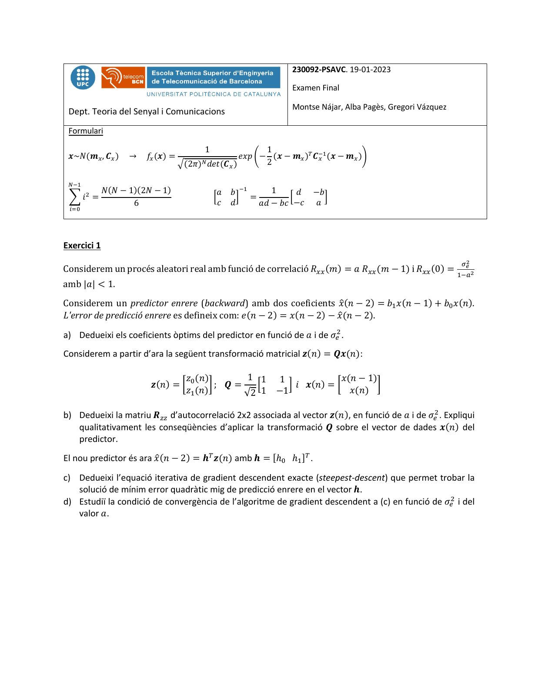
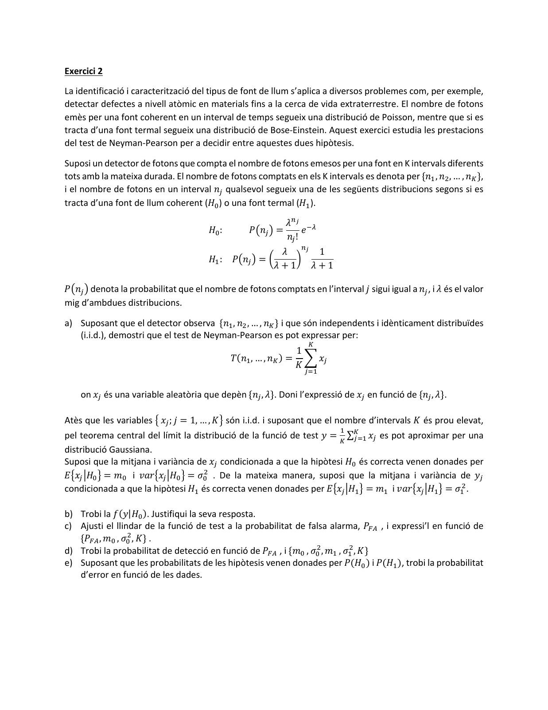
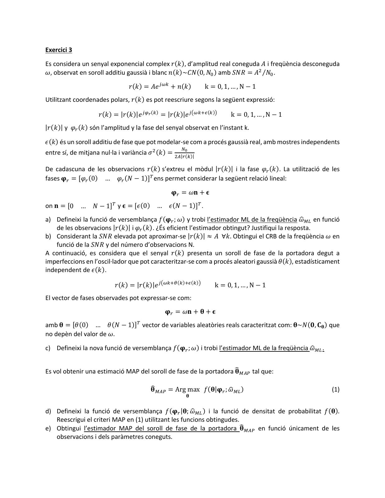
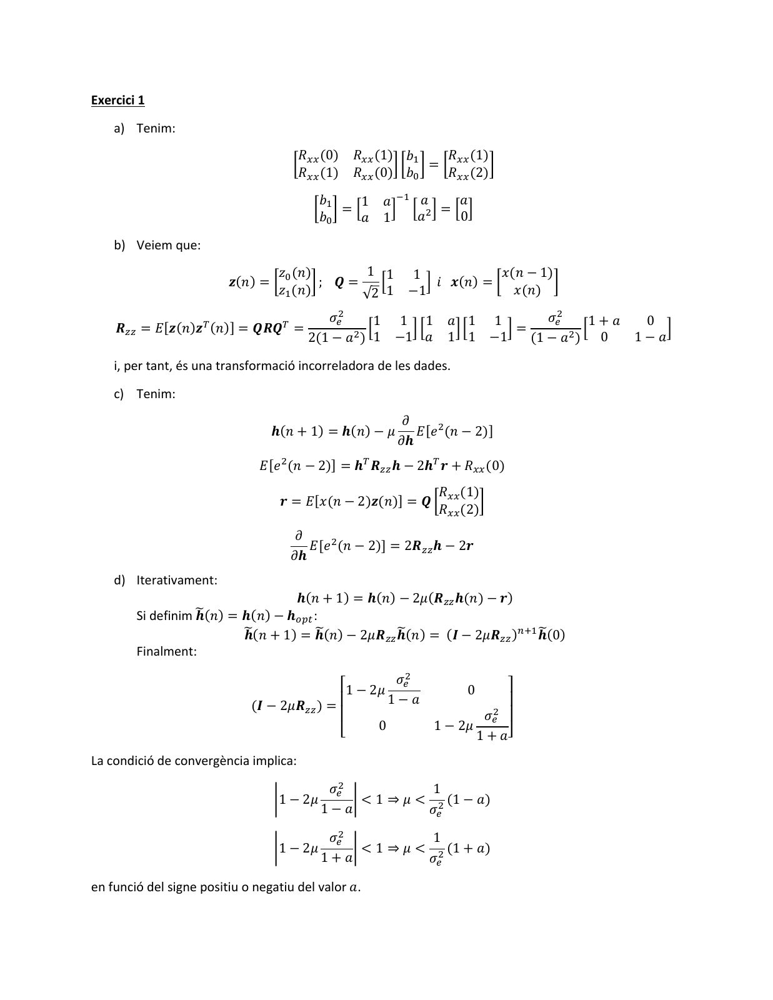
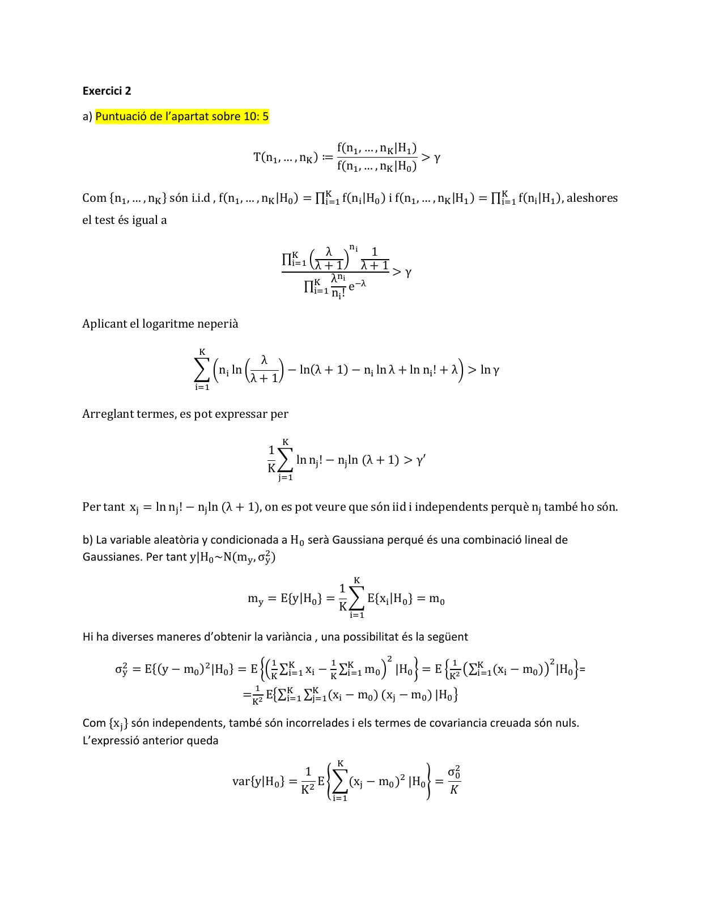
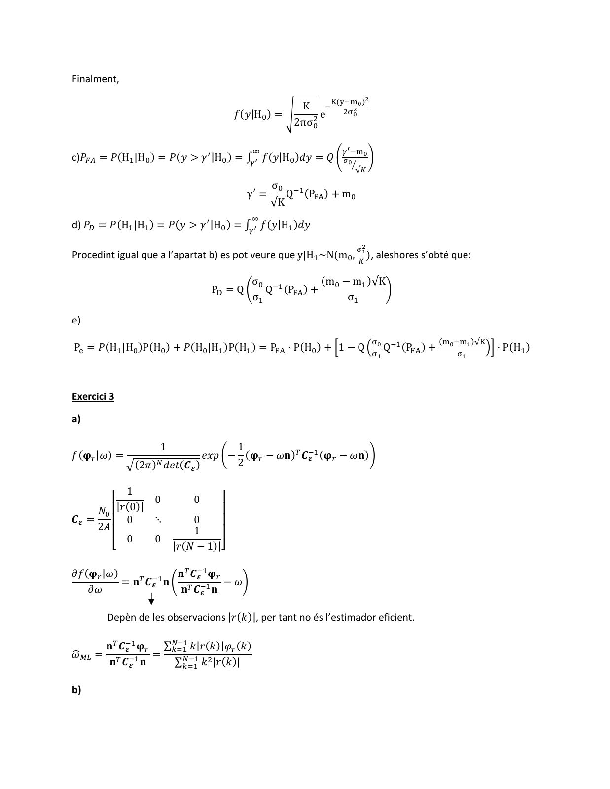
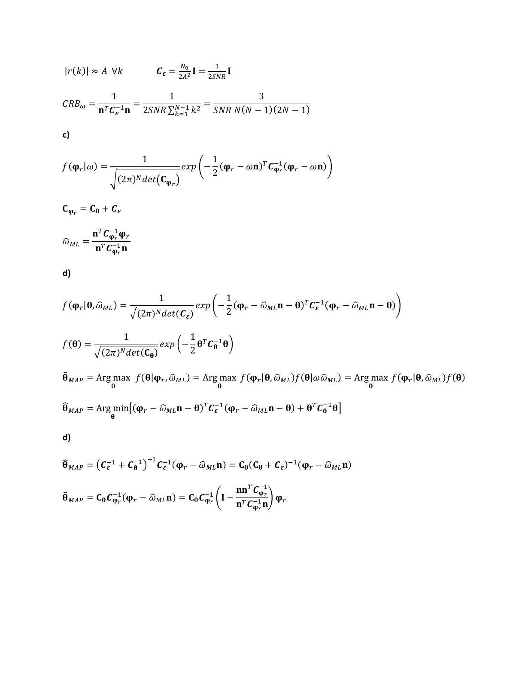

# Solució Examen Gener 2023

- Source PDF: `Examenes/Solució Examen Gener 2023.pdf`
- PDF title: `Solució Examen Gener 2023`
- Pages: 7
- Note: Transcribed from the embedded PDF text layer. Each page links to a rendered page image so figures, plots, handwriting, and formula layout can be checked against the original.

## Page 1



```text
                                                                230092-PSAVC. 19-01-2023

                                                                Examen Final

                                                                Montse Nájar, Alba Pagès, Gregori Vázquez
 Dept. Teoria del Senyal i Comunicacions

 Formulari

                                        1                 1
 𝒙~𝑁(𝒎! , 𝑪! )     →   𝑓! (𝒙) =                     𝑒𝑥𝑝 6− (𝒙 − 𝒎! )# 𝑪$%
                                                                       ! (𝒙 − 𝒎! )8
                                  .(2𝜋)" 𝑑𝑒𝑡(𝑪! )         2

 "$%
             𝑁(𝑁 − 1)(2𝑁 − 1)                𝑎    𝑏 $%     1     𝑑   −𝑏
 9 𝑖& =                                     <       @ =        <        @
                    6                         𝑐   𝑑     𝑎𝑑 − 𝑏𝑐 −𝑐   𝑎
 '()


Exercici 1
                                                                                                            ""
Considerem un procés aleatori real amb funció de correlació 𝑅!! (𝑚) = 𝑎 𝑅!! (𝑚 − 1) i 𝑅!! (0) = #$%
                                                                                                  !
                                                                                                    "

amb |𝑎| < 1.
Considerem un predictor enrere (backward) amb dos coeficients 𝑥.(𝑛 − 2) = 𝑏# 𝑥(𝑛 − 1) + 𝑏& 𝑥(𝑛).
L'error de predicció enrere es defineix com: 𝑒(𝑛 − 2) = 𝑥(𝑛 − 2) − 𝑥.(𝑛 − 2).

a) Dedueixi els coeficients òptims del predictor en funció de 𝑎 i de 𝜎'( .
Considerem a partir d’ara la següent transformació matricial 𝒛(𝑛) = 𝑸𝒙(𝑛):

                                𝑧 (𝑛)       1 1 1              𝑥(𝑛 − 1)
                        𝒛(𝑛) = 8 & : ; 𝑸 =    =    > 𝑖 𝒙(𝑛) = 8        :
                                𝑧# (𝑛)     √2 1 −1               𝑥(𝑛)

b) Dedueixi la matriu 𝑹)) d’autocorrelació 2x2 associada al vector 𝒛(𝑛), en funció de 𝑎 i de 𝜎'( . Expliqui
   qualitativament les conseqüències d’aplicar la transformació 𝑸 sobre el vector de dades 𝒙(𝑛) del
   predictor.
El nou predictor és ara 𝑥.(𝑛 − 2) = 𝒉* 𝒛(𝑛) amb 𝒉 = [ℎ& ℎ# ]* .

c) Dedueixi l’equació iterativa de gradient descendent exacte (steepest-descent) que permet trobar la
   solució de mínim error quadràtic mig de predicció enrere en el vector 𝒉.
d) Estudiï la condició de convergència de l’algoritme de gradient descendent a (c) en funció de 𝜎'( i del
   valor 𝑎.
```

## Page 2



```text
Exercici 2

La identificació i caracterització del tipus de font de llum s’aplica a diversos problemes com, per exemple,
detectar defectes a nivell atòmic en materials fins a la cerca de vida extraterrestre. El nombre de fotons
emès per una font coherent en un interval de temps segueix una distribució de Poisson, mentre que si es
tracta d’una font termal segueix una distribució de Bose-Einstein. Aquest exercici estudia les prestacions
del test de Neyman-Pearson per a decidir entre aquestes dues hipòtesis.

Suposi un detector de fotons que compta el nombre de fotons emesos per una font en K intervals diferents
tots amb la mateixa durada. El nombre de fotons comptats en els K intervals es denota per {𝑛# , 𝑛( , … , 𝑛+ },
i el nombre de fotons en un interval 𝑛, qualsevol segueix una de les següents distribucions segons si es
tracta d’una font de llum coherent (𝐻& ) o una font termal (𝐻# ).
                                                        𝜆-# $.
                                      𝐻& :    𝑃L𝑛, M =       𝑒
                                                        𝑛, !
                                                       𝜆 -# 1
                                      𝐻# : 𝑃L𝑛, M = P      Q
                                                      𝜆+1 𝜆+1

𝑃L𝑛, M denota la probabilitat que el nombre de fotons comptats en l’interval 𝑗 sigui igual a 𝑛, , i 𝜆 és el valor
mig d’ambdues distribucions.

a) Suposant que el detector observa {𝑛# , 𝑛( , … , 𝑛+ } i que són independents i idènticament distribuïdes
   (i.i.d.), demostri que el test de Neyman-Pearson es pot expressar per:
                                                                 +
                                                             1
                                            𝑇(𝑛# , … , 𝑛+ ) = U 𝑥,
                                                             𝐾
                                                                ,/#


    on 𝑥, és una variable aleatòria que depèn {𝑛, , 𝜆}. Doni l’expressió de 𝑥, en funció de {𝑛, , 𝜆}.

Atès que les variables V 𝑥, ; 𝑗 = 1, … , 𝐾W són i.i.d. i suposant que el nombre d’intervals 𝐾 és prou elevat,
                                                                          #
pel teorema central del límit la distribució de la funció de test 𝑦 = ∑+        𝑥 es pot aproximar per una
                                                                          + ,/# ,
distribució Gaussiana.
Suposi que la mitjana i variància de 𝑥, condicionada a que la hipòtesi 𝐻& és correcta venen donades per
𝐸V𝑥, [𝐻& W = 𝑚& i 𝑣𝑎𝑟V𝑥, [𝐻& W = 𝜎&( . De la mateixa manera, suposi que la mitjana i variància de 𝑦,
condicionada a que la hipòtesi 𝐻# és correcta venen donades per 𝐸V𝑥, [𝐻# W = 𝑚# i 𝑣𝑎𝑟V𝑥, [𝐻# W = 𝜎#( .

b) Trobi la 𝑓(𝑦|𝐻& ). Justifiqui la seva resposta.
c) Ajusti el llindar de la funció de test a la probabilitat de falsa alarma, 𝑃12 , i expressi’l en funció de
   {𝑃12 , 𝑚& , 𝜎&( , 𝐾} .
d) Trobi la probabilitat de detecció en funció de 𝑃12 , i {𝑚& , 𝜎&( , 𝑚# , 𝜎#( , 𝐾}
e) Suposant que les probabilitats de les hipòtesis venen donades per 𝑃(𝐻& ) i 𝑃(𝐻# ), trobi la probabilitat
   d’error en funció de les dades.
```

## Page 3



```text
Exercici 3

Es considera un senyal exponencial complex 𝑟(𝑘), d’amplitud real coneguda 𝐴 i freqüència desconeguda
𝜔, observat en soroll additiu gaussià i blanc 𝑛(𝑘)~𝐶𝑁(0, 𝑁& ) amb 𝑆𝑁𝑅 = 𝐴( ⁄𝑁& .

                               𝑟(𝑘) = 𝐴𝑒 ,34 + 𝑛(𝑘)        k = 0, 1, … , N − 1
Utilitzant coordenades polars, 𝑟(𝑘) es pot reescriure segons la següent expressió:

                   𝑟(𝑘) = |𝑟(𝑘)|𝑒 ,5$(4) = |𝑟(𝑘)|𝑒 ,8349:(4);        k = 0, 1, … , N − 1
|𝑟(𝑘)| y 𝜑< (𝑘) són l’amplitud y la fase del senyal observat en l’instant k.

𝜖(𝑘) és un soroll additiu de fase que pot modelar-se com a procés gaussià real, amb mostres independents
                                                  =%
entre sí, de mitjana nul·la i variància 𝜎 ( (𝑘) =
                                                (2|<(4)|

De cadascuna de les observacions 𝑟(𝑘) s’extreu el mòdul |𝑟(𝑘)| i la fase 𝜑< (𝑘). La utilització de les
fases 𝛗< = [𝜑< (0) … 𝜑< (𝑁 − 1)]* ens permet considerar la següent relació lineal:

                                              𝛗< = 𝜔𝐧 + 𝛜
on 𝐧 = [0 … 𝑁 − 1]* y 𝛜 = [𝜖(0) … 𝜖(𝑁 − 1)]* .
a) Defineixi la funció de versemblança 𝑓(𝛗< ; 𝜔) y trobi l’estimador ML de la freqüència 𝜔     n?@ en funció
    de les observacions |𝑟(𝑘)| i 𝜑< (𝑘). ¿És eficient l’estimador obtingut? Justifiqui la resposta.
b) Considerant la 𝑆𝑁𝑅 elevada pot aproximar-se |𝑟(𝑘)| ≈ 𝐴 ∀𝑘. Obtingui el CRB de la freqüència 𝜔 en
    funció de la 𝑆𝑁𝑅 y del número d’observacions N.
A continuació, es considera que el senyal 𝑟(𝑘) presenta un soroll de fase de la portadora degut a
imperfeccions en l’oscil·lador que pot caracteritzar-se com a procés aleatori gaussià 𝜃(𝑘), estadísticament
independent de 𝜖(𝑘).

                         𝑟(𝑘) = |𝑟(𝑘)|𝑒 ,8349A(4)9:(4);        k = 0, 1, … , N − 1
El vector de fases observades pot expressar-se com:
                                            𝛗< = 𝜔𝐧 + 𝛉 + 𝛜
amb 𝛉 = [𝜃(0) … 𝜃(𝑁 − 1)]* vector de variables aleatòries reals caracteritzat com: 𝛉~𝑁(𝟎, 𝐂𝛉 ) que
no depèn del valor de 𝜔.

c) Defineixi la nova funció de versemblança 𝑓(𝛗< ; 𝜔) i trobi l’estimador ML de la freqüència 𝜔
                                                                                              n?@ .


                                                                    v?2C tal que:
Es vol obtenir una estimació MAP del soroll de fase de la portadora 𝛉

                                       v?2C = Arg max 𝑓(𝛉|𝛗< ; 𝜔
                                       𝛉                       n?@ )                                     (1)
                                                    𝛉


d) Defineixi la funció de versemblança 𝑓(𝛗< |𝛉; 𝜔     n?@ ) i la funció de densitat de probabilitat 𝑓(𝛉).
   Reescrigui el criteri MAP en (1) utilitzant les funcions obtingudes.
e) Obtingui l’estimador MAP del soroll de fase de la portadora 𝛉        v?2C en funció únicament de les
   observacions i dels paràmetres coneguts.
```

## Page 4



```text
Exercici 1

    a) Tenim:
                                      𝑅 (0) 𝑅!! (1) 𝑏#        𝑅 (1)
                                     8 !!            : 8 : = 8 !! :
                                      𝑅!! (1) 𝑅!! (0) 𝑏&      𝑅!! (2)
                                          𝑏       1   𝑎 $# 𝑎      𝑎
                                         8 #: = =       > = (> = = >
                                          𝑏&      𝑎   1    𝑎      0

    b) Veiem que:
                                 𝑧 (𝑛)      1 1 1               𝑥(𝑛 − 1)
                         𝒛(𝑛) = 8 & : ; 𝑸 =   =    > 𝑖 𝒙(𝑛) = 8          :
                                 𝑧# (𝑛)     √2 1 −1               𝑥(𝑛)
                                           𝜎'(     1 1 1        𝑎 1 1        𝜎'(    1+𝑎    0
    𝑹)) = 𝐸[𝒛(𝑛)𝒛* (𝑛)] = 𝑸𝑹𝑸* =                  =    >=        >=    >=          =          >
                                        2(1 − 𝑎( ) 1 −1 𝑎       1 1 −1    (1 − 𝑎( ) 0     1−𝑎

    i, per tant, és una transformació incorreladora de les dades.

    c) Tenim:
                                                         𝜕
                                 𝒉(𝑛 + 1) = 𝒉(𝑛) − 𝜇       𝐸[𝑒 ( (𝑛 − 2)]
                                                        𝜕𝒉
                               𝐸[𝑒 ( (𝑛 − 2)] = 𝒉* 𝑹)) 𝒉 − 2𝒉* 𝒓 + 𝑅!! (0)
                                                           𝑅 (1)
                                  𝒓 = 𝐸[𝑥(𝑛 − 2)𝒛(𝑛)] = 𝑸 8 !! :
                                                           𝑅!! (2)
                                     𝜕
                                       𝐸[𝑒 ( (𝑛 − 2)] = 2𝑹)) 𝒉 − 2𝒓
                                    𝜕𝒉
    d) Iterativament:
                                  𝒉(𝑛 + 1) = 𝒉(𝑛) − 2𝜇(𝑹)) 𝒉(𝑛) − 𝒓)
        Si definim €
                   𝒉(𝑛) = 𝒉(𝑛) − 𝒉DEF :
                          €(𝑛 + 1) = 𝒉
                          𝒉            €(𝑛) − 2𝜇𝑹)) €                      €(0)
                                                    𝒉(𝑛) = (𝑰 − 2𝜇𝑹)) )-9# 𝒉
        Finalment:

                                                     𝜎(
                                            ⎡1 − 2𝜇 '               0     ⎤
                             (𝑰 − 2𝜇𝑹)) ) = ⎢       1−𝑎                   ⎥
                                            ⎢                         𝜎'( ⎥
                                            ⎣     0           1 − 2𝜇
                                                                     1 + 𝑎⎦
La condició de convergència implica:

                                            𝜎'(             1
                                 ˆ1 − 2𝜇        ˆ < 1 ⇒ 𝜇 < ( (1 − 𝑎)
                                           1−𝑎             𝜎'

                                            𝜎'(             1
                                 ˆ1 − 2𝜇        ˆ < 1 ⇒ 𝜇 < ( (1 + 𝑎)
                                           1+𝑎             𝜎'

en funció del signe positiu o negatiu del valor 𝑎.
```

## Page 5



```text
Exercici 2

a) Puntuació de l’apartat sobre 10: 5

                                                           f(n# , … , nG |H# )
                                     T(n# , … , nG ) ≔                         >γ
                                                           f(n# , … , nG |H& )

Com {n# , … , nG } són i.i.d , f(n# , … , nG |H& ) = ∏G                                       G
                                                      H/# f(nH |H& ) i f(n# , … , nG |H# ) = ∏H/# f(nH |H# ), aleshores

el test és igual a

                                                      λ I& 1
                                              ∏G  ž
                                               H/# λ + 1     λ+1>γ
                                                       λI&
                                                 ∏GH/# n ! e
                                                            $J
                                                         H


Aplicant el logaritme neperià

                         G
                                      λ
                        U PnH ln P      Q − ln(λ + 1) − nH ln λ + ln nH ! + λQ > ln γ
                                     λ+1
                        H/#


Arreglant termes, es pot expressar per

                                              G
                                          1
                                            U ln nK ! − nK ln (λ + 1) > γ′
                                          K
                                              K/#


Per tant xK = ln nK ! − nK ln (λ + 1), on es pot veure que són iid i independents perquè nK també ho són.

b) La variable aleatòria y condicionada a H& serà Gaussiana perqué és una combinació lineal de
Gaussianes. Per tant y|H& ~N(mL , σ(L )
                                                               G
                                                   1
                                    mL = E{y|H& } = U E{xH |H& } = m&
                                                   K
                                                               H/#

Hi ha diverses maneres d’obtenir la variància , una possibilitat és la següent
                                          #            #             (              #                  (
       σ(L = E{(y − m& )( |H& } = E ®žG ∑G           G
                                         H/# xH − G ∑H/# m&              |H& ¯ = E °G" L∑G
                                                                                         H/#(xH − m& )M |H& ±=
                                      #
                                   =G" EV∑G    G
                                          H/# ∑K/#(xH − m& ) (xK − m& ) |H& W

Com {xK } són independents, també són incorrelades i els termes de covariancia creuada són nuls.
L’expressió anterior queda
                                                           G
                                              1                         σ(&
                                 var{y|H& } = ( E ²U(xK − m& )( |H& ³ =
                                             K                          𝐾
                                                       H/#
```

## Page 6



```text
Finalment,
                                                                         "
                                                 K $G(L$M
                                                        (N"%
                                                             %)
                                    𝑓(𝑦|H& ) = ´      e
                                                2πσ(&

                                         P                     Q ' $M%
c)𝑃12 = 𝑃(H# |H& ) = 𝑃(𝑦 > 𝛾 O |H& ) = ∫Q' 𝑓(𝑦|H& )𝑑𝑦 = 𝑄 º "%            »
                                                                 S
                                                                  √+

                                              σ&
                                       γO =        Q$# (PTU ) + m&
                                              √K
                                        P
d) 𝑃V = 𝑃(H# |H# ) = 𝑃(𝑦 > 𝛾 O |H& ) = ∫Q' 𝑓(𝑦|H# )𝑑𝑦

                                                                     N"
Procedint igual que a l’apartat b) es pot veure que y|H# ~N(m& , ( ), aleshores s’obté que:
                                                                     +

                                        σ&            (m& − m# )√K
                                PW = Q º Q$# (PTU ) +              »
                                        σ#                 σ#

e)
                                                                             N       (M% $M( )√G
PX = 𝑃(H# |H& )P(H& ) + 𝑃(H& |H# )P(H# ) = PTU · P(H& ) + =1 − Q žN% Q$# (PTU ) +        N(
                                                                                                   > · P(H# )
                                                                                 (


Exercici 3

a)

                    1                1
𝑓(𝛗< |𝜔) =                     𝑒𝑥𝑝 º− (𝛗< − 𝜔𝐧)* 𝑪$#
                                                  𝜺 (𝛗< − 𝜔𝐧)»
             ¾(2𝜋)= 𝑑𝑒𝑡(𝑪𝜺 )         2

           1
        ⎡       0     0     ⎤
     𝑁& ⎢|𝑟(0)|             ⎥
𝑪𝜺 =    ⎢  0    ⋱     0     ⎥
     2𝐴               1
        ⎢ 0     0           ⎥
        ⎣         |𝑟(𝑁 − 1)|⎦

𝜕𝑓(𝛗< |𝜔)              𝐧* 𝑪$#
                           𝜺 𝛗<
          = 𝐧* 𝑪$#
                𝜺  𝐧 º          − 𝜔»
   𝜕𝜔                  𝐧* 𝑪$#
                            𝜺 𝐧


        Depèn de les observacions |𝑟(𝑘)|, per tant no és l’estimador eficient.

     𝐧* 𝑪$#
         𝜺 𝛗< ∑=$#
               4/# 𝑘|𝑟(𝑘)|𝜑< (𝑘)
𝜔
n?@ = * $# =
     𝐧 𝑪𝜺 𝐧     ∑=$#
                 4/# 𝑘 |𝑟(𝑘)|
                       (


b)
```

## Page 7



```text
                                   =      #
|𝑟(𝑘)| ≈ 𝐴 ∀𝑘              𝑪𝜺 = (2%" 𝐈 = (Z=[ 𝐈

             1                 1                       3
𝐶𝑅𝐵3 =            =               =
          𝐧* 𝑪$#
              𝜺 𝐧   2𝑆𝑁𝑅 ∑=$#
                          4/# 𝑘
                                (   𝑆𝑁𝑅 𝑁 (𝑁 − 1)(2𝑁 − 1)

c)

                       1                 1
𝑓(𝛗< |𝜔) =                         𝑒𝑥𝑝 º− (𝛗< − 𝜔𝐧)* 𝑪$#
                                                      𝛗$ (𝛗< − 𝜔𝐧)»
                                         2
             Ç(2𝜋)= 𝑑𝑒𝑡L𝐂𝛗$ M


𝐂𝛗$ = 𝐂𝛉 + 𝑪𝜺

         𝐧* 𝑪$#
             𝛗$ 𝛗<
𝜔
n?@ =
         𝐧 𝑪$#
           *
              𝛗$ 𝐧


d)

                           1              1
𝑓(𝛗< |𝛉, 𝜔
         n?@ ) =                                 n?@ 𝐧 − 𝛉)* 𝑪$#
                                    𝑒𝑥𝑝 º− (𝛗< − 𝜔            𝜺 (𝛗< − 𝜔
                                                                      n?@ 𝐧 − 𝛉)»
                     ¾(2𝜋) 𝑑𝑒𝑡(𝑪𝜺 )
                          =               2

                 1             1
𝑓(𝛉) =                   𝑒𝑥𝑝 P− 𝛉* 𝑪$#
                                    𝛉 𝛉Q
         ¾(2𝜋)= 𝑑𝑒𝑡(𝐂𝛉 )       2

v?2C = Arg max 𝑓(𝛉|𝛗< , 𝜔
𝛉                       n?@ ) = Arg max 𝑓(𝛗< |𝛉, 𝜔
                                                 n?@ )𝑓(𝛉|𝜔𝜔
                                                           n?@ ) = Arg max 𝑓(𝛗< |𝛉, 𝜔
                                                                                    n?@ )𝑓(𝛉)
             𝛉                             𝛉                             𝛉

v?2C = Arg minÈ(𝛗< − 𝜔
𝛉                    n?@ 𝐧 − 𝛉)* 𝑪$#      n?@ 𝐧 − 𝛉) + 𝛉* 𝑪$#
                                  𝜺 (𝛗< − 𝜔                𝛉 𝛉É
             𝛉


d)

v?2C = L𝑪$#   $# $# $#
𝛉                          n?@ 𝐧) = 𝐂𝛉 (𝐂𝛉 + 𝑪𝜺 )$# (𝛗< − 𝜔
         𝜺 + 𝑪𝛉 M 𝑪𝜺 (𝛗< − 𝜔                              n?@ 𝐧)

                                                  𝐧𝐧* 𝑪$#
                                                       𝛗$
v?2C = 𝐂𝛉 𝑪$#
𝛉                   n?@ 𝐧) = 𝐂𝛉 𝑪$#
           𝛗$ (𝛗< − 𝜔            𝛗$ º𝐈 −                  » 𝛗<
                                                  𝐧* 𝑪$#
                                                      𝛗$ 𝐧
```
