# PSAVC_Ejercicios_Tema 2_T23

- Source PDF: `PSAVC_Ejercicios_Tema 2_T23.pdf`
- PDF title: `Exercicis Tema 2 PSAVC QT2023`
- Pages: 36
- Note: Transcribed from the embedded PDF text layer. Each page links to a rendered page image so figures, plots, handwriting, and formula layout can be checked against the original.

## Page 1

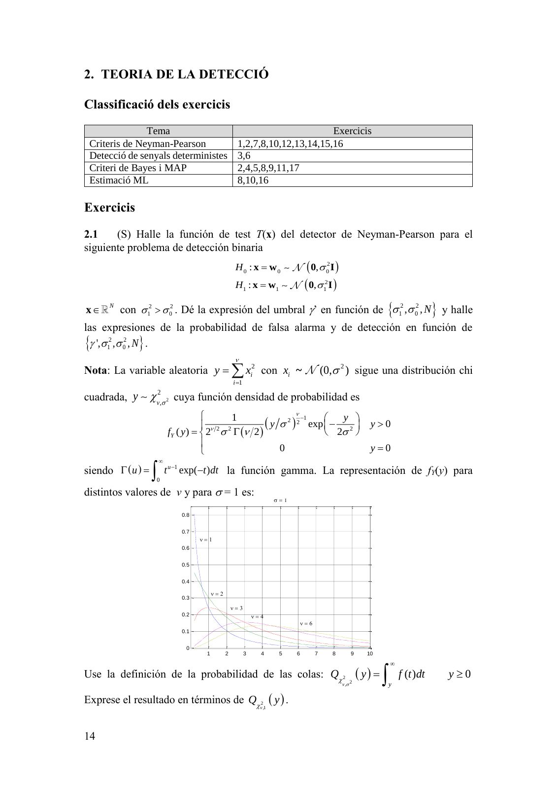

```text
2. TEORIA DE LA DETECCIÓ

Classificació dels exercicis
               Tema                                                                               Exercicis
 Criteris de Neyman-Pearson                                                1,2,7,8,10,12,13,14,15,16
 Detecció de senyals deterministes                                         3,6
 Criteri de Bayes i MAP                                                    2,4,5,8,9,11,17
 Estimació ML                                                              8,10,16

Exercicis
2.1    (S) Halle la función de test T(x) del detector de Neyman-Pearson para el
siguiente problema de detección binaria
                                                                           H0 : x = w0                   ( 0, 02I )
                                                                           H 1 : x = w1                 ( 0, 12I )
x    N
          con  12   02 . Dé la expresión del umbral ’ en función de  12 , 02 , N  y halle
las expresiones de la probabilidad de falsa alarma y de detección en función de
 ',12 , 02 , N .
                                                                           
Nota: La variable aleatoria y =  xi2 con xi ~                                                                 (0, 2 ) sigue una distribución chi
                                                                          i =1

cuadrada, y           2
                       v , 2
                                 cuya función densidad de probabilidad es
                                                              
                                                                         y 
                                        2 2
                                              1
                                                      ( y   )
                                                            2 2 −1
                                                                   exp  − 2                                                       y0
                            fY ( y ) =  2   ( 2 )                   2 
                                                                                                                                   y=0
                                                         0
                        
siendo  ( u ) =    t exp(−t )dt la función gamma. La representación de f (y) para
                            u −1
                                                                                                                                                     Y
                       0

distintos valores de v y para  = 1 es:
                                                                                              =

                                                     0.8


                                                     0.7
                                                           =
                                                     0.6


                                f(x) - chi-squared
                                                     0.5


                                                     0.4

                                                                =
                                                     0.3
                                                                          =
                                                     0.2                             =
                                                                                                    =
                                                     0.1


                                                      0
                                                            1         2          3     4       5    6      7     8          9      10
                                                                                               x
                                                                                                                                        
Use la definición de la probabilidad de las colas: Q 2                                                                         ( y ) =  f (t )dt       y0
                                                                                                                       v , 2           y

Exprese el resultado en términos de Q 2 ( y ) .
                                                                                       v ,1


14
```

## Page 2

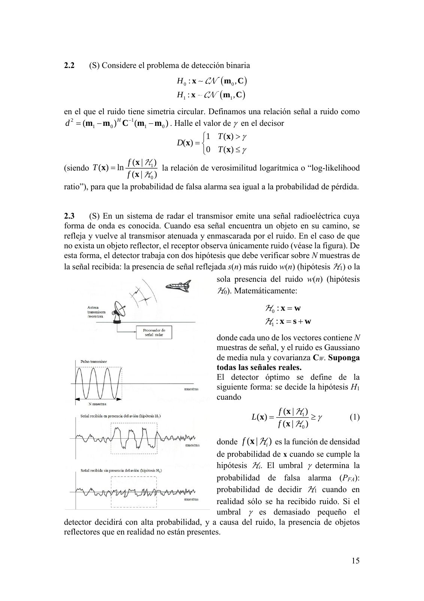

```text
2.2    (S) Considere el problema de detección binaria
                                  H0 : x       (m0 , C)
                                  H1 : x       ( m1 , C )
en el que el ruido tiene simetria circular. Definamos una relación señal a ruido como
d 2 = (m1 − m 0 ) H C−1 (m1 − m 0 ) . Halle el valor de  en el decisor
                                         1 T ( x )  
                                  D(x) = 
                                         0 T ( x)  
                    f (x | 1 )
(siendo T (x) = ln             la relación de verosimilitud logarítmica o “log-likelihood
                    f (x | 0 )
ratio”), para que la probabilidad de falsa alarma sea igual a la probabilidad de pérdida.


2.3     (S) En un sistema de radar el transmisor emite una señal radioeléctrica cuya
forma de onda es conocida. Cuando esa señal encuentra un objeto en su camino, se
refleja y vuelve al transmisor atenuada y enmascarada por el ruido. En el caso de que
no exista un objeto reflector, el receptor observa únicamente ruido (véase la figura). De
esta forma, el detector trabaja con dos hipótesis que debe verificar sobre N muestras de
la señal recibida: la presencia de señal reflejada s(n) más ruido w(n) (hipótesis 1) o la
                                                sola presencia del ruido w(n) (hipótesis
                                                0). Matemáticamente:

                                                                   0   :x = w
                                                                   1   :x =s+w
                                              donde cada uno de los vectores contiene N
                                              muestras de señal, y el ruido es Gaussiano
                                              de media nula y covarianza CW. Suponga
                                              todas las señales reales.
                                              El detector óptimo se define de la
                                              siguiente forma: se decide la hipótesis H1
                                              cuando
                                                                       f (x |    )
                                                            L ( x) =            1
                                                                                      (1)
                                                                       f (x |   0)


                                             donde f (x | i ) es la función de densidad
                                             de probabilidad de x cuando se cumple la
                                             hipótesis i. El umbral  determina la
                                             probabilidad de falsa alarma (PFA):
                                             probabilidad de decidir 1 cuando en
                                             realidad sólo se ha recibido ruido. Si el
                                             umbral  es demasiado pequeño el
detector decidirá con alta probabilidad, y a causa del ruido, la presencia de objetos
reflectores que en realidad no están presentes.


                                                                                        15
```

## Page 3

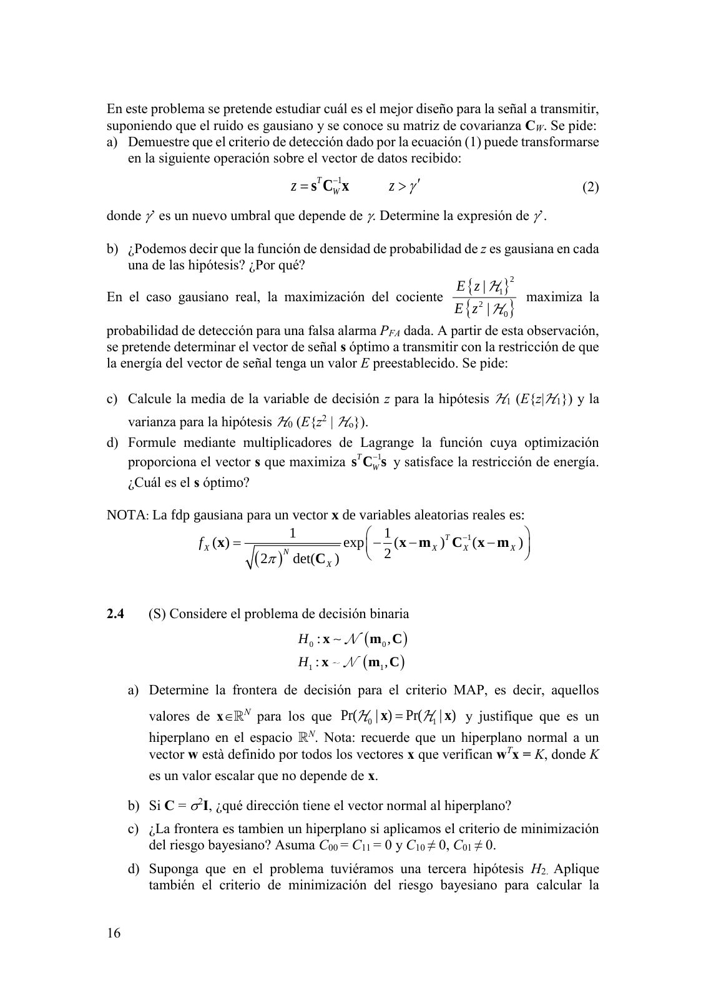

```text
En este problema se pretende estudiar cuál es el mejor diseño para la señal a transmitir,
suponiendo que el ruido es gausiano y se conoce su matriz de covarianza CW. Se pide:
a) Demuestre que el criterio de detección dado por la ecuación (1) puede transformarse
   en la siguiente operación sobre el vector de datos recibido:
                                  z = sT CW−1x          z                               (2)

donde ’ es un nuevo umbral que depende de . Determine la expresión de ’.

b) ¿Podemos decir que la función de densidad de probabilidad de z es gausiana en cada
   una de las hipótesis? ¿Por qué?
                                                           E  z | 1
                                                                      2

En el caso gausiano real, la maximización del cociente                  maximiza la
                                                           E z 2 | 0
probabilidad de detección para una falsa alarma PFA dada. A partir de esta observación,
se pretende determinar el vector de señal s óptimo a transmitir con la restricción de que
la energía del vector de señal tenga un valor E preestablecido. Se pide:

c) Calcule la media de la variable de decisión z para la hipótesis 1 (E{z|1}) y la
   varianza para la hipótesis 0 (E{z2 | o}).
d) Formule mediante multiplicadores de Lagrange la función cuya optimización
   proporciona el vector s que maximiza sT CW−1s y satisface la restricción de energía.
   ¿Cuál es el s óptimo?

NOTA: La fdp gausiana para un vector x de variables aleatorias reales es:
                                 1            1                             
              f X ( x) =                 exp  − (x − m X )T C−X1 (x − m X ) 
                         ( 2 ) det(C X )  2                                
                               N


2.4      (S) Considere el problema de decisión binaria
                                   H0 : x        (m0 , C)
                                   H1 : x        ( m1 , C )
      a) Determine la frontera de decisión para el criterio MAP, es decir, aquellos
         valores de xN para los que Pr(         0   | x) = Pr( 1 | x) y justifique que es un
         hiperplano en el espacio N. Nota: recuerde que un hiperplano normal a un
         vector w està definido por todos los vectores x que verifican wTx = K, donde K
         es un valor escalar que no depende de x.

      b) Si C = 2I, ¿qué dirección tiene el vector normal al hiperplano?
      c) ¿La frontera es tambien un hiperplano si aplicamos el criterio de minimización
         del riesgo bayesiano? Asuma C00 = C11 = 0 y C10 ≠ 0, C01 ≠ 0.
      d) Suponga que en el problema tuviéramos una tercera hipótesis H2. Aplique
         también el criterio de minimización del riesgo bayesiano para calcular la


16
```

## Page 4

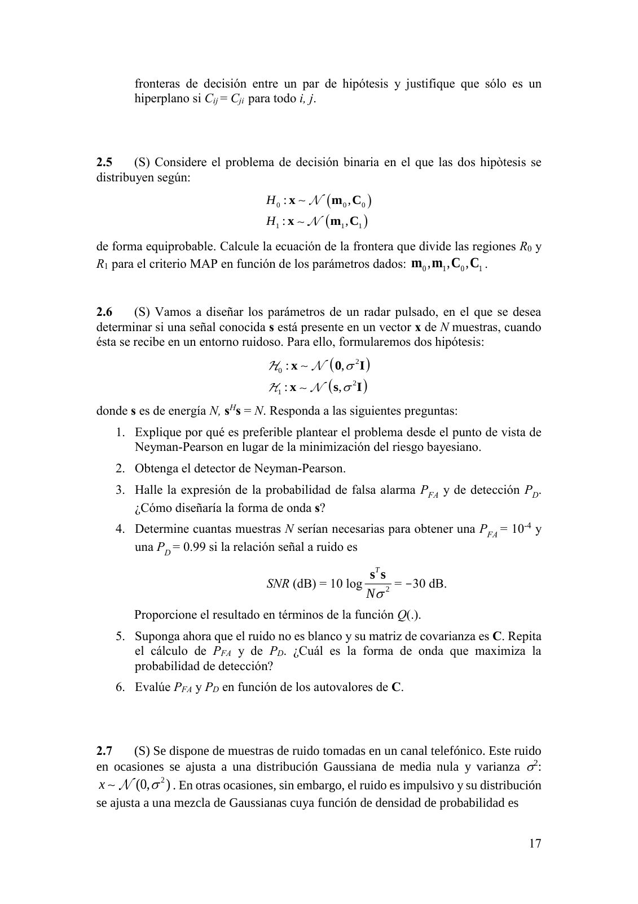

```text
       fronteras de decisión entre un par de hipótesis y justifique que sólo es un
       hiperplano si Cij = Cji para todo i, j.


2.5     (S) Considere el problema de decisión binaria en el que las dos hipòtesis se
distribuyen según:
                                   H0 : x      ( m 0 , C0 )
                                   H1 : x      ( m1 , C1 )
de forma equiprobable. Calcule la ecuación de la frontera que divide las regiones R0 y
R1 para el criterio MAP en función de los parámetros dados: m0 , m1 , C0 , C1 .


2.6     (S) Vamos a diseñar los parámetros de un radar pulsado, en el que se desea
determinar si una señal conocida s está presente en un vector x de N muestras, cuando
ésta se recibe en un entorno ruidoso. Para ello, formularemos dos hipótesis:

                                     0   :x    ( 0,  2I )
                                     1   :x    ( s,  2 I )
donde s es de energía N, sHs = N. Responda a las siguientes preguntas:
   1. Explique por qué es preferible plantear el problema desde el punto de vista de
      Neyman-Pearson en lugar de la minimización del riesgo bayesiano.
   2. Obtenga el detector de Neyman-Pearson.
   3. Halle la expresión de la probabilidad de falsa alarma PFA y de detección PD.
      ¿Cómo diseñaría la forma de onda s?
   4. Determine cuantas muestras N serían necesarias para obtener una PFA = 10-4 y
      una PD = 0.99 si la relación señal a ruido es

                                                         sT s
                                   SNR (dB) = 10 log          = -30 dB.
                                                         N 2
       Proporcione el resultado en términos de la función Q(.).
   5. Suponga ahora que el ruido no es blanco y su matriz de covarianza es C. Repita
      el cálculo de PFA y de PD. ¿Cuál es la forma de onda que maximiza la
      probabilidad de detección?
   6. Evalúe PFA y PD en función de los autovalores de C.


2.7     (S) Se dispone de muestras de ruido tomadas en un canal telefónico. Este ruido
en ocasiones se ajusta a una distribución Gaussiana de media nula y varianza 2:
 x      (0,  2 ) . En otras ocasiones, sin embargo, el ruido es impulsivo y su distribución
se ajusta a una mezcla de Gaussianas cuya función de densidad de probabilidad es


                                                                                         17
```

## Page 5

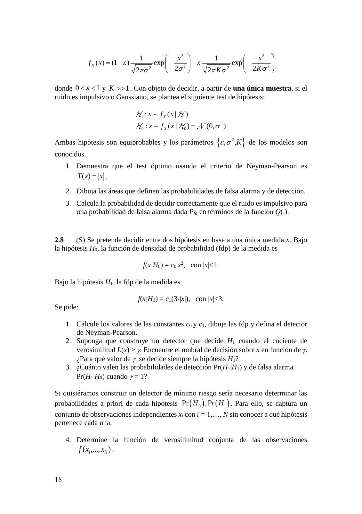

```text
                                    1         x2                 1           x2 
             f X ( x) = (1 −  )         exp  − 2  +                 exp  −   2 
                                   2 2      2              2 K 2      2 K 

donde 0    1 y K  1 . Con objeto de decidir, a partir de una única muestra, si el
ruido es impulsivo o Gaussiano, se plantea el siguiente test de hipótesis:

                                    1   :x   fX (x |   1   )
                                    0   :x   fX (x |   0   )=   (0,  2 )

Ambas hipótesis son equiprobables y los parámetros  ,  ,K
                                                        2
                                                                            de los modelos son
conocidos.
     1. Demuestra que el test óptimo usando el criterio de Neyman-Pearson es
        T ( x) = x .
     2. Dibuja las áreas que definen las probabilidades de falsa alarma y de detección.
     3. Calcula la probabilidad de decidir correctamente que el ruido es impulsivo para
        una probabilidad de falsa alarma dada Pfa en términos de la función Q(.).


2.8     (S) Se pretende decidir entre dos hipótesis en base a una única medida x. Bajo
la hipótesis H0, la función de densidad de probabilidad (fdp) de la medida es

                                     f(x|H0) = c0 x2, con |x|<1.

Bajo la hipótesis H1, la fdp de la medida es

                                   f(x|H1) = c1(3-|x|), con |x|<3.
Se pide:

     1. Calcule los valores de las constantes c0 y c1, dibuje las fdp y defina el detector
        de Neyman-Pearson.
     2. Suponga que construye un detector que decide H1 cuando el cociente de
        verosimilitud L(x) > . Encuentre el umbral de decisión sobre x en función de .
        ¿Para qué valor de  se decide siempre la hipótesis H1?
     3. ¿Cuánto valen las probabilidades de detección Pr(H1|H1) y de falsa alarma
        Pr(H1|H0) cuando  = 1?

Si quisiéramos construir un detector de mínimo riesgo sería necesario determinar las
probabilidades a priori de cada hipótesis Pr ( H 0 ) , Pr ( H1 ) . Para ello, se captura un
conjunto de observaciones independientes xi con i = 1,…, N sin conocer a qué hipótesis
pertenece cada una.

     4. Determine la función de verosilimitud conjunta de las observaciones
        f ( x1 ,..., xN ) .


18
```

## Page 6

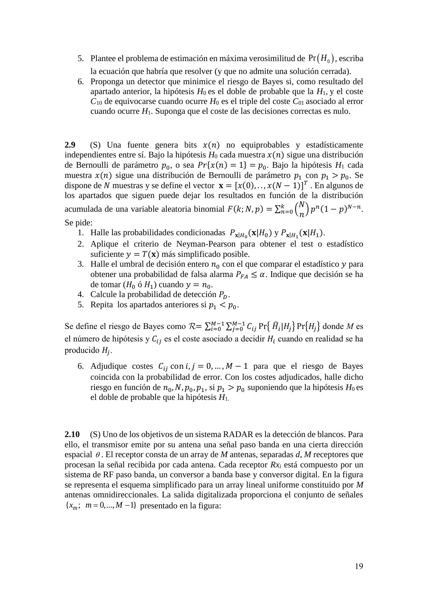

```text
   5. Plantee el problema de estimación en máxima verosimilitud de Pr ( H 0 ) , escriba
      la ecuación que habría que resolver (y que no admite una solución cerrada).
   6. Proponga un detector que minimice el riesgo de Bayes si, como resultado del
      apartado anterior, la hipótesis H0 es el doble de probable que la H1, y el coste
      C10 de equivocarse cuando ocurre H0 es el triple del coste C01 asociado al error
      cuando ocurre H1. Suponga que el coste de las decisiones correctas es nulo.


2.9    (S) Una fuente genera bits 𝑥(𝑛) no equiprobables y estadísticamente
independientes entre sí. Bajo la hipótesis H0 cada muestra 𝑥(𝑛) sigue una distribución
de Bernoulli de parámetro 𝑝0 , o sea 𝑃𝑟{𝑥(𝑛) = 1} = 𝑝0. Bajo la hipótesis H1 cada
muestra 𝑥(𝑛) sigue una distribución de Bernoulli de parámetro 𝑝1 con 𝑝1 > 𝑝0 . Se
dispone de 𝑁 muestras y se define el vector 𝐱 = [𝑥(0), . . , 𝑥(𝑁 − 1)]𝑇 . En algunos de
los apartados que siguen puede dejar los resultados en función de la distribución
                                                                    𝑁
acumulada de una variable aleatoria binomial 𝐹(𝑘; 𝑁, 𝑝) = ∑𝑘𝑛=0 ( ) 𝑝𝑛 (1 − 𝑝)𝑁−𝑛 .
                                                                     𝑛
Se pide:
    1. Halle las probabilidades condicionadas 𝑃𝐱|𝐻0 (𝐱|𝐻0 ) y 𝑃𝐱|𝐻1 (𝐱|𝐻1 ).
    2. Aplique el criterio de Neyman-Pearson para obtener el test o estadístico
       suficiente 𝑦 = 𝑇(𝐱) más simplificado posible.
    3. Halle el umbral de decisión entero 𝑛0 con el que comparar el estadístico 𝑦 para
       obtener una probabilidad de falsa alarma 𝑃𝐹𝐴 ≤ 𝛼. Indique que decisión se ha
       de tomar (𝐻0 ó 𝐻1 ) cuando 𝑦 = 𝑛0 .
    4. Calcule la probabilidad de detección 𝑃𝐷 .
    5. Repita los apartados anteriores si 𝑝1 < 𝑝0 .

Se define el riesgo de Bayes como = ∑𝑀−1        𝑀−1         ̂
                                           𝑖=0 ∑𝑗=0 𝐶𝑖𝑗 Pr{ 𝐻𝑖 |𝐻𝑗 } Pr{𝐻𝑗 } donde M es
el número de hipótesis y 𝐶𝑖𝑗 es el coste asociado a decidir 𝐻𝑖 cuando en realidad se ha
producido 𝐻𝑗 .
   6. Adjudique costes 𝐶𝑖𝑗 con 𝑖, 𝑗 = 0, … , 𝑀 − 1 para que el riesgo de Bayes
      coincida con la probabilidad de error. Con los costes adjudicados, halle dicho
      riesgo en función de 𝑛0 , 𝑁, 𝑝0 , 𝑝1 , si 𝑝1 > 𝑝0 suponiendo que la hipótesis H0 es
      el doble de probable que la hipótesis H1.


2.10 (S) Uno de los objetivos de un sistema RADAR es la detección de blancos. Para
ello, el transmisor emite por su antena una señal paso banda en una cierta dirección
espacial  . El receptor consta de un array de M antenas, separadas d, M receptores que
procesan la señal recibida por cada antena. Cada receptor Rxi está compuesto por un
sistema de RF paso banda, un conversor a banda base y conversor digital. En la figura
se representa el esquema simplificado para un array lineal uniforme constituido por M
antenas omnidireccionales. La salida digitalizada proporciona el conjunto de señales
{xm ; m = 0,..., M − 1} presentado en la figura:


                                                                                      19
```

## Page 7

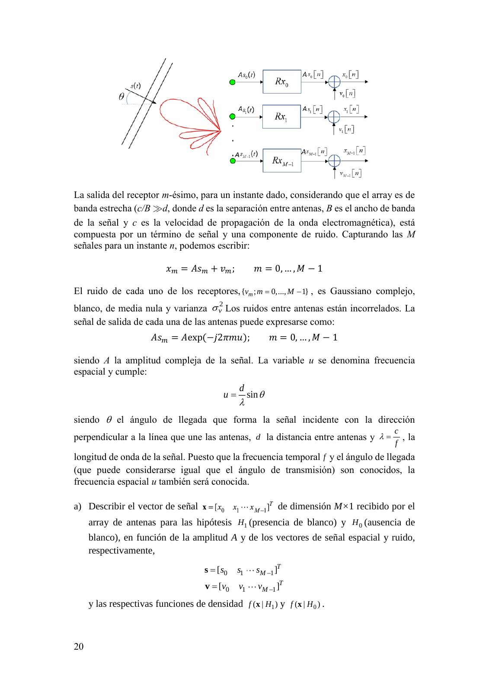

```text
La salida del receptor m-ésimo, para un instante dado, considerando que el array es de
banda estrecha (c/B d, donde d es la separación entre antenas, B es el ancho de banda
de la señal y c es la velocidad de propagación de la onda electromagnética), está
compuesta por un término de señal y una componente de ruido. Capturando las M
señales para un instante n, podemos escribir:

                           𝑥𝑚 = 𝐴𝑠𝑚 + 𝑣𝑚 ;                 𝑚 = 0, … , 𝑀 − 1

El ruido de cada uno de los receptores, {vm ; m = 0,..., M − 1} , es Gaussiano complejo,
blanco, de media nula y varianza  v Los ruidos entre antenas están incorrelados. La
                                           2

señal de salida de cada una de las antenas puede expresarse como:
                       𝐴𝑠𝑚 = 𝐴exp(−𝑗2𝜋𝑚𝑢);                       𝑚 = 0, … , 𝑀 − 1

siendo A la amplitud compleja de la señal. La variable u se denomina frecuencia
espacial y cumple:
                                                    d
                                               u=        sin 
                                                    
siendo  el ángulo de llegada que forma la señal incidente con la dirección
                                                                                              c
perpendicular a la línea que une las antenas, d la distancia entre antenas y  =                , la
                                                                                              f
longitud de onda de la señal. Puesto que la frecuencia temporal f y el ángulo de llegada
(que puede considerarse igual que el ángulo de transmisión) son conocidos, la
frecuencia espacial u también será conocida.

a) Describir el vector de señal                                    de dimensión M×1 recibido por el
     array de antenas para las hipótesis H1 (presencia de blanco) y H 0 (ausencia de
     blanco), en función de la amplitud A y de los vectores de señal espacial y ruido,
     respectivamente,
                                      s = [ s0      s1     sM −1 ]T
                                      v = [v0       v1      vM −1 ]T
     y las respectivas funciones de densidad f (x | H1 ) y f (x | H 0 ) .


20
```

## Page 8

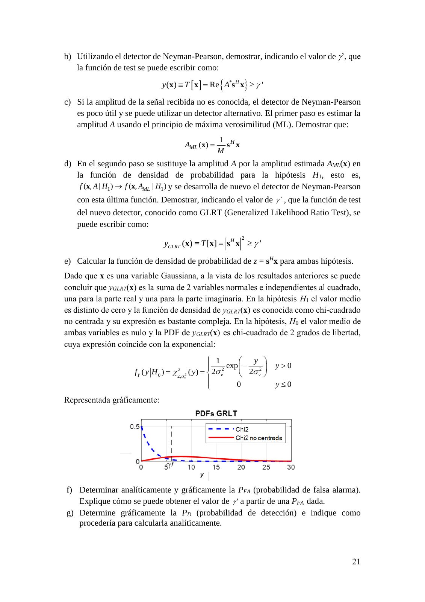

```text
b) Utilizando el detector de Neyman-Pearson, demostrar, indicando el valor de ’, que
   la función de test se puede escribir como:
                               y (x)  T  x  = Re  A*s H x   '

c) Si la amplitud de la señal recibida no es conocida, el detector de Neyman-Pearson
   es poco útil y se puede utilizar un detector alternativo. El primer paso es estimar la
   amplitud A usando el principio de máxima verosimilitud (ML). Demostrar que:
                                                         1 H
                                             AML (x) =     s x
                                                         M
d) En el segundo paso se sustituye la amplitud A por la amplitud estimada AML(x) en
   la función de densidad de probabilidad para la hipótesis H1, esto es,
    f (x, A | H1 ) → f (x, AML | H1 ) y se desarrolla de nuevo el detector de Neyman-Pearson
   con esta última función. Demostrar, indicando el valor de   , que la función de test
   del nuevo detector, conocido como GLRT (Generalized Likelihood Ratio Test), se
   puede escribir como:
                                                                 2
                                yGLRT (x)  T [x] = s H x   '

e) Calcular la función de densidad de probabilidad de z = sHx para ambas hipótesis.
Dado que x es una variable Gaussiana, a la vista de los resultados anteriores se puede
concluir que yGLRT(x) es la suma de 2 variables normales e independientes al cuadrado,
una para la parte real y una para la parte imaginaria. En la hipótesis H1 el valor medio
es distinto de cero y la función de densidad de yGLRT(x) es conocida como chi-cuadrado
no centrada y su expresión es bastante compleja. En la hipótesis, H0 el valor medio de
ambas variables es nulo y la PDF de yGLRT(x) es chi-cuadrado de 2 grados de libertad,
cuya expresión coincide con la exponencial:
                                                          1        y 
                                                          2 exp  − 2     y0
                     fY ( y H 0 ) =    2
                                        2, v2
                                                 ( y ) =  2 v   2 v 
                                                                           y0
                                                               0
Representada gráficamente:


f) Determinar analíticamente y gráficamente la PFA (probabilidad de falsa alarma).
   Explique cómo se puede obtener el valor de   a partir de una PFA dada.
g) Determine gráficamente la PD (probabilidad de detección) e indique como
   procedería para calcularla analíticamente.


                                                                                         21
```

## Page 9

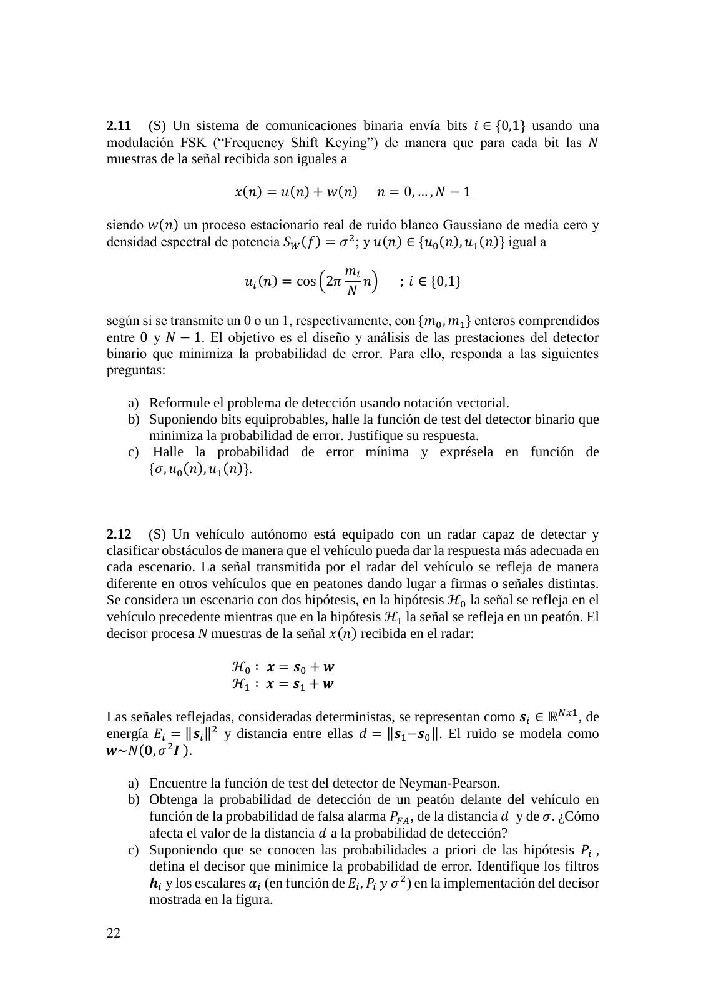

```text
2.11 (S) Un sistema de comunicaciones binaria envía bits 𝑖 ∈ {0,1} usando una
modulación FSK (“Frequency Shift Keying”) de manera que para cada bit las 𝑁
muestras de la señal recibida son iguales a

                        𝑥(𝑛) = 𝑢(𝑛) + 𝑤(𝑛)         𝑛 = 0, … , 𝑁 − 1

siendo 𝑤(𝑛) un proceso estacionario real de ruido blanco Gaussiano de media cero y
densidad espectral de potencia 𝑆𝑊 (𝑓) = 𝜎 2 ; y 𝑢(𝑛) ∈ {𝑢0 (𝑛), 𝑢1 (𝑛)} igual a

                                             𝑚𝑖
                          𝑢𝑖 (𝑛) = cos (2𝜋      𝑛)     ; 𝑖 ∈ {0,1}
                                             𝑁

según si se transmite un 0 o un 1, respectivamente, con {𝑚0 , 𝑚1 } enteros comprendidos
entre 0 y 𝑁 − 1. El objetivo es el diseño y análisis de las prestaciones del detector
binario que minimiza la probabilidad de error. Para ello, responda a las siguientes
preguntas:

     a) Reformule el problema de detección usando notación vectorial.
     b) Suponiendo bits equiprobables, halle la función de test del detector binario que
        minimiza la probabilidad de error. Justifique su respuesta.
     c) Halle la probabilidad de error mínima y exprésela en función de
        {𝜎, 𝑢0 (𝑛), 𝑢1 (𝑛)}.


2.12 (S) Un vehículo autónomo está equipado con un radar capaz de detectar y
clasificar obstáculos de manera que el vehículo pueda dar la respuesta más adecuada en
cada escenario. La señal transmitida por el radar del vehículo se refleja de manera
diferente en otros vehículos que en peatones dando lugar a firmas o señales distintas.
Se considera un escenario con dos hipótesis, en la hipótesis ℋ0 la señal se refleja en el
vehículo precedente mientras que en la hipótesis ℋ1 la señal se refleja en un peatón. El
decisor procesa N muestras de la señal 𝑥(𝑛) recibida en el radar:

                        ℋ0 ∶ 𝒙 = 𝒔0 + 𝒘
                        ℋ1 ∶ 𝒙 = 𝒔1 + 𝒘

Las señales reflejadas, consideradas deterministas, se representan como 𝒔𝑖 ∈ ℝ𝑁𝑥1 , de
energía 𝐸𝑖 = ‖𝒔𝑖 ‖2 y distancia entre ellas 𝑑 = ‖𝒔1 −𝒔0 ‖. El ruido se modela como
𝒘~𝑁(𝟎, 𝜎 2 𝑰 ).

     a) Encuentre la función de test del detector de Neyman-Pearson.
     b) Obtenga la probabilidad de detección de un peatón delante del vehículo en
        función de la probabilidad de falsa alarma 𝑃𝐹𝐴 , de la distancia 𝑑 y de 𝜎. ¿Cómo
        afecta el valor de la distancia 𝑑 a la probabilidad de detección?
     c) Suponiendo que se conocen las probabilidades a priori de las hipótesis 𝑃𝑖 ,
        defina el decisor que minimice la probabilidad de error. Identifique los filtros
        𝒉𝑖 y los escalares 𝛼𝑖 (en función de 𝐸𝑖 , 𝑃𝑖 𝑦 𝜎 2 ) en la implementación del decisor
        mostrada en la figura.

22
```

## Page 10

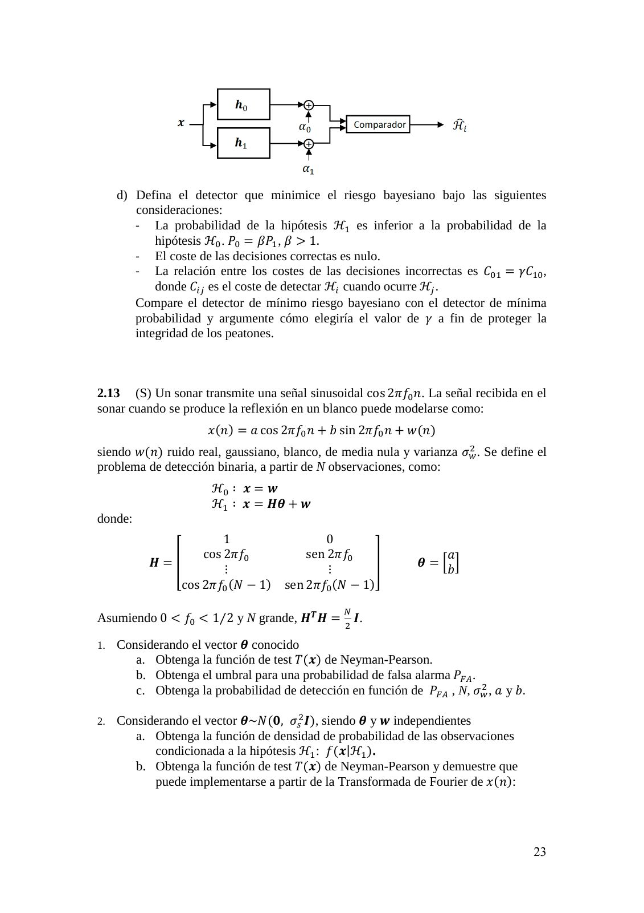

```text
     d) Defina el detector que minimice el riesgo bayesiano bajo las siguientes
        consideraciones:
        - La probabilidad de la hipótesis ℋ1 es inferior a la probabilidad de la
            hipótesis ℋ0 . 𝑃0 = 𝛽𝑃1 , 𝛽 > 1.
        - El coste de las decisiones correctas es nulo.
        - La relación entre los costes de las decisiones incorrectas es 𝐶01 = 𝛾𝐶10,
            donde 𝐶𝑖𝑗 es el coste de detectar ℋ𝑖 cuando ocurre ℋ𝑗 .
        Compare el detector de mínimo riesgo bayesiano con el detector de mínima
        probabilidad y argumente cómo elegiría el valor de 𝛾 a fin de proteger la
        integridad de los peatones.


2.13 (S) Un sonar transmite una señal sinusoidal cos 2𝜋𝑓0 𝑛. La señal recibida en el
sonar cuando se produce la reflexión en un blanco puede modelarse como:
                      𝑥(𝑛) = 𝑎 cos 2𝜋𝑓0 𝑛 + 𝑏 sin 2𝜋𝑓0 𝑛 + 𝑤(𝑛)
siendo 𝑤(𝑛) ruido real, gaussiano, blanco, de media nula y varianza 𝜎𝑤2 . Se define el
problema de detección binaria, a partir de N observaciones, como:
                       ℋ0 ∶ 𝒙 = 𝒘
                       ℋ1 ∶ 𝒙 = 𝑯𝜽 + 𝒘
donde:
                      1                     0
                  cos 2𝜋𝑓0               sen 2𝜋𝑓0                𝑎
           𝑯=[                                        ]       𝜽=[ ]
                      ⋮                      ⋮                   𝑏
              cos 2𝜋𝑓0 (𝑁 − 1)       sen 2𝜋𝑓0 (𝑁 − 1)
                                                𝑁
Asumiendo 0 < 𝑓0 < 1⁄2 y N grande, 𝑯𝑻 𝑯 = 2 𝑰.

1.   Considerando el vector 𝜽 conocido
        a. Obtenga la función de test 𝑇(𝒙) de Neyman-Pearson.
        b. Obtenga el umbral para una probabilidad de falsa alarma 𝑃𝐹𝐴 .
        c. Obtenga la probabilidad de detección en función de 𝑃𝐹𝐴 , N, 𝜎𝑤2 , 𝑎 y 𝑏.

2.   Considerando el vector 𝜽~𝑁(𝟎, 𝜎𝑠2 𝑰), siendo 𝜽 y 𝒘 independientes
        a. Obtenga la función de densidad de probabilidad de las observaciones
           condicionada a la hipótesis ℋ1 : 𝑓(𝒙|ℋ1 ).
        b. Obtenga la función de test 𝑇(𝒙) de Neyman-Pearson y demuestre que
           puede implementarse a partir de la Transformada de Fourier de 𝑥(𝑛):


                                                                                      23
```

## Page 11

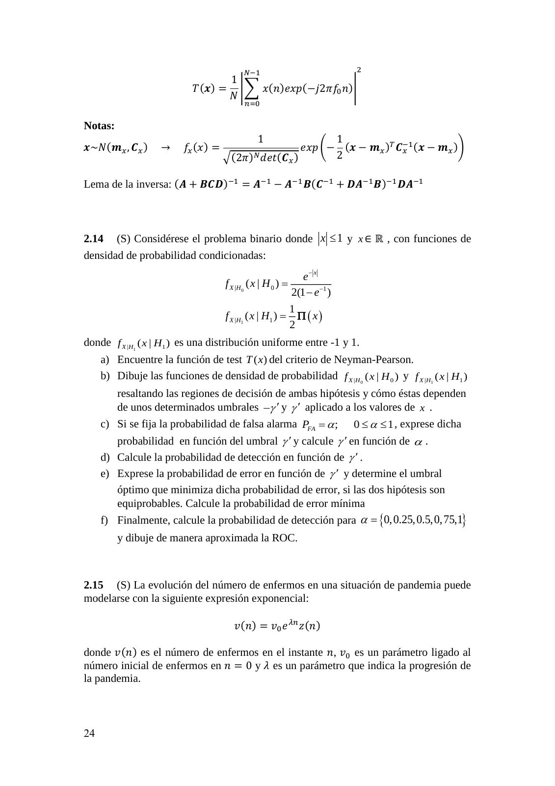

```text
                                          𝑁−1                          2
                                 1
                           𝑇(𝒙) = |∑ 𝑥(𝑛)𝑒𝑥𝑝(−𝑗2𝜋𝑓0 𝑛)|
                                 𝑁
                                          𝑛=0

Notas:
                                              1           1
𝒙~𝑁(𝒎𝑥 , 𝑪𝑥 )      →     𝑓𝑥 (𝑥) =                   𝑒𝑥𝑝 (− (𝒙 − 𝒎𝑥 )𝑇 𝑪−1
                                                                       𝑥 (𝒙 − 𝒎𝑥 ))
                                    √(2𝜋)𝑁 𝑑𝑒𝑡(𝑪𝑥 )       2

Lema de la inversa: (𝑨 + 𝑩𝑪𝑫)−1 = 𝑨−1 − 𝑨−1 𝑩(𝑪−1 + 𝑫𝑨−1 𝑩)−1 𝑫𝑨−1


2.14     (S) Considérese el problema binario donde x  1 y x ∈ ℝ , con funciones de
densidad de probabilidad condicionadas:
                                                             −x
                                                           e
                                    f X |H0 ( x | H 0 ) =
                                                        2(1 − e −1 )
                                                        1
                                    f X |H1 ( x | H1 ) =  ( x )
                                                        2
donde f X |H ( x | H1 ) es una distribución uniforme entre -1 y 1.
             1

     a) Encuentre la función de test T ( x) del criterio de Neyman-Pearson.
     b) Dibuje las funciones de densidad de probabilidad f X |H ( x | H 0 ) y f X |H ( x | H1 )
                                                                       0              1


        resaltando las regiones de decisión de ambas hipótesis y cómo éstas dependen
        de unos determinados umbrales −  y   aplicado a los valores de x .
     c) Si se fija la probabilidad de falsa alarma PFA =  ; 0    1 , exprese dicha
        probabilidad en función del umbral   y calcule   en función de  .
     d) Calcule la probabilidad de detección en función de   .
     e) Exprese la probabilidad de error en función de   y determine el umbral
        óptimo que minimiza dicha probabilidad de error, si las dos hipótesis son
        equiprobables. Calcule la probabilidad de error mínima
     f) Finalmente, calcule la probabilidad de detección para  = 0, 0.25, 0.5, 0, 75,1
         y dibuje de manera aproximada la ROC.


2.15 (S) La evolución del número de enfermos en una situación de pandemia puede
modelarse con la siguiente expresión exponencial:

                                       𝑣(𝑛) = 𝑣0 𝑒 𝜆𝑛 𝑧(𝑛)

donde 𝑣(𝑛) es el número de enfermos en el instante 𝑛, 𝑣0 es un parámetro ligado al
número inicial de enfermos en 𝑛 = 0 y 𝜆 es un parámetro que indica la progresión de
la pandemia.


24
```

## Page 12

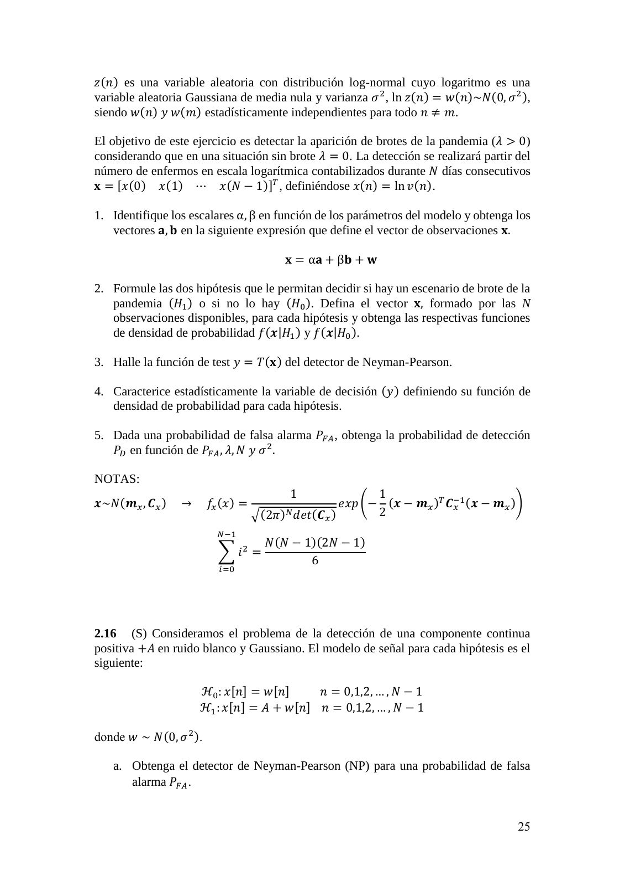

```text
𝑧(𝑛) es una variable aleatoria con distribución log-normal cuyo logaritmo es una
variable aleatoria Gaussiana de media nula y varianza 𝜎 2 , ln 𝑧(𝑛) = 𝑤(𝑛)~𝑁(0, 𝜎 2 ),
siendo 𝑤(𝑛) 𝑦 𝑤(𝑚) estadísticamente independientes para todo 𝑛 ≠ 𝑚.

El objetivo de este ejercicio es detectar la aparición de brotes de la pandemia (𝜆 > 0)
considerando que en una situación sin brote 𝜆 = 0. La detección se realizará partir del
número de enfermos en escala logarítmica contabilizados durante 𝑁 días consecutivos
𝐱 = [𝑥(0) 𝑥(1) ⋯ 𝑥(𝑁 − 1)]𝑇 , definiéndose 𝑥(𝑛) = ln 𝑣(𝑛).

1. Identifique los escalares α, β en función de los parámetros del modelo y obtenga los
   vectores 𝐚, 𝐛 en la siguiente expresión que define el vector de observaciones 𝐱.

                                        𝐱 = α𝐚 + β𝐛 + 𝐰

2. Formule las dos hipótesis que le permitan decidir si hay un escenario de brote de la
   pandemia (𝐻1 ) o si no lo hay (𝐻0 ). Defina el vector 𝐱, formado por las N
   observaciones disponibles, para cada hipótesis y obtenga las respectivas funciones
   de densidad de probabilidad 𝑓(𝒙|𝐻1 ) y 𝑓(𝒙|𝐻0 ).

3. Halle la función de test 𝑦 = 𝑇(𝐱) del detector de Neyman-Pearson.

4. Caracterice estadísticamente la variable de decisión (𝑦) definiendo su función de
   densidad de probabilidad para cada hipótesis.

5. Dada una probabilidad de falsa alarma 𝑃𝐹𝐴 , obtenga la probabilidad de detección
   𝑃𝐷 en función de 𝑃𝐹𝐴 , 𝜆, 𝑁 𝑦 𝜎 2 .

NOTAS:
                                         1               1
𝒙~𝑁(𝒎𝑥 , 𝑪𝑥 )    →      𝑓𝑥 (𝑥) =                   𝑒𝑥𝑝 (− (𝒙 − 𝒎𝑥 )𝑇 𝑪−1
                                                                      𝑥 (𝒙 − 𝒎𝑥 ))
                                   √(2𝜋)𝑁 𝑑𝑒𝑡(𝑪𝑥 )       2
                          𝑁−1
                                     𝑁(𝑁 − 1)(2𝑁 − 1)
                          ∑ 𝑖2 =
                                            6
                          𝑖=0


2.16 (S) Consideramos el problema de la detección de una componente continua
positiva +𝐴 en ruido blanco y Gaussiano. El modelo de señal para cada hipótesis es el
siguiente:

                     ℋ0 : 𝑥[𝑛] = 𝑤[𝑛]     𝑛 = 0,1,2, … , 𝑁 − 1
                     ℋ1 : 𝑥[𝑛] = 𝐴 + 𝑤[𝑛] 𝑛 = 0,1,2, … , 𝑁 − 1

donde 𝑤 ∼ 𝑁(0, 𝜎 2 ).

   a. Obtenga el detector de Neyman-Pearson (NP) para una probabilidad de falsa
      alarma 𝑃𝐹𝐴 .


                                                                                    25
```

## Page 13

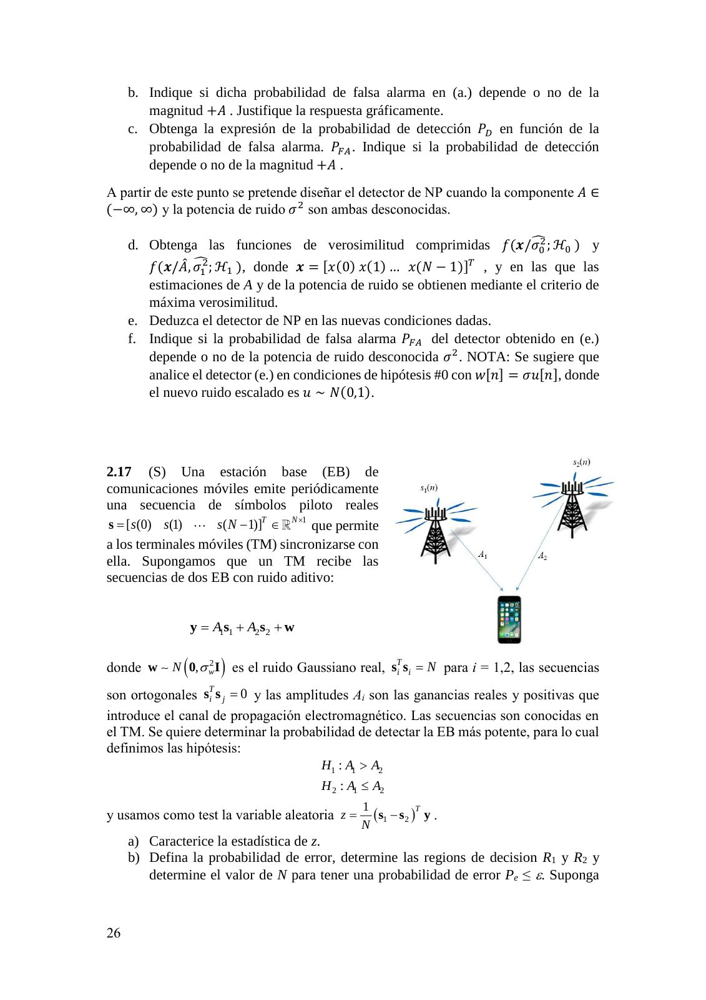

```text
     b. Indique si dicha probabilidad de falsa alarma en (a.) depende o no de la
        magnitud +𝐴 . Justifique la respuesta gráficamente.
     c. Obtenga la expresión de la probabilidad de detección 𝑃𝐷 en función de la
        probabilidad de falsa alarma. 𝑃𝐹𝐴 . Indique si la probabilidad de detección
        depende o no de la magnitud +𝐴 .
A partir de este punto se pretende diseñar el detector de NP cuando la componente 𝐴 ∈
(−∞, ∞) y la potencia de ruido 𝜎 2 son ambas desconocidas.

     d. Obtenga las funciones de verosimilitud comprimidas 𝑓(𝒙/𝜎̂2 ; ℋ ) y
                                                                  0   0
             ̂ ̂2                                       𝑇
        𝑓(𝒙/𝐴, 𝜎 ; ℋ ), donde 𝒙 = [𝑥(0) 𝑥(1) … 𝑥(𝑁 − 1)] , y en las que las
                   1           1
        estimaciones de A y de la potencia de ruido se obtienen mediante el criterio de
        máxima verosimilitud.
     e. Deduzca el detector de NP en las nuevas condiciones dadas.
     f. Indique si la probabilidad de falsa alarma 𝑃𝐹𝐴 del detector obtenido en (e.)
        depende o no de la potencia de ruido desconocida 𝜎 2 . NOTA: Se sugiere que
        analice el detector (e.) en condiciones de hipótesis #0 con 𝑤[𝑛] = 𝜎𝑢[𝑛], donde
        el nuevo ruido escalado es 𝑢 ∼ 𝑁(0,1).


2.17 (S) Una estación base (EB) de
comunicaciones móviles emite periódicamente
una secuencia de símbolos piloto reales
s = [ s(0) s(1)    s( N − 1)]T  N 1 que permite
a los terminales móviles (TM) sincronizarse con
ella. Supongamos que un TM recibe las
secuencias de dos EB con ruido aditivo:


                  y = A1s1 + A2s2 + w


donde w       (            )
            N 0,  w2 I es el ruido Gaussiano real, sTi si = N para i = 1,2, las secuencias

son ortogonales si s j = 0 y las amplitudes Ai son las ganancias reales y positivas que
                       T


introduce el canal de propagación electromagnético. Las secuencias son conocidas en
el TM. Se quiere determinar la probabilidad de detectar la EB más potente, para lo cual
definimos las hipótesis:
                                        H1 : A1  A2
                                        H 2 : A1  A2
                                                1
y usamos como test la variable aleatoria z =      ( s1 − s2 )T y .
                                                N
     a) Caracterice la estadística de z.
     b) Defina la probabilidad de error, determine las regions de decision R1 y R2 y
        determine el valor de N para tener una probabilidad de error Pe ≤ . Suponga


26
```

## Page 14


```text
   que las probabilidades a priori Pr ( H i ) son iguales. Dé el resultado en función
   de Q(.).
c) Interprete por qué ese valor es tanto mayor cuanto menor es la diferencia
   |A1 –A2|.
d) Calcule la probabilidad de decisión correcta y demuestre que cuando N se hace
   muy grande tiende a 1. Explique por qué.

                        
                                    x2 
                    
                            1
   Nota: Q ( ) =              exp  − dx
                           2      2


                                                                                  27
```

## Page 15

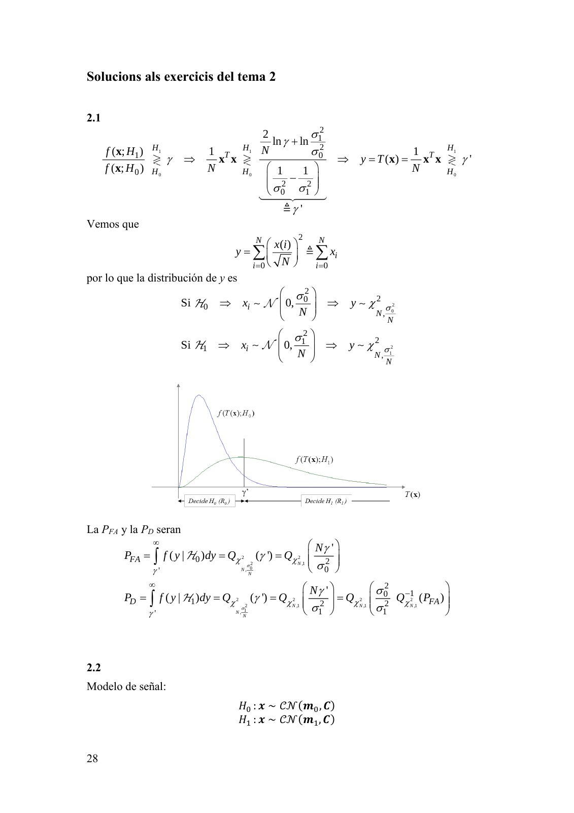

```text
Solucions als exercicis del tema 2

2.1
                                                 2          2
                                                   ln  + ln 12
      f (x; H1 ) H1                  1 T H1      N          0                                 1 T H1
                                     x x                                     y = T ( x) =     x x    '
      f (x; H 0 ) H 0                N     H0         1     1                                N     H0
                                                      2 − 2 
                                                        0 1 
                                                           '
Vemos que
                                                            2
                                            x(i ) 
                                                 N       N
                                  y =                xi
                                      i =0  N        i =0
por lo que la distribución de y es
                                                02 
                      Si 0  xi                0,                      y     2    2

                                                N 
                                                                                         0
                                                                                   N,
                                                                                        N
                                                        12 
                           Si    1         xi          0,             y    2     2

                                                         N                       N, 1
                                                                                     N


La PFA y la PD seran
                                                                 N ' 
          PFA =  f ( y |       0 ) dy = Q 2    ( ') = Q 2  2 
                                                            N ,1       
                  '
                                              2
                                            N, 0
                                               N
                                                                  0 
                                                               N '        2           
          PD =  f ( y |    1 ) dy = Q 2      ( ') = Q 2  2  = Q 2  02 Q−12 ( PFA ) 
                                                          N ,1        N ,1               
                                            2
                                                                1          1           
                                                                                  N ,1
                 '                       N, 1
                                             N


2.2
Modelo de señal:
                                           𝐻0 : 𝒙 ∼ 𝒞𝒩(𝒎0 , 𝑪)
                                           𝐻1 : 𝒙 ∼ 𝒞𝒩(𝒎1 , 𝑪)


28
```

## Page 16

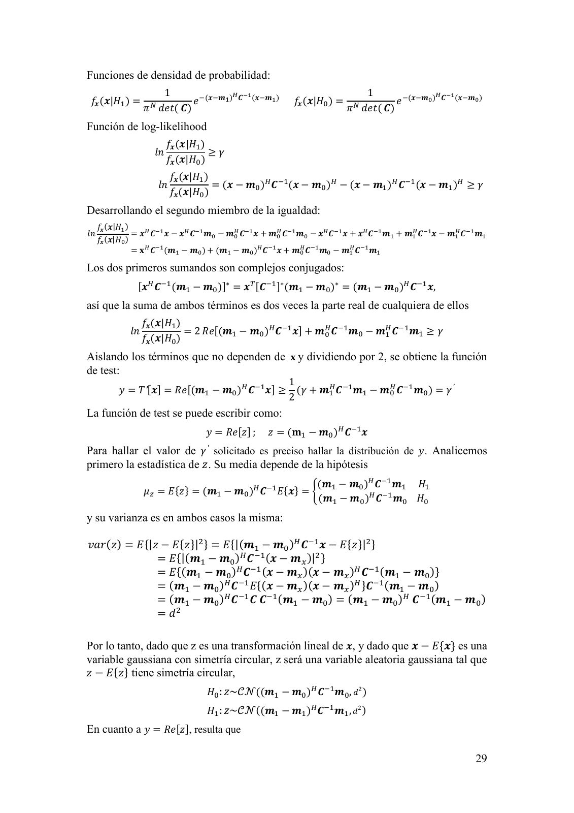

```text
Funciones de densidad de probabilidad:
                        1               𝐻 −1 (𝒙−𝒎 )                      1                  𝐻 −1 (𝒙−𝒎 )
𝑓𝒙 (𝒙|𝐻1 ) =                   𝑒 −(𝒙−𝒎𝟏) 𝑪       1    𝑓𝒙 (𝒙|𝐻0 ) =                 𝑒 −(𝒙−𝒎0 ) 𝑪      0
                 𝜋 𝑁 𝑑𝑒𝑡( 𝑪)                                         𝜋 𝑁 𝑑𝑒𝑡( 𝑪)
Función de log-likelihood
                        𝑓𝒙 (𝒙|𝐻1 )
                   𝑙𝑛              ≥𝛾
                        𝑓𝒙 (𝒙|𝐻0 )
                         𝑓𝒙 (𝒙|𝐻1 )
                    𝑙𝑛              = (𝒙 − 𝒎0 )𝐻 𝑪−1 (𝒙 − 𝒎0 )𝐻 − (𝒙 − 𝒎1 )𝐻 𝑪−1 (𝒙 − 𝒎1 )𝐻 ≥ 𝛾
                         𝑓𝒙 (𝒙|𝐻0 )
Desarrollando el segundo miembro de la igualdad:
     𝑓𝒙 (𝒙|𝐻1 )
𝑙𝑛              = 𝒙𝐻 𝑪−1 𝒙 − 𝒙𝐻 𝑪−1 𝒎0 − 𝒎𝐻   −1       𝐻 −1       𝐻 −1    𝐻 −1 𝐻 −1     𝐻 −1
                                           0 𝑪 𝒙 + 𝒎0 𝑪 𝒎0 − 𝒙 𝑪 𝒙 + 𝒙 𝑪 𝒎1 + 𝒎1 𝑪 𝒙 − 𝒎1 𝑪 𝒎1
     𝑓𝒙 (𝒙|𝐻0)
                = 𝐱 𝐻 𝑪−1 (𝒎1 − 𝒎0 ) + (𝒎1 − 𝒎0 )𝐻 𝑪−1 𝒙 + 𝒎𝐻  −1      𝐻 −1
                                                            0 𝑪 𝒎0 − 𝒎1 𝑪 𝒎1

Los dos primeros sumandos son complejos conjugados:
              [𝒙𝐻 𝑪−1 (𝒎1 − 𝒎0 )]∗ = 𝒙𝑇 [𝑪−1 ]∗ (𝒎1 − 𝒎0 )∗ = (𝒎1 − 𝒎0 )𝐻 𝑪−1 𝒙,
así que la suma de ambos términos es dos veces la parte real de cualquiera de ellos
                 𝑓𝒙 (𝒙|𝐻1 )
            𝑙𝑛              = 2 𝑅𝑒[(𝒎1 − 𝒎0 )𝐻 𝑪−1 𝒙] + 𝒎𝐻  −1     𝐻 −1
                                                         0 𝑪 𝒎0 − 𝒎1 𝑪 𝒎1 ≥ 𝛾
                 𝑓𝒙 (𝒙|𝐻0 )
Aislando los términos que no dependen de x y dividiendo por 2, se obtiene la función
de test:
                                             1                                ′
          𝑦 = 𝑇′[𝒙] = 𝑅𝑒[(𝒎1 − 𝒎0 )𝐻 𝑪−1 𝒙] ≥ (𝛾 + 𝒎1𝐻 𝑪−1 𝒎1 − 𝒎𝐻  −1
                                                                 0 𝑪 𝒎0 ) = 𝛾
                                             2
La función de test se puede escribir como:
                                 𝑦 = 𝑅𝑒[𝑧] ;    𝑧 = (𝐦1 − 𝒎0 )𝐻 𝑪−1 𝒙
Para hallar el valor de 𝛾 ′ solicitado es preciso hallar la distribución de 𝑦. Analicemos
primero la estadística de 𝑧. Su media depende de la hipótesis
                                                     (𝒎 − 𝒎0 )𝐻 𝑪−1 𝒎1 𝐻1
                 𝜇𝑧 = 𝐸{𝑧} = (𝒎1 − 𝒎0 )𝐻 𝑪−1 𝐸{𝒙} = { 1
                                                     (𝒎1 − 𝒎0 )𝐻 𝑪−1 𝒎0 𝐻0
y su varianza es en ambos casos la misma:

𝑣𝑎𝑟(𝑧) = 𝐸{|𝑧 − 𝐸{𝑧}|2 } = 𝐸{|(𝒎1 − 𝒎0 )𝐻 𝑪−1 𝒙 − 𝐸{𝑧}|2 }
             = 𝐸{|(𝒎1 − 𝒎0 )𝐻 𝑪−1 (𝒙 − 𝒎𝑥 )|2 }
             = 𝐸{(𝒎1 − 𝒎0 )𝐻 𝑪−1 (𝒙 − 𝒎𝑥 )(𝒙 − 𝒎𝑥 )𝐻 𝑪−1 (𝒎1 − 𝒎0 )}
             = (𝒎1 − 𝒎0 )𝐻 𝑪−1 𝐸{(𝒙 − 𝒎𝑥 )(𝒙 − 𝒎𝑥 )𝐻 }𝑪−1 (𝒎1 − 𝒎0 )
             = (𝒎1 − 𝒎0 )𝐻 𝑪−1 𝑪 𝑪−1 (𝒎1 − 𝒎0 ) = (𝒎1 − 𝒎0 )𝐻 𝑪−1 (𝒎1 − 𝒎0 )
             = 𝑑2

Por lo tanto, dado que z es una transformación lineal de 𝒙, y dado que 𝒙 − 𝐸{𝒙} es una
variable gaussiana con simetría circular, z será una variable aleatoria gaussiana tal que
𝑧 − 𝐸{𝑧} tiene simetría circular,
                                  𝐻0 : 𝑧~𝒞𝒩((𝒎1 − 𝒎0 )𝐻 𝑪−1 𝒎0 , 𝑑2 )
                                  𝐻1 : 𝑧~𝒞𝒩((𝒎1 − 𝒎1 )𝐻 𝑪−1 𝒎1 , 𝑑2 )
En cuanto a 𝑦 = 𝑅𝑒[𝑧], resulta que

                                                                                                     29
```

## Page 17

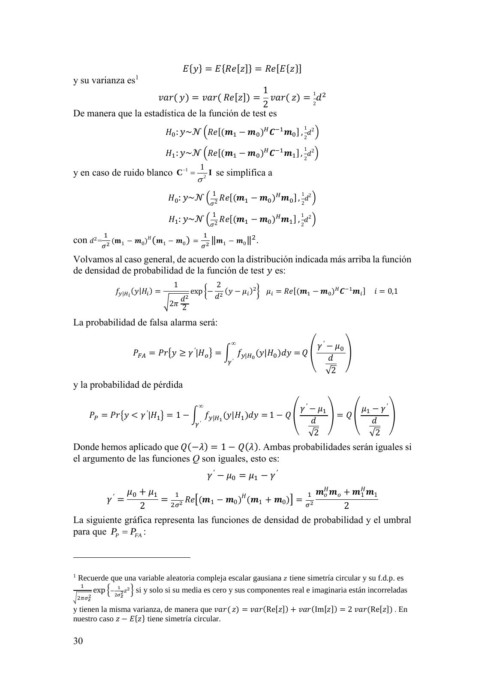

```text
                                        𝐸{𝑦} = 𝐸{𝑅𝑒[𝑧]} = 𝑅𝑒[𝐸{𝑧}]
y su varianza es1
                                                 1           1
                                                   𝑣𝑎𝑟( 𝑧) = 2𝑑2
                              𝑣𝑎𝑟( 𝑦) = 𝑣𝑎𝑟( 𝑅𝑒[𝑧]) =
                                                 2
De manera que la estadística de la función de test es
                                                                                    1
                                  𝐻0 : 𝑦~𝒩 (𝑅𝑒[(𝒎1 − 𝒎0 )𝐻 𝑪−1 𝒎0 ] , 2𝑑2 )
                                                                                 1
                                  𝐻1 : 𝑦~𝒩 (𝑅𝑒[(𝒎1 − 𝒎0 )𝐻 𝑪−1 𝒎1 ] , 2𝑑2 )
                                              1
y en caso de ruido blanco C−1 =                  I se simplifica a
                                              2
                                                       1                        1
                                  𝐻0 : 𝑦~𝒩 ( 2 𝑅𝑒[(𝒎1 − 𝒎0 )𝐻 𝒎0 ] , 2𝑑2 )
                                                       𝜎
                                                       1                        1
                                   𝐻1 : 𝑦~𝒩 ( 2 𝑅𝑒[(𝒎1 − 𝒎0 )𝐻 𝒎1 ] , 2𝑑2 )
                                                       𝜎
            1                                      1
con 𝑑2 =𝜎2 (𝐦1 − 𝒎0 )𝐻 (𝒎1 − 𝒎0 ) = 𝜎2 ‖𝒎1 − 𝒎0 ‖2 .
Volvamos al caso general, de acuerdo con la distribución indicada más arriba la función
de densidad de probabilidad de la función de test 𝑦 es:
                                    1                  2
                𝑓𝑦|𝐻𝑖 (𝑦|𝐻𝑖 ) =              exp {−       (𝑦 − 𝜇𝑖 )2 } 𝜇𝑖 = 𝑅𝑒[(𝒎1 − 𝒎0 )𝐻 𝑪−1 𝒎𝑖 ]   𝑖 = 0,1
                                        𝑑2             𝑑2
                                  √2𝜋
                                        2
La probabilidad de falsa alarma será:

                                            ∞
                                   ′ |𝐻
                                                                𝛾 ′ − 𝜇0
                     𝑃𝐹𝐴 = 𝑃𝑟{𝑦 ≥ 𝛾 𝑜 } = ∫ 𝑓𝑦|𝐻0 (𝑦|𝐻0 )𝑑𝑦 =𝑄(          )
                                           𝛾′
                                                                    𝑑
                                                                                        √2
y la probabilidad de pérdida

                                               ∞
                                                                               𝛾 ′ − 𝜇1        𝜇1 − 𝛾 ′
       𝑃𝑃 = 𝑃𝑟{𝑦 < 𝛾 ′ |𝐻1 } = 1 − ∫ 𝑓𝑦|𝐻1 (𝑦|𝐻1 )𝑑𝑦 = 1 − 𝑄 (                          ) = 𝑄(          )
                                              𝛾′
                                                                                   𝑑              𝑑
                                                                                   √2            √2
Donde hemos aplicado que 𝑄(−𝜆) = 1 − 𝑄(𝜆). Ambas probabilidades serán iguales si
el argumento de las funciones Q son iguales, esto es:
                                                   𝛾 ′ − 𝜇0 = 𝜇1 − 𝛾 ′
                                                               𝐻        𝐻
              𝜇0 + 𝜇1     1                                1 𝒎𝑜 𝒎𝑜 + 𝒎1 𝒎1
             𝛾′ =      = 2𝜎2 𝑅𝑒[(𝒎1 − 𝒎0 )𝐻 (𝒎1 + 𝒎0 )] = 𝜎2
                 2                                                  2
La siguiente gráfica representa las funciones de densidad de probabilidad y el umbral
para que PP = PFA :


1
    Recuerde que una variable aleatoria compleja escalar gausiana 𝑧 tiene simetría circular y su f.d.p. es
     1
        exp {−2𝜎12𝑧 2} si y solo si su media es cero y sus componentes real e imaginaria están incorreladas
√2𝜋𝜎𝑧2           𝑧

y tienen la misma varianza, de manera que 𝑣𝑎𝑟( 𝑧) = 𝑣𝑎𝑟(Re[𝑧]) + 𝑣𝑎𝑟(Im[𝑧]) = 2 𝑣𝑎𝑟(Re[𝑧]) . En
nuestro caso 𝑧 − 𝐸{𝑧} tiene simetría circular.

30
```

## Page 18

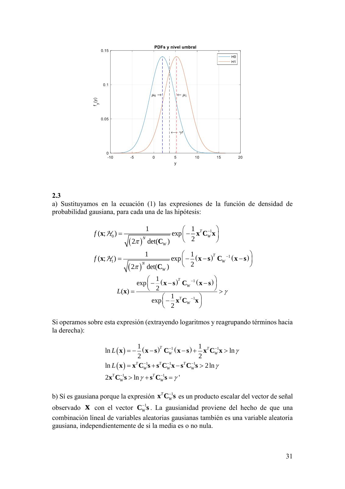

```text
2.3
a) Sustituyamos en la ecuación (1) las expresiones de la función de densidad de
probabilidad gausiana, para cada una de las hipótesis:

                                         1          1          
               f (x;   0   )=                  exp  − xT CW−1x 
                                ( 2 ) det(CW )  2             
                                      N


                                         1         1                           
                           )=                 exp  − ( x − s ) CW −1 ( x − s ) 
                                                               T
               f (x;
                                ( 2 ) det(C )  2                              
                       1             N
                                              W

                                         1                           
                                    exp  − ( x − s ) CW −1 ( x − s ) 
                                                     T


                           L ( x) =      2                            
                                               1 T −1 
                                          exp  − x CW x 
                                               2             

Si operamos sobre esta expresión (extrayendo logaritmos y reagrupando términos hacia
la derecha):

                                  1                         1
                   ln L ( x ) = − ( x − s ) CW−1 ( x − s ) + xT CW−1x  ln 
                                           T

                                  2                         2
                   ln L ( x ) = x CW s + s CW x − s CW s  2 ln 
                                 T −1      T −1      T −1


                   2xT CW−1s  ln  + sT CW−1s =  '

b) Sí es gausiana porque la expresión xT CW−1s es un producto escalar del vector de señal
observado x con el vector CW−1s . La gausianidad proviene del hecho de que una
combinación lineal de variables aleatorias gausianas también es una variable aleatoria
gausiana, independientemente de si la media es o no nula.


                                                                                      31
```

## Page 19

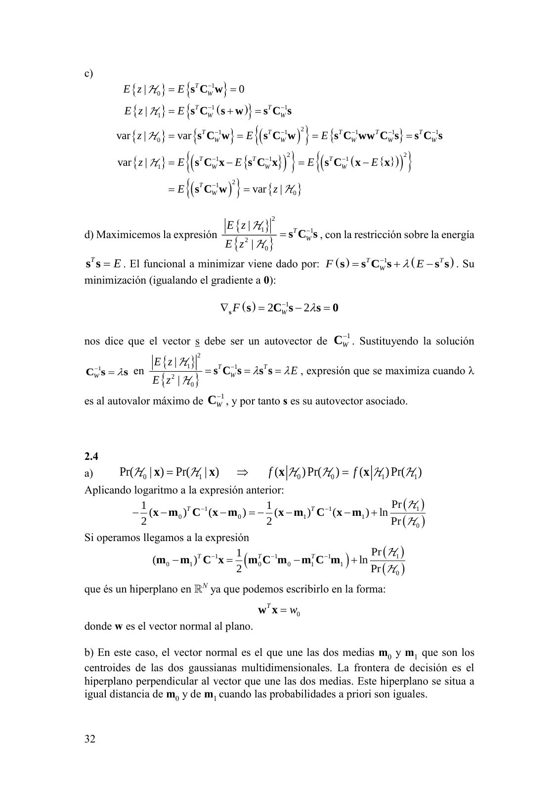

```text
c)
            E z |     0 = E sT CW−1w = 0
            E z |     1 = E s CW s + w  = s CW s
                                T −1
                                      (      ) T −1


          var  z |         = var sT CW−1w = E ( sT CW−1w )  = E sT CW−1wwT CW−1s = sT CW−1s
                                                                                         2
                       0


          var  z |    1         
                            = E ( sT CW−1x − E sT CW−1x)
                                                                             2
                                                                                  = E (s C ( x − E x)) 
                                                                                                 T    −1
                                                                                                      W
                                                                                                                        2


                                 
                            = E ( sT CW−1w )
                                                     2
                                                          = var z |           0


                                                    E z |        
                                                                      2

                                                                          = sT CW−1s , con la restricción sobre la energía
                                                              1
d) Maximicemos la expresión
                                                    E z |2
                                                                  0   
sT s = E . El funcional a minimizar viene dado por: F ( s ) = sT CW−1s +  ( E − sT s ) . Su
minimización (igualando el gradiente a 0):

                                                s F ( s ) = 2CW−1s − 2s = 0

                                                                                                      −1
nos dice que el vector s debe ser un autovector de CW . Sustituyendo la solución
                       E z |        
                                         2

                                             = sT CW−1s = sT s =  E , expresión que se maximiza cuando 
                                 1
C s =  s en
     −1

                      E z |             
     W                       2
                                     0
                                               −1
es al autovalor máximo de CW , y por tanto s es su autovector asociado.


2.4
a)        Pr(     0   | x) = Pr( 1 | x)                              f (x           0   ) Pr(   0   ) = f (x   1   ) Pr( 1 )
Aplicando logaritmo a la expresión anterior:
            1                            1                              Pr (                                                 )
         − (x − m 0 )T C−1 (x − m 0 ) = − (x − m1 )T C−1 (x − m1 ) + ln                                                     1

            2                            2                              Pr (                                                0)

Si operamos llegamos a la expresión
                                                                   Pr ( 1 )
               (m 0 − m1 )T C−1x = ( mT0 C−1m 0 − m1T C−1m1 ) + ln
                                  1
                                  2                                Pr ( 0 )
que és un hiperplano en N ya que podemos escribirlo en la forma:
                                                              w T x = w0
donde w es el vector normal al plano.

b) En este caso, el vector normal es el que une las dos medias m0 y m1 que son los
centroides de las dos gaussianas multidimensionales. La frontera de decisión es el
hiperplano perpendicular al vector que une las dos medias. Este hiperplano se situa a
igual distancia de m0 y de m1 cuando las probabilidades a priori son iguales.


32
```

## Page 20

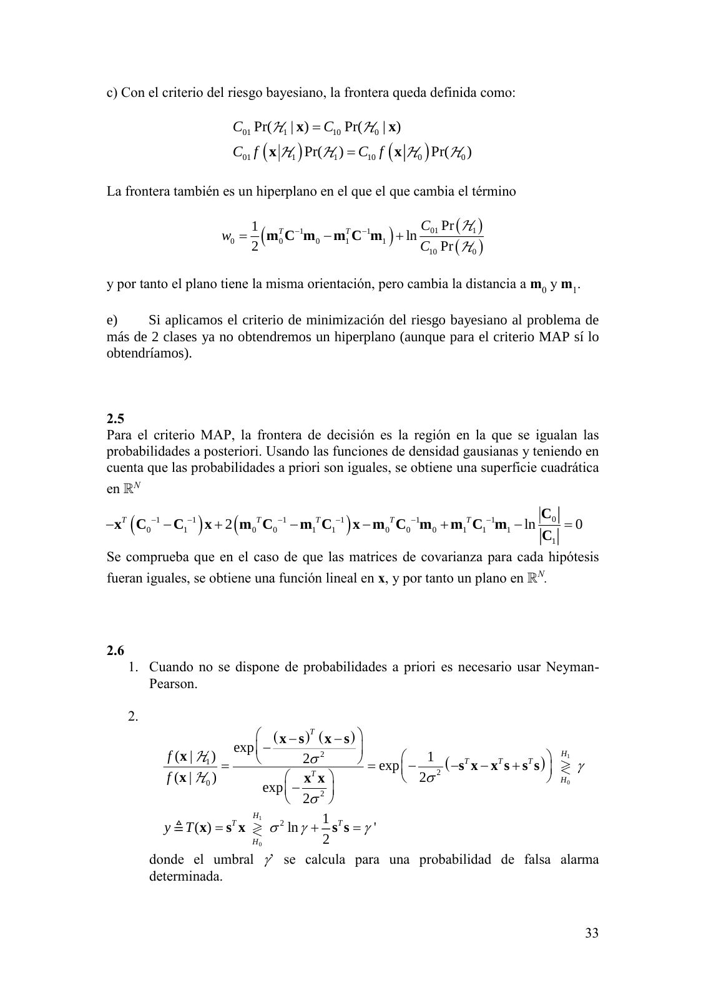

```text
c) Con el criterio del riesgo bayesiano, la frontera queda definida como:

                          C01 Pr(     1   | x) = C10 Pr(         0   | x)
                          C01 f ( x       1   ) Pr(   1   ) = C10 f ( x     0   ) Pr(   0   )

La frontera también es un hiperplano en el que el que cambia el término

                                                               C Pr (                            )
                        w0 =     ( m 0 C m 0 − m1T C−1m1 ) + ln 01
                               1 T −1
                                                               C10 Pr (
                                                                                                1

                               2                                                                0)


y por tanto el plano tiene la misma orientación, pero cambia la distancia a m0 y m1.

e)     Si aplicamos el criterio de minimización del riesgo bayesiano al problema de
más de 2 clases ya no obtendremos un hiperplano (aunque para el criterio MAP sí lo
obtendríamos).


2.5
Para el criterio MAP, la frontera de decisión es la región en la que se igualan las
probabilidades a posteriori. Usando las funciones de densidad gausianas y teniendo en
cuenta que las probabilidades a priori son iguales, se obtiene una superficie cuadrática
en N

−xT ( C0 −1 − C1−1 ) x + 2 ( m 0T C0 −1 − m1T C1−1 ) x − m 0T C0 −1m 0 + m1T C1−1m1 − ln
                                                                              C0
                                                                                 =0
                                                                              C1
Se comprueba que en el caso de que las matrices de covarianza para cada hipótesis
fueran iguales, se obtiene una función lineal en x, y por tanto un plano en N.


2.6
      1. Cuando no se dispone de probabilidades a priori es necesario usar Neyman-
         Pearson.

      2.
                                ( x − s )T ( x − s ) 
                           exp  −                    
                                                     = exp  − 1 ( −sT x − xT s + sT s )  1 
                                                                                              H
              f (x | 1 )                 2   2
                         =                                                                 
              f (x | 0 )              xT x                   2 2                         H0
                                 exp  − 2 
                                      2 
                              H1
                                             1
             y T ( x ) = sT x      2 ln  + sT s =  '
                              H0              2
           donde el umbral ’ se calcula para una probabilidad de falsa alarma
           determinada.


                                                                                                     33
```

## Page 21

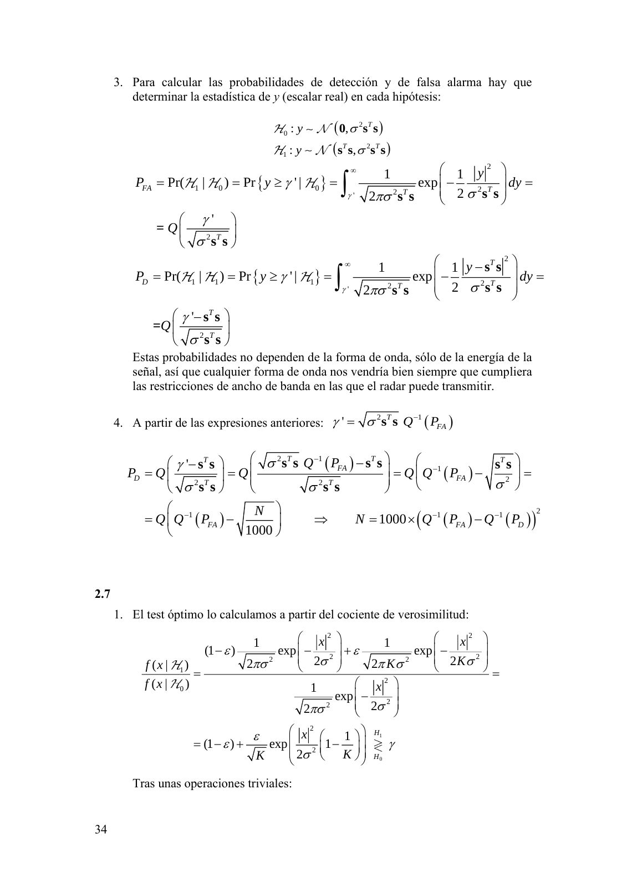

```text
      3. Para calcular las probabilidades de detección y de falsa alarma hay que
         determinar la estadística de y (escalar real) en cada hipótesis:

                                                       0   :y            ( 0,  2sT s )
                                                       1   :y            ( s T s,  2 s T s )
                                                                                                     1 y2 
                                                                        =
                                                                                          1
          PFA = Pr(           |           ) = Pr  y   ' |                                     exp  −           dy =
                      1               0                             0
                                                                              '      2 2 sT s      2  2 sT s 
                                                                                                                 
                  ' 
              = Q
                    2 T 
                   s s
                                                                                                    1 y − sT s 2 
                                                                    =
                                                                                        1
          PD = Pr(        |           ) = Pr  y   ' |                                        exp  −             dy =
                      1           1                             1
                                                                            '       2 2 sT s      2  2 sT s 
                                                                                                                  
                  '− sT s 
             =Q            
                  s s
                      2 T

         Estas probabilidades no dependen de la forma de onda, sólo de la energía de la
         señal, así que cualquier forma de onda nos vendría bien siempre que cumpliera
         las restricciones de ancho de banda en las que el radar puede transmitir.

      4. A partir de las expresiones anteriores:  ' =  s s Q ( PFA )
                                                        2 T   −1


                 '− sT s       2 sT s Q −1 ( P ) − sT s       −1           sT s 
                                                              = Q  Q ( PFA ) −  2  =
        PD = Q                 
                            = Q
                                                   FA
                                                             
                 s s                    2 sT s          
                     2 T


                                 N 
            = Q  Q −1 ( PFA ) −                                                   N = 1000  ( Q −1 ( PFA ) − Q −1 ( PD ) )
                                                                                                                               2
                                                                   
                                1000 


2.7
      1. El test óptimo lo calculamos a partir del cociente de verosimilitud:
                                               x2 
                                                1                1              x 
                                                                                  2

                         (1 −  )         exp  − 2  +                 exp  −      
                                    2 2      2                  2      2 K 2 
            f (x | 1)
                       =                                    2   K                  =
            f (x | 0 )                           1         x   2

                                                      exp  − 2 
                                                2 2      2 
                                                                    
                                            x2       1   H1
                       = (1 −  ) +     exp  2 1 −             
                                      K      2  K   H 0
                                                           
         Tras unas operaciones triviales:


34
```

## Page 22

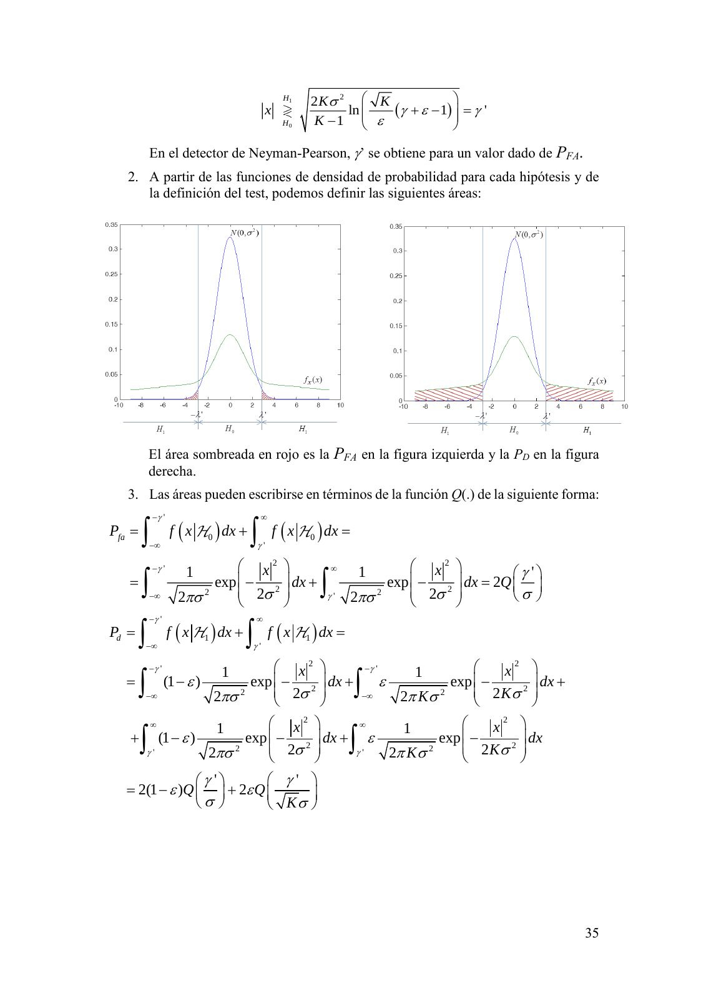

```text
                                              H1
                                                       2 K 2  K              
                                          x                  ln  ( +  − 1)  =  '
                                              H0       K −1                   

            En el detector de Neyman-Pearson, ’ se obtiene para un valor dado de PFA.
   2. A partir de las funciones de densidad de probabilidad para cada hipótesis y de
      la definición del test, podemos definir las siguientes áreas:


            El área sombreada en rojo es la PFA en la figura izquierda y la PD en la figura
            derecha.
   3. Las áreas pueden escribirse en términos de la función Q(.) de la siguiente forma:
            − '                      
Pfa =
           −
                   f (x   0 ) dx +
                                      f (x
                                     '
                                                       0   ) dx =
            − '               x2                     x2            '
                                                          
                     1                         1
   =                      exp  − 2  dx +          exp  − 2  dx = 2Q  
            −      2 2      2        ' 2 2      2            
                                                           
            − '                     
Pd =
         f (x
        −
                          1   ) dx +  f ( x ) dx =
                                      '
                                                   1


            − '               x2           − '                      x 
                                                                           2


                                                                   
                               1                         1
  =      (1 −  )         exp  − 2  dx +                     exp  −          dx +
     −            2 2       2         −              2      2 K 2 
                                                     2  K                    
                             x2                                    x 
                                                                         2


                                                               
                   1                                   1
  + (1 −  )             exp  − 2  dx +                    exp  −         dx
     '           2 2       2         '             2      2 K 2 
                                                   2  K                   
                 '        ' 
  = 2(1 −  )Q   + 2 Q        
                          K 


                                                                                          35
```

## Page 23

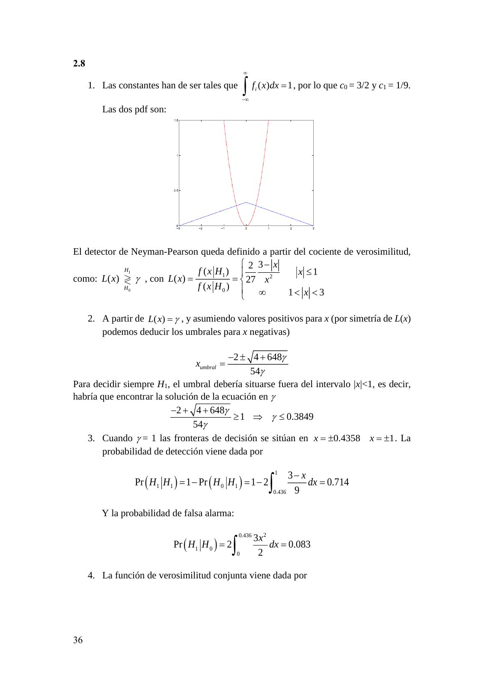

```text
2.8
                                                      

      1. Las constantes han de ser tales que
                                                       f ( x)dx = 1 , por lo que c = 3/2 y c = 1/9.
                                                      −
                                                             i                      0       1


         Las dos pdf son:


El detector de Neyman-Pearson queda definido a partir del cociente de verosimilitud,
                                             2 3− x
             H1                 f ( x H1 )            x 1
como: L( x)      , con L( x) =           =  27 x 2
                                f (x H0 ) 
                                                   1 x  3
             H0


      2. A partir de L( x) =  , y asumiendo valores positivos para x (por simetría de L(x)
         podemos deducir los umbrales para x negativas)

                                         −2  4 + 648
                                    xumbral =
                                              54
Para decidir siempre H1, el umbral debería situarse fuera del intervalo |x|<1, es decir,
habría que encontrar la solución de la ecuación en 
                         −2 + 4 + 648
                                           1    0.3849
                               54
   3. Cuando  = 1 las fronteras de decisión se sitúan en x = 0.4358 x = 1 . La
        probabilidad de detección viene dada por

                                                                       3− x
                                                                 
                                                                     1
                  Pr ( H1 H1 ) = 1 − Pr ( H 0 H1 ) = 1 − 2                  dx = 0.714
                                                                  0.436 9


         Y la probabilidad de falsa alarma:

                                                             3x 2
                                                 
                                                     0.436
                             Pr ( H1 H 0 ) = 2                    dx = 0.083
                                                 0            2

      4. La función de verosimilitud conjunta viene dada por


36
```

## Page 24

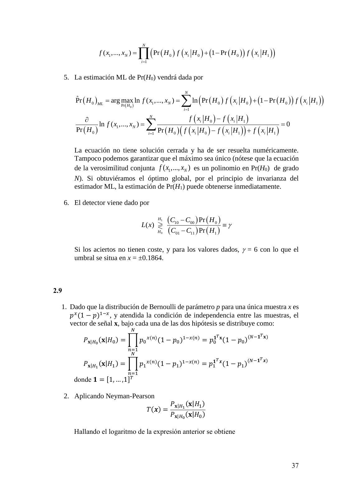

```text
                                             N

                    f ( x1 ,..., xN ) =      ( Pr ( H ) f ( x H ) + (1 − Pr ( H )) f ( x H ))
                                             i =1
                                                          0          i    0              0           i   1


      5. La estimación ML de Pr(H0) vendrá dada por


                                                                 ln ( Pr ( H ) f ( x H ) + (1 − Pr ( H )) f ( x H ))
                                                                   N

         P̂r ( H 0 ) ML = arg max ln f ( x1 ,..., xN ) =                        0        i       0           0        i   1
                               Pr ( H 0 )
                                                                   i =1

                                                             f ( xi H 0 ) − f ( xi H1 )
                                                 
                                             N

                     ln f ( x1 ,..., xN ) =                                                          =0
          Pr ( H 0 )                                           (                             )
                                            i =1 Pr ( H 0 ) f ( xi H 0 ) − f ( xi H1 ) + f ( xi H1 )


         La ecuación no tiene solución cerrada y ha de ser resuelta numéricamente.
         Tampoco podemos garantizar que el máximo sea único (nótese que la ecuación
         de la verosimilitud conjunta f ( x1 ,..., xN ) es un polinomio en Pr(H0) de grado
         N). Si obtuviéramos el óptimo global, por el principio de invarianza del
         estimador ML, la estimación de Pr(H1) puede obtenerse inmediatamente.

      6. El detector viene dado por


                                             L( x)
                                                     H1
                                                          ( C10 − C00 ) Pr ( H 0 )  
                                                     H0   ( C01 − C11 ) Pr ( H1 )

         Si los aciertos no tienen coste, y para los valores dados,  = 6 con lo que el
         umbral se situa en x = ±0.1864.


2.9

  1. Dado que la distribución de Bernoulli de parámetro p para una única muestra x es
     𝑝 𝑥 (1 − 𝑝)1−𝑥 , y atendida la condición de independencia entre las muestras, el
     vector de señal x, bajo cada una de las dos hipótesis se distribuye como:
                                      𝑁
                                                                               𝑇                 (𝑁−𝟏𝑇 𝐱)
             𝑃𝐱|𝐻0 (𝐱|𝐻0 ) = ∏ 𝑝0 𝑥(𝑛) (1 − 𝑝0 )1−𝑥(𝑛) = 𝑝0𝟏 𝐱 (1 − 𝑝0 )
                                    𝑛=1
                                     𝑁
                                                                               𝑇                 (𝑁−𝟏𝑇 𝒙)
             𝑃𝐱|𝐻1 (𝐱|𝐻1 ) = ∏ 𝑝1 𝑥(𝑛) (1 − 𝑝1 )1−𝑥(𝑛) = 𝑝1𝟏 𝒙 (1 − 𝑝1 )
                                    𝑛=1
         donde 𝟏 = [1, … ,1]𝑇

      2. Aplicando Neyman-Pearson
                                                           𝑃𝐱|𝐻1 (𝐱|𝐻1 )
                                                 𝑇(𝒙) =
                                                           𝑃𝐱|𝐻0 (𝐱|𝐻0 )

         Hallando el logaritmo de la expresión anterior se obtiene


                                                                                                                 37
```

## Page 25

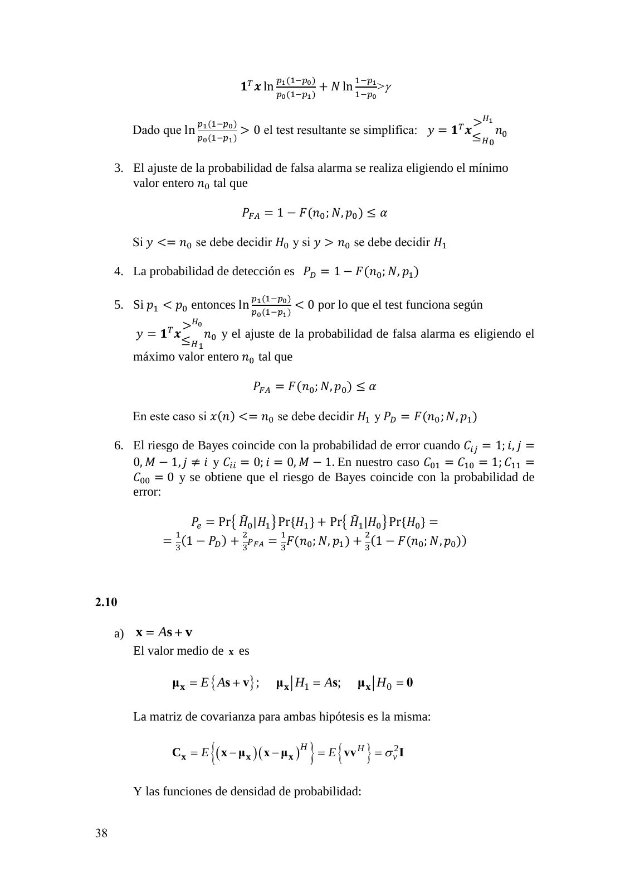

```text
                                        𝑝 (1−𝑝 )            1−𝑝
                               𝟏𝑇 𝒙 ln 𝑝1 (1−𝑝0 ) + 𝑁 ln 1−𝑝1>
                                         0          1           0


                    𝑝 (1−𝑝 )                                                 >𝐻1
        Dado que ln 𝑝1 (1−𝑝0) > 0 el test resultante se simplifica: 𝑦 = 𝟏𝑇 𝒙     𝑛
                     0     1                                                ≤𝐻 0 0

     3. El ajuste de la probabilidad de falsa alarma se realiza eligiendo el mínimo
        valor entero 𝑛0 tal que

                               𝑃𝐹𝐴 = 1 − 𝐹(𝑛0 ; 𝑁, 𝑝0 ) ≤ 𝛼

        Si 𝑦 <= 𝑛0 se debe decidir 𝐻0 y si 𝑦 > 𝑛0 se debe decidir 𝐻1

     4. La probabilidad de detección es 𝑃𝐷 = 1 − 𝐹(𝑛0 ; 𝑁, 𝑝1 )

                                   𝑝 (1−𝑝 )
     5. Si 𝑝1 < 𝑝0 entonces ln 𝑝1 (1−𝑝0 ) < 0 por lo que el test funciona según
                                    0    1
                 >𝐻0
        𝑦 = 𝟏𝑇 𝒙     𝑛 y el ajuste de la probabilidad de falsa alarma es eligiendo el
                ≤𝐻 1 0
        máximo valor entero 𝑛0 tal que

                                   𝑃𝐹𝐴 = 𝐹(𝑛0 ; 𝑁, 𝑝0 ) ≤ 𝛼

        En este caso si 𝑥(𝑛) <= 𝑛0 se debe decidir 𝐻1 y 𝑃𝐷 = 𝐹(𝑛0 ; 𝑁, 𝑝1 )

     6. El riesgo de Bayes coincide con la probabilidad de error cuando 𝐶𝑖𝑗 = 1; 𝑖, 𝑗 =
        0, 𝑀 − 1, 𝑗 ≠ 𝑖 y 𝐶𝑖𝑖 = 0; 𝑖 = 0, 𝑀 − 1. En nuestro caso 𝐶01 = 𝐶10 = 1; 𝐶11 =
        𝐶00 = 0 y se obtiene que el riesgo de Bayes coincide con la probabilidad de
        error:

                               ̂                           ̂
                   𝑃𝑒 = Pr{ 𝐻0 |𝐻1 } Pr{𝐻1 } + Pr{ 𝐻1 |𝐻0 } Pr{𝐻0 } =
                1            2       1                2
              = 3(1 − 𝑃𝐷 ) + 3𝑃𝐹𝐴 = 3𝐹(𝑛0 ; 𝑁, 𝑝1 ) + 3(1 − 𝐹(𝑛0 ; 𝑁, 𝑝0 ))


2.10

     a) x = As + v
        El valor medio de x es

                μ x = E  As + v ;     μ x H1 = As;        μx H0 = 0

        La matriz de covarianza para ambas hipótesis es la misma:


                        
                Cx = E ( x − μ x )( x − μ x )
                                                H
                                                     = E vv  =  I
                                                            H       2
                                                                    v


        Y las funciones de densidad de probabilidad:


38
```

## Page 26

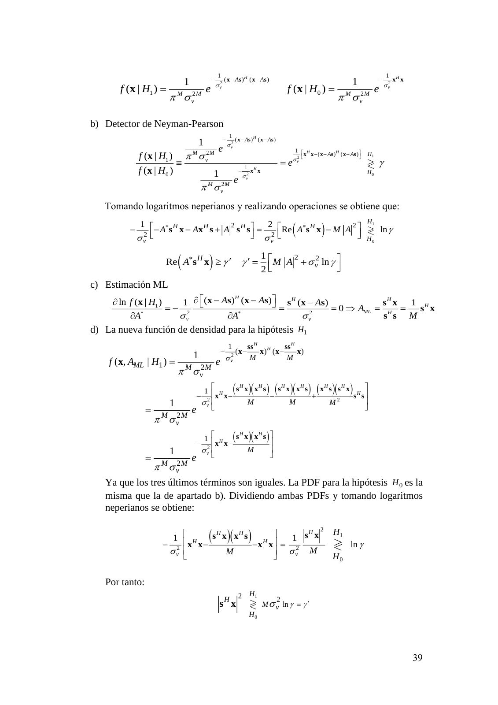

```text
                                                       1                                                                                                      1
                                                  −          ( x − As ) H ( x − As )                                                                     −          xH x
                                  1                    v2                                                                              1                     v2
       f (x | H1 ) =                          e                                                       f ( x | H0 ) =                                 e
                           M  v2 M                                                                                             M  v2 M

b) Detector de Neyman-Pearson
                                                                  1
                                                             −          ( x − As ) H ( x − As )
                                          1                       v2
                                    e                                                                     1  H
             f (x | H1 )  M  v2 M                                                                          x x − ( x − As ) H ( x − As ) 
                                                                                                          v2 
                                                                                                                                                H1
                                                                                1
                                                                                                    =e                                               
             f (x | H0 )           1                                        −
                                                                                 v2
                                                                                       xH x                                                     H0
                                                                        e
                                           M  v2 M
   Tomando logaritmos neperianos y realizando operaciones se obtiene que:

                                                                                                         (              )
                                                                            H1
              1   H                    2 H     2         H         2
         −          − A s x − Ax H
                                   s + A  s s   =       Re A s  x − M A        ln 
              2 
              v
                                                2                   
                                                                            H                   v                                                0


                              (
                       Re As H x          )                             =
                                                                                              1
                                                                                              2 
                                                                                                
                                                                                                  M A +  v2 ln  
                                                                                                     2
                                                                                                                   
c) Estimación ML
                           1  (x − As) (x − As)  s H (x − As)
                                                                        H
      ln f (x | H1 )                                                          sH x   1 H
                      = −                            =             = 0  A   =      =  s x
          A  
                          v           A 
                                                           v
                            2                                2            ML    H
                                                                               s s M
d) La nueva función de densidad para la hipótesis H1
                                                                 1                   ss H H      ss H
                                                          −             (x−              x) ( x−      x)
                                      1                        v2                    M           M
    f (x, AML | H1 ) =                                e
                                v2 M
                                  M


                                       −
                                        1  H
                                              x x −
                                                    sH x xH s
                                                              −
                                                                      ( )( ) ( )( ) ( )( )
                                                                sH x xH s
                                                                          +
                                                                            xH s sH x H 
                                                                                      s s
                          1             v2            M           M          M2        
                =                     e                                                 
                      v2 M
                      M


                                       −
                                        1  H
                                              x x −
                                                    sH x xH s 
                                                              
                                                                      ( )( )
                          1             v2            M     
                =                     e                      
                     M  v2 M
   Ya que los tres últimos términos son iguales. La PDF para la hipótesis H 0 es la
   misma que la de apartado b). Dividiendo ambas PDFs y tomando logaritmos
   neperianos se obtiene:

                                              ( )( )
                                                                                                                       2
                        1  H                
                               sH x xH s
                                                   H                                                                          H1
                                                1 s x
                          
                      − 2 x x−             H 
                                         −x x = 2                                                                                      ln 
                       v         M          v M
                                                                                                                           H0

   Por tanto:
                                                                         2 H1
                                                        sH x                                  M  v ln  =  
                                                                                                  2
                                                                                       H0


                                                                                                                                                                           39
```

## Page 27

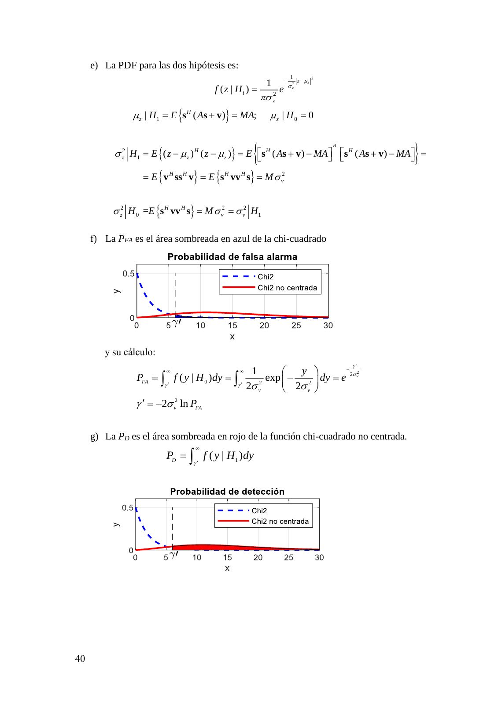

```text
     e) La PDF para las dos hipótesis es:
                                                                        1
                                                                              z − z
                                                                                       2
                                                                   −
                                                        1               z2
                                       f (z | Hi ) =           e
                                                        z2
                z | H1 = E s H ( As + v ) = MA;        z | H 0 = 0


                                                                                                   
           z2 H1 = E ( z −  z ) H ( z −  z ) = E s H ( As + v) − MA s H ( As + v) − MA =
                                                                                           H


                  = E  v H ss H v = E s H vv H s = M  v2


           z2 H 0 =E s H vv H s = M  v2 =  v2 H1

     f) La PFA es el área sombreada en azul de la chi-cuadrado


        y su cálculo:
                                                                                               
                                                 1       y          − 2
                PFA =   f ( y | H 0 )dy =       exp   −
                                                         2 2  dy = e  2 v
                                             2 2
                                                  v         v 

                  = −2 v ln PFA
                          2


     g) La PD es el área sombreada en rojo de la función chi-cuadrado no centrada.
                                 
                         PD =   f ( y | H1 )dy
                                 


40
```

## Page 28

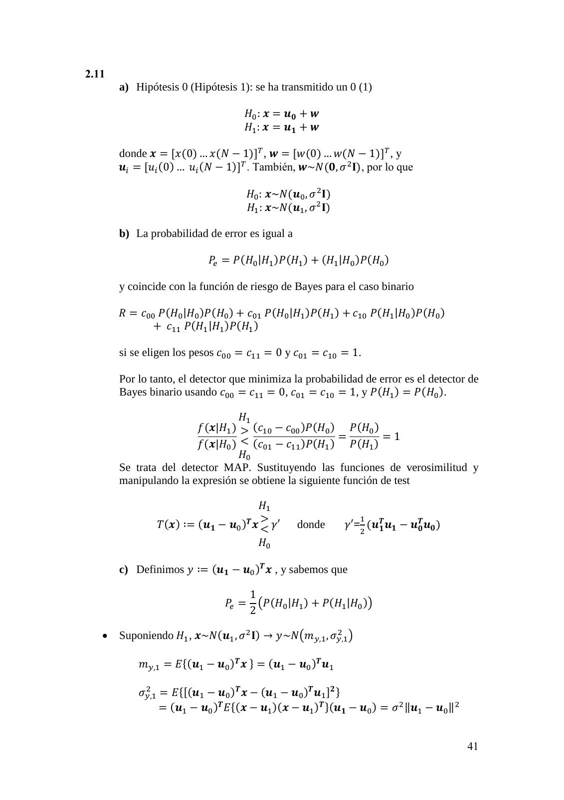

```text
2.11
       a) Hipótesis 0 (Hipótesis 1): se ha transmitido un 0 (1)

                                   𝐻0 : 𝒙 = 𝒖𝟎 + 𝒘
                                   𝐻1 : 𝒙 = 𝒖𝟏 + 𝒘

       donde 𝒙 = [𝑥(0) … 𝑥(𝑁 − 1)]𝑇 , 𝒘 = [𝑤(0) … 𝑤(𝑁 − 1)]𝑇 , y
       𝒖𝑖 = [𝑢𝑖 (0) … 𝑢𝑖 (𝑁 − 1)]𝑇 . También, 𝒘~𝑁(𝟎, 𝜎 2 𝐈), por lo que

                                   𝐻0 : 𝒙~𝑁(𝒖0 , 𝜎 2 𝐈)
                                   𝐻1 : 𝒙~𝑁(𝒖1 , 𝜎 2 𝐈)

       b) La probabilidad de error es igual a

                           𝑃𝑒 = 𝑃(𝐻0 |𝐻1 )𝑃(𝐻1 ) + (𝐻1|𝐻0 )𝑃(𝐻0 )

       y coincide con la función de riesgo de Bayes para el caso binario

       𝑅 = 𝑐00 𝑃(𝐻0 |𝐻0 )𝑃(𝐻0 ) + 𝑐01 𝑃(𝐻0 |𝐻1 )𝑃(𝐻1 ) + 𝑐10 𝑃(𝐻1 |𝐻0 )𝑃(𝐻0 )
              + 𝑐11 𝑃(𝐻1 |𝐻1 )𝑃(𝐻1 )

       si se eligen los pesos 𝑐00 = 𝑐11 = 0 y 𝑐01 = 𝑐10 = 1.

       Por lo tanto, el detector que minimiza la probabilidad de error es el detector de
       Bayes binario usando 𝑐00 = 𝑐11 = 0, 𝑐01 = 𝑐10 = 1, y 𝑃(𝐻1 ) = 𝑃(𝐻0 ).

                                𝐻1
                       𝑓(𝒙|𝐻1 ) > (𝑐10 − 𝑐00 )𝑃(𝐻0 ) 𝑃(𝐻0 )
                                                       =        =1
                       𝑓(𝒙|𝐻0 ) < (𝑐01 − 𝑐11 )𝑃(𝐻1 ) 𝑃(𝐻1 )
                                𝐻0
       Se trata del detector MAP. Sustituyendo las funciones de verosimilitud y
       manipulando la expresión se obtiene la siguiente función de test

                                    𝐻1
                                     >                       1
               𝑇(𝒙) ∶= (𝒖𝟏 − 𝒖0 )𝑻 𝒙 < 𝛾′       donde     𝛾′=2 (𝒖𝑻𝟏 𝒖𝟏 − 𝒖𝑻𝟎 𝒖𝟎 )
                                    𝐻0

       c) Definimos 𝑦 ∶= (𝒖𝟏 − 𝒖0 )𝑻 𝒙 , y sabemos que

                                     1
                              𝑃𝑒 =     (𝑃(𝐻0 |𝐻1 ) + 𝑃(𝐻1 |𝐻0 ))
                                     2

   •                                                 2
       Suponiendo 𝐻1 , 𝒙~𝑁(𝒖1 , 𝜎 2 𝐈) → 𝑦~𝑁(𝑚𝑦,1 , 𝜎𝑦,1 )

           𝑚𝑦,1 = 𝐸{(𝒖1 − 𝒖0 )𝑻 𝒙 } = (𝒖1 − 𝒖0 )𝑻 𝒖1

            2
           𝜎𝑦,1 = 𝐸{[(𝒖1 − 𝒖0 )𝑻 𝒙 − (𝒖1 − 𝒖0 )𝑻 𝒖1 ]𝟐 }
                = (𝒖1 − 𝒖0 )𝑻 𝐸{(𝒙 − 𝒖1 )(𝒙 − 𝒖1 )𝑻 }(𝒖𝟏 − 𝒖0 ) = 𝜎 2 ‖𝒖1 − 𝒖0 ‖2


                                                                                     41
```

## Page 29

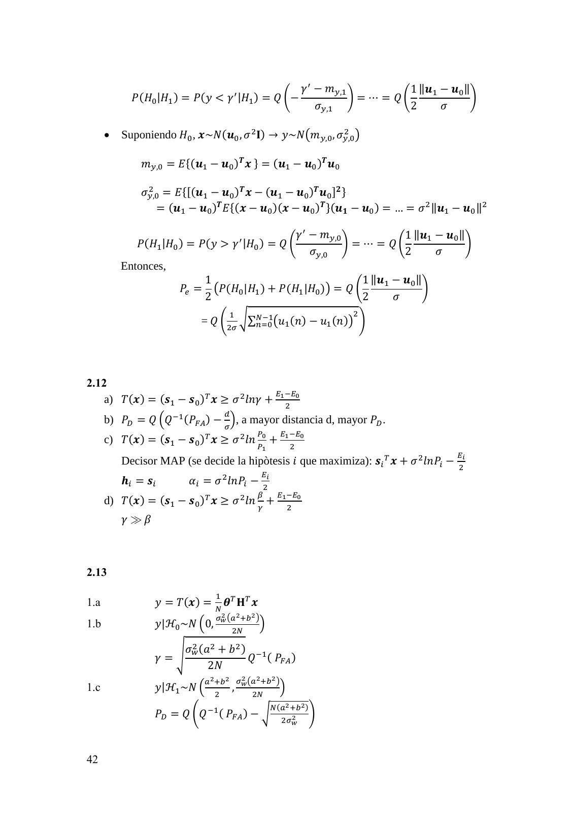

```text
                                                           𝛾 ′ − 𝑚𝑦,1            1 ‖𝒖1 − 𝒖0 ‖
            𝑃(𝐻0 |𝐻1 ) = 𝑃(𝑦 < 𝛾 ′ |𝐻1 ) = 𝑄 (−                       ) = ⋯ = 𝑄(              )
                                                               𝜎𝑦,1              2     𝜎

      •                                                 2
          Suponiendo 𝐻0 , 𝒙~𝑁(𝒖0 , 𝜎 2 𝐈) → 𝑦~𝑁(𝑚𝑦,0 , 𝜎𝑦,0 )

              𝑚𝑦,0 = 𝐸{(𝒖1 − 𝒖0 )𝑻 𝒙 } = (𝒖1 − 𝒖0 )𝑻 𝒖0

               2
              𝜎𝑦,0 = 𝐸{[(𝒖1 − 𝒖0 )𝑻 𝒙 − (𝒖1 − 𝒖0 )𝑻 𝒖0 ]𝟐 }
                 = (𝒖1 − 𝒖0 )𝑻 𝐸{(𝒙 − 𝒖0 )(𝒙 − 𝒖0 )𝑻 }(𝒖𝟏 − 𝒖0 ) = … = 𝜎 2 ‖𝒖1 − 𝒖0 ‖2

                              ′ |𝐻 )
                                           𝛾 ′ − 𝑚𝑦,0             1 ‖𝒖1 − 𝒖0 ‖
                  |𝐻 )
             𝑃(𝐻1 0 = 𝑃(𝑦 > 𝛾 0 = 𝑄 (                 ) = ⋯ = 𝑄(               )
                                               𝜎𝑦,0               2      𝜎
          Entonces,
                         1                                1 ‖𝒖1 − 𝒖0 ‖
                     𝑃𝑒 = (𝑃(𝐻0 |𝐻1 ) + 𝑃(𝐻1 |𝐻0 )) = 𝑄 (              )
                         2                                2     𝜎
                                       1                             2
                           = 𝑄 (2𝜎 √∑𝑁−1
                                     𝑛=0 (𝑢1 (𝑛) − 𝑢1 (𝑛)) )


2.12
                                      𝐸 −𝐸
   a) 𝑇(𝒙) = (𝒔1 − 𝒔0 )𝑇 𝒙 ≥ 𝜎 2 𝑙𝑛𝛾 + 1 2 0
                                   𝑑
      b) 𝑃𝐷 = 𝑄 (𝑄 −1 (𝑃𝐹𝐴 ) − ), a mayor distancia d, mayor 𝑃𝐷 .
                                   𝜎
                                           𝑃        𝐸 −𝐸
      c) 𝑇(𝒙) = (𝒔1 − 𝒔0 )𝑇 𝒙 ≥ 𝜎 2 𝑙𝑛 𝑃0 + 1 2 0
                                              1
                                                                                           𝐸
          Decisor MAP (se decide la hipòtesis 𝑖 que maximiza): 𝒔𝑖 𝑇 𝒙 + 𝜎 2 𝑙𝑛𝑃𝑖 − 2𝑖
                                              𝐸
          𝒉𝑖 = 𝒔𝑖       𝛼𝑖 = 𝜎 2 𝑙𝑛𝑃𝑖 − 2𝑖
                                           𝛽       𝐸 −𝐸
      d) 𝑇(𝒙) = (𝒔1 − 𝒔0 )𝑇 𝒙 ≥ 𝜎 2 𝑙𝑛 𝛾 + 1 2 0
          𝛾𝛽


2.13
                               1
1.a              𝑦 = 𝑇(𝒙) = 𝑁 𝜽𝑇 𝐇 𝑇 𝒙
                               𝜎2 (𝑎2 +𝑏2 )
1.b              𝑦|ℋ0 ~𝑁 (0, 𝑤 2𝑁           )

                      𝜎𝑤2 (𝑎2 + 𝑏 2 ) −1
                 𝛾= √                𝑄 ( 𝑃𝐹𝐴 )
                            2𝑁
                                      2 (𝑎2 +𝑏2 )
                             𝑎2 +𝑏 2 𝜎𝑤
1.c              𝑦|ℋ1 ~𝑁 (             ,            )
                               2           2𝑁
                                                  𝑁(𝑎2 +𝑏2 )
                 𝑃𝐷 = 𝑄 (𝑄 −1 ( 𝑃𝐹𝐴 ) − √             2     )
                                                    2𝜎𝑤


42
```

## Page 30

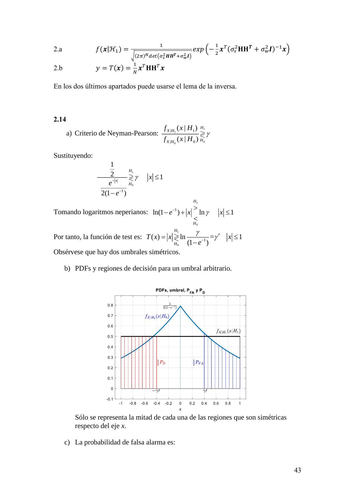

```text
                                          1                                1
2.a             𝑓(𝒙|ℋ1 ) =                                     𝑒𝑥𝑝 (− 2 𝒙𝑇 (𝜎𝑠2 𝐇𝐇 𝑻 + 𝜎𝑤2 𝑰)−1 𝒙)
                               √(2𝜋)𝑁 𝑑𝑒𝑡(𝜎𝑠2 𝑯𝑯𝑻 +𝜎𝑤
                                                    2 𝑰)

                                1
2.b             𝑦 = 𝑇(𝒙) = 𝑁 𝒙𝑇 𝐇𝐇 𝑇 𝒙

En los dos últimos apartados puede usarse el lema de la inversa.


2.14
                                              f X |H1 ( x | H1 ) H1
       a) Criterio de Neyman-Pearson:                                  
                                              f X |H0 ( x | H 0 ) H0

Sustituyendo:
                      1
                              H1
                      2
                       −x
                                     x 1
                     e        H0

                  2(1 − e−1 )
                                                               H1
                                                               
Tomando logaritmos neperianos: ln(1 − e−1 ) + x                     ln        x 1
                                                               
                                                               H0
                                                   H1
                                                                 
Por tanto, la función de test es: T ( x) = x            ln              =      x 1
                                                   H0        (1 − e−1 )
Obsérvese que hay dos umbrales simétricos.

      b) PDFs y regiones de decisión para un umbral arbitrario.


         Sólo se representa la mitad de cada una de las regiones que son simétricas
         respecto del eje x.

      c) La probabilidad de falsa alarma es:


                                                                                                     43
```

## Page 31

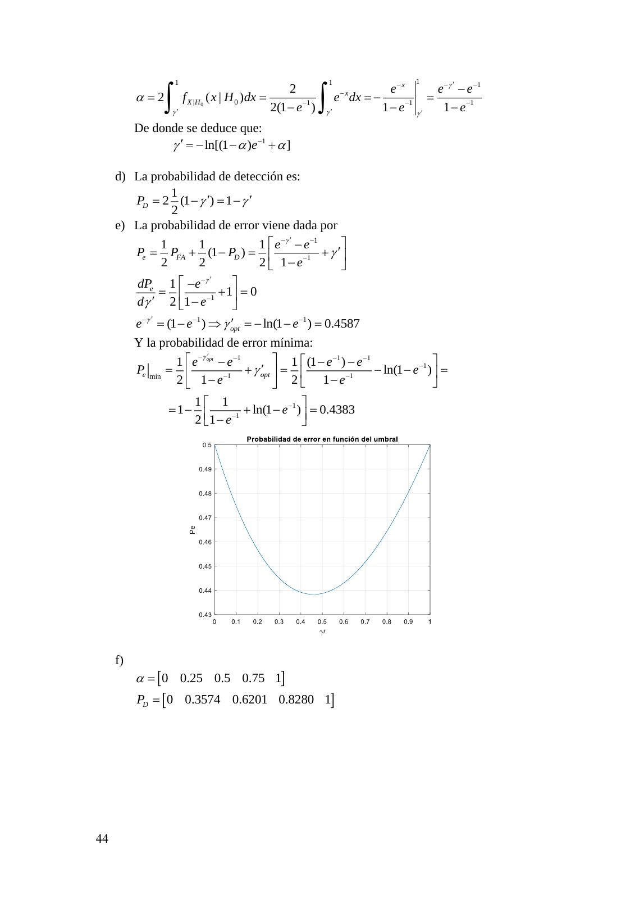

```text
                                                                                 1


                                                        
                                                                        e− x         e −  − e −1
                     1                                       1
                                             2
           = 2 f X |H 0 ( x | H 0 )dx =                         −x
                                                             e dx = −              =
                                       2(1 − e −1 )               1 − e −1      1 − e −1
          De donde se deduce que:
                  = − ln[(1 −  )e−1 +  ]

     d) La probabilidad de detección es:
               1
        PD = 2 (1 −  ) = 1 −  
               2
     e) La probabilidad de error viene dada por
             1      1              1  e−  − e−1      
        Pe = PFA + (1 − PD ) =                −1
                                                   +  
             2      2              2  1− e             
          dPe 1  −e −       
               =           + 1 = 0
          d   2 1 − e −1
                               
                                   = − ln(1 − e −1 ) = 0.4587
          e−  = (1 − e −1 )   opt
          Y la probabilidad de error mínima:
                          − 
                    1  e opt − e −1           1  (1 − e −1 ) − e −1                 
          Pe min =             −1
                                      +  
                                          opt  =             −1
                                                                       − ln(1 − e −1 )  =
                    2  1− e                   2  1− e                               
                      1 1                        
                  = 1−        −1
                                  + ln(1 − e −1 )  = 0.4383
                      2 1 − e                    


     f)
           =  0 0.25 0.5 0.75 1
          PD =  0 0.3574 0.6201 0.8280 1


44
```

## Page 32

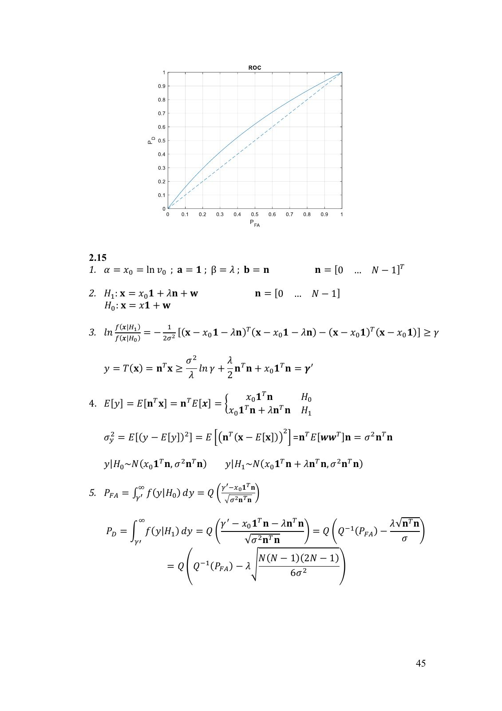

```text
2.15
1. 𝛼 = 𝑥0 = ln 𝑣0 ; 𝐚 = 𝟏 ; β = 𝜆 ; 𝐛 = 𝐧                    𝐧 = [0   … 𝑁 − 1]𝑇

2. 𝐻1 : 𝐱 = 𝑥0 𝟏 + 𝜆𝐧 + 𝐰                     𝐧 = [0 … 𝑁 − 1]
   𝐻0 : 𝐱 = 𝑥𝟏 + 𝐰

      𝑓(𝒙|𝐻 )      1
3. 𝑙𝑛 𝑓(𝒙|𝐻1 ) = − 2𝜎2 [(𝐱 − 𝑥0 𝟏 − 𝜆𝐧)𝑇 (𝐱 − 𝑥0 𝟏 − 𝜆𝐧) − (𝐱 − 𝑥0 𝟏)𝑇 (𝐱 − 𝑥0 𝟏)] ≥ 𝛾
           0


                       𝜎2       𝜆
   𝑦 = 𝑇(𝐱) = 𝐧𝑇 𝐱 ≥      𝑙𝑛 𝛾 + 𝐧𝑇 𝐧 + 𝑥0 𝟏𝑇 𝐧 = 𝜸′
                       𝜆        2

                                       𝑥0 𝟏𝑇 𝐧          𝐻0
4. 𝐸[𝑦] = 𝐸[𝐧𝑇 𝐱] = 𝐧𝑇 𝐸[𝒙] = {
                                   𝑥0 𝟏𝑇 𝐧 + 𝜆𝐧𝑇 𝐧      𝐻1
                                                    2
   𝜎𝑦2 = 𝐸[(𝑦 − 𝐸[𝑦])2 ] = 𝐸 [(𝐧𝑇 (𝐱 − 𝐸[𝐱])) ] =𝐧𝑇 𝐸[𝒘𝒘𝑇 ]𝐧 = 𝜎 2 𝐧𝑇 𝐧

   𝑦|𝐻0 ~𝑁(𝑥0 𝟏𝑇 𝐧, 𝜎 2 𝐧𝑇 𝐧)     𝑦|𝐻1 ~𝑁(𝑥0 𝟏𝑇 𝐧 + 𝜆𝐧𝑇 𝐧, 𝜎 2 𝐧𝑇 𝐧)

               ∞                 𝛾′ −𝑥0 𝟏𝑇 𝐧
5. 𝑃𝐹𝐴 = ∫𝛾′ 𝑓(𝑦|𝐻0 ) 𝑑𝑦 = 𝑄 (                )
                                  √𝜎 2 𝐧𝑇 𝐧

               ∞
                                𝛾 ′ − 𝑥0 𝟏𝑇 𝐧 − 𝜆𝐧𝑇 𝐧                          𝜆√𝐧𝑇 𝐧
    𝑃𝐷 = ∫ 𝑓(𝑦|𝐻1 ) 𝑑𝑦 = 𝑄 (                            ) = 𝑄 (𝑄 −1 (𝑃𝐹𝐴 ) −          )
           𝛾′                           √𝜎 2 𝐧𝑇 𝐧                                𝜎

                                               𝑁(𝑁 − 1)(2𝑁 − 1)
                   = 𝑄 (𝑄 −1 (𝑃𝐹𝐴 ) − 𝜆√                        )
                                                     6𝜎 2


                                                                                    45
```

## Page 33

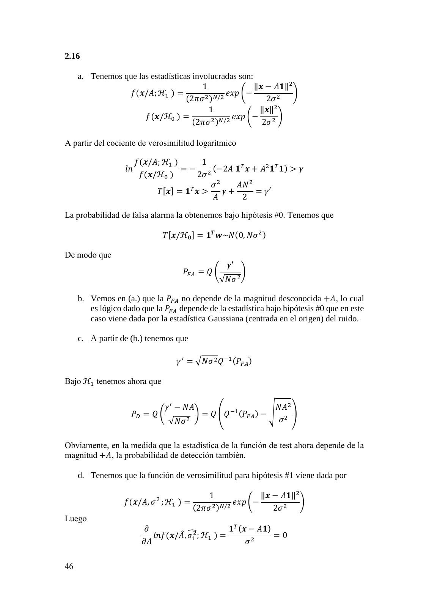

```text
2.16

     a. Tenemos que las estadísticas involucradas son:
                                        1              ‖𝒙 − 𝐴𝟏‖2
                  𝑓(𝒙/𝐴; ℋ1 ) =                𝑒𝑥𝑝 (−            )
                                   (2𝜋𝜎 2 )𝑁/2            2𝜎 2
                                          1             ‖𝒙‖2
                      𝑓(𝒙/ℋ0 ) =                 𝑒𝑥𝑝 (−       )
                                     (2𝜋𝜎 2 )𝑁/2         2𝜎 2

A partir del cociente de verosimilitud logarítmico

                       𝑓(𝒙/𝐴; ℋ1 )      1
                  𝑙𝑛               = − 2 (−2𝐴 𝟏𝑇 𝒙 + 𝐴2 𝟏𝑇 𝟏) > 𝛾
                        𝑓(𝒙/ℋ0 )       2𝜎
                                     𝑇
                                          𝜎2    𝐴𝑁 2
                            𝑇[𝒙] = 𝟏 𝒙 >     𝛾+      = 𝛾′
                                          𝐴      2

La probabilidad de falsa alarma la obtenemos bajo hipótesis #0. Tenemos que

                                𝑇[𝒙/ℋ0 ] = 𝟏𝑇 𝒘~𝑁(0, 𝑁𝜎 2 )

De modo que
                                                  𝛾′
                                     𝑃𝐹𝐴 = 𝑄 (           )
                                                 √𝑁𝜎 2

     b. Vemos en (a.) que la 𝑃𝐹𝐴 no depende de la magnitud desconocida +𝐴, lo cual
        es lógico dado que la 𝑃𝐹𝐴 depende de la estadística bajo hipótesis #0 que en este
        caso viene dada por la estadística Gaussiana (centrada en el origen) del ruido.

     c. A partir de (b.) tenemos que

                                   𝛾 ′ = √𝑁𝜎 2 𝑄 −1 (𝑃𝐹𝐴 )

Bajo ℋ1 tenemos ahora que

                            𝛾 ′ − 𝑁𝐴                       𝑁𝐴2
                    𝑃𝐷 = 𝑄 (         ) = 𝑄 (𝑄 −1 (𝑃𝐹𝐴 ) − √ 2 )
                             √𝑁𝜎 2                          𝜎

Obviamente, en la medida que la estadística de la función de test ahora depende de la
magnitud +𝐴, la probabilidad de detección también.

     d. Tenemos que la función de verosimilitud para hipótesis #1 viene dada por

                            2           1              ‖𝒙 − 𝐴𝟏‖2
                  𝑓(𝒙/𝐴, 𝜎 ; ℋ1 ) =             𝑒𝑥𝑝 (−           )
                                    (2𝜋𝜎 2 )𝑁/2           2𝜎 2
Luego
                                                 𝑇
                         𝜕           ̂2 ; ℋ ) = 𝟏 (𝒙 − 𝐴𝟏) = 0
                           𝑙𝑛𝑓(𝒙/𝐴̂, 𝜎1    1
                        𝜕𝐴                          𝜎2

46
```

## Page 34

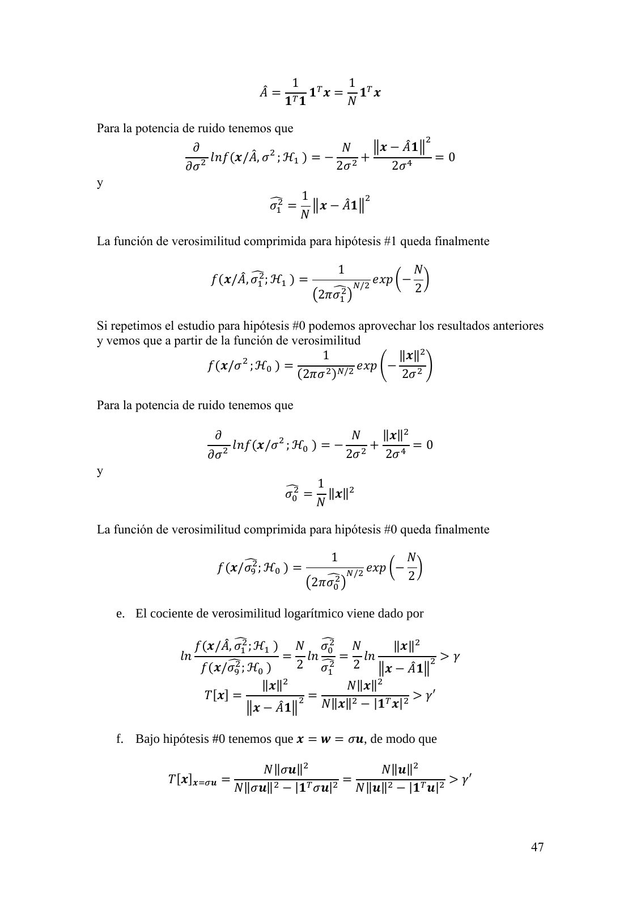

```text
                                       1 𝑇     1
                               𝐴̂ =    𝑇
                                          𝟏 𝒙 = 𝟏𝑇 𝒙
                                      𝟏 𝟏      𝑁

Para la potencia de ruido tenemos que
                                                             2
                   𝜕             2           𝑁     ‖𝒙 − 𝐴̂𝟏‖
                              ̂
                       𝑙𝑛𝑓(𝒙/𝐴, 𝜎 ; ℋ1 ) = − 2 +               =0
                 𝜕𝜎 2                       2𝜎        2𝜎 4
y
                                 ̂2 = 1 ‖𝒙 − 𝐴̂𝟏‖2
                                 𝜎 1
                                      𝑁

La función de verosimilitud comprimida para hipótesis #1 queda finalmente

                             ̂2 ; ℋ ) =       1                 𝑁
                     𝑓(𝒙/𝐴̂, 𝜎1    1                𝑁/2
                                                          𝑒𝑥𝑝 (− )
                                             ̂2 )               2
                                          (2𝜋𝜎1


Si repetimos el estudio para hipótesis #0 podemos aprovechar los resultados anteriores
y vemos que a partir de la función de verosimilitud
                                            1              ‖𝒙‖2
                      𝑓(𝒙/𝜎 2 ; ℋ0 ) =              𝑒𝑥𝑝 (−      )
                                        (2𝜋𝜎 2 )𝑁/2        2𝜎 2

Para la potencia de ruido tenemos que

                      𝜕          2           𝑁   ‖𝒙‖2
                          𝑙𝑛𝑓(𝒙/𝜎 ; ℋ0 ) = − 2 +      =0
                     𝜕𝜎 2                   2𝜎   2𝜎 4
y
                                      ̂2 = 1 ‖𝒙‖2
                                      𝜎0
                                           𝑁

La función de verosimilitud comprimida para hipótesis #0 queda finalmente

                           ̂2 ; ℋ ) =        1                 𝑁
                       𝑓(𝒙/𝜎9    0                 𝑁/2
                                                         𝑒𝑥𝑝 (− )
                                            ̂2 )               2
                                         (2𝜋𝜎0


    e. El cociente de verosimilitud logarítmico viene dado por

                           ̂2 ; ℋ ) 𝑁 𝜎
                   𝑓(𝒙/𝐴̂, 𝜎                 ̂2 𝑁        ‖𝒙‖2
                             1     1          0
                𝑙𝑛                    = 𝑙𝑛      = 𝑙𝑛              >𝛾
                    𝑓(𝒙/𝜎̂2 ; ℋ )       2 𝜎  ̂2 2 ‖𝒙 − 𝐴̂𝟏‖2
                           9     0            1
                                  ‖𝒙‖2           𝑁‖𝒙‖2
                     𝑇[𝒙] =              2 = 𝑁‖𝒙‖2 − |𝟏𝑇 𝒙|2 > 𝛾′
                               ‖𝒙 − 𝐴̂𝟏‖

    f. Bajo hipótesis #0 tenemos que 𝒙 = 𝒘 = 𝜎𝒖, de modo que

                              𝑁‖𝜎𝒖‖2           𝑁‖𝒖‖2
             𝑇[𝒙]𝒙=𝜎𝒖 =                    =                > 𝛾′
                          𝑁‖𝜎𝒖‖2 − |𝟏𝑇 𝜎𝒖|2 𝑁‖𝒖‖2 − |𝟏𝑇 𝒖|2


                                                                                   47
```

## Page 35

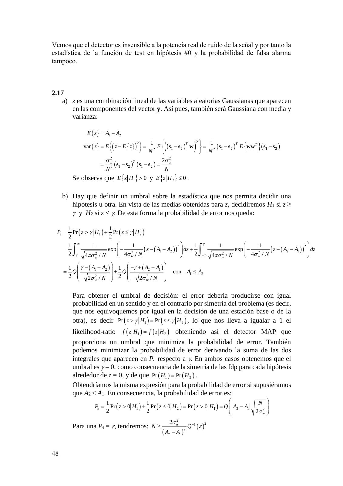

```text
Vemos que el detector es insensible a la potencia real de ruido de la señal y por tanto la
estadística de la función de test en hipótesis #0 y la probabilidad de falsa alarma
tampoco.


2.17
   a) z es una combinación lineal de las variables aleatorias Gaussianas que aparecen
      en las componentes del vector y. Así pues, también será Gaussiana con media y
      varianza:

                E  z = A1 − A2

                             
               var  z = E ( z − E  z )         = N1 E ((s − s ) w )  = N1 (s − s ) E ww  (s − s )
                                              2                                T        2                            T       T
                                                       2           1       2                            2   1    2                 1     2


                            w2                                2 w2
                       =       2
                                 ( s1 − s2 )T ( s1 − s 2 ) =
                           N                                    N
         Se observa que E  z H1   0 y E  z H 2   0 .

     b) Hay que definir un umbral sobre la estadística que nos permita decidir una
        hipótesis u otra. En vista de las medias obtenidas para z, decidiremos H1 si z ≥
         y H2 si z < . De esta forma la probabilidad de error nos queda:

         Pr ( z   H1 ) + Pr ( z   H 2 )
       1                  1
  Pe =
       2                  2
                                                            2
                                                                                                                                                    2
                                          ( z − ( A1 − A2 ) )  dz +
                                                                                                                                  ( z − ( A2 − A1 ) )  dz
       1           1                 1                                 1                                    1                1
     =                    exp  − 2                                                                               exp  − 2
       2  4 2 / N
                    w            4 w / N                            2                    −          4 w2 / N       4 w / N                      

      1   − ( A1 − A2 )  1  − + ( A2 − A1 ) 
     = Q                    + Q                                       con A1  A2
      2  2 2 / N  2              2 w2 / N 
                w              

         Para obtener el umbral de decisión: el error debería producirse con igual
         probabilidad en un sentido y en el contrario por simetría del problema (es decir,
         que nos equivoquemos por igual en la decisión de una estación base o de la
         otra), es decir Pr ( z   H1 ) = Pr ( z   H 2 ) , lo que nos lleva a igualar a 1 el
         likelihood-ratio             f ( z H1 ) = f ( z H 2 )         obteniendo así el detector MAP que
         proporciona un umbral que minimiza la probabilidad de error. También
         podemos minimizar la probabilidad de error derivando la suma de las dos
         integrales que aparecen en Pe respecto a . En ambos casos obtenemos que el
         umbral es  = 0, como consecuencia de la simetría de las fdp para cada hipótesis
         alrededor de z = 0, y de que Pr ( H1 ) = Pr ( H 2 ) .
         Obtendríamos la misma expresión para la probabilidad de error si supusiéramos
         que A2 < A1. En consecuencia, la probabilidad de error es:
                                                                                                                              N 
                             Pr ( z  0 H1 ) + Pr ( z  0 H 2 ) = Pr ( z  0 H1 ) = Q  A2 − A1
                           1                  1
                    Pe =                                                                                                            
                           2                  2                                                                              2 w2 
                                                                                      
                                                                   2 w2
         Para una Pe = , tendremos: N                                            Q −1 (  )
                                                                                                    2

                                                               ( A2 − A1 )     2


48
```

## Page 36

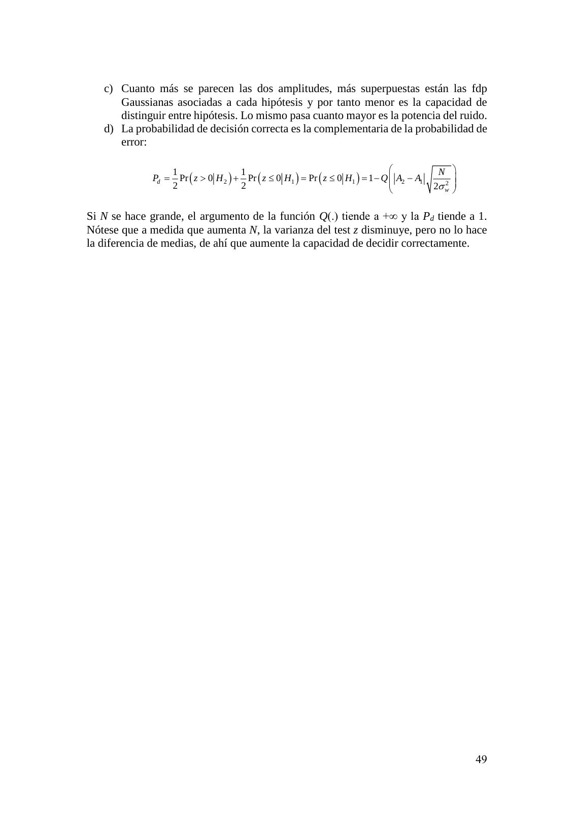

```text
   c) Cuanto más se parecen las dos amplitudes, más superpuestas están las fdp
      Gaussianas asociadas a cada hipótesis y por tanto menor es la capacidad de
      distinguir entre hipótesis. Lo mismo pasa cuanto mayor es la potencia del ruido.
   d) La probabilidad de decisión correcta es la complementaria de la probabilidad de
      error:

                                                                                               N 
                      Pr ( z  0 H 2 ) + Pr ( z  0 H1 ) = Pr ( z  0 H1 ) = 1 − Q  A2 − A1
                    1                   1
             Pd =                                                                                    
                    2                   2                                                     2 w2 
                                                                                   

Si N se hace grande, el argumento de la función Q(.) tiende a +∞ y la Pd tiende a 1.
Nótese que a medida que aumenta N, la varianza del test z disminuye, pero no lo hace
la diferencia de medias, de ahí que aumente la capacidad de decidir correctamente.


                                                                                                          49
```
