# PSAVC_Ejercicios_Tema 3_P23_actualitzat

- Source PDF: `PSAVC_Ejercicios_Tema 3_P23_actualitzat.pdf`
- PDF title: `Col-leccio de problemes de PS`
- Pages: 67
- Note: Transcribed from the embedded PDF text layer. Each page links to a rendered page image so figures, plots, handwriting, and formula layout can be checked against the original.

## Page 1

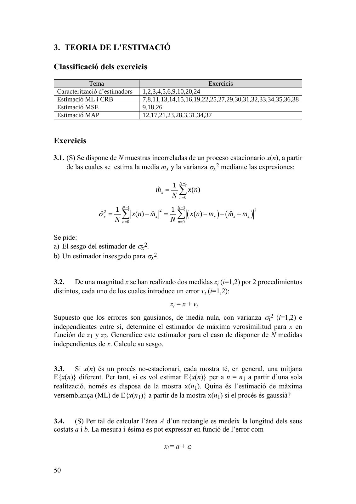

```text
3. TEORIA DE L’ESTIMACIÓ

Classificació dels exercicis
             Tema                                                  Exercicis
 Caracterització d’estimadors         1,2,3,4,5,6,9,10,20,24
 Estimació ML i CRB                   7,8,11,13,14,15,16,19,22,25,27,29,30,31,32,33,34,35,36,38
 Estimació MSE                        9,18,26
 Estimació MAP                        12,17,21,23,28,3,31,34,37


Exercicis
3.1. (S) Se dispone de N muestras incorreladas de un proceso estacionario x(n), a partir
     de las cuales se estima la media mx y la varianza x2 mediante las expresiones:

                                                     1 N −1
                                            mˆ x =      x ( n)
                                                     N n =0
                          1 N −1                   1 N −1
                                                        ( x(n) − mx ) − ( mˆ x − mx )
                                                                                        2
                ˆ x2 =                  −       =
                                               2
                                 x ( n )   ˆ
                                           m x
                          N n =0                   N n =0

Se pide:
a) El sesgo del estimador de x2.
b) Un estimador insesgado para x2.


3.2. De una magnitud x se han realizado dos medidas zi (i=1,2) por 2 procedimientos
distintos, cada uno de los cuales introduce un error vi (i=1,2):
                                                     zi = x + vi
Supuesto que los errores son gausianos, de media nula, con varianza i2 (i=1,2) e
independientes entre sí, determine el estimador de máxima verosimilitud para x en
función de z1 y z2. Generalice este estimador para el caso de disponer de N medidas
independientes de x. Calcule su sesgo.


3.3. Si x(n) és un procés no-estacionari, cada mostra té, en general, una mitjana
E{x(n)} diferent. Per tant, si es vol estimar E{x(n)} per a n = n1 a partir d’una sola
realització, només es disposa de la mostra x(n1). Quina és l’estimació de màxima
versemblança (ML) de E{x(n1)} a partir de la mostra x(n1) si el procés és gaussià?


3.4. (S) Per tal de calcular l’àrea A d’un rectangle es medeix la longitud dels seus
costats a i b. La mesura i-èsima es pot expressar en funció de l’error com

                                               xi = a + i


50
```

## Page 2

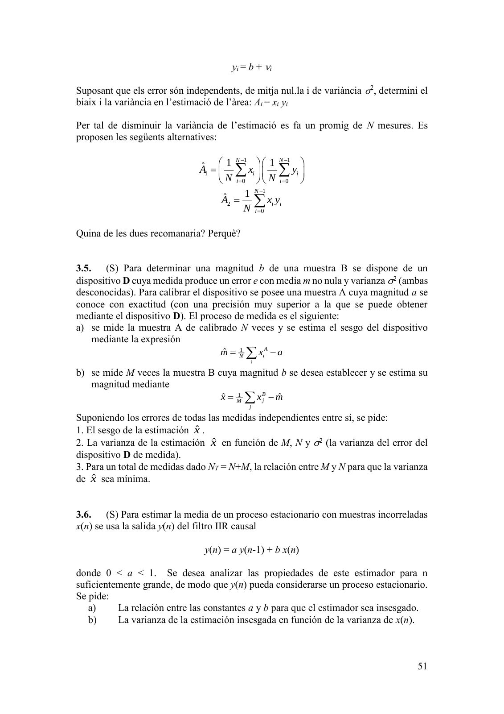

```text
                                       yi = b + i

Suposant que els error són independents, de mitja nul.la i de variància 2, determini el
biaix i la variància en l’estimació de l’àrea: Ai = xi yi

Per tal de disminuir la variància de l’estimació es fa un promig de N mesures. Es
proposen les següents alternatives:

                                     1 N −1  1 N −1 
                              Aˆ1 =   xi   yi 
                                     N i =0  N i =0 
                                            1 N −1
                                     Aˆ 2 =  xi yi
                                           N i =0

Quina de les dues recomanaria? Perquè?


3.5. (S) Para determinar una magnitud b de una muestra B se dispone de un
dispositivo D cuya medida produce un error e con media m no nula y varianza  (ambas
desconocidas). Para calibrar el dispositivo se posee una muestra A cuya magnitud a se
conoce con exactitud (con una precisión muy superior a la que se puede obtener
mediante el dispositivo D). El proceso de medida es el siguiente:
a) se mide la muestra A de calibrado N veces y se estima el sesgo del dispositivo
    mediante la expresión
                                    ˆ = N1  xiA − a
                                    m
                                            i

b) se mide M veces la muestra B cuya magnitud b se desea establecer y se estima su
   magnitud mediante
                                    xˆ = M1  x Bj − m
                                                     ˆ
                                            j

Suponiendo los errores de todas las medidas independientes entre sí, se pide:
1. El sesgo de la estimación x̂ .
2. La varianza de la estimación x̂ en función de M, N y  (la varianza del error del
dispositivo D de medida).
3. Para un total de medidas dado NT = N+M, la relación entre M y N para que la varianza
de x̂ sea mínima.


3.6. (S) Para estimar la media de un proceso estacionario con muestras incorreladas
x(n) se usa la salida y(n) del filtro IIR causal

                                y(n) = a y(n-1) + b x(n)

donde 0 < a < 1. Se desea analizar las propiedades de este estimador para n
suficientemente grande, de modo que y(n) pueda considerarse un proceso estacionario.
Se pide:
   a)     La relación entre las constantes a y b para que el estimador sea insesgado.
   b)     La varianza de la estimación insesgada en función de la varianza de x(n).


                                                                                     51
```

## Page 3

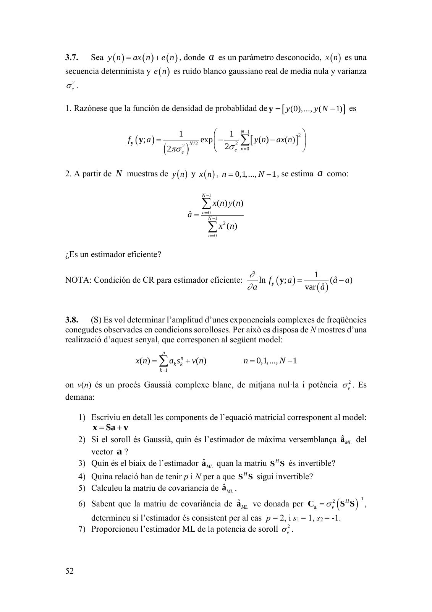

```text
3.7.     Sea y ( n ) = ax ( n ) + e ( n ) , donde a es un parámetro desconocido, x ( n ) es una
secuencia determinista y e ( n ) es ruido blanco gaussiano real de media nula y varianza
 e2 .

1. Razónese que la función de densidad de probablidad de y =  y (0),..., y ( N − 1)  es

                                          1               1 N −1                 2
                    f y ( y; a ) =                   exp  − 2   y (n) − ax(n)  
                                     ( 2 e2 )           2 e n =0
                                                N /2
                                                                                   

2. A partir de N muestras de y ( n ) y x ( n ) , n = 0,1,..., N − 1 , se estima a como:

                                                    N −1

                                                     x ( n) y ( n)
                                              aˆ = n =0N −1
                                                       x ( n)
                                                       n =0
                                                              2


¿Es un estimador eficiente?

                                                                                             1
NOTA: Condición de CR para estimador eficiente:                           ln f y ( y; a ) =            (aˆ − a)
                                                                       a                   var ( aˆ )


3.8. (S) Es vol determinar l’amplitud d’unes exponencials complexes de freqüències
conegudes observades en condicions sorolloses. Per això es disposa de N mostres d’una
realització d’aquest senyal, que corresponen al següent model:
                                     p
                       x(n) =  ak skn + v(n)                         n = 0,1,..., N − 1
                                 k =1


on v(n) és un procés Gaussià complexe blanc, de mitjana nul·la i potència  v2 . Es
demana:

      1) Escriviu en detall les components de l’equació matricial corresponent al model:
          x = Sa + v
      2) Si el soroll és Gaussià, quin és l’estimador de màxima versemblança â ML del
         vector a ?
      3) Quin és el biaix de l’estimador â ML quan la matriu S H S és invertible?
      4) Quina relació han de tenir p i N per a que S H S sigui invertible?
      5) Calculeu la matriu de covariancia de â ML .
      6) Sabent que la matriu de covariància de â ML ve donada per Ca =  v2 ( S H S ) ,
                                                                                                                  −1


         determineu si l’estimador és consistent per al cas p = 2, i s1 = 1, s2 = -1.
      7) Proporcioneu l’estimador ML de la potencia de soroll  v2 .


52
```

## Page 4

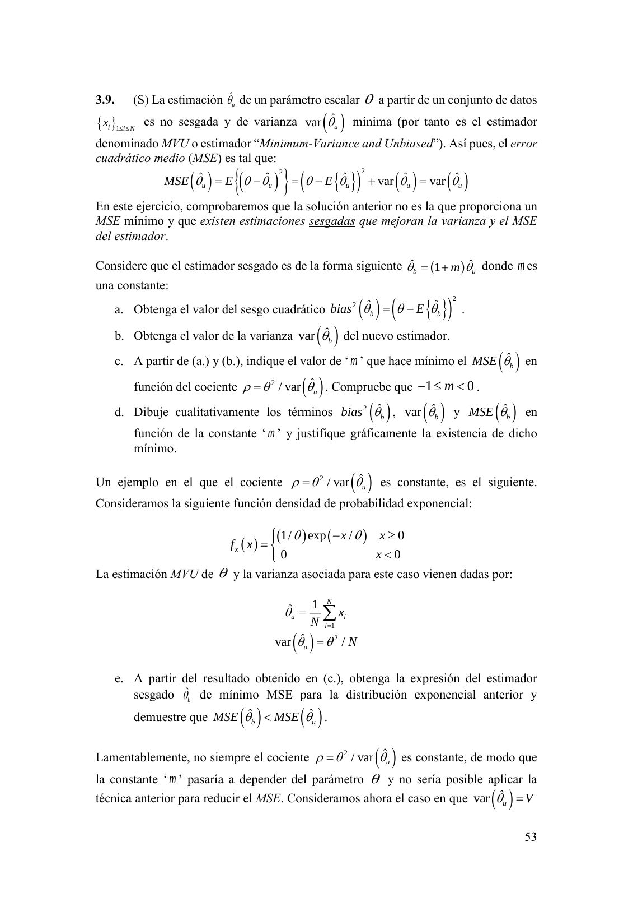

```text
3.9.       (S) La estimación ˆu de un parámetro escalar  a partir de un conjunto de datos
 xi 1i N                                           ( )
             es no sesgada y de varianza var ˆ mínima (por tanto es el estimador
                                                         u

denominado MVU o estimador “Minimum-Variance and Unbiased”). Así pues, el error
cuadrático medio (MSE) es tal que:
                      ( )     (       )  = ( − E ˆ ) + var (ˆ ) = var (ˆ )
                                       2                          2
                 MSE ˆu = E  − ˆu                         u              u           u


En este ejercicio, comprobaremos que la solución anterior no es la que proporciona un
MSE mínimo y que existen estimaciones sesgadas que mejoran la varianza y el MSE
del estimador.

Considere que el estimador sesgado es de la forma siguiente ˆb = (1 + m )ˆu donde m es
una constante:

                                                                  ( ) (          ) .
                                                                                    2
     a. Obtenga el valor del sesgo cuadrático bias 2 ˆb =  − E ˆb

                                                       ( )
     b. Obtenga el valor de la varianza var ˆb del nuevo estimador.
     c. A partir de (a.) y (b.), indique el valor de ‘ m ’ que hace mínimo el MSE ˆb en     ( )
                                               ( )
           función del cociente  =  2 / var ˆu . Compruebe que −1  m  0 .
     d. Dibuje cualitativamente los términos bias 2 ˆb , var ˆb     ( )       ( ) y MSE (ˆ ) en
                                                                                              b

           función de la constante ‘ m ’ y justifique gráficamente la existencia de dicho
           mínimo.

Un ejemplo en el que el cociente  =  2 / var ˆu               ( ) es constante, es el siguiente.
Consideramos la siguiente función densidad de probabilidad exponencial:

                                 (1/  ) exp ( − x /  ) x  0
                       fx ( x) = 
                                 0                       x0
La estimación MVU de  y la varianza asociada para este caso vienen dadas por:

                                                   1 N
                                           ˆu =      xi
                                                   N i =1
                                            ( )
                                       var ˆu =  2 / N

     e. A partir del resultado obtenido en (c.), obtenga la expresión del estimador
        sesgado ˆb de mínimo MSE para la distribución exponencial anterior y
                                ( )
        demuestre que MSE ˆ  MSE ˆ .
                                   b          ( )  u


                                                                      ( )
Lamentablemente, no siempre el cociente  =  2 / var ˆu es constante, de modo que
la constante ‘ m ’ pasaría a depender del parámetro  y no sería posible aplicar la
técnica anterior para reducir el MSE. Consideramos ahora el caso en que var ˆu = V         ( )
                                                                                                   53
```

## Page 5

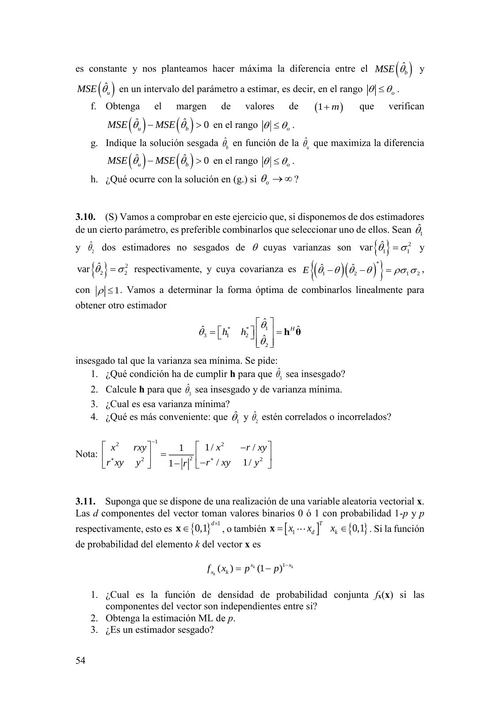

```text
es constante y nos planteamos hacer máxima la diferencia entre el MSE ˆb                               ( )y
         ( )
MSE ˆu en un intervalo del parámetro a estimar, es decir, en el rango    o .
     f. Obtenga      el   margen           de    valores        de        (1 + m )       que           verifican

               ( )        ( )
          MSE ˆu − MSE ˆb  0 en el rango    o .
     g. Indique la solución sesgada ˆb en función de la ˆu que maximiza la diferencia
               ( )        ( )
         MSE ˆ − MSE ˆ  0 en el rango    .
                u           b                                   o

     h. ¿Qué ocurre con la solución en (g.) si o →  ?


3.10. (S) Vamos a comprobar en este ejercicio que, si disponemos de dos estimadores
de un cierto parámetro, es preferible combinarlos que seleccionar uno de ellos. Sean ˆ1
y ˆ dos estimadores no sesgados de  cuyas varianzas son var ˆ =  2 y
     2                                                                                           1       1


      
var ˆ2 =  22 respectivamente, y cuya covarianza es E ˆ1 −  ˆ2 −   (         )(       )  =   ,
                                                                                               *
                                                                                                           1   2


con   1 . Vamos a determinar la forma óptima de combinarlos linealmente para
obtener otro estimador
                                                       ˆ 
                                ˆ3 =  h1*    h2*   1  = h H θˆ
                                                       ˆ2 
insesgado tal que la varianza sea mínima. Se pide:
    1. ¿Qué condición ha de cumplir h para que ˆ3 sea insesgado?
     2. Calcule h para que ˆ3 sea insesgado y de varianza mínima.
     3. ¿Cual es esa varianza mínima?
     4. ¿Qué es más conveniente: que ˆ1 y ˆ2 estén correlados o incorrelados?

                     −1
       x2     rxy       1  1/ x 2            −r / xy 
Nota:             =      2                         
       r xy    y2    1 − r  −r / xy          1/ y 2 


3.11. Suponga que se dispone de una realización de una variable aleatoria vectorial x.
Las d componentes del vector toman valores binarios 0 ó 1 con probabilidad 1-p y p
respectivamente, esto es x  0,1         , o también x =  x1         xd      xk  0,1 . Si la función
                                     d1                                     T


de probabilidad del elemento k del vector x es

                                   f xk ( xk ) = p xk (1 − p)1− xk

     1. ¿Cual es la función de densidad de probabilidad conjunta fx(x) si las
        componentes del vector son independientes entre si?
     2. Obtenga la estimación ML de p.
     3. ¿Es un estimador sesgado?


54
```

## Page 6

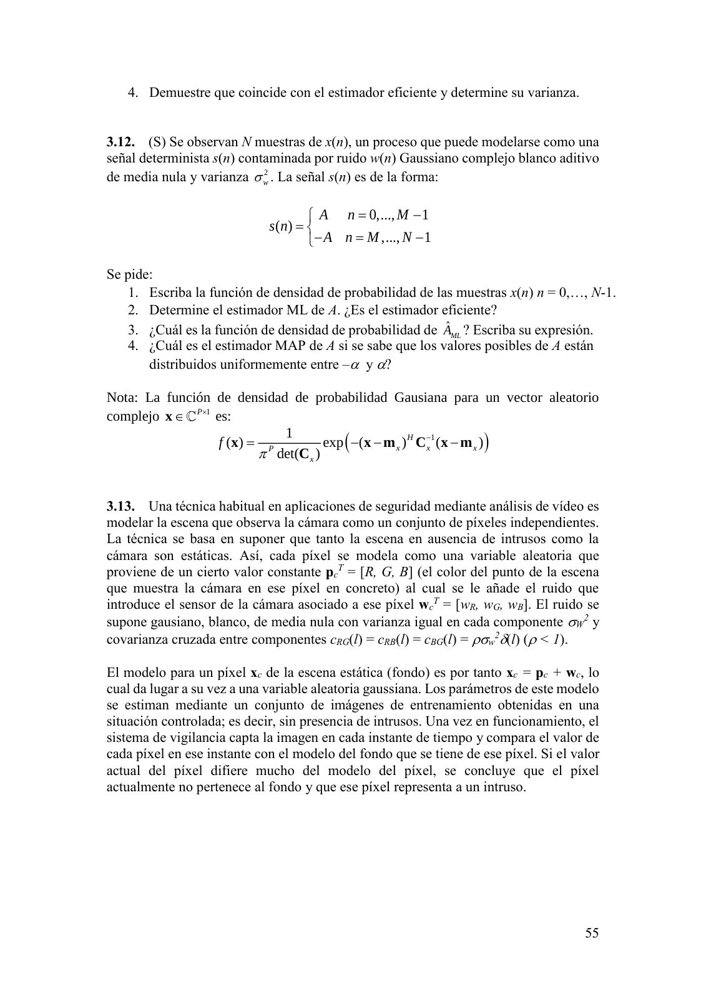

```text
   4. Demuestre que coincide con el estimador eficiente y determine su varianza.


3.12. (S) Se observan N muestras de x(n), un proceso que puede modelarse como una
señal determinista s(n) contaminada por ruido w(n) Gaussiano complejo blanco aditivo
de media nula y varianza  w2 . La señal s(n) es de la forma:

                                       A n = 0,..., M − 1
                             s ( n) = 
                                      − A n = M ,..., N − 1

Se pide:
    1. Escriba la función de densidad de probabilidad de las muestras x(n) n = 0,…, N-1.
    2. Determine el estimador ML de A. ¿Es el estimador eficiente?
    3. ¿Cuál es la función de densidad de probabilidad de Aˆ ML ? Escriba su expresión.
    4. ¿Cuál es el estimador MAP de A si se sabe que los valores posibles de A están
       distribuidos uniformemente entre – y ?

Nota: La función de densidad de probabilidad Gausiana para un vector aleatorio
complejo x  P1 es:
                  f ( x) = P
                             1
                           det(C x )
                                           (                        )
                                      exp −(x − m x ) H C−x 1 (x − m x )


3.13. Una técnica habitual en aplicaciones de seguridad mediante análisis de vídeo es
modelar la escena que observa la cámara como un conjunto de píxeles independientes.
La técnica se basa en suponer que tanto la escena en ausencia de intrusos como la
cámara son estáticas. Así, cada píxel se modela como una variable aleatoria que
proviene de un cierto valor constante pcT = [R, G, B] (el color del punto de la escena
que muestra la cámara en ese píxel en concreto) al cual se le añade el ruido que
introduce el sensor de la cámara asociado a ese píxel wcT = [wR, wG, wB]. El ruido se
supone gausiano, blanco, de media nula con varianza igual en cada componente W2 y
covarianza cruzada entre componentes cRG(l) = cRB(l) = cBG(l) = w2(l) ( < 1).

El modelo para un píxel xc de la escena estática (fondo) es por tanto xc = pc + wc, lo
cual da lugar a su vez a una variable aleatoria gaussiana. Los parámetros de este modelo
se estiman mediante un conjunto de imágenes de entrenamiento obtenidas en una
situación controlada; es decir, sin presencia de intrusos. Una vez en funcionamiento, el
sistema de vigilancia capta la imagen en cada instante de tiempo y compara el valor de
cada píxel en ese instante con el modelo del fondo que se tiene de ese píxel. Si el valor
actual del píxel difiere mucho del modelo del píxel, se concluye que el píxel
actualmente no pertenece al fondo y que ese píxel representa a un intruso.


                                                                                      55
```

## Page 7

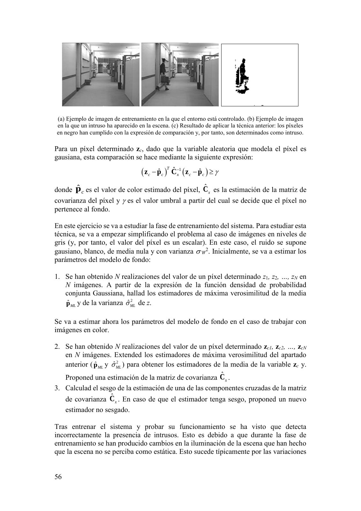

```text
(a) Ejemplo de imagen de entrenamiento en la que el entorno está controlado. (b) Ejemplo de imagen
en la que un intruso ha aparecido en la escena. (c) Resultado de aplicar la técnica anterior: los píxeles
en negro han cumplido con la expresión de comparación y, por tanto, son determinados como intruso.

Para un píxel determinado zc, dado que la variable aleatoria que modela el píxel es
gausiana, esta comparación se hace mediante la siguiente expresión:

                                   ( z c − pˆ c ) Cˆ −x1 ( z c − pˆ c )  
                                                T


donde pˆ c es el valor de color estimado del píxel, Cˆ x es la estimación de la matriz de
covarianza del píxel y  es el valor umbral a partir del cual se decide que el píxel no
pertenece al fondo.

En este ejercicio se va a estudiar la fase de entrenamiento del sistema. Para estudiar esta
técnica, se va a empezar simplificando el problema al caso de imágenes en niveles de
gris (y, por tanto, el valor del píxel es un escalar). En este caso, el ruido se supone
gausiano, blanco, de media nula y con varianza ´W2. Inicialmente, se va a estimar los
parámetros del modelo de fondo:

1. Se han obtenido N realizaciones del valor de un píxel determinado z1, z2, …, zN en
   N imágenes. A partir de la expresión de la función densidad de probabilidad
   conjunta Gaussiana, hallad los estimadores de máxima verosimilitud de la media
   pˆ ML y de la varianza ˆ ML de z.
                             2


Se va a estimar ahora los parámetros del modelo de fondo en el caso de trabajar con
imágenes en color.

2. Se han obtenido N realizaciones del valor de un píxel determinado zc1, zc2, …, zcN
   en N imágenes. Extended los estimadores de máxima verosimilitud del apartado
   anterior ( pˆ ML y ˆ ML
                         2
                            ) para obtener los estimadores de la media de la variable zc y.
   Proponed una estimación de la matriz de covarianza Cˆ x .
3. Calculad el sesgo de la estimación de una de las componentes cruzadas de la matriz
     de covarianza Cˆ x . En caso de que el estimador tenga sesgo, proponed un nuevo
     estimador no sesgado.

Tras entrenar el sistema y probar su funcionamiento se ha visto que detecta
incorrectamente la presencia de intrusos. Esto es debido a que durante la fase de
entrenamiento se han producido cambios en la iluminación de la escena que han hecho
que la escena no se perciba como estática. Esto sucede típicamente por las variaciones


56
```

## Page 8

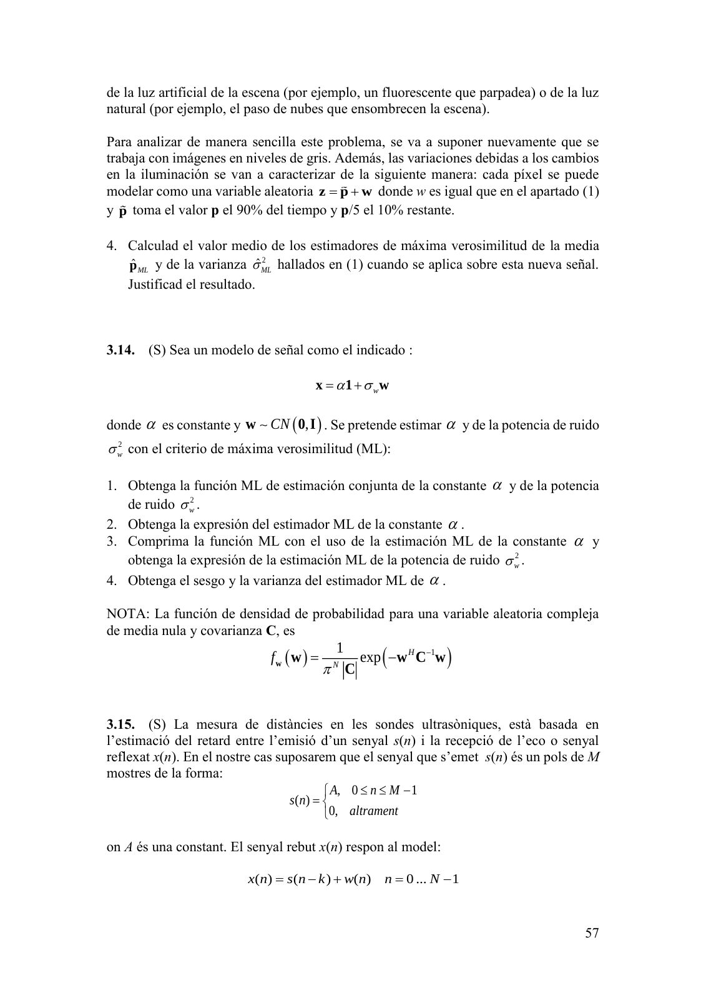

```text
de la luz artificial de la escena (por ejemplo, un fluorescente que parpadea) o de la luz
natural (por ejemplo, el paso de nubes que ensombrecen la escena).

Para analizar de manera sencilla este problema, se va a suponer nuevamente que se
trabaja con imágenes en niveles de gris. Además, las variaciones debidas a los cambios
en la iluminación se van a caracterizar de la siguiente manera: cada píxel se puede
modelar como una variable aleatoria z = p + w donde w es igual que en el apartado (1)
y p toma el valor p el 90% del tiempo y p/5 el 10% restante.

4. Calculad el valor medio de los estimadores de máxima verosimilitud de la media
   pˆ ML y de la varianza ˆ ML hallados en (1) cuando se aplica sobre esta nueva señal.
                             2


   Justificad el resultado.


3.14. (S) Sea un modelo de señal como el indicado :

                                      x =  1 +  ww

donde  es constante y w     CN ( 0, I ) . Se pretende estimar  y de la potencia de ruido
 w2 con el criterio de máxima verosimilitud (ML):

1. Obtenga la función ML de estimación conjunta de la constante  y de la potencia
   de ruido  w2 .
2. Obtenga la expresión del estimador ML de la constante  .
3. Comprima la función ML con el uso de la estimación ML de la constante  y
   obtenga la expresión de la estimación ML de la potencia de ruido  w2 .
4. Obtenga el sesgo y la varianza del estimador ML de  .

NOTA: La función de densidad de probabilidad para una variable aleatoria compleja
de media nula y covarianza C, es
                                                exp ( −w H C−1w )
                                           1
                             fw ( w ) =
                                           C
                                          N


3.15. (S) La mesura de distàncies en les sondes ultrasòniques, està basada en
l’estimació del retard entre l’emisió d’un senyal s(n) i la recepció de l’eco o senyal
reflexat x(n). En el nostre cas suposarem que el senyal que s’emet s(n) és un pols de M
mostres de la forma:
                                            A, 0  n  M − 1
                                  s ( n) = 
                                           0, altrament

on A és una constant. El senyal rebut x(n) respon al model:

                         x(n) = s (n − k ) + w(n)   n = 0 ... N − 1


                                                                                       57
```

## Page 9

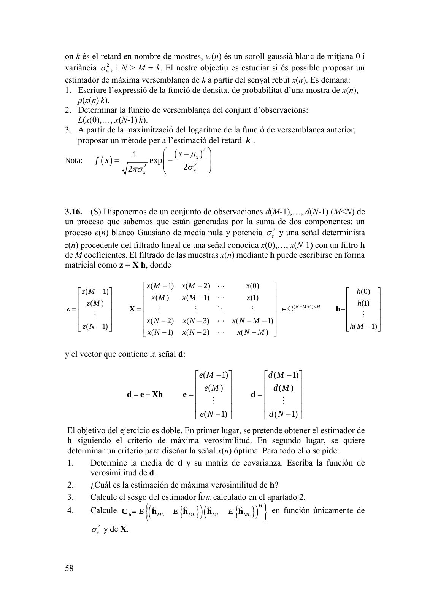

```text
on k és el retard en nombre de mostres, w(n) és un soroll gaussià blanc de mitjana 0 i
variància  w2 , i N > M + k. El nostre objectiu es estudiar si és possible proposar un
estimador de màxima versemblança de k a partir del senyal rebut x(n). Es demana:
1. Escriure l’expressió de la funció de densitat de probabilitat d’una mostra de x(n),
    p(x(n)|k).
2. Determinar la funció de versemblança del conjunt d’observacions:
    L(x(0),…, x(N-1)|k).
3. A partir de la maximització del logaritme de la funció de versemblança anterior,
    proposar un mètode per a l’estimació del retard k .
                     1          ( x −  x )2 
Nota:    f ( x) =          exp  −            
                    2 x2          2 2
                                              
                                       x     


3.16. (S) Disponemos de un conjunto de observaciones d(M-1),…, d(N-1) (M<N) de
un proceso que sabemos que están generadas por la suma de dos componentes: un
proceso e(n) blanco Gausiano de media nula y potencia  e2 y una señal determinista
z(n) procedente del filtrado lineal de una señal conocida x(0),…, x(N-1) con un filtro h
de M coeficientes. El filtrado de las muestras x(n) mediante h puede escribirse en forma
matricial como z = X h, donde

                          x( M − 1)    x( M − 2)               x(0)      
   z ( M − 1)           x( M )                                                                     h(0) 
   z(M )                             x( M − 1)               x(1)                                  h(1) 
z=                   X=                                                      ( N − M +1) M
                                                                                                   h=            
                                                                                                             
                        x( N − 2)    x( N − 3)           x( N − M − 1)                                       
   z ( N − 1)           x( N − 1)                                                                  h( M − 1) 
                                        x( N − 2)            x( N − M ) 

y el vector que contiene la señal d:

                                          e( M − 1)                   d ( M − 1) 
                                           e( M )                     d (M ) 
                   d = e + Xh           e=                         d=            
                                                                                 
                                                                                 
                                           e( N − 1)                  d ( N − 1) 
El objetivo del ejercicio es doble. En primer lugar, se pretende obtener el estimador de
h siguiendo el criterio de máxima verosimilitud. En segundo lugar, se quiere
determinar un criterio para diseñar la señal x(n) óptima. Para todo ello se pide:
1.     Determine la media de d y su matriz de covarianza. Escriba la función de
       verosimilitud de d.
2.     ¿Cuál es la estimación de máxima verosimilitud de h?
3.     Calcule el sesgo del estimador ĥML calculado en el apartado 2.
4.                         (
        Calcule C h = E hˆ ML − E hˆ ML  ) (hˆ    ML       )  en función únicamente de
                                                         − E hˆ ML
                                                                       H


         e2 y de X.


58
```

## Page 10

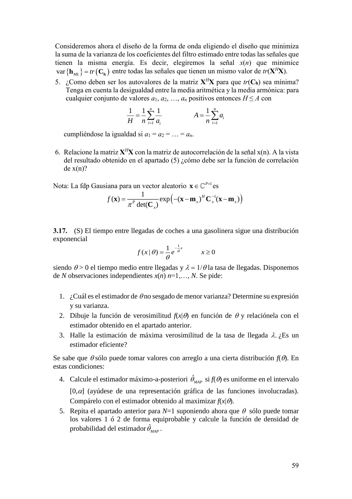

```text
Consideremos ahora el diseño de la forma de onda eligiendo el diseño que minimiza
la suma de la varianza de los coeficientes del filtro estimado entre todas las señales que
tienen la misma energía. Es decir, elegiremos la señal x(n) que minimice
 var h ML  = tr ( Ch ) entre todas las señales que tienen un mismo valor de tr(XHX).
5. ¿Como deben ser los autovalores de la matriz XHX para que tr(Ch) sea mínima?
   Tenga en cuenta la desigualdad entre la media aritmética y la media armónica: para
   cualquier conjunto de valores a1, a2, …, an positivos entonces H ≤ A con
                            1 1 n 1                               1 n
                             =                              A=      ai
                            H n i =1 ai                           n i =1
    cumpliéndose la igualdad si a1 = a2 = … = an.

6. Relacione la matriz XHX con la matriz de autocorrelación de la señal x(n). A la vista
   del resultado obtenido en el apartado (5) ¿cómo debe ser la función de correlación
   de x(n)?

Nota: La fdp Gausiana para un vector aleatorio x  P1 es
                  f ( x) = P
                             1
                           det(C x )
                                                   (
                                      exp −(x − m x ) H C −x 1(x − m x )   )

3.17. (S) El tiempo entre llegadas de coches a una gasolinera sigue una distribución
exponencial
                                                        1
                                               1       − x
                                f (x |  ) =       e         x0
                                       
siendo  > 0 el tiempo medio entre llegadas y  =  la tasa de llegadas. Disponemos
de N observaciones independientes x(n) n=1,…, N. Se pide:

  1. ¿Cuál es el estimador de  no sesgado de menor varianza? Determine su expresión
     y su varianza.
  2. Dibuje la función de verosimilitud f(x|) en función de  y relaciónela con el
     estimador obtenido en el apartado anterior.
  3. Halle la estimación de máxima verosimilitud de la tasa de llegada  ¿Es un
     estimador eficiente?
Se sabe que  sólo puede tomar valores con arreglo a una cierta distribución f(). En
estas condiciones:
  4. Calcule el estimador máximo-a-posteriori ˆMAP si f() es uniforme en el intervalo
     [0,] (ayúdese de una representación gráfica de las funciones involucradas).
     Compárelo con el estimador obtenido al maximizar f(x|).
  5. Repita el apartado anterior para N=1 suponiendo ahora que  sólo puede tomar
     los valores 1 ó 2 de forma equiprobable y calcule la función de densidad de
     probabilidad del estimador ˆMAP .


                                                                                       59
```

## Page 11

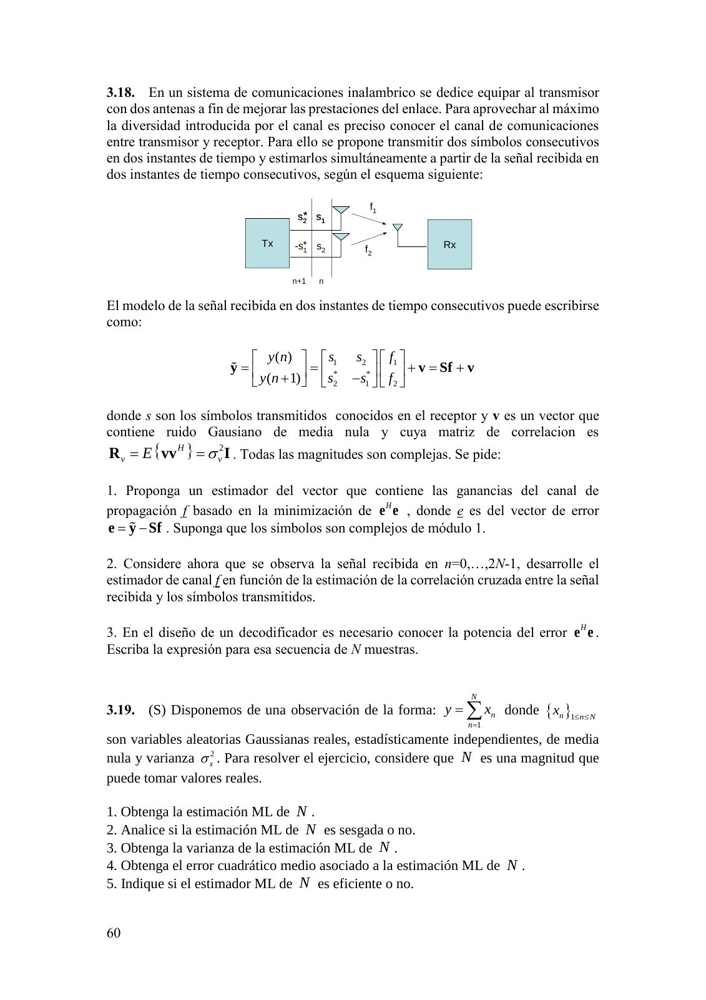

```text
3.18. En un sistema de comunicaciones inalambrico se dedice equipar al transmisor
con dos antenas a fin de mejorar las prestaciones del enlace. Para aprovechar al máximo
la diversidad introducida por el canal es preciso conocer el canal de comunicaciones
entre transmisor y receptor. Para ello se propone transmitir dos símbolos consecutivos
en dos instantes de tiempo y estimarlos simultáneamente a partir de la señal recibida en
dos instantes de tiempo consecutivos, según el esquema siguiente:

                                                 f1
                                  s2* s1

                            Tx    -s*1 s2                           Rx
                                                f2


                                 n+1   n


El modelo de la señal recibida en dos instantes de tiempo consecutivos puede escribirse
como:

                         y (n)   s1        s2   f1 
                      y=           = *                       + v = Sf + v
                         y (n + 1)   s2   − s1*   f 2 

donde s son los símbolos transmitidos conocidos en el receptor y v es un vector que
contiene ruido Gausiano de media nula y cuya matriz de correlacion es
R v = E vv H  =  v2I . Todas las magnitudes son complejas. Se pide:

1. Proponga un estimador del vector que contiene las ganancias del canal de
propagación f basado en la minimización de e H e , donde e es del vector de error
e = y − Sf . Suponga que los símbolos son complejos de módulo 1.

2. Considere ahora que se observa la señal recibida en n=0,…,2N-1, desarrolle el
estimador de canal f en función de la estimación de la correlación cruzada entre la señal
recibida y los símbolos transmitidos.

3. En el diseño de un decodificador es necesario conocer la potencia del error e H e .
Escriba la expresión para esa secuencia de N muestras.


                                                                           N
3.19. (S) Disponemos de una observación de la forma: y =  xn donde  xn 1 n N
                                                                          n =1
son variables aleatorias Gaussianas reales, estadísticamente independientes, de media
nula y varianza  x2 . Para resolver el ejercicio, considere que N es una magnitud que
puede tomar valores reales.

1. Obtenga la estimación ML de N .
2. Analice si la estimación ML de N es sesgada o no.
3. Obtenga la varianza de la estimación ML de N .
4. Obtenga el error cuadrático medio asociado a la estimación ML de N .
5. Indique si el estimador ML de N es eficiente o no.


60
```

## Page 12

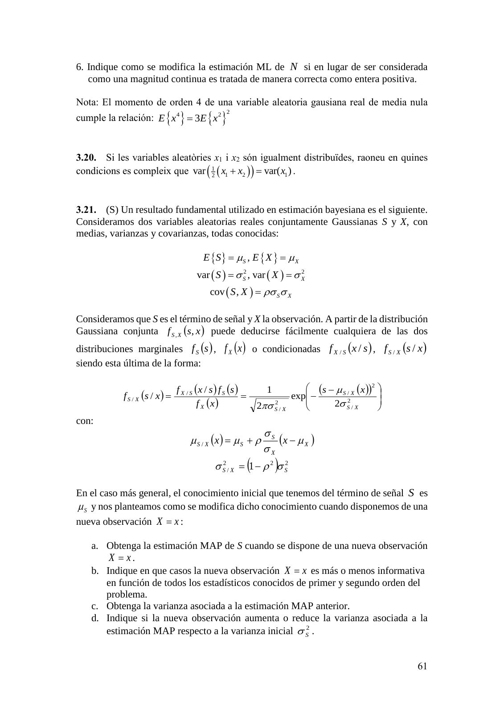

```text
6. Indique como se modifica la estimación ML de N si en lugar de ser considerada
   como una magnitud continua es tratada de manera correcta como entera positiva.

Nota: El momento de orden 4 de una variable aleatoria gausiana real de media nula
cumple la relación: E  x 4  = 3E  x 2 
                                                      2


3.20. Si les variables aleatòries x1 i x2 són igualment distribuïdes, raoneu en quines
condicions es compleix que var ( 12 ( x1 + x2 ) ) = var( x1 ) .


3.21. (S) Un resultado fundamental utilizado en estimación bayesiana es el siguiente.
Consideramos dos variables aleatorias reales conjuntamente Gaussianas S y X, con
medias, varianzas y covarianzas, todas conocidas:

                                            E S  =  S , E  X  =  X
                                          var ( S ) =  S2 , var ( X ) =  X2
                                               cov ( S , X ) =  S X

Consideramos que S es el término de señal y X la observación. A partir de la distribución
Gaussiana conjunta f S , X (s, x ) puede deducirse fácilmente cualquiera de las dos
distribuciones marginales f S (s ) , f X (x ) o condicionadas f X / S (x / s ) , f S / X (s / x )
siendo esta última de la forma:

                                  f X / S ( x / s ) f S (s )                    (s −  S / X ( x ))2 
             f S / X (s / x ) =
                                                                    1
                                                             =              exp −                   
                                           f X (x )              2 S2 / X         2 S2 / X        
                                                                                                      
con:
                                                                  S
                                        S / X (x ) =  S +         (x −  X )
                                                                  X
                                                  S2 / X = (1 −  2 ) S2

En el caso más general, el conocimiento inicial que tenemos del término de señal S es
 S y nos planteamos como se modifica dicho conocimiento cuando disponemos de una
nueva observación X = x :

    a. Obtenga la estimación MAP de S cuando se dispone de una nueva observación
        X = x.
    b. Indique en que casos la nueva observación X = x es más o menos informativa
       en función de todos los estadísticos conocidos de primer y segundo orden del
       problema.
    c. Obtenga la varianza asociada a la estimación MAP anterior.
    d. Indique si la nueva observación aumenta o reduce la varianza asociada a la
       estimación MAP respecto a la varianza inicial  S2 .


                                                                                                          61
```

## Page 13

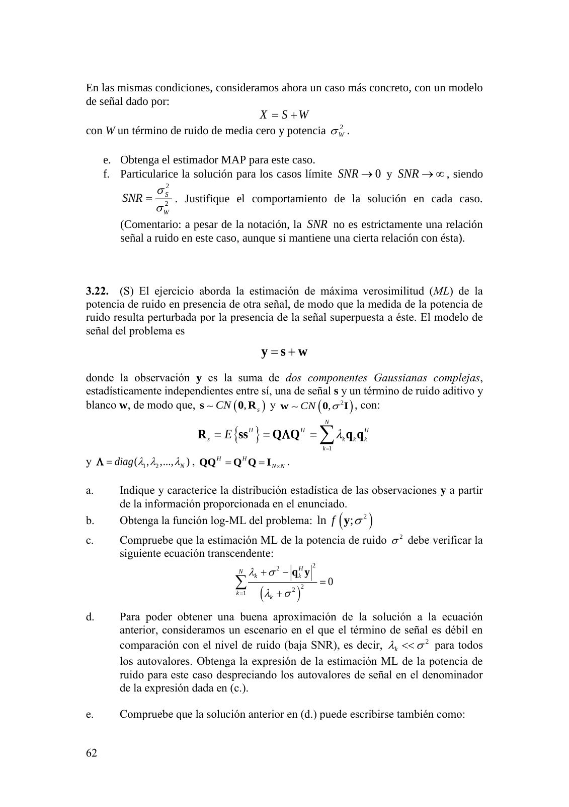

```text
En las mismas condiciones, consideramos ahora un caso más concreto, con un modelo
de señal dado por:
                                                  X = S +W
con W un término de ruido de media cero y potencia  W2 .

     e. Obtenga el estimador MAP para este caso.
     f. Particularice la solución para los casos límite SNR → 0 y SNR →  , siendo
               S2
         SNR =     . Justifique el comportamiento de la solución en cada caso.
               W2
        (Comentario: a pesar de la notación, la SNR no es estrictamente una relación
        señal a ruido en este caso, aunque si mantiene una cierta relación con ésta).


3.22. (S) El ejercicio aborda la estimación de máxima verosimilitud (ML) de la
potencia de ruido en presencia de otra señal, de modo que la medida de la potencia de
ruido resulta perturbada por la presencia de la señal superpuesta a éste. El modelo de
señal del problema es
                                                  y =s+w
donde la observación y es la suma de dos componentes Gaussianas complejas,
estadísticamente independientes entre sí, una de señal s y un término de ruido aditivo y
blanco w, de modo que, s CN ( 0, R s ) y w CN ( 0,  2 I ) , con:
                                                                         N

                             R s = E ss  = QQ =
                                              H              H
                                                                          q q
                                                                         k =1
                                                                                k   k
                                                                                        H
                                                                                        k


y  = diag (1 , 2 ,..., N ) , QQ = Q Q = I N  N .
                                 H       H


a.      Indique y caracterice la distribución estadística de las observaciones y a partir
        de la información proporcionada en el enunciado.
b.      Obtenga la función log-ML del problema: ln f y; 
                                                               2
                                                                                (           )
c.      Compruebe que la estimación ML de la potencia de ruido  2 debe verificar la
        siguiente ecuación transcendente:
                                                                     2
                                       N      k +  2 − q kH y
                                                                        =0
                                                  ( k +  2 )
                                                                 2
                                       k =1


d.      Para poder obtener una buena aproximación de la solución a la ecuación
        anterior, consideramos un escenario en el que el término de señal es débil en
        comparación con el nivel de ruido (baja SNR), es decir, k   2 para todos
        los autovalores. Obtenga la expresión de la estimación ML de la potencia de
        ruido para este caso despreciando los autovalores de señal en el denominador
        de la expresión dada en (c.).

e.      Compruebe que la solución anterior en (d.) puede escribirse también como:


62
```

## Page 14

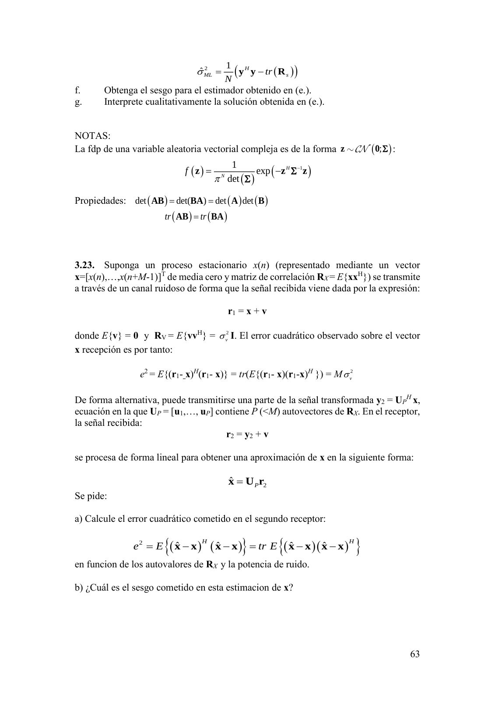

```text
                                   ˆ ML
                                      2
                                         =        ( y y − tr ( R s ) )
                                                1 H
                                                N
f.      Obtenga el sesgo para el estimador obtenido en (e.).
g.      Interprete cualitativamente la solución obtenida en (e.).


NOTAS:
La fdp de una variable aleatoria vectorial compleja es de la forma z                  ( 0;  ) :
                                                     exp ( −z H  −1z )
                                            1
                               f (z) =
                                          det (  )
                                            N


Propiedades: det ( AB ) = det(BA) = det ( A ) det ( B )
                         tr ( AB ) = tr ( BA )


3.23. Suponga un proceso estacionario x(n) (representado mediante un vector
x=[x(n),…,x(n+M-1)]T de media cero y matriz de correlación RX = E{xxH}) se transmite
a través de un canal ruidoso de forma que la señal recibida viene dada por la expresión:

                                                 r1 = x + v

donde E{v} = 0 y RV = E{vvH} =  v2 I El error cuadrático observado sobre el vector
x recepción es por tanto:

                  e2 = E{(r1- x)H(r1- x)} = tr(E{(r1- x)(r1-x)H }) = M  v2

De forma alternativa, puede transmitirse una parte de la señal transformada y2 = UPH x,
ecuación en la que UP = [u1,…, uP] contiene P (<M) autovectores de RX. En el receptor,
la señal recibida:
                                      r2 = y2 + v

se procesa de forma lineal para obtener una aproximación de x en la siguiente forma:

                                                 ˆx = U Pr2
Se pide:

a) Calcule el error cuadrático cometido en el segundo receptor:

                         
                e 2 = E ( xˆ − x )
                                     H
                                         ( xˆ − x ) = tr E ( xˆ − x )( xˆ − x ) 
                                                                               H


en funcion de los autovalores de RX y la potencia de ruido.

b) ¿Cuál es el sesgo cometido en esta estimacion de x?


                                                                                                   63
```

## Page 15

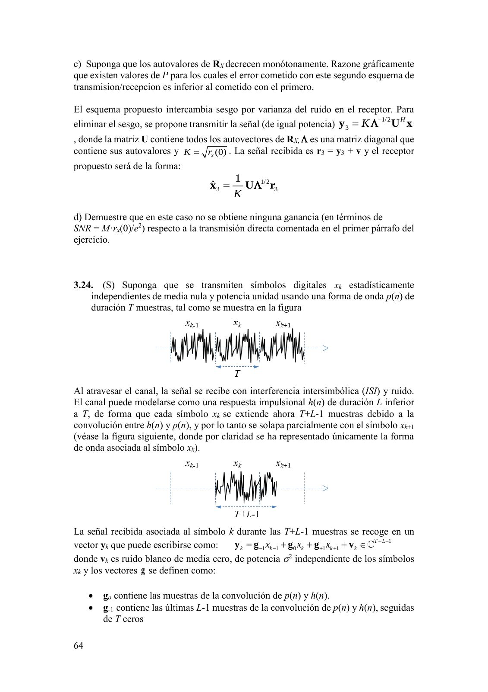

```text
c) Suponga que los autovalores de RX decrecen monótonamente. Razone gráficamente
que existen valores de P para los cuales el error cometido con este segundo esquema de
transmision/recepcion es inferior al cometido con el primero.

El esquema propuesto intercambia sesgo por varianza del ruido en el receptor. Para
                                                                               −1/2
eliminar el sesgo, se propone transmitir la señal (de igual potencia) y 3 = K  U x
                                                                                    H


, donde la matriz U contiene todos los autovectores de RX,  es una matriz diagonal que
contiene sus autovalores y K = rx (0) . La señal recibida es r3 = y3 + v y el receptor
propuesto será de la forma:
                                              1
                                      ˆx3 =     U1/2r3
                                              K

d) Demuestre que en este caso no se obtiene ninguna ganancia (en términos de
SNR = M·rx(0)/e2) respecto a la transmisión directa comentada en el primer párrafo del
ejercicio.


3.24. (S) Suponga que se transmiten símbolos digitales xk estadísticamente
    independientes de media nula y potencia unidad usando una forma de onda p(n) de
    duración T muestras, tal como se muestra en la figura


Al atravesar el canal, la señal se recibe con interferencia intersimbólica (ISI) y ruido.
El canal puede modelarse como una respuesta impulsional h(n) de duración L inferior
a T, de forma que cada símbolo xk se extiende ahora T+L-1 muestras debido a la
convolución entre h(n) y p(n), y por lo tanto se solapa parcialmente con el símbolo xk+1
(véase la figura siguiente, donde por claridad se ha representado únicamente la forma
de onda asociada al símbolo xk).


La señal recibida asociada al símbolo k durante las T+L-1 muestras se recoge en un
vector yk que puede escribirse como:    y k = g −1 xk −1 + g 0 xk + g +1 xk +1 + v k  T + L −1
donde vk es ruido blanco de media cero, de potencia 2 independiente de los símbolos
xk y los vectores g se definen como:

     •   go contiene las muestras de la convolución de p(n) y h(n).
     •   g-1 contiene las últimas L-1 muestras de la convolución de p(n) y h(n), seguidas
         de T ceros

64
```

## Page 16

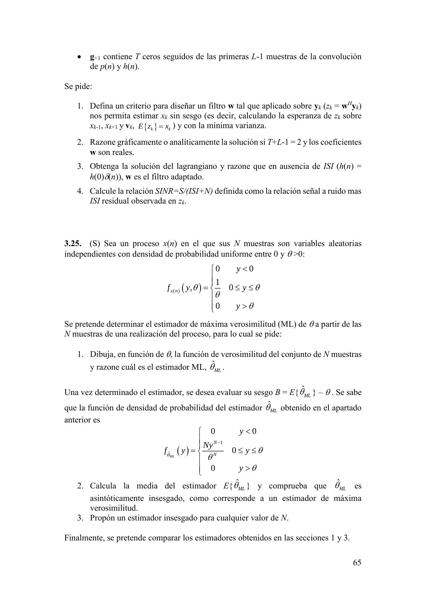

```text
   •   g+1 contiene T ceros seguidos de las primeras L-1 muestras de la convolución
       de p(n) y h(n).

Se pide:

   1. Defina un criterio para diseñar un filtro w tal que aplicado sobre yk (zk = wHyk)
      nos permita estimar xk sin sesgo (es decir, calculando la esperanza de zk sobre
      xk-1, xk+1 y vk, E  zk  = xk ) y con la mínima varianza.
   2. Razone gráficamente o analíticamente la solución si T+L-1 = 2 y los coeficientes
      w son reales.
   3. Obtenga la solución del lagrangiano y razone que en ausencia de ISI (h(n) =
      h(0)(n)), w es el filtro adaptado.
   4. Calcule la relación SINR=S/(ISI+N) definida como la relación señal a ruido mas
      ISI residual observada en zk.


3.25. (S) Sea un proceso x(n) en el que sus N muestras son variables aleatorias
independientes con densidad de probabilidad uniforme entre 0 y  >0:
                                                  0       y0
                                                  1
                                                  
                              f x ( n ) ( y, ) =       0  y 
                                                  
                                                   0    y 

Se pretende determinar el estimador de máxima verosimilitud (ML) de  a partir de las
N muestras de una realización del proceso, para lo cual se pide:

   1. Dibuja, en función de , la función de verosimilitud del conjunto de N muestras
      y razone cuál es el estimador ML, ˆML .

Una vez determinado el estimador, se desea evaluar su sesgo B = E{ ˆML } –  . Se sabe
que la función de densidad de probabilidad del estimador ˆML obtenido en el apartado
anterior es
                                         0        y0
                                         N −1
                                         Ny
                            fˆ ( y ) =  N     0  y 
                                         
                               ML


                                         0      y 

   2. Calcula la media del estimador E{ ˆML } y comprueba que ˆML es
      asintóticamente insesgado, como corresponde a un estimador de máxima
      verosimilitud.
   3. Propón un estimador insesgado para cualquier valor de N.

Finalmente, se pretende comparar los estimadores obtenidos en las secciones 1 y 3.

                                                                                     65
```

## Page 17

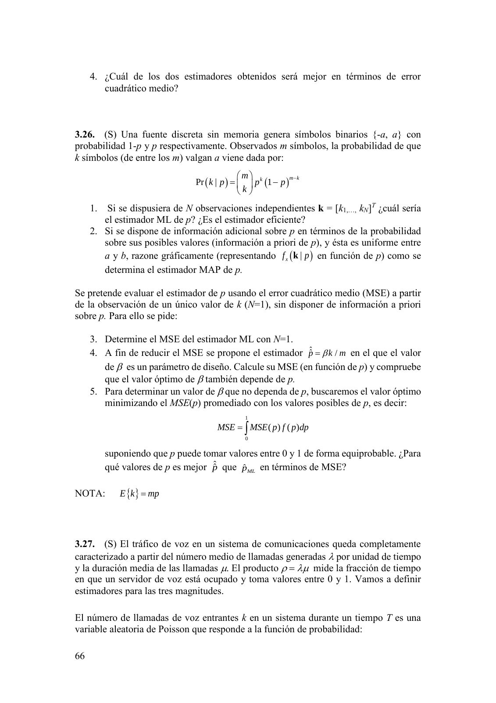

```text
     4. ¿Cuál de los dos estimadores obtenidos será mejor en términos de error
        cuadrático medio?


3.26. (S) Una fuente discreta sin memoria genera símbolos binarios {-a, a} con
probabilidad 1-p y p respectivamente. Observados m símbolos, la probabilidad de que
k símbolos (de entre los m) valgan a viene dada por:
                                                m
                                Pr ( k | p ) =   p k (1 − p )
                                                                m−k

                                               k
     1.  Si se dispusiera de N observaciones independientes k = [k1,…, kN]T ¿cuál sería
        el estimador ML de p? ¿Es el estimador eficiente?
     2. Si se dispone de información adicional sobre p en términos de la probabilidad
        sobre sus posibles valores (información a priori de p), y ésta es uniforme entre
        a y b, razone gráficamente (representando f x ( k | p ) en función de p) como se
        determina el estimador MAP de p.

Se pretende evaluar el estimador de p usando el error cuadrático medio (MSE) a partir
de la observación de un único valor de k (N=1), sin disponer de información a priori
sobre p. Para ello se pide:

     3. Determine el MSE del estimador ML con N=1.
     4. A fin de reducir el MSE se propone el estimador ˆˆp =  k / m en el que el valor
        de  es un parámetro de diseño. Calcule su MSE (en función de p) y compruebe
        que el valor óptimo de  también depende de p.
     5. Para determinar un valor de  que no dependa de p, buscaremos el valor óptimo
        minimizando el MSE(p) promediado con los valores posibles de p, es decir:
                                                1
                                       MSE =  MSE ( p ) f ( p )dp
                                                0

          suponiendo que p puede tomar valores entre 0 y 1 de forma equiprobable. ¿Para
          qué valores de p es mejor p̂ˆ que ˆpML en términos de MSE?

NOTA:        E k = mp


3.27. (S) El tráfico de voz en un sistema de comunicaciones queda completamente
caracterizado a partir del número medio de llamadas generadas  por unidad de tiempo
y la duración media de las llamadas . El producto  =  mide la fracción de tiempo
en que un servidor de voz está ocupado y toma valores entre 0 y 1. Vamos a definir
estimadores para las tres magnitudes.

El número de llamadas de voz entrantes k en un sistema durante un tiempo T es una
variable aleatoria de Poisson que responde a la función de probabilidad:

66
```

## Page 18

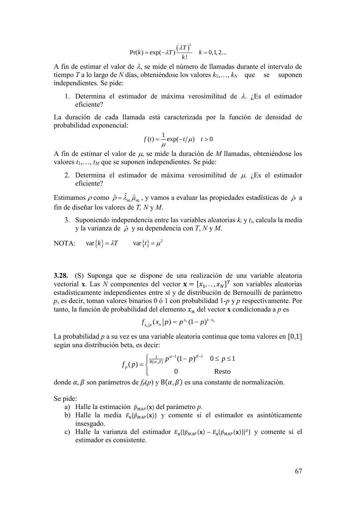

```text
                                                  ( T )
                                                           k

                           Pr( k ) = exp( −T )                k = 0,1, 2...
                                                    k!
A fin de estimar el valor de , se mide el número de llamadas durante el intervalo de
tiempo T a lo largo de N días, obteniéndose los valores k1,…, kN que se suponen
independientes. Se pide:
   1. Determina el estimador de máxima verosimilitud de . ¿Es el estimador
      eficiente?
La duración de cada llamada está caracterizada por la función de densidad de
probabilidad exponencial:
                                            1
                                       exp(− t  ) t  0
                                 f (t ) =
                                     
A fin de estimar el valor de , se mide la duración de M llamadas, obteniéndose los
valores t1,…, tM que se suponen independientes. Se pide:
   2. Determina el estimador de máxima verosimilitud de . ¿Es el estimador
      eficiente?
Estimamos  como ˆ = ˆML ˆ ML , y vamos a evaluar las propiedades estadísticas de ̂ a
fin de diseñar los valores de T, N y M.
   3. Suponiendo independencia entre las variables aleatorias ki y ti, calcula la media
      y la varianza de ̂ y su dependencia con T, N y M.

NOTA:      var k = T     var t =  2


3.28. (S) Suponga que se dispone de una realización de una variable aleatoria
vectorial x. Las N componentes del vector 𝐱 = [𝑥1 , . . , 𝑥𝑁 ]𝑇 son variables aleatorias
estadísticamente independientes entre sí y de distribución de Bernouilli de parámetro
p, es decir, toman valores binarios 0 ó 1 con probabilidad 1-p y p respectivamente. Por
tanto, la función de probabilidad del elemento 𝑥𝑛 del vector x condicionada a p es
                                f xn p ( xn p ) = p xn (1 − p)1− xn

La probabilidad p a su vez es una variable aleatoria continua que toma valores en [0,1]
según una distribución beta, es decir:
                                   1 p −1 (1 − p )  −1 0  p  1
                      f p ( p ) =   ( ,  )
                                             0            Resto
donde 𝛼, 𝛽 son parámetros de fp(p) y Β(𝛼, 𝛽) es una constante de normalización.

Se pide:
    a) Halle la estimación 𝑝̂𝑀𝐴𝑃 (𝐱) del parámetro p.
    b) Halle la media 𝐸𝐱 {𝑝̂𝑀𝐴𝑃 (𝐱)} y comente si el estimador es asintóticamente
       insesgado.
    c) Halle la varianza del estimador 𝐸𝐱 {|𝑝̂𝑀𝐴𝑃 (𝐱) − 𝐸𝐱 {𝑝̂𝑀𝐴𝑃 (𝐱)}|2 } y comente si el
       estimador es consistente.


                                                                                       67
```

## Page 19

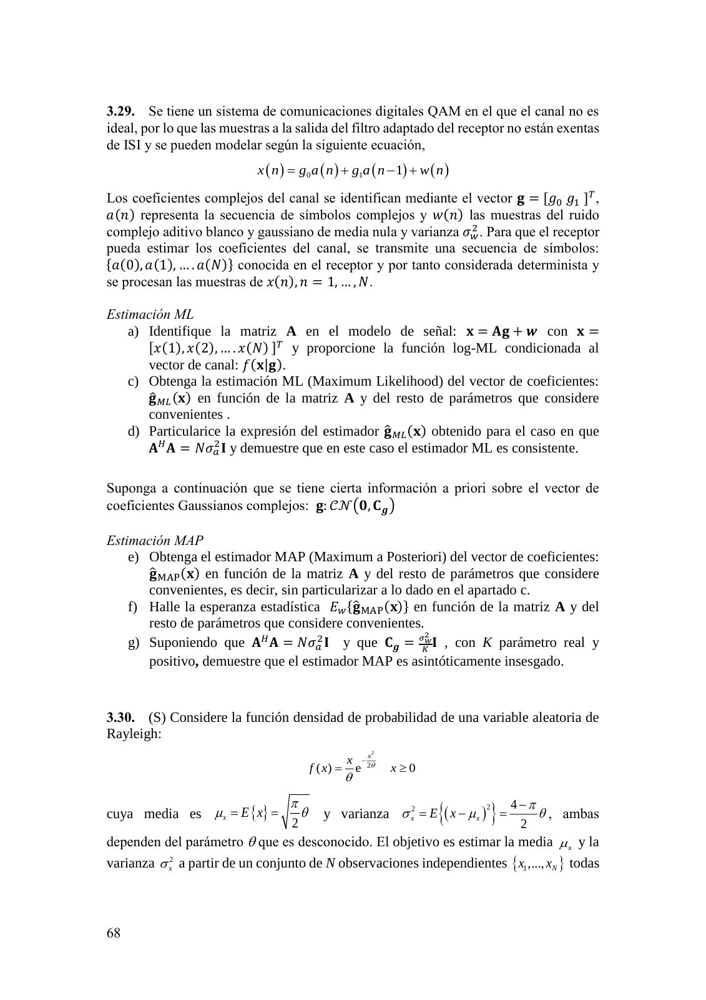

```text
3.29. Se tiene un sistema de comunicaciones digitales QAM en el que el canal no es
ideal, por lo que las muestras a la salida del filtro adaptado del receptor no están exentas
de ISI y se pueden modelar según la siguiente ecuación,
                            x ( n ) = g 0 a ( n ) + g1a ( n − 1) + w ( n )

Los coeficientes complejos del canal se identifican mediante el vector 𝐠 = [𝑔0 𝑔1 ]𝑇 ,
𝑎(𝑛) representa la secuencia de símbolos complejos y 𝑤(𝑛) las muestras del ruido
complejo aditivo blanco y gaussiano de media nula y varianza 𝜎𝑤2 . Para que el receptor
pueda estimar los coeficientes del canal, se transmite una secuencia de símbolos:
{𝑎(0), 𝑎(1), … . 𝑎(𝑁)} conocida en el receptor y por tanto considerada determinista y
se procesan las muestras de 𝑥(𝑛), 𝑛 = 1, … , 𝑁.

Estimación ML
    a) Identifique la matriz A en el modelo de señal: 𝐱 = 𝐀𝐠 + 𝒘 con 𝐱 =
       [𝑥(1), 𝑥(2), … . 𝑥(𝑁) ]𝑇 y proporcione la función log-ML condicionada al
       vector de canal: 𝑓(𝐱|𝐠).
    c) Obtenga la estimación ML (Maximum Likelihood) del vector de coeficientes:
       𝐠̂ 𝑀𝐿 (𝐱) en función de la matriz A y del resto de parámetros que considere
       convenientes .
    d) Particularice la expresión del estimador 𝐠̂ 𝑀𝐿 (𝐱) obtenido para el caso en que
       𝐀𝐻 𝐀 = 𝑁𝜎𝑎2 𝐈 y demuestre que en este caso el estimador ML es consistente.

Suponga a continuación que se tiene cierta información a priori sobre el vector de
coeficientes Gaussianos complejos: 𝐠: 𝒞𝒩(𝟎, 𝐂𝒈 )

Estimación MAP
    e) Obtenga el estimador MAP (Maximum a Posteriori) del vector de coeficientes:
       𝐠̂ MAP (𝐱) en función de la matriz A y del resto de parámetros que considere
       convenientes, es decir, sin particularizar a lo dado en el apartado c.
    f) Halle la esperanza estadística 𝐸𝑤 {𝐠̂ MAP (𝐱)} en función de la matriz A y del
       resto de parámetros que considere convenientes.
                                                          2
    g) Suponiendo que 𝐀𝐻 𝐀 = 𝑁𝜎𝑎2 𝐈 y que 𝐂𝒈 = 𝜎𝐾𝑤𝐈 , con K parámetro real y
       positivo, demuestre que el estimador MAP es asintóticamente insesgado.


3.30. (S) Considere la función densidad de probabilidad de una variable aleatoria de
Rayleigh:
                                                               x2
                                                   x       −
                                        f ( x) =       e       2
                                                                    x0
                                                   

                                  
cuya media es  x = E  x =
                                   2
                                      y varianza  x2 = E ( x −  x )2 = 
                                                                          4 −
                                                                            2
                                                                                , ambas

dependen del parámetro  que es desconocido. El objetivo es estimar la media  x y la
varianza  x2 a partir de un conjunto de N observaciones independientes  x1 ,..., xN  todas


68
```

## Page 20

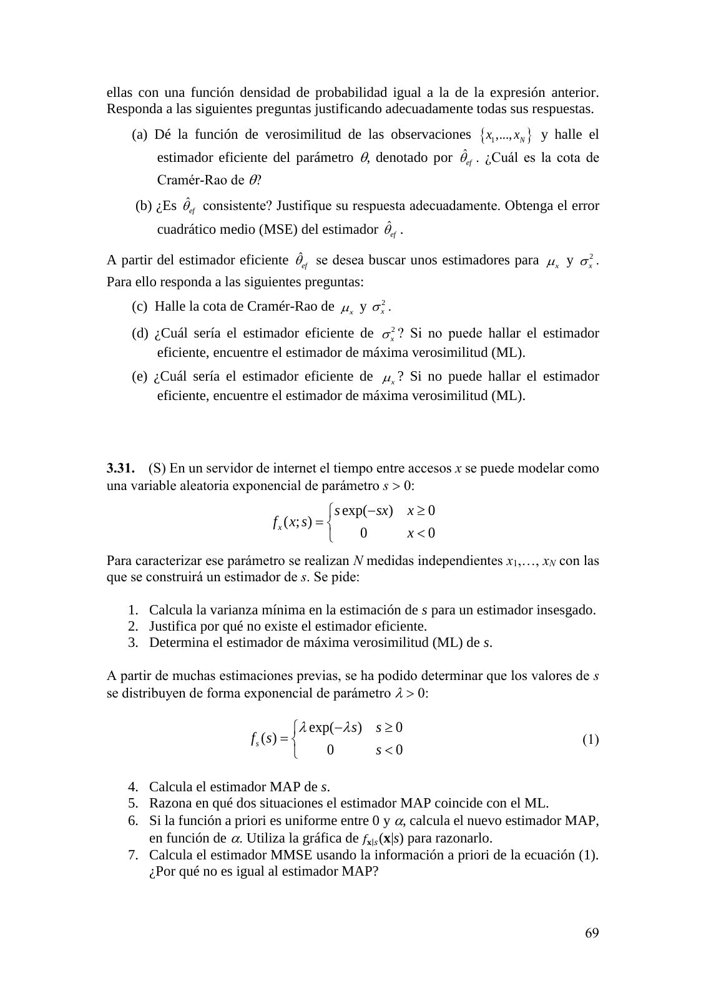

```text
ellas con una función densidad de probabilidad igual a la de la expresión anterior.
Responda a las siguientes preguntas justificando adecuadamente todas sus respuestas.
    (a) Dé la función de verosimilitud de las observaciones  x1 ,..., xN  y halle el
         estimador eficiente del parámetro , denotado por ˆef . ¿Cuál es la cota de
         Cramér-Rao de ?
     (b) ¿Es ˆef consistente? Justifique su respuesta adecuadamente. Obtenga el error
         cuadrático medio (MSE) del estimador ˆef .

A partir del estimador eficiente ˆef se desea buscar unos estimadores para  x y  x2 .
Para ello responda a las siguientes preguntas:
    (c) Halle la cota de Cramér-Rao de  x y  x2 .
    (d) ¿Cuál sería el estimador eficiente de  x2 ? Si no puede hallar el estimador
        eficiente, encuentre el estimador de máxima verosimilitud (ML).
    (e) ¿Cuál sería el estimador eficiente de  x ? Si no puede hallar el estimador
         eficiente, encuentre el estimador de máxima verosimilitud (ML).


3.31. (S) En un servidor de internet el tiempo entre accesos x se puede modelar como
una variable aleatoria exponencial de parámetro s  :
                                             s exp(− sx) x  0
                             f x ( x; s ) = 
                                                  0      x0
Para caracterizar ese parámetro se realizan N medidas independientes x1,…, xN con las
que se construirá un estimador de s. Se pide:

   1. Calcula la varianza mínima en la estimación de s para un estimador insesgado.
   2. Justifica por qué no existe el estimador eficiente.
   3. Determina el estimador de máxima verosimilitud (ML) de s.

A partir de muchas estimaciones previas, se ha podido determinar que los valores de s
se distribuyen de forma exponencial de parámetro   :

                                    exp(− s) s  0
                         f s (s) =                                                 (1)
                                        0      s0

   4. Calcula el estimador MAP de s.
   5. Razona en qué dos situaciones el estimador MAP coincide con el ML.
   6. Si la función a priori es uniforme entre 0 y , calcula el nuevo estimador MAP,
      en función de  Utiliza la gráfica de 𝑓𝐱|𝑠 (x|s) para razonarlo.
   7. Calcula el estimador MMSE usando la información a priori de la ecuación (1).
      ¿Por qué no es igual al estimador MAP?


                                                                                     69
```

## Page 21

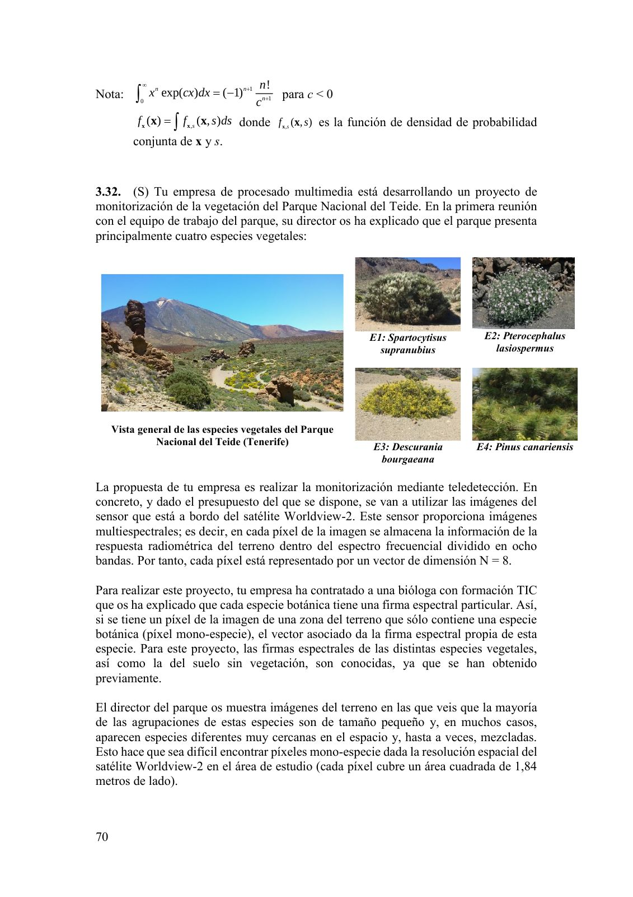

```text
                                        n!
           x exp(cx)dx = (−1)
                n                 n+1
Nota:                                         para c < 0
           0
                                        c n+1
          f x (x) =  f x ,s (x, s)ds donde f x ,s (x, s) es la función de densidad de probabilidad
         conjunta de x y s.


3.32. (S) Tu empresa de procesado multimedia está desarrollando un proyecto de
monitorización de la vegetación del Parque Nacional del Teide. En la primera reunión
con el equipo de trabajo del parque, su director os ha explicado que el parque presenta
principalmente cuatro especies vegetales:


                                                             E1: Spartocytisus         E2: Pterocephalus
                                                               supranubius               lasiospermus


     Vista general de las especies vegetales del Parque
               Nacional del Teide (Tenerife)                  E3: Descurania         E4: Pinus canariensis
                                                               bourgaeana

La propuesta de tu empresa es realizar la monitorización mediante teledetección. En
concreto, y dado el presupuesto del que se dispone, se van a utilizar las imágenes del
sensor que está a bordo del satélite Worldview-2. Este sensor proporciona imágenes
multiespectrales; es decir, en cada píxel de la imagen se almacena la información de la
respuesta radiométrica del terreno dentro del espectro frecuencial dividido en ocho
bandas. Por tanto, cada píxel está representado por un vector de dimensión N = 8.

Para realizar este proyecto, tu empresa ha contratado a una bióloga con formación TIC
que os ha explicado que cada especie botánica tiene una firma espectral particular. Así,
si se tiene un píxel de la imagen de una zona del terreno que sólo contiene una especie
botánica (píxel mono-especie), el vector asociado da la firma espectral propia de esta
especie. Para este proyecto, las firmas espectrales de las distintas especies vegetales,
así como la del suelo sin vegetación, son conocidas, ya que se han obtenido
previamente.

El director del parque os muestra imágenes del terreno en las que veis que la mayoría
de las agrupaciones de estas especies son de tamaño pequeño y, en muchos casos,
aparecen especies diferentes muy cercanas en el espacio y, hasta a veces, mezcladas.
Esto hace que sea difícil encontrar píxeles mono-especie dada la resolución espacial del
satélite Worldview-2 en el área de estudio (cada píxel cubre un área cuadrada de 1,84
metros de lado).


70
```

## Page 22

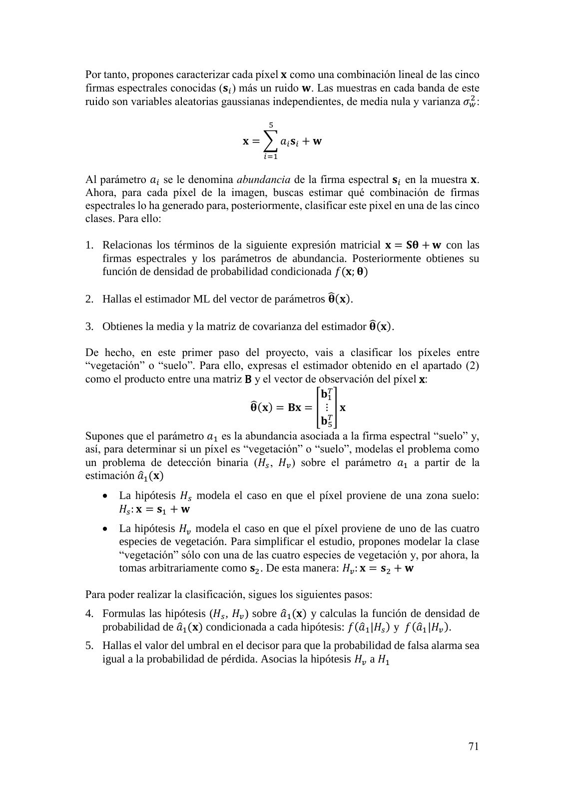

```text
Por tanto, propones caracterizar cada píxel 𝐱 como una combinación lineal de las cinco
firmas espectrales conocidas (𝐬𝑖 ) más un ruido 𝐰. Las muestras en cada banda de este
ruido son variables aleatorias gaussianas independientes, de media nula y varianza 𝜎𝑤2 :
                                          5

                                    𝐱 = ∑ 𝑎𝑖 𝐬𝑖 + 𝐰
                                         𝑖=1

Al parámetro 𝑎𝑖 se le denomina abundancia de la firma espectral 𝐬𝑖 en la muestra 𝐱.
Ahora, para cada píxel de la imagen, buscas estimar qué combinación de firmas
espectrales lo ha generado para, posteriormente, clasificar este pixel en una de las cinco
clases. Para ello:

1. Relacionas los términos de la siguiente expresión matricial 𝐱 = 𝐒𝛉 + 𝐰 con las
   firmas espectrales y los parámetros de abundancia. Posteriormente obtienes su
   función de densidad de probabilidad condicionada 𝑓(𝐱; 𝛉)

2. Hallas el estimador ML del vector de parámetros ̂
                                                   𝛉(𝐱).

3. Obtienes la media y la matriz de covarianza del estimador ̂
                                                             𝛉(𝐱).

De hecho, en este primer paso del proyecto, vais a clasificar los píxeles entre
“vegetación” o “suelo”. Para ello, expresas el estimador obtenido en el apartado (2)
como el producto entre una matriz B y el vector de observación del píxel x:
                                                    𝐛1𝑇
                                     ̂(𝐱) = 𝐁𝐱 = [ ⋮ ] 𝐱
                                     𝛉
                                                    𝐛𝑇5
Supones que el parámetro 𝑎1 es la abundancia asociada a la firma espectral “suelo” y,
así, para determinar si un píxel es “vegetación” o “suelo”, modelas el problema como
un problema de detección binaria (𝐻𝑠 , 𝐻𝑣 ) sobre el parámetro 𝑎1 a partir de la
estimación 𝑎̂1 (𝐱)
   •   La hipótesis 𝐻𝑠 modela el caso en que el píxel proviene de una zona suelo:
       𝐻𝑠 : 𝐱 = 𝐬1 + 𝐰
   •   La hipótesis 𝐻𝑣 modela el caso en que el píxel proviene de uno de las cuatro
       especies de vegetación. Para simplificar el estudio, propones modelar la clase
       “vegetación” sólo con una de las cuatro especies de vegetación y, por ahora, la
       tomas arbitrariamente como 𝐬2 . De esta manera: 𝐻𝑣 : 𝐱 = 𝐬2 + 𝐰

Para poder realizar la clasificación, sigues los siguientes pasos:
4. Formulas las hipótesis (𝐻𝑠 , 𝐻𝑣 ) sobre 𝑎̂1 (𝐱) y calculas la función de densidad de
   probabilidad de 𝑎̂1 (𝐱) condicionada a cada hipótesis: 𝑓(𝑎̂1 |𝐻𝑠 ) y 𝑓(𝑎̂1 |𝐻𝑣 ).
5. Hallas el valor del umbral en el decisor para que la probabilidad de falsa alarma sea
   igual a la probabilidad de pérdida. Asocias la hipótesis 𝐻𝑣 a 𝐻1


                                                                                       71
```

## Page 23

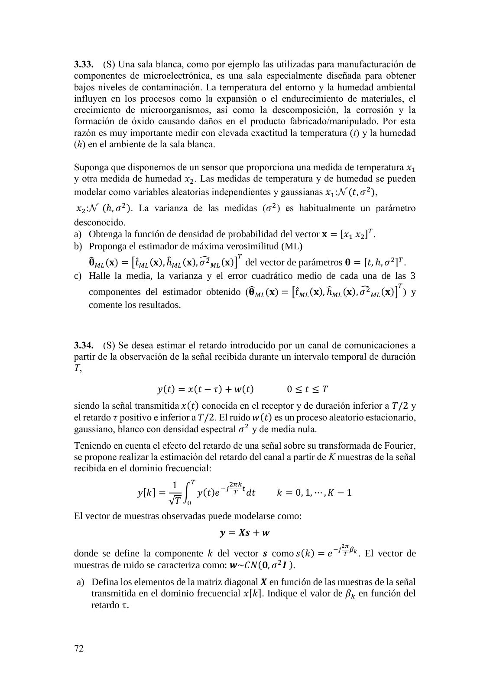

```text
3.33. (S) Una sala blanca, como por ejemplo las utilizadas para manufacturación de
componentes de microelectrónica, es una sala especialmente diseñada para obtener
bajos niveles de contaminación. La temperatura del entorno y la humedad ambiental
influyen en los procesos como la expansión o el endurecimiento de materiales, el
crecimiento de microorganismos, así como la descomposición, la corrosión y la
formación de óxido causando daños en el producto fabricado/manipulado. Por esta
razón es muy importante medir con elevada exactitud la temperatura (t) y la humedad
(h) en el ambiente de la sala blanca.

Suponga que disponemos de un sensor que proporciona una medida de temperatura 𝑥1
y otra medida de humedad 𝑥2 . Las medidas de temperatura y de humedad se pueden
modelar como variables aleatorias independientes y gaussianas 𝑥1 : (𝑡, 𝜎 2 ),
 𝑥2 : (ℎ, 𝜎 2 ). La varianza de las medidas (𝜎 2 ) es habitualmente un parámetro
desconocido.
a) Obtenga la función de densidad de probabilidad del vector 𝐱 = [𝑥1 𝑥2 ]𝑇 .
b) Proponga el estimador de máxima verosimilitud (ML)
     𝛉                              ̂2 𝑀𝐿 (𝐱)]𝑇 del vector de parámetros 𝛉 = [𝑡, ℎ, 𝜎 2 ]𝑇 .
     ̂𝑀𝐿 (𝐱) = [𝑡̂𝑀𝐿 (𝐱), ℎ̂𝑀𝐿 (𝐱), 𝜎
c) Halle la media, la varianza y el error cuadrático medio de cada una de las 3
   componentes del estimador obtenido (𝛉                                ̂2 𝑀𝐿 (𝐱)]𝑇 ) y
                                         ̂𝑀𝐿 (𝐱) = [𝑡̂𝑀𝐿 (𝐱), ℎ̂𝑀𝐿 (𝐱), 𝜎
     comente los resultados.


3.34. (S) Se desea estimar el retardo introducido por un canal de comunicaciones a
partir de la observación de la señal recibida durante un intervalo temporal de duración
T,

                      𝑦(𝑡) = 𝑥(𝑡 − 𝜏) + 𝑤(𝑡)             0≤𝑡≤𝑇
siendo la señal transmitida 𝑥(𝑡) conocida en el receptor y de duración inferior a 𝑇/2 y
el retardo 𝜏 positivo e inferior a 𝑇/2. El ruido 𝑤(𝑡) es un proceso aleatorio estacionario,
gaussiano, blanco con densidad espectral 𝜎 2 y de media nula.
Teniendo en cuenta el efecto del retardo de una señal sobre su transformada de Fourier,
se propone realizar la estimación del retardo del canal a partir de K muestras de la señal
recibida en el dominio frecuencial:
                                𝑇
                          1              2𝜋𝑘
                 𝑦[𝑘] =        ∫ 𝑦(𝑡)𝑒 −𝑗 𝑇 𝑡 𝑑𝑡      𝑘 = 0, 1, ⋯ , 𝐾 − 1
                          √𝑇 0
El vector de muestras observadas puede modelarse como:
                                       𝒚 = 𝑿𝒔 + 𝒘
                                                                        2𝜋
donde se define la componente 𝑘 del vector 𝒔 como 𝑠(𝑘) = 𝑒 −𝑗 𝑇 𝛽𝑘 . El vector de
muestras de ruido se caracteriza como: 𝒘~𝐶𝑁(𝟎, 𝜎 2 𝑰 ).
a) Defina los elementos de la matriz diagonal 𝑿 en función de las muestras de la señal
   transmitida en el dominio frecuencial 𝑥[𝑘]. Indique el valor de 𝛽𝑘 en función del
   retardo τ.


72
```

## Page 24

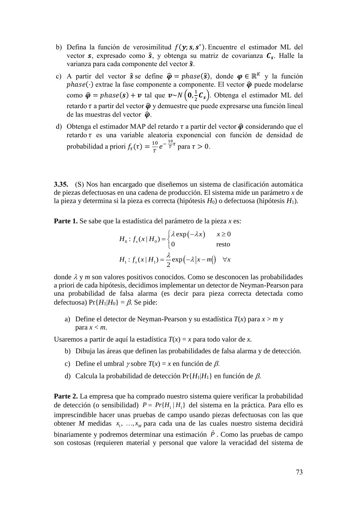

```text
b) Defina la función de verosimilitud 𝑓(𝒚; 𝒔, 𝒔∗ ). Encuentre el estimador ML del
   vector 𝒔, expresado como 𝒔̂, y obtenga su matriz de covarianza 𝑪𝒔 . Halle la
   varianza para cada componente del vector 𝒔̂.
c) A partir del vector 𝒔̂ se define 𝝋   ̂ = 𝑝ℎ𝑎𝑠𝑒(𝒔̂), donde 𝝋 ∈ ℝ𝐾 y la función
   𝑝ℎ𝑎𝑠𝑒(·) extrae la fase componente a componente. El vector 𝝋   ̂ puede modelarse
                                                 1
   como 𝝋 ̂ = 𝑝ℎ𝑎𝑠𝑒(𝒔) + 𝒗 tal que 𝒗~𝛮 (𝟎, 𝑪𝒔 ). Obtenga el estimador ML del
                                                 2
   retardo 𝜏 a partir del vector 𝝋
                                 ̂ y demuestre que puede expresarse una función lineal
   de las muestras del vector 𝝋  ̂.
d) Obtenga el estimador MAP del retardo 𝜏 a partir del vector 𝝋
                                                              ̂ considerando que el
   retardo 𝜏 es una variable aleatoria exponencial con función de densidad de
                                               10
                                      10
    probabilidad a priori 𝑓𝜏 (𝜏) = 𝑇 𝑒 − 𝑇 𝜏 para 𝜏 > 0.


3.35. (S) Nos han encargado que diseñemos un sistema de clasificación automática
de piezas defectuosas en una cadena de producción. El sistema mide un parámetro x de
la pieza y determina si la pieza es correcta (hipótesis H0) o defectuosa (hipótesis H1).

Parte 1. Se sabe que la estadística del parámetro de la pieza x es:
                                            exp ( − x )       x0
                       H0 : fx (x | H0 ) = 
                                           0                    resto
                                               
                       H1 : f x ( x | H1 ) =       exp ( − x − m ) x
                                               2
donde  y m son valores positivos conocidos. Como se desconocen las probabilidades
a priori de cada hipótesis, decidimos implementar un detector de Neyman-Pearson para
una probabilidad de falsa alarma (es decir para pieza correcta detectada como
defectuosa) Pr{H1H0} = . Se pide:

   a) Define el detector de Neyman-Pearson y su estadística T(x) para x > m y
      para x < m.
Usaremos a partir de aquí la estadística T(x) = x para todo valor de x.
   b) Dibuja las áreas que definen las probabilidades de falsa alarma y de detección.
   c) Define el umbral  sobre T(x) = x en función de 
   d) Calcula la probabilidad de detección Pr{H1H1} en función de .

Parte 2. La empresa que ha comprado nuestro sistema quiere verificar la probabilidad
de detección (o sensibilidad) P = Pr{H1 | H1} del sistema en la práctica. Para ello es
imprescindible hacer unas pruebas de campo usando piezas defectuosas con las que
obtener M medidas x1 , , xM para cada una de las cuales nuestro sistema decidirá
binariamente y podremos determinar una estimación P̂ . Como las pruebas de campo
son costosas (requieren material y personal que valore la veracidad del sistema de


                                                                                     73
```

## Page 25

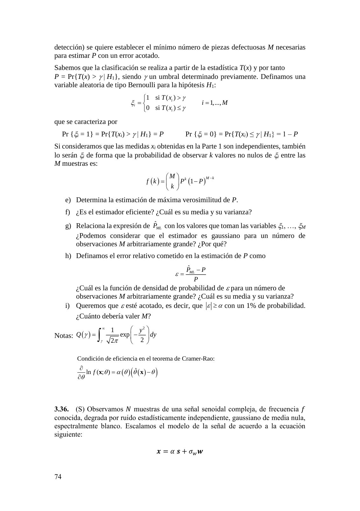

```text
detección) se quiere establecer el mínimo número de piezas defectuosas M necesarias
para estimar P con un error acotado.
Sabemos que la clasificación se realiza a partir de la estadística T(x) y por tanto
P = Pr{T(x) >   H1}, siendo  un umbral determinado previamente. Definamos una
variable aleatoria de tipo Bernoulli para la hipótesis H1:
                                      1 si T ( xi )  
                                 i =                           i = 1,..., M
                                      0 si T ( xi )  
que se caracteriza por
     Pr {i = 1} = Pr{T(xi) >   H1} = P                  Pr {i = 0} = Pr{T(xi) ≤   H1} = 1 ‒ P
Si consideramos que las medidas xi obtenidas en la Parte 1 son independientes, también
lo serán i de forma que la probabilidad de observar k valores no nulos de i entre las
M muestras es:
                                                 M 
                                       f ( k ) =   P k (1 − P )
                                                                  M −k

                                                 k 
      e) Determina la estimación de máxima verosimilitud de P.
      f) ¿Es el estimador eficiente? ¿Cuál es su media y su varianza?
      g) Relaciona la expresión de PˆML con los valores que toman las variables 1, …, M
         ¿Podemos considerar que el estimador es gaussiano para un número de
         observaciones M arbitrariamente grande? ¿Por qué?
      h) Definamos el error relativo cometido en la estimación de P como
                                                           PˆML − P
                                                    =
                                                               P
         ¿Cuál es la función de densidad de probabilidad de  para un número de
         observaciones M arbitrariamente grande? ¿Cuál es su media y su varianza?
      i) Queremos que  esté acotado, es decir, que    con un 1% de probabilidad.
         ¿Cuánto debería valer M?
                       
                                   y2 
                   
                           1
Notas: Q (  ) =              exp  −  dy
                          2      2 

          Condición de eficiencia en el teorema de Cramer-Rao:
           
          
                                 (         )
             ln f (x; ) =  ( ) ˆ ( x ) − 


3.36. (S) Observamos 𝑁 muestras de una señal senoidal compleja, de frecuencia 𝑓
conocida, degrada por ruido estadísticamente independiente, gaussiano de media nula,
espectralmente blanco. Escalamos el modelo de la señal de acuerdo a la ecuación
siguiente:

                                             𝒙 = 𝛼 𝒔 + 𝜎𝑤 𝒘


74
```

## Page 26

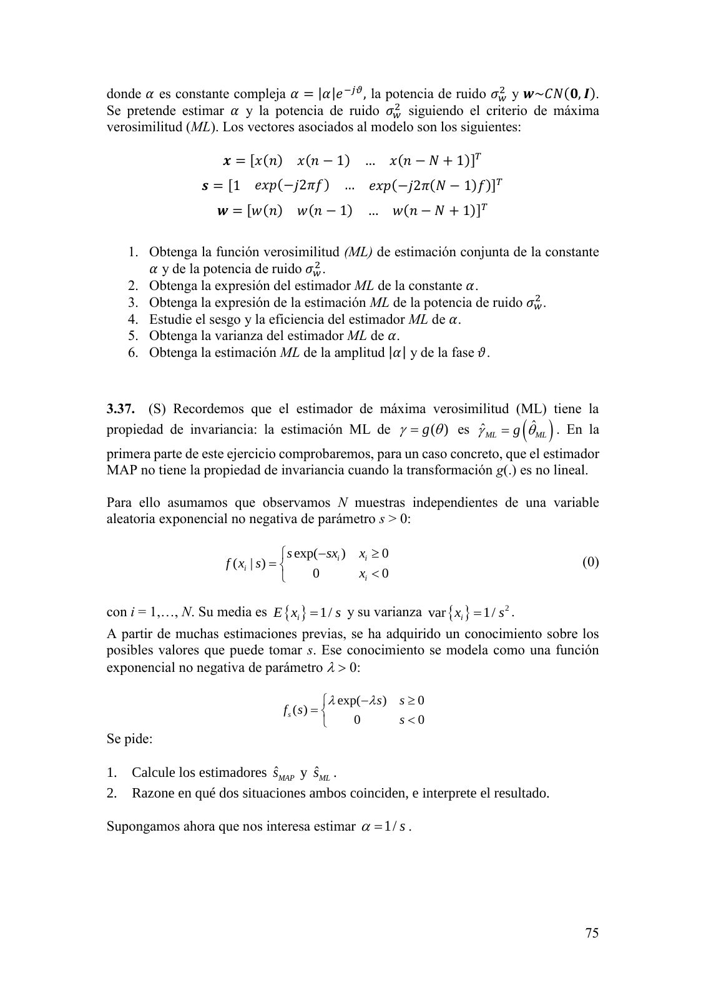

```text
donde 𝛼 es constante compleja 𝛼 = |𝛼|𝑒 −𝑗𝜗 , la potencia de ruido 𝜎𝑤2 y 𝒘~𝐶𝑁(𝟎, 𝑰).
Se pretende estimar 𝛼 y la potencia de ruido 𝜎𝑤2 siguiendo el criterio de máxima
verosimilitud (ML). Los vectores asociados al modelo son los siguientes:

                      𝒙 = [𝑥(𝑛) 𝑥(𝑛 − 1)                 … 𝑥(𝑛 − 𝑁 + 1)]𝑇
                  𝒔 = [1 𝑒𝑥𝑝(−𝑗2𝜋𝑓) …                     𝑒𝑥𝑝(−𝑗2𝜋(𝑁 − 1)𝑓)]𝑇
                     𝒘 = [𝑤(𝑛) 𝑤(𝑛 − 1)                  … 𝑤(𝑛 − 𝑁 + 1)]𝑇

     1. Obtenga la función verosimilitud (ML) de estimación conjunta de la constante
        𝛼 y de la potencia de ruido 𝜎𝑤2 .
     2. Obtenga la expresión del estimador ML de la constante 𝛼.
     3. Obtenga la expresión de la estimación ML de la potencia de ruido 𝜎𝑤2 .
     4. Estudie el sesgo y la eficiencia del estimador ML de 𝛼.
     5. Obtenga la varianza del estimador ML de 𝛼.
     6. Obtenga la estimación ML de la amplitud |𝛼| y de la fase 𝜗.


3.37. (S) Recordemos que el estimador de máxima verosimilitud (ML) tiene la
propiedad de invariancia: la estimación ML de  = g ( ) es ˆML = g ˆML . En la ( )
primera parte de este ejercicio comprobaremos, para un caso concreto, que el estimador
MAP no tiene la propiedad de invariancia cuando la transformación g(.) es no lineal.

Para ello asumamos que observamos N muestras independientes de una variable
aleatoria exponencial no negativa de parámetro s > 0:

                                       s exp(− sxi )   xi  0
                       f ( xi | s ) =                                                  (0)
                                            0          xi  0

con i = 1,…, N. Su media es E  xi  = 1/ s y su varianza var  xi  = 1/ s 2 .
A partir de muchas estimaciones previas, se ha adquirido un conocimiento sobre los
posibles valores que puede tomar s. Ese conocimiento se modela como una función
exponencial no negativa de parámetro   :

                                                exp(− s ) s  0
                                     f s (s) = 
                                                    0       s0
Se pide:

1.   Calcule los estimadores sˆMAP y sˆML .
2.   Razone en qué dos situaciones ambos coinciden, e interprete el resultado.

Supongamos ahora que nos interesa estimar  = 1/ s .


                                                                                        75
```

## Page 27

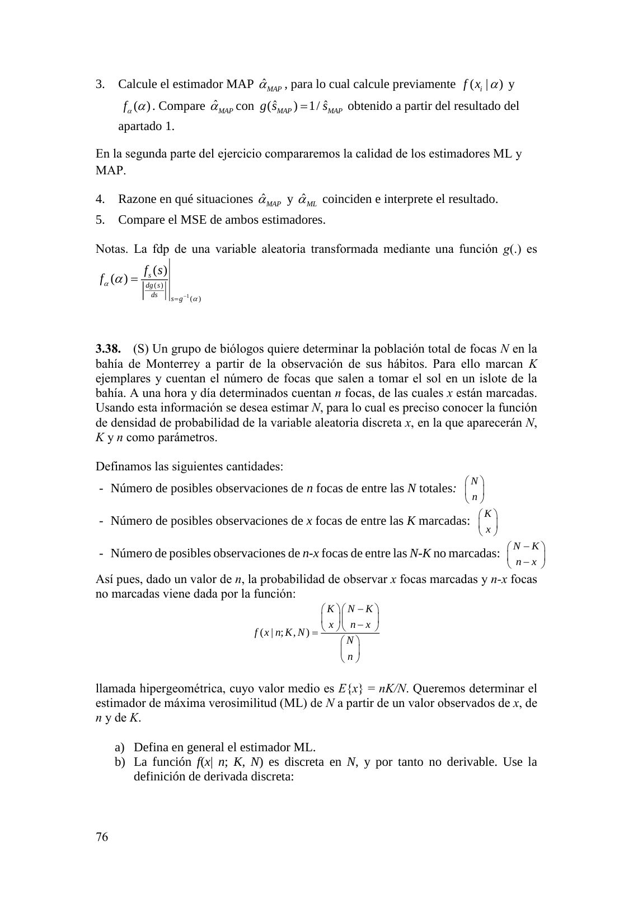

```text
3.   Calcule el estimador MAP ˆ MAP , para lo cual calcule previamente f ( xi |  ) y
      f ( ) . Compare ˆ MAP con g ( sˆMAP ) = 1/ sˆMAP obtenido a partir del resultado del
     apartado 1.

En la segunda parte del ejercicio compararemos la calidad de los estimadores ML y
MAP.

4.   Razone en qué situaciones ˆ MAP y ˆ ML coinciden e interprete el resultado.
5.   Compare el MSE de ambos estimadores.

Notas. La fdp de una variable aleatoria transformada mediante una función g(.) es
          f (s)
f ( ) = dgs ( s )
              ds
                      s = g −1 ( )


3.38. (S) Un grupo de biólogos quiere determinar la población total de focas N en la
bahía de Monterrey a partir de la observación de sus hábitos. Para ello marcan K
ejemplares y cuentan el número de focas que salen a tomar el sol en un islote de la
bahía. A una hora y día determinados cuentan n focas, de las cuales x están marcadas.
Usando esta información se desea estimar N, para lo cual es preciso conocer la función
de densidad de probabilidad de la variable aleatoria discreta x, en la que aparecerán N,
K y n como parámetros.

Definamos las siguientes cantidades:
                                                                                 N
- Número de posibles observaciones de n focas de entre las N totales:  
                                                                       n            
                                                                                     K
- Número de posibles observaciones de x focas de entre las K marcadas:                
                                                                                     x
                                                                                           N −K
- Número de posibles observaciones de n-x focas de entre las N-K no marcadas:                   
                                                                                            n−x 
Así pues, dado un valor de n, la probabilidad de observar x focas marcadas y n-x focas
no marcadas viene dada por la función:
                                                            K  N − K 
                                                                     
                                                                  n−x 
                                      f ( x | n; K , N ) =  
                                                             x
                                                                N
                                                                 
                                                                n

llamada hipergeométrica, cuyo valor medio es E{x} = nK/N. Queremos determinar el
estimador de máxima verosimilitud (ML) de N a partir de un valor observados de x, de
n y de K.

     a) Defina en general el estimador ML.
     b) La función f(x| n; K, N) es discreta en N, y por tanto no derivable. Use la
        definición de derivada discreta:


76
```

## Page 28

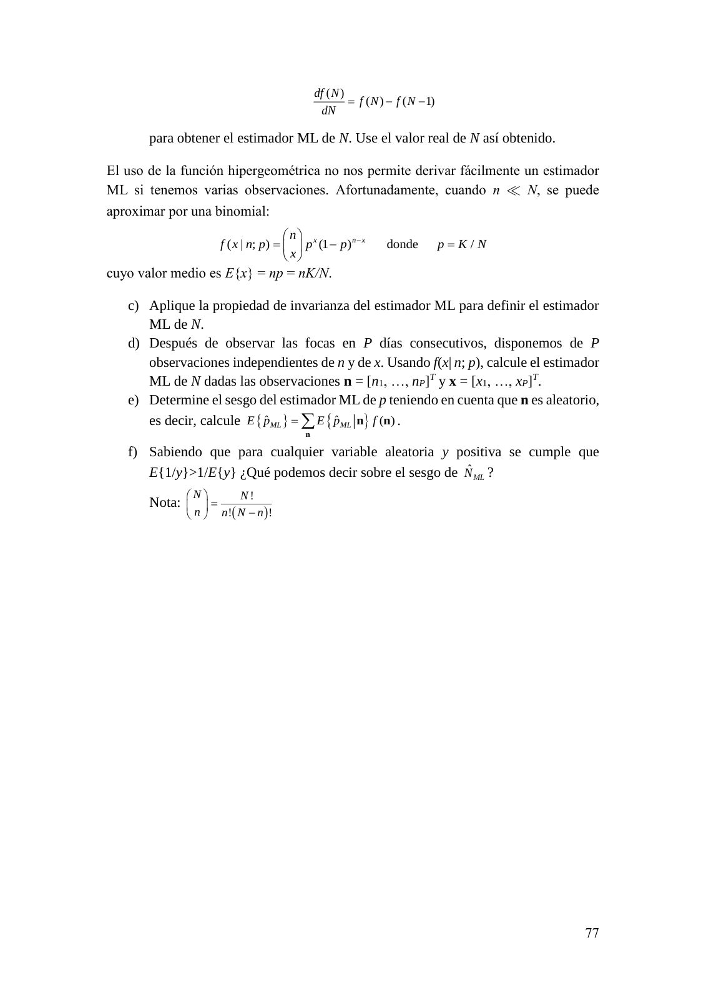

```text
                                               df ( N )
                                                        = f ( N ) − f ( N − 1)
                                                dN

       para obtener el estimador ML de N. Use el valor real de N así obtenido.

El uso de la función hipergeométrica no nos permite derivar fácilmente un estimador
ML si tenemos varias observaciones. Afortunadamente, cuando n  N, se puede
aproximar por una binomial:
                                      n
                      f ( x | n; p) =   p x (1 − p) n − x      donde           p=K/N
                                       x
cuyo valor medio es E{x} = np = nK/N.

   c) Aplique la propiedad de invarianza del estimador ML para definir el estimador
      ML de N.
   d) Después de observar las focas en P días consecutivos, disponemos de P
      observaciones independientes de n y de x. Usando f(x| n; p), calcule el estimador
      ML de N dadas las observaciones n = [n1, …, nP]T y x = [x1, …, xP]T.
   e) Determine el sesgo del estimador ML de p teniendo en cuenta que n es aleatorio,
      es decir, calcule E  pˆ ML  =  E  ˆpML n f (n) .
                                           n

   f) Sabiendo que para cualquier variable aleatoria y positiva se cumple que
      E{1/y}>1/E{y} ¿Qué podemos decir sobre el sesgo de Nˆ ML ?
              N          N!
       Nota:   =
              n  n !( N − n ) !


                                                                                         77
```

## Page 29

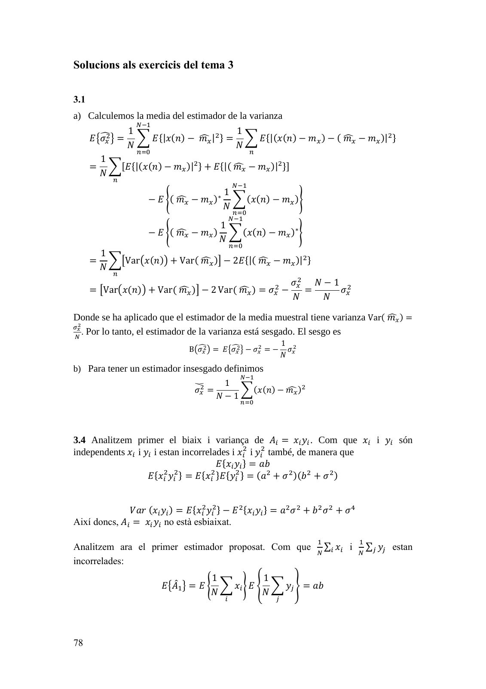

```text
Solucions als exercicis del tema 3

3.1
a) Calculemos la media del estimador de la varianza
                 𝑁−1
        ̂𝑥2 } = 1 ∑ 𝐸{|𝑥(𝑛) − 𝑚
      𝐸{𝜎
                                        1
                               ̂𝑥 |2 } = ∑ 𝐸{|(𝑥(𝑛) − 𝑚𝑥 ) − ( 𝑚
                                                               ̂𝑥 − 𝑚𝑥 )|2 }
                𝑁                       𝑁
                  𝑛=0                      𝑛
        1                    2
      = ∑[𝐸{|(𝑥(𝑛) − 𝑚𝑥 )| } + 𝐸{|( 𝑚   ̂𝑥 − 𝑚𝑥 )|2 }]
        𝑁
           𝑛
                                                𝑁−1
                                            1
                     − 𝐸 {( 𝑚
                            ̂𝑥 − 𝑚𝑥    )∗     ∑(𝑥(𝑛) − 𝑚𝑥 )}
                                            𝑁
                                                 𝑛=0
                                                𝑁−1
                                         1
                            ̂𝑥 − 𝑚𝑥 )
                     − 𝐸 {( 𝑚              ∑(𝑥(𝑛) − 𝑚𝑥 )∗ }
                                         𝑁
                                                𝑛=0
       1
      = ∑[Var(𝑥(𝑛)) + Var( 𝑚             ̂𝑥 − 𝑚𝑥 )|2}
                           ̂𝑥 )] − 2𝐸{|( 𝑚
       𝑁
           𝑛
                                                                𝜎𝑥2 𝑁 − 1 2
      = [Var(𝑥(𝑛)) + Var( 𝑚              ̂𝑥 ) = 𝜎𝑥2 −
                          ̂𝑥 )] − 2 Var( 𝑚                         =     𝜎𝑥
                                                                𝑁     𝑁

Donde se ha aplicado que el estimador de la media muestral tiene varianza Var( 𝑚
                                                                               ̂𝑥 ) =
𝜎𝑥2
𝑁
    . Por lo tanto, el estimador de la varianza está sesgado. El sesgo es
                                                              1 2
                                  ̂𝑥2 ) = 𝐸{𝜎
                                B(𝜎         ̂𝑥2 } − 𝜎𝑥2 = −    𝜎
                                                              𝑁 𝑥
b) Para tener un estimador insesgado definimos
                                                  𝑁−1
                                        1
                                  𝜎̌2
                                   𝑥 =              ̂𝑥 )2
                                           ∑(𝑥(𝑛) − 𝑚
                                       𝑁−1
                                                  𝑛=0


3.4 Analitzem primer el biaix i variança de 𝐴𝑖 = 𝑥𝑖 𝑦𝑖 . Com que 𝑥𝑖 i 𝑦𝑖 són
independents 𝑥𝑖 i 𝑦𝑖 i estan incorrelades i 𝑥𝑖2 i 𝑦𝑖2 també, de manera que
                                       𝐸{𝑥𝑖 𝑦𝑖 } = 𝑎𝑏
                   𝐸{𝑥𝑖 𝑦𝑖 } = 𝐸{𝑥𝑖 }𝐸{𝑦𝑖2 } = (𝑎2 + 𝜎 2 )(𝑏 2 + 𝜎 2 )
                        2 2          2


              𝑉𝑎𝑟 (𝑥𝑖 𝑦𝑖 ) = 𝐸{𝑥𝑖2 𝑦𝑖2 } − 𝐸 2 {𝑥𝑖 𝑦𝑖 } = 𝑎2 𝜎 2 + 𝑏 2 𝜎 2 + 𝜎 4
Així doncs, 𝐴𝑖 = 𝑥𝑖 𝑦𝑖 no està esbiaixat.
                                                                     1             1
Analitzem ara el primer estimador proposat. Com que 𝑁 ∑𝑖 𝑥𝑖 i 𝑁 ∑𝑗 𝑦𝑗 estan
incorrelades:
                                      1          1
                         𝐸{𝐴̂1 } = 𝐸 { ∑ 𝑥𝑖 } 𝐸 { ∑ 𝑦𝑗 } = 𝑎𝑏
                                      𝑁          𝑁
                                            𝑖             𝑗


78
```

## Page 30

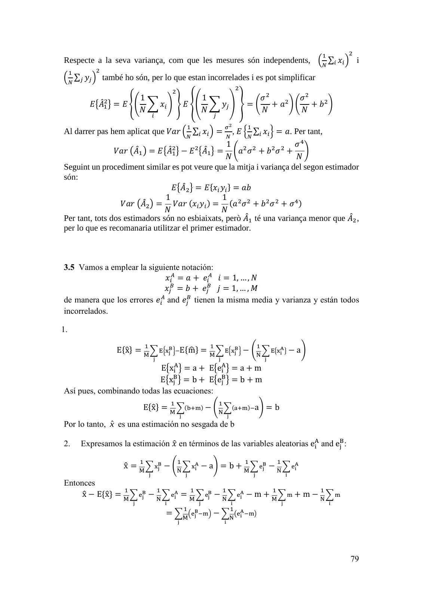

```text
                                                                                                                  1       2
Respecte a la seva variança, com que les mesures són independents, (𝑁 ∑𝑖 𝑥𝑖 ) i
     1       2
(𝑁 ∑𝑗 𝑦𝑗 ) també ho són, per lo que estan incorrelades i es pot simplificar
                                                                                      2
                                              2
                          1             1            𝜎2       𝜎2
           𝐸{𝐴̂12 } = 𝐸 {( ∑ 𝑥𝑖 ) } 𝐸 {( ∑ 𝑦𝑗 ) } = ( + 𝑎2 ) ( + 𝑏 2 )
                          𝑁             𝑁            𝑁        𝑁
                                     𝑖                            𝑗
                                                          1               𝜎2              1
Al darrer pas hem aplicat que 𝑉𝑎𝑟 (𝑁 ∑𝑖 𝑥𝑖 ) = 𝑁 , 𝐸 {𝑁 ∑𝑖 𝑥𝑖 } = 𝑎. Per tant,
                                                     1                  𝜎4
                𝑉𝑎𝑟 (𝐴̂1 ) = 𝐸{𝐴̂12 } − 𝐸 2 {𝐴̂1 } = (𝑎2 𝜎 2 + 𝑏 2 𝜎 2 + )
                                                     𝑁                  𝑁
Seguint un procediment similar es pot veure que la mitja i variança del segon estimador
són:
                                 𝐸{𝐴̂2 } = 𝐸{𝑥𝑖 𝑦𝑖 } = 𝑎𝑏
                               1                    1
                  𝑉𝑎𝑟 (𝐴̂2 ) = 𝑉𝑎𝑟 (𝑥𝑖 𝑦𝑖 ) = (𝑎2 𝜎 2 + 𝑏 2 𝜎 2 + 𝜎 4 )
                               𝑁                    𝑁
Per tant, tots dos estimadors són no esbiaixats, però 𝐴̂1 té una variança menor que 𝐴̂2 ,
per lo que es recomanaria utilitzar el primer estimador.


3.5 Vamos a emplear la siguiente notación:
                             𝑥𝑖𝐴 = 𝑎 + 𝑒𝑖𝐴 𝑖 = 1, … , 𝑁
                             𝑥𝑗𝐵 = 𝑏 + 𝑒𝑗𝐵 𝑗 = 1, … , 𝑀
de manera que los errores 𝑒𝑖𝐴 and 𝑒𝑗𝐵 tienen la misma media y varianza y están todos
incorrelados.

1.
                            1                   1              1
                    E{x̂} = M ∑ E{xBj }−E{m
                                          ̂ } = M ∑ E{xBj } − (N ∑ E{xAi } − a)
                                     j                                j                           j
                                         E{xiA } = a + E{eAi } = a + m
                                         E{xjB } = b + E{eBj } = b + m
Así pues, combinando todas las ecuaciones:
                                     1           1
                             E{x̂} = M ∑(b+m) − (N ∑(a+m)−a) = b
                                                      j                       j
Por lo tanto, x̂ es una estimación no sesgada de b

2.       Expresamos la estimación 𝑥̂ en términos de las variables aleatorias eAi and eBj :

                             1                    1                                       1           1
                      x̂ = M ∑ xBj − (N ∑ xAi − a) = b + M ∑ eBj − N ∑ eAi
                                 j                        j                                   j               i
Entonces
                  1         1         1         1             1           1
     x̂ − E{x̂} = M ∑ eBj − N ∑ eAi = M ∑ eBj − N ∑ eAi − m + M ∑ m + m − N ∑ m
                         j                i                   j                   i                       j           i
                                             1            1
                                          = ∑M(eBj −m) − ∑N(eAi −m)
                                                  j                       i


                                                                                                                          79
```

## Page 31

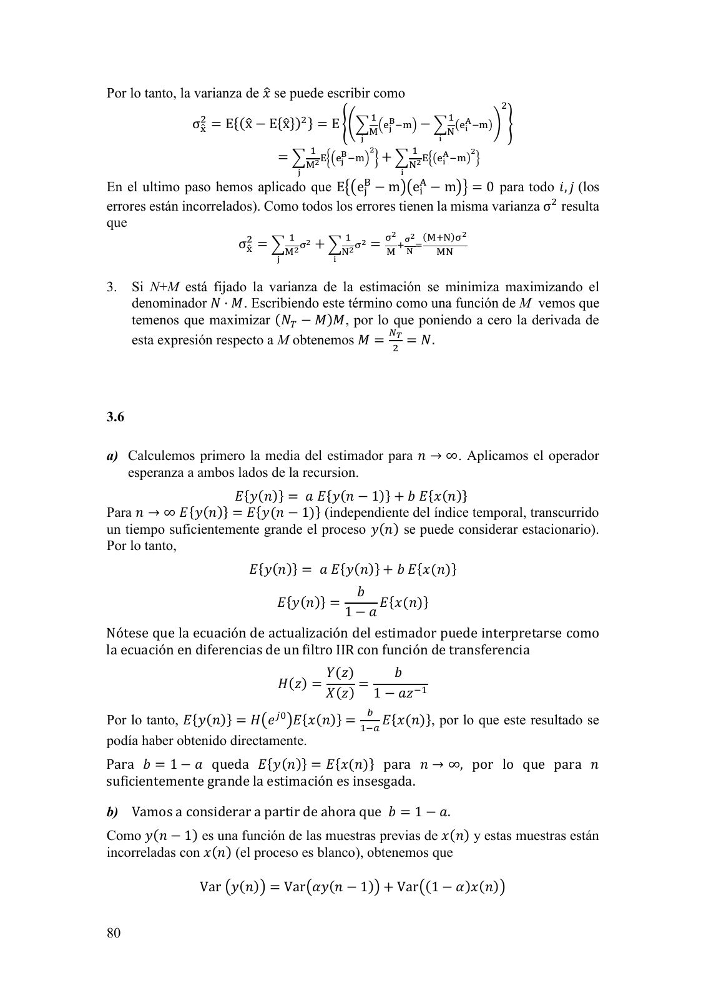

```text
Por lo tanto, la varianza de 𝑥̂ se puede escribir como
                                                                    2
                2                    2}        1 B         1 A
               σ ̂x = E{(x̂ − E{x̂})    = E {(∑M(ej −m) − ∑N(ei −m)) }
                                                  j                      i
                                 1            2     1            2
                              = ∑M2 E{(eBj −m) } + ∑N2 E{(eAi −m) }
                                      j                        i
En el ultimo paso hemos aplicado que E{(eBj − m)(eAi − m)} = 0 para todo 𝑖, 𝑗 (los
                                                                        2
errores están incorrelados). Como todos los errores tienen la misma varianza σ resulta
que
                                  1           1           σ2       2   (M+N)σ2
                       σ2̂x = ∑M2 σ2 + ∑N2 σ2 = M +σN =                  MN
                              j           i


3.    Si N+M está fijado la varianza de la estimación se minimiza maximizando el
      denominador 𝑁 · 𝑀. Escribiendo este término como una función de M vemos que
      temenos que maximizar (𝑁𝑇 − 𝑀)𝑀, por lo que poniendo a cero la derivada de
                                                𝑁
      esta expresión respecto a M obtenemos 𝑀 = 2𝑇 = 𝑁.


3.6

a) Calculemos primero la media del estimador para 𝑛 → ∞. Aplicamos el operador
   esperanza a ambos lados de la recursion.
                     𝐸{𝑦(𝑛)} = 𝑎 𝐸{𝑦(𝑛 − 1)} + 𝑏 𝐸{𝑥(𝑛)}
Para 𝑛 → ∞ 𝐸{𝑦(𝑛)} = 𝐸{𝑦(𝑛 − 1)} (independiente del índice temporal, transcurrido
un tiempo suficientemente grande el proceso 𝑦(𝑛) se puede considerar estacionario).
Por lo tanto,
                         𝐸{𝑦(𝑛)} = 𝑎 𝐸{𝑦(𝑛)} + 𝑏 𝐸{𝑥(𝑛)}
                                            𝑏
                              𝐸{𝑦(𝑛)} =        𝐸{𝑥(𝑛)}
                                          1−𝑎
Nótese que la ecuación de actualización del estimador puede interpretarse como
la ecuación en diferencias de un filtro IIR con función de transferencia
                                          𝑌(𝑧)    𝑏
                               𝐻(𝑧) =          =
                                          𝑋(𝑧) 1 − 𝑎𝑧 −1
                                                      𝑏
Por lo tanto, 𝐸{𝑦(𝑛)} = 𝐻(𝑒 𝑗0 )𝐸{𝑥(𝑛)} = 1−𝑎 𝐸{𝑥(𝑛)}, por lo que este resultado se
podía haber obtenido directamente.
Para 𝑏 = 1 − 𝑎 queda 𝐸{𝑦(𝑛)} = 𝐸{𝑥(𝑛)} para 𝑛 → ∞, por lo que para 𝑛
suficientemente grande la estimación es insesgada.

b) Vamos a considerar a partir de ahora que 𝑏 = 1 − 𝑎.
Como 𝑦(𝑛 − 1) es una función de las muestras previas de 𝑥(𝑛) y estas muestras están
incorreladas con 𝑥(𝑛) (el proceso es blanco), obtenemos que

                Var (𝑦(𝑛)) = Var(𝛼𝑦(𝑛 − 1)) + Var((1 − 𝛼)𝑥(𝑛))


80
```

## Page 32

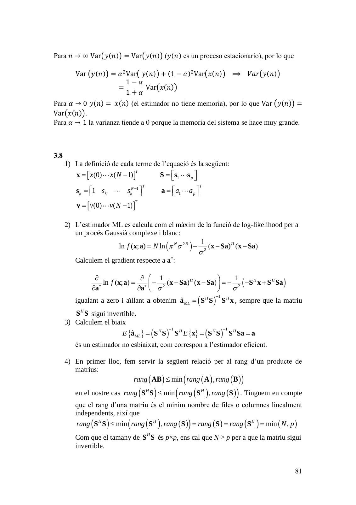

```text
Para 𝑛 → ∞ Var(𝑦(𝑛)) = Var(𝑦(𝑛)) (𝑦(𝑛) es un proceso estacionario), por lo que

         Var (𝑦(𝑛)) = 𝛼 2 Var( 𝑦(𝑛)) + (1 − 𝛼)2 Var(𝑥(𝑛)) ⟹ 𝑉𝑎𝑟(𝑦(𝑛))
                          1−𝛼
                      =         Var(𝑥(𝑛))
                          1+𝛼
Para 𝛼 → 0 𝑦(𝑛) = 𝑥(𝑛) (el estimador no tiene memoria), por lo que Var (𝑦(𝑛)) =
Var(𝑥(𝑛)).
Para 𝛼 → 1 la varianza tiende a 0 porque la memoria del sistema se hace muy grande.


3.8
      1) La definició de cada terme de l’equació és la següent:
          x =  x(0)     x( N − 1)                 S = s1       s p 
                                       T


                                            T                                T
          s k = 1 sk          skN −1            a =  a1       a p 

          v =  v(0)     v( N − 1) 
                                    T


      2) L’estimador ML es calcula com el màxim de la funció de log-likelihood per a
         un procés Gaussià complexe i blanc:
                                                      (
                                                      1
                                                                    ) 
                       ln f (x; a) = N ln  N  2 N − 2 (x − Sa) H (x − Sa)
         Calculem el gradient respecte a a*:

                                    1                       
                     ln f (x; a) =   − 2 (x − Sa) H (x − Sa)  = − 2 ( −S H x + S H Sa )
                                                                     1
                a 
                                  a                             
         igualant a zero i aïllant a obtenim aˆ ML = ( S H S ) S H x , sempre que la matriu
                                                                                 −1


          S H S sigui invertible.
      3) Calculem el biaix
                              E aˆ ML  = ( S H S ) S H E x = ( S H S ) S H Sa = a
                                                          −1                          −1


         és un estimador no esbiaixat, com correspon a l’estimador eficient.

      4) En primer lloc, fem servir la següent relació per al rang d’un producte de
         matrius:
                                    rang ( AB )  min ( rang ( A ) , rang ( B ) )
                                                               (                           )
         en el nostre cas rang ( S H S )  min rang ( S H ) , rang ( S ) . Tinguem en compte
         que el rang d’una matriu és el minim nombre de files o columnes linealment
         independents, així que
                                (                                  )
          rang ( S H S )  min rang ( S H ) , rang ( S ) = rang ( S ) = rang ( S H ) = min ( N , p )
                                                H
         Com que el tamany de S S és p×p, ens cal que N ≥ p per a que la matriu sigui
         invertible.


                                                                                                 81
```

## Page 33

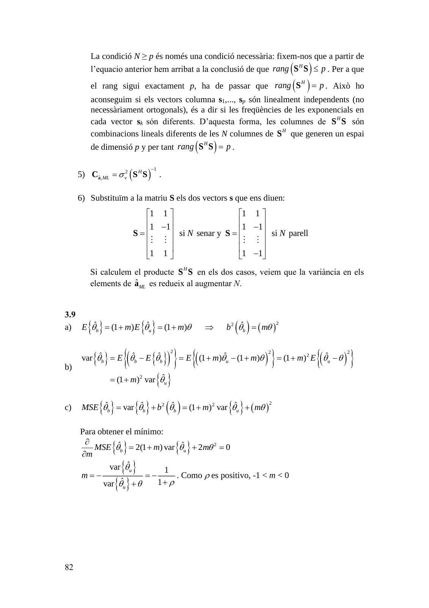

```text
         La condició N ≥ p és només una condició necessària: fixem-nos que a partir de
                                                          ( )
         l’equacio anterior hem arribat a la conclusió de que rang S S  p . Per a que
                                                                    H


         el rang sigui exactament p, ha de passar que rang ( S ) = p . Això ho
                                                                                     H


         aconseguim si els vectors columna s1,..., sp són linealment independents (no
         necessàriament ortogonals), és a dir si les freqüències de les exponencials en
         cada vector sk són diferents. D’aquesta forma, les columnes de S H S són
         combinacions lineals diferents de les N columnes de S H que generen un espai
         de dimensió p y per tant rang S S = p .
                                         H
                                                    (       )
     5) Caˆ , ML =  v2 ( S H S ) .
                                −1


     6) Substituïm a la matriu S els dos vectors s que ens diuen:
                            1 1                   1 1 
                            1 −1                      
                          S=     si N senar y S = 1 −1 si N parell
                                                      
                                                      
                            1 1                   1 −1
         Si calculem el producte S H S en els dos casos, veiem que la variància en els
         elements de â ML es redueix al augmentar N.


3.9
                          
a) E ˆb = (1 + m) E ˆu = (1 + m)                                ( )
                                                                b 2 ˆb = ( m )
                                                                                 2


b)
                   (      )  = E ( (1 + m)ˆ − (1 + m) )  = (1 + m) E (ˆ −  ) 
      var ˆb = E ˆb − E ˆb
                                          2

                                                                u
                                                                              2
                                                                                         2
                                                                                             u
                                                                                                 2


                = (1 + m) var ˆ 
                           2
                                      u


c)                                ( )
      MSE ˆb = var ˆb + b 2 ˆb = (1 + m) 2 var ˆu + ( m )
                                                               2
                                                                 
     Para obtener el mínimo:
      
     m
                                             
         MSE ˆb = 2(1 + m) var ˆu + 2m 2 = 0


     m=−
                    
             var ˆu
                       =−
                             1
                                . Como  es positivo, -1 < m < 0
                   
           var ˆu +     1+ 


82
```

## Page 34

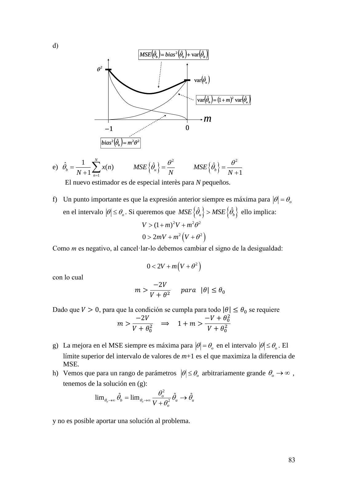

```text
d)
                                               ( )           ( )       ( )
                                          MSE ˆb = bias 2 ˆb + var ˆb

                2
                                                                   var ˆu ( )
                                                                            ( )               ( )
                                                                       var ˆb = (1 + m ) var ˆu
                                                                                         2


                                                                           m
                     −1                                        0

                          ( )
                    bias 2 ˆb = m 2 2


                                   ˆ =                ˆ =                 
                N

               
                                           2                    2
          1
e) ˆ =             x ( n ) MSE                   MSE  
         N + 1 n =1                                           N +1
     b                              u                     b
                                          N
     El nuevo estimador es de especial interès para N pequeños.

f) Un punto importante es que la expresión anterior siempre es máxima para  =  o

                                                                    
     en el intervalo    o . Si queremos que MSE ˆu  MSE ˆb ello implica:        
                                          V  (1 + m) V + m 
                                                         2         2   2


                                           0  2mV + m 2 (V +  2 )
Como m es negativo, al cancel·lar-lo debemos cambiar el signo de la desigualdad:

                                             0  2V + m (V +  2 )
con lo cual
                                               −2𝑉
                                    𝑚>                       𝑝𝑎𝑟𝑎 |𝜃| ≤ 𝜃0
                                              𝑉 + 𝜃2

Dado que 𝑉 > 0, para que la condición se cumpla para todo |𝜃| ≤ 𝜃0 se requiere
                            −2𝑉                    −𝑉 + 𝜃02
                     𝑚>              ⟹ 1+𝑚 >
                           𝑉 + 𝜃02                   𝑉 + 𝜃02

g) La mejora en el MSE siempre es máxima para  =  o en el intervalo    o . El
   límite superior del intervalo de valores de m+1 es el que maximiza la diferencia de
   MSE.
h) Vemos que para un rango de parámetros    o arbitrariamente grande  o →  ,
     tenemos de la solución en (g):
                                                  o2 ˆ
                limo → ˆb = limo →                → ˆu
                                               V + o2 u


y no es posible aportar una solución al problema.


                                                                                                    83
```

## Page 35

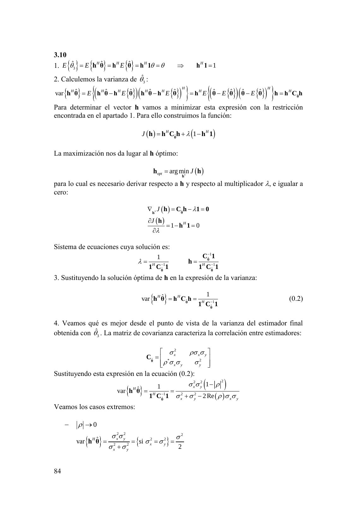

```text
3.10
                           
1. E ˆ3 = E h H θˆ = h H E θˆ = h H 1 =                           hH 1 = 1

2. Calculemos la varianza de ˆ3 :

             (               ) (h θˆ − h E θˆ )  = h E (θˆ − E θˆ ) (θˆ − E θˆ ) h = h C h
var h H θˆ = E h H θˆ − h H E θˆ       H          H
                                                             H
                                                                      H
                                                                                                H
                                                                                                    H
                                                                                                        θˆ


Para determinar el vector h vamos a minimizar esta expresión con la restricción
encontrada en el apartado 1. Para ello construimos la función:

                                      J ( h ) = h H Cθˆ h +  (1 − h H 1)

La maximización nos da lugar al h óptimo:

                                             hopt = arg min
                                                         
                                                            J (h)
                                                             h

para lo cual es necesario derivar respecto a h y respecto al multiplicador , e igualar a
cero:

                                         h J ( h ) = Cθˆ h − 1 = 0
                                           J ( h )
                                                       = 1 − hH 1 = 0
                                             

Sistema de ecuaciones cuya solución es:
                                              1                           Cθ−ˆ 11
                                    =                           h=
                                           1 Cθ−ˆ 11
                                            H
                                                                      1H Cθ−ˆ 11
3. Sustituyendo la solución óptima de h en la expresión de la varianza:


                                             
                                      var h H θˆ = h H Cθˆ h =
                                                                        1
                                                                      1 Cθ−ˆ 11
                                                                          H
                                                                                                    (0.2)


4. Veamos qué es mejor desde el punto de vista de la varianza del estimador final
obtenida con ˆ3 . La matriz de covarianza caracteriza la correlación entre estimadores:

                                               2                x y 
                                        Cθˆ =  * x                      
                                                 x y          y2 
Sustituyendo esta expresión en la ecuación (0.2):
                                               x2 y2 1 − 
                                                             2
                                                                          (         )
                                 1 C 1 =  +  − 2 Re (  ) 
                                    1
                           var h H θˆ =      H    −1        2     2
                                                  θˆ        x     y                     x   y

Veamos los casos extremos:

     −    →0
                          x2 y2                     2
             
         var h H θˆ =
                         x2 +  y2
                                    =  x y 2
                                       si  2
                                              =  2
                                                    =


84
```

## Page 36

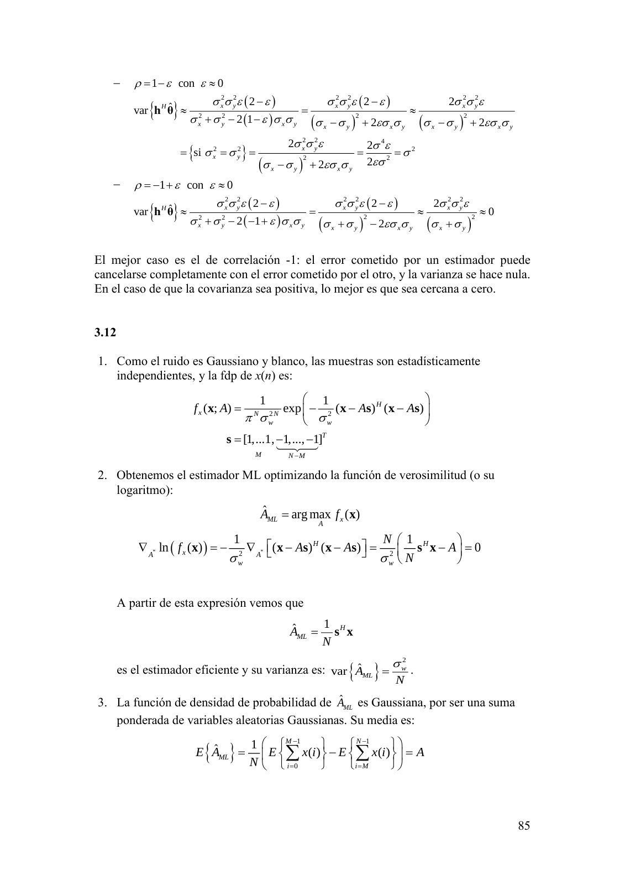

```text
   −       = 1 −  con   0
                            x2 y2 ( 2 −  )            x2 y2 ( 2 −  )         2 x2 y2
               Hˆ
          var h θ  2                               =                        
                       x +  y2 − 2 (1 −  )  x y ( x −  y )2 + 2 x y ( x −  y )2 + 2 x y

                                                        2 x2 y2               2 4
                     = si  =   =
                              2          2
                                                                             =         =2
                                               ( −  ) + 2                   2
                              x          y                   2                       2
                                                    x    y           x   y

   −       = −1 +  con   0
                             x2 y2 ( 2 −  )             x2 y2 ( 2 −  )   2 x2 y2
              
          var h H θˆ  2                              =                        
                       x +  y2 − 2 ( −1 +  )  x y ( x +  y )2 − 2 x y ( x +  y )2
                                                                                              0


El mejor caso es el de correlación -1: el error cometido por un estimador puede
cancelarse completamente con el error cometido por el otro, y la varianza se hace nula.
En el caso de que la covarianza sea positiva, lo mejor es que sea cercana a cero.


3.12

1. Como el ruido es Gaussiano y blanco, las muestras son estadísticamente
   independientes, y la fdp de x(n) es:
                                                1     1                                
                         f x (x; A) =            exp  −      ( x − A s ) H
                                                                            ( x − A s ) 
                                       N  w2 N      w
                                                            2
                                                                                        
                                  s = [1,...1, −1,..., −1]T

                                               M        N −M

2. Obtenemos el estimador ML optimizando la función de verosimilitud (o su
   logaritmo):
                                                Aˆ ML = arg max f x ( x)
                                                                 A

                                     1                                             N 1 H        
            A* ln ( f x (x) ) = −            A* (x − As) H (x − As)  =        2 
                                                                                          s x − A = 0
                                        2
                                         w                                         w  N        


       A partir de esta expresión vemos que
                                                               1
                                                        Aˆ ML = s H x
                                                               N
                                                                                      w2
       es el estimador eficiente y su varianza es: var Aˆ ML =                      N
                                                                                            .

3. La función de densidad de probabilidad de Aˆ ML es Gaussiana, por ser una suma
   ponderada de variables aleatorias Gaussianas. Su media es:
                                             1   M −1                        
                             
                         E Aˆ ML =              
                                                E
                                             N   i =0
                                                        x (i )
                                                               
                                                               
                                                               
                                                                 − E
                                                                      N −1
                                                                       x(i )   = A
                                                                     i = M    


                                                                                                         85
```

## Page 37

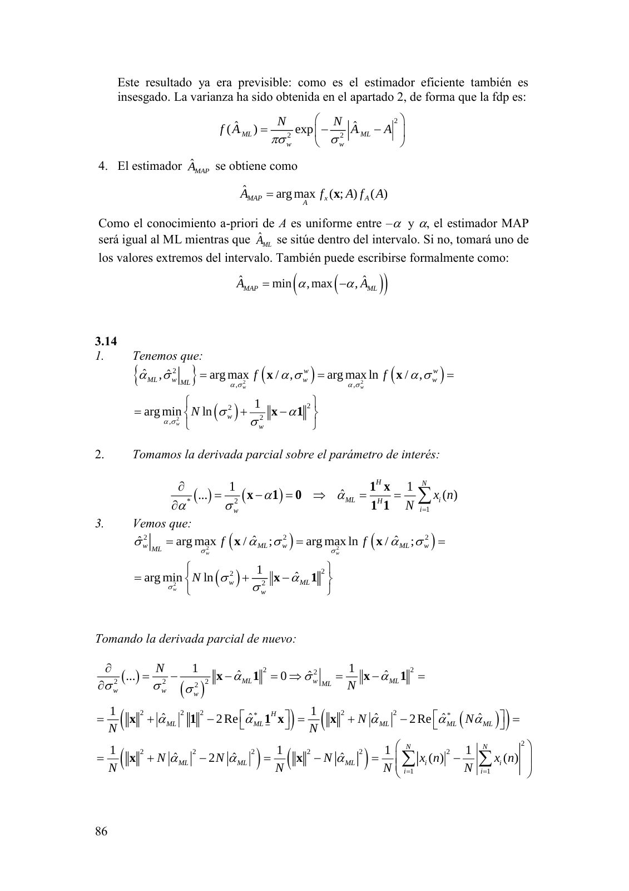

```text
         Este resultado ya era previsible: como es el estimador eficiente también es
         insesgado. La varianza ha sido obtenida en el apartado 2, de forma que la fdp es:
                                                                      N        N             2
                                                      f ( Aˆ¨ ML ) =      exp  − 2 Aˆ¨ ML − A 
                                                                      w
                                                                        2
                                                                               w             
4. El estimador Aˆ MAP se obtiene como

                                                            Aˆ MAP = arg max f x (x; A) f A ( A)
                                                                                          A


Como el conocimiento a-priori de A es uniforme entre – y , el estimador MAP
será igual al ML mientras que Aˆ ML se sitúe dentro del intervalo. Si no, tomará uno de
los valores extremos del intervalo. También puede escribirse formalmente como:

                                                                                      (
                                                           Aˆ MAP = min  , max − , Aˆ ML         (                     ))

3.14
1.               Tenemos que:
                 ˆ ML , ˆ w2            
                                = arg max2 f ( x /  ,  ww ) = arg max2 ln f ( x /  ,  ww ) =
                                      ML                  , w                                             , w

                                                     2
                 = arg min2  N ln ( w2 ) + 2 x −  1 
                                             1
                        , w
                                           w         

2.               Tomamos la derivada parcial sobre el parámetro de interés:

                                       1                                 1H x 1 N
                                ( ) 2(
                                 ... =     x  −   1 )  =  0     ˆ    =        =  xi (n)
                            *        w                            ML
                                                                          1H 1 N i =1
3.               Vemos que:
                 ˆ w2 ML = arg max f ( x / ˆ ML ;  w2 ) = arg max ln f ( x / ˆ ML ;  w2 ) =
                                                w2                                             w2

                                                        2
                             N ln ( w2 ) + 2 x − ˆ ML 1 
                                            1
                 = arg min 
                        w
                         2
                                          w             


Tomando la derivada parcial de nuevo:

                        N                 1                                                               1
             (...) =             −                    x − ˆ ML 1 = 0  ˆ w2                      =         x − ˆ ML 1 =
                                                                          2                                             2

                                   ( ) 2 2
         2                   2
         w                   w
                                                                                              ML           N
                                           w


=
     1
     N
             ( x + ˆ2
                                 ML
                                      2
                                          1 − 2 Re ˆ ML
                                               2        *
                                                           1 x  =
                                                                              H
                                                                                  ) N1 ( x + N ˆ      2
                                                                                                                         ML
                                                                                                                              2
                                                                                                                                  − 2 Re ˆ ML
                                                                                                                                              *
                                                                                                                                                           )
                                                                                                                                                 ( Nˆ ML ) =
                                                                                                                         1 N                                         
             (                                                        )           (                                 )
                                                                                                                                                                  2
  1                                                                         1                                                         1 N
=                x + N ˆ ML − 2 N ˆ ML                                  =           x − N ˆ ML                       =   xi (n) −  xi (n)
                     2                     2                      2                       2                    2                    2
                                                                                                                                                                      
  N                                                                         N                                            N  i =1    N i =1                          
                                                                                                                                                                      


86
```

## Page 38

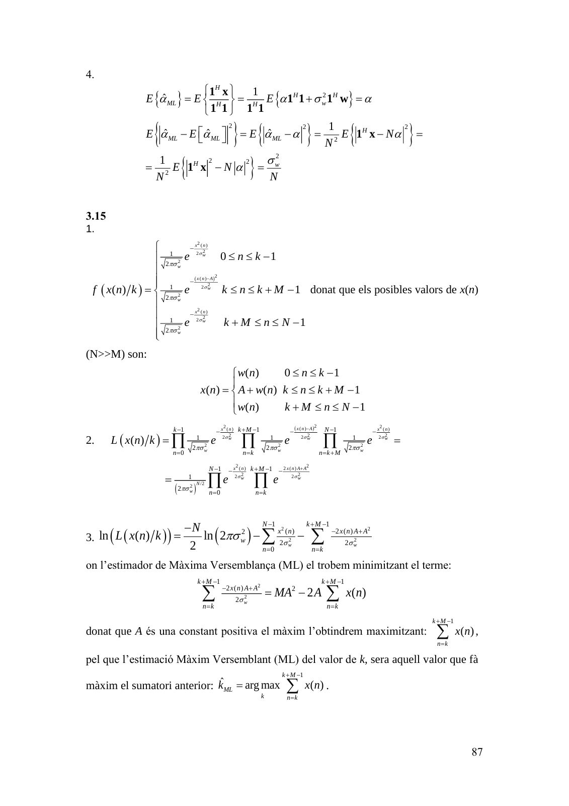

```text
4.
                               1H x  1
               E ˆ ML  = E  H  = H E  1H 1 +  w2 1H w = 
                              1 1 1 1

                   
               E ˆ ML − E ˆ ML 
                                                           2
                                                                = E  ˆ −   = N1 E  1 x − N  =
                                                                                 ML
                                                                                                     2
                                                                                                                      2
                                                                                                                                  H                        2


               =
                   1
                   N2
                      E 1 H
                            x2
                                − N 
                                      2
                                        =
                                           w2
                                          N
                                                                       
3.15
1.
                  1 − x2( 2wn )
                                        2


                  2 2 e                   0  n  k −1
                      w


                 
                  1 − 2 w2
                            ( x ( n ) − A )2

 f ( x (n) k ) =         e                  k  n  k + M − 1 donat que els posibles valors de x(n)
                   2 w2
                 
                  1 − x2(w2n )
                              2


                  2 2 e                    k + M  n  N −1
                 
                      w


(N>>M) son:
                                                    w(n)     0  n  k −1
                                                   
                                            x(n) =  A + w(n) k  n  k + M − 1
                                                    w(n)     k + M  n  N −1
                                                   
                           k −1                                                                 ( x ( n )− A )2
                                                    − x ( 2n ) k + M −1                                            N −1
                                                       2                                                                                      2
                                                                                            −                                             − x ( 2n )
2.     L ( x ( n) k ) =                1
                                                e      2 w
                                                                               1
                                                                                        e           2 2
                                                                                                       w
                                                                                                                             1
                                                                                                                                      e      2 w
                                                                                                                                                       =
                                       2 w2                                  2 w2                                        2 w2
                           n =0                                    n=k                                            n=k + M

                                                N −1       − x ( 2n ) k + M −1 − 2 x ( n ) A2+ A
                                                               2                                         2


                       =
                           ( 2 )
                                   1
                                   2 N /2
                                   w
                                                e
                                                n =0
                                                               2 w
                                                                         e
                                                                         n=k
                                                                                            2 w


                                  −N                 N −1 2       k + M −1
3. ln ( L ( x(n) k ) ) =             ln ( 2 w2 ) −  x2( n2 ) −  −2 x (2n) A2 + A
                                                                                       2


                                   2                 n =0
                                                            w
                                                                    n=k
                                                                                w


on l’estimador de Màxima Versemblança (ML) el trobem minimitzant el terme:
                                         k + M −1                                                                 k + M −1

                                            
                                            n=k
                                                       −2 x ( n ) A+ A2
                                                               2 w2
                                                                               = MA2 − 2 A  x(n)
                                                                                                                    n=k
                                                                                                                                                               k + M −1
donat que A és una constant positiva el màxim l’obtindrem maximitzant:                                                                                           x ( n) ,
                                                                                                                                                                n=k

pel que l’estimació Màxim Versemblant (ML) del valor de k, sera aquell valor que fà
                                                                                        k + M −1
màxim el sumatori anterior: kˆML = arg max  x(n) .
                                                                           k             n=k


                                                                                                                                                                          87
```

## Page 39

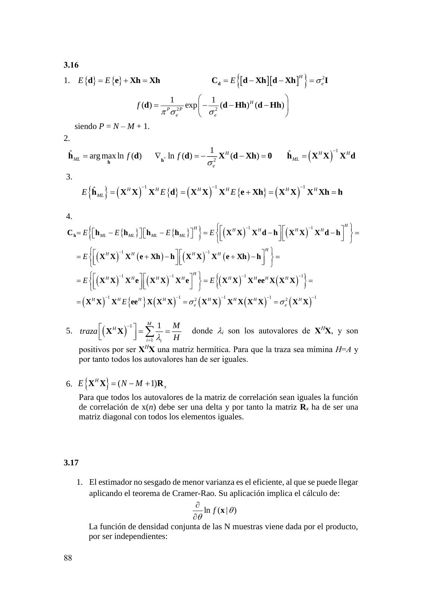

```text
3.16
1. E d = E e + Xh = Xh                                                  
                                                              Cd = E d − Xh d − Xh 
                                                                                              H
                                                                                                  = I    2
                                                                                                           e


                                           1             1                       
                            f (d) =                 exp  − 2 (d − Hh) H (d − Hh) 
                                       
                                       P       2P
                                               e         e                      
     siendo P = N – M + 1.
2.

                                                                                          hˆ ML = ( X H X ) X H d
                                                              1                                            −1
 hˆ ML = arg max ln f (d)          h* ln f (d) = −                    X H (d − Xh) = 0
                     h                                           2
                                                                  e

3.
          
       E hˆ ML = ( X H X ) X H E d = ( X H X ) X H E e + Xh = ( X H X ) X H Xh = h
                             −1                                   −1                          −1


4.

                                                       
                                                                                                         
                                                    = E  ( X H X ) X H d − h  ( X H X ) X H d − h   =
                                                                    −1                     −1           H
 C h = E h ML − E h ML  h ML − E h ML 
                                                      H

                                                         
                                                                              
                                                                                
                                                                                                     
                                                                                                         
                                                                            
     = E  ( X H X ) X H ( e + Xh ) − h  ( X H X ) X H ( e + Xh ) − h   =
                     −1                              −1                    H


                                      
                                                                      
                                                                          
                                                  
                                                                   
     = E  ( X H X ) X H e  ( X H X ) X H e   = E ( X H X ) X H ee H X ( X H X ) =           
                     −1                 −1       H              −1                   −1

                                         

     = ( X H X ) X H E ee H  X ( X H X ) =  e2 ( X H X ) X H X ( X H X ) =  e2 ( X H X )
                    −1                         −1                      −1            −1               −1


5. traza ( X H X )  =  =
                          M
                   −1         1 M
                                     donde i son los autovalores de XHX, y son
                     i =1   H
                               i
   positivos por ser XHX una matriz hermítica. Para que la traza sea mímina H=A y
   por tanto todos los autovalores han de ser iguales.

                   
6. E X X = ( N − M + 1)R x
                H


       Para que todos los autovalores de la matriz de correlación sean iguales la función
       de correlación de x(n) debe ser una delta y por tanto la matriz Rx ha de ser una
       matriz diagonal con todos los elementos iguales.


3.17

     1. El estimador no sesgado de menor varianza es el eficiente, al que se puede llegar
        aplicando el teorema de Cramer-Rao. Su aplicación implica el cálculo de:
                                      
                                        ln f (x |  )
                                     
        La función de densidad conjunta de las N muestras viene dada por el producto,
        por ser independientes:

88
```

## Page 40

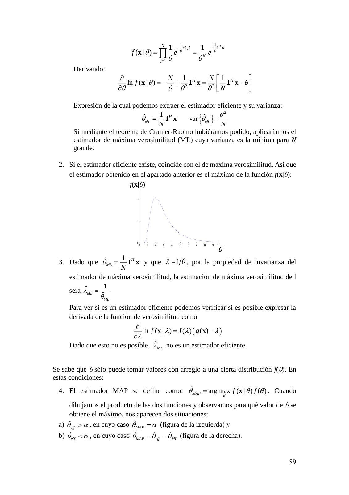

```text
                                                1 −1 x ( j ) 1 −1 1H x
                                                     N
                              f (x |  ) =  e               = Ne
                                           j =1              
       Derivando:
                                            N 1        N 1          
                            ln f (x |  ) = − + 2 1H x = 2  1H x −  
                                                     N          

       Expresión de la cual podemos extraer el estimador eficiente y su varianza:
                                                           2
                                      1
                               ˆeff = 1H x    var ˆeff =
                                                     N
                                                                           N
       Si mediante el teorema de Cramer-Rao no hubiéramos podido, aplicaríamos el
       estimador de máxima verosimilitud (ML) cuya varianza es la mínima para N
       grande.

  2. Si el estimador eficiente existe, coincide con el de máxima verosimilitud. Así que
     el estimador obtenido en el apartado anterior es el máximo de la función f(x|):
                                    x 10
                                        -4


                           f(x|)
                                2


                                1


                                0


                                                                                  
                                    0        1   2   3   4   5   6   7    8   9   10


                      1
  3. Dado que ˆML = 1H x y que  = 1  , por la propiedad de invarianza del
                      N
     estimador de máxima verosimilitud, la estimación de máxima verosimilitud de l
                   1
     será ˆML =
                 ˆML
      Para ver si es un estimador eficiente podemos verificar si es posible expresar la
      derivada de la función de verosimilitud como
                              
                                ln f (x |  ) = I ( ) ( g (x) −  )
                             
      Dado que esto no es posible, ˆML no es un estimador eficiente.


Se sabe que  sólo puede tomar valores con arreglo a una cierta distribución f(). En
estas condiciones:
  4. El estimador MAP se define como: ˆMAP = arg max f (x |  ) f ( ) . Cuando
                                                                                       

      dibujamos el producto de las dos funciones y observamos para qué valor de  se
      obtiene el máximo, nos aparecen dos situaciones:
  a)  eff   , en cuyo caso ˆMAP =  (figura de la izquierda) y
      ˆ
  b) ˆeff   , en cuyo caso ˆMAP = ˆeff = ˆML (figura de la derecha).


                                                                                           89
```

## Page 41

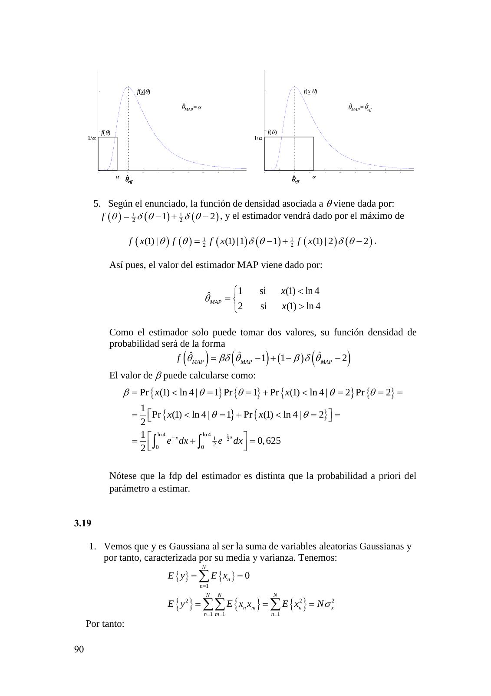

```text
                 -4                                                                                -4
           x 10                                                                              x 10


       2                              f(x|)                                             2                            f(x|)

                                                        ^MAP=                                                                         ^MAP=^eff


       1       f()                                                                      1       f()
                                                                                    


       0                                                                                 0
           0          1
                              2        3      4    5       6     7       8   9   10         0          1      2        3
                                                                                                                               4   5       6    7    8   9   10
                              ^eff                                                                           ^eff


       5. Según el enunciado, la función de densidad asociada a  viene dada por:
         f ( ) = 12  ( − 1) + 12  ( − 2 ) , y el estimador vendrá dado por el máximo de

                                   f ( x(1) |  ) f ( ) = 12 f ( x(1) |1)  ( − 1) + 12 f ( x(1) | 2 )  ( − 2 ) .

                  Así pues, el valor del estimador MAP viene dado por:

                                                                          1             si                 x(1)  ln 4
                                                                  ˆMAP = 
                                                                          2             si                 x(1)  ln 4

                  Como el estimador solo puede tomar dos valores, su función densidad de
                  probabilidad será de la forma
                                                        (             )       (
                                   f ˆMAP =  ˆMAP − 1 + (1 −  )  ˆMAP − 2             )                              (           )
                  El valor de  puede calcularse como:
                               = Pr  x(1)  ln 4 |  = 1 Pr  = 1 + Pr  x(1)  ln 4 |  = 2 Pr  = 2 =
                                    1
                                   =   Pr  x(1)  ln 4 |  = 1 + Pr  x(1)  ln 4 |  = 2 =
                                    2
                                   =   e − x dx +  12 e 2 dx  = 0, 625
                                    1 ln 4              ln 4  −1 x

                                    2  0             0            


                  Nótese que la fdp del estimador es distinta que la probabilidad a priori del
                  parámetro a estimar.


3.19

     1. Vemos que y es Gaussiana al ser la suma de variables aleatorias Gaussianas y
        por tanto, caracterizada por su media y varianza. Tenemos:
                                                                  N
                                                   E  y =  E  xn  = 0
                                                                n =1


                                                   E  y 2  =  E  xn xm  =  E  xn2  = N x2
                                                                      N   N                         N


                                                                  n =1 m =1                       n =1
     Por tanto:

90
```

## Page 42

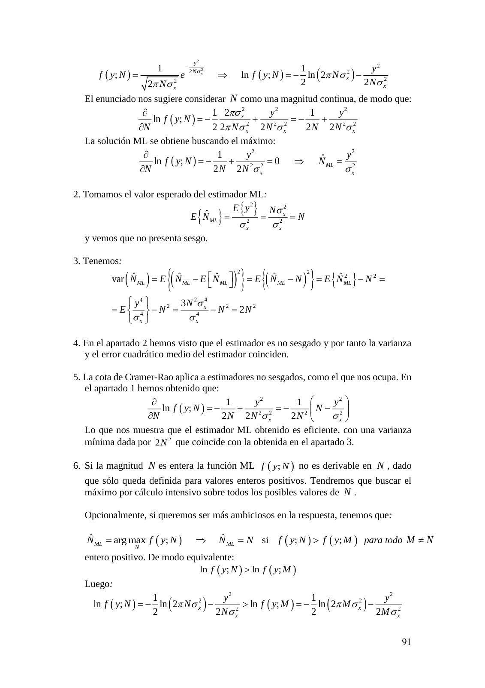

```text
                                             y2
                                       −
                                                                                                       y2
                                                                 ln f ( y; N ) = − ln ( 2 N x2 ) −
                          1                                                       1
      f ( y; N ) =                 e       2 N x2
                                                       
                      2 N x2                                                    2                  2 N x2
  El enunciado nos sugiere considerar N como una magnitud continua, de modo que:
                                    1 2 x2       y2         1     y2
                   ln f ( y; N ) = −           +          = −    +
               N                    2 2 N x2 2 N 2 x2     2 N 2 N 2 x2
  La solución ML se obtiene buscando el máximo:
                                     1       y2                       y2
                   ln f ( y; N ) = −     +         = 0  N ML = 2ˆ
               N                    2 N 2 N 2 x2                     x

2. Tomamos el valor esperado del estimador ML:
                                       E y2    N x2           
                                ˆ
                            E N ML =      2     
                                            = 2 =N
                                                             x             x
  y vemos que no presenta sesgo.

3. Tenemos:

              (       )       (
          var Nˆ ML = E Nˆ ML − E  Nˆ ML                )
                                                             2

                                                                       (
                                                                  = E Nˆ ML − N    )  = E Nˆ  − N =
                                                                                    2
                                                                                               2
                                                                                               ML
                                                                                                        2


               y4       3N 2 x4
          = E  4 − N2 =          − N 2 = 2N 2
               x        x 4


4. En el apartado 2 hemos visto que el estimador es no sesgado y por tanto la varianza
   y el error cuadrático medio del estimador coinciden.

5. La cota de Cramer-Rao aplica a estimadores no sesgados, como el que nos ocupa. En
   el apartado 1 hemos obtenido que:
                                        1     y2          1        y2 
                      ln f ( y; N ) = −    +          = −       N −      
                   N                   2 N 2 N 2 x2     2N 2       x2 
   Lo que nos muestra que el estimador ML obtenido es eficiente, con una varianza
   mínima dada por 2N 2 que coincide con la obtenida en el apartado 3.

6. Si la magnitud N es entera la función ML f ( y; N ) no es derivable en N , dado
  que sólo queda definida para valores enteros positivos. Tendremos que buscar el
  máximo por cálculo intensivo sobre todos los posibles valores de N .

  Opcionalmente, si queremos ser más ambiciosos en la respuesta, tenemos que:

   Nˆ ML = arg max f ( y; N )                         Nˆ ML = N si f ( y; N )  f ( y; M ) para todo M  N
                  N

  entero positivo. De modo equivalente:
                                                  ln f ( y; N )  ln f ( y; M )
  Luego:
                                           y2                                               y2
     ln f ( y; N ) = − ln ( 2 N x2 ) −                                   (        x )
                      1                                               1
                                                  ln f ( y ; M ) = −   ln   2 M  2
                                                                                        −
                      2                  2 N x2                      2                   2 M  x2

                                                                                                               91
```

## Page 43

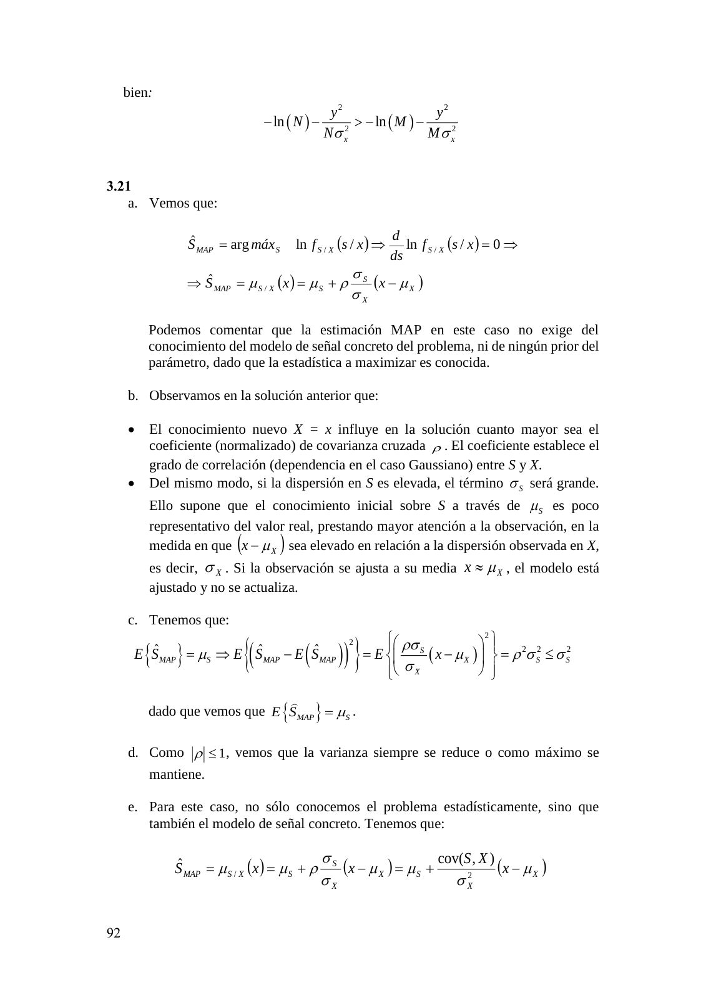

```text
     bien:
                                                  y2                   y2
                                  − ln ( N ) −          − ln ( M ) −
                                                 N x2                M  x2


3.21
   a. Vemos que:

                                         ln f S / X (s / x )       ln f S / X (s / x ) = 0 
                                                                 d
               Sˆ MAP = arg máx S
                                                                 ds
                                                      S
                Sˆ MAP =  S / X ( x ) =  S +         (x −  X )
                                                      X

         Podemos comentar que la estimación MAP en este caso no exige del
         conocimiento del modelo de señal concreto del problema, ni de ningún prior del
         parámetro, dado que la estadística a maximizar es conocida.

     b. Observamos en la solución anterior que:

     •   El conocimiento nuevo X = x influye en la solución cuanto mayor sea el
         coeficiente (normalizado) de covarianza cruzada  . El coeficiente establece el
         grado de correlación (dependencia en el caso Gaussiano) entre S y X.
     •   Del mismo modo, si la dispersión en S es elevada, el término  S será grande.
         Ello supone que el conocimiento inicial sobre S a través de  S es poco
         representativo del valor real, prestando mayor atención a la observación, en la
                         (           )
         medida en que x −  X sea elevado en relación a la dispersión observada en X,
         es decir,  X . Si la observación se ajusta a su media x   X , el modelo está
         ajustado y no se actualiza.

     c. Tenemos que:

                             (                     )) 
                                                                                  
                                                                                       2

                                         (
                                                      2
      E SˆMAP =  S  E SˆMAP − E SˆMAP                    = E        S
                                                                          ( x −  X )   =  2 S2   S2
                                                                  X                

         dado que vemos que E S MAP  = S .

     d. Como   1 , vemos que la varianza siempre se reduce o como máximo se
        mantiene.

     e. Para este caso, no sólo conocemos el problema estadísticamente, sino que
        también el modelo de señal concreto. Tenemos que:

                                            
             Sˆ MAP =  S / X (x ) =  S +  S (x −  X ) =  S +             (x −  X )
                                                                  cov(S , X )
                                            X                        X2


92
```

## Page 44

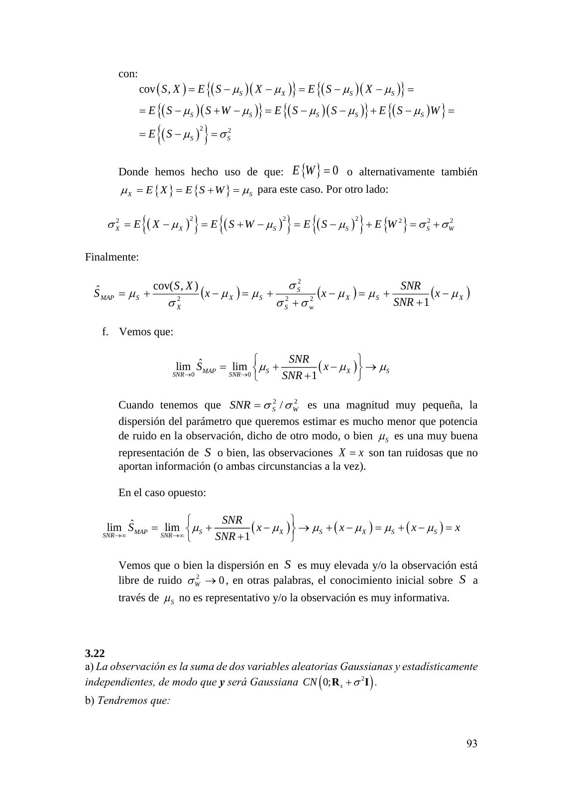

```text
       con:
              cov ( S , X ) = E ( S −  S )( X −  X ) = E ( S −  S )( X −  S ) =
              = E ( S −  S )( S + W −  S ) = E ( S −  S )( S −  S ) + E ( S −  S )W  =

                  
              = E ( S − S )
                                2
                                    =   2
                                          S


       Donde hemos hecho uso de que: E W  = 0 o alternativamente también
        X = E  X  = E S + W  =  S para este caso. Por otro lado:


              
     X2 = E ( X −  X )
                           2
                                = E ( S + W −  )  = E ( S −  )  + E W  =  + 
                                                 S
                                                     2
                                                                    S
                                                                        2         2       2
                                                                                          S
                                                                                               2
                                                                                               W


Finalmente:

                                                     S2
 Sˆ MAP =  S +
                cov( S , X )
                             (x −  X ) =  S +            (x −  X ) =  S + SNR (x −  X )
                      X
                      2
                                                  S +w
                                                   2     2
                                                                             SNR + 1

   f. Vemos que:

                                         
                                                      ( x −  X ) → S
                                               SNR
                       lim SˆMAP = lim  S +
                      SNR →0      SNR →0
                                             SNR + 1             

       Cuando tenemos que SNR =  S2 /  W2 es una magnitud muy pequeña, la
       dispersión del parámetro que queremos estimar es mucho menor que potencia
       de ruido en la observación, dicho de otro modo, o bien  S es una muy buena
       representación de S o bien, las observaciones X = x son tan ruidosas que no
       aportan información (o ambas circunstancias a la vez).

       En el caso opuesto:

                            SNR               
    lim SˆMAP = lim   S +         ( x −  X ) → S + ( x −  X ) = S + ( x − S ) = x
   SNR →      SNR →
                           SNR + 1            

       Vemos que o bien la dispersión en S es muy elevada y/o la observación está
       libre de ruido  W2 → 0 , en otras palabras, el conocimiento inicial sobre S a
       través de  S no es representativo y/o la observación es muy informativa.


3.22
a) La observación es la suma de dos variables aleatorias Gaussianas y estadísticamente
independientes, de modo que y será Gaussiana CN ( 0;R s +  2 I ) .
b) Tendremos que:


                                                                                                    93
```

## Page 45

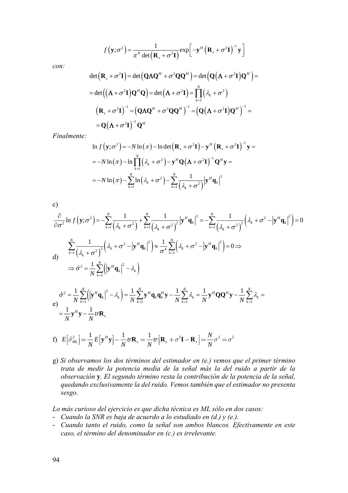

```text
                                   f ( y; 2 ) =                                    exp  −y H ( R s +  2 I ) y 
                                                                        1                                     −1

                                                                 det ( R s +  I )
                                                                     N         2        
                                                                                                                

con:
                           det ( R s +  2 I ) = det ( QQ H +  2QQ H ) = det Q (  +  2 I ) Q H =                            (                                 )
                                   (                                          )
                           = det (  +  2 I ) Q H Q = det (  +  2 I ) =  ( k +  2 )
                                                                                                                            N


                                                                                                                        k =1


                             ( R +  I ) = (QQ +  QQ ) = (Q (  +  I ) Q ) =
                                                       −1                                                         −1                                         −1
                                               2                                      H       2           H                                      2       H
                                   s


                             = Q( +  I) Q            2      −1          H


Finalmente:
                            ln f ( y; 2 ) = − N ln ( ) − ln det ( R s +  2 I ) − y H ( R s +  2 I ) y =
                                                                                                                                                             −1


                            = − N ln ( ) − ln  ( k +  2 ) − y H Q (  +  2 I ) Q H y =
                                                                   N
                                                                                                                                    −1

                                                                   k =1


                            = − N ln ( ) −  ln ( k +  2 ) − 
                                                            N                                         N
                                                                                                             1            2
                                                                                                                   y H qk
                                                                                                   k =1 ( k +  )
                                                                                                                2
                                                            k =1


c)
  
          ln f ( y; 2 ) = −                                                                                                                                 (       )
                                       N                  N                              N
                                                 1                 1                              1
                                                                                       
                                                                                  2                                         2
                                                       +                  y H
                                                                              q     = −                    +  2
                                                                                                                  − y H
                                                                                                                        q     =0
                                     k =1 ( k +  )   k =1 (  +  )                 k =1 (  +  )
      2                                             2                   2       k                      2  k               k
                                                                     2                              2
                                                                 k                              k


                            (  + − y q )      ( +  − y q ) = 0 
           N                                                                                      N
                       1                      1
                                                      2            H             2                                     2       H            2


                  (       )                  
                                           k                              k                                   k                          k
                             2 2                                                          4
           k =1      +                                                                          k =1
d)                 k


           ˆ 2 =
                           1 N
                             
                           N k =1
                                   (     2
                                  y H q k − k                      )
      1 N
         
     ˆ 2 =
      N k =1
             y H
                 q k
                     2
                       (
                       − k =
                              1 N H
                                 k k N
                              N k =1
                                     y q q H
                                             y −   )
                                                 1 N
                                                   k =1
                                                        k =
                                                             1 H
                                                             N
                                                               y QQ H
                                                                      y −
                                                                          1 N
                                                                             k =
                                                                          N k =1
e)
    1        1
   = y H y − trR s
    N        N

                       1                           1                          1                                                 N
f) E ˆ ML
       2
                         E yH y                      trR s                      tr R s                    2
                                                                                                              I        Rs                    2       2

                       N                           N                          N                                                 N

g) Si observamos los dos términos del estimador en (e.) vemos que el primer término
   trata de medir la potencia media de la señal más la del ruido a partir de la
   observación y. El segundo término resta la contribución de la potencia de la señal,
   quedando exclusivamente la del ruido. Vemos también que el estimador no presenta
   sesgo.

Lo más curioso del ejercicio es que dicha técnica es ML sólo en dos casos:
- Cuando la SNR es baja de acuerdo a lo estudiado en (d.) y (e.).
- Cuando tanto el ruido, como la señal son ambos blancos. Efectivamente en este
  caso, el término del denominador en (c.) es irrelevante.


94
```

## Page 46

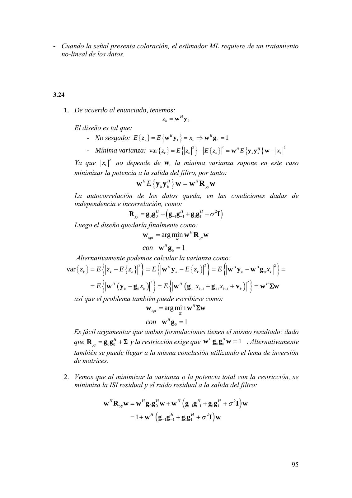

```text
- Cuando la señal presenta coloración, el estimador ML requiere de un tratamiento
  no-lineal de los datos.


3.24

   1. De acuerdo al enunciado, tenemos:
                                                  zk = w H y k
          El diseño es tal que:
              - No sesgado: E  zk  = E w H y k  = xk  w H g 0 = 1
              - Mínima varianza: var  zk  = E  zk  − E  zk  = w H E y k y kH  w − xk
                                                                  2                        2                                      2


          Ya que xk no depende de w, la mínima varianza supone en este caso
                       2


          minimizar la potencia a la salida del filtro, por tanto:
                                     w H E y k y kH  w = w H R yy w
          La autocorrelación de los datos queda, en las condiciones dadas de
          independencia e incorrelación, como:
                            R yy = g 0 g 0H + ( g −1g −H1 + g1g1H +  2I )
          Luego el diseño quedaría finalmente como:
                                 w opt = arg min w H R yy w
                                                          w

                               con w g 0 = 1      H


          Alternativamente podemos calcular la varianza como:
                                = E  w y − E z   = E  w y − w g x  =
       var  zk  = E zk − E  zk 
                                      2               H
                                                          k            k
                                                                                  2               H
                                                                                                      k
                                                                                                              H
                                                                                                                  0       k
                                                                                                                              2


                = E  w ( y − g x )  = E  w ( g x + g x + v )  = w w
                           H                  2               H                                           2           H
                               k      0   k                       −1       k −1       +1   k +1       k

          así que el problema también puede escribirse como:
                                  w opt = arg min w H w
                                                              w

                                       con w g 0 = 1  H


          Es fácil argumentar que ambas formulaciones tienen el mismo resultado: dado
          que R yy = g 0g 0H +  y la restricción exige que w g 0 g 0 w = 1 . Alternativamente
                                                             H      H


          también se puede llegar a la misma conclusión utilizando el lema de inversión
          de matrices.

   2. Vemos que al minimizar la varianza o la potencia total con la restricción, se
      minimiza la ISI residual y el ruido residual a la salida del filtro:

                     w H R yy w = w H g 0g 0H w + w H ( g −1g −H1 + g1g1H +  2I ) w
                                   = 1 + w H ( g −1g −H1 + g1g1H +  2I ) w


                                                                                                                                      95
```

## Page 47

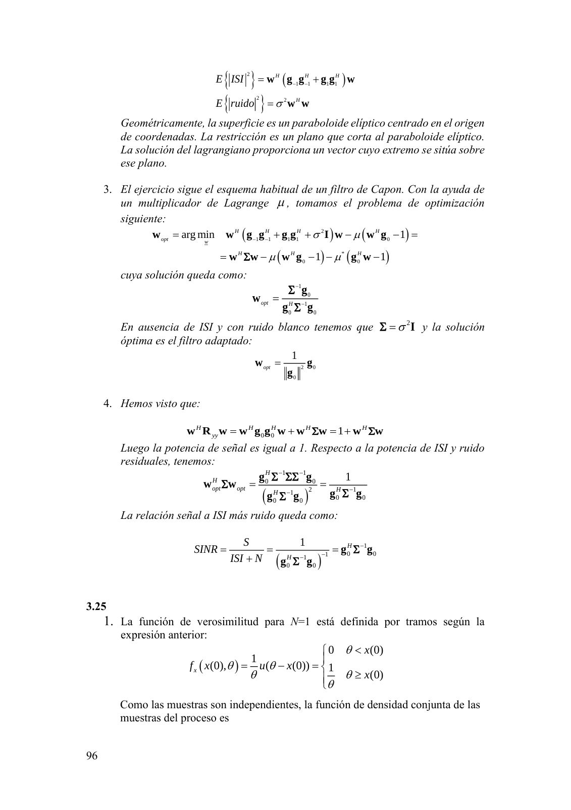

```text
                                  = w (g g + g g ) w
                              E ISI
                                      2        H
                                                           −1
                                                                    H
                                                                    −1       1
                                                                                 H
                                                                                 1


                              E  ruido  =  w w
                                          2        2        H


        Geométricamente, la superficie es un paraboloide elíptico centrado en el origen
        de coordenadas. La restricción es un plano que corta al paraboloide elíptico.
        La solución del lagrangiano proporciona un vector cuyo extremo se sitúa sobre
        ese plano.

     3. El ejercicio sigue el esquema habitual de un filtro de Capon. Con la ayuda de
        un multiplicador de Lagrange  , tomamos el problema de optimización
        siguiente:
               w opt = arg min w H ( g −1g −H1 + g1g1H +  2 I ) w −  ( w H g 0 − 1) =
                            w


                              = w H w −  ( w H g 0 − 1) −  * ( g 0H w − 1)
        cuya solución queda como:
                                                   −1g 0
                                          w opt = H −1
                                                 g0  g0
        En ausencia de ISI y con ruido blanco tenemos que  =  2 I y la solución
        óptima es el filtro adaptado:
                                               1
                                      w opt =    2
                                                   g0
                                              g0

     4. Hemos visto que:

                      w H R yy w = w H g 0g 0H w + w H w = 1 + w H w
        Luego la potencia de señal es igual a 1. Respecto a la potencia de ISI y ruido
        residuales, tenemos:
                                       g H  −1 −1g 0     1
                           H
                         w opt w opt = 0               = H −1
                                        ( g H  −1g ) g0  g0
                                                     2
                                              0                 0

        La relación señal a ISI más ruido queda como:

                                    S         1
                        SINR =          =             = g 0H  −1g 0
                                 ISI + N ( g  g )
                                            H −1   −1
                                                       0                 0


3.25
     1. La función de verosimilitud para N=1 está definida por tramos según la
        expresión anterior:
                                                         0   x(0)
                                          1             
                       f x ( x(0),  ) = u ( − x(0)) =  1
                                                          x(0)

        Como las muestras son independientes, la función de densidad conjunta de las
        muestras del proceso es


96
```

## Page 48

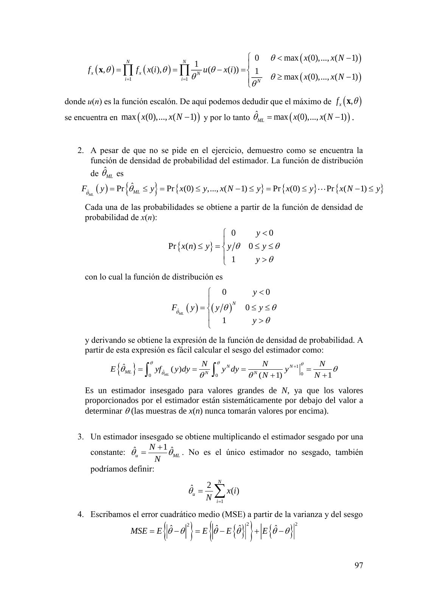

```text
                                                              0                           max ( x(0),..., x( N − 1) )
                    N                         N
                                                      1      
       f x ( x, ) =  f x ( x(i ), ) =  N u ( − x(i )) =  1
                     i =1                i =1                N                          max ( x(0),..., x( N − 1) )
                                                             
donde u(n) es la función escalón. De aquí podemos dedudir que el máximo de f x ( x, )
se encuentra en max ( x(0),..., x( N − 1) ) y por lo tanto ˆML = max ( x(0),..., x( N − 1) ) .


    2. A pesar de que no se pide en el ejercicio, demuestro como se encuentra la
       función de densidad de probabilidad del estimador. La función de distribución
       de ˆML es

      ˆML                      
     F ( y ) = Pr ˆ  y = Pr  x(0)  y,..., x( N − 1)  y = Pr  x(0)  y Pr  x( N − 1)  y
                        ML


      Cada una de las probabilidades se obtiene a partir de la función de densidad de
      probabilidad de x(n):
                                                            0                  y0
                                                           
                                          Pr  x(n)  y =  y               0  y 
                                                            1                  y 
                                                           
      con lo cual la función de distribución es
                                                        0                        y0
                                                       
                                           Fˆ ( y ) = ( y  )              0  y 
                                                                N

                                                        1
                                              ML

                                                                                  y 
                                                       
      y derivando se obtiene la expresión de la función de densidad de probabilidad. A
      partir de esta expresión es fácil calcular el sesgo del estimador como:

                    yf ( y)dy = N  y dy =  ( NN + 1) y
                                                             
                                                                                               N +1          N
               E ˆML =              ˆ
                                                                      N
                                                                                                         =        
                             0        ML                  N
                                                              0
                                                                                  N                  0       N +1
      Es un estimador insesgado para valores grandes de N, ya que los valores
      proporcionados por el estimador están sistemáticamente por debajo del valor a
      determinar  (las muestras de x(n) nunca tomarán valores por encima).

    3. Un estimador insesgado se obtiene multiplicando el estimador sesgado por una
                        N +1 ˆ
       constante: ˆu =      ML . No es el único estimador no sesgado, también
                          N
       podríamos definir:
                                                                  N

                                                              
                                                        2
                                                  ˆu =        x(i )
                                                        N i =1
    4. Escribamos el error cuadrático medio (MSE) a partir de la varianza y del sesgo

                                                                          + E ˆ −  
                                                  2                           2                  2
                        MSE = E ˆ −                 = E ˆ − E ˆ


                                                                                                                      97
```

## Page 49

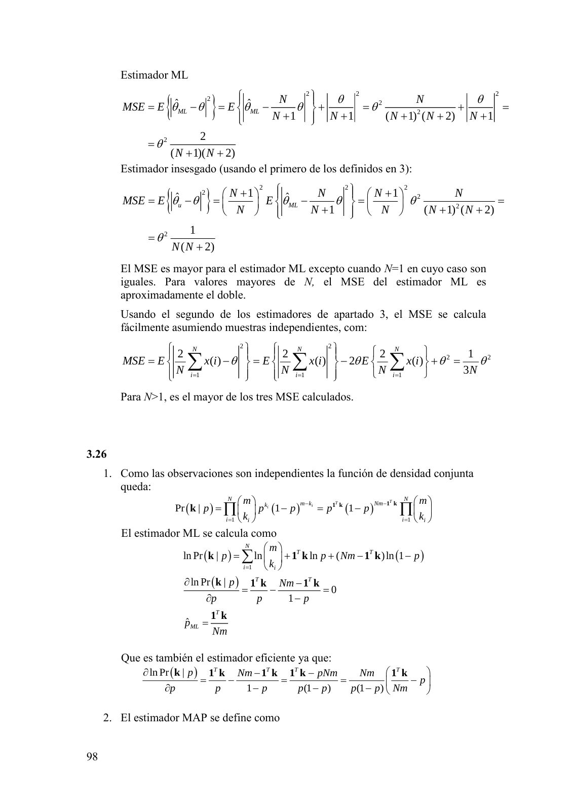

```text
        Estimador ML


                                                                                               
                                                                 2        2                                2
                                      2                     N                            N
        MSE = E ˆML −                               ˆ
                                              = E   ML −       +        = 2
                                                                                                    +        =
                                                         N + 1  N + 1        ( N + 1) 2 ( N + 2) N + 1
                          2
              =2
                  ( N + 1)( N + 2)
        Estimador insesgado (usando el primero de los definidos en 3):


                                          N + 1   ˆ                 N + 1  2 2
                                                    2                 2
                                  2                              N                               N
        MSE = E ˆ −                     =        E   ML −       =                                 =
                                                                N + 1   N            ( N + 1) 2 ( N + 2)
                         u
                                            N  
                             1
              =2
                        N ( N + 2)
        El MSE es mayor para el estimador ML excepto cuando N=1 en cuyo caso son
        iguales. Para valores mayores de N, el MSE del estimador ML es
        aproximadamente el doble.
        Usando el segundo de los estimadores de apartado 3, el MSE se calcula
        fácilmente asumiendo muestras independientes, com:
                 2 N              2
                                          2 N           2
                                                                    2 N            
                                                                                  
                                                                                                 1 2
        MSE = E           x(i ) −   = E           x (i )  − 2 E         x (i )  +  2 =     
                  N i =1                 N i =1                N i =1                 3 N

        Para N>1, es el mayor de los tres MSE calculados.


3.26
     1. Como las observaciones son independientes la función de densidad conjunta
        queda:
                                        N
                                             m                                       N
                                                                                            m
                        Pr ( k | p ) =    p ki (1 − p ) i = p1 k (1 − p )          
                                                          m−k    T           Nm −1T k
                                                                                            
                                       i =1  ki                                     i =1  ki 

        El estimador ML se calcula como
                                                N
                                                       m
                             ln Pr ( k | p ) =  ln   + 1T k ln p + ( Nm − 1T k )ln (1 − p )
                                               i =1     ki 
                              ln Pr ( k | p ) 1 k Nm − 1T k
                                                    T
                                               =         −         =0
                                    p               p        1− p
                                          1T k
                             ˆpML =
                                          Nm

        Que es también el estimador eficiente ya que:
              ln Pr ( k | p )        1T k Nm − 1T k 1T k − pNm     Nm  1T k      
                                 =        −         =           =              − p
                   p                  p    1− p       p(1 − p)   p(1 − p)  Nm    

     2. El estimador MAP se define como


98
```

## Page 50

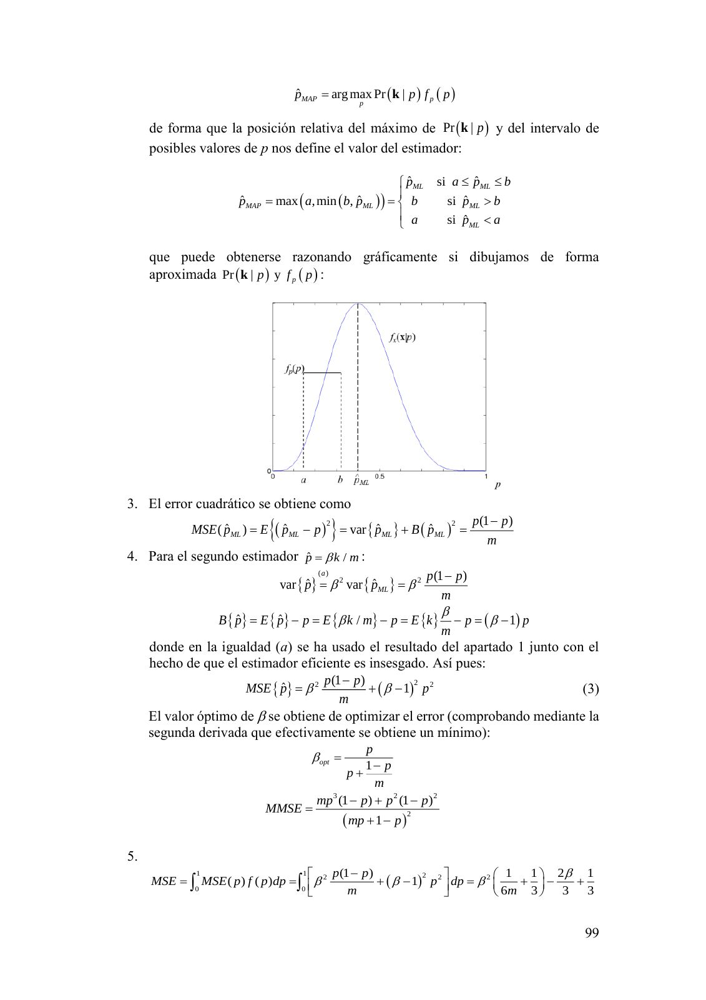

```text
                                     ˆpMAP = arg max Pr ( k | p ) f p ( p )
                                                        p


     de forma que la posición relativa del máximo de Pr ( k | p ) y del intervalo de
     posibles valores de p nos define el valor del estimador:

                                                              ˆpML         si a  pˆ ML  b
                                                             
                       ˆpMAP = max ( a, min ( b, pˆ ML ) ) =  b              si pˆ ML  b
                                                              a              si pˆ ML  a
                                                             

     que puede obtenerse razonando gráficamente si dibujamos de forma
     aproximada Pr ( k | p ) y f p ( p ) :


3. El error cuadrático se obtiene como
                              
             MSE ( pˆ ML ) = E ( pˆ ML − p )
                                               2
                                                    = var  pˆ  + B ( pˆ ) = p(1m− p)
                                                             ML            ML
                                                                                2


4. Para el segundo estimador ˆp =  k / m :
                                           (a)
                                                                          p (1 − p)
                                  var  ˆp =  2 var  ˆpML  =  2
                                                                              m
                                                                
                   B  pˆ  = E  pˆ  − p = E  k / m − p = E k 
                                                                  − p = (  − 1) p
                                                                m
     donde en la igualdad (a) se ha usado el resultado del apartado 1 junto con el
     hecho de que el estimador eficiente es insesgado. Así pues:
                                      p (1 − p )
                      MSE  ˆp =  2            + (  − 1) p 2
                                                           2
                                                                                   (3)
                                          m
     El valor óptimo de  se obtiene de optimizar el error (comprobando mediante la
     segunda derivada que efectivamente se obtiene un mínimo):
                                                   p
                                          opt =
                                                   1− p
                                               p+
                                                     m
                                          mp (1 − p) + p 2 (1 − p) 2
                                            3
                              MMSE =
                                                     ( mp + 1 − p )
                                                                      2


5.
                                    1     p (1 − p )                           1  1  2 1
                                                      + (  − 1) p 2  dp =  2 
            1
     MSE =  MSE ( p ) f ( p )dp =    2                                          + −   +
                                                                2
            0                       0
                                              m                                6m 3  3   3


                                                                                               99
```

## Page 51

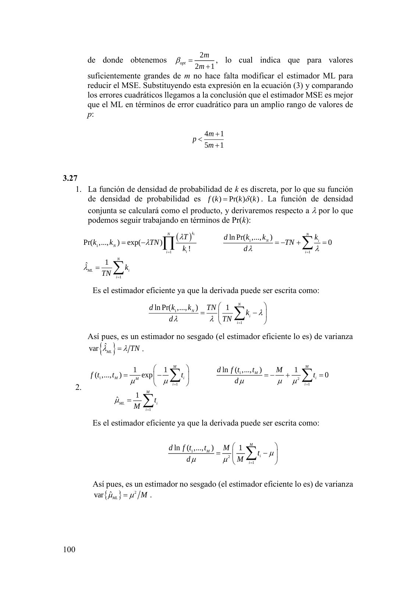

```text
                                                                  2m
         de donde obtenemos                         opt =              , lo cual indica que para valores
                                                                 2m + 1
         suficientemente grandes de m no hace falta modificar el estimador ML para
         reducir el MSE. Substituyendo esta expresión en la ecuación (3) y comparando
         los errores cuadráticos llegamos a la conclusión que el estimador MSE es mejor
         que el ML en términos de error cuadrático para un amplio rango de valores de
         p:

                                                                   4m + 1
                                                             p
                                                                   5m + 1


3.27
   1. La función de densidad de probabilidad de k es discreta, por lo que su función
      de densidad de probabilidad es f (k ) = Pr(k ) (k ) . La función de densidad
      conjunta se calculará como el producto, y derivaremos respecto a  por lo que
      podemos seguir trabajando en términos de Pr(k):

                                                   ( T )
                                                            ki


                                             k!                                                     
                                            N                                                          N
                                                                        d ln Pr(k1 ,..., k N )              ki
        Pr(k1 ,..., k N ) = exp( −TN )                                                        = −TN +         =0
                                            i =1       i
                                                                               d                      i =1
                                                                                                            

                     
                      N
                  1
        ˆML =           ki
                 TN i =1

           Es el estimador eficiente ya que la derivada puede ser escrita como:

                                     d ln Pr(k1 ,..., k N ) TN  1              
                                                                            
                                                                     N

                                                           =            ki −  
                                            d                 TN i =1        
         Así pues, es un estimador no sesgado (el estimador eficiente lo es) de varianza
               
         var ˆML =  TN .

                                       1 M 
                                                                                                    
                                                                                                      M
                               1                                      d ln f (t1 ,..., tM )   M  1
          f (t1 ,..., tM ) =      exp −      ti                                           =− + 2     ti = 0
                               M       i =1                              d                 i =1
   2.
                                   
                                    M
                                1
                     ˆ ML =           ti
                                M i =1

           Es el estimador eficiente ya que la derivada puede ser escrita como:

                                             d ln f (t1 ,..., tM ) M  1             
                                                                                
                                                                          M

                                                                  = 2        ti −  
                                                    d               M i =1        

           Así pues, es un estimador no sesgado (el estimador eficiente lo es) de varianza
           var ˆ ML  =  2 M .


100
```

## Page 52

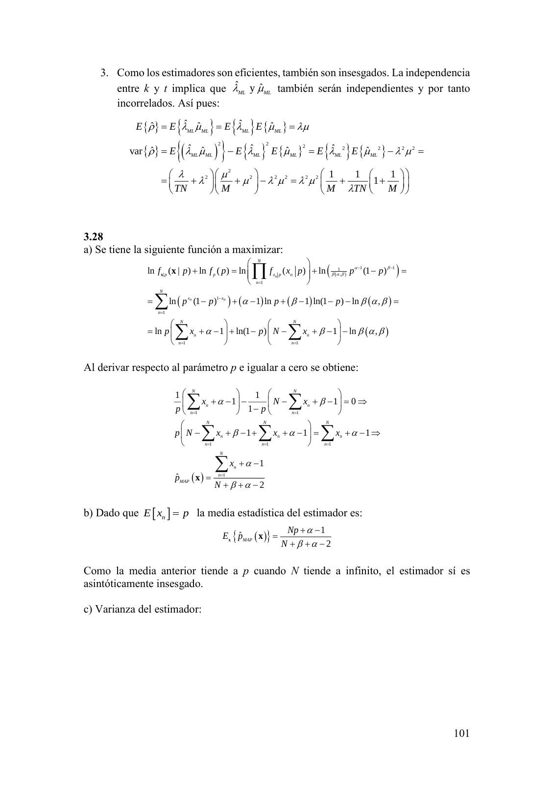

```text
   3. Como los estimadores son eficientes, también son insesgados. La independencia
      entre k y t implica que ˆML y ˆ ML también serán independientes y por tanto
      incorrelados. Así pues:

                                  
           E  ˆ  = E ˆML ˆ ML = E ˆML E ˆ ML  = 

          var  ˆ  = E ( ˆ ˆ )  − E ˆ  E ˆ  = E ˆ  E ˆ  −   =
                                         2                  2             2                  2           2        2   2
                              ML    ML                 ML            ML                 ML          ML


                                                          1  1     1 
                                   2

                   =    + 2      +  2  −  2 2 =  2 2  +     1 +  
                     TN       M                             M TN  M  


3.28
a) Se tiene la siguiente función a maximizar:
                                                      N                    
                                                      
              ln f x| p (x | p ) + ln f p ( p ) = ln 
                                                       n=1
                                                                                    (                         )
                                                            f xn p ( xn p )  + ln  (1, ) p −1 (1 − p )  −1 =
                                                                             

                   ln ( p (1 − p) ) + ( − 1) ln p + (  − 1) ln(1 − p) − ln  ( ,  ) =
                   N

              =              xn          1− xn


                  n=1

                      N                                              
                                                                   
                                                           N

              = ln p      xn +  − 1 + ln(1 − p )  N −     xn +  − 1 − ln  ( ,  )
                      n=1                              n=1           

Al derivar respecto al parámetro p e igualar a cero se obtiene:

                        1                   1                     
                                                                   
                             N                         N

                               xn +  − 1 −    N −      xn +  − 1 = 0 
                        p  n=1            1− p     n =1           
                                                             
                                                                               
                                N                N                N

                        p N −     xn +  − 1 +     xn +  − 1 =   xn +  − 1 
                              n=1              n=1            n=1

                                          x +  −1
                                          N

                                                 n

                        ˆpMAP ( x ) =    n =1

                                         N +  + − 2


b) Dado que E  xn  = p la media estadística del estimador es:
                                                                    Np +  − 1
                                             Ex  ˆpMAP ( x ) =
                                                                   N +  + − 2

Como la media anterior tiende a p cuando N tiende a infinito, el estimador sí es
asintóticamente insesgado.

c) Varianza del estimador:


                                                                                                                          101
```

## Page 53

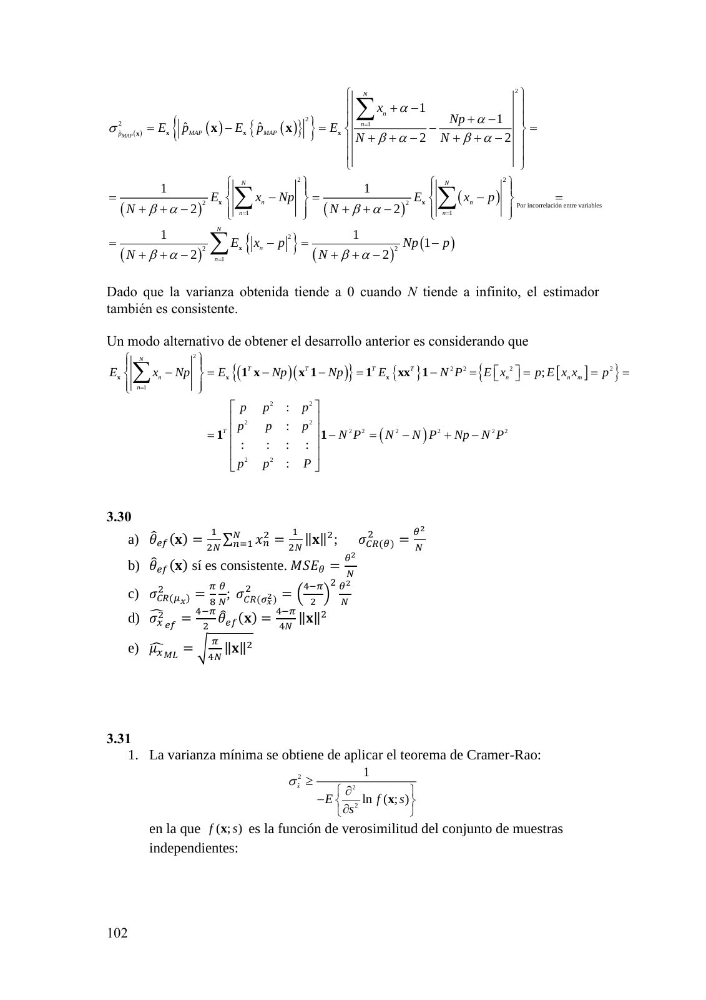

```text
                                                              N                                         2
                                                                                                           
                                                                        
                                                                    xn +  − 1                             
  2
                                                       
 ˆpMAP ( x ) = Ex pˆ MAP ( x ) − Ex  pˆ MAP ( x ) = Ex 
                                                       2      n=1
                                                                                   −
                                                                                       Np +  − 1 
                                                              N +  + − 2 N +  + − 2 
                                                                                                           =
                                                                                                          
                                                                                                          
                                 N               2
                                                                                N               2
                                                                                                      
                                                                                           
                1                                                1
=                           E        x    −  Np        =                   E          ( x  − p )     Por incorrelación= entre variables
    ( N +  +  − 2 )  n=1                           ( N +  +  − 2 )
                         2    x          n                                 2   x            n
                                                                                   n=1               

                       E x − p =
    ( N +  +  − 2) 
                              N
              1                                                      1
=                                                   Np (1 − p )
                                                  2


                                   ( N +  +  − 2)
                          2              x   n                                  2
                              n =1


Dado que la varianza obtenida tiende a 0 cuando N tiende a infinito, el estimador
también es consistente.

Un modo alternativo de obtener el desarrollo anterior es considerando que
               2
                  
   
                 
      N

Ex                                                                                                  
         xn − Np  = Ex (1T x − Np )( xT 1 − Np ) = 1T Ex xxT  1 − N 2 P 2 = E  xn 2  = p; E  xn xm  = p 2 =                          
   
    n=1          
                  
                          p p2 : p2 
                          2              
                           p  p : p2 
                    = 1T                   1 − N 2 P 2 = ( N 2 − N ) P 2 + Np − N 2 P 2
                          :   : : : 
                          2              
                         p   p2 : P 


3.30
                    1            1                                                   𝜃2
     a) 𝜃̂𝑒𝑓 (𝐱) = 2𝑁 ∑𝑁    2         2
                       𝑛=1 𝑥𝑛 = 2𝑁 ‖𝐱‖ ;
                                                                          2
                                                                         𝜎𝐶𝑅(𝜃) = 𝑁
                                           𝜃                         2
     b) 𝜃̂𝑒𝑓 (𝐱) sí es consistente. 𝑀𝑆𝐸𝜃 = 𝑁
          2              2    𝜋𝜃                       4−𝜋 2 𝜃2
     c) 𝜎𝐶𝑅(𝜇 𝑥)
                 = 8 𝑁; 𝜎𝐶𝑅(𝜎 2 = (
                             𝑥)
                                      )
                                    2                            𝑁
        ̂𝑥2 = 4−𝜋 𝜃̂𝑒𝑓 (𝐱) = 4−𝜋 ‖𝐱‖2
     d) 𝜎      𝑒𝑓         2                      4𝑁
                              𝜋
        ̂𝑥 𝑀𝐿 = √4𝑁 ‖𝐱‖2
     e) 𝜇


3.31
   1. La varianza mínima se obtiene de aplicar el teorema de Cramer-Rao:
                                                                         1
                                                   sˆ2 
                                                                   2
                                                                                
                                                            − E  2 ln f (x; s) 
                                                                 s            
           en la que f (x; s ) es la función de verosimilitud del conjunto de muestras
           independientes:


102
```

## Page 54

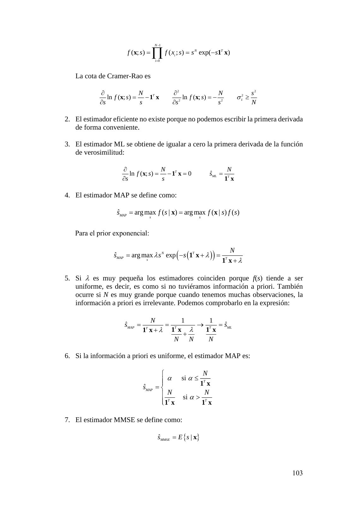

```text
                                         N −1

                      f (x; s) =         f ( x ; s) = s exp(−s1 x)
                                         i =0
                                                  i
                                                          N            T


   La cota de Cramer-Rao es

                           N                    2                  N                      s2
               ln f (x; s) = − 1T x                   ln f (x; s) = − 2            sˆ2 
            s              s                    s 2
                                                                     s                      N

2. El estimador eficiente no existe porque no podemos escribir la primera derivada
   de forma conveniente.

3. El estimador ML se obtiene de igualar a cero la primera derivada de la función
   de verosimilitud:

                                   N                                       N
                       ln f (x; s) = − 1T x = 0                   sˆML =
                    s              s                                      1T x

4. El estimador MAP se define como:

                  sˆMAP = arg max f ( s | x) = arg max f ( x | s) f ( s)
                                    s                         s


   Para el prior exponencial:


                                s
                                                      (
                 sˆMAP = arg max  s N exp − s (1T x +  ) =       ) 1 xN+ 
                                                                           T


5. Si  es muy pequeña los estimadores coinciden porque f(s) tiende a ser
   uniforme, es decir, es como si no tuviéramos información a priori. También
   ocurre si N es muy grande porque cuando tenemos muchas observaciones, la
   información a priori es irrelevante. Podemos comprobarlo en la expresión:

                                 N      1      1
                     sˆMAP =        = T      → T = sˆML
                               1 x+ 1 x 
                                T
                                              1 x
                                         +
                                      N    N   N

6. Si la información a priori es uniforme, el estimador MAP es:

                                                     N
                                         si   1T x
                               sˆMAP = 
                                         N           N
                                               si   T
                                         1 x
                                            T
                                                     1 x

7. El estimador MMSE se define como:

                                           sˆMMSE = E s | x


                                                                                                 103
```

## Page 55

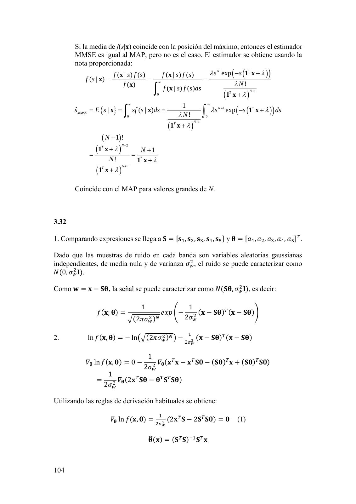

```text
        Si la media de f(s|x) coincide con la posición del máximo, entonces el estimador
        MMSE es igual al MAP, pero no es el caso. El estimador se obtiene usando la
        nota proporcionada:
                         f (x | s) f ( s )     f (x | s) f ( s )        s N exp ( − s (1T x +  ) )
            f ( s | x) =                   =                        =
                                                                                  N!
                                                    
                             f ( x)
                                                f (x | s ) f ( s )ds
                                                                              (1T x +  )
                                                                                          N +1
                                             0

                                                                                


                                                                                 s exp ( −s (1 x +  )) ds
                                                                   1
        sˆMMSE = E s | x =             sf ( s | x)ds =                             N +1         T

                                 0                                N!            0


                                                            (1 x +  )
                                                              T          N +1


                   ( N + 1)!
                (1 x +  )
                             N +2
                                              N +1
                   T

              =                          =
                        N!                   1 x+
                                             T


                 (1 x +  )
                   T          N +1


        Coincide con el MAP para valores grandes de N.


3.32

1. Comparando expresiones se llega a 𝐒 = [𝐬1 , 𝐬2 , 𝐬3 , 𝐬4 , 𝐬5 ] y 𝛉 = [𝑎1 , 𝑎2 , 𝑎3 , 𝑎4 , 𝑎5 ]𝑇 .

Dado que las muestras de ruido en cada banda son variables aleatorias gaussianas
independientes, de media nula y de varianza 𝜎𝑤2 , el ruido se puede caracterizar como
𝑁(0, 𝜎𝑤2 𝐈).

Como 𝐰 = 𝐱 − 𝐒𝛉, la señal se puede caracterizar como 𝑁(𝐒𝛉, 𝜎𝑤2 𝐈), es decir:

                                              1                     1
                 𝑓(𝐱; 𝛉) =                              𝑒𝑥𝑝 (−          (𝐱 − 𝐒𝛉)𝑇 (𝐱 − 𝐒𝛉))
                                   √(2𝜋𝜎𝑤2 )𝑁                      2𝜎𝑤2

                                                                    1
2.           ln 𝑓(𝐱, 𝛉) = − ln(√(2𝜋𝜎𝑤2 )𝑁 ) − 2𝜎2 (𝐱 − 𝐒𝛉)𝑇 (𝐱 − 𝐒𝛉)
                                                                        𝑤


                                                  1
             𝛻𝛉 ln 𝑓(𝐱, 𝛉) = 0 −                     𝛻 (𝐱 𝑇 𝐱 − 𝐱 𝑇 𝐒𝛉 − (𝐒𝛉)𝑻 𝐱 + (𝐒𝛉)𝑻 𝐒𝛉)
                                                 2𝜎𝑤2 𝛉
                        1
                 =         𝛻 (2𝐱 𝑇 𝐒𝛉 − 𝛉𝑻 𝐒 𝑻 𝐒𝛉)
                       2𝜎𝑤2 𝛉

Utilizando las reglas de derivación habituales se obtiene:
                                                        1
                         𝛻𝛉 ln 𝑓(𝐱, 𝛉) = 2𝜎2 (2𝐱 𝑇 𝐒 − 2𝐒 𝑻 𝐒𝛉) = 𝟎                         (1)
                                                        𝑤


                                                  ̂
                                                  𝛉(𝐱) = (𝐒 𝑻 𝐒)−1 𝐒 𝑇 𝐱


104
```

## Page 56

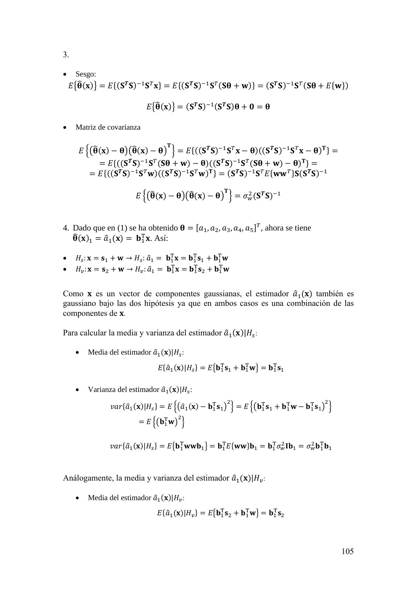

```text
3.

•     Sesgo:
      ̂(𝐱)} = 𝐸{(𝐒 𝑻 𝐒)−1 𝐒𝑇 𝐱} = 𝐸{(𝐒 𝑻 𝐒)−1 𝐒 𝑇 (𝐒𝛉 + 𝐰)} = (𝐒 𝑻 𝐒)−1 𝐒𝑇 (𝐒𝛉 + 𝐸{𝐰})
    𝐸{𝛉

                               ̂(𝐱)} = (𝐒 𝑻 𝐒)−1 (𝐒 𝑻 𝐒)𝛉 + 𝟎 = 𝛉
                             𝐸{𝛉

•     Matriz de covarianza

                                    𝐓
           ̂(𝐱) − 𝛉)(𝛉
       𝐸 {(𝛉          ̂(𝐱) − 𝛉) } = 𝐸{((𝐒𝑻 𝐒)−1 𝐒 𝑇 𝐱 − 𝛉)((𝐒 𝑻 𝐒)−1 𝐒 𝑇 𝐱 − 𝛉)𝐓 } =
             = 𝐸{((𝐒 𝑻 𝐒)−1 𝐒 𝑇 (𝐒𝛉 + 𝐰) − 𝛉)((𝐒𝑻 𝐒)−1 𝐒 𝑇 (𝐒𝛉 + 𝐰) − 𝛉)𝐓 } =
          = 𝐸{((𝐒𝑻 𝐒)−1 𝐒 𝑇 𝐰)((𝐒 𝑻 𝐒)−1 𝐒 𝑇 𝐰)𝐓 } = (𝐒 𝑻 𝐒)−1 𝐒 𝑇 𝐸{𝐰𝐰 𝑇 }𝐒(𝐒 𝑻 𝐒)−1
                                                        𝐓
                              ̂(𝐱) − 𝛉)(𝛉
                          𝐸 {(𝛉         ̂(𝐱) − 𝛉) } = 𝜎𝑤2 (𝐒𝑻 𝐒)−1


4. Dado que en (1) se ha obtenido 𝛉 = [𝑎1 , 𝑎2 , 𝑎3 , 𝑎4 , 𝑎5 ]𝑇 , ahora se tiene
   ̂
   𝛉(𝐱)1 = 𝑎̂1 (𝐱) = 𝐛1T 𝐱. Así:

•     𝐻𝑠 : 𝐱 = 𝐬1 + 𝐰 → 𝐻𝑠 : 𝑎̂1 = 𝐛1T 𝐱 = 𝐛1T 𝐬1 + 𝐛1T 𝐰
•     𝐻𝑣 : 𝐱 = 𝐬2 + 𝐰 → 𝐻𝑣 : 𝑎̂1 = 𝐛1T 𝐱 = 𝐛1T 𝐬2 + 𝐛1T 𝐰


Como 𝐱 es un vector de componentes gaussianas, el estimador 𝑎̂1 (𝐱) también es
gaussiano bajo las dos hipótesis ya que en ambos casos es una combinación de las
componentes de 𝐱.

Para calcular la media y varianza del estimador 𝑎̂1 (𝐱)|𝐻𝑠 :

      •   Media del estimador 𝑎̂1 (𝐱)|𝐻𝑠 :
                                 𝐸{𝑎̂1 (𝐱)|𝐻𝑠 } = 𝐸{𝐛1T 𝐬1 + 𝐛1T 𝐰} = 𝐛1T 𝐬1

      •   Varianza del estimador 𝑎̂1 (𝐱)|𝐻𝑠 :
                                                         2                                 2
                 𝑣𝑎𝑟{𝑎̂1 (𝐱)|𝐻𝑠 } = 𝐸 {(𝑎̂1 (𝐱) − 𝐛1T 𝐬1 ) } = 𝐸 {(𝐛1T 𝐬1 + 𝐛1T 𝐰 − 𝐛1T 𝐬1 ) }
                                        2
                           = 𝐸 {(𝐛1T 𝐰) }


                 𝑣𝑎𝑟{𝑎̂1 (𝐱)|𝐻𝑠 } = 𝐸{𝐛1T 𝐰𝐰𝐛1 } = 𝐛1T 𝐸{𝐰𝐰}𝐛1 = 𝐛1T 𝜎𝑤2 𝐈𝐛1 = 𝜎𝑤2 𝐛1T 𝐛1


Análogamente, la media y varianza del estimador 𝑎̂1 (𝐱)|𝐻𝑣 :

      •   Media del estimador 𝑎̂1 (𝐱)|𝐻𝑣 :
                                 𝐸{𝑎̂1 (𝐱)|𝐻𝑣 } = 𝐸{𝐛1T 𝐬2 + 𝐛1T 𝐰} = 𝐛1T 𝐬2


                                                                                                 105
```

## Page 57

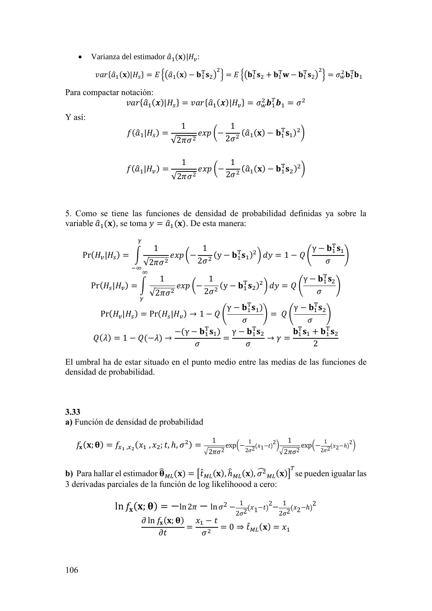

```text
   •     Varianza del estimador 𝑎̂1 (𝐱)|𝐻𝑣 :
                                                         2                               2
          𝑣𝑎𝑟{𝑎̂1 (𝐱)|𝐻𝑠 } = 𝐸 {(𝑎̂1 (𝐱) − 𝐛1T 𝐬2 ) } = 𝐸 {(𝐛1T 𝐬2 + 𝐛1T 𝐰 − 𝐛1T 𝐬2 ) } = 𝜎𝑤2 𝐛1T 𝐛1

Para compactar notación:
                𝑣𝑎𝑟{𝑎̂1 (𝒙)|𝐻𝑠 } = 𝑣𝑎𝑟{𝑎̂1 (𝒙)|𝐻𝑣 } = 𝜎𝑤2 𝒃1𝑇 𝒃1 = 𝜎 2
Y así:
                                          1                   1
                    𝑓(𝑎̂1 |𝐻𝑠 ) =                𝑒𝑥𝑝 (−          (𝑎̂ (𝐱) − 𝐛1T 𝐬1 )2 )
                                        √2𝜋𝜎 2               2𝜎 2 1

                                          1                   1
                    𝑓(𝑎̂1 |𝐻𝑣 ) =                𝑒𝑥𝑝 (−          (𝑎̂ (𝐱) − 𝐛1T 𝐬2 )2 )
                                        √2𝜋𝜎 2               2𝜎 2 1


5. Como se tiene las funciones de densidad de probabilidad definidas ya sobre la
variable 𝑎̂1 (𝐱), se toma 𝑦 = 𝑎̂1 (𝐱). De esta manera:
                        𝛾
                                1                 1          T )2
                                                                                 γ − 𝐛1T 𝐬1
       Pr(𝐻𝑣 |𝐻𝑠 ) = ∫                  𝑒𝑥𝑝 (−        (y − 𝐛  𝐬
                                                            1 1   ) 𝑑𝑦 = 1 − 𝑄 (            )
                            √2𝜋𝜎 2               2𝜎 2                               𝜎
                      −∞
                            ∞
                                    1  1       T     2
                                                                γ − 𝐛1T 𝐬2
         Pr(𝐻𝑠 |𝐻𝑣 ) = ∫        𝑒𝑥𝑝 (− 2 (y − 𝐛1 𝐬2 ) ) 𝑑𝑦 = 𝑄 (           )
                         √2𝜋𝜎 2       2𝜎                           𝜎
                         𝛾
                                              γ − 𝐛1T 𝐬1 )        γ − 𝐛1T 𝐬2
          Pr(𝐻𝑣 |𝐻𝑠 ) = Pr(𝐻𝑠 |𝐻𝑣 ) → 1 − 𝑄 (              ) = 𝑄(            )
                                                  𝜎                   𝜎
                               −(γ − 𝐛1T 𝐬1 ) γ − 𝐛1T 𝐬2         𝐛1T 𝐬1 + 𝐛1T 𝐬2
         𝑄(𝜆) = 1 − 𝑄(−𝜆) →                  =              →𝛾=
                                     𝜎             𝜎                    2

El umbral ha de estar situado en el punto medio entre las medias de las funciones de
densidad de probabilidad.


3.33
a) Función de densidad de probabilidad

                                                     1             1           1          1
   𝑓𝐱 (𝐱; 𝛉) = 𝑓𝑥1 ,𝑥2 (𝑥1 , 𝑥2 ; 𝑡, ℎ, 𝜎 2 ) =              exp(− 2(𝑥1−𝑡)2)        exp(− 2(𝑥2−ℎ)2 )
                                                  √2𝜋𝜎2           2𝜎         √2𝜋𝜎 2      2𝜎


b) Para hallar el estimador 𝛉                              ̂2 𝑀𝐿 (𝐱)]𝑇 se pueden igualar las
                            ̂𝑀𝐿 (𝐱) = [𝑡̂𝑀𝐿 (𝐱), ℎ̂𝑀𝐿 (𝐱), 𝜎
3 derivadas parciales de la función de log likelihoood a cero:

                ln 𝑓𝐱 (𝐱; 𝛉) = −ln 2𝜋 − ln 𝜎2 − 12(𝑥1−𝑡)2− 12(𝑥2−ℎ)2
                                                                2𝜎           2𝜎
                         𝜕 ln 𝑓𝐱 (𝐱; 𝛉) 𝑥1 − 𝑡
                                       =       = 0 ⇒ 𝑡̂𝑀𝐿 (𝐱) = 𝑥1
                               𝜕𝑡         𝜎2


106
```

## Page 58

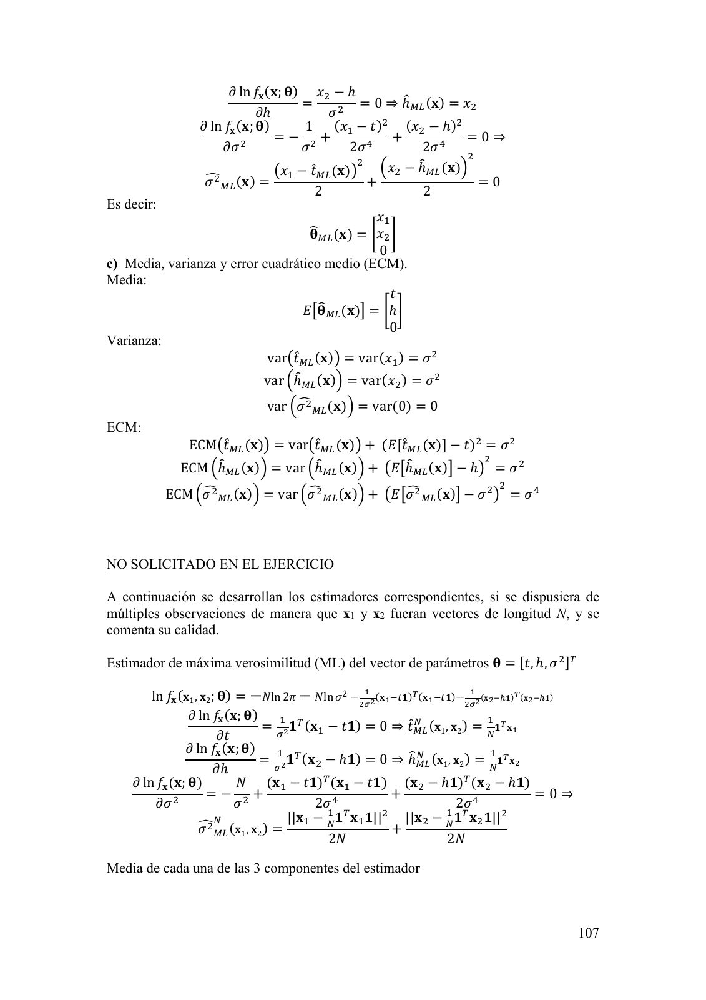

```text
                       𝜕 ln 𝑓𝐱 (𝐱; 𝛉) 𝑥2 − ℎ
                                      =           = 0 ⇒ ℎ̂𝑀𝐿 (𝐱) = 𝑥2
                             𝜕ℎ             𝜎2
                 𝜕 ln 𝑓𝐱 (𝐱; 𝛉)       1 (𝑥1 − 𝑡)2 (𝑥2 − ℎ)2
                                =   −     +             +            =0⇒
                     𝜕𝜎 2             𝜎2        2𝜎 4         2𝜎 4
                                                                      2
                                                  2         ̂ 𝑀𝐿 (𝐱))
                                (𝑥   − 𝑡̂    (𝐱))     (𝑥2 − ℎ
                  ̂2 𝑀𝐿 (𝐱) = 1
                  𝜎
                                          𝑀𝐿
                                                    +                   =0
                                        2                    2
Es decir:
                                               𝑥1
                                   ̂
                                   𝛉𝑀𝐿 (𝐱) = [𝑥2 ]
                                               0
c) Media, varianza y error cuadrático medio (ECM).
Media:
                                                  𝑡
                                      ̂
                                  𝐸[𝛉𝑀𝐿 (𝐱)] = [ℎ]
                                                 0
Varianza:
                            var(𝑡̂𝑀𝐿 (𝐱)) = var(𝑥1 ) = 𝜎 2
                           var (ℎ̂𝑀𝐿 (𝐱)) = var(𝑥2 ) = 𝜎 2
                                   ̂2 𝑀𝐿 (𝐱)) = var(0) = 0
                              var (𝜎
ECM:
               ECM(𝑡̂𝑀𝐿 (𝐱)) = var(𝑡̂𝑀𝐿 (𝐱)) + (𝐸[𝑡̂𝑀𝐿 (𝐱)] − 𝑡)2 = 𝜎 2
                                                                  2
              ECM (ℎ̂𝑀𝐿 (𝐱)) = var (ℎ̂𝑀𝐿 (𝐱)) + (𝐸[ℎ̂𝑀𝐿 (𝐱)] − ℎ) = 𝜎 2
                 ̂2 𝑀𝐿 (𝐱)) = var (𝜎
            ECM (𝜎                                 ̂2 𝑀𝐿 (𝐱)] − 𝜎 2 )2 = 𝜎 4
                                   ̂2 𝑀𝐿 (𝐱)) + (𝐸[𝜎


NO SOLICITADO EN EL EJERCICIO

A continuación se desarrollan los estimadores correspondientes, si se dispusiera de
múltiples observaciones de manera que x1 y x2 fueran vectores de longitud N, y se
comenta su calidad.

Estimador de máxima verosimilitud (ML) del vector de parámetros 𝛉 = [𝑡, ℎ, 𝜎 2 ]𝑇

        ln 𝑓𝐱 (𝐱1 , 𝐱2 ; 𝛉) = −𝑁ln 2𝜋 − 𝑁ln 𝜎2 −2𝜎12(𝐱1 −𝑡𝟏)𝑇 (𝐱1 −𝑡𝟏)−2𝜎12(𝐱2−ℎ𝟏)𝑇(𝐱2 −ℎ𝟏)
                𝜕 ln 𝑓𝐱 (𝐱; 𝛉)         1                        𝑁 (            1
                                   = 𝜎2 𝟏𝑇 (𝐱1 − 𝑡𝟏) = 0 ⇒ 𝑡̂𝑀𝐿     𝐱1 , 𝐱2 ) = 𝟏𝑇 𝐱1
                         𝜕𝑡                                                    𝑁
               𝜕 ln 𝑓𝐱 (𝐱; 𝛉)         1                                         1
                                  = 𝜎2 𝟏𝑇 (𝐱 2 − ℎ𝟏) = 0 ⇒ ℎ̂𝑀𝐿 𝑁 (
                                                                    𝐱1 , 𝐱2 ) = 𝟏𝑇 𝐱2
                       𝜕ℎ                                                       𝑁
    𝜕 ln 𝑓𝐱 (𝐱; 𝛉)          𝑁 (𝐱1 − 𝑡𝟏)𝑇 (𝐱1 − 𝑡𝟏) (𝐱 2 − ℎ𝟏)𝑇 (𝐱 2 − ℎ𝟏)
                     =− 2+                                  +                          =0⇒
         𝜕𝜎 2               𝜎                 2𝜎 4                        2𝜎 4
                                                1 𝑇       2            1 𝑇        2
                                         ||𝐱1 − 𝑁𝟏 𝐱1 𝟏||     ||𝐱 2 − 𝑁𝟏 𝐱 2 𝟏||
                   𝜎̂2 𝑁𝑀𝐿 (𝐱1 , 𝐱2 ) =                     +
                                                2𝑁                     2𝑁

Media de cada una de las 3 componentes del estimador


                                                                                              107
```

## Page 59

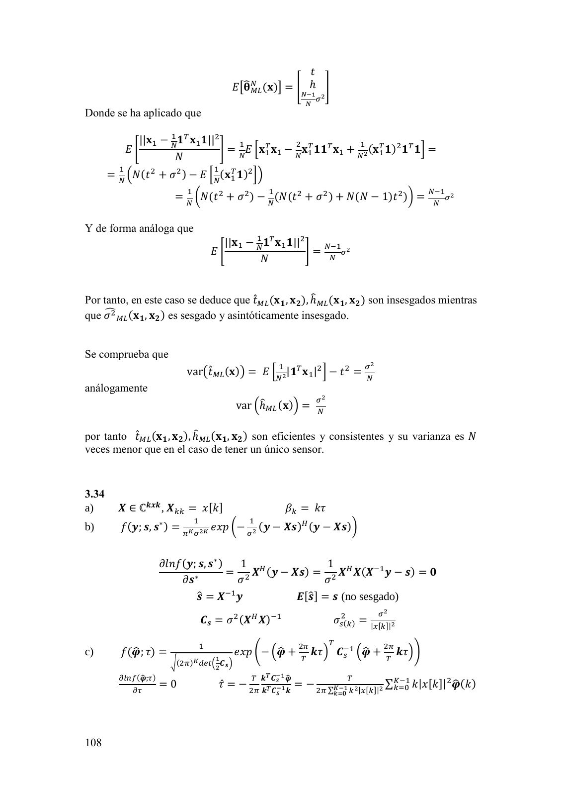

```text
                                                                    𝑡
                                              ̂𝑁
                                            𝐸[𝛉              ℎ
                                                𝑀𝐿 (𝐱)] = [𝑁−1 ]
                                                              𝜎2
                                                                𝑁
Donde se ha aplicado que

               ||𝐱1 − 𝑁1 𝟏𝑇 𝐱1 𝟏||2     1            2             1
             𝐸[                     ] = 𝑁𝐸 [𝐱1𝑇 𝐱1 − 𝑁𝐱1𝑇 𝟏𝟏𝑇 𝐱1 + 𝑁2 (𝐱1𝑇 𝟏)2 𝟏𝑇 𝟏] =
                        𝑁
         1                              1
       = 𝑁 (𝑁(𝑡 2 + 𝜎 2 ) − 𝐸 [𝑁(𝐱1𝑇 𝟏)2 ])
                            1                        1                                          𝑁−1 2
                         = 𝑁 (𝑁(𝑡 2 + 𝜎 2 ) − 𝑁(𝑁(𝑡 2 + 𝜎 2 ) + 𝑁(𝑁 − 1)𝑡 2 )) =                 𝑁
                                                                                                   𝜎


Y de forma análoga que
                                           ||𝐱1 − 𝑁1 𝟏𝑇 𝐱1 𝟏||2    𝑁−1
                                        𝐸[                      ] = 𝑁 𝜎2
                                                    𝑁


Por tanto, en este caso se deduce que 𝑡̂𝑀𝐿 (𝐱 𝟏 , 𝐱 𝟐 ), ℎ̂𝑀𝐿 (𝐱 𝟏 , 𝐱 𝟐 ) son insesgados mientras
que 𝜎̂2 𝑀𝐿 (𝐱 𝟏 , 𝐱 𝟐 ) es sesgado y asintóticamente insesgado.


Se comprueba que
                                               1                      𝜎               2
                            var(𝑡̂𝑀𝐿 (𝐱)) = 𝐸 [𝑁2 |𝟏𝑇 𝐱1 |2 ] − 𝑡 2 = 𝑁
análogamente
                                                              𝜎         2
                                             var (ℎ̂𝑀𝐿 (𝐱)) = 𝑁

por tanto 𝑡̂𝑀𝐿 (𝐱𝟏 , 𝐱 𝟐 ), ℎ̂𝑀𝐿 (𝐱 𝟏 , 𝐱 𝟐 ) son eficientes y consistentes y su varianza es 𝑁
veces menor que en el caso de tener un único sensor.


3.34
a)       𝑿 ∈ ℂ𝒌𝒙𝒌 , 𝑿𝑘𝑘 = 𝑥[𝑘]                               𝛽𝑘 = 𝑘𝜏
                                1               1
b)        𝑓(𝒚; 𝒔, 𝒔∗ ) = 𝜋𝐾𝜎2𝐾 𝑒𝑥𝑝 (− 𝜎2 (𝒚 − 𝑿𝒔)𝐻 (𝒚 − 𝑿𝒔))


                      𝜕𝑙𝑛𝑓(𝒚; 𝒔, 𝒔∗ )   1 𝐻               1 𝐻
                                      =    𝑿 (𝒚 − 𝑿𝒔)  =    𝑿 𝑿(𝑿−1 𝒚 − 𝒔) = 𝟎
                          𝜕𝒔∗           𝜎2               𝜎2
                             𝒔̂ = 𝑿−1 𝒚            𝑬[𝒔̂] = 𝒔 (no sesgado)
                                                                             2            𝜎2
                                    𝑪𝒔 = 𝜎 2 (𝑿𝐻 𝑿)−1                       𝜎𝑠(𝑘) = |𝑥[𝑘]|2

                                    1                          2𝜋           𝑇              2𝜋
c)          ̂ ; 𝜏) =
          𝑓(𝝋                                        ̂ + 𝒌𝜏) 𝑪−1
                                             𝑒𝑥𝑝 (− (𝝋           ̂ + 𝒌𝜏))
                                                              𝑠 (𝝋
                                   1                    𝑇           𝑇
                        √(2𝜋)𝐾 𝑑𝑒𝑡( 𝑪𝒔 )
                                   2
              ̂ ;𝜏)
         𝜕𝑙𝑛𝑓(𝝋                                  𝑇 𝒌𝑇 𝑪−1 𝝋
                                                          ̂                       𝑇
                      =0                 𝜏̂ = − 2𝜋 𝒌𝑇 𝑪𝑠−1 𝒌 = − 2𝜋 ∑𝐾−1 𝑘 2 |𝑥[𝑘]|2 ∑𝐾−1        2 (𝑘)
                                                                                                  ̂
                                                                                      𝑘=0 𝑘|𝑥[𝑘]| 𝝋
              𝜕𝜏                                         𝑠                  𝑘=𝟎


108
```

## Page 60

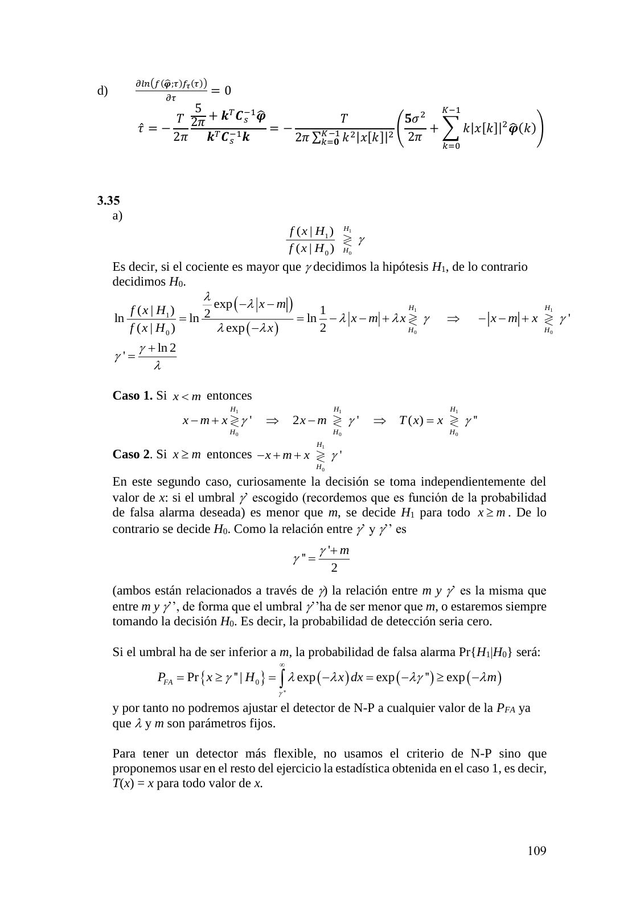

```text
                  ̂ ;𝜏)𝑓𝜏 (𝜏))
            𝜕𝑙𝑛(𝑓(𝝋
d)                               =0
                   𝜕𝜏
                      5    𝑇 −1                                𝐾−1
                   𝑇 2𝜋 + 𝒌 𝑪𝑠 𝝋̂             𝑇          𝟓𝜎 2           2 (𝑘)
            𝜏̂ = −                =−                                     ̂
                                          𝐾−1 2 |𝑥[𝑘]|2 ( 2𝜋 + ∑ 𝑘|𝑥[𝑘]| 𝝋    )
                   2𝜋 𝒌𝑇 𝑪−1
                           𝑠 𝒌       2𝜋 ∑ 𝑘=𝟎 𝑘
                                                                                             𝑘=0


3.35
   a)
                                                                       H1
                                                    f ( x | H1 )
                                                                            
                                                    f (x | H0 )        H0

     Es decir, si el cociente es mayor que  decidimos la hipótesis H1, de lo contrario
     decidimos H0.
                          
                            exp ( − x − m )                     H1                     H1
        f ( x | H1 )                             1
     ln              = ln 2                  = ln −  x − m +  x          − x−m + x     '
        f (x | H0 )           exp ( − x )      2               H0                     H0

             + ln 2
      '=
               

     Caso 1. Si x  m entonces
                                  H1                              H1                             H1
                        x−m+ x         '          2x − m              '         T ( x) = x         ''
                                  H0                              H0                             H0
                                                             H1
     Caso 2. Si x  m entonces − x + m + x                        '
                                                             H0

     En este segundo caso, curiosamente la decisión se toma independientemente del
     valor de x: si el umbral ’ escogido (recordemos que es función de la probabilidad
     de falsa alarma deseada) es menor que m, se decide H1 para todo x  m . De lo
     contrario se decide H0. Como la relación entre ’ y ’’ es
                                                              '+ m
                                                     '' =
                                                                  2
     (ambos están relacionados a través de ) la relación entre m y ’ es la misma que
     entre m y ’’, de forma que el umbral ’’ha de ser menor que m, o estaremos siempre
     tomando la decisión H0. Es decir, la probabilidad de detección seria cero.

     Si el umbral ha de ser inferior a m, la probabilidad de falsa alarma Pr{H1H0} será:
                                                
                 PFA = Pr  x   '' | H 0  =   exp ( − x ) dx = exp ( − '' )  exp ( − m )
                                              ''

     y por tanto no podremos ajustar el detector de N-P a cualquier valor de la PFA ya
     que  y m son parámetros fijos.

     Para tener un detector más flexible, no usamos el criterio de N-P sino que
     proponemos usar en el resto del ejercicio la estadística obtenida en el caso 1, es decir,
     T(x) = x para todo valor de x.


                                                                                                             109
```

## Page 61

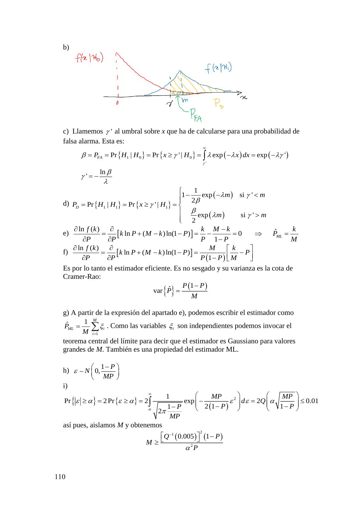

```text
  b)


  c) Llamemos  ' al umbral sobre x que ha de calcularse para una probabilidad de
  falsa alarma. Esta es:
                                                              
          = PFA = Pr  H1 | H 0  = Pr  x   ' | H 0  =   exp ( − x ) dx = exp ( − ' )
                                                              '

                 ln 
          '=−
                  
                                                     1
                                                1−      exp ( − m ) si  '  m
  d) PD = Pr  H1 | H1 = Pr  x   ' | H1 =  2
                                                  exp (  m )         si  '  m
                                                
                                                 2
      ln f (k )                                        k M −k                           k
  e)             =     k ln P + (M − k ) ln(1 − P) = −              =0          PˆML =
         P        P                                    P 1− P                           M
      ln f (k )                                            M      k      
  f)             =     k ln P + ( M − k ) ln(1 − P) =                − P
         P        P                                    P (1 − P )  M     
  Es por lo tanto el estimador eficiente. Es no sesgado y su varianza es la cota de
  Cramer-Rao:
                                                  P (1 − P )
                                          
                                     var Pˆ =
                                                     M

  g) A partir de la expresión del apartado e), podemos escribir el estimador como
          1 M
   PˆML =    i . Como las variables i son independientes podemos invocar el
          M i =1
  teorema central del límite para decir que el estimador es Gaussiano para valores
  grandes de M. También es una propiedad del estimador ML.

  h)        1− P 
          N  0,   
             MP 
  i)
                                    
                                                                               MP 
  Pr      = 2 Pr     = 2 
                                    1                MP
                                         exp  −            2  d  = 2Q            0.01
                                    1− P         2 (1 − P )                   1 − P 
                              
                                 2
                                     MP
  así pues, aislamos M y obtenemos
                                      Q −1 ( 0.005 )  (1 − P )
                                                          2

                                   M
                                                   2P


110
```

## Page 62

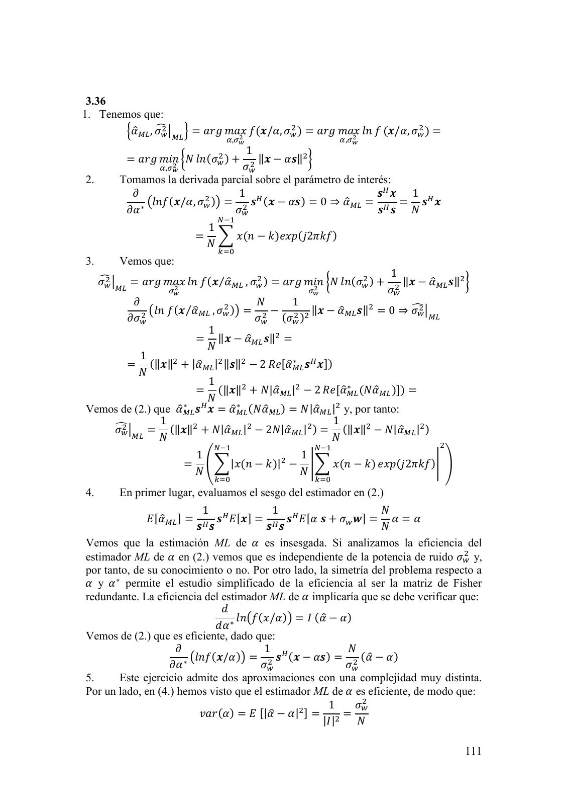

```text
 3.36
1. Tenemos que:
        {𝛼̂𝑀𝐿 , 𝜎̂2
                 𝑤 |𝑀𝐿 } = 𝑎𝑟𝑔 𝑚𝑎𝑥
                                 2
                                   𝑓(𝒙/𝛼, 𝜎𝑤2 ) = 𝑎𝑟𝑔 𝑚𝑎𝑥
                                                        2
                                                          𝑙𝑛 𝑓 (𝒙/𝛼, 𝜎𝑤2 ) =
                                  𝛼,𝜎𝑤                         𝛼,𝜎𝑤
                                    1
        = 𝑎𝑟𝑔 𝑚𝑖𝑛    {𝑁 𝑙𝑛(𝜎𝑤2 ) + 2 ‖𝒙 − 𝛼𝒔‖2 }
                   2
                𝛼,𝜎𝑤               𝜎𝑤
2.     Tomamos la derivada parcial sobre el parámetro de interés:
         𝜕                2 ))
                                  1 𝐻                         𝒔𝐻 𝒙 1 𝐻
             (𝑙𝑛𝑓(𝒙/𝛼,  𝜎 𝑤    =     𝒔 (𝒙 − 𝛼𝒔) = 0 ⇒ 𝛼
                                                      ̂ 𝑀𝐿 =      = 𝒔 𝒙
        𝜕𝛼 ∗                     𝜎𝑤2                          𝒔𝐻 𝒔 𝑁
                                 𝑁−1
                           1
                          = ∑ 𝑥(𝑛 − 𝑘)𝑒𝑥𝑝(𝑗2𝜋𝑘𝑓)
                           𝑁
                                 𝑘=0
3.     Vemos que:
                                                                       1
  𝜎̂2
   𝑤 |𝑀𝐿 = 𝑎𝑟𝑔 𝑚𝑎𝑥      𝑙𝑛 𝑓(𝒙⁄𝛼̂𝑀𝐿 , 𝜎𝑤2 ) = 𝑎𝑟𝑔 𝑚𝑖𝑛  {𝑁 𝑙𝑛(𝜎𝑤2 ) + 2 ‖𝒙 − 𝛼̂𝑀𝐿 𝒔‖2 }
                    2
                   𝜎𝑤                               2
                                                   𝜎𝑤                 𝜎𝑤
           𝜕                            𝑁       1
               (𝑙𝑛 𝑓(𝒙⁄𝛼̂𝑀𝐿 , 𝜎𝑤2 )) = 2 − 2 2 ‖𝒙 − 𝛼̂𝑀𝐿 𝒔‖2 = 0 ⇒ 𝜎̂        2
                                                                             𝑤 |𝑀𝐿
          𝜕𝜎𝑤2                         𝜎𝑤 (𝜎𝑤 )
                             1
                          = ‖𝒙 − 𝛼̂𝑀𝐿 𝒔‖2 =
                             𝑁
            1                                   ∗
          = (‖𝒙‖2 + |𝛼̂𝑀𝐿 |2 ‖𝒔‖2 − 2 𝑅𝑒[𝛼̂𝑀𝐿     𝒔𝐻 𝒙])
            𝑁
                             1                               ∗ (𝑁𝛼
                          = (‖𝒙‖2 + 𝑁|𝛼̂𝑀𝐿 |2 − 2 𝑅𝑒[𝛼̂𝑀𝐿          ̂𝑀𝐿 )]) =
                             𝑁
                      ∗            ∗ (𝑁𝛼
Vemos de (2.) que 𝛼̂𝑀𝐿    𝒔𝐻 𝒙 = 𝛼̂𝑀𝐿     ̂𝑀𝐿 ) = 𝑁|𝛼̂𝑀𝐿 |2 y, por tanto:
                 1                                       1
      𝜎̂2
       𝑤 |𝑀𝐿 =     (‖𝒙‖2 + 𝑁|𝛼̂𝑀𝐿 |2 − 2𝑁|𝛼̂𝑀𝐿 |2 ) = (‖𝒙‖2 − 𝑁|𝛼̂𝑀𝐿 |2 )
                 𝑁                                       𝑁
                               𝑁−1                       𝑁−1                   2
                      1               1
                     = (∑|𝑥(𝑛 − 𝑘)|2 − |∑ 𝑥(𝑛 − 𝑘) 𝑒𝑥𝑝(𝑗2𝜋𝑘𝑓)| )
                      𝑁               𝑁
                               𝑘=0                       𝑘=0
4.     En primer lugar, evaluamos el sesgo del estimador en (2.)
                           1                  1                  𝑁
             𝐸[𝛼̂𝑀𝐿 ] =          𝒔𝐻 𝐸[𝒙] =          𝒔𝐻 𝐸[𝛼 𝒔 + 𝜎𝑤 𝒘] =
                                                                   𝛼=𝛼
                          𝒔𝐻 𝒔               𝒔𝐻 𝒔                𝑁
Vemos que la estimación ML de 𝛼 es insesgada. Si analizamos la eficiencia del
estimador ML de 𝛼 en (2.) vemos que es independiente de la potencia de ruido 𝜎𝑤2 y,
por tanto, de su conocimiento o no. Por otro lado, la simetría del problema respecto a
𝛼 y 𝛼 ∗ permite el estudio simplificado de la eficiencia al ser la matriz de Fisher
redundante. La eficiencia del estimador ML de 𝛼 implicaría que se debe verificar que:
                              𝑑
                                  𝑙𝑛(𝑓(𝑥/𝛼)) = 𝐼 (𝛼̂ − 𝛼)
                             𝑑𝛼 ∗
Vemos de (2.) que es eficiente, dado que:
                    𝜕                   1                𝑁
                      ∗
                        (𝑙𝑛𝑓(𝒙/𝛼)) = 2 𝒔𝐻 (𝒙 − 𝛼𝒔) = 2 (𝛼̂ − 𝛼)
                   𝜕𝛼                 𝜎𝑤                 𝜎𝑤
5.     Este ejercicio admite dos aproximaciones con una complejidad muy distinta.
Por un lado, en (4.) hemos visto que el estimador ML de 𝛼 es eficiente, de modo que:
                                                     1     𝜎𝑤2
                          𝑣𝑎𝑟(𝛼) = 𝐸 [|𝛼̂ − 𝛼|2 ] = 2 =
                                                    |𝐼|    𝑁

                                                                                    111
```

## Page 63

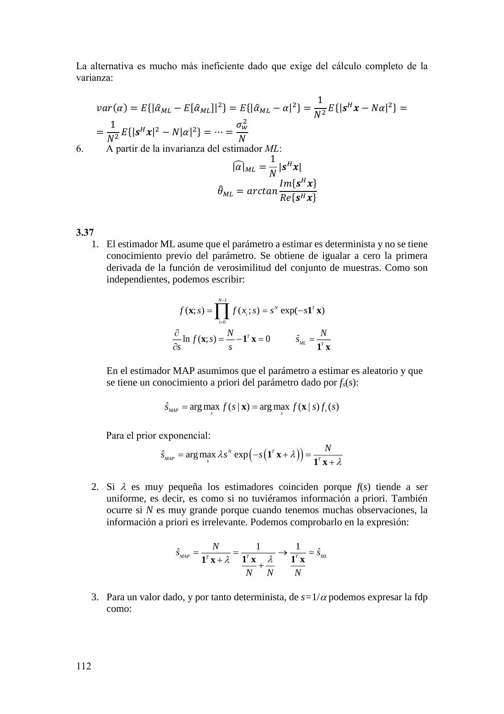

```text
La alternativa es mucho más ineficiente dado que exige del cálculo completo de la
varianza:

                                                                          1
      𝑣𝑎𝑟(𝛼) = 𝐸{|𝛼̂𝑀𝐿 − 𝐸[𝛼̂𝑀𝐿 ]|2 } = 𝐸{|𝛼̂𝑀𝐿 − 𝛼|2 } =                    𝐸{|𝒔𝐻 𝒙 − 𝑁𝛼|2 } =
                                                                          𝑁2
           1       𝐻 2          2}
                                            𝜎𝑤2
      =      𝐸{|𝒔   𝒙|   − 𝑁|𝛼|    = ⋯   =
          𝑁2                                𝑁
6.        A partir de la invarianza del estimador ML:
                                            ̂ 𝑀𝐿 = 1 |𝒔𝐻 𝒙|
                                           |𝛼|
                                                   𝑁
                                                     𝐼𝑚{𝒔𝐻 𝒙}
                                       ̂
                                      𝜃𝑀𝐿 = 𝑎𝑟𝑐𝑡𝑎𝑛
                                                     𝑅𝑒{𝒔𝐻 𝒙}


3.37
   1. El estimador ML asume que el parámetro a estimar es determinista y no se tiene
      conocimiento previo del parámetro. Se obtiene de igualar a cero la primera
      derivada de la función de verosimilitud del conjunto de muestras. Como son
      independientes, podemos escribir:
                                               N −1

                            f (x; s) =         f ( x ; s) = s exp(−s1 x)
                                               i =0
                                                      i
                                                              N           T


                                         N                                  N
                             ln f (x; s) = − 1T x = 0                 sˆML = T
                          s              s                                 1 x

          En el estimador MAP asumimos que el parámetro a estimar es aleatorio y que
          se tiene un conocimiento a priori del parámetro dado por fs(s):

                        sˆMAP = arg max f ( s | x) = arg max f (x | s) f s ( s)
                                          s                       s


          Para el prior exponencial:

                                      s
                                                          (
                       sˆMAP = arg max  s N exp − s (1T x +  ) =     ) 1 xN+ 
                                                                              T


     2. Si  es muy pequeña los estimadores coinciden porque f(s) tiende a ser
        uniforme, es decir, es como si no tuviéramos información a priori. También
        ocurre si N es muy grande porque cuando tenemos muchas observaciones, la
        información a priori es irrelevante. Podemos comprobarlo en la expresión:

                                       N      1      1
                           sˆMAP =        = T      → T = sˆML
                                     1 x+ 1 x 
                                     T
                                                    1 x
                                               +
                                            N    N   N

     3. Para un valor dado, y por tanto determinista, de s=1/ podemos expresar la fdp
        como:


112
```

## Page 64

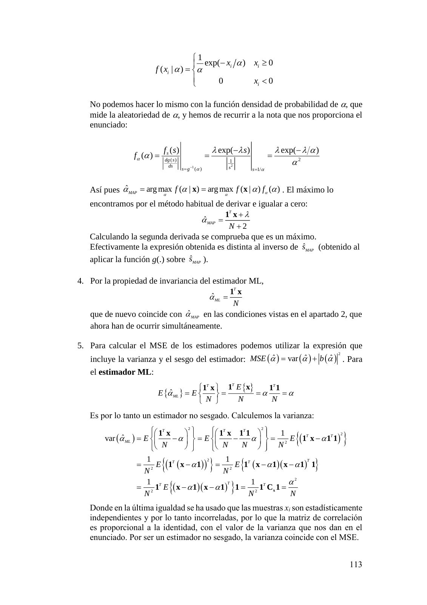

```text
                                         1
                                          exp(− xi  ) xi  0
                          f ( xi |  ) = 
                                             0        xi  0

   No podemos hacer lo mismo con la función densidad de probabilidad de , que
   mide la aleatoriedad de , y hemos de recurrir a la nota que nos proporciona el
   enunciado:

                           f ( s)                           exp(− s)                 exp(−   )
                 f ( ) = dgs ( s )                   =                          =
                                ds
                                                               1
                                                               s2
                                                                                           2
                                       s = g −1 ( )                     s =1/


   Así pues ˆ MAP = arg max
                          
                             f ( | x) = arg max f (x |  ) f ( ) . El máximo lo
                                              

   encontramos por el método habitual de derivar e igualar a cero:
                                               1T x + 
                                      ˆ MAP =
                                                N +2
   Calculando la segunda derivada se comprueba que es un máximo.
   Efectivamente la expresión obtenida es distinta al inverso de sˆMAP (obtenido al
   aplicar la función g(.) sobre sˆMAP ).

4. Por la propiedad de invariancia del estimador ML,
                                             1T x
                                     ˆ ML =
                                              N
   que de nuevo coincide con  MAP en las condiciones vistas en el apartado 2, que
                               ˆ
   ahora han de ocurrir simultáneamente.

5. Para calcular el MSE de los estimadores podemos utilizar la expresión que
   incluye la varianza y el sesgo del estimador: MSE (ˆ ) = var (ˆ ) + b (ˆ ) . Para
                                                                                2


   el estimador ML:
                                           1T x  1 E x
                                                                T
                                                               1T 1
                           E ˆ ML  = E        =       =       =
                                           N       N          N

   Es por lo tanto un estimador no sesgado. Calculemos la varianza:
                          1T x           1T x 1T 1  2  1
                                                                                                     
                                       2

        var (ˆ ML ) = E        −    = E               = 2 E (1T x −  1T 1)
                                                                                       2
                                                      −
                           N              N    N   N

                  =
                   N
                    1
                     2                                            
                       E (1T ( x −  1) ) = 2 E 1T ( x −  1)( x −  1) 1
                                         2    1
                                              N
                                                                       T
                                                                                                 
                                                                2
                   N
                    1
                                                   1
                  = 2 1T E ( x −  1)( x −  1) 1 = 2 1T Cx 1 =
                                               T

                                                   N
                                                                N
   Donde en la última igualdad se ha usado que las muestras xi son estadísticamente
   independientes y por lo tanto incorreladas, por lo que la matriz de correlación
   es proporcional a la identidad, con el valor de la varianza que nos dan en el
   enunciado. Por ser un estimador no sesgado, la varianza coincide con el MSE.


                                                                                                          113
```

## Page 65

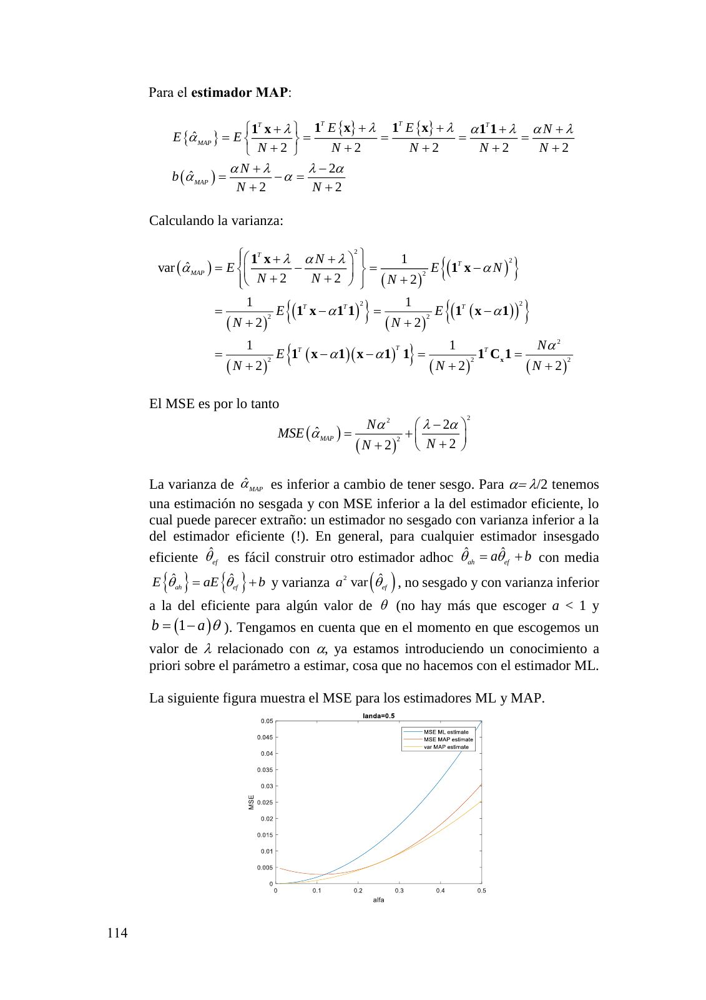

```text
      Para el estimador MAP:

                           1T x +   1 E x +  1 E x +   1T 1 +   N + 
                                              T                     T

          E ˆ MAP  = E           =           =           =          =
                           N +2          N +2      N +2        N +2      N +2
                        N +           − 2
          b (ˆ MAP ) =          − =
                         N +2           N +2

      Calculando la varianza:

                          1T x +   N +   2 
       var (ˆ MAP ) = E 
                           N + 2
                                     −         =
                                                      1
                                       N + 2   ( N + 2 )
                                                            2
                                                              E (1T x −  N )
                                                                              2
                                                                                                      
                  =
                         1
                      ( N + 2)
                                2
                                     E (1T x −  1T 1)
                                                         2
                                                              = ( N +1 2) E (1 ( x −  1)) 
                                                                           2
                                                                                   T                   2


                                                                        ( N +1 2) 1 C 1 = ( NN+2 )
                                                                                                           2
                         1
                  =                E 1T ( x −  1)( x −  1) 1 =
                                                                    T                          T

                      ( N + 2)
                                 2                                                         2       x           2


      El MSE es por lo tanto
                                                             N 2   − 2 
                                                                                       2

                                     MSE (ˆ MAP ) =             +        
                                                       ( N + 2)  N + 2 
                                                               2


      La varianza de ˆ MAP es inferior a cambio de tener sesgo. Para = /2 tenemos
      una estimación no sesgada y con MSE inferior a la del estimador eficiente, lo
      cual puede parecer extraño: un estimador no sesgado con varianza inferior a la
      del estimador eficiente (!). En general, para cualquier estimador insesgado
      eficiente ˆef es fácil construir otro estimador adhoc ˆah = aˆef + b con media
                                                          ( )
      E ˆah = aE ˆef + b y varianza a 2 var ˆef , no sesgado y con varianza inferior
      a la del eficiente para algún valor de  (no hay más que escoger a < 1 y
      b = (1 − a ) ). Tengamos en cuenta que en el momento en que escogemos un
      valor de  relacionado con , ya estamos introduciendo un conocimiento a
      priori sobre el parámetro a estimar, cosa que no hacemos con el estimador ML.

      La siguiente figura muestra el MSE para los estimadores ML y MAP.


114
```

## Page 66

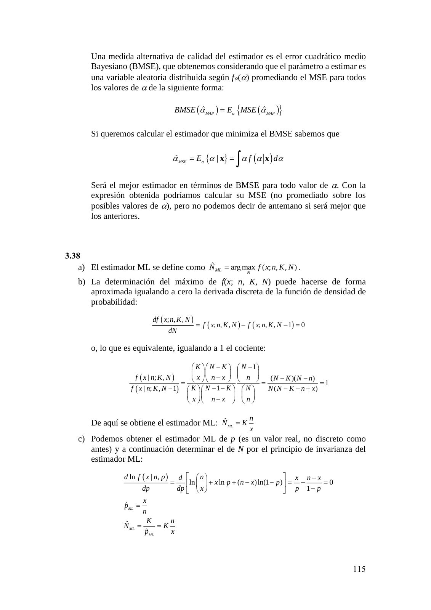

```text
       Una medida alternativa de calidad del estimador es el error cuadrático medio
       Bayesiano (BMSE), que obtenemos considerando que el parámetro a estimar es
       una variable aleatoria distribuida según f() promediando el MSE para todos
       los valores de  de la siguiente forma:

                                            BMSE (ˆ MAP ) = E MSE (ˆ MAP )

       Si queremos calcular el estimador que minimiza el BMSE sabemos que


                                                                      
                                        ˆ MSE = E  | x =  f ( x ) d


       Será el mejor estimador en términos de BMSE para todo valor de . Con la
       expresión obtenida podríamos calcular su MSE (no promediado sobre los
       posibles valores de ), pero no podemos decir de antemano si será mejor que
       los anteriores.


3.38
   a) El estimador ML se define como Nˆ ML = arg max f ( x; n, K , N ) .
                                                                          N

   b) La determinación del máximo de f(x; n, K, N) puede hacerse de forma
      aproximada igualando a cero la derivada discreta de la función de densidad de
      probabilidad:
                                df ( x; n, K , N )
                                                     = f ( x; n, K , N ) − f ( x; n, K , N − 1) = 0
                                        dN

       o, lo que es equivalente, igualando a 1 el cociente:

                                              K  N − K   N − 1
                       f ( x | n; K , N )                      
                                                    n−x   n          ( N − K )( N − n)
                                          =  
                                               x
                                                                      =                    =1
                     f ( x | n; K , N − 1)  K  N − 1 − K   N      N ( N − K − n + x)
                                                           
                                            x  n − x   n 

                                                                           n
       De aquí se obtiene el estimador ML: Nˆ ML = K
                                                                           x
   c) Podemos obtener el estimador ML de p (es un valor real, no discreto como
      antes) y a continuación determinar el de N por el principio de invarianza del
      estimador ML:

                  d ln f ( x | n, p )        d  n                                   x n−x
                                        =       ln   + x ln p + (n − x) ln(1 − p )  = −    =0
                           dp                dp   x                                 p 1− p
                           x
                  ˆpML =
                           n
                          K      n
                 Nˆ ML =      =K
                         ˆpML    x


                                                                                                      115
```

## Page 67

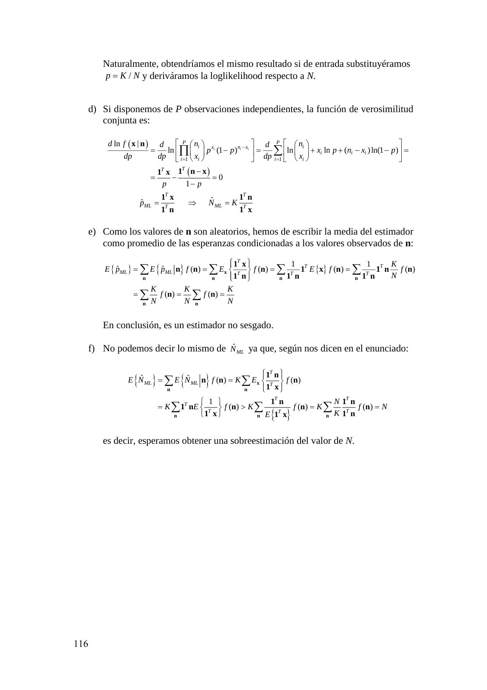

```text
      Naturalmente, obtendríamos el mismo resultado si de entrada substituyéramos
      p = K / N y deriváramos la loglikelihood respecto a N.


  d) Si disponemos de P observaciones independientes, la función de verosimilitud
     conjunta es:

       d ln f ( x | n )       d  P  ni  xi                 d P   ni                                       
                          =     ln    p (1 − p ) ni − xi  =
                              dp  i =1  xi 
                                                                      ln   + xi ln p + (ni − xi ) ln(1 − p )  =
             dp                                               dp i =1   xi                                   
                              1T x 1 ( n − x )
                                      T
                          =       −            =0
                               p     1− p
                               1T x                     1 nT
                      ˆpML =                  Nˆ ML = K T
                               1T n                     1 x

  e) Como los valores de n son aleatorios, hemos de escribir la media del estimador
     como promedio de las esperanzas condicionadas a los valores observados de n:
                                                1T x 
      E  ˆpML  =  E  pˆ ML n f (n) =  Ex  T  f (n) =  T 1T E x f (n) =  T 1T n f (n)
                                                                1                    1    K
                   n                      n      1 n     n 1 n                n 1 n   N
                        K        K          K
                  =      f (n) =  f (n) =
                      n N        N n        N

      En conclusión, es un estimador no sesgado.

  f) No podemos decir lo mismo de Nˆ ML ya que, según nos dicen en el enunciado:

                                                    1T n 
                                           
              E Nˆ ML =  E Nˆ ML n f (n) = K  Ex  T  f (n)
                        n                     n      1 x 
                                           1               1T n              N 1T n
                              = K  1T nE  T  f (n)  K        f (n ) = K         f (n) = N
                                  n       1 x                T
                                                          n E 1 x               T
                                                                             n K 1 n


      es decir, esperamos obtener una sobreestimación del valor de N.


116
```
