# PSAVC Exercicis Temes 4 i 5 Febrer 2026

- Source PDF: `~/Downloads/PSAVC Exercicis Temes 4 i 5 Febrer 2026.pdf`
- PDF title: `Col-leccio de problemes de PS`
- Pages: 81
- Note: Transcribed from the embedded PDF text layer. Each page links to a rendered page image so figures, plots, handwriting, and formula layout can be checked against the original.

## Page 1

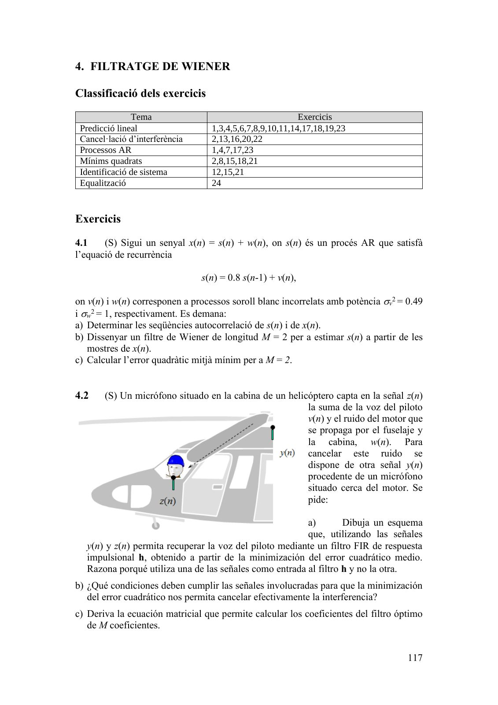

```text
4. FILTRATGE DE WIENER

Classificació dels exercicis
               Tema                                       Exercicis
 Predicció lineal                 1,3,4,5,6,7,8,9,10,11,14,17,18,19,23
 Cancel·lació d’interferència     2,13,16,20,22
 Processos AR                     1,4,7,17,23
 Mínims quadrats                  2,8,15,18,21
 Identificació de sistema         12,15,21
 Equalització                     24


Exercicis
4.1    (S) Sigui un senyal x(n) = s(n) + w(n), on s(n) és un procés AR que satisfà
l’equació de recurrència

                                s(n) = 0.8 s(n-1) + v(n),

on v(n) i w(n) corresponen a processos soroll blanc incorrelats amb potència v = 0.49
i w = 1, respectivament. Es demana:
a) Determinar les seqüències autocorrelació de s(n) i de x(n).
b) Dissenyar un filtre de Wiener de longitud M = 2 per a estimar s(n) a partir de les
   mostres de x(n).
c) Calcular l’error quadràtic mitjà mínim per a M = 2.


4.2    (S) Un micrófono situado en la cabina de un helicóptero capta en la señal z(n)
                                                        la suma de la voz del piloto
                                                        v(n) y el ruido del motor que
                                                        se propaga por el fuselaje y
                                                        la cabina, w(n). Para
                                                        cancelar este ruido se
                                                        dispone de otra señal y(n)
                                                        procedente de un micrófono
                                                        situado cerca del motor. Se
                                                        pide:

                                                        a)        Dibuja un esquema
                                                        que, utilizando las señales
  y(n) y z(n) permita recuperar la voz del piloto mediante un filtro FIR de respuesta
  impulsional h, obtenido a partir de la minimización del error cuadrático medio.
  Razona porqué utiliza una de las señales como entrada al filtro h y no la otra.
b) ¿Qué condiciones deben cumplir las señales involucradas para que la minimización
   del error cuadrático nos permita cancelar efectivamente la interferencia?
c) Deriva la ecuación matricial que permite calcular los coeficientes del filtro óptimo
   de M coeficientes.


                                                                                   117
```

## Page 2

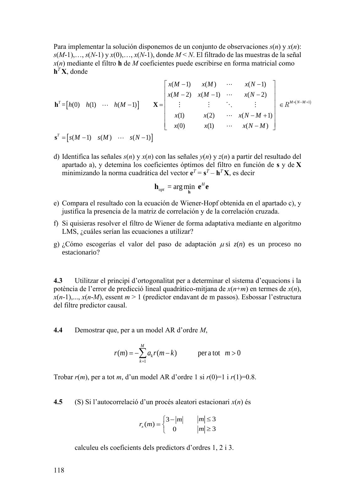

```text
Para implementar la solución disponemos de un conjunto de observaciones s(n) y x(n):
s(M-1),…, s(N-1) y x(0),…, x(N-1), donde M < N. El filtrado de las muestras de la señal
x(n) mediante el filtro h de M coeficientes puede escribirse en forma matricial como
hT X, donde
                                                    x( M − 1)  x( M )            x( N − 1) 
                                                    x( M − 2) x( M − 1)          x( N − 2) 
                                                   
hT =  h(0) h(1)            h( M − 1)           X=                                           R M ( N −M +1)
                                                                                            
                                                    x(1)         x(2)         x( N − M + 1) 
                                                    x(0)        x(1)          x( N − M ) 
sT =  s ( M − 1) s ( M )         s ( N − 1) 

d) Identifica las señales s(n) y x(n) con las señales y(n) y z(n) a partir del resultado del
   apartado a), y detemina los coeficientes óptimos del filtro en función de s y de X
   minimizando la norma cuadrática del vector eT = sT – hT X, es decir
                                                 hopt = arg min e H e
                                                             h

e) Compara el resultado con la ecuación de Wiener-Hopf obtenida en el apartado c), y
   justifica la presencia de la matriz de correlación y de la correlación cruzada.
f) Si quisieras resolver el filtro de Wiener de forma adaptativa mediante en algoritmo
   LMS, ¿cuáles serían las ecuaciones a utilizar?
g) ¿Cómo escogerías el valor del paso de adaptación  si z(n) es un proceso no
   estacionario?


4.3      Utilitzar el principi d’ortogonalitat per a determinar el sistema d’equacions i la
potència de l’error de predicció lineal quadràtico-mitjana de x(n+m) en termes de x(n),
x(n-1),..., x(n-M), essent m > 1 (predictor endavant de m passos). Esbossar l’estructura
del filtre predictor causal.


4.4     Demostrar que, per a un model AR d’ordre M,

                                          M
                            r (m) = − ak r (m − k )             per a tot m  0
                                          k =1


Trobar r(m), per a tot m, d’un model AR d’ordre 1 si r(0)=1 i r(1)=0.8.


4.5     (S) Si l’autocorrelació d’un procés aleatori estacionari x(n) és

                                               3 − m            m 3
                                      rx (m) = 
                                                0               m 3

        calculeu els coeficients dels predictors d’ordres 1, 2 i 3.


118
```

## Page 3

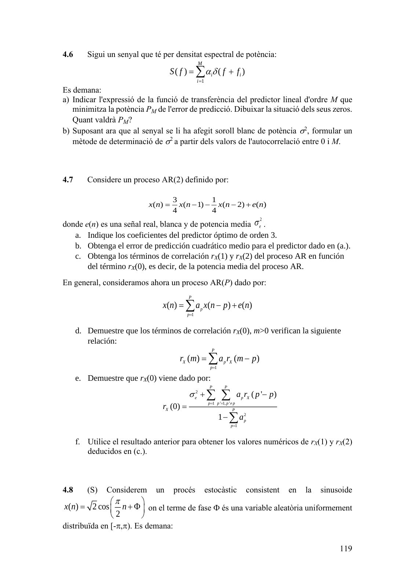

```text
4.6      Sigui un senyal que té per densitat espectral de potència:
                                                   M
                                   S ( f ) =  i ( f + fi )
                                                   i =1
Es demana:
a) Indicar l'expressió de la funció de transferència del predictor lineal d'ordre M que
   minimitza la potència PM de l'error de predicció. Dibuixar la situació dels seus zeros.
   Quant valdrà PM?
b) Suposant ara que al senyal se li ha afegit soroll blanc de potència 2, formular un
   mètode de determinació de 2 a partir dels valors de l'autocorrelació entre 0 i M.


4.7      Considere un proceso AR(2) definido por:

                                       3           1
                            x ( n) =     x(n − 1) − x(n − 2) + e(n)
                                       4           4
donde e(n) es una señal real, blanca y de potencia media  e .
                                                                                     2


   a. Indique los coeficientes del predictor óptimo de orden 3.
   b. Obtenga el error de predicción cuadrático medio para el predictor dado en (a.).
   c. Obtenga los términos de correlación rX(1) y rX(2) del proceso AR en función
       del término rX(0), es decir, de la potencia media del proceso AR.
En general, consideramos ahora un proceso AR(P) dado por:
                                            P
                                 x ( n) =  a p x ( n − p ) + e( n )
                                            p =1


      d. Demuestre que los términos de correlación rX(0), m>0 verifican la siguiente
         relación:
                                                             P
                                         rX (m) =  a p rX (m − p)
                                                            p =1

      e. Demuestre que rX(0) viene dado por:
                                                            P         P
                                             e2 +   a p rX ( p '− p)
                                                           p =1 p '=1, p ' p
                                 rX (0) =                                  P
                                                                   1 −  a 2p
                                                                          p =1


      f. Utilice el resultado anterior para obtener los valores numéricos de rX(1) y rX(2)
         deducidos en (c.).


4.8      (S)   Considerem     un       procés             estocàstic             consistent   en   la   sinusoide
                   
x(n) = 2 cos  n +   on el terme de fase  és una variable aleatòria uniformement
             2      
distribuïda en [-,). Es demana:

                                                                                                             119
```

## Page 4

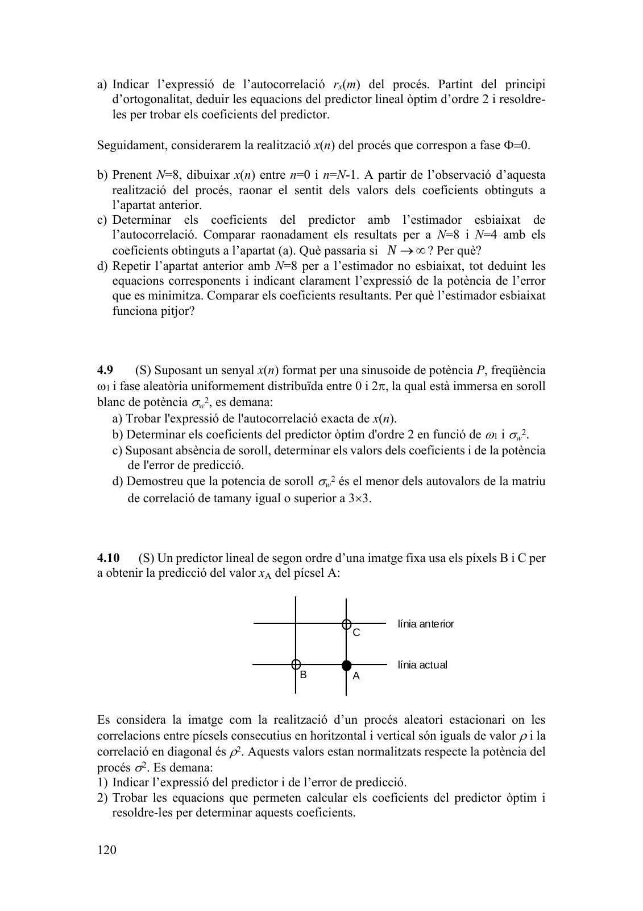

```text
a) Indicar l’expressió de l’autocorrelació rx(m) del procés. Partint del principi
   d’ortogonalitat, deduir les equacions del predictor lineal òptim d’ordre 2 i resoldre-
   les per trobar els coeficients del predictor.

Seguidament, considerarem la realització x(n) del procés que correspon a fase =

b) Prenent N=8, dibuixar x(n) entre n=0 i n=N-1. A partir de l’observació d’aquesta
   realització del procés, raonar el sentit dels valors dels coeficients obtinguts a
   l’apartat anterior.
c) Determinar els coeficients del predictor amb l’estimador esbiaixat de
   l’autocorrelació. Comparar raonadament els resultats per a N=8 i N=4 amb els
   coeficients obtinguts a l’apartat (a). Què passaria si N →  ? Per què?
d) Repetir l’apartat anterior amb N=8 per a l’estimador no esbiaixat, tot deduint les
   equacions corresponents i indicant clarament l’expressió de la potència de l’error
   que es minimitza. Comparar els coeficients resultants. Per què l’estimador esbiaixat
   funciona pitjor?


4.9     (S) Suposant un senyal x(n) format per una sinusoide de potència P, freqüència
 i fase aleatòria uniformement distribuïda entre 0 i 2, la qual està immersa en soroll
blanc de potència w2, es demana:
   a) Trobar l'expressió de l'autocorrelació exacta de x(n).
   b) Determinar els coeficients del predictor òptim d'ordre 2 en funció de  i w2.
   c) Suposant absència de soroll, determinar els valors dels coeficients i de la potència
       de l'error de predicció.
   d) Demostreu que la potencia de soroll w2 és el menor dels autovalors de la matriu
       de correlació de tamany igual o superior a 33.


4.10 (S) Un predictor lineal de segon ordre d’una imatge fixa usa els píxels B i C per
a obtenir la predicció del valor xA del pícsel A:


                                                            línia anterior
                                                   C


                                                            línia actual
                                         B         A


Es considera la imatge com la realització d’un procés aleatori estacionari on les
correlacions entre pícsels consecutius en horitzontal i vertical són iguals de valor  i la
correlació en diagonal és 2. Aquests valors estan normalitzats respecte la potència del
procés 2. Es demana:
1) Indicar l’expressió del predictor i de l’error de predicció.
2) Trobar les equacions que permeten calcular els coeficients del predictor òptim i
   resoldre-les per determinar aquests coeficients.

120
```

## Page 5

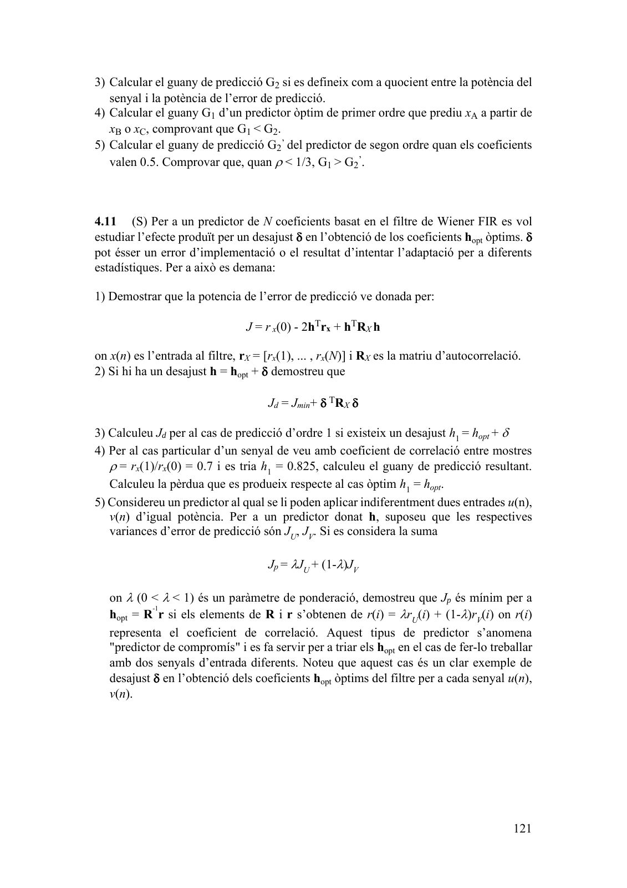

```text
3) Calcular el guany de predicció G2 si es defineix com a quocient entre la potència del
   senyal i la potència de l’error de predicció.
4) Calcular el guany G1 d’un predictor òptim de primer ordre que prediu xA a partir de
   xB o xC, comprovant que G1 < G2.
5) Calcular el guany de predicció G2’ del predictor de segon ordre quan els coeficients
   valen 0.5. Comprovar que, quan  < 1/3, G1 > G2’.


4.11 (S) Per a un predictor de N coeficients basat en el filtre de Wiener FIR es vol
estudiar l’efecte produït per un desajust  en l’obtenció de los coeficients hopt òptims. 
pot ésser un error d’implementació o el resultat d’intentar l’adaptació per a diferents
estadístiques. Per a això es demana:

1) Demostrar que la potencia de l’error de predicció ve donada per:

                                 J = r x(0) - 2hTrx + hTRX h

on x(n) es l’entrada al filtre, rX = [rx(1), ... , rx(N)] i RX es la matriu d’autocorrelació.
2) Si hi ha un desajust h = hopt +  demostreu que

                                     Jd = Jmin+  TRX 

3) Calculeu Jd per al cas de predicció d’ordre 1 si existeix un desajust h1 = hopt + 
4) Per al cas particular d’un senyal de veu amb coeficient de correlació entre mostres
    = rx(1)/rx(0) = 0.7 i es tria h1 = 0.825, calculeu el guany de predicció resultant.
   Calculeu la pèrdua que es produeix respecte al cas òptim h1 = hopt.
5) Considereu un predictor al qual se li poden aplicar indiferentment dues entrades u(n),
   v(n) d’igual potència. Per a un predictor donat h, suposeu que les respectives
   variances d’error de predicció són JU, JV. Si es considera la suma

                                     Jp = JU + (1-)JV

   on  (0 <  < 1) és un paràmetre de ponderació, demostreu que Jp és mínim per a
            -1
   hopt = R r si els elements de R i r s’obtenen de r(i) = rU(i) + (1-)rV(i) on r(i)
   representa el coeficient de correlació. Aquest tipus de predictor s’anomena
   "predictor de compromís" i es fa servir per a triar els hopt en el cas de fer-lo treballar
   amb dos senyals d’entrada diferents. Noteu que aquest cas és un clar exemple de
   desajust  en l’obtenció dels coeficients hopt òptims del filtre per a cada senyal u(n),
   v(n).


                                                                                           121
```

## Page 6

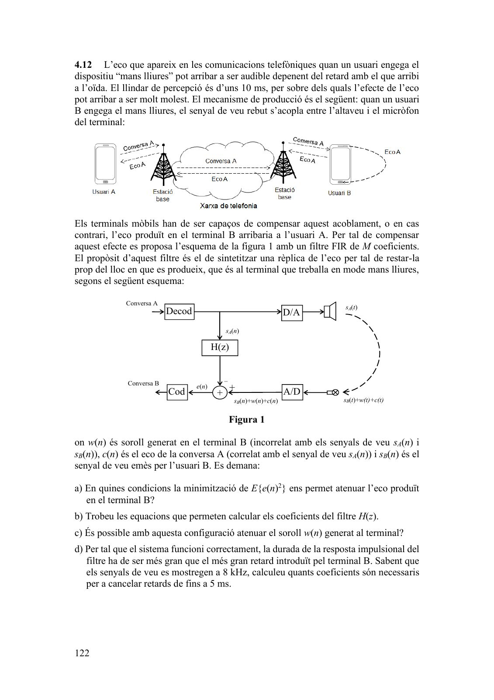

```text
4.12 L’eco que apareix en les comunicacions telefòniques quan un usuari engega el
dispositiu “mans lliures” pot arribar a ser audible depenent del retard amb el que arribi
a l’oïda. El llindar de percepció és d’uns 10 ms, per sobre dels quals l’efecte de l’eco
pot arribar a ser molt molest. El mecanisme de producció és el següent: quan un usuari
B engega el mans lliures, el senyal de veu rebut s’acopla entre l’altaveu i el micròfon
del terminal:


Els terminals mòbils han de ser capaços de compensar aquest acoblament, o en cas
contrari, l’eco produït en el terminal B arribaria a l’usuari A. Per tal de compensar
aquest efecte es proposa l’esquema de la figura 1 amb un filtre FIR de M coeficients.
El propòsit d’aquest filtre és el de sintetitzar una rèplica de l’eco per tal de restar-la
prop del lloc en que es produeix, que és al terminal que treballa en mode mans lliures,
segons el següent esquema:

             Conversa A
                                                                         sA(t)
                           Decod                                   D/A
                                             sA(n)

                                          H(z)


                                            _
              Conversa B
                                           + +
                                   e(n)
                           Cod                                     A/D
                                                 sB(n)+w(n)+c(n)         sB(t)+w(t)+c(t)
                           f
                                                Figura 1

on w(n) és soroll generat en el terminal B (incorrelat amb els senyals de veu sA(n) i
sB(n)), c(n) és el eco de la conversa A (correlat amb el senyal de veu sA(n)) i sB(n) és el
senyal de veu emès per l’usuari B. Es demana:

a) En quines condicions la minimització de E{e(n)2} ens permet atenuar l’eco produït
   en el terminal B?
b) Trobeu les equacions que permeten calcular els coeficients del filtre H(z).
c) És possible amb aquesta configuració atenuar el soroll w(n) generat al terminal?
d) Per tal que el sistema funcioni correctament, la durada de la resposta impulsional del
   filtre ha de ser més gran que el més gran retard introduït pel terminal B. Sabent que
   els senyals de veu es mostregen a 8 kHz, calculeu quants coeficients són necessaris
   per a cancelar retards de fins a 5 ms.


122
```

## Page 7

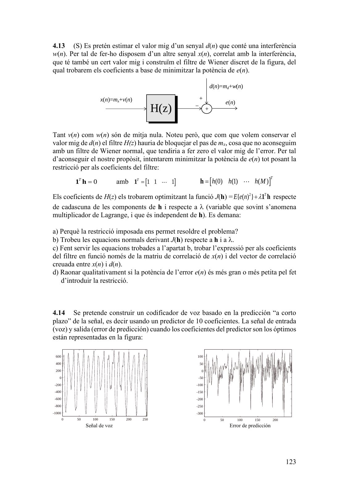

```text
4.13 (S) Es pretén estimar el valor mig d’un senyal d(n) que conté una interferència
w(n). Per tal de fer-ho disposem d’un altre senyal x(n), correlat amb la interferència,
que té també un cert valor mig i construïm el filtre de Wiener discret de la figura, del
qual trobarem els coeficients a base de minimitzar la potència de e(n).

                                                                        d(n)=md+w(n)

                          x(n)=mx+v(n)                        +
                                                          _                     e(n)
                                                  H(z)              +


Tant v(n) com w(n) són de mitja nula. Noteu però, que com que volem conservar el
valor mig de d(n) el filtre H(z) hauria de bloquejar el pas de mx, cosa que no aconseguim
amb un filtre de Wiener normal, que tendiria a fer zero el valor mig de l’error. Per tal
d’aconseguir el nostre propòsit, intentarem minimitzar la potència de e(n) tot posant la
restricció per als coeficients del filtre:

                                   amb 1T = 1 1     1        h =  h(0) h(1)               h( M ) 
                                                                                                       T
            1T h = 0

Els coeficients de H(z) els trobarem optimitzant la funció J(h) = E{e(n)2 } + 1T h respecte
de cadascuna de les components de h i respecte a  (variable que sovint s’anomena
multiplicador de Lagrange, i que és independent de h). Es demana:

a) Perquè la restricció imposada ens permet resoldre el problema?
b) Trobeu les equacions normals derivant J(h) respecte a h i a .
c) Fent servir les equacions trobades a l’apartat b, trobar l’expressió per als coeficients
del filtre en funció només de la matriu de correlació de x(n) i del vector de correlació
creuada entre x(n) i d(n).
d) Raonar qualitativament si la potència de l’error e(n) és més gran o més petita pel fet
   d’introduir la restricció.


4.14 Se pretende construir un codificador de voz basado en la predicción “a corto
plazo” de la señal, es decir usando un predictor de 10 coeficientes. La señal de entrada
(voz) y salida (error de predicción) cuando los coeficientes del predictor son los óptimos
están representadas en la figura:

 600                                                      100
 400                                                          50
 200                                                           0
    0                                                         -50

 -200                                                     -100
 -400                                                     -150
 -600                                                     -200
 -800                                                     -250
-1000                                                     -300
        0   50      100      150      200   250                     0      50          100   150           200
                 Señal de voz                                                    Error de predicción


                                                                                                                 123
```

## Page 8

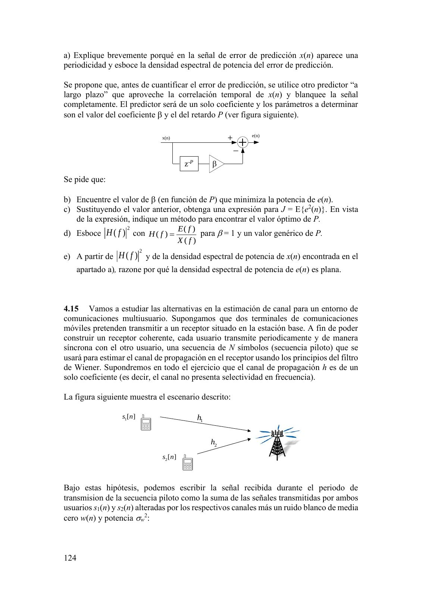

```text
a) Explique brevemente porqué en la señal de error de predicción x(n) aparece una
periodicidad y esboce la densidad espectral de potencia del error de predicción.

Se propone que, antes de cuantificar el error de predicción, se utilice otro predictor “a
largo plazo” que aproveche la correlación temporal de x(n) y blanquee la señal
completamente. El predictor será de un solo coeficiente y los parámetros a determinar
son el valor del coeficiente  y el del retardo P (ver figura siguiente).

                                                                     e(n)
                              x(n)                       +
                                                             _   +
                                         z-P        
Se pide que:

b) Encuentre el valor de  (en función de P) que minimiza la potencia de e(n).
c) Sustituyendo el valor anterior, obtenga una expresión para J = E{e2(n)}. En vista
   de la expresión, indique un método para encontrar el valor óptimo de P.
                   2                   E( f )
d) Esboce H ( f ) con H ( f ) =               para  = 1 y un valor genérico de P.
                                       X(f )
                         2
e) A partir de H ( f ) y de la densidad espectral de potencia de x(n) encontrada en el
   apartado a), razone por qué la densidad espectral de potencia de e(n) es plana.


4.15 Vamos a estudiar las alternativas en la estimación de canal para un entorno de
comunicaciones multiusuario. Supongamos que dos terminales de comunicaciones
móviles pretenden transmitir a un receptor situado en la estación base. A fin de poder
construir un receptor coherente, cada usuario transmite periodicamente y de manera
síncrona con el otro usuario, una secuencia de N símbolos (secuencia piloto) que se
usará para estimar el canal de propagación en el receptor usando los principios del filtro
de Wiener. Supondremos en todo el ejercicio que el canal de propagación h es de un
solo coeficiente (es decir, el canal no presenta selectividad en frecuencia).

La figura siguiente muestra el escenario descrito:

                 s1[n]                         h1


                                                    h2
                              s2 [n]


Bajo estas hipótesis, podemos escribir la señal recibida durante el periodo de
transmision de la secuencia piloto como la suma de las señales transmitidas por ambos
usuarios s1(n) y s2(n) alteradas por los respectivos canales más un ruido blanco de media
cero w(n) y potencia w2:


124
```

## Page 9

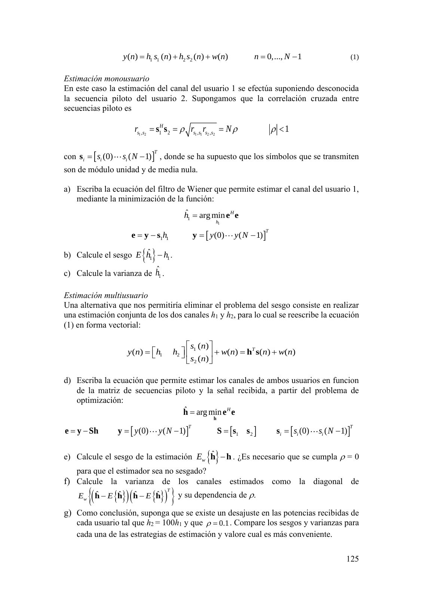

```text
                     y (n) = h1 s1 (n) + h2 s2 (n) + w(n)                    n = 0,..., N − 1                        (1)


Estimación monousuario
En este caso la estimación del canal del usuario 1 se efectúa suponiendo desconocida
la secuencia piloto del usuario 2. Supongamos que la correlación cruzada entre
secuencias piloto es

                          rs1 , s2 = s1H s 2 =  rs1 , s1 rs2 ,s2 = N                1

con si =  si (0)
               si ( N − 1)  , donde se ha supuesto que los símbolos que se transmiten
                                  T


son de módulo unidad y de media nula.

a) Escriba la ecuación del filtro de Wiener que permite estimar el canal del usuario 1,
   mediante la minimización de la función:
                                                hˆ1 = arg min e H e
                                                              h1

                        e = y − s1h1                  y =  y (0)     y ( N − 1) 
                                                                                 T


                             
b) Calcule el sesgo E hˆ1 − h1 .

c) Calcule la varianza de ĥ1 .

Estimación multiusuario
Una alternativa que nos permitiría eliminar el problema del sesgo consiste en realizar
una estimación conjunta de los dos canales h1 y h2, para lo cual se reescribe la ecuación
(1) en forma vectorial:

                                                    s ( n) 
                       y (n) =  h1         h2   1        + w(n) = h s(n) + w(n)
                                                                         T

                                                    2
                                                     s ( n ) 

d) Escriba la ecuación que permite estimar los canales de ambos usuarios en funcion
   de la matriz de secuencias piloto y la señal recibida, a partir del problema de
   optimización:
                                 hˆ = arg min e H e
                                                             h

e = y − Sh          y =  y (0)       y ( N − 1)                S = s1 s 2         si =  si (0)   si ( N − 1)
                                                  T                                                              T


                                                          
e) Calcule el sesgo de la estimación Ew hˆ − h . ¿Es necesario que se cumpla  = 0
   para que el estimador sea no sesgado?
f) Calcule la varianza de los canales estimados como la diagonal de
    Ew   (hˆ − E hˆ) (hˆ − E hˆ)  y su dependencia de 
                                         T


g) Como conclusión, suponga que se existe un desajuste en las potencias recibidas de
    cada usuario tal que h2 = 100h1 y que  = 0.1 . Compare los sesgos y varianzas para
    cada una de las estrategias de estimación y valore cual es más conveniente.

                                                                                                                125
```

## Page 10

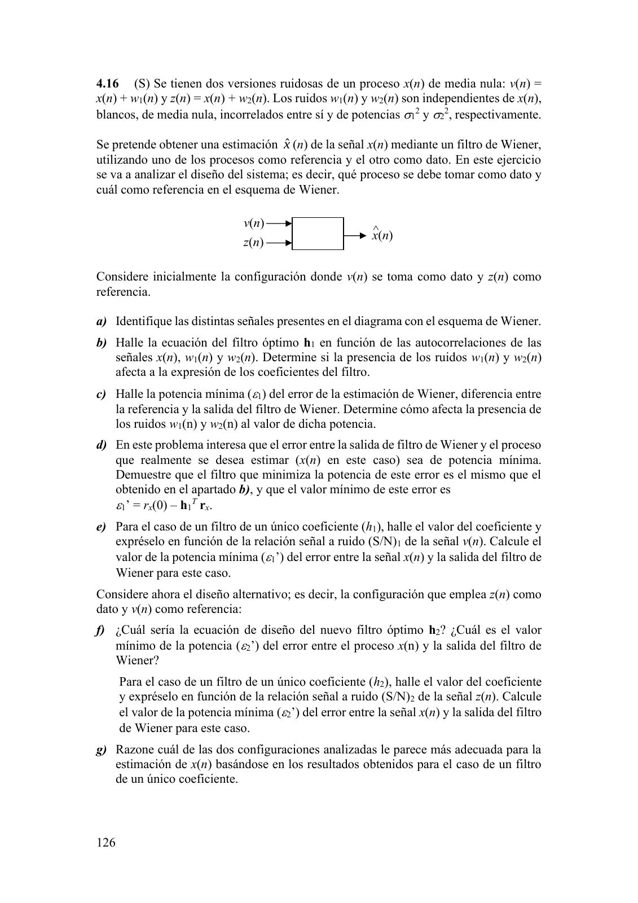

```text
4.16 (S) Se tienen dos versiones ruidosas de un proceso x(n) de media nula: v(n) =
x(n) + w1(n) y z(n) = x(n) + w2(n). Los ruidos w1(n) y w2(n) son independientes de x(n),
blancos, de media nula, incorrelados entre sí y de potencias 12 y 22, respectivamente.

Se pretende obtener una estimación x̂ (n) de la señal x(n) mediante un filtro de Wiener,
utilizando uno de los procesos como referencia y el otro como dato. En este ejercicio
se va a analizar el diseño del sistema; es decir, qué proceso se debe tomar como dato y
cuál como referencia en el esquema de Wiener.

                                v(n)
                                                           ^
                                                           x(n)
                                z(n)

Considere inicialmente la configuración donde v(n) se toma como dato y z(n) como
referencia.

a) Identifique las distintas señales presentes en el diagrama con el esquema de Wiener.
b) Halle la ecuación del filtro óptimo h1 en función de las autocorrelaciones de las
   señales x(n), w1(n) y w2(n). Determine si la presencia de los ruidos w1(n) y w2(n)
   afecta a la expresión de los coeficientes del filtro.
c) Halle la potencia mínima (1) del error de la estimación de Wiener, diferencia entre
   la referencia y la salida del filtro de Wiener. Determine cómo afecta la presencia de
   los ruidos w1(n) y w2(n) al valor de dicha potencia.
d) En este problema interesa que el error entre la salida de filtro de Wiener y el proceso
   que realmente se desea estimar (x(n) en este caso) sea de potencia mínima.
   Demuestre que el filtro que minimiza la potencia de este error es el mismo que el
   obtenido en el apartado b), y que el valor mínimo de este error es
   1’ = rx(0) – h1T rx.
e) Para el caso de un filtro de un único coeficiente (h1), halle el valor del coeficiente y
   expréselo en función de la relación señal a ruido (S/N)1 de la señal v(n). Calcule el
   valor de la potencia mínima (1’) del error entre la señal x(n) y la salida del filtro de
   Wiener para este caso.
Considere ahora el diseño alternativo; es decir, la configuración que emplea z(n) como
dato y v(n) como referencia:
f) ¿Cuál sería la ecuación de diseño del nuevo filtro óptimo h2? ¿Cuál es el valor
   mínimo de la potencia (2’) del error entre el proceso x(n) y la salida del filtro de
   Wiener?
      Para el caso de un filtro de un único coeficiente (h2), halle el valor del coeficiente
      y expréselo en función de la relación señal a ruido (S/N)2 de la señal z(n). Calcule
      el valor de la potencia mínima (2’) del error entre la señal x(n) y la salida del filtro
      de Wiener para este caso.
g) Razone cuál de las dos configuraciones analizadas le parece más adecuada para la
   estimación de x(n) basándose en los resultados obtenidos para el caso de un filtro
   de un único coeficiente.


126
```

## Page 11

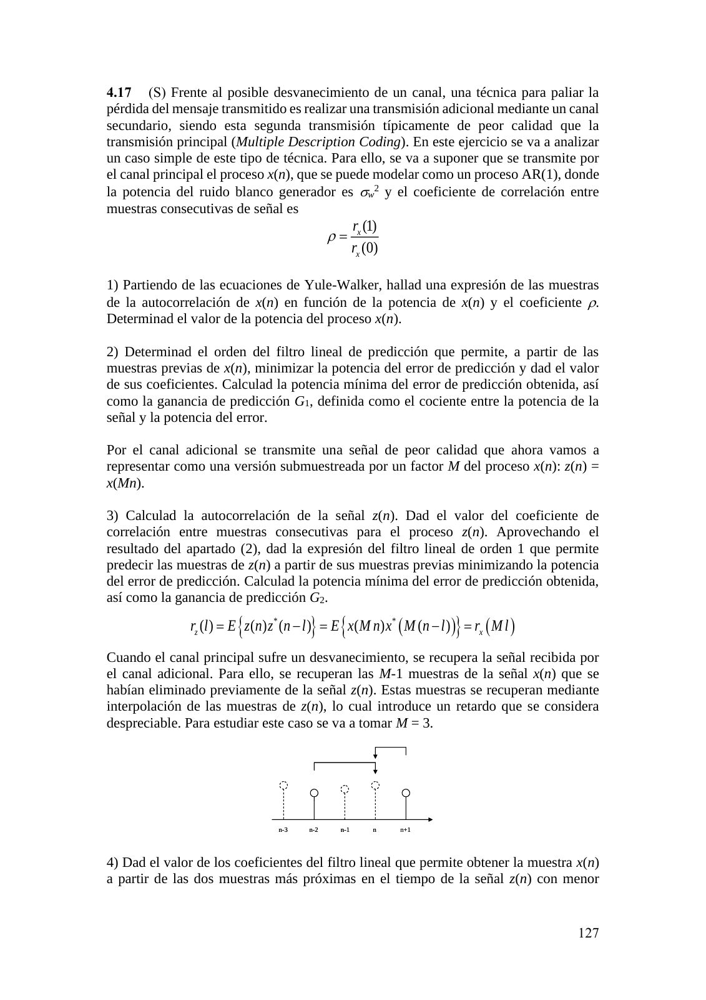

```text
4.17 (S) Frente al posible desvanecimiento de un canal, una técnica para paliar la
pérdida del mensaje transmitido es realizar una transmisión adicional mediante un canal
secundario, siendo esta segunda transmisión típicamente de peor calidad que la
transmisión principal (Multiple Description Coding). En este ejercicio se va a analizar
un caso simple de este tipo de técnica. Para ello, se va a suponer que se transmite por
el canal principal el proceso x(n), que se puede modelar como un proceso AR(1), donde
la potencia del ruido blanco generador es w2 y el coeficiente de correlación entre
muestras consecutivas de señal es
                                                    r (1)
                                                 = x
                                                   rx (0)

1) Partiendo de las ecuaciones de Yule-Walker, hallad una expresión de las muestras
de la autocorrelación de x(n) en función de la potencia de x(n) y el coeficiente .
Determinad el valor de la potencia del proceso x(n).

2) Determinad el orden del filtro lineal de predicción que permite, a partir de las
muestras previas de x(n), minimizar la potencia del error de predicción y dad el valor
de sus coeficientes. Calculad la potencia mínima del error de predicción obtenida, así
como la ganancia de predicción G1, definida como el cociente entre la potencia de la
señal y la potencia del error.

Por el canal adicional se transmite una señal de peor calidad que ahora vamos a
representar como una versión submuestreada por un factor M del proceso x(n): z(n) =
x(Mn).

3) Calculad la autocorrelación de la señal z(n). Dad el valor del coeficiente de
correlación entre muestras consecutivas para el proceso z(n). Aprovechando el
resultado del apartado (2), dad la expresión del filtro lineal de orden 1 que permite
predecir las muestras de z(n) a partir de sus muestras previas minimizando la potencia
del error de predicción. Calculad la potencia mínima del error de predicción obtenida,
así como la ganancia de predicción G2.

               rz (l ) = E  z (n) z * (n − l ) = E  x( M n) x* ( M (n − l ) ) = rx ( M l )
Cuando el canal principal sufre un desvanecimiento, se recupera la señal recibida por
el canal adicional. Para ello, se recuperan las M-1 muestras de la señal x(n) que se
habían eliminado previamente de la señal z(n). Estas muestras se recuperan mediante
interpolación de las muestras de z(n), lo cual introduce un retardo que se considera
despreciable. Para estudiar este caso se va a tomar M = 3.


                                    n-3    n-2     n-1     n      n+1


4) Dad el valor de los coeficientes del filtro lineal que permite obtener la muestra x(n)
a partir de las dos muestras más próximas en el tiempo de la señal z(n) con menor


                                                                                                 127
```

## Page 12

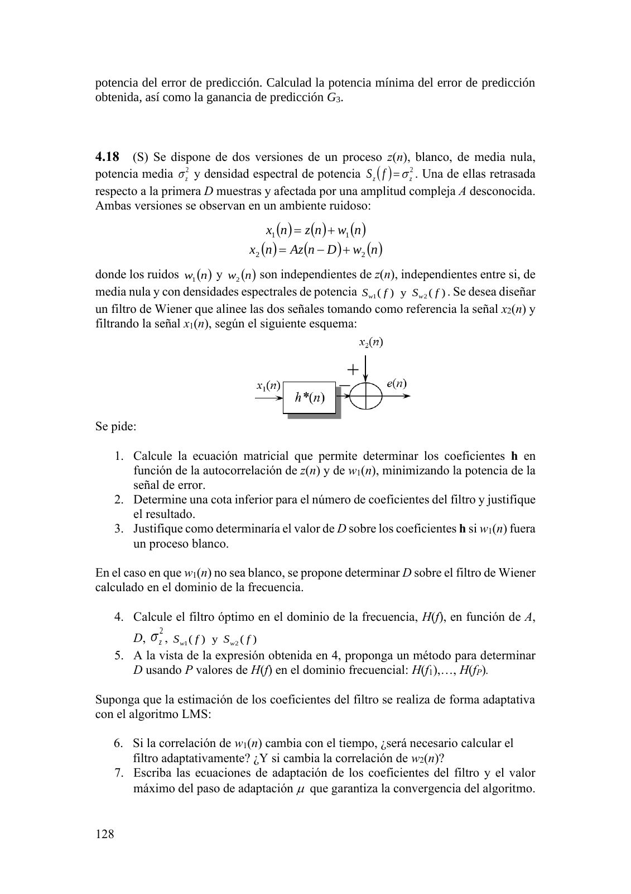

```text
potencia del error de predicción. Calculad la potencia mínima del error de predicción
obtenida, así como la ganancia de predicción G3.


4.18 (S) Se dispone de dos versiones de un proceso z(n), blanco, de media nula,
potencia media  z2 y densidad espectral de potencia S z ( f ) =  z2 . Una de ellas retrasada
respecto a la primera D muestras y afectada por una amplitud compleja A desconocida.
Ambas versiones se observan en un ambiente ruidoso:
                                     x1 (n ) = z (n ) + w1 (n )
                                 x2 (n ) = Az (n − D ) + w2 (n )
donde los ruidos w1 (n ) y w2 (n ) son independientes de z(n), independientes entre si, de
media nula y con densidades espectrales de potencia S w1 ( f ) y S w 2 ( f ) . Se desea diseñar
un filtro de Wiener que alinee las dos señales tomando como referencia la señal x2(n) y
filtrando la señal x1(n), según el siguiente esquema:


Se pide:

    1. Calcule la ecuación matricial que permite determinar los coeficientes h en
       función de la autocorrelación de z(n) y de w1(n), minimizando la potencia de la
       señal de error.
    2. Determine una cota inferior para el número de coeficientes del filtro y justifique
       el resultado.
    3. Justifique como determinaría el valor de D sobre los coeficientes h si w1(n) fuera
       un proceso blanco.

En el caso en que w1(n) no sea blanco, se propone determinar D sobre el filtro de Wiener
calculado en el dominio de la frecuencia.

    4. Calcule el filtro óptimo en el dominio de la frecuencia, H(f), en función de A,
       D,  z , S w1 ( f ) y S w 2 ( f )
             2

    5. A la vista de la expresión obtenida en 4, proponga un método para determinar
       D usando P valores de H(f) en el dominio frecuencial: H(f1),…, H(fP).

Suponga que la estimación de los coeficientes del filtro se realiza de forma adaptativa
con el algoritmo LMS:

   6. Si la correlación de w1(n) cambia con el tiempo, ¿será necesario calcular el
      filtro adaptativamente? ¿Y si cambia la correlación de w2(n)?
   7. Escriba las ecuaciones de adaptación de los coeficientes del filtro y el valor
      máximo del paso de adaptación  que garantiza la convergencia del algoritmo.


128
```

## Page 13

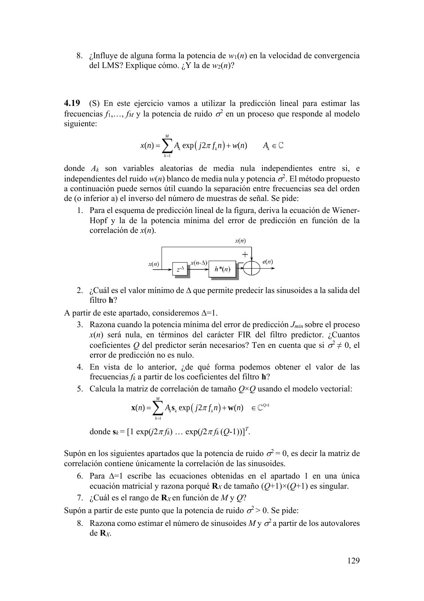

```text
   8. ¿Influye de alguna forma la potencia de w1(n) en la velocidad de convergencia
      del LMS? Explique cómo. ¿Y la de w2(n)?


4.19 (S) En este ejercicio vamos a utilizar la predicción lineal para estimar las
frecuencias f1,…, fM y la potencia de ruido 2 en un proceso que responde al modelo
siguiente:

                                       A exp ( j 2 f n ) + w(n)
                                       M

                       x ( n) =                  k       k
                                                                    Ak 
                                      k =1


donde Ak son variables aleatorias de media nula independientes entre si, e
independientes del ruido w(n) blanco de media nula y potencia 2. El método propuesto
a continuación puede sernos útil cuando la separación entre frecuencias sea del orden
de (o inferior a) el inverso del número de muestras de señal. Se pide:
    1. Para el esquema de predicción lineal de la figura, deriva la ecuación de Wiener-
        Hopf y la de la potencia mínima del error de predicción en función de la
        correlación de x(n).


   2. ¿Cuál es el valor mínimo de  que permite predecir las sinusoides a la salida del
        filtro h?
A partir de este apartado, consideremos =1.
   3. Razona cuando la potencia mínima del error de predicción Jmin sobre el proceso
        x(n) será nula, en términos del carácter FIR del filtro predictor. ¿Cuantos
        coeficientes Q del predictor serán necesarios? Ten en cuenta que si 2 ≠ 0, el
        error de predicción no es nulo.
   4. En vista de lo anterior, ¿de qué forma podemos obtener el valor de las
        frecuencias fk a partir de los coeficientes del filtro h?
   5. Calcula la matriz de correlación de tamaño Q×Q usando el modelo vectorial:

                                A s exp ( j2 f n ) + w(n) 
                                M

                    x ( n) =               k k       k
                                                                    Q1


                               k =1


       donde sk = [1 exp(j2 fk) … exp(j2 fk (Q-1))]T.

Supón en los siguientes apartados que la potencia de ruido 2 = 0, es decir la matriz de
correlación contiene únicamente la correlación de las sinusoides.
    6. Para =1 escribe las ecuaciones obtenidas en el apartado 1 en una única
        ecuación matricial y razona porqué RX de tamaño (Q+1)×(Q+1) es singular.
    7. ¿Cuál es el rango de RX en función de M y Q?
Supón a partir de este punto que la potencia de ruido 2 > 0. Se pide:
    8. Razona como estimar el número de sinusoides M y 2 a partir de los autovalores
        de RX.


                                                                                    129
```

## Page 14

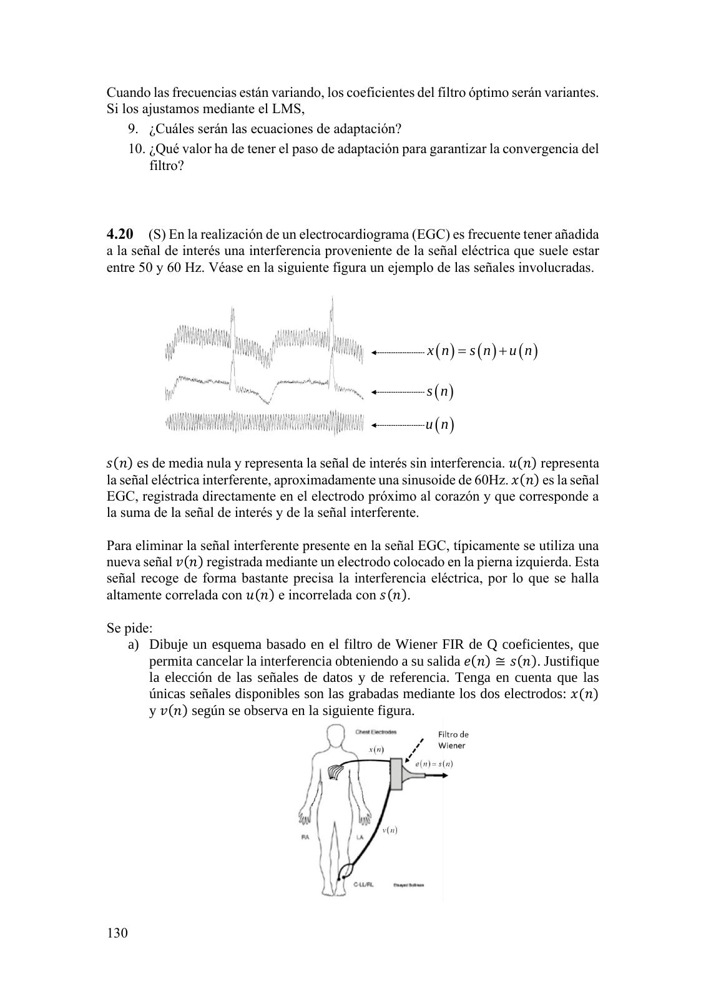

```text
Cuando las frecuencias están variando, los coeficientes del filtro óptimo serán variantes.
Si los ajustamos mediante el LMS,
    9. ¿Cuáles serán las ecuaciones de adaptación?
    10. ¿Qué valor ha de tener el paso de adaptación para garantizar la convergencia del
        filtro?


4.20 (S) En la realización de un electrocardiograma (EGC) es frecuente tener añadida
a la señal de interés una interferencia proveniente de la señal eléctrica que suele estar
entre 50 y 60 Hz. Véase en la siguiente figura un ejemplo de las señales involucradas.


                                                          x (n) = s (n) + u (n)

                                                          s (n)

                                                          u (n)

𝑠(𝑛) es de media nula y representa la señal de interés sin interferencia. 𝑢(𝑛) representa
la señal eléctrica interferente, aproximadamente una sinusoide de 60Hz. 𝑥(𝑛) es la señal
EGC, registrada directamente en el electrodo próximo al corazón y que corresponde a
la suma de la señal de interés y de la señal interferente.

Para eliminar la señal interferente presente en la señal EGC, típicamente se utiliza una
nueva señal 𝑣(𝑛) registrada mediante un electrodo colocado en la pierna izquierda. Esta
señal recoge de forma bastante precisa la interferencia eléctrica, por lo que se halla
altamente correlada con 𝑢(𝑛) e incorrelada con 𝑠(𝑛).

Se pide:
    a) Dibuje un esquema basado en el filtro de Wiener FIR de Q coeficientes, que
       permita cancelar la interferencia obteniendo a su salida 𝑒(𝑛) ≅ 𝑠(𝑛). Justifique
       la elección de las señales de datos y de referencia. Tenga en cuenta que las
       únicas señales disponibles son las grabadas mediante los dos electrodos: 𝑥(𝑛)
       y 𝑣(𝑛) según se observa en la siguiente figura.


130
```

## Page 15

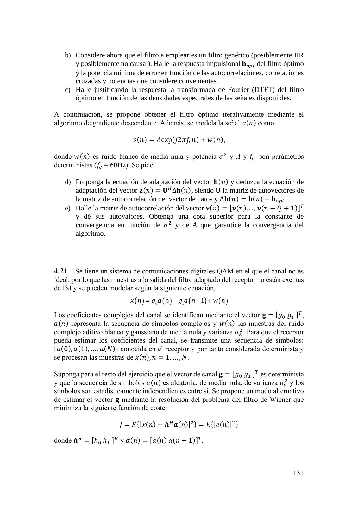

```text
   b) Considere ahora que el filtro a emplear es un filtro genérico (posiblemente IIR
      y posiblemente no causal). Halle la respuesta impulsional 𝐡𝑜𝑝𝑡 del filtro óptimo
      y la potencia mínima de error en función de las autocorrelaciones, correlaciones
      cruzadas y potencias que considere convenientes.
   c) Halle justificando la respuesta la transformada de Fourier (DTFT) del filtro
      óptimo en función de las densidades espectrales de las señales disponibles.

A continuación, se propone obtener el filtro óptimo iterativamente mediante el
algoritmo de gradiente descendente. Además, se modela la señal 𝑣(𝑛) como

                             𝑣(𝑛) = 𝐴exp(𝑗2𝜋𝑓𝑐 𝑛) + 𝑤(𝑛),

donde 𝑤(𝑛) es ruido blanco de media nula y potencia 𝜎 2 y A y 𝑓𝑐 son parámetros
deterministas (𝑓𝑐 = 60Hz). Se pide:

   d) Proponga la ecuación de adaptación del vector 𝐡(𝑛) y deduzca la ecuación de
      adaptación del vector 𝐳(𝑛) = 𝐔 𝐻 ∆𝐡(𝑛), siendo 𝐔 la matriz de autovectores de
      la matriz de autocorrelación del vector de datos y ∆𝐡(𝑛) = 𝐡(𝑛) − 𝐡𝑜𝑝𝑡 .
   e) Halle la matriz de autocorrelación del vector 𝐯(𝑛) = [𝑣(𝑛), . . , 𝑣(𝑛 − 𝑄 + 1)]𝑇
      y dé sus autovalores. Obtenga una cota superior para la constante de
      convergencia en función de 𝜎 2 y de A que garantice la convergencia del
      algoritmo.


4.21 Se tiene un sistema de comunicaciones digitales QAM en el que el canal no es
ideal, por lo que las muestras a la salida del filtro adaptado del receptor no están exentas
de ISI y se pueden modelar según la siguiente ecuación,
                            x ( n ) = g 0 a ( n ) + g1a ( n − 1) + w ( n )

Los coeficientes complejos del canal se identifican mediante el vector 𝐠 = [𝑔0 𝑔1 ]𝑇 ,
𝑎(𝑛) representa la secuencia de símbolos complejos y 𝑤(𝑛) las muestras del ruido
complejo aditivo blanco y gaussiano de media nula y varianza 𝜎𝑤2 . Para que el receptor
pueda estimar los coeficientes del canal, se transmite una secuencia de símbolos:
{𝑎(0), 𝑎(1), … . 𝑎(𝑁)} conocida en el receptor y por tanto considerada determinista y
se procesan las muestras de 𝑥(𝑛), 𝑛 = 1, … , 𝑁.

Suponga para el resto del ejercicio que el vector de canal 𝐠 = [𝑔0 𝑔1 ]𝑇 es determinista
y que la secuencia de símbolos 𝑎(𝑛) es aleatoria, de media nula, de varianza 𝜎𝑎2 y los
símbolos son estadísticamente independientes entre sí. Se propone un modo alternativo
de estimar el vector 𝐠 mediante la resolución del problema del filtro de Wiener que
minimiza la siguiente función de coste:

                        𝐽 = 𝐸{|𝑥(𝑛) − 𝒉𝐻 𝒂(𝑛)|2 } = 𝐸{|𝑒(𝑛)|2 }

donde 𝒉𝐻 = [ℎ0 ℎ1 ]𝐻 y 𝒂(𝑛) = [𝑎(𝑛) 𝑎(𝑛 − 1)]𝑇 .


                                                                                        131
```

## Page 16

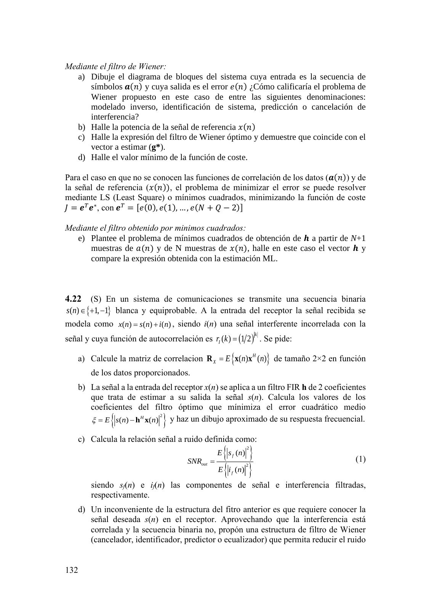

```text
Mediante el filtro de Wiener:
  a) Dibuje el diagrama de bloques del sistema cuya entrada es la secuencia de
      símbolos 𝒂(𝑛) y cuya salida es el error 𝑒(𝑛) ¿Cómo calificaría el problema de
      Wiener propuesto en este caso de entre las siguientes denominaciones:
      modelado inverso, identificación de sistema, predicción o cancelación de
      interferencia?
  b) Halle la potencia de la señal de referencia 𝑥(𝑛)
  c) Halle la expresión del filtro de Wiener óptimo y demuestre que coincide con el
      vector a estimar (g*).
  d) Halle el valor mínimo de la función de coste.

Para el caso en que no se conocen las funciones de correlación de los datos (𝒂(𝑛)) y de
la señal de referencia (𝑥(𝑛)), el problema de minimizar el error se puede resolver
mediante LS (Least Square) o mínimos cuadrados, minimizando la función de coste
𝐽 = 𝒆𝑇 𝒆∗ , con 𝒆𝑇 = [𝑒(0), 𝑒(1), … , 𝑒(𝑁 + 𝑄 − 2)]

Mediante el filtro obtenido por minimos cuadrados:
  e) Plantee el problema de mínimos cuadrados de obtención de 𝒉 a partir de N+1
      muestras de 𝑎(𝑛) y de N muestras de 𝑥(𝑛), halle en este caso el vector 𝒉 y
      compare la expresión obtenida con la estimación ML.


4.22 (S) En un sistema de comunicaciones se transmite una secuencia binaria
s(n)  +1, −1 blanca y equiprobable. A la entrada del receptor la señal recibida se
modela como x(n) = s(n) + i(n) , siendo i(n) una señal interferente incorrelada con la
señal y cuya función de autocorrelación es rI (k ) = (1 2 ) . Se pide:
                                                                 k


                                                                    
   a) Calcule la matriz de correlacion R X = E x(n)x H (n) de tamaño 2×2 en función
       de los datos proporcionados.
   b) La señal a la entrada del receptor x(n) se aplica a un filtro FIR h de 2 coeficientes
      que trata de estimar a su salida la señal s(n). Calcula los valores de los
      coeficientes del filtro óptimo que mínimiza el error cuadrático medio
                             
       = E s(n) − h H x(n) y haz un dibujo aproximado de su respuesta frecuencial.
                           2


   c) Calcula la relación señal a ruido definida como:

                                     SNR =
                                              E s f ( n)
                                                             2

                                                                                       (1)
                                           E  i ( n) 
                                          out                2
                                                     f


        siendo sf(n) e if(n) las componentes de señal e interferencia filtradas,
        respectivamente.
   d) Un inconveniente de la estructura del fitro anterior es que requiere conocer la
      señal deseada s(n) en el receptor. Aprovechando que la interferencia está
      correlada y la secuencia binaria no, propón una estructura de filtro de Wiener
      (cancelador, identificador, predictor o ecualizador) que permita reducir el ruido


132
```

## Page 17

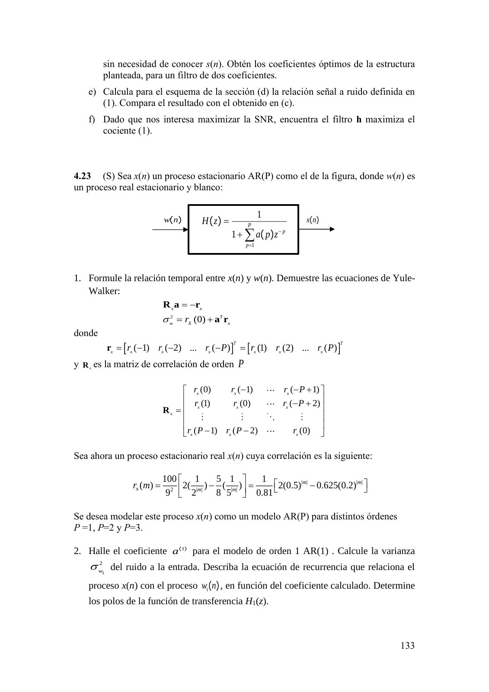

```text
        sin necesidad de conocer s(n). Obtén los coeficientes óptimos de la estructura
        planteada, para un filtro de dos coeficientes.
   e) Calcula para el esquema de la sección (d) la relación señal a ruido definida en
      (1). Compara el resultado con el obtenido en (c).
   f) Dado que nos interesa maximizar la SNR, encuentra el filtro h maximiza el
      cociente (1).


4.23 (S) Sea x(n) un proceso estacionario AR(P) como el de la figura, donde w(n) es
un proceso real estacionario y blanco:

                                                                  1
                              w(n)          H ( z) =       P
                                                                                x ( n)
                                                       1 +  a( p) z   −p

                                                           p =1


1. Formule la relación temporal entre x(n) y w(n). Demuestre las ecuaciones de Yule-
   Walker:
                              R x a = −rx
                               w2 = rX (0) + aT rx
donde
            rx =  rx (−1) rx (−2) ... rx (− P)  =  rx (1) rx (2) ... rx ( P) 
                                                       T                                  T


y R x es la matriz de correlación de orden P

                                    rx (0)        rx (−1)              rx (− P + 1) 
                                    r (1)          rx (0)              rx (− P + 2) 
                              Rx =  x
                                                                                     
                                                                                     
                                    rx ( P − 1) rx ( P − 2)                rx (0) 

Sea ahora un proceso estacionario real x(n) cuya correlación es la siguiente:

                              100  1         5 1         1
                   rx (m) =         2( |m| ) − ( |m| )  =    2(0.5)|m| − 0.625(0.2)|m| 
                                2 
                               9  2          8 5  0.81 

Se desea modelar este proceso x(n) como un modelo AR(P) para distintos órdenes
P =1, P=2 y P=3.

2. Halle el coeficiente a (1) para el modelo de orden 1 AR(1) . Calcule la varianza
     w2 del ruido a la entrada. Describa la ecuación de recurrencia que relaciona el
        1


   proceso x(n) con el proceso w1 (n) , en función del coeficiente calculado. Determine
   los polos de la función de transferencia H1(z).


                                                                                              133
```

## Page 18

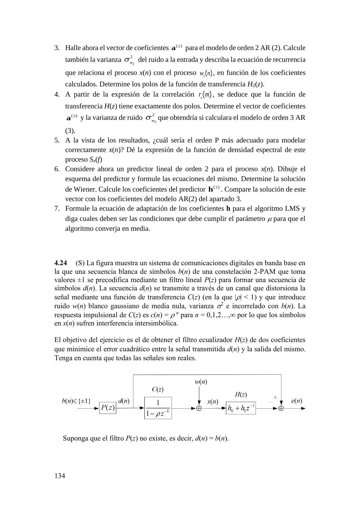

```text
3. Halle ahora el vector de coeficientes a( 2 ) para el modelo de orden 2 AR (2). Calcule
   también la varianza  w2 del ruido a la entrada y describa la ecuación de recurrencia
                            2


   que relaciona el proceso x(n) con el proceso w2 (n) , en función de los coeficientes
   calculados. Determine los polos de la función de transferencia H2(z).
4. A partir de la expresión de la correlación rx (m) , se deduce que la función de
   transferencia H(z) tiene exactamente dos polos. Determine el vector de coeficientes
      a ( 3) y la varianza de ruido  w3 que obtendría si calculara el modelo de orden 3 AR
                                    2


   (3).
5. A la vista de los resultados, ¿cuál sería el orden P más adecuado para modelar
   correctamente x(n)? Dé la expresión de la función de densidad espectral de este
   proceso Sx(f)
6. Considere ahora un predictor lineal de orden 2 para el proceso x(n). Dibuje el
   esquema del predictor y formule las ecuaciones del mismo. Determine la solución
   de Wiener. Calcule los coeficientes del predictor h ( 2 ) . Compare la solución de este
   vector con los coeficientes del modelo AR(2) del apartado 3.
7. Formule la ecuación de adaptación de los coeficientes h para el algoritmo LMS y
   diga cuales deben ser las condiciones que debe cumplir el parámetro  para que el
   algoritmo converja en media.


4.24 (S) La figura muestra un sistema de comunicaciones digitales en banda base en
la que una secuencia blanca de símbolos b(n) de una constelación 2-PAM que toma
valores ±1 se precodifica mediante un filtro lineal P(z) para formar una secuencia de
símbolos d(n). La secuencia d(n) se transmite a través de un canal que distorsiona la
señal mediante una función de transferencia C(z) (en la que || < 1) y que introduce
ruido w(n) blanco gaussiano de media nula, varianza 2 e incorrelado con b(n). La
respuesta impulsional de C(z) es c(n) =  n para n = 0,1,2…,∞ por lo que los símbolos
en x(n) sufren interferencia intersimbólica.

El objetivo del ejercicio es el de obtener el filtro ecualizador H(z) de dos coeficientes
que minimice el error cuadrático entre la señal transmitida d(n) y la salida del mismo.
Tenga en cuenta que todas las señales son reales.


   Suponga que el filtro P(z) no existe, es decir, d(n) = b(n).


134
```

## Page 19

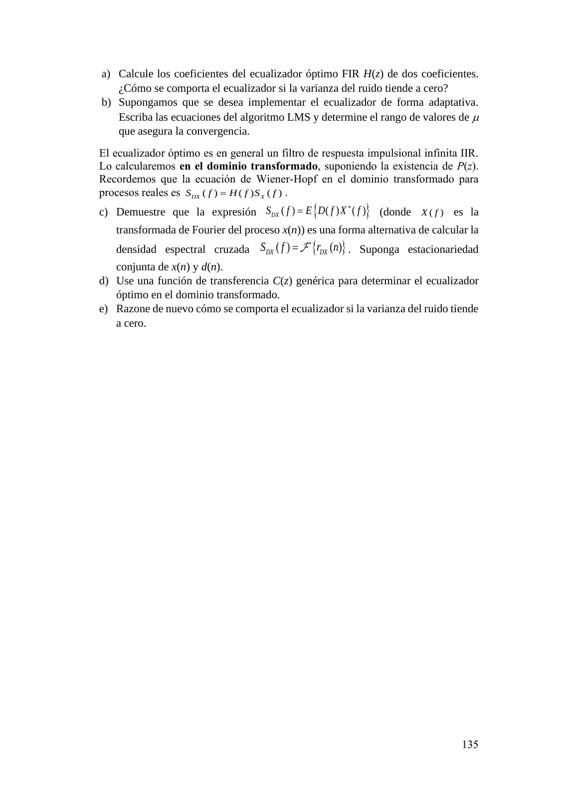

```text
a) Calcule los coeficientes del ecualizador óptimo FIR H(z) de dos coeficientes.
   ¿Cómo se comporta el ecualizador si la varianza del ruido tiende a cero?
b) Supongamos que se desea implementar el ecualizador de forma adaptativa.
   Escriba las ecuaciones del algoritmo LMS y determine el rango de valores de 
   que asegura la convergencia.
El ecualizador óptimo es en general un filtro de respuesta impulsional infinita IIR.
Lo calcularemos en el dominio transformado, suponiendo la existencia de P(z).
Recordemos que la ecuación de Wiener-Hopf en el dominio transformado para
procesos reales es S DX ( f ) = H ( f ) S X ( f ) .
c) Demuestre que la expresión S DX ( f ) = E D( f ) X ( f ) (donde X ( f ) es la
                                                      


   transformada de Fourier del proceso x(n)) es una forma alternativa de calcular la
   densidad espectral cruzada S DX ( f ) =     rDX (n) . Suponga estacionariedad
   conjunta de x(n) y d(n).
d) Use una función de transferencia C(z) genérica para determinar el ecualizador
   óptimo en el dominio transformado.
e) Razone de nuevo cómo se comporta el ecualizador si la varianza del ruido tiende
   a cero.


                                                                                135
```

## Page 20

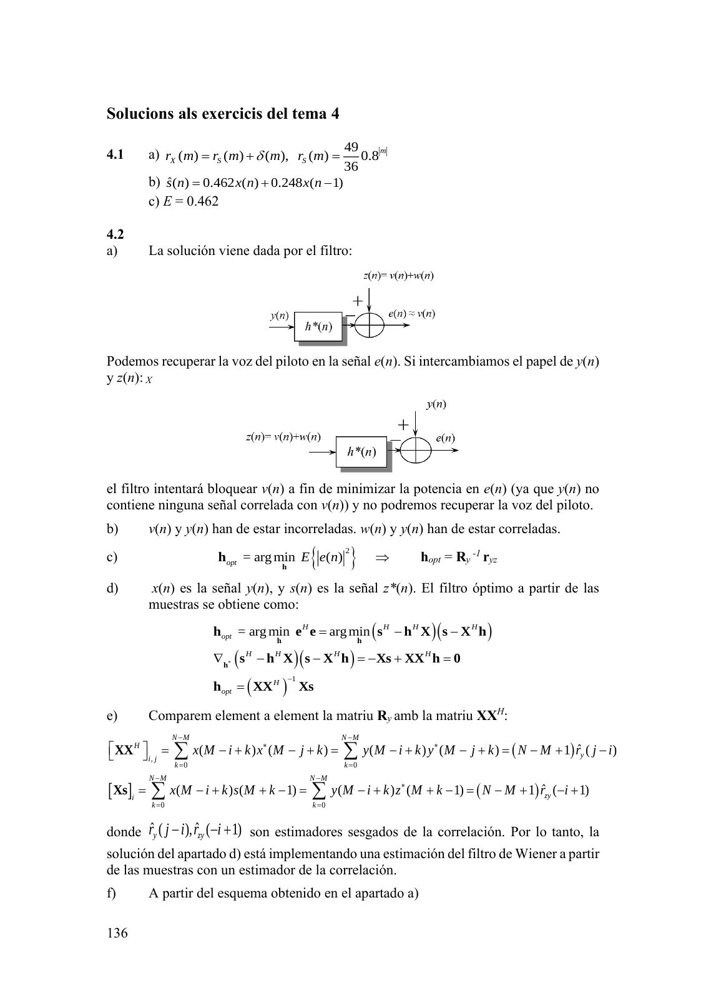

```text
Solucions als exercicis del tema 4
                                                             49
4.1     a) rX (m) = rS (m) +  (m), rS (m) =                    0.8
                                                                    m

                                                             36
        b) sˆ(n) = 0.462 x(n) + 0.248 x(n − 1)
        c) E = 0.462

4.2
a)      La solución viene dada por el filtro:


Podemos recuperar la voz del piloto en la señal e(n). Si intercambiamos el papel de y(n)
y z(n): X


el filtro intentará bloquear v(n) a fin de minimizar la potencia en e(n) (ya que y(n) no
contiene ninguna señal correlada con v(n)) y no podremos recuperar la voz del piloto.
b)      v(n) y y(n) han de estar incorreladas. w(n) y y(n) han de estar correladas.

c)                      h opt = arg min E e(n)
                                         h
                                                            2
                                                                           hopt = Ry -1 ryz

d)      x(n) es la señal y(n), y s(n) es la señal z*(n). El filtro óptimo a partir de las
        muestras se obtiene como:
                       h opt = arg min e H e = arg min ( s H − h H X )( s − X H h )
                                     h                               h

                       h* ( s − h X )( s − X h ) = − Xs + XX H h = 0
                              H     H                    H


                       h opt = ( XX H ) Xs
                                             −1


e)      Comparem element a element la matriu Ry amb la matriu XXH:
                N −M                                         N −M
 XX H  =  x( M − i + k ) x ( M − j + k ) =  y ( M − i + k ) y  ( M − j + k ) = ( N − M + 1) rˆy ( j − i)
          i, j
                k =0                                         k =0
        N −M                                      N −M
 Xsi =  x(M − i + k )s(M + k − 1) =  y(M − i + k ) z  (M + k − 1) = ( N − M + 1) rˆzy (−i + 1)
         k =0                                     k =0


donde rˆy ( j − i), rˆzy (−i + 1) son estimadores sesgados de la correlación. Por lo tanto, la
solución del apartado d) está implementando una estimación del filtro de Wiener a partir
de las muestras con un estimador de la correlación.
f)      A partir del esquema obtenido en el apartado a)

136
```

## Page 21

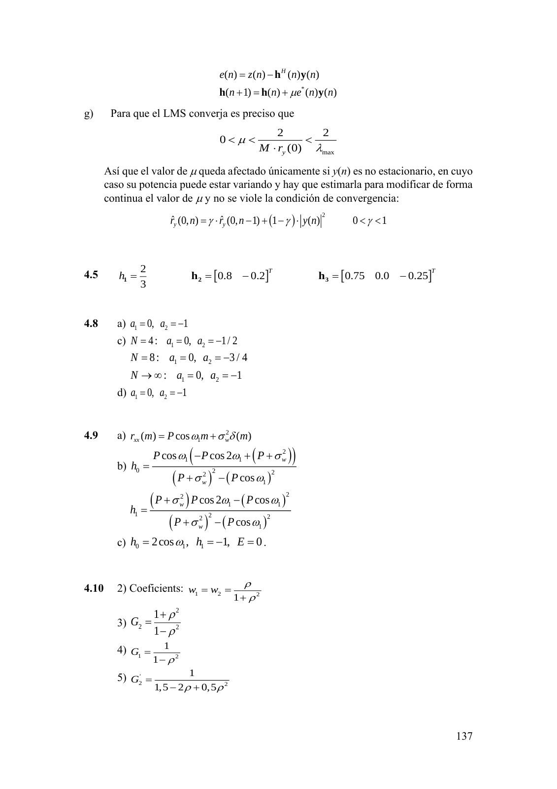

```text
                                            e( n ) = z ( n ) − h H ( n ) y ( n )
                                            h(n + 1) = h(n) +  e* (n)y (n)
g)      Para que el LMS converja es preciso que
                                                              2       2
                                            0                    
                                                          M  ry (0) max

       Así que el valor de  queda afectado únicamente si y(n) es no estacionario, en cuyo
       caso su potencia puede estar variando y hay que estimarla para modificar de forma
       continua el valor de  y no se viole la condición de convergencia:
                         rˆy (0, n) =   rˆy (0, n − 1) + (1 −  )  y(n)                   0   1
                                                                                      2


                 2
4.5       h1 =                    h 2 =  0.8 − 0.2                                  h 3 =  0.75 0.0 − 0.25
                                                                  T                                          T

                 3


4.8      a) a1 = 0, a2 = −1
         c) N = 4 : a1 = 0, a2 = −1/ 2
            N = 8 : a1 = 0, a2 = −3 / 4
            N →  : a1 = 0, a2 = −1
         d) a1 = 0, a2 = −1


4.9      a) rxx (m) = P cos 1m +  w2 (m)

         b) h0 =
                                  (
                     P cos 1 − P cos 21 + ( P +  w2 )                          )
                      ( P +  ) − ( P cos  )
                                      2 2
                                      w                       1
                                                                      2


            h =
                ( P +  ) P cos 2 − ( P cos  )
                              2
                              w                1                          1
                                                                              2


                     ( P +  ) − ( P cos  )
             1
                                      2 2                         2
                                      w                   1

         c) h0 = 2cos 1 , h1 = −1, E = 0 .


4.10     2) Coeficients: w1 = w2 =                   
                                                   1+  2
                     1+  2
         3) G2 =
                     1−  2
         4) G1 =       1
                     1−  2
         5) G2' =              1
                     1, 5 − 2  + 0, 5  2


                                                                                                                 137
```

## Page 22

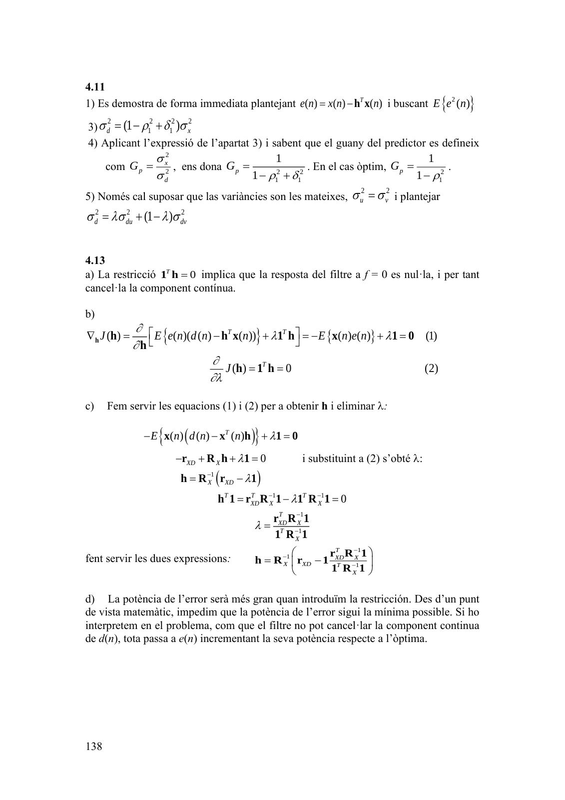

```text
4.11
1) Es demostra de forma immediata plantejant e(n) = x(n) − hT x(n) i buscant E e 2 (n)           
3)  d = (1 − 1 + 1 ) x
      2           2       2      2


4) Aplicant l’expressió de l’apartat 3) i sabent que el guany del predictor es defineix
                 2                        1                                  1
    com G p = x2 , ens dona G p =                 . En el cas òptim, G p =         .
                 d                  1 − 1 + 1
                                           2    2
                                                                           1 − 12
5) Només cal suposar que las variàncies son les mateixes,  u =  v i plantejar
                                                                             2     2


 d2 =  du2 + (1 −  ) dv2


4.13
a) La restricció 1T h = 0 implica que la resposta del filtre a f = 0 es nul·la, i per tant
cancel·la la component contínua.

b)
              
h J (h) =        E e(n)(d (n) − hT x(n)) + 1T h  = − E x(n)e(n) + 1 = 0 (1)
             h 
                               
                                   J (h) = 1T h = 0                              (2)
                               

c)    Fem servir les equacions (1) i (2) per a obtenir h i eliminar :

                                                 
                − E x(n) ( d (n) − xT (n)h ) + 1 = 0
                              −rXD + R X h + 1 = 0           i substituint a (2) s’obté :
                               h = R −X1 ( rXD − 1)
                                        hT 1 = rXD
                                                T
                                                   R −X11 − 1T R −X11 = 0
                                                     rT R −X11
                                                   = XD
                                                      1T R −X11
                                                                    rT R −X11 
fent servir les dues expressions:                 h = R −X1  rXD − 1 XD       
                                                                    1T R −X11 

d) La potència de l’error serà més gran quan introduïm la restricción. Des d’un punt
de vista matemàtic, impedim que la potència de l’error sigui la mínima possible. Si ho
interpretem en el problema, com que el filtre no pot cancel·lar la component continua
de d(n), tota passa a e(n) incrementant la seva potència respecte a l’òptima.


138
```

## Page 23

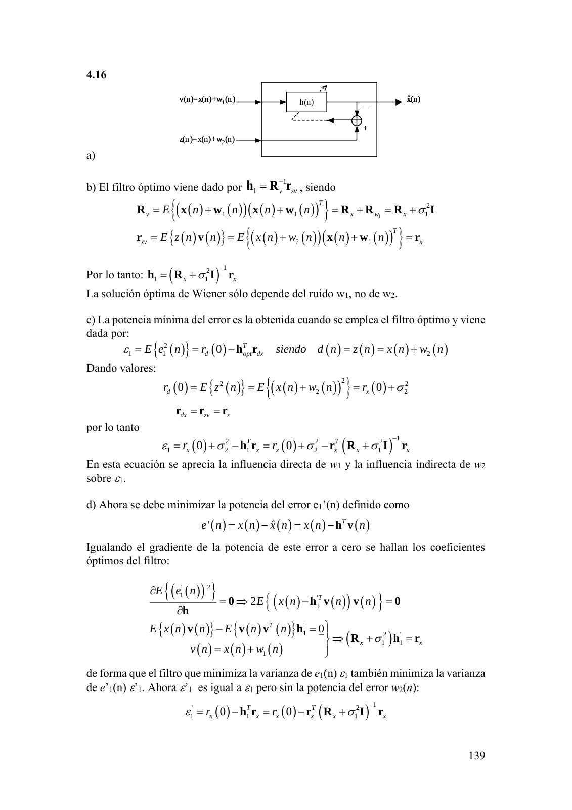

```text
4.16

                               v(n)=x(n)+w1 (n )                        h(n)                                       ˆx(n)
                                                                                                                   x̂(n)
                                                                                             —

                                                                                             +
                               z(n )=x(n)+w2 (n)

a)

                                                               −1
b) El filtro óptimo viene dado por h1 = R v rzv , siendo

                                                               = R + R = R + I
           R v = E ( x ( n ) + w1 ( n ) ) ( x ( n ) + w 1 ( n ) )
                                                                               T
                                                                                         x           w1        x
                                                                                                                           2
                                                                                                                           1


           r = E  z ( n ) v ( n ) = E ( x ( n ) + w ( n ) ) ( x ( n ) + w ( n ) )  = r
                                                                                                          T
               zv                                                   2                            1                     x


                          (                  ) r
                                             −1
Por lo tanto: h1 = R x +  12I                    x

La solución óptima de Wiener sólo depende del ruido w1, no de w2.

c) La potencia mínima del error es la obtenida cuando se emplea el filtro óptimo y viene
dada por:
                                  
        1 = E e12 ( n ) = rd ( 0 ) − hTopt rdx siendo d ( n ) = z ( n ) = x ( n ) + w2 ( n )
Dando valores:
                                                           
                         rd ( 0 ) = E  z 2 ( n ) = E ( x ( n ) + w2 ( n ) )
                                                                                    2
                                                                                         = r ( 0) + 
                                                                                             x
                                                                                                               2
                                                                                                               2

                              rdx = rzv = rx
por lo tanto
                        1 = rx ( 0 ) +  22 − h1T rx = rx ( 0 ) +  22 − rxT ( R x +  12I ) rx
                                                                                                          −1


En esta ecuación se aprecia la influencia directa de w1 y la influencia indirecta de w2
sobre 1.

d) Ahora se debe minimizar la potencia del error e1’(n) definido como
                                       e ' ( n ) = x ( n ) − xˆ ( n ) = x ( n ) − hT v ( n )

Igualando el gradiente de la potencia de este error a cero se hallan los coeficientes
óptimos del filtro:

                    E    ( e ( n ))  = 0  2E ( x ( n ) − h v ( n )) v ( n ) = 0
                               '         2


                             h
                               1
                                                                              
                                                                               'T
                                                                               1


                    E  x ( n ) v ( n ) − E v ( n ) vT ( n ) h1' = 0 
                                                                           ( R x +  1 ) h1 = rx
                                                                                       2    '

                                 v ( n ) = x ( n ) + w1 ( n )            
de forma que el filtro que minimiza la varianza de e1(n) 1 también minimiza la varianza
de e’1(n) ’1. Ahora ’1 es igual a 1 pero sin la potencia del error w2(n):

                                   1' = rx ( 0 ) − h1T rx = rx ( 0 ) − rxT ( R x +  12I ) rx
                                                                                                 −1


                                                                                                                               139
```

## Page 24

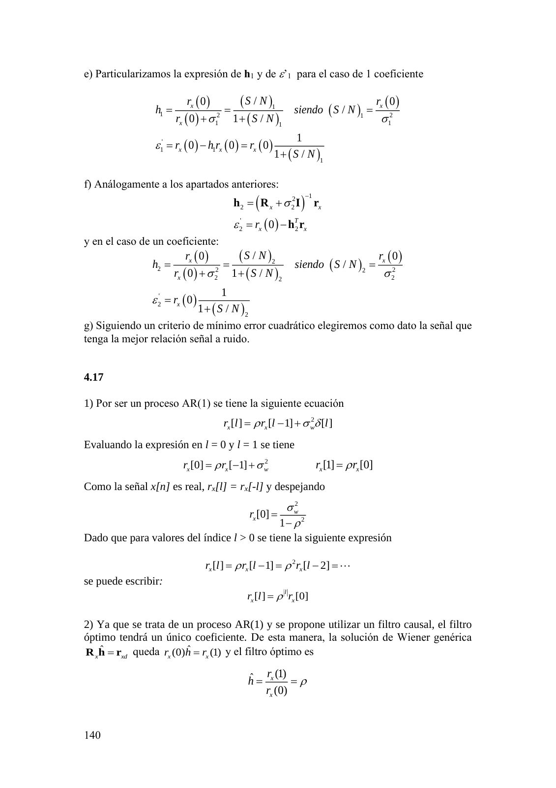

```text
e) Particularizamos la expresión de h1 y de ’1 para el caso de 1 coeficiente

                             rx ( 0 )      ( S / N )1                                r ( 0)
                  h1 =                  =                         siendo ( S / N )1 = x 2
                         rx ( 0 ) +  12 1 + ( S / N )1                                       1
                                                                  1
                  1' = rx ( 0 ) − h1rx ( 0 ) = rx ( 0 )
                                                           1 + ( S / N )1

f) Análogamente a los apartados anteriores:
                                           h 2 = ( R x +  22I ) rx
                                                                     −1


                                            2' = rx ( 0 ) − hT2 rx
y en el caso de un coeficiente:
                         rx ( 0 )     ( S / N )2                                     r ( 0)
                h2 =                =                             siendo ( S / N )2 = x 2
                     rx ( 0 ) +  2 1 + ( S / N )2
                                  2
                                                                                              2
                                 1
                  2' = rx ( 0 )
                          1 + ( S / N )2
g) Siguiendo un criterio de mínimo error cuadrático elegiremos como dato la señal que
tenga la mejor relación señal a ruido.


4.17

1) Por ser un proceso AR(1) se tiene la siguiente ecuación
                                        rx [l ] =  rx [l − 1] +  w2 [l ]
Evaluando la expresión en l = 0 y l = 1 se tiene
                           rx [0] =  rx [−1] +  w2                      rx [1] =  rx [0]
Como la señal x[n] es real, rx[l] = rx[-l] y despejando
                                                              w2
                                                rx [0] =
                                                            1−  2
Dado que para valores del índice l > 0 se tiene la siguiente expresión

                                   rx [l ] =  rx [l − 1] =  2 rx [l − 2] =
se puede escribir:
                                               rx [l ] =  rx [0]
                                                              l


2) Ya que se trata de un proceso AR(1) y se propone utilizar un filtro causal, el filtro
óptimo tendrá un único coeficiente. De esta manera, la solución de Wiener genérica
R x hˆ = rxd queda rx (0)hˆ = rx (1) y el filtro óptimo es

                                                     r (1)
                                                hˆ = x = 
                                                    rx (0)


140
```

## Page 25

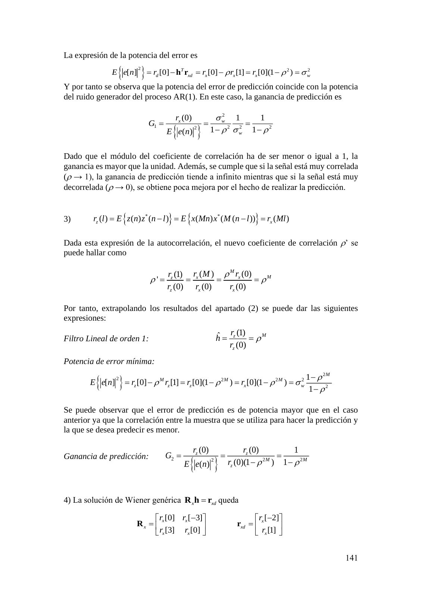

```text
La expresión de la potencia del error es

                 
               E e[n]
                             2
                                  = r [0] − h r = r [0] −  r [1] = r [0](1 −  ) = 
                                     d
                                               T
                                                    xd           x                x         x
                                                                                                         2   2
                                                                                                             w

Y por tanto se observa que la potencia del error de predicción coincide con la potencia
del ruido generador del proceso AR(1). En este caso, la ganancia de predicción es

                                            rx (0)                     w2 1    1
                                   G1 =                          =            =
                                           
                                          E e( n )
                                                         2
                                                                    1−   w 1−  2
                                                                          2 2


Dado que el módulo del coeficiente de correlación ha de ser menor o igual a 1, la
ganancia es mayor que la unidad. Además, se cumple que si la señal está muy correlada
( → 1), la ganancia de predicción tiende a infinito mientras que si la señal está muy
decorrelada ( → 0), se obtiene poca mejora por el hecho de realizar la predicción.


3)      rz (l ) = E  z (n) z * (n − l ) = E  x ( Mn) x* ( M (n − l )) = rx (Ml )

Dada esta expresión de la autocorrelación, el nuevo coeficiente de correlación ’ se
puede hallar como

                                          r (1) rx ( M )  M rx (0)
                                   '= z        =       =           = M
                                          rz (0) rx (0)    rx (0)

Por tanto, extrapolando los resultados del apartado (2) se puede dar las siguientes
expresiones:
                                                                              r (1)
Filtro Lineal de orden 1:                                                hˆ = z     = M
                                                                             rz (0)
Potencia de error mínima:

         
       E e[n]
                2
                       = rz [0] −  M rz [1] = rz [0](1 −  2 M ) = rx [0](1 −  2 M ) =  w2
                                                                                                             1 −  2M
                                                                                                              1−  2

Se puede observar que el error de predicción es de potencia mayor que en el caso
anterior ya que la correlación entre la muestra que se utiliza para hacer la predicción y
la que se desea predecir es menor.

                                                         rz (0)                        rz (0)       1
                                          G2 =                               =                   =
                                                                        
Ganancia de predicción:
                                                   E e( n )
                                                                     2
                                                                                 rz (0)(1 −  ) 1 −  2 M
                                                                                              2M


4) La solución de Wiener genérica R xh = rxd queda

                                  r [0] rx [−3]                                            r [−2]
                            Rx =  x                                                 rxd =  x      
                                  rx [3] rx [0]                                            rx [1] 


                                                                                                                        141
```

## Page 26

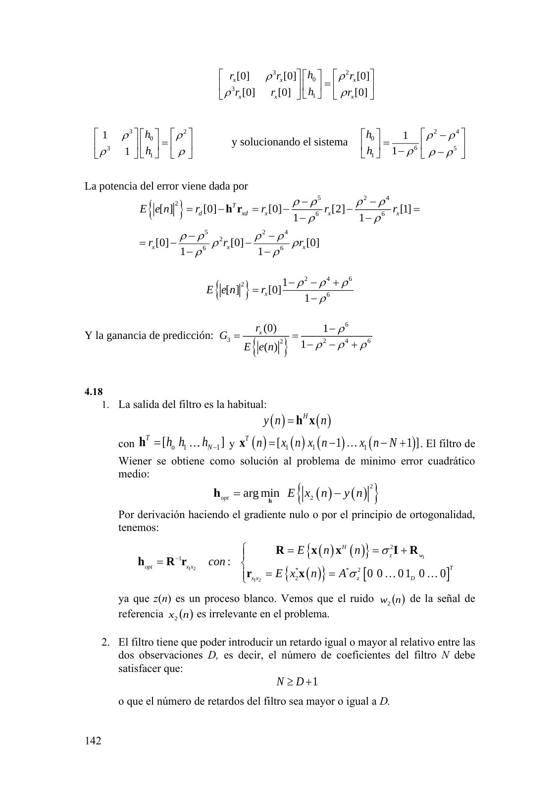

```text
                                         rx [0]  3rx [0]  h0    2 rx [0]
                                         3                 =              
                                          rx [0] rx [0]   h1    rx [0] 


  1     3   h0   2                                                                   h0    1  2 −  4 
   3         =                       y solucionando el sistema                               =
                                                                                            h  1−  6       5 
       1   h1                                                                        1         − 

La potencia del error viene dada por

                           = r [0] − h r = r [0] − 1 −− r [2] − 1 −− r [1] =
                                                                                 5           2               4
                       2                    T
             E e[n]            d                xd          x                   6    x                   6       x


                            − 5 2          2 − 4
             = rx [0] −            r  [0] −          rx [0]
                           1−  6            1−  6
                                     x


                                      
                                    E e[n]
                                                2
                                                       = rx [0]
                                                                   1−  2 −  4 +  6
                                                                        1−  6

                                                        rx (0)                    1−  6
Y la ganancia de predicción: G3 =                                        =
                                                E e( n )        2
                                                                            1−  2 −  4 +  6


4.18
    1. La salida del filtro es la habitual:
                                                            y ( n) = hH x ( n)
        con h = [ho h1
               T
                                   hN −1 ] y xT ( n ) = [ x1 ( n ) x1 ( n − 1)              x1 ( n − N + 1)] . El filtro de
        Wiener se obtiene como solución al problema de minimo error cuadrático
        medio:

                                                   h
                                                                         
                                      h opt = arg min E x2 ( n ) − y ( n )
                                                                                                 2
                                                                                                     
        Por derivación haciendo el gradiente nulo o por el principio de ortogonalidad,
        tenemos:
                                                   R = E x ( n ) x H ( n ) =  z2 I + R w1
             h opt = R rx1x2
                       −1
                                    con : 
                                           rx1x2 = E  x2 x ( n ) = A  z  0 0 0 1D 0                            0
                                                          *             * 2                                           T


        ya que z(n) es un proceso blanco. Vemos que el ruido w2 (n ) de la señal de
        referencia x2 (n ) es irrelevante en el problema.

   2. El filtro tiene que poder introducir un retardo igual o mayor al relativo entre las
      dos observaciones D, es decir, el número de coeficientes del filtro N debe
      satisfacer que:
                                                                N  D +1
        o que el número de retardos del filtro sea mayor o igual a D.


142
```

## Page 27

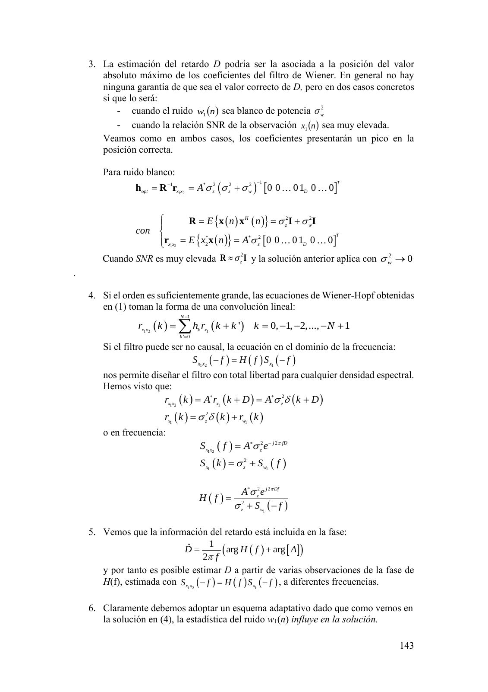

```text
    3. La estimación del retardo D podría ser la asociada a la posición del valor
       absoluto máximo de los coeficientes del filtro de Wiener. En general no hay
       ninguna garantía de que sea el valor correcto de D, pero en dos casos concretos
       si que lo será:
           - cuando el ruido w1 (n ) sea blanco de potencia  w2
           - cuando la relación SNR de la observación x1 (n ) sea muy elevada.
       Veamos como en ambos casos, los coeficientes presentarán un pico en la
       posición correcta.

       Para ruido blanco:
                h opt = R −1rx1x2 = A* z2 ( z2 +  w2 )               0 0            0
                                                                   −1                    T
                                                                               0 1D 0


                            R = E x ( n ) x H ( n ) =  z2 I +  w2 I
              con 
                    rx1x2 = E  x2 x ( n ) = A  z  0 0 0 1D 0 0
                                   *             *  2                     T


       Cuando SNR es muy elevada R   z I y la solución anterior aplica con  w2 → 0
                                               2


.

    4. Si el orden es suficientemente grande, las ecuaciones de Wiener-Hopf obtenidas
       en (1) toman la forma de una convolución lineal:
                                 N −1

                 rx1x2 ( k ) =    h r ( k + k ') k = 0, −1, −2,..., − N + 1
                                 k '= 0
                                           k x1


       Si el filtro puede ser no causal, la ecuación en el dominio de la frecuencia:
                               S x1 x2 ( − f ) = H ( f ) S x1 ( − f )
       nos permite diseñar el filtro con total libertad para cualquier densidad espectral.
       Hemos visto que:
                      rx1x2 ( k ) = A rx1 ( k + D ) = A z2 ( k + D )
                          rx1 ( k ) =  z2 ( k ) + rw1 ( k )
       o en frecuencia:
                                           S x1x2 ( f ) = A z2 e − j 2 fD
                                           S x1 ( k ) =  z2 + S w1 ( f )

                                                          A* z2 e j 2 Df
                                           H(f)=
                                                        z2 + S w1 ( − f )

    5. Vemos que la información del retardo está incluida en la fase:
                            Dˆ =
                                     1
                                   2 f
                                         ( arg H ( f ) + arg  A)
       y por tanto es posible estimar D a partir de varias observaciones de la fase de
       H(f), estimada con S x x ( − f ) = H ( f ) S x ( − f ) , a diferentes frecuencias.
                                     1 2                       1


    6. Claramente debemos adoptar un esquema adaptativo dado que como vemos en
       la solución en (4), la estadística del ruido w1(n) influye en la solución.

                                                                                             143
```

## Page 28

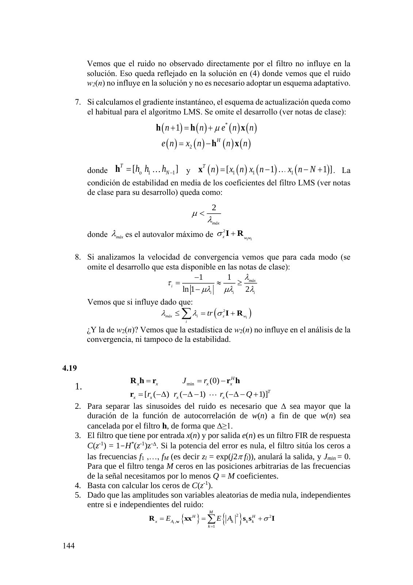

```text
        Vemos que el ruido no observado directamente por el filtro no influye en la
        solución. Eso queda reflejado en la solución en (4) donde vemos que el ruido
        w2(n) no influye en la solución y no es necesario adoptar un esquema adaptativo.

   7. Si calculamos el gradiente instantáneo, el esquema de actualización queda como
      el habitual para el algoritmo LMS. Se omite el desarrollo (ver notas de clase):
                               h ( n + 1) = h ( n ) +  e* ( n ) x ( n )
                                   e ( n ) = x2 ( n ) − h H ( n ) x ( n )

        donde h = [ho h1
                  T
                                   hN −1 ] y xT ( n ) = [ x1 ( n ) x1 ( n − 1)   x1 ( n − N + 1)] . La
        condición de estabilidad en media de los coeficientes del filtro LMS (ver notas
        de clase para su desarrollo) queda como:
                                                        2
                                                 
                                          máx
        donde máx es el autovalor máximo de  z I + R w w
                                               2
                                                                       1 1


   8. Si analizamos la velocidad de convergencia vemos que para cada modo (se
      omite el desarrollo que esta disponible en las notas de clase):
                                       −1        1    
                              i =                  máx
                                   ln 1 − i   i 2i
        Vemos que si influye dado que:
                             máx   i = tr ( z2 I + R w )         1
                                             i

        ¿Y la de w2(n)? Vemos que la estadística de w2(n) no influye en el análisis de la
        convergencia, ni tampoco de la estabilidad.


4.19
                      R x h = rx           J min = rx (0) − rxH h
   1.
                      rx = [rx (−) rx (− − 1)   rx (− − Q + 1)]T
   2.   Para separar las sinusoides del ruido es necesario que  sea mayor que la
        duración de la función de autocorrelación de w(n) a fin de que w(n) sea
        cancelada por el filtro h, de forma que ≥1
   3.   El filtro que tiene por entrada x(n) y por salida e(n) es un filtro FIR de respuesta
        C(z-1) = 1-H*(z-1)z-. Si la potencia del error es nula, el filtro sitúa los ceros a
        las frecuencias f1 ,…, fM (es decir zl = exp(j2 fl)), anulará la salida, y Jmin = 0.
        Para que el filtro tenga M ceros en las posiciones arbitrarias de las frecuencias
        de la señal necesitamos por lo menos Q = M coeficientes.
   4.   Basta con calcular los ceros de C(z-1).
   5.   Dado que las amplitudes son variables aleatorias de media nula, independientes
        entre si e independientes del ruido:
                            R x = E Ai , w xx H  =  E Ak   s s +  I
                                                       M
                                                                  2     H    2
                                                                      k k
                                                      k =1


144
```

## Page 29

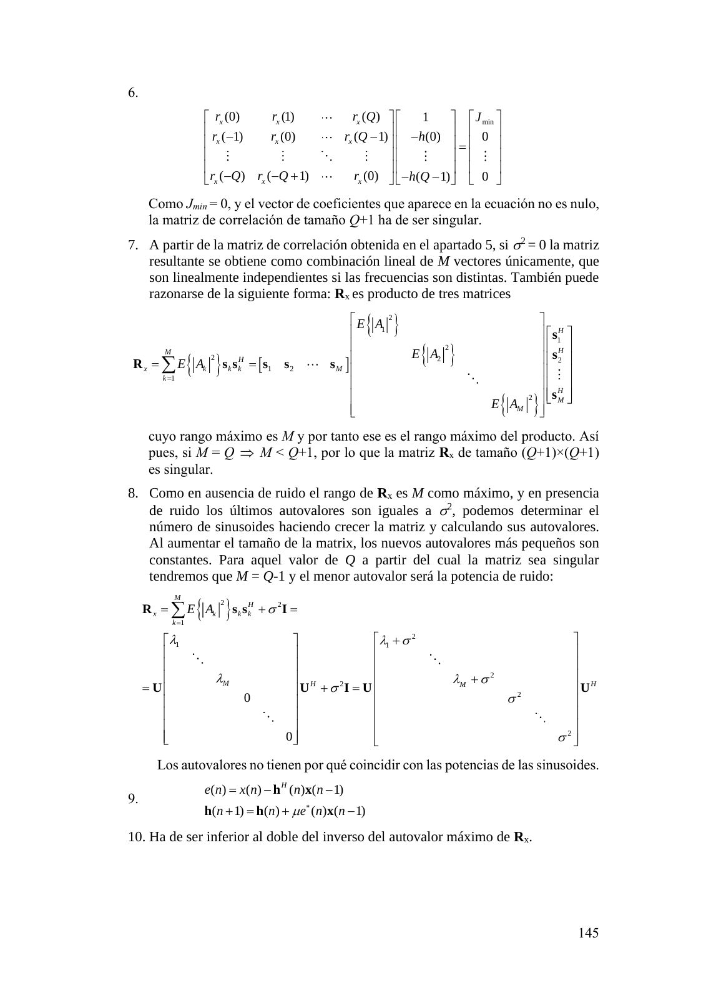

```text
6.
                      rx (0)      rx (1)                  rx (Q)       1        J min 
                      r (−1)      rx (0)                            
                                                         rx (Q − 1)   −h(0)   0 
                      x                                                          =
                                                                                      
                                                                                      
                      rx (−Q) rx (−Q + 1)                  rx (0)   −h(Q − 1)   0 

      Como Jmin = 0, y el vector de coeficientes que aparece en la ecuación no es nulo,
      la matriz de correlación de tamaño Q+1 ha de ser singular.
7. A partir de la matriz de correlación obtenida en el apartado 5, si 2 = 0 la matriz
   resultante se obtiene como combinación lineal de M vectores únicamente, que
   son linealmente independientes si las frecuencias son distintas. También puede
   razonarse de la siguiente forma: Rx es producto de tres matrices

                                                             
                                                            E A 2
                                                                1
                                                                                                
                                                                                                  s1H 
        M
R x =  E Ak         s s = s s
                      2         H
                                                            
                                                       sM  
                                                                           
                                                                        E A2
                                                                               2                 H 
                                                                                                  s2 
        k =1
                              k k       1       2                                               
                                                                                                H 
                                                            
                                                                                            
                                                                                              2  s 
                                                                                          E AM   M 
                                                                                                      
      cuyo rango máximo es M y por tanto ese es el rango máximo del producto. Así
      pues, si M = Q  M < Q+1, por lo que la matriz Rx de tamaño (Q+1)×(Q+1)
      es singular.
8. Como en ausencia de ruido el rango de Rx es M como máximo, y en presencia
   de ruido los últimos autovalores son iguales a 2, podemos determinar el
   número de sinusoides haciendo crecer la matriz y calculando sus autovalores.
   Al aumentar el tamaño de la matrix, los nuevos autovalores más pequeños son
   constantes. Para aquel valor de Q a partir del cual la matriz sea singular
   tendremos que M = Q-1 y el menor autovalor será la potencia de ruido:

                     s s +  I =
            M
     R x =  E Ak
                          2      H          2
                               k k
            k =1

        1                                                 1 +  2                                        
                                                                                                           
                                                                                                           
                         M                       H                             M +  2                    H
     = U                                         U + I = U                                                U
                                                       2

                                   0                                                           2          
                                                                                                           
                                                                                                           
                                              0                                                       
                                                                                                            2


       Los autovalores no tienen por qué coincidir con las potencias de las sinusoides.
                     e(n) = x(n) − h H (n)x(n − 1)
9.
                     h(n + 1) = h(n) +  e (n)x(n − 1)

10. Ha de ser inferior al doble del inverso del autovalor máximo de Rx.


                                                                                                              145
```

## Page 30

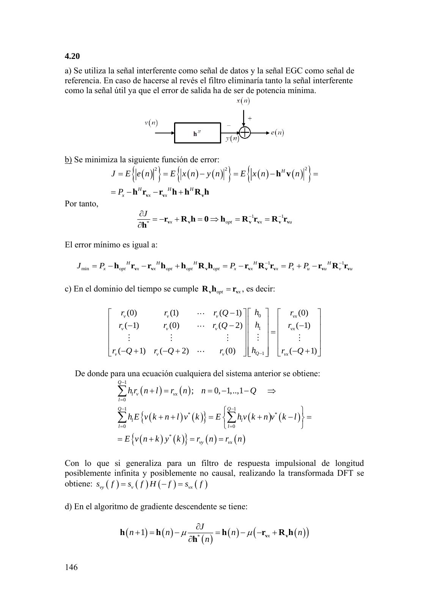

```text
4.20
a) Se utiliza la señal interferente como señal de datos y la señal EGC como señal de
referencia. En caso de hacerse al revés el filtro eliminaría tanto la señal interferente
como la señal útil ya que el error de salida ha de ser de potencia mínima.


b) Se minimiza la siguiente función de error:
                          
                J = E e (n)
                                   2
                                        = E  x (n) − y (n)  = E  x (n) − h v (n)  =
                                                             2                     H       2


                = Px − h H rvx − rvx H h + h H R vh
Por tanto,
                              J
                                  = −rvx + R v h = 0  h opt = R −v1rvx = R −v1rvu
                              h*

El error mínimo es igual a:

   J min = Px − h opt H rvx − rvx H h opt + h opt H R v h opt = Px − rvx H R −v1rvx = Ps + Pu − rvu H R v−1rvu

c) En el dominio del tiempo se cumple R v h opt = rvx , es decir:

                rv (0)          rv (1)                  rv (Q − 1)   h0   rvx (0) 
                r (−1)                                                       
                v               rv (0)                  rv (Q − 2)   h1   rvx ( −1) 
                                                                                 =
                                                                                            
                                                                                            
                rv (−Q + 1) rv (−Q + 2)                    rv (0)   hQ −1   rvx ( −Q + 1) 

   De donde para una ecuación cualquiera del sistema anterior se obtiene:
                  Q −1

                   h r ( n + l ) = r ( n ) ; n = 0, −1,..,1 − Q
                   l =0
                          l v              vx                                
                  Q −1
                                                             Q −1                       
                      hl E v ( k + n + l ) v *
                                                 ( k ) = E  hl v ( k + n )v ( k − l )  =
                                                                              *

                  l =0                                       l =0                       
                  = E v ( n + k ) y * ( k ) = rvy ( n ) = rvx ( n )

Con lo que si generaliza para un filtro de respuesta impulsional de longitud
posiblemente infinita y posiblemente no causal, realizando la transformada DFT se
obtiene: svy ( f ) = sv ( f ) H ( − f ) = svx ( f )

d) En el algoritmo de gradiente descendente se tiene:

                                                  J
                   h ( n + 1) = h ( n ) −                = h ( n ) −  ( −rvx + R vh ( n ) )
                                                h* ( n )


146
```

## Page 31

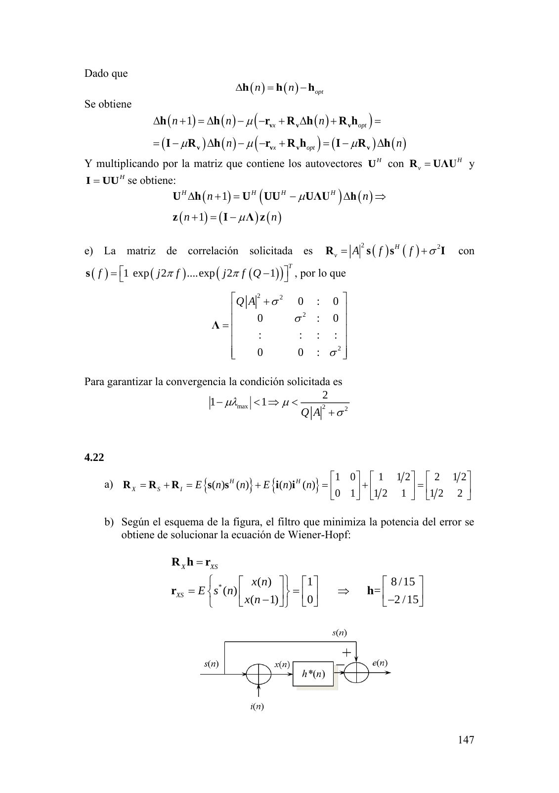

```text
Dado que
                                          h ( n ) = h ( n ) − h opt
Se obtiene
                  h ( n + 1) = h ( n ) −  ( −rvx + R v h ( n ) + R v h opt ) =
                  = ( I −  R v ) h ( n ) −  ( −rvx + R vh opt ) = ( I −  R v ) h ( n )
Y multiplicando por la matriz que contiene los autovectores U H con R v = UΛU H y
I = UU H se obtiene:
                                                 (
                   U H h ( n + 1) = U H UU H −  UΛU H h ( n )         )
                        z ( n + 1) = ( I −  Λ ) z ( n )

                                                                       R v = A s ( f ) s H ( f ) +  2I
                                                                                2
e) La matriz de correlación solicitada es                                                                 con
s ( f ) = 1 exp ( j 2 f ) ....exp ( j 2 f ( Q − 1) )  , por lo que
                                                           T


                                     Q A 2 +  2 0               :  0
                                                                       
                                                  2
                                   Λ=
                                          0                       : 0
                                         :        :              : : 
                                                                       
                                        0       0               :  2 

Para garantizar la convergencia la condición solicitada es
                                                     2
                           1 − max  1   
                                                Q A + 2
                                                     2


4.22
                                                                 1 0   1 1 2   2 1 2 
       a) R X = R S + R I = E s(n)s H (n) + E i (n)i H (n) =     +       =       
                                                                 0 1  1 2 1  1 2 2 

       b) Según el esquema de la figura, el filtro que minimiza la potencia del error se
          obtiene de solucionar la ecuación de Wiener-Hopf:

                       R X h = rXS
                                        x ( n)    1                               8 /15 
                       rXS = E  s* (n)               = 0                     h=        
                                        x ( n − 1)                                −2 /15


                                                                                                          147
```

## Page 32

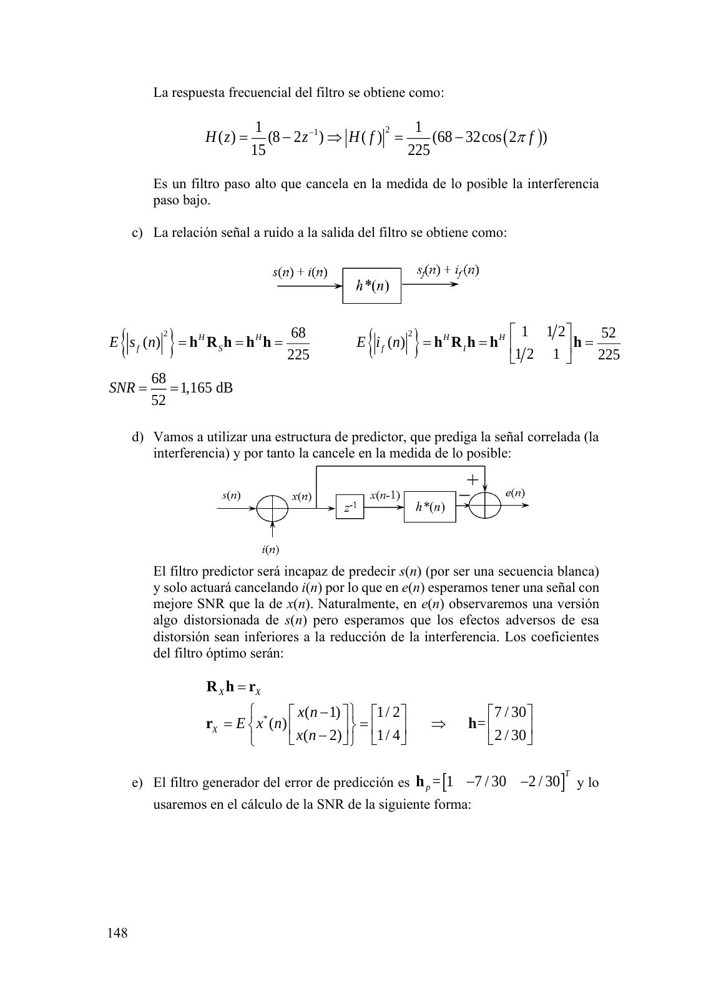

```text
         La respuesta frecuencial del filtro se obtiene como:

                                     1                            1
                         H ( z) =      (8 − 2 z −1 )  H ( f ) =     (68 − 32cos ( 2 f ))
                                                              2

                                    15                           225

         Es un filtro paso alto que cancela en la medida de lo posible la interferencia
         paso bajo.

      c) La relación señal a ruido a la salida del filtro se obtiene como:


  
E s f ( n)
             2
                    = hH RSh = hH h =
                                          68
                                          225
                                                         
                                                       E i f ( n)
                                                                    2
                                                                                            1 1 2
                                                                            = hH R I h = hH       
                                                                                            1 2 1 
                                                                                                     h=
                                                                                                        52
                                                                                                        225
         68
SNR =       = 1,165 dB
         52

      d) Vamos a utilizar una estructura de predictor, que prediga la señal correlada (la
         interferencia) y por tanto la cancele en la medida de lo posible:


         El filtro predictor será incapaz de predecir s(n) (por ser una secuencia blanca)
         y solo actuará cancelando i(n) por lo que en e(n) esperamos tener una señal con
         mejore SNR que la de x(n). Naturalmente, en e(n) observaremos una versión
         algo distorsionada de s(n) pero esperamos que los efectos adversos de esa
         distorsión sean inferiores a la reducción de la interferencia. Los coeficientes
         del filtro óptimo serán:

                         R X h = rX
                                         x(n − 1)   1/ 2                        7 / 30 
                         rX = E  x* (n)            =                        h=         
                                         x(n − 2)   1/ 4                         2 / 30 

      e) El filtro generador del error de predicción es h p = 1 −7 / 30 −2 / 30 y lo
                                                                                                   T


         usaremos en el cálculo de la SNR de la siguiente forma:


148
```

## Page 33

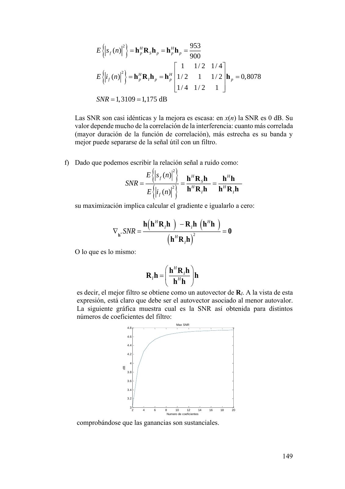

```text
             
           E s f ( n)
                        2
                             = h R h = h h = 900
                                          H
                                          p
                                              953
                                                   S       p
                                                                      H
                                                                      p          p


                                       1 1/ 2 1/ 4 
                           
           E i f (n) = h R I h p = h 1/ 2 1 1/ 2  h p = 0,8078
                        2                 H
                                          p
                                                                     H
                                                                     p

                                      1/ 4 1/ 2 1 
           SNR = 1,3109 = 1,175 dB

   Las SNR son casi idénticas y la mejora es escasa: en x(n) la SNR es 0 dB. Su
   valor depende mucho de la correlación de la interferencia: cuanto más correlada
   (mayor duración de la función de correlación), más estrecha es su banda y
   mejor puede separarse de la señal útil con un filtro.

f) Dado que podemos escribir la relación señal a ruido como:

                            SNR =
                                    =h R h = h hE s f ( n)
                                                                         2
                                                                                         H                 H


                                  E  i ( n)  h R h
                                                                                             S
                                                                         2               H             H
                                                     h Rh                                    I                 I
                                                               f

   su maximización implica calcular el gradiente e igualarlo a cero:

                                              h (h H R I h ) − R I h (h H h )
                 h* SNR =                                                                             =0
                                                                    (h R h ) H           2
                                                                                     I

   O lo que es lo mismo:

                                                         hH R I h 
                                                  RIh =  H h
                                                         h h 
    es decir, el mejor filtro se obtiene como un autovector de RI. A la vista de esta
    expresión, está claro que debe ser el autovector asociado al menor autovalor.
    La siguiente gráfica muestra cual es la SNR así obtenida para distintos
    números de coeficientes del filtro:
                                                                             Max SNR
                                4.8

                                4.6

                                4.4

                                4.2


                                 4
                        dB
                                3.8

                                3.6

                                3.4

                                3.2


                                 3
                                      2       4        6           8     10      12       14     16   18       20
                                                                    Numero de coeficientes


    comprobándose que las ganancias son sustanciales.


                                                                                                                    149
```

## Page 34

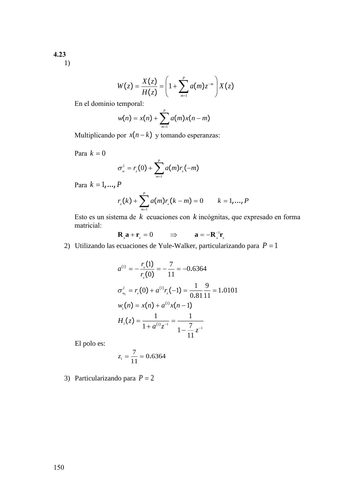

```text
4.23
   1)

                                X ( z)                      
                                                          
                                              P

                       W ( z) =       = 1 +      a(m) z − m  X ( z)
                                H ( z)      m =1            
        En el dominio temporal:

                                              a(m) x(n − m)
                                                  P

                       w(n) = x(n) +
                                                m =1

        Multiplicando por x(n − k ) y tomando esperanzas:

        Para k = 0

                                            a(m)r (−m)
                                            P

                        w2 = rx (0) +                     x
                                           m =1

        Para k = 1,..., P

                                    a(m)r (k − m) = 0
                                     P

                       rx (k ) +                      x
                                                                     k = 1,..., P
                                    m =1

        Esto es un sistema de k ecuaciones con k incógnitas, que expresado en forma
        matricial:
                        R x a + rx = 0        a = − R −x1rx
   2) Utilizando las ecuaciones de Yule-Walker, particularizando para P = 1

                                 r (1)     7
                       a (1) = − x     = − = −0.6364
                                rx (0)    11
                                                      1 9
                        w2 = rx (0) + a (1) rx (−1) =      = 1.0101
                            1
                                                    0.81 11
                       w1 (n) = x(n) + a (1) x(n − 1)
                                        1                    1
                       H1 ( z ) =                  =
                                    1 + a (1) z −1            7
                                                          1 − z −1
                                                             11
        El polo es:
                                7
                       z1 =        = 0.6364
                                11

   3) Particularizando para P = 2


150
```

## Page 35

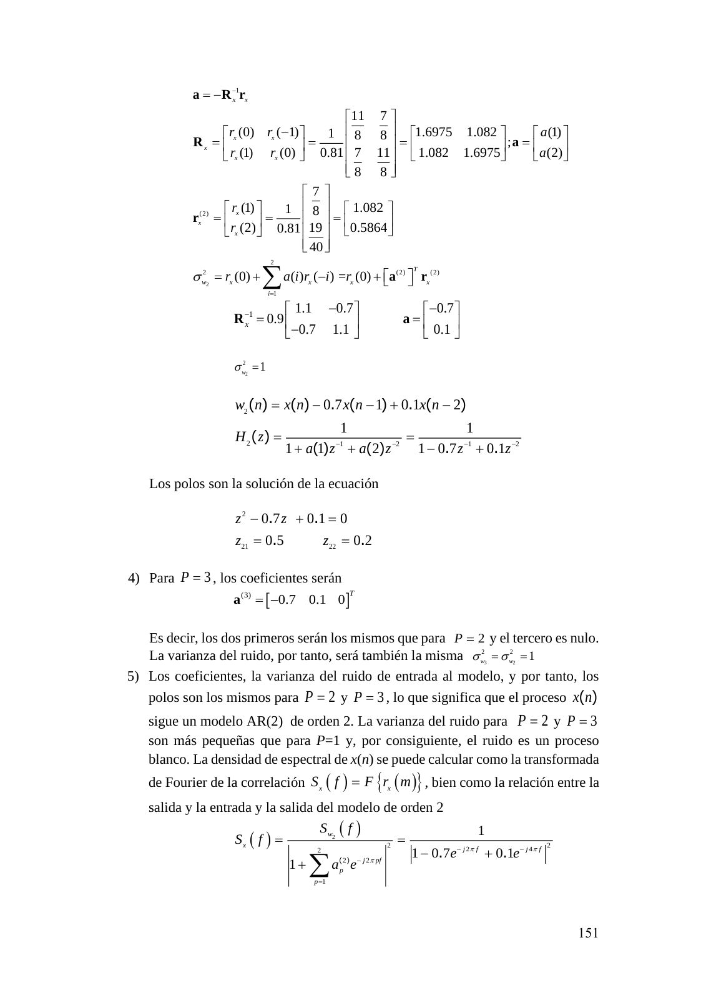

```text
             a = −R −x1rx
                                                  11 7 
                       rx (0) rx (−1)         1  8 8  1.6975 1.082        a (1) 
             Rx =                       =             =             ;a =        
                       rx (1) rx (0)  0.81  7 11   1.082 1.6975           a (2) 
                                                   8 8 
                                        7
                        r  (1)   1     8   1.082 
             rx( 2) =  x  =            =           
                       rx (2)  0.81  19  0.5864 
                                         40 

                               a(i)r (−i) =r (0) + a  r
                                   2

              = rx (0) +
               2                                                      ( 2)   T           ( 2)
               w2                            x               x                       x
                                  i =1

                                    1.1 −0.7                               −0.7 
                      R −x 1 = 0.9                                      a=      
                                    −0.7 1.1                               0.1 

                       w22 = 1

                       w2 (n) = x(n) − 0.7 x(n − 1) + 0.1x(n − 2)
                                                         1                                      1
                       H 2 ( z) =                                            =
                                         1 + a(1) z + a(2) z
                                                        −1           −2
                                                                                 1 − 0.7 z + 0.1z −2
                                                                                                −1


   Los polos son la solución de la ecuación

                       z 2 − 0.7 z + 0.1 = 0
                       z21 = 0.5        z22 = 0.2

4) Para P = 3 , los coeficientes serán
                      a (3) =  −0.7 0.1 0
                                                             T


   Es decir, los dos primeros serán los mismos que para P = 2 y el tercero es nulo.
   La varianza del ruido, por tanto, será también la misma  w2 =  w2 = 1                           3   2


5) Los coeficientes, la varianza del ruido de entrada al modelo, y por tanto, los
   polos son los mismos para P = 2 y P = 3 , lo que significa que el proceso x(n)
   sigue un modelo AR(2) de orden 2. La varianza del ruido para P = 2 y P = 3
   son más pequeñas que para P=1 y, por consiguiente, el ruido es un proceso
   blanco. La densidad de espectral de x(n) se puede calcular como la transformada
                                                                                
   de Fourier de la correlación S x ( f ) = F rx ( m ) , bien como la relación entre la
   salida y la entrada y la salida del modelo de orden 2
                                    S w2 ( f )
                    Sx ( f ) =
                                                                               1
                                                          2
                                                            =                                   2
                                                              1 − 0.7e − j 2 f + 0.1e − j 4 f
                                             
                                   2

                               1+        ( 2 ) − j 2  pf
                                       ap e
                                                 p =1


                                                                                                             151
```

## Page 36

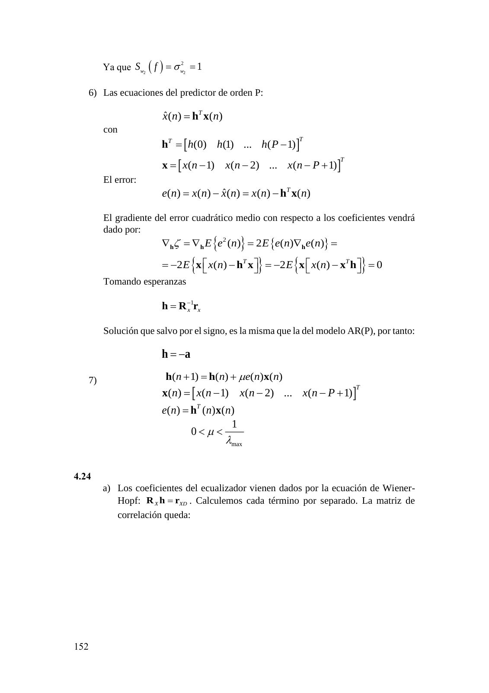

```text
        Ya que S w2 ( f ) =  w2 = 1
                              2


   6) Las ecuaciones del predictor de orden P:

                        xˆ (n) = hT x(n)
        con
                        hT =  h(0) h(1) ... h( P − 1) 
                                                                T


                        x =  x(n − 1)       x(n − 2) ... x(n − P + 1) 
                                                                       T


        El error:
                        e(n) = x(n) − xˆ ( n) = x( n) − hT x( n)

        El gradiente del error cuadrático medio con respecto a los coeficientes vendrá
        dado por:
                        h = h E e 2 (n) = 2 E e(n)h e(n) =

                                                                            
                        = −2 E x  x(n) − hT x  = −2 E x  x(n) − xT h  = 0
        Tomando esperanzas

                        h = R −x 1rx

        Solución que salvo por el signo, es la misma que la del modelo AR(P), por tanto:

                        h = −a

   7)                    h(n + 1) = h(n) +  e(n)x(n)
                        x(n) =  x(n − 1) x(n − 2) ... x(n − P + 1) 
                                                                           T


                        e( n ) = hT ( n ) x ( n )
                                                1
                                 0 
                                             max


4.24
        a) Los coeficientes del ecualizador vienen dados por la ecuación de Wiener-
           Hopf: R X h = rXD . Calculemos cada término por separado. La matriz de
           correlación queda:


152
```

## Page 37

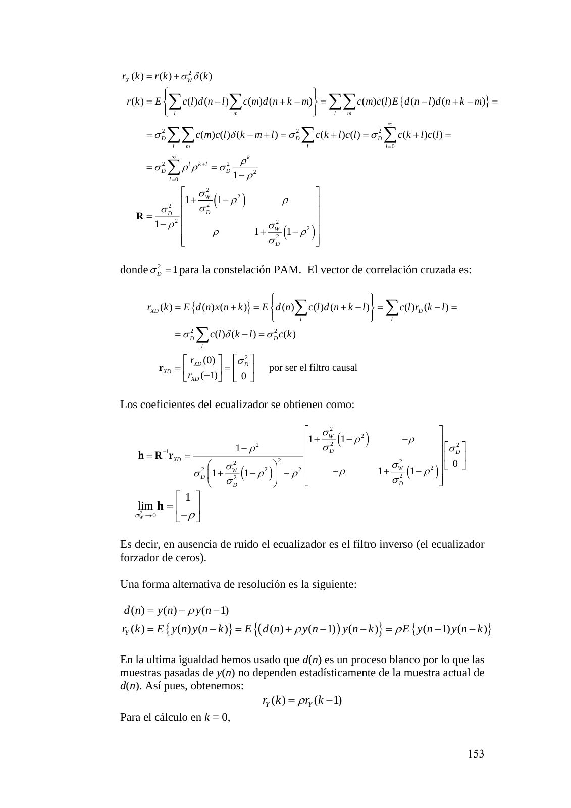

```text
rX (k ) = r (k ) +  W2  (k )
                                              
              l
                                            
 r (k ) = E  c(l )d (n − l ) c(m)d (n + k − m)  =
                             m                   
                                                                             c(m)c(l ) E d (n − l )d (n + k − m) =
                                                                             l    m
                                                                                                 
          =  D2   
                    l      m
                                 c(m)c(l ) ( k − m + l ) =  D2   l
                                                                        c(k + l )c(l ) =  D2    c(k + l )c(l ) =
                                                                                                l =0
                    
                                                  
                    
                                                      k
          =  D2            l    k +l
                                        =  D2
                   l =0                          1−  2
                W2                           
              1 + 2 (1 −  )         
                           2
                                               
        D  D
          2
                                               
    R=
       1−  2                    W2          
                            1 + 2 (1 −  2 ) 
                               D            

donde  D2 = 1 para la constelación PAM. El vector de correlación cruzada es:

                                                                      
                                              
                                                                
          rXD (k ) = E d (n) x(n + k ) = E d (n) c(l )d (n + k − l )  =
                                                   l                     
                                                                                                 c(l )r (k − l ) =
                                                                                                  l
                                                                                                         D


                        =  D2    c(l ) (k − l ) =  c(k )
                                  l
                                                           2
                                                           D


                    r (0)   D2 
             rXD =  XD       =                        por ser el filtro causal
                    rXD (−1)   0 

Los coeficientes del ecualizador se obtienen como:

                                               W2                              
                                             1 + 2 (1 −  )         −
                                                          2
                                                                                  2
          −1                 1−  2
                                                D                                D 
     h = R rXD =
                          W2
                                        2                       W                0 
                   2               2 
                                                                   2

                  D 1 + 2 (1 −  )  −  2 
                                                   −        1 +
                                                                  D2
                                                                      (1 −  2
                                                                               ) 
                      D                                                     
              1 1 
      lim h =   
     lim
    W →
        →00
              − 
      2
      2
      W


Es decir, en ausencia de ruido el ecualizador es el filtro inverso (el ecualizador
forzador de ceros).

Una forma alternativa de resolución es la siguiente:

d (n) = y (n) −  y (n − 1)
rY (k ) = E  y (n) y (n − k ) = E ( d (n) +  y (n − 1) ) y (n − k ) =  E  y (n − 1) y (n − k )

En la ultima igualdad hemos usado que d(n) es un proceso blanco por lo que las
muestras pasadas de y(n) no dependen estadísticamente de la muestra actual de
d(n). Así pues, obtenemos:
                              rY (k ) =  rY (k − 1)
Para el cálculo en k = 0,


                                                                                                                      153
```

## Page 38

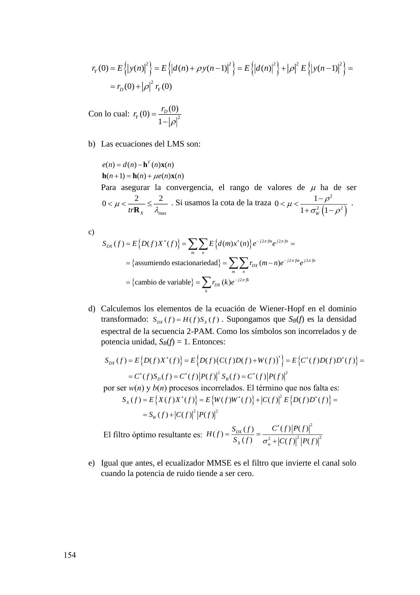

```text
                     
       rY (0) = E y (n)
                                2
                                     = E  d (n) +  y(n −1)  = E  d (n)  +  E  y(n −1)  =
                                                                           2                            2                  2              2


               = rD (0) +  rY (0)
                                    2


                                        rD (0)
      Con lo cual: rY (0) =
                                        1− 
                                                  2


      b) Las ecuaciones del LMS son:

           e ( n ) = d ( n ) − h T ( n ) x( n )
           h(n + 1) = h(n) +  e(n)x(n)
           Para asegurar la convergencia, el rango de valores de  ha de ser
                    2     2                                               1−  2
           0             . Si usamos la cota de la traza 0                        .
                  trR X max                                         1 +  W2 (1 −  2 )

      c)
                                           E d (m) x (n) e e =
           S DX ( f ) = E D( f ) X  ( f ) =
                                                      m       n
                                                                                           − j 2 fm       j 2 fn


                      = assumiendo estacionariedad =  r (m − n)e e                     DX
                                                                                                                    − j 2 fm   j 2 fn

                                                                               m       n

                      = cambio de variable =  r (k )e              DX
                                                                               − j 2 fk

                                                                  k


      d) Calculemos los elementos de la ecuación de Wiener-Hopf en el dominio
         transformado: S DX ( f ) = H ( f ) S X ( f ) . Supongamos que SB(f) es la densidad
         espectral de la secuencia 2-PAM. Como los símbolos son incorrelados y de
         potencia unidad, SB(f) = 1. Entonces:

                                                          
            S DX ( f ) = E D( f ) X  ( f ) = E D( f ) ( C ( f ) D( f ) + W ( f ) )
                                                                                                            
                                                                                                                 = E C ( f )D( f )D ( f ) =
                                                                                                                                         


                         = C  ( f ) S D ( f ) = C  ( f ) P( f ) S B ( f ) = C  ( f ) P( f )
                                                                       2                                            2


           por ser w(n) y b(n) procesos incorrelados. El término que nos falta es:
                     S X ( f ) = E  X ( f ) X  ( f ) = E W ( f )W  ( f ) + C ( f ) E D( f ) D  ( f ) =
                                                                                                                2


                               = SW ( f ) + C ( f ) P( f )
                                                      2               2


                                                                                                                                    2
                                                    S (f)          C ( f ) P( f )
           El filtro óptimo resultante es: H ( f ) = DX       = 2
                                                     S X ( f )  w + C ( f ) 2 P( f ) 2


      e) Igual que antes, el ecualizador MMSE es el filtro que invierte el canal solo
         cuando la potencia de ruido tiende a ser cero.


154
```

## Page 39

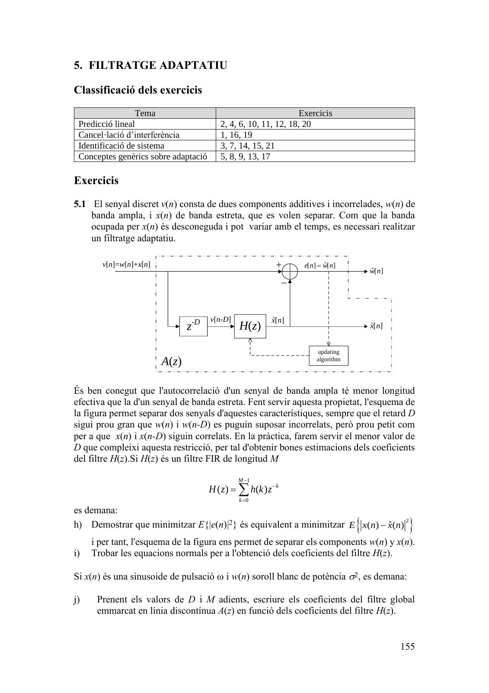

```text
5. FILTRATGE ADAPTATIU

Classificació dels exercicis
                 Tema                                             Exercicis
 Predicció lineal                         2, 4, 6, 10, 11, 12, 18, 20
 Cancel·lació d’interferència             1, 16, 19
 Identificació de sistema                 3, 7, 14, 15, 21
 Conceptes genèrics sobre adaptació       5, 8, 9, 13, 17

Exercicis
5.1 El senyal discret v(n) consta de dues components additives i incorrelades, w(n) de
    banda ampla, i x(n) de banda estreta, que es volen separar. Com que la banda
    ocupada per x(n) és desconeguda i pot variar amb el temps, es necessari realitzar
    un filtratge adaptatiu.

       v[n]=w[n]+x[n]                                        +     e[n] = wˆ [n]
                                                                                        wˆ[n]
                                                              _


                                      v[n-D]               xˆ[n]
                               z-D              H(z)                                    xˆ[n]


                                                                        updating
                        A(z)                                            algorithm


És ben conegut que l'autocorrelació d'un senyal de banda ampla té menor longitud
efectiva que la d'un senyal de banda estreta. Fent servir aquesta propietat, l'esquema de
la figura permet separar dos senyals d'aquestes característiques, sempre que el retard D
sigui prou gran que w(n) i w(n-D) es puguin suposar incorrelats, però prou petit com
per a que x(n) i x(n-D) siguin correlats. En la pràctica, farem servir el menor valor de
D que compleixi aquesta restricció, per tal d'obtenir bones estimacions dels coeficients
del filtre H(z).Si H(z) és un filtre FIR de longitud M

                                                M −1
                                      H ( z ) =  h( k ) z − k
                                                k =0
es demana:
h) Demostrar que minimitzar E{|e(n)|2} és equivalent a minimitzar E x(n) − xˆ (n)
                                                                                  2
                                                                                                
     i per tant, l'esquema de la figura ens permet de separar els components w(n) y x(n).
i)   Trobar les equacions normals per a l'obtenció dels coeficients del filtre H(z).

Si x(n) és una sinusoide de pulsació  i w(n) soroll blanc de potència 2, es demana:

j)    Prenent els valors de D i M adients, escriure els coeficients del filtre global
      emmarcat en línia discontínua A(z) en funció dels coeficients del filtre H(z).


                                                                                                155
```

## Page 40

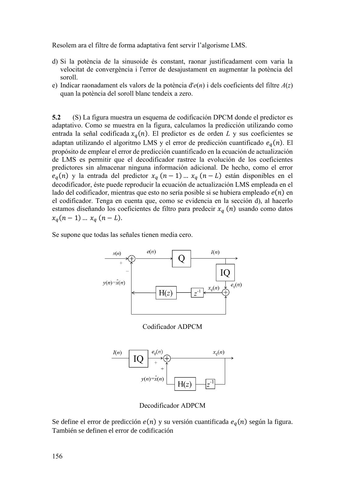

```text
Resolem ara el filtre de forma adaptativa fent servir l’algorisme LMS.

d) Si la potència de la sinusoide és constant, raonar justificadament com varia la
   velocitat de convergència i l'error de desajustament en augmentar la potència del
   soroll.
e) Indicar raonadament els valors de la potència d'e(n) i dels coeficients del filtre A(z)
   quan la potència del soroll blanc tendeix a zero.


5.2    (S) La figura muestra un esquema de codificación DPCM donde el predictor es
adaptativo. Como se muestra en la figura, calculamos la predicción utilizando como
entrada la señal codificada 𝑥𝑞 (𝑛). El predictor es de orden L y sus coeficientes se
adaptan utilizando el algoritmo LMS y el error de predicción cuantificado 𝑒𝑞 (𝑛). El
propósito de emplear el error de predicción cuantificado en la ecuación de actualización
de LMS es permitir que el decodificador rastree la evolución de los coeficientes
predictores sin almacenar ninguna información adicional. De hecho, como el error
𝑒𝑞 (𝑛) y la entrada del predictor 𝑥𝑞 (𝑛 − 1) … 𝑥𝑞 (𝑛 − 𝐿) están disponibles en el
decodificador, éste puede reproducir la ecuación de actualización LMS empleada en el
lado del codificador, mientras que esto no sería posible si se hubiera empleado 𝑒(𝑛) en
el codificador. Tenga en cuenta que, como se evidencia en la sección d), al hacerlo
estamos diseñando los coeficientes de filtro para predecir 𝑥𝑞 (𝑛) usando como datos
𝑥𝑞 (𝑛 − 1) … 𝑥𝑞 (𝑛 − 𝐿).

Se supone que todas las señales tienen media cero.


                                 Codificador ADPCM


                                Decodificador ADPCM

Se define el error de predicción 𝑒(𝑛) y su versión cuantificada 𝑒𝑞 (𝑛) según la figura.
También se definen el error de codificación


156
```

## Page 41

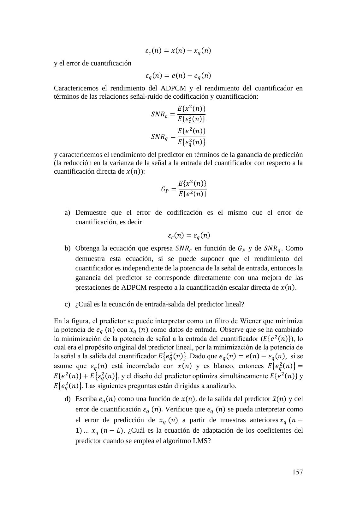

```text
                                 𝜀𝑐 (𝑛) = 𝑥(𝑛) − 𝑥𝑞 (𝑛)
y el error de cuantificación
                                 𝜀𝑞 (𝑛) = 𝑒(𝑛) − 𝑒𝑞 (𝑛)
Caractericemos el rendimiento del ADPCM y el rendimiento del cuantificador en
términos de las relaciones señal-ruido de codificación y cuantificación:
                                             𝐸{𝑥 2 (𝑛)}
                                   𝑆𝑁𝑅𝑐 =
                                             𝐸{𝜀𝑐2 (𝑛)}
                                             𝐸{𝑒 2 (𝑛)}
                                   𝑆𝑁𝑅𝑞 =
                                             𝐸{𝜀𝑞2 (𝑛)}
y caractericemos el rendimiento del predictor en términos de la ganancia de predicción
(la reducción en la varianza de la señal a la entrada del cuantificador con respecto a la
cuantificación directa de 𝑥(𝑛)):
                                             𝐸{𝑥 2 (𝑛)}
                                      𝐺𝑃 =
                                             𝐸{𝑒 2 (𝑛)}

   a) Demuestre que el error de codificación es el mismo que el error de
      cuantificación, es decir
                                         𝜀𝑐 (𝑛) = 𝜀𝑞 (𝑛)
   b) Obtenga la ecuación que expresa 𝑆𝑁𝑅𝑐 en función de 𝐺𝑃 y de 𝑆𝑁𝑅𝑞 . Como
      demuestra esta ecuación, si se puede suponer que el rendimiento del
      cuantificador es independiente de la potencia de la señal de entrada, entonces la
      ganancia del predictor se corresponde directamente con una mejora de las
      prestaciones de ADPCM respecto a la cuantificación escalar directa de 𝑥(𝑛).

   c) ¿Cuál es la ecuación de entrada-salida del predictor lineal?

En la figura, el predictor se puede interpretar como un filtro de Wiener que minimiza
la potencia de 𝑒𝑞 (𝑛) con 𝑥𝑞 (𝑛) como datos de entrada. Observe que se ha cambiado
la minimización de la potencia de señal a la entrada del cuantificador (𝐸{𝑒 2 (𝑛)}), lo
cual era el propósito original del predictor lineal, por la minimización de la potencia de
la señal a la salida del cuantificador 𝐸{𝑒𝑞2 (𝑛)}. Dado que 𝑒𝑞 (𝑛) = 𝑒(𝑛) − 𝜀𝑞 (𝑛), si se
asume que 𝜀𝑞 (𝑛) está incorrelado con 𝑥(𝑛) y es blanco, entonces 𝐸{𝑒𝑞2 (𝑛)} =
𝐸{𝑒 2 (𝑛)} + 𝐸{𝜀𝑞2 (𝑛)}, y el diseño del predictor optimiza simultáneamente 𝐸{𝑒 2 (𝑛)} y
𝐸{𝑒𝑞2 (𝑛)}. Las siguientes preguntas están dirigidas a analizarlo.
   d) Escriba 𝑒𝑞 (𝑛) como una función de 𝑥(𝑛), de la salida del predictor 𝑥̂(𝑛) y del
      error de cuantificación 𝜀𝑞 (𝑛). Verifique que 𝑒𝑞 (𝑛) se pueda interpretar como
      el error de predicción de 𝑥𝑞 (𝑛) a partir de muestras anteriores 𝑥𝑞 (𝑛 −
      1) … 𝑥𝑞 (𝑛 − 𝐿). ¿Cuál es la ecuación de adaptación de los coeficientes del
      predictor cuando se emplea el algoritmo LMS?


                                                                                      157
```

## Page 42

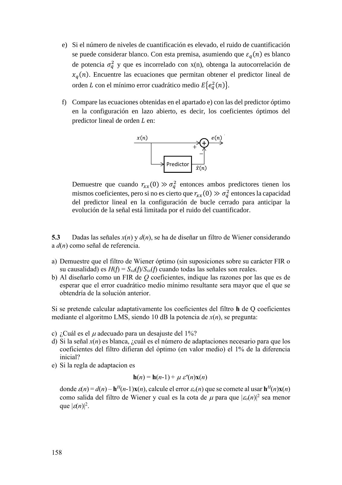

```text
   e) Si el número de niveles de cuantificación es elevado, el ruido de cuantificación
      se puede considerar blanco. Con esta premisa, asumiendo que 𝜀𝑞 (𝑛) es blanco
      de potencia 𝜎𝑞2 y que es incorrelado con x(n), obtenga la autocorrelación de
      𝑥𝑞 (𝑛). Encuentre las ecuaciones que permitan obtener el predictor lineal de
      orden 𝐿 con el mínimo error cuadrático medio 𝐸{𝑒𝑞2 (𝑛)}.

   f) Compare las ecuaciones obtenidas en el apartado e) con las del predictor óptimo
      en la configuración en lazo abierto, es decir, los coeficientes óptimos del
      predictor lineal de orden 𝐿 en:


                                                        +

                                           Predictor


       Demuestre que cuando 𝑟𝑥𝑥 (0) ≫ 𝜎𝑞2 entonces ambos predictores tienen los
       mismos coeficientes, pero si no es cierto que 𝑟𝑥𝑥 (0) ≫ 𝜎𝑞2 entonces la capacidad
       del predictor lineal en la configuración de bucle cerrado para anticipar la
       evolución de la señal está limitada por el ruido del cuantificador.


5.3     Dadas las señales x(n) y d(n), se ha de diseñar un filtro de Wiener considerando
a d(n) como señal de referencia.

a) Demuestre que el filtro de Wiener óptimo (sin suposiciones sobre su carácter FIR o
   su causalidad) es H(f) = Sxd(f)/Sxx(f) cuando todas las señales son reales.
b) Al diseñarlo como un FIR de Q coeficientes, indique las razones por las que es de
   esperar que el error cuadrático medio mínimo resultante sera mayor que el que se
   obtendría de la solución anterior.

Si se pretende calcular adaptativamente los coeficientes del filtro h de Q coeficientes
mediante el algoritmo LMS, siendo 10 dB la potencia de x(n), se pregunta:

c) ¿Cuál es el  adecuado para un desajuste del 1%?
d) Si la señal x(n) es blanca, ¿cuál es el número de adaptaciones necesario para que los
   coeficientes del filtro difieran del óptimo (en valor medio) el 1% de la diferencia
   inicial?
e) Si la regla de adaptacion es
                              h(n) = h(n-1) +  (n)x(n)
   donde (n) = d(n) – hH(n-1)x(n), calcule el error o(n) que se comete al usar hH(n)x(n)
   como salida del filtro de Wiener y cual es la cota de  para que |o(n)|2 sea menor
   que |(n)|2.


158
```

## Page 43

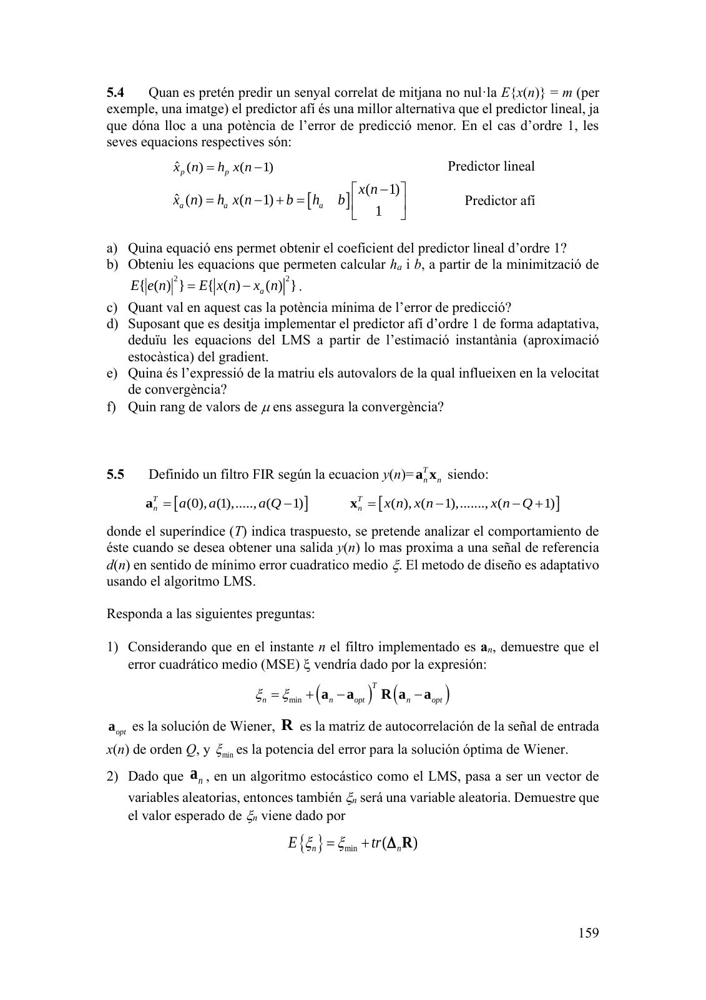

```text
5.4    Quan es pretén predir un senyal correlat de mitjana no nul·la E{x(n)} = m (per
exemple, una imatge) el predictor afí és una millor alternativa que el predictor lineal, ja
que dóna lloc a una potència de l’error de predicció menor. En el cas d’ordre 1, les
seves equacions respectives són:
             xˆ p (n) = hp x(n − 1)                                        Predictor lineal
                                                      x(n − 1) 
             xˆa (n) = ha x(n − 1) + b =  ha     b                         Predictor afí
                                                      1 

a) Quina equació ens permet obtenir el coeficient del predictor lineal d’ordre 1?
b) Obteniu les equacions que permeten calcular ha i b, a partir de la minimització de
   E{ e(n) } = E{ x(n) − xa (n) } .
          2                    2


c) Quant val en aquest cas la potència mínima de l’error de predicció?
d) Suposant que es desitja implementar el predictor afí d’ordre 1 de forma adaptativa,
   deduïu les equacions del LMS a partir de l’estimació instantània (aproximació
   estocàstica) del gradient.
e) Quina és l’expressió de la matriu els autovalors de la qual influeixen en la velocitat
   de convergència?
f) Quin rang de valors de  ens assegura la convergència?


5.5    Definido un filtro FIR según la ecuacion y(n)= aTn x n siendo:

       aTn =  a(0), a(1),....., a(Q − 1)           xTn =  x(n), x(n − 1),......., x(n − Q + 1) 

donde el superíndice (T) indica traspuesto, se pretende analizar el comportamiento de
éste cuando se desea obtener una salida y(n) lo mas proxima a una señal de referencia
d(n) en sentido de mínimo error cuadratico medio . El metodo de diseño es adaptativo
usando el algoritmo LMS.

Responda a las siguientes preguntas:

1) Considerando que en el instante n el filtro implementado es an, demuestre que el
   error cuadrático medio (MSE)  vendría dado por la expresión:

                                n =  min + ( a n − aopt ) R ( a n − aopt )
                                                          T


a opt es la solución de Wiener, R es la matriz de autocorrelación de la señal de entrada
x(n) de orden Q, y  min es la potencia del error para la solución óptima de Wiener.
2) Dado que a n , en un algoritmo estocástico como el LMS, pasa a ser un vector de
   variables aleatorias, entonces también n será una variable aleatoria. Demuestre que
   el valor esperado de n viene dado por
                                      E  n  =  min + tr ( n R )


                                                                                                      159
```

## Page 44

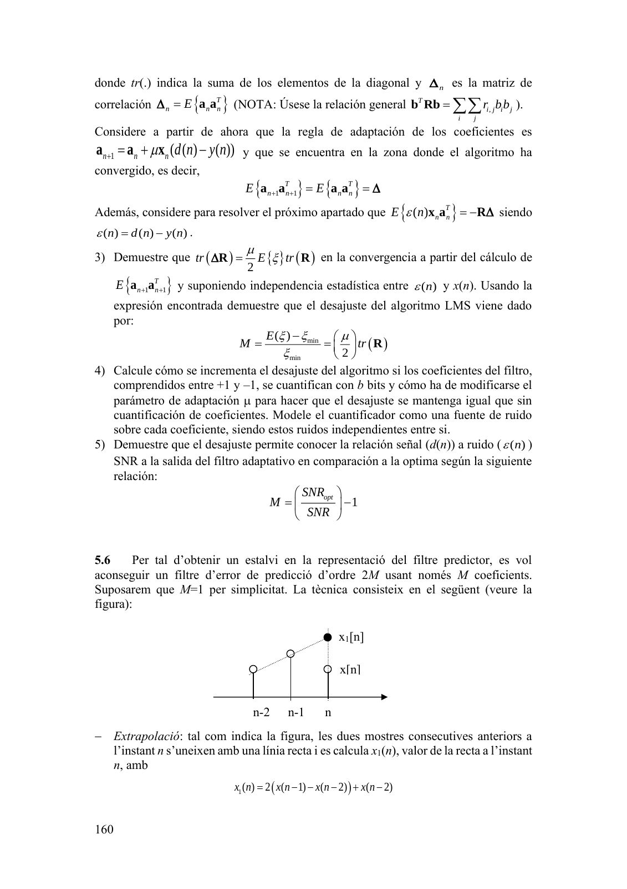

```text
donde tr(.) indica la suma de los elementos de la diagonal y  n es la matriz de
correlación  n = E a n aTn       (NOTA: Úsese la relación general b Rb =  r b b ). T
                                                                                                        i, j i   j
                                                                                                i   j

Considere a partir de ahora que la regla de adaptación de los coeficientes es
an+1 = an +  xn (d (n) − y(n)) y que se encuentra en la zona donde el algoritmo ha
convergido, es decir,
                                       E a n +1aTn +1 = E a naTn  = 
Además, considere para resolver el próximo apartado que E  (n)x naTn = −R siendo         
 ( n) = d ( n) − y ( n) .
                                       
3) Demuestre que tr ( R ) =            E   tr ( R ) en la convergencia a partir del cálculo de
                                     2
      E a n +1aTn +1   y suponiendo independencia estadística entre  (n) y x(n). Usando la
   expresión encontrada demuestre que el desajuste del algoritmo LMS viene dado
   por:
                                  E ( ) −  min   
                             M=                 =   tr ( R )
                                       min       2
4) Calcule cómo se incrementa el desajuste del algoritmo si los coeficientes del filtro,
   comprendidos entre +1 y –1, se cuantifican con b bits y cómo ha de modificarse el
   parámetro de adaptación  para hacer que el desajuste se mantenga igual que sin
   cuantificación de coeficientes. Modele el cuantificador como una fuente de ruido
   sobre cada coeficiente, siendo estos ruidos independientes entre si.
5) Demuestre que el desajuste permite conocer la relación señal (d(n)) a ruido (  (n) )
   SNR a la salida del filtro adaptativo en comparación a la optima según la siguiente
   relación:
                                          SNRopt 
                                   M =             −1
                                            SNR   


5.6     Per tal d’obtenir un estalvi en la representació del filtre predictor, es vol
aconseguir un filtre d’error de predicció d’ordre 2M usant només M coeficients.
Suposarem que M=1 per simplicitat. La tècnica consisteix en el següent (veure la
figura):

                                                                 x1[n]

                                                                 x[n]


                                         n-2       n-1       n
− Extrapolació: tal com indica la figura, les dues mostres consecutives anteriors a
  l’instant n s’uneixen amb una línia recta i es calcula x1(n), valor de la recta a l’instant
  n, amb
                                    x1 (n) = 2 ( x(n − 1) − x(n − 2) ) + x(n − 2)


160
```

## Page 45

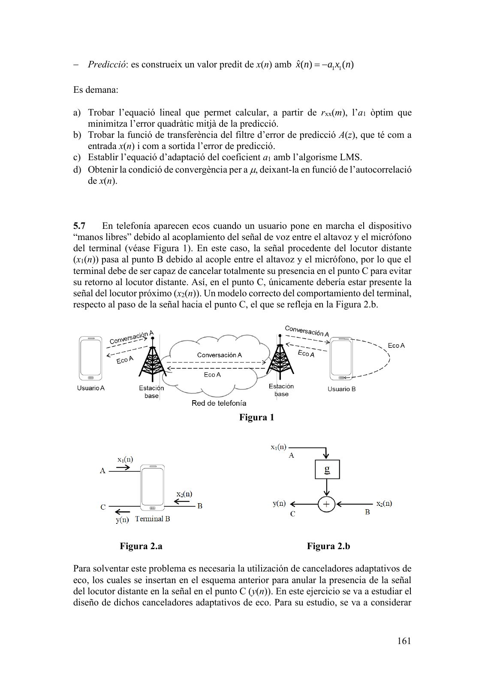

```text
− Predicció: es construeix un valor predit de x(n) amb xˆ (n) = −a1 x1 (n)

Es demana:

a) Trobar l’equació lineal que permet calcular, a partir de rxx(m), l’a1 òptim que
   minimitza l’error quadràtic mitjà de la predicció.
b) Trobar la funció de transferència del filtre d’error de predicció A(z), que té com a
   entrada x(n) i com a sortida l’error de predicció.
c) Establir l’equació d’adaptació del coeficient a1 amb l’algorisme LMS.
d) Obtenir la condició de convergència per a , deixant-la en funció de l’autocorrelació
   de x(n).


5.7     En telefonía aparecen ecos cuando un usuario pone en marcha el dispositivo
“manos libres” debido al acoplamiento del señal de voz entre el altavoz y el micrófono
del terminal (véase Figura 1). En este caso, la señal procedente del locutor distante
(x1(n)) pasa al punto B debido al acople entre el altavoz y el micrófono, por lo que el
terminal debe de ser capaz de cancelar totalmente su presencia en el punto C para evitar
su retorno al locutor distante. Así, en el punto C, únicamente debería estar presente la
señal del locutor próximo (x2(n)). Un modelo correcto del comportamiento del terminal,
respecto al paso de la señal hacia el punto C, el que se refleja en la Figura 2.b.


                                             Figura 1


             Figura 2.a                                        Figura 2.b

Para solventar este problema es necesaria la utilización de canceladores adaptativos de
eco, los cuales se insertan en el esquema anterior para anular la presencia de la señal
del locutor distante en la señal en el punto C (y(n)). En este ejercicio se va a estudiar el
diseño de dichos canceladores adaptativos de eco. Para su estudio, se va a considerar


                                                                                        161
```

## Page 46

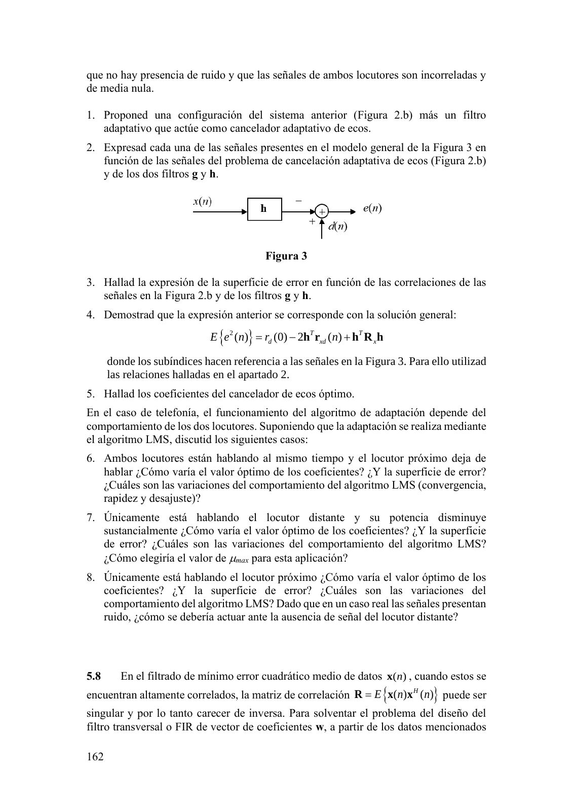

```text
que no hay presencia de ruido y que las señales de ambos locutores son incorreladas y
de media nula.

1. Proponed una configuración del sistema anterior (Figura 2.b) más un filtro
   adaptativo que actúe como cancelador adaptativo de ecos.
2. Expresad cada una de las señales presentes en el modelo general de la Figura 3 en
   función de las señales del problema de cancelación adaptativa de ecos (Figura 2.b)
   y de los dos filtros g y h.


                                           Figura 3

3. Hallad la expresión de la superficie de error en función de las correlaciones de las
   señales en la Figura 2.b y de los filtros g y h.
4. Demostrad que la expresión anterior se corresponde con la solución general:
                             E e 2 (n) = rd (0) − 2hT rxd (n) + hT R xh

      donde los subíndices hacen referencia a las señales en la Figura 3. Para ello utilizad
      las relaciones halladas en el apartado 2.
5. Hallad los coeficientes del cancelador de ecos óptimo.
En el caso de telefonía, el funcionamiento del algoritmo de adaptación depende del
comportamiento de los dos locutores. Suponiendo que la adaptación se realiza mediante
el algoritmo LMS, discutid los siguientes casos:
6. Ambos locutores están hablando al mismo tiempo y el locutor próximo deja de
   hablar ¿Cómo varía el valor óptimo de los coeficientes? ¿Y la superficie de error?
   ¿Cuáles son las variaciones del comportamiento del algoritmo LMS (convergencia,
   rapidez y desajuste)?
7. Únicamente está hablando el locutor distante y su potencia disminuye
   sustancialmente ¿Cómo varía el valor óptimo de los coeficientes? ¿Y la superficie
   de error? ¿Cuáles son las variaciones del comportamiento del algoritmo LMS?
   ¿Cómo elegiría el valor de max para esta aplicación?
8. Únicamente está hablando el locutor próximo ¿Cómo varía el valor óptimo de los
   coeficientes? ¿Y la superficie de error? ¿Cuáles son las variaciones del
   comportamiento del algoritmo LMS? Dado que en un caso real las señales presentan
   ruido, ¿cómo se debería actuar ante la ausencia de señal del locutor distante?


5.8      En el filtrado de mínimo error cuadrático medio de datos x(n) , cuando estos se
                                                                              
encuentran altamente correlados, la matriz de correlación R = E x(n)x H (n) puede ser
singular y por lo tanto carecer de inversa. Para solventar el problema del diseño del
filtro transversal o FIR de vector de coeficientes w, a partir de los datos mencionados

162
```

## Page 47

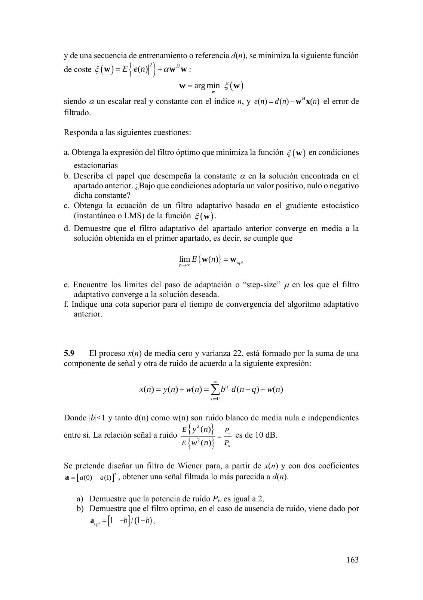

```text
y de una secuencia de entrenamiento o referencia d(n), se minimiza la siguiente función
                   
de coste  ( w ) = E e(n)
                            2
                                 +w w :
                                     H


                                      w = arg min  ( w )
                                                 w

siendo  un escalar real y constante con el índice n, y e(n) = d (n) − w H x(n) el error de
filtrado.

Responda a las siguientes cuestiones:

a. Obtenga la expresión del filtro óptimo que minimiza la función  ( w ) en condiciones
   estacionarias
b. Describa el papel que desempeña la constante  en la solución encontrada en el
   apartado anterior. ¿Bajo que condiciones adoptaría un valor positivo, nulo o negativo
   dicha constante?
c. Obtenga la ecuación de un filtro adaptativo basado en el gradiente estocástico
   (instantáneo o LMS) de la función  ( w ) .
d. Demuestre que el filtro adaptativo del apartado anterior converge en media a la
   solución obtenida en el primer apartado, es decir, se cumple que

                                      lim E w (n) = w opt
                                      n →


e. Encuentre los limites del paso de adaptación o “step-size”  en los que el filtro
    adaptativo converge a la solución deseada.
f. Indique una cota superior para el tiempo de convergencia del algoritmo adaptativo
    anterior.


5.9  El proceso x(n) de media cero y varianza 22, está formado por la suma de una
componente de señal y otra de ruido de acuerdo a la siguiente expresión:

                                                  
                       x(n) = y (n) + w(n) =  b q d (n − q) + w(n)
                                                 q =0


Donde |b|<1 y tanto d(n) como w(n) son ruido blanco de media nula e independientes

entre si. La relación señal a ruido
                                         E  y (n) = P es de 10 dB.
                                             2
                                                        y


                                         E w ( n) P
                                             2
                                                        w


Se pretende diseñar un filtro de Wiener para, a partir de x(n) y con dos coeficientes
a =  a (0) a (1)  , obtener una señal filtrada lo más parecida a d(n).
               T


   a) Demuestre que la potencia de ruido Pw es igual a 2.
   b) Demuestre que el filtro optimo, en el caso de ausencia de ruido, viene dado por
      aopt = 1 −b / (1 − b) .


                                                                                       163
```

## Page 48

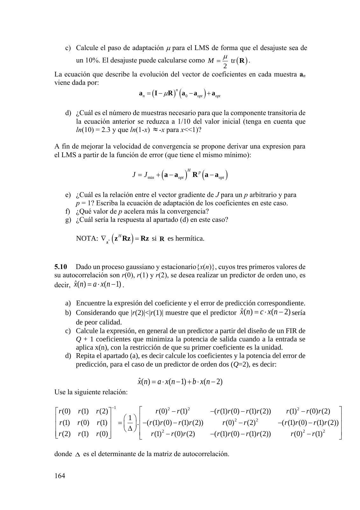

```text
    c) Calcule el paso de adaptación  para el LMS de forma que el desajuste sea de
                                                                      
       un 10%. El desajuste puede calcularse como M = tr ( R ) .
                                                                      2
La ecuación que describe la evolución del vector de coeficientes en cada muestra an
viene dada por:
                            a n = ( I −  R ) ( a 0 − a opt ) + a opt
                                             n


    d) ¿Cuál es el número de muestras necesario para que la componente transitoria de
       la ecuación anterior se reduzca a 1/10 del valor inicial (tenga en cuenta que
       ln(10) = 2.3 y que ln(1-x)  -x para x<<1)?

A fin de mejorar la velocidad de convergencia se propone derivar una expresion para
el LMS a partir de la función de error (que tiene el mismo mínimo):

                                J = J min + ( a − aopt ) R p ( a − aopt )
                                                         H


    e) ¿Cuál es la relación entre el vector gradiente de J para un p arbitrario y para
       p = 1? Escriba la ecuación de adaptación de los coeficientes en este caso.
    f) ¿Qué valor de p acelera más la convergencia?
    g) ¿Cuál sería la respuesta al apartado (d) en este caso?

                       (        )
        NOTA:  z* z H Rz = Rz si R es hermítica.


5.10 Dado un proceso gaussiano y estacionario{x(n)}, cuyos tres primeros valores de
su autocorrelación son r(0), r(1) y r(2), se desea realizar un predictor de orden uno, es
decir, xˆ (n) = a  x(n − 1) .

    a) Encuentre la expresión del coeficiente y el error de predicción correspondiente.
    b) Considerando que |r(2)|<|r(1)| muestre que el predictor xˆ (n) = c  x(n − 2) sería
       de peor calidad.
    c) Calcule la expresión, en general de un predictor a partir del diseño de un FIR de
       Q + 1 coeficientes que minimiza la potencia de salida cuando a la entrada se
       aplica x(n), con la restricción de que su primer coeficiente es la unidad.
    d) Repita el apartado (a), es decir calcule los coeficientes y la potencia del error de
       predicción, para el caso de un predictor de orden dos (Q=2), es decir:

                                    xˆ (n) = a  x(n − 1) + b  x(n − 2)
Use la siguiente relación:

                       −1
 r (0) r (1) r (2)                  r (0) 2 − r (1) 2     −(r (1)r (0) − r (1) r (2))       r (1) 2 − r (0) r (2) 
 r (1) r (0) r (1)  =  1  .  −(r (1)r (0) − r (1)r (2))       r (0) 2 − r (2) 2
                                                                                                                         
                                                                                           −( r (1) r (0) − r (1) r (2)) 
                        
                                                                                                                     
 r (2) r (1) r (0)           r (1) − r (0) r (2)
                                          2
                                                             −( r (1) r (0) − r (1) r (2))        r (0) 2 − r (1) 2      

donde  es el determinante de la matriz de autocorrelación.


164
```

## Page 49

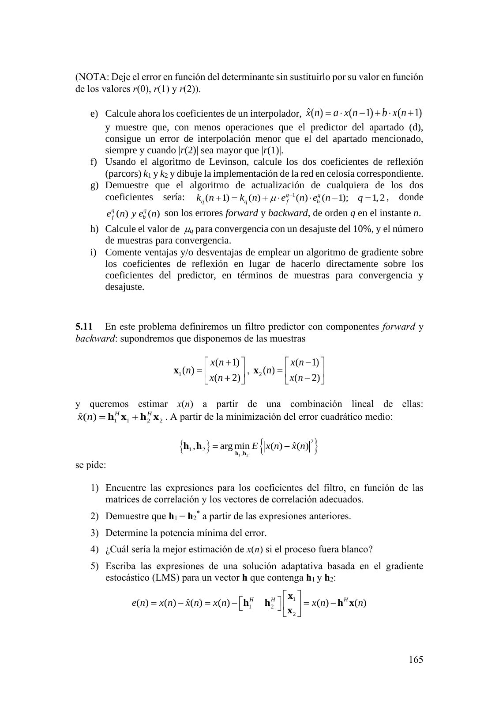

```text
(NOTA: Deje el error en función del determinante sin sustituirlo por su valor en función
de los valores r(0), r(1) y r(2)).

   e) Calcule ahora los coeficientes de un interpolador, xˆ (n) = a  x(n − 1) + b  x(n + 1)
      y muestre que, con menos operaciones que el predictor del apartado (d),
      consigue un error de interpolación menor que el del apartado mencionado,
      siempre y cuando |r(2)| sea mayor que |r(1)|.
   f) Usando el algoritmo de Levinson, calcule los dos coeficientes de reflexión
      (parcors) k1 y k2 y dibuje la implementación de la red en celosía correspondiente.
   g) Demuestre que el algoritmo de actualización de cualquiera de los dos
      coeficientes sería: kq (n + 1) = kq (n) +   e qf +1 (n)  ebq (n − 1); q = 1, 2 , donde
           e qf (n) y ebq (n) son los errores forward y backward, de orden q en el instante n.
   h) Calcule el valor de q para convergencia con un desajuste del 10%, y el número
      de muestras para convergencia.
   i) Comente ventajas y/o desventajas de emplear un algoritmo de gradiente sobre
      los coeficientes de reflexión en lugar de hacerlo directamente sobre los
      coeficientes del predictor, en términos de muestras para convergencia y
      desajuste.


5.11 En este problema definiremos un filtro predictor con componentes forward y
backward: supondremos que disponemos de las muestras

                                       x(n + 1)                 x(n − 1) 
                             x1 (n) =            , x   ( n ) =  x(n − 2) 
                                       x(n + 2) 
                                                       2
                                                                           

y queremos estimar x(n) a partir de una combinación lineal de ellas:
xˆ ( n) = h1H x1 + h 2H x 2 . A partir de la minimización del error cuadrático medio:


                              h , h  = arg min E  x(n) − xˆ(n) 
                                 1    2
                                                h1 ,h 2
                                                                        2


se pide:

   1) Encuentre las expresiones para los coeficientes del filtro, en función de las
      matrices de correlación y los vectores de correlación adecuados.
   2) Demuestre que h1 = h2* a partir de las expresiones anteriores.
   3) Determine la potencia mínima del error.
   4) ¿Cuál sería la mejor estimación de x(n) si el proceso fuera blanco?
   5) Escriba las expresiones de una solución adaptativa basada en el gradiente
      estocástico (LMS) para un vector h que contenga h1 y h2:
                                                                  x 
                 e(n) = x(n) − xˆ (n) = x(n) − h1H      h 2H   1  = x(n) − h H x(n)
                                                                  x2 


                                                                                            165
```

## Page 50

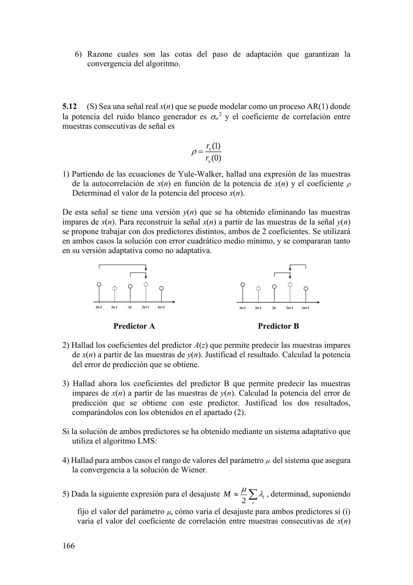

```text
   6) Razone cuales son las cotas del paso de adaptación que garantizan la
      convergencia del algoritmo.


5.12 (S) Sea una señal real x(n) que se puede modelar como un proceso AR(1) donde
la potencia del ruido blanco generador es w2 y el coeficiente de correlación entre
muestras consecutivas de señal es

                                               r (1)
                                            = x
                                              rx (0)
1) Partiendo de las ecuaciones de Yule-Walker, hallad una expresión de las muestras
   de la autocorrelación de x(n) en función de la potencia de x(n) y el coeficiente 
   Determinad el valor de la potencia del proceso x(n).

De esta señal se tiene una versión y(n) que se ha obtenido eliminando las muestras
impares de x(n). Para reconstruir la señal x(n) a partir de las muestras de la señal y(n)
se propone trabajar con dos predictores distintos, ambos de 2 coeficientes. Se utilizará
en ambos casos la solución con error cuadrático medio mínimo, y se compararan tanto
en su versión adaptativa como no adaptativa.


           2n-2   2n-1   2n   2n+1   2n+2              2n-2   2n-1   2n   2n+1   2n+2


                   Predictor A                                 Predictor B

2) Hallad los coeficientes del predictor A(z) que permite predecir las muestras impares
   de x(n) a partir de las muestras de y(n). Justificad el resultado. Calculad la potencia
   del error de predicción que se obtiene.

3) Hallad ahora los coeficientes del predictor B que permite predecir las muestras
   impares de x(n) a partir de las muestras de y(n). Calculad la potencia del error de
   predicción que se obtiene con este predictor. Justificad los dos resultados,
   comparándolos con los obtenidos en el apartado (2).

Si la solución de ambos predictores se ha obtenido mediante un sistema adaptativo que
   utiliza el algoritmo LMS:

4) Hallad para ambos casos el rango de valores del parámetro  del sistema que asegura
   la convergencia a la solución de Wiener.

                                                        
5) Dada la siguiente expresión para el desajuste M         i , determinad, suponiendo
                                                         2 i
      fijo el valor del parámetro , cómo varía el desajuste para ambos predictores si (i)
      varía el valor del coeficiente de correlación entre muestras consecutivas de x(n)

166
```

## Page 51

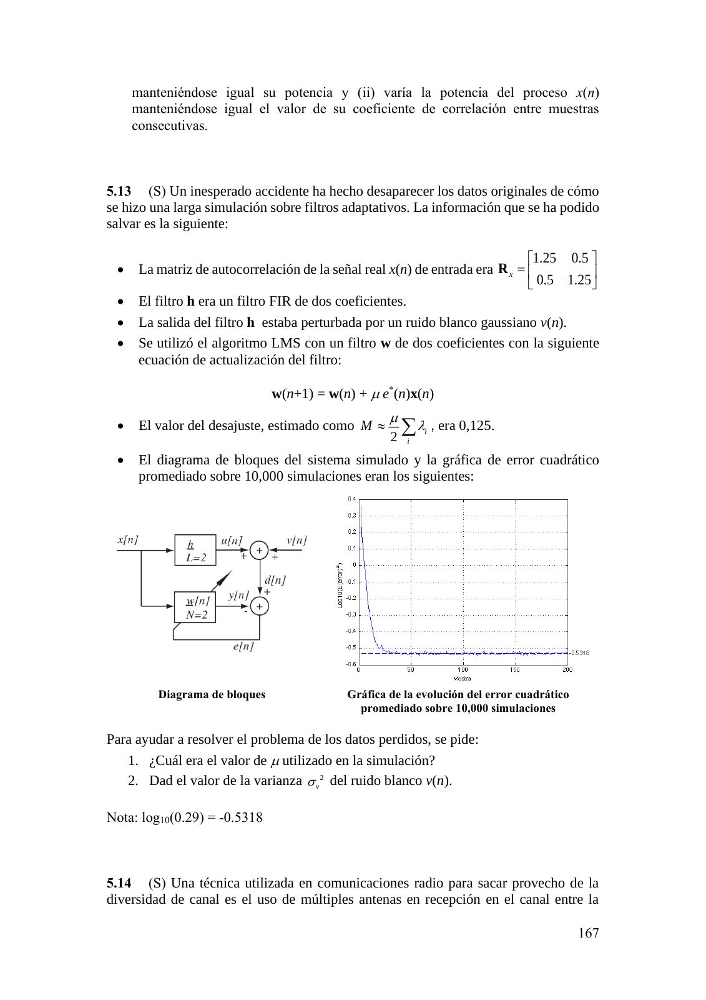

```text
     manteniéndose igual su potencia y (ii) varía la potencia del proceso x(n)
     manteniéndose igual el valor de su coeficiente de correlación entre muestras
     consecutivas.


5.13 (S) Un inesperado accidente ha hecho desaparecer los datos originales de cómo
se hizo una larga simulación sobre filtros adaptativos. La información que se ha podido
salvar es la siguiente:

                                                                              1.25 0.5 
 •    La matriz de autocorrelación de la señal real x(n) de entrada era R x =          
                                                                               0.5 1.25
 •    El filtro h era un filtro FIR de dos coeficientes.
 •    La salida del filtro h estaba perturbada por un ruido blanco gaussiano v(n).
 •    Se utilizó el algoritmo LMS con un filtro w de dos coeficientes con la siguiente
      ecuación de actualización del filtro:

                               w(n+1) = w(n) +  e*(n)x(n)
                                                   
 •    El valor del desajuste, estimado como M 
                                                   2
                                                         , era 0,125.
                                                        i
                                                            i


 •    El diagrama de bloques del sistema simulado y la gráfica de error cuadrático
      promediado sobre 10,000 simulaciones eran los siguientes:


         Diagrama de bloques               Gráfica de la evolución del error cuadrático
                                             promediado sobre 10,000 simulaciones

Para ayudar a resolver el problema de los datos perdidos, se pide:
   1. ¿Cuál era el valor de  utilizado en la simulación?
   2. Dad el valor de la varianza  v 2 del ruido blanco v(n).

Nota: log10(0.29) = -0.5318


5.14 (S) Una técnica utilizada en comunicaciones radio para sacar provecho de la
diversidad de canal es el uso de múltiples antenas en recepción en el canal entre la

                                                                                          167
```

## Page 52

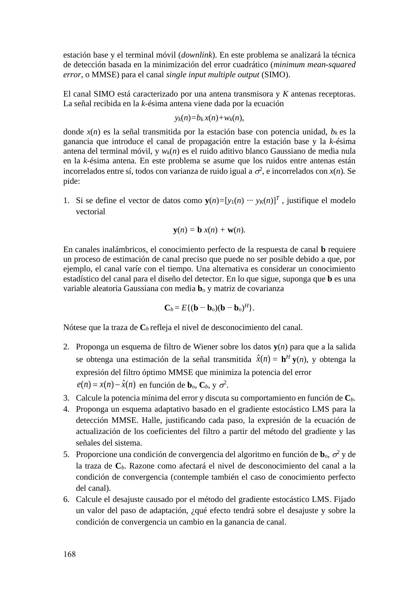

```text
estación base y el terminal móvil (downlink). En este problema se analizará la técnica
de detección basada en la minimización del error cuadrático (minimum mean-squared
error, o MMSE) para el canal single input multiple output (SIMO).

El canal SIMO está caracterizado por una antena transmisora y K antenas receptoras.
La señal recibida en la k-ésima antena viene dada por la ecuación
                                    yk(n)=bk x(n)+wk(n),
donde x(n) es la señal transmitida por la estación base con potencia unidad, bk es la
ganancia que introduce el canal de propagación entre la estación base y la k-ésima
antena del terminal móvil, y wk(n) es el ruido aditivo blanco Gaussiano de media nula
en la k-ésima antena. En este problema se asume que los ruidos entre antenas están
incorrelados entre sí, todos con varianza de ruido igual a 2, e incorrelados con x(n). Se
pide:

1. Si se define el vector de datos como y(n)=[y1(n) ··· yK(n)]T , justifique el modelo
   vectorial

                                    y(n) = b x(n) + w(n).

En canales inalámbricos, el conocimiento perfecto de la respuesta de canal b requiere
un proceso de estimación de canal preciso que puede no ser posible debido a que, por
ejemplo, el canal varíe con el tiempo. Una alternativa es considerar un conocimiento
estadístico del canal para el diseño del detector. En lo que sigue, suponga que b es una
variable aleatoria Gaussiana con media bo y matriz de covarianza

                                 Cb = E{(b − bo)(b − bo)H}.

Nótese que la traza de Cb refleja el nivel de desconocimiento del canal.

2. Proponga un esquema de filtro de Wiener sobre los datos y(n) para que a la salida
   se obtenga una estimación de la señal transmitida xˆ (n) = hH y(n), y obtenga la
   expresión del filtro óptimo MMSE que minimiza la potencia del error
      e(n) = x(n) − xˆ (n) en función de bo, Cb, y 2.
3. Calcule la potencia mínima del error y discuta su comportamiento en función de Cb.
4. Proponga un esquema adaptativo basado en el gradiente estocástico LMS para la
   detección MMSE. Halle, justificando cada paso, la expresión de la ecuación de
   actualización de los coeficientes del filtro a partir del método del gradiente y las
   señales del sistema.
5. Proporcione una condición de convergencia del algoritmo en función de bo, 2 y de
   la traza de Cb. Razone como afectará el nivel de desconocimiento del canal a la
   condición de convergencia (contemple también el caso de conocimiento perfecto
   del canal).
6. Calcule el desajuste causado por el método del gradiente estocástico LMS. Fijado
   un valor del paso de adaptación, ¿qué efecto tendrá sobre el desajuste y sobre la
   condición de convergencia un cambio en la ganancia de canal.


168
```

## Page 53

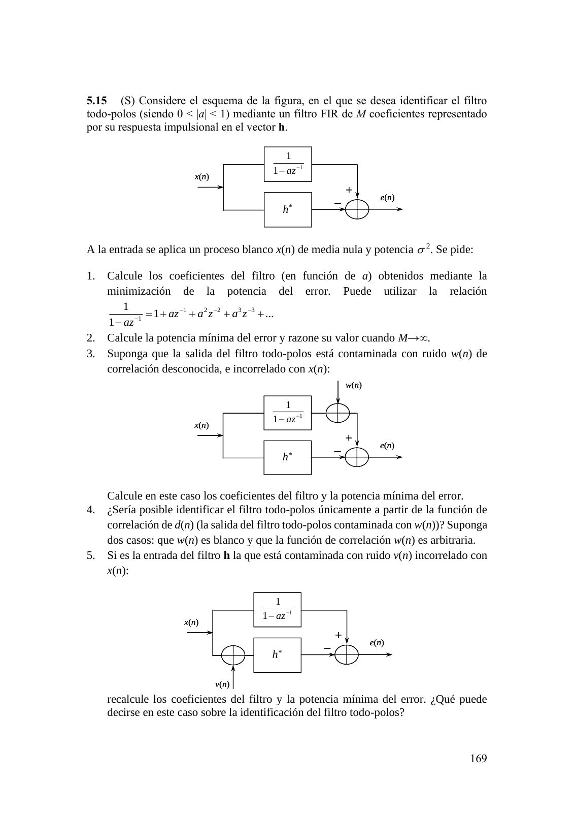

```text
5.15 (S) Considere el esquema de la figura, en el que se desea identificar el filtro
todo-polos (siendo 0 < |a| < 1) mediante un filtro FIR de M coeficientes representado
por su respuesta impulsional en el vector h.

                                                1
                                           h*
                                         1 − az      −1
                        x(n)
                                                                  +        e(n)
                                              h*              _


A la entrada se aplica un proceso blanco x(n) de media nula y potencia  2. Se pide:

1.   Calcule los coeficientes del filtro (en función de a) obtenidos mediante la
     minimización de la potencia del error. Puede utilizar la relación
         1
            −1
               = 1 + az −1 + a 2 z −2 + a 3 z −3 + ...
     1 − az
2.   Calcule la potencia mínima del error y razone su valor cuando M→.
3.   Suponga que la salida del filtro todo-polos está contaminada con ruido w(n) de
     correlación desconocida, e incorrelado con x(n):
                                                                  w(n)

                                                1
                                           h*
                                         1 − az      −1
                        x(n)
                                                                  +        e(n)
                                              h*              _


     Calcule en este caso los coeficientes del filtro y la potencia mínima del error.
4.   ¿Sería posible identificar el filtro todo-polos únicamente a partir de la función de
     correlación de d(n) (la salida del filtro todo-polos contaminada con w(n))? Suponga
     dos casos: que w(n) es blanco y que la función de correlación w(n) es arbitraria.
5.   Si es la entrada del filtro h la que está contaminada con ruido v(n) incorrelado con
     x(n):

                                          1
                                         h*
                                       1 − az   −1
                      x(n)
                                                              +          e(n)
                                         h*               _

                               v(n)
     recalcule los coeficientes del filtro y la potencia mínima del error. ¿Qué puede
     decirse en este caso sobre la identificación del filtro todo-polos?


                                                                                     169
```

## Page 54

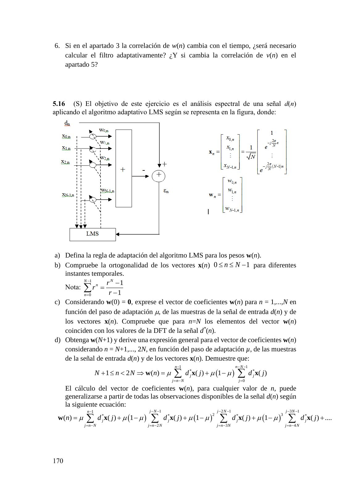

```text
6. Si en el apartado 3 la correlación de w(n) cambia con el tiempo, ¿será necesario
   calcular el filtro adaptativamente? ¿Y si cambia la correlación de v(n) en el
   apartado 5?


5.16 (S) El objetivo de este ejercicio es el análisis espectral de una señal d(n)
aplicando el algoritmo adaptativo LMS según se representa en la figura, donde:


a) Defina la regla de adaptación del algoritmo LMS para los pesos w(n).
b) Compruebe la ortogonalidad de los vectores x(n) 0  n  N − 1 para diferentes
   instantes temporales.
          N −1
                   r N −1
   Nota:  r n =
          n =0      r −1
c) Considerando w(0) = 0, exprese el vector de coeficientes w(n) para n = 1,...,N en
   función del paso de adaptación , de las muestras de la señal de entrada d(n) y de
   los vectores x(n). Compruebe que para n=N los elementos del vector w(n)
   coinciden con los valores de la DFT de la señal d*(n).
d) Obtenga w(N+1) y derive una expresión general para el vector de coeficientes w(n)
   considerando n = N+1,..., 2N, en función del paso de adaptación µ, de las muestras
   de la señal de entrada d(n) y de los vectores x(n). Demuestre que:
                                                          n −1                      n − N −1
                     N + 1  n  2 N  w (n) =   d *j x( j ) +  (1 −  )  d *j x( j )
                                                         j =n− N                        j =0

      El cálculo del vector de coeficientes w(n), para cualquier valor de n, puede
      generalizarse a partir de todas las observaciones disponibles de la señal d(n) según
      la siguiente ecuación:
              n −1                        j − N −1                     j − 2 N −1                  j −3 N −1
 w (n) =   d x( j ) +  (1 −  )  d x( j ) +  (1 −  )                d x( j ) +  (1 −  )  d x( j ) + ....
                       *                             *             2                *          3               *
                       j                             j                              j                          j
             j =n− N                      j =n−2 N                     j = n −3 N                  j =n−4 N


170
```

## Page 55

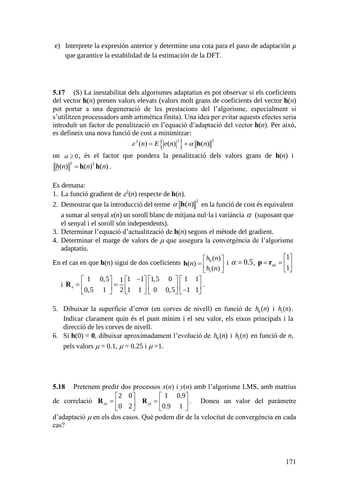

```text
e) Interprete la expresión anterior y determine una cota para el paso de adaptación µ
   que garantice la estabilidad de la estimación de la DFT.


5.17 (S) La inestabilitat dels algorismes adaptatius es pot observar si els coeficients
del vector h(n) prenen valors elevats (valors molt grans de coeficients del vector h(n)
pot portar a una degeneració de les prestacions del l’algorisme, especialment si
s’utilitzen processadors amb artimètica finita). Una idea per evitar aquests efectes seria
introduïr un factor de penalització en l’equació d’adaptació del vector h(n). Per això,
es defineix una nova funció de cost a minimitzar:
                                             
                             2 ( n ) = E e( n ) +  h ( n )
                                                2            2


on   0 , és el factor que pondera la penalització dels valors grans de h(n) i
 h ( n ) = h ( n )T h ( n ) .
        2


Es demana:
1. La funció gradient de 2(n) respecte de h(n).
2. Demostrar que la introducció del terme  h(n) en la funció de cost és equivalent
                                                 2


   a sumar al senyal x(n) un soroll blanc de mitjana nul·la i variància  (suposant que
   el senyal i el soroll són independents).
3. Determinar l’equació d’actualització de h(n) segons el mètode del gradient.
4. Determinar el marge de valors de  que assegura la convergència de l’algorisme
   adaptatiu.
                                                        h ( n)                    1
En el cas en que h(n) sigui de dos coeficients h(n) =  0  i  = 0.5 , p = rxd =  
                                                        h1 (n)                    1
           1 0,5 1 1 −1 1,5 0   1 1
   i Rx =       =                   .
          0,5 1  2 1 1   0 0,5  −1 1

5. Dibuixar la superfície d’error (en corves de nivell) en funció de h0 (n) i h1 (n) .
   Indicar clarament quin és el punt mínim i el seu valor, els eixos principals i la
   direcció de les corves de nivell.
6. Si h(0) = 0, dibuixar aproximadament l’evolució de h0 (n) i h1 (n) en funció de n,
    pels valors  = 0.1,  = 0.25 i  =1.


5.18  Pretenem predir dos processos x(n) i y(n) amb l’algorisme LMS, amb matrius
                     2 0           1 0.9 
de correlació R xx =       R yy =          . Doneu un valor del paràmetre
                     0 2          0.9 1 
d’adaptació  en els dos casos. Què podem dir de la velocitat de convergència en cada
cas?


                                                                                      171
```

## Page 56

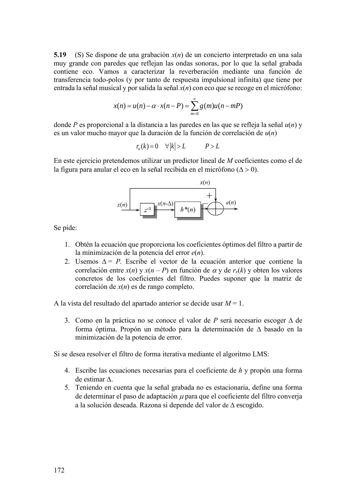

```text
5.19 (S) Se dispone de una grabación x(n) de un concierto interpretado en una sala
muy grande con paredes que reflejan las ondas sonoras, por lo que la señal grabada
contiene eco. Vamos a caracterizar la reverberación mediante una función de
transferencia todo-polos (y por tanto de respuesta impulsional infinita) que tiene por
entrada la señal musical y por salida la señal x(n) con eco que se recoge en el micrófono:
                                                   
                     x(n) = u (n) −   x(n − P) =  g (m)u (n − mP)
                                                   m=0

donde P es proporcional a la distancia a las paredes en las que se refleja la señal u(n) y
es un valor mucho mayor que la duración de la función de correlación de u(n)
                             ru (k ) = 0  k  L         PL
En este ejercicio pretendemos utilizar un predictor lineal de M coeficientes como el de
la figura para anular el eco en la señal recibida en el micrófono (  ).


Se pide:

   1. Obtén la ecuación que proporciona los coeficientes óptimos del filtro a partir de
      la minimización de la potencia del error e(n).
   2. Usemos  = P. Escribe el vector de la ecuación anterior que contiene la
      correlación entre x(n) y x(n – P) en función de  y de rx(k) y obten los valores
      concretos de los coeficientes del filtro. Puedes suponer que la matriz de
      correlación de x(n) es de rango completo.

A la vista del resultado del apartado anterior se decide usar M = 1.

   3. Como en la práctica no se conoce el valor de P será necesario escoger  de
      forma óptima. Propón un método para la determinación de  basado en la
      minimización de la potencia de error.

Si se desea resolver el filtro de forma iterativa mediante el algoritmo LMS:

   4. Escribe las ecuaciones necesarias para el coeficiente de h y propón una forma
      de estimar 
   5. Teniendo en cuenta que la señal grabada no es estacionaria, define una forma
      de determinar el paso de adaptación  para que el coeficiente del filtro converja
      a la solución deseada. Razona si depende del valor de  escogido.


172
```

## Page 57

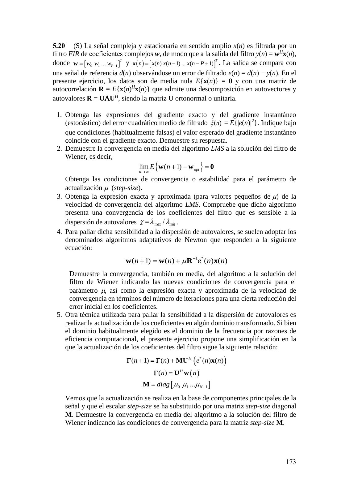

```text
5.20 (S) La señal compleja y estacionaria en sentido amplio x(n) es filtrada por un
filtro FIR de coeficientes complejos w, de modo que a la salida del filtro y(n) = wHx(n),
donde w =  w0 w1 ... wP −1 T y x ( n ) =  x(n) x(n − 1) ... x(n − P + 1)T . La salida se compara con
una señal de referencia d(n) observándose un error de filtrado e(n) = d(n) − y(n). En el
presente ejercicio, los datos son de media nula E{x(n)} = 0 y con una matriz de
autocorrelación R = E{x(n)Hx(n)} que admite una descomposición en autovectores y
autovalores R = UUH, siendo la matriz U ortonormal o unitaria.

 1. Obtenga las expresiones del gradiente exacto y del gradiente instantáneo
    (estocástico) del error cuadrático medio de filtrado  (n) = E{|e(n)|2}. Indique bajo
    que condiciones (habitualmente falsas) el valor esperado del gradiente instantáneo
    coincide con el gradiente exacto. Demuestre su respuesta.
 2. Demuestre la convergencia en media del algoritmo LMS a la solución del filtro de
    Wiener, es decir,
                               lim E w ( n + 1) − w opt  = 0
                                    n →

    Obtenga las condiciones de convergencia o estabilidad para el parámetro de
    actualización  (step-size).
 3. Obtenga la expresión exacta y aproximada (para valores pequeños de ) de la
    velocidad de convergencia del algoritmo LMS. Compruebe que dicho algoritmo
    presenta una convergencia de los coeficientes del filtro que es sensible a la
    dispersión de autovalores  = `max / mín .
 4. Para paliar dicha sensibilidad a la dispersión de autovalores, se suelen adoptar los
    denominados algoritmos adaptativos de Newton que responden a la siguiente
    ecuación:
                               w (n + 1) = w (n) +  R −1e* (n)x(n)
      Demuestre la convergencia, también en media, del algoritmo a la solución del
      filtro de Wiener indicando las nuevas condiciones de convergencia para el
      parámetro , así como la expresión exacta y aproximada de la velocidad de
      convergencia en términos del número de iteraciones para una cierta reducción del
      error inicial en los coeficientes.
 5. Otra técnica utilizada para paliar la sensibilidad a la dispersión de autovalores es
    realizar la actualización de los coeficientes en algún dominio transformado. Si bien
    el dominio habitualmente elegido es el dominio de la frecuencia por razones de
    eficiencia computacional, el presente ejercicio propone una simplificación en la
    que la actualización de los coeficientes del filtro sigue la siguiente relación:
                                (n + 1) =  (n) + MU H ( e* (n)x(n) )
                                            ( n) = U H w ( n )
                                      M = diag  0 1 ... N −1 

     Vemos que la actualización se realiza en la base de componentes principales de la
     señal y que el escalar step-size se ha substituido por una matriz step-size diagonal
     M. Demuestre la convergencia en media del algoritmo a la solución del filtro de
     Wiener indicando las condiciones de convergencia para la matriz step-size M.


                                                                                                   173
```

## Page 58

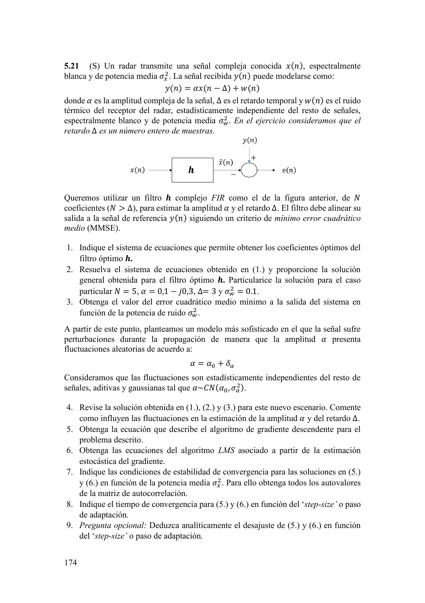

```text
5.21 (S) Un radar transmite una señal compleja conocida 𝑥(𝑛), espectralmente
blanca y de potencia media 𝜎𝑥2 . La señal recibida 𝑦(𝑛) puede modelarse como:
                             𝑦(𝑛) = 𝛼𝑥(𝑛 − ∆) + 𝑤(𝑛)
donde 𝛼 es la amplitud compleja de la señal, ∆ es el retardo temporal y 𝑤(𝑛) es el ruido
térmico del receptor del radar, estadísticamente independiente del resto de señales,
espectralmente blanco y de potencia media 𝜎𝑤2 . En el ejercicio consideramos que el
retardo ∆ es un número entero de muestras.


Queremos utilizar un filtro 𝒉 complejo FIR como el de la figura anterior, de 𝑁
coeficientes (𝑁 > ∆), para estimar la amplitud 𝛼 y el retardo ∆. El filtro debe alinear su
salida a la señal de referencia 𝑦(𝑛) siguiendo un criterio de mínimo error cuadrático
medio (MMSE).

1. Indique el sistema de ecuaciones que permite obtener los coeficientes óptimos del
   filtro óptimo 𝒉.
2. Resuelva el sistema de ecuaciones obtenido en (1.) y proporcione la solución
   general obtenida para el filtro óptimo 𝒉. Particularice la solución para el caso
   particular 𝑁 = 5, 𝛼 = 0,1 − 𝑗0,3, ∆= 3 y 𝜎𝑤2 = 0.1.
3. Obtenga el valor del error cuadrático medio mínimo a la salida del sistema en
   función de la potencia de ruido 𝜎𝑤2 .
A partir de este punto, planteamos un modelo más sofisticado en el que la señal sufre
perturbaciones durante la propagación de manera que la amplitud 𝛼 presenta
fluctuaciones aleatorias de acuerdo a:
                                      𝛼 = 𝛼0 + 𝛿𝛼
Consideramos que las fluctuaciones son estadísticamente independientes del resto de
señales, aditivas y gaussianas tal que 𝛼~𝐶𝑁(𝛼0 , 𝜎𝛼2 ).

4. Revise la solución obtenida en (1.), (2.) y (3.) para este nuevo escenario. Comente
   como influyen las fluctuaciones en la estimación de la amplitud 𝛼 y del retardo ∆.
5. Obtenga la ecuación que describe el algoritmo de gradiente descendente para el
   problema descrito.
6. Obtenga las ecuaciones del algoritmo LMS asociado a partir de la estimación
   estocástica del gradiente.
7. Indique las condiciones de estabilidad de convergencia para las soluciones en (5.)
   y (6.) en función de la potencia media 𝜎𝑥2 . Para ello obtenga todos los autovalores
   de la matriz de autocorrelación.
8. Indique el tiempo de convergencia para (5.) y (6.) en función del ‘step-size’ o paso
   de adaptación.
9. Pregunta opcional: Deduzca analíticamente el desajuste de (5.) y (6.) en función
   del ‘step-size’ o paso de adaptación.


174
```

## Page 59

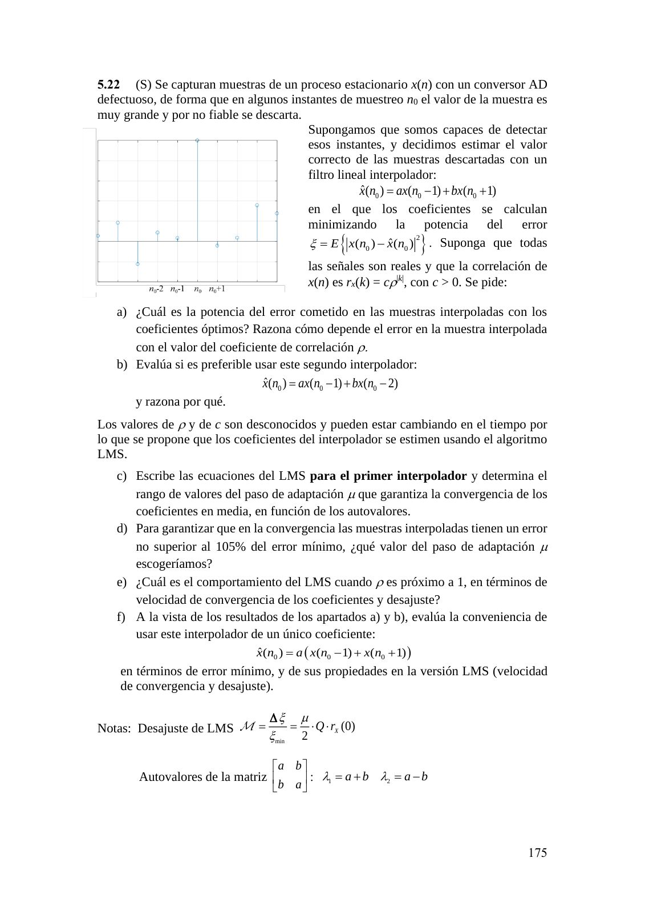

```text
5.22 (S) Se capturan muestras de un proceso estacionario x(n) con un conversor AD
defectuoso, de forma que en algunos instantes de muestreo n0 el valor de la muestra es
muy grande y por no fiable se descarta.
                                        Supongamos que somos capaces de detectar
                                        esos instantes, y decidimos estimar el valor
                                        correcto de las muestras descartadas con un
                                        filtro lineal interpolador:
                                                   xˆ (n0 ) = ax(n0 − 1) + bx(n0 + 1)
                                        en el que los coeficientes se calculan
                                        minimizando la potencia del error
                                                                      
                                         = E x(n0 ) − xˆ (n0 ) . Suponga que todas
                                                                  2


                                          las señales son reales y que la correlación de
                                          x(n) es rx(k) = c|k|, con c > 0. Se pide:

   a) ¿Cuál es la potencia del error cometido en las muestras interpoladas con los
      coeficientes óptimos? Razona cómo depende el error en la muestra interpolada
      con el valor del coeficiente de correlación 
   b) Evalúa si es preferible usar este segundo interpolador:
                               xˆ (n0 ) = ax(n0 − 1) + bx(n0 − 2)
      y razona por qué.
Los valores de  y de c son desconocidos y pueden estar cambiando en el tiempo por
lo que se propone que los coeficientes del interpolador se estimen usando el algoritmo
LMS.
   c) Escribe las ecuaciones del LMS para el primer interpolador y determina el
      rango de valores del paso de adaptación  que garantiza la convergencia de los
      coeficientes en media, en función de los autovalores.
   d) Para garantizar que en la convergencia las muestras interpoladas tienen un error
      no superior al 105% del error mínimo, ¿qué valor del paso de adaptación 
      escogeríamos?
   e) ¿Cuál es el comportamiento del LMS cuando  es próximo a 1, en términos de
      velocidad de convergencia de los coeficientes y desajuste?
   f) A la vista de los resultados de los apartados a) y b), evalúa la conveniencia de
      usar este interpolador de un único coeficiente:
                              xˆ (n0 ) = a ( x(n0 − 1) + x(n0 + 1) )
    en términos de error mínimo, y de sus propiedades en la versión LMS (velocidad
    de convergencia y desajuste).

                                   
Notas: Desajuste de LMS       =        =  Q  rX (0)
                                   min 2

                                a b 
       Autovalores de la matriz      : 1 = a + b 2 = a − b
                                b a 


                                                                                    175
```

## Page 60

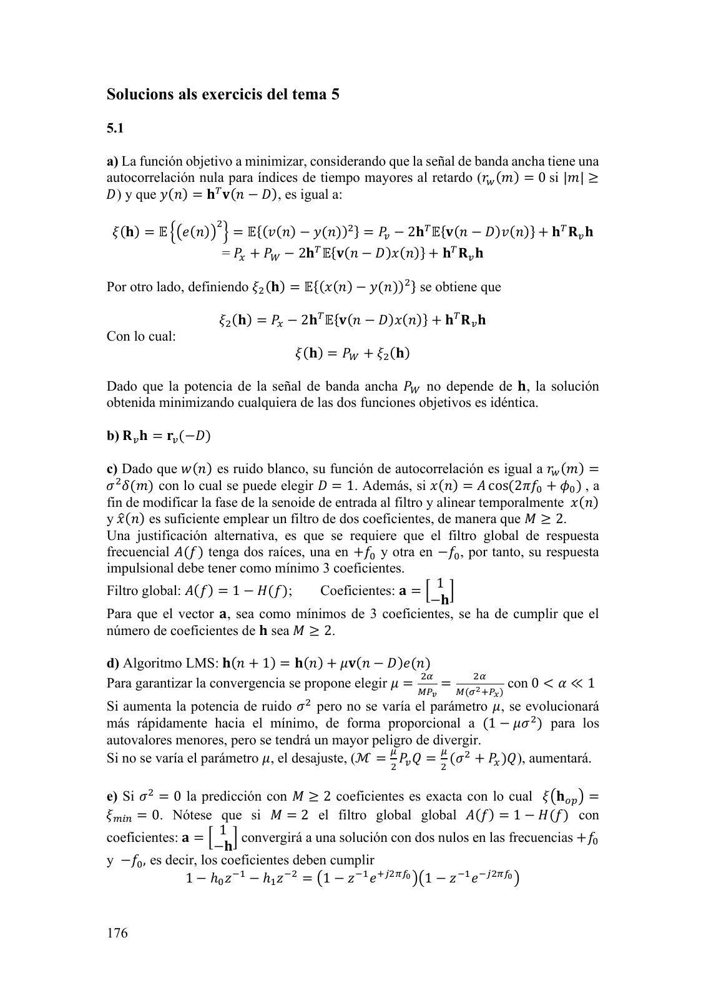

```text
Solucions als exercicis del tema 5

5.1

a) La función objetivo a minimizar, considerando que la señal de banda ancha tiene una
autocorrelación nula para índices de tiempo mayores al retardo (𝑟𝑤 (𝑚) = 0 si |𝑚| ≥
𝐷) y que 𝑦(𝑛) = 𝐡𝑇 𝐯(𝑛 − 𝐷), es igual a:
                     2
 𝜉(𝐡) = 𝔼 {(𝑒(𝑛)) } = 𝔼{(𝑣(𝑛) − 𝑦(𝑛))2 } = 𝑃𝑣 − 2𝐡𝑇 𝔼{𝐯(𝑛 − 𝐷)𝑣(𝑛)} + 𝐡𝑇 𝐑 𝑣 𝐡
                  = 𝑃𝑥 + 𝑃𝑊 − 2𝐡𝑇 𝔼{𝐯(𝑛 − 𝐷)𝑥(𝑛)} + 𝐡𝑇 𝐑 𝑣 𝐡

Por otro lado, definiendo 𝜉2 (𝐡) = 𝔼{(𝑥(𝑛) − 𝑦(𝑛))2 } se obtiene que

                     𝜉2 (𝐡) = 𝑃𝑥 − 2𝐡𝑇 𝔼{𝐯(𝑛 − 𝐷)𝑥(𝑛)} + 𝐡𝑇 𝐑 𝑣 𝐡
Con lo cual:
                                 𝜉(𝐡) = 𝑃𝑊 + 𝜉2 (𝐡)

Dado que la potencia de la señal de banda ancha 𝑃𝑊 no depende de 𝐡, la solución
obtenida minimizando cualquiera de las dos funciones objetivos es idéntica.

b) 𝐑 𝑣 𝐡 = 𝐫𝑣 (−𝐷)

c) Dado que 𝑤(𝑛) es ruido blanco, su función de autocorrelación es igual a 𝑟𝑤 (𝑚) =
𝜎 2 𝛿(𝑚) con lo cual se puede elegir 𝐷 = 1. Además, si 𝑥(𝑛) = 𝐴 cos(2𝜋𝑓0 + 𝜙0 ) , a
fin de modificar la fase de la senoide de entrada al filtro y alinear temporalmente 𝑥(𝑛)
y 𝑥̂(𝑛) es suficiente emplear un filtro de dos coeficientes, de manera que 𝑀 ≥ 2.
Una justificación alternativa, es que se requiere que el filtro global de respuesta
frecuencial 𝐴(𝑓) tenga dos raíces, una en +𝑓0 y otra en −𝑓0 , por tanto, su respuesta
impulsional debe tener como mínimo 3 coeficientes.
                                                              1
Filtro global: 𝐴(𝑓) = 1 − 𝐻(𝑓);        Coeficientes: 𝐚 = [ ]
                                                             −𝐡
Para que el vector 𝐚, sea como mínimos de 3 coeficientes, se ha de cumplir que el
número de coeficientes de 𝐡 sea 𝑀 ≥ 2.

d) Algoritmo LMS: 𝐡(𝑛 + 1) = 𝐡(𝑛) + 𝜇𝐯(𝑛 − 𝐷)𝑒(𝑛)
                                                      2𝛼      2𝛼
Para garantizar la convergencia se propone elegir 𝜇 = 𝑀𝑃 = 𝑀(𝜎2 +𝑃 ) con 0 < 𝛼 ≪ 1
                                                          𝑣          𝑥
Si aumenta la potencia de ruido 𝜎 2 pero no se varía el parámetro 𝜇, se evolucionará
más rápidamente hacia el mínimo, de forma proporcional a (1 − 𝜇𝜎 2 ) para los
autovalores menores, pero se tendrá un mayor peligro de divergir.
                                                  𝜇        𝜇
Si no se varía el parámetro 𝜇, el desajuste, (ℳ = 2 𝑃𝑣 𝑄 = 2 (𝜎 2 + 𝑃𝑥 )𝑄), aumentará.

e) Si 𝜎 2 = 0 la predicción con 𝑀 ≥ 2 coeficientes es exacta con lo cual 𝜉(𝐡𝑜𝑝 ) =
𝜉𝑚𝑖𝑛 = 0. Nótese que si 𝑀 = 2 el filtro global global 𝐴(𝑓) = 1 − 𝐻(𝑓) con
                     1
coeficientes: 𝐚 = [ ] convergirá a una solución con dos nulos en las frecuencias +𝑓0
                    −𝐡
y −𝑓0 , es decir, los coeficientes deben cumplir
              1 − ℎ0 𝑧 −1 − ℎ1 𝑧 −2 = (1 − 𝑧 −1 𝑒 +𝑗2𝜋𝑓0 )(1 − 𝑧 −1 𝑒 −𝑗2𝜋𝑓0 )


176
```

## Page 61

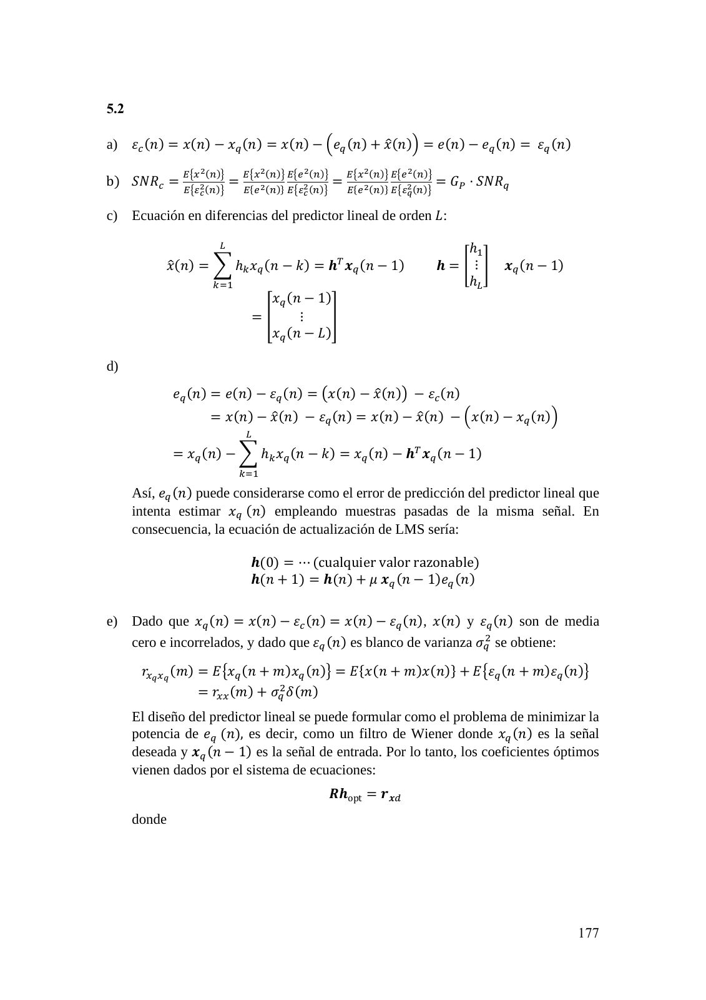

```text
5.2

a)    𝜀𝑐 (𝑛) = 𝑥(𝑛) − 𝑥𝑞 (𝑛) = 𝑥(𝑛) − (𝑒𝑞 (𝑛) + 𝑥̂(𝑛)) = 𝑒(𝑛) − 𝑒𝑞 (𝑛) = 𝜀𝑞 (𝑛)

               𝐸{𝑥 2 (𝑛)}   𝐸{𝑥 2 (𝑛)} 𝐸{𝑒 2 (𝑛)}     𝐸{𝑥 2 (𝑛)} 𝐸{𝑒 2 (𝑛)}
b) 𝑆𝑁𝑅𝑐 = 𝐸{𝜀2(𝑛)} = 𝐸{𝑒 2(𝑛)} 𝐸{𝜀2(𝑛)} = 𝐸{𝑒 2(𝑛)} 𝐸{𝜀2 (𝑛)} = 𝐺𝑃 · 𝑆𝑁𝑅𝑞
                  𝑐                       𝑐                         𝑞

c)    Ecuación en diferencias del predictor lineal de orden 𝐿:

                       𝐿                                                         ℎ1
            𝑥̂(𝑛) = ∑ ℎ𝑘 𝑥𝑞 (𝑛 − 𝑘) = 𝒉𝑇 𝒙𝑞 (𝑛 − 1)                           𝒉=[⋮]   𝒙𝑞 (𝑛 − 1)
                      𝑘=1                                                        ℎ𝐿
                                    𝑥𝑞 (𝑛 − 1)
                                 =[      ⋮     ]
                                    𝑥𝑞 (𝑛 − 𝐿)

d)
              𝑒𝑞 (𝑛) = 𝑒(𝑛) − 𝜀𝑞 (𝑛) = (𝑥(𝑛) − 𝑥̂(𝑛)) − 𝜀𝑐 (𝑛)
                      = 𝑥(𝑛) − 𝑥̂(𝑛) − 𝜀𝑞 (𝑛) = 𝑥(𝑛) − 𝑥̂(𝑛) − (𝑥(𝑛) − 𝑥𝑞 (𝑛))
                             𝐿

              = 𝑥𝑞 (𝑛) − ∑ ℎ𝑘 𝑥𝑞 (𝑛 − 𝑘) = 𝑥𝑞 (𝑛) − 𝒉𝑇 𝒙𝑞 (𝑛 − 1)
                            𝑘=1

      Así, 𝑒𝑞 (𝑛) puede considerarse como el error de predicción del predictor lineal que
      intenta estimar 𝑥𝑞 (𝑛) empleando muestras pasadas de la misma señal. En
      consecuencia, la ecuación de actualización de LMS sería:

                             𝒉(0) = ⋯ (cualquier valor razonable)
                             𝒉(𝑛 + 1) = 𝒉(𝑛) + 𝜇 𝒙𝑞 (𝑛 − 1)𝑒𝑞 (𝑛)

e)    Dado que 𝑥𝑞 (𝑛) = 𝑥(𝑛) − 𝜀𝑐 (𝑛) = 𝑥(𝑛) − 𝜀𝑞 (𝑛), 𝑥(𝑛) y 𝜀𝑞 (𝑛) son de media
      cero e incorrelados, y dado que 𝜀𝑞 (𝑛) es blanco de varianza 𝜎𝑞2 se obtiene:

       𝑟𝑥𝑞𝑥𝑞 (𝑚) = 𝐸{𝑥𝑞 (𝑛 + 𝑚)𝑥𝑞 (𝑛)} = 𝐸{𝑥(𝑛 + 𝑚)𝑥(𝑛)} + 𝐸{𝜀𝑞 (𝑛 + 𝑚)𝜀𝑞 (𝑛)}
                 = 𝑟𝑥𝑥 (𝑚) + 𝜎𝑞2 𝛿(𝑚)
      El diseño del predictor lineal se puede formular como el problema de minimizar la
      potencia de 𝑒𝑞 (𝑛), es decir, como un filtro de Wiener donde 𝑥𝑞 (𝑛) es la señal
      deseada y 𝒙𝑞 (𝑛 − 1) es la señal de entrada. Por lo tanto, los coeficientes óptimos
      vienen dados por el sistema de ecuaciones:
                                                    𝑹𝒉opt = 𝒓𝒙𝑑
      donde


                                                                                                   177
```

## Page 62

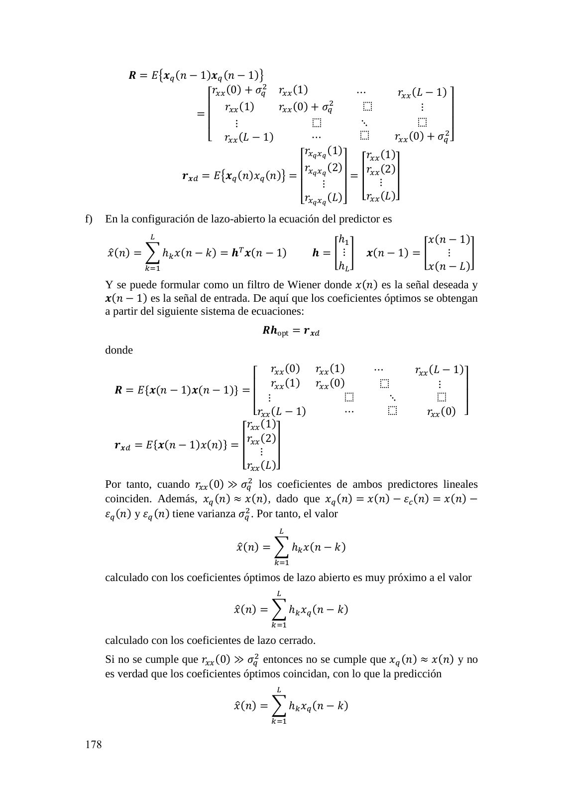

```text
           𝑹 = 𝐸{𝒙𝑞 (𝑛 − 1)𝒙𝑞 (𝑛 − 1)}
                           𝑟𝑥𝑥 (0) + 𝜎𝑞2 𝑟𝑥𝑥 (1)              ⋯           𝑟𝑥𝑥 (𝐿 − 1)
                              𝑟𝑥𝑥 (1)    𝑟𝑥𝑥 (0) + 𝜎𝑞2         ⬚                ⋮
                        =
                                 ⋮               ⬚            ⋱                ⬚
                          [ 𝑟𝑥𝑥 (𝐿 − 1)          ⋯            ⬚          𝑟𝑥𝑥 (0) + 𝜎𝑞2 ]
                                               𝑟𝑥𝑞𝑥𝑞 (1)      𝑟𝑥𝑥 (1)
                                               𝑟     (2)      𝑟 (2)
                       𝒓𝒙𝑑 = 𝐸{𝒙𝑞 (𝑛)𝑥𝑞 (𝑛)} = 𝑥𝑞𝑥𝑞        = [ 𝑥𝑥 ]
                                                   ⋮             ⋮
                                              [𝑟𝑥 𝑥  (𝐿)
                                                    𝑞 𝑞  ]    𝑟𝑥𝑥 (𝐿)

f)    En la configuración de lazo-abierto la ecuación del predictor es
                𝐿                                      ℎ1                        𝑥(𝑛 − 1)
      𝑥̂(𝑛) = ∑ ℎ𝑘 𝑥(𝑛 − 𝑘) = 𝒉𝑇 𝒙(𝑛 − 1)           𝒉=[⋮]       𝒙(𝑛 − 1) = [         ⋮    ]
              𝑘=1                                      ℎ𝐿                        𝑥(𝑛 − 𝐿)
      Y se puede formular como un filtro de Wiener donde 𝑥(𝑛) es la señal deseada y
      𝒙(𝑛 − 1) es la señal de entrada. De aquí que los coeficientes óptimos se obtengan
      a partir del siguiente sistema de ecuaciones:
                                         𝑹𝒉opt = 𝒓𝒙𝑑
      donde
                                        𝑟𝑥𝑥 (0) 𝑟𝑥𝑥 (1)            ⋯          𝑟𝑥𝑥 (𝐿 − 1)
                                        𝑟𝑥𝑥 (1) 𝑟𝑥𝑥 (0)             ⬚               ⋮
        𝑹 = 𝐸{𝒙(𝑛 − 1)𝒙(𝑛 − 1)} =
                                       ⋮               ⬚             ⋱             ⬚
                                   [𝑟𝑥𝑥 (𝐿 − 1)        ⋯             ⬚           𝑟𝑥𝑥 (0) ]
                                 𝑟𝑥𝑥 (1)
                                 𝑟 (2)
        𝒓𝒙𝑑 = 𝐸{𝒙(𝑛 − 1)𝑥(𝑛)} = [ 𝑥𝑥 ]
                                     ⋮
                                 𝑟𝑥𝑥 (𝐿)
      Por tanto, cuando 𝑟𝑥𝑥 (0) ≫ 𝜎𝑞2 los coeficientes de ambos predictores lineales
      coinciden. Además, 𝑥𝑞 (𝑛) ≈ 𝑥(𝑛), dado que 𝑥𝑞 (𝑛) = 𝑥(𝑛) − 𝜀𝑐 (𝑛) = 𝑥(𝑛) −
      𝜀𝑞 (𝑛) y 𝜀𝑞 (𝑛) tiene varianza 𝜎𝑞2 . Por tanto, el valor
                                            𝐿

                                   𝑥̂(𝑛) = ∑ ℎ𝑘 𝑥(𝑛 − 𝑘)
                                           𝑘=1

      calculado con los coeficientes óptimos de lazo abierto es muy próximo a el valor
                                            𝐿

                                  𝑥̂(𝑛) = ∑ ℎ𝑘 𝑥𝑞 (𝑛 − 𝑘)
                                           𝑘=1

      calculado con los coeficientes de lazo cerrado.
      Si no se cumple que 𝑟𝑥𝑥 (0) ≫ 𝜎𝑞2 entonces no se cumple que 𝑥𝑞 (𝑛) ≈ 𝑥(𝑛) y no
      es verdad que los coeficientes óptimos coincidan, con lo que la predicción
                                            𝐿

                                  𝑥̂(𝑛) = ∑ ℎ𝑘 𝑥𝑞 (𝑛 − 𝑘)
                                           𝑘=1


178
```

## Page 63

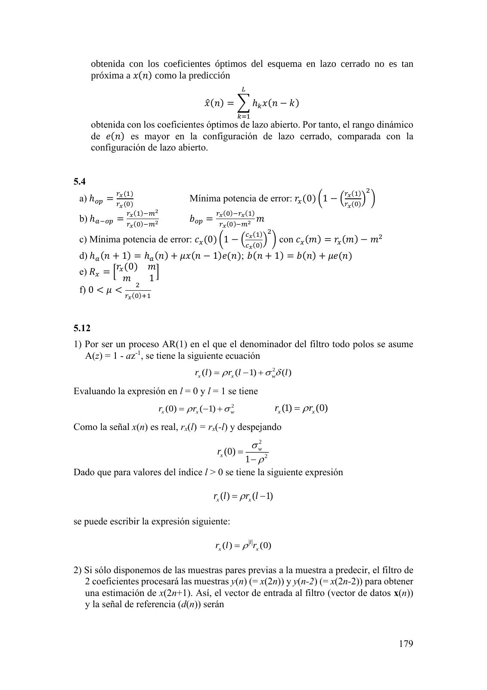

```text
       obtenida con los coeficientes óptimos del esquema en lazo cerrado no es tan
       próxima a 𝑥(𝑛) como la predicción
                                                     𝐿

                                       𝑥̂(𝑛) = ∑ ℎ𝑘 𝑥(𝑛 − 𝑘)
                                                    𝑘=1
       obtenida con los coeficientes óptimos de lazo abierto. Por tanto, el rango dinámico
       de 𝑒(𝑛) es mayor en la configuración de lazo cerrado, comparada con la
       configuración de lazo abierto.


5.4
             𝑟 (1)                                                                     𝑟 (1) 2
 a) ℎ𝑜𝑝 = 𝑟𝑥 (0)                  Mínima potencia de error: 𝑟𝑥 (0) (1 − (𝑟𝑥 (0)) )
              𝑥                                                                        𝑥
            𝑟 (1)−𝑚2                𝑟 (0)−𝑟𝑥 (1)
 b) ℎ𝑎−𝑜𝑝 = 𝑟𝑥 (0)−𝑚2       𝑏𝑜𝑝 = 𝑥𝑟 (0)−𝑚    2 𝑚
             𝑥                        𝑥
                                             𝑐 (1) 2
 c) Mínima potencia de error: 𝑐𝑥 (0) (1 − (𝑐𝑥 (0)) ) con 𝑐𝑥 (𝑚) = 𝑟𝑥 (𝑚) − 𝑚2
                                                         𝑥
 d) ℎ𝑎 (𝑛 + 1) = ℎ𝑎 (𝑛) + 𝜇𝑥(𝑛 − 1)𝑒(𝑛); 𝑏(𝑛 + 1) = 𝑏(𝑛) + 𝜇𝑒(𝑛)
           𝑟 (0) 𝑚
 e) 𝑅𝑥 = [ 𝑥         ]
             𝑚     1
                2
 f) 0 < 𝜇 < 𝑟 (0)+1
                  𝑥


5.12
1) Por ser un proceso AR(1) en el que el denominador del filtro todo polos se asume
   A(z) = 1 - az-1, se tiene la siguiente ecuación
                                    rx (l ) =  rx (l − 1) +  w2 (l )

Evaluando la expresión en l = 0 y l = 1 se tiene
                        rx (0) =  rx (−1) +  w2                  rx (1) =  rx (0)
Como la señal x(n) es real, rx(l) = rx(-l) y despejando
                                                         w2
                                            rx (0) =
                                                       1−  2
Dado que para valores del índice l > 0 se tiene la siguiente expresión

                                          rx (l ) =  rx (l − 1)

se puede escribir la expresión siguiente:

                                           rx (l ) =  rx (0)
                                                         l


2) Si sólo disponemos de las muestras pares previas a la muestra a predecir, el filtro de
   2 coeficientes procesará las muestras y(n) (= x(2n)) y y(n-2) (= x(2n-2)) para obtener
   una estimación de x(2n+1). Así, el vector de entrada al filtro (vector de datos x(n))
   y la señal de referencia (d(n)) serán


                                                                                                 179
```

## Page 64

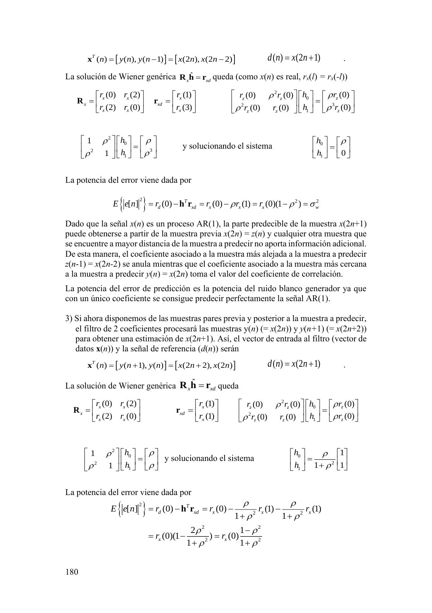

```text
       xT (n) =  y (n), y (n − 1)  =  x(2n), x(2n − 2)                        d (n) = x(2n + 1)               .

La solución de Wiener genérica R xhˆ = rxd queda (como x(n) es real, rx(l) = rx(-l))

         r (0) rx (2)                   r (1)                 rz (0)                            rz (0) 
                                                                                   2 rz (0)   h0 
   Rx =  x                       rxd =  x                     2                        =  3          
         rx (2) rx (0)                  rx (3)                 rz (0)        rz (0)   h1    rz (0) 


      1               
             2   h0                                                                                   h0    
       2        =  3                   y solucionando el sistema                                   h  =  0 
          1   h1                                                                                  1  


La potencia del error viene dada por

                  
                E e[n]
                            2
                                 = r (0) − h r = r (0) −  r (1) = r (0)(1 −  ) = 
                                    d
                                              T
                                                   xd    x         x          x
                                                                                             2           2
                                                                                                         w


Dado que la señal x(n) es un proceso AR(1), la parte predecible de la muestra x(2n+1)
puede obtenerse a partir de la muestra previa x(2n) = z(n) y cualquier otra muestra que
se encuentre a mayor distancia de la muestra a predecir no aporta información adicional.
De esta manera, el coeficiente asociado a la muestra más alejada a la muestra a predecir
z(n-1) = x(2n-2) se anula mientras que el coeficiente asociado a la muestra más cercana
a la muestra a predecir y(n) = x(2n) toma el valor del coeficiente de correlación.
La potencia del error de predicción es la potencia del ruido blanco generador ya que
con un único coeficiente se consigue predecir perfectamente la señal AR(1).

3) Si ahora disponemos de las muestras pares previa y posterior a la muestra a predecir,
   el filtro de 2 coeficientes procesará las muestras y(n) (= x(2n)) y y(n+1) (= x(2n+2))
   para obtener una estimación de x(2n+1). Así, el vector de entrada al filtro (vector de
   datos x(n)) y la señal de referencia (d(n)) serán
       xT (n) =  y (n + 1), y (n)  =  x(2n + 2), x(2n)                        d (n) = x(2n + 1)               .

La solución de Wiener genérica R x hˆ = rxd queda

        r (0) rx (2)                            r (1)           rz (0)                             rz (0) 
                                                                                     2 rz (0)   h0 
  Rx =  x                                rxd =  x               2                         =             
        rx (2) rx (0)                           rx (1)           rz (0)         rz (0)   h1    rz (0) 


      1      2   h0                                                                 h0       1
       2          =   y solucionando el sistema                                       h  = 1 +  2 1
            1   h1                                                                  1             


La potencia del error viene dada por

                  
               E e[n]
                            2
                                 = r (0) − h r = r (0) − 1 + r (1) − 1 + r (1)
                                    d
                                               T
                                                    xd       x          2     x                  2   x


                                               2 2             1−  2
                                 = rx (0)(1 −        ) = rx (0)
                                              1+  2            1+  2


180
```

## Page 65

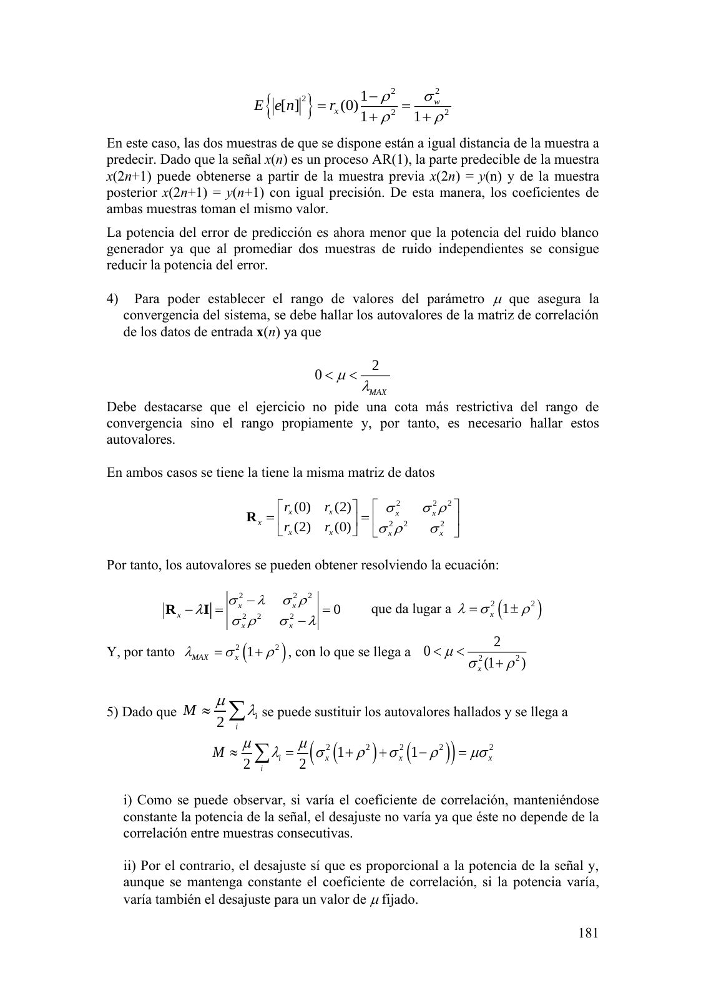

```text
                                    
                                E e[n]
                                         2
                                                = rx (0)
                                                          1−  2
                                                                 =
                                                                    w2
                                                          1+  2 1+  2
En este caso, las dos muestras de que se dispone están a igual distancia de la muestra a
predecir. Dado que la señal x(n) es un proceso AR(1), la parte predecible de la muestra
x(2n+1) puede obtenerse a partir de la muestra previa x(2n) = y(n) y de la muestra
posterior x(2n+1) = y(n+1) con igual precisión. De esta manera, los coeficientes de
ambas muestras toman el mismo valor.
La potencia del error de predicción es ahora menor que la potencia del ruido blanco
generador ya que al promediar dos muestras de ruido independientes se consigue
reducir la potencia del error.

4)     Para poder establecer el rango de valores del parámetro  que asegura la
     convergencia del sistema, se debe hallar los autovalores de la matriz de correlación
     de los datos de entrada x(n) ya que

                                                          2
                                                 0 
                                                         MAX
Debe destacarse que el ejercicio no pide una cota más restrictiva del rango de
convergencia sino el rango propiamente y, por tanto, es necesario hallar estos
autovalores.

En ambos casos se tiene la tiene la misma matriz de datos

                                    r (0) rx (2)    x2           x2  2 
                              Rx =  x             = 2 2                   
                                    rx (2) rx (0)   x            x2 

Por tanto, los autovalores se pueden obtener resolviendo la ecuación:

                       x2 −   x2  2
            R x − I = 2 2              =0                que da lugar a  =  x2 (1   2 )
                      x       x2 − 

Y, por tanto MAX =  x2 (1 +  2 ) , con lo que se llega a 0   
                                                                                     2
                                                                                  (1 +  2 )
                                                                                   2
                                                                                   x


                     
5) Dado que M 
                     2
                           se puede sustituir los autovalores hallados y se llega a
                          i
                                i


                                     
                     M         
                              2 i
                                             (                             )
                                  i =  x2 (1 +  2 ) +  x2 (1 −  2 ) =  x2
                                      2

     i) Como se puede observar, si varía el coeficiente de correlación, manteniéndose
     constante la potencia de la señal, el desajuste no varía ya que éste no depende de la
     correlación entre muestras consecutivas.

     ii) Por el contrario, el desajuste sí que es proporcional a la potencia de la señal y,
     aunque se mantenga constante el coeficiente de correlación, si la potencia varía,
     varía también el desajuste para un valor de  fijado.

                                                                                                181
```

## Page 66

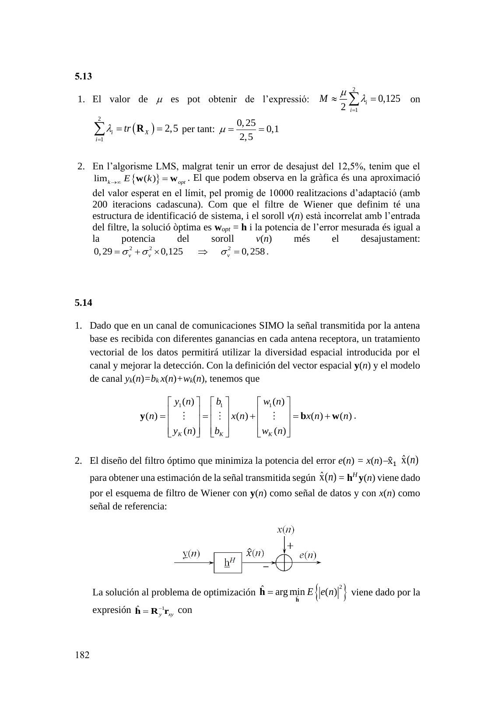

```text
5.13
                                                                                     2
1. El valor de  es pot obtenir de l’expressió:                                M      i = 0,125 on
                                                                                    2 i =1
        2

         = tr ( R ) = 2,5 per tant:  = 2,5 = 0,1
                                                  0, 25
              i     X
       i =1


2. En l’algorisme LMS, malgrat tenir un error de desajust del 12,5%, tenim que el
   lim k → E w (k ) = w opt . El que podem observa en la gràfica és una aproximació
       del valor esperat en el límit, pel promig de 10000 realitzacions d’adaptació (amb
       200 iteracions cadascuna). Com que el filtre de Wiener que definim té una
       estructura de identificació de sistema, i el soroll v(n) està incorrelat amb l’entrada
       del filtre, la solució òptima es wopt = h i la potencia de l’error mesurada és igual a
       la       potencia        del    soroll      v(n)      més       el      desajustament:
        0, 29 =  v +  v  0,125
                  2     2
                                      v = 0, 258 .
                                           2


5.14

1. Dado que en un canal de comunicaciones SIMO la señal transmitida por la antena
   base es recibida con diferentes ganancias en cada antena receptora, un tratamiento
   vectorial de los datos permitirá utilizar la diversidad espacial introducida por el
   canal y mejorar la detección. Con la definición del vector espacial y(n) y el modelo
   de canal yk(n)=bk x(n)+wk(n), tenemos que

                             y1 (n)   b1            w1 (n) 
                            
                   y ( n) =                                  = bx ( n ) + w ( n ) .
                                       =   x ( n) +          
                             yK (n)  bK         wK (n) 


2. El diseño del filtro óptimo que minimiza la potencia del error e(n) = x(n)−x̂1 x̂(n)
   para obtener una estimación de la señal transmitida según x̂(n) = hH y(n) viene dado
   por el esquema de filtro de Wiener con y(n) como señal de datos y con x(n) como
   señal de referencia:


       La solución al problema de optimización hˆ = arg min
                                                         ˆ
                                                                  2
                                                                           
                                                            E e(n) viene dado por la
                                                                     h
                                                                                    
       expresión hˆ = R r con
                         −1
                         y xy


182
```

## Page 67

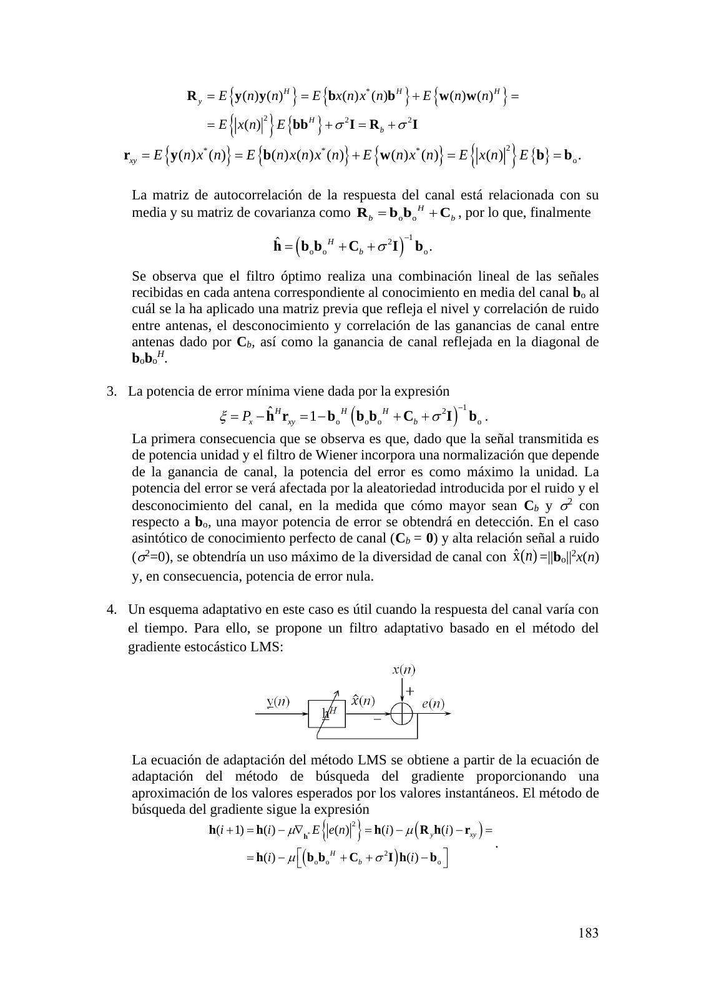

```text
              R y = E y (n)y (n) H  = E bx(n) x* (n)b H  + E w (n)w (n) H  =

                      
                  = E x ( n)
                               2
                                    E bb  +  I = R +  I
                                           H           2
                                                                    b
                                                                          2


  rxy = E y (n) x* (n) = E b(n) x(n) x* (n) + E w (n) x* (n) = E x (n)                      2
                                                                                                        E b = b .
                                                                                                                  o


    La matriz de autocorrelación de la respuesta del canal está relacionada con su
    media y su matriz de covarianza como R b = b ob o H + Cb , por lo que, finalmente

                                   hˆ = ( b ob o H + Cb +  2I ) b o .
                                                                −1


    Se observa que el filtro óptimo realiza una combinación lineal de las señales
    recibidas en cada antena correspondiente al conocimiento en media del canal bo al
    cuál se la ha aplicado una matriz previa que refleja el nivel y correlación de ruido
    entre antenas, el desconocimiento y correlación de las ganancias de canal entre
    antenas dado por Cb, así como la ganancia de canal reflejada en la diagonal de
    boboH.

3. La potencia de error mínima viene dada por la expresión
                                                           (                          )
                                                            −1
                    = P − hˆ H r = 1 − b H b b H + C +  2I b .
                          x           xy           o            o   o         b                o

    La primera consecuencia que se observa es que, dado que la señal transmitida es
    de potencia unidad y el filtro de Wiener incorpora una normalización que depende
    de la ganancia de canal, la potencia del error es como máximo la unidad. La
    potencia del error se verá afectada por la aleatoriedad introducida por el ruido y el
    desconocimiento del canal, en la medida que cómo mayor sean Cb y 2 con
    respecto a bo, una mayor potencia de error se obtendrá en detección. En el caso
    asintótico de conocimiento perfecto de canal (Cb = 0) y alta relación señal a ruido
    (2=0), se obtendría un uso máximo de la diversidad de canal con x̂(n) =||bo||2x(n)
    y, en consecuencia, potencia de error nula.

4. Un esquema adaptativo en este caso es útil cuando la respuesta del canal varía con
   el tiempo. Para ello, se propone un filtro adaptativo basado en el método del
   gradiente estocástico LMS:


    La ecuación de adaptación del método LMS se obtiene a partir de la ecuación de
    adaptación del método de búsqueda del gradiente proporcionando una
    aproximación de los valores esperados por los valores instantáneos. El método de
    búsqueda del gradiente sigue la expresión
                                               
                  h(i + 1) = h(i ) − h* E e(n)
                                                           2
                                                                = h(i) −  ( R h(i) − r ) = .
                                                                                  y       xy


                          = h(i ) −  ( bo bo H + Cb +  2 I ) h(i) − b o 


                                                                                                                      183
```

## Page 68

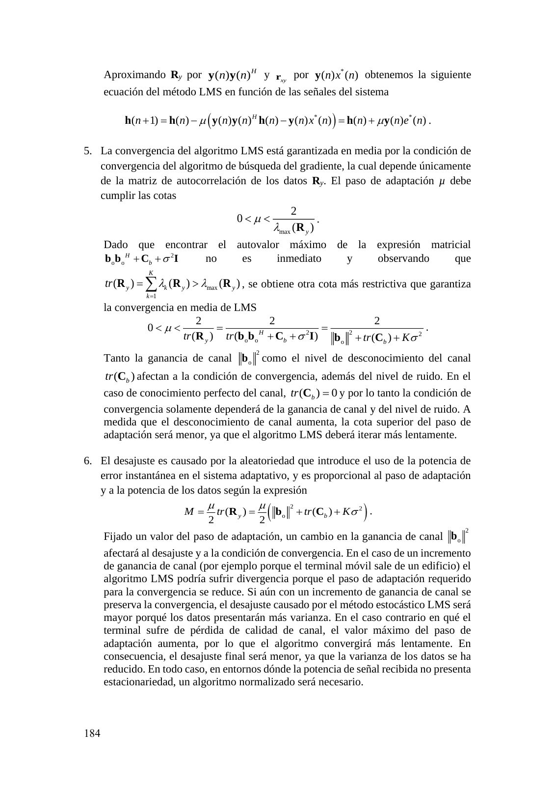

```text
      Aproximando Ry por y (n)y (n) H y rxy por y (n) x* (n) obtenemos la siguiente
      ecuación del método LMS en función de las señales del sistema

          h(n + 1) = h(n) −  ( y (n)y ( n) H h(n) − y ( n) x* ( n) ) = h( n) +  y ( n)e* ( n) .

5. La convergencia del algoritmo LMS está garantizada en media por la condición de
   convergencia del algoritmo de búsqueda del gradiente, la cual depende únicamente
   de la matriz de autocorrelación de los datos Ry. El paso de adaptación µ debe
   cumplir las cotas
                                            2
                                0                .
                                        max (R y )
      Dado que encontrar el autovalor máximo de la expresión matricial
      b o b o H + Cb +  2 I no es  inmediato  y   observando     que
                K
      tr (R y ) =  k (R y )  max (R y ) , se obtiene otra cota más restrictiva que garantiza
                k =1
      la convergencia en media de LMS
                           2                 2                     2
               0             =                       =                      .
                       tr (R y ) tr (b ob o + Cb +  I ) b o + tr (Cb ) + K 2
                                           H        2       2


                                               2
      Tanto la ganancia de canal b o como el nivel de desconocimiento del canal
      tr (Cb ) afectan a la condición de convergencia, además del nivel de ruido. En el
      caso de conocimiento perfecto del canal, tr (Cb ) = 0 y por lo tanto la condición de
      convergencia solamente dependerá de la ganancia de canal y del nivel de ruido. A
      medida que el desconocimiento de canal aumenta, la cota superior del paso de
      adaptación será menor, ya que el algoritmo LMS deberá iterar más lentamente.

6. El desajuste es causado por la aleatoriedad que introduce el uso de la potencia de
   error instantánea en el sistema adaptativo, y es proporcional al paso de adaptación
   y a la potencia de los datos según la expresión
                            
                       M = tr (R y ) =
                                 2
                                        
                                                       (
                                           b o + tr (Cb ) + K 2 .
                                              2

                                                   2
                                                                             )
                                                                                                    2
      Fijado un valor del paso de adaptación, un cambio en la ganancia de canal b o
      afectará al desajuste y a la condición de convergencia. En el caso de un incremento
      de ganancia de canal (por ejemplo porque el terminal móvil sale de un edificio) el
      algoritmo LMS podría sufrir divergencia porque el paso de adaptación requerido
      para la convergencia se reduce. Si aún con un incremento de ganancia de canal se
      preserva la convergencia, el desajuste causado por el método estocástico LMS será
      mayor porqué los datos presentarán más varianza. En el caso contrario en qué el
      terminal sufre de pérdida de calidad de canal, el valor máximo del paso de
      adaptación aumenta, por lo que el algoritmo convergirá más lentamente. En
      consecuencia, el desajuste final será menor, ya que la varianza de los datos se ha
      reducido. En todo caso, en entornos dónde la potencia de señal recibida no presenta
      estacionariedad, un algoritmo normalizado será necesario.


184
```

## Page 69

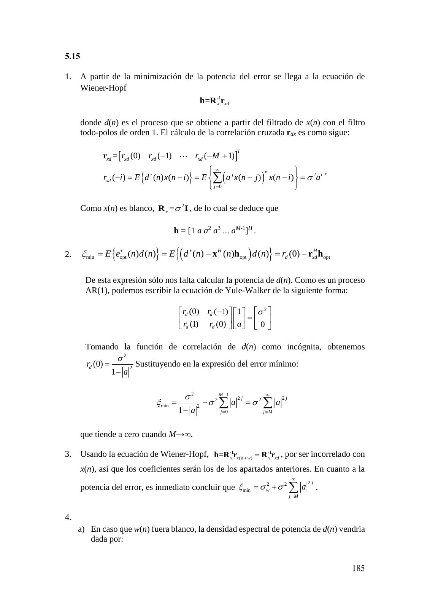

```text
5.15

1.     A partir de la minimización de la potencia del error se llega a la ecuación de
       Wiener-Hopf
                                       h =R -1x rxd

       donde d(n) es el proceso que se obtiene a partir del filtrado de x(n) con el filtro
       todo-polos de orden 1. El cálculo de la correlación cruzada rdx es como sigue:

              rxd =  rxd (0) rxd ( −1)            rxd ( − M + 1) 
                                                                     T


                                                                                 
              rxd (−i ) = E d  (n) x(n − i ) = E  ( a j x(n − j ) ) x(n − i )  =  2a i *
                                                                        


                                                     j =0                         

       Como x(n) es blanco, R x = 2 I , de lo cual se deduce que

                                          h = [1 a a2 a3 ... aM-1]H .

2.      min = E eopt
                   
                                                                                 
                       (n)d (n) = E ( d  (n) − x H (n)h opt ) d (n) = rd (0) − rxdH h opt

        De esta expresión sólo nos falta calcular la potencia de d(n). Como es un proceso
        AR(1), podemos escribir la ecuación de Yule-Walker de la siguiente forma:

                                            rd (0) rd (−1)   1   2 
                                            r (1) r (0)   a  =  
                                            d        d        0 

        Tomando la función de correlación de d(n) como incógnita, obtenemos
                     2
         rd (0) =          Sustituyendo en la expresión del error mínimo:
                    1− a
                         2


                                              2              M −1               
                                  min =               −  a             =  a
                                                          2          2j     2          2j

                                           1− a
                                                   2
                                                              j =0              j =M


       que tiende a cero cuando M→.

3.     Usando la ecuación de Wiener-Hopf, h =R -1x rx ( d + w) = R -1x rxd , por ser incorrelado con
       x(n), así que los coeficientes serán los de los apartados anteriores. En cuanto a la
                                                                                             
       potencia del error, es inmediato concluir que  min =  w2 +  2  a
                                                                                                   2j
                                                                                                        .
                                                                                            j =M


4.
     a) En caso que w(n) fuera blanco, la densidad espectral de potencia de d(n) vendria
        dada por:


                                                                                                            185
```

## Page 70

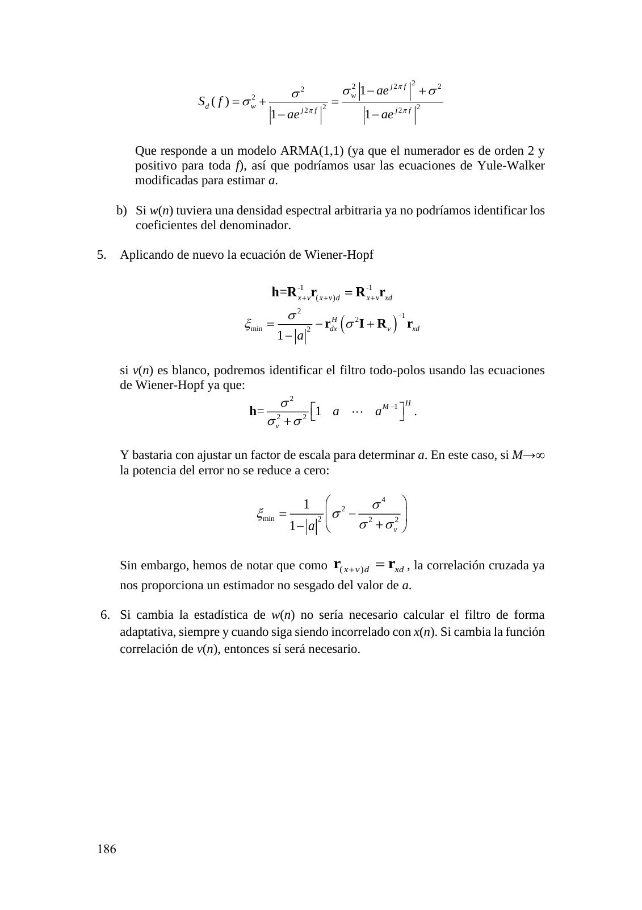

```text
                                                                                        2
                                               2                 w2 1 − ae j 2 f +  2
                     Sd ( f ) =  w2 +                   2
                                                             =                              2
                                         1 − ae j 2 f                 1 − ae j 2 f

        Que responde a un modelo ARMA(1,1) (ya que el numerador es de orden 2 y
        positivo para toda f), así que podríamos usar las ecuaciones de Yule-Walker
        modificadas para estimar a.

     b) Si w(n) tuviera una densidad espectral arbitraria ya no podríamos identificar los
        coeficientes del denominador.

5.    Aplicando de nuevo la ecuación de Wiener-Hopf

                                         h =R -1x + vr( x + v ) d = R -1x + vrxd
                                             2
                                                        − rdxH ( 2I + R v ) rxd
                                                                                   −1
                                 min =
                                          1− a
                                                    2


      si v(n) es blanco, podremos identificar el filtro todo-polos usando las ecuaciones
      de Wiener-Hopf ya que:
                                     2                                             H
                                 h= 2      1 a                           a M −1  .
                                   v + 2 

      Y bastaria con ajustar un factor de escala para determinar a. En este caso, si M→
      la potencia del error no se reduce a cero:

                                                   1 2      4 
                                    min =        2 
                                                       −            
                                              1− a        2 +  v2 

      Sin embargo, hemos de notar que como r( x + v ) d = rxd , la correlación cruzada ya
      nos proporciona un estimador no sesgado del valor de a.

6. Si cambia la estadística de w(n) no sería necesario calcular el filtro de forma
   adaptativa, siempre y cuando siga siendo incorrelado con x(n). Si cambia la función
   correlación de v(n), entonces sí será necesario.


186
```

## Page 71

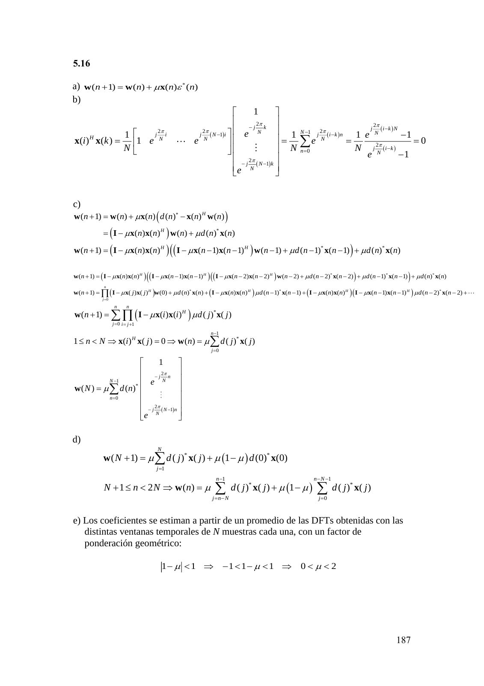

```text
5.16

a) w (n + 1) = w (n) +  x(n) * (n)
b)
                                                                             1       
                                                                       − j 2 k                                  2
             1    2
                                                         j ( N −1)i   e
                                                          2                    N      1 N −1 j 2 (i − k )n 1 e j N (i − k ) N − 1
                                                                                       = e N
                  j i
x(i ) x(k ) = 1 e N                                                                                       =                       =0
       H
                                                        e N
             N                                                                      N n =0                 N j 2N ( i − k )
                                                                       − j 2 N −1 k                           e               −1
                                                                               ( )
                                                                      e N            
                                                                                     


c)
w (n + 1) = w (n) +  x(n) ( d (n) − x(n) H w (n) )
             = ( I −  x(n)x(n) H ) w (n) +  d (n)* x(n)

                                                (
w (n + 1) = ( I −  x(n)x(n) H ) ( I −  x( n − 1)x( n − 1) H ) w ( n − 1) +  d ( n − 1)* x( n − 1) +  d ( n)* x( n)            )
                                     (                          (                                                                     )                      )
w (n + 1) = ( I −  x(n)x(n) H ) ( I −  x(n − 1)x(n − 1) H ) ( I −  x( n − 2)x( n − 2) H ) w ( n − 2) +  d ( n − 2)* x( n − 2) +  d ( n − 1)* x( n − 1) +  d ( n)* x( n)

w (n + 1) =  ( I −  x( j )x( j ) H )w (0) +  d (n)* x(n) + ( I −  x(n)x(n) H )  d (n − 1)* x(n − 1) + ( I −  x( n) x( n) H )( I −  x( n − 1)x( n − 1) H )  d ( n − 2)* x(n − 2) +
              n


             j =0


w (n + 1) =   ( I −  x(i )x(i ) H )  d ( j )* x( j )
                     n      n


                    j = 0 i = j +1
                                                                n −1
1  n  N  x(i ) H x( j ) = 0  w (n) =   d ( j )* x( j )
                                                                j =0

                            1       
                      − j 2 n 
            N −1      e N 
w ( N ) =   d (n)*                
            n =0                    
                      − j 2 N −1 n 
                     e N ( ) 


d)
                                         N
             w ( N + 1) =   d ( j )* x( j ) +  (1 −  ) d (0)* x(0)
                                         j =1
                                                                    n −1                                        n − N −1
              N + 1  n  2 N  w (n) =   d ( j )* x( j ) +  (1 −  )  d ( j )* x( j )
                                                                 j =n− N                                           j =0


e) Los coeficientes se estiman a partir de un promedio de las DFTs obtenidas con las
   distintas ventanas temporales de N muestras cada una, con un factor de
   ponderación geométrico:

                                             1−   1                 −1  1−   1                     0 2


                                                                                                                                                       187
```

## Page 72

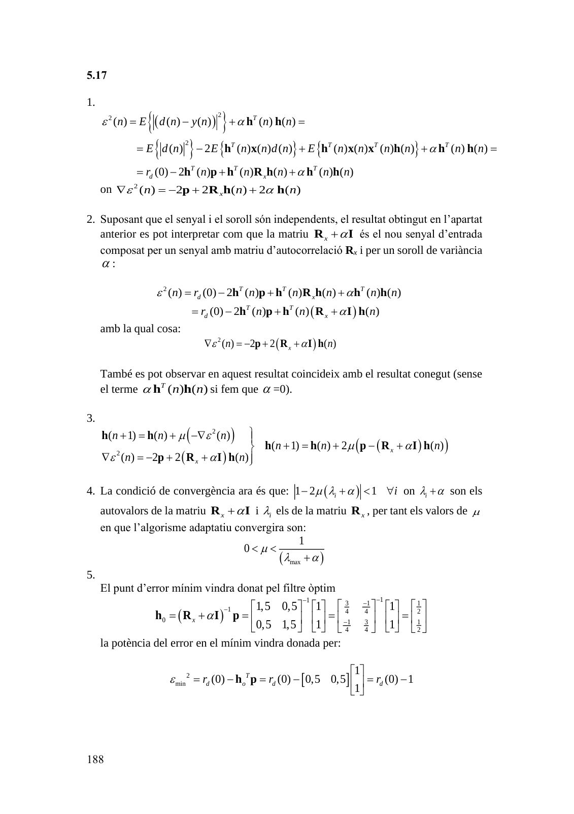

```text
5.17

1.
                 
      2 ( n) = E ( d ( n) − y ( n) )
                                        2
                                             +  h ( n) h( n) =
                                                    T


                     
              = E d ( n)
                             2
                                  − 2E h (n)x(n)d (n) + E h (n)x(n)x (n)h(n) +  h (n) h(n) =
                                              T                       T       T              T


              = rd (0) − 2hT (n)p + hT (n)R xh(n) +  hT (n)h(n)
     on  2 (n) = −2p + 2R x h( n) + 2 h( n)

2. Suposant que el senyal i el soroll són independents, el resultat obtingut en l’apartat
   anterior es pot interpretar com que la matriu R x +  I és el nou senyal d’entrada
   composat per un senyal amb matriu d’autocorrelació Rx i per un soroll de variància
   :

                      2 (n) = rd (0) − 2hT (n)p + hT (n)R xh(n) +  hT (n)h(n)
                                 = rd (0) − 2hT (n)p + hT (n) ( R x +  I ) h(n)
     amb la qual cosa:
                                     2 (n) = −2p + 2 ( R x +  I ) h(n)

     També es pot observar en aquest resultat coincideix amb el resultat conegut (sense
     el terme  hT (n)h(n) si fem que  =0).

3.
     h(n + 1) = h(n) +  ( − 2 (n) )     
                                             h(n + 1) = h(n) + 2  ( p − ( R x +  I ) h(n) )
      2 (n) = −2p + 2 ( R x +  I ) h(n) 

4. La condició de convergència ara és que: 1 − 2  ( i +  )  1 i on i +  son els
     autovalors de la matriu R x +  I i i els de la matriu R x , per tant els valors de 
     en que l’algorisme adaptatiu convergira son:
                                                  1
                                    0 
                                             ( max +  )
5.
     El punt d’error mínim vindra donat pel filtre òptim
                                                               −1           −1 −1
                                                   1,5 0,5 1  34         1  12 
                     h0 = ( R x +  I )
                                            −1
                                                 p=           =  −1
                                                                            4
                                                                                = 1
                                                   0,5 1,5  1  4         1  2 
                                                                            3
                                                                            4

     la potència del error en el mínim vindra donada per:

                                                                         1
                          min 2 = rd (0) − h oT p = rd (0) −  0,5 0,5   = rd (0) − 1
                                                                         1


188
```

## Page 73

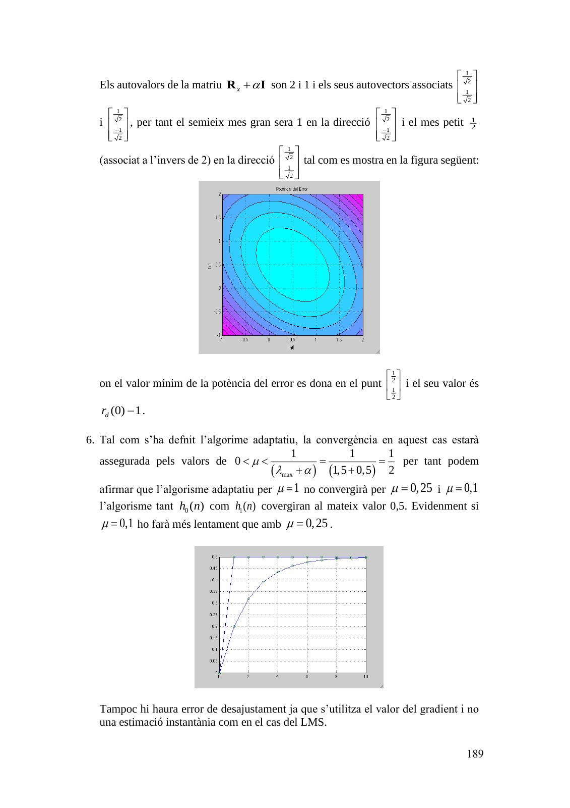

```text
                                                                                      12 
  Els autovalors de la matriu R x +  I son 2 i 1 i els seus autovectors associats  1 
                                                                                      2 
     1
                                                                   1

  i  −21  , per tant el semieix mes gran sera 1 en la direcció  −21  i el mes petit 12
     2                                                         2 
                                             1

  (associat a l’invers de 2) en la direcció  12  tal com es mostra en la figura següent:
                                             2 


                                                                1
  on el valor mínim de la potència del error es dona en el punt  12  i el seu valor és
                                                                2
  rd (0) − 1 .

6. Tal com s’ha defnit l’algorime adaptatiu, la convergència en aquest cas estarà
                                          1            1       1
   assegurada pels valors de 0                =           =   per tant podem
                                     ( max +  ) (1,5 + 0,5) 2
  afirmar que l’algorisme adaptatiu per  = 1 no convergirà per  = 0, 25 i  = 0,1
  l’algorisme tant h0 (n) com h1 (n) covergiran al mateix valor 0,5. Evidenment si
    = 0,1 ho farà més lentament que amb  = 0, 25 .


  Tampoc hi haura error de desajustament ja que s’utilitza el valor del gradient i no
  una estimació instantània com en el cas del LMS.

                                                                                         189
```

## Page 74

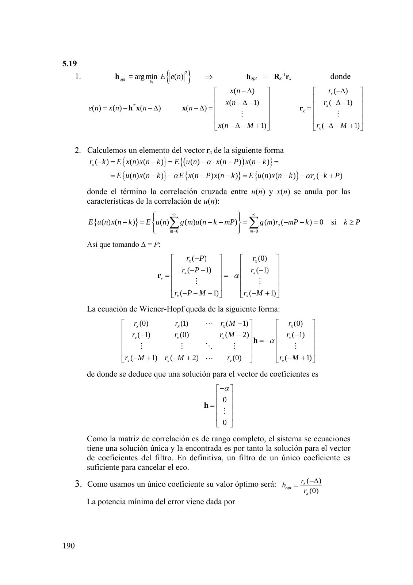

```text
5.19
   1.               hopt = arg min E e(n)
                                    h
                                                 2
                                                                        hopt = Rx-1rx                   donde
                                                                   x(n −  )                            rx (−)    
                                                               x(n −  − 1)                        r (− − 1) 
        e( n ) = x ( n ) − hT x ( n −  )        x( n −  ) =                                rx =  x               
                                                                                                                   
                                                                                                                   
                                                               x(n −  − M + 1)                    rx (− − M + 1) 

   2. Calculemos un elemento del vector rx de la siguiente forma
      rx (−k ) = E  x(n) x(n − k ) = E ( u (n) −   x(n − P ) ) x (n − k ) =
                  = E u (n) x(n − k ) −  E  x(n − P ) x(n − k ) = E u (n) x (n − k ) −  rx (−k + P )

        donde el término la correlación cruzada entre u(n) y x(n) se anula por las
        características de la correlación de u(n):
                                     
                                                             
                                 
                                            
        E u (n) x(n − k ) = E u (n) g (m)u (n − k − mP )  =
                                      m=0                     m = 0
                                                                           
                                                                      g (m)ru ( −mP − k ) = 0             si k  P

        Así que tomando  = P:
                                                    rx (− P)          rx (0) 
                                              r (− P − 1)             r (−1) 
                                        rx =      x             = −  x            
                                                                                   
                                                                                   
                                              rx (− P − M + 1)        rx (− M + 1) 
        La ecuación de Wiener-Hopf queda de la siguiente forma:
                        rx (0)            rx (1)               rx ( M − 1)          rx (0) 
                        r (−1)           rx (0)                            
                                                                rx ( M − 2)          r ( −1) 
                        x                                                    h = −  x             
                                                                                                  
                                                                                                  
                        rx (− M + 1) rx (− M + 2)                  rx (0)           rx ( − M + 1) 
        de donde se deduce que una solución para el vector de coeficientes es
                                                             − 
                                                             0 
                                                          h= 
                                                             
                                                             
                                                             0 
        Como la matriz de correlación es de rango completo, el sistema se ecuaciones
        tiene una solución única y la encontrada es por tanto la solución para el vector
        de coeficientes del filtro. En definitiva, un filtro de un único coeficiente es
        suficiente para cancelar el eco.
   3. Como usamos un único coeficiente su valor óptimo será: hopt = rx (−)
                                                                                                 rx (0)
        La potencia mínima del error viene dada por


190
```

## Page 75

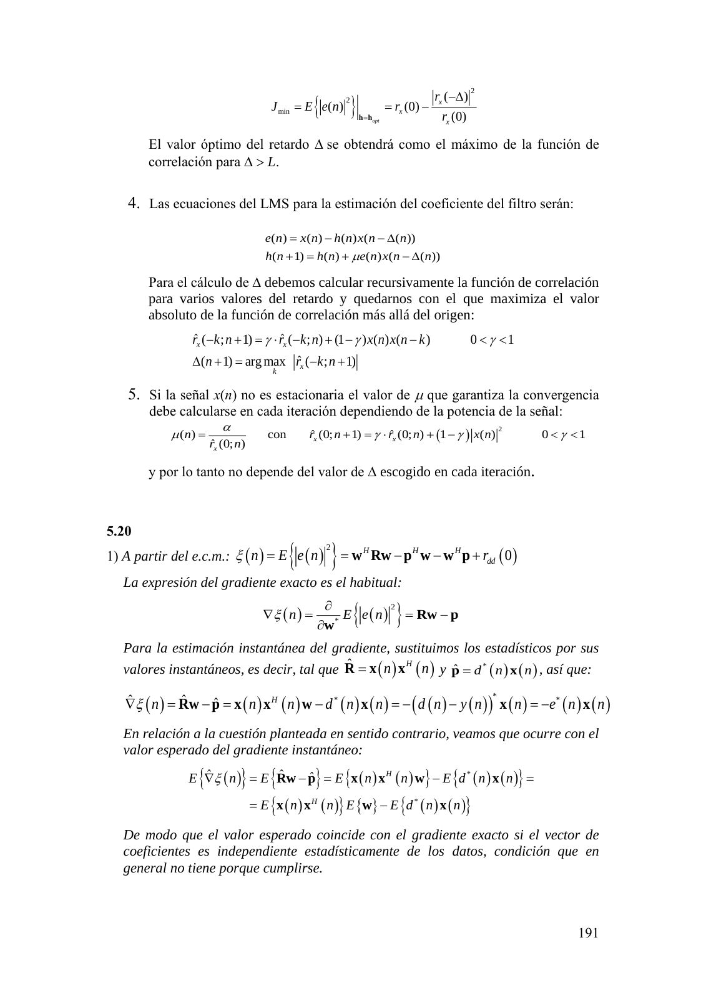

```text
                                                                                                 rx (−)
                                                                                                           2

                                                      
                                           J min = E e(n)
                                                                2
                                                                       h = h opt
                                                                                    = rx (0) −
                                                                                                  rx (0)

        El valor óptimo del retardo  se obtendrá como el máximo de la función de
        correlación para   L.

    4. Las ecuaciones del LMS para la estimación del coeficiente del filtro serán:

                                         e(n) = x( n) − h( n) x( n − ( n))
                                         h(n + 1) = h(n) +  e(n) x(n −  (n))

        Para el cálculo de  debemos calcular recursivamente la función de correlación
        para varios valores del retardo y quedarnos con el que maximiza el valor
        absoluto de la función de correlación más allá del origen:
                   rˆx (−k ; n + 1) =   rˆx (−k ; n) + (1 −  ) x(n) x(n − k )                           0   1
                   (n + 1) = arg max rˆx (−k ; n + 1)
                                           k


    5. Si la señal x(n) no es estacionaria el valor de  que garantiza la convergencia
        debe calcularse en cada iteración dependiendo de la potencia de la señal:
                            
               ( n) =                              rˆx (0; n + 1) =   rˆx (0; n) + (1 −  ) x( n)                    0   1
                                                                                                                    2
                                          con
                         rˆx (0; n)

        y por lo tanto no depende del valor de  escogido en cada iteración.


5.20
1) A partir del e.c.m.:  ( n ) = E e ( n )              2
                                                               = w Rw − p w − w p + r ( 0)
                                                                         H                H          H
                                                                                                               dd

   La expresión del gradiente exacto es el habitual:

                                          ( n ) =
                                                       
                                                      w *          
                                                           E e ( n ) = Rw − p
                                                                    2
                                                                                      
   Para la estimación instantánea del gradiente, sustituimos los estadísticos por sus
                                           ˆ = x ( n ) x H ( n ) y pˆ = d * ( n ) x ( n ) , así que:
   valores instantáneos, es decir, tal que R

                ˆ − pˆ = x ( n ) x H ( n ) w − d * ( n ) x ( n ) = − ( d ( n ) − y ( n ) )* x ( n ) = −e* ( n ) x ( n )
   ˆ  ( n ) = Rw
   En relación a la cuestión planteada en sentido contrario, veamos que ocurre con el
   valor esperado del gradiente instantáneo:

                                                   
                                  ˆ − pˆ = E x ( n ) x H ( n ) w − E d * ( n ) x ( n ) =
                    ˆ  ( n ) = E Rw
                  E 

                                      = E x ( n ) x H ( n ) E w − E d * ( n ) x ( n )

   De modo que el valor esperado coincide con el gradiente exacto si el vector de
   coeficientes es independiente estadísticamente de los datos, condición que en
   general no tiene porque cumplirse.


                                                                                                                              191
```

## Page 76

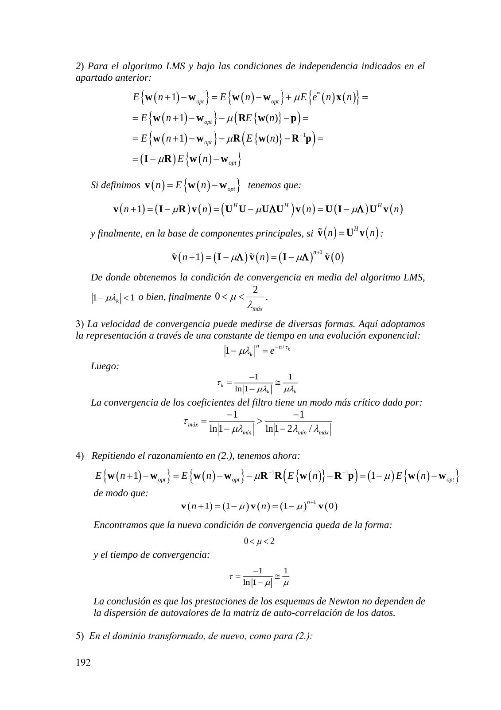

```text
2) Para el algoritmo LMS y bajo las condiciones de independencia indicados en el
apartado anterior:
                 E w ( n + 1) − w opt  = E w ( n ) − w opt  +  E e* ( n ) x ( n ) =
                 = E w ( n + 1) − w opt  −  ( RE w (n) − p ) =
                 = E w ( n + 1) − w opt  −  R ( E w (n) − R −1p ) =
                 = ( I −  R ) E w ( n ) − w opt 

                                
   Si definimos v ( n ) = E w ( n ) − w opt        tenemos que:
           v ( n + 1) = ( I −  R ) v ( n ) = ( U U −  UU ) v ( n ) = U ( I −  ) U v ( n )
                                                  H             H                                H


   y finalmente, en la base de componentes principales, si v ( n ) = U v ( n ) :
                                                                                             H


                             v ( n + 1) = ( I −  ) v ( n ) = ( I −  )           v ( 0)
                                                                             n +1


   De donde obtenemos la condición de convergencia en media del algoritmo LMS,
                                          2
   1 − k  1 o bien, finalmente 0      .
                                                       máx
3) La velocidad de convergencia puede medirse de diversas formas. Aquí adoptamos
la representación a través de una constante de tiempo en una evolución exponencial:
                                    1 − k = e − n / k
                                            n


   Luego:
                                                       −1       1
                                           k =              
                                                  ln 1 − k   k
   La convergencia de los coeficientes del filtro tiene un modo más crítico dado por:
                                     −1                −1
                         máx =              
                                ln 1 − mín ln 1 − 2mín / máx

4) Repitiendo el razonamiento en (2.), tenemos ahora:

                                                                (                            )
      E w ( n + 1) − w opt  = E w ( n ) − w opt  −  R −1R E w ( n ) − R −1p = (1 −  ) E w ( n ) − w opt 
      de modo que:
                                v ( n + 1) = (1 −  ) v ( n ) = (1 −  )          v ( 0)
                                                                           n +1


      Encontramos que la nueva condición de convergencia queda de la forma:
                                                      0 2
      y el tiempo de convergencia:
                                                         −1      1
                                              =               
                                                      ln 1 −    

      La conclusión es que las prestaciones de los esquemas de Newton no dependen de
      la dispersión de autovalores de la matriz de auto-correlación de los datos.

5) En el dominio transformado, de nuevo, como para (2.):

192
```

## Page 77

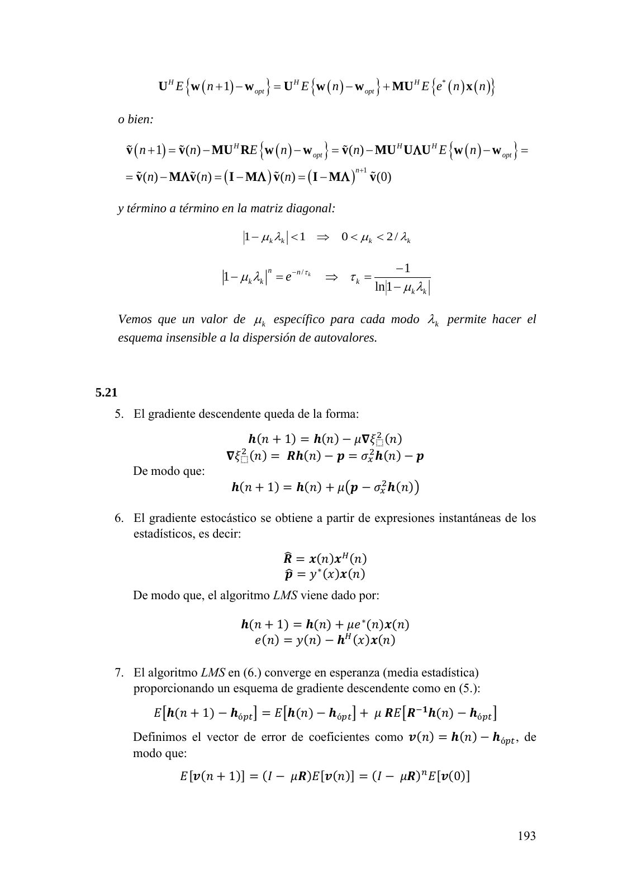

```text
                 U H E w ( n + 1) − w opt  = U H E w ( n ) − w opt  + MU H E e* ( n ) x ( n )

       o bien:

        v ( n + 1) = v(n) − MU H RE w ( n ) − w opt  = v (n) − MU H UU H E w ( n ) − w opt  =

        = v ( n ) − M v ( n ) = ( I − M ) v ( n ) = ( I − M  )
                                                                    n +1
                                                                           v (0)

       y término a término en la matriz diagonal:

                                     1 −  k k  1         0   k  2 / k

                                                                                 −1
                                1 −  k k = e − n /  k    k =
                                            n

                                                                            ln 1 −  k k

       Vemos que un valor de  k específico para cada modo k permite hacer el
       esquema insensible a la dispersión de autovalores.


5.21
   5. El gradiente descendente queda de la forma:
                                                           2
                                     𝒉(𝑛 + 1) = 𝒉(𝑛) − 𝜇𝛁𝜉⬚  (𝑛)
                                   2                     2
                                 𝛁𝜉⬚ (𝑛) = 𝑹𝒉(𝑛) − 𝒑 = 𝜎𝑥 𝒉(𝑛) − 𝒑
         De modo que:
                                  𝒉(𝑛 + 1) = 𝒉(𝑛) + 𝜇(𝒑 − 𝜎𝑥2 𝒉(𝑛))

   6. El gradiente estocástico se obtiene a partir de expresiones instantáneas de los
      estadísticos, es decir:
                                                ̂ = 𝒙(𝑛)𝒙𝐻 (𝑛)
                                                𝑹
                                                ̂ = 𝑦 ∗ (𝑥)𝒙(𝑛)
                                                𝒑
         De modo que, el algoritmo LMS viene dado por:

                                     𝒉(𝑛 + 1) = 𝒉(𝑛) + 𝜇𝑒 ∗ (𝑛)𝒙(𝑛)
                                       𝑒(𝑛) = 𝑦(𝑛) − 𝒉𝐻 (𝑥)𝒙(𝑛)

   7. El algoritmo LMS en (6.) converge en esperanza (media estadística)
      proporcionando un esquema de gradiente descendente como en (5.):
              𝐸[𝒉(𝑛 + 1) − 𝒉ó𝑝𝑡 ] = 𝐸[𝒉(𝑛) − 𝒉ó𝑝𝑡 ] + 𝜇 𝑹𝐸[𝑹−𝟏 𝒉(𝑛) − 𝒉ó𝑝𝑡 ]
         Definimos el vector de error de coeficientes como 𝒗(𝑛) = 𝒉(𝑛) − 𝒉ó𝑝𝑡 , de
         modo que:
                      𝐸[𝒗(𝑛 + 1)] = (𝐼 − 𝜇𝑹)𝐸[𝒗(𝑛)] = (𝐼 − 𝜇𝑹)𝑛 𝐸[𝒗(0)]


                                                                                                      193
```

## Page 78

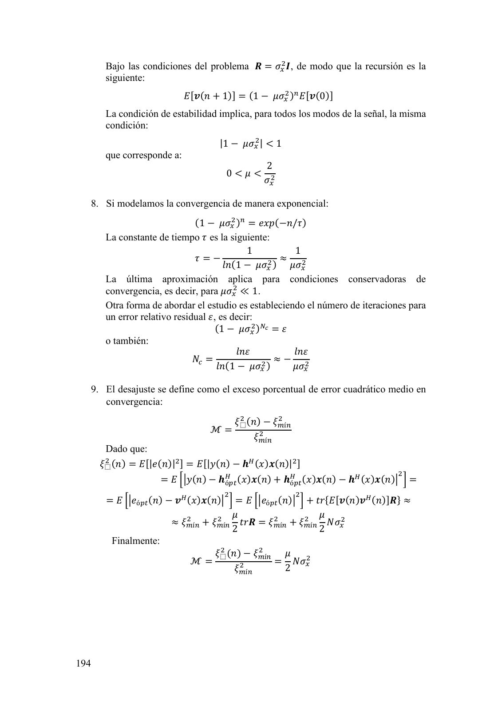

```text
       Bajo las condiciones del problema 𝑹 = 𝜎𝑥2 𝑰, de modo que la recursión es la
       siguiente:
                            𝐸[𝒗(𝑛 + 1)] = (1 − 𝜇𝜎𝑥2 )𝑛 𝐸[𝒗(0)]
       La condición de estabilidad implica, para todos los modos de la señal, la misma
       condición:
                                    |1 − 𝜇𝜎𝑥2 | < 1
       que corresponde a:
                                               2
                                     0<𝜇<
                                              𝜎𝑥2

  8. Si modelamos la convergencia de manera exponencial:
                              (1 − 𝜇𝜎𝑥2 )𝑛 = 𝑒𝑥𝑝(−𝑛/𝜏)
       La constante de tiempo 𝜏 es la siguiente:
                                            1         1
                              𝜏=−                2
                                                    ≈ 2
                                      𝑙𝑛(1 − 𝜇𝜎𝑥 ) 𝜇𝜎𝑥
       La última aproximación aplica para condiciones conservadoras de
       convergencia, es decir, para 𝜇𝜎𝑥2 ≪ 1.
       Otra forma de abordar el estudio es estableciendo el número de iteraciones para
       un error relativo residual 𝜀, es decir:
                                    (1 − 𝜇𝜎𝑥2 )𝑁𝑐 = 𝜀
       o también:
                                         𝑙𝑛𝜀          𝑙𝑛𝜀
                              𝑁𝑐 =             2
                                                   ≈− 2
                                    𝑙𝑛(1 − 𝜇𝜎𝑥 )      𝜇𝜎𝑥

  9. El desajuste se define como el exceso porcentual de error cuadrático medio en
     convergencia:
                                      2        2
                                     𝜉⬚ (𝑛) − 𝜉𝑚í𝑛
                                  ℳ=       2
                                          𝜉𝑚í𝑛
       Dado que:
       2
      𝜉⬚ (𝑛) = 𝐸[|𝑒(𝑛)|2 ] = 𝐸[|𝑦(𝑛) − 𝒉𝐻 (𝑥)𝒙(𝑛)|2 ]
                                                                               2
                    = 𝐸 [|𝑦(𝑛) − 𝒉𝐻              𝐻              𝐻
                                  ó𝑝𝑡 (𝑥)𝒙(𝑛) + 𝒉ó𝑝𝑡 (𝑥)𝒙(𝑛) − 𝒉 (𝑥)𝒙(𝑛)| ] =
                                     2                2
       = 𝐸 [|𝑒ó𝑝𝑡 (𝑛) − 𝒗𝐻 (𝑥)𝒙(𝑛)| ] = 𝐸 [|𝑒ó𝑝𝑡 (𝑛)| ] + 𝑡𝑟{𝐸[𝒗(𝑛)𝒗𝐻 (𝑛)]𝑹} ≈
                           2     2 𝜇           2       2 𝜇
                       ≈ 𝜉𝑚í𝑛 + 𝜉𝑚í𝑛   𝑡𝑟𝑹 = 𝜉𝑚í𝑛  + 𝜉𝑚í𝑛   𝑁𝜎 2
                                     2                     2 𝑥
        Finalmente:
                                  2        2
                                 𝜉⬚ (𝑛) − 𝜉𝑚í𝑛    𝜇
                            ℳ=                 =    𝑁𝜎 2
                                       2
                                      𝜉𝑚í𝑛        2 𝑥


194
```

## Page 79

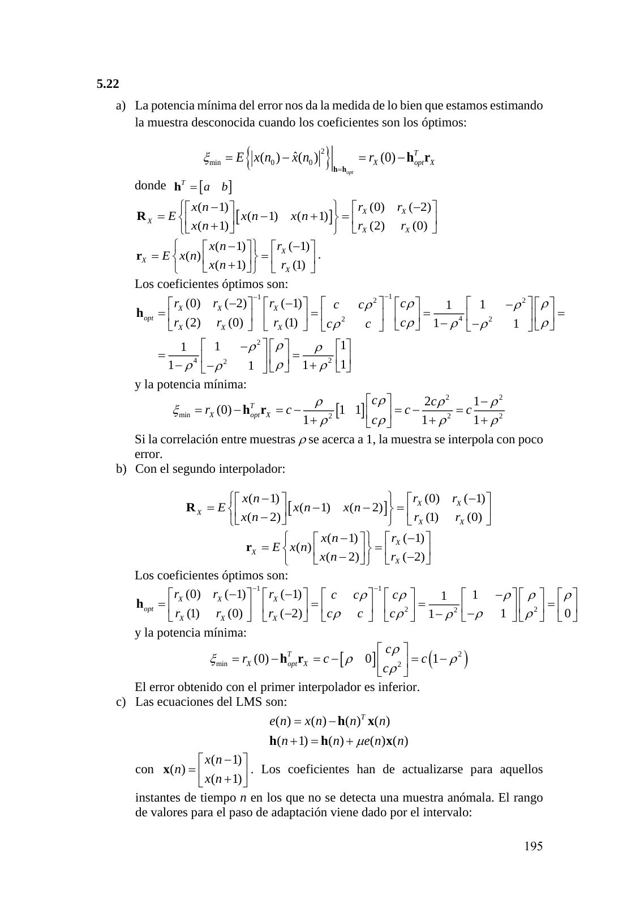

```text
5.22
   a) La potencia mínima del error nos da la medida de lo bien que estamos estimando
      la muestra desconocida cuando los coeficientes son los óptimos:

                                 
                         min = E x(n0 ) − xˆ (n0 )
                                                      2
                                                             h =hopt
                                                                        = rX (0) − hTopt rX

       donde hT =  a b
                 x(n − 1)                        r (0) r (−2) 
       R X = E              x(n − 1) x(n + 1) = rX (2) rX (0) 
                 x(n + 1)                       X          X    
                     x(n − 1)    rX (−1) 
       rX = E  x(n)             =        .
                     x(n + 1)    rX (1) 
       Los coeficientes óptimos son:
                                     −1                                         −1
                r (0) rX (−2)   rX (−1)   c                        c  2  c    1  1            − 2    
       h opt =  X                       = 2                                =                           =
                rX (2) rX (0)   rX (1)  c                           c  c   1 −  4  −  2      1   
                   1  1   − 2        1
            =                    =         
                             1     1 +  2 1
                1 −  4 −  2
       y la potencia mínima:
                                                      c       2c  2    1−  2
                min = rX (0) − h r = c −
                                   T
                                                 1 1   = c −         =c
                                          1+  2       c      1+  2     1+  2
                                   opt X


       Si la correlación entre muestras  se acerca a 1, la muestra se interpola con poco
      error.
   b) Con el segundo interpolador:

                              x(n − 1)                             r (0) r (−1) 
                    R X = E              x(n − 1) x(n − 2) =  rX (1) rX (0) 
                              x(n − 2)                              X     X     
                                                 x(n − 1)    rX (−1) 
                                 rX = E  x(n)                 =  r (−2) 
                                                 x ( n − 2)   X         
       Los coeficientes óptimos son:
                                 −1                                        −1
                rX (0) rX (−1)   rX (−1)   c                   c   c          1  1          −       
       h opt =                           =                                     =                                 =
                rX (1) rX (0)   rX (−2)  c                     c  c  2  1 −  2  −      1    2   0 
       y la potencia mínima:
                                                                 c 
                          min = rX (0) − hTopt rX = c −   0  2  = c (1 −  2 )
                                                                c  
      El error obtenido con el primer interpolador es inferior.
   c) Las ecuaciones del LMS son:
                                 e ( n ) = x ( n ) − h ( n )T x ( n )
                                          h(n + 1) = h(n) +  e( n) x( n)
                     x(n − 1) 
       con x(n) =              . Los coeficientes han de actualizarse para aquellos
                     x(n + 1) 
       instantes de tiempo n en los que no se detecta una muestra anómala. El rango
       de valores para el paso de adaptación viene dado por el intervalo:

                                                                                                              195
```

## Page 80

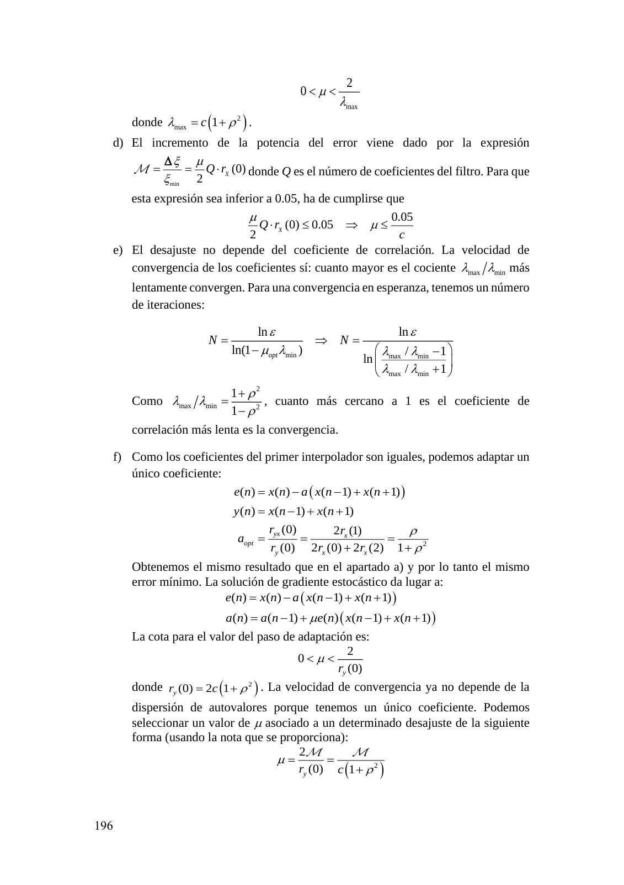

```text
                                                      2
                                           0 
                                                    max
      donde max = c (1 +  ) .
                           2


  d) El incremento de la potencia del error viene dado por la expresión
           
        =      = Q  rX (0) donde Q es el número de coeficientes del filtro. Para que
           min 2
     esta expresión sea inferior a 0.05, ha de cumplirse que
                                                         0.05
                               Q  rX (0)  0.05   
                             2                              c
  e) El desajuste no depende del coeficiente de correlación. La velocidad de
     convergencia de los coeficientes sí: cuanto mayor es el cociente max min más
      lentamente convergen. Para una convergencia en esperanza, tenemos un número
      de iteraciones:

                                ln                                ln 
                     N=                       N=
                          ln(1 − opt min )                    /  −1 
                                                           ln  max min 
                                                               max / min + 1 
                         1+  2
      Como max min =           , cuanto más cercano a 1 es el coeficiente de
                         1−  2
      correlación más lenta es la convergencia.

  f) Como los coeficientes del primer interpolador son iguales, podemos adaptar un
     único coeficiente:
                        e(n) = x(n) − a ( x (n − 1) + x (n + 1) )
                           y (n) = x(n − 1) + x(n + 1)
                                  r (0)        2rx (1)         
                            aopt = yx    =                 =
                                   ry (0) 2rx (0) + 2rx (2) 1 +  2
      Obtenemos el mismo resultado que en el apartado a) y por lo tanto el mismo
      error mínimo. La solución de gradiente estocástico da lugar a:
                        e(n) = x(n) − a ( x(n − 1) + x(n + 1) )
                         a (n) = a (n − 1) +  e(n) ( x(n − 1) + x (n + 1) )
      La cota para el valor del paso de adaptación es:
                                                   2
                                        0 
                                                ry (0)
      donde ry (0) = 2c (1 +  2 ) . La velocidad de convergencia ya no depende de la
      dispersión de autovalores porque tenemos un único coeficiente. Podemos
      seleccionar un valor de  asociado a un determinado desajuste de la siguiente
      forma (usando la nota que se proporciona):
                                      2
                                  =        =
                                      ry (0) c (1 +  2 )


196
```

## Page 81


```text
y obtendremos un número de iteraciones necesarias para converger (en
esperanza) a una fracción  del valor inicial de a:
                              ln               ln    ln 
                   N=                     =
                        ln (1 −  ry (0) ) ln (1 − 2 ) 2
que no depende de , a diferencia del interpolador LMS del apartado c), pero
donde aparece claramente el compromiso entre desajuste y número de
iteraciones hasta la convergencia.


                                                                        197
```
