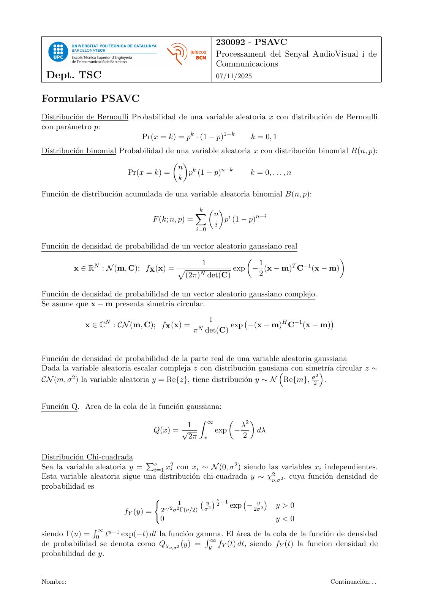
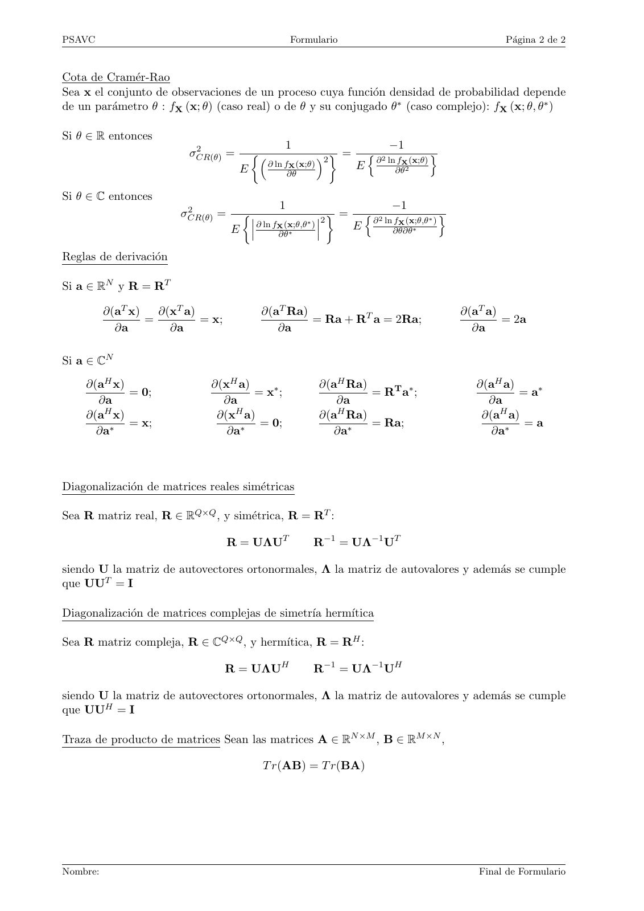

# 2025_PSAVC_Formulario

- Source PDF: `~/Downloads/2025_PSAVC_Formulario.pdf`
- PDF title: `2025_PSAVC_Formulario`
- Pages: 2
- Note: Transcribed from the embedded PDF text layer. Each page links to a rendered page image so figures, plots, handwriting, and formula layout can be checked against the original.

## Page 1



```text
                                                          230092 - PSAVC
                                                          Processament del Senyal AudioVisual i de
                                                          Communicacions
 Dept. TSC                                                07/11/2025


Formulario PSAVC
Distribución de Bernoulli Probabilidad de una variable aleatoria x con distribución de Bernoulli
con parámetro p:
                              Pr(x = k) = pk · (1 − p)1−k   k = 0, 1
Distribución binomial Probabilidad de una variable aleatoria x con distribución binomial B(n, p):
                                       
                                       n k
                         Pr(x = k) =      p (1 − p)n−k       k = 0, . . . , n
                                       k

Función de distribución acumulada de una variable aleatoria binomial B(n, p):
                                                k  
                                                X  n
                                F (k; n, p) =                 pi (1 − p)n−i
                                                          i
                                                i=0


Función de densidad de probabilidad de un vector aleatorio gaussiano real
                                                                             
               N                             1                1         T −1
          x ∈ R : N (m, C); fX (x) = p                 exp − (x − m) C (x − m)
                                         (2π)N det(C)         2

Función de densidad de probabilidad de un vector aleatorio gaussiano complejo.
Se asume que x − m presenta simetrı́a circular.
                                                      1
            x ∈ CN : CN (m, C); fX (x) =                       exp −(x − m)H C−1 (x − m)
                                                                                        
                                            π N det(C)


Función de densidad de probabilidad de la parte real de una variable aleatoria gaussiana
Dada la variable aleatoria escalar compleja z con distribución gausiana
                                                                       con simetrı́a
                                                                                     circular z ∼
         2                                                                     σ2
CN (m, σ ) la variable aleatoria y = Re{z}, tiene distribución y ∼ N Re{m}, 2 .


Función Q. Area de la cola de la función gaussiana:
                                                Z ∞           2
                                        1                       λ
                                Q(x) = √                  exp −   dλ
                                         2π       x             2

Distribución Chi-cuadrada
Sea la variable aleatoria y = νi=1 x2i con xi ∼ N (0, σ 2 ) siendo las variables xi independientes.
                                P
Esta variable aleatoria sigue una distribución chi-cuadrada y ∼ χ2ν,σ2 , cuya función densidad de
probabilidad es
                                                     ν
                                                 y  2 −1
                                 (
                                         1                       y 
                                     ν/2 2       σ 2      exp − 2σ 2 y>0
                         fY (y) = 2 σ Γ(ν/2)
                                   0                                 y<0
               R ∞ u−1
siendo Γ(u) = 0 t       exp(−t) dt la función gamma.
                                                 R ∞ El área de la cola de la función de densidad
de probabilidad se denota como Qχν,σ2 (y) = y fY (t) dt, siendo fY (t) la funcion densidad de
probabilidad de y.


Nombre:                                                                                 Continuación. . .
```

## Page 2



```text
PSAVC                                               Formulario                                             Página 2 de 2


Cota de Cramér-Rao
Sea x el conjunto de observaciones de un proceso cuya función densidad de probabilidad depende
de un parámetro θ : fX (x; θ) (caso real) o de θ y su conjugado θ∗ (caso complejo): fX (x; θ, θ∗ )

Si θ ∈ R entonces
                          2                       1                             −1
                         σCR(θ) =                          2  =       n 2              o
                                             ∂ ln fX (x;θ)                 ∂ ln fX (x;θ)
                                    E                                 E        ∂θ2
                                                   ∂θ

Si θ ∈ C entonces
                         2                      1                               −1
                        σCR(θ) =                                =       n 2                  o
                                                 (x;θ,θ∗ )
                                           ∂ ln fX
                                                             2             ∂ ln fX (x;θ,θ∗ )
                                   E                                  E        ∂θ∂θ∗
                                                 ∂θ∗

Reglas de derivación

Si a ∈ RN y R = RT

          ∂(aT x)   ∂(xT a)                 ∂(aT Ra)                                               ∂(aT a)
                  =         = x;                     = Ra + RT a = 2Ra;                                    = 2a
            ∂a        ∂a                       ∂a                                                    ∂a

Si a ∈ CN
    ∂(aH x)                   ∂(xH a)                        ∂(aH Ra)                                ∂(aH a)
            = 0;                      = x∗ ;                          = RT a∗ ;                              = a∗
      ∂a                        ∂a                              ∂a                                     ∂a
    ∂(aH x)                    ∂(xH a)                       ∂(aH Ra)                                 ∂(aH a)
            = x;                       = 0;                           = Ra;                                   =a
      ∂a∗                        ∂a∗                           ∂a∗                                      ∂a∗


Diagonalización de matrices reales simétricas

Sea R matriz real, R ∈ RQ×Q , y simétrica, R = RT :

                                   R = UΛUT              R−1 = UΛ−1 UT

siendo U la matriz de autovectores ortonormales, Λ la matriz de autovalores y además se cumple
que UUT = I

Diagonalización de matrices complejas de simetrı́a hermı́tica

Sea R matriz compleja, R ∈ CQ×Q , y hermı́tica, R = RH :

                                   R = UΛUH              R−1 = UΛ−1 UH

siendo U la matriz de autovectores ortonormales, Λ la matriz de autovalores y además se cumple
que UUH = I

Traza de producto de matrices Sean las matrices A ∈ RN ×M , B ∈ RM ×N ,

                                            T r(AB) = T r(BA)


Nombre:                                                                                               Final de Formulario
```
