# Presentació PSAVC Primavera 2026 G10

- Source PDF: `Teoria/Presentació PSAVC Primavera 2026 G10.pdf`
- PDF title: `T2 - La señal en el dominio temporal o espacial`
- Pages: 17
- Note: Transcribed from the embedded PDF text layer. Each page links to a rendered page image so figures, plots, handwriting, and formula layout can be checked against the original.

## Page 1

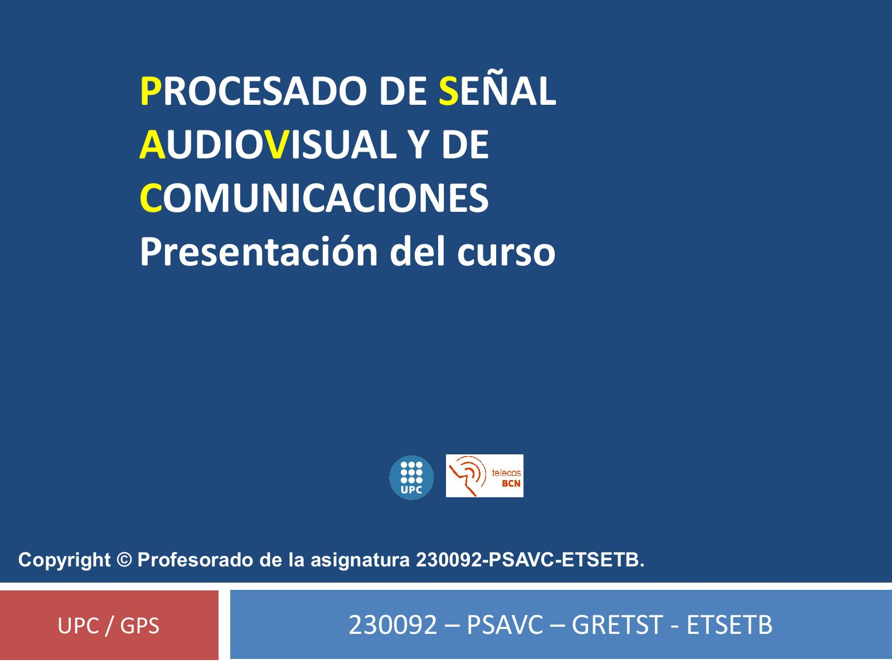

```text
           PROCESADO DE SEÑAL
           AUDIOVISUAL Y DE
           COMUNICACIONES
           Presentación del curso


Copyright © Profesorado de la asignatura 230092-PSAVC-ETSETB.


   UPC / GPS                    230092 – PSAVC – GRETST - ETSETB
```

## Page 2

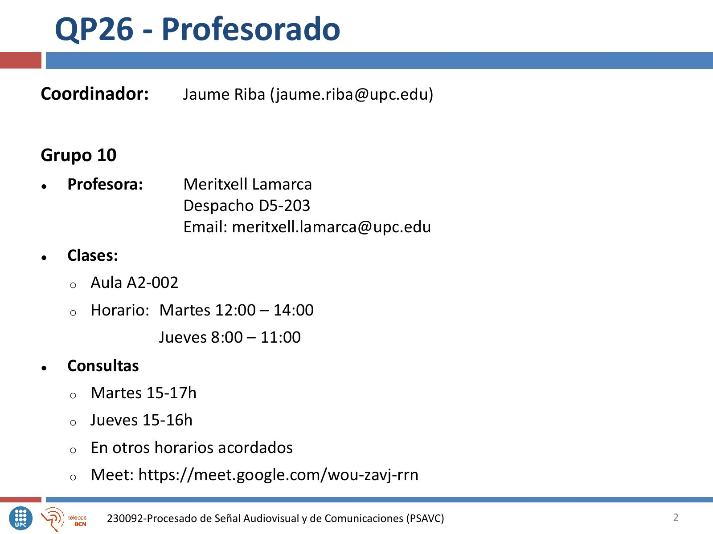

```text
    QP26 - Profesorado
Coordinador:            Jaume Riba (jaume.riba@upc.edu)


Grupo 10
●   Profesora:          Meritxell Lamarca
                        Despacho D5-203
                        Email: meritxell.lamarca@upc.edu
●   Clases:
    o   Aula A2-002
    o   Horario: Martes 12:00 – 14:00
                    Jueves 8:00 – 11:00
●   Consultas
    o   Martes 15-17h
    o   Jueves 15-16h
    o   En otros horarios acordados
    o   Meet: https://meet.google.com/wou-zavj-rrn

          230092-Procesado de Señal Audiovisual y de Comunicaciones (PSAVC)   2
```

## Page 3

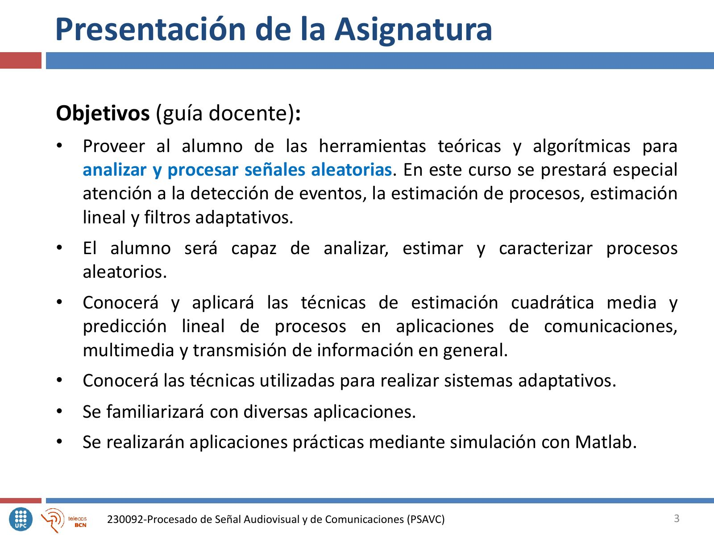

```text
Presentación de la Asignatura

Objetivos (guía docente):
• Proveer al alumno de las herramientas teóricas y algorítmicas para
  analizar y procesar señales aleatorias. En este curso se prestará especial
  atención a la detección de eventos, la estimación de procesos, estimación
  lineal y filtros adaptativos.
• El alumno será capaz de analizar, estimar y caracterizar procesos
  aleatorios.
• Conocerá y aplicará las técnicas de estimación cuadrática media y
  predicción lineal de procesos en aplicaciones de comunicaciones,
  multimedia y transmisión de información en general.
• Conocerá las técnicas utilizadas para realizar sistemas adaptativos.
• Se familiarizará con diversas aplicaciones.
• Se realizarán aplicaciones prácticas mediante simulación con Matlab.


      230092-Procesado de Señal Audiovisual y de Comunicaciones (PSAVC)    3
```

## Page 4

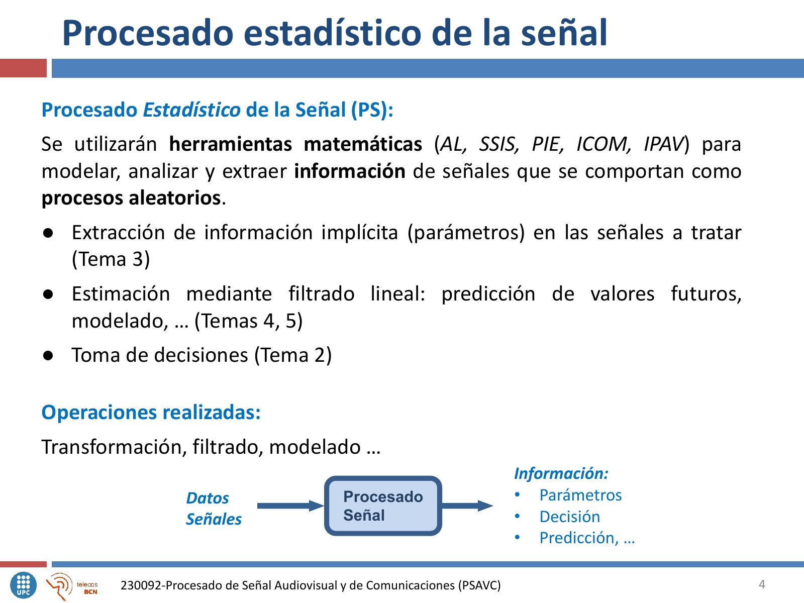

```text
  Procesado estadístico de la señal
Procesado Estadístico de la Señal (PS):
Se utilizarán herramientas matemáticas (AL, SSIS, PIE, ICOM, IPAV) para
modelar, analizar y extraer información de señales que se comportan como
procesos aleatorios.
● Extracción de información implícita (parámetros) en las señales a tratar
  (Tema 3)
● Estimación mediante filtrado lineal: predicción de valores futuros,
  modelado, … (Temas 4, 5)
● Toma de decisiones (Tema 2)

Operaciones realizadas:
Transformación, filtrado, modelado …
                                                                            Información:
                   Datos                      Procesado                     • Parámetros
                   Señales                    Señal                         • Decisión
                                                                            • Predicción, …

        230092-Procesado de Señal Audiovisual y de Comunicaciones (PSAVC)                     4
```

## Page 5

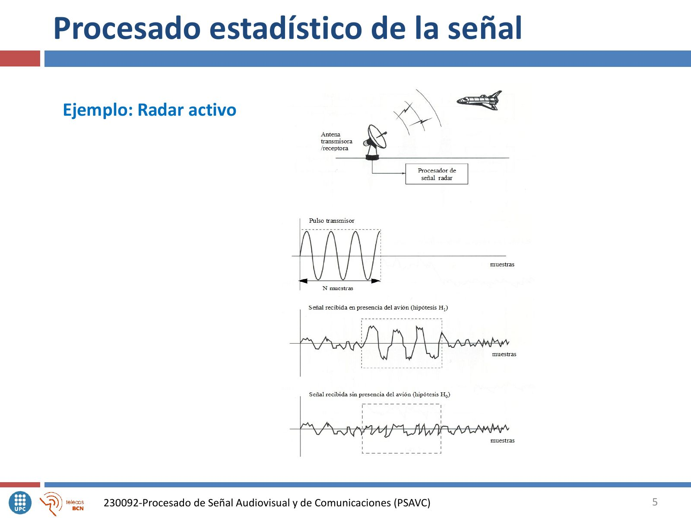

```text
Procesado estadístico de la señal

Ejemplo: Radar activo


    230092-Procesado de Señal Audiovisual y de Comunicaciones (PSAVC)   5
```

## Page 6

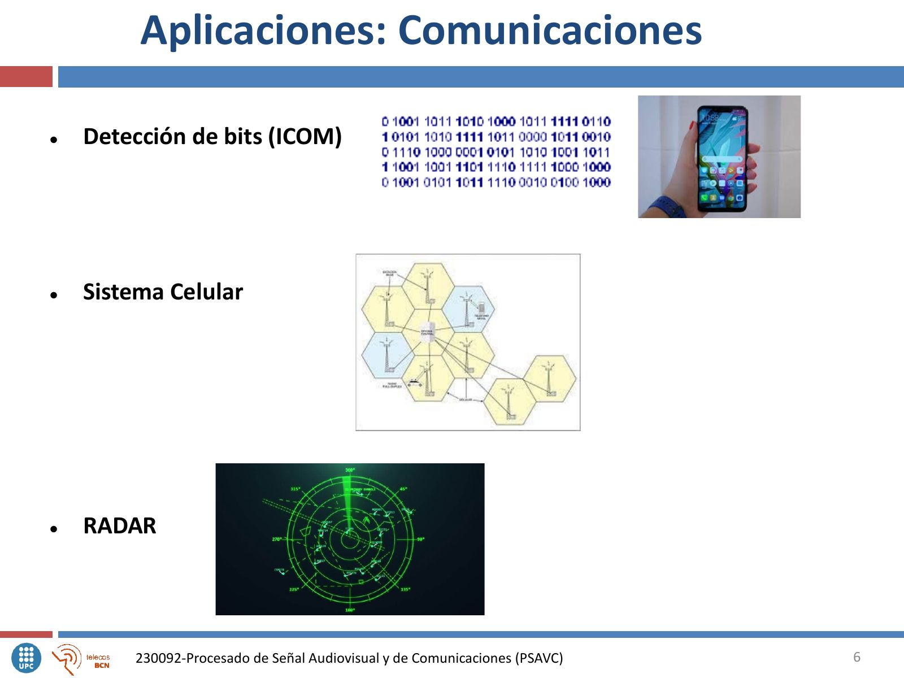

```text
         Aplicaciones: Comunicaciones

●   Detección de bits (ICOM)


●   Sistema Celular


●   RADAR


        230092-Procesado de Señal Audiovisual y de Comunicaciones (PSAVC)   6
```

## Page 7

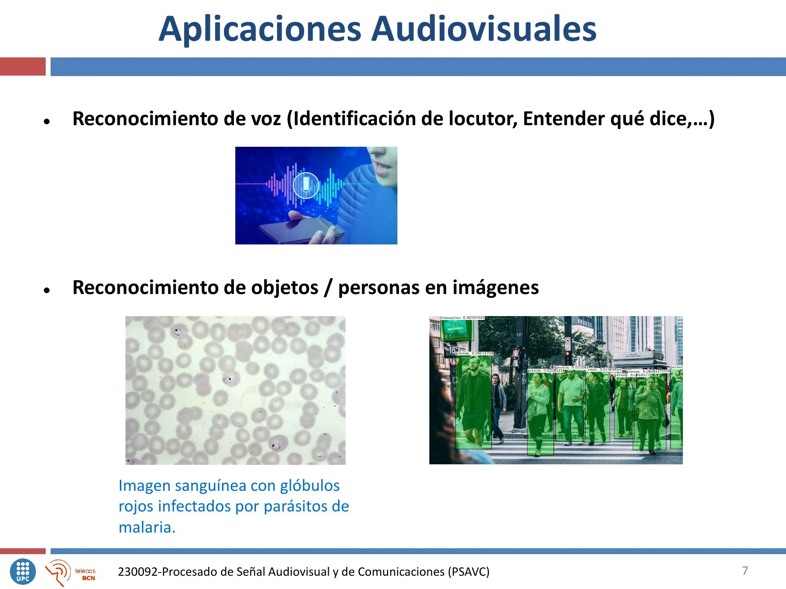

```text
               Aplicaciones Audiovisuales

●   Reconocimiento de voz (Identificación de locutor, Entender qué dice,…)


●   Reconocimiento de objetos / personas en imágenes


         Imagen sanguínea con glóbulos
         rojos infectados por parásitos de
         malaria.

        230092-Procesado de Señal Audiovisual y de Comunicaciones (PSAVC)    7
```

## Page 8

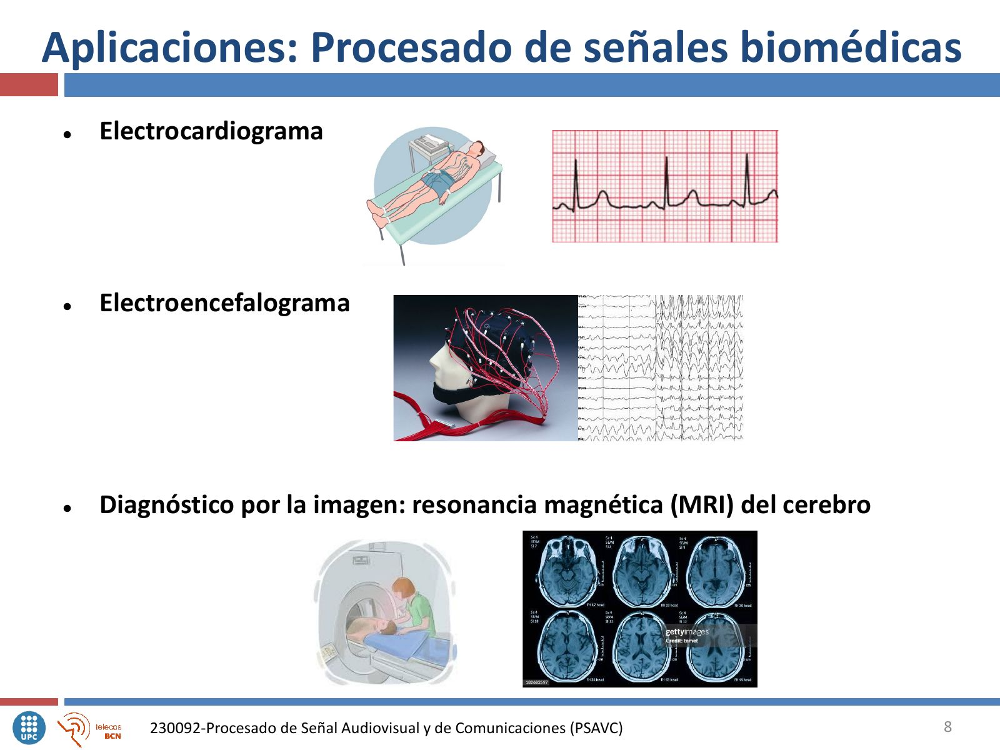

```text
Aplicaciones: Procesado de señales biomédicas
 ●   Electrocardiograma


 ●   Electroencefalograma


 ●   Diagnóstico por la imagen: resonancia magnética (MRI) del cerebro


         230092-Procesado de Señal Audiovisual y de Comunicaciones (PSAVC)   8
```

## Page 9

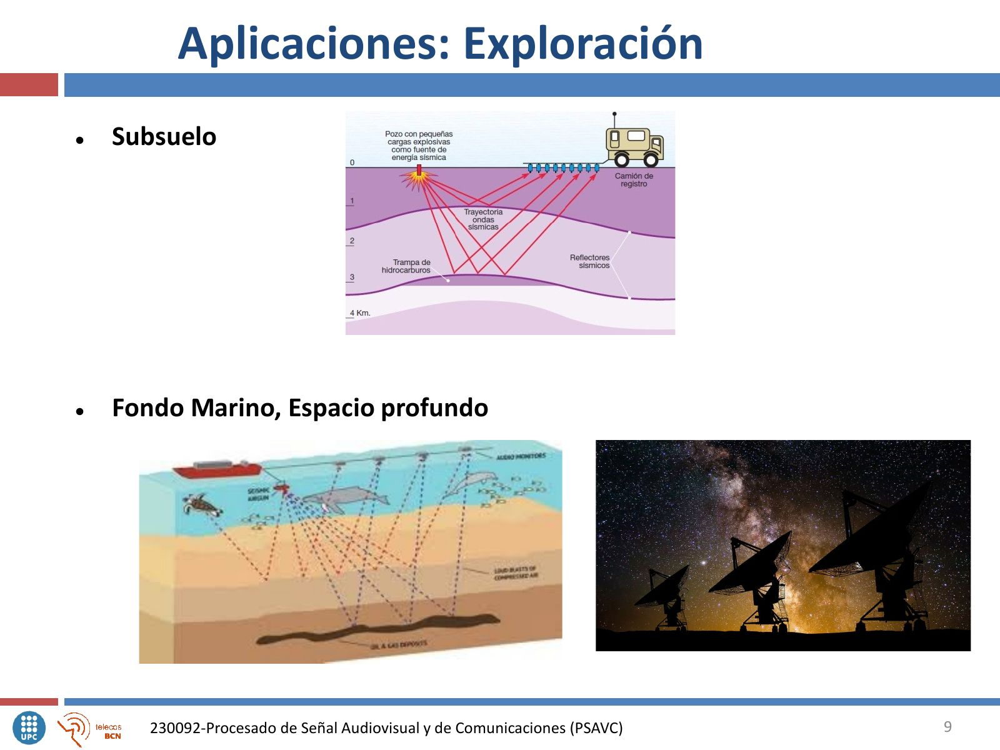

```text
         Aplicaciones: Exploración
●   Subsuelo


●   Fondo Marino, Espacio profundo


      230092-Procesado de Señal Audiovisual y de Comunicaciones (PSAVC)   9
```

## Page 10

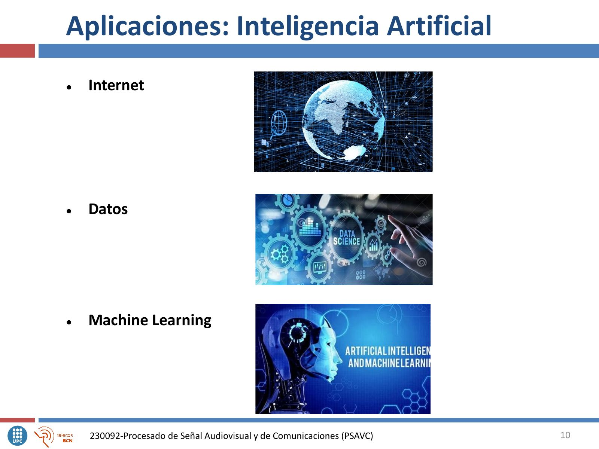

```text
Aplicaciones: Inteligencia Artificial
●   Internet


●   Datos


●   Machine Learning


    230092-Procesado de Señal Audiovisual y de Comunicaciones (PSAVC)   10
```

## Page 11

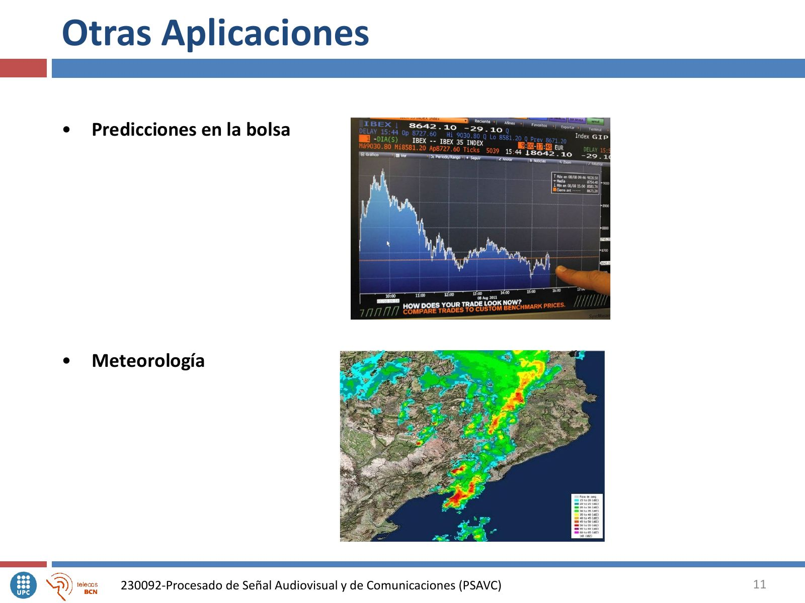

```text
Otras Aplicaciones

•   Predicciones en la bolsa


•   Meteorología


       230092-Procesado de Señal Audiovisual y de Comunicaciones (PSAVC)   11
```

## Page 12

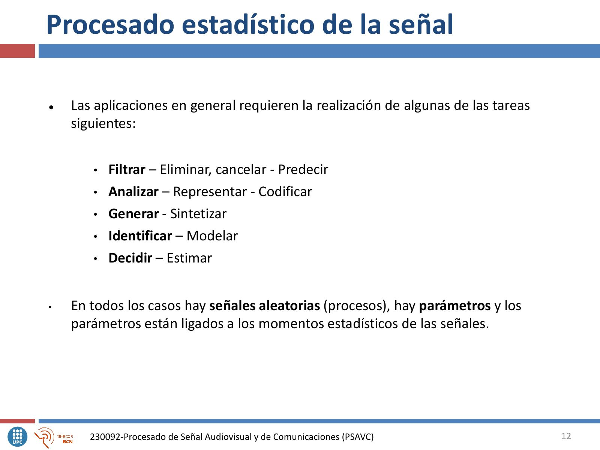

```text
Procesado estadístico de la señal

●   Las aplicaciones en general requieren la realización de algunas de las tareas
    siguientes:


       •   Filtrar – Eliminar, cancelar - Predecir
       •   Analizar – Representar - Codificar
       •   Generar - Sintetizar
       •   Identificar – Modelar
       •   Decidir – Estimar


•   En todos los casos hay señales aleatorias (procesos), hay parámetros y los
    parámetros están ligados a los momentos estadísticos de las señales.


       230092-Procesado de Señal Audiovisual y de Comunicaciones (PSAVC)            12
```

## Page 13

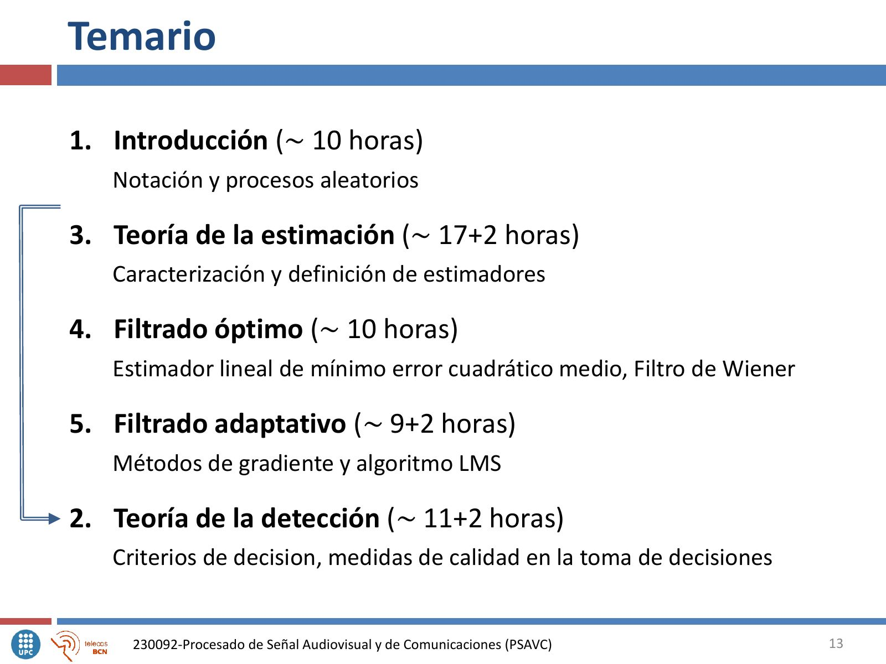

```text
Temario

1. Introducción (~ 10 horas)
   Notación y procesos aleatorios

3. Teoría de la estimación (~ 17+2 horas)
   Caracterización y definición de estimadores

4. Filtrado óptimo (~ 10 horas)
   Estimador lineal de mínimo error cuadrático medio, Filtro de Wiener

5. Filtrado adaptativo (~ 9+2 horas)
   Métodos de gradiente y algoritmo LMS

2. Teoría de la detección (~ 11+2 horas)
   Criterios de decision, medidas de calidad en la toma de decisiones


     230092-Procesado de Señal Audiovisual y de Comunicaciones (PSAVC)   13
```

## Page 14

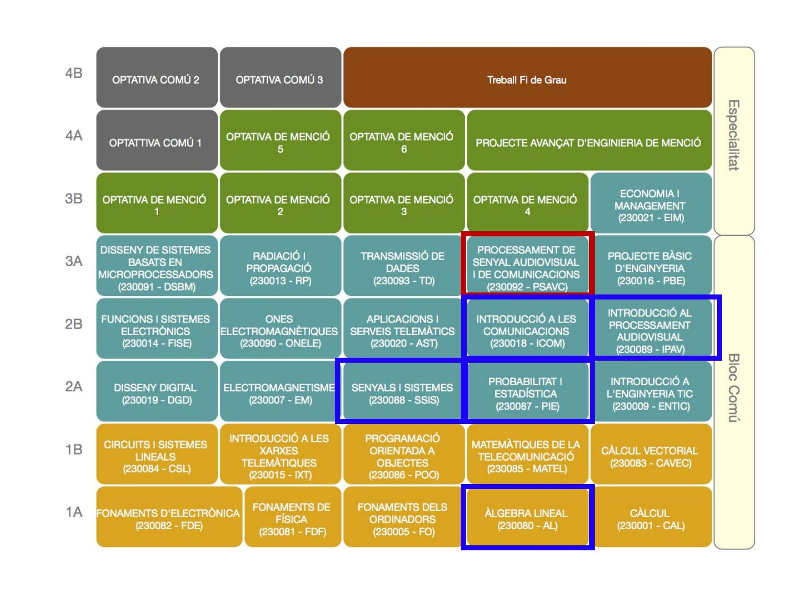

_No extractable text on this page; use the rendered page image above._

## Page 15

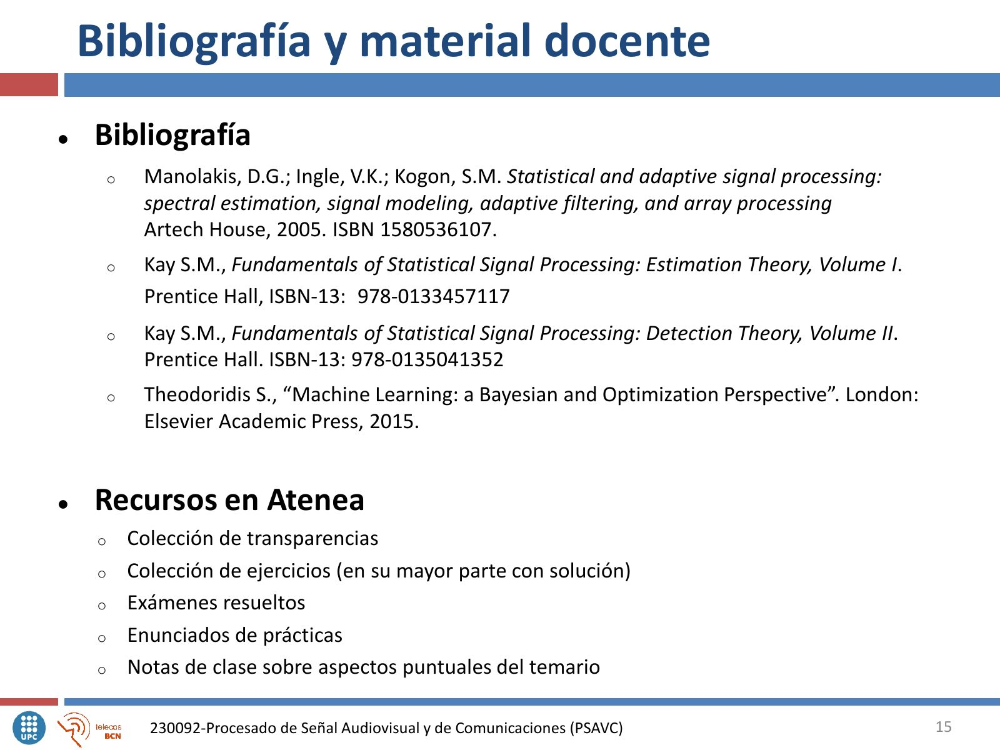

```text
    Bibliografía y material docente
●   Bibliografía
         o    Manolakis, D.G.; Ingle, V.K.; Kogon, S.M. Statistical and adaptive signal processing:
              spectral estimation, signal modeling, adaptive filtering, and array processing
              Artech House, 2005. ISBN 1580536107.
         o    Kay S.M., Fundamentals of Statistical Signal Processing: Estimation Theory, Volume I.
              Prentice Hall, ISBN-13: 978-0133457117
         o    Kay S.M., Fundamentals of Statistical Signal Processing: Detection Theory, Volume II.
              Prentice Hall. ISBN-13: 978-0135041352
         o    Theodoridis S., “Machine Learning: a Bayesian and Optimization Perspective”. London:
              Elsevier Academic Press, 2015.


●   Recursos en Atenea
     o       Colección de transparencias
     o       Colección de ejercicios (en su mayor parte con solución)
     o       Exámenes resueltos
     o       Enunciados de prácticas
     o       Notas de clase sobre aspectos puntuales del temario

               230092-Procesado de Señal Audiovisual y de Comunicaciones (PSAVC)                      15
```

## Page 16

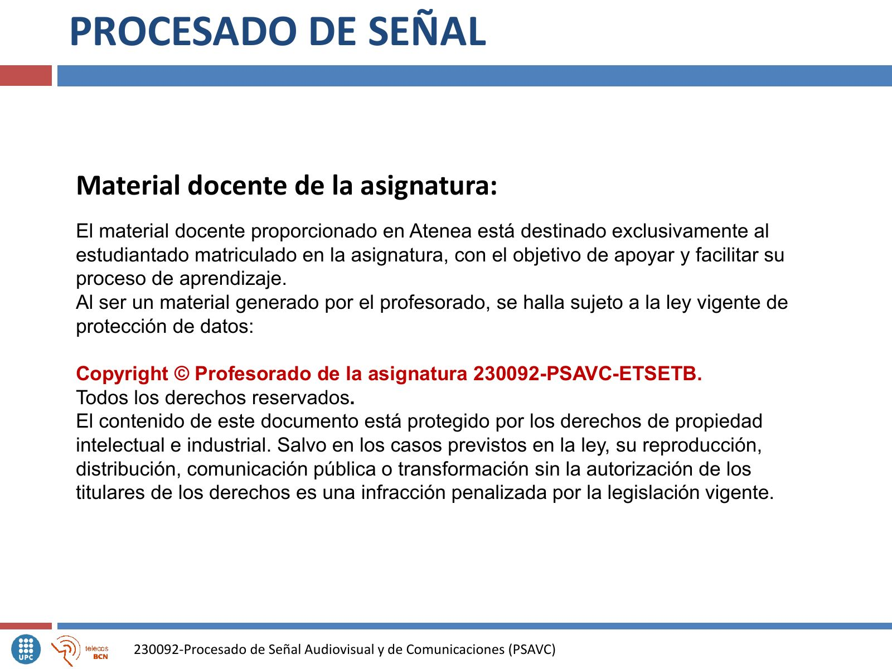

```text
PROCESADO DE SEÑAL


Material docente de la asignatura:
El material docente proporcionado en Atenea está destinado exclusivamente al
estudiantado matriculado en la asignatura, con el objetivo de apoyar y facilitar su
proceso de aprendizaje.
Al ser un material generado por el profesorado, se halla sujeto a la ley vigente de
protección de datos:

Copyright © Profesorado de la asignatura 230092-PSAVC-ETSETB.
Todos los derechos reservados.
El contenido de este documento está protegido por los derechos de propiedad
intelectual e industrial. Salvo en los casos previstos en la ley, su reproducción,
distribución, comunicación pública o transformación sin la autorización de los
titulares de los derechos es una infracción penalizada por la legislación vigente.


      230092-Procesado de Señal Audiovisual y de Comunicaciones (PSAVC)
```

## Page 17

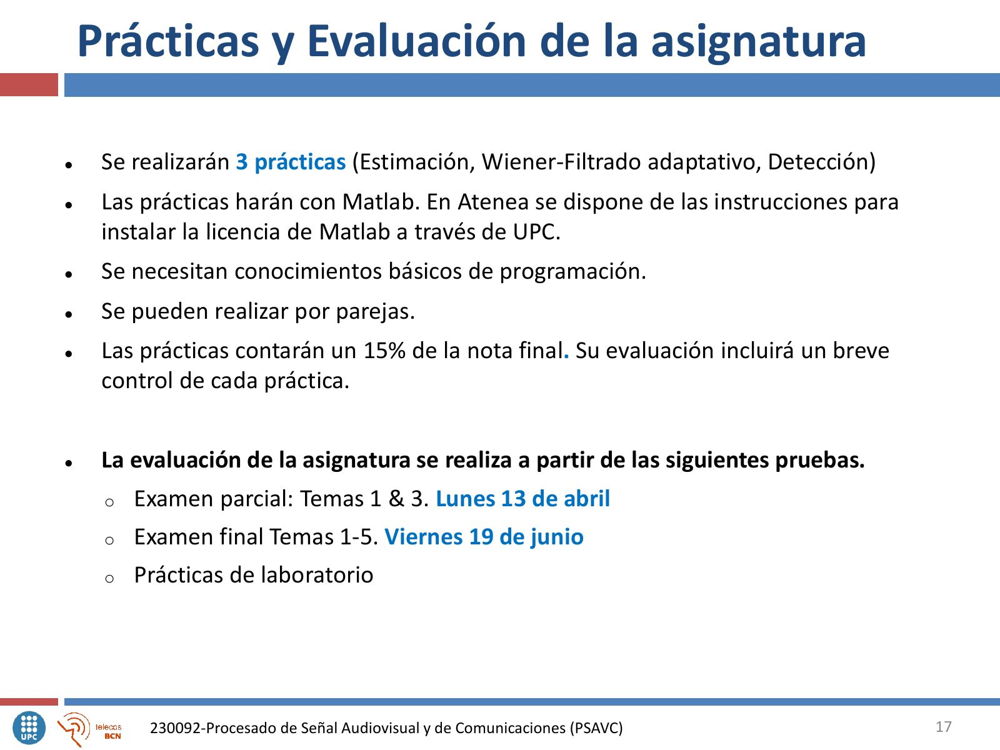

```text
    Prácticas y Evaluación de la asignatura

●    Se realizarán 3 prácticas (Estimación, Wiener-Filtrado adaptativo, Detección)
●    Las prácticas harán con Matlab. En Atenea se dispone de las instrucciones para
     instalar la licencia de Matlab a través de UPC.
●    Se necesitan conocimientos básicos de programación.
●    Se pueden realizar por parejas.
●    Las prácticas contarán un 15% de la nota final. Su evaluación incluirá un breve
     control de cada práctica.


●    La evaluación de la asignatura se realiza a partir de las siguientes pruebas.
     o   Examen parcial: Temas 1 & 3. Lunes 13 de abril
     o   Examen final Temas 1-5. Viernes 19 de junio
     o   Prácticas de laboratorio


          230092-Procesado de Señal Audiovisual y de Comunicaciones (PSAVC)            17
```
