# PSAVC 2 Deteccion QP 2026 G10

- Source PDF: `Teoria/PSAVC 2 Deteccion QP 2026 G10.pdf`
- PDF title: `Tema 2.- Teoría de la detección`
- Pages: 71
- Note: Transcribed from the embedded PDF text layer. Each page links to a rendered page image so figures, plots, handwriting, and formula layout can be checked against the original.
- Text-layer caveat: `�` marks a glyph that the PDF text layer does not map to Unicode; use the rendered page image for that formula or symbol.

## Page 1

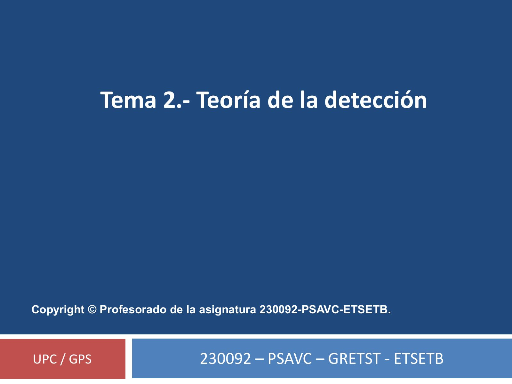

```text
            Tema 2.- Teoría de la detección


Copyright © Profesorado de la asignatura 230092-PSAVC-ETSETB.


UPC / GPS                   230092 – PSAVC – GRETST - ETSETB
```

## Page 2

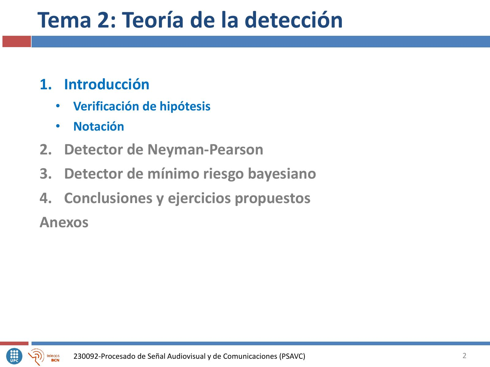

```text
Tema 2: Teoría de la detección

1. Introducción
  • Verificación de hipótesis
  • Notación
2. Detector de Neyman-Pearson
3. Detector de mínimo riesgo bayesiano
4. Conclusiones y ejercicios propuestos
Anexos


     230092-Procesado de Señal Audiovisual y de Comunicaciones (PSAVC)   2
```

## Page 3

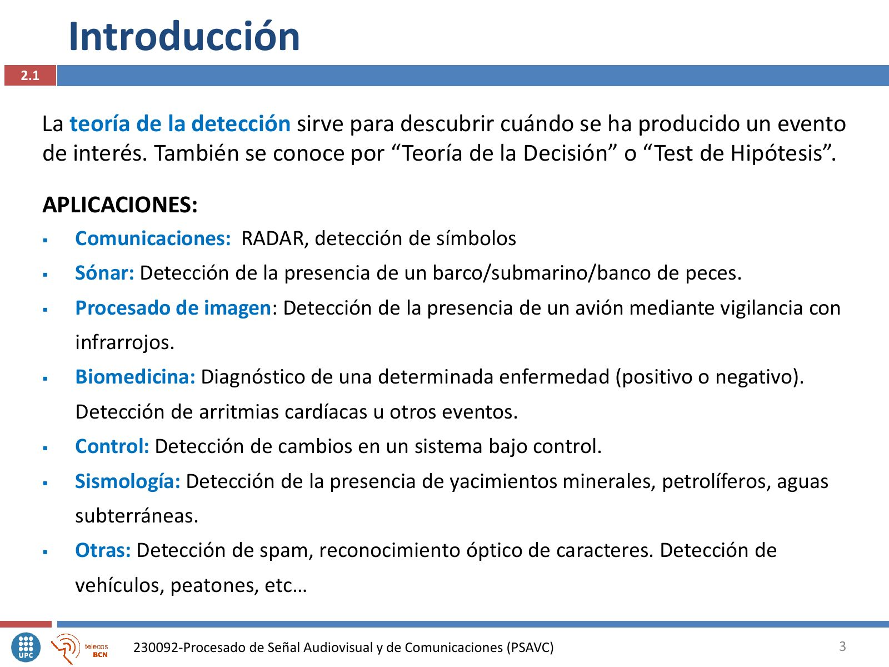

```text
          Introducción
2.1


      La teoría de la detección sirve para descubrir cuándo se ha producido un evento
      de interés. También se conoce por “Teoría de la Decisión” o “Test de Hipótesis”.

      APLICACIONES:
         Comunicaciones: RADAR, detección de símbolos
         Sónar: Detección de la presencia de un barco/submarino/banco de peces.
         Procesado de imagen: Detección de la presencia de un avión mediante vigilancia con
          infrarrojos.
         Biomedicina: Diagnóstico de una determinada enfermedad (positivo o negativo).
          Detección de arritmias cardíacas u otros eventos.
         Control: Detección de cambios en un sistema bajo control.
         Sismología: Detección de la presencia de yacimientos minerales, petrolíferos, aguas
          subterráneas.
         Otras: Detección de spam, reconocimiento óptico de caracteres. Detección de
          vehículos, peatones, etc…

                230092-Procesado de Señal Audiovisual y de Comunicaciones (PSAVC)               3
```

## Page 4

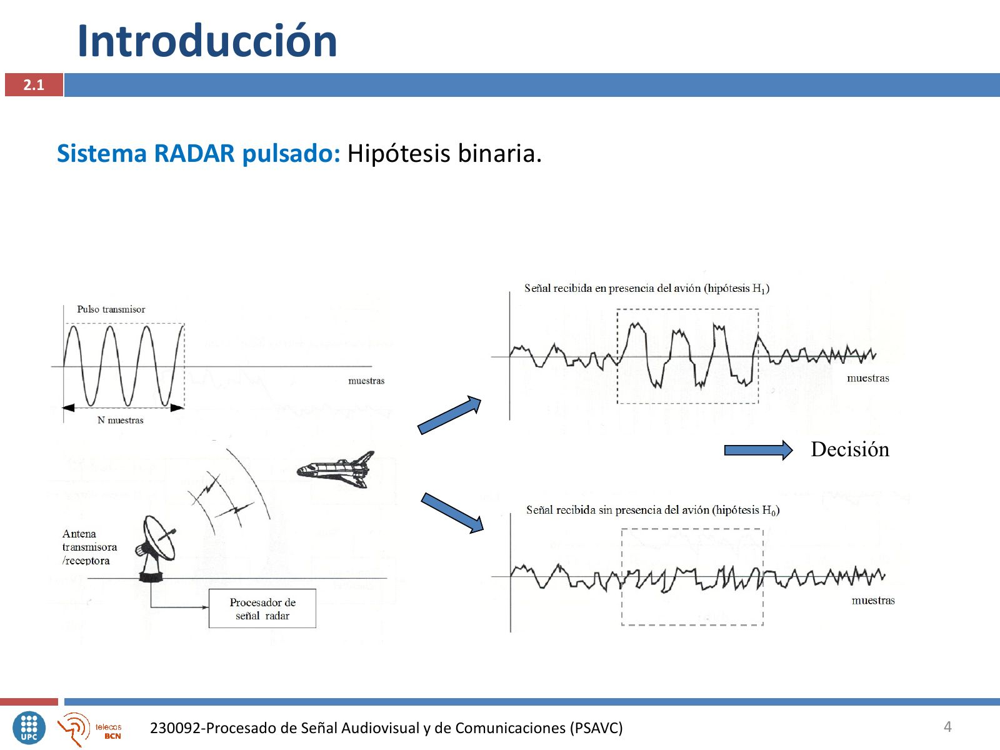

```text
       Introducción
2.1


      Sistema RADAR pulsado: Hipótesis binaria.


                                                                                 Decisión


             230092-Procesado de Señal Audiovisual y de Comunicaciones (PSAVC)              4
```

## Page 5

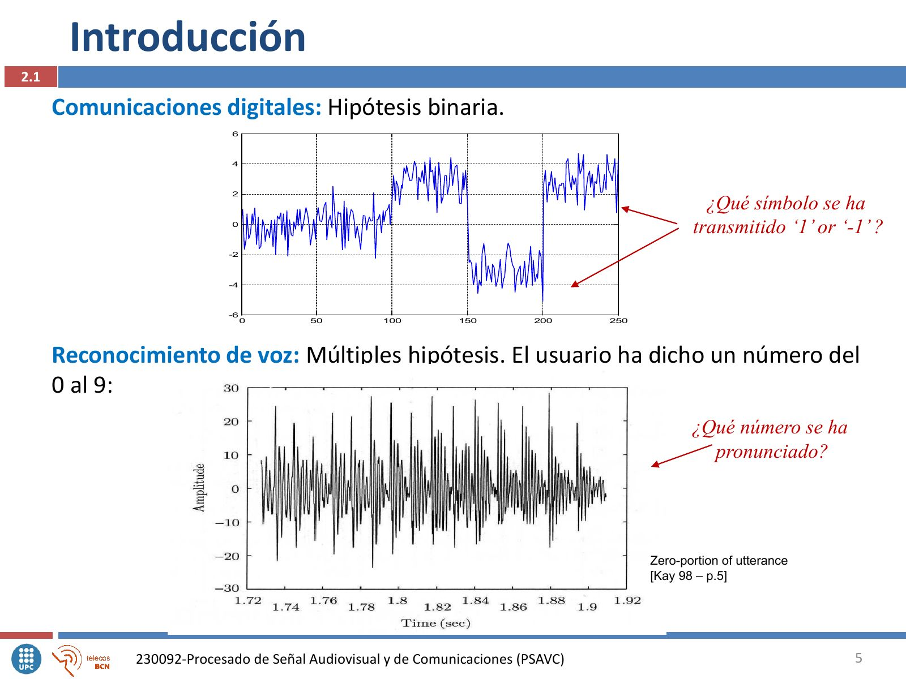

```text
       Introducción
2.1

      Comunicaciones digitales: Hipótesis binaria.
                            6


                            4


                                                                                                 ¿Qué símbolo se ha
                            2


                            0
                                                                                               transmitido ‘1’ or ‘-1’ ?
                            -2


                            -4


                            -6
                                 0      50         100        150         200     250


      Reconocimiento de voz: Múltiples hipótesis. El usuario ha dicho un número del
      0 al 9:
                                                                                               ¿Qué número se ha
                                                                                                 pronunciado?


                                                                                        Zero-portion of utterance
                                                                                        [Kay 98 – p.5]


              230092-Procesado de Señal Audiovisual y de Comunicaciones (PSAVC)                                     5
```

## Page 6

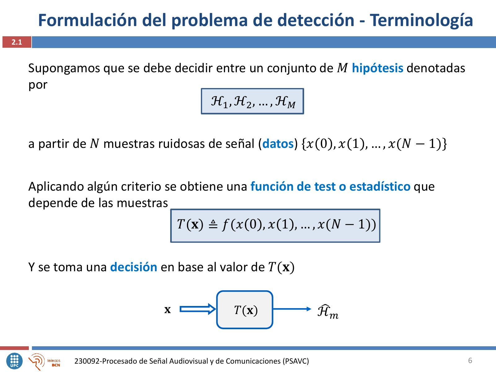

```text
       Formulación del problema de detección - Terminología
2.1


      Supongamos que se debe decidir entre un conjunto de 𝑀𝑀 hipótesis denotadas
      por
                                    ℋ1 , ℋ2 , … , ℋ𝑀𝑀


      a partir de 𝑁𝑁 muestras ruidosas de señal (datos) 𝑥𝑥 0 , 𝑥𝑥 1 , … , 𝑥𝑥(𝑁𝑁 − 1)


      Aplicando algún criterio se obtiene una función de test o estadístico que
      depende de las muestras
                                           𝑇𝑇(𝐱𝐱) ≜ 𝑓𝑓(𝑥𝑥 0 , 𝑥𝑥 1 , … , 𝑥𝑥(𝑁𝑁 − 1))


      Y se toma una decisión en base al valor de 𝑇𝑇(𝐱𝐱)


                                      𝐱𝐱                  𝑇𝑇(𝐱𝐱)                  �𝑚𝑚
                                                                                  ℋ


              230092-Procesado de Señal Audiovisual y de Comunicaciones (PSAVC)         6
```

## Page 7

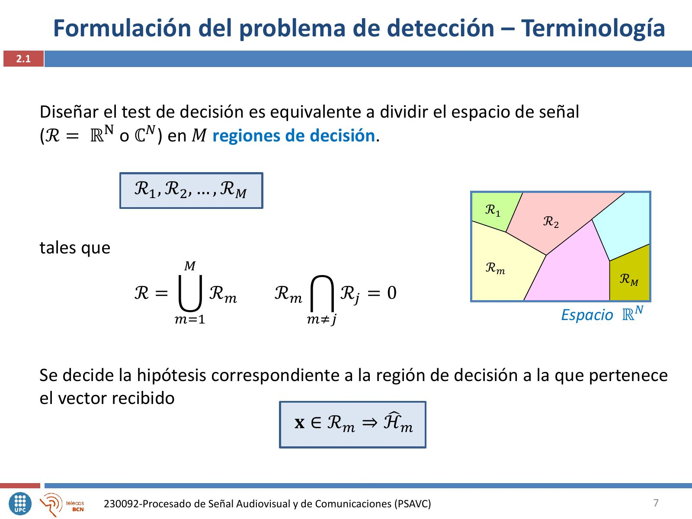

```text
       Formulación del problema de detección – Terminología
2.1


      Diseñar el test de decisión es equivalente a dividir el espacio de señal
      (ℛ = ℝN o ℂ𝑁𝑁 ) en 𝑀𝑀 regiones de decisión.

                    ℛ1 , ℛ2 , … , ℛ𝑀𝑀
                                                                                  ℛ1
                                                                                        ℛ2

      tales que
                             𝑀𝑀                                                   ℛ𝑚𝑚
                                                                                                    ℛ𝑀𝑀
                    ℛ = � ℛ𝑚𝑚                  ℛ𝑚𝑚 � ℛ𝑗𝑗 = 0
                            𝑚𝑚=1                      𝑚𝑚≠𝑗𝑗                                  Espacio ℝ𝑁𝑁


      Se decide la hipótesis correspondiente a la región de decisión a la que pertenece
      el vector recibido
                                      𝐱𝐱 ∈ ℛ𝑚𝑚 ⇒ ℋ  �𝑚𝑚


              230092-Procesado de Señal Audiovisual y de Comunicaciones (PSAVC)                            7
```

## Page 8

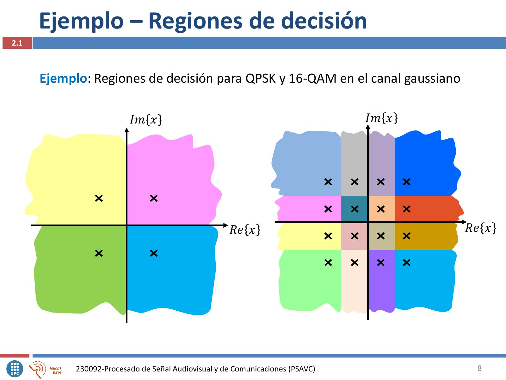

```text
      Ejemplo – Regiones de decisión
2.1


      Ejemplo: Regiones de decisión para QPSK y 16-QAM en el canal gaussiano

                          𝐼𝐼𝐼𝐼 𝑥𝑥                                               𝐼𝐼𝐼𝐼 𝑥𝑥


                                                     𝑅𝑅𝑅𝑅 𝑥𝑥                              𝑅𝑅𝑅𝑅 𝑥𝑥


            230092-Procesado de Señal Audiovisual y de Comunicaciones (PSAVC)                8
```

## Page 9

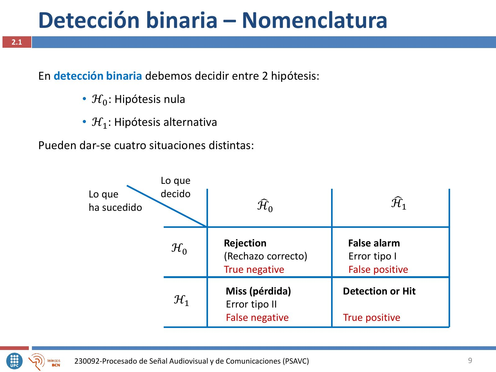

```text
      Detección binaria – Nomenclatura
2.1


      En detección binaria debemos decidir entre 2 hipótesis:
               • ℋ0 : Hipótesis nula
               • ℋ1 : Hipótesis alternativa
      Pueden dar-se cuatro situaciones distintas:

                                    Lo que
                Lo que              decido
                ha sucedido                                    �0
                                                               ℋ                           �1
                                                                                           ℋ


                                                      Rejection                   False alarm
                                       ℋ0
                                                      (Rechazo correcto)          Error tipo I
                                                      True negative               False positive
                                                      Miss (pérdida)             Detection or Hit
                                        ℋ1            Error tipo II
                                                      False negative             True positive


             230092-Procesado de Señal Audiovisual y de Comunicaciones (PSAVC)                      9
```

## Page 10

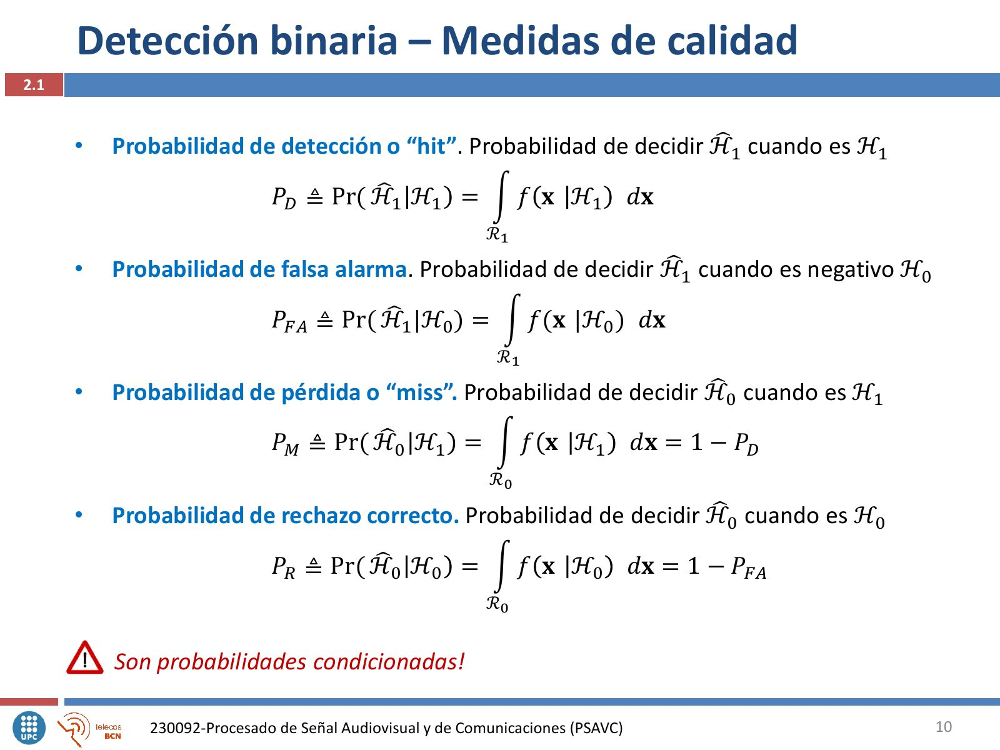

```text
      Detección binaria – Medidas de calidad
2.1


      •                                                              �1 cuando es ℋ1
          Probabilidad de detección o “hit”. Probabilidad de decidir ℋ
                                        �1 ℋ1 = � 𝑓𝑓 𝐱𝐱 ℋ1 𝑑𝑑𝑑𝑑
                             𝑃𝑃𝐷𝐷 ≜ Pr( ℋ
                                                           ℛ1

      •                                                         �1 cuando es negativo ℋ0
          Probabilidad de falsa alarma. Probabilidad de decidir ℋ
                                          �1 |ℋ0 ) = � 𝑓𝑓(𝐱𝐱 |ℋ0 ) 𝑑𝑑𝑑𝑑
                             𝑃𝑃𝐹𝐹𝐹𝐹 ≜ Pr( ℋ
                                                            ℛ1

      •                                                             �0 cuando es ℋ1
          Probabilidad de pérdida o “miss”. Probabilidad de decidir ℋ
                                        �0 ℋ1 = � 𝑓𝑓 𝐱𝐱 ℋ1 𝑑𝑑𝑑𝑑 = 1 − 𝑃𝑃𝐷𝐷
                             𝑃𝑃𝑀𝑀 ≜ Pr( ℋ
                                                           ℛ0

      •                                                             �0 cuando es ℋ0
          Probabilidad de rechazo correcto. Probabilidad de decidir ℋ
                                        �0 ℋ0 = � 𝑓𝑓 𝐱𝐱 ℋ0 𝑑𝑑𝑑𝑑 = 1 − 𝑃𝑃𝐹𝐹𝐹𝐹
                             𝑃𝑃𝑅𝑅 ≜ Pr( ℋ
                                                           ℛ0


          Son probabilidades condicionadas!

             230092-Procesado de Señal Audiovisual y de Comunicaciones (PSAVC)             10
```

## Page 11

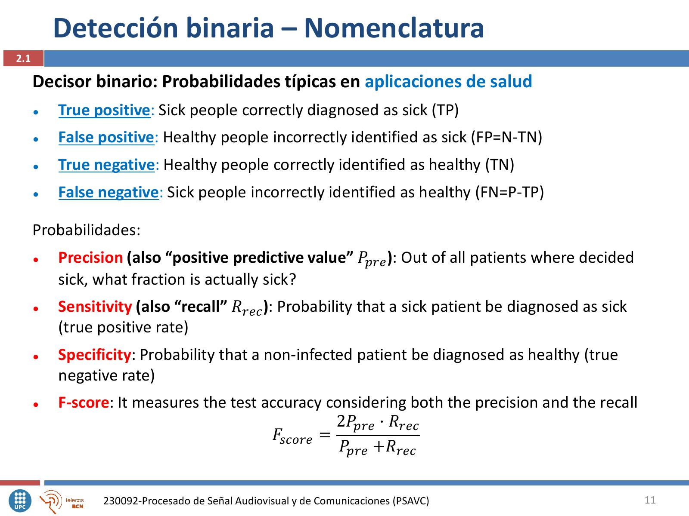

```text
          Detección binaria – Nomenclatura
2.1

      Decisor binario: Probabilidades típicas en aplicaciones de salud
      ●   True positive: Sick people correctly diagnosed as sick (TP)
      ●   False positive: Healthy people incorrectly identified as sick (FP=N-TN)
      ●   True negative: Healthy people correctly identified as healthy (TN)
      ●   False negative: Sick people incorrectly identified as healthy (FN=P-TP)

      Probabilidades:
      ●   Precision (also “positive predictive value” 𝑃𝑃𝑝𝑝𝑝𝑝𝑝𝑝 ): Out of all patients where decided
          sick, what fraction is actually sick?
      ●   Sensitivity (also “recall” 𝑅𝑅𝑟𝑟𝑟𝑟𝑟𝑟 ): Probability that a sick patient be diagnosed as sick
          (true positive rate)
      ●   Specificity: Probability that a non-infected patient be diagnosed as healthy (true
          negative rate)
      ●   F-score: It measures the test accuracy considering both the precision and the recall
                                                        2𝑃𝑃𝑝𝑝𝑝𝑝𝑝𝑝 · 𝑅𝑅𝑟𝑟𝑟𝑟𝑟𝑟
                                         𝐹𝐹𝑠𝑠𝑠𝑠𝑠𝑠𝑠𝑠𝑠𝑠 =
                                                        𝑃𝑃𝑝𝑝𝑝𝑝𝑝𝑝 +𝑅𝑅𝑟𝑟𝑟𝑟𝑟𝑟


                 230092-Procesado de Señal Audiovisual y de Comunicaciones (PSAVC)                      11
```

## Page 12

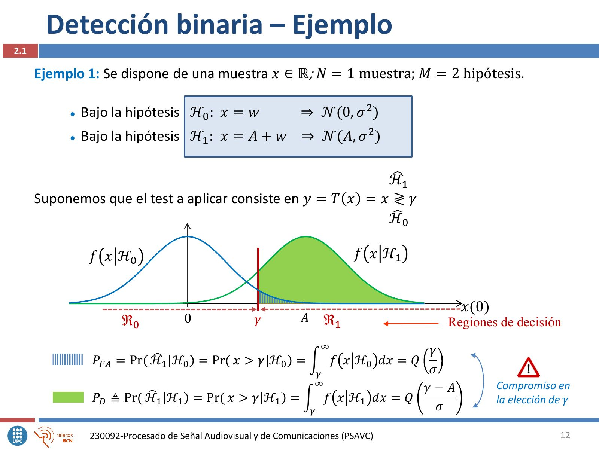

```text
       Detección binaria – Ejemplo
2.1

      Ejemplo 1: Se dispone de una muestra 𝑥𝑥 ∈ ℝ; 𝑁𝑁 = 1 muestra; 𝑀𝑀 = 2 hipótesis.

           ●   Bajo la hipótesis ℋ0 : 𝑥𝑥 = 𝑤𝑤                   ⇒ 𝒩𝒩(0, 𝜎𝜎 2 )
           ●   Bajo la hipótesis ℋ1 : 𝑥𝑥 = 𝐴𝐴 + 𝑤𝑤 ⇒ 𝒩𝒩(𝐴𝐴, 𝜎𝜎 2 )

                                                                 ℋ�1
      Suponemos que el test a aplicar consiste en 𝑦𝑦 = 𝑇𝑇 𝑥𝑥 = 𝑥𝑥 ≷ 𝛾𝛾
                                                                 ℋ�0

                𝑓𝑓 𝑥𝑥�ℋ0                                                    𝑓𝑓 𝑥𝑥�ℋ1


                                                                                              𝑥𝑥(0)
                       ℜ0            0               𝛾𝛾         𝐴𝐴   ℜ1                  Regiones de decisión
                                                                     ∞
                                                                                      𝛾𝛾
                             �1 ℋ0 = Pr( 𝑥𝑥 > 𝛾𝛾 ℋ0 = � 𝑓𝑓 𝑥𝑥�ℋ0 𝑑𝑑𝑑𝑑 = 𝑄𝑄
                𝑃𝑃𝐹𝐹𝐹𝐹 = Pr( ℋ
                                                                   𝛾𝛾                𝜎𝜎
                                                                  ∞
                                                                                    𝛾𝛾 − 𝐴𝐴           Compromiso en
                           �1 ℋ1 = Pr( 𝑥𝑥 > 𝛾𝛾 ℋ1
                𝑃𝑃𝐷𝐷 ≜ Pr( ℋ                                 = � 𝑓𝑓 𝑥𝑥�ℋ1 𝑑𝑑𝑑𝑑 = 𝑄𝑄                   la elección de 𝛾𝛾
                                                                𝛾𝛾                      𝜎𝜎

                230092-Procesado de Señal Audiovisual y de Comunicaciones (PSAVC)                                   12
```

## Page 13

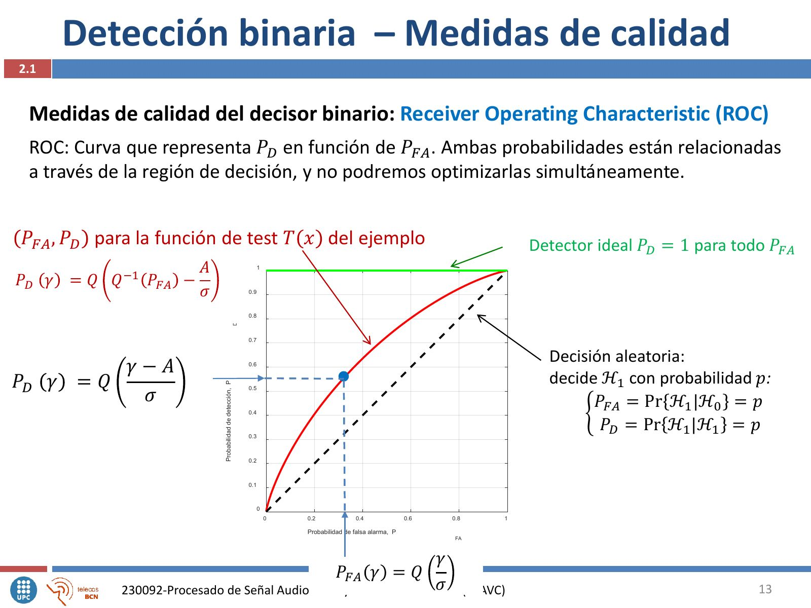

```text
      Detección binaria – Medidas de calidad
2.1


  Medidas de calidad del decisor binario: Receiver Operating Characteristic (ROC)
  ROC: Curva que representa 𝑃𝑃𝐷𝐷 en función de 𝑃𝑃𝐹𝐹𝐹𝐹 . Ambas probabilidades están relacionadas
  a través de la región de decisión, y no podremos optimizarlas simultáneamente.


 𝑃𝑃𝐹𝐹𝐹𝐹 , 𝑃𝑃𝐷𝐷 para la función de test 𝑇𝑇 𝑥𝑥 del ejemplo                                                                            Detector ideal 𝑃𝑃𝐷𝐷 = 1 para todo 𝑃𝑃𝐹𝐹𝐹𝐹
                  −1
                                𝐴𝐴                                        1

𝑃𝑃𝐷𝐷 𝛾𝛾 = 𝑄𝑄 𝑄𝑄        𝑃𝑃𝐹𝐹𝐹𝐹 −
                                𝜎𝜎                                  0.9


                                                                    0.8
                                                             D


                                                                    0.7


                                                                                                                                       Decisión aleatoria:
             𝛾𝛾 − 𝐴𝐴                                                0.6


𝑃𝑃𝐷𝐷 𝛾𝛾 = 𝑄𝑄                                                                                                                           decide ℋ1 con probabilidad 𝑝𝑝:


                                     Probabilidad de detección, P
                𝜎𝜎
                                                                    0.5

                                                                                                                                             𝑃𝑃 = Pr ℋ1 |ℋ0 = 𝑝𝑝
                                                                    0.4
                                                                                                                                            � 𝐹𝐹𝐹𝐹
                                                                    0.3
                                                                                                                                              𝑃𝑃𝐷𝐷 = Pr ℋ1 |ℋ1 = 𝑝𝑝
                                                                    0.2


                                                                    0.1


                                                                          0
                                                                              0   0.2             0.4               0.6   0.8   1

                                                                                  Probabilidad de falsa alarma, P
                                                                                                                           FA


                                                                    𝛾𝛾
                                                                                           𝑃𝑃𝐹𝐹𝐹𝐹 𝛾𝛾 = 𝑄𝑄
                                                                   𝜎𝜎 (PSAVC)
              230092-Procesado de Señal Audiovisual y de Comunicaciones                                                                                               13
```

## Page 14

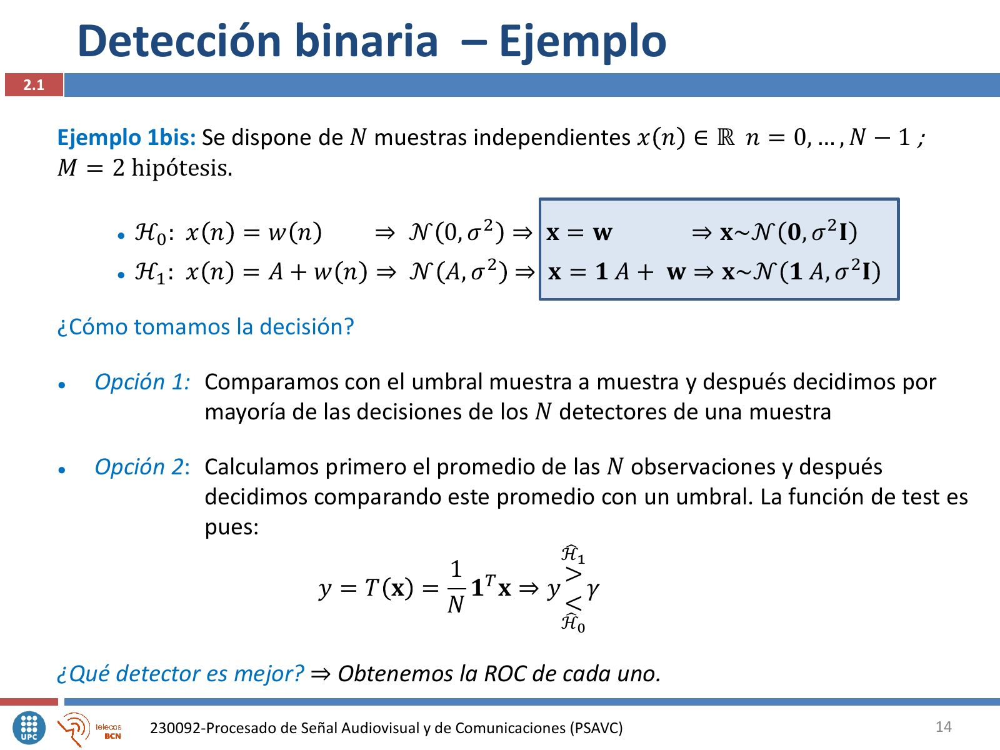

```text
          Detección binaria – Ejemplo
2.1


      Ejemplo 1bis: Se dispone de 𝑁𝑁 muestras independientes 𝑥𝑥 𝑛𝑛 ∈ ℝ 𝑛𝑛 = 0, … , 𝑁𝑁 − 1 ;
      𝑀𝑀 = 2 hipótesis.

            ●   ℋ0 : 𝑥𝑥 𝑛𝑛 = 𝑤𝑤 𝑛𝑛             ⇒ 𝒩𝒩 0, 𝜎𝜎 2 ⇒ 𝐱𝐱 = 𝐰𝐰                ⇒ 𝐱𝐱~𝒩𝒩 𝟎𝟎, 𝜎𝜎 2 𝐈𝐈
            ●   ℋ1 : 𝑥𝑥 𝑛𝑛 = 𝐴𝐴 + 𝑤𝑤 𝑛𝑛 ⇒ 𝒩𝒩 𝐴𝐴, 𝜎𝜎 2 ⇒ 𝐱𝐱 = 𝟏𝟏 𝐴𝐴 + 𝐰𝐰 ⇒ 𝐱𝐱~𝒩𝒩 𝟏𝟏 𝐴𝐴, 𝜎𝜎 2 𝐈𝐈

      ¿Cómo tomamos la decisión?

      ●   Opción 1: Comparamos con el umbral muestra a muestra y después decidimos por
                    mayoría de las decisiones de los 𝑁𝑁 detectores de una muestra

      ●   Opción 2: Calculamos primero el promedio de las 𝑁𝑁 observaciones y después
                    decidimos comparando este promedio con un umbral. La función de test es
                    pues:
                                                                         �1
                                                                         ℋ
                                                    1 𝑇𝑇       >
                                        𝑦𝑦 = 𝑇𝑇 𝐱𝐱 = 𝟏𝟏 𝐱𝐱 ⇒ 𝑦𝑦 𝛾𝛾
                                                    𝑁𝑁         <
                                                                         �0
                                                                         ℋ

      ¿Qué detector es mejor? ⇒ Obtenemos la ROC de cada uno.

                 230092-Procesado de Señal Audiovisual y de Comunicaciones (PSAVC)                         14
```

## Page 15

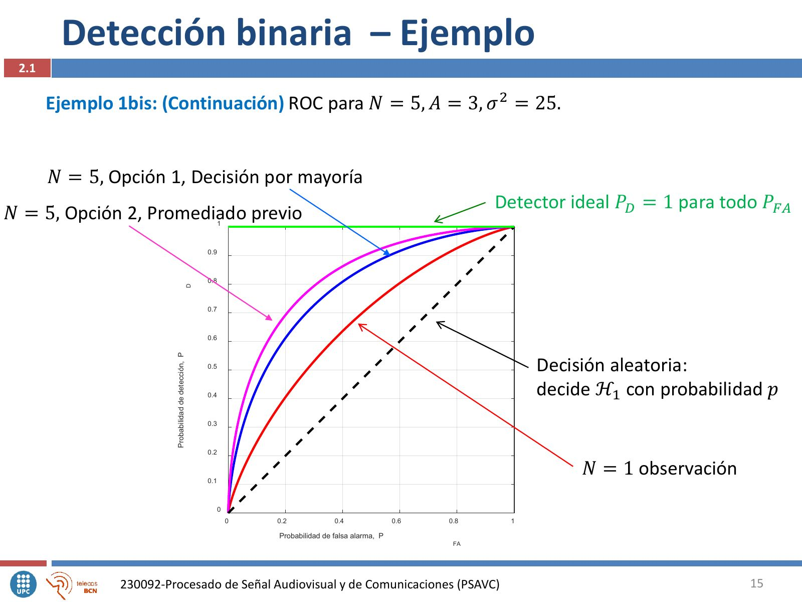

```text
        Detección binaria – Ejemplo
 2.1

       Ejemplo 1bis: (Continuación) ROC para 𝑁𝑁 = 5, 𝐴𝐴 = 3, 𝜎𝜎 2 = 25.


       𝑁𝑁 = 5, Opción 1, Decisión por mayoría
                                                                                                                    Detector ideal 𝑃𝑃𝐷𝐷 = 1 para todo 𝑃𝑃𝐹𝐹𝐹𝐹
𝑁𝑁 = 5, Opción 2, Promediado previo                           1


                                                        0.9


                                                        0.8
                                                 D


                                                        0.7


                                                        0.6


                                                                                                                          Decisión aleatoria:

                         Probabilidad de detección, P
                                                        0.5


                                                        0.4                                                               decide ℋ1 con probabilidad 𝑝𝑝
                                                        0.3


                                                        0.2


                                                        0.1
                                                                                                                               𝑁𝑁 = 1 observación
                                                              0
                                                                  0   0.2             0.4               0.6   0.8     1

                                                                      Probabilidad de falsa alarma, P
                                                                                                               FA


                230092-Procesado de Señal Audiovisual y de Comunicaciones (PSAVC)                                                                     15
```

## Page 16

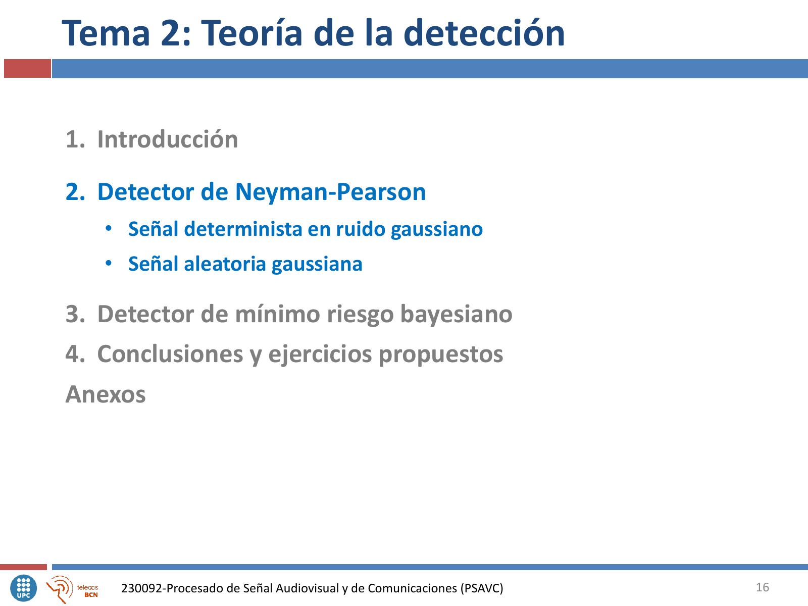

```text
Tema 2: Teoría de la detección

1. Introducción
2. Detector de Neyman-Pearson
   • Señal determinista en ruido gaussiano
   • Señal aleatoria gaussiana

3. Detector de mínimo riesgo bayesiano
4. Conclusiones y ejercicios propuestos
Anexos


    230092-Procesado de Señal Audiovisual y de Comunicaciones (PSAVC)   16
```

## Page 17

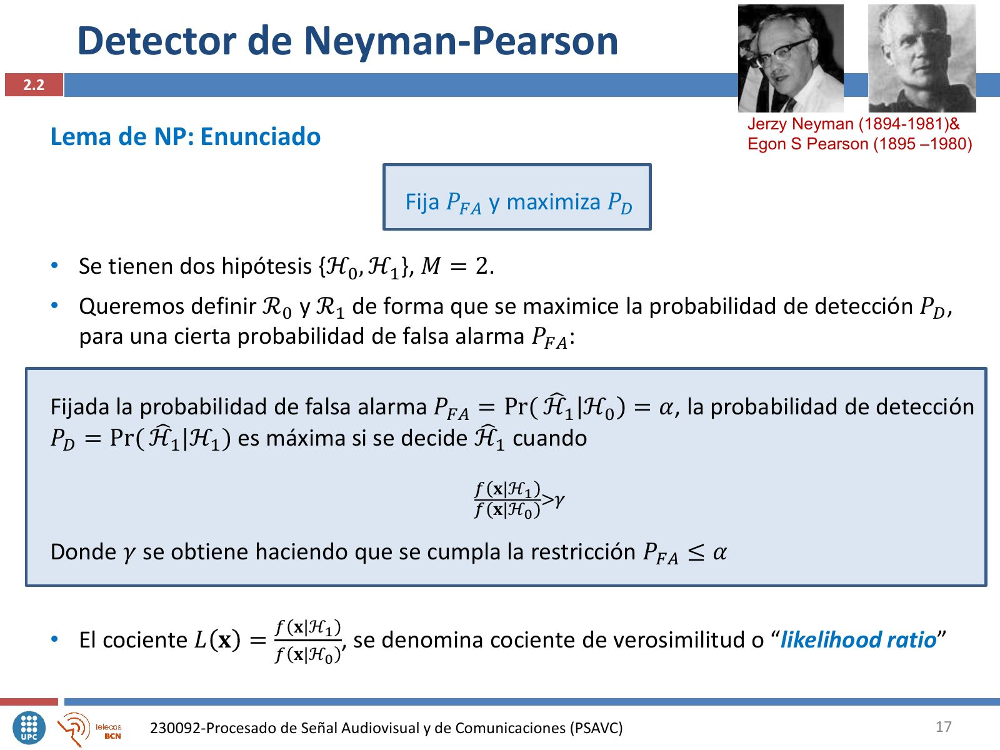

```text
        Detector de Neyman-Pearson
2.2

                                                                                    Jerzy Neyman (1894-1981)&
      Lema de NP: Enunciado                                                         Egon S Pearson (1895 –1980)


                                                   Fija 𝑃𝑃𝐹𝐹𝐹𝐹 y maximiza 𝑃𝑃𝐷𝐷

      • Se tienen dos hipótesis {ℋ0 , ℋ1 }, 𝑀𝑀 = 2.
      • Queremos definir ℛ0 y ℛ1 de forma que se maximice la probabilidad de detección 𝑃𝑃𝐷𝐷 ,
        para una cierta probabilidad de falsa alarma 𝑃𝑃𝐹𝐹𝐹𝐹 :

                                                          �1 ℋ0 = 𝛼𝛼, la probabilidad de detección
      Fijada la probabilidad de falsa alarma 𝑃𝑃𝐹𝐹𝐹𝐹 = Pr( ℋ
                 �1 |ℋ1 ) es máxima si se decide ℋ
      𝑃𝑃𝐷𝐷 = Pr( ℋ                                  �1 cuando

                                                            𝑓𝑓 𝐱𝐱|ℋ1
                                                                     >𝛾𝛾
                                                            𝑓𝑓 𝐱𝐱|ℋ0

      Donde 𝛾𝛾 se obtiene haciendo que se cumpla la restricción 𝑃𝑃𝐹𝐹𝐹𝐹 ≤ 𝛼𝛼

                                 𝑓𝑓 𝐱𝐱|ℋ
      • El cociente 𝐿𝐿 𝐱𝐱 = 𝑓𝑓 𝐱𝐱|ℋ1 , se denomina cociente de verosimilitud o “likelihood ratio”
                                       0


                230092-Procesado de Señal Audiovisual y de Comunicaciones (PSAVC)                         17
```

## Page 18

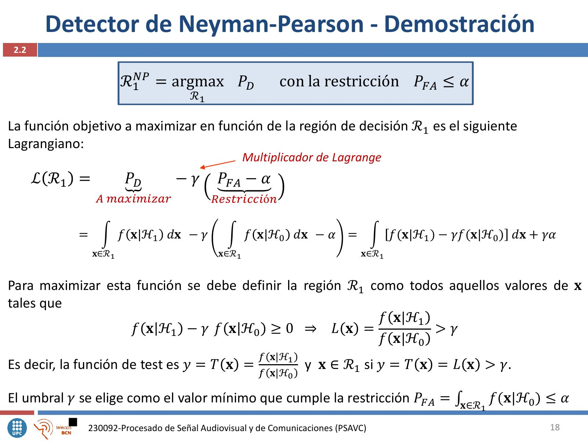

```text
        Detector de Neyman-Pearson - Demostración
 2.2


                        ℛ1𝑁𝑁𝑁𝑁 = argmax 𝑃𝑃𝐷𝐷                           con la restricción 𝑃𝑃𝐹𝐹𝐹𝐹 ≤ 𝛼𝛼
                                          ℛ1

La función objetivo a maximizar en función de la región de decisión ℛ1 es el siguiente
Lagrangiano:
                                                         Multiplicador de Lagrange
       ℒ ℛ1 =           𝑃𝑃
                        � 𝐷𝐷            − 𝛾𝛾    𝑃𝑃𝐹𝐹𝐹𝐹 − 𝛼𝛼
                𝐴𝐴 𝑚𝑚𝑚𝑚𝑚𝑚𝑚𝑚𝑚𝑚𝑚𝑚𝑚𝑚𝑚𝑚𝑚𝑚          𝑅𝑅𝑅𝑅𝑅𝑅𝑅𝑅𝑅𝑅𝑅𝑅𝑅𝑅𝑅𝑅𝑅𝑅𝑅𝑅𝑅

            = � 𝑓𝑓 𝐱𝐱|ℋ1 𝑑𝑑𝑑𝑑 − 𝛾𝛾                  � 𝑓𝑓 𝐱𝐱|ℋ0 𝑑𝑑𝑑𝑑 − 𝛼𝛼 = � 𝑓𝑓(𝐱𝐱|ℋ1 ) − 𝛾𝛾𝛾𝛾(𝐱𝐱|ℋ0 ) 𝑑𝑑𝑑𝑑 + 𝛾𝛾𝛾𝛾
                𝐱𝐱∈ℛ1                            𝐱𝐱∈ℛ1                             𝐱𝐱∈ℛ1


Para maximizar esta función se debe definir la región ℛ1 como todos aquellos valores de 𝐱𝐱
tales que
                                                          𝑓𝑓 𝐱𝐱|ℋ1
                   𝑓𝑓 𝐱𝐱 ℋ1 − 𝛾𝛾 𝑓𝑓 𝐱𝐱 ℋ0 ≥ 0 ⇒ 𝐿𝐿 𝐱𝐱 =            > 𝛾𝛾
                                                          𝑓𝑓 𝐱𝐱|ℋ0
                                                              𝑓𝑓 𝐱𝐱|ℋ
Es decir, la función de test es 𝑦𝑦 = 𝑇𝑇 𝐱𝐱 = 𝑓𝑓 𝐱𝐱|ℋ1 y 𝐱𝐱 ∈ ℛ1 si 𝑦𝑦 = 𝑇𝑇 𝐱𝐱 = 𝐿𝐿 𝐱𝐱 > 𝛾𝛾.
                                                                        0

El umbral 𝛾𝛾 se elige como el valor mínimo que cumple la restricción 𝑃𝑃𝐹𝐹𝐹𝐹 = ∫𝐱𝐱∈ℛ 𝑓𝑓(𝐱𝐱|ℋ0 ) ≤ 𝛼𝛼
                                                                                                        1
          ∎ 230092-Procesado de Señal Audiovisual y de Comunicaciones (PSAVC)                                   18
```

## Page 19

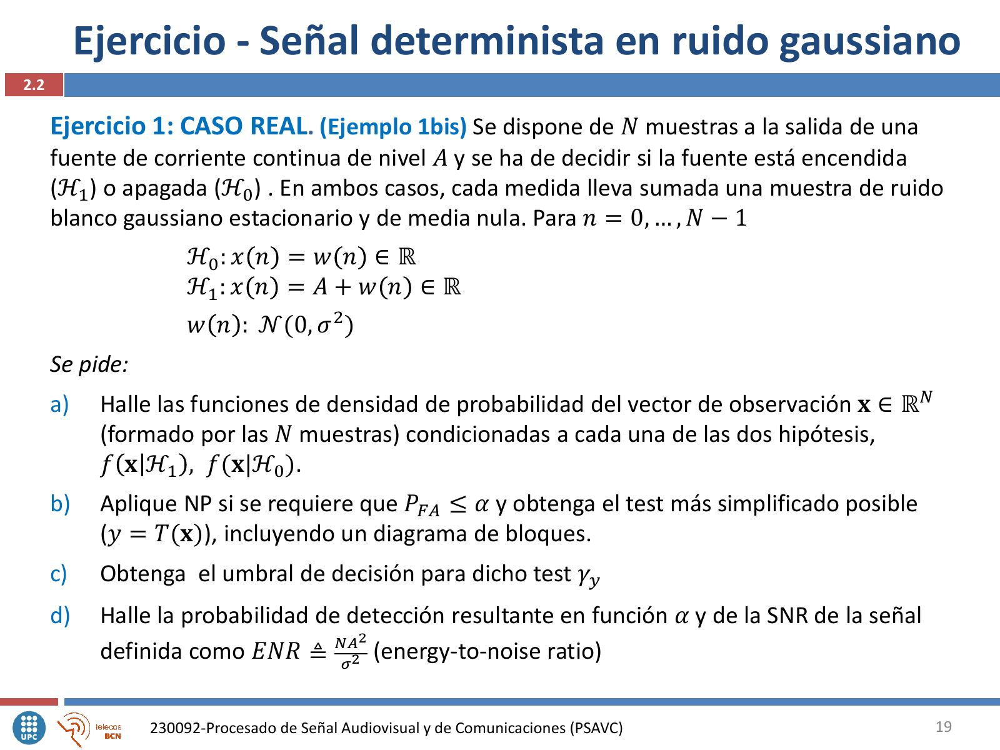

```text
           Ejercicio - Señal determinista en ruido gaussiano
2.2

      Ejercicio 1: CASO REAL. (Ejemplo 1bis) Se dispone de 𝑁𝑁 muestras a la salida de una
      fuente de corriente continua de nivel 𝐴𝐴 y se ha de decidir si la fuente está encendida
      (ℋ1 ) o apagada (ℋ0 ) . En ambos casos, cada medida lleva sumada una muestra de ruido
      blanco gaussiano estacionario y de media nula. Para 𝑛𝑛 = 0, … , 𝑁𝑁 − 1
                      ℋ0 : 𝑥𝑥 𝑛𝑛 = 𝑤𝑤 𝑛𝑛 ∈ ℝ
                      ℋ1 : 𝑥𝑥 𝑛𝑛 = 𝐴𝐴 + 𝑤𝑤 𝑛𝑛 ∈ ℝ
                      𝑤𝑤 𝑛𝑛 : 𝒩𝒩(0, 𝜎𝜎 2 )
      Se pide:
      a)    Halle las funciones de densidad de probabilidad del vector de observación 𝐱𝐱 ∈ ℝ𝑁𝑁
            (formado por las 𝑁𝑁 muestras) condicionadas a cada una de las dos hipótesis,
            𝑓𝑓 𝐱𝐱 ℋ1 , 𝑓𝑓(𝐱𝐱|ℋ0 ).
      b)    Aplique NP si se requiere que 𝑃𝑃𝐹𝐹𝐹𝐹 ≤ 𝛼𝛼 y obtenga el test más simplificado posible
            (𝑦𝑦 = 𝑇𝑇(𝐱𝐱)), incluyendo un diagrama de bloques.
      c)    Obtenga el umbral de decisión para dicho test 𝛾𝛾𝑦𝑦
      d)    Halle la probabilidad de detección resultante en función 𝛼𝛼 y de la SNR de la señal
                                        2
            definida como 𝐸𝐸𝐸𝐸𝐸𝐸 ≜ 𝑁𝑁𝑁𝑁
                                    𝜎𝜎2
                                          (energy-to-noise ratio)

                 230092-Procesado de Señal Audiovisual y de Comunicaciones (PSAVC)                 19
```

## Page 20

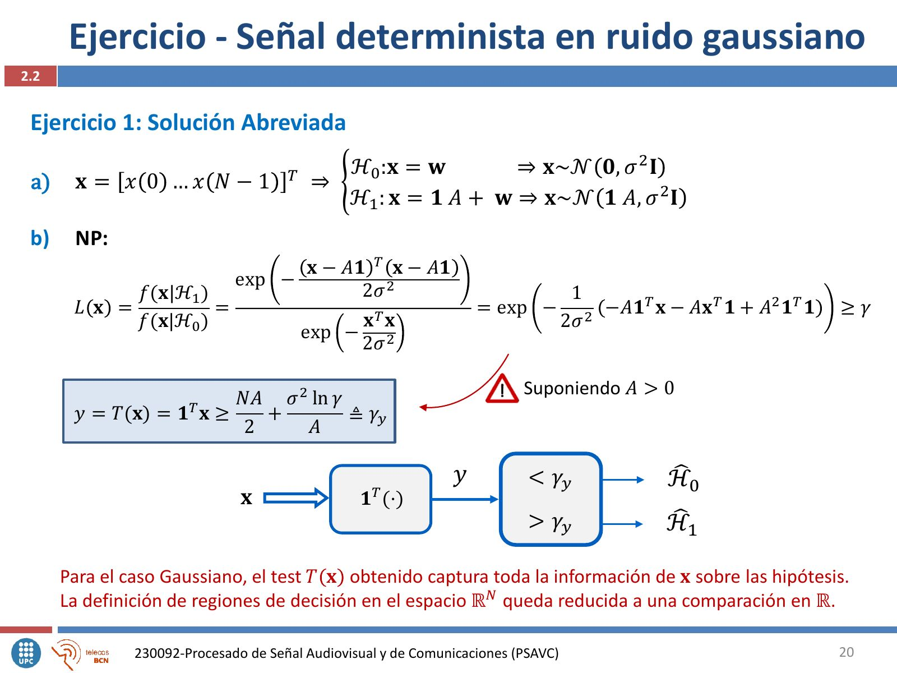

```text
       Ejercicio - Señal determinista en ruido gaussiano
2.2


 Ejercicio 1: Solución Abreviada

                                        𝑇𝑇        ℋ0 :𝐱𝐱 = 𝐰𝐰          ⇒ 𝐱𝐱~𝒩𝒩 𝟎𝟎, 𝜎𝜎 2 𝐈𝐈
 a)     𝐱𝐱 = 𝑥𝑥 0 … 𝑥𝑥 𝑁𝑁 − 1                 ⇒ �
                                                  ℋ1 : 𝐱𝐱 = 𝟏𝟏 𝐴𝐴 + 𝐰𝐰 ⇒ 𝐱𝐱~𝒩𝒩 𝟏𝟏 𝐴𝐴, 𝜎𝜎 2 𝐈𝐈
 b)     NP:
                                      𝐱𝐱 − 𝐴𝐴𝐴𝐴 𝑇𝑇 𝐱𝐱 − 𝐴𝐴𝐴𝐴
                                exp −
                 𝑓𝑓(𝐱𝐱|ℋ1 )                   2𝜎𝜎 2                                   1
       𝐿𝐿 𝐱𝐱 =              =                                         = exp −              −𝐴𝐴𝟏𝟏𝑇𝑇 𝐱𝐱 − 𝐴𝐴𝐱𝐱 𝑇𝑇 𝟏𝟏 + 𝐴𝐴2 𝟏𝟏𝑇𝑇 𝟏𝟏   ≥ 𝛾𝛾
                 𝑓𝑓(𝐱𝐱|ℋ0 )                       𝐱𝐱 𝑇𝑇 𝐱𝐱                           2𝜎𝜎 2
                                             exp − 2
                                                  2𝜎𝜎

                                                                            Suponiendo 𝐴𝐴 > 0
                         𝑇𝑇
                             𝑁𝑁𝐴𝐴 𝜎𝜎 2 ln 𝛾𝛾
       𝑦𝑦 = 𝑇𝑇(𝐱𝐱) = 𝟏𝟏 𝐱𝐱 ≥     +           ≜ 𝛾𝛾𝑦𝑦
                              2       𝐴𝐴

                                                                 𝑦𝑦          < 𝛾𝛾𝑦𝑦                    �0
                                                                                                       ℋ
                                 𝐱𝐱                   𝑇𝑇
                                                     𝟏𝟏 (·)
                                                                             > 𝛾𝛾𝑦𝑦                   �1
                                                                                                      ℋ

      Para el caso Gaussiano, el test 𝑇𝑇 𝐱𝐱 obtenido captura toda la información de 𝐱𝐱 sobre las hipótesis.
      La definición de regiones de decisión en el espacio ℝ𝑁𝑁 queda reducida a una comparación en ℝ.

                 230092-Procesado de Señal Audiovisual y de Comunicaciones (PSAVC)                                                 20
```

## Page 21

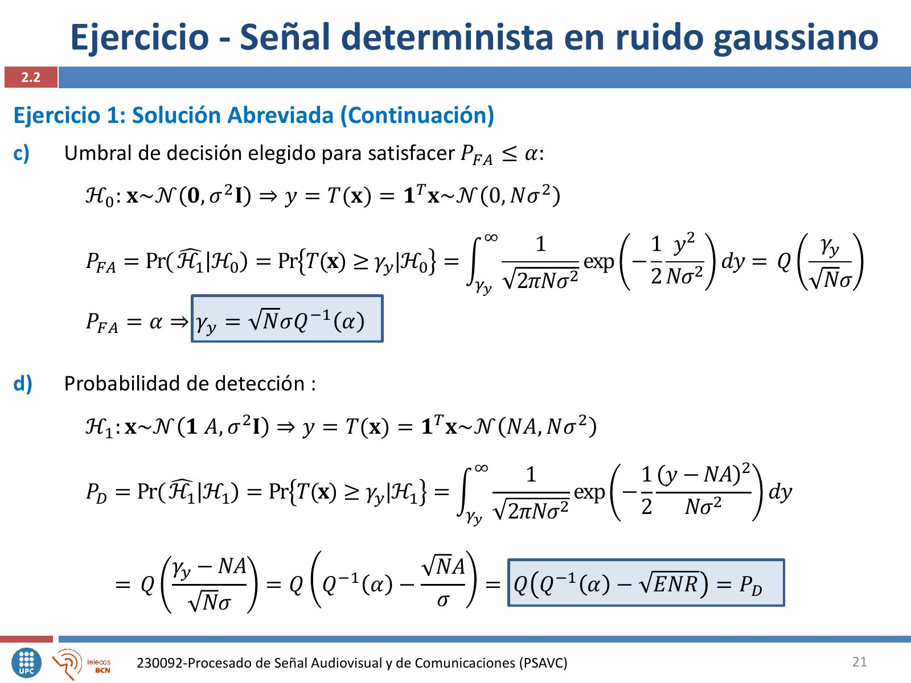

```text
      Ejercicio - Señal determinista en ruido gaussiano
2.2

Ejercicio 1: Solución Abreviada (Continuación)
c)    Umbral de decisión elegido para satisfacer 𝑃𝑃𝐹𝐹𝐹𝐹 ≤ 𝛼𝛼:
        ℋ0 : 𝐱𝐱~𝒩𝒩 𝟎𝟎, 𝜎𝜎 2 𝐈𝐈 ⇒ 𝑦𝑦 = 𝑇𝑇(𝐱𝐱) = 𝟏𝟏𝑇𝑇 𝐱𝐱~𝒩𝒩 0, 𝑁𝑁𝜎𝜎 2
                                                                      ∞
                                                                             1            1 𝑦𝑦2                𝛾𝛾𝑦𝑦
                     �1 ℋ0 = Pr 𝑇𝑇(𝐱𝐱) ≥ 𝛾𝛾𝑦𝑦|ℋ0 = �
        𝑃𝑃𝐹𝐹𝐹𝐹 = Pr( ℋ                                                              exp −         𝑑𝑑𝑑𝑑 = 𝑄𝑄
                                                                 𝛾𝛾𝑦𝑦      2𝜋𝜋𝑁𝑁𝑁𝑁2       2 𝑁𝑁𝑁𝑁2              𝑁𝑁𝜎𝜎
        𝑃𝑃𝐹𝐹𝐹𝐹 = 𝛼𝛼 ⇒ 𝛾𝛾𝑦𝑦 = 𝑁𝑁𝜎𝜎𝑄𝑄 −1 𝛼𝛼

d)    Probabilidad de detección :
        ℋ1 : 𝐱𝐱~𝒩𝒩 𝟏𝟏 𝐴𝐴, 𝜎𝜎 2 𝐈𝐈 ⇒ 𝑦𝑦 = 𝑇𝑇(𝐱𝐱) = 𝟏𝟏𝑇𝑇 𝐱𝐱~𝒩𝒩 𝑁𝑁𝑁𝑁, 𝑁𝑁𝜎𝜎 2
                                                                ∞
                                                                            1             1 𝑦𝑦 − 𝑁𝑁𝑁𝑁 2
                   �1 ℋ1 = Pr 𝑇𝑇(𝐱𝐱) ≥ 𝛾𝛾𝑦𝑦|ℋ1 = �
        𝑃𝑃𝐷𝐷 = Pr( ℋ                                                                exp −               𝑑𝑑𝑑𝑑
                                                                                  2       2    𝑁𝑁𝑁𝑁 2
                                                               𝛾𝛾𝑦𝑦       2𝜋𝜋𝑁𝑁𝑁𝑁

                   𝛾𝛾𝑦𝑦 − 𝑁𝑁𝑁𝑁                             𝑁𝑁𝐴𝐴
           = 𝑄𝑄                  = 𝑄𝑄 𝑄𝑄 −1 𝛼𝛼 −                = 𝑄𝑄 𝑄𝑄 −1 𝛼𝛼 − 𝐸𝐸𝑁𝑁𝑁𝑁 = 𝑃𝑃𝐷𝐷
                       𝑁𝑁𝜎𝜎                                𝜎𝜎

              230092-Procesado de Señal Audiovisual y de Comunicaciones (PSAVC)                                       21
```

## Page 22

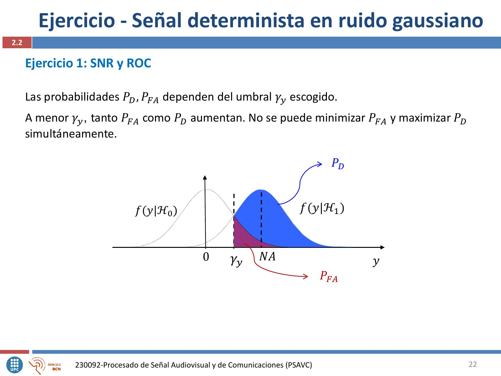

```text
        Ejercicio - Señal determinista en ruido gaussiano
2.2

      Ejercicio 1: SNR y ROC

      Las probabilidades 𝑃𝑃𝐷𝐷 , 𝑃𝑃𝐹𝐹𝐹𝐹 dependen del umbral 𝛾𝛾𝑦𝑦 escogido.
      A menor 𝛾𝛾𝑦𝑦 , tanto 𝑃𝑃𝐹𝐹𝐹𝐹 como 𝑃𝑃𝐷𝐷 aumentan. No se puede minimizar 𝑃𝑃𝐹𝐹𝐹𝐹 y maximizar 𝑃𝑃𝐷𝐷
      simultáneamente.

                                                                                       𝑃𝑃𝐷𝐷


                                𝑓𝑓(𝑦𝑦|ℋ0 )                                   𝑓𝑓(𝑦𝑦|ℋ1 )


                                                  0       𝛾𝛾𝑦𝑦    𝑁𝑁𝑁𝑁                        𝑦𝑦
                                                                                    𝑃𝑃𝐹𝐹𝐹𝐹


                230092-Procesado de Señal Audiovisual y de Comunicaciones (PSAVC)                     22
```

## Page 23

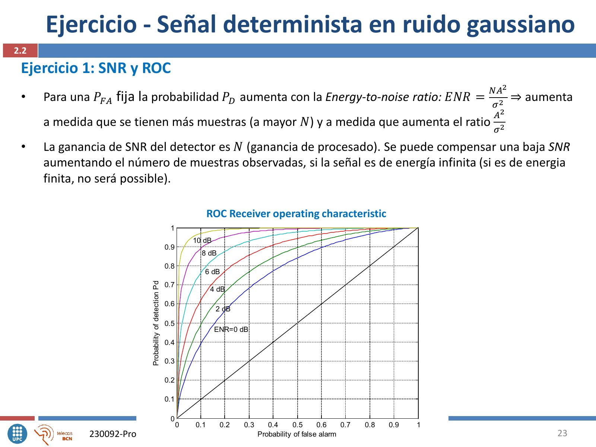

```text
      Ejercicio - Señal determinista en ruido gaussiano
2.2
 Ejercicio 1: SNR y ROC
                                                                                      𝑁𝑁𝑁𝑁2
 •    Para una 𝑃𝑃𝐹𝐹𝐹𝐹 fija la probabilidad 𝑃𝑃𝐷𝐷 aumenta con la Energy-to-noise ratio: 𝐸𝐸𝐸𝐸𝐸𝐸 =
                                                                                            ⇒ aumenta
                                                                                       𝜎𝜎2
                                                                                       𝐴𝐴2
      a medida que se tienen más muestras (a mayor 𝑁𝑁) y a medida que aumenta el ratio 2
                                                                                       𝜎𝜎
 •    La ganancia de SNR del detector es 𝑁𝑁 (ganancia de procesado). Se puede compensar una baja SNR
      aumentando el número de muestras observadas, si la señal es de energía infinita (si es de energia
      finita, no será possible).

                                                                            ROC Receiver operating characteristic
                                                             1
                                                                      10 dB
                                                            0.9
                                                                        8 dB
                                                            0.8
                                                                         6 dB
                                                            0.7


                              Probability of detection Pd
                                                                            4 dB
                                                            0.6
                                                                              2 dB

                                                            0.5
                                                                              ENR=0 dB
                                                            0.4

                                                            0.3

                                                            0.2

                                                            0.1

                                                             0
                                                                  0   0.1      0.2   0.3   0.4   0.5   0.6   0.7   0.8   0.9   1
               230092-Procesado de Señal Audiovisual y de Comunicaciones
                                                      Probability of false alarm (PSAVC)                                           23
```

## Page 24

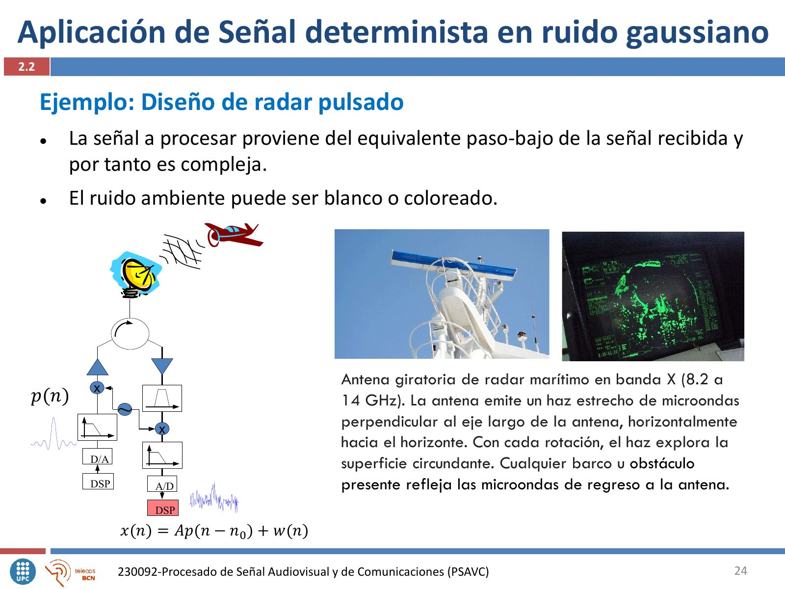

```text
Aplicación de Señal determinista en ruido gaussiano
2.2

      Ejemplo: Diseño de radar pulsado
      ●   La señal a procesar proviene del equivalente paso-bajo de la señal recibida y
          por tanto es compleja.
      ●   El ruido ambiente puede ser blanco o coloreado.


            x
                                                         Antena giratoria de radar marítimo en banda X (8.2 a
  𝑝𝑝(𝑛𝑛)
                  ~                                      14 GHz). La antena emite un haz estrecho de microondas
                                                         perpendicular al eje largo de la antena, horizontalmente
                         x
                                                         hacia el horizonte. Con cada rotación, el haz explora la
            D/A
                                                         superficie circundante. Cualquier barco u obstáculo
            DSP         A/D                              presente refleja las microondas de regreso a la antena.
                        DSP
                  𝑥𝑥(𝑛𝑛) = 𝐴𝐴𝐴𝐴(𝑛𝑛 − 𝑛𝑛0 ) + 𝑤𝑤(𝑛𝑛)

                  230092-Procesado de Señal Audiovisual y de Comunicaciones (PSAVC)                             24
```

## Page 25

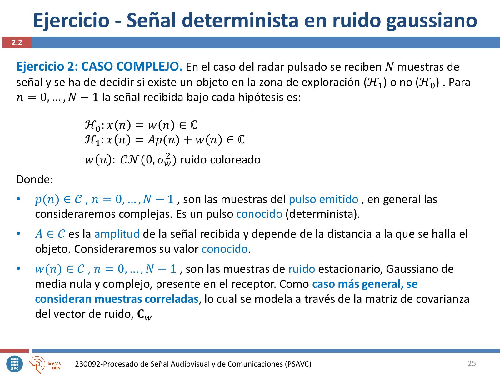

```text
      Ejercicio - Señal determinista en ruido gaussiano
2.2


 Ejercicio 2: CASO COMPLEJO. En el caso del radar pulsado se reciben 𝑁𝑁 muestras de
 señal y se ha de decidir si existe un objeto en la zona de exploración (ℋ1 ) o no (ℋ0 ) . Para
 𝑛𝑛 = 0, … , 𝑁𝑁 − 1 la señal recibida bajo cada hipótesis es:

                ℋ0 : 𝑥𝑥 𝑛𝑛 = 𝑤𝑤 𝑛𝑛 ∈ ℂ
                ℋ1 : 𝑥𝑥 𝑛𝑛 = 𝐴𝐴𝐴𝐴(𝑛𝑛) + 𝑤𝑤 𝑛𝑛 ∈ ℂ
                𝑤𝑤 𝑛𝑛 : 𝒞𝒞𝒩𝒩(0, 𝜎𝜎𝑤𝑤2 ) ruido coloreado
 Donde:
 •    𝑝𝑝(𝑛𝑛) ∈ 𝒞𝒞 , 𝑛𝑛 = 0, … , 𝑁𝑁 − 1 , son las muestras del pulso emitido , en general las
      consideraremos complejas. Es un pulso conocido (determinista).
 •    𝐴𝐴 ∈ 𝒞𝒞 es la amplitud de la señal recibida y depende de la distancia a la que se halla el
      objeto. Consideraremos su valor conocido.
 •    𝑤𝑤(𝑛𝑛) ∈ 𝒞𝒞 , 𝑛𝑛 = 0, … , 𝑁𝑁 − 1 , son las muestras de ruido estacionario, Gaussiano de
      media nula y complejo, presente en el receptor. Como caso más general, se
      consideran muestras correladas, lo cual se modela a través de la matriz de covarianza
      del vector de ruido, 𝐂𝐂𝑤𝑤


              230092-Procesado de Señal Audiovisual y de Comunicaciones (PSAVC)                25
```

## Page 26

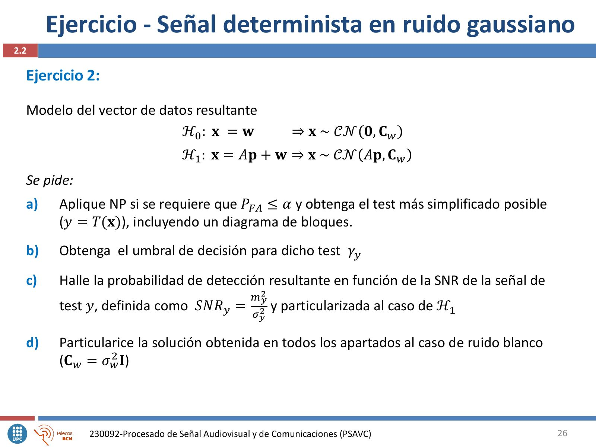

```text
       Ejercicio - Señal determinista en ruido gaussiano
2.2

  Ejercicio 2:

  Modelo del vector de datos resultante
                          ℋ0 : 𝐱𝐱 = 𝐰𝐰                     ⇒ 𝐱𝐱 ~ 𝒞𝒞𝒞𝒞 𝟎𝟎, 𝐂𝐂𝑤𝑤
                                  ℋ1 : 𝐱𝐱 = 𝐴𝐴𝐩𝐩 + 𝐰𝐰 ⇒ 𝐱𝐱 ~ 𝒞𝒞𝒞𝒞 𝐴𝐴𝐩𝐩, 𝐂𝐂𝑤𝑤
  Se pide:
  a)    Aplique NP si se requiere que 𝑃𝑃𝐹𝐹𝐹𝐹 ≤ 𝛼𝛼 y obtenga el test más simplificado posible
        (𝑦𝑦 = 𝑇𝑇(𝐱𝐱)), incluyendo un diagrama de bloques.
  b)    Obtenga el umbral de decisión para dicho test 𝛾𝛾𝑦𝑦

  c)    Halle la probabilidad de detección resultante en función de la SNR de la señal de
                                                    2
                                                  𝑚𝑚𝑦𝑦
        test 𝑦𝑦, definida como 𝑆𝑆𝑆𝑆𝑅𝑅𝑦𝑦 = 𝜎𝜎2 y particularizada al caso de ℋ1
                                                    𝑦𝑦

  d)    Particularice la solución obtenida en todos los apartados al caso de ruido blanco
        (𝐂𝐂𝑤𝑤 = 𝜎𝜎𝑤𝑤2 𝐈𝐈)


             230092-Procesado de Señal Audiovisual y de Comunicaciones (PSAVC)                 26
```

## Page 27

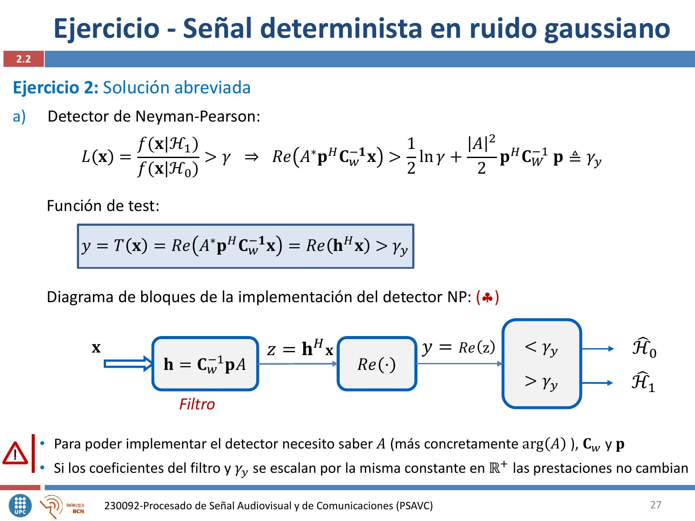

```text
        Ejercicio - Señal determinista en ruido gaussiano
2.2

Ejercicio 2: Solución abreviada
a)     Detector de Neyman-Pearson:
                                                                          2
                    𝑓𝑓(𝐱𝐱|ℋ1 )                        −𝟏𝟏
                                                              1        𝐴𝐴          −1
            𝐿𝐿 𝐱𝐱 =            > 𝛾𝛾 ⇒ 𝑅𝑅𝑅𝑅 𝐴𝐴∗ 𝐩𝐩𝐻𝐻 𝐂𝐂𝑤𝑤  𝐱𝐱 > ln 𝛾𝛾 +      𝐩𝐩𝐻𝐻 𝐂𝐂𝑊𝑊 𝐩𝐩 ≜ 𝛾𝛾𝑦𝑦
                    𝑓𝑓(𝐱𝐱|ℋ0 )                                2         2

       Función de test:
                                         −𝟏𝟏
            𝑦𝑦 = 𝑇𝑇 𝐱𝐱 = 𝑅𝑅𝑅𝑅 𝐴𝐴∗ 𝐩𝐩𝐻𝐻 𝐂𝐂𝑤𝑤  𝐱𝐱 = 𝑅𝑅𝑅𝑅 𝐡𝐡𝐻𝐻 𝐱𝐱 > 𝛾𝛾𝑦𝑦

       Diagrama de bloques de la implementación del detector NP: (♣)

              𝐱𝐱                                   𝑧𝑧 = 𝐡𝐡𝐻𝐻 𝐱𝐱                  𝑦𝑦 = 𝑅𝑅𝑅𝑅 z   < 𝛾𝛾𝑦𝑦   �0
                                                                                                        ℋ
                                     −1
                              𝐡𝐡 = 𝐂𝐂𝑤𝑤 𝐩𝐩𝐴𝐴                        𝑅𝑅𝑅𝑅 ·
                                                                                               > 𝛾𝛾𝑦𝑦   �1
                                                                                                        ℋ
                                 Filtro

      • Para poder implementar el detector necesito saber 𝐴𝐴 (más concretamente arg 𝐴𝐴 ), 𝐂𝐂𝑤𝑤 y 𝐩𝐩
      • Si los coeficientes del filtro y 𝛾𝛾𝑦𝑦 se escalan por la misma constante en ℝ+ las prestaciones no cambian

                   230092-Procesado de Señal Audiovisual y de Comunicaciones (PSAVC)                      27
```

## Page 28

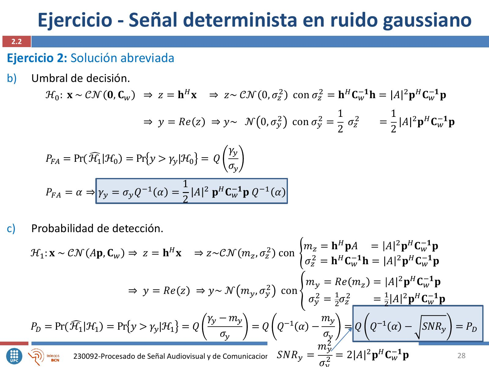

```text
        Ejercicio - Señal determinista en ruido gaussiano
 2.2

Ejercicio 2: Solución abreviada
b)     Umbral de decisión.
          ℋ0 : 𝐱𝐱 ~ 𝒞𝒞𝒞𝒞 𝟎𝟎, 𝐂𝐂𝑤𝑤   ⇒ 𝑧𝑧 = 𝐡𝐡𝐻𝐻 𝐱𝐱     ⇒ 𝑧𝑧~ 𝒞𝒞𝒞𝒞 0, 𝜎𝜎𝑧𝑧2 con 𝜎𝜎𝑧𝑧2 = 𝐡𝐡𝐻𝐻 𝐂𝐂𝑤𝑤
                                                                                              −𝟏𝟏
                                                                                                  𝐡𝐡 = 𝐴𝐴 2 𝐩𝐩𝐻𝐻 𝐂𝐂𝑤𝑤
                                                                                                                   −𝟏𝟏
                                                                                                                       𝐩𝐩
                                                                                            1 2             1 2 𝐻𝐻 −𝟏𝟏
                                    ⇒ 𝑦𝑦 = 𝑅𝑅𝑅𝑅 𝑧𝑧 ⇒ 𝑦𝑦~ 𝒩𝒩 0, 𝜎𝜎𝑦𝑦2 con 𝜎𝜎𝑦𝑦2 =             𝜎𝜎         =     𝐴𝐴 𝐩𝐩 𝐂𝐂𝑤𝑤 𝐩𝐩
                                                                                            2 𝑧𝑧            2
                                                             𝛾𝛾𝑦𝑦
                       �1 ℋ0 = Pr 𝑦𝑦 > 𝛾𝛾𝑦𝑦|ℋ0 = 𝑄𝑄
          𝑃𝑃𝐹𝐹𝐹𝐹 = Pr( ℋ
                                                             𝜎𝜎𝑦𝑦
                                                 1 2 𝐻𝐻 −𝟏𝟏
          𝑃𝑃𝐹𝐹𝐹𝐹 = 𝛼𝛼 ⇒ 𝛾𝛾𝑦𝑦 = 𝜎𝜎𝑦𝑦 𝑄𝑄 −1 𝛼𝛼 =     𝐴𝐴 𝐩𝐩 𝐂𝐂𝑤𝑤 𝐩𝐩 𝑄𝑄 −1 𝛼𝛼
                                                 2

c)     Probabilidad de detección.
                                           𝐻𝐻                                    𝑚𝑚𝑧𝑧 = 𝐡𝐡𝐻𝐻 𝐩𝐩𝐴𝐴 = 𝐴𝐴 2 𝐩𝐩𝐻𝐻 𝐂𝐂𝑤𝑤  −𝟏𝟏
                                                                                                                        𝐩𝐩
       ℋ1 : 𝐱𝐱 ~ 𝒞𝒞𝒞𝒞 𝐴𝐴𝐩𝐩, 𝐂𝐂𝑤𝑤 ⇒ 𝑧𝑧 = 𝐡𝐡 𝐱𝐱      ⇒ 𝑧𝑧~𝒞𝒞𝒩𝒩 𝑚𝑚𝑧𝑧 , 𝜎𝜎𝑧𝑧2   con � 2
                                                                                 𝜎𝜎𝑧𝑧 = 𝐡𝐡𝐻𝐻 𝐂𝐂𝑤𝑤
                                                                                               −𝟏𝟏
                                                                                                   𝐡𝐡 = 𝐴𝐴 2 𝐩𝐩𝐻𝐻 𝐂𝐂𝑤𝑤
                                                                                                                    −𝟏𝟏
                                                                                                                        𝐩𝐩
                                                                                 𝑚𝑚𝑦𝑦 = 𝑅𝑅𝑅𝑅 𝑚𝑚𝑧𝑧 = 𝐴𝐴 2 𝐩𝐩𝐻𝐻 𝐂𝐂𝑤𝑤−𝟏𝟏
                                                                                                                      𝐩𝐩
                                ⇒ 𝑦𝑦 = 𝑅𝑅𝑅𝑅 𝑧𝑧      ⇒ 𝑦𝑦~ 𝒩𝒩 𝑚𝑚𝑦𝑦 , 𝜎𝜎𝑦𝑦2   con � 2 1 2
                                                                                  𝜎𝜎𝑦𝑦 = 2𝜎𝜎𝑧𝑧    = 12 𝐴𝐴 2 𝐩𝐩𝐻𝐻 𝐂𝐂𝑤𝑤
                                                                                                                   −𝟏𝟏
                                                                                                                       𝐩𝐩
                                                       𝛾𝛾𝑦𝑦 − 𝑚𝑚𝑦𝑦                    𝑚𝑚𝑦𝑦
                  �1 ℋ1 = Pr 𝑦𝑦 > 𝛾𝛾𝑦𝑦|ℋ1 = 𝑄𝑄
       𝑃𝑃𝐷𝐷 = Pr( ℋ                                                = 𝑄𝑄 𝑄𝑄−1 𝛼𝛼 −          = 𝑄𝑄 𝑄𝑄−1 𝛼𝛼 − 𝑆𝑆𝑆𝑆𝑅𝑅𝑦𝑦 = 𝑃𝑃𝐷𝐷
                                                            𝜎𝜎𝑦𝑦                      𝜎𝜎𝑦𝑦
                                                                                     𝑚𝑚𝑦𝑦2      2 𝐻𝐻 −𝟏𝟏
                 230092-Procesado de Señal Audiovisual y de Comunicaciones 𝑆𝑆𝑆𝑆𝑅𝑅𝑦𝑦 = 2 = 2 𝐴𝐴 𝐩𝐩 𝐂𝐂𝑤𝑤 𝐩𝐩
                                                                            (PSAVC)                                28
                                                                                     𝜎𝜎
```

## Page 29

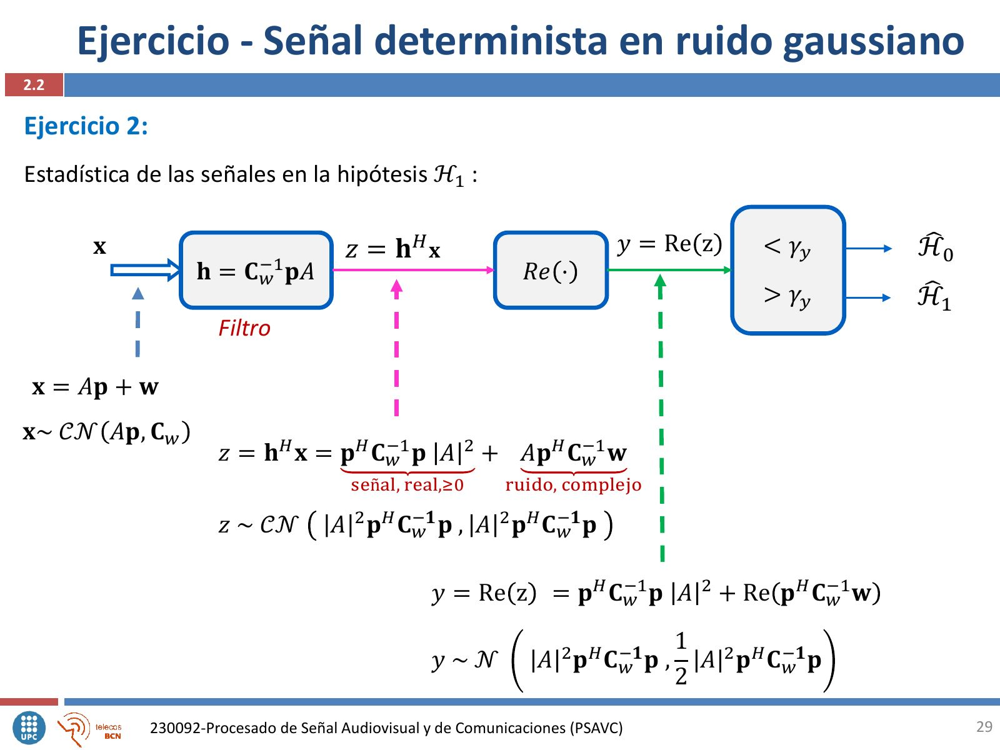

```text
      Ejercicio - Señal determinista en ruido gaussiano
2.2

Ejercicio 2:
Estadística de las señales en la hipótesis ℋ1 :

        𝐱𝐱                               𝑧𝑧 = 𝐡𝐡𝐻𝐻 𝐱𝐱                            𝑦𝑦 = Re z           < 𝛾𝛾𝑦𝑦   �0
                                                                                                              ℋ
                             −1
                      𝐡𝐡 = 𝐂𝐂𝑤𝑤 𝐩𝐩𝐴𝐴                               𝑅𝑅𝑅𝑅 ·
                                                                                                     > 𝛾𝛾𝑦𝑦   �1
                                                                                                              ℋ
                        Filtro

 𝐱𝐱 = 𝐴𝐴𝐩𝐩 + 𝐰𝐰
𝐱𝐱~ 𝒞𝒞𝒞𝒞 𝐴𝐴𝐩𝐩, 𝐂𝐂𝑤𝑤                           −1                    −1
                        𝑧𝑧 = 𝐡𝐡𝐻𝐻 𝐱𝐱 = 𝐩𝐩𝐻𝐻 𝐂𝐂𝑤𝑤 𝐩𝐩 𝐴𝐴 2 + 𝐴𝐴𝐩𝐩𝐻𝐻 𝐂𝐂𝑤𝑤 𝐰𝐰
                                          señal, real,≥0        ruido, complejo
                                                   −𝟏𝟏                  −𝟏𝟏
                        𝑧𝑧 ~ 𝒞𝒞𝒩𝒩      𝐴𝐴 2 𝐩𝐩𝐻𝐻 𝐂𝐂𝑤𝑤  𝐩𝐩 , 𝐴𝐴 2 𝐩𝐩𝐻𝐻 𝐂𝐂𝑤𝑤  𝐩𝐩

                                                                        −1                     −1
                                                     𝑦𝑦 = Re z = 𝐩𝐩𝐻𝐻 𝐂𝐂𝑤𝑤 𝐩𝐩 𝐴𝐴 2 + Re 𝐩𝐩𝐻𝐻 𝐂𝐂𝑤𝑤 𝐰𝐰

                                                                                 −𝟏𝟏
                                                                                            1 2 𝐻𝐻 −𝟏𝟏
                                                     𝑦𝑦 ~ 𝒩𝒩         𝐴𝐴 2 𝐩𝐩𝐻𝐻 𝐂𝐂𝑤𝑤  𝐩𝐩 ,     𝐴𝐴 𝐩𝐩 𝐂𝐂𝑤𝑤 𝐩𝐩
                                                                                            2
               230092-Procesado de Señal Audiovisual y de Comunicaciones (PSAVC)                                   29
```

## Page 30

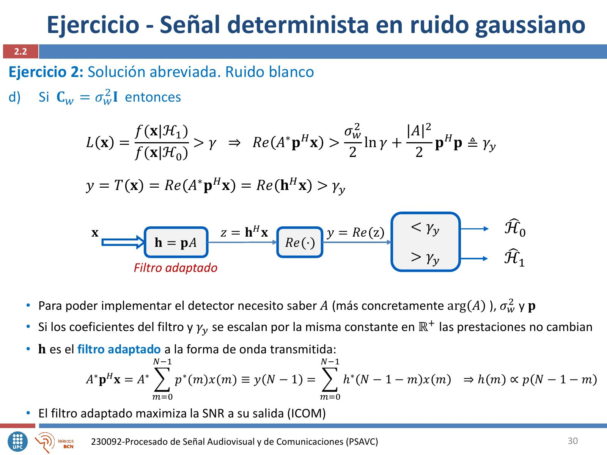

```text
        Ejercicio - Señal determinista en ruido gaussiano
2.2

Ejercicio 2: Solución abreviada. Ruido blanco
d)     Si 𝐂𝐂𝑤𝑤 = 𝜎𝜎𝑤𝑤2 𝐈𝐈 entonces
                                                                2            2
                        𝑓𝑓(𝐱𝐱|ℋ1 )                           𝜎𝜎𝑤𝑤         𝐴𝐴
                𝐿𝐿 𝐱𝐱 =            > 𝛾𝛾 ⇒ 𝑅𝑅𝑅𝑅 𝐴𝐴∗ 𝐩𝐩𝐻𝐻 𝐱𝐱 >      ln 𝛾𝛾 +      𝐩𝐩𝐻𝐻 𝐩𝐩 ≜ 𝛾𝛾𝑦𝑦
                        𝑓𝑓(𝐱𝐱|ℋ0 )                            2            2

                𝑦𝑦 = 𝑇𝑇 𝐱𝐱 = 𝑅𝑅𝑅𝑅 𝐴𝐴∗ 𝐩𝐩𝐻𝐻 𝐱𝐱 = 𝑅𝑅𝑅𝑅 𝐡𝐡𝐻𝐻 𝐱𝐱 > 𝛾𝛾𝑦𝑦


                 𝐱𝐱                           𝑧𝑧 = 𝐡𝐡𝐻𝐻 𝐱𝐱             𝑦𝑦 = 𝑅𝑅𝑅𝑅 z   < 𝛾𝛾𝑦𝑦          �0
                                                                                                     ℋ
                               𝐡𝐡 = 𝐩𝐩𝐴𝐴                     𝑅𝑅𝑅𝑅 ·
                                                                                     > 𝛾𝛾𝑦𝑦          �1
                                                                                                     ℋ
                          Filtro adaptado

     • Para poder implementar el detector necesito saber 𝐴𝐴 (más concretamente arg 𝐴𝐴 ), 𝜎𝜎𝑤𝑤2 y 𝐩𝐩
     • Si los coeficientes del filtro y 𝛾𝛾𝑦𝑦 se escalan por la misma constante en ℝ+ las prestaciones no cambian
     • 𝐡𝐡 es el filtro adaptado a la forma de onda transmitida:
                               𝑁𝑁−1                                   𝑁𝑁−1

                𝐴𝐴∗ 𝐩𝐩𝐻𝐻 𝐱𝐱 = 𝐴𝐴∗ � 𝑝𝑝∗ (𝑚𝑚)𝑥𝑥(𝑚𝑚) ≡ 𝑦𝑦 𝑁𝑁 − 1 = � ℎ∗ 𝑁𝑁 − 1 − 𝑚𝑚 𝑥𝑥 𝑚𝑚       ⇒ ℎ 𝑚𝑚 ∝ 𝑝𝑝 𝑁𝑁 − 1 − 𝑚𝑚
                              𝑚𝑚=0                                    𝑚𝑚=0
     • El filtro adaptado maximiza la SNR a su salida (ICOM)

                 230092-Procesado de Señal Audiovisual y de Comunicaciones (PSAVC)                              30
```

## Page 31

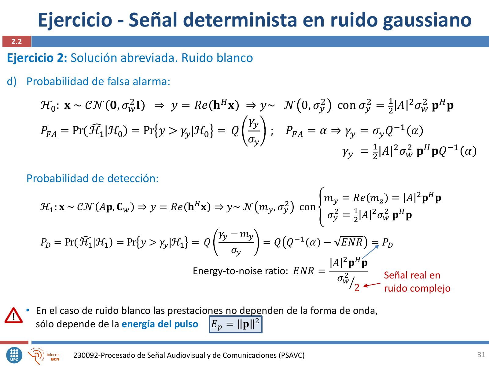

```text
        Ejercicio - Señal determinista en ruido gaussiano
2.2

Ejercicio 2: Solución abreviada. Ruido blanco
d) Probabilidad de falsa alarma:
                                ⇒ 𝑦𝑦 = 𝑅𝑅𝑅𝑅 𝐡𝐡𝐻𝐻 𝐱𝐱 ⇒ 𝑦𝑦~ 𝒩𝒩 0, 𝜎𝜎𝑦𝑦2 con 𝜎𝜎𝑦𝑦2 = 12 𝐴𝐴 2 𝜎𝜎𝑤𝑤2 𝐩𝐩𝐻𝐻 𝐩𝐩
         ℋ0 : 𝐱𝐱 ~ 𝒞𝒞𝒞𝒞 𝟎𝟎, 𝜎𝜎𝑤𝑤2 𝐈𝐈
                                                    𝛾𝛾
                      �1 ℋ0 = Pr 𝑦𝑦 > 𝛾𝛾𝑦𝑦|ℋ0 = 𝑄𝑄 𝑦𝑦 ; 𝑃𝑃𝐹𝐹𝐹𝐹 = 𝛼𝛼 ⇒ 𝛾𝛾𝑦𝑦 = 𝜎𝜎𝑦𝑦 𝑄𝑄−1 𝛼𝛼
         𝑃𝑃𝐹𝐹𝐹𝐹 = Pr( ℋ
                                                    𝜎𝜎𝑦𝑦
                                                                       𝛾𝛾𝑦𝑦 = 12 𝐴𝐴 2 𝜎𝜎𝑤𝑤2 𝐩𝐩𝐻𝐻 𝐩𝐩𝑄𝑄−1 𝛼𝛼

      Probabilidad de detección:
                                                                                     𝑚𝑚𝑦𝑦 = 𝑅𝑅𝑅𝑅 𝑚𝑚𝑧𝑧 = 𝐴𝐴 2 𝐩𝐩𝐻𝐻 𝐩𝐩
         ℋ1 : 𝐱𝐱 ~ 𝒞𝒞𝒞𝒞 𝐴𝐴𝐩𝐩, 𝐂𝐂𝑤𝑤 ⇒ 𝑦𝑦 = 𝑅𝑅𝑅𝑅 𝐡𝐡𝐻𝐻 𝐱𝐱 ⇒ 𝑦𝑦~ 𝒩𝒩 𝑚𝑚𝑦𝑦 , 𝜎𝜎𝑦𝑦2 con �
                                                                                     𝜎𝜎𝑦𝑦2 = 12 𝐴𝐴 2 𝜎𝜎𝑤𝑤2 𝐩𝐩𝐻𝐻 𝐩𝐩
                                                       𝛾𝛾𝑦𝑦 − 𝑚𝑚𝑦𝑦
                    �1 ℋ1 = Pr 𝑦𝑦 > 𝛾𝛾𝑦𝑦|ℋ1 = 𝑄𝑄
         𝑃𝑃𝐷𝐷 = Pr( ℋ                                              = 𝑄𝑄 𝑄𝑄 −1 𝛼𝛼 − 𝐸𝐸𝑁𝑁𝑁𝑁 = 𝑃𝑃𝐷𝐷
                                                            𝜎𝜎𝑦𝑦
                                                                                  𝐴𝐴 2 𝐩𝐩𝐻𝐻 𝐩𝐩
                                                  Energy-to-noise ratio: 𝐸𝐸𝑁𝑁𝑁𝑁 =              Señal real en
                                                                                   𝜎𝜎𝑤𝑤2�
                                                                                         2     ruido complejo

      • En el caso de ruido blanco las prestaciones no dependen de la forma de onda,
        sólo depende de la energía del pulso 𝐸𝐸𝑝𝑝 = 𝐩𝐩 2

                 230092-Procesado de Señal Audiovisual y de Comunicaciones (PSAVC)                                     31
```

## Page 32

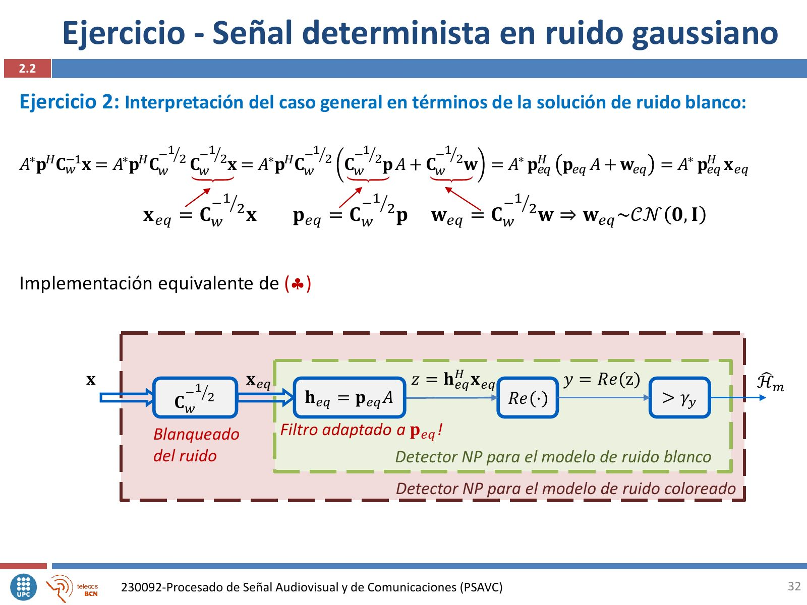

```text
       Ejercicio - Señal determinista en ruido gaussiano
2.2

Ejercicio 2: Interpretación del caso general en términos de la solución de ruido blanco:

                        −1�     −1�                  −1�      −1�                −1�
𝐴𝐴∗𝐩𝐩𝐻𝐻𝐂𝐂𝑤𝑤
         −1
            𝐱𝐱 = 𝐴𝐴∗𝐩𝐩𝐻𝐻𝐂𝐂𝑤𝑤 2 𝐂𝐂𝑤𝑤 2𝐱𝐱 = 𝐴𝐴∗𝐩𝐩𝐻𝐻𝐂𝐂𝑤𝑤 2 𝐂𝐂𝑤𝑤 2𝐩𝐩 𝐴𝐴 + 𝐂𝐂𝑤𝑤 2𝐰𝐰 = 𝐴𝐴∗ 𝐩𝐩𝐻𝐻                          ∗ 𝐻𝐻
                                                                                       𝑒𝑒𝑒𝑒 𝐩𝐩𝑒𝑒𝑒𝑒 𝐴𝐴 + 𝐰𝐰𝑒𝑒𝑒𝑒 = 𝐴𝐴 𝐩𝐩𝑒𝑒𝑒𝑒 𝐱𝐱 𝑒𝑒𝑒𝑒

                                  −1�2                        −1�2                         −1�2
                      𝐱𝐱 𝑒𝑒𝑒𝑒 = 𝐂𝐂𝑤𝑤 𝐱𝐱            𝐩𝐩𝑒𝑒𝑒𝑒 = 𝐂𝐂𝑤𝑤 𝐩𝐩             𝐰𝐰𝑒𝑒𝑒𝑒 = 𝐂𝐂𝑤𝑤 𝐰𝐰 ⇒ 𝐰𝐰𝑒𝑒𝑒𝑒 ~𝒞𝒞𝒞𝒞 𝟎𝟎, 𝐈𝐈


Implementación equivalente de (♣)


           𝐱𝐱                           𝐱𝐱 𝑒𝑒𝑒𝑒                             𝑧𝑧 = 𝐡𝐡𝐻𝐻
                                                                                   𝑒𝑒𝑒𝑒 𝐱𝐱 𝑒𝑒𝑒𝑒            𝑦𝑦 = 𝑅𝑅𝑅𝑅 z               �𝑚𝑚
                                                                                                                                     ℋ
                             −1�2
                           𝐂𝐂𝑤𝑤                      𝐡𝐡𝑒𝑒𝑒𝑒 = 𝐩𝐩𝑒𝑒𝑒𝑒 𝐴𝐴                           𝑅𝑅𝑅𝑅 ·                 > 𝛾𝛾𝑦𝑦

                       Blanqueado                 Filtro adaptado a 𝐩𝐩𝑒𝑒𝑒𝑒 !
                       del ruido                                          Detector NP para el modelo de ruido blanco
                                                                          Detector NP para el modelo de ruido coloreado


                  230092-Procesado de Señal Audiovisual y de Comunicaciones (PSAVC)                                                        32
```

## Page 33

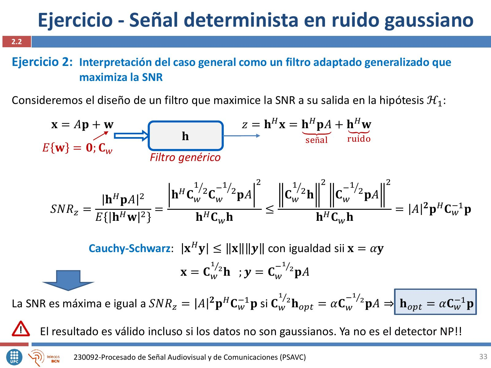

```text
      Ejercicio - Señal determinista en ruido gaussiano
2.2

Ejercicio 2: Interpretación del caso general como un filtro adaptado generalizado que
                maximiza la SNR
Consideremos el diseño de un filtro que maximice la SNR a su salida en la hipótesis ℋ1 :
         𝐱𝐱 = 𝐴𝐴𝐩𝐩 + 𝐰𝐰                                          𝑧𝑧 = 𝐡𝐡𝐻𝐻 𝐱𝐱 = 𝐡𝐡𝐻𝐻 𝐩𝐩𝐴𝐴 + 𝐡𝐡�
                                                                                              𝐻𝐻 𝐰𝐰
                                             𝐡𝐡                                  señal       ruido
       𝐸𝐸 𝐰𝐰 = 𝟎𝟎; 𝐂𝐂𝑤𝑤
                                    Filtro genérico

                                                 1� −1�           2           1�      2             2
                                                                                            −1�2
                      𝐡𝐡𝐻𝐻 𝐩𝐩𝐴𝐴 2         𝐡𝐡𝐻𝐻 𝐂𝐂𝑤𝑤 2 𝐂𝐂𝑤𝑤 2 𝐩𝐩𝐴𝐴           𝐂𝐂𝑤𝑤 2 𝐡𝐡     𝐂𝐂𝑤𝑤 𝐩𝐩𝐴𝐴
         𝑆𝑆𝑆𝑆𝑅𝑅𝑧𝑧 =                                                    ≤                                               −1
                                                                                                        = 𝐴𝐴 𝟐𝟐 𝐩𝐩𝐻𝐻 𝐂𝐂𝑤𝑤
                                  =                                                                                       𝐩𝐩
                    𝐸𝐸 𝐡𝐡𝐻𝐻 𝐰𝐰 2                  𝐡𝐡𝐻𝐻 𝐂𝐂𝑤𝑤 𝐡𝐡                      𝐡𝐡𝐻𝐻 𝐂𝐂𝑤𝑤 𝐡𝐡

                   Cauchy-Schwarz: 𝐱𝐱 𝐻𝐻 𝐲𝐲 ≤ 𝐱𝐱                   𝒚𝒚 con igualdad sii 𝐱𝐱 = 𝛼𝛼𝐲𝐲
                                                      1⁄                  −1⁄2
                                            𝐱𝐱 = 𝐂𝐂𝑤𝑤 𝐡𝐡2
                                                                 ; 𝒚𝒚 = 𝐂𝐂𝑤𝑤 𝐩𝐩𝐴𝐴
                                                                           1⁄                −1⁄
                                                   −1
La SNR es máxima e igual a 𝑆𝑆𝑆𝑆𝑅𝑅𝑧𝑧 = 𝐴𝐴 𝟐𝟐 𝐩𝐩𝐻𝐻 𝐂𝐂𝑤𝑤                                                        −1
                                                      𝐩𝐩 si 𝐂𝐂𝑤𝑤 2 𝐡𝐡𝑜𝑜𝑜𝑜𝑜𝑜 = 𝛼𝛼𝐂𝐂𝑤𝑤 2 𝐩𝐩𝐴𝐴 ⇒ 𝐡𝐡𝑜𝑜𝑜𝑜𝑜𝑜 = 𝛼𝛼𝐂𝐂𝑤𝑤 𝐩𝐩

      El resultado es válido incluso si los datos no son gaussianos. Ya no es el detector NP!!
               230092-Procesado de Señal Audiovisual y de Comunicaciones (PSAVC)                                               33
```

## Page 34

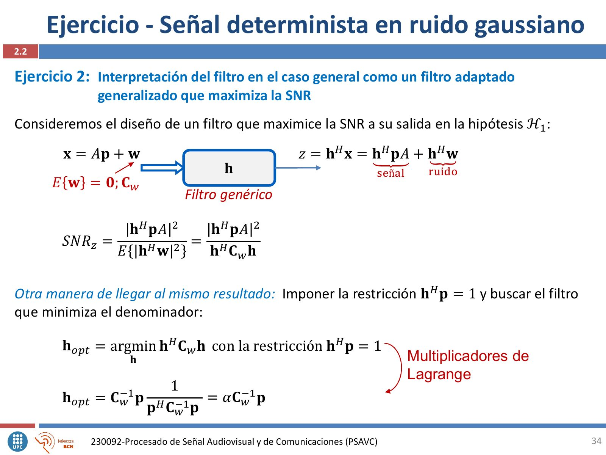

```text
      Ejercicio - Señal determinista en ruido gaussiano
2.2

Ejercicio 2: Interpretación del filtro en el caso general como un filtro adaptado
              generalizado que maximiza la SNR
Consideremos el diseño de un filtro que maximice la SNR a su salida en la hipótesis ℋ1 :
        𝐱𝐱 = 𝐴𝐴𝐩𝐩 + 𝐰𝐰                                      𝑧𝑧 = 𝐡𝐡𝐻𝐻 𝐱𝐱 = 𝐡𝐡𝐻𝐻 𝐩𝐩𝐴𝐴 + 𝐡𝐡�
                                                                                         𝐻𝐻 𝐰𝐰
                                            𝐡𝐡                               señal      ruido
      𝐸𝐸 𝐰𝐰 = 𝟎𝟎; 𝐂𝐂𝑤𝑤
                                    Filtro genérico

                    𝐡𝐡𝐻𝐻 𝐩𝐩𝐴𝐴 2   𝐡𝐡𝐻𝐻 𝐩𝐩𝐴𝐴 2
       𝑆𝑆𝑆𝑆𝑅𝑅𝑧𝑧 =               = 𝐻𝐻
                  𝐸𝐸 𝐡𝐡𝐻𝐻 𝐰𝐰 2   𝐡𝐡 𝐂𝐂𝑤𝑤 𝐡𝐡

Otra manera de llegar al mismo resultado: Imponer la restricción 𝐡𝐡𝐻𝐻 𝐩𝐩 = 1 y buscar el filtro
que minimiza el denominador:

       𝐡𝐡𝑜𝑜𝑜𝑜𝑜𝑜 = argmin 𝐡𝐡𝐻𝐻 𝐂𝐂𝑤𝑤 𝐡𝐡 con la restricción 𝐡𝐡𝐻𝐻 𝐩𝐩 = 1
                     𝐡𝐡                                                              Multiplicadores de
                                                                                     Lagrange
                    −1
                                  1             −1
       𝐡𝐡𝑜𝑜𝑜𝑜𝑜𝑜 = 𝐂𝐂𝑤𝑤 𝐩𝐩          −1 𝐩𝐩
                                         = 𝛼𝛼𝐂𝐂𝑤𝑤  𝐩𝐩
                            𝐩𝐩𝐻𝐻 𝐂𝐂𝑤𝑤

             230092-Procesado de Señal Audiovisual y de Comunicaciones (PSAVC)                            34
```

## Page 35

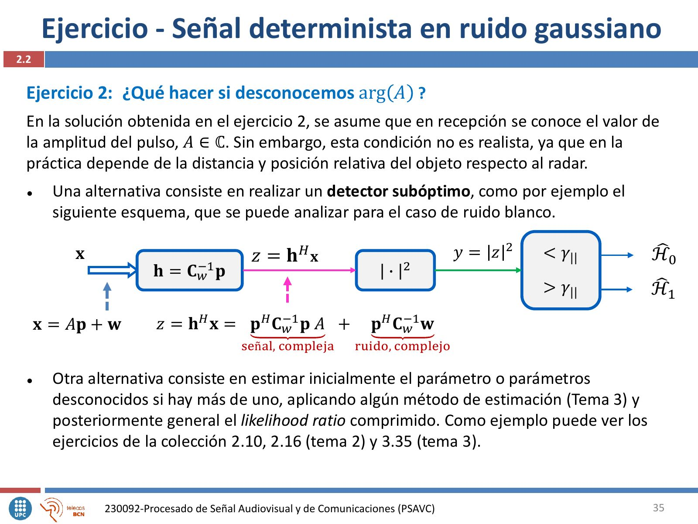

```text
       Ejercicio - Señal determinista en ruido gaussiano
2.2


  Ejercicio 2: ¿Qué hacer si desconocemos arg 𝐴𝐴 ?
  En la solución obtenida en el ejercicio 2, se asume que en recepción se conoce el valor de
  la amplitud del pulso, 𝐴𝐴 ∈ ℂ. Sin embargo, esta condición no es realista, ya que en la
  práctica depende de la distancia y posición relativa del objeto respecto al radar.
  ●      Una alternativa consiste en realizar un detector subóptimo, como por ejemplo el
         siguiente esquema, que se puede analizar para el caso de ruido blanco.

            𝐱𝐱                               𝑧𝑧 = 𝐡𝐡𝐻𝐻 𝐱𝐱                            𝑦𝑦 = 𝑧𝑧 2   < 𝛾𝛾||   �0
                                                                                                          ℋ
                                 −1                                         2
                          𝐡𝐡 = 𝐂𝐂𝑤𝑤 𝐩𝐩                                  �
                                                                                                 > 𝛾𝛾||   �1
                                                                                                          ℋ
                                                 −1                         −1
      𝐱𝐱 = 𝐴𝐴𝐩𝐩 + 𝐰𝐰       𝑧𝑧 = 𝐡𝐡𝐻𝐻 𝐱𝐱 = 𝐩𝐩𝐻𝐻 𝐂𝐂𝑤𝑤 𝐩𝐩 𝐴𝐴 +          𝐩𝐩𝐻𝐻 𝐂𝐂𝑤𝑤 𝐰𝐰
                                           señal, compleja        ruido, complejo

  ●      Otra alternativa consiste en estimar inicialmente el parámetro o parámetros
         desconocidos si hay más de uno, aplicando algún método de estimación (Tema 3) y
         posteriormente general el likelihood ratio comprimido. Como ejemplo puede ver los
         ejercicios de la colección 2.10, 2.16 (tema 2) y 3.35 (tema 3).


                 230092-Procesado de Señal Audiovisual y de Comunicaciones (PSAVC)                        35
```

## Page 36

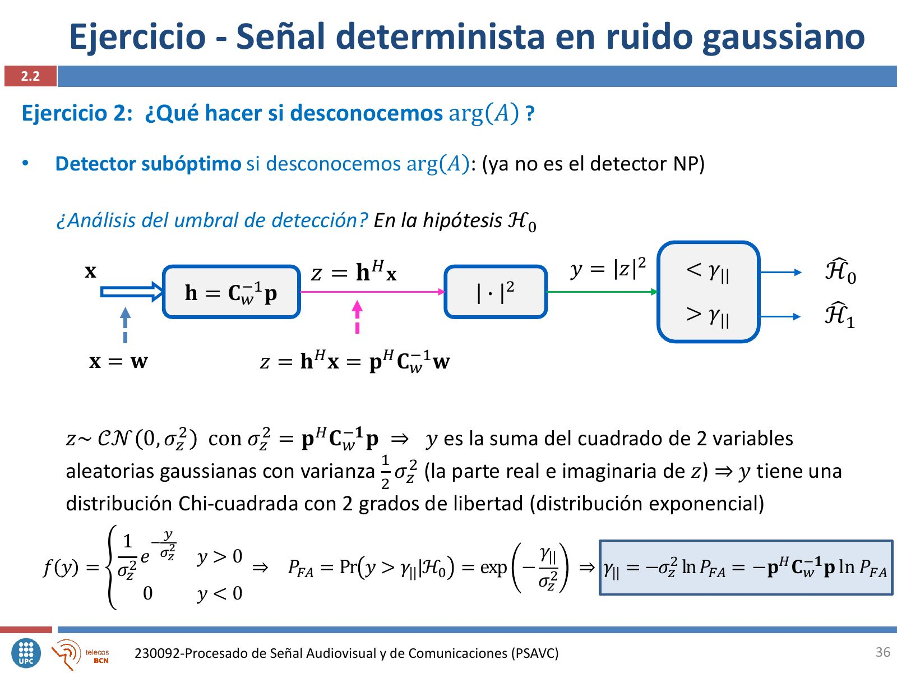

```text
         Ejercicio - Señal determinista en ruido gaussiano
2.2

Ejercicio 2: ¿Qué hacer si desconocemos arg 𝐴𝐴 ?

•      Detector subóptimo si desconocemos arg 𝐴𝐴 : (ya no es el detector NP)

        ¿Análisis del umbral de detección? En la hipótesis ℋ0

            𝐱𝐱                                𝑧𝑧 = 𝐡𝐡𝐻𝐻 𝐱𝐱                             𝑦𝑦 = 𝑧𝑧 2         < 𝛾𝛾||                 �0
                                                                                                                                ℋ
                                    −1                                       2
                             𝐡𝐡 = 𝐂𝐂𝑤𝑤 𝐩𝐩                                �
                                                                                                         > 𝛾𝛾||                 �1
                                                                                                                                ℋ
                                                             −1
            𝐱𝐱 = 𝐰𝐰                    𝑧𝑧 = 𝐡𝐡𝐻𝐻 𝐱𝐱 = 𝐩𝐩𝐻𝐻 𝐂𝐂𝑤𝑤 𝐰𝐰


         𝑧𝑧~ 𝒞𝒞𝒞𝒞 0, 𝜎𝜎𝑧𝑧2 con 𝜎𝜎𝑧𝑧2 = 𝐩𝐩𝐻𝐻 𝐂𝐂𝑤𝑤
                                              −𝟏𝟏
                                                  𝐩𝐩 ⇒ 𝑦𝑦 es la suma del cuadrado de 2 variables
                                                    1
         aleatorias gaussianas con varianza 2 𝜎𝜎𝑧𝑧2 (la parte real e imaginaria de 𝑧𝑧) ⇒ 𝑦𝑦 tiene una
         distribución Chi-cuadrada con 2 grados de libertad (distribución exponencial)
                1 −𝜎𝜎𝑦𝑦2                                                 𝛾𝛾||
                     𝑒𝑒 𝑧𝑧    𝑦𝑦 > 0
      𝑓𝑓 𝑦𝑦 = �𝜎𝜎𝑧𝑧2                   ⇒ 𝑃𝑃𝐹𝐹𝐹𝐹 = Pr 𝑦𝑦 > 𝛾𝛾|||ℋ0 = exp − 2            ⇒ 𝛾𝛾|| = −𝜎𝜎𝑧𝑧2 ln 𝑃𝑃𝐹𝐹𝐹𝐹 = −𝐩𝐩𝐻𝐻 𝐂𝐂𝑤𝑤
                                                                                                                           −𝟏𝟏
                                                                                                                               𝐩𝐩 ln 𝑃𝑃𝐹𝐹𝐹𝐹
                                                                         𝜎𝜎𝑧𝑧
                     0        𝑦𝑦 < 0

                   230092-Procesado de Señal Audiovisual y de Comunicaciones (PSAVC)                                                    36
```

## Page 37

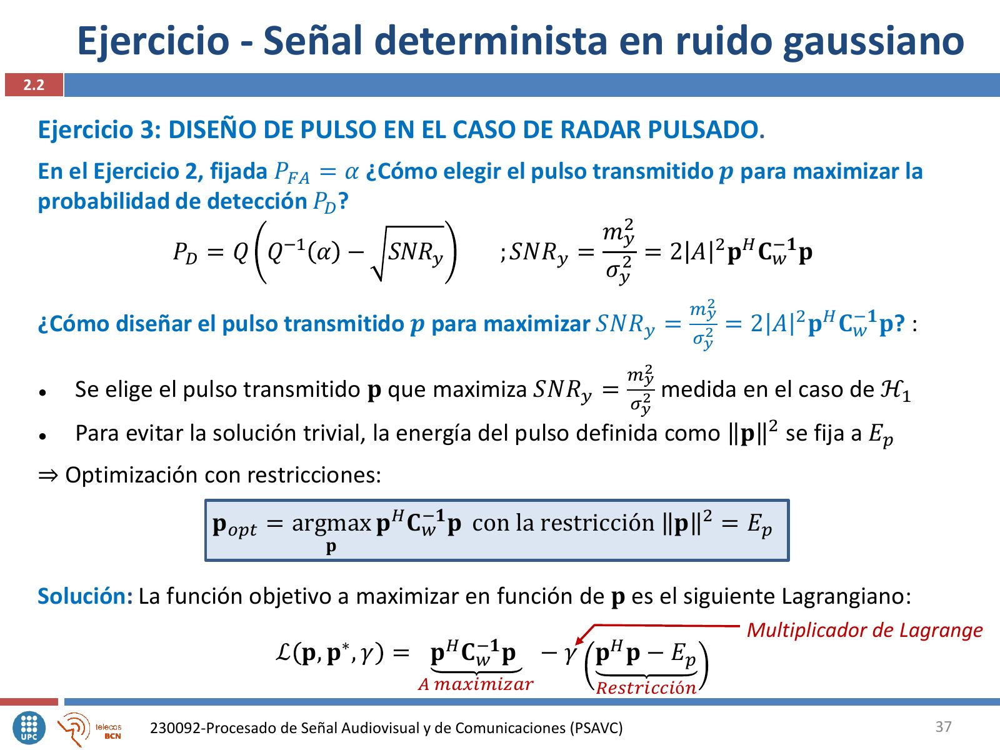

```text
      Ejercicio - Señal determinista en ruido gaussiano
2.2

  Ejercicio 3: DISEÑO DE PULSO EN EL CASO DE RADAR PULSADO.
  En el Ejercicio 2, fijada 𝑃𝑃𝐹𝐹𝐹𝐹 = 𝛼𝛼 ¿Cómo elegir el pulso transmitido 𝒑𝒑 para maximizar la
  probabilidad de detección 𝑃𝑃𝐷𝐷?
                                                                   2
                                                                𝑚𝑚 𝑦𝑦              −𝟏𝟏
                𝑃𝑃𝐷𝐷 = 𝑄𝑄 𝑄𝑄−1 𝛼𝛼 − 𝑆𝑆𝑆𝑆𝑅𝑅𝑦𝑦        ; 𝑆𝑆𝑆𝑆𝑅𝑅𝑦𝑦 = 2 = 2 𝐴𝐴 2 𝐩𝐩𝐻𝐻 𝐂𝐂𝑤𝑤  𝐩𝐩
                                                                𝜎𝜎𝑦𝑦
                                                                                             2
                                                                                           𝑚𝑚𝑦𝑦                     −𝟏𝟏
  ¿Cómo diseñar el pulso transmitido 𝒑𝒑 para maximizar 𝑆𝑆𝑆𝑆𝑅𝑅𝑦𝑦 =                                   = 2 𝐴𝐴 2 𝐩𝐩𝐻𝐻 𝐂𝐂𝑤𝑤  𝐩𝐩? :
                                                                                            𝜎𝜎𝑦𝑦2
                                                                                    2
                                                                                  𝑚𝑚𝑦𝑦
  ●   Se elige el pulso transmitido 𝐩𝐩 que maximiza 𝑆𝑆𝑆𝑆𝑅𝑅𝑦𝑦 = 𝜎𝜎2 medida en el caso de ℋ1
                                                                                    𝑦𝑦
  ●   Para evitar la solución trivial, la energía del pulso definida como 𝐩𝐩 2 se fija a 𝐸𝐸𝑝𝑝
  ⇒ Optimización con restricciones:
                                              −𝟏𝟏
                     𝐩𝐩𝑜𝑜𝑜𝑜𝑜𝑜 = argmax 𝐩𝐩𝐻𝐻 𝐂𝐂𝑤𝑤  𝐩𝐩 con la restricción 𝐩𝐩 2 = 𝐸𝐸𝑝𝑝
                                      𝐩𝐩

  Solución: La función objetivo a maximizar en función de 𝐩𝐩 es el siguiente Lagrangiano:
                                                                                                      Multiplicador de Lagrange
                                                            −𝟏𝟏
                              ℒ   𝐩𝐩, 𝐩𝐩∗ , 𝛾𝛾   = 𝐩𝐩𝐻𝐻 𝐂𝐂𝑤𝑤    𝐩𝐩 − 𝛾𝛾 𝐩𝐩𝐻𝐻 𝐩𝐩 − 𝐸𝐸𝑝𝑝
                                                  𝐴𝐴 𝑚𝑚𝑚𝑚𝑚𝑚𝑚𝑚𝑚𝑚𝑚𝑚𝑚𝑚𝑚𝑚𝑚𝑚 𝑅𝑅𝑅𝑅𝑅𝑅𝑅𝑅𝑅𝑅𝑅𝑅𝑅𝑅𝑅𝑅𝑅𝑅𝑅𝑅𝑅

             230092-Procesado de Señal Audiovisual y de Comunicaciones (PSAVC)                                                  37
```

## Page 38

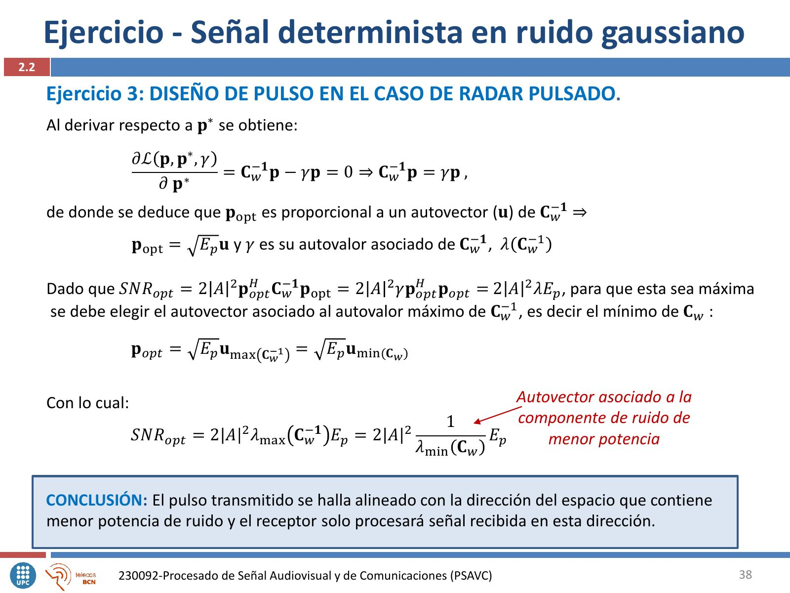

```text
      Ejercicio - Señal determinista en ruido gaussiano
2.2

      Ejercicio 3: DISEÑO DE PULSO EN EL CASO DE RADAR PULSADO.
      Al derivar respecto a 𝐩𝐩∗ se obtiene:
                     𝜕𝜕ℒ 𝐩𝐩, 𝐩𝐩∗ , 𝛾𝛾     −𝟏𝟏                   −𝟏𝟏
                               ∗
                                      = 𝐂𝐂𝑤𝑤  𝐩𝐩 − 𝛾𝛾𝐩𝐩 = 0 ⇒ 𝐂𝐂𝑤𝑤  𝐩𝐩 = 𝛾𝛾𝐩𝐩 ,
                         𝜕𝜕 𝐩𝐩
                                                                             −𝟏𝟏
      de donde se deduce que 𝐩𝐩opt es proporcional a un autovector (𝐮𝐮) de 𝐂𝐂𝑤𝑤  ⇒
                                                                             −𝟏𝟏        −1
                     𝐩𝐩opt =      𝐸𝐸𝑝𝑝 𝐮𝐮 y 𝛾𝛾 es su autovalor asociado de 𝐂𝐂𝑤𝑤  , 𝜆𝜆 𝐂𝐂𝑤𝑤

      Dado que 𝑆𝑆𝑆𝑆𝑅𝑅𝑜𝑜𝑜𝑜𝑜𝑜 = 2 𝐴𝐴 2 𝐩𝐩𝐻𝐻       −𝟏𝟏            2    𝐻𝐻                      2
                                       𝑜𝑜𝑜𝑜𝑜𝑜 𝐂𝐂𝑤𝑤 𝐩𝐩opt = 2 𝐴𝐴 𝛾𝛾𝐩𝐩𝑜𝑜𝑜𝑜𝑜𝑜 𝐩𝐩𝑜𝑜𝑜𝑜𝑜𝑜 = 2 𝐴𝐴 𝜆𝜆𝐸𝐸𝑝𝑝 , para que esta sea máxima
                                                                                       −1
      se debe elegir el autovector asociado al autovalor máximo de 𝐂𝐂𝑤𝑤                   , es decir el mínimo de 𝐂𝐂𝑤𝑤 :

                     𝐩𝐩𝑜𝑜𝑜𝑜𝑜𝑜 =   𝐸𝐸𝑝𝑝 𝐮𝐮max 𝐂𝐂𝑤𝑤
                                               −1 =   𝐸𝐸𝑝𝑝 𝐮𝐮min 𝐂𝐂𝑤𝑤


      Con lo cual:                                                                        Autovector asociado a la
                                                                            1             componente de ruido de
                     𝑆𝑆𝑆𝑆𝑅𝑅𝑜𝑜𝑜𝑜𝑜𝑜 = 2 𝐴𝐴 2 𝜆𝜆max 𝐂𝐂𝑤𝑤
                                                   −𝟏𝟏
                                                       𝐸𝐸𝑝𝑝 = 2 𝐴𝐴 2                 𝐸𝐸𝑝𝑝     menor potencia
                                                                        𝜆𝜆min 𝐂𝐂𝑤𝑤


      CONCLUSIÓN: El pulso transmitido se halla alineado con la dirección del espacio que contiene
      menor potencia de ruido y el receptor solo procesará señal recibida en esta dirección.


                 230092-Procesado de Señal Audiovisual y de Comunicaciones (PSAVC)                                       38
```

## Page 39

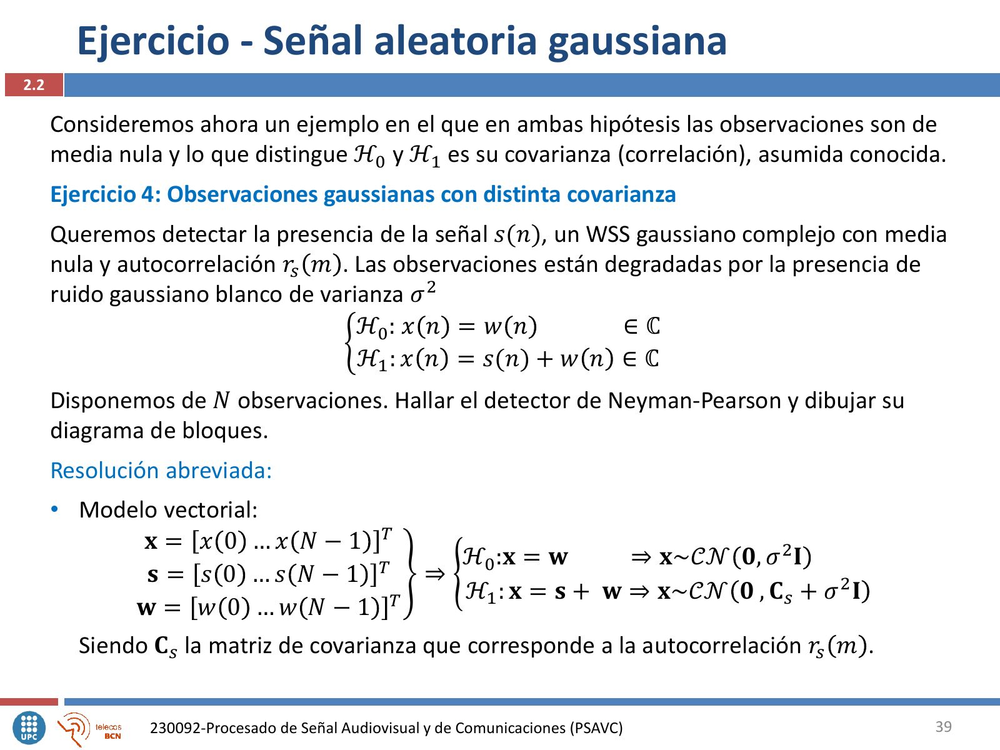

```text
        Ejercicio - Señal aleatoria gaussiana
2.2

      Consideremos ahora un ejemplo en el que en ambas hipótesis las observaciones son de
      media nula y lo que distingue ℋ0 y ℋ1 es su covarianza (correlación), asumida conocida.
      Ejercicio 4: Observaciones gaussianas con distinta covarianza
      Queremos detectar la presencia de la señal 𝑠𝑠(𝑛𝑛), un WSS gaussiano complejo con media
      nula y autocorrelación 𝑟𝑟𝑠𝑠 𝑚𝑚 . Las observaciones están degradadas por la presencia de
      ruido gaussiano blanco de varianza 𝜎𝜎 2
                                       ℋ : 𝑥𝑥 𝑛𝑛 = 𝑤𝑤 𝑛𝑛           ∈ℂ
                                     � 0
                                       ℋ1 : 𝑥𝑥 𝑛𝑛 = 𝑠𝑠(𝑛𝑛) + 𝑤𝑤 𝑛𝑛 ∈ ℂ
      Disponemos de 𝑁𝑁 observaciones. Hallar el detector de Neyman-Pearson y dibujar su
      diagrama de bloques.
      Resolución abreviada:
      • Modelo vectorial:
             𝐱𝐱 = 𝑥𝑥 0 … 𝑥𝑥 𝑁𝑁 − 1 𝑇𝑇
                                   𝑇𝑇      ℋ0 :𝐱𝐱 = 𝐰𝐰        ⇒ 𝐱𝐱~𝒞𝒞𝒞𝒞 𝟎𝟎, 𝜎𝜎 2 𝐈𝐈
             𝐬𝐬 = 𝑠𝑠 0 … 𝑠𝑠 𝑁𝑁 − 1      �⇒�
                                     𝑇𝑇     ℋ1 : 𝐱𝐱 = 𝐬𝐬 + 𝐰𝐰 ⇒ 𝐱𝐱~𝒞𝒞𝒞𝒞 𝟎𝟎 , 𝐂𝐂𝑠𝑠 + 𝜎𝜎 2 𝐈𝐈
            𝐰𝐰 = 𝑤𝑤 0 … 𝑤𝑤 𝑁𝑁 − 1
         Siendo 𝐂𝐂𝑠𝑠 la matriz de covarianza que corresponde a la autocorrelación 𝑟𝑟𝑠𝑠 𝑚𝑚 .


                230092-Procesado de Señal Audiovisual y de Comunicaciones (PSAVC)             39
```

## Page 40

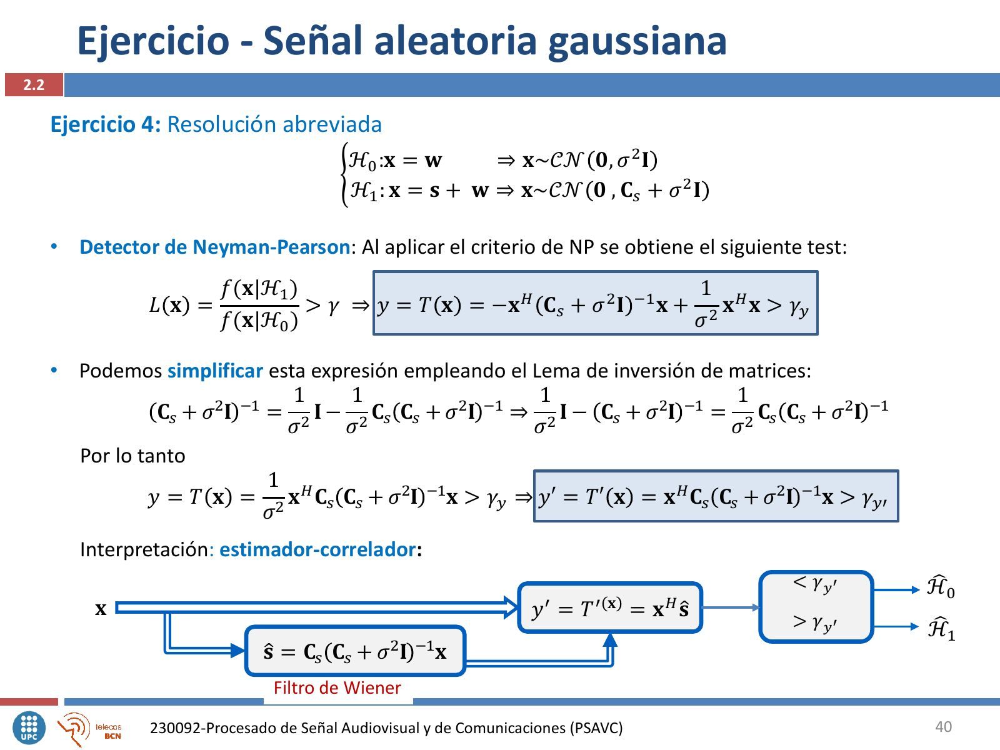

```text
         Ejercicio - Señal aleatoria gaussiana
2.2

      Ejercicio 4: Resolución abreviada
                                               ℋ0 :𝐱𝐱 = 𝐰𝐰       ⇒ 𝐱𝐱~𝒞𝒞𝒞𝒞 𝟎𝟎, 𝜎𝜎 2 𝐈𝐈
                                             �
                                               ℋ1 : 𝐱𝐱 = 𝐬𝐬 + 𝐰𝐰 ⇒ 𝐱𝐱~𝒞𝒞𝒞𝒞 𝟎𝟎 , 𝐂𝐂𝑠𝑠 + 𝜎𝜎 2 𝐈𝐈

      • Detector de Neyman-Pearson: Al aplicar el criterio de NP se obtiene el siguiente test:
                             𝑓𝑓(𝐱𝐱|ℋ1 )                                                   1
                   𝐿𝐿 𝐱𝐱 =              > 𝛾𝛾 ⇒ 𝑦𝑦 = 𝑇𝑇 𝐱𝐱 = −𝐱𝐱 𝐻𝐻 𝐂𝐂𝑠𝑠 + 𝜎𝜎 2 𝐈𝐈 −1 𝐱𝐱 + 2 𝐱𝐱 𝐻𝐻 𝐱𝐱 > 𝛾𝛾𝑦𝑦
                             𝑓𝑓(𝐱𝐱|ℋ0 )                                                  𝜎𝜎

      • Podemos simplificar esta expresión empleando el Lema de inversión de matrices:
                                    1      1                         1                             1
                 𝐂𝐂𝑠𝑠 + 𝜎𝜎2𝐈𝐈 −1 = 2 𝐈𝐈 − 2 𝐂𝐂𝑠𝑠 𝐂𝐂𝑠𝑠 + 𝜎𝜎2𝐈𝐈 −1 ⇒ 2 𝐈𝐈 − 𝐂𝐂𝑠𝑠 + 𝜎𝜎2𝐈𝐈 −1 = 2 𝐂𝐂𝑠𝑠 𝐂𝐂𝑠𝑠 + 𝜎𝜎2𝐈𝐈 −1
                                   𝜎𝜎     𝜎𝜎                        𝜎𝜎                           𝜎𝜎
        Por lo tanto
                                 1
                𝑦𝑦 = 𝑇𝑇 𝐱𝐱 = 2 𝐱𝐱 𝐻𝐻 𝐂𝐂𝑠𝑠 𝐂𝐂𝑠𝑠 + 𝜎𝜎2𝐈𝐈 −1𝐱𝐱 > 𝛾𝛾𝑦𝑦 ⇒ 𝑦𝑦′ = 𝑇𝑇′ 𝐱𝐱 = 𝐱𝐱 𝐻𝐻 𝐂𝐂𝑠𝑠 𝐂𝐂𝑠𝑠 + 𝜎𝜎2𝐈𝐈 −1𝐱𝐱 > 𝛾𝛾𝑦𝑦′
                                𝜎𝜎
          Interpretación: estimador-correlador:
                                                                                                          < 𝛾𝛾𝑦𝑦′          �0
                                                                                                                           ℋ
            𝐱𝐱                                                           ′       ′ 𝐱𝐱       𝐻𝐻 �
                                                                       𝑦𝑦 = 𝑇𝑇          = 𝐱𝐱 𝐬𝐬           > 𝛾𝛾𝑦𝑦′          �1
                                                                                                                           ℋ
                                  𝐬𝐬� = 𝐂𝐂𝑠𝑠 𝐂𝐂𝑠𝑠 + 𝜎𝜎2𝐈𝐈 −1𝐱𝐱
                                    Filtro de Wiener

                   230092-Procesado de Señal Audiovisual y de Comunicaciones (PSAVC)                                       40
```

## Page 41

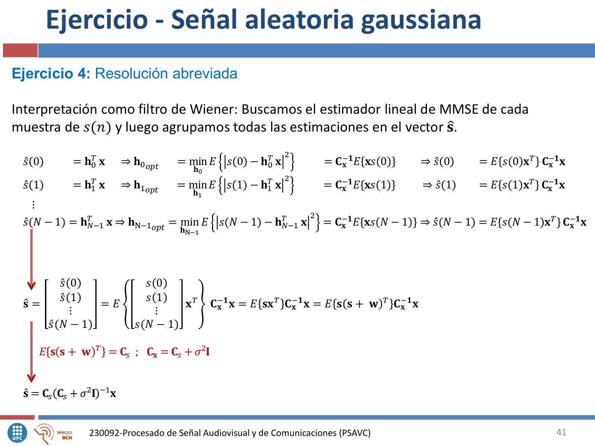

```text
         Ejercicio - Señal aleatoria gaussiana
Ejercicio 4: Resolución abreviada

Interpretación como filtro de Wiener: Buscamos el estimador lineal de MMSE de cada
muestra de 𝑠𝑠(𝑛𝑛) y luego agrupamos todas las estimaciones en el vector 𝐬𝐬�.
                                                                                2
 𝑠𝑠̂ 0          = 𝐡𝐡𝑇𝑇0 𝐱𝐱      ⇒ 𝐡𝐡0𝑜𝑜𝑜𝑜𝑜𝑜     = min 𝐸𝐸 𝑠𝑠 0 − 𝐡𝐡𝑇𝑇0 𝐱𝐱                    = 𝐂𝐂𝐱𝐱−𝟏𝟏𝐸𝐸 𝐱𝐱𝑠𝑠 0               ⇒ 𝑠𝑠̂ 0       = 𝐸𝐸 𝑠𝑠 0 𝐱𝐱𝑇𝑇 𝐂𝐂𝐱𝐱−𝟏𝟏𝐱𝐱
                                                    𝐡𝐡0
                                                                                2
 𝑠𝑠̂ 1          = 𝐡𝐡1𝑇𝑇 𝐱𝐱      ⇒ 𝐡𝐡1𝑜𝑜𝑜𝑜𝑜𝑜     = min 𝐸𝐸 𝑠𝑠 1 − 𝐡𝐡1𝑇𝑇 𝐱𝐱                    = 𝐂𝐂𝐱𝐱−𝟏𝟏𝐸𝐸 𝐱𝐱𝑠𝑠 1               ⇒ 𝑠𝑠̂ 1       = 𝐸𝐸 𝑠𝑠 1 𝐱𝐱𝑇𝑇 𝐂𝐂𝐱𝐱−𝟏𝟏𝐱𝐱
                                                    𝐡𝐡1
     ⋮
                                                                        2
 𝑠𝑠̂ 𝑁𝑁 − 1 = 𝐡𝐡𝑇𝑇𝑁𝑁−1 𝐱𝐱 ⇒ 𝐡𝐡N−1𝑜𝑜𝑜𝑜𝑜𝑜 = min 𝐸𝐸 𝑠𝑠 𝑁𝑁 − 1 − 𝐡𝐡𝑇𝑇𝑁𝑁−1 𝐱𝐱 = 𝐂𝐂𝐱𝐱−𝟏𝟏𝐸𝐸 𝐱𝐱𝑠𝑠 𝑁𝑁 − 1                             ⇒ 𝑠𝑠̂ 𝑁𝑁 − 1 = 𝐸𝐸 𝑠𝑠 𝑁𝑁 − 1 𝐱𝐱𝑇𝑇 𝐂𝐂𝐱𝐱−𝟏𝟏𝐱𝐱
                                                𝐡𝐡N−1


           𝑠𝑠̂ 0                       𝑠𝑠 0
           𝑠𝑠̂ 1                       𝑠𝑠 1
 𝐬𝐬� =                  = 𝐸𝐸                     𝐱𝐱 𝑇𝑇    𝐂𝐂𝐱𝐱−𝟏𝟏 𝐱𝐱 = 𝐸𝐸 𝐬𝐬𝐱𝐱 𝑇𝑇 𝐂𝐂𝐱𝐱−𝟏𝟏 𝐱𝐱 = 𝐸𝐸 𝐬𝐬 𝐬𝐬 + 𝐰𝐰 𝑇𝑇 𝐂𝐂𝐱𝐱−𝟏𝟏 𝐱𝐱
               ⋮                          ⋮
       𝑠𝑠̂ 𝑁𝑁 − 1                   𝑠𝑠 𝑁𝑁 − 1

     𝐸𝐸 𝐬𝐬 𝐬𝐬 + 𝐰𝐰 𝑇𝑇 = 𝐂𝐂𝑠𝑠 ; 𝐂𝐂𝐱𝐱 = 𝐂𝐂𝑠𝑠 + 𝜎𝜎2𝐈𝐈


 𝐬𝐬̂ = 𝐂𝐂𝑠𝑠 𝐂𝐂𝑠𝑠 + 𝜎𝜎2𝐈𝐈 −1𝐱𝐱


                    230092-Procesado de Señal Audiovisual y de Comunicaciones (PSAVC)                                                                           41
```

## Page 42

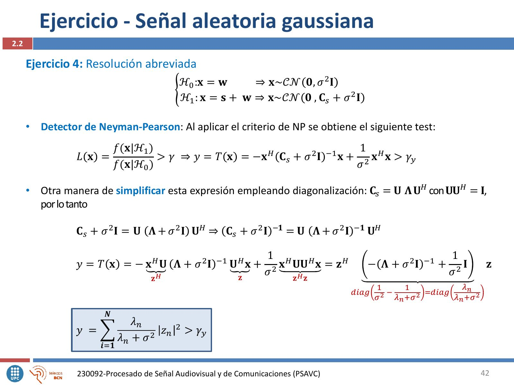

```text
         Ejercicio - Señal aleatoria gaussiana
2.2

      Ejercicio 4: Resolución abreviada
                                                ℋ0 :𝐱𝐱 = 𝐰𝐰       ⇒ 𝐱𝐱~𝒞𝒞𝒞𝒞 𝟎𝟎, 𝜎𝜎 2 𝐈𝐈
                                              �
                                                ℋ1 : 𝐱𝐱 = 𝐬𝐬 + 𝐰𝐰 ⇒ 𝐱𝐱~𝒞𝒞𝒞𝒞 𝟎𝟎 , 𝐂𝐂𝑠𝑠 + 𝜎𝜎 2 𝐈𝐈

      • Detector de Neyman-Pearson: Al aplicar el criterio de NP se obtiene el siguiente test:
                             𝑓𝑓(𝐱𝐱|ℋ1 )                                                   1
                 𝐿𝐿 𝐱𝐱 =                > 𝛾𝛾 ⇒ 𝑦𝑦 = 𝑇𝑇 𝐱𝐱 = −𝐱𝐱 𝐻𝐻 𝐂𝐂𝑠𝑠 + 𝜎𝜎 2 𝐈𝐈 −1 𝐱𝐱 + 2 𝐱𝐱 𝐻𝐻 𝐱𝐱 > 𝛾𝛾𝑦𝑦
                             𝑓𝑓(𝐱𝐱|ℋ0 )                                                  𝜎𝜎

      • Otra manera de simplificar esta expresión empleando diagonalización: 𝐂𝐂𝑠𝑠 = 𝐔𝐔 𝚲𝚲𝐔𝐔𝐻𝐻 con 𝐔𝐔𝐔𝐔𝐻𝐻 = 𝐈𝐈,
        por lo tanto

                 𝐂𝐂𝑠𝑠 + 𝜎𝜎 2 𝐈𝐈 = 𝐔𝐔 𝚲𝚲 + 𝜎𝜎 2 𝐈𝐈 𝐔𝐔𝐻𝐻 ⇒ 𝐂𝐂𝑠𝑠 + 𝜎𝜎 2 𝐈𝐈 −𝟏𝟏 = 𝐔𝐔 𝚲𝚲 + 𝜎𝜎 2 𝐈𝐈 −𝟏𝟏 𝐔𝐔𝐻𝐻

                                  𝐻𝐻
                                                                      1 𝐻𝐻 𝐻𝐻                                                        1
                 𝑦𝑦 = 𝑇𝑇 𝐱𝐱 = − 𝐱𝐱�  𝐔𝐔 𝚲𝚲 + 𝜎𝜎 2 𝐈𝐈 −1 𝐔𝐔
                                                        �  𝐻𝐻
                                                              𝐱𝐱 +      2
                                                                          𝐱𝐱 𝐔𝐔𝐔𝐔 𝐱𝐱 = 𝐳𝐳 𝐻𝐻          − 𝚲𝚲 + 𝜎𝜎 2 𝐈𝐈 −1 +                𝐈𝐈        𝐳𝐳
                                                                     𝜎𝜎       𝐻𝐻                                                    𝜎𝜎 2
                                      𝐳𝐳 𝐻𝐻                   𝐳𝐳             𝐳𝐳 𝐳𝐳
                                                                                                           1          1                  𝜆𝜆𝑛𝑛
                                                                                               𝑑𝑑𝑑𝑑𝑑𝑑𝑑𝑑      2 −          2 =𝑑𝑑𝑑𝑑𝑑𝑑𝑑𝑑
                                                                                                          𝜎𝜎     𝜆𝜆𝑛𝑛 +𝜎𝜎             𝜆𝜆𝑛𝑛 +𝜎𝜎2

                        𝑵𝑵
                             𝜆𝜆𝑛𝑛
                 𝑦𝑦 = �           2
                                    𝑧𝑧𝑛𝑛 2 > 𝛾𝛾𝑦𝑦
                        𝜆𝜆𝑛𝑛 + 𝜎𝜎
                       𝒊𝒊=𝟏𝟏


                 230092-Procesado de Señal Audiovisual y de Comunicaciones (PSAVC)                                                                42
```

## Page 43

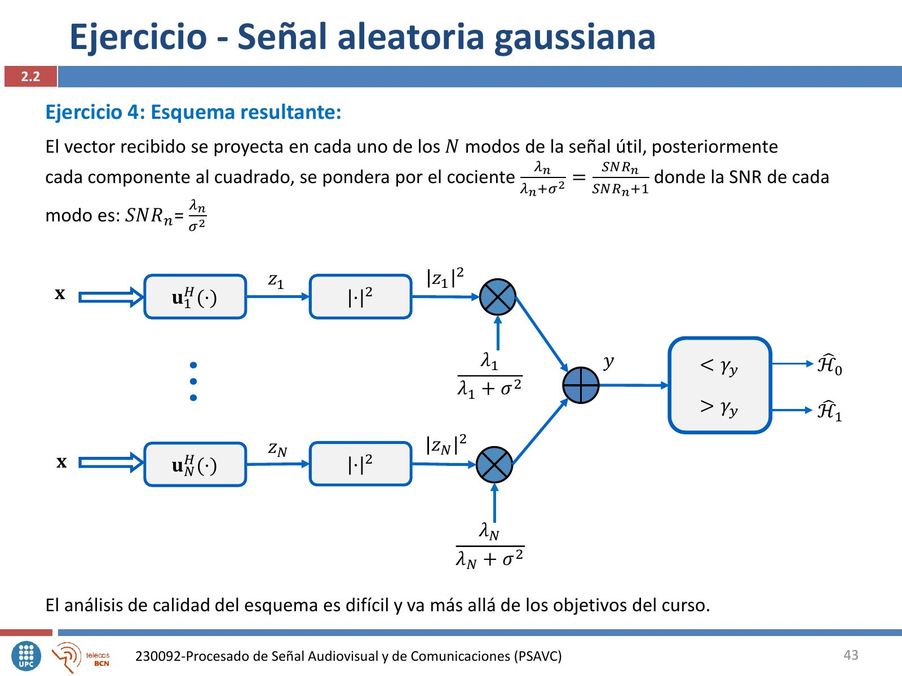

```text
            Ejercicio - Señal aleatoria gaussiana
2.2

      Ejercicio 4: Esquema resultante:
      El vector recibido se proyecta en cada uno de los 𝑁𝑁 modos de la señal útil, posteriormente
                                                                                𝜆𝜆𝑛𝑛        𝑆𝑆𝑆𝑆𝑅𝑅𝑛𝑛
      cada componente al cuadrado, se pondera por el cociente                         2 =             donde la SNR de cada
                                                                             𝜆𝜆𝑛𝑛 +𝜎𝜎     𝑆𝑆𝑆𝑆𝑅𝑅𝑛𝑛 +1
                           𝜆𝜆
      modo es: 𝑆𝑆𝑆𝑆𝑅𝑅𝑛𝑛 = 𝑛𝑛2
                           𝜎𝜎


                                      𝑧𝑧1                      𝑧𝑧1 2
       𝐱𝐱               𝐮𝐮1𝐻𝐻 (·)                  ·2


                     ⋯                                                 𝜆𝜆1               𝑦𝑦            < 𝛾𝛾𝑦𝑦           �0
                                                                                                                        ℋ
                                                                   𝜆𝜆1 + 𝜎𝜎 2
                                                                                                       > 𝛾𝛾𝑦𝑦           �1
                                                                                                                        ℋ
                                      𝑧𝑧𝑁𝑁                     𝑧𝑧𝑁𝑁 2
       𝐱𝐱               𝐮𝐮𝐻𝐻
                          𝑁𝑁 (·)                   ·2


                                                                       𝜆𝜆𝑁𝑁
                                                                   𝜆𝜆𝑁𝑁 + 𝜎𝜎 2

      El análisis de calidad del esquema es difícil y va más allá de los objetivos del curso.

                  230092-Procesado de Señal Audiovisual y de Comunicaciones (PSAVC)                                          43
```

## Page 44

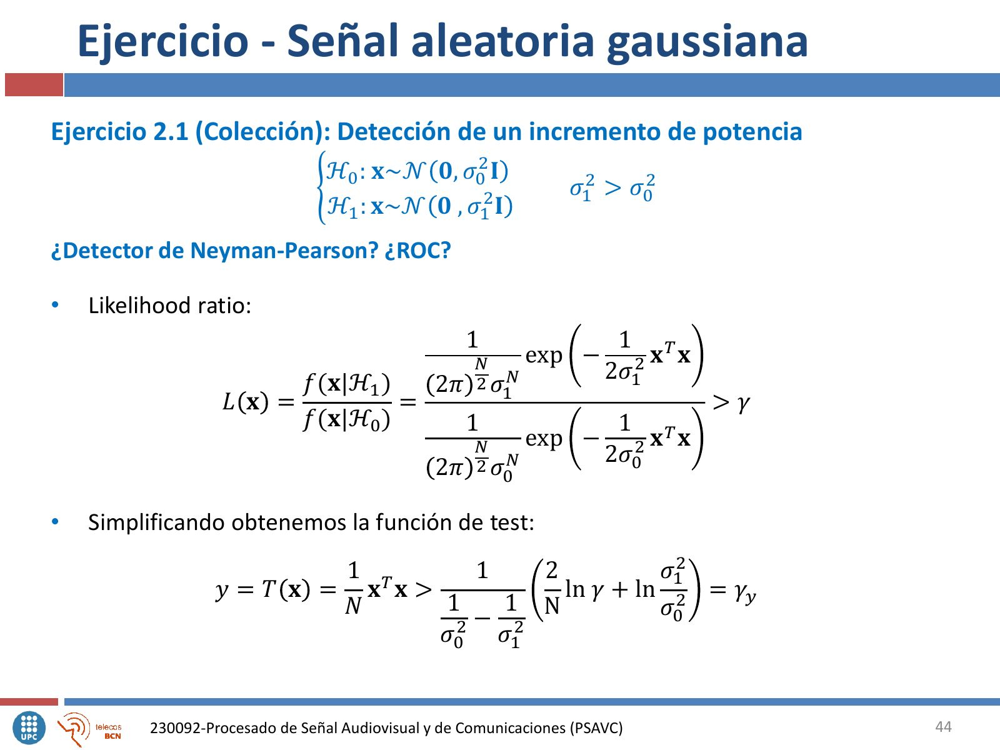

```text
    Ejercicio - Señal aleatoria gaussiana
Ejercicio 2.1 (Colección): Detección de un incremento de potencia
                                 ℋ0 : 𝐱𝐱~𝒩𝒩 𝟎𝟎, 𝜎𝜎02 𝐈𝐈
                                �                                  𝜎𝜎12 > 𝜎𝜎02
                                  ℋ1 : 𝐱𝐱~𝒩𝒩 𝟎𝟎 , 𝜎𝜎12 𝐈𝐈
¿Detector de Neyman-Pearson? ¿ROC?

•   Likelihood ratio:
                                                     1                   1 𝑇𝑇
                                                               exp −          𝐱𝐱 𝐱𝐱
                                                     𝑁𝑁
                                                                        2𝜎𝜎12
                              𝑓𝑓(𝐱𝐱|ℋ1 )         2𝜋𝜋 2 𝜎𝜎1𝑁𝑁
                   𝐿𝐿 𝐱𝐱 =               =                                            > 𝛾𝛾
                              𝑓𝑓(𝐱𝐱|ℋ0 )             1                   1 𝑇𝑇
                                                               exp −          𝐱𝐱 𝐱𝐱
                                                     𝑁𝑁
                                                                        2𝜎𝜎02
                                                 2𝜋𝜋 2 𝜎𝜎0𝑁𝑁

•   Simplificando obtenemos la función de test:
                               1 𝑇𝑇        1    2           𝜎𝜎12
                   𝑦𝑦 = 𝑇𝑇 𝐱𝐱 = 𝐱𝐱 𝐱𝐱 >           ln 𝛾𝛾 + ln 2 = 𝛾𝛾𝑦𝑦
                               𝑁𝑁        1   1 N            𝜎𝜎0
                                          2− 2
                                        𝜎𝜎0 𝜎𝜎1


          230092-Procesado de Señal Audiovisual y de Comunicaciones (PSAVC)                  44
```

## Page 45

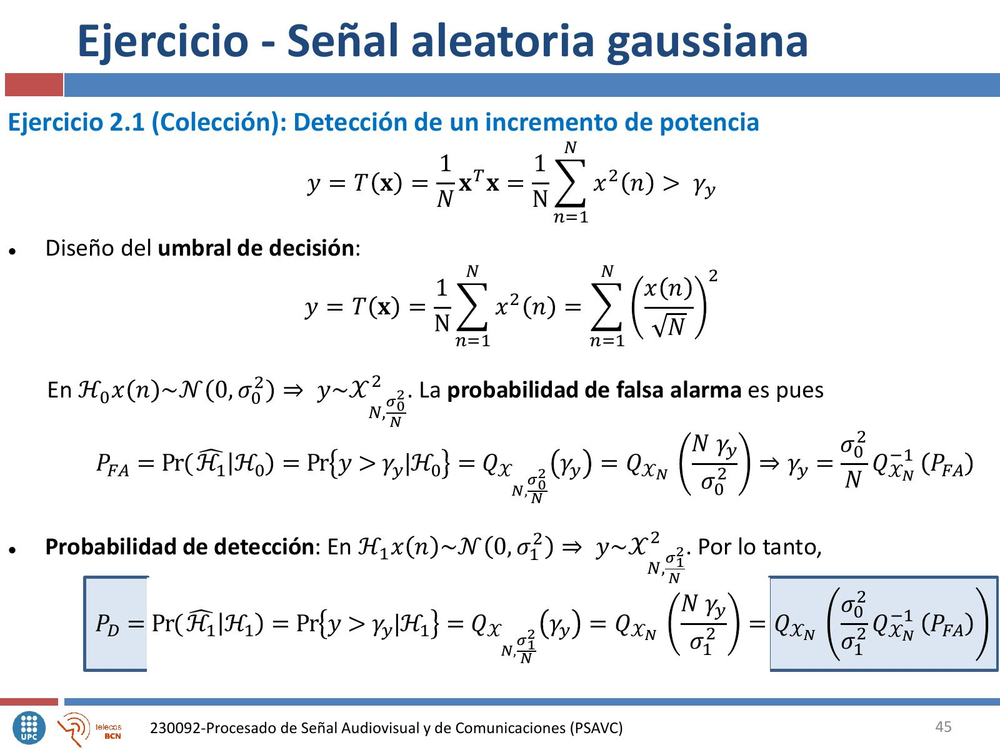

```text
       Ejercicio - Señal aleatoria gaussiana
Ejercicio 2.1 (Colección): Detección de un incremento de potencia
                                                                          𝑁𝑁
                                               1 𝑇𝑇    1
                                   𝑦𝑦 = 𝑇𝑇 𝐱𝐱 = 𝐱𝐱 𝐱𝐱 = � 𝑥𝑥 2 𝑛𝑛 > 𝛾𝛾𝑦𝑦
                                               𝑁𝑁      N
                                                                         𝑛𝑛=1
●   Diseño del umbral de decisión:
                                                         𝑁𝑁                     𝑁𝑁              2
                                               1                 𝑥𝑥 𝑛𝑛
                                   𝑦𝑦 = 𝑇𝑇 𝐱𝐱 = � 𝑥𝑥 2 𝑛𝑛 = �
                                               N                    𝑁𝑁
                                                 𝑛𝑛=1       𝑛𝑛=1

    En ℋ0 𝑥𝑥 𝑛𝑛 ~𝒩𝒩 0, 𝜎𝜎02 ⇒ 𝑦𝑦~𝒳𝒳 2 𝜎𝜎2 . La probabilidad de falsa alarma es pues
                                           𝑁𝑁, 𝑁𝑁0
                                                                                               𝑁𝑁 𝛾𝛾𝑦𝑦         𝜎𝜎02 −1
                      �1 ℋ0 = Pr 𝑦𝑦 > 𝛾𝛾𝑦𝑦|ℋ0 = 𝑄𝑄𝒳𝒳
         𝑃𝑃𝐹𝐹𝐹𝐹 = Pr( ℋ                                                   𝛾𝛾𝑦𝑦 = 𝑄𝑄𝒳𝒳𝑁𝑁                ⇒ 𝛾𝛾𝑦𝑦 = 𝑄𝑄𝒳𝒳𝑁𝑁 𝑃𝑃𝐹𝐹𝐹𝐹
                                                                   𝜎𝜎2
                                                                𝑁𝑁, 0                           𝜎𝜎02            𝑁𝑁
                                                                    𝑁𝑁


●   Probabilidad de detección: En ℋ1 𝑥𝑥 𝑛𝑛 ~𝒩𝒩 0, 𝜎𝜎12 ⇒ 𝑦𝑦~𝒳𝒳 2 𝜎𝜎2 . Por lo tanto,
                                                                                     𝑁𝑁, 1
                                                                                          𝑁𝑁
                                                                                           𝑁𝑁 𝛾𝛾𝑦𝑦          𝜎𝜎02 −1
                    �1 ℋ1 = Pr 𝑦𝑦 > 𝛾𝛾𝑦𝑦|ℋ1 = 𝑄𝑄𝒳𝒳
         𝑃𝑃𝐷𝐷 = Pr( ℋ                                                    𝛾𝛾𝑦𝑦 = 𝑄𝑄𝒳𝒳𝑁𝑁             = 𝑄𝑄𝒳𝒳𝑁𝑁     𝑄𝑄    𝑃𝑃
                                                                 𝜎𝜎2
                                                              𝑁𝑁, 𝑁𝑁1                       𝜎𝜎12            𝜎𝜎12 𝒳𝒳𝑁𝑁 𝐹𝐹𝐹𝐹


              230092-Procesado de Señal Audiovisual y de Comunicaciones (PSAVC)                                          45
```

## Page 46

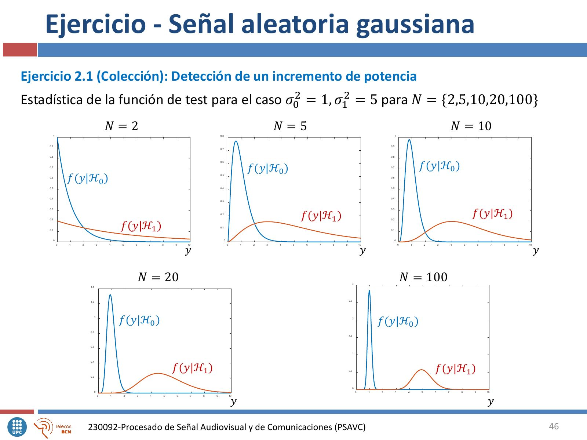

```text
    Ejercicio - Señal aleatoria gaussiana
Ejercicio 2.1 (Colección): Detección de un incremento de potencia
Estadística de la función de test para el caso 𝜎𝜎02 = 1, 𝜎𝜎12 = 5 para 𝑁𝑁 = {2,5,10,20,100}

           1
                                         𝑁𝑁 = 2                                    0.8
                                                                                                                    𝑁𝑁 = 5                                                     1
                                                                                                                                                                                                                    𝑁𝑁 = 10
     0.9                                                                                                                                                                 0.9
                                                                                   0.7


     0.8                                                                                                                                                                 0.8


                                                                                                                                                                                                𝑓𝑓(𝑦𝑦|ℋ0 )
                                                                                   0.6

     0.7
                                                                                                           𝑓𝑓(𝑦𝑦|ℋ0 )                                                    0.7


     0.6
                   𝑓𝑓(𝑦𝑦|ℋ0 )                                                      0.5
                                                                                                                                                                         0.6


     0.5                                                                           0.4                                                                                   0.5


     0.4                                                                                                                                                                 0.4
                                                                                   0.3


                                                                                                                                                                                                                                𝑓𝑓(𝑦𝑦|ℋ1 )
     0.3                                                                                                                                                                 0.3


     0.2
                                                                                   0.2
                                                                                                                             𝑓𝑓(𝑦𝑦|ℋ1 )                                  0.2


     0.1
                                              𝑓𝑓(𝑦𝑦|ℋ1 )                           0.1
                                                                                                                                                                         0.1


           0                                                                             0                                                                                     0


                                                                      𝑦𝑦                                                                                    𝑦𝑦                                                                                                𝑦𝑦
               0   1   2             3   4    5    6    7    8   9    10                     0         1    2   3    4   5    6   7   8   9                 10                     0        1       2       3       4       5       6        7   8   9   10


                                                       𝑁𝑁 = 20                                                                                      3
                                                                                                                                                                                       𝑁𝑁 = 100
                           1.4


                           1.2                                                                                                                2.5


                                 1

                                              𝑓𝑓(𝑦𝑦|ℋ0 )                                                                                            2

                                                                                                                                                                     𝑓𝑓(𝑦𝑦|ℋ0 )
                           0.8
                                                                                                                                              1.5


                           0.6

                                                                                                                                                    1


                                                                 𝑓𝑓(𝑦𝑦|ℋ1 )
                           0.4


                                                                                                                                              0.5                                                       𝑓𝑓(𝑦𝑦|ℋ1 )
                           0.2


                                                                                                                                                    0
                                 0                                                                                                                      0        1   2         3        4       5       6       7       8       9       10


                                                                                                  𝑦𝑦                                                                                                                                    𝑦𝑦
                                     0    1    2   3     4   5    6    7   8   9                 10


                           230092-Procesado de Señal Audiovisual y de Comunicaciones (PSAVC)                                                                                                                                                                       46
```

## Page 47

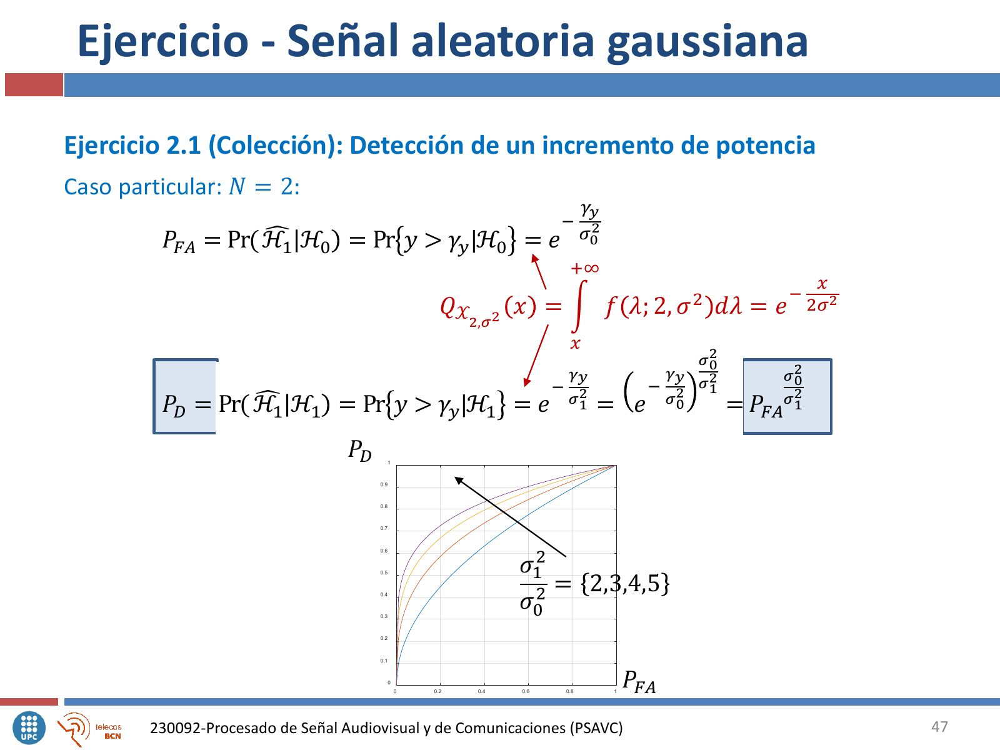

```text
 Ejercicio - Señal aleatoria gaussiana
Ejercicio 2.1 (Colección): Detección de un incremento de potencia
Caso particular: 𝑁𝑁 = 2:
                                                                             𝛾𝛾𝑦𝑦
                                                                            − 2
                      �1 ℋ0 = Pr 𝑦𝑦 > 𝛾𝛾𝑦𝑦|ℋ0
         𝑃𝑃𝐹𝐹𝐹𝐹 = Pr( ℋ                                                 = 𝑒𝑒 𝜎𝜎0
                                                                               +∞
                                                                                                                                𝑥𝑥
                                                                                                       2                 −
                                                          𝑄𝑄𝒳𝒳         𝑥𝑥 = � 𝑓𝑓 𝜆𝜆; 2, 𝜎𝜎 𝑑𝑑𝑑𝑑 = 𝑒𝑒                           2𝜎𝜎2
                                                              2,𝜎𝜎2
                                                                               𝑥𝑥
                                                                                                       𝜎𝜎20
                                                                               𝛾𝛾𝑦𝑦               𝛾𝛾𝑦𝑦    2              𝜎𝜎2
                                                                                                                           0
                                                                             − 2                 − 2 1 𝜎𝜎
                    �1 ℋ1 = Pr 𝑦𝑦 > 𝛾𝛾𝑦𝑦|ℋ1 = 𝑒𝑒
         𝑃𝑃𝐷𝐷 = Pr( ℋ                                                         𝜎𝜎    1   = 𝑒𝑒      𝜎𝜎0
                                                                                                              = 𝑃𝑃𝐹𝐹𝐹𝐹   𝜎𝜎2
                                                                                                                           1


                                   𝑃𝑃𝐷𝐷         1


                                          0.9


                                          0.8


                                          0.7


                                                                       𝜎𝜎12
                                          0.6


                                                                            = 2,3,4,5
                                          0.5


                                                                       𝜎𝜎02
                                          0.4


                                          0.3


                                          0.2


                                          0.1


                                                0
                                                    0   0.2      0.4   0.6    0.8        1
                                                                                             𝑃𝑃𝐹𝐹𝐹𝐹
        230092-Procesado de Señal Audiovisual y de Comunicaciones (PSAVC)                                                             47
```

## Page 48

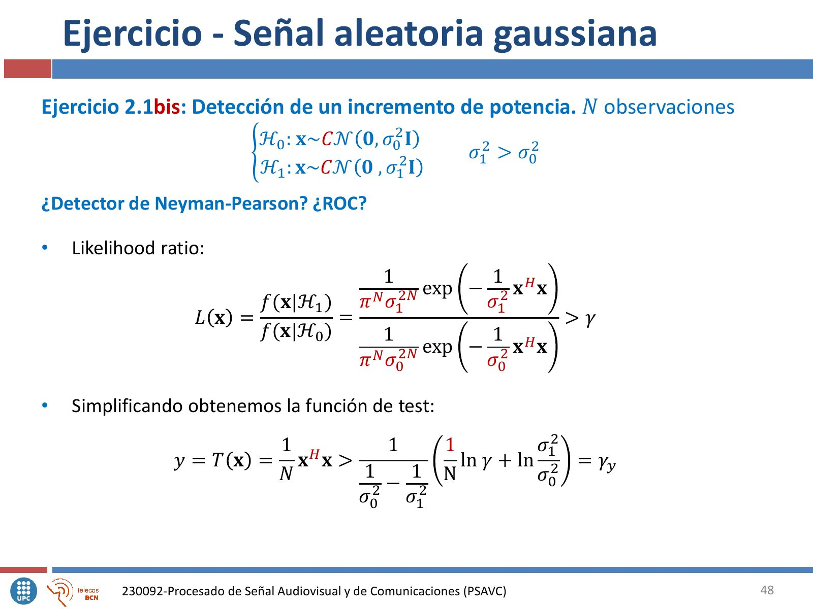

```text
    Ejercicio - Señal aleatoria gaussiana
Ejercicio 2.1bis: Detección de un incremento de potencia. 𝑁𝑁 observaciones
                                ℋ0 : 𝐱𝐱~𝐶𝐶𝒩𝒩 𝟎𝟎, 𝜎𝜎02 𝐈𝐈
                               �                                    𝜎𝜎12 > 𝜎𝜎02
                                 ℋ1 : 𝐱𝐱~𝐶𝐶𝒩𝒩 𝟎𝟎 , 𝜎𝜎12 𝐈𝐈
¿Detector de Neyman-Pearson? ¿ROC?

•   Likelihood ratio:
                                                       1              1 𝐻𝐻
                                                               exp −      𝐱𝐱 𝐱𝐱
                                 𝑓𝑓(𝐱𝐱|ℋ1 )       𝜋𝜋 𝑁𝑁 𝜎𝜎12𝑁𝑁       𝜎𝜎12
                      𝐿𝐿 𝐱𝐱 =               =                                     > 𝛾𝛾
                                 𝑓𝑓(𝐱𝐱|ℋ0 )            1              1 𝐻𝐻
                                                               exp −      𝐱𝐱 𝐱𝐱
                                                  𝜋𝜋 𝑁𝑁 𝜎𝜎02𝑁𝑁       𝜎𝜎02

•   Simplificando obtenemos la función de test:
                              1 𝐻𝐻        1    1           𝜎𝜎12
                  𝑦𝑦 = 𝑇𝑇 𝐱𝐱 = 𝐱𝐱 𝐱𝐱 >           ln 𝛾𝛾 + ln 2 = 𝛾𝛾𝑦𝑦
                              𝑁𝑁        1   1 N            𝜎𝜎0
                                         2− 2
                                       𝜎𝜎0 𝜎𝜎1


          230092-Procesado de Señal Audiovisual y de Comunicaciones (PSAVC)              48
```

## Page 49

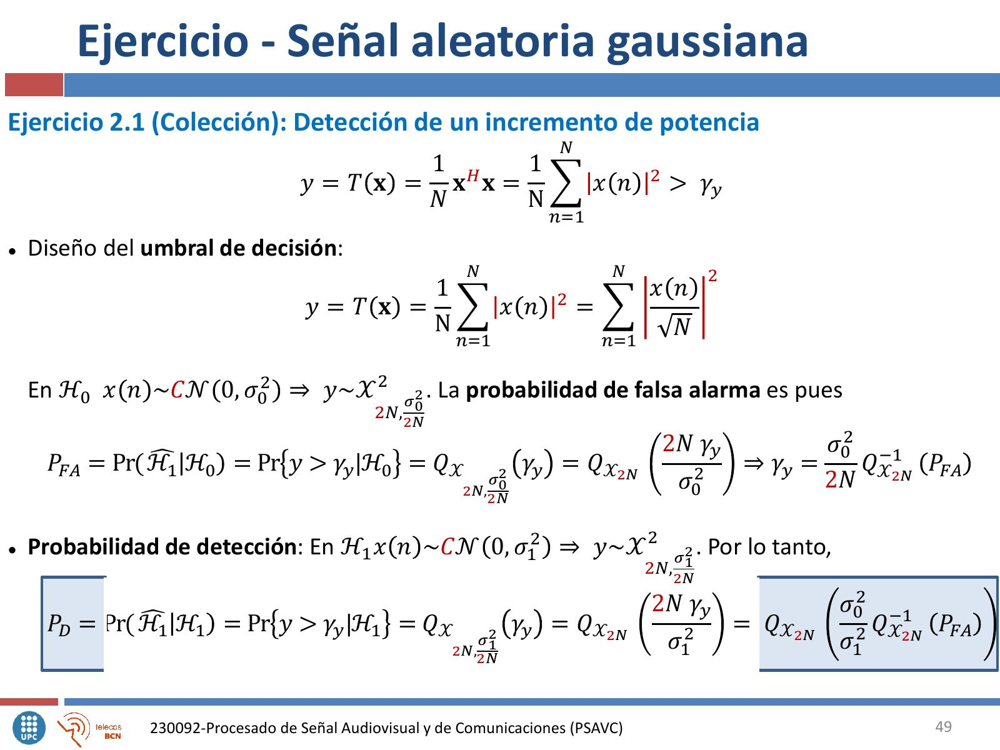

```text
        Ejercicio - Señal aleatoria gaussiana
Ejercicio 2.1 (Colección): Detección de un incremento de potencia
                                                                         𝑁𝑁
                                                1 𝐻𝐻    1                             2 > 𝛾𝛾
                                    𝑦𝑦 = 𝑇𝑇 𝐱𝐱 = 𝐱𝐱 𝐱𝐱 = � 𝑥𝑥 𝑛𝑛                            𝑦𝑦
                                                𝑁𝑁      N
                                                                        𝑛𝑛=1
●   Diseño del umbral de decisión:
                                                           𝑁𝑁                   𝑁𝑁             2
                                                 1                       2 = �
                                                                                      𝑥𝑥 𝑛𝑛
                                     𝑦𝑦 = 𝑇𝑇 𝐱𝐱 = � 𝑥𝑥 𝑛𝑛
                                                 N                                       𝑁𝑁
                                                          𝑛𝑛=1                 𝑛𝑛=1

    En ℋ0 𝑥𝑥 𝑛𝑛 ~𝐶𝐶𝒩𝒩 0, 𝜎𝜎02 ⇒ 𝑦𝑦~𝒳𝒳 2 𝜎𝜎2 . La probabilidad de falsa alarma es pues
                                                   0
                                              2𝑁𝑁,2𝑁𝑁
                                                                                        2𝑁𝑁 𝛾𝛾𝑦𝑦          𝜎𝜎02 −1
                  �1 ℋ0 = Pr 𝑦𝑦 > 𝛾𝛾𝑦𝑦|ℋ0 = 𝑄𝑄𝒳𝒳
     𝑃𝑃𝐹𝐹𝐹𝐹 = Pr( ℋ                                                  𝛾𝛾𝑦𝑦 = 𝑄𝑄𝒳𝒳2𝑁𝑁              ⇒ 𝛾𝛾𝑦𝑦 =     𝑄𝑄    𝑃𝑃
                                                              𝜎𝜎2
                                                          2𝑁𝑁, 0                         𝜎𝜎02             2𝑁𝑁 𝒳𝒳2𝑁𝑁 𝐹𝐹𝐹𝐹
                                                              2𝑁𝑁


●   Probabilidad de detección: En ℋ1 𝑥𝑥 𝑛𝑛 ~𝐶𝐶𝒩𝒩 0, 𝜎𝜎12 ⇒ 𝑦𝑦~𝒳𝒳 2 𝜎𝜎2 . Por lo tanto,
                                                                                      2𝑁𝑁, 1
                                                                                         2𝑁𝑁
                                                                                      2𝑁𝑁 𝛾𝛾𝑦𝑦           𝜎𝜎02 −1
                �1 ℋ1 = Pr 𝑦𝑦 > 𝛾𝛾𝑦𝑦|ℋ1 = 𝑄𝑄𝒳𝒳
     𝑃𝑃𝐷𝐷 = Pr( ℋ                                                   𝛾𝛾𝑦𝑦 = 𝑄𝑄𝒳𝒳2𝑁𝑁             = 𝑄𝑄𝒳𝒳2𝑁𝑁     𝑄𝑄     𝑃𝑃
                                                             𝜎𝜎2
                                                               1
                                                         2𝑁𝑁,2𝑁𝑁                       𝜎𝜎12              𝜎𝜎12 𝒳𝒳2𝑁𝑁 𝐹𝐹𝐹𝐹


                230092-Procesado de Señal Audiovisual y de Comunicaciones (PSAVC)                                    49
```

## Page 50

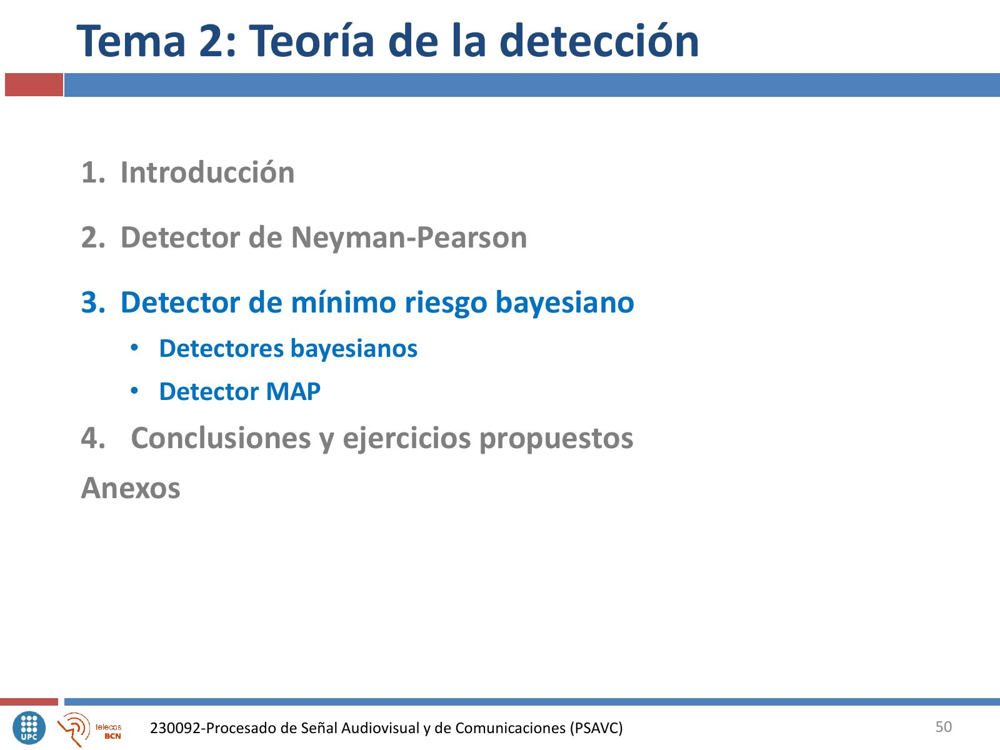

```text
Tema 2: Teoría de la detección

1. Introducción
2. Detector de Neyman-Pearson
3. Detector de mínimo riesgo bayesiano
   • Detectores bayesianos
   • Detector MAP
4. Conclusiones y ejercicios propuestos
Anexos


    230092-Procesado de Señal Audiovisual y de Comunicaciones (PSAVC)   50
```

## Page 51

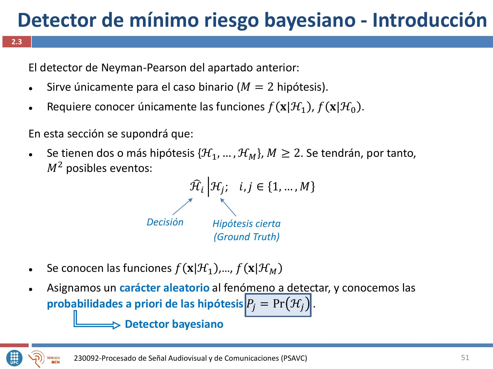

```text
 Detector de mínimo riesgo bayesiano - Introducción
2.3


      El detector de Neyman-Pearson del apartado anterior:
      ●   Sirve únicamente para el caso binario (𝑀𝑀 = 2 hipótesis).
      ●   Requiere conocer únicamente las funciones 𝑓𝑓 𝐱𝐱|ℋ1 , 𝑓𝑓 𝐱𝐱|ℋ0 .

      En esta sección se supondrá que:
      ●   Se tienen dos o más hipótesis {ℋ1 , … , ℋ𝑀𝑀 }, 𝑀𝑀 ≥ 2. Se tendrán, por tanto,
          𝑀𝑀2 posibles eventos:
                                      ℋ�𝑖𝑖 �ℋ𝑗𝑗 ; 𝑖𝑖, 𝑗𝑗 ∈ 1, … , 𝑀𝑀


                                   Decisión          Hipótesis cierta
                                                     (Ground Truth)

      ●   Se conocen las funciones 𝑓𝑓 𝐱𝐱|ℋ1 ,…, 𝑓𝑓 𝐱𝐱|ℋ𝑀𝑀
      ●   Asignamos un carácter aleatorio al fenómeno a detectar, y conocemos las
          probabilidades a priori de las hipótesis 𝑃𝑃𝑗𝑗 = Pr ℋ𝑗𝑗 .
                             Detector bayesiano

               230092-Procesado de Señal Audiovisual y de Comunicaciones (PSAVC)          51
```

## Page 52

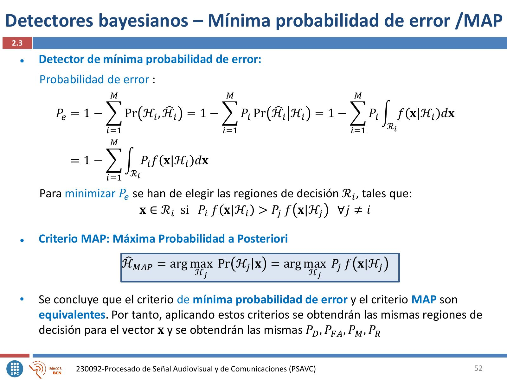

```text
Detectores bayesianos – Mínima probabilidad de error /MAP
2.3

  ●   Detector de mínima probabilidad de error:
      Probabilidad de error :
                      𝑀𝑀                             𝑀𝑀                           𝑀𝑀
                               �𝑖𝑖 = 1 − � 𝑃𝑃𝑖𝑖 Pr ℋ
         𝑃𝑃𝑒𝑒 = 1 − � Pr ℋ𝑖𝑖 , ℋ                   �𝑖𝑖 �ℋ𝑖𝑖 = 1 − � 𝑃𝑃𝑖𝑖 � 𝑓𝑓 𝐱𝐱|ℋ𝑖𝑖 𝑑𝑑𝐱𝐱
                     𝑖𝑖=1                           𝑖𝑖=1                          𝑖𝑖=1   ℛ𝑖𝑖
                       𝑀𝑀

            = 1 − � � 𝑃𝑃𝑖𝑖 𝑓𝑓 𝐱𝐱|ℋ𝑖𝑖 𝑑𝑑𝐱𝐱
                     𝑖𝑖=1 ℛ𝑖𝑖
      Para minimizar 𝑃𝑃𝑒𝑒 se han de elegir las regiones de decisión ℛ𝑖𝑖 , tales que:
                           𝐱𝐱 ∈ ℛ𝑖𝑖 si 𝑃𝑃𝑖𝑖 𝑓𝑓 𝐱𝐱|ℋ𝑖𝑖 > 𝑃𝑃𝑗𝑗 𝑓𝑓 𝐱𝐱|ℋ𝑗𝑗 ∀𝑗𝑗 ≠ 𝑖𝑖

  ●   Criterio MAP: Máxima Probabilidad a Posteriori
                           �𝑀𝑀𝑀𝑀𝑀𝑀 = arg max Pr ℋ𝑗𝑗 |𝐱𝐱 = arg max 𝑃𝑃𝑗𝑗 𝑓𝑓 𝐱𝐱|ℋ𝑗𝑗
                           ℋ
                                             ℋ𝑗𝑗                            ℋ𝑗𝑗


  •   Se concluye que el criterio de mínima probabilidad de error y el criterio MAP son
      equivalentes. Por tanto, aplicando estos criterios se obtendrán las mismas regiones de
      decisión para el vector 𝐱𝐱 y se obtendrán las mismas 𝑃𝑃𝐷𝐷 , 𝑃𝑃𝐹𝐹𝐹𝐹 , 𝑃𝑃𝑀𝑀 , 𝑃𝑃𝑅𝑅

             230092-Procesado de Señal Audiovisual y de Comunicaciones (PSAVC)                 52
```

## Page 53

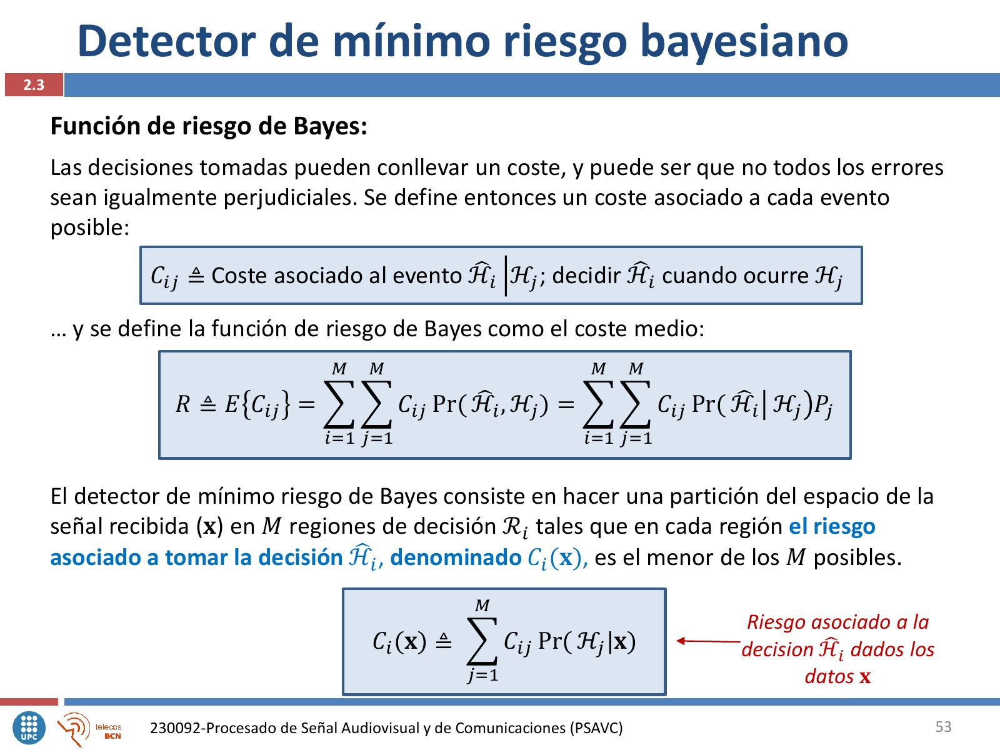

```text
        Detector de mínimo riesgo bayesiano
2.3

      Función de riesgo de Bayes:
      Las decisiones tomadas pueden conllevar un coste, y puede ser que no todos los errores
      sean igualmente perjudiciales. Se define entonces un coste asociado a cada evento
      posible:
                                                  �𝑖𝑖 �ℋ𝑗𝑗 ; decidir ℋ
                𝐶𝐶𝑖𝑖𝑖𝑖 ≜ Coste asociado al evento ℋ                  �𝑖𝑖 cuando ocurre ℋ𝑗𝑗

      … y se define la función de riesgo de Bayes como el coste medio:
                                        𝑀𝑀    𝑀𝑀                            𝑀𝑀      𝑀𝑀
                                                   �𝑖𝑖 , ℋ𝑗𝑗 ) = � � 𝐶𝐶𝑖𝑖𝑖𝑖 Pr( ℋ
                   𝑅𝑅 ≜ 𝐸𝐸 𝐶𝐶𝑖𝑖𝑖𝑖 = � � 𝐶𝐶𝑖𝑖𝑖𝑖 Pr( ℋ                            �𝑖𝑖 ℋ𝑗𝑗 𝑃𝑃𝑗𝑗
                                       𝑖𝑖=1 𝑗𝑗=1                           𝑖𝑖=1 𝑗𝑗=1


      El detector de mínimo riesgo de Bayes consiste en hacer una partición del espacio de la
      señal recibida (𝐱𝐱) en 𝑀𝑀 regiones de decisión ℛ𝑖𝑖 tales que en cada región el riesgo
      asociado a tomar la decisión ℋ  �𝑖𝑖 , denominado 𝐶𝐶𝑖𝑖 (𝐱𝐱), es el menor de los 𝑀𝑀 posibles.

                                                            𝑀𝑀
                                                                                         Riesgo asociado a la
                                              𝐶𝐶𝑖𝑖 (𝐱𝐱) ≜ � 𝐶𝐶𝑖𝑖𝑖𝑖 Pr( ℋ𝑗𝑗 |𝐱𝐱)                   �𝑖𝑖 dados los
                                                                                         decision ℋ
                                                           𝑗𝑗=1                                 datos 𝐱𝐱

                230092-Procesado de Señal Audiovisual y de Comunicaciones (PSAVC)                                 53
```

## Page 54

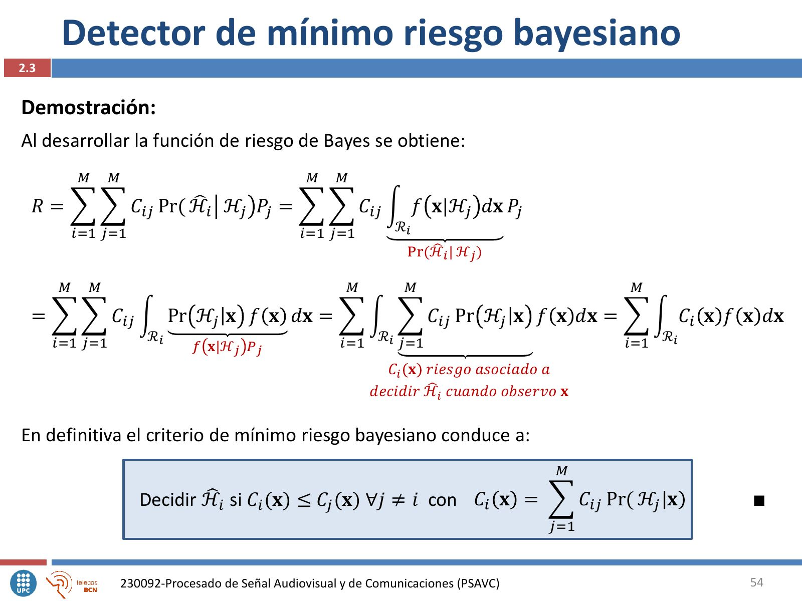

```text
       Detector de mínimo riesgo bayesiano
2.3


Demostración:
Al desarrollar la función de riesgo de Bayes se obtiene:
           𝑀𝑀     𝑀𝑀                              𝑀𝑀   𝑀𝑀
                      �𝑖𝑖 ℋ𝑗𝑗 𝑃𝑃𝑗𝑗 = � � 𝐶𝐶𝑖𝑖𝑖𝑖 � 𝑓𝑓 𝐱𝐱|ℋ𝑗𝑗 𝑑𝑑𝐱𝐱 𝑃𝑃𝑗𝑗
  𝑅𝑅 = � � 𝐶𝐶𝑖𝑖𝑖𝑖 Pr( ℋ
           𝑖𝑖=1 𝑗𝑗=1                             𝑖𝑖=1 𝑗𝑗=1          ℛ𝑖𝑖
                                                                          � 𝑖𝑖 | ℋ𝑗𝑗 )
                                                                       Pr(ℋ

      𝑀𝑀     𝑀𝑀                                          𝑀𝑀           𝑀𝑀                                          𝑀𝑀

  = � � 𝐶𝐶𝑖𝑖𝑖𝑖 � Pr ℋ𝑗𝑗 |𝐱𝐱 𝑓𝑓 𝐱𝐱 𝑑𝑑𝐱𝐱 = � � � 𝐶𝐶𝑖𝑖𝑖𝑖 Pr ℋ𝑗𝑗 |𝐱𝐱 𝑓𝑓 𝐱𝐱 𝑑𝑑𝐱𝐱 = � � 𝐶𝐶𝑖𝑖 𝐱𝐱 𝑓𝑓 𝐱𝐱 𝑑𝑑𝐱𝐱
      𝑖𝑖=1 𝑗𝑗=1         ℛ𝑖𝑖                             𝑖𝑖=1 ℛ𝑖𝑖 𝑗𝑗=1                                             𝑖𝑖=1 ℛ𝑖𝑖
                               𝑓𝑓 𝐱𝐱|ℋ𝑗𝑗 𝑃𝑃𝑗𝑗
                                                                   𝐶𝐶𝑖𝑖 𝐱𝐱 𝑟𝑟𝑟𝑟𝑟𝑟𝑟𝑟𝑟𝑟𝑟𝑟 𝑎𝑎𝑎𝑎𝑎𝑎𝑎𝑎𝑎𝑎𝑎𝑎𝑎𝑎𝑎𝑎 𝑎𝑎
                                                                             �𝑖𝑖 𝑐𝑐𝑐𝑐𝑐𝑐𝑐𝑐𝑐𝑐𝑐𝑐 𝑜𝑜𝑜𝑜𝑜𝑜𝑜𝑜𝑜𝑜𝑜𝑜𝑜𝑜 𝐱𝐱
                                                              𝑑𝑑𝑑𝑑𝑑𝑑𝑑𝑑𝑑𝑑𝑑𝑑𝑑𝑑 ℋ

En definitiva el criterio de mínimo riesgo bayesiano conduce a:
                                                                                                           𝑀𝑀
                               �𝑖𝑖 si 𝐶𝐶𝑖𝑖 (𝐱𝐱) ≤ 𝐶𝐶𝑗𝑗 (𝐱𝐱) ∀𝑗𝑗 ≠ 𝑖𝑖 con 𝐶𝐶𝑖𝑖 𝐱𝐱 = � 𝐶𝐶𝑖𝑖𝑖𝑖 Pr( ℋ𝑗𝑗 𝐱𝐱
                       Decidir ℋ                                                                                             ∎
                                                                                                          𝑗𝑗=1


                   230092-Procesado de Señal Audiovisual y de Comunicaciones (PSAVC)                                         54
```

## Page 55

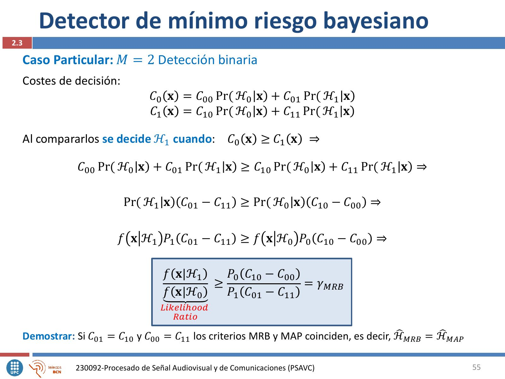

```text
         Detector de mínimo riesgo bayesiano
2.3

      Caso Particular: 𝑀𝑀 = 2 Detección binaria
      Costes de decisión:
                                      𝐶𝐶0 𝐱𝐱 = 𝐶𝐶00 Pr( ℋ0 𝐱𝐱 + 𝐶𝐶01 Pr( ℋ1 𝐱𝐱
                                      𝐶𝐶1 𝐱𝐱 = 𝐶𝐶10 Pr( ℋ0 𝐱𝐱 + 𝐶𝐶11 Pr( ℋ1 𝐱𝐱

      Al compararlos se decide ℋ1 cuando: 𝐶𝐶0 𝐱𝐱 ≥ 𝐶𝐶1 𝐱𝐱 ⇒

                  𝐶𝐶00 Pr( ℋ0 𝐱𝐱 + 𝐶𝐶01 Pr( ℋ1 𝐱𝐱 ≥ 𝐶𝐶10 Pr( ℋ0 𝐱𝐱 + 𝐶𝐶11 Pr( ℋ1 𝐱𝐱 ⇒

                               Pr( ℋ1 𝐱𝐱 𝐶𝐶01 − 𝐶𝐶11 ≥ Pr( ℋ0 𝐱𝐱 𝐶𝐶10 − 𝐶𝐶00 ⇒

                             𝑓𝑓 𝐱𝐱�ℋ1 𝑃𝑃1 𝐶𝐶01 − 𝐶𝐶11 ≥ 𝑓𝑓 𝐱𝐱�ℋ0 𝑃𝑃0 𝐶𝐶10 − 𝐶𝐶00 ⇒

                                         𝑓𝑓 𝐱𝐱|ℋ1   𝑃𝑃0 𝐶𝐶10 − 𝐶𝐶00
                                                  ≥                 = 𝛾𝛾𝑀𝑀𝑀𝑀𝑀𝑀
                                         𝑓𝑓 𝐱𝐱|ℋ0   𝑃𝑃1 𝐶𝐶01 − 𝐶𝐶11
                                         𝐿𝐿𝐿𝐿𝐿𝐿𝐿𝐿𝐿𝐿𝐿𝐿𝐿𝐿𝐿𝐿𝐿𝐿𝐿
                                               𝑅𝑅𝑅𝑅𝑅𝑅𝑅𝑅𝑅𝑅
                                                                                           �𝑀𝑀𝑀𝑀𝑀𝑀 = ℋ
      Demostrar: Si 𝐶𝐶01 = 𝐶𝐶10 y 𝐶𝐶00 = 𝐶𝐶11 los criterios MRB y MAP coinciden, es decir, ℋ         �𝑀𝑀𝑀𝑀𝑀𝑀

                  230092-Procesado de Señal Audiovisual y de Comunicaciones (PSAVC)                            55
```

## Page 56

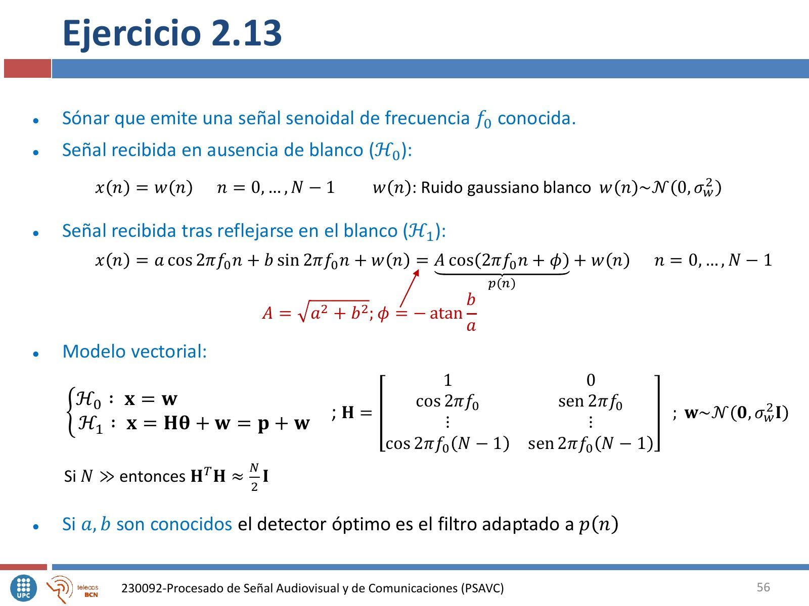

```text
    Ejercicio 2.13
●   Sónar que emite una señal senoidal de frecuencia 𝑓𝑓0 conocida.
●   Señal recibida en ausencia de blanco (ℋ0 ):
          𝑥𝑥 𝑛𝑛 = 𝑤𝑤 𝑛𝑛       𝑛𝑛 = 0, … , 𝑁𝑁 − 1        𝑤𝑤 𝑛𝑛 : Ruido gaussiano blanco 𝑤𝑤 𝑛𝑛 ~𝒩𝒩 0, 𝜎𝜎𝑤𝑤2

●   Señal recibida tras reflejarse en el blanco (ℋ1 ):
          𝑥𝑥 𝑛𝑛 = 𝑎𝑎 cos 2𝜋𝜋𝑓𝑓0 𝑛𝑛 + 𝑏𝑏 sin 2𝜋𝜋𝑓𝑓0 𝑛𝑛 + 𝑤𝑤 𝑛𝑛 = 𝐴𝐴 cos 2𝜋𝜋𝑓𝑓0 𝑛𝑛 + 𝜙𝜙 + 𝑤𝑤 𝑛𝑛             𝑛𝑛 = 0, … , 𝑁𝑁 − 1
                                                                              𝑝𝑝 𝑛𝑛
                                                                         𝑏𝑏
                                      𝐴𝐴 =    𝑎𝑎2 + 𝑏𝑏 2 ; 𝜙𝜙 = − atan
                                                                         𝑎𝑎
●   Modelo vectorial:
                                                                 1                             0
        ℋ0 ∶ 𝐱𝐱 = 𝐰𝐰                                        cos 2𝜋𝜋𝑓𝑓0                    sen 2𝜋𝜋𝑓𝑓0
    �                                            ; 𝐇𝐇 =                                                     ; 𝐰𝐰~𝒩𝒩 𝟎𝟎, 𝜎𝜎𝑤𝑤2 𝐈𝐈
        ℋ1 ∶ 𝐱𝐱 = 𝐇𝐇𝐇𝐇 + 𝐰𝐰 = 𝐩𝐩 + 𝐰𝐰                            ⋮                             ⋮
                                                        cos 2𝜋𝜋𝑓𝑓0 𝑁𝑁 − 1             sen 2𝜋𝜋𝑓𝑓0 𝑁𝑁 − 1
                                   𝑁𝑁
    Si 𝑁𝑁 ≫ entonces 𝐇𝐇 𝑇𝑇 𝐇𝐇 ≈       𝐈𝐈
                                   2

●   Si 𝑎𝑎, 𝑏𝑏 son conocidos el detector óptimo es el filtro adaptado a 𝑝𝑝 𝑛𝑛


              230092-Procesado de Señal Audiovisual y de Comunicaciones (PSAVC)                                            56
```

## Page 57

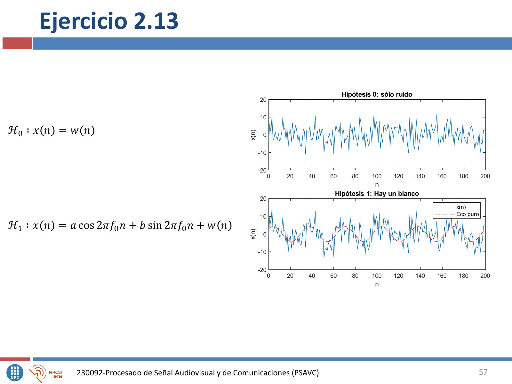

```text
       Ejercicio 2.13

                                                                                              Hipótesis 0: sólo ruido
                                                                     20

                                                                     10

ℋ0 ∶ 𝑥𝑥 𝑛𝑛 = 𝑤𝑤 𝑛𝑛                                            x(n)    0

                                                                     -10

                                                                     -20
                                                                           0   20   40   60      80    100    120       140   160   180        200
                                                                                                       n
                                                                                          Hipótesis 1: Hay un blanco
                                                                     20
                                                                                                                                    x(n)
                                                                     10                                                             Eco puro

ℋ1 ∶ 𝑥𝑥 𝑛𝑛 = 𝑎𝑎 cos 2𝜋𝜋𝑓𝑓0 𝑛𝑛 + 𝑏𝑏 sin 2𝜋𝜋𝑓𝑓0 𝑛𝑛 + 𝑤𝑤 𝑛𝑛
                                                              x(n)    0

                                                                     -10

                                                                     -20
                                                                           0   20   40   60      80    100    120       140   160   180        200
                                                                                                        n


                 230092-Procesado de Señal Audiovisual y de Comunicaciones (PSAVC)                                                         57
```

## Page 58

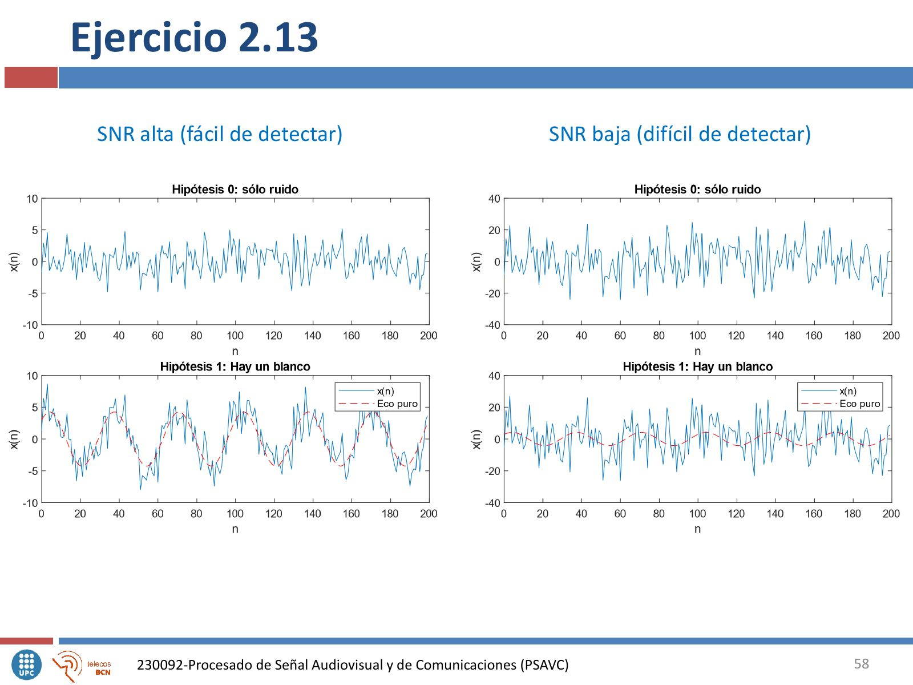

```text
Ejercicio 2.13
 SNR alta (fácil de detectar)                                      SNR baja (difícil de detectar)


     230092-Procesado de Señal Audiovisual y de Comunicaciones (PSAVC)                              58
```

## Page 59

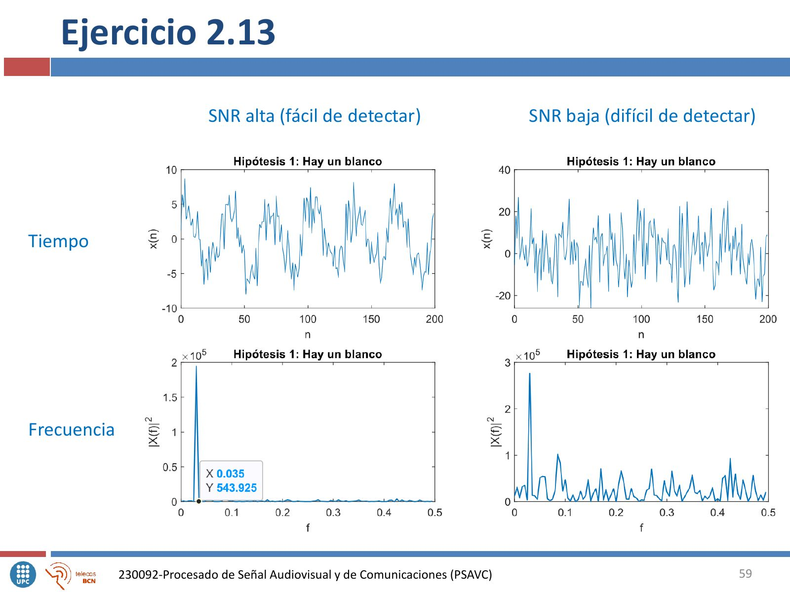

```text
   Ejercicio 2.13
                            SNR alta (fácil de detectar)                         SNR baja (difícil de detectar)


Tiempo


Frecuencia


             230092-Procesado de Señal Audiovisual y de Comunicaciones (PSAVC)                              59
```

## Page 60

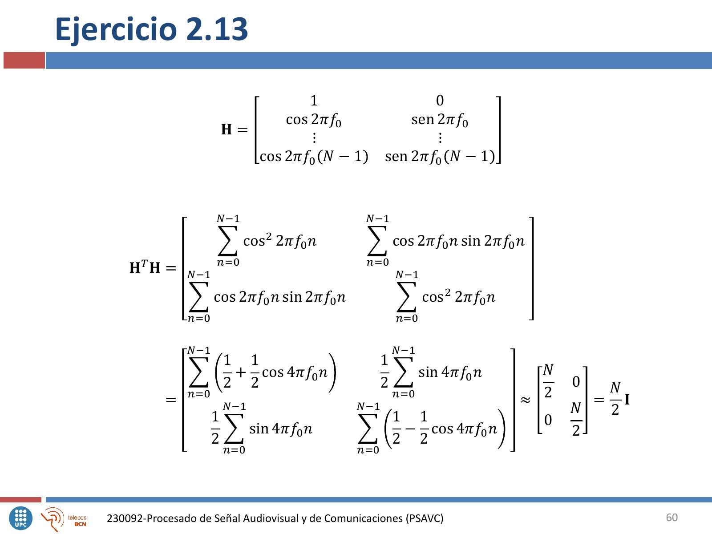

```text
Ejercicio 2.13
                                        1                          0
                                   cos 2𝜋𝜋𝑓𝑓0                 sen 2𝜋𝜋𝑓𝑓0
                          𝐇𝐇 =
                                        ⋮                          ⋮
                               cos 2𝜋𝜋𝑓𝑓0 𝑁𝑁 − 1          sen 2𝜋𝜋𝑓𝑓0 𝑁𝑁 − 1


                         𝑁𝑁−1                       𝑁𝑁−1

                          � cos2 2𝜋𝜋𝑓𝑓0 𝑛𝑛           � cos 2𝜋𝜋𝑓𝑓0 𝑛𝑛 sin 2𝜋𝜋𝑓𝑓0 𝑛𝑛
       𝐇𝐇 𝑇𝑇 𝐇𝐇 = 𝑁𝑁−1 𝑛𝑛=0                          𝑛𝑛=0
                                                            𝑁𝑁−1

                  � cos 2𝜋𝜋𝑓𝑓0 𝑛𝑛 sin 2𝜋𝜋𝑓𝑓0 𝑛𝑛             � cos2 2𝜋𝜋𝑓𝑓0 𝑛𝑛
                  𝑛𝑛=0                                      𝑛𝑛=0

                  𝑁𝑁−1                                      𝑁𝑁−1
                    1 1                                   1
                  �  + cos 4𝜋𝜋𝑓𝑓0 𝑛𝑛                        � sin 4𝜋𝜋𝑓𝑓0 𝑛𝑛        𝑁𝑁
                    2 2                                   2                             0        𝑁𝑁
              =   𝑛𝑛=0                                      𝑛𝑛=0
                                                                                 ≈ 2         =      𝐈𝐈
                          𝑁𝑁−1                     𝑁𝑁−1                                 𝑁𝑁       2
                         1                           1 1                           0
                           � sin 4𝜋𝜋𝑓𝑓0 𝑛𝑛         �  − cos 4𝜋𝜋𝑓𝑓0 𝑛𝑛                   2
                         2                           2 2
                           𝑛𝑛=0                    𝑛𝑛=0


   230092-Procesado de Señal Audiovisual y de Comunicaciones (PSAVC)                                     60
```

## Page 61

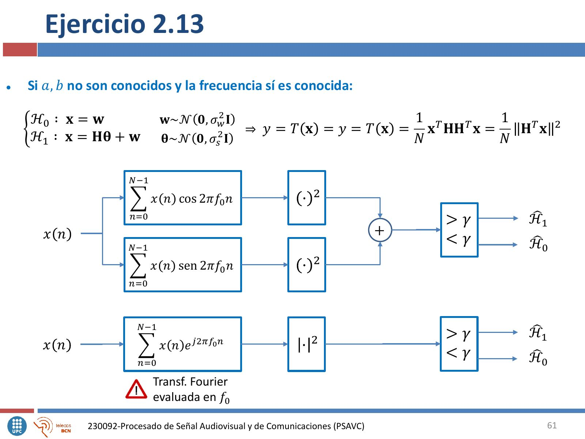

```text
       Ejercicio 2.13
●   Si 𝑎𝑎, 𝑏𝑏 no son conocidos y la frecuencia sí es conocida:

     ℋ ∶ 𝐱𝐱 = 𝐰𝐰                 𝐰𝐰~𝒩𝒩 𝟎𝟎, 𝜎𝜎𝑤𝑤2 𝐈𝐈                                    1 𝑇𝑇               1
    � 0                                                ⇒ 𝑦𝑦 = 𝑇𝑇 𝐱𝐱 = 𝑦𝑦 = 𝑇𝑇 𝐱𝐱 =        𝐱𝐱 𝐇𝐇𝐇𝐇 𝑇𝑇 𝐱𝐱 =    𝐇𝐇 𝑇𝑇 𝐱𝐱 2
     ℋ1 ∶ 𝐱𝐱 = 𝐇𝐇𝐇𝐇 + 𝐰𝐰         𝛉𝛉~𝒩𝒩 𝟎𝟎, 𝜎𝜎𝑠𝑠2 𝐈𝐈                                    𝑁𝑁                 𝑁𝑁

                        𝑁𝑁−1

                         � 𝑥𝑥 𝑛𝑛 cos 2𝜋𝜋𝑓𝑓0 𝑛𝑛                   · 2
                        𝑛𝑛=0
                                                                                             > 𝛾𝛾               �1
                                                                                                                ℋ
       𝑥𝑥 𝑛𝑛                                                                       +
                        𝑁𝑁−1
                                                                                             < 𝛾𝛾               �0
                                                                                                                ℋ
                        � 𝑥𝑥 𝑛𝑛 sen 2𝜋𝜋𝑓𝑓0 𝑛𝑛                    · 2
                        𝑛𝑛=0


                          𝑁𝑁−1
                                                                                             > 𝛾𝛾               �1
                                                                                                                ℋ
       𝑥𝑥 𝑛𝑛              � 𝑥𝑥 𝑛𝑛 𝑒𝑒     𝑗𝑗𝑗𝑗𝑗𝑓𝑓0 𝑛𝑛
                                                                 ·2                          < 𝛾𝛾
                          𝑛𝑛=0
                                                                                                                �0
                                                                                                                ℋ
                               Transf. Fourier
                               evaluada en 𝑓𝑓0

               230092-Procesado de Señal Audiovisual y de Comunicaciones (PSAVC)                                   61
```

## Page 62

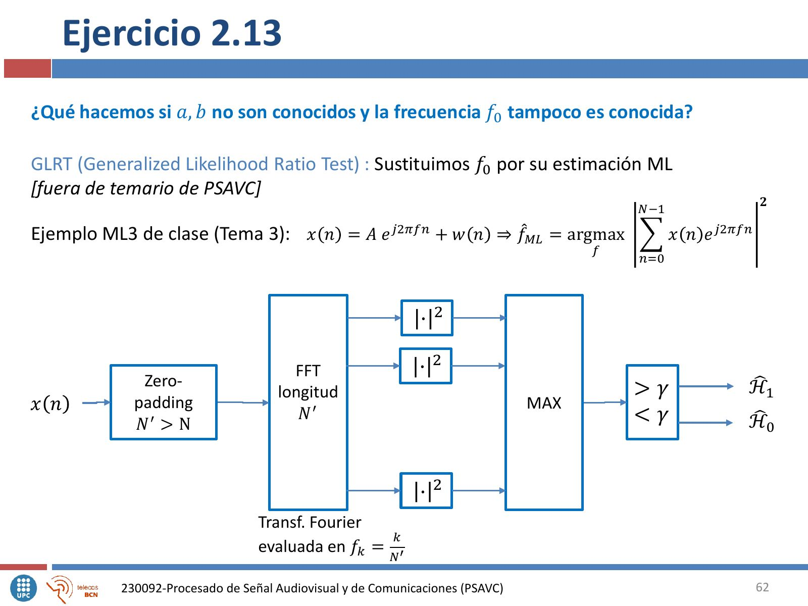

```text
    Ejercicio 2.13
¿Qué hacemos si 𝑎𝑎, 𝑏𝑏 no son conocidos y la frecuencia 𝑓𝑓0 tampoco es conocida?

GLRT (Generalized Likelihood Ratio Test) : Sustituimos 𝑓𝑓0 por su estimación ML
[fuera de temario de PSAVC]
                                                                                                         𝟐𝟐
                                                                                           𝑁𝑁−1

Ejemplo ML3 de clase (Tema 3): 𝑥𝑥 𝑛𝑛 = 𝐴𝐴 𝑒𝑒 𝑗𝑗𝑗𝑗𝑗𝑗𝑗𝑗𝑗 + 𝑤𝑤 𝑛𝑛 ⇒ 𝑓𝑓̂𝑀𝑀𝑀𝑀 = argmax � 𝑥𝑥 𝑛𝑛 𝑒𝑒 𝑗𝑗𝑗𝑗𝑗𝑗𝑗𝑗𝑗
                                                                                      𝑓𝑓
                                                                                           𝑛𝑛=0


                                                              ·2

                                        FFT                   ·2
               Zero-                                                                       > 𝛾𝛾      �1
                                                                                                     ℋ
                                      longitud
𝑥𝑥 𝑛𝑛         padding                                                           MAX
              𝑁𝑁 ′ > N
                                         𝑁𝑁 ′                                              < 𝛾𝛾      �0
                                                                                                     ℋ


                                                              ·2
                                   Transf. Fourier
                                                      𝑘𝑘
                                   evaluada en 𝑓𝑓𝑘𝑘 = ′
                                                         𝑁𝑁

            230092-Procesado de Señal Audiovisual y de Comunicaciones (PSAVC)                            62
```

## Page 63

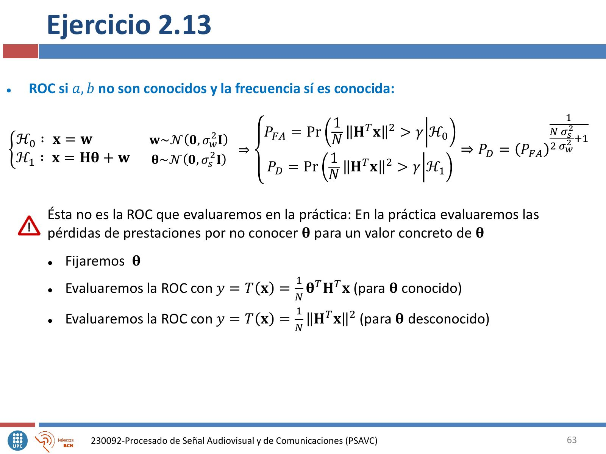

```text
      Ejercicio 2.13
●   ROC si 𝑎𝑎, 𝑏𝑏 no son conocidos y la frecuencia sí es conocida:
                                                                                                          1
                                                                1      𝑇𝑇   2
                                                   𝑃𝑃𝐹𝐹𝐴𝐴 = Pr      𝐇𝐇 𝐱𝐱 > 𝛾𝛾 ℋ0                     𝑁𝑁 𝜎𝜎𝑠𝑠2
 ℋ ∶ 𝐱𝐱 = 𝐰𝐰                𝐰𝐰~𝒩𝒩 𝟎𝟎, 𝜎𝜎𝑤𝑤2 𝐈𝐈                  𝑁𝑁                                         2 +1
� 0                                              ⇒                                    ⇒ 𝑃𝑃𝐷𝐷 = 𝑃𝑃𝐹𝐹𝐹𝐹 2 𝜎𝜎𝑤𝑤
 ℋ1 ∶ 𝐱𝐱 = 𝐇𝐇𝐇𝐇 + 𝐰𝐰        𝛉𝛉~𝒩𝒩 𝟎𝟎, 𝜎𝜎𝑠𝑠2 𝐈𝐈                 1
                                                    𝑃𝑃𝐷𝐷 = Pr      𝐇𝐇 𝑇𝑇 𝐱𝐱 2 > 𝛾𝛾 ℋ1
                                                               𝑁𝑁

       Ésta no es la ROC que evaluaremos en la práctica: En la práctica evaluaremos las
       pérdidas de prestaciones por no conocer 𝛉𝛉 para un valor concreto de 𝛉𝛉
       ●   Fijaremos 𝛉𝛉
                                                           1 𝑇𝑇 𝑇𝑇
       ●   Evaluaremos la ROC con 𝑦𝑦 = 𝑇𝑇 𝐱𝐱 =                𝛉𝛉 𝐇𝐇 𝐱𝐱 (para 𝛉𝛉 conocido)
                                                           𝑁𝑁
                                                           1
       ●   Evaluaremos la ROC con 𝑦𝑦 = 𝑇𝑇 𝐱𝐱             =      𝐇𝐇 𝑇𝑇 𝐱𝐱 2 (para 𝛉𝛉 desconocido)
                                                           𝑁𝑁


               230092-Procesado de Señal Audiovisual y de Comunicaciones (PSAVC)                           63
```

## Page 64

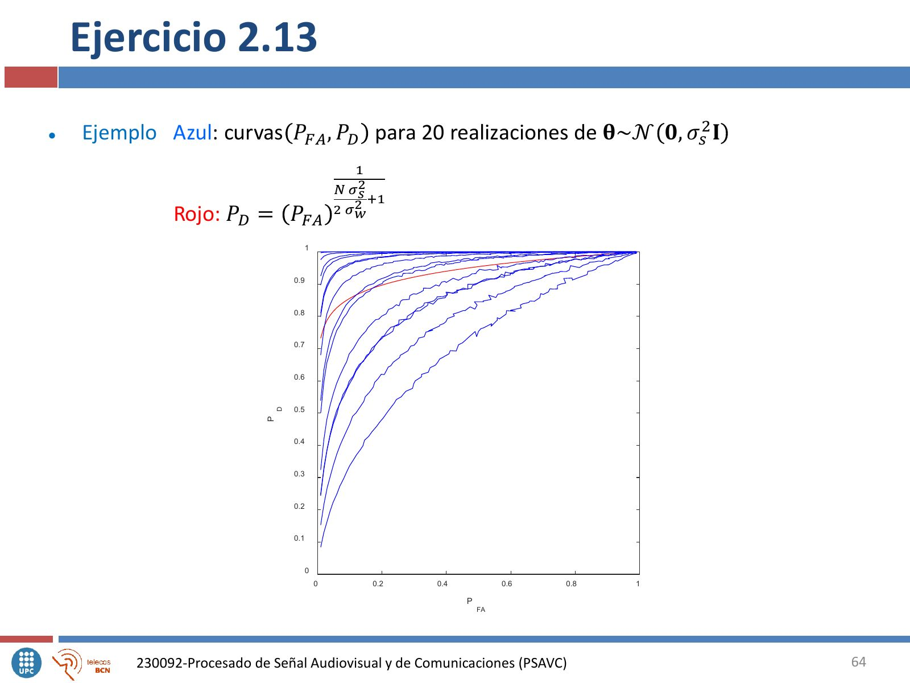

```text
    Ejercicio 2.13
●   Ejemplo Azul: curvas 𝑃𝑃𝐹𝐹𝐴𝐴 , 𝑃𝑃𝐷𝐷 para 20 realizaciones de 𝛉𝛉~𝒩𝒩 𝟎𝟎, 𝜎𝜎𝑠𝑠2 𝐈𝐈
                                                    1
                                                𝑁𝑁 𝜎𝜎2
                                                     𝑠𝑠 +1
               Rojo: 𝑃𝑃𝐷𝐷 = 𝑃𝑃𝐹𝐹𝐹𝐹              2 𝜎𝜎2
                                                    𝑤𝑤

                                        1


                                  0.9


                                  0.8


                                  0.7


                                  0.6


                              D   0.5
                             P

                                  0.4


                                  0.3


                                  0.2


                                  0.1


                                        0
                                            0          0.2   0.4            0.6   0.8   1

                                                                   P
                                                                       FA


          230092-Procesado de Señal Audiovisual y de Comunicaciones (PSAVC)                 64
```

## Page 65

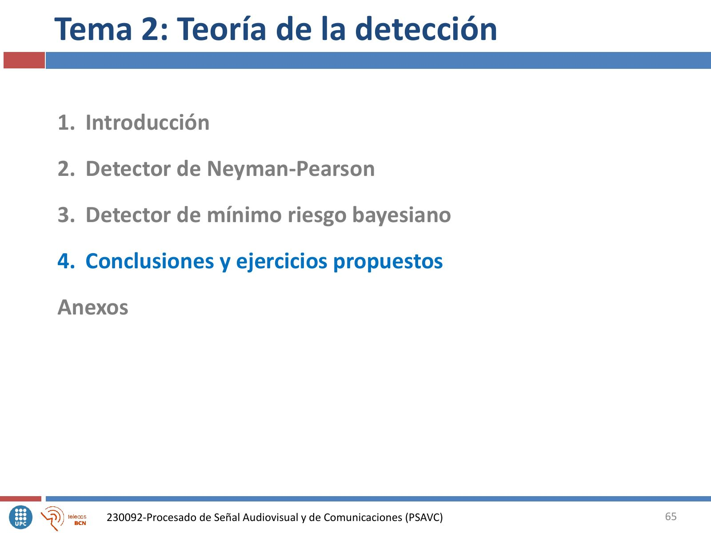

```text
Tema 2: Teoría de la detección

1. Introducción
2. Detector de Neyman-Pearson
3. Detector de mínimo riesgo bayesiano
4. Conclusiones y ejercicios propuestos
Anexos


    230092-Procesado de Señal Audiovisual y de Comunicaciones (PSAVC)   65
```

## Page 66

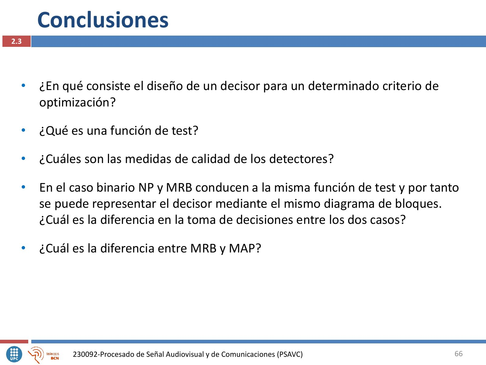

```text
      Conclusiones
2.3


  • ¿En qué consiste el diseño de un decisor para un determinado criterio de
    optimización?

  • ¿Qué es una función de test?

  • ¿Cuáles son las medidas de calidad de los detectores?

  • En el caso binario NP y MRB conducen a la misma función de test y por tanto
    se puede representar el decisor mediante el mismo diagrama de bloques.
    ¿Cuál es la diferencia en la toma de decisiones entre los dos casos?

  • ¿Cuál es la diferencia entre MRB y MAP?


           230092-Procesado de Señal Audiovisual y de Comunicaciones (PSAVC)   66
```

## Page 67

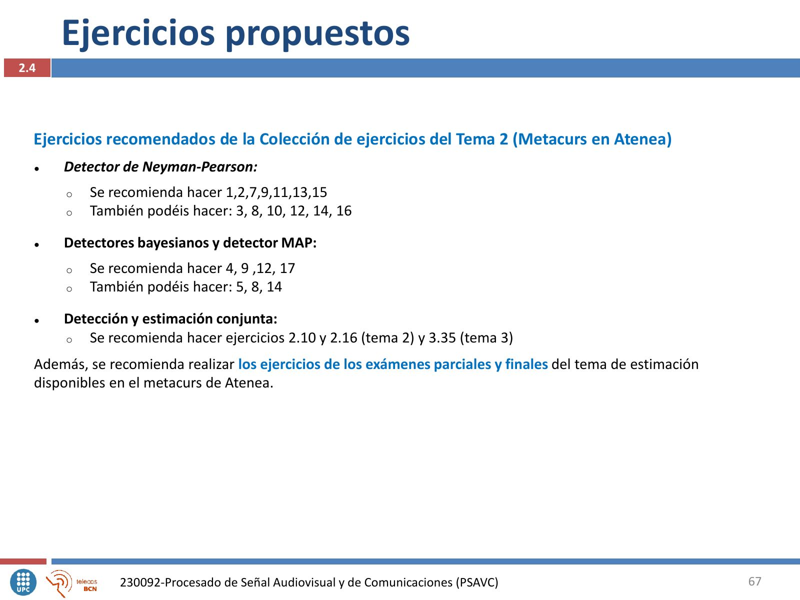

```text
      Ejercicios propuestos
2.4


  Ejercicios recomendados de la Colección de ejercicios del Tema 2 (Metacurs en Atenea)
  ●   Detector de Neyman-Pearson:
       o   Se recomienda hacer 1,2,7,9,11,13,15
       o   También podéis hacer: 3, 8, 10, 12, 14, 16

  ●   Detectores bayesianos y detector MAP:
       o   Se recomienda hacer 4, 9 ,12, 17
       o   También podéis hacer: 5, 8, 14

  ●   Detección y estimación conjunta:
      o  Se recomienda hacer ejercicios 2.10 y 2.16 (tema 2) y 3.35 (tema 3)
  Además, se recomienda realizar los ejercicios de los exámenes parciales y finales del tema de estimación
  disponibles en el metacurs de Atenea.


               230092-Procesado de Señal Audiovisual y de Comunicaciones (PSAVC)                             67
```

## Page 68

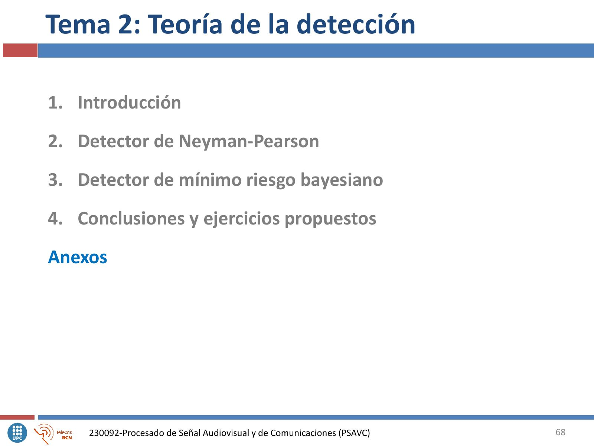

```text
Tema 2: Teoría de la detección

1. Introducción
2. Detector de Neyman-Pearson
3. Detector de mínimo riesgo bayesiano
4. Conclusiones y ejercicios propuestos
Anexos


    230092-Procesado de Señal Audiovisual y de Comunicaciones (PSAVC)   68
```

## Page 69

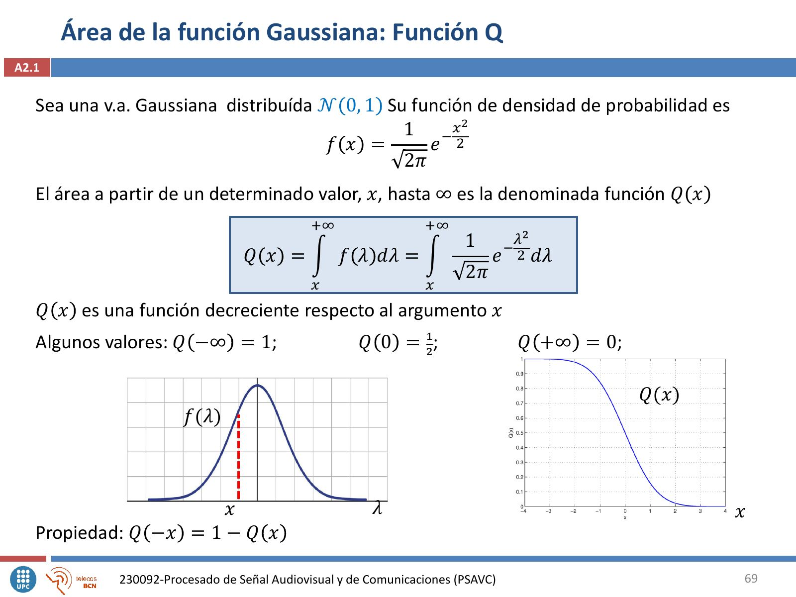

```text
       Área de la función Gaussiana: Función Q
A2.1


   Sea una v.a. Gaussiana distribuída 𝒩𝒩 0, 1 Su función de densidad de probabilidad es
                                                1 −𝑥𝑥 2
                                       𝑓𝑓 𝑥𝑥 =      𝑒𝑒 2
                                                2𝜋𝜋
   El área a partir de un determinado valor, 𝑥𝑥, hasta ∞ es la denominada función 𝑄𝑄 𝑥𝑥
                                              +∞                 +∞
                                                                        1         𝜆𝜆2
                                  𝑄𝑄 𝑥𝑥 = � 𝑓𝑓 𝜆𝜆 𝑑𝑑𝑑𝑑 = �                    𝑒𝑒 − 2 𝑑𝑑𝑑𝑑
                                                                        2𝜋𝜋
                                              𝑥𝑥                 𝑥𝑥
   𝑄𝑄 𝑥𝑥 es una función decreciente respecto al argumento 𝑥𝑥
   Algunos valores: 𝑄𝑄 −∞ = 1;                        𝑄𝑄 0 = 12;                  𝑄𝑄 +∞ = 0;

                                                                                               𝑄𝑄(𝑥𝑥)
                        𝑓𝑓(𝜆𝜆)


                         𝑥𝑥                             𝜆𝜆                                              𝑥𝑥
   Propiedad: 𝑄𝑄 −𝑥𝑥 = 1 − 𝑄𝑄 𝑥𝑥

             230092-Procesado de Señal Audiovisual y de Comunicaciones (PSAVC)                           69
```

## Page 70

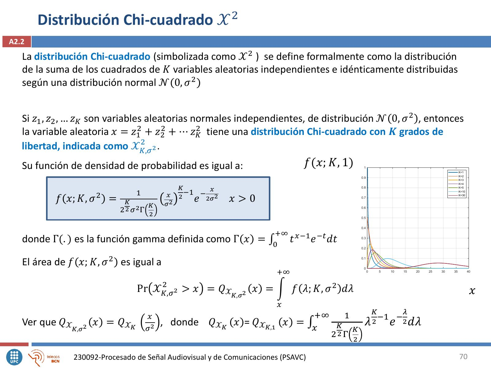

```text
       Distribución Chi-cuadrado 𝒳𝒳 2
A2.2
   La distribución Chi-cuadrado (simbolizada como 𝒳𝒳 2 ) se define formalmente como la distribución
   de la suma de los cuadrados de 𝐾𝐾 variables aleatorias independientes e idénticamente distribuidas
   según una distribución normal 𝒩𝒩 0, 𝜎𝜎 2


   Si 𝑧𝑧1 , 𝑧𝑧2 , … 𝑧𝑧𝐾𝐾 son variables aleatorias normales independientes, de distribución 𝒩𝒩 0, 𝜎𝜎 2 , entonces
   la variable aleatoria 𝑥𝑥 = 𝑧𝑧12 + 𝑧𝑧22 + ⋯ 𝑧𝑧𝐾𝐾2 tiene una distribución Chi-cuadrado con 𝑲𝑲 grados de
                                      2
   libertad, indicada como 𝒳𝒳𝐾𝐾,𝜎𝜎       2.

   Su función de densidad de probabilidad es igual a:                                               𝑓𝑓(𝑥𝑥; 𝐾𝐾, 1)    1
                                                                                                                                                                     K=1
                                                                                                                                                                     K=2
                                                                                                                    0.9
                                                                                                                                                                     K=3
                                                                                                                                                                     K=4
                                                      𝐾𝐾               𝑥𝑥                                           0.8                                              K=5

                                        1          𝑥𝑥 2 −1        −                                                                                                  K=10
                           2
           𝑓𝑓 𝑥𝑥; 𝐾𝐾, 𝜎𝜎       =                             𝑒𝑒       2𝜎𝜎2   𝑥𝑥 > 0
                                                                                                                                                                     K=30
                                                                                                                    0.7
                                    𝐾𝐾            𝜎𝜎2
                                             𝐾𝐾
                                   2 2 𝜎𝜎2 Γ                                                                        0.6

                                             2                                                                      0.5


                                                                                                                    0.4

                                                                                          +∞
   donde Γ(. ) es la función gamma definida como Γ 𝑥𝑥                                  = ∫0 𝑡𝑡 𝑥𝑥−1 𝑒𝑒 −𝑡𝑡 𝑑𝑑𝑑𝑑     0.3


                                                                                                                    0.2


   El área de 𝑓𝑓 𝑥𝑥; 𝐾𝐾, 𝜎𝜎 2 es igual a
                                                                                                                    0.1


                                                                                                                     0
                                                                                            +∞                            0     5     10    15   20   25   30   35          40


                                               2
                                         Pr 𝒳𝒳𝐾𝐾,𝜎𝜎 2 > 𝑥𝑥 = 𝑄𝑄𝒳𝒳                     𝑥𝑥 = � 𝑓𝑓 𝜆𝜆; 𝐾𝐾, 𝜎𝜎 2 𝑑𝑑𝑑𝑑                                                            𝑥𝑥
                                                                             𝐾𝐾,𝜎𝜎2
                                                                                            𝑥𝑥
                                                                                                                              𝐾𝐾            𝜆𝜆
                                             𝑥𝑥                                                       +∞     1                   −1        −2
   Ver que 𝑄𝑄𝒳𝒳
                𝐾𝐾,𝜎𝜎2
                         𝑥𝑥 = 𝑄𝑄𝒳𝒳𝐾𝐾
                                            𝜎𝜎2
                                                  , donde 𝑄𝑄𝒳𝒳𝐾𝐾 𝑥𝑥 = 𝑄𝑄𝒳𝒳𝐾𝐾,1 𝑥𝑥                 = ∫𝑥𝑥   𝐾𝐾          𝜆𝜆      2       𝑒𝑒 𝑑𝑑𝑑𝑑
                                                                                                               𝐾𝐾
                                                                                                         22 Γ 2

                  230092-Procesado de Señal Audiovisual y de Comunicaciones (PSAVC)                                                                                  70
```

## Page 71

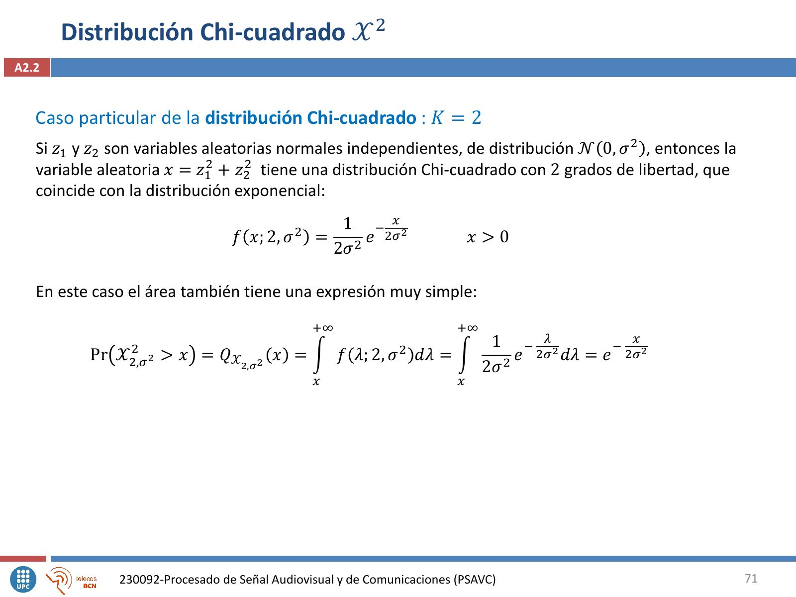

```text
       Distribución Chi-cuadrado 𝒳𝒳 2
A2.2


   Caso particular de la distribución Chi-cuadrado : 𝐾𝐾 = 2
   Si 𝑧𝑧1 y 𝑧𝑧2 son variables aleatorias normales independientes, de distribución 𝒩𝒩 0, 𝜎𝜎 2 , entonces la
   variable aleatoria 𝑥𝑥 = 𝑧𝑧12 + 𝑧𝑧22 tiene una distribución Chi-cuadrado con 2 grados de libertad, que
   coincide con la distribución exponencial:

                                                 2
                                                       1 − 𝑥𝑥 2
                                  𝑓𝑓 𝑥𝑥; 2, 𝜎𝜎       = 2 𝑒𝑒 2𝜎𝜎               𝑥𝑥 > 0
                                                      2𝜎𝜎

   En este caso el área también tiene una expresión muy simple:
                                                     +∞                  +∞
                2                                              2
                                                                     1 − 𝜆𝜆 2               𝑥𝑥
                                                                                          − 2
           Pr 𝒳𝒳2,𝜎𝜎 2 > 𝑥𝑥   = 𝑄𝑄𝒳𝒳 2 𝑥𝑥 = � 𝑓𝑓 𝜆𝜆; 2, 𝜎𝜎 𝑑𝑑𝑑𝑑 = �       𝑒𝑒 2𝜎𝜎 𝑑𝑑𝑑𝑑 = 𝑒𝑒 2𝜎𝜎
                                    2,𝜎𝜎                            2𝜎𝜎 2
                                                     𝑥𝑥                  𝑥𝑥


               230092-Procesado de Señal Audiovisual y de Comunicaciones (PSAVC)                             71
```
