# PSAVC 3 Estimacion QP2026 G10

- Source PDF: `Teoria/PSAVC 3 Estimacion QP2026 G10.pdf`
- PDF title: `PSAVC - T3: Teoría de la Estimación`
- Pages: 119
- Note: Transcribed from the embedded PDF text layer. Each page links to a rendered page image so figures, plots, handwriting, and formula layout can be checked against the original.
- Text-layer caveat: `�` marks a glyph that the PDF text layer does not map to Unicode; use the rendered page image for that formula or symbol.

## Page 1


```text
               Tema 3.- Teoría de la estimación


Copyright © Profesorado de la asignatura 230092-PSAVC-ETSETB.


   UPC / GPS                   230092 – PSAVC – GRETST - ETSETB
```

## Page 2


```text
    [Previo: Data-driven vs Model-driven]
Simplificando en exceso…
●   En IPAV estudiasteis técnicas de
    aprendizaje automático en las
    que el algoritmo aprende de los
    datos proporcionados y el
    sistema encuentra patrones,
    correlaciones y representaciones
    óptimas de manera automática
    “Data-driven methods”


●   En PSAVC estudiaremos
    (principalmente) técnicas de
    estimación/detección para
    problemas en los que
    disponemos de un modelo de la
    señal.
    “Model-driven methods”

           230092-Procesado de Señal Audiovisual y de Comunicaciones (PSAVC)   2
```

## Page 3

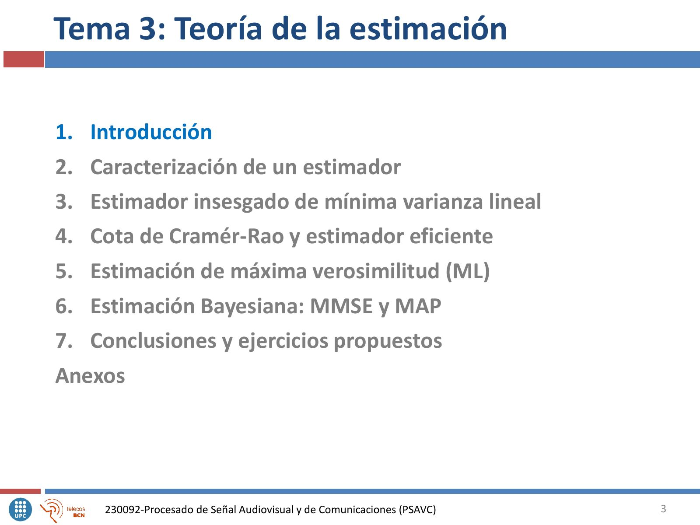

```text
Tema 3: Teoría de la estimación

1. Introducción
2. Caracterización de un estimador
3. Estimador insesgado de mínima varianza lineal
4. Cota de Cramér-Rao y estimador eficiente
5. Estimación de máxima verosimilitud (ML)
6. Estimación Bayesiana: MMSE y MAP
7. Conclusiones y ejercicios propuestos
Anexos


    230092-Procesado de Señal Audiovisual y de Comunicaciones (PSAVC)   3
```

## Page 4

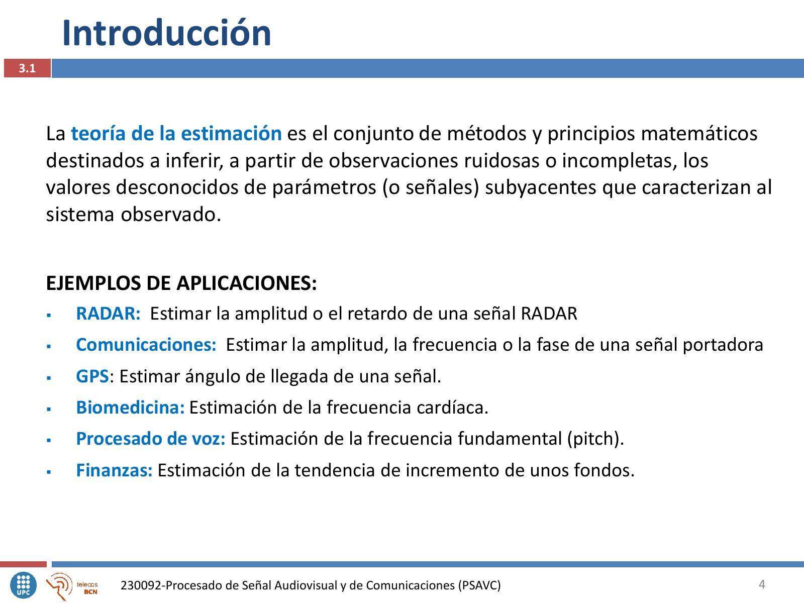

```text
          Introducción
3.1


      La teoría de la estimación es el conjunto de métodos y principios matemáticos
      destinados a inferir, a partir de observaciones ruidosas o incompletas, los
      valores desconocidos de parámetros (o señales) subyacentes que caracterizan al
      sistema observado.


      EJEMPLOS DE APLICACIONES:
         RADAR: Estimar la amplitud o el retardo de una señal RADAR
         Comunicaciones: Estimar la amplitud, la frecuencia o la fase de una señal portadora
         GPS: Estimar ángulo de llegada de una señal.
         Biomedicina: Estimación de la frecuencia cardíaca.
         Procesado de voz: Estimación de la frecuencia fundamental (pitch).
         Finanzas: Estimación de la tendencia de incremento de unos fondos.


               230092-Procesado de Señal Audiovisual y de Comunicaciones (PSAVC)            4
```

## Page 5

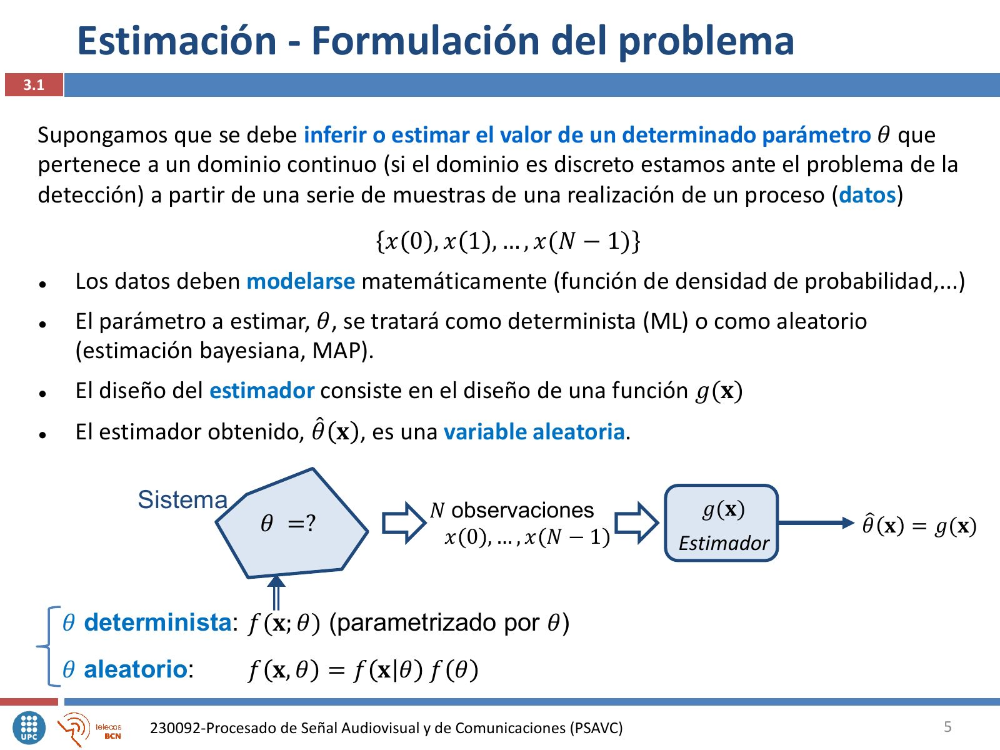

```text
       Estimación - Formulación del problema
3.1


  Supongamos que se debe inferir o estimar el valor de un determinado parámetro 𝜃𝜃 que
  pertenece a un dominio continuo (si el dominio es discreto estamos ante el problema de la
  detección) a partir de una serie de muestras de una realización de un proceso (datos)
                                              𝑥𝑥 0 , 𝑥𝑥 1 , … , 𝑥𝑥(𝑁𝑁 − 1)
  ●    Los datos deben modelarse matemáticamente (función de densidad de probabilidad,...)
  ●    El parámetro a estimar, 𝜃𝜃, se tratará como determinista (ML) o como aleatorio
       (estimación bayesiana, MAP).
  ●    El diseño del estimador consiste en el diseño de una función 𝑔𝑔(𝐱𝐱)
  ●    El estimador obtenido, 𝜃𝜃̂ 𝐱𝐱 , es una variable aleatoria.

             Sistema                                𝑁𝑁 observaciones                𝑔𝑔(𝐱𝐱)
                             𝜃𝜃 =?                                                            𝜃𝜃� 𝐱𝐱 = 𝑔𝑔(𝐱𝐱)
                                                      𝑥𝑥 0 , … , 𝑥𝑥 𝑁𝑁 − 1        Estimador


      𝜃𝜃 determinista: 𝑓𝑓(𝐱𝐱; 𝜃𝜃) (parametrizado por 𝜃𝜃)
      𝜃𝜃 aleatorio:        𝑓𝑓 𝐱𝐱, 𝜃𝜃 = 𝑓𝑓 𝐱𝐱 𝜃𝜃 𝑓𝑓 𝜃𝜃

              230092-Procesado de Señal Audiovisual y de Comunicaciones (PSAVC)                         5
```

## Page 6

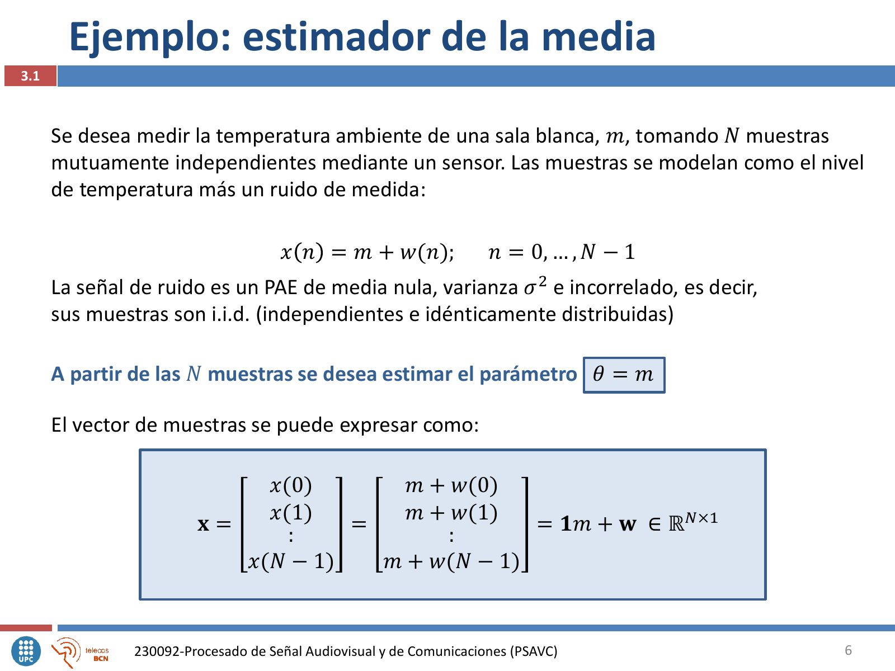

```text
       Ejemplo: estimador de la media
3.1


      Se desea medir la temperatura ambiente de una sala blanca, 𝑚𝑚, tomando 𝑁𝑁 muestras
      mutuamente independientes mediante un sensor. Las muestras se modelan como el nivel
      de temperatura más un ruido de medida:

                                     𝑥𝑥 𝑛𝑛 = 𝑚𝑚 + 𝑤𝑤(𝑛𝑛);            𝑛𝑛 = 0, … , 𝑁𝑁 − 1
      La señal de ruido es un PAE de media nula, varianza 𝜎𝜎 2 e incorrelado, es decir,
      sus muestras son i.i.d. (independientes e idénticamente distribuidas)

      A partir de las 𝑁𝑁 muestras se desea estimar el parámetro 𝜃𝜃 = 𝑚𝑚

      El vector de muestras se puede expresar como:

                                𝑥𝑥(0)        𝑚𝑚 + 𝑤𝑤(0)
                        𝐱𝐱 =    𝑥𝑥(1)        𝑚𝑚 + 𝑤𝑤(1)                   𝑁𝑁×1
                                   :    =         :       = 𝟏𝟏𝑚𝑚 + 𝐰𝐰 ∈ ℝ
                             𝑥𝑥(𝑁𝑁 − 1)   𝑚𝑚 + 𝑤𝑤(𝑁𝑁 − 1)


               230092-Procesado de Señal Audiovisual y de Comunicaciones (PSAVC)          6
```

## Page 7

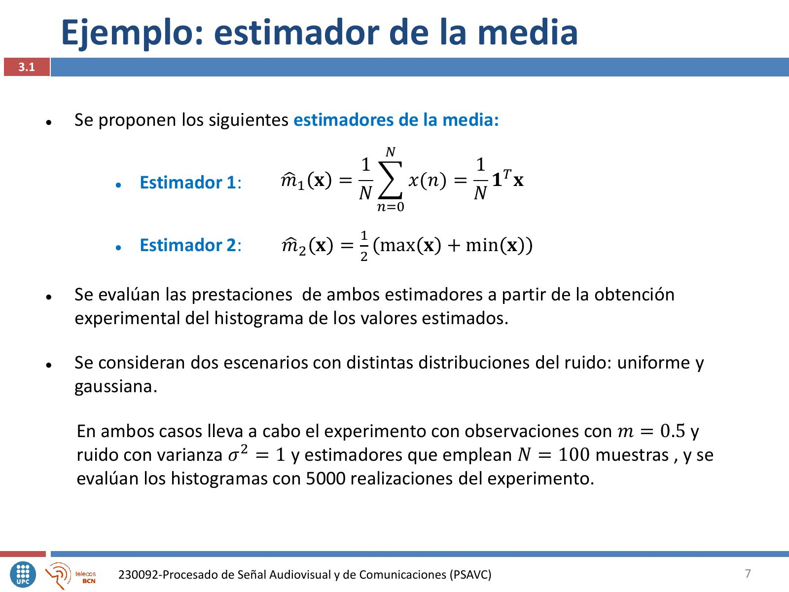

```text
          Ejemplo: estimador de la media
3.1


      ●   Se proponen los siguientes estimadores de la media:
                                                              𝑁𝑁
                                                        1            1
               ●   Estimador 1:            𝑚𝑚
                                           � 1 𝐱𝐱 =        � 𝑥𝑥(𝑛𝑛) = 𝟏𝟏𝑇𝑇 𝐱𝐱
                                                        𝑁𝑁           𝑁𝑁
                                                             𝑛𝑛=0
                                                         1
               ●   Estimador 2:            𝑚𝑚
                                           � 2 𝐱𝐱 =          max 𝐱𝐱 + min 𝐱𝐱
                                                         2

      ●   Se evalúan las prestaciones de ambos estimadores a partir de la obtención
          experimental del histograma de los valores estimados.

      ●   Se consideran dos escenarios con distintas distribuciones del ruido: uniforme y
          gaussiana.

          En ambos casos lleva a cabo el experimento con observaciones con 𝑚𝑚 = 0.5 y
          ruido con varianza 𝜎𝜎 2 = 1 y estimadores que emplean 𝑁𝑁 = 100 muestras , y se
          evalúan los histogramas con 5000 realizaciones del experimento.


               230092-Procesado de Señal Audiovisual y de Comunicaciones (PSAVC)            7
```

## Page 8

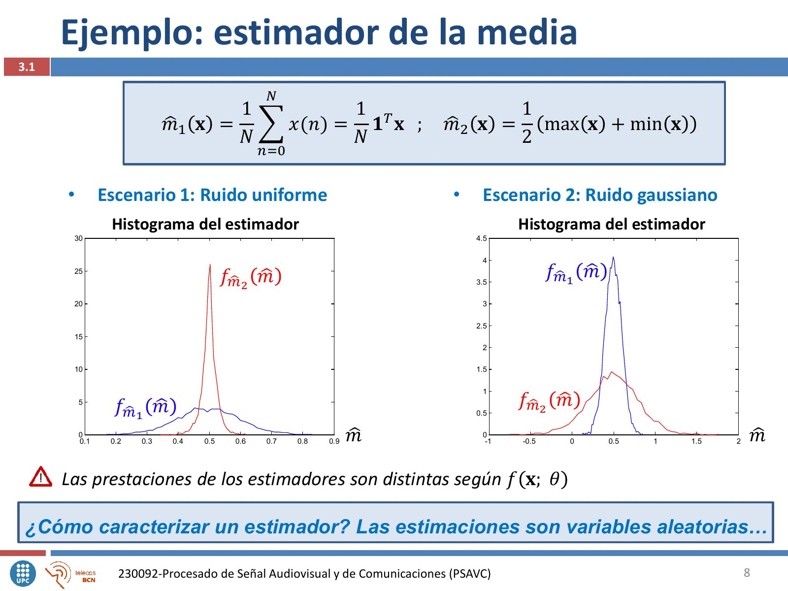

```text
      Ejemplo: estimador de la media
3.1

                                                   𝑁𝑁
                                             1            1                             1
                             𝑚𝑚
                             � 1 𝐱𝐱 =           � 𝑥𝑥(𝑛𝑛) = 𝟏𝟏𝑇𝑇 𝐱𝐱 ;       𝑚𝑚
                                                                           � 2 𝐱𝐱 =       max 𝐱𝐱 + min 𝐱𝐱
                                             𝑁𝑁           𝑁𝑁                            2
                                                  𝑛𝑛=0


      •         Escenario 1: Ruido uniforme                                  •    Escenario 2: Ruido gaussiano
                 Histograma del estimador                                               Histograma del estimador
       30                                                                        4.5

                                                                                  4
       25
                                          𝑓𝑓𝑚𝑚
                                             � 2 𝑚𝑚
                                                 �                               3.5
                                                                                               𝑓𝑓𝑚𝑚
                                                                                                  � 1 𝑚𝑚
                                                                                                      �
       20                                                                         3

                                                                                 2.5
       15
                                                                                  2

       10                                                                        1.5

                                                                                  1

                  𝑓𝑓𝑚𝑚                                                                  𝑓𝑓𝑚𝑚
                                                                                           � 2 𝑚𝑚
                                                                                               �
                     � 1 𝑚𝑚
                         �
          5
                                                                                 0.5

          0
          0.1    0.2   0.3    0.4   0.5     0.6    0.7   0.8   0.9   �
                                                                     𝑚𝑚           0
                                                                                   -1   -0.5       0       0.5   1   1.5   2   𝑚𝑚
                                                                                                                               �

      Las prestaciones de los estimadores son distintas según 𝑓𝑓 𝐱𝐱; 𝜃𝜃

 ¿Cómo caracterizar un estimador? Las estimaciones son variables aleatorias…

                   230092-Procesado de Señal Audiovisual y de Comunicaciones (PSAVC)                                           8
```

## Page 9

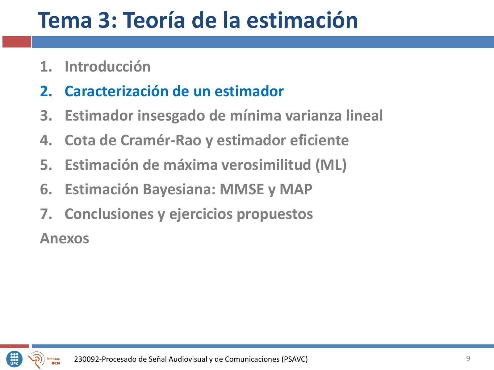

```text
Tema 3: Teoría de la estimación
1. Introducción
2. Caracterización de un estimador
3. Estimador insesgado de mínima varianza lineal
4. Cota de Cramér-Rao y estimador eficiente
5. Estimación de máxima verosimilitud (ML)
6. Estimación Bayesiana: MMSE y MAP
7. Conclusiones y ejercicios propuestos
Anexos


    230092-Procesado de Señal Audiovisual y de Comunicaciones (PSAVC)   9
```

## Page 10

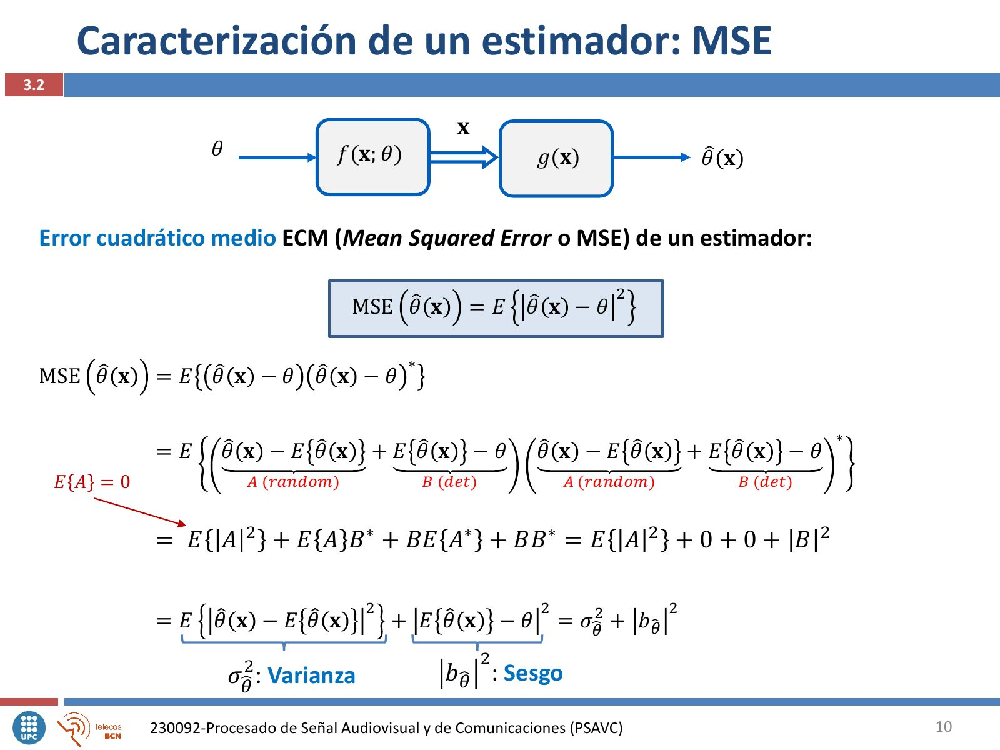

```text
        Caracterización de un estimador: MSE
3.2

                                                                     𝐱𝐱
                          𝜃𝜃                     𝑓𝑓(𝐱𝐱; 𝜃𝜃)                            𝑔𝑔(𝐱𝐱)                        𝜃𝜃� 𝐱𝐱


  Error cuadrático medio ECM (Mean Squared Error o MSE) de un estimador:

                                                                                        2
                                                     MSE 𝜃𝜃� 𝐱𝐱        = 𝐸𝐸 𝜃𝜃� 𝐱𝐱 − 𝜃𝜃

                                               ∗
  MSE 𝜃𝜃� 𝐱𝐱      = 𝐸𝐸 𝜃𝜃� 𝐱𝐱 − 𝜃𝜃 𝜃𝜃� 𝐱𝐱 − 𝜃𝜃

                                                                                                                                               ∗
                  = 𝐸𝐸     𝜃𝜃� 𝐱𝐱 − 𝐸𝐸 𝜃𝜃� 𝐱𝐱          + 𝐸𝐸 𝜃𝜃� 𝐱𝐱        − 𝜃𝜃         𝜃𝜃� 𝐱𝐱 − 𝐸𝐸 𝜃𝜃� 𝐱𝐱          + 𝐸𝐸 𝜃𝜃� 𝐱𝐱          − 𝜃𝜃
      𝐸𝐸 𝐴𝐴 = 0                  𝐴𝐴 (𝑟𝑟𝑟𝑟𝑟𝑟𝑟𝑟𝑟𝑟𝑟𝑟)            𝐵𝐵 (𝑑𝑑𝑑𝑑𝑑𝑑)                  𝐴𝐴 (𝑟𝑟𝑟𝑟𝑟𝑟𝑟𝑟𝑟𝑟𝑟𝑟)                  𝐵𝐵 (𝑑𝑑𝑑𝑑𝑑𝑑)


                  = 𝐸𝐸 𝐴𝐴 2 + 𝐸𝐸 𝐴𝐴 𝐵𝐵 ∗ + 𝐵𝐵𝐵𝐵 𝐴𝐴∗ + 𝐵𝐵𝐵𝐵 ∗ = 𝐸𝐸 𝐴𝐴 2 + 0 + 0 + 𝐵𝐵 2

                                                      2                                2                       2
                  = 𝐸𝐸 𝜃𝜃� 𝐱𝐱 − 𝐸𝐸 𝜃𝜃� 𝐱𝐱                 + 𝐸𝐸 𝜃𝜃� 𝐱𝐱           − 𝜃𝜃       = 𝜎𝜎𝜃𝜃�2 + 𝑏𝑏𝜃𝜃�
                                                                            2
                               𝜎𝜎𝜃𝜃�2 : Varianza                  𝑏𝑏𝜃𝜃� : Sesgo

                  230092-Procesado de Señal Audiovisual y de Comunicaciones (PSAVC)                                                                10
```

## Page 11

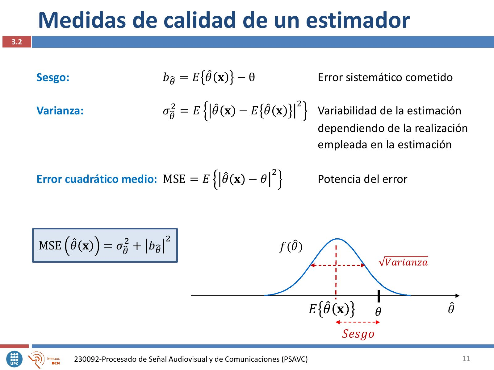

```text
      Medidas de calidad de un estimador
3.2


      Sesgo:                              𝑏𝑏𝜃𝜃� = 𝐸𝐸 𝜃𝜃̂ 𝐱𝐱   −θ                     Error sistemático cometido

                                                                            2
      Varianza:                           𝜎𝜎𝜃𝜃�2 = 𝐸𝐸 𝜃𝜃̂ 𝐱𝐱 − 𝐸𝐸 𝜃𝜃̂ 𝐱𝐱             Variabilidad de la estimación
                                                                                     dependiendo de la realización
                                                                                     empleada en la estimación

                                                   2
      Error cuadrático medio: MSE = 𝐸𝐸 𝜃𝜃̂ 𝐱𝐱 − 𝜃𝜃                                   Potencia del error


                                          2
      MSE 𝜃𝜃̂ 𝐱𝐱       = 𝜎𝜎𝜃𝜃�2 + 𝑏𝑏𝜃𝜃�                                     �
                                                                        𝑓𝑓(𝜃𝜃)
                                                                                                             𝑉𝑉𝑉𝑉𝑉𝑉𝑉𝑉𝑉𝑉𝑉𝑉𝑉𝑉𝑉𝑉


                                                                                   𝐸𝐸 𝜃𝜃̂ 𝐱𝐱            𝜃𝜃                      𝜃𝜃̂
                                                                                           𝑆𝑆𝑆𝑆𝑆𝑆𝑆𝑆𝑆𝑆
               230092-Procesado de Señal Audiovisual y de Comunicaciones (PSAVC)                                                      11
```

## Page 12

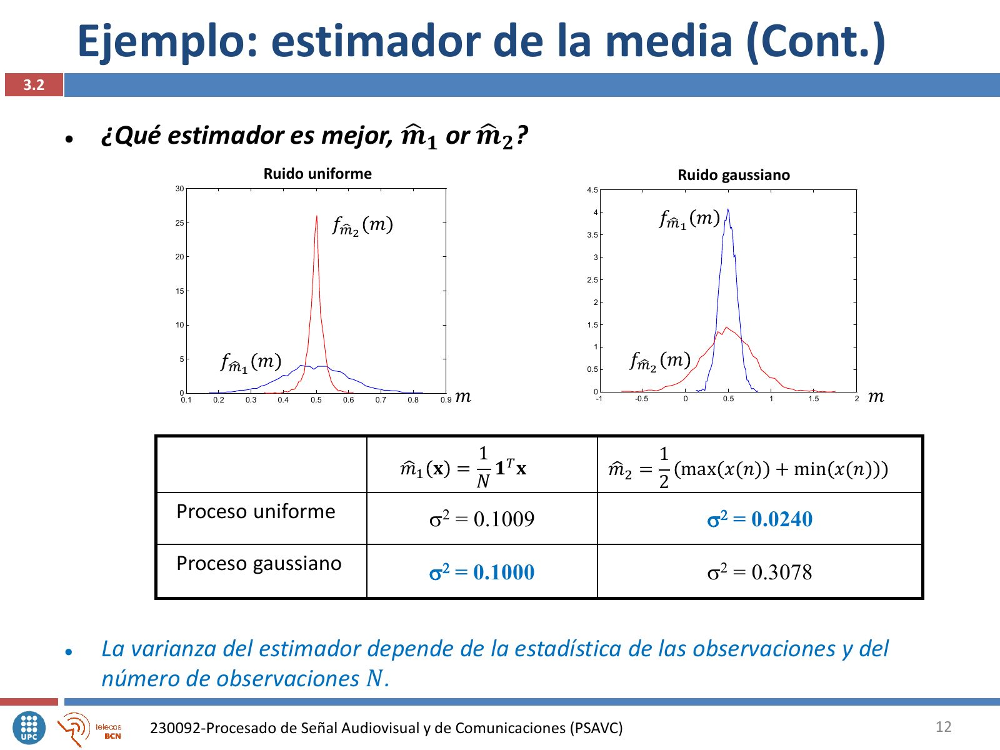

```text
          Ejemplo: estimador de la media (Cont.)
3.2


      ●    ¿Qué estimador es mejor, �
                                    𝒎𝒎𝟏𝟏 or �
                                            𝒎𝒎𝟐𝟐 ?
                                     Ruido uniforme                                                              Ruido gaussiano
                  30                                                                          4.5


                  25
                                                   𝑓𝑓𝑚𝑚� 2 𝑚𝑚
                                                                                               4
                                                                                                              𝑓𝑓𝑚𝑚� 1 𝑚𝑚
                                                                                              3.5

                  20                                                                           3

                                                                                              2.5
                  15
                                                                                               2

                  10                                                                          1.5

                                                                                               1
                   5
                          𝑓𝑓𝑚𝑚� 1 𝑚𝑚                                                          0.5
                                                                                                      𝑓𝑓𝑚𝑚� 2 𝑚𝑚
                   0
                   0.1   0.2   0.3     0.4   0.5     0.6   0.7   0.8    0.9   𝑚𝑚               0
                                                                                                -1     -0.5        0       0.5   1   1.5   2   𝑚𝑚

                                                                                   1 𝑇𝑇                       1
                                                                 𝑚𝑚
                                                                 � 1 𝐱𝐱 =             𝟏𝟏 𝐱𝐱          𝑚𝑚
                                                                                                     �2 =       max 𝑥𝑥(𝑛𝑛) + min 𝑥𝑥(𝑛𝑛)
                                                                                   𝑁𝑁                         2
                  Proceso uniforme                                     σ2 = 0.1009                                     σ2 = 0.0240
                  Proceso gaussiano                                    σ2 = 0.1000                                     σ2 = 0.3078


      ●    La varianza del estimador depende de la estadística de las observaciones y del
           número de observaciones 𝑁𝑁.
               230092-Procesado de Señal Audiovisual y de Comunicaciones (PSAVC)                                                                    12
```

## Page 13

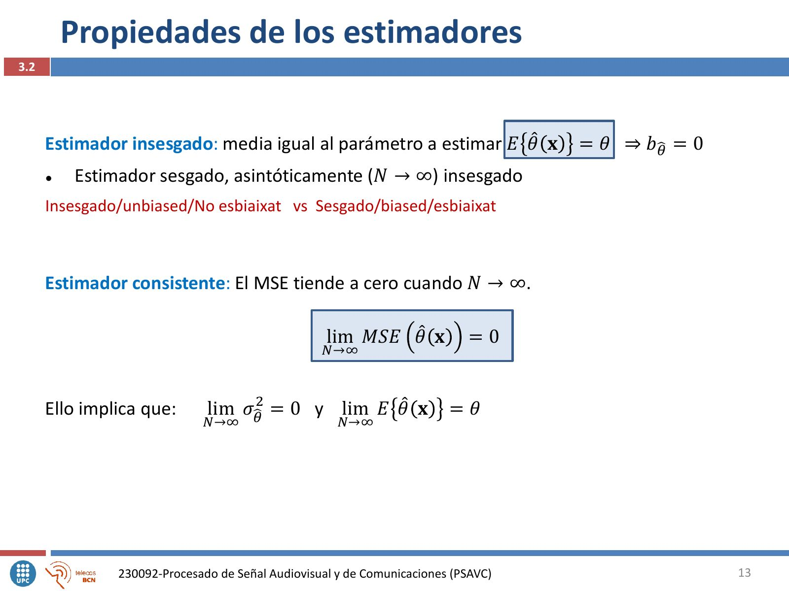

```text
          Propiedades de los estimadores
3.2


      Estimador insesgado: media igual al parámetro a estimar 𝐸𝐸 𝜃𝜃̂ 𝐱𝐱            = 𝜃𝜃 ⇒ 𝑏𝑏𝜃𝜃� = 0
      ●   Estimador sesgado, asintóticamente (𝑁𝑁 → ∞) insesgado
      Insesgado/unbiased/No esbiaixat vs Sesgado/biased/esbiaixat


      Estimador consistente: El MSE tiende a cero cuando 𝑁𝑁 → ∞.

                                                   lim 𝑀𝑀𝑀𝑀𝑀𝑀 𝜃𝜃̂ 𝐱𝐱       =0
                                                  𝑁𝑁→∞


      Ello implica que:       lim 𝜎𝜎𝜃𝜃�2 = 0 y lim 𝐸𝐸 𝜃𝜃̂ 𝐱𝐱            = 𝜃𝜃
                             𝑁𝑁→∞                    𝑁𝑁→∞


               230092-Procesado de Señal Audiovisual y de Comunicaciones (PSAVC)                      13
```

## Page 14

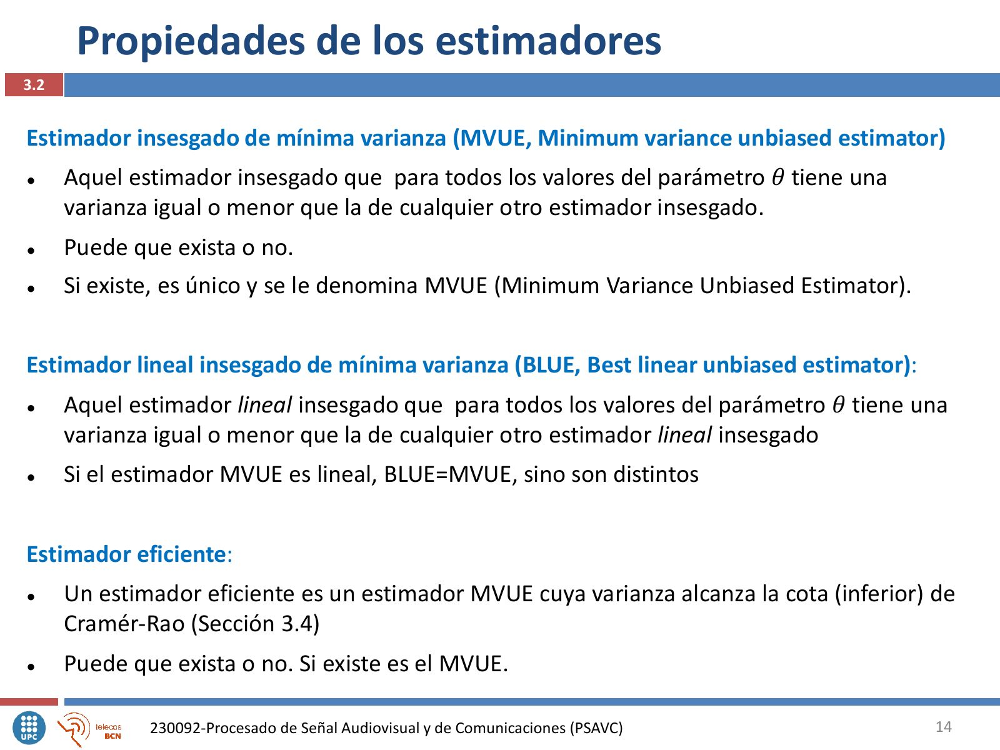

```text
       Propiedades de los estimadores
3.2


Estimador insesgado de mínima varianza (MVUE, Minimum variance unbiased estimator)
●     Aquel estimador insesgado que para todos los valores del parámetro 𝜃𝜃 tiene una
      varianza igual o menor que la de cualquier otro estimador insesgado.
●     Puede que exista o no.
●     Si existe, es único y se le denomina MVUE (Minimum Variance Unbiased Estimator).


Estimador lineal insesgado de mínima varianza (BLUE, Best linear unbiased estimator):
●     Aquel estimador lineal insesgado que para todos los valores del parámetro 𝜃𝜃 tiene una
      varianza igual o menor que la de cualquier otro estimador lineal insesgado
●     Si el estimador MVUE es lineal, BLUE=MVUE, sino son distintos


Estimador eficiente:
●     Un estimador eficiente es un estimador MVUE cuya varianza alcanza la cota (inferior) de
      Cramér-Rao (Sección 3.4)
●     Puede que exista o no. Si existe es el MVUE.

              230092-Procesado de Señal Audiovisual y de Comunicaciones (PSAVC)           14
```

## Page 15

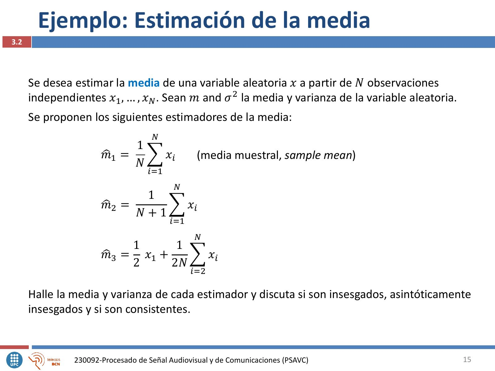

```text
        Ejemplo: Estimación de la media
3.2


      Se desea estimar la media de una variable aleatoria 𝑥𝑥 a partir de 𝑁𝑁 observaciones
      independientes 𝑥𝑥1 , … , 𝑥𝑥𝑁𝑁 . Sean 𝑚𝑚 and 𝜎𝜎 2 la media y varianza de la variable aleatoria.
      Se proponen los siguientes estimadores de la media:
                                     𝑁𝑁
                                 1
                       𝑚𝑚
                       �1 =         � 𝑥𝑥𝑖𝑖         (media muestral, sample mean)
                                 𝑁𝑁
                                    𝑖𝑖=1
                                            𝑁𝑁
                               1
                       𝑚𝑚
                       �2 =        � 𝑥𝑥𝑖𝑖
                            𝑁𝑁 + 1
                                           𝑖𝑖=1
                                                   𝑁𝑁
                            1       1
                       𝑚𝑚
                       � 3 = 𝑥𝑥1 +     � 𝑥𝑥𝑖𝑖
                            2      2𝑁𝑁
                                                  𝑖𝑖=2

      Halle la media y varianza de cada estimador y discuta si son insesgados, asintóticamente
      insesgados y si son consistentes.


                230092-Procesado de Señal Audiovisual y de Comunicaciones (PSAVC)                      15
```

## Page 16

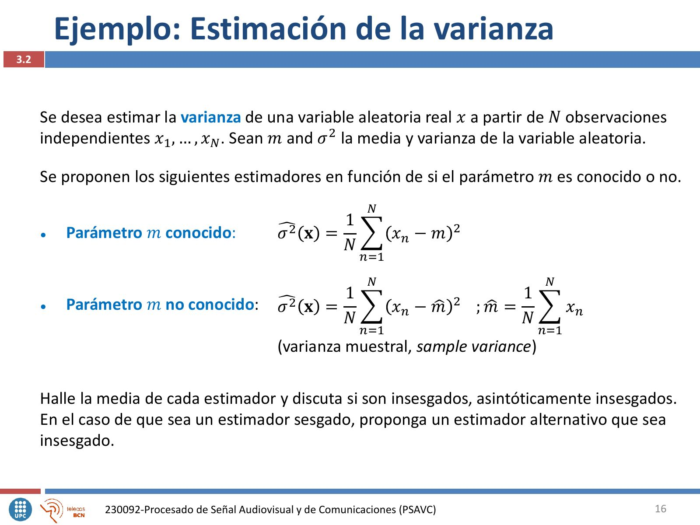

```text
          Ejemplo: Estimación de la varianza
3.2


      Se desea estimar la varianza de una variable aleatoria real 𝑥𝑥 a partir de 𝑁𝑁 observaciones
      independientes 𝑥𝑥1 , … , 𝑥𝑥𝑁𝑁 . Sean 𝑚𝑚 and 𝜎𝜎 2 la media y varianza de la variable aleatoria.

      Se proponen los siguientes estimadores en función de si el parámetro 𝑚𝑚 es conocido o no.
                                                                  𝑁𝑁
                                                �      1
      ●   Parámetro 𝑚𝑚 conocido:                𝜎𝜎 𝐱𝐱 = � 𝑥𝑥𝑛𝑛 − 𝑚𝑚 2
                                                  2
                                                       𝑁𝑁
                                                                𝑛𝑛=1
                                                                  𝑁𝑁                    𝑁𝑁
                                                �      1                   1
      ●   Parámetro 𝑚𝑚 no conocido:               2
                                                𝜎𝜎 𝐱𝐱 = � 𝑥𝑥𝑛𝑛 − 𝑚𝑚
                                                                 �  2
                                                                      ; 𝑚𝑚
                                                                        � = � 𝑥𝑥𝑛𝑛
                                                       𝑁𝑁                  𝑁𝑁
                                                                𝑛𝑛=1                   𝑛𝑛=1
                                                (varianza muestral, sample variance)

      Halle la media de cada estimador y discuta si son insesgados, asintóticamente insesgados.
      En el caso de que sea un estimador sesgado, proponga un estimador alternativo que sea
      insesgado.


               230092-Procesado de Señal Audiovisual y de Comunicaciones (PSAVC)                  16
```

## Page 17

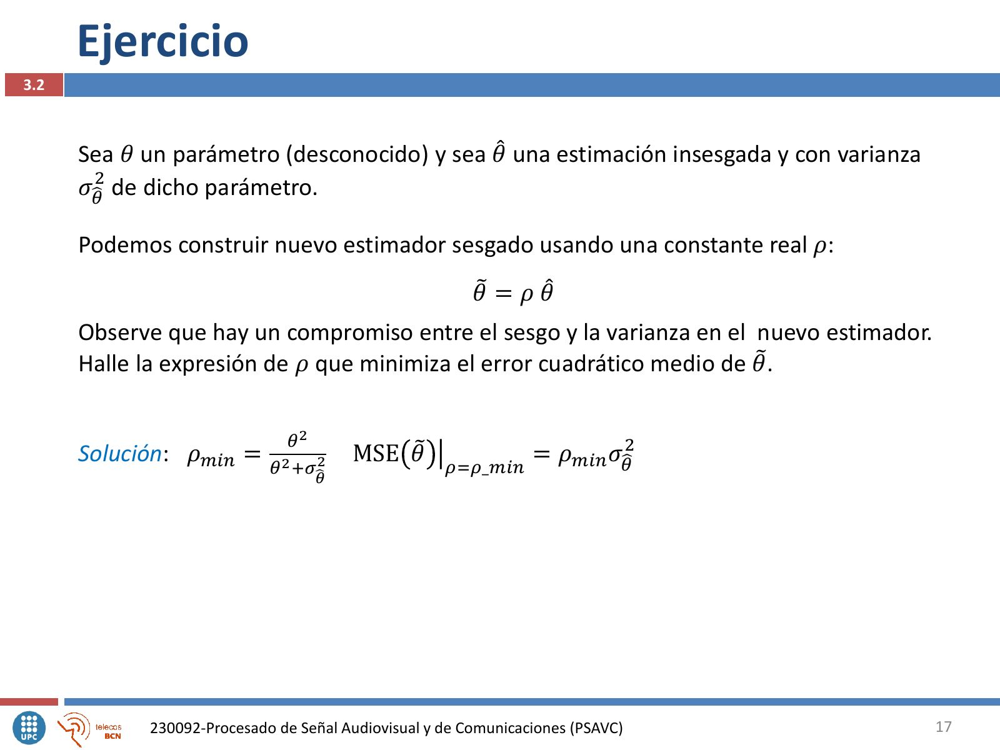

```text
      Ejercicio
3.2


      Sea 𝜃𝜃 un parámetro (desconocido) y sea 𝜃𝜃̂ una estimación insesgada y con varianza
      𝜎𝜎𝜃𝜃�2 de dicho parámetro.

      Podemos construir nuevo estimador sesgado usando una constante real 𝜌𝜌:
                                                         𝜃𝜃� = 𝜌𝜌 𝜃𝜃̂
      Observe que hay un compromiso entre el sesgo y la varianza en el nuevo estimador.
                                                                          �
      Halle la expresión de 𝜌𝜌 que minimiza el error cuadrático medio de 𝜃𝜃.


                               𝜃𝜃 2
      Solución:   𝜌𝜌𝑚𝑚𝑚𝑚𝑚𝑚 = 2 2        MSE 𝜃𝜃� �𝜌𝜌=𝜌𝜌_𝑚𝑚𝑚𝑚𝑚𝑚 = 𝜌𝜌𝑚𝑚𝑚𝑚𝑚𝑚 𝜎𝜎𝜃𝜃�2
                            𝜃𝜃 +𝜎𝜎�𝜃𝜃


             230092-Procesado de Señal Audiovisual y de Comunicaciones (PSAVC)              17
```

## Page 18

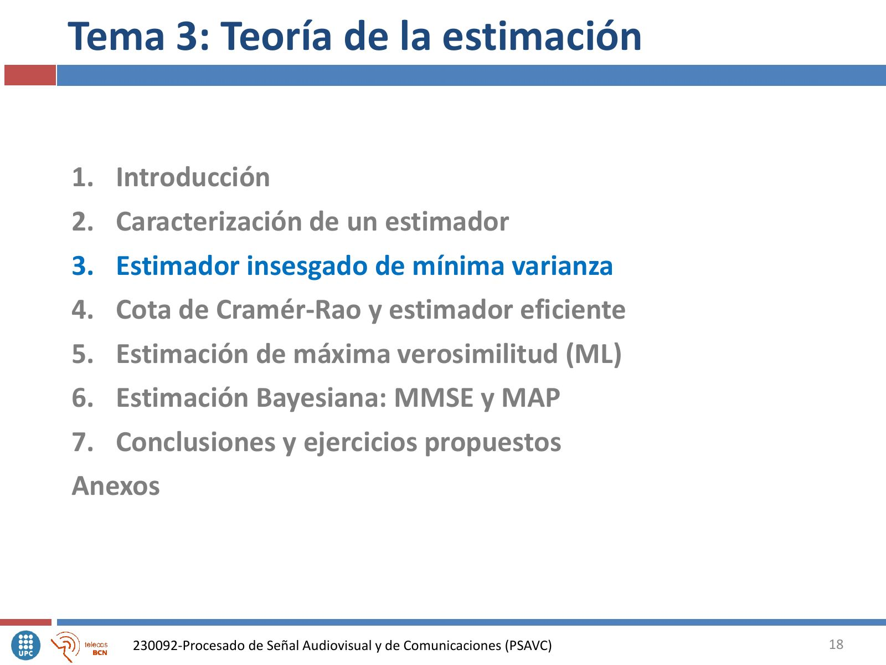

```text
Tema 3: Teoría de la estimación


1. Introducción
2. Caracterización de un estimador
3. Estimador insesgado de mínima varianza
4. Cota de Cramér-Rao y estimador eficiente
5. Estimación de máxima verosimilitud (ML)
6. Estimación Bayesiana: MMSE y MAP
7. Conclusiones y ejercicios propuestos
Anexos


    230092-Procesado de Señal Audiovisual y de Comunicaciones (PSAVC)   18
```

## Page 19

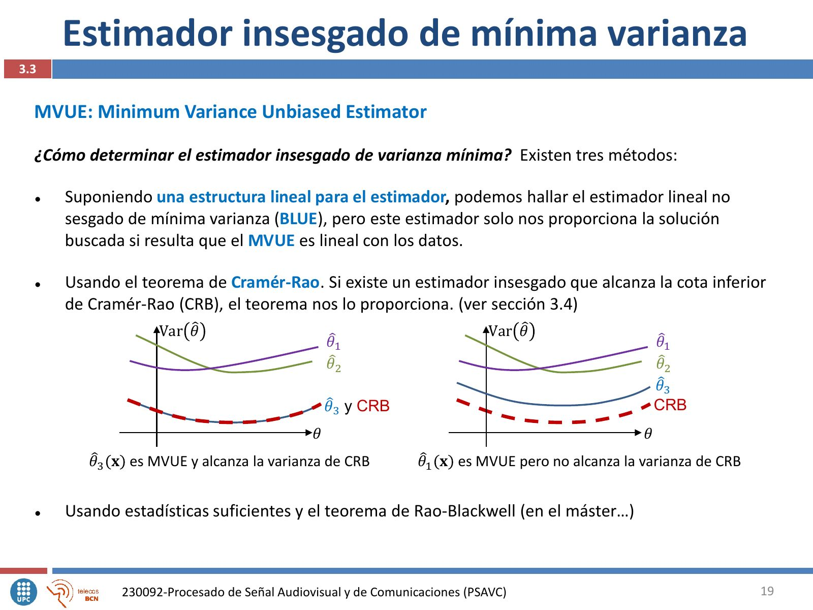

```text
      Estimador insesgado de mínima varianza
3.3


  MVUE: Minimum Variance Unbiased Estimator

  ¿Cómo determinar el estimador insesgado de varianza mínima? Existen tres métodos:

  ●   Suponiendo una estructura lineal para el estimador, podemos hallar el estimador lineal no
      sesgado de mínima varianza (BLUE), pero este estimador solo nos proporciona la solución
      buscada si resulta que el MVUE es lineal con los datos.

  ●   Usando el teorema de Cramér-Rao. Si existe un estimador insesgado que alcanza la cota inferior
      de Cramér-Rao (CRB), el teorema nos lo proporciona. (ver sección 3.4)
                    Var 𝜃𝜃�                                                Var 𝜃𝜃�
                                                   𝜃𝜃�1                                                𝜃𝜃�1
                                                   𝜃𝜃�2                                                𝜃𝜃�2
                                                                                                       𝜃𝜃�3
                                                   𝜃𝜃�3 y CRB                                          CRB
                                              𝜃𝜃                                                  𝜃𝜃
         𝜃𝜃�3 𝐱𝐱 es MVUE y alcanza la varianza de CRB           𝜃𝜃�1 𝐱𝐱 es MVUE pero no alcanza la varianza de CRB


  ●   Usando estadísticas suficientes y el teorema de Rao-Blackwell (en el máster…)


              230092-Procesado de Señal Audiovisual y de Comunicaciones (PSAVC)                                      19
```

## Page 20

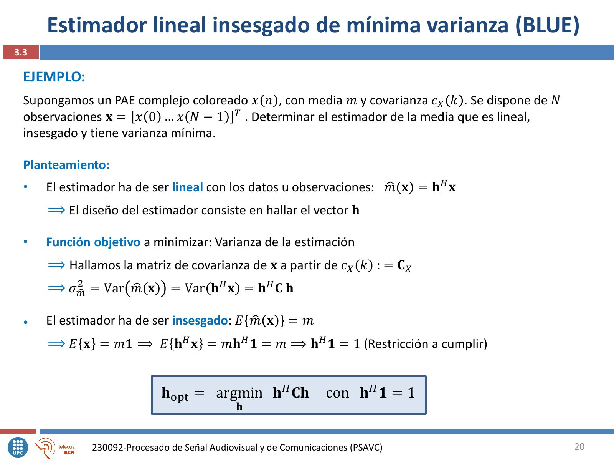

```text
      Estimador lineal insesgado de mínima varianza (BLUE)
3.3

  EJEMPLO:
  Supongamos un PAE complejo coloreado 𝑥𝑥 𝑛𝑛 , con media 𝑚𝑚 y covarianza 𝑐𝑐𝑋𝑋 𝑘𝑘 . Se dispone de 𝑁𝑁
  observaciones 𝐱𝐱 = 𝑥𝑥 0 … 𝑥𝑥 𝑁𝑁 − 1 𝑇𝑇 . Determinar el estimador de la media que es lineal,
  insesgado y tiene varianza mínima.

  Planteamiento:
  •                                                                � 𝐱𝐱 = 𝐡𝐡𝐻𝐻 𝐱𝐱
      El estimador ha de ser lineal con los datos u observaciones: 𝑚𝑚
      ⟹ El diseño del estimador consiste en hallar el vector 𝐡𝐡

  •   Función objetivo a minimizar: Varianza de la estimación
      ⟹ Hallamos la matriz de covarianza de 𝐱𝐱 a partir de 𝑐𝑐𝑋𝑋 𝑘𝑘 : = 𝐂𝐂𝑋𝑋
      ⟹ 𝜎𝜎𝑚𝑚2� = Var 𝑚𝑚
                     � 𝐱𝐱 = Var 𝐡𝐡𝐻𝐻 𝐱𝐱 = 𝐡𝐡𝐻𝐻 𝐂𝐂 𝐡𝐡

  ●   El estimador ha de ser insesgado: 𝐸𝐸 𝑚𝑚
                                           � 𝐱𝐱          = 𝑚𝑚
      ⟹ 𝐸𝐸 𝐱𝐱 = 𝑚𝑚𝟏𝟏 ⟹ 𝐸𝐸 𝐡𝐡𝐻𝐻 𝐱𝐱 = 𝑚𝑚𝐡𝐡𝐻𝐻 𝟏𝟏 = 𝑚𝑚 ⟹ 𝐡𝐡𝐻𝐻 𝟏𝟏 = 1 (Restricción a cumplir)


                             𝐡𝐡opt = argmin 𝐡𝐡𝐻𝐻 𝐂𝐂𝐡𝐡             con 𝐡𝐡𝐻𝐻 𝟏𝟏 = 1
                                              𝐡𝐡


              230092-Procesado de Señal Audiovisual y de Comunicaciones (PSAVC)                       20
```

## Page 21

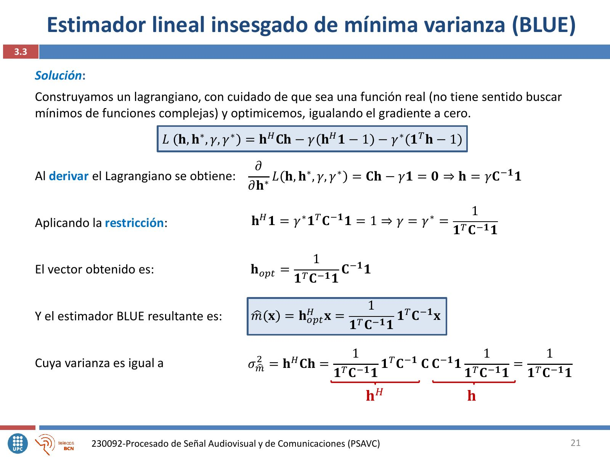

```text
        Estimador lineal insesgado de mínima varianza (BLUE)
3.3

      Solución:
      Construyamos un lagrangiano, con cuidado de que sea una función real (no tiene sentido buscar
      mínimos de funciones complejas) y optimicemos, igualando el gradiente a cero.
                                 𝐿𝐿 𝐡𝐡, 𝐡𝐡∗ , 𝛾𝛾, 𝛾𝛾 ∗ = 𝐡𝐡𝐻𝐻 𝐂𝐂𝐡𝐡 − 𝛾𝛾 𝐡𝐡𝐻𝐻 𝟏𝟏 − 1 − 𝛾𝛾 ∗ 𝟏𝟏𝑇𝑇 𝐡𝐡 − 1
                                                       𝜕𝜕
      Al derivar el Lagrangiano se obtiene:               ∗
                                                            𝐿𝐿 𝐡𝐡, 𝐡𝐡∗ , 𝛾𝛾, 𝛾𝛾 ∗ = 𝐂𝐂𝐡𝐡 − 𝛾𝛾𝟏𝟏 = 𝟎𝟎 ⇒ 𝐡𝐡 = 𝛾𝛾𝐂𝐂−𝟏𝟏 𝟏𝟏
                                                     𝜕𝜕𝐡𝐡
                                                                                                                1
      Aplicando la restricción:                       𝐡𝐡𝐻𝐻 𝟏𝟏 = 𝛾𝛾 ∗ 𝟏𝟏𝑇𝑇 𝐂𝐂−𝟏𝟏 𝟏𝟏 = 1 ⇒ 𝛾𝛾 = 𝛾𝛾 ∗ =
                                                                                                          𝟏𝟏𝑇𝑇 𝐂𝐂−𝟏𝟏 𝟏𝟏

                                                                       1
      El vector obtenido es:                         𝐡𝐡𝑜𝑜𝑜𝑜𝑜𝑜 =     𝑇𝑇  −𝟏𝟏
                                                                            𝐂𝐂 −𝟏𝟏 𝟏𝟏
                                                                  𝟏𝟏 𝐂𝐂 𝟏𝟏

                                                                                    1
      Y el estimador BLUE resultante es:             � 𝐱𝐱 = 𝐡𝐡𝐻𝐻
                                                     𝑚𝑚       𝑜𝑜𝑜𝑜𝑜𝑜 𝐱𝐱 =        𝑇𝑇  −𝟏𝟏
                                                                                         𝟏𝟏𝑇𝑇 𝐂𝐂−𝟏𝟏 𝐱𝐱
                                                                               𝟏𝟏 𝐂𝐂 𝟏𝟏

                                                       2                         1                                    1             1
      Cuya varianza es igual a                                𝐻𝐻
                                                        � = 𝐡𝐡 𝐂𝐂𝐡𝐡 =
                                                     𝜎𝜎𝑚𝑚                                𝟏𝟏 𝑇𝑇 −𝟏𝟏
                                                                                              𝐂𝐂   𝐂𝐂 𝐂𝐂 −𝟏𝟏
                                                                                                             𝟏𝟏              =
                                                                           𝟏𝟏𝑇𝑇 𝐂𝐂−𝟏𝟏 𝟏𝟏                        𝟏𝟏𝑇𝑇 𝐂𝐂−𝟏𝟏 𝟏𝟏 𝟏𝟏𝑇𝑇 𝐂𝐂−𝟏𝟏 𝟏𝟏
                                                                                   𝐡𝐡𝐻𝐻                       𝐡𝐡


                  230092-Procesado de Señal Audiovisual y de Comunicaciones (PSAVC)                                                       21
```

## Page 22

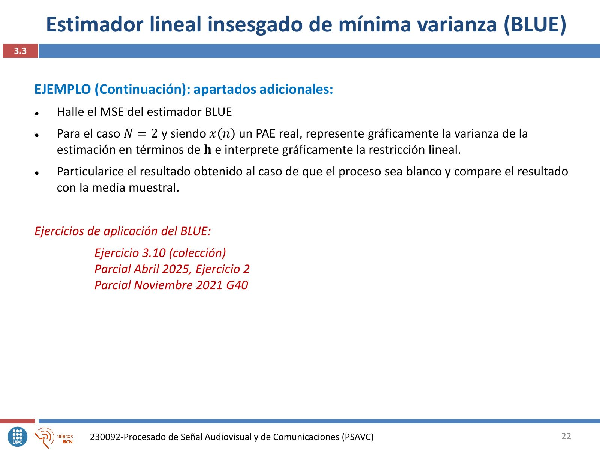

```text
          Estimador lineal insesgado de mínima varianza (BLUE)
3.3


      EJEMPLO (Continuación): apartados adicionales:
      ●    Halle el MSE del estimador BLUE
      ●    Para el caso 𝑁𝑁 = 2 y siendo 𝑥𝑥 𝑛𝑛 un PAE real, represente gráficamente la varianza de la
           estimación en términos de 𝐡𝐡 e interprete gráficamente la restricción lineal.
      ●    Particularice el resultado obtenido al caso de que el proceso sea blanco y compare el resultado
           con la media muestral.


      Ejercicios de aplicación del BLUE:
                  Ejercicio 3.10 (colección)
                  Parcial Abril 2025, Ejercicio 2
                  Parcial Noviembre 2021 G40


                 230092-Procesado de Señal Audiovisual y de Comunicaciones (PSAVC)                      22
```

## Page 23

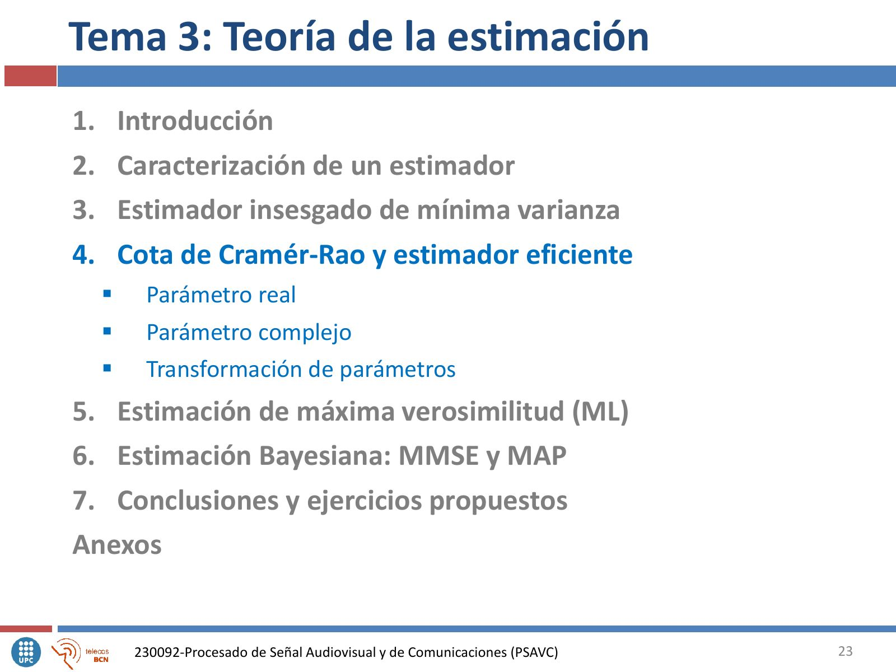

```text
Tema 3: Teoría de la estimación
1.       Introducción
2.       Caracterización de un estimador
3.       Estimador insesgado de mínima varianza
4.       Cota de Cramér-Rao y estimador eficiente
          Parámetro real
          Parámetro complejo
          Transformación de parámetros
5. Estimación de máxima verosimilitud (ML)
6. Estimación Bayesiana: MMSE y MAP
7. Conclusiones y ejercicios propuestos
Anexos


          230092-Procesado de Señal Audiovisual y de Comunicaciones (PSAVC)   23
```

## Page 24

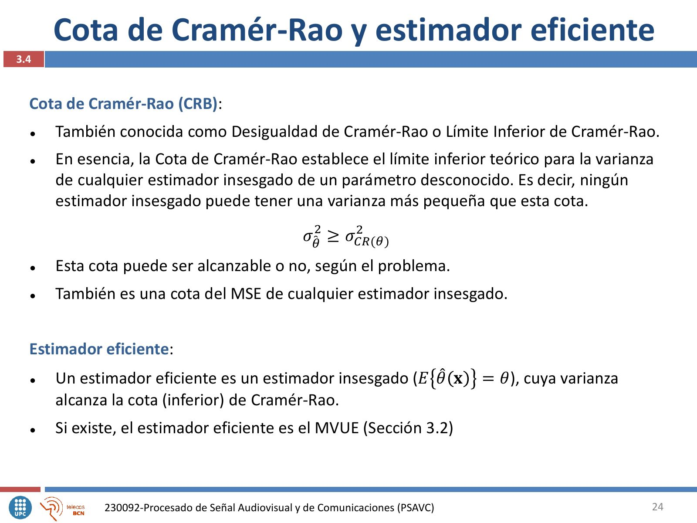

```text
      Cota de Cramér-Rao y estimador eficiente
3.4


  Cota de Cramér-Rao (CRB):
  ●   También conocida como Desigualdad de Cramér-Rao o Límite Inferior de Cramér-Rao.
  ●   En esencia, la Cota de Cramér-Rao establece el límite inferior teórico para la varianza
      de cualquier estimador insesgado de un parámetro desconocido. Es decir, ningún
      estimador insesgado puede tener una varianza más pequeña que esta cota.
                                                    𝜎𝜎𝜃𝜃2̑ ≥ 𝜎𝜎𝐶𝐶𝐶𝐶(𝜃𝜃)
                                                                2

  ●   Esta cota puede ser alcanzable o no, según el problema.
  ●   También es una cota del MSE de cualquier estimador insesgado.


  Estimador eficiente:
  ●   Un estimador eficiente es un estimador insesgado (𝐸𝐸 𝜃𝜃̂ 𝐱𝐱                = 𝜃𝜃), cuya varianza
      alcanza la cota (inferior) de Cramér-Rao.
  ●   Si existe, el estimador eficiente es el MVUE (Sección 3.2)


             230092-Procesado de Señal Audiovisual y de Comunicaciones (PSAVC)                          24
```

## Page 25

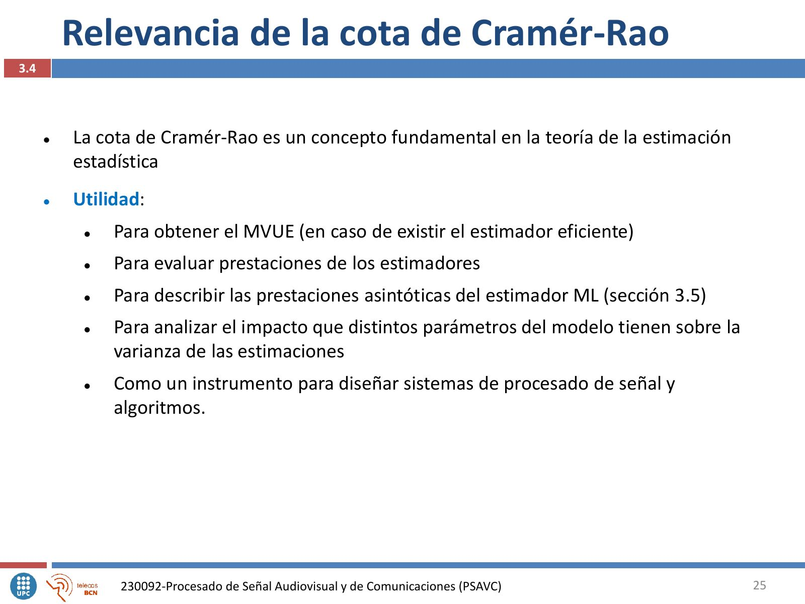

```text
          Relevancia de la cota de Cramér-Rao
3.4


      ●   La cota de Cramér-Rao es un concepto fundamental en la teoría de la estimación
          estadística
      ●   Utilidad:
           ●   Para obtener el MVUE (en caso de existir el estimador eficiente)
           ●   Para evaluar prestaciones de los estimadores
           ●   Para describir las prestaciones asintóticas del estimador ML (sección 3.5)
           ●   Para analizar el impacto que distintos parámetros del modelo tienen sobre la
               varianza de las estimaciones
           ●   Como un instrumento para diseñar sistemas de procesado de señal y
               algoritmos.


               230092-Procesado de Señal Audiovisual y de Comunicaciones (PSAVC)              25
```

## Page 26

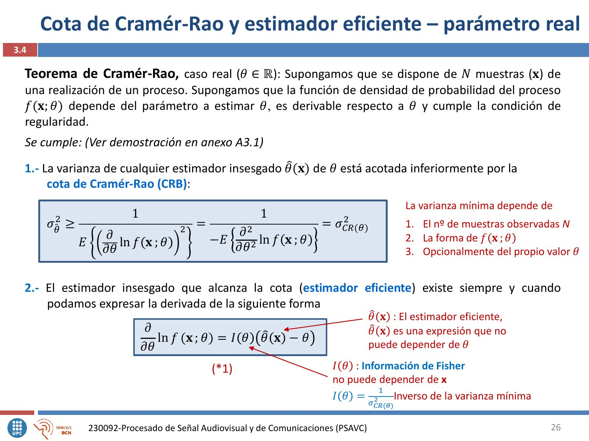

```text
      Cota de Cramér-Rao y estimador eficiente – parámetro real
3.4

  Teorema de Cramér-Rao, caso real (𝜃𝜃 ∈ ℝ): Supongamos que se dispone de 𝑁𝑁 muestras (𝐱𝐱) de
  una realización de un proceso. Supongamos que la función de densidad de probabilidad del proceso
  𝑓𝑓(𝐱𝐱; 𝜃𝜃) depende del parámetro a estimar 𝜃𝜃, es derivable respecto a 𝜃𝜃 y cumple la condición de
  regularidad.
  Se cumple: (Ver demostración en anexo A3.1)
                                                    �
  1.- La varianza de cualquier estimador insesgado 𝜃𝜃(𝐱𝐱) de 𝜃𝜃 está acotada inferiormente por la
       cota de Cramér-Rao (CRB):
                                                                                                             La varianza mínima depende de
                                 1                                    1
      𝜎𝜎𝜃𝜃2̑ ≥                                    =                                        2
                                                                                      = 𝜎𝜎𝐶𝐶𝐶𝐶(𝜃𝜃)           1. El nº de muestras observadas N
                          𝜕𝜕                  2               𝜕𝜕 2                                           2. La forma de 𝑓𝑓 𝐱𝐱 ; 𝜃𝜃
                 𝐸𝐸           ln 𝑓𝑓 𝐱𝐱 ; 𝜃𝜃           −𝐸𝐸             ln 𝑓𝑓 𝐱𝐱 ; 𝜃𝜃
                         𝜕𝜕𝜕𝜕                                𝜕𝜕𝜃𝜃 2                                          3. Opcionalmente del propio valor 𝜃𝜃


  2.- El estimador insesgado que alcanza la cota (estimador eficiente) existe siempre y cuando
      podamos expresar la derivada de la siguiente forma
                                                                                                 𝜃𝜃� 𝐱𝐱 : El estimador eficiente,
                                      𝜕𝜕                                                         𝜃𝜃� 𝐱𝐱 es una expresión que no
                                          ln 𝑓𝑓 (𝐱𝐱 ; 𝜃𝜃) = 𝐼𝐼 𝜃𝜃 𝜃𝜃� 𝐱𝐱 − 𝜃𝜃                    puede depender de 𝜃𝜃
                                     𝜕𝜕𝜕𝜕
                                                      (*1)                              𝐼𝐼 𝜃𝜃 : Información de Fisher
                                                                                        no puede depender de x
                                                                                                    1
                                                                                        𝐼𝐼 𝜃𝜃 = 2 Inverso de la varianza mínima
                                                                                                 𝜎𝜎𝐶𝐶𝐶𝐶 𝜃𝜃


                      230092-Procesado de Señal Audiovisual y de Comunicaciones (PSAVC)                                                    26
```

## Page 27

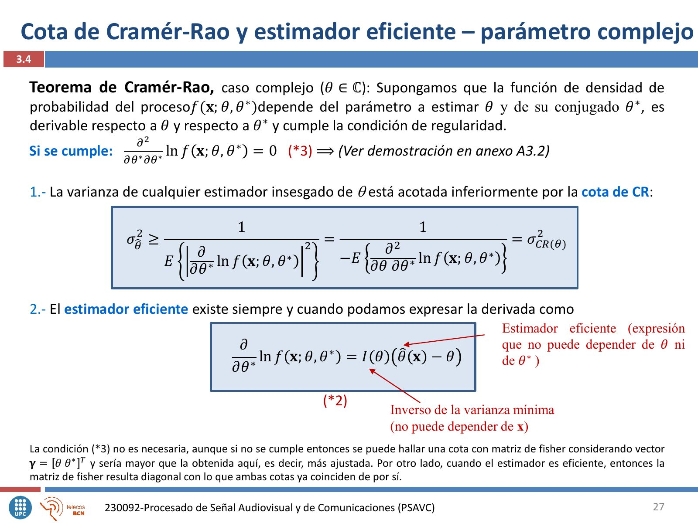

```text
Cota de Cramér-Rao y estimador eficiente – parámetro complejo
3.4

  Teorema de Cramér-Rao, caso complejo (𝜃𝜃 ∈ ℂ): Supongamos que la función de densidad de
  probabilidad del proceso𝑓𝑓(𝐱𝐱; 𝜃𝜃, 𝜃𝜃 ∗ )depende del parámetro a estimar 𝜃𝜃 y de su conjugado 𝜃𝜃 ∗ , es
  derivable respecto a 𝜃𝜃 y respecto a 𝜃𝜃 ∗ y cumple la condición de regularidad.
                          𝜕𝜕2
  Si se cumple:            ∗    ∗ ln 𝑓𝑓 𝐱𝐱; 𝜃𝜃, 𝜃𝜃 ∗   = 0 (*3) ⟹ (Ver demostración en anexo A3.2)
                      𝜕𝜕𝜃𝜃 𝜕𝜕𝜃𝜃

  1.- La varianza de cualquier estimador insesgado de θ está acotada inferiormente por la cota de CR:

                                                  1                                           1
                      𝜎𝜎𝜃𝜃�2 ≥                                        =                                                  2
                                                                                                                    = 𝜎𝜎𝐶𝐶𝐶𝐶(𝜃𝜃)
                                        𝜕𝜕                        2                𝜕𝜕 2
                                 𝐸𝐸          ln 𝑓𝑓 𝐱𝐱; 𝜃𝜃, 𝜃𝜃 ∗           −𝐸𝐸                 ln 𝑓𝑓 𝐱𝐱; 𝜃𝜃, 𝜃𝜃 ∗
                                      𝜕𝜕𝜃𝜃 ∗                                    𝜕𝜕𝜕𝜕 𝜕𝜕𝜃𝜃 ∗

  2.- El estimador eficiente existe siempre y cuando podamos expresar la derivada como
                                                                                                                   Estimador eficiente (expresión
                                                   𝜕𝜕                                                              que no puede depender de 𝜃𝜃 ni
                                                      ∗
                                                        ln 𝑓𝑓 𝐱𝐱; 𝜃𝜃, 𝜃𝜃 ∗ = 𝐼𝐼 𝜃𝜃 𝜃𝜃� 𝐱𝐱 − 𝜃𝜃                     de 𝜃𝜃 ∗ )
                                                 𝜕𝜕𝜃𝜃

                                                                      (*2)
                                                                                    Inverso de la varianza mínima
                                                                                    (no puede depender de x)
  La condición (*3) no es necesaria, aunque si no se cumple entonces se puede hallar una cota con matriz de fisher considerando vector
  𝛄𝛄 = 𝜃𝜃 𝜃𝜃 ∗ 𝑇𝑇 y sería mayor que la obtenida aquí, es decir, más ajustada. Por otro lado, cuando el estimador es eficiente, entonces la
  matriz de fisher resulta diagonal con lo que ambas cotas ya coinciden de por sí.

                  230092-Procesado de Señal Audiovisual y de Comunicaciones (PSAVC)                                                        27
```

## Page 28

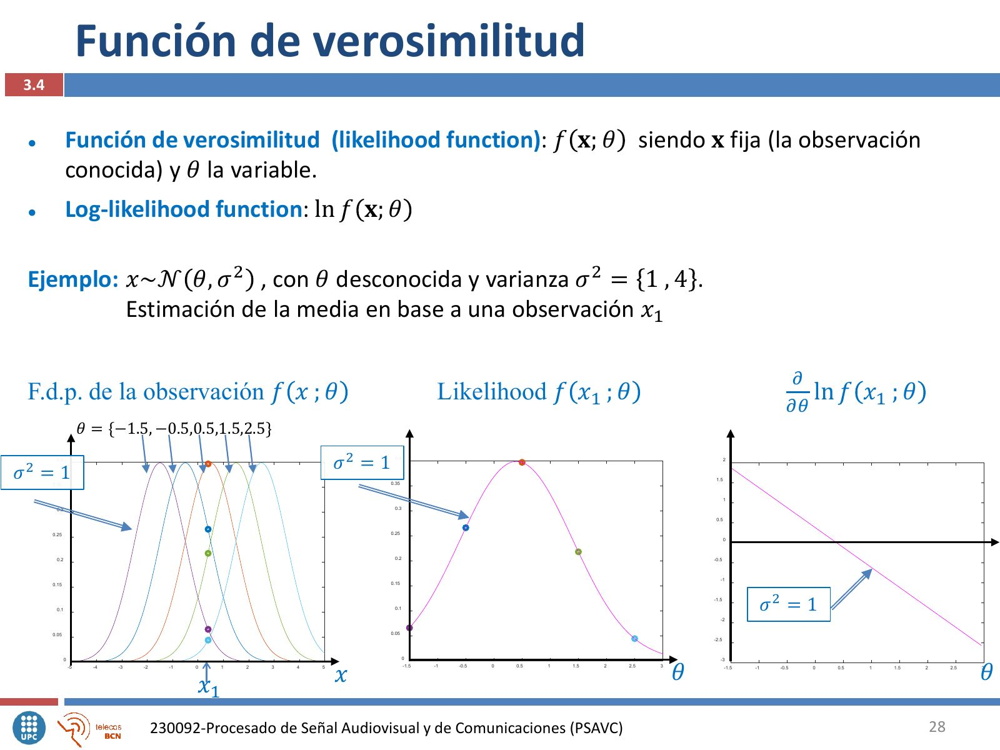

```text
                       Función de verosimilitud
 3.4


 ●            Función de verosimilitud (likelihood function): 𝑓𝑓 𝐱𝐱; 𝜃𝜃 siendo 𝐱𝐱 fija (la observación
              conocida) y 𝜃𝜃 la variable.
 ●            Log-likelihood function: ln 𝑓𝑓 𝐱𝐱; 𝜃𝜃

 Ejemplo: 𝑥𝑥~𝒩𝒩 𝜃𝜃, 𝜎𝜎 2 , con 𝜃𝜃 desconocida y varianza 𝜎𝜎 2 = 1 , 4 .
          Estimación de la media en base a una observación 𝑥𝑥1

                                                                                                                                                                          𝜕𝜕
 F.d.p. de la observación 𝑓𝑓 𝑥𝑥 ; 𝜃𝜃                                                            Likelihood 𝑓𝑓 𝑥𝑥1 ; 𝜃𝜃                                                        ln 𝑓𝑓 𝑥𝑥1 ; 𝜃𝜃
                                                                                                                                                                         𝜕𝜕𝜃𝜃
                       𝜃𝜃 = {−1.5, −0.5,0.5,1.5,2.5}

 2
        0.4
                                                                       𝜎𝜎 2 = 1   0.4                                                                    2


𝜎𝜎 = 1 0.35                                                                   0.35
                                                                                                                                                   1.5


                                                                                                                                                         1

        0.3                                                                       0.3

                                                                                                                                                   0.5


       0.25                                                                   0.25
                                                                                                                                                         0


        0.2                                                                       0.2                                                             -0.5


                                                                                                                                                     -1
       0.15                                                                   0.15


        0.1                                                                       0.1
                                                                                                                                                  -1.5

                                                                                                                                                                     𝜎𝜎 2 = 1
                                                                                                                                                     -2


       0.05                                                                   0.05
                                                                                                                                                  -2.5


                                                                                        0


                                                                                                                                             𝜃𝜃                                                                  𝜃𝜃
              0                                                                                                                                      -3


                                                                       𝑥𝑥
                  -5     -4   -3   -2     -1   0   1   2   3   4   5                    -1.5   -1   -0.5   0   0.5   1   1.5   2   2.5   3               -1.5   -1     -0.5   0   0.5   1   1.5   2        2.5   3


                                               𝑥𝑥1
                                        230092-Procesado de Señal Audiovisual y de Comunicaciones (PSAVC)                                                                                             28
```

## Page 29

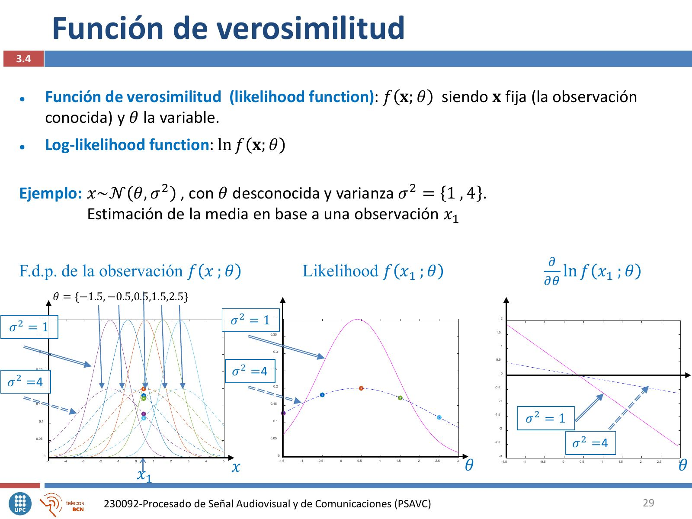

```text
                       Función de verosimilitud
 3.4


 ●            Función de verosimilitud (likelihood function): 𝑓𝑓 𝐱𝐱; 𝜃𝜃 siendo 𝐱𝐱 fija (la observación
              conocida) y 𝜃𝜃 la variable.
 ●            Log-likelihood function: ln 𝑓𝑓 𝐱𝐱; 𝜃𝜃

 Ejemplo: 𝑥𝑥~𝒩𝒩 𝜃𝜃, 𝜎𝜎 2 , con 𝜃𝜃 desconocida y varianza 𝜎𝜎 2 = 1 , 4 .
          Estimación de la media en base a una observación 𝑥𝑥1

                                                                                                                                                                            𝜕𝜕
 F.d.p. de la observación 𝑓𝑓 𝑥𝑥 ; 𝜃𝜃                                                              Likelihood 𝑓𝑓 𝑥𝑥1 ; 𝜃𝜃                                                        ln 𝑓𝑓 𝑥𝑥1 ; 𝜃𝜃
                                                                                                                                                                           𝜕𝜕𝜃𝜃
                       𝜃𝜃 = {−1.5, −0.5,0.5,1.5,2.5}

 2
        0.4
                                                                         𝜎𝜎 2 = 1   0.4                                                                    2


𝜎𝜎 = 1 0.35                                                                        0.35
                                                                                                                                                     1.5


                                                                                                                                                           1
        0.3                                                                         0.3

                                                                                                                                                     0.5


 2
       0.25
                                                                         𝜎𝜎 2 =4   0.25
                                                                                                                                                           0


𝜎𝜎 =4   0.2                                                                         0.2                                                             -0.5


                                                                                                                                                       -1
       0.15                                                                        0.15


        0.1                                                                         0.1
                                                                                                                                                    -1.5

                                                                                                                                                                       𝜎𝜎 2 = 1
                                                                                                                                                       -2


                                                                                                                                                                                    𝜎𝜎 2 =4
       0.05                                                                        0.05
                                                                                                                                                    -2.5


              0                                                                           0                                                            -3
                  -5     -4   -3   -2     -1   0     1


                                                   𝑥𝑥1
                                                         2   3   4   5

                                                                         𝑥𝑥
                                                                                          -1.5   -1   -0.5   0   0.5   1   1.5   2   2.5   3

                                                                                                                                               𝜃𝜃          -1.5   -1     -0.5   0    0.5   1   1.5   2        2.5

                                                                                                                                                                                                                    𝜃𝜃
                                                                                                                                                                                                                    3


                                        230092-Procesado de Señal Audiovisual y de Comunicaciones (PSAVC)                                                                                                29
```

## Page 30

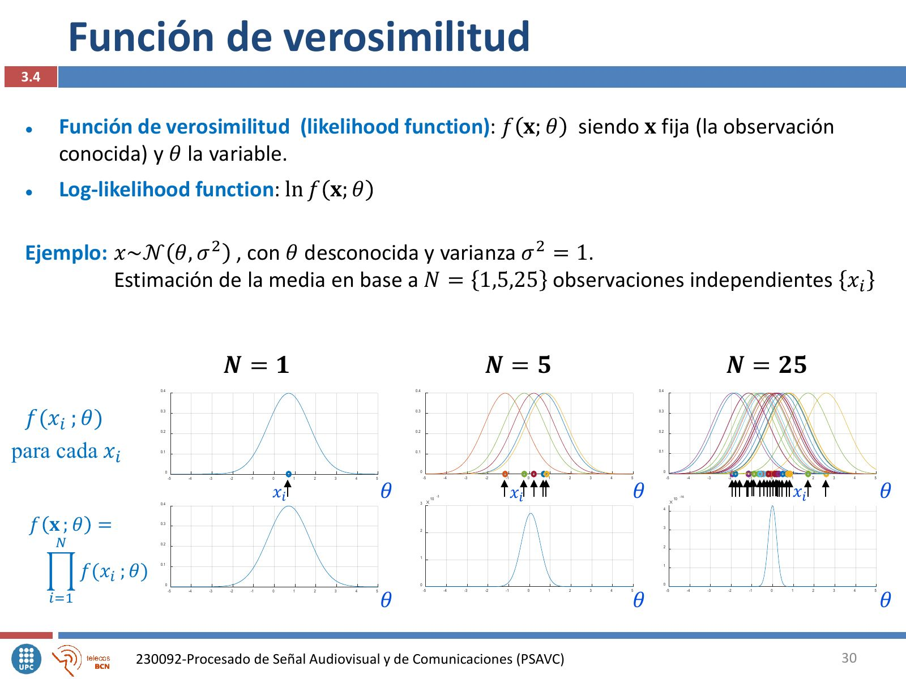

```text
             Función de verosimilitud
 3.4


 ●      Función de verosimilitud (likelihood function): 𝑓𝑓 𝐱𝐱; 𝜃𝜃 siendo 𝐱𝐱 fija (la observación
        conocida) y 𝜃𝜃 la variable.
 ●      Log-likelihood function: ln 𝑓𝑓 𝐱𝐱; 𝜃𝜃

 Ejemplo: 𝑥𝑥~𝒩𝒩 𝜃𝜃, 𝜎𝜎 2 , con 𝜃𝜃 desconocida y varianza 𝜎𝜎 2 = 1.
          Estimación de la media en base a 𝑁𝑁 = 1,5,25 observaciones independientes 𝑥𝑥𝑖𝑖


                                              𝑵𝑵 = 𝟏𝟏                                                                  𝑵𝑵 = 𝟓𝟓                                                                   𝑵𝑵 = 𝟐𝟐𝟐𝟐
                         0.4                                                            0.4                                                                      0.4


 𝑓𝑓(𝑥𝑥𝑖𝑖 ; 𝜃𝜃)
                         0.3                                                            0.3                                                                      0.3


                         0.2                                                            0.2                                                                      0.2


para cada 𝑥𝑥𝑖𝑖           0.1                                                            0.1                                                                      0.1


                           0                                                              0                                                                        0
                               -5   -4   -3   -2   -1   0      1   2   3   4   5              -5             -4   -3   -2   -1          0   1   2   3   4   5          -5              -4   -3   -2   -1   0   1      2   3    4   5


                         0.4
                                                        𝑥𝑥𝑖𝑖                       𝜃𝜃     3
                                                                                                   10
                                                                                                        -3                       𝑥𝑥𝑖𝑖                       𝜃𝜃              10
                                                                                                                                                                                 -16                           𝑥𝑥𝑖𝑖                    𝜃𝜃
                                                                                                                                                                   4


  𝑓𝑓 𝐱𝐱 ; 𝜃𝜃 =           0.3
                                                                                          2
                                                                                                                                                                   3


        𝑁𝑁               0.2
                                                                                                                                                                   2

                                                                                          1


       � 𝑓𝑓(𝑥𝑥𝑖𝑖 ; 𝜃𝜃)
                         0.1                                                                                                                                       1


                           0                                                              0                                                                        0


                                                                                   𝜃𝜃                                                                       𝜃𝜃                                                                         𝜃𝜃
                               -5   -4   -3   -2   -1   0      1   2   3   4   5              -5             -4   -3   -2   -1          0   1   2   3   4   5          -5              -4   -3   -2   -1   0   1      2   3    4   5

       𝑖𝑖=1


                    230092-Procesado de Señal Audiovisual y de Comunicaciones (PSAVC)                                                                                                                                         30
```

## Page 31

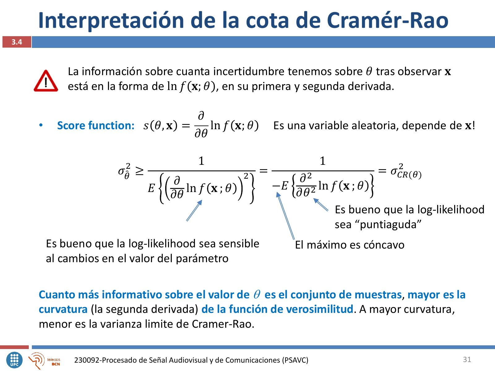

```text
      Interpretación de la cota de Cramér-Rao
3.4


              La información sobre cuanta incertidumbre tenemos sobre 𝜃𝜃 tras observar 𝐱𝐱
              está en la forma de ln 𝑓𝑓 𝐱𝐱; 𝜃𝜃 , en su primera y segunda derivada.

                                         𝜕𝜕
      •     Score function: 𝑠𝑠 𝜃𝜃, 𝐱𝐱 =      ln 𝑓𝑓 𝐱𝐱; 𝜃𝜃               Es una variable aleatoria, depende de 𝐱𝐱!
                                        𝜕𝜕𝜕𝜕

                                                   1                                   1
                           𝜎𝜎𝜃𝜃2̑ ≥                                 =                                       2
                                                                                                       = 𝜎𝜎𝐶𝐶𝐶𝐶(𝜃𝜃)
                                            𝜕𝜕                  2              𝜕𝜕 2
                                      𝐸𝐸        ln 𝑓𝑓 𝐱𝐱 ; 𝜃𝜃           −𝐸𝐸            ln 𝑓𝑓 𝐱𝐱 ; 𝜃𝜃
                                           𝜕𝜕𝜕𝜕                               𝜕𝜕𝜃𝜃 2
                                                                                           Es bueno que la log-likelihood
                                                                                           sea “puntiaguda”
          Es bueno que la log-likelihood sea sensible                         El máximo es cóncavo
          al cambios en el valor del parámetro

      Cuanto más informativo sobre el valor de θ es el conjunto de muestras, mayor es la
      curvatura (la segunda derivada) de la función de verosimilitud. A mayor curvatura,
      menor es la varianza limite de Cramer-Rao.

               230092-Procesado de Señal Audiovisual y de Comunicaciones (PSAVC)                                      31
```

## Page 32

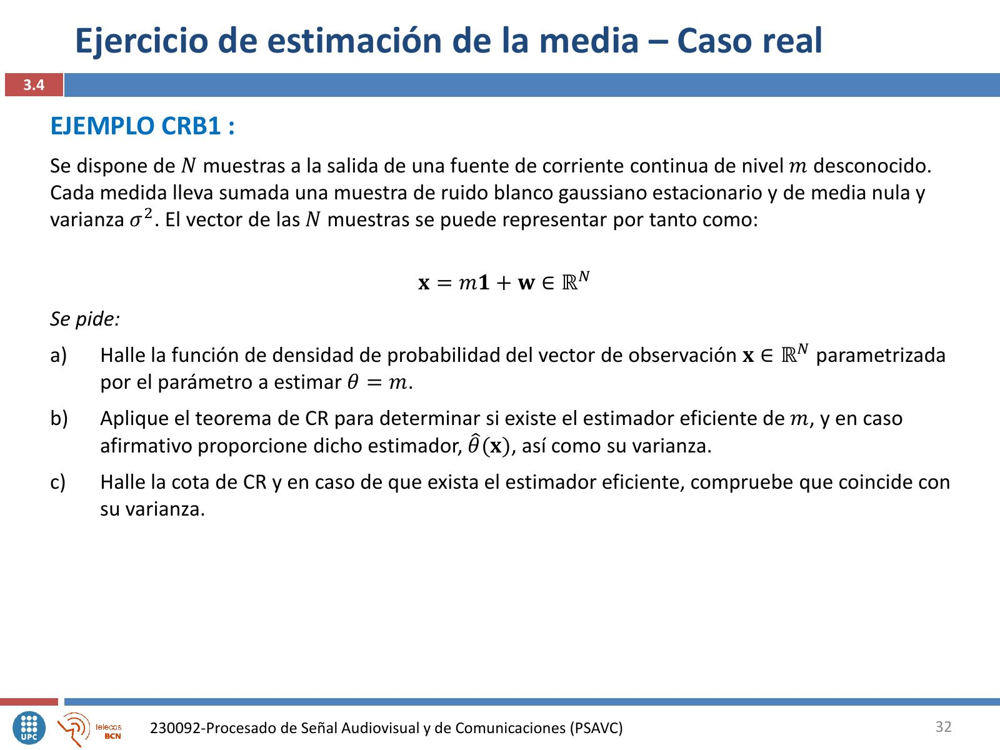

```text
           Ejercicio de estimación de la media – Caso real
3.4

      EJEMPLO CRB1 :
      Se dispone de 𝑁𝑁 muestras a la salida de una fuente de corriente continua de nivel 𝑚𝑚 desconocido.
      Cada medida lleva sumada una muestra de ruido blanco gaussiano estacionario y de media nula y
      varianza 𝜎𝜎 2 . El vector de las 𝑁𝑁 muestras se puede representar por tanto como:

                                                     𝐱𝐱 = 𝑚𝑚𝟏𝟏 + 𝐰𝐰 ∈ ℝ𝑁𝑁
      Se pide:
      a)    Halle la función de densidad de probabilidad del vector de observación 𝐱𝐱 ∈ ℝ𝑁𝑁 parametrizada
            por el parámetro a estimar 𝜃𝜃 = 𝑚𝑚.
      b)    Aplique el teorema de CR para determinar si existe el estimador eficiente de 𝑚𝑚, y en caso
                                                     �
            afirmativo proporcione dicho estimador, 𝜃𝜃(𝐱𝐱), así como su varianza.
      c)    Halle la cota de CR y en caso de que exista el estimador eficiente, compruebe que coincide con
            su varianza.


                 230092-Procesado de Señal Audiovisual y de Comunicaciones (PSAVC)                         32
```

## Page 33

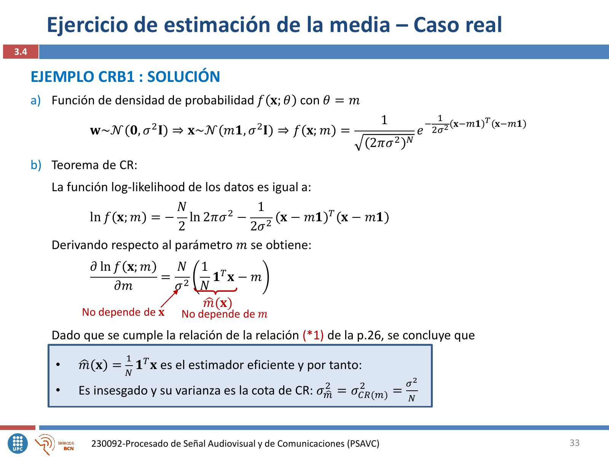

```text
        Ejercicio de estimación de la media – Caso real
3.4

      EJEMPLO CRB1 : SOLUCIÓN
      a) Función de densidad de probabilidad 𝑓𝑓 𝐱𝐱; 𝜃𝜃 con 𝜃𝜃 = 𝑚𝑚
                              2                       2
                                                                                     1           −
                                                                                                      1
                                                                                                          𝐱𝐱−𝑚𝑚𝟏𝟏 𝑇𝑇 𝐱𝐱−𝑚𝑚𝟏𝟏
                𝐰𝐰~𝒩𝒩 𝟎𝟎, 𝜎𝜎 𝐈𝐈 ⇒ 𝐱𝐱~𝒩𝒩 𝑚𝑚𝟏𝟏, 𝜎𝜎 𝐈𝐈 ⇒ 𝑓𝑓 𝐱𝐱; 𝑚𝑚 =                           𝑒𝑒       2𝜎𝜎2
                                                                               2𝜋𝜋𝜎𝜎 2 𝑁𝑁
      b) Teorema de CR:
         La función log-likelihood de los datos es igual a:
                                 𝑁𝑁             1
                ln 𝑓𝑓 𝐱𝐱; 𝑚𝑚 = − ln 2𝜋𝜋𝜎𝜎 2 − 2 𝐱𝐱 − 𝑚𝑚𝟏𝟏 𝑇𝑇 𝐱𝐱 − 𝑚𝑚𝟏𝟏
                                 2            2𝜎𝜎
         Derivando respecto al parámetro 𝑚𝑚 se obtiene:
                𝜕𝜕 ln 𝑓𝑓 𝐱𝐱; 𝑚𝑚   𝑁𝑁 1 𝑇𝑇
                                = 2    𝟏𝟏 𝐱𝐱 − 𝑚𝑚
                      𝜕𝜕𝑚𝑚       𝜎𝜎 𝑁𝑁
                                     𝑚𝑚(𝐱𝐱)
                                      �
               No depende de 𝐱𝐱      No depende de 𝑚𝑚
         Dado que se cumple la relación de la relación (*1) de la p.26, se concluye que
                        1
          •   � 𝐱𝐱 = 𝟏𝟏𝑇𝑇 𝐱𝐱 es el estimador eficiente y por tanto:
              𝑚𝑚
                        𝑁𝑁
                                                             2       2                   𝜎𝜎2
          •   Es insesgado y su varianza es la cota de CR: 𝜎𝜎𝑚𝑚
                                                              � = 𝜎𝜎𝐶𝐶𝐶𝐶(𝑚𝑚) =            𝑁𝑁


                 230092-Procesado de Señal Audiovisual y de Comunicaciones (PSAVC)                                             33
```

## Page 34

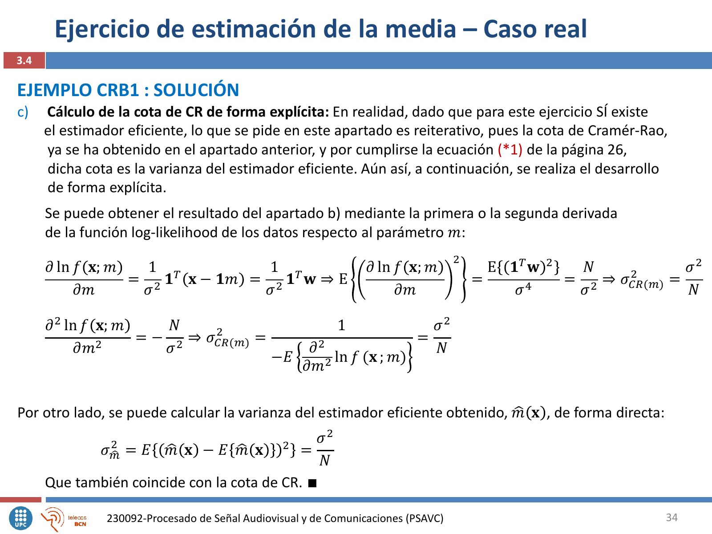

```text
       Ejercicio de estimación de la media – Caso real
3.4

EJEMPLO CRB1 : SOLUCIÓN
c)    Cálculo de la cota de CR de forma explícita: En realidad, dado que para este ejercicio SÍ existe
      el estimador eficiente, lo que se pide en este apartado es reiterativo, pues la cota de Cramér-Rao,
      ya se ha obtenido en el apartado anterior, y por cumplirse la ecuación (*1) de la página 26,
      dicha cota es la varianza del estimador eficiente. Aún así, a continuación, se realiza el desarrollo
      de forma explícita.
      Se puede obtener el resultado del apartado b) mediante la primera o la segunda derivada
      de la función log-likelihood de los datos respecto al parámetro 𝑚𝑚:
                                                                                       2
      𝜕𝜕 ln 𝑓𝑓 𝐱𝐱; 𝑚𝑚   1                  1                       𝜕𝜕 ln 𝑓𝑓 𝐱𝐱; 𝑚𝑚           E 𝟏𝟏𝑇𝑇 𝐰𝐰 2   𝑁𝑁     2         𝜎𝜎 2
                      = 2 𝟏𝟏𝑇𝑇 𝐱𝐱 − 𝟏𝟏𝑚𝑚 = 2 𝟏𝟏𝑇𝑇 𝐰𝐰 ⇒ E                                   =             = 2 ⇒ 𝜎𝜎𝐶𝐶𝐶𝐶(𝑚𝑚) =
            𝜕𝜕𝜕𝜕       𝜎𝜎                 𝜎𝜎                             𝜕𝜕𝜕𝜕                   𝜎𝜎 4      𝜎𝜎                 𝑁𝑁

      𝜕𝜕 2 ln 𝑓𝑓 𝐱𝐱; 𝑚𝑚      𝑁𝑁       2                       1                 𝜎𝜎 2
                        = −      ⇒ 𝜎𝜎𝐶𝐶𝐶𝐶(𝑚𝑚) =                               =
            𝜕𝜕𝑚𝑚2           𝜎𝜎 2                       𝜕𝜕 2                      𝑁𝑁
                                                  −𝐸𝐸       ln 𝑓𝑓 (𝐱𝐱 ; 𝑚𝑚)
                                                      𝜕𝜕𝑚𝑚2

Por otro lado, se puede calcular la varianza del estimador eficiente obtenido, 𝑚𝑚
                                                                               � 𝐱𝐱 , de forma directa:
                  2                            𝜎𝜎 2 2
                   � = 𝐸𝐸
                𝜎𝜎𝑚𝑚   𝑚𝑚
                       � 𝐱𝐱 − 𝐸𝐸 𝑚𝑚� 𝐱𝐱     =
                                                𝑁𝑁
      Que también coincide con la cota de CR. ∎

                 230092-Procesado de Señal Audiovisual y de Comunicaciones (PSAVC)                                        34
```

## Page 35

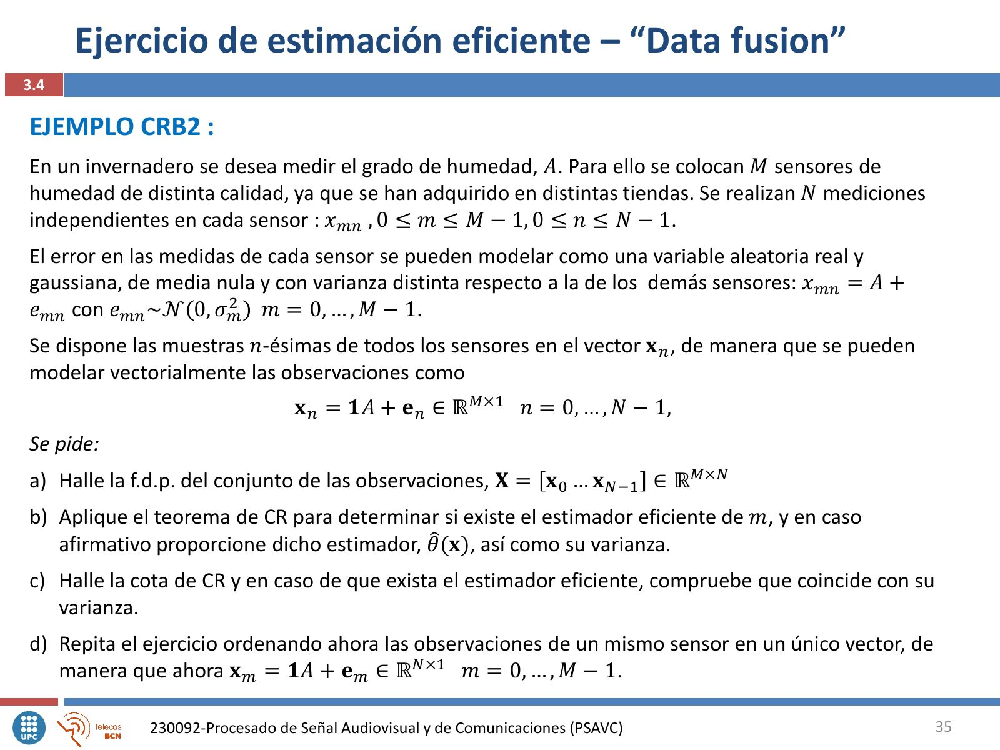

```text
      Ejercicio de estimación eficiente – “Data fusion”
3.4

EJEMPLO CRB2 :
En un invernadero se desea medir el grado de humedad, 𝐴𝐴. Para ello se colocan 𝑀𝑀 sensores de
humedad de distinta calidad, ya que se han adquirido en distintas tiendas. Se realizan 𝑁𝑁 mediciones
independientes en cada sensor : 𝑥𝑥𝑚𝑚𝑚𝑚 , 0 ≤ 𝑚𝑚 ≤ 𝑀𝑀 − 1, 0 ≤ 𝑛𝑛 ≤ 𝑁𝑁 − 1.
El error en las medidas de cada sensor se pueden modelar como una variable aleatoria real y
gaussiana, de media nula y con varianza distinta respecto a la de los demás sensores: 𝑥𝑥𝑚𝑚𝑚𝑚 = 𝐴𝐴 +
                           2
𝑒𝑒𝑚𝑚𝑚𝑚 con 𝑒𝑒𝑚𝑚𝑚𝑚 ~𝒩𝒩 0, 𝜎𝜎𝑚𝑚 𝑚𝑚 = 0, … , 𝑀𝑀 − 1.
Se dispone las muestras 𝑛𝑛-ésimas de todos los sensores en el vector 𝐱𝐱 𝑛𝑛 , de manera que se pueden
modelar vectorialmente las observaciones como
                                 𝐱𝐱 𝑛𝑛 = 𝟏𝟏𝐴𝐴 + 𝐞𝐞𝑛𝑛 ∈ ℝ𝑀𝑀×1 𝑛𝑛 = 0, … , 𝑁𝑁 − 1,
Se pide:
a) Halle la f.d.p. del conjunto de las observaciones, 𝐗𝐗 = 𝐱𝐱 0 … 𝐱𝐱 𝑁𝑁−1 ∈ ℝ𝑀𝑀×𝑁𝑁
b) Aplique el teorema de CR para determinar si existe el estimador eficiente de 𝑚𝑚, y en caso
                                            �
   afirmativo proporcione dicho estimador, 𝜃𝜃(𝐱𝐱), así como su varianza.
c) Halle la cota de CR y en caso de que exista el estimador eficiente, compruebe que coincide con su
   varianza.
d) Repita el ejercicio ordenando ahora las observaciones de un mismo sensor en un único vector, de
   manera que ahora 𝐱𝐱 𝑚𝑚 = 𝟏𝟏𝐴𝐴 + 𝐞𝐞𝑚𝑚 ∈ ℝ𝑁𝑁×1 𝑚𝑚 = 0, … , 𝑀𝑀 − 1.

              230092-Procesado de Señal Audiovisual y de Comunicaciones (PSAVC)                        35
```

## Page 36

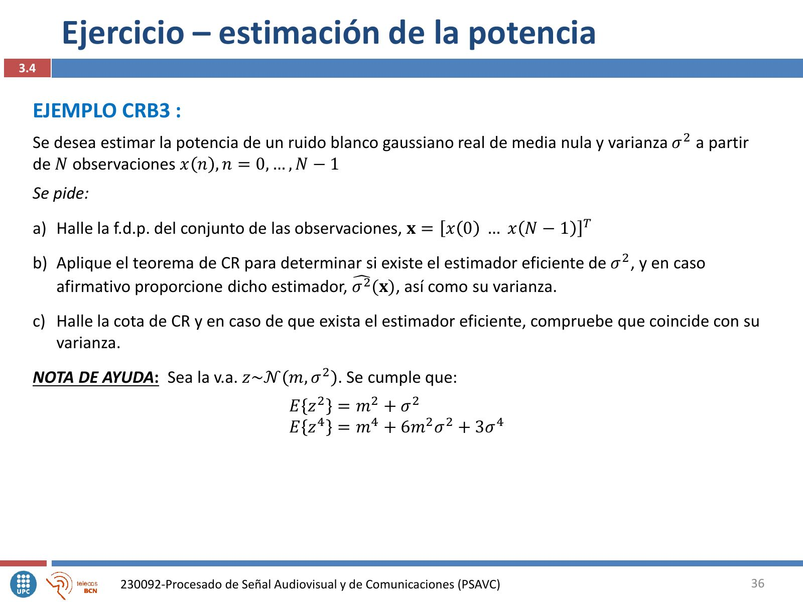

```text
      Ejercicio – estimación de la potencia
3.4


  EJEMPLO CRB3 :
  Se desea estimar la potencia de un ruido blanco gaussiano real de media nula y varianza 𝜎𝜎 2 a partir
  de 𝑁𝑁 observaciones 𝑥𝑥 𝑛𝑛 , 𝑛𝑛 = 0, … , 𝑁𝑁 − 1
  Se pide:
                                                                                  𝑇𝑇
  a) Halle la f.d.p. del conjunto de las observaciones, 𝐱𝐱 = 𝑥𝑥 0 … 𝑥𝑥 𝑁𝑁 − 1
  b) Aplique el teorema de CR para determinar si existe el estimador eficiente de 𝜎𝜎 2 , y en caso
     afirmativo proporcione dicho estimador, 𝜎𝜎�2 (𝐱𝐱), así como su varianza.
  c) Halle la cota de CR y en caso de que exista el estimador eficiente, compruebe que coincide con su
     varianza.
  NOTA DE AYUDA: Sea la v.a. 𝑧𝑧~𝒩𝒩 𝑚𝑚, 𝜎𝜎 2 . Se cumple que:
                                          𝐸𝐸 𝑧𝑧 2 = 𝑚𝑚2 + 𝜎𝜎 2
                                          𝐸𝐸 𝑧𝑧 4 = 𝑚𝑚4 + 6𝑚𝑚2 𝜎𝜎 2 + 3𝜎𝜎 4


              230092-Procesado de Señal Audiovisual y de Comunicaciones (PSAVC)                           36
```

## Page 37

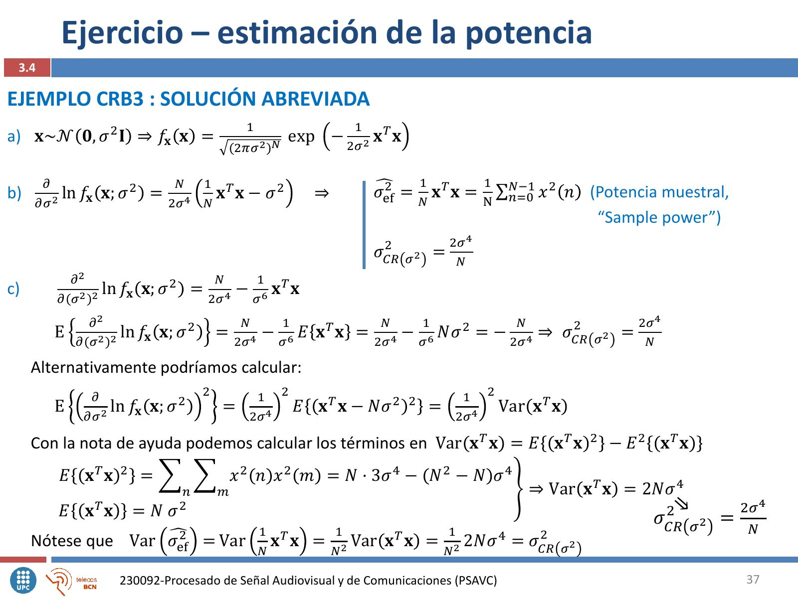

```text
          Ejercicio – estimación de la potencia
 3.4

EJEMPLO CRB3 : SOLUCIÓN ABREVIADA
                                                      1                      1
a) 𝐱𝐱~𝒩𝒩 𝟎𝟎, 𝜎𝜎 2 𝐈𝐈 ⇒ 𝑓𝑓𝐱𝐱 𝐱𝐱 =                                 exp −           𝐱𝐱 𝑇𝑇 𝐱𝐱
                                                    2𝜋𝜋𝜎𝜎   2 𝑁𝑁            2𝜎𝜎2


                                                                                  𝜎𝜎�
       𝜕𝜕                          𝑁𝑁  1 𝑇𝑇                                          2   1 𝑇𝑇       1 𝑁𝑁−1 2
b)
     𝜕𝜕𝜎𝜎2
           ln 𝑓𝑓𝐱𝐱 𝐱𝐱; 𝜎𝜎 2   =      4
                                  2𝜎𝜎 𝑁𝑁
                                         𝐱𝐱 𝐱𝐱 − 𝜎𝜎 2                ⇒              ef = 𝑁𝑁 𝐱𝐱 𝐱𝐱 = N ∑𝑛𝑛=0 𝑥𝑥 𝑛𝑛 (Potencia muestral,
                                                                                                                   “Sample power”)
                                                                                     2           2𝜎𝜎4
                                                                                  𝜎𝜎𝐶𝐶𝐶𝐶 𝜎𝜎2   =
                                                                                                  𝑁𝑁
            𝜕𝜕2                              𝑁𝑁     1
c)             2 2 ln 𝑓𝑓𝐱𝐱 𝐱𝐱; 𝜎𝜎 2     =       4 − 6 𝐱𝐱 𝑇𝑇 𝐱𝐱
         𝜕𝜕 𝜎𝜎                              2𝜎𝜎    𝜎𝜎
                𝜕𝜕2                              𝑁𝑁  1                          𝑁𝑁  1            𝑁𝑁     2                         2𝜎𝜎4
         E         2 2 ln 𝑓𝑓𝐱𝐱 𝐱𝐱; 𝜎𝜎 2        = 4 − 6 𝐸𝐸 𝐱𝐱 𝑇𝑇 𝐱𝐱            = 4 − 6 𝑁𝑁𝜎𝜎 2 = − 4 ⇒ 𝜎𝜎𝐶𝐶𝐶𝐶 𝜎𝜎2                 =
             𝜕𝜕 𝜎𝜎                              2𝜎𝜎 𝜎𝜎                         2𝜎𝜎 𝜎𝜎           2𝜎𝜎                                𝑁𝑁

     Alternativamente podríamos calcular:
                 𝜕𝜕                        2            1 2                                           1 2
         E           ln 𝑓𝑓𝐱𝐱 𝐱𝐱; 𝜎𝜎 2          =            𝐸𝐸       𝐱𝐱 𝑇𝑇 𝐱𝐱 − 𝑁𝑁𝜎𝜎 2 2 =                Var 𝐱𝐱 𝑇𝑇 𝐱𝐱
               𝜕𝜕𝜎𝜎2                                   2𝜎𝜎4                                          2𝜎𝜎4

     Con la nota de ayuda podemos calcular los términos en Var 𝐱𝐱 𝑇𝑇 𝐱𝐱 = 𝐸𝐸 𝐱𝐱 𝑇𝑇 𝐱𝐱 2 − 𝐸𝐸 2 𝐱𝐱 𝑇𝑇 𝐱𝐱
          𝐸𝐸 𝐱𝐱 𝑇𝑇 𝐱𝐱 2 = � � 𝑥𝑥 2 𝑛𝑛 𝑥𝑥 2 𝑚𝑚 = 𝑁𝑁 · 3𝜎𝜎 4 − 𝑁𝑁 2 − 𝑁𝑁 𝜎𝜎 4
                                      𝑛𝑛       𝑚𝑚                                                               � ⇒ Var 𝐱𝐱 𝑇𝑇 𝐱𝐱 = 2𝑁𝑁𝜎𝜎 4
          𝐸𝐸 𝐱𝐱 𝑇𝑇 𝐱𝐱
                = 𝑁𝑁 𝜎𝜎               2                                                                                                 2           2𝜎𝜎4
                                                                                                                                     𝜎𝜎𝐶𝐶𝐶𝐶 𝜎𝜎 2   = 𝑁𝑁
     Nótese que Var 𝜎𝜎� 2                                 1 𝑇𝑇            1                         1                2
                       ef = Var                              𝐱𝐱 𝐱𝐱   =      2 Var 𝐱𝐱 𝑇𝑇 𝐱𝐱     =      2 2𝑁𝑁𝜎𝜎 4 = 𝜎𝜎𝐶𝐶𝐶𝐶 𝜎𝜎2
                                                          𝑁𝑁             𝑁𝑁                        𝑁𝑁

                        230092-Procesado de Señal Audiovisual y de Comunicaciones (PSAVC)                                                            37
```

## Page 38

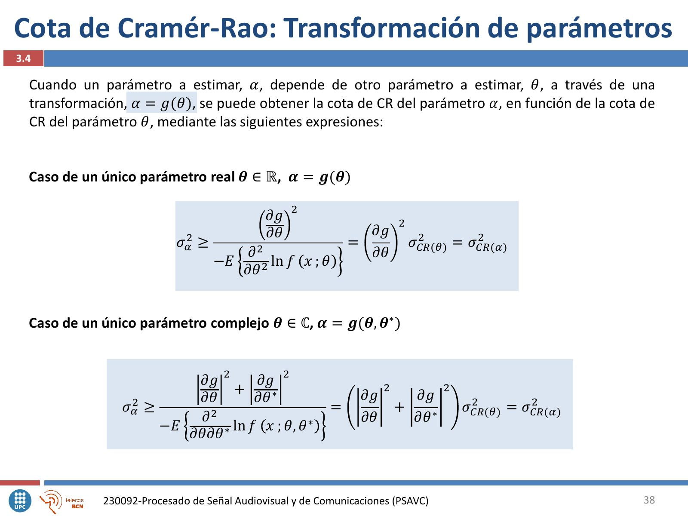

```text
Cota de Cramér-Rao: Transformación de parámetros
3.4

  Cuando un parámetro a estimar, 𝛼𝛼, depende de otro parámetro a estimar, 𝜃𝜃, a través de una
  transformación, 𝛼𝛼 = 𝑔𝑔(𝜃𝜃), se puede obtener la cota de CR del parámetro 𝛼𝛼, en función de la cota de
  CR del parámetro 𝜃𝜃, mediante las siguientes expresiones:


  Caso de un único parámetro real 𝜽𝜽 ∈ ℝ, 𝜶𝜶 = 𝒈𝒈(𝜽𝜽)

                                                    𝜕𝜕𝜕𝜕 2                           2
                                                    𝜕𝜕𝜕𝜕                   𝜕𝜕𝜕𝜕             2            2
                            𝜎𝜎𝛼𝛼2 ≥                                      =               𝜎𝜎𝐶𝐶𝐶𝐶(𝜃𝜃) = 𝜎𝜎𝐶𝐶𝐶𝐶(𝛼𝛼)
                                             𝜕𝜕 2                          𝜕𝜕𝜕𝜕
                                      −𝐸𝐸            ln 𝑓𝑓 𝑥𝑥 ; 𝜃𝜃
                                            𝜕𝜕𝜃𝜃 2


  Caso de un único parámetro complejo 𝜽𝜽 ∈ ℂ, 𝜶𝜶 = 𝒈𝒈(𝜽𝜽, 𝜽𝜽∗ )


                               𝜕𝜕𝜕𝜕 2       𝜕𝜕𝜕𝜕 2
                                       +                                  𝜕𝜕𝜕𝜕
                                                                                 2
                                                                                        𝜕𝜕𝜕𝜕
                                                                                                 2
                    2          𝜕𝜕𝜕𝜕        𝜕𝜕𝜃𝜃 ∗                                                       2            2
                 𝜎𝜎𝛼𝛼 ≥                                              =               +               𝜎𝜎𝐶𝐶𝐶𝐶(𝜃𝜃) = 𝜎𝜎𝐶𝐶𝐶𝐶(𝛼𝛼)
                               𝜕𝜕 2                                       𝜕𝜕𝜕𝜕         𝜕𝜕𝜃𝜃 ∗
                        −𝐸𝐸            ln 𝑓𝑓 𝑥𝑥 ; 𝜃𝜃, 𝜃𝜃 ∗
                            𝜕𝜕𝜕𝜕𝜕𝜕𝜃𝜃 ∗


              230092-Procesado de Señal Audiovisual y de Comunicaciones (PSAVC)                                                38
```

## Page 39

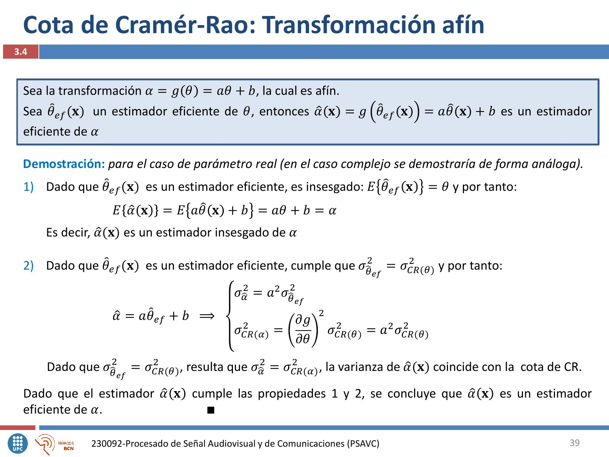

```text
  Cota de Cramér-Rao: Transformación afín
3.4


  Sea la transformación 𝛼𝛼 = 𝑔𝑔 𝜃𝜃 = 𝑎𝑎𝑎𝑎 + 𝑏𝑏, la cual es afín.
  Sea 𝜃𝜃̑ 𝑒𝑒𝑒𝑒 (𝐱𝐱) un estimador eficiente de 𝜃𝜃, entonces 𝛼𝛼� 𝐱𝐱 = 𝑔𝑔 𝜃𝜃̑ 𝑒𝑒𝑒𝑒 𝐱𝐱                    = 𝑎𝑎𝜃𝜃� 𝐱𝐱 + 𝑏𝑏 es un estimador
  eficiente de 𝛼𝛼

  Demostración: para el caso de parámetro real (en el caso complejo se demostraría de forma análoga).
  1) Dado que 𝜃𝜃̑ 𝑒𝑒𝑒𝑒 (𝐱𝐱) es un estimador eficiente, es insesgado: 𝐸𝐸 𝜃𝜃�𝑒𝑒𝑒𝑒 𝐱𝐱 = 𝜃𝜃 y por tanto:
                    𝐸𝐸 𝛼𝛼� 𝐱𝐱   = 𝐸𝐸 𝑎𝑎𝜃𝜃� 𝐱𝐱 + 𝑏𝑏 = 𝑎𝑎𝜃𝜃 + 𝑏𝑏 = 𝛼𝛼
      Es decir, �
                𝛼𝛼(𝐱𝐱) es un estimador insesgado de 𝛼𝛼

  2) Dado que 𝜃𝜃̑ 𝑒𝑒𝑒𝑒 (𝐱𝐱) es un estimador eficiente, cumple que 𝜎𝜎𝜃𝜃�2 = 𝜎𝜎𝐶𝐶𝐶𝐶(𝜃𝜃)
                                                                              2
                                                                                      y por tanto:
                                                                                        𝑒𝑒𝑒𝑒

                                                𝜎𝜎𝛼𝛼�2 = 𝑎𝑎2 𝜎𝜎𝜃𝜃�2
                                                                  𝑒𝑒𝑒𝑒
                    𝛼𝛼� = 𝑎𝑎𝜃𝜃̑ 𝑒𝑒𝑒𝑒 + 𝑏𝑏 ⟹                  𝜕𝜕𝜕𝜕
                                                                         2
                                                   2                            2                2
                                                𝜎𝜎𝐶𝐶𝐶𝐶(𝛼𝛼) =                 𝜎𝜎𝐶𝐶𝐶𝐶(𝜃𝜃) = 𝑎𝑎2 𝜎𝜎𝐶𝐶𝐶𝐶(𝜃𝜃)
                                                             𝜕𝜕𝜕𝜕

      Dado que 𝜎𝜎𝜃𝜃�2 = 𝜎𝜎𝐶𝐶𝐶𝐶(𝜃𝜃)
                           2
                                   , resulta que 𝜎𝜎𝛼𝛼�2 = 𝜎𝜎𝐶𝐶𝐶𝐶(𝛼𝛼)
                                                             2
                                                                     , la varianza de �
                                                                                      𝛼𝛼(𝐱𝐱) coincide con la cota de CR.
                     𝑒𝑒𝑒𝑒

  Dado que el estimador 𝛼𝛼� 𝐱𝐱 cumple las propiedades 1 y 2, se concluye que 𝛼𝛼� 𝐱𝐱 es un estimador
  eficiente de 𝛼𝛼.               ∎

                230092-Procesado de Señal Audiovisual y de Comunicaciones (PSAVC)                                               39
```

## Page 40

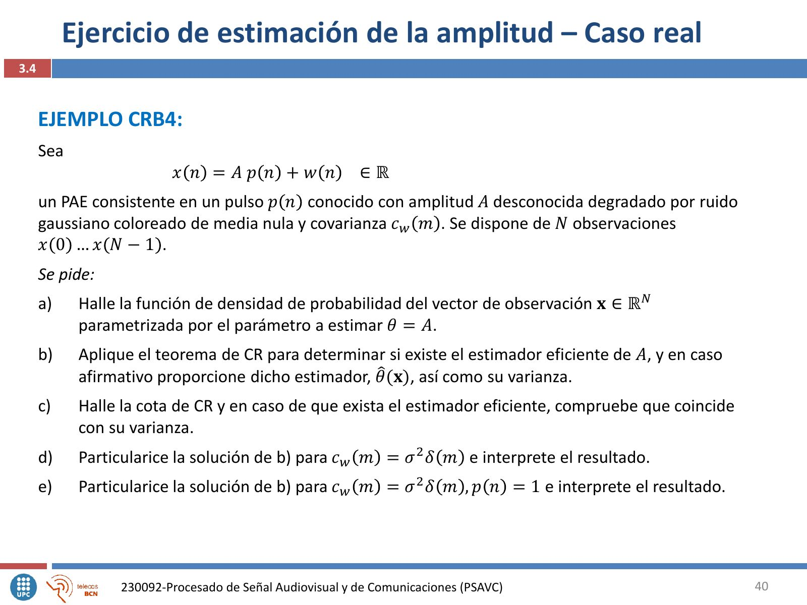

```text
           Ejercicio de estimación de la amplitud – Caso real
3.4


      EJEMPLO CRB4:
      Sea
                          𝑥𝑥 𝑛𝑛 = 𝐴𝐴 𝑝𝑝 𝑛𝑛 + 𝑤𝑤 𝑛𝑛        ∈ℝ
      un PAE consistente en un pulso 𝑝𝑝 𝑛𝑛 conocido con amplitud 𝐴𝐴 desconocida degradado por ruido
      gaussiano coloreado de media nula y covarianza 𝑐𝑐𝑤𝑤 𝑚𝑚 . Se dispone de 𝑁𝑁 observaciones
      𝑥𝑥 0 … 𝑥𝑥 𝑁𝑁 − 1 .
      Se pide:
      a)    Halle la función de densidad de probabilidad del vector de observación 𝐱𝐱 ∈ ℝ𝑁𝑁
            parametrizada por el parámetro a estimar 𝜃𝜃 = 𝐴𝐴.
      b)    Aplique el teorema de CR para determinar si existe el estimador eficiente de 𝐴𝐴, y en caso
                                                     �
            afirmativo proporcione dicho estimador, 𝜃𝜃(𝐱𝐱), así como su varianza.
      c)    Halle la cota de CR y en caso de que exista el estimador eficiente, compruebe que coincide
            con su varianza.
      d)    Particularice la solución de b) para 𝑐𝑐𝑤𝑤 𝑚𝑚 = 𝜎𝜎 2 𝛿𝛿 𝑚𝑚 e interprete el resultado.
      e)    Particularice la solución de b) para 𝑐𝑐𝑤𝑤 𝑚𝑚 = 𝜎𝜎 2 𝛿𝛿 𝑚𝑚 , 𝑝𝑝 𝑛𝑛 = 1 e interprete el resultado.


                  230092-Procesado de Señal Audiovisual y de Comunicaciones (PSAVC)                            40
```

## Page 41

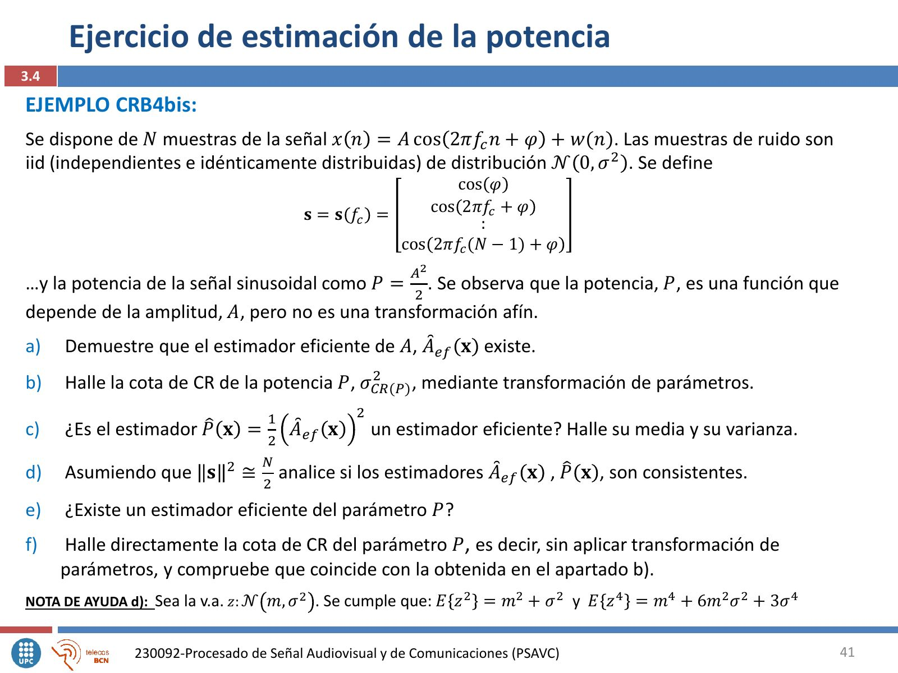

```text
       Ejercicio de estimación de la potencia
3.4

EJEMPLO CRB4bis:
Se dispone de 𝑁𝑁 muestras de la señal 𝑥𝑥 𝑛𝑛 = 𝐴𝐴 cos 2𝜋𝜋𝑓𝑓𝑐𝑐 𝑛𝑛 + 𝜑𝜑 + 𝑤𝑤(𝑛𝑛). Las muestras de ruido son
iid (independientes e idénticamente distribuidas) de distribución 𝒩𝒩 0, 𝜎𝜎 2 . Se define
                                                                 cos 𝜑𝜑
                                          𝐬𝐬 = 𝐬𝐬 𝑓𝑓𝑐𝑐 =     cos 2𝜋𝜋𝑓𝑓𝑐𝑐 + 𝜑𝜑
                                                                       :
                                                         cos 2𝜋𝜋𝑓𝑓𝑐𝑐 (𝑁𝑁 − 1) + 𝜑𝜑
                                               𝐴𝐴2
…y la potencia de la señal sinusoidal como 𝑃𝑃 = . Se observa que la potencia, 𝑃𝑃, es una función que
                                                2
depende de la amplitud, 𝐴𝐴, pero no es una transformación afín.
a)    Demuestre que el estimador eficiente de 𝐴𝐴, 𝐴𝐴̑ 𝑒𝑒𝑒𝑒 𝐱𝐱 existe.
                                                2
b)    Halle la cota de CR de la potencia 𝑃𝑃, 𝜎𝜎𝐶𝐶𝐶𝐶(𝑃𝑃) , mediante transformación de parámetros.
                               1                  2
c)    ¿Es el estimador 𝑃𝑃� 𝐱𝐱 = 𝐴𝐴̑ 𝑒𝑒𝑒𝑒 𝐱𝐱           un estimador eficiente? Halle su media y su varianza.
                                   2
                                  𝑁𝑁
d)    Asumiendo que 𝐬𝐬         2
                                 ≅ analice si los estimadores 𝐴𝐴̑ 𝑒𝑒𝑒𝑒 𝐱𝐱       , 𝑃𝑃� 𝐱𝐱 , son consistentes.
                                  2
e)    ¿Existe un estimador eficiente del parámetro 𝑃𝑃?
f)    Halle directamente la cota de CR del parámetro 𝑃𝑃, es decir, sin aplicar transformación de
      parámetros, y compruebe que coincide con la obtenida en el apartado b).
NOTA DE AYUDA d): Sea la v.a. 𝑧𝑧: 𝒩𝒩 𝑚𝑚, 𝜎𝜎 2 . Se cumple que: 𝐸𝐸 𝑧𝑧 2 = 𝑚𝑚2 + 𝜎𝜎 2 y 𝐸𝐸 𝑧𝑧 4 = 𝑚𝑚4 + 6𝑚𝑚2 𝜎𝜎 2 + 3𝜎𝜎 4


                230092-Procesado de Señal Audiovisual y de Comunicaciones (PSAVC)                                         41
```

## Page 42

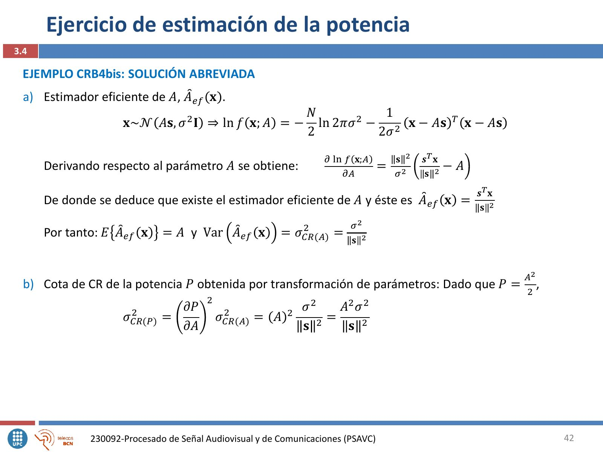

```text
       Ejercicio de estimación de la potencia
3.4

  EJEMPLO CRB4bis: SOLUCIÓN ABREVIADA
  a) Estimador eficiente de 𝐴𝐴, 𝐴𝐴̑ 𝑒𝑒𝑒𝑒 𝐱𝐱 .
                                                                   𝑁𝑁              1
                          𝐱𝐱~𝒩𝒩 𝐴𝐴𝐬𝐬, 𝜎𝜎 2 𝐈𝐈 ⇒ ln 𝑓𝑓 𝐱𝐱; 𝐴𝐴 = −      ln 2𝜋𝜋𝜎𝜎 2 − 2 𝐱𝐱 − 𝐴𝐴𝐬𝐬 𝑇𝑇 𝐱𝐱 − 𝐴𝐴𝐬𝐬
                                                                   2              2𝜎𝜎
                                                                       𝜕𝜕 ln 𝑓𝑓 𝐱𝐱;𝐴𝐴       𝐬𝐬 2   𝒔𝒔𝑇𝑇 𝐱𝐱
       Derivando respecto al parámetro 𝐴𝐴 se obtiene:                                   =                  − 𝐴𝐴
                                                                            𝜕𝜕𝐴𝐴            𝜎𝜎2     𝐬𝐬 2
                                                                                                                  𝒔𝒔𝑇𝑇 𝐱𝐱
       De donde se deduce que existe el estimador eficiente de 𝐴𝐴 y éste es 𝐴𝐴̑ 𝑒𝑒𝑒𝑒 𝐱𝐱 =
                                                                                                                   𝐬𝐬 2
                                                                               𝜎𝜎2
       Por tanto: 𝐸𝐸 𝐴𝐴̑ 𝑒𝑒𝑒𝑒 𝐱𝐱   = 𝐴𝐴 y Var 𝐴𝐴̑ 𝑒𝑒𝑒𝑒 𝐱𝐱         2
                                                             = 𝜎𝜎𝐶𝐶𝐶𝐶(𝐴𝐴) =
                                                                               𝐬𝐬 2


                                                                                            𝐴𝐴2
  b)   Cota de CR de la potencia 𝑃𝑃 obtenida por transformación de parámetros: Dado que 𝑃𝑃 = ,
                                                                                             2
                                       2                      2     2 2
                        2         𝜕𝜕𝑃𝑃      2              𝜎𝜎     𝐴𝐴 𝜎𝜎
                     𝜎𝜎𝐶𝐶𝐶𝐶(𝑃𝑃) =        𝜎𝜎𝐶𝐶𝐶𝐶(𝐴𝐴) = 𝐴𝐴 2      =
                                  𝜕𝜕𝐴𝐴                     𝐬𝐬 2     𝐬𝐬 2


                  230092-Procesado de Señal Audiovisual y de Comunicaciones (PSAVC)                                         42
```

## Page 43

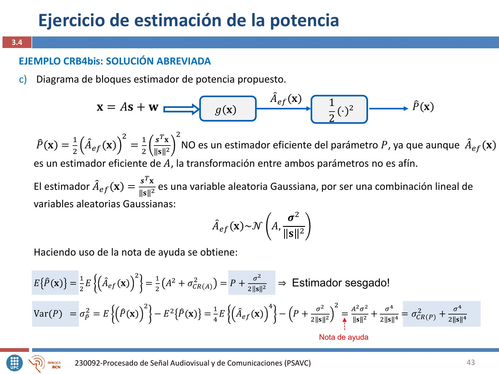

```text
       Ejercicio de estimación de la potencia
3.4

  EJEMPLO CRB4bis: SOLUCIÓN ABREVIADA
  c) Diagrama de bloques estimador de potencia propuesto.
                                                                                              𝐴𝐴̑ 𝑒𝑒𝑒𝑒 𝐱𝐱           1 2
                           𝐱𝐱 = 𝐴𝐴𝐬𝐬 + 𝐰𝐰                               𝑔𝑔 𝐱𝐱                                         ·                                𝑃𝑃� 𝐱𝐱
                                                                                                                    2
                                     2                       2
              1                             1      𝒔𝒔𝑇𝑇 𝐱𝐱
      𝑃𝑃� 𝐱𝐱 = 𝐴𝐴̑ 𝑒𝑒𝑒𝑒 𝐱𝐱                =                      NO es un estimador eficiente del parámetro 𝑃𝑃, ya que aunque 𝐴𝐴̑ 𝑒𝑒𝑒𝑒 𝐱𝐱
                   2                        2       𝐬𝐬 2
      es un estimador eficiente de 𝐴𝐴, la transformación entre ambos parámetros no es afín.
                                𝒔𝒔 𝐱𝐱         𝑇𝑇
      El estimador 𝐴𝐴̑ 𝑒𝑒𝑒𝑒 𝐱𝐱 = 2 es una variable aleatoria Gaussiana, por ser una combinación lineal de
                                              𝐬𝐬
      variables aleatorias Gaussianas:
                                                                                            𝝈𝝈2
                                                                        𝐴𝐴̑ 𝑒𝑒𝑒𝑒 𝐱𝐱 ~𝒩𝒩 𝐴𝐴,
                                                                                            𝐬𝐬 2
      Haciendo uso de la nota de ayuda se obtiene:

                       1                  2        1                                   𝜎𝜎 2
      𝐸𝐸 𝑃𝑃� 𝐱𝐱   = 𝐸𝐸      𝐴𝐴̑ 𝑒𝑒𝑒𝑒 𝐱𝐱        =                2
                                                       𝐴𝐴2 + 𝜎𝜎𝐶𝐶𝐶𝐶(𝐴𝐴) = 𝑃𝑃 +                    ⇒ Estimador sesgado!
                       2                           2                                 2 𝐬𝐬 2

                                              2                                               4                      2
                                                                        1                                    𝜎𝜎 2            𝐴𝐴2 𝜎𝜎 2      𝜎𝜎 4                       𝜎𝜎 4
      Var 𝑃𝑃      = 𝜎𝜎𝑃𝑃2� = 𝐸𝐸     𝑃𝑃� 𝐱𝐱         − 𝐸𝐸 𝑃𝑃� 𝐱𝐱
                                                         2
                                                                      = 𝐸𝐸      𝐴𝐴̑ 𝑒𝑒𝑒𝑒 𝐱𝐱       − 𝑃𝑃 +                 =          2 +
                                                                                                                                                         2
                                                                                                                                                  4 = 𝜎𝜎𝐶𝐶𝐶𝐶(𝑃𝑃) +
                                                                        4                                   2 𝐬𝐬 2             𝐬𝐬         2 𝐬𝐬                       2 𝐬𝐬 4

                                                                                                              Nota de ayuda


                   230092-Procesado de Señal Audiovisual y de Comunicaciones (PSAVC)                                                                                          43
```

## Page 44

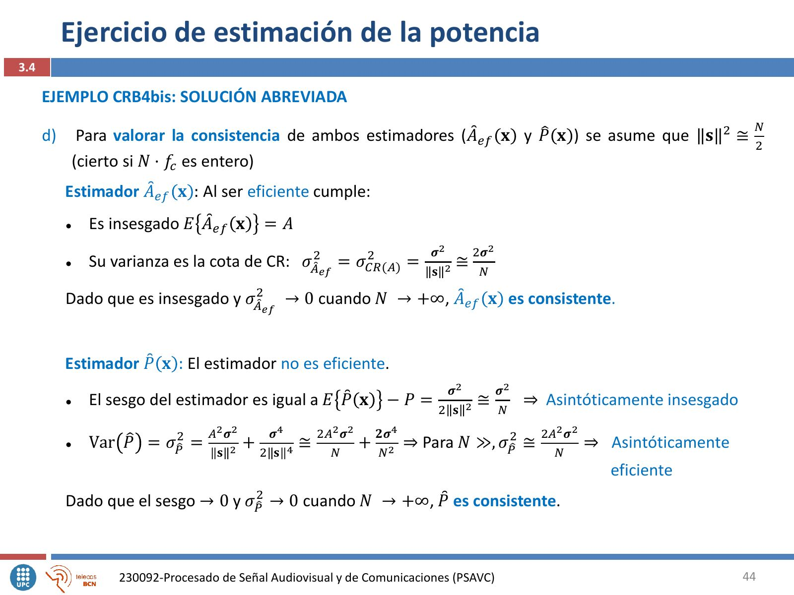

```text
           Ejercicio de estimación de la potencia
3.4

      EJEMPLO CRB4bis: SOLUCIÓN ABREVIADA
                                                                                                          𝑁𝑁
      d)    Para valorar la consistencia de ambos estimadores (𝐴𝐴̑ 𝑒𝑒𝑒𝑒 𝐱𝐱 y 𝑃𝑃� 𝐱𝐱 ) se asume que 𝐬𝐬 2 ≅
                                                                                                          2
           (cierto si 𝑁𝑁 · 𝑓𝑓𝑐𝑐 es entero)
           Estimador 𝐴𝐴̑ 𝑒𝑒𝑒𝑒 𝐱𝐱 : Al ser eficiente cumple:
           ●   Es insesgado 𝐸𝐸 𝐴𝐴̑ 𝑒𝑒𝑒𝑒 𝐱𝐱   = 𝐴𝐴
                                                                          𝝈𝝈2    2𝝈𝝈2
           ●   Su varianza es la cota de CR: 𝜎𝜎𝐴𝐴2̑ 𝑒𝑒𝑒𝑒 = 𝜎𝜎𝐶𝐶𝐶𝐶(𝐴𝐴)
                                                              2
                                                                      =        ≅
                                                                          𝐬𝐬 2    𝑁𝑁

           Dado que es insesgado y 𝜎𝜎𝐴𝐴2̑ 𝑒𝑒𝑒𝑒 → 0 cuando 𝑁𝑁 → +∞, 𝐴𝐴̑ 𝑒𝑒𝑒𝑒 𝐱𝐱 es consistente.


           Estimador 𝑃𝑃̑ 𝐱𝐱 : El estimador no es eficiente.
                                                                            𝝈𝝈2     𝝈𝝈2
           ●   El sesgo del estimador es igual a 𝐸𝐸 𝑃𝑃̑ 𝐱𝐱        − 𝑃𝑃 =          ≅       ⇒ Asintóticamente insesgado
                                                                           2 𝐬𝐬 2    𝑁𝑁
                                    𝐴𝐴2 𝝈𝝈2    𝝈𝝈4     2𝐴𝐴2 𝝈𝝈2   𝟐𝟐𝝈𝝈4                      2𝐴𝐴2 𝝈𝝈2
           ●   Var 𝑃𝑃� = 𝜎𝜎𝑃𝑃2� =           +        ≅          +       ⇒ Para 𝑁𝑁 ≫, 𝜎𝜎 2
                                                                                       𝑃𝑃� ≅          ⇒   Asintóticamente
                                      𝐬𝐬 2    2 𝐬𝐬 4      𝑁𝑁       𝑁𝑁2                          𝑁𝑁
                                                                                                          eficiente
           Dado que el sesgo → 0 y 𝜎𝜎𝑃𝑃2� → 0 cuando 𝑁𝑁 → +∞, 𝑃𝑃̑ es consistente.


                    230092-Procesado de Señal Audiovisual y de Comunicaciones (PSAVC)                                       44
```

## Page 45

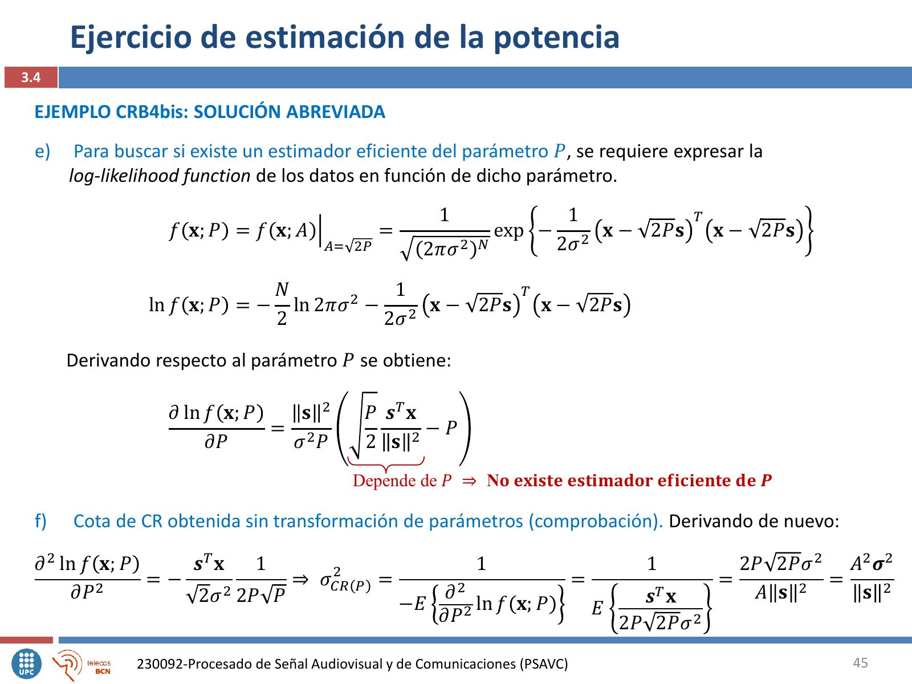

```text
       Ejercicio de estimación de la potencia
3.4

  EJEMPLO CRB4bis: SOLUCIÓN ABREVIADA
  e)    Para buscar si existe un estimador eficiente del parámetro 𝑃𝑃, se requiere expresar la
       log-likelihood function de los datos en función de dicho parámetro.
                                                                  1                     1               𝑇𝑇
                    𝑓𝑓 𝐱𝐱; 𝑃𝑃 = 𝑓𝑓 𝐱𝐱; 𝐴𝐴 �             =                   exp −            𝐱𝐱 − 2𝑃𝑃𝐬𝐬    𝐱𝐱 − 2𝑃𝑃𝐬𝐬
                                              𝐴𝐴= 2𝑃𝑃          2𝜋𝜋𝜎𝜎 2 𝑁𝑁              2𝜎𝜎 2

                                    𝑁𝑁              1           𝑇𝑇
                 ln 𝑓𝑓 𝐱𝐱; 𝑃𝑃 = −      ln 2𝜋𝜋𝜎𝜎 2 − 2 𝐱𝐱 − 2𝑃𝑃𝐬𝐬 𝐱𝐱 − 2𝑃𝑃𝐬𝐬
                                    2              2𝜎𝜎

       Derivando respecto al parámetro 𝑃𝑃 se obtiene:

                    𝜕𝜕 ln 𝑓𝑓 𝐱𝐱; 𝑃𝑃   𝐬𝐬 2          𝑃𝑃 𝒔𝒔𝑇𝑇 𝐱𝐱
                                    = 2                        − 𝑃𝑃
                          𝜕𝜕𝑃𝑃       𝜎𝜎 𝑃𝑃          2 𝐬𝐬 2
                                                  Depende de 𝑃𝑃 ⇒ N𝐨𝐨 𝐞𝐞𝐞𝐞𝐞𝐞𝐞𝐞𝐞𝐞𝐞𝐞 𝐞𝐞𝐞𝐞𝐞𝐞𝐞𝐞𝐞𝐞𝐞𝐞𝐞𝐞𝐞𝐞𝐞𝐞 𝐞𝐞𝐞𝐞𝐞𝐞𝐞𝐞𝐞𝐞𝐞𝐞𝐞𝐞𝐞𝐞𝐞𝐞 𝐝𝐝𝐝𝐝 𝑷𝑷

  f)   Cota de CR obtenida sin transformación de parámetros (comprobación). Derivando de nuevo:

  𝜕𝜕 2 ln 𝑓𝑓 𝐱𝐱; 𝑃𝑃     𝒔𝒔𝑇𝑇 𝐱𝐱  1         2                            1                               1              2𝑃𝑃 2𝑃𝑃𝜎𝜎 2 𝐴𝐴2 𝝈𝝈2
                    = −               ⇒ 𝜎𝜎𝐶𝐶𝐶𝐶 𝑃𝑃 =                                       =                          =            =
        𝜕𝜕𝑃𝑃2            2𝜎𝜎 2 2𝑃𝑃 𝑃𝑃                            𝜕𝜕 2                               𝒔𝒔𝑇𝑇 𝐱𝐱              𝐴𝐴 𝐬𝐬 2     𝐬𝐬 2
                                                            −𝐸𝐸       ln 𝑓𝑓 𝐱𝐱; 𝑃𝑃            𝐸𝐸
                                                                𝜕𝜕𝑃𝑃2                            2𝑃𝑃 2𝑃𝑃𝜎𝜎 2
               230092-Procesado de Señal Audiovisual y de Comunicaciones (PSAVC)                                                     45
```

## Page 46

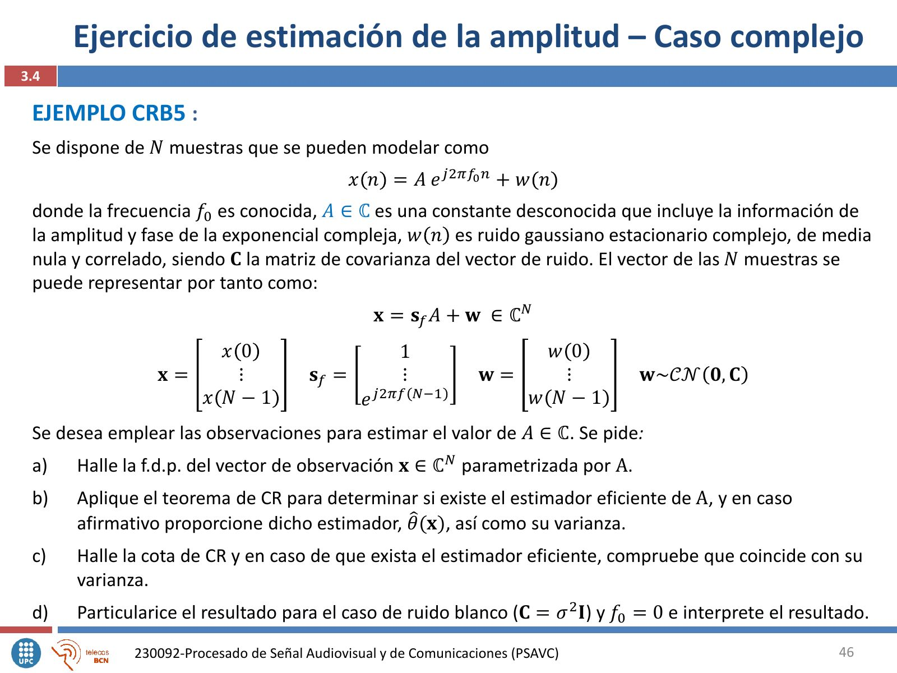

```text
      Ejercicio de estimación de la amplitud – Caso complejo
3.4

 EJEMPLO CRB5 :
 Se dispone de 𝑁𝑁 muestras que se pueden modelar como
                                                𝑥𝑥 𝑛𝑛 = 𝐴𝐴 𝑒𝑒 𝑗𝑗𝑗𝑗𝑗𝑓𝑓0 𝑛𝑛 + 𝑤𝑤 𝑛𝑛
 donde la frecuencia 𝑓𝑓0 es conocida, 𝐴𝐴 ∈ ℂ es una constante desconocida que incluye la información de
 la amplitud y fase de la exponencial compleja, 𝑤𝑤 𝑛𝑛 es ruido gaussiano estacionario complejo, de media
 nula y correlado, siendo 𝐂𝐂 la matriz de covarianza del vector de ruido. El vector de las 𝑁𝑁 muestras se
 puede representar por tanto como:
                                                       𝐱𝐱 = 𝐬𝐬𝑓𝑓 𝐴𝐴 + 𝐰𝐰 ∈ ℂ𝑁𝑁
                        𝑥𝑥 0                               1                  𝑤𝑤 0
                𝐱𝐱 =       ⋮           𝐬𝐬𝑓𝑓 =              ⋮          𝐰𝐰 =      ⋮      𝐰𝐰~𝒞𝒞𝒞𝒞 𝟎𝟎, 𝐂𝐂
                     𝑥𝑥 𝑁𝑁 − 1                         𝑗𝑗𝑗𝑗𝑗𝑗𝑗 𝑁𝑁−1        𝑤𝑤 𝑁𝑁 − 1
                                                  𝑒𝑒
 Se desea emplear las observaciones para estimar el valor de 𝐴𝐴 ∈ ℂ. Se pide:
 a)   Halle la f.d.p. del vector de observación 𝐱𝐱 ∈ ℂ𝑁𝑁 parametrizada por A.
 b)   Aplique el teorema de CR para determinar si existe el estimador eficiente de A, y en caso
                                               �
      afirmativo proporcione dicho estimador, 𝜃𝜃(𝐱𝐱), así como su varianza.
 c)   Halle la cota de CR y en caso de que exista el estimador eficiente, compruebe que coincide con su
      varianza.
 d)   Particularice el resultado para el caso de ruido blanco (𝐂𝐂 = 𝜎𝜎 2 𝐈𝐈) y 𝑓𝑓0 = 0 e interprete el resultado.
             230092-Procesado de Señal Audiovisual y de Comunicaciones (PSAVC)                              46
```

## Page 47

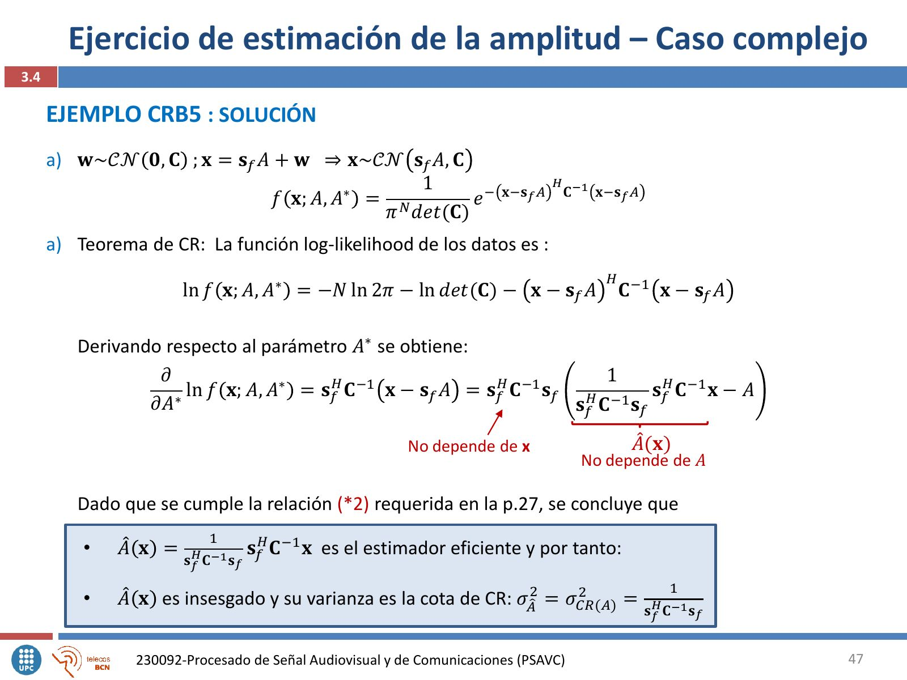

```text
         Ejercicio de estimación de la amplitud – Caso complejo
3.4

      EJEMPLO CRB5 : SOLUCIÓN
      a) 𝐰𝐰~𝒞𝒞𝒞𝒞 𝟎𝟎, 𝐂𝐂 ; 𝐱𝐱 = 𝐬𝐬𝑓𝑓 𝐴𝐴 + 𝐰𝐰 ⇒ 𝐱𝐱~𝒞𝒞𝒞𝒞 𝐬𝐬𝑓𝑓 𝐴𝐴, 𝐂𝐂
                                                           1                       𝐻𝐻 −1
                                      𝑓𝑓 𝐱𝐱; 𝐴𝐴, 𝐴𝐴∗ = 𝑁𝑁           𝑒𝑒 − 𝐱𝐱−𝐬𝐬𝑓𝑓 𝐴𝐴 𝐂𝐂 𝐱𝐱−𝐬𝐬𝑓𝑓 𝐴𝐴
                                                      𝜋𝜋 𝑑𝑑𝑑𝑑𝑑𝑑(𝐂𝐂)
      a) Teorema de CR: La función log-likelihood de los datos es :
                                                                                           𝐻𝐻 −1
                          ln 𝑓𝑓 𝐱𝐱; 𝐴𝐴, 𝐴𝐴∗ = −𝑁𝑁 ln 2𝜋𝜋 − ln 𝑑𝑑𝑑𝑑𝑑𝑑(𝐂𝐂) − 𝐱𝐱 − 𝐬𝐬𝑓𝑓 𝐴𝐴      𝐂𝐂         𝐱𝐱 − 𝐬𝐬𝑓𝑓 𝐴𝐴

          Derivando respecto al parámetro 𝐴𝐴∗ se obtiene:
                    𝜕𝜕                          𝐻𝐻 −1                   𝐻𝐻 −1            1
                       ∗
                         ln 𝑓𝑓 𝐱𝐱; 𝐴𝐴, 𝐴𝐴∗
                                           = 𝐬𝐬𝑓𝑓 𝐂𝐂  𝐱𝐱 − 𝐬𝐬𝑓𝑓 𝐴𝐴 = 𝐬𝐬𝑓𝑓 𝐂𝐂  𝐬𝐬𝑓𝑓   𝐻𝐻         𝐬𝐬𝑓𝑓𝐻𝐻 𝐂𝐂−1 𝐱𝐱 − 𝐴𝐴
                  𝜕𝜕𝐴𝐴                                                                    −1
                                                                                   𝐬𝐬𝑓𝑓 𝐂𝐂 𝐬𝐬𝑓𝑓

                                                             No depende de x                       ̂
                                                                                                  𝐴𝐴(𝐱𝐱)
                                                                                        No depende de 𝐴𝐴

          Dado que se cumple la relación (*2) requerida en la p.27, se concluye que
                            1
           •    𝐴𝐴̂ 𝐱𝐱 = 𝐻𝐻 −1 𝐬𝐬𝑓𝑓𝐻𝐻 𝐂𝐂−1 𝐱𝐱 es el estimador eficiente y por tanto:
                           𝐬𝐬𝑓𝑓 𝐂𝐂   𝐬𝐬𝑓𝑓
                                                                                             1
           •    𝐴𝐴̂ 𝐱𝐱 es insesgado y su varianza es la cota de CR: 𝜎𝜎𝐴𝐴2� = 𝜎𝜎𝐶𝐶𝐶𝐶(𝐴𝐴)
                                                                                2
                                                                                        = 𝐻𝐻 −1
                                                                                                    𝐬𝐬𝑓𝑓 𝐂𝐂   𝐬𝐬𝑓𝑓


                   230092-Procesado de Señal Audiovisual y de Comunicaciones (PSAVC)                                   47
```

## Page 48

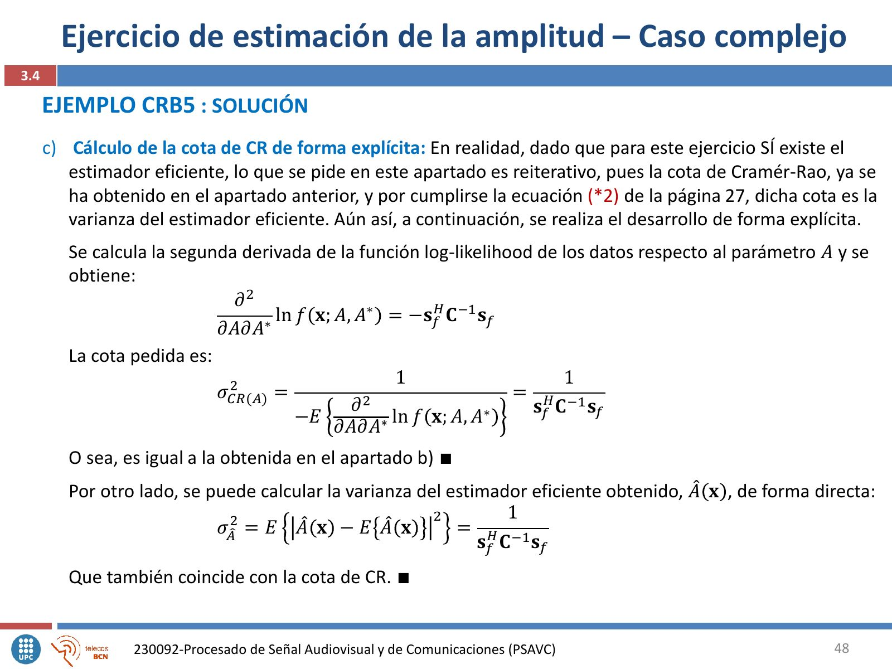

```text
        Ejercicio de estimación de la amplitud – Caso complejo
3.4

      EJEMPLO CRB5 : SOLUCIÓN
      c) Cálculo de la cota de CR de forma explícita: En realidad, dado que para este ejercicio SÍ existe el
         estimador eficiente, lo que se pide en este apartado es reiterativo, pues la cota de Cramér-Rao, ya se
         ha obtenido en el apartado anterior, y por cumplirse la ecuación (*2) de la página 27, dicha cota es la
         varianza del estimador eficiente. Aún así, a continuación, se realiza el desarrollo de forma explícita.
         Se calcula la segunda derivada de la función log-likelihood de los datos respecto al parámetro 𝐴𝐴 y se
         obtiene:
                                𝜕𝜕 2
                                     ∗
                                       ln 𝑓𝑓 𝐱𝐱; 𝐴𝐴, 𝐴𝐴∗ = −𝐬𝐬𝑓𝑓𝐻𝐻 𝐂𝐂−1 𝐬𝐬𝑓𝑓
                            𝜕𝜕𝐴𝐴𝜕𝜕𝐴𝐴
         La cota pedida es:
                               2                            1                           1
                            𝜎𝜎𝐶𝐶𝐶𝐶(𝐴𝐴) =                                      =
                                                    𝜕𝜕 2                    ∗   𝐬𝐬𝑓𝑓𝐻𝐻 𝐂𝐂−1 𝐬𝐬𝑓𝑓
                                          −𝐸𝐸              ln 𝑓𝑓 𝐱𝐱; 𝐴𝐴, 𝐴𝐴
                                                 𝜕𝜕𝐴𝐴𝜕𝜕𝐴𝐴∗
         O sea, es igual a la obtenida en el apartado b) ∎
         Por otro lado, se puede calcular la varianza del estimador eficiente obtenido, 𝐴𝐴̂ 𝐱𝐱 , de forma directa:
                                                           2        1
                            𝜎𝜎𝐴𝐴2� = 𝐸𝐸 𝐴𝐴̂ 𝐱𝐱 − 𝐸𝐸 𝐴𝐴̂ 𝐱𝐱   = 𝐻𝐻 −1
                                                              𝐬𝐬𝑓𝑓 𝐂𝐂 𝐬𝐬𝑓𝑓
         Que también coincide con la cota de CR. ∎


                 230092-Procesado de Señal Audiovisual y de Comunicaciones (PSAVC)                          48
```

## Page 49

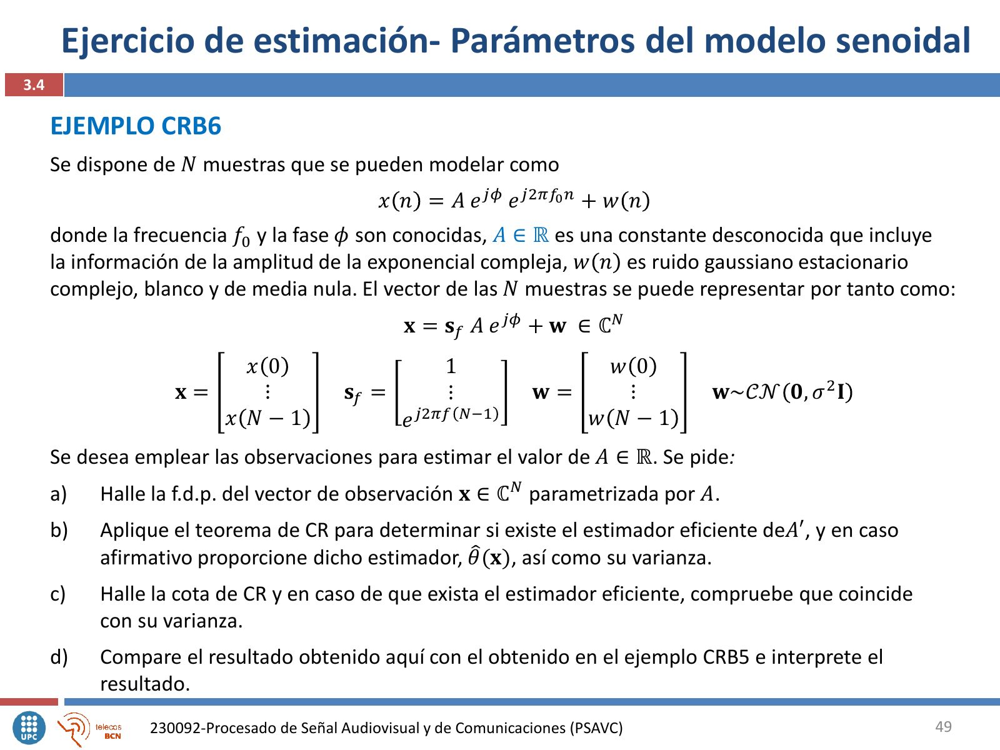

```text
       Ejercicio de estimación- Parámetros del modelo senoidal
3.4

      EJEMPLO CRB6
      Se dispone de 𝑁𝑁 muestras que se pueden modelar como
                                                𝑥𝑥 𝑛𝑛 = 𝐴𝐴 𝑒𝑒 𝑗𝑗𝑗𝑗 𝑒𝑒 𝑗𝑗𝑗𝑗𝑗𝑓𝑓0 𝑛𝑛 + 𝑤𝑤 𝑛𝑛
      donde la frecuencia 𝑓𝑓0 y la fase 𝜙𝜙 son conocidas, 𝐴𝐴 ∈ ℝ es una constante desconocida que incluye
      la información de la amplitud de la exponencial compleja, 𝑤𝑤 𝑛𝑛 es ruido gaussiano estacionario
      complejo, blanco y de media nula. El vector de las 𝑁𝑁 muestras se puede representar por tanto como:
                                                    𝐱𝐱 = 𝐬𝐬𝑓𝑓 𝐴𝐴 𝑒𝑒 𝑗𝑗𝑗𝑗 + 𝐰𝐰 ∈ ℂ𝑁𝑁
                            𝑥𝑥 0                           1                   𝑤𝑤 0
                    𝐱𝐱 =       ⋮           𝐬𝐬𝑓𝑓 =          ⋮           𝐰𝐰 =      ⋮          𝐰𝐰~𝒞𝒞𝒞𝒞 𝟎𝟎, 𝜎𝜎 2 𝐈𝐈
                         𝑥𝑥 𝑁𝑁 − 1                  𝑒𝑒 𝑗𝑗𝑗𝑗𝑗𝑗𝑗 𝑁𝑁−1         𝑤𝑤 𝑁𝑁 − 1
      Se desea emplear las observaciones para estimar el valor de 𝐴𝐴 ∈ ℝ. Se pide:
      a)   Halle la f.d.p. del vector de observación 𝐱𝐱 ∈ ℂ𝑁𝑁 parametrizada por 𝐴𝐴.
      b)   Aplique el teorema de CR para determinar si existe el estimador eficiente de𝐴𝐴𝐴, y en caso
                                                    �
           afirmativo proporcione dicho estimador, 𝜃𝜃(𝐱𝐱), así como su varianza.
      c)   Halle la cota de CR y en caso de que exista el estimador eficiente, compruebe que coincide
           con su varianza.
      d)   Compare el resultado obtenido aquí con el obtenido en el ejemplo CRB5 e interprete el
           resultado.
                 230092-Procesado de Señal Audiovisual y de Comunicaciones (PSAVC)                                49
```

## Page 50

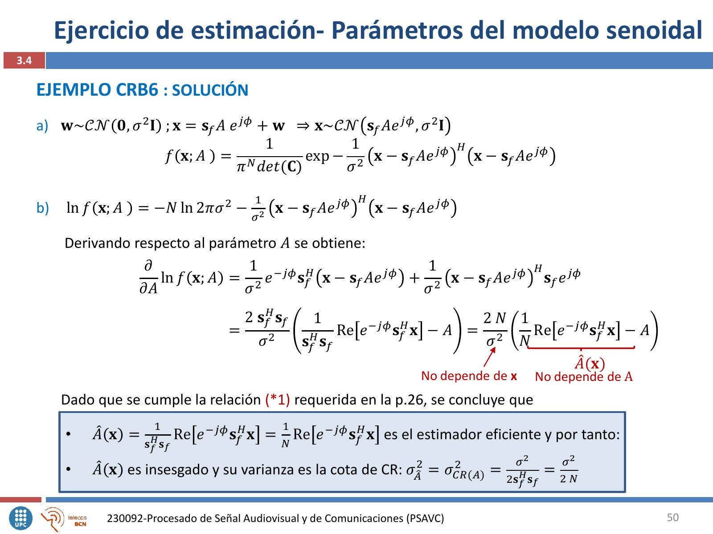

```text
           Ejercicio de estimación- Parámetros del modelo senoidal
3.4

      EJEMPLO CRB6 : SOLUCIÓN
      a) 𝐰𝐰~𝒞𝒞𝒞𝒞 𝟎𝟎, 𝜎𝜎 2 𝐈𝐈 ; 𝐱𝐱 = 𝐬𝐬𝑓𝑓 𝐴𝐴 𝑒𝑒 𝑗𝑗𝑗𝑗 + 𝐰𝐰 ⇒ 𝐱𝐱~𝒞𝒞𝒞𝒞 𝐬𝐬𝑓𝑓 𝐴𝐴𝑒𝑒 𝑗𝑗𝑗𝑗 , 𝜎𝜎 2 𝐈𝐈
                                                     1            1                         𝐻𝐻
                             𝑓𝑓 𝐱𝐱; 𝐴𝐴 = 𝑁𝑁                 exp − 2 𝐱𝐱 − 𝐬𝐬𝑓𝑓 𝐴𝐴𝑒𝑒 𝑗𝑗𝑗𝑗        𝐱𝐱 − 𝐬𝐬𝑓𝑓 𝐴𝐴𝑒𝑒 𝑗𝑗𝑗𝑗
                                              𝜋𝜋 𝑑𝑑𝑑𝑑𝑑𝑑(𝐂𝐂)      𝜎𝜎

                                                    1                          𝐻𝐻
      b)    ln 𝑓𝑓 𝐱𝐱; 𝐴𝐴 = −𝑁𝑁 ln 2𝜋𝜋𝜎𝜎 2 −              𝐱𝐱 − 𝐬𝐬𝑓𝑓 𝐴𝐴𝑒𝑒 𝑗𝑗𝑗𝑗        𝐱𝐱 − 𝐬𝐬𝑓𝑓 𝐴𝐴𝑒𝑒 𝑗𝑗𝑗𝑗
                                                   𝜎𝜎2

           Derivando respecto al parámetro 𝐴𝐴 se obtiene:
                       𝜕𝜕                 1                                       1                    𝐻𝐻
                           ln 𝑓𝑓 𝐱𝐱; 𝐴𝐴 = 2 𝑒𝑒 −𝑗𝑗𝑗𝑗 𝐬𝐬𝑓𝑓𝐻𝐻 𝐱𝐱 − 𝐬𝐬𝑓𝑓 𝐴𝐴𝑒𝑒 𝑗𝑗𝑗𝑗 + 2 𝐱𝐱 − 𝐬𝐬𝑓𝑓 𝐴𝐴𝑒𝑒 𝑗𝑗𝑗𝑗 𝐬𝐬𝑓𝑓 𝑒𝑒 𝑗𝑗𝑗𝑗
                      𝜕𝜕𝐴𝐴               𝜎𝜎                                      𝜎𝜎
                                                2 𝐬𝐬𝑓𝑓𝐻𝐻 𝐬𝐬𝑓𝑓    1            −𝑗𝑗𝑗𝑗 𝐻𝐻
                                                                                                  2 𝑁𝑁 1
                                              =        2        𝐻𝐻      Re 𝑒𝑒      𝐬𝐬𝑓𝑓 𝐱𝐱 − 𝐴𝐴 =   2
                                                                                                         Re 𝑒𝑒 −𝑗𝑗𝑗𝑗 𝐬𝐬𝑓𝑓𝐻𝐻 𝐱𝐱 − 𝐴𝐴
                                                  𝜎𝜎          𝐬𝐬𝑓𝑓 𝐬𝐬𝑓𝑓                           𝜎𝜎 𝑁𝑁
                                                                                                                  ̂
                                                                                                                𝐴𝐴(𝐱𝐱)
                                                                                               No depende de x      No depende de A
           Dado que se cumple la relación (*1) requerida en la p.26, se concluye que
                           1                        1
            •    𝐴𝐴̂ 𝐱𝐱 = 𝐻𝐻 Re 𝑒𝑒 −𝑗𝑗𝑗𝑗 𝐬𝐬𝑓𝑓𝐻𝐻 𝐱𝐱 = Re 𝑒𝑒 −𝑗𝑗𝑗𝑗 𝐬𝐬𝑓𝑓𝐻𝐻 𝐱𝐱 es el estimador eficiente y por tanto:
                            𝐬𝐬𝑓𝑓 𝐬𝐬𝑓𝑓                     𝑁𝑁
                                                                                                              𝜎𝜎2          𝜎𝜎2
            •    𝐴𝐴̂ 𝐱𝐱 es insesgado y su varianza es la cota de CR: 𝜎𝜎𝐴𝐴2� = 𝜎𝜎𝐶𝐶𝐶𝐶(𝐴𝐴)
                                                                                 2
                                                                                         =                               =
                                                                                                            2𝐬𝐬𝑓𝑓𝐻𝐻 𝐬𝐬𝑓𝑓   2 𝑁𝑁


                    230092-Procesado de Señal Audiovisual y de Comunicaciones (PSAVC)                                                 50
```

## Page 51

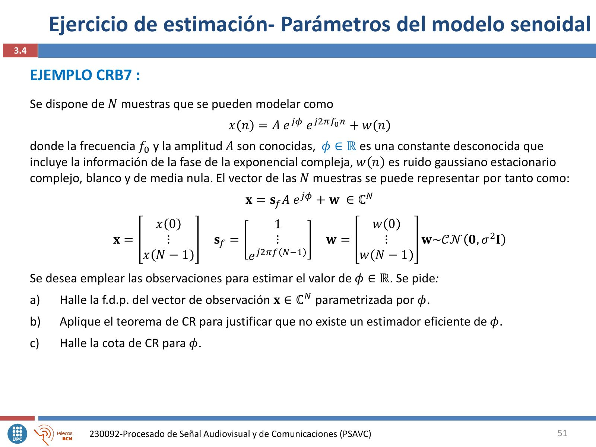

```text
           Ejercicio de estimación- Parámetros del modelo senoidal
3.4

      EJEMPLO CRB7 :
      Se dispone de 𝑁𝑁 muestras que se pueden modelar como
                                                 𝑥𝑥 𝑛𝑛 = 𝐴𝐴 𝑒𝑒 𝑗𝑗𝑗𝑗 𝑒𝑒 𝑗𝑗𝑗𝑗𝑗𝑓𝑓0 𝑛𝑛 + 𝑤𝑤 𝑛𝑛
      donde la frecuencia 𝑓𝑓0 y la amplitud 𝐴𝐴 son conocidas, 𝜙𝜙 ∈ ℝ es una constante desconocida que
      incluye la información de la fase de la exponencial compleja, 𝑤𝑤 𝑛𝑛 es ruido gaussiano estacionario
      complejo, blanco y de media nula. El vector de las 𝑁𝑁 muestras se puede representar por tanto como:
                                                      𝐱𝐱 = 𝐬𝐬𝑓𝑓 𝐴𝐴 𝑒𝑒 𝑗𝑗𝑗𝑗 + 𝐰𝐰 ∈ ℂ𝑁𝑁
                              𝑥𝑥 0                           1                    𝑤𝑤 0
                      𝐱𝐱 =       ⋮           𝐬𝐬𝑓𝑓 =          ⋮            𝐰𝐰 =      ⋮    𝐰𝐰~𝒞𝒞𝒞𝒞 𝟎𝟎, 𝜎𝜎 2 𝐈𝐈
                           𝑥𝑥 𝑁𝑁 − 1                  𝑒𝑒 𝑗𝑗𝑗𝑗𝑗𝑗𝑗 𝑁𝑁−1          𝑤𝑤 𝑁𝑁 − 1
      Se desea emplear las observaciones para estimar el valor de 𝜙𝜙 ∈ ℝ. Se pide:
      a)    Halle la f.d.p. del vector de observación 𝐱𝐱 ∈ ℂ𝑁𝑁 parametrizada por 𝜙𝜙.
      b)    Aplique el teorema de CR para justificar que no existe un estimador eficiente de 𝜙𝜙.
      c)    Halle la cota de CR para 𝜙𝜙.


                 230092-Procesado de Señal Audiovisual y de Comunicaciones (PSAVC)                             51
```

## Page 52

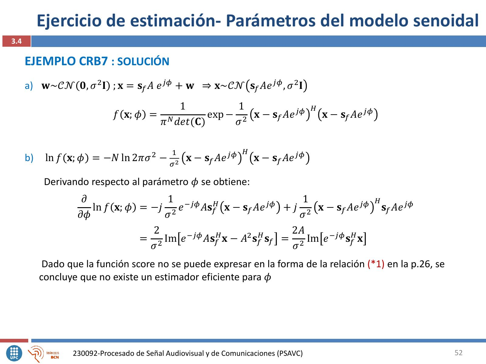

```text
           Ejercicio de estimación- Parámetros del modelo senoidal
3.4

      EJEMPLO CRB7 : SOLUCIÓN
      a) 𝐰𝐰~𝒞𝒞𝒞𝒞 𝟎𝟎, 𝜎𝜎 2 𝐈𝐈 ; 𝐱𝐱 = 𝐬𝐬𝑓𝑓 𝐴𝐴 𝑒𝑒 𝑗𝑗𝑗𝑗 + 𝐰𝐰 ⇒ 𝐱𝐱~𝒞𝒞𝒞𝒞 𝐬𝐬𝑓𝑓 𝐴𝐴𝑒𝑒 𝑗𝑗𝑗𝑗 , 𝜎𝜎 2 𝐈𝐈
                                                    1               1                  𝑗𝑗𝑗𝑗 𝐻𝐻
                                 𝑓𝑓 𝐱𝐱; 𝜙𝜙 =     𝑁𝑁
                                                             exp −    2
                                                                        𝐱𝐱 − 𝐬𝐬𝑓𝑓 𝐴𝐴𝑒𝑒         𝐱𝐱 − 𝐬𝐬𝑓𝑓 𝐴𝐴𝑒𝑒 𝑗𝑗𝑗𝑗
                                               𝜋𝜋 𝑑𝑑𝑑𝑑𝑑𝑑(𝐂𝐂)       𝜎𝜎

                                                   1                          𝐻𝐻
      b)    ln 𝑓𝑓 𝐱𝐱; 𝜙𝜙 = −𝑁𝑁 ln 2𝜋𝜋𝜎𝜎 2 −             𝐱𝐱 − 𝐬𝐬𝑓𝑓 𝐴𝐴𝑒𝑒 𝑗𝑗𝑗𝑗        𝐱𝐱 − 𝐬𝐬𝑓𝑓 𝐴𝐴𝑒𝑒 𝑗𝑗𝑗𝑗
                                                  𝜎𝜎2

            Derivando respecto al parámetro 𝜙𝜙 se obtiene:
                       𝜕𝜕                     1                                             1                   𝐻𝐻
                           ln 𝑓𝑓 𝐱𝐱; 𝜙𝜙 = −𝑗𝑗 2 𝑒𝑒 −𝑗𝑗𝑗𝑗 𝐴𝐴𝐬𝐬𝑓𝑓𝐻𝐻 𝐱𝐱 − 𝐬𝐬𝑓𝑓 𝐴𝐴𝑒𝑒 𝑗𝑗𝑗𝑗 + 𝑗𝑗 2 𝐱𝐱 − 𝐬𝐬𝑓𝑓 𝐴𝐴𝑒𝑒 𝑗𝑗𝑗𝑗 𝐬𝐬𝑓𝑓 𝐴𝐴𝑒𝑒 𝑗𝑗𝑗𝑗
                      𝜕𝜕𝜙𝜙                   𝜎𝜎                                            𝜎𝜎
                                           2                                           2𝐴𝐴
                                        = 2 Im 𝑒𝑒 −𝑗𝑗𝑗𝑗 𝐴𝐴𝐬𝐬𝑓𝑓𝐻𝐻 𝐱𝐱 − 𝐴𝐴2 𝐬𝐬𝑓𝑓𝐻𝐻 𝐬𝐬𝑓𝑓 = 2 Im 𝑒𝑒 −𝑗𝑗𝑗𝑗 𝐬𝐬𝑓𝑓𝐻𝐻 𝐱𝐱
                                          𝜎𝜎                                            𝜎𝜎
            Dado que la función score no se puede expresar en la forma de la relación (*1) en la p.26, se
           concluye que no existe un estimador eficiente para 𝜙𝜙


                    230092-Procesado de Señal Audiovisual y de Comunicaciones (PSAVC)                                             52
```

## Page 53

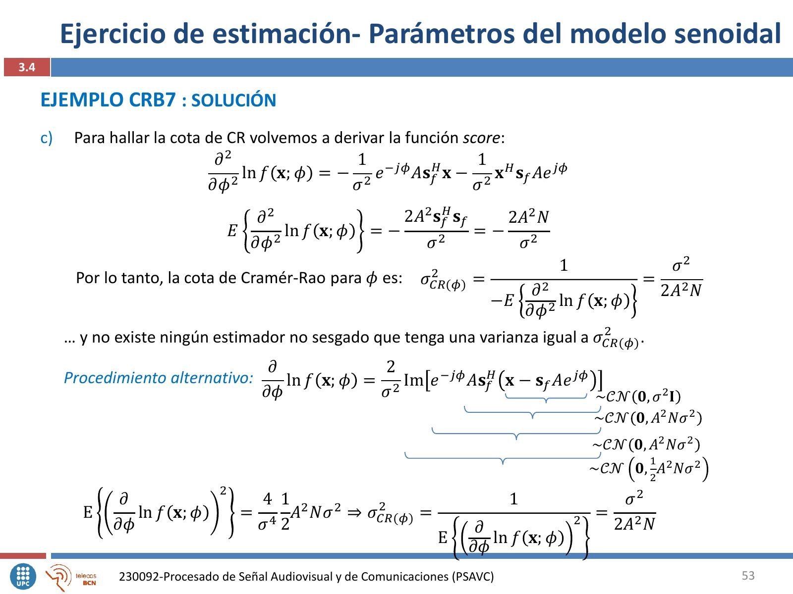

```text
           Ejercicio de estimación- Parámetros del modelo senoidal
3.4

      EJEMPLO CRB7 : SOLUCIÓN
      c)    Para hallar la cota de CR volvemos a derivar la función score:
                                 𝜕𝜕 2                    1 −𝑗𝑗𝑗𝑗 𝐻𝐻          1 𝐻𝐻
                                     2
                                       ln 𝑓𝑓 𝐱𝐱; 𝜙𝜙 = −    2
                                                             𝑒𝑒 𝐴𝐴𝐬𝐬𝑓𝑓 𝐱𝐱 −    2
                                                                                 𝐱𝐱 𝐬𝐬𝑓𝑓 𝐴𝐴𝑒𝑒 𝑗𝑗𝑗𝑗
                                𝜕𝜕𝜙𝜙                    𝜎𝜎                  𝜎𝜎
                                          𝜕𝜕 2                      2𝐴𝐴2 𝐬𝐬𝑓𝑓𝐻𝐻 𝐬𝐬𝑓𝑓   2𝐴𝐴2 𝑁𝑁
                                      𝐸𝐸        ln 𝑓𝑓 𝐱𝐱; 𝜙𝜙     =−                  =− 2
                                         𝜕𝜕𝜙𝜙 2                        𝜎𝜎 2             𝜎𝜎
                                                                              2                          1                  𝜎𝜎 2
            Por lo tanto, la cota de Cramér-Rao para 𝜙𝜙 es:                𝜎𝜎𝐶𝐶𝐶𝐶(𝜙𝜙) =                                   = 2
                                                                                                 𝜕𝜕 2                      2𝐴𝐴 𝑁𝑁
                                                                                          −𝐸𝐸          ln 𝑓𝑓 𝐱𝐱; 𝜙𝜙
                                                                                                𝜕𝜕𝜙𝜙 2
                                                                                       2
           … y no existe ningún estimador no sesgado que tenga una varianza igual a 𝜎𝜎𝐶𝐶𝐶𝐶(𝜙𝜙) .
                                              𝜕𝜕                 2
           Procedimiento alternativo:             ln 𝑓𝑓 𝐱𝐱; 𝜙𝜙 = 2 Im 𝑒𝑒 −𝑗𝑗𝑗𝑗 𝐴𝐴𝐬𝐬𝑓𝑓𝐻𝐻 𝐱𝐱 − 𝐬𝐬𝑓𝑓 𝐴𝐴𝑒𝑒 𝑗𝑗𝑗𝑗
                                             𝜕𝜕𝜙𝜙               𝜎𝜎                                          ~𝒞𝒞𝒞𝒞 𝟎𝟎, 𝜎𝜎 2 𝐈𝐈
                                                                                                                 ~𝒞𝒞𝒞𝒞 𝟎𝟎, 𝐴𝐴2 𝑁𝑁𝜎𝜎 2
                                                                                                                 ~𝒞𝒞𝒞𝒞 𝟎𝟎, 𝐴𝐴2 𝑁𝑁𝜎𝜎 2
                                                                                                                            1
                                                                                                                 ~𝒞𝒞𝒞𝒞 𝟎𝟎, 𝐴𝐴2 𝑁𝑁𝜎𝜎 2
                                                                                                                            2
                                      2
                   𝜕𝜕                       4 1               2                             1                       𝜎𝜎 2
             E         ln 𝑓𝑓 𝐱𝐱; 𝜙𝜙       = 4 𝐴𝐴2 𝑁𝑁𝜎𝜎 2 ⇒ 𝜎𝜎𝐶𝐶𝐶𝐶(𝜙𝜙) =                                      2
                                                                                                                  = 2
                  𝜕𝜕𝜙𝜙                     𝜎𝜎 2                                       𝜕𝜕                           2𝐴𝐴 𝑁𝑁
                                                                               E          ln 𝑓𝑓 𝐱𝐱; 𝜙𝜙
                                                                                     𝜕𝜕𝜙𝜙
                   230092-Procesado de Señal Audiovisual y de Comunicaciones (PSAVC)                                                    53
```

## Page 54

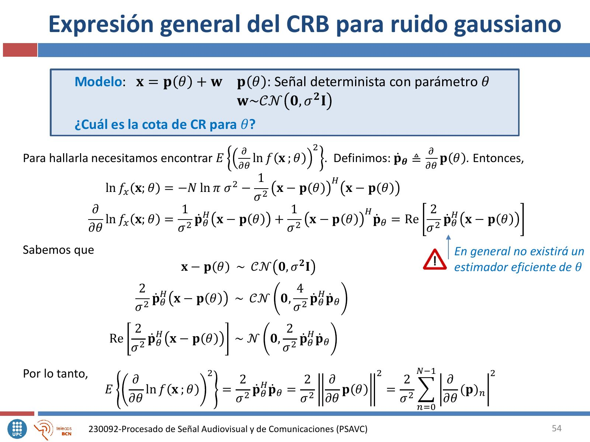

```text
     Expresión general del CRB para ruido gaussiano

          Modelo: 𝐱𝐱 = 𝐩𝐩 𝜃𝜃 + 𝐰𝐰 𝐩𝐩 𝜃𝜃 : Señal determinista con parámetro 𝜃𝜃
                                  𝐰𝐰~𝒞𝒞𝒞𝒞 𝟎𝟎, 𝜎𝜎 𝟐𝟐 𝐈𝐈
          ¿Cuál es la cota de CR para 𝜃𝜃?
                                                      𝜕𝜕                   2                            𝜕𝜕
Para hallarla necesitamos encontrar 𝐸𝐸                    ln 𝑓𝑓 𝐱𝐱 ; 𝜃𝜃        . Definimos: 𝐩𝐩̇ 𝜽𝜽 ≜        𝐩𝐩 𝜃𝜃 . Entonces,
                                                     𝜕𝜕𝜕𝜕                                              𝜕𝜕𝜃𝜃
                                                    1                  𝐻𝐻
                   ln 𝑓𝑓𝑥𝑥 𝐱𝐱; 𝜃𝜃 = −𝑁𝑁 ln 𝜋𝜋 𝜎𝜎 2 −    𝐱𝐱 −   𝐩𝐩  𝜃𝜃     𝐱𝐱 − 𝐩𝐩 𝜃𝜃
                                                   𝜎𝜎 2
             𝜕𝜕                   1                         1                 𝐻𝐻              2 𝐻𝐻
                 ln 𝑓𝑓𝑥𝑥 𝐱𝐱; 𝜃𝜃 = 2 𝐩𝐩̇ 𝐻𝐻 𝐱𝐱 − 𝐩𝐩 𝜃𝜃   +         𝐱𝐱 − 𝐩𝐩 𝜃𝜃     𝐩𝐩̇ 𝜃𝜃 = Re     𝐩𝐩̇ 𝐱𝐱 − 𝐩𝐩 𝜃𝜃
            𝜕𝜕𝜃𝜃                 𝜎𝜎 𝜃𝜃                     𝜎𝜎 2                              𝜎𝜎 2 𝜃𝜃
Sabemos que                                                                                                  En general no existirá un
                                                                      𝟐𝟐
                                       𝐱𝐱 − 𝐩𝐩 𝜃𝜃 ~ 𝒞𝒞𝒞𝒞 𝟎𝟎, 𝜎𝜎 𝐈𝐈                                           estimador eficiente de 𝜃𝜃
                           2 𝐻𝐻                                      4 𝐻𝐻
                              𝐩𝐩̇ 𝐱𝐱 − 𝐩𝐩 𝜃𝜃        ~ 𝒞𝒞𝒞𝒞 𝟎𝟎,          𝐩𝐩̇ 𝐩𝐩̇
                          𝜎𝜎 2 𝜃𝜃                                   𝜎𝜎 2 𝜃𝜃 𝜃𝜃
                          2 𝐻𝐻                                    2 𝐻𝐻
                    Re       𝐩𝐩̇ 𝐱𝐱 − 𝐩𝐩 𝜃𝜃         ~ 𝒩𝒩 𝟎𝟎,         𝐩𝐩̇ 𝐩𝐩̇
                         𝜎𝜎 2 𝜃𝜃                                 𝜎𝜎 2 𝜃𝜃 𝜃𝜃

Por lo tanto,             𝜕𝜕
                                              2
                                                    2              2 𝜕𝜕
                                                                                          2
                                                                                                2
                                                                                                  𝑁𝑁−1
                                                                                                    𝜕𝜕
                                                                                                                     2
                   𝐸𝐸         ln 𝑓𝑓 𝐱𝐱 ; 𝜃𝜃       = 2 𝐩𝐩̇ 𝐻𝐻 𝐩𝐩̇ =      𝐩𝐩 𝜃𝜃                 = 2�      (𝐩𝐩)𝑛𝑛
                         𝜕𝜕𝜕𝜕                      𝜎𝜎 𝜃𝜃 𝜃𝜃 𝜎𝜎 2 𝜕𝜕𝜃𝜃                          𝜎𝜎  𝜕𝜕𝜃𝜃
                                                                                                   𝑛𝑛=0

                230092-Procesado de Señal Audiovisual y de Comunicaciones (PSAVC)                                               54
```

## Page 55

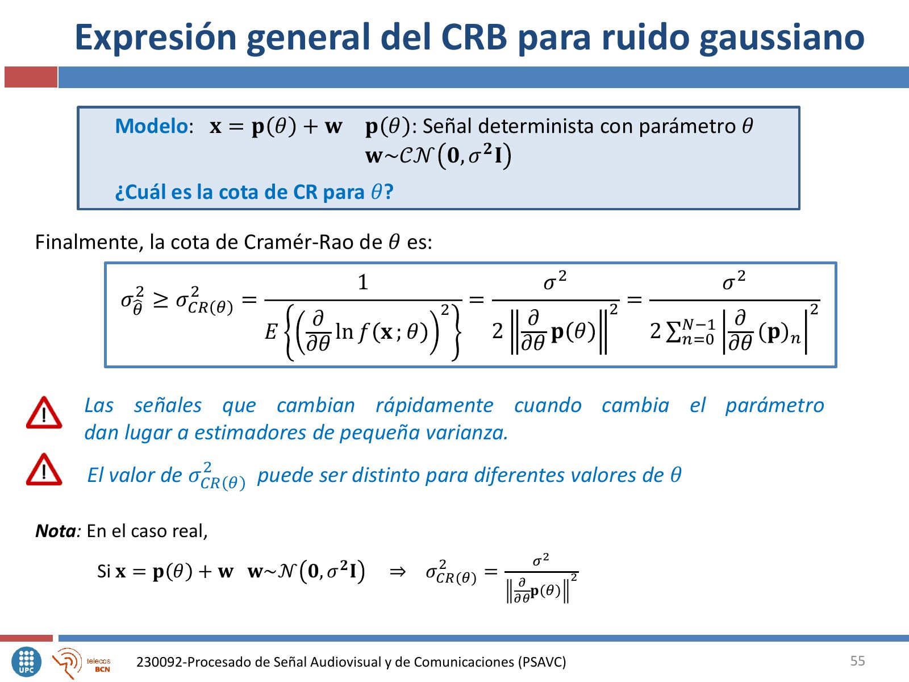

```text
    Expresión general del CRB para ruido gaussiano

          Modelo: 𝐱𝐱 = 𝐩𝐩 𝜃𝜃 + 𝐰𝐰 𝐩𝐩 𝜃𝜃 : Señal determinista con parámetro 𝜃𝜃
                                  𝐰𝐰~𝒞𝒞𝒞𝒞 𝟎𝟎, 𝜎𝜎 𝟐𝟐 𝐈𝐈
          ¿Cuál es la cota de CR para 𝜃𝜃?

Finalmente, la cota de Cramér-Rao de 𝜃𝜃 es:
                                                  1                                 𝜎𝜎 2                      𝜎𝜎 2
          𝜎𝜎𝜃𝜃�2 ≥ 𝜎𝜎𝐶𝐶𝐶𝐶
                      2
                          𝜃𝜃   =                               2
                                                                     =                         2 =                         2
                                         𝜕𝜕                                 𝜕𝜕                                𝜕𝜕
                                   𝐸𝐸        ln 𝑓𝑓 𝐱𝐱 ; 𝜃𝜃               2      𝐩𝐩 𝜃𝜃                2 ∑𝑁𝑁−1
                                                                                                        𝑛𝑛=0 𝜕𝜕𝜃𝜃 (𝐩𝐩)𝑛𝑛
                                        𝜕𝜕𝜕𝜕                               𝜕𝜕𝜃𝜃

      Las señales que cambian rápidamente cuando cambia el parámetro
      dan lugar a estimadores de pequeña varianza.
                     2
      El valor de 𝜎𝜎𝐶𝐶𝐶𝐶 𝜃𝜃 puede ser distinto para diferentes valores de 𝜃𝜃

Nota: En el caso real,
                                             𝟐𝟐                 2                𝜎𝜎2
       Si 𝐱𝐱 = 𝐩𝐩 𝜃𝜃 + 𝐰𝐰 𝐰𝐰~𝒩𝒩 𝟎𝟎, 𝜎𝜎 𝐈𝐈             ⇒      𝜎𝜎𝐶𝐶𝐶𝐶 𝜃𝜃   =    𝜕𝜕           2
                                                                                  𝐩𝐩 𝜃𝜃
                                                                             𝜕𝜕𝜃𝜃


            230092-Procesado de Señal Audiovisual y de Comunicaciones (PSAVC)                                                  55
```

## Page 56

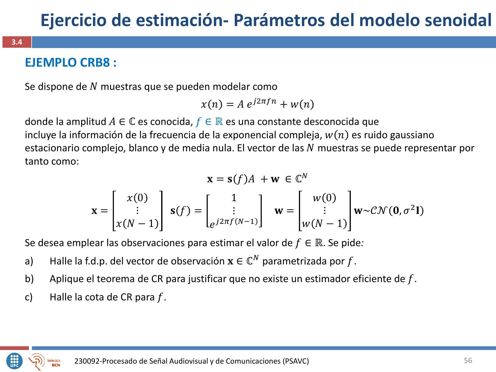

```text
           Ejercicio de estimación- Parámetros del modelo senoidal
3.4

      EJEMPLO CRB8 :
      Se dispone de 𝑁𝑁 muestras que se pueden modelar como
                                                    𝑥𝑥 𝑛𝑛 = 𝐴𝐴 𝑒𝑒 𝑗𝑗𝑗𝑗𝑗𝑗𝑗𝑗𝑗 + 𝑤𝑤 𝑛𝑛
      donde la amplitud 𝐴𝐴 ∈ ℂ es conocida, 𝑓𝑓 ∈ ℝ es una constante desconocida que
      incluye la información de la frecuencia de la exponencial compleja, 𝑤𝑤 𝑛𝑛 es ruido gaussiano
      estacionario complejo, blanco y de media nula. El vector de las 𝑁𝑁 muestras se puede representar por
      tanto como:
                                                     𝐱𝐱 = 𝐬𝐬 𝑓𝑓 𝐴𝐴 + 𝐰𝐰 ∈ ℂ𝑁𝑁
                              𝑥𝑥 0                           1                  𝑤𝑤 0
                      𝐱𝐱 =       ⋮         𝐬𝐬 𝑓𝑓 =           ⋮          𝐰𝐰 =      ⋮    𝐰𝐰~𝒞𝒞𝒞𝒞 𝟎𝟎, 𝜎𝜎 2 𝐈𝐈
                           𝑥𝑥 𝑁𝑁 − 1                  𝑒𝑒 𝑗𝑗𝑗𝑗𝑗𝑗𝑗 𝑁𝑁−1        𝑤𝑤 𝑁𝑁 − 1
      Se desea emplear las observaciones para estimar el valor de 𝑓𝑓 ∈ ℝ. Se pide:
      a)    Halle la f.d.p. del vector de observación 𝐱𝐱 ∈ ℂ𝑁𝑁 parametrizada por 𝑓𝑓.
      b)    Aplique el teorema de CR para justificar que no existe un estimador eficiente de 𝑓𝑓.
      c)    Halle la cota de CR para 𝑓𝑓.


                 230092-Procesado de Señal Audiovisual y de Comunicaciones (PSAVC)                           56
```

## Page 57

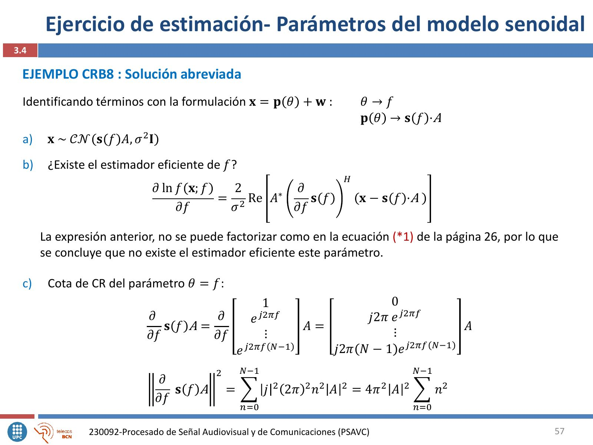

```text
        Ejercicio de estimación- Parámetros del modelo senoidal
3.4

  EJEMPLO CRB8 : Solución abreviada
  Identificando términos con la formulación 𝐱𝐱 = 𝐩𝐩 𝜃𝜃 + 𝐰𝐰 :                             𝜃𝜃 → 𝑓𝑓
                                                                                          𝐩𝐩 𝜃𝜃 → 𝐬𝐬 𝑓𝑓 ·A
  a)    𝐱𝐱 ~ 𝒞𝒞𝒩𝒩 𝐬𝐬 𝑓𝑓 𝐴𝐴, 𝜎𝜎 2 𝐈𝐈
  b)    ¿Existe el estimador eficiente de 𝑓𝑓?
                                                                                     𝐻𝐻
                                  𝜕𝜕 ln 𝑓𝑓 𝐱𝐱; 𝑓𝑓   2         𝜕𝜕
                                                  = 2 Re 𝐴𝐴∗      𝐬𝐬 𝑓𝑓                   𝐱𝐱 − 𝐬𝐬 𝑓𝑓 ·A
                                        𝜕𝜕𝑓𝑓       𝜎𝜎        𝜕𝜕𝜕𝜕

       La expresión anterior, no se puede factorizar como en la ecuación (*1) de la página 26, por lo que
       se concluye que no existe el estimador eficiente este parámetro.

  c)    Cota de CR del parámetro 𝜃𝜃 = 𝑓𝑓:
                                                                  1                             0
                                  𝜕𝜕             𝜕𝜕           𝑒𝑒 𝑗𝑗𝑗𝑗𝑗𝑗𝑗                  𝑗𝑗𝑗𝑗𝑗 𝑒𝑒 𝑗𝑗𝑗𝑗𝑗𝑗𝑗
                                      𝐬𝐬 𝑓𝑓 A =                              𝐴𝐴 =                              𝐴𝐴
                                 𝜕𝜕𝑓𝑓           𝜕𝜕𝑓𝑓               ⋮                            ⋮
                                                           𝑒𝑒 𝑗𝑗𝑗𝑗𝑗𝑗𝑗 𝑁𝑁−1        𝑗𝑗𝑗𝑗𝑗 𝑁𝑁 − 1 𝑒𝑒 𝑗𝑗𝑗𝑗𝑗𝑗𝑗 𝑁𝑁−1
                                                     2     𝑁𝑁−1                                      𝑁𝑁−1
                                       𝜕𝜕
                                           𝐬𝐬 𝑓𝑓 A       = � 𝑗𝑗 2 2𝜋𝜋 2 𝑛𝑛2 𝐴𝐴 2 = 4𝜋𝜋 2 𝐴𝐴 2 � 𝑛𝑛2
                                      𝜕𝜕𝜕𝜕
                                                           𝑛𝑛=0                                      𝑛𝑛=0

                  230092-Procesado de Señal Audiovisual y de Comunicaciones (PSAVC)                                 57
```

## Page 58

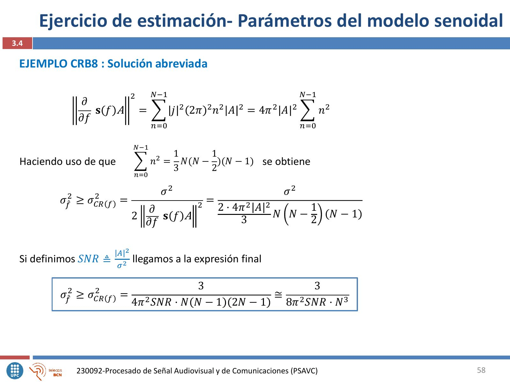

```text
      Ejercicio de estimación- Parámetros del modelo senoidal
3.4

  EJEMPLO CRB8 : Solución abreviada

                                    2      𝑁𝑁−1                                       𝑁𝑁−1
                  𝜕𝜕
                      𝐬𝐬 𝑓𝑓 A           = � 𝑗𝑗 2 2𝜋𝜋 2 𝑛𝑛2 𝐴𝐴 2 = 4𝜋𝜋 2 𝐴𝐴 2 � 𝑛𝑛2
                 𝜕𝜕𝜕𝜕
                                           𝑛𝑛=0                                       𝑛𝑛=0

                                    𝑁𝑁−1
                                           1       1
  Haciendo uso de que               � 𝑛𝑛2 = 𝑁𝑁(𝑁𝑁 − )(𝑁𝑁 − 1) se obtiene
                                           3       2
                                    𝑛𝑛=0

                                             𝜎𝜎 2                              𝜎𝜎 2
           𝜎𝜎𝑓𝑓2̂ ≥ 𝜎𝜎𝐶𝐶𝐶𝐶
                       2
                           𝑓𝑓   =                       2 = 2 · 4𝜋𝜋 2 𝐴𝐴 2
                                          𝜕𝜕                                            1
                                    2         𝐬𝐬 𝑓𝑓 A                        𝑁𝑁 𝑁𝑁 −         𝑁𝑁 − 1
                                         𝜕𝜕𝜕𝜕                     3                     2

                                𝐴𝐴 2
  Si definimos 𝑆𝑆𝑆𝑆𝑆𝑆 ≜              llegamos a la expresión final
                                𝜎𝜎2

                                                       3                        3
           𝜎𝜎𝑓𝑓2̂ ≥ 𝜎𝜎𝐶𝐶𝐶𝐶
                       2
                           𝑓𝑓 =                                      ≅
                                    4𝜋𝜋 2 𝑆𝑆𝑆𝑆𝑆𝑆 · 𝑁𝑁 𝑁𝑁 − 1 2𝑁𝑁 − 1   8𝜋𝜋 2 𝑆𝑆𝑆𝑆𝑆𝑆 · 𝑁𝑁 3


                230092-Procesado de Señal Audiovisual y de Comunicaciones (PSAVC)                     58
```

## Page 59

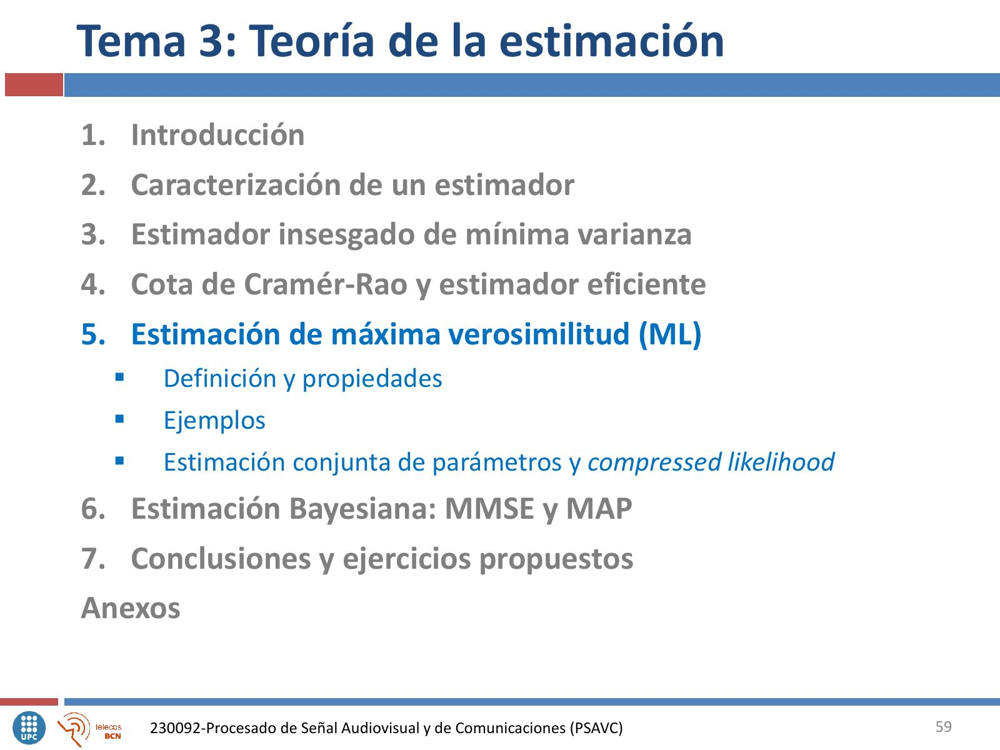

```text
Tema 3: Teoría de la estimación
1.       Introducción
2.       Caracterización de un estimador
3.       Estimador insesgado de mínima varianza
4.       Cota de Cramér-Rao y estimador eficiente
5.       Estimación de máxima verosimilitud (ML)
          Definición y propiedades
          Ejemplos
          Estimación conjunta de parámetros y compressed likelihood
6. Estimación Bayesiana: MMSE y MAP
7. Conclusiones y ejercicios propuestos
Anexos


          230092-Procesado de Señal Audiovisual y de Comunicaciones (PSAVC)   59
```

## Page 60

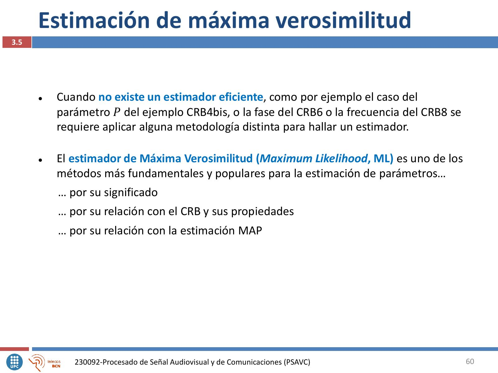

```text
      Estimación de máxima verosimilitud
3.5


      ●   Cuando no existe un estimador eficiente, como por ejemplo el caso del
          parámetro 𝑃𝑃 del ejemplo CRB4bis, o la fase del CRB6 o la frecuencia del CRB8 se
          requiere aplicar alguna metodología distinta para hallar un estimador.

      ●   El estimador de Máxima Verosimilitud (Maximum Likelihood, ML) es uno de los
          métodos más fundamentales y populares para la estimación de parámetros…
          … por su significado
          … por su relación con el CRB y sus propiedades
          … por su relación con la estimación MAP


             230092-Procesado de Señal Audiovisual y de Comunicaciones (PSAVC)               60
```

## Page 61

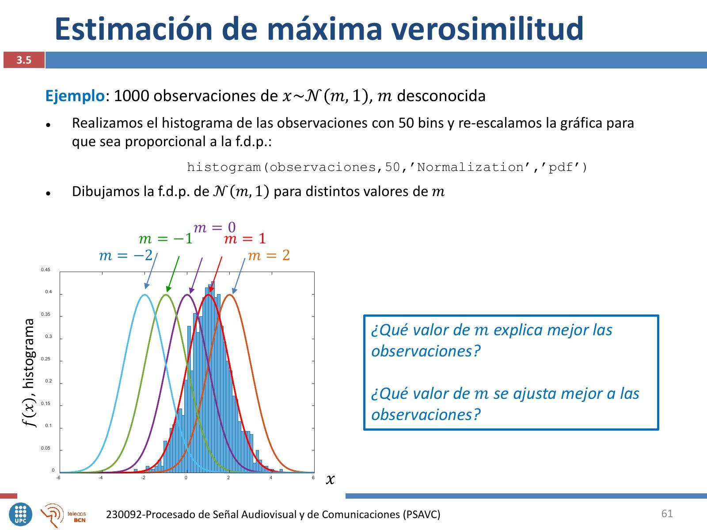

```text
               Estimación de máxima verosimilitud
3.5


         Ejemplo: 1000 observaciones de 𝑥𝑥~𝒩𝒩 𝑚𝑚, 1 , 𝑚𝑚 desconocida
         ●              Realizamos el histograma de las observaciones con 50 bins y re-escalamos la gráfica para
                        que sea proporcional a la f.d.p.:
                                                histogram(observaciones,50,’Normalization’,’pdf’)
         ●              Dibujamos la f.d.p. de 𝒩𝒩 𝑚𝑚, 1 para distintos valores de 𝑚𝑚

                                                    𝑚𝑚 = 0
                                  𝑚𝑚 = −1               𝑚𝑚 = 1
                            𝑚𝑚 = −2                         𝑚𝑚 = 2
       0.45
       0.45


         0.4
         0.4


       0.35
       0.35


                                                                                    ¿Qué valor de 𝑚𝑚 explica mejor las
𝑓𝑓 𝑥𝑥 , histograma
         0.3
         0.3


       0.25
       0.25
                                                                                    observaciones?
         0.2
         0.2


       0.15
       0.15
                                                                                    ¿Qué valor de 𝑚𝑚 se ajusta mejor a las
         0.1
         0.1
                                                                                    observaciones?
       0.05
       0.05


              00
                   -6
                   -6       -4         -2       0       2       44       66
                                                                              𝑥𝑥
                                 230092-Procesado de Señal Audiovisual y de Comunicaciones (PSAVC)                           61
```

## Page 62

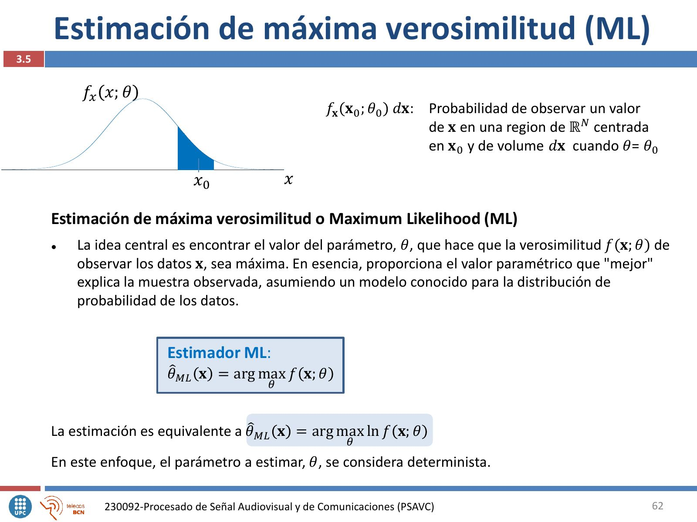

```text
      Estimación de máxima verosimilitud (ML)
3.5


           𝑓𝑓𝑥𝑥 𝑥𝑥; 𝜃𝜃
                                                          𝑓𝑓𝐱𝐱 𝐱𝐱 0 ; 𝜃𝜃0 𝑑𝑑𝐱𝐱: Probabilidad de observar un valor
                                                                                de 𝐱𝐱 en una region de ℝ𝑁𝑁 centrada
                                                                                en 𝐱𝐱 0 y de volume 𝑑𝑑𝐱𝐱 cuando 𝜃𝜃= 𝜃𝜃0

                                𝑥𝑥0                 𝑥𝑥

      Estimación de máxima verosimilitud o Maximum Likelihood (ML)
      ●   La idea central es encontrar el valor del parámetro, 𝜃𝜃, que hace que la verosimilitud 𝑓𝑓 𝐱𝐱; 𝜃𝜃 de
          observar los datos 𝐱𝐱, sea máxima. En esencia, proporciona el valor paramétrico que "mejor"
          explica la muestra observada, asumiendo un modelo conocido para la distribución de
          probabilidad de los datos.


                           Estimador ML:
                           𝜃𝜃�𝑀𝑀𝑀𝑀 𝐱𝐱 = arg max 𝑓𝑓 𝐱𝐱; 𝜃𝜃
                                               𝜃𝜃


      La estimación es equivalente a 𝜃𝜃�𝑀𝑀𝑀𝑀 𝐱𝐱 = arg max ln 𝑓𝑓 𝐱𝐱; 𝜃𝜃
                                                              𝜃𝜃
      En este enfoque, el parámetro a estimar, 𝜃𝜃, se considera determinista.

               230092-Procesado de Señal Audiovisual y de Comunicaciones (PSAVC)                                     62
```

## Page 63

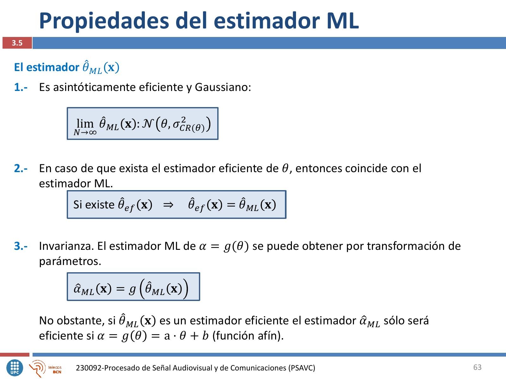

```text
      Propiedades del estimador ML
3.5


El estimador 𝜃𝜃̂𝑀𝑀𝑀𝑀 𝐱𝐱
1.- Es asintóticamente eficiente y Gaussiano:

              lim 𝜃𝜃̂𝑀𝑀𝑀𝑀 𝐱𝐱 : 𝒩𝒩 𝜃𝜃, 𝜎𝜎𝐶𝐶𝐶𝐶(𝜃𝜃)
                                         2
             𝑁𝑁→∞


2.- En caso de que exista el estimador eficiente de 𝜃𝜃, entonces coincide con el
    estimador ML.
          Si existe 𝜃𝜃̂𝑒𝑒𝑒𝑒 𝐱𝐱 ⇒ 𝜃𝜃̂𝑒𝑒𝑒𝑒 𝐱𝐱 = 𝜃𝜃̂𝑀𝑀𝑀𝑀 𝐱𝐱


3.- Invarianza. El estimador ML de 𝛼𝛼 = 𝑔𝑔(𝜃𝜃) se puede obtener por transformación de
    parámetros.

             𝛼𝛼�𝑀𝑀𝑀𝑀 𝐱𝐱 = 𝑔𝑔 𝜃𝜃̂𝑀𝑀𝑀𝑀 𝐱𝐱

      No obstante, si 𝜃𝜃̂𝑀𝑀𝑀𝑀 𝐱𝐱 es un estimador eficiente el estimador 𝛼𝛼�𝑀𝑀𝑀𝑀 sólo será
      eficiente si 𝛼𝛼 = 𝑔𝑔 𝜃𝜃 = a · 𝜃𝜃 + 𝑏𝑏 (función afín).

              230092-Procesado de Señal Audiovisual y de Comunicaciones (PSAVC)             63
```

## Page 64

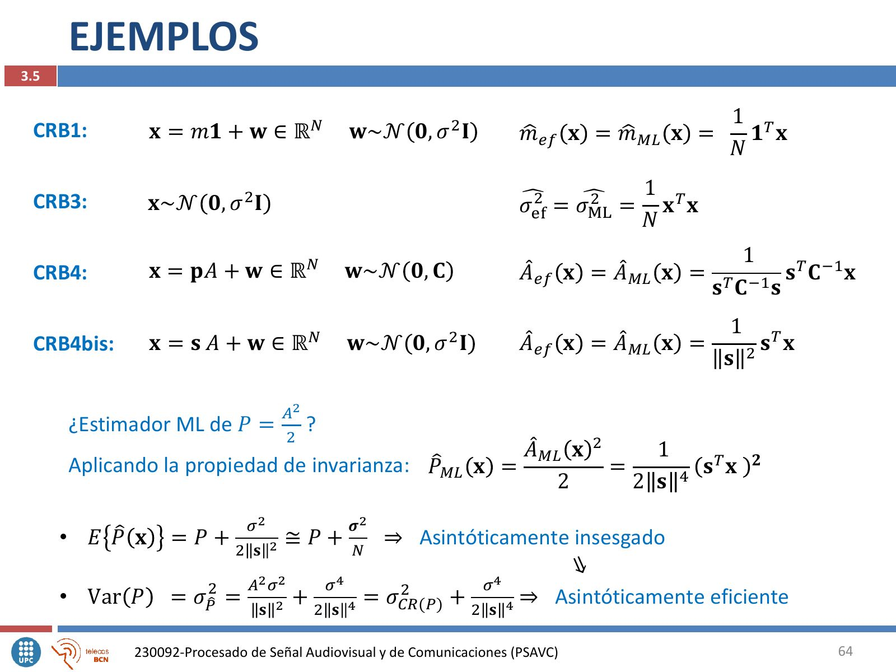

```text
       EJEMPLOS
3.5

                                                                                                  1 𝑇𝑇
 CRB1:              𝐱𝐱 = 𝑚𝑚𝟏𝟏 + 𝐰𝐰 ∈ ℝ𝑁𝑁       𝐰𝐰~𝒩𝒩 𝟎𝟎, 𝜎𝜎 2 𝐈𝐈          𝑚𝑚
                                                                          � 𝑒𝑒𝑒𝑒 𝐱𝐱 = 𝑚𝑚
                                                                                      � 𝑀𝑀𝑀𝑀 𝐱𝐱 =    𝟏𝟏 𝐱𝐱
                                                                                                  𝑁𝑁
                                                                                        1 𝑇𝑇
 CRB3:              𝐱𝐱~𝒩𝒩 𝟎𝟎, 𝜎𝜎 2 𝐈𝐈                                     𝜎𝜎�2
                                                                            ef =  �
                                                                                 𝜎𝜎 2
                                                                                   ML =    𝐱𝐱 𝐱𝐱
                                                                                        𝑁𝑁
                                                                                                             1
 CRB4:              𝐱𝐱 = 𝐩𝐩𝐴𝐴 + 𝐰𝐰 ∈ ℝ𝑁𝑁       𝐰𝐰~𝒩𝒩 𝟎𝟎, 𝐂𝐂               𝐴𝐴̂ 𝑒𝑒𝑒𝑒 𝐱𝐱 = 𝐴𝐴̂ 𝑀𝑀𝑀𝑀 𝐱𝐱 =     𝑇𝑇 −1
                                                                                                                 𝐬𝐬 𝑇𝑇 𝐂𝐂 −1 𝐱𝐱
                                                                                                        𝐬𝐬 𝐂𝐂 𝐬𝐬
                                                                                                          1 𝑇𝑇
 CRB4bis:           𝐱𝐱 = 𝐬𝐬 𝐴𝐴 + 𝐰𝐰 ∈ ℝ𝑁𝑁      𝐰𝐰~𝒩𝒩 𝟎𝟎, 𝜎𝜎 2 𝐈𝐈          𝐴𝐴̂ 𝑒𝑒𝑒𝑒 𝐱𝐱 = 𝐴𝐴̂ 𝑀𝑀𝑀𝑀 𝐱𝐱 =         𝐬𝐬 𝐱𝐱
                                                                                                         𝐬𝐬 2

                             𝐴𝐴2
       ¿Estimador ML de 𝑃𝑃 = 2 ?
                                                          𝐴𝐴̂ 𝑀𝑀𝑀𝑀 𝐱𝐱 2     1
       Aplicando la propiedad de invarianza: 𝑃𝑃�𝑀𝑀𝑀𝑀 𝐱𝐱 =               =      4
                                                                                 𝐬𝐬 𝑇𝑇 𝐱𝐱 𝟐𝟐
                                                                 2        2 𝐬𝐬
                               𝜎𝜎 2         𝝈𝝈2
      • 𝐸𝐸 𝑃𝑃� 𝐱𝐱      = 𝑃𝑃 + 2 𝐬𝐬 2 ≅ 𝑃𝑃 + 𝑁𝑁       ⇒ Asintóticamente insesgado

                            2    𝐴𝐴2 𝜎𝜎2    𝜎𝜎 4       2          𝜎𝜎4
      • Var 𝑃𝑃         = 𝜎𝜎𝑃𝑃� =         +        = 𝜎𝜎𝐶𝐶𝐶𝐶(𝑃𝑃) +        ⇒      Asintóticamente eficiente
                                   𝐬𝐬 2    2 𝐬𝐬 4                2 𝐬𝐬 4

               230092-Procesado de Señal Audiovisual y de Comunicaciones (PSAVC)                                            64
```

## Page 65

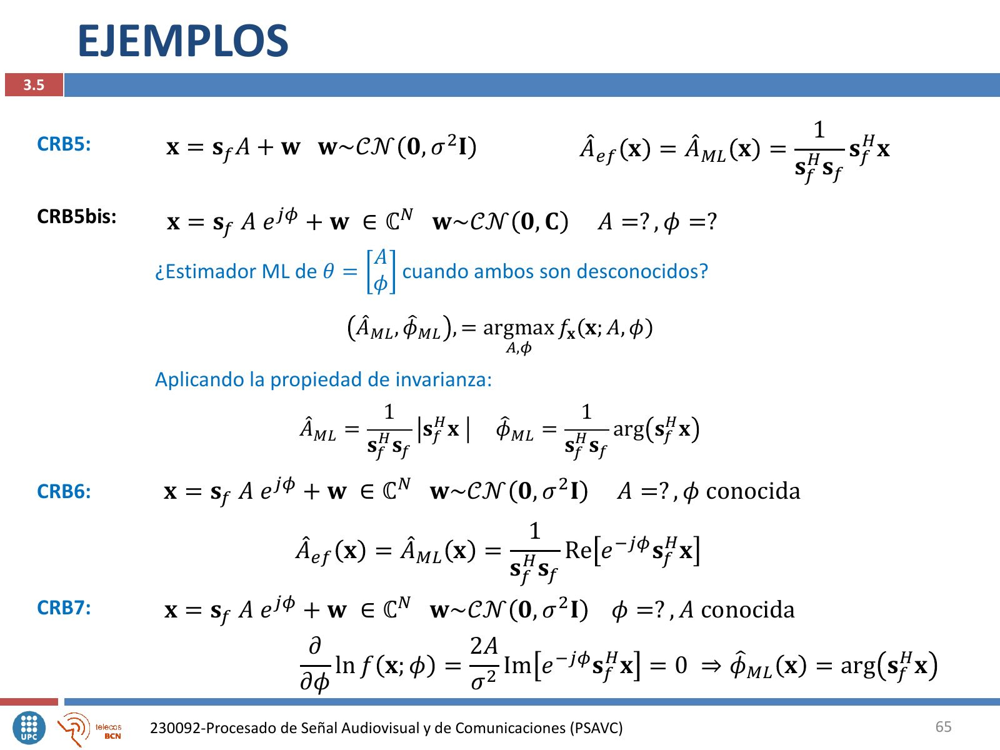

```text
      EJEMPLOS
3.5

                                                                                                              1 𝐻𝐻
 CRB5:        𝐱𝐱 = 𝐬𝐬𝑓𝑓 𝐴𝐴 + 𝐰𝐰 𝐰𝐰~𝒞𝒞𝒞𝒞 𝟎𝟎, 𝜎𝜎 2 𝐈𝐈                        𝐴𝐴̂ 𝑒𝑒𝑒𝑒 𝐱𝐱 = 𝐴𝐴̂ 𝑀𝑀𝑀𝑀 𝐱𝐱 =              𝐬𝐬 𝐱𝐱
                                                                                                         𝐬𝐬𝑓𝑓𝐻𝐻 𝐬𝐬𝑓𝑓 𝑓𝑓
 CRB5bis:     𝐱𝐱 = 𝐬𝐬𝑓𝑓 𝐴𝐴 𝑒𝑒 𝑗𝑗𝑗𝑗 + 𝐰𝐰 ∈ ℂ𝑁𝑁 𝐰𝐰~𝒞𝒞𝒞𝒞 𝟎𝟎, 𝐂𝐂                  𝐴𝐴 =? , 𝜙𝜙 =?
                                          𝐴𝐴
            ¿Estimador ML de 𝜃𝜃 =            cuando ambos son desconocidos?
                                          𝜙𝜙

                                        𝐴𝐴̂ 𝑀𝑀𝑀𝑀 , 𝜙𝜙� 𝑀𝑀𝑀𝑀 , = argmax 𝑓𝑓𝐱𝐱 𝐱𝐱; 𝐴𝐴, 𝜙𝜙
                                                               𝐴𝐴,𝜙𝜙

            Aplicando la propiedad de invarianza:
                                         1                       1
                            𝐴𝐴̂ 𝑀𝑀𝑀𝑀 = 𝐻𝐻 𝐬𝐬𝑓𝑓𝐻𝐻 𝐱𝐱 𝜙𝜙� 𝑀𝑀𝑀𝑀 = 𝐻𝐻 arg 𝐬𝐬𝑓𝑓𝐻𝐻 𝐱𝐱
                                      𝐬𝐬𝑓𝑓 𝐬𝐬𝑓𝑓               𝐬𝐬𝑓𝑓 𝐬𝐬𝑓𝑓

 CRB6:       𝐱𝐱 = 𝐬𝐬𝑓𝑓 𝐴𝐴 𝑒𝑒 𝑗𝑗𝑗𝑗 + 𝐰𝐰 ∈ ℂ𝑁𝑁 𝐰𝐰~𝒞𝒞𝒞𝒞 𝟎𝟎, 𝜎𝜎 2 𝐈𝐈                  𝐴𝐴 =? , 𝜙𝜙 conocida
                                                                   1
                               𝐴𝐴̂ 𝑒𝑒𝑒𝑒 𝐱𝐱 = 𝐴𝐴̂ 𝑀𝑀𝑀𝑀 𝐱𝐱 =        𝐻𝐻      Re 𝑒𝑒 −𝑗𝑗𝑗𝑗 𝐬𝐬𝑓𝑓𝐻𝐻 𝐱𝐱
                                                                𝐬𝐬𝑓𝑓 𝐬𝐬𝑓𝑓
 CRB7:       𝐱𝐱 = 𝐬𝐬𝑓𝑓 𝐴𝐴 𝑒𝑒 𝑗𝑗𝑗𝑗 + 𝐰𝐰 ∈ ℂ𝑁𝑁 𝐰𝐰~𝒞𝒞𝒞𝒞 𝟎𝟎, 𝜎𝜎 2 𝐈𝐈 𝜙𝜙 =? , 𝐴𝐴 conocida
                                   𝜕𝜕                2𝐴𝐴
                                       ln 𝑓𝑓 𝐱𝐱; 𝜙𝜙 = 2 Im 𝑒𝑒 −𝑗𝑗𝑗𝑗 𝐬𝐬𝑓𝑓𝐻𝐻 𝐱𝐱 = 0 ⇒ 𝜙𝜙�𝑀𝑀𝑀𝑀 𝐱𝐱 = arg 𝐬𝐬𝑓𝑓𝐻𝐻 𝐱𝐱
                                  𝜕𝜕𝜙𝜙               𝜎𝜎
            230092-Procesado de Señal Audiovisual y de Comunicaciones (PSAVC)                                               65
```

## Page 66

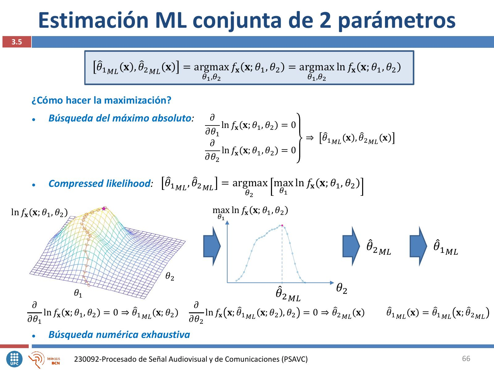

```text
            Estimación ML conjunta de 2 parámetros
3.5


                              𝜃𝜃�1 𝑀𝑀𝑀𝑀 𝐱𝐱 , 𝜃𝜃�2 𝑀𝑀𝑀𝑀 𝐱𝐱   = argmax 𝑓𝑓𝐱𝐱 𝐱𝐱; 𝜃𝜃1 , 𝜃𝜃2 = argmax ln 𝑓𝑓𝐱𝐱 𝐱𝐱; 𝜃𝜃1 , 𝜃𝜃2
                                                                 𝜃𝜃1 ,𝜃𝜃2                              𝜃𝜃1 ,𝜃𝜃2


        ¿Cómo hacer la maximización?
        ●     Búsqueda del máximo absoluto:                         𝜕𝜕
                                                                        ln 𝑓𝑓𝐱𝐱 𝐱𝐱; 𝜃𝜃1 , 𝜃𝜃2 = 0
                                                                  𝜕𝜕𝜃𝜃1
                                                                                                  ⇒ 𝜃𝜃�1 𝑀𝑀𝑀𝑀 𝐱𝐱 , 𝜃𝜃�2 𝑀𝑀𝑀𝑀 𝐱𝐱
                                                                    𝜕𝜕
                                                                        ln 𝑓𝑓𝐱𝐱 𝐱𝐱; 𝜃𝜃1 , 𝜃𝜃2 = 0
                                                                  𝜕𝜕𝜃𝜃2

        ●     Compressed likelihood:                  𝜃𝜃�1 𝑀𝑀𝑀𝑀 , 𝜃𝜃�2 𝑀𝑀𝑀𝑀 = argmax max ln 𝑓𝑓𝐱𝐱 𝐱𝐱; 𝜃𝜃1 , 𝜃𝜃2
                                                                                𝜃𝜃2         𝜃𝜃1

ln 𝑓𝑓𝐱𝐱 𝐱𝐱; 𝜃𝜃1 , 𝜃𝜃2                                                max ln 𝑓𝑓𝐱𝐱 𝐱𝐱; 𝜃𝜃1 , 𝜃𝜃2
                                                                       𝜃𝜃1


                                                                                                                            𝜃𝜃̂2 𝑀𝑀𝑀𝑀                𝜃𝜃̂1 𝑀𝑀𝑀𝑀

                                                      𝜃𝜃2
                        𝜃𝜃1                                                                𝜃𝜃̂2 𝑀𝑀𝑀𝑀              𝜃𝜃2
        𝜕𝜕                                                     𝜕𝜕
            ln 𝑓𝑓𝐱𝐱 𝐱𝐱; 𝜃𝜃1 , 𝜃𝜃2 = 0 ⇒ 𝜃𝜃�1 𝑀𝑀𝑀𝑀 𝐱𝐱; 𝜃𝜃2          ln 𝑓𝑓𝐱𝐱 𝐱𝐱; 𝜃𝜃�1 𝑀𝑀𝑀𝑀 𝐱𝐱; 𝜃𝜃2 , 𝜃𝜃2 = 0 ⇒ 𝜃𝜃�2 𝑀𝑀𝑀𝑀 𝐱𝐱          𝜃𝜃�1 𝑀𝑀𝑀𝑀 𝐱𝐱 = 𝜃𝜃�1 𝑀𝑀𝑀𝑀 𝐱𝐱; 𝜃𝜃�2 𝑀𝑀𝑀𝑀
      𝜕𝜕𝜃𝜃1                                                  𝜕𝜕𝜃𝜃2
        ●     Búsqueda numérica exhaustiva

                        230092-Procesado de Señal Audiovisual y de Comunicaciones (PSAVC)                                                                        66
```

## Page 67

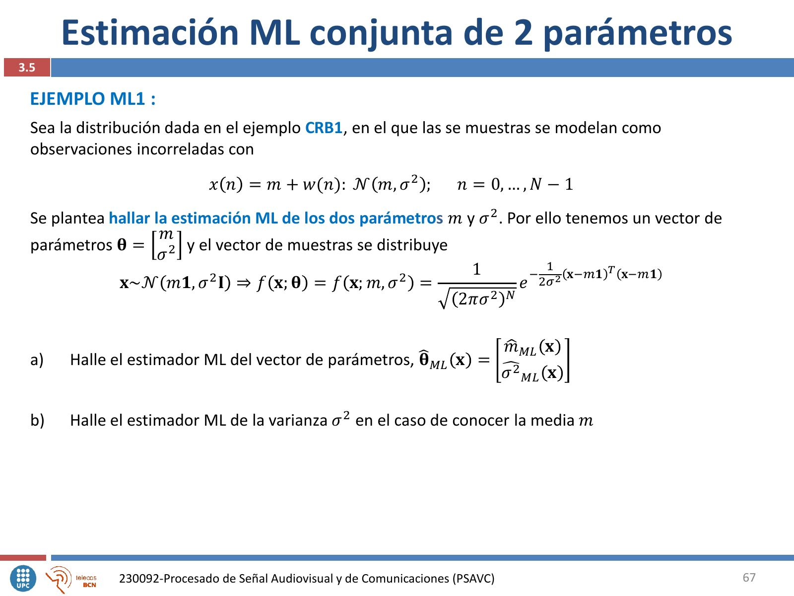

```text
       Estimación ML conjunta de 2 parámetros
3.5

  EJEMPLO ML1 :
  Sea la distribución dada en el ejemplo CRB1, en el que las se muestras se modelan como
  observaciones incorreladas con
                             𝑥𝑥 𝑛𝑛 = 𝑚𝑚 + 𝑤𝑤(𝑛𝑛): 𝒩𝒩 𝑚𝑚, 𝜎𝜎 2 ;         𝑛𝑛 = 0, … , 𝑁𝑁 − 1
  Se plantea hallar la estimación ML de los dos parámetros 𝑚𝑚 y 𝜎𝜎 2 . Por ello tenemos un vector de
                     𝑚𝑚
  parámetros 𝛉𝛉 = 2 y el vector de muestras se distribuye
                     𝜎𝜎
                            2                              2
                                                                1             1
                                                                            − 2 𝐱𝐱−𝑚𝑚𝟏𝟏 𝑇𝑇 𝐱𝐱−𝑚𝑚𝟏𝟏
              𝐱𝐱~𝒩𝒩 𝑚𝑚𝟏𝟏, 𝜎𝜎 𝐈𝐈 ⇒ 𝑓𝑓 𝐱𝐱; 𝛉𝛉 = 𝑓𝑓 𝐱𝐱; 𝑚𝑚, 𝜎𝜎 =            𝑒𝑒  2𝜎𝜎
                                                              2𝜋𝜋𝜎𝜎 2 𝑁𝑁

                                                                  𝑚𝑚� 𝑀𝑀𝑀𝑀 𝐱𝐱
  a)                                                   �𝑀𝑀𝑀𝑀 𝐱𝐱 =
       Halle el estimador ML del vector de parámetros, 𝛉𝛉
                                                                  𝜎𝜎�2 𝑀𝑀𝑀𝑀 𝐱𝐱

  b)   Halle el estimador ML de la varianza 𝜎𝜎 2 en el caso de conocer la media 𝑚𝑚


              230092-Procesado de Señal Audiovisual y de Comunicaciones (PSAVC)                        67
```

## Page 68

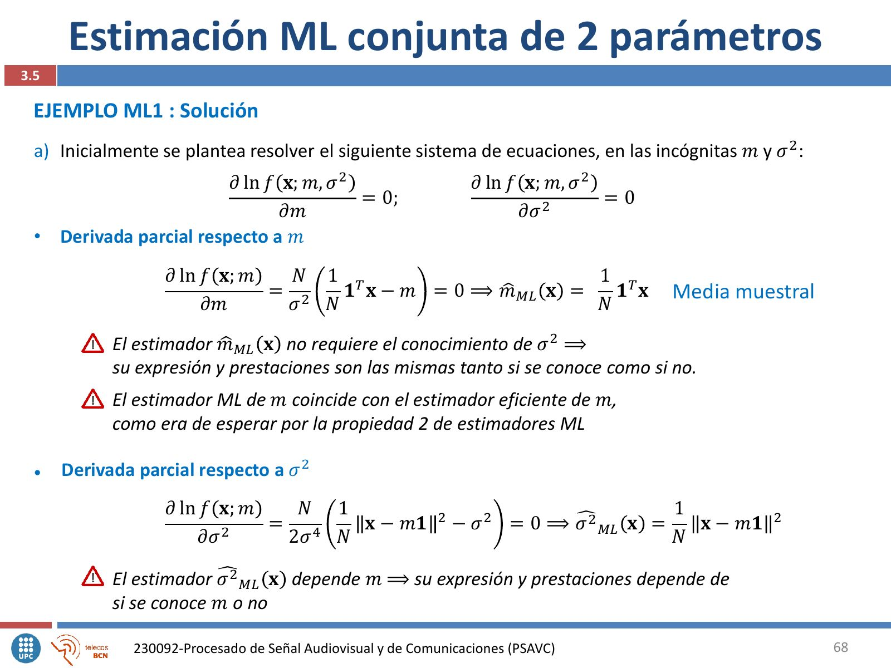

```text
      Estimación ML conjunta de 2 parámetros
3.5

  EJEMPLO ML1 : Solución
  a) Inicialmente se plantea resolver el siguiente sistema de ecuaciones, en las incógnitas 𝑚𝑚 y 𝜎𝜎 2 :
                         𝜕𝜕 ln 𝑓𝑓 𝐱𝐱; 𝑚𝑚, 𝜎𝜎 2                     𝜕𝜕 ln 𝑓𝑓 𝐱𝐱; 𝑚𝑚, 𝜎𝜎 2
                                               = 0;                                      =0
                                  𝜕𝜕𝑚𝑚                                     𝜕𝜕𝜎𝜎 2
  • Derivada parcial respecto a 𝑚𝑚
                   𝜕𝜕 ln 𝑓𝑓 𝐱𝐱; 𝑚𝑚   𝑁𝑁 1 𝑇𝑇                           1 𝑇𝑇
                                   = 2    𝟏𝟏 𝐱𝐱 − 𝑚𝑚 = 0 ⟹ 𝑚𝑚
                                                           � 𝑀𝑀𝑀𝑀 𝐱𝐱 =    𝟏𝟏 𝐱𝐱               Media muestral
                         𝜕𝜕𝜕𝜕       𝜎𝜎 𝑁𝑁                              𝑁𝑁

                          � 𝑀𝑀𝑀𝑀 𝐱𝐱 no requiere el conocimiento de 𝜎𝜎 2 ⟹
            El estimador 𝑚𝑚
            su expresión y prestaciones son las mismas tanto si se conoce como si no.
            El estimador ML de 𝑚𝑚 coincide con el estimador eficiente de 𝑚𝑚,
            como era de esperar por la propiedad 2 de estimadores ML

  ●   Derivada parcial respecto a 𝜎𝜎 2
                   𝜕𝜕 ln 𝑓𝑓 𝐱𝐱; 𝑚𝑚    𝑁𝑁 1              2      2       �2 𝑀𝑀𝑀𝑀 𝐱𝐱 = 1 𝐱𝐱 − 𝑚𝑚𝟏𝟏 2
                                   =          𝐱𝐱 − 𝑚𝑚𝟏𝟏   − 𝜎𝜎   = 0 ⟹ 𝜎𝜎
                        𝜕𝜕𝜎𝜎 2       2𝜎𝜎 4 𝑁𝑁                                       𝑁𝑁

            El estimador 𝜎𝜎�2 𝑀𝑀𝑀𝑀 𝐱𝐱 depende 𝑚𝑚 ⟹ su expresión y prestaciones depende de
            si se conoce 𝑚𝑚 o no

               230092-Procesado de Señal Audiovisual y de Comunicaciones (PSAVC)                               68
```

## Page 69

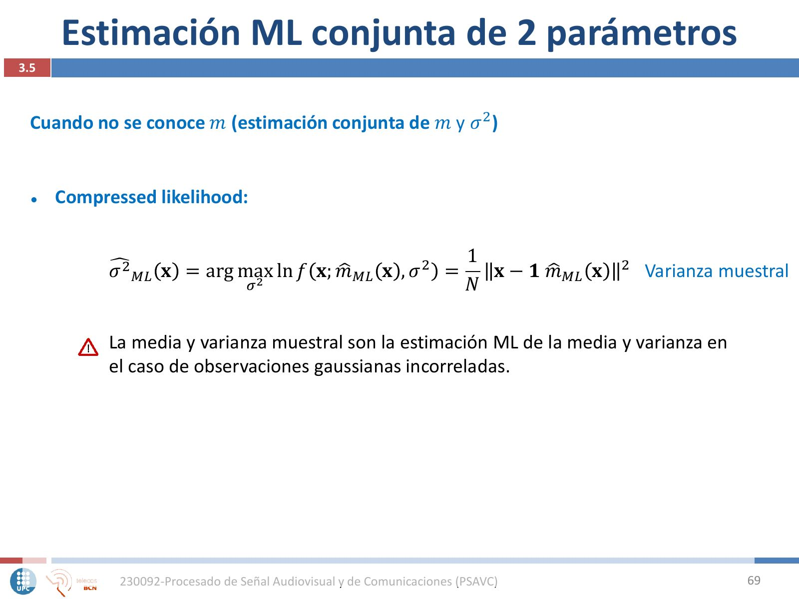

```text
      Estimación ML conjunta de 2 parámetros
3.5


  Cuando no se conoce 𝑚𝑚 (estimación conjunta de 𝑚𝑚 y 𝜎𝜎 2 )


  ●   Compressed likelihood:

                                                                   1
            𝜎𝜎�2 𝑀𝑀𝑀𝑀 𝐱𝐱 = arg max   ln 𝑓𝑓 𝐱𝐱; 𝑚𝑚
                                               �  𝑀𝑀𝑀𝑀 𝐱𝐱 , 𝜎𝜎 2
                                                                 =    𝐱𝐱 − 𝟏𝟏 𝑚𝑚
                                                                              � 𝑀𝑀𝑀𝑀 𝐱𝐱   2
                                                                                              Varianza muestral
                                𝜎𝜎 2                               𝑁𝑁

            La media y varianza muestral son la estimación ML de la media y varianza en
            el caso de observaciones gaussianas incorreladas.


             230092-Procesado de Señal Audiovisual y de Comunicaciones (PSAVC)                            69
```

## Page 70

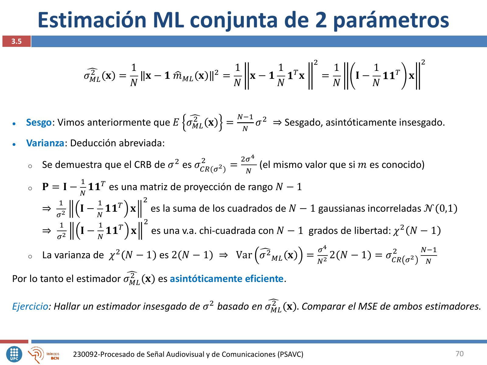

```text
          Estimación ML conjunta de 2 parámetros
3.5

                                                                                       2                               2
                                1                               1         1                  1        1
                    𝜎𝜎�
                      2
                      𝑀𝑀𝑀𝑀 𝐱𝐱 =    𝐱𝐱 − 𝟏𝟏 𝑚𝑚
                                           � 𝑀𝑀𝑀𝑀 𝐱𝐱        2
                                                              =    𝐱𝐱 − 𝟏𝟏 𝟏𝟏𝑇𝑇 𝐱𝐱         =      𝐈𝐈 − 𝟏𝟏𝟏𝟏𝑇𝑇 𝐱𝐱
                                𝑁𝑁                              𝑁𝑁        𝑁𝑁                 𝑁𝑁       𝑁𝑁


      Sesgo: Vimos anteriormente que 𝐸𝐸 𝜎𝜎�
                                          2                         𝑁𝑁−1 2
●                                         𝑀𝑀𝑀𝑀 𝐱𝐱               =        𝜎𝜎   ⇒ Sesgado, asintóticamente insesgado.
                                                                      𝑁𝑁
●     Varianza: Deducción abreviada:
                                                                       4
                                                                     2𝜎𝜎
                                               2         2
      o   Se demuestra que el CRB de 𝜎𝜎            es 𝜎𝜎𝐶𝐶𝐶𝐶(𝜎𝜎 2) =       (el mismo valor que si 𝑚𝑚 es conocido)
                                                                      𝑁𝑁
                  1
      o   𝐏𝐏 = 𝐈𝐈 − 𝟏𝟏𝟏𝟏𝑇𝑇 es una matriz de proyección de rango 𝑁𝑁 − 1
                  𝑁𝑁
             1         1              2
          ⇒ 2      𝐈𝐈 − 𝟏𝟏𝟏𝟏𝑇𝑇   𝐱𝐱       es la suma de los cuadrados de 𝑁𝑁 − 1 gaussianas incorreladas 𝒩𝒩 0,1
           𝜎𝜎          𝑁𝑁
             1         1              2
          ⇒ 2      𝐈𝐈 − 𝟏𝟏𝟏𝟏𝑇𝑇   𝐱𝐱       es una v.a. chi-cuadrada con 𝑁𝑁 − 1 grados de libertad: 𝜒𝜒 2 𝑁𝑁 − 1
            𝜎𝜎         𝑁𝑁
                                                                                         𝜎𝜎4                           𝑁𝑁−1
      o   La varianza de 𝜒𝜒 2 𝑁𝑁 − 1 es 2 𝑁𝑁 − 1 ⇒ Var 𝜎𝜎�2 𝑀𝑀𝑀𝑀 𝐱𝐱                  =       2 𝑁𝑁 − 1        2
                                                                                                        = 𝜎𝜎𝐶𝐶𝐶𝐶 𝜎𝜎2
                                                                                         𝑁𝑁2                             𝑁𝑁

Por lo tanto el estimador 𝜎𝜎�
                            2
                            𝑀𝑀𝑀𝑀 𝐱𝐱 es asintóticamente eficiente.


Ejercicio: Hallar un estimador insesgado de 𝜎𝜎 2 basado en 𝜎𝜎�
                                                             2
                                                             𝑀𝑀𝑀𝑀 𝐱𝐱 . Comparar el MSE de ambos estimadores.


                 230092-Procesado de Señal Audiovisual y de Comunicaciones (PSAVC)                                            70
```

## Page 71

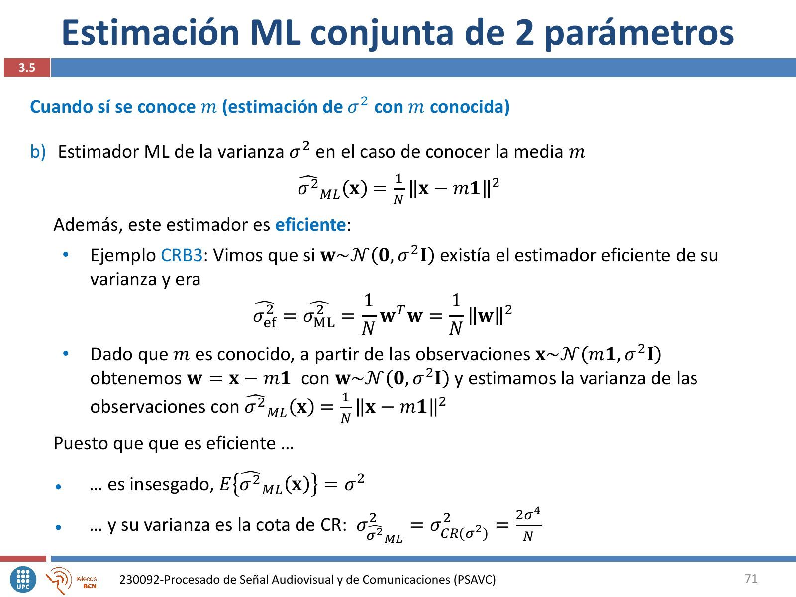

```text
      Estimación ML conjunta de 2 parámetros
3.5


  Cuando sí se conoce 𝑚𝑚 (estimación de 𝜎𝜎 2 con 𝑚𝑚 conocida)

  b) Estimador ML de la varianza 𝜎𝜎 2 en el caso de conocer la media 𝑚𝑚
                                                               1
                                                𝜎𝜎�2 𝑀𝑀𝑀𝑀 𝐱𝐱 =   𝐱𝐱 − 𝑚𝑚𝟏𝟏 2
                                                                 𝑁𝑁
      Además, este estimador es eficiente:
          •   Ejemplo CRB3: Vimos que si 𝐰𝐰~𝒩𝒩 𝟎𝟎, 𝜎𝜎 2 𝐈𝐈 existía el estimador eficiente de su
              varianza y era
                                                  1 𝑇𝑇         1
                                   𝜎𝜎�2
                                     ef =   �
                                           𝜎𝜎 2
                                             ML =     𝐰𝐰 𝐰𝐰 =     𝐰𝐰 2
                                                  𝑁𝑁           𝑁𝑁
          •   Dado que 𝑚𝑚 es conocido, a partir de las observaciones 𝐱𝐱~𝒩𝒩 𝑚𝑚𝟏𝟏, 𝜎𝜎 2 𝐈𝐈
              obtenemos 𝐰𝐰 = 𝐱𝐱 − 𝑚𝑚𝟏𝟏 con 𝐰𝐰~𝒩𝒩 𝟎𝟎, 𝜎𝜎 2 𝐈𝐈 y estimamos la varianza de las
                                                1
              observaciones con 𝜎𝜎�2 𝑀𝑀𝑀𝑀 𝐱𝐱 =     𝐱𝐱 − 𝑚𝑚𝟏𝟏 2
                                                        𝑁𝑁
      Puesto que que es eficiente …

      ●       … es insesgado, 𝐸𝐸 𝜎𝜎�2 𝑀𝑀𝑀𝑀 𝐱𝐱        = 𝜎𝜎 2
                                                                            2𝜎𝜎       4
                                                   2             2
      ●       … y su varianza es la cota de CR: 𝜎𝜎𝜎𝜎�2      = 𝜎𝜎       2
                                                                𝐶𝐶𝐶𝐶(𝜎𝜎 ) =
                                                       𝑀𝑀𝑀𝑀                  𝑁𝑁

                  230092-Procesado de Señal Audiovisual y de Comunicaciones (PSAVC)               71
```

## Page 72

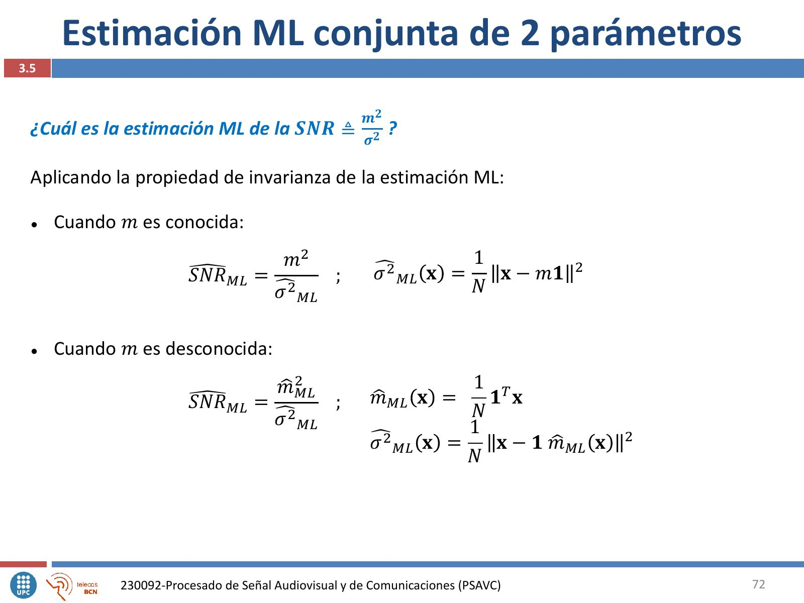

```text
      Estimación ML conjunta de 2 parámetros
3.5


                                           𝒎𝒎𝟐𝟐
  ¿Cuál es la estimación ML de la 𝑺𝑺𝑺𝑺𝑺𝑺 ≜ 𝝈𝝈𝟐𝟐 ?

  Aplicando la propiedad de invarianza de la estimación ML:

  ●   Cuando 𝑚𝑚 es conocida:
                                   𝑚𝑚2                                 1
                        �𝑀𝑀𝑀𝑀 =
                        𝑆𝑆𝑆𝑆𝑆𝑆                    ;     𝜎𝜎�2 𝑀𝑀𝑀𝑀 𝐱𝐱 =    𝐱𝐱 − 𝑚𝑚𝟏𝟏 2
                                𝜎𝜎�2       𝑀𝑀𝑀𝑀
                                                                       𝑁𝑁


  ●   Cuando 𝑚𝑚 es desconocida:
                                𝑚𝑚  2
                                  � 𝑀𝑀𝑀𝑀                               1 𝑇𝑇
                        �𝑀𝑀𝑀𝑀 =
                        𝑆𝑆𝑆𝑆𝑆𝑆                    ;    𝑚𝑚
                                                        � 𝑀𝑀𝑀𝑀 𝐱𝐱 =      𝟏𝟏 𝐱𝐱
                                𝜎𝜎�2                                  𝑁𝑁
                                           𝑀𝑀𝑀𝑀                       1
                                                       𝜎𝜎�2 𝑀𝑀𝑀𝑀 𝐱𝐱 =     𝐱𝐱 − 𝟏𝟏 𝑚𝑚
                                                                                  � 𝑀𝑀𝑀𝑀 𝐱𝐱   2
                                                                      𝑁𝑁


             230092-Procesado de Señal Audiovisual y de Comunicaciones (PSAVC)                    72
```

## Page 73

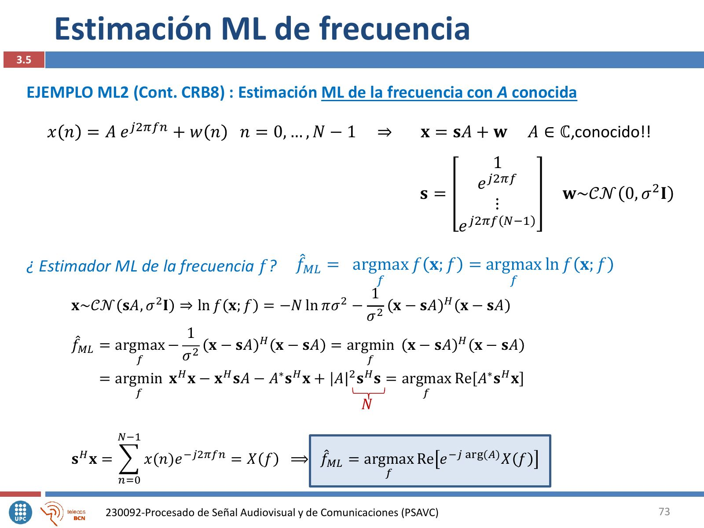

```text
       Estimación ML de frecuencia
3.5

  EJEMPLO ML2 (Cont. CRB8) : Estimación ML de la frecuencia con A conocida

      𝑥𝑥 𝑛𝑛 = 𝐴𝐴 𝑒𝑒 𝑗𝑗𝑗𝑗𝑗𝑗𝑗𝑗𝑗 + 𝑤𝑤 𝑛𝑛     𝑛𝑛 = 0, … , 𝑁𝑁 − 1           ⇒         𝐱𝐱 = 𝐬𝐬𝐴𝐴 + 𝐰𝐰           𝐴𝐴 ∈ ℂ,conocido!!
                                                                                                 1
                                                                                                𝑗𝑗𝑗𝑗𝑗𝑗𝑗
                                                                                           𝑒𝑒
                                                                                 𝐬𝐬 =                         𝐰𝐰~𝒞𝒞𝒞𝒞 0, 𝜎𝜎 2 𝐈𝐈
                                                                                                 ⋮
                                                                                        𝑒𝑒 𝑗𝑗𝑗𝑗𝑗𝑗𝑗 𝑁𝑁−1

  ¿ Estimador ML de la frecuencia 𝑓𝑓?                𝑓𝑓̂𝑀𝑀𝑀𝑀 = argmax 𝑓𝑓 𝐱𝐱; 𝑓𝑓 = argmax ln 𝑓𝑓 𝐱𝐱; 𝑓𝑓
                                                                       𝑓𝑓                            𝑓𝑓
                                                                    1
          𝐱𝐱~𝒞𝒞𝒞𝒞 𝐬𝐬𝐴𝐴, 𝜎𝜎 2 𝐈𝐈 ⇒ ln 𝑓𝑓 𝐱𝐱; 𝑓𝑓 = −𝑁𝑁 ln 𝜋𝜋𝜎𝜎 2 −      2
                                                                        𝐱𝐱 − 𝐬𝐬𝐴𝐴 𝐻𝐻 𝐱𝐱 − 𝐬𝐬𝐴𝐴
                                                                   𝜎𝜎
                             1
          𝑓𝑓̂𝑀𝑀𝑀𝑀 = argmax −   2
                                  𝐱𝐱 − 𝐬𝐬𝐴𝐴 𝐻𝐻 𝐱𝐱 − 𝐬𝐬𝐴𝐴 = argmin 𝐱𝐱 − 𝐬𝐬𝐴𝐴 𝐻𝐻 𝐱𝐱 − 𝐬𝐬𝐴𝐴
                    𝑓𝑓      𝜎𝜎                                        𝑓𝑓
               = argmin 𝐱𝐱 𝐻𝐻 𝐱𝐱 − 𝐱𝐱 𝐻𝐻 𝐬𝐬𝐴𝐴 − 𝐴𝐴∗ 𝐬𝐬𝐻𝐻 𝐱𝐱 + 𝐴𝐴 2 𝐬𝐬𝐻𝐻 𝐬𝐬 = argmax Re 𝐴𝐴∗ 𝐬𝐬𝐻𝐻 𝐱𝐱
                      𝑓𝑓                                                         𝑓𝑓
                                                                  𝑁𝑁
                  𝑁𝑁−1

          𝐬𝐬𝐻𝐻 𝐱𝐱 = � 𝑥𝑥(𝑛𝑛)𝑒𝑒 −𝑗𝑗𝑗𝑗𝑗𝑗𝑗𝑗𝑗 = 𝑋𝑋 𝑓𝑓   ⟹ 𝑓𝑓̂𝑀𝑀𝑀𝑀 = argmax Re 𝑒𝑒 −𝑗𝑗 arg(𝐴𝐴) 𝑋𝑋 𝑓𝑓
                                                                            𝑓𝑓
                   𝑛𝑛=0

                230092-Procesado de Señal Audiovisual y de Comunicaciones (PSAVC)                                             73
```

## Page 74

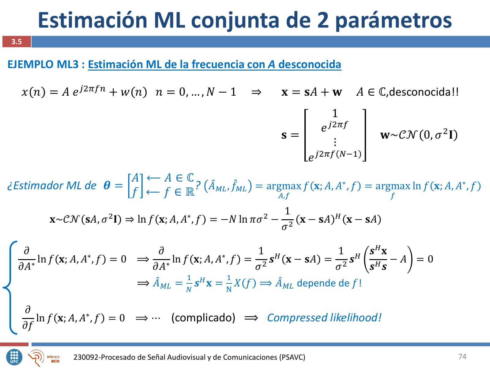

```text
         Estimación ML conjunta de 2 parámetros
3.5

EJEMPLO ML3 : Estimación ML de la frecuencia con A desconocida

  𝑥𝑥 𝑛𝑛 = 𝐴𝐴 𝑒𝑒 𝑗𝑗𝑗𝑗𝑗𝑗𝑗𝑗𝑗 + 𝑤𝑤 𝑛𝑛       𝑛𝑛 = 0, … , 𝑁𝑁 − 1         ⇒          𝐱𝐱 = 𝐬𝐬𝐴𝐴 + 𝐰𝐰            𝐴𝐴 ∈ ℂ,desconocida!!
                                                                                               1
                                                                                              𝑗𝑗𝑗𝑗𝑗𝑗𝑗
                                                                                         𝑒𝑒
                                                                              𝐬𝐬 =                          𝐰𝐰~𝒞𝒞𝒞𝒞 0, 𝜎𝜎 2 𝐈𝐈
                                                                                               ⋮
                                                                                     𝑒𝑒 𝑗𝑗𝑗𝑗𝑗𝑗𝑗 𝑁𝑁−1
                                 𝐴𝐴 ⟵ 𝐴𝐴 ∈ ℂ ̂
¿Estimador ML de 𝜽𝜽 =                        ? 𝐴𝐴𝑀𝑀𝑀𝑀 , 𝑓𝑓̂𝑀𝑀𝑀𝑀 = argmax 𝑓𝑓 𝐱𝐱; 𝐴𝐴, 𝐴𝐴∗ , 𝑓𝑓 = argmax ln 𝑓𝑓 𝐱𝐱; 𝐴𝐴, 𝐴𝐴∗ , 𝑓𝑓
                                 𝑓𝑓 ⟵ 𝑓𝑓 ∈ ℝ                        𝐴𝐴,𝑓𝑓                         𝑓𝑓

                                                                               1
           𝐱𝐱~𝒞𝒞𝒞𝒞 𝐬𝐬𝐴𝐴, 𝜎𝜎 2 𝐈𝐈 ⇒ ln 𝑓𝑓 𝐱𝐱; 𝐴𝐴, 𝐴𝐴∗ , 𝑓𝑓 = −𝑁𝑁 ln 𝜋𝜋𝜎𝜎 2 −      2
                                                                                   𝐱𝐱 − 𝐬𝐬𝐴𝐴 𝐻𝐻 𝐱𝐱 − 𝐬𝐬𝐴𝐴
                                                                              𝜎𝜎

   𝜕𝜕                  ∗
                                      𝜕𝜕                   ∗
                                                                   1 𝐻𝐻             1 𝐻𝐻 𝒔𝒔𝐻𝐻 𝐱𝐱
       ln 𝑓𝑓 𝐱𝐱; 𝐴𝐴, 𝐴𝐴 , 𝑓𝑓 = 0 ⟹         ln 𝑓𝑓 𝐱𝐱; 𝐴𝐴, 𝐴𝐴 , 𝑓𝑓 = 2 𝒔𝒔 𝐱𝐱 − 𝐬𝐬𝐴𝐴 = 2 𝒔𝒔         − 𝐴𝐴 = 0
 𝜕𝜕𝐴𝐴∗                             𝜕𝜕𝐴𝐴∗                          𝜎𝜎               𝜎𝜎    𝒔𝒔𝐻𝐻 𝒔𝒔
                                               1             1
                                 ⟹ 𝐴𝐴̂ 𝑀𝑀𝑀𝑀 = 𝒔𝒔𝐻𝐻 𝐱𝐱 = 𝑋𝑋 𝑓𝑓 ⟹ 𝐴𝐴̂ 𝑀𝑀𝑀𝑀 depende de 𝑓𝑓!
                                                 𝑁𝑁         N

       𝜕𝜕
           ln 𝑓𝑓 𝐱𝐱; 𝐴𝐴, 𝐴𝐴∗ , 𝑓𝑓 = 0 ⟹ ⋯ (complicado) ⟹ Compressed likelihood!
      𝜕𝜕𝜕𝜕

                 230092-Procesado de Señal Audiovisual y de Comunicaciones (PSAVC)                                               74
```

## Page 75

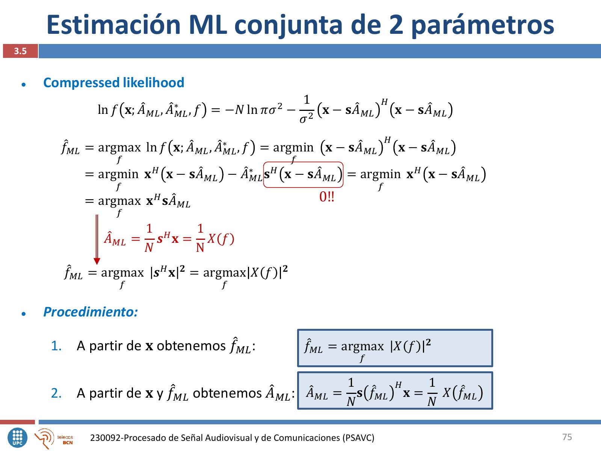

```text
      Estimación ML conjunta de 2 parámetros
3.5


 ●    Compressed likelihood
                                                                                      1
                 ln 𝑓𝑓 𝐱𝐱; 𝐴𝐴̂ 𝑀𝑀𝑀𝑀 , 𝐴𝐴̂∗𝑀𝑀𝑀𝑀 , 𝑓𝑓 = −𝑁𝑁 ln 𝜋𝜋𝜎𝜎 2 −                     𝐱𝐱 − 𝐬𝐬 ̂ 𝑀𝑀𝑀𝑀 𝐻𝐻 𝐱𝐱 − 𝐬𝐬𝐴𝐴̂ 𝑀𝑀𝑀𝑀
                                                                                                 𝐴𝐴
                                                                                     𝜎𝜎 2
                                                                                     𝐻𝐻
        𝑓𝑓̂𝑀𝑀𝑀𝑀 = argmax ln 𝑓𝑓 𝐱𝐱; 𝐴𝐴̂ 𝑀𝑀𝑀𝑀 , 𝐴𝐴̂∗𝑀𝑀𝑀𝑀 , 𝑓𝑓 = argmin 𝐱𝐱 − 𝐬𝐬𝐴𝐴̂ 𝑀𝑀𝑀𝑀    𝐱𝐱 − 𝐬𝐬𝐴𝐴̂ 𝑀𝑀𝑀𝑀
                     𝑓𝑓                                                         𝑓𝑓
             = argmin 𝐱𝐱        𝐻𝐻
                                     𝐱𝐱 − 𝐬𝐬𝐴𝐴̂ 𝑀𝑀𝑀𝑀    − 𝐴𝐴̂ ∗𝑀𝑀𝑀𝑀 𝐬𝐬𝐻𝐻   𝐱𝐱 − 𝐬𝐬𝐴𝐴̂ 𝑀𝑀𝑀𝑀 = argmin 𝐱𝐱 𝐻𝐻 𝐱𝐱 − 𝐬𝐬𝐴𝐴̂ 𝑀𝑀𝑀𝑀
                     𝑓𝑓                                                                                    𝑓𝑓
             = argmax 𝐱𝐱 𝐬𝐬𝐴𝐴̂ 𝑀𝑀𝑀𝑀
                                𝐻𝐻                                                        0‼
                     𝑓𝑓
                               1 𝐻𝐻      1
                  𝐴𝐴̂ 𝑀𝑀𝑀𝑀 =      𝒔𝒔 𝐱𝐱 = 𝑋𝑋 𝑓𝑓
                               𝑁𝑁        N
         𝑓𝑓̂𝑀𝑀𝑀𝑀 = argmax 𝒔𝒔𝐻𝐻 𝐱𝐱 𝟐𝟐 = argmax 𝑋𝑋 𝑓𝑓                        𝟐𝟐
                      𝑓𝑓                               𝑓𝑓

 ●    Procedimiento:

       1. A partir de 𝐱𝐱 obtenemos 𝑓𝑓̂𝑀𝑀𝑀𝑀 :                                          𝑓𝑓̂𝑀𝑀𝑀𝑀 = argmax 𝑋𝑋 𝑓𝑓         𝟐𝟐
                                                                                                      𝑓𝑓

                                                            1          𝐻𝐻      1
                            ̂                ̂        ̂
       2. A partir de 𝐱𝐱 y 𝑓𝑓𝑀𝑀𝑀𝑀 obtenemos 𝐴𝐴𝑀𝑀𝑀𝑀 : 𝑀𝑀𝑀𝑀
                                                     𝐴𝐴   =   𝐬𝐬  ̂
                                                                 𝑓𝑓
                                                                  𝑀𝑀𝑀𝑀    𝐱𝐱 =   𝑋𝑋 𝑓𝑓̂𝑀𝑀𝑀𝑀
                                                                                                 𝑁𝑁                   𝑁𝑁

               230092-Procesado de Señal Audiovisual y de Comunicaciones (PSAVC)                                              75
```

## Page 76

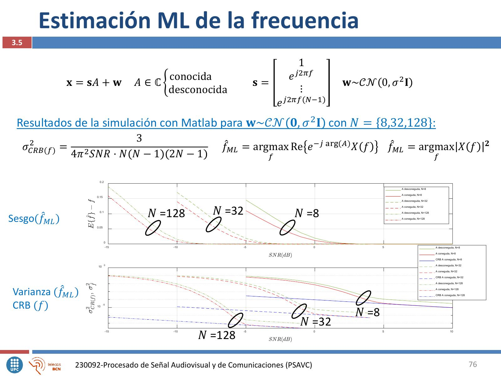

```text
        Estimación ML de la frecuencia
3.5

                                                                                         1
                                                     conocida                        𝑒𝑒 𝑗𝑗𝑗𝑗𝑗𝑗𝑗
                  𝐱𝐱 = 𝐬𝐬𝐴𝐴 + 𝐰𝐰          𝐴𝐴 ∈ ℂ �                        𝐬𝐬 =                      𝐰𝐰~𝒞𝒞𝒞𝒞 0, 𝜎𝜎 2 𝐈𝐈
                                                     desconocida                          ⋮
                                                                                  𝑒𝑒 𝑗𝑗𝑗𝑗𝑗𝑗𝑗 𝑁𝑁−1
  Resultados de la simulación con Matlab para 𝐰𝐰~𝒞𝒞𝒞𝒞 𝟎𝟎, 𝜎𝜎 2 𝐈𝐈 con 𝑁𝑁 = 8,32,128 :
                                        3
       2
    𝜎𝜎𝐶𝐶𝐶𝐶𝐶𝐶(𝑓𝑓) =                                             𝑓𝑓̂𝑀𝑀𝑀𝑀 = argmax Re 𝑒𝑒 −𝑗𝑗 arg(𝐴𝐴) 𝑋𝑋 𝑓𝑓            𝑓𝑓̂𝑀𝑀𝑀𝑀 = argmax 𝑋𝑋 𝑓𝑓                                 𝟐𝟐
                     4𝜋𝜋 2 𝑆𝑆𝑆𝑆𝑆𝑆 · 𝑁𝑁 𝑁𝑁 − 1 2𝑁𝑁 − 1                        𝑓𝑓                                                              𝑓𝑓

                             0.2

                                                                                                                      A desconeguda, N=8

                                                                                                                      A coneguda, N=8
                            0.15
                                                                                                                      A desconeguda, N=32


                                             𝑁𝑁 =128         𝑁𝑁 =32                    𝑁𝑁 =8
                                                                                                                      A coneguda, N=32


Sesgo(𝑓𝑓̂𝑀𝑀𝑀𝑀 )
                             0.1                                                                                      A desconeguda, N=128

                                                                                                                      A coneguda, N=128


                            0.05


                                   0
                                    -15              -10             -5                       0                5                                       10 N=8
                                                                                                                                             A desconeguda,

                                                                                                                                             A coneguda, N=8

                                                                                                                                             CRB A coneguda, N=8

                                    0                                                                                                        A desconeguda, N=32
                             10
                                                                                                                                             A coneguda, N=32

                                                                                                                                             CRB A coneguda, N=32

                                                                                                                                             A desconeguda, N=128


 Varianza (𝑓𝑓̂𝑀𝑀𝑀𝑀 )                                                                                                                         A coneguda, N=128

                                                                                                                                             CRB A coneguda, N=128


 CRB (𝑓𝑓)                          -5


                                                                                                       𝑁𝑁 =8
                            10


                                                                                         𝑁𝑁 =32
                                                           𝑁𝑁 =128
                                    -15              -10             -5                       0                5                                       10


                      230092-Procesado de Señal Audiovisual y de Comunicaciones (PSAVC)                                                                              76
```

## Page 77

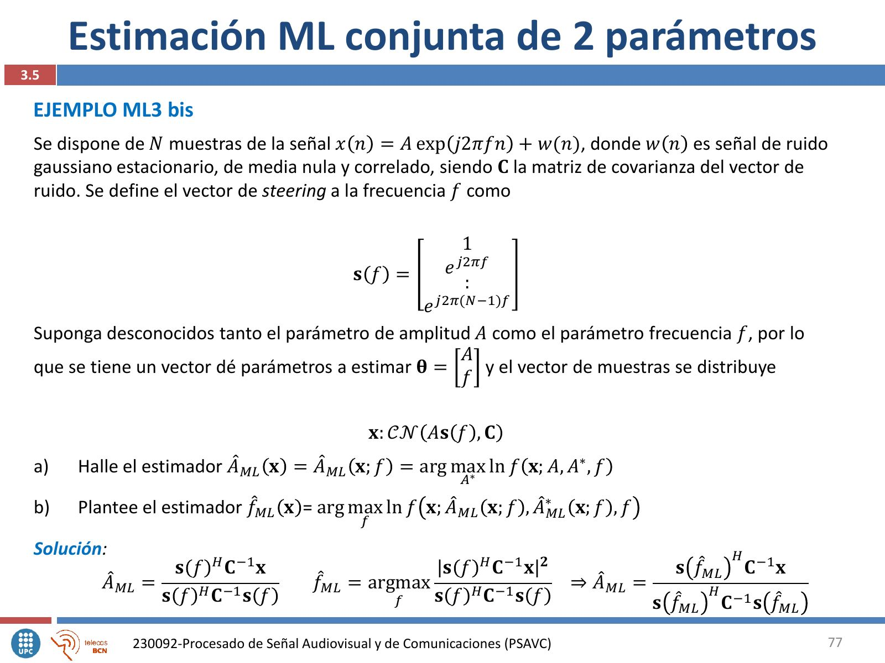

```text
       Estimación ML conjunta de 2 parámetros
3.5

  EJEMPLO ML3 bis
  Se dispone de 𝑁𝑁 muestras de la señal 𝑥𝑥 𝑛𝑛 = 𝐴𝐴 exp 𝑗𝑗𝑗𝑗𝑗𝑗𝑗𝑗𝑗 + 𝑤𝑤(𝑛𝑛), donde 𝑤𝑤 𝑛𝑛 es señal de ruido
  gaussiano estacionario, de media nula y correlado, siendo 𝐂𝐂 la matriz de covarianza del vector de
  ruido. Se define el vector de steering a la frecuencia 𝑓𝑓 como

                                                                     1
                                                   𝐬𝐬 𝑓𝑓 =        𝑒𝑒 𝑗𝑗𝑗𝑗𝑗𝑗𝑗
                                                                       :
                                                  𝑒𝑒 𝑗𝑗𝑗𝑗𝑗(𝑁𝑁−1)𝑓𝑓
  Suponga desconocidos tanto el parámetro de amplitud 𝐴𝐴 como el parámetro frecuencia 𝑓𝑓, por lo
                                                          𝐴𝐴
  que se tiene un vector dé parámetros a estimar 𝛉𝛉 =         y el vector de muestras se distribuye
                                                          𝑓𝑓

                                                      𝐱𝐱: 𝒞𝒞𝒞𝒞 𝐴𝐴𝐬𝐬 𝑓𝑓 , 𝐂𝐂
  a)   Halle el estimador 𝐴𝐴̂ 𝑀𝑀𝑀𝑀 𝐱𝐱 = 𝐴𝐴̂ 𝑀𝑀𝑀𝑀 𝐱𝐱; 𝑓𝑓 = arg max
                                                               ∗
                                                                  ln 𝑓𝑓 𝐱𝐱; 𝐴𝐴, 𝐴𝐴∗ , 𝑓𝑓
                                                                     𝐴𝐴

  b)   Plantee el estimador 𝑓𝑓̂𝑀𝑀𝑀𝑀 𝐱𝐱 = arg max ln 𝑓𝑓 𝐱𝐱; 𝐴𝐴̂ 𝑀𝑀𝑀𝑀 𝐱𝐱; 𝑓𝑓 , 𝐴𝐴̂∗𝑀𝑀𝑀𝑀 𝐱𝐱; 𝑓𝑓 , 𝑓𝑓
                                                     𝑓𝑓

  Solución:                                                                                                          𝐻𝐻
                        𝐬𝐬 𝑓𝑓 𝐻𝐻 𝐂𝐂−1 𝐱𝐱                       𝐬𝐬 𝑓𝑓 𝐻𝐻 𝐂𝐂−1 𝐱𝐱 𝟐𝟐                         𝐬𝐬 𝑓𝑓̂𝑀𝑀𝑀𝑀 𝐂𝐂−1 𝐱𝐱
          𝐴𝐴̂ 𝑀𝑀𝑀𝑀 =                          ̂
                                             𝑓𝑓𝑀𝑀𝑀𝑀 = argmax                           ⇒ 𝐴𝐴̂ 𝑀𝑀𝑀𝑀 =
                     𝐬𝐬 𝑓𝑓 𝐻𝐻 𝐂𝐂−1 𝐬𝐬 𝑓𝑓                     𝐬𝐬 𝑓𝑓 𝐻𝐻 𝐂𝐂−1 𝐬𝐬 𝑓𝑓                                   𝐻𝐻
                                                         𝑓𝑓                                           𝐬𝐬 𝑓𝑓̂𝑀𝑀𝑀𝑀        𝐂𝐂−1 𝐬𝐬 𝑓𝑓̂𝑀𝑀𝑀𝑀

               230092-Procesado de Señal Audiovisual y de Comunicaciones (PSAVC)                                                          77
```

## Page 78

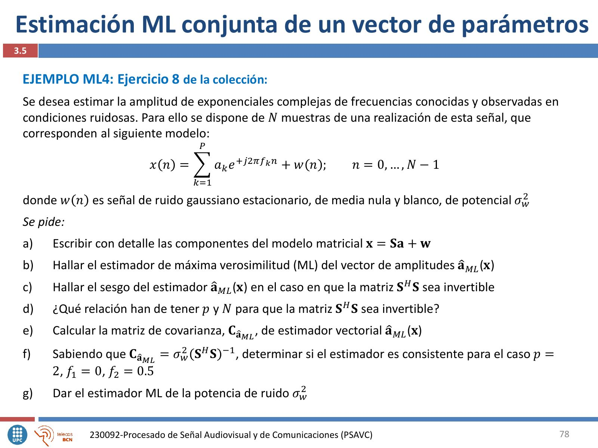

```text
Estimación ML conjunta de un vector de parámetros
3.5

  EJEMPLO ML4: Ejercicio 8 de la colección:
  Se desea estimar la amplitud de exponenciales complejas de frecuencias conocidas y observadas en
  condiciones ruidosas. Para ello se dispone de 𝑁𝑁 muestras de una realización de esta señal, que
  corresponden al siguiente modelo:
                                        𝑃𝑃

                            𝑥𝑥 𝑛𝑛 = � 𝑎𝑎𝑘𝑘 𝑒𝑒 +𝑗𝑗𝑗𝑗𝑗𝑓𝑓𝑘𝑘𝑛𝑛 + 𝑤𝑤 𝑛𝑛 ;       𝑛𝑛 = 0, … , 𝑁𝑁 − 1
                                      𝑘𝑘=1
  donde 𝑤𝑤 𝑛𝑛 es señal de ruido gaussiano estacionario, de media nula y blanco, de potencial 𝜎𝜎𝑤𝑤2
  Se pide:
  a)   Escribir con detalle las componentes del modelo matricial 𝐱𝐱 = 𝐒𝐒𝐒𝐒 + 𝐰𝐰
  b)   Hallar el estimador de máxima verosimilitud (ML) del vector de amplitudes 𝐚𝐚� 𝑀𝑀𝑀𝑀 (𝐱𝐱)
  c)   Hallar el sesgo del estimador 𝐚𝐚� 𝑀𝑀𝑀𝑀 (𝐱𝐱) en el caso en que la matriz 𝐒𝐒𝐻𝐻 𝐒𝐒 sea invertible
  d)   ¿Qué relación han de tener 𝑝𝑝 y 𝑁𝑁 para que la matriz 𝐒𝐒𝐻𝐻 𝐒𝐒 sea invertible?
  e)   Calcular la matriz de covarianza, 𝐂𝐂𝐚𝐚�𝑀𝑀𝑀𝑀 , de estimador vectorial 𝐚𝐚� 𝑀𝑀𝑀𝑀 (𝐱𝐱)
  f)   Sabiendo que 𝐂𝐂𝐚𝐚�𝑀𝑀𝑀𝑀 = 𝜎𝜎𝑤𝑤2 𝐒𝐒𝐻𝐻 𝐒𝐒 −1 , determinar si el estimador es consistente para el caso 𝑝𝑝 =
       2, 𝑓𝑓1 = 0, 𝑓𝑓2 = 0.5
  g)   Dar el estimador ML de la potencia de ruido 𝜎𝜎𝑤𝑤2


               230092-Procesado de Señal Audiovisual y de Comunicaciones (PSAVC)                                 78
```

## Page 79

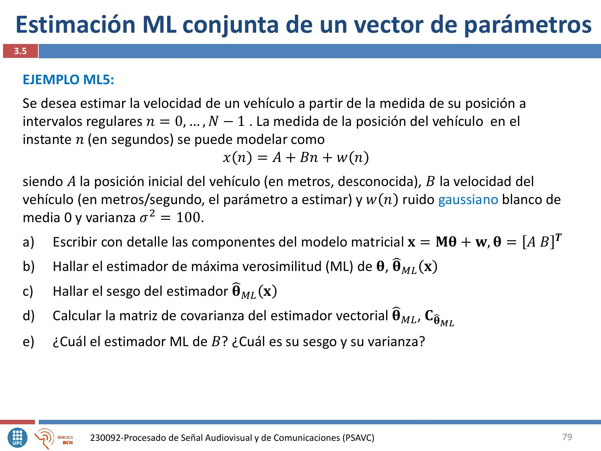

```text
Estimación ML conjunta de un vector de parámetros
3.5

  EJEMPLO ML5:
  Se desea estimar la velocidad de un vehículo a partir de la medida de su posición a
  intervalos regulares 𝑛𝑛 = 0, … , 𝑁𝑁 − 1 . La medida de la posición del vehículo en el
  instante 𝑛𝑛 (en segundos) se puede modelar como
                                      𝑥𝑥 𝑛𝑛 = 𝐴𝐴 + 𝐵𝐵𝐵𝐵 + 𝑤𝑤 𝑛𝑛
  siendo 𝐴𝐴 la posición inicial del vehículo (en metros, desconocida), 𝐵𝐵 la velocidad del
  vehículo (en metros/segundo, el parámetro a estimar) y 𝑤𝑤 𝑛𝑛 ruido gaussiano blanco de
  media 0 y varianza 𝜎𝜎 2 = 100.
  a)   Escribir con detalle las componentes del modelo matricial 𝐱𝐱 = 𝐌𝐌𝐌𝐌 + 𝐰𝐰, 𝛉𝛉 = 𝐴𝐴 𝐵𝐵 𝑻𝑻
  b)                                                           �𝑀𝑀𝑀𝑀 𝐱𝐱
       Hallar el estimador de máxima verosimilitud (ML) de 𝛉𝛉, 𝛉𝛉
  c)                                 �𝑀𝑀𝑀𝑀 𝐱𝐱
       Hallar el sesgo del estimador 𝛉𝛉
  d)                                                            �𝑀𝑀𝑀𝑀 , 𝐂𝐂𝛉𝛉�
       Calcular la matriz de covarianza del estimador vectorial 𝛉𝛉            𝑀𝑀𝑀𝑀

  e)   ¿Cuál el estimador ML de 𝐵𝐵? ¿Cuál es su sesgo y su varianza?


             230092-Procesado de Señal Audiovisual y de Comunicaciones (PSAVC)               79
```

## Page 80

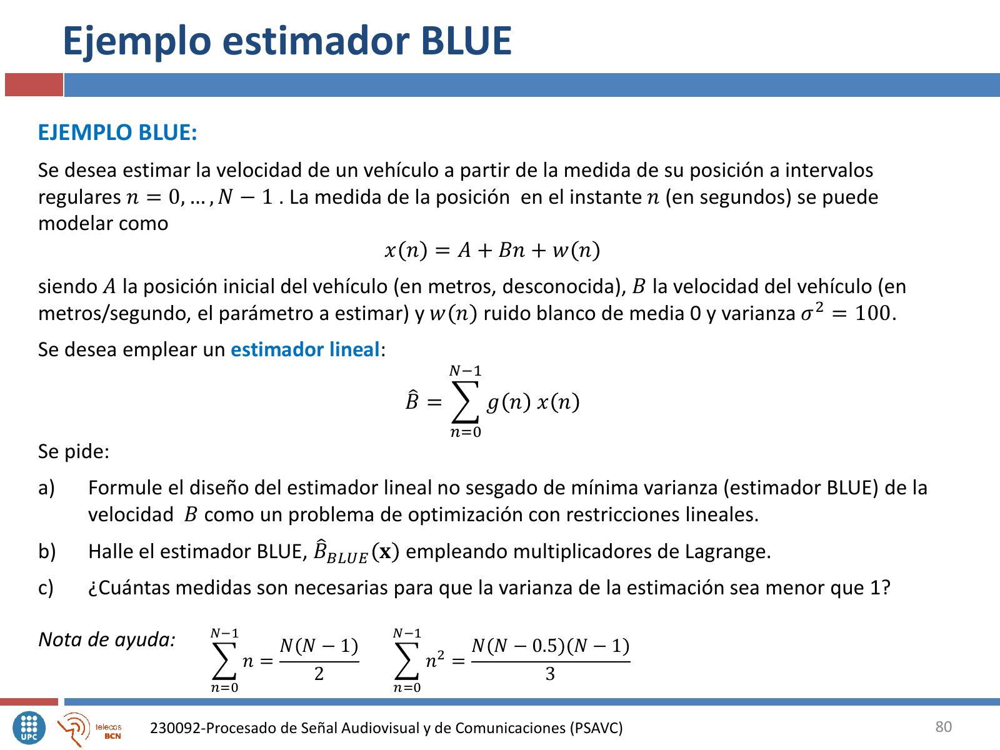

```text
     Ejemplo estimador BLUE
EJEMPLO BLUE:
Se desea estimar la velocidad de un vehículo a partir de la medida de su posición a intervalos
regulares 𝑛𝑛 = 0, … , 𝑁𝑁 − 1 . La medida de la posición en el instante 𝑛𝑛 (en segundos) se puede
modelar como
                                         𝑥𝑥 𝑛𝑛 = 𝐴𝐴 + 𝐵𝐵𝐵𝐵 + 𝑤𝑤 𝑛𝑛
siendo 𝐴𝐴 la posición inicial del vehículo (en metros, desconocida), 𝐵𝐵 la velocidad del vehículo (en
metros/segundo, el parámetro a estimar) y 𝑤𝑤 𝑛𝑛 ruido blanco de media 0 y varianza 𝜎𝜎 2 = 100.
Se desea emplear un estimador lineal:
                                                     𝑁𝑁−1

                                               𝐵𝐵� = � 𝑔𝑔 𝑛𝑛 𝑥𝑥 𝑛𝑛
                                                     𝑛𝑛=0
Se pide:
a)    Formule el diseño del estimador lineal no sesgado de mínima varianza (estimador BLUE) de la
      velocidad 𝐵𝐵 como un problema de optimización con restricciones lineales.
b)    Halle el estimador BLUE, 𝐵𝐵�𝐵𝐵𝐵𝐵𝐵𝐵𝐵𝐵 𝐱𝐱 empleando multiplicadores de Lagrange.
c)    ¿Cuántas medidas son necesarias para que la varianza de la estimación sea menor que 1?

Nota de ayuda:      𝑁𝑁−1
                           𝑁𝑁 𝑁𝑁 − 1
                                             𝑁𝑁−1
                                                        𝑁𝑁 𝑁𝑁 − 0.5 𝑁𝑁 − 1
                    � 𝑛𝑛 =                   � 𝑛𝑛2 =
                                2                                 3
                    𝑛𝑛=0                     𝑛𝑛=0

            230092-Procesado de Señal Audiovisual y de Comunicaciones (PSAVC)                           80
```

## Page 81

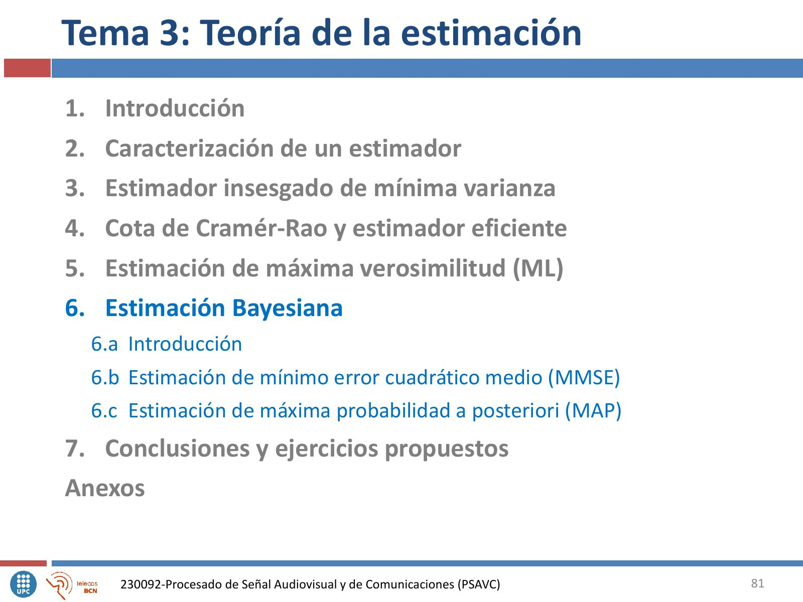

```text
Tema 3: Teoría de la estimación
1.    Introducción
2.    Caracterización de un estimador
3.    Estimador insesgado de mínima varianza
4.    Cota de Cramér-Rao y estimador eficiente
5.    Estimación de máxima verosimilitud (ML)
6.    Estimación Bayesiana
     6.a Introducción
     6.b Estimación de mínimo error cuadrático medio (MMSE)
     6.c Estimación de máxima probabilidad a posteriori (MAP)
7. Conclusiones y ejercicios propuestos
Anexos


        230092-Procesado de Señal Audiovisual y de Comunicaciones (PSAVC)   81
```

## Page 82

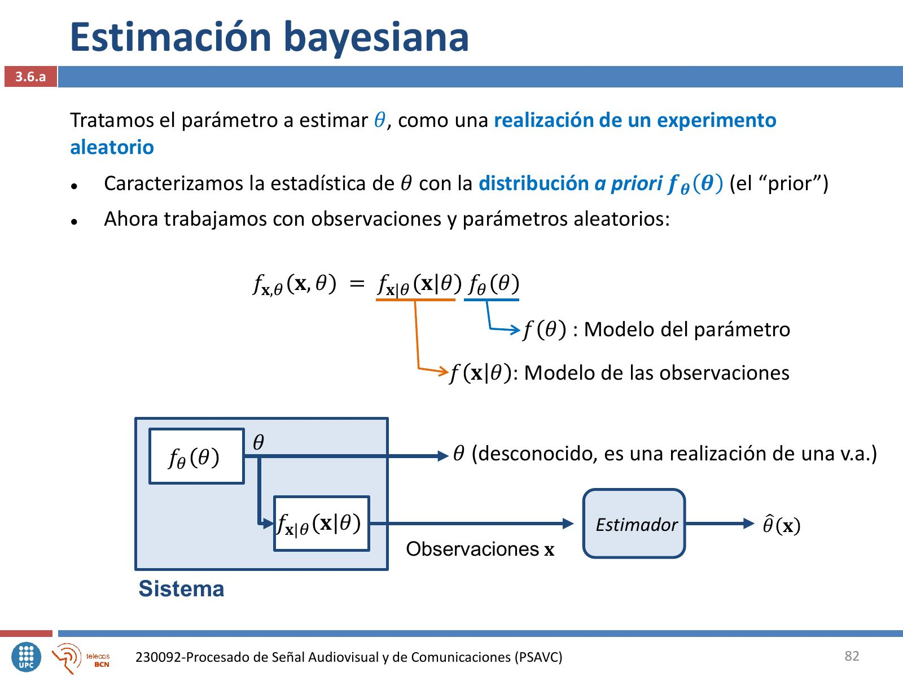

```text
        Estimación bayesiana
3.6.a


        Tratamos el parámetro a estimar 𝜃𝜃, como una realización de un experimento
        aleatorio
        ●   Caracterizamos la estadística de 𝜃𝜃 con la distribución a priori 𝒇𝒇𝜽𝜽 𝜽𝜽 (el “prior”)
        ●   Ahora trabajamos con observaciones y parámetros aleatorios:

                                𝑓𝑓𝐱𝐱,𝜃𝜃 𝐱𝐱, 𝜃𝜃 = 𝑓𝑓𝐱𝐱|𝜃𝜃 𝐱𝐱 𝜃𝜃 𝑓𝑓𝜃𝜃 𝜃𝜃

                                                                         𝑓𝑓 𝜃𝜃 : Modelo del parámetro
                                                              𝑓𝑓 𝐱𝐱 𝜃𝜃 : Modelo de las observaciones


                                𝜃𝜃                             𝜃𝜃 (desconocido, es una realización de una v.a.)
                   𝑓𝑓𝜃𝜃 𝜃𝜃

                                     𝑓𝑓𝐱𝐱|𝜃𝜃 𝐱𝐱 𝜃𝜃                                 Estimador      𝜃𝜃� 𝐱𝐱
                                                        Observaciones 𝐱𝐱

                Sistema

               230092-Procesado de Señal Audiovisual y de Comunicaciones (PSAVC)                           82
```

## Page 83

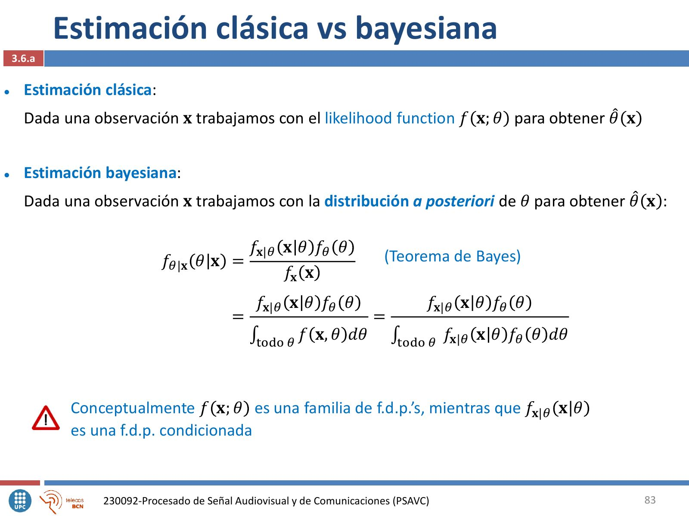

```text
            Estimación clásica vs bayesiana
    3.6.a

●     Estimación clásica:
      Dada una observación 𝐱𝐱 trabajamos con el likelihood function 𝑓𝑓 𝐱𝐱; 𝜃𝜃 para obtener 𝜃𝜃̂ 𝐱𝐱


●     Estimación bayesiana:
      Dada una observación 𝐱𝐱 trabajamos con la distribución a posteriori de 𝜃𝜃 para obtener 𝜃𝜃̂ 𝐱𝐱 :

                                               𝑓𝑓𝐱𝐱|𝜃𝜃 𝐱𝐱 𝜃𝜃 𝑓𝑓𝜃𝜃 𝜃𝜃
                             𝑓𝑓𝜃𝜃|𝐱𝐱 𝜃𝜃 𝐱𝐱 =                             (Teorema de Bayes)
                                                       𝑓𝑓𝐱𝐱 𝐱𝐱
                                                𝑓𝑓𝐱𝐱|𝜃𝜃 𝐱𝐱 𝜃𝜃 𝑓𝑓𝜃𝜃 𝜃𝜃               𝑓𝑓𝐱𝐱|𝜃𝜃 𝐱𝐱 𝜃𝜃 𝑓𝑓𝜃𝜃 𝜃𝜃
                                           =                             =
                                               ∫todo 𝜃𝜃 𝑓𝑓 𝐱𝐱, 𝜃𝜃 𝑑𝑑𝑑𝑑       ∫todo 𝜃𝜃 𝑓𝑓𝐱𝐱|𝜃𝜃 𝐱𝐱 𝜃𝜃 𝑓𝑓𝜃𝜃 𝜃𝜃 𝑑𝑑𝑑𝑑


             Conceptualmente 𝑓𝑓 𝐱𝐱; 𝜃𝜃 es una familia de f.d.p.’s, mientras que 𝑓𝑓𝐱𝐱|𝜃𝜃 𝐱𝐱 𝜃𝜃
             es una f.d.p. condicionada


                  230092-Procesado de Señal Audiovisual y de Comunicaciones (PSAVC)                                83
```

## Page 84

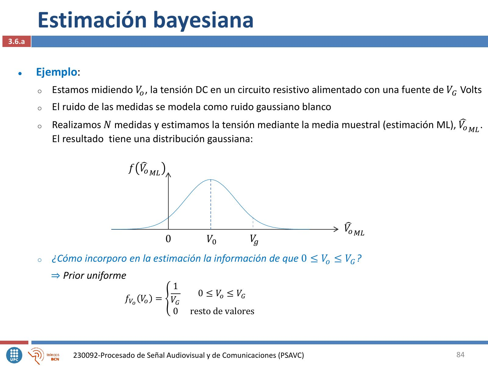

```text
        Estimación bayesiana
3.6.a


  ●     Ejemplo:
        o   Estamos midiendo 𝑉𝑉𝑜𝑜 , la tensión DC en un circuito resistivo alimentado con una fuente de 𝑉𝑉𝐺𝐺 Volts
        o   El ruido de las medidas se modela como ruido gaussiano blanco
        o   Realizamos 𝑁𝑁 medidas y estimamos la tensión mediante la media muestral (estimación ML), 𝑉𝑉�𝑜𝑜 𝑀𝑀𝑀𝑀 .
            El resultado tiene una distribución gaussiana:

                                𝑓𝑓 𝑉𝑉�𝑜𝑜 𝑀𝑀𝑀𝑀


                                                                                     𝑉𝑉�𝑜𝑜 𝑀𝑀𝑀𝑀
                                                0        𝑉𝑉0             𝑉𝑉𝑔𝑔
        o   ¿Cómo incorporo en la estimación la información de que 0 ≤ 𝑉𝑉𝑜𝑜 ≤ 𝑉𝑉𝐺𝐺 ?
            ⇒ Prior uniforme
                                               1
                                                       0 ≤ 𝑉𝑉𝑜𝑜 ≤ 𝑉𝑉𝐺𝐺
                               𝑓𝑓𝑉𝑉𝑜𝑜 𝑉𝑉𝑜𝑜 = �𝑉𝑉𝐺𝐺
                                               0     resto de valores


                 230092-Procesado de Señal Audiovisual y de Comunicaciones (PSAVC)                         84
```

## Page 85

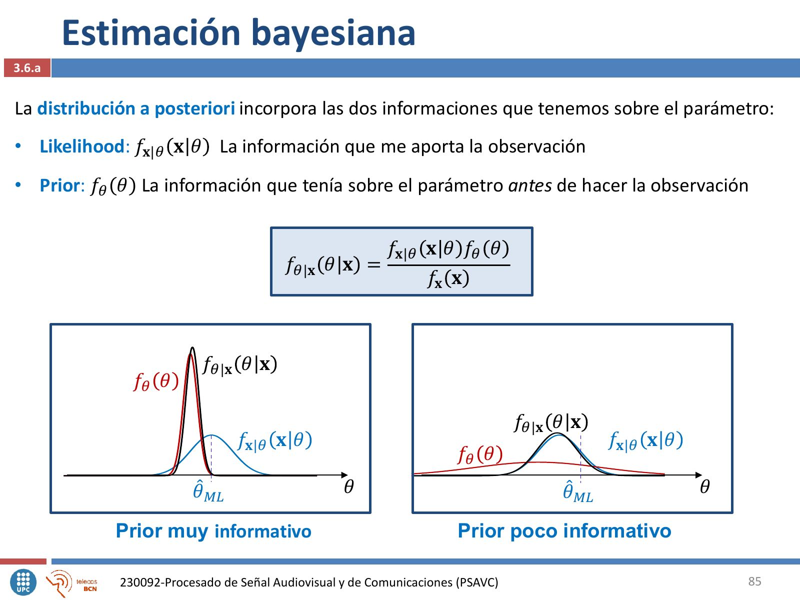

```text
        Estimación bayesiana
3.6.a


La distribución a posteriori incorpora las dos informaciones que tenemos sobre el parámetro:
• Likelihood: 𝑓𝑓𝐱𝐱|𝜃𝜃 𝐱𝐱 𝜃𝜃 La información que me aporta la observación
• Prior: 𝑓𝑓𝜃𝜃 𝜃𝜃 La información que tenía sobre el parámetro antes de hacer la observación


                                                              𝑓𝑓𝐱𝐱|𝜃𝜃 𝐱𝐱 𝜃𝜃 𝑓𝑓𝜃𝜃 𝜃𝜃
                                            𝑓𝑓𝜃𝜃|𝐱𝐱 𝜃𝜃 𝐱𝐱 =
                                                                      𝑓𝑓𝐱𝐱 𝐱𝐱


                           𝑓𝑓𝜃𝜃|𝐱𝐱 𝜃𝜃 𝐱𝐱
               𝑓𝑓𝜃𝜃 𝜃𝜃

                                                                                      𝑓𝑓𝜃𝜃|𝐱𝐱 𝜃𝜃 𝐱𝐱
                                   𝑓𝑓𝐱𝐱|𝜃𝜃 𝐱𝐱 𝜃𝜃                                                         𝑓𝑓𝐱𝐱|𝜃𝜃 𝐱𝐱 𝜃𝜃
                                                                          𝑓𝑓𝜃𝜃 𝜃𝜃
                         𝜃𝜃̂𝑀𝑀𝑀𝑀                     𝜃𝜃                                        𝜃𝜃̂𝑀𝑀𝑀𝑀                   𝜃𝜃

            Prior muy informativo                                         Prior poco informativo

             230092-Procesado de Señal Audiovisual y de Comunicaciones (PSAVC)                                                85
```

## Page 86

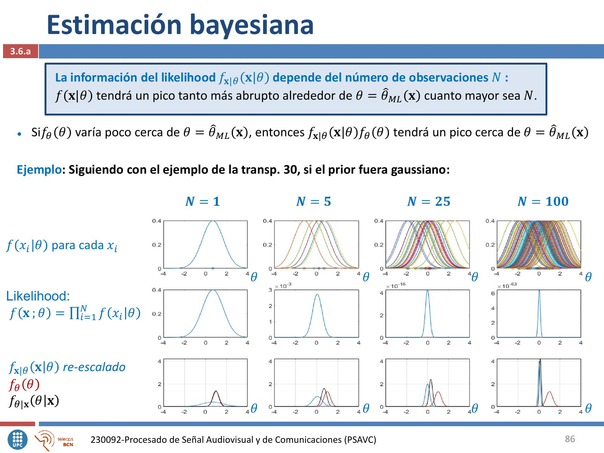

```text
           Estimación bayesiana
3.6.a

             La información del likelihood 𝑓𝑓𝐱𝐱|𝜃𝜃 𝐱𝐱 𝜃𝜃 depende del número de observaciones 𝑁𝑁 :
             𝑓𝑓 𝐱𝐱|𝜃𝜃 tendrá un pico tanto más abrupto alrededor de 𝜃𝜃 = 𝜃𝜃�𝑀𝑀𝑀𝑀 𝐱𝐱 cuanto mayor sea 𝑁𝑁.

  ●     Si𝑓𝑓𝜃𝜃 𝜃𝜃 varía poco cerca de 𝜃𝜃 = 𝜃𝜃�𝑀𝑀𝑀𝑀 𝐱𝐱 , entonces 𝑓𝑓𝐱𝐱|𝜃𝜃 𝐱𝐱 𝜃𝜃 𝑓𝑓𝜃𝜃 𝜃𝜃 tendrá un pico cerca de 𝜃𝜃 = 𝜃𝜃�𝑀𝑀𝑀𝑀 𝐱𝐱

  Ejemplo: Siguiendo con el ejemplo de la transp. 30, si el prior fuera gaussiano:

                                         𝑵𝑵 = 𝟏𝟏                  𝑵𝑵 = 𝟓𝟓               𝑵𝑵 = 𝟐𝟐𝟐𝟐              𝑵𝑵 = 𝟏𝟏𝟏𝟏𝟏𝟏


𝑓𝑓 𝑥𝑥𝑖𝑖 𝜃𝜃 para cada 𝑥𝑥𝑖𝑖

                                                        𝜃𝜃                       𝜃𝜃                   𝜃𝜃                         𝜃𝜃
Likelihood:
 𝑓𝑓 𝐱𝐱 ; 𝜃𝜃 = ∏𝑁𝑁
               𝑖𝑖=1 𝑓𝑓 𝑥𝑥𝑖𝑖 𝜃𝜃


𝑓𝑓𝐱𝐱|𝜃𝜃 𝐱𝐱 𝜃𝜃 re-escalado
𝑓𝑓𝜃𝜃 𝜃𝜃
𝑓𝑓𝜃𝜃|𝐱𝐱 𝜃𝜃 𝐱𝐱
                                                        𝜃𝜃                       𝜃𝜃                   𝜃𝜃                         𝜃𝜃

                    230092-Procesado de Señal Audiovisual y de Comunicaciones (PSAVC)                                     86
```

## Page 87

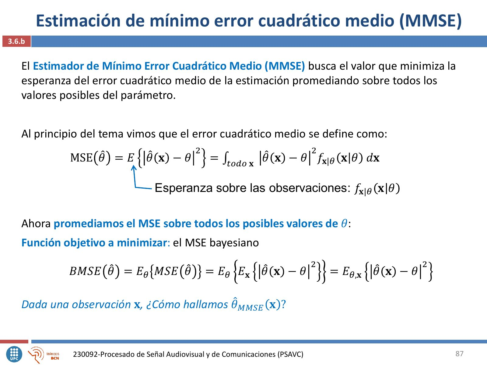

```text
        Estimación de mínimo error cuadrático medio (MMSE)
3.6.b


   El Estimador de Mínimo Error Cuadrático Medio (MMSE) busca el valor que minimiza la
   esperanza del error cuadrático medio de la estimación promediando sobre todos los
   valores posibles del parámetro.


   Al principio del tema vimos que el error cuadrático medio se define como:
                                      2                           2
             MSE 𝜃𝜃̂ = 𝐸𝐸 𝜃𝜃̂ 𝐱𝐱 − 𝜃𝜃   = ∫𝑡𝑡𝑜𝑜𝑜𝑜𝑜𝑜 𝐱𝐱 𝜃𝜃̂ 𝐱𝐱 − 𝜃𝜃 𝑓𝑓𝐱𝐱|𝜃𝜃 𝐱𝐱 𝜃𝜃 𝑑𝑑𝐱𝐱

                                    Esperanza sobre las observaciones: 𝑓𝑓𝐱𝐱|𝜃𝜃 𝐱𝐱 𝜃𝜃

   Ahora promediamos el MSE sobre todos los posibles valores de 𝜃𝜃:
   Función objetivo a minimizar: el MSE bayesiano
                                                                          2                            2
             𝐵𝐵𝐵𝐵𝐵𝐵𝐵𝐵 𝜃𝜃̂ = 𝐸𝐸𝜃𝜃 𝑀𝑀𝑀𝑀𝑀𝑀 𝜃𝜃̂       = 𝐸𝐸𝜃𝜃 𝐸𝐸𝐱𝐱 𝜃𝜃̂ 𝐱𝐱 − 𝜃𝜃        = 𝐸𝐸𝜃𝜃,𝐱𝐱 𝜃𝜃̂ 𝐱𝐱 − 𝜃𝜃

   Dada una observación 𝐱𝐱, ¿Cómo hallamos 𝜃𝜃̂𝑀𝑀𝑀𝑀𝑀𝑀𝑀𝑀 𝐱𝐱 ?


             230092-Procesado de Señal Audiovisual y de Comunicaciones (PSAVC)                             87
```

## Page 88

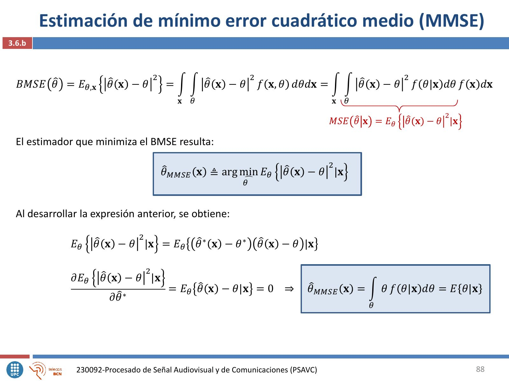

```text
        Estimación de mínimo error cuadrático medio (MMSE)
3.6.b


                                     2                  2                                    2
  𝐵𝐵𝐵𝐵𝐵𝐵𝐵𝐵 𝜃𝜃� = 𝐸𝐸𝜃𝜃,𝐱𝐱 𝜃𝜃� 𝐱𝐱 − 𝜃𝜃   = � � 𝜃𝜃� 𝐱𝐱 − 𝜃𝜃 𝑓𝑓 𝐱𝐱, 𝜃𝜃 𝑑𝑑𝜃𝜃𝑑𝑑𝐱𝐱 = � � 𝜃𝜃� 𝐱𝐱 − 𝜃𝜃 𝑓𝑓 𝜃𝜃|𝐱𝐱 𝑑𝑑𝑑𝑑 𝑓𝑓 𝐱𝐱 𝑑𝑑𝐱𝐱
                                            𝐱𝐱 𝜃𝜃                                   𝐱𝐱 𝜃𝜃
                                                                                                                    2
                                                                                    𝑀𝑀𝑀𝑀𝑀𝑀 𝜃𝜃� 𝐱𝐱 = 𝐸𝐸𝜃𝜃 𝜃𝜃� 𝐱𝐱 − 𝜃𝜃 |𝐱𝐱

  El estimador que minimiza el BMSE resulta:

                                                                                 2
                                        𝜃𝜃�𝑀𝑀𝑀𝑀𝑀𝑀𝑀𝑀 𝐱𝐱 ≜ arg min 𝐸𝐸𝜃𝜃 𝜃𝜃� 𝐱𝐱 − 𝜃𝜃 |𝐱𝐱
                                                            𝜃𝜃�


  Al desarrollar la expresión anterior, se obtiene:

                               2
               𝐸𝐸𝜃𝜃 𝜃𝜃� 𝐱𝐱 − 𝜃𝜃 |𝐱𝐱 = 𝐸𝐸𝜃𝜃 𝜃𝜃� ∗ 𝐱𝐱 − 𝜃𝜃 ∗ 𝜃𝜃� 𝐱𝐱 − 𝜃𝜃 |𝐱𝐱

                                 2
               𝜕𝜕𝐸𝐸𝜃𝜃 𝜃𝜃� 𝐱𝐱 − 𝜃𝜃 |𝐱𝐱
                                         = 𝐸𝐸𝜃𝜃 𝜃𝜃� 𝐱𝐱 − 𝜃𝜃|𝐱𝐱 = 0 ⇒          𝜃𝜃�𝑀𝑀𝑀𝑀𝑀𝑀𝑀𝑀 𝐱𝐱 = � 𝜃𝜃 𝑓𝑓 𝜃𝜃|𝐱𝐱 𝑑𝑑𝑑𝑑 = 𝐸𝐸 𝜃𝜃|𝐱𝐱
                        𝜕𝜕𝜃𝜃� ∗
                                                                                               𝜃𝜃


                230092-Procesado de Señal Audiovisual y de Comunicaciones (PSAVC)                                          88
```

## Page 89

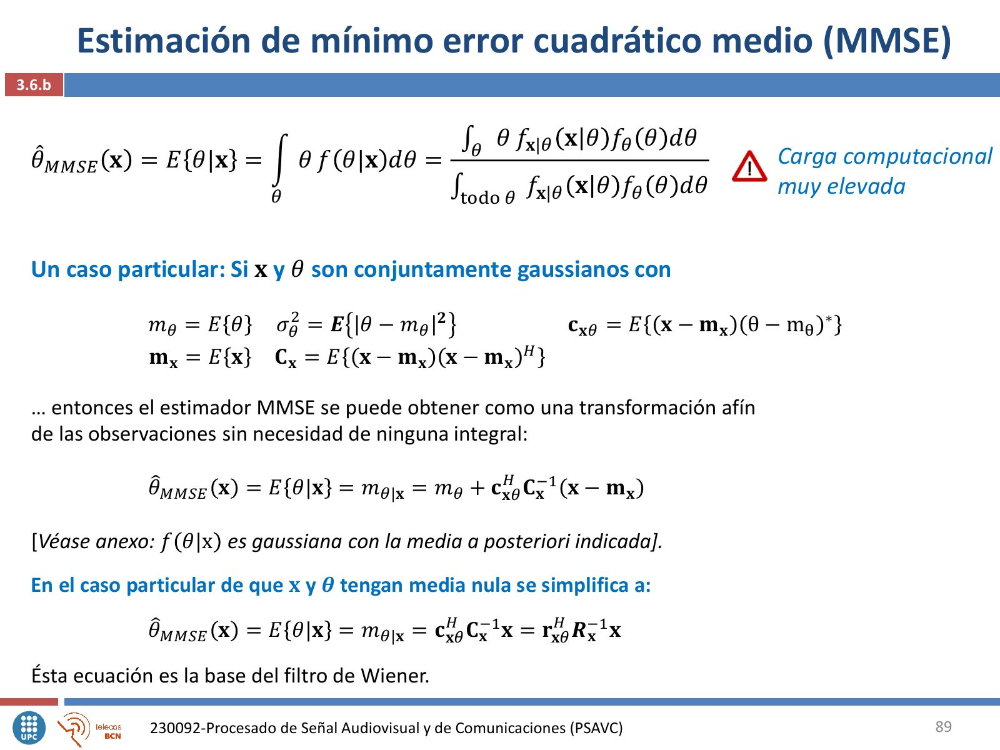

```text
        Estimación de mínimo error cuadrático medio (MMSE)
3.6.b


                                                            ∫𝜃𝜃 𝜃𝜃 𝑓𝑓𝐱𝐱|𝜃𝜃 𝐱𝐱 𝜃𝜃 𝑓𝑓𝜃𝜃 𝜃𝜃 𝑑𝑑𝑑𝑑
  𝜃𝜃̂𝑀𝑀𝑀𝑀𝑀𝑀𝑀𝑀 𝐱𝐱 = 𝐸𝐸 𝜃𝜃|𝐱𝐱 = � 𝜃𝜃 𝑓𝑓 𝜃𝜃|𝐱𝐱 𝑑𝑑𝑑𝑑 =                                                 Carga computacional
                                𝜃𝜃                         ∫todo 𝜃𝜃 𝑓𝑓𝐱𝐱|𝜃𝜃 𝐱𝐱 𝜃𝜃 𝑓𝑓𝜃𝜃 𝜃𝜃 𝑑𝑑𝑑𝑑     muy elevada


  Un caso particular: Si 𝐱𝐱 y 𝜃𝜃 son conjuntamente gaussianos con

               𝑚𝑚𝜃𝜃 = 𝐸𝐸 𝜃𝜃      𝜎𝜎𝜃𝜃2 = 𝑬𝑬 𝜃𝜃 − 𝑚𝑚𝜃𝜃 𝟐𝟐                    𝐜𝐜𝐱𝐱𝜃𝜃 = 𝐸𝐸 𝐱𝐱 − 𝐦𝐦𝐱𝐱 θ − mθ ∗
               𝐦𝐦𝐱𝐱 = 𝐸𝐸 𝐱𝐱      𝐂𝐂𝐱𝐱 = 𝐸𝐸 𝐱𝐱 − 𝐦𝐦𝐱𝐱 𝐱𝐱 − 𝐦𝐦𝐱𝐱 𝐻𝐻

  … entonces el estimador MMSE se puede obtener como una transformación afín
  de las observaciones sin necesidad de ninguna integral:

               𝜃𝜃�𝑀𝑀𝑀𝑀𝑀𝑀𝑀𝑀 𝐱𝐱 = 𝐸𝐸 𝜃𝜃|𝐱𝐱 = 𝑚𝑚𝜃𝜃|𝐱𝐱 = 𝑚𝑚𝜃𝜃 + 𝐜𝐜𝐱𝐱𝜃𝜃
                                                              𝐻𝐻 −1
                                                                   𝐂𝐂𝐱𝐱 𝐱𝐱 − 𝐦𝐦𝐱𝐱

  [Véase anexo: 𝑓𝑓 𝜃𝜃|x es gaussiana con la media a posteriori indicada].
  En el caso particular de que 𝐱𝐱 y 𝜽𝜽 tengan media nula se simplifica a:

               𝜃𝜃�𝑀𝑀𝑀𝑀𝑀𝑀𝑀𝑀 𝐱𝐱 = 𝐸𝐸 𝜃𝜃|𝐱𝐱 = 𝑚𝑚𝜃𝜃|𝐱𝐱 = 𝐜𝐜𝐱𝐱𝜃𝜃
                                                       𝐻𝐻 −1             𝐻𝐻 −1
                                                            𝐂𝐂𝐱𝐱 𝐱𝐱 = 𝐫𝐫𝐱𝐱𝜃𝜃 𝑹𝑹𝐱𝐱 𝐱𝐱

  Ésta ecuación es la base del filtro de Wiener.

               230092-Procesado de Señal Audiovisual y de Comunicaciones (PSAVC)                                89
```

## Page 90

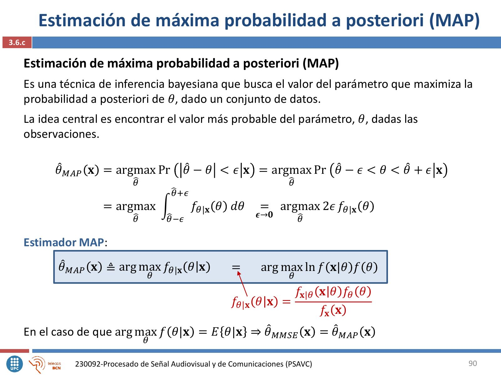

```text
        Estimación de máxima probabilidad a posteriori (MAP)
3.6.c

    Estimación de máxima probabilidad a posteriori (MAP)
    Es una técnica de inferencia bayesiana que busca el valor del parámetro que maximiza la
    probabilidad a posteriori de 𝜃𝜃, dado un conjunto de datos.
    La idea central es encontrar el valor más probable del parámetro, 𝜃𝜃, dadas las
    observaciones.

          𝜃𝜃̂𝑀𝑀𝑀𝑀𝑀𝑀 𝐱𝐱 = argmax Pr 𝜃𝜃̂ − 𝜃𝜃 < 𝜖𝜖 𝐱𝐱 = argmax Pr 𝜃𝜃̂ − 𝜖𝜖 < 𝜃𝜃 < 𝜃𝜃̂ + 𝜖𝜖 𝐱𝐱
                              �
                              𝜃𝜃                                            �
                                                                            𝜃𝜃
                                          �
                                          𝜃𝜃+𝜖𝜖
                      = argmax �                  𝑓𝑓𝜃𝜃|𝐱𝐱 𝜃𝜃 𝑑𝑑𝑑𝑑    = argmax 2𝜖𝜖 𝑓𝑓𝜃𝜃|𝐱𝐱 𝜃𝜃
                              �
                              𝜃𝜃         �
                                         𝜃𝜃−𝜖𝜖                      𝝐𝝐→𝟎𝟎        �
                                                                                 𝜃𝜃

    Estimador MAP:
           𝜃𝜃̂𝑀𝑀𝐴𝐴𝐴𝐴 𝐱𝐱 ≜ arg max 𝑓𝑓𝜃𝜃|𝐱𝐱 𝜃𝜃|𝐱𝐱              =       arg max ln 𝑓𝑓 𝐱𝐱|𝜃𝜃 𝑓𝑓 𝜃𝜃
                                    𝜃𝜃                                      𝜃𝜃
                                                                                 𝑓𝑓𝐱𝐱|𝜃𝜃 𝐱𝐱 𝜃𝜃 𝑓𝑓𝜃𝜃 𝜃𝜃
                                                             𝑓𝑓𝜃𝜃|𝐱𝐱 𝜃𝜃 𝐱𝐱 =
                                                                                         𝑓𝑓𝐱𝐱 𝐱𝐱
    En el caso de que arg max 𝑓𝑓 𝜃𝜃|𝐱𝐱 = 𝐸𝐸 𝜃𝜃|𝐱𝐱 ⇒ 𝜃𝜃̂𝑀𝑀𝑀𝑀𝑀𝑀𝑀𝑀 𝐱𝐱 = 𝜃𝜃̂𝑀𝑀𝑀𝑀𝑀𝑀 𝐱𝐱
                                   𝜃𝜃

               230092-Procesado de Señal Audiovisual y de Comunicaciones (PSAVC)                         90
```

## Page 91

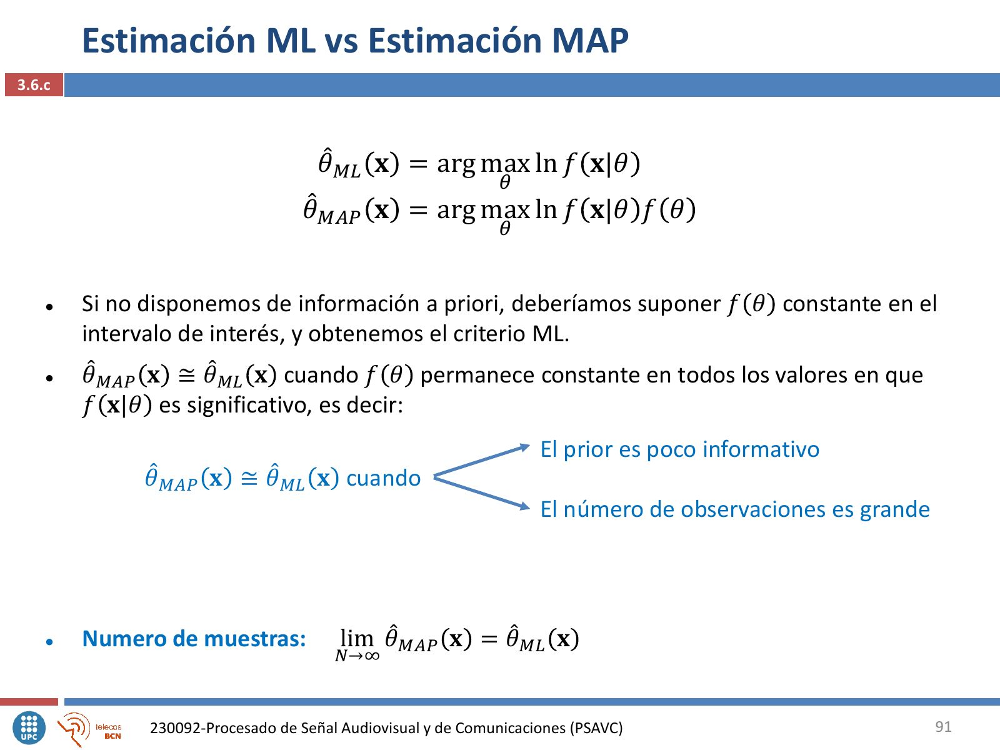

```text
        Estimación ML vs Estimación MAP
3.6.c


                                     𝜃𝜃̂𝑀𝑀𝐿𝐿 𝐱𝐱 = arg max ln 𝑓𝑓 𝐱𝐱|𝜃𝜃
                                                             𝜃𝜃
                                  𝜃𝜃̂𝑀𝑀𝑀𝑀𝑀𝑀 𝐱𝐱 = arg max ln 𝑓𝑓 𝐱𝐱|𝜃𝜃 𝑓𝑓 𝜃𝜃
                                                             𝜃𝜃


    ●   Si no disponemos de información a priori, deberíamos suponer 𝑓𝑓 𝜃𝜃 constante en el
        intervalo de interés, y obtenemos el criterio ML.
    ●   𝜃𝜃̂𝑀𝑀𝑀𝑀𝑀𝑀 𝐱𝐱 ≅ 𝜃𝜃̂𝑀𝑀𝐿𝐿 𝐱𝐱 cuando 𝑓𝑓 𝜃𝜃 permanece constante en todos los valores en que
        𝑓𝑓 𝐱𝐱|𝜃𝜃 es significativo, es decir:
                                                                   El prior es poco informativo
              𝜃𝜃̂𝑀𝑀𝑀𝑀𝑀𝑀 𝐱𝐱 ≅ 𝜃𝜃̂𝑀𝑀𝐿𝐿 𝐱𝐱 cuando
                                                                   El número de observaciones es grande


    ●   Numero de muestras:             lim 𝜃𝜃̂𝑀𝑀𝐴𝐴𝐴𝐴 𝐱𝐱 = 𝜃𝜃̂𝑀𝑀𝑀𝑀 𝐱𝐱
                                       𝑁𝑁→∞


              230092-Procesado de Señal Audiovisual y de Comunicaciones (PSAVC)                           91
```

## Page 92

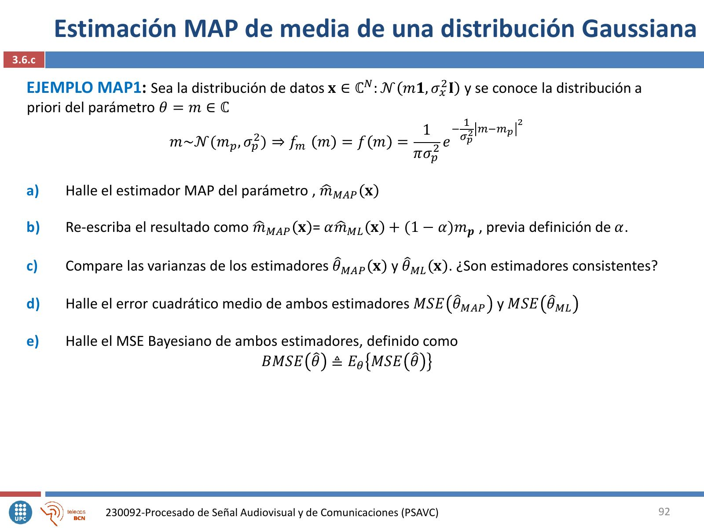

```text
        Estimación MAP de media de una distribución Gaussiana
3.6.c

   EJEMPLO MAP1: Sea la distribución de datos 𝐱𝐱 ∈ ℂ𝑁𝑁 : 𝒩𝒩 𝑚𝑚𝟏𝟏, 𝜎𝜎𝑥𝑥2 𝐈𝐈 y se conoce la distribución a
   priori del parámetro 𝜃𝜃 = 𝑚𝑚 ∈ ℂ
                                                                                   1     2
                                                                        1 −𝜎𝜎2 𝑚𝑚−𝑚𝑚𝑝𝑝
                           𝑚𝑚~𝒩𝒩(𝑚𝑚𝑝𝑝 , 𝜎𝜎𝑝𝑝2 ) ⇒ 𝑓𝑓𝑚𝑚   𝑚𝑚 = 𝑓𝑓 𝑚𝑚 =      2 𝑒𝑒
                                                                                𝑝𝑝
                                                                      𝜋𝜋𝜎𝜎𝑝𝑝

   a)    Halle el estimador MAP del parámetro , 𝑚𝑚
                                                � 𝑀𝑀𝐴𝐴𝐴𝐴 𝐱𝐱

   b)    Re-escriba el resultado como 𝑚𝑚
                                      � 𝑀𝑀𝑀𝑀𝑀𝑀 𝐱𝐱 = 𝛼𝛼 𝑚𝑚
                                                       � 𝑀𝑀𝑀𝑀 𝐱𝐱 + (1 − 𝛼𝛼)𝑚𝑚𝒑𝒑 , previa definición de 𝛼𝛼.

   c)    Compare las varianzas de los estimadores 𝜃𝜃�𝑀𝑀𝑀𝑀𝑀𝑀 𝐱𝐱 y 𝜃𝜃�𝑀𝑀𝐿𝐿 𝐱𝐱 . ¿Son estimadores consistentes?

   d)    Halle el error cuadrático medio de ambos estimadores 𝑀𝑀𝑀𝑀𝑀𝑀 𝜃𝜃�𝑀𝑀𝑀𝑀𝑀𝑀 y 𝑀𝑀𝑀𝑀𝑀𝑀 𝜃𝜃�𝑀𝑀𝐿𝐿

   e)    Halle el MSE Bayesiano de ambos estimadores, definido como
                                      𝐵𝐵𝐵𝐵𝐵𝐵𝐵𝐵 𝜃𝜃� ≜ 𝐸𝐸𝜃𝜃 𝑀𝑀𝑀𝑀𝑀𝑀 𝜃𝜃�


               230092-Procesado de Señal Audiovisual y de Comunicaciones (PSAVC)                               92
```

## Page 93

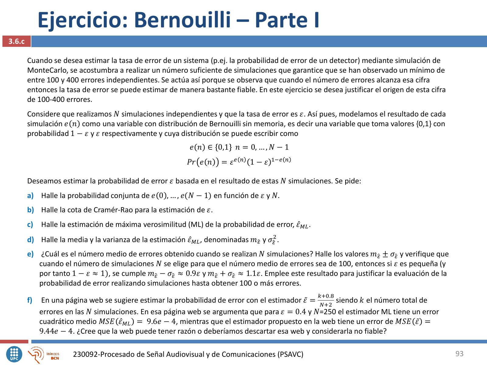

```text
             Ejercicio: Bernouilli – Parte I
3.6.c

        Cuando se desea estimar la tasa de error de un sistema (p.ej. la probabilidad de error de un detector) mediante simulación de
        MonteCarlo, se acostumbra a realizar un número suficiente de simulaciones que garantice que se han observado un mínimo de
        entre 100 y 400 errores independientes. Se actúa así porque se observa que cuando el número de errores alcanza esa cifra
        entonces la tasa de error se puede estimar de manera bastante fiable. En este ejercicio se desea justificar el origen de esta cifra
        de 100-400 errores.
        Considere que realizamos 𝑁𝑁 simulaciones independientes y que la tasa de error es 𝜀𝜀. Así pues, modelamos el resultado de cada
        simulación 𝑒𝑒 𝑛𝑛 como una variable con distribución de Bernouilli sin memoria, es decir una variable que toma valores {0,1} con
        probabilidad 1 − 𝜀𝜀 y 𝜀𝜀 respectivamente y cuya distribución se puede escribir como
                                                              𝑒𝑒 𝑛𝑛 ∈ 0,1 𝑛𝑛 = 0, … , 𝑁𝑁 − 1
                                                             𝑃𝑃𝑃𝑃 𝑒𝑒 𝑛𝑛   = 𝜀𝜀 𝑒𝑒 𝑛𝑛 1 − 𝜀𝜀 1−𝑒𝑒 𝑛𝑛

        Deseamos estimar la probabilidad de error 𝜀𝜀 basada en el resultado de estas 𝑁𝑁 simulaciones. Se pide:
        a) Halle la probabilidad conjunta de 𝑒𝑒 0 , … , 𝑒𝑒(𝑁𝑁 − 1) en función de 𝜀𝜀 y 𝑁𝑁.
        b) Halle la cota de Cramér-Rao para la estimación de 𝜀𝜀.
        c) Halle la estimación de máxima verosimilitud (ML) de la probabilidad de error, 𝜀𝜀𝑀𝑀𝑀𝑀
                                                                                           ̂ .
                                                           ̂ , denominadas 𝑚𝑚 �𝜀𝜀 y 𝜎𝜎�𝜀𝜀2 .
        d) Halle la media y la varianza de la estimación 𝜀𝜀𝑀𝑀𝑀𝑀
        e) ¿Cuál es el número medio de errores obtenido cuando se realizan 𝑁𝑁 simulaciones? Halle los valores 𝑚𝑚 �𝜀𝜀 ± 𝜎𝜎�𝜀𝜀 y verifique que
           cuando el número de simulaciones 𝑁𝑁 se elige para que el número medio de errores sea de 100, entonces si 𝜀𝜀 es pequeña (y
           por tanto 1 − 𝜀𝜀 ≈ 1), se cumple 𝑚𝑚 �𝜀𝜀 − 𝜎𝜎�𝜀𝜀 ≈ 0.9𝜀𝜀 y 𝑚𝑚 �𝜀𝜀 + 𝜎𝜎�𝜀𝜀 ≈ 1.1𝜀𝜀. Emplee este resultado para justificar la evaluación de la
           probabilidad de error realizando simulaciones hasta obtener 100 o más errores.
                                                                                                         𝑘𝑘+0.8
        f)    En una página web se sugiere estimar la probabilidad de error con el estimador 𝜀𝜀̃ = 𝑁𝑁+2 siendo 𝑘𝑘 el número total de
             errores en las 𝑁𝑁 simulaciones. En esa página web se argumenta que para 𝜀𝜀 = 0.4 y 𝑁𝑁=250 el estimador ML tiene un error
             cuadrático medio 𝑀𝑀𝑀𝑀𝑀𝑀 𝜀𝜀𝑀𝑀𝑀𝑀
                                       ̂    = 9.6𝑒𝑒 − 4, mientras que el estimador propuesto en la web tiene un error de 𝑀𝑀𝑀𝑀𝑀𝑀 𝜀𝜀̃ =
             9.44𝑒𝑒 − 4. ¿Cree que la web puede tener razón o deberíamos descartar esa web y considerarla no fiable?

                       230092-Procesado de Señal Audiovisual y de Comunicaciones (PSAVC)                                                                 93
```

## Page 94

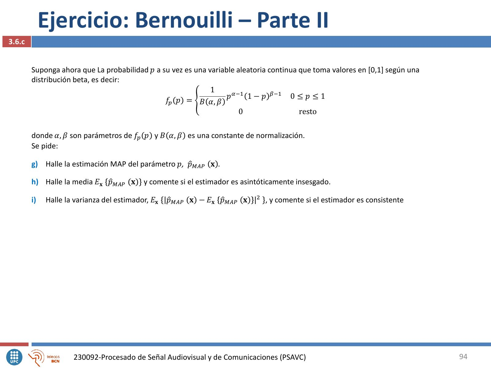

```text
             Ejercicio: Bernouilli – Parte II
3.6.c


        Suponga ahora que La probabilidad 𝑝𝑝 a su vez es una variable aleatoria continua que toma valores en [0,1] según una
        distribución beta, es decir:
                                                               1
                                                                     𝑝𝑝𝛼𝛼−1 1 − 𝑝𝑝 𝛽𝛽−1 0 ≤ 𝑝𝑝 ≤ 1
                                                𝑓𝑓𝑝𝑝 𝑝𝑝 = �𝐵𝐵 𝛼𝛼, 𝛽𝛽
                                                                          0               resto

        donde 𝛼𝛼, 𝛽𝛽 son parámetros de 𝑓𝑓𝑝𝑝 𝑝𝑝 y 𝐵𝐵 𝛼𝛼, 𝛽𝛽 es una constante de normalización.
        Se pide:

        g) Halle la estimación MAP del parámetro 𝑝𝑝, 𝑝𝑝�𝑀𝑀𝑀𝑀𝑀𝑀 𝐱𝐱 .

        h) Halle la media 𝐸𝐸𝐱𝐱 𝑝𝑝�𝑀𝑀𝑀𝑀𝑀𝑀 𝐱𝐱   y comente si el estimador es asintóticamente insesgado.
                                                                                      2
        i)   Halle la varianza del estimador, 𝐸𝐸𝐱𝐱 𝑝𝑝�𝑀𝑀𝑀𝑀𝑀𝑀 𝐱𝐱 − 𝐸𝐸𝐱𝐱 𝑝𝑝�𝑀𝑀𝑀𝑀𝑀𝑀 𝐱𝐱       , y comente si el estimador es consistente


                      230092-Procesado de Señal Audiovisual y de Comunicaciones (PSAVC)                                                94
```

## Page 95

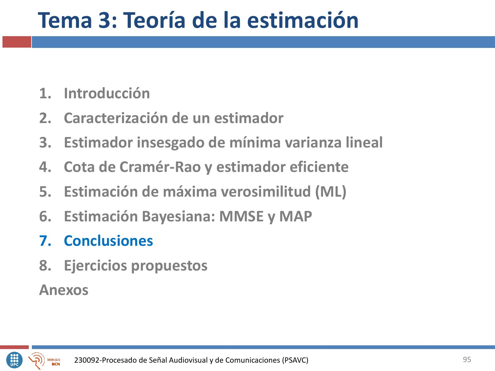

```text
Tema 3: Teoría de la estimación

1. Introducción
2. Caracterización de un estimador
3. Estimador insesgado de mínima varianza lineal
4. Cota de Cramér-Rao y estimador eficiente
5. Estimación de máxima verosimilitud (ML)
6. Estimación Bayesiana: MMSE y MAP
7. Conclusiones
8. Ejercicios propuestos
Anexos


    230092-Procesado de Señal Audiovisual y de Comunicaciones (PSAVC)   95
```

## Page 96

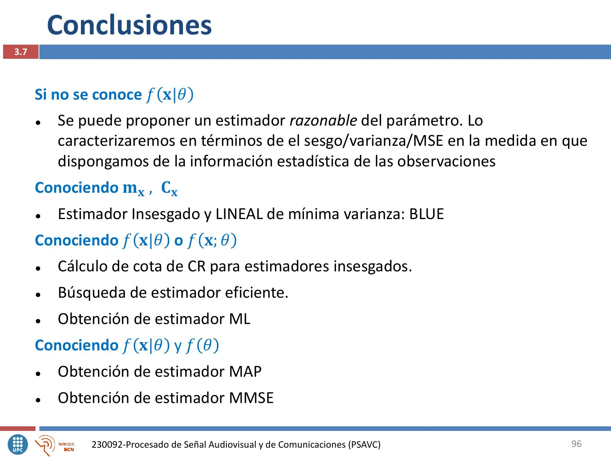

```text
          Conclusiones
3.7


      Si no se conoce 𝑓𝑓 𝐱𝐱|𝜃𝜃
      ●   Se puede proponer un estimador razonable del parámetro. Lo
          caracterizaremos en términos de el sesgo/varianza/MSE en la medida en que
          dispongamos de la información estadística de las observaciones
      Conociendo 𝐦𝐦𝐱𝐱 , 𝐂𝐂𝐱𝐱
      ●   Estimador Insesgado y LINEAL de mínima varianza: BLUE
      Conociendo 𝑓𝑓 𝐱𝐱|𝜃𝜃 o 𝑓𝑓 𝐱𝐱; 𝜃𝜃
      ●   Cálculo de cota de CR para estimadores insesgados.
      ●   Búsqueda de estimador eficiente.
      ●   Obtención de estimador ML
      Conociendo 𝑓𝑓 𝐱𝐱|𝜃𝜃 y 𝑓𝑓 𝜃𝜃
      ●   Obtención de estimador MAP
      ●   Obtención de estimador MMSE

              230092-Procesado de Señal Audiovisual y de Comunicaciones (PSAVC)   96
```

## Page 97

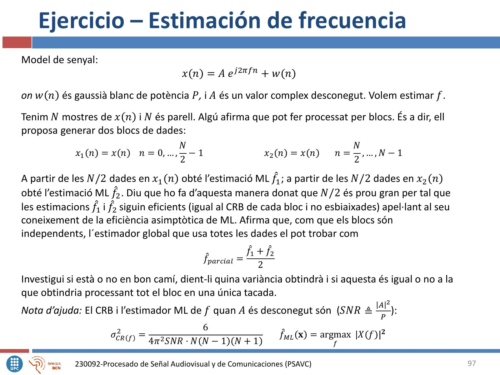

```text
    Ejercicio – Estimación de frecuencia
Model de senyal:
                                             𝑥𝑥 𝑛𝑛 = 𝐴𝐴 𝑒𝑒 𝑗𝑗𝑗𝑗𝑗𝑗𝑗𝑗𝑗 + 𝑤𝑤 𝑛𝑛
on 𝑤𝑤 𝑛𝑛 és gaussià blanc de potència 𝑃𝑃, i 𝐴𝐴 és un valor complex desconegut. Volem estimar 𝑓𝑓.
Tenim 𝑁𝑁 mostres de 𝑥𝑥 𝑛𝑛 i 𝑁𝑁 és parell. Algú afirma que pot fer processat per blocs. És a dir, ell
proposa generar dos blocs de dades:
                                            𝑁𝑁                                                            𝑁𝑁
             𝑥𝑥1 𝑛𝑛 = 𝑥𝑥 𝑛𝑛   𝑛𝑛 = 0, … ,      −1                            𝑥𝑥2 𝑛𝑛 = 𝑥𝑥 𝑛𝑛        𝑛𝑛 =      , … , 𝑁𝑁 − 1
                                            2                                                             2

A partir de les 𝑁𝑁/2 dades en 𝑥𝑥1 𝑛𝑛 obté l’estimació ML 𝑓𝑓̂1 ; a partir de les 𝑁𝑁/2 dades en 𝑥𝑥2 𝑛𝑛
obté l’estimació ML 𝑓𝑓̂2 . Diu que ho fa d’aquesta manera donat que 𝑁𝑁/2 és prou gran per tal que
les estimacions 𝑓𝑓̂1 i 𝑓𝑓̂2 siguin eficients (igual al CRB de cada bloc i no esbiaixades) apel·lant al seu
coneixement de la eficiència asimptòtica de ML. Afirma que, com que els blocs són
independents, l´estimador global que usa totes les dades el pot trobar com
                                                                       𝑓𝑓̂1 + 𝑓𝑓̂2
                                                     ̂
                                                    𝑓𝑓𝑝𝑝𝑝𝑝𝑝𝑝𝑝𝑝𝑝𝑝𝑝𝑝𝑝𝑝 =
                                                                            2
Investigui si està o no en bon camí, dient-li quina variància obtindrà i si aquesta és igual o no a la
que obtindria processant tot el bloc en una única tacada.
                                                                                                                 𝐴𝐴 2
Nota d’ajuda: El CRB i l’estimador ML de 𝑓𝑓 quan 𝐴𝐴 és desconegut són (𝑆𝑆𝑆𝑆𝑆𝑆 ≜                                       ):
                                                                                                                  𝑃𝑃
                                                      6
                         2
                      𝜎𝜎𝐶𝐶𝐶𝐶 𝑓𝑓 =                                                    𝑓𝑓̂𝑀𝑀𝑀𝑀 𝐱𝐱 = argmax 𝑋𝑋 𝑓𝑓    𝟐𝟐
                                    4𝜋𝜋 2 𝑆𝑆𝑆𝑆𝑆𝑆 · 𝑁𝑁 𝑁𝑁 − 1 𝑁𝑁 + 1                                𝑓𝑓

             230092-Procesado de Señal Audiovisual y de Comunicaciones (PSAVC)                                              97
```

## Page 98

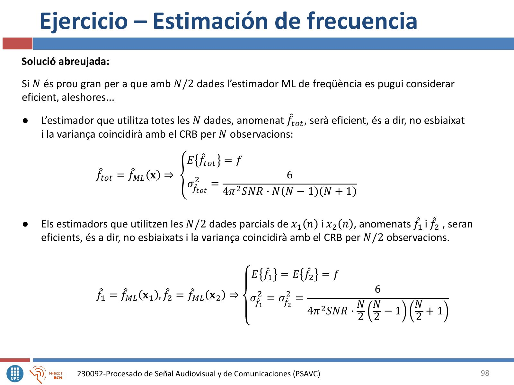

```text
    Ejercicio – Estimación de frecuencia
Solució abreujada:
Si 𝑁𝑁 és prou gran per a que amb 𝑁𝑁/2 dades l’estimador ML de freqüència es pugui considerar
eficient, aleshores...

●   L’estimador que utilitza totes les 𝑁𝑁 dades, anomenat 𝑓𝑓̂𝑡𝑡𝑡𝑡𝑡𝑡 , serà eficient, és a dir, no esbiaixat
    i la variança coincidirà amb el CRB per 𝑁𝑁 observacions:

                                          𝐸𝐸 𝑓𝑓̂𝑡𝑡𝑡𝑡𝑡𝑡 = 𝑓𝑓
                 𝑓𝑓̂𝑡𝑡𝑡𝑡𝑡𝑡 = 𝑓𝑓̂𝑀𝑀𝑀𝑀 𝐱𝐱 ⇒ � 2                          6
                                           𝜎𝜎𝑓𝑓̂ =
                                            𝑡𝑡𝑡𝑡𝑡𝑡   4𝜋𝜋 2 𝑆𝑆𝑆𝑆𝑆𝑆 · 𝑁𝑁 𝑁𝑁 − 1 𝑁𝑁 + 1

●   Els estimadors que utilitzen les 𝑁𝑁/2 dades parcials de 𝑥𝑥1 𝑛𝑛 i 𝑥𝑥2 𝑛𝑛 , anomenats 𝑓𝑓̂1 i 𝑓𝑓̂2 , seran
    eficients, és a dir, no esbiaixats i la variança coincidirà amb el CRB per 𝑁𝑁/2 observacions.


                                                              𝐸𝐸 𝑓𝑓̂1 = 𝐸𝐸 𝑓𝑓̂2 = 𝑓𝑓
                 𝑓𝑓̂1 = 𝑓𝑓̂𝑀𝑀𝑀𝑀 𝐱𝐱1 , 𝑓𝑓̂2 = 𝑓𝑓̂𝑀𝑀𝑀𝑀 𝐱𝐱 2 ⇒ 𝜎𝜎 2̂ = 𝜎𝜎 2̂ =                     6
                                                              𝑓𝑓
                                                               1      𝑓𝑓
                                                                      2                      𝑁𝑁 𝑁𝑁      𝑁𝑁
                                                                              4𝜋𝜋 2 𝑆𝑆𝑆𝑆𝑆𝑆 ·       −1      +1
                                                                                             2 2        2


            230092-Procesado de Señal Audiovisual y de Comunicaciones (PSAVC)                                   98
```

## Page 99

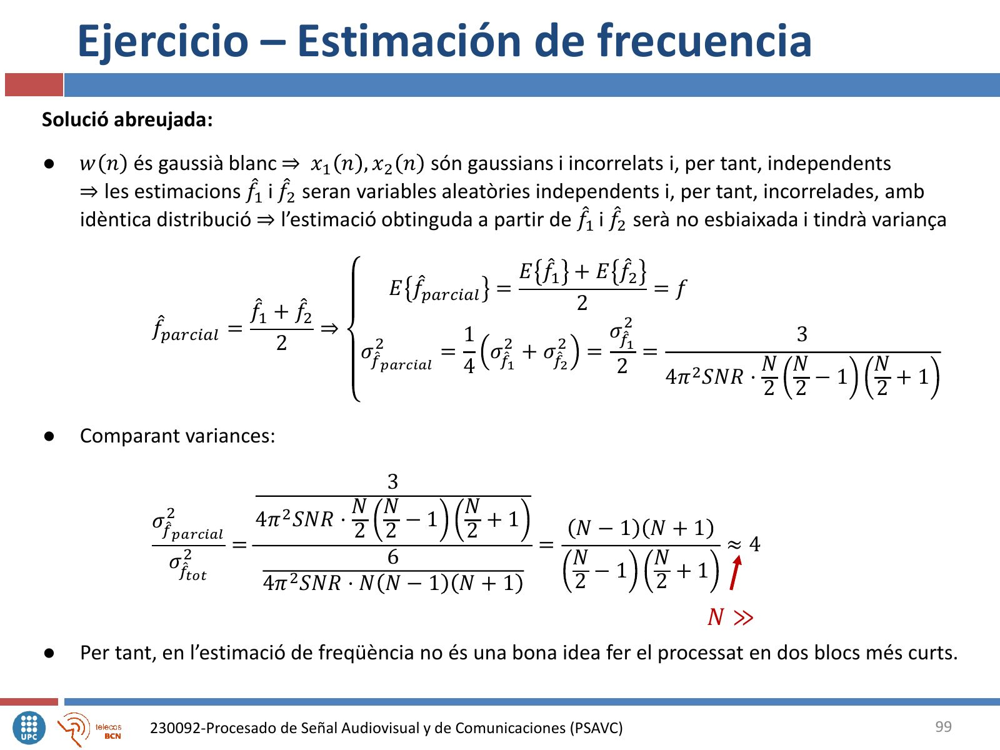

```text
    Ejercicio – Estimación de frecuencia
Solució abreujada:
●   𝑤𝑤 𝑛𝑛 és gaussià blanc ⇒ 𝑥𝑥1 𝑛𝑛 , 𝑥𝑥2 𝑛𝑛 són gaussians i incorrelats i, per tant, independents
    ⇒ les estimacions 𝑓𝑓̂1 i 𝑓𝑓̂2 seran variables aleatòries independents i, per tant, incorrelades, amb
    idèntica distribució ⇒ l’estimació obtinguda a partir de 𝑓𝑓̂1 i 𝑓𝑓̂2 serà no esbiaixada i tindrà variança

                                                                        𝐸𝐸 𝑓𝑓̂1 + 𝐸𝐸 𝑓𝑓̂2
                                               𝐸𝐸 𝑓𝑓̂𝑝𝑝𝑝𝑝𝑝𝑝𝑝𝑝𝑝𝑝𝑝𝑝𝑝𝑝 =                      = 𝑓𝑓
                                 ̂     ̂
                                𝑓𝑓1 + 𝑓𝑓2                                        2
            𝑓𝑓̂𝑝𝑝𝑝𝑝𝑝𝑝𝑝𝑝𝑝𝑝𝑝𝑝𝑝𝑝 =           ⇒                      1                  𝜎𝜎𝑓𝑓2̂                    3
                                    2          2
                                            𝜎𝜎𝑓𝑓̂                    2         2
                                                                = 𝜎𝜎𝑓𝑓̂ + 𝜎𝜎𝑓𝑓̂ = 1 =
                                                 𝑝𝑝𝑝𝑝𝑝𝑝𝑝𝑝𝑝𝑝𝑝𝑝𝑝𝑝  4 1           2     2                     𝑁𝑁 𝑁𝑁      𝑁𝑁
                                                                                            4𝜋𝜋 2 𝑆𝑆𝑆𝑆𝑆𝑆 ·       −1      +1
                                                                                                           2 2        2

●   Comparant variances:

                                                      3
                                                  𝑁𝑁 𝑁𝑁       𝑁𝑁
            𝜎𝜎𝑓𝑓2̂                 4𝜋𝜋 2 𝑆𝑆𝑆𝑆𝑆𝑆 ·
                                                  2 2
                                                         −1
                                                              2
                                                                 +1   𝑁𝑁 − 1 𝑁𝑁 + 1
                  𝑝𝑝𝑝𝑝𝑝𝑝𝑝𝑝𝑝𝑝𝑝𝑝𝑝𝑝
                                 =                                  =               ≈4
                 𝜎𝜎𝑓𝑓2̂                               6               𝑁𝑁     𝑁𝑁
                                                                         −1     +1
                      𝑡𝑡𝑡𝑡𝑡𝑡
                                    4𝜋𝜋 2 𝑆𝑆𝑆𝑆𝑆𝑆 · 𝑁𝑁 𝑁𝑁 − 1 𝑁𝑁 + 1   2       2
                                                                                              𝑁𝑁 ≫
●   Per tant, en l’estimació de freqüència no és una bona idea fer el processat en dos blocs més curts.


            230092-Procesado de Señal Audiovisual y de Comunicaciones (PSAVC)                                                 99
```

## Page 100

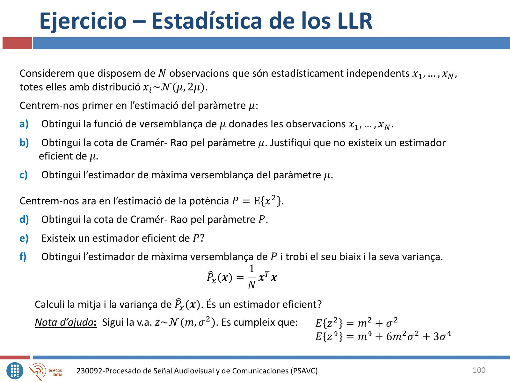

```text
      Ejercicio – Estadística de los LLR
Considerem que disposem de 𝑁𝑁 observacions que són estadísticament independents 𝑥𝑥1 , … , 𝑥𝑥𝑁𝑁 ,
totes elles amb distribució 𝑥𝑥𝑖𝑖 ~𝒩𝒩(𝜇𝜇, 2𝜇𝜇).
Centrem-nos primer en l’estimació del paràmetre 𝜇𝜇:
a)    Obtingui la funció de versemblança de 𝜇𝜇 donades les observacions 𝑥𝑥1 , … , 𝑥𝑥𝑁𝑁 .
b)    Obtingui la cota de Cramér- Rao pel paràmetre 𝜇𝜇. Justifiqui que no existeix un estimador
      eficient de 𝜇𝜇.
c)    Obtingui l’estimador de màxima versemblança del paràmetre 𝜇𝜇.

Centrem-nos ara en l’estimació de la potència 𝑃𝑃 = E 𝑥𝑥 2 .
d)    Obtingui la cota de Cramér- Rao pel paràmetre 𝑃𝑃.
e)    Existeix un estimador eficient de 𝑃𝑃?
f)    Obtingui l’estimador de màxima versemblança de 𝑃𝑃 i trobi el seu biaix i la seva variança.
                                                    1
                                        𝑃𝑃�𝑥𝑥 (𝒙𝒙) = 𝒙𝒙𝑇𝑇 𝒙𝒙
                                                    𝑁𝑁
     Calculi la mitja i la variança de 𝑃𝑃�𝑥𝑥 (𝒙𝒙). És un estimador eficient?
     Nota d’ajuda: Sigui la v.a. 𝑧𝑧~𝒩𝒩 𝑚𝑚, 𝜎𝜎 2 . Es cumpleix que:             𝐸𝐸 𝑧𝑧 2 = 𝑚𝑚2 + 𝜎𝜎 2
                                                                               𝐸𝐸 𝑧𝑧 4 = 𝑚𝑚4 + 6𝑚𝑚2 𝜎𝜎 2 + 3𝜎𝜎 4

               230092-Procesado de Señal Audiovisual y de Comunicaciones (PSAVC)                                   100
```

## Page 101

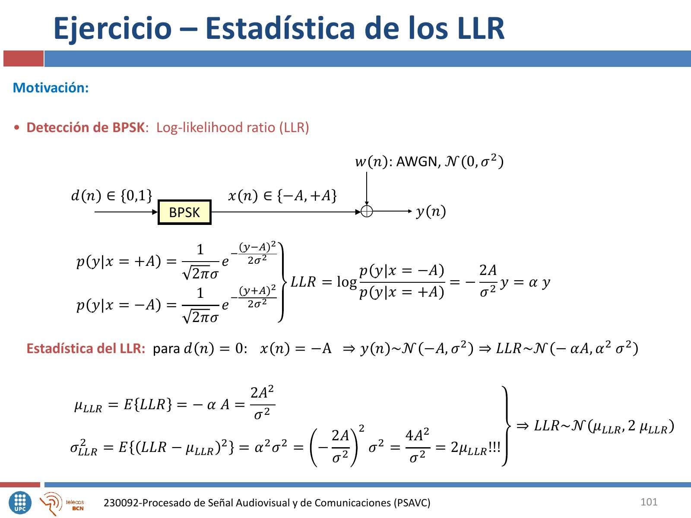

```text
      Ejercicio – Estadística de los LLR
Motivación:

• Detección de BPSK: Log-likelihood ratio (LLR)

                                                                        𝑤𝑤 𝑛𝑛 : AWGN, 𝒩𝒩 0, 𝜎𝜎 2

         𝑑𝑑 𝑛𝑛 ∈ 0,1                         𝑥𝑥 𝑛𝑛 ∈ −𝐴𝐴, +𝐴𝐴
                             BPSK                                                      𝑦𝑦 𝑛𝑛

                                   1               𝑦𝑦−𝐴𝐴 2
                                               −
          𝑝𝑝 𝑦𝑦|𝑥𝑥 = +𝐴𝐴 =                𝑒𝑒        2𝜎𝜎2
                                  2𝜋𝜋𝜎𝜎                                     𝑝𝑝 𝑦𝑦|𝑥𝑥 = −𝐴𝐴    2𝐴𝐴
                                                             𝐿𝐿𝐿𝐿𝐿𝐿 = log                  = − 2 𝑦𝑦 = 𝛼𝛼 𝑦𝑦
                                   1               𝑦𝑦+𝐴𝐴 2                  𝑝𝑝 𝑦𝑦|𝑥𝑥 = +𝐴𝐴    𝜎𝜎
                                               −
          𝑝𝑝 𝑦𝑦|𝑥𝑥 = −𝐴𝐴 =                𝑒𝑒        2𝜎𝜎2
                                  2𝜋𝜋𝜎𝜎

  Estadística del LLR: para 𝑑𝑑 𝑛𝑛 = 0: 𝑥𝑥 𝑛𝑛 = −A ⇒ 𝑦𝑦 𝑛𝑛 ~𝒩𝒩 −𝐴𝐴, 𝜎𝜎 2 ⇒ 𝐿𝐿𝐿𝐿𝐿𝐿~𝒩𝒩 − 𝛼𝛼𝛼𝛼, 𝛼𝛼 2 𝜎𝜎 2

                                         2𝐴𝐴2
         𝜇𝜇𝐿𝐿𝐿𝐿𝐿𝐿 = 𝐸𝐸 𝐿𝐿𝐿𝐿𝐿𝐿 = − 𝛼𝛼 𝐴𝐴 = 2
                                         𝜎𝜎
                                                                            2                            ⇒ 𝐿𝐿𝐿𝐿𝐿𝐿~𝒩𝒩 𝜇𝜇𝐿𝐿𝐿𝐿𝐿𝐿 , 2 𝜇𝜇𝐿𝐿𝐿𝐿𝐿𝐿
            2
                                                                  2𝐴𝐴               4𝐴𝐴2
         𝜎𝜎𝐿𝐿𝐿𝐿𝐿𝐿 = 𝐸𝐸 𝐿𝐿𝐿𝐿𝐿𝐿 − 𝜇𝜇𝐿𝐿𝐿𝐿𝐿𝐿 2         = 𝛼𝛼 2 𝜎𝜎 2 = − 2              2
                                                                                𝜎𝜎 = 2 = 2𝜇𝜇𝐿𝐿𝐿𝐿𝑅𝑅 !!!
                                                                  𝜎𝜎                𝜎𝜎

               230092-Procesado de Señal Audiovisual y de Comunicaciones (PSAVC)                                                    101
```

## Page 102

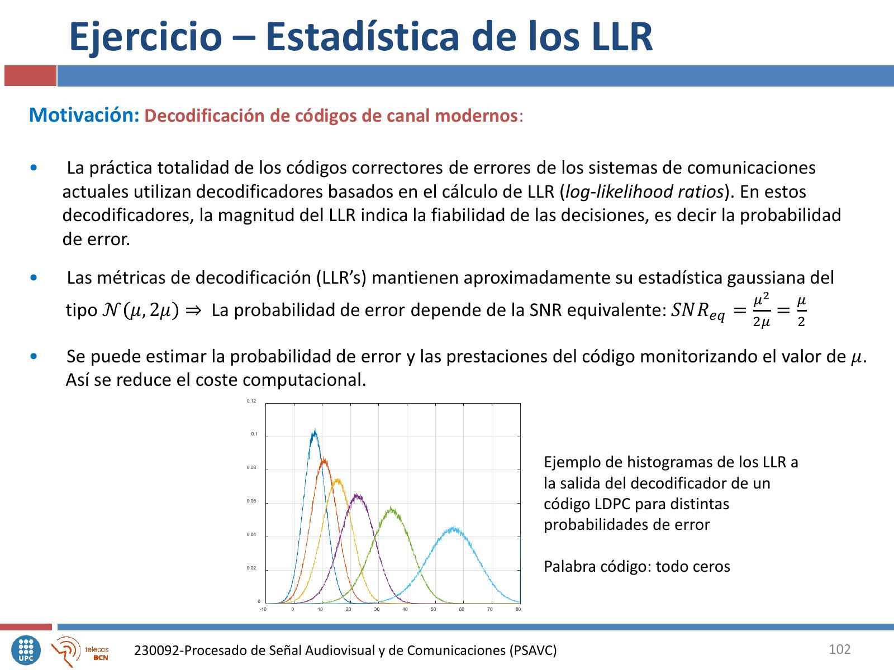

```text
    Ejercicio – Estadística de los LLR
Motivación: Decodificación de códigos de canal modernos:

•   La práctica totalidad de los códigos correctores de errores de los sistemas de comunicaciones
    actuales utilizan decodificadores basados en el cálculo de LLR (log-likelihood ratios). En estos
    decodificadores, la magnitud del LLR indica la fiabilidad de las decisiones, es decir la probabilidad
    de error.
•   Las métricas de decodificación (LLR’s) mantienen aproximadamente su estadística gaussiana del
                                                                                                                    𝜇𝜇 2   𝜇𝜇
    tipo 𝒩𝒩 𝜇𝜇, 2𝜇𝜇 ⇒ La probabilidad de error depende de la SNR equivalente: 𝑆𝑆𝑆𝑆𝑅𝑅𝑒𝑒𝑒𝑒 =                               =
                                                                                                                    2𝜇𝜇    2

•   Se puede estimar la probabilidad de error y las prestaciones del código monitorizando el valor de 𝜇𝜇.
    Así se reduce el coste computacional.
                              0.12


                               0.1


                              0.08                                                     Ejemplo de histogramas de los LLR a
                                                                                       la salida del decodificador de un
                              0.06
                                                                                       código LDPC para distintas
                              0.04
                                                                                       probabilidades de error

                              0.02
                                                                                       Palabra código: todo ceros
                                     0
                                     -10   0   10   20   30   40   50   60   70   80


             230092-Procesado de Señal Audiovisual y de Comunicaciones (PSAVC)                                                  102
```

## Page 103

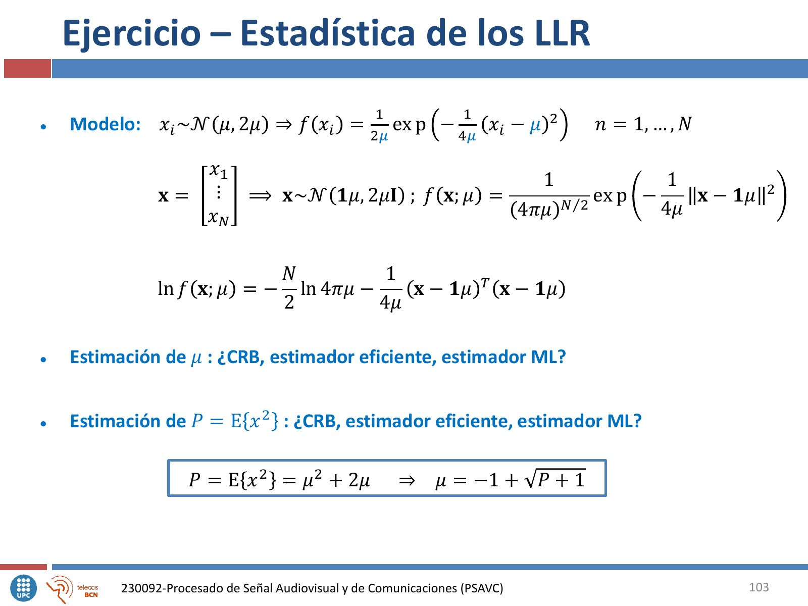

```text
    Ejercicio – Estadística de los LLR
                                                     1               1
●   Modelo: 𝑥𝑥𝑖𝑖 ~𝒩𝒩 𝜇𝜇, 2𝜇𝜇 ⇒ 𝑓𝑓 𝑥𝑥𝑖𝑖 =                ex p    −         𝑥𝑥𝑖𝑖 − 𝜇𝜇 2   𝑛𝑛 = 1, … , 𝑁𝑁
                                                    2𝜇𝜇             4𝜇𝜇

                     𝑥𝑥1
                                                             1                1
                𝐱𝐱 = ⋮ ⟹ 𝐱𝐱~𝒩𝒩 𝟏𝟏𝜇𝜇, 2𝜇𝜇𝐈𝐈 ; 𝑓𝑓 𝐱𝐱; 𝜇𝜇 =       𝑁𝑁 ⁄ 2
                                                                      ex p −     𝐱𝐱 − 𝟏𝟏𝜇𝜇 2
                     𝑥𝑥𝑁𝑁                                4𝜋𝜋𝜋𝜋               4𝜇𝜇


                                     𝑁𝑁             1
                ln 𝑓𝑓 𝐱𝐱; 𝜇𝜇 = −        ln 4𝜋𝜋𝜋𝜋 −     𝐱𝐱 − 𝟏𝟏𝜇𝜇 𝑇𝑇 𝐱𝐱 − 𝟏𝟏𝜇𝜇
                                     2             4𝜇𝜇

●   Estimación de 𝜇𝜇 : ¿CRB, estimador eficiente, estimador ML?


●   Estimación de 𝑃𝑃 = E 𝑥𝑥 2 : ¿CRB, estimador eficiente, estimador ML?

                     𝑃𝑃 = E 𝑥𝑥 2 = 𝜇𝜇2 + 2𝜇𝜇             ⇒ 𝜇𝜇 = −1 + 𝑃𝑃 + 1


          230092-Procesado de Señal Audiovisual y de Comunicaciones (PSAVC)                              103
```

## Page 104

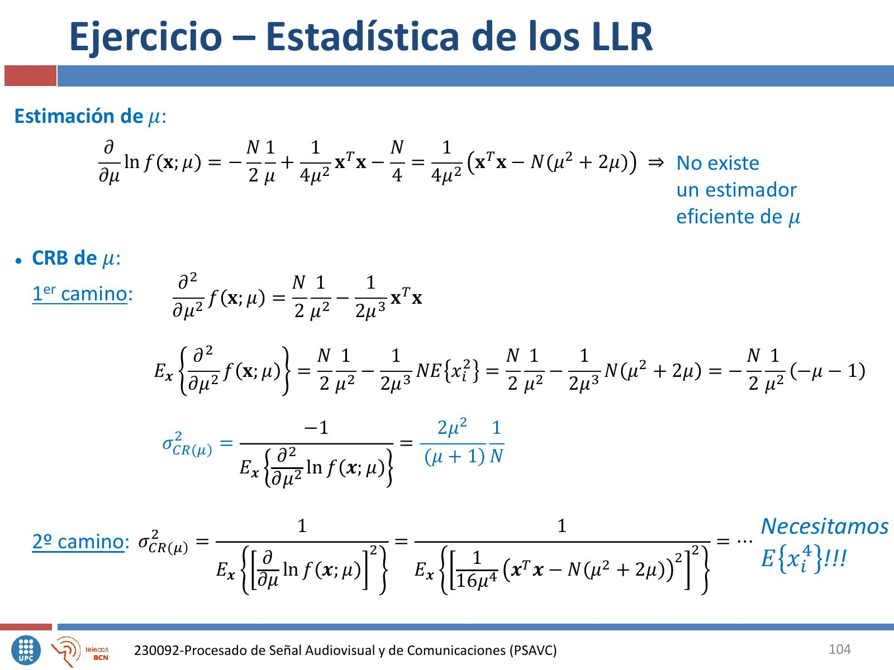

```text
        Ejercicio – Estadística de los LLR
Estimación de 𝜇𝜇:
             𝜕𝜕                   𝑁𝑁 1   1           𝑁𝑁 1
                 ln 𝑓𝑓 𝐱𝐱; 𝜇𝜇 = −      + 2 𝐱𝐱 𝑇𝑇 𝐱𝐱 − = 2 𝐱𝐱 𝑇𝑇 𝐱𝐱 − 𝑁𝑁 𝜇𝜇 2 + 2𝜇𝜇                        ⇒ No existe
            𝜕𝜕𝜇𝜇                  2 𝜇𝜇 4𝜇𝜇           4 4𝜇𝜇
                                                                                                               un estimador
                                                                                                               eficiente de 𝜇𝜇
●   CRB de 𝜇𝜇:
                         𝜕𝜕 2              𝑁𝑁 1    1 𝑇𝑇
    1er camino:                𝑓𝑓 𝐱𝐱; 𝜇𝜇 =       −      𝐱𝐱 𝐱𝐱
                        𝜕𝜕𝜇𝜇 2             2 𝜇𝜇 2 2𝜇𝜇 3

                             𝜕𝜕 2                     𝑁𝑁 1    1            2   𝑁𝑁 1    1          2
                                                                                                              𝑁𝑁 1
                     𝐸𝐸𝒙𝒙          𝑓𝑓 𝐱𝐱; 𝜇𝜇      =         −      𝑁𝑁𝑁𝑁 𝑥𝑥𝑖𝑖 =       −      𝑁𝑁 𝜇𝜇   + 2𝜇𝜇 = −        −𝜇𝜇 − 1
                            𝜕𝜕𝜇𝜇 2                    2 𝜇𝜇 2 2𝜇𝜇 3             2 𝜇𝜇 2 2𝜇𝜇 3                   2 𝜇𝜇 2

                         2                         −1                  2𝜇𝜇 2 1
                      𝜎𝜎𝐶𝐶𝐶𝐶(𝜇𝜇 ) =                                =
                                              𝜕𝜕 2                   (𝜇𝜇 + 1) 𝑁𝑁
                                        𝐸𝐸𝒙𝒙        ln 𝑓𝑓 𝒙𝒙; 𝜇𝜇
                                             𝜕𝜕𝜇𝜇 2

                  2                               1                                          1                              Necesitamos
    2º camino: 𝜎𝜎𝐶𝐶𝐶𝐶(𝜇𝜇 ) =                                       =                                                   =⋯
                                 𝐸𝐸𝒙𝒙
                                            𝜕𝜕
                                                ln 𝑓𝑓 𝒙𝒙; 𝜇𝜇
                                                               2
                                                                       𝐸𝐸𝒙𝒙
                                                                               1
                                                                                     𝒙𝒙𝑇𝑇 𝒙𝒙 − 𝑁𝑁 𝜇𝜇 2 + 2𝜇𝜇
                                                                                                               2
                                                                                                                   2
                                                                                                                            𝐸𝐸 𝑥𝑥𝑖𝑖4 !!!
                                           𝜕𝜕𝜇𝜇                               16𝜇𝜇 4


                  230092-Procesado de Señal Audiovisual y de Comunicaciones (PSAVC)                                               104
```

## Page 105

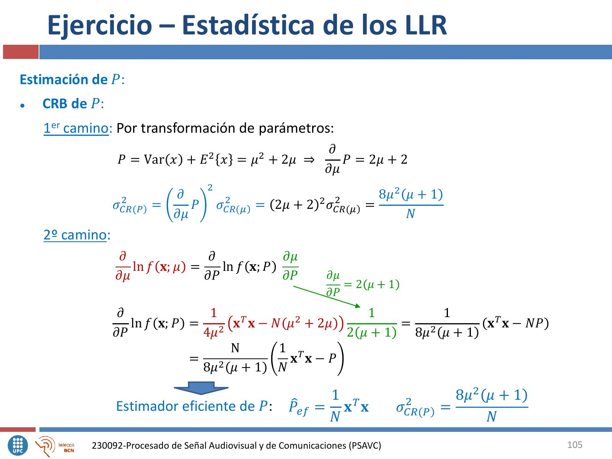

```text
    Ejercicio – Estadística de los LLR
Estimación de 𝑃𝑃:
●   CRB de 𝑃𝑃:
    1er camino: Por transformación de parámetros:
                                                                           𝜕𝜕
                  𝑃𝑃 = Var 𝑥𝑥 + 𝐸𝐸 2 𝑥𝑥 = 𝜇𝜇 2 + 2𝜇𝜇 ⇒                         𝑃𝑃 = 2𝜇𝜇 + 2
                                                                          𝜕𝜕𝜕𝜕
                                           2                                                 2
                    2             𝜕𝜕              2                         2          8𝜇𝜇       𝜇𝜇 + 1
                 𝜎𝜎𝐶𝐶𝐶𝐶(𝑃𝑃 ) =        𝑃𝑃       𝜎𝜎𝐶𝐶𝐶𝐶(𝜇𝜇 ) =   2𝜇𝜇 + 2 2 𝜎𝜎𝐶𝐶𝐶𝐶(𝜇𝜇 ) =
                                 𝜕𝜕𝜇𝜇                                                            𝑁𝑁
    2º camino:
                  𝜕𝜕                  𝜕𝜕               𝜕𝜕𝜇𝜇
                      ln 𝑓𝑓 𝐱𝐱; 𝜇𝜇 =      ln 𝑓𝑓 𝐱𝐱; 𝑃𝑃
                 𝜕𝜕𝜇𝜇                𝜕𝜕𝑃𝑃              𝜕𝜕𝑃𝑃               𝜕𝜕𝜇𝜇
                                                                               = 2 𝜇𝜇 + 1
                                                                          𝜕𝜕𝑃𝑃
                  𝜕𝜕                 1                               1         1
                      ln 𝑓𝑓 𝐱𝐱; 𝑃𝑃 = 2 𝐱𝐱 𝑇𝑇 𝐱𝐱 − 𝑁𝑁 𝜇𝜇 2 + 2𝜇𝜇           = 2                                  𝐱𝐱 𝑇𝑇 𝐱𝐱 − 𝑁𝑁𝑃𝑃
                 𝜕𝜕𝑃𝑃               4𝜇𝜇                          2 𝜇𝜇 + 1  8𝜇𝜇 𝜇𝜇 + 1
                                        N           1 𝑇𝑇
                                   = 2                𝐱𝐱 𝐱𝐱 − 𝑃𝑃
                                    8𝜇𝜇 𝜇𝜇 + 1 𝑁𝑁

                                                                          1 𝑇𝑇                             8𝜇𝜇 2 𝜇𝜇 + 1
                 Estimador eficiente de 𝑃𝑃:                        �
                                                                  𝑃𝑃𝑒𝑒𝑒𝑒 = 𝐱𝐱 𝐱𝐱                2
                                                                                             𝜎𝜎𝐶𝐶𝐶𝐶(𝑃𝑃 ) =
                                                                          𝑁𝑁                                     𝑁𝑁
           230092-Procesado de Señal Audiovisual y de Comunicaciones (PSAVC)                                                     105
```

## Page 106

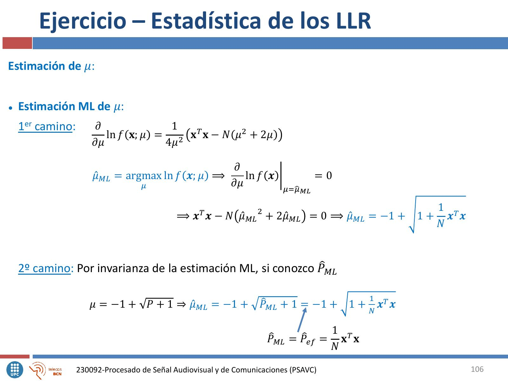

```text
        Ejercicio – Estadística de los LLR
Estimación de 𝜇𝜇:


●   Estimación ML de 𝜇𝜇:
    1er camino:        𝜕𝜕                 1
                           ln 𝑓𝑓 𝐱𝐱; 𝜇𝜇 = 2 𝐱𝐱 𝑇𝑇 𝐱𝐱 − 𝑁𝑁 𝜇𝜇 2 + 2𝜇𝜇
                      𝜕𝜕𝜇𝜇               4𝜇𝜇

                                                            𝜕𝜕
                      𝜇𝜇̂ 𝑀𝑀𝑀𝑀 = argmax ln 𝑓𝑓 𝒙𝒙; 𝜇𝜇 ⟹          ln 𝑓𝑓 𝒙𝒙 �                =0
                                   𝜇𝜇                      𝜕𝜕𝜇𝜇            𝜇𝜇=�
                                                                              𝜇𝜇   𝑀𝑀𝑀𝑀

                                                                                                               1 𝑇𝑇
                                             ⟹ 𝒙𝒙𝑇𝑇 𝒙𝒙 − 𝑁𝑁 𝜇𝜇̂ 𝑀𝑀𝑀𝑀 2 + 2𝜇𝜇̂ 𝑀𝑀𝑀𝑀 = 0 ⟹ 𝜇𝜇̂ 𝑀𝑀𝑀𝑀 = −1 + 1 +      𝒙𝒙 𝒙𝒙
                                                                                                               𝑁𝑁


    2º camino: Por invarianza de la estimación ML, si conozco 𝑃𝑃�𝑀𝑀𝑀𝑀

                                                                              1
                     𝜇𝜇 = −1 + 𝑃𝑃 + 1 ⇒ 𝜇𝜇̂ 𝑀𝑀𝑀𝑀 = −1 + 𝑃𝑃�𝑀𝑀𝑀𝑀 + 1 = −1 + 1 + 𝒙𝒙𝑇𝑇 𝒙𝒙
                                                                                                       𝑁𝑁

                                                                                            1 𝑇𝑇
                                                                      𝑃𝑃�𝑀𝑀𝑀𝑀 = 𝑃𝑃�𝑒𝑒𝑒𝑒 =      𝐱𝐱 𝐱𝐱
                                                                                            𝑁𝑁
                  230092-Procesado de Señal Audiovisual y de Comunicaciones (PSAVC)                                       106
```

## Page 107

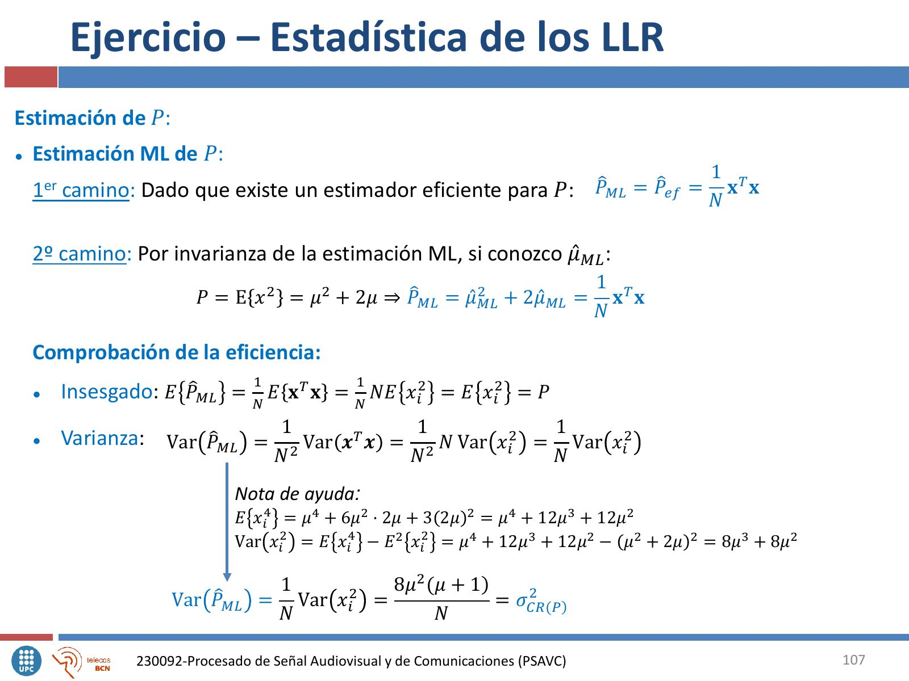

```text
         Ejercicio – Estadística de los LLR
Estimación de 𝑃𝑃:
●   Estimación ML de 𝑃𝑃:
                                                                                                               1 𝑇𝑇
    1er camino: Dado que existe un estimador eficiente para 𝑃𝑃:                          𝑃𝑃�𝑀𝑀𝑀𝑀 = 𝑃𝑃�𝑒𝑒𝑒𝑒 =      𝐱𝐱 𝐱𝐱
                                                                                                               𝑁𝑁

    2º camino: Por invarianza de la estimación ML, si conozco 𝜇𝜇̂ 𝑀𝑀𝑀𝑀 :
                                                                                         1 𝑇𝑇
                           𝑃𝑃 = E 𝑥𝑥 2 = 𝜇𝜇 2 + 2𝜇𝜇 ⇒ 𝑃𝑃�𝑀𝑀𝑀𝑀 = 𝜇𝜇̂ 𝑀𝑀𝑀𝑀
                                                                    2
                                                                         + 2𝜇𝜇̂ 𝑀𝑀𝑀𝑀 =      𝐱𝐱 𝐱𝐱
                                                                                         𝑁𝑁

    Comprobación de la eficiencia:
                                     1              1
    ●   Insesgado: 𝐸𝐸 𝑃𝑃�𝑀𝑀𝑀𝑀 = 𝑁𝑁 𝐸𝐸 𝐱𝐱 𝑇𝑇 𝐱𝐱 = 𝑁𝑁 𝑁𝑁𝑁𝑁 𝑥𝑥𝑖𝑖2 = 𝐸𝐸 𝑥𝑥𝑖𝑖2 = 𝑃𝑃
                                          1                   1                 1
    ●   Varianza: Var 𝑃𝑃�𝑀𝑀𝑀𝑀 =             2
                                              Var 𝒙𝒙 𝑇𝑇
                                                        𝒙𝒙 =    2
                                                                  𝑁𝑁 Var 𝑥𝑥 2
                                                                           𝑖𝑖 =    Var 𝑥𝑥𝑖𝑖2
                                         𝑁𝑁                  𝑁𝑁                 𝑁𝑁
                                Nota de ayuda:
                                𝐸𝐸 𝑥𝑥𝑖𝑖4 = 𝜇𝜇4 + 6𝜇𝜇2 · 2𝜇𝜇 + 3 2𝜇𝜇 2 = 𝜇𝜇4 + 12𝜇𝜇3 + 12𝜇𝜇2
                                Var 𝑥𝑥𝑖𝑖2 = 𝐸𝐸 𝑥𝑥𝑖𝑖4 − 𝐸𝐸 2 𝑥𝑥𝑖𝑖2 = 𝜇𝜇4 + 12𝜇𝜇3 + 12𝜇𝜇2 − 𝜇𝜇2 + 2𝜇𝜇 2 = 8𝜇𝜇3 + 8𝜇𝜇2

                                      1           8𝜇𝜇 2 (𝜇𝜇 + 1)
                       Var 𝑃𝑃�𝑀𝑀𝑀𝑀           2
                                     = Var 𝑥𝑥𝑖𝑖 =                     2
                                                                 = 𝜎𝜎𝐶𝐶𝐶𝐶(𝑃𝑃 )
                                      𝑁𝑁                 𝑁𝑁

                  230092-Procesado de Señal Audiovisual y de Comunicaciones (PSAVC)                                       107
```

## Page 108

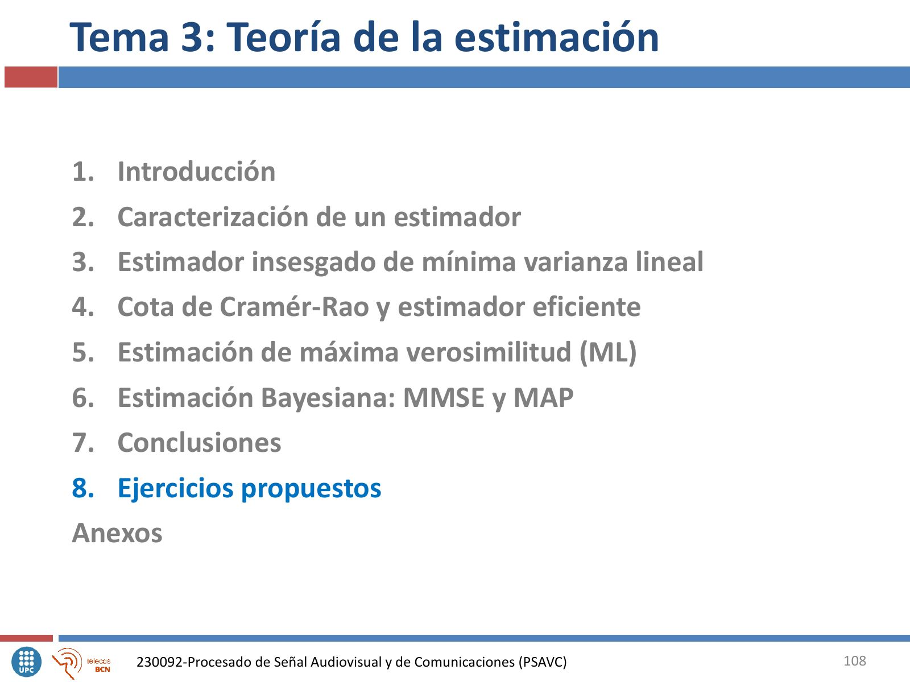

```text
Tema 3: Teoría de la estimación

1. Introducción
2. Caracterización de un estimador
3. Estimador insesgado de mínima varianza lineal
4. Cota de Cramér-Rao y estimador eficiente
5. Estimación de máxima verosimilitud (ML)
6. Estimación Bayesiana: MMSE y MAP
7. Conclusiones
8. Ejercicios propuestos
Anexos


    230092-Procesado de Señal Audiovisual y de Comunicaciones (PSAVC)   108
```

## Page 109


```text
      Ejercicios propuestos
3.8

  Ejercicios recomendados de la Colección de ejercicios del Tema 3 (Metacurs en Atenea)
  ●   Caracterización de estimadores:
       o   Se recomienda hacer 1, 4, 5
       o   También podéis hacer: 6, 9, 23

  ●   Estimación con restricciones:
       o   Se recomienda hacer: 10
       o   También podéis hacer: 24

  ●   Estimación ML y CRB:
      o   Se recomienda hacer: 8, 11, 14, 15, 19, 25, 27, 30, 36 (la parte de estimación ML, el análisis de la eficiencia
          está fuera del temario)
      o   También podéis hacer: 2, 3, 7, 12, 16,17,22, 33, 35, 38
      o   Los ejercicios 13 y 32 se pueden hacer pero no son particularmente interesantes

  ●   Estimación MAP:
       o   Se recomienda hacer: 12, 17, 21, 28, 29, 31,37
       o   También podéis hacer: 26, 34
  ●   Estimación MMSE:
       o   Se recomienda hacer: 31
  Además, se recomienda realizar los ejercicios de los exámenes parciales y finales del tema de estimación
  disponibles en el metacurs de Atenea.


                230092-Procesado de Señal Audiovisual y de Comunicaciones (PSAVC)                                     109
```

## Page 110

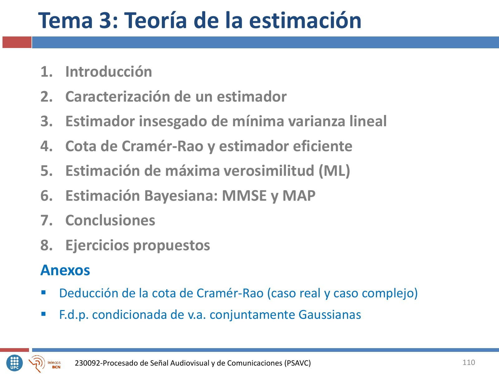

```text
Tema 3: Teoría de la estimación
1. Introducción
2. Caracterización de un estimador
3. Estimador insesgado de mínima varianza lineal
4. Cota de Cramér-Rao y estimador eficiente
5. Estimación de máxima verosimilitud (ML)
6. Estimación Bayesiana: MMSE y MAP
7. Conclusiones
8. Ejercicios propuestos
Anexos
 Deducción de la cota de Cramér-Rao (caso real y caso complejo)
 F.d.p. condicionada de v.a. conjuntamente Gaussianas


     230092-Procesado de Señal Audiovisual y de Comunicaciones (PSAVC)   110
```

## Page 111

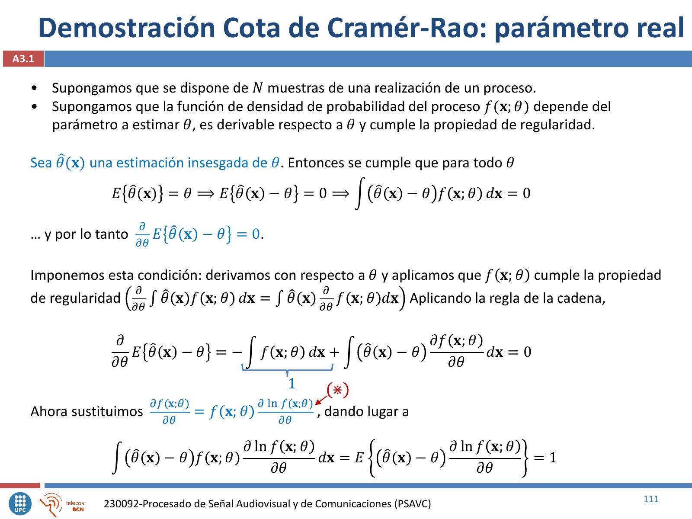

```text
       Demostración Cota de Cramér-Rao: parámetro real
A3.1

   • Supongamos que se dispone de 𝑁𝑁 muestras de una realización de un proceso.
   • Supongamos que la función de densidad de probabilidad del proceso 𝑓𝑓(𝐱𝐱; 𝜃𝜃) depende del
     parámetro a estimar 𝜃𝜃, es derivable respecto a 𝜃𝜃 y cumple la propiedad de regularidad.

        �
   Sea 𝜃𝜃(𝐱𝐱) una estimación insesgada de 𝜃𝜃. Entonces se cumple que para todo 𝜃𝜃
                    �
                𝐸𝐸 𝜃𝜃(𝐱𝐱) = 𝜃𝜃 ⟹ 𝐸𝐸 𝜃𝜃� 𝐱𝐱 − 𝜃𝜃 = 0 ⟹ � 𝜃𝜃� 𝐱𝐱 − 𝜃𝜃 𝑓𝑓 𝐱𝐱; 𝜃𝜃 𝑑𝑑𝐱𝐱 = 0

                        𝜕𝜕
   … y por lo tanto         𝐸𝐸 𝜃𝜃� 𝐱𝐱      − 𝜃𝜃 = 0.
                       𝜕𝜕𝜃𝜃

   Imponemos esta condición: derivamos con respecto a 𝜃𝜃 y aplicamos que 𝑓𝑓 𝐱𝐱; 𝜃𝜃 cumple la propiedad
                  𝜕𝜕                                    𝜕𝜕
   de regularidad    ∫ 𝜃𝜃� 𝐱𝐱 𝑓𝑓 𝐱𝐱; 𝜃𝜃 𝑑𝑑𝐱𝐱 = ∫ 𝜃𝜃� 𝐱𝐱
                      𝜕𝜕𝜃𝜃
                                                           𝑓𝑓 𝐱𝐱; 𝜃𝜃 𝑑𝑑𝐱𝐱 Aplicando la regla de la cadena,
                                                                         𝜕𝜕𝜃𝜃


                 𝜕𝜕                                                      𝜕𝜕𝑓𝑓 𝐱𝐱; 𝜃𝜃
                     𝐸𝐸 𝜃𝜃� 𝐱𝐱 − 𝜃𝜃 = − � 𝑓𝑓 𝐱𝐱; 𝜃𝜃 𝑑𝑑𝐱𝐱 + � 𝜃𝜃� 𝐱𝐱 − 𝜃𝜃             𝑑𝑑𝐱𝐱 = 0
                𝜕𝜕𝜃𝜃                                                         𝜕𝜕𝜕𝜕
                                                1        ⋇
                             𝜕𝜕𝑓𝑓 𝐱𝐱;𝜃𝜃                 𝜕𝜕 ln 𝑓𝑓 𝐱𝐱;𝜃𝜃
   Ahora sustituimos                      = 𝑓𝑓 𝐱𝐱; 𝜃𝜃                    , dando lugar a
                                 𝜕𝜕𝜕𝜕                        𝜕𝜕𝜕𝜕

                                                   𝜕𝜕 ln 𝑓𝑓 𝐱𝐱; 𝜃𝜃                               𝜕𝜕 ln 𝑓𝑓 𝐱𝐱; 𝜃𝜃
                � 𝜃𝜃� 𝐱𝐱 − 𝜃𝜃 𝑓𝑓 𝐱𝐱; 𝜃𝜃                            𝑑𝑑𝐱𝐱 = 𝐸𝐸       𝜃𝜃� 𝐱𝐱 − 𝜃𝜃                     =1
                                                         𝜕𝜕𝜕𝜕                                          𝜕𝜕𝜕𝜕

              230092-Procesado de Señal Audiovisual y de Comunicaciones (PSAVC)                                         111
```

## Page 112

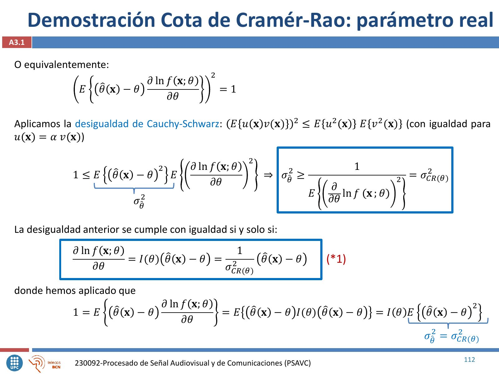

```text
       Demostración Cota de Cramér-Rao: parámetro real
A3.1

 O equivalentemente:
                                                         2
                                𝜕𝜕 ln 𝑓𝑓 𝐱𝐱; 𝜃𝜃
               𝐸𝐸   𝜃𝜃� 𝐱𝐱 − 𝜃𝜃                              =1
                                      𝜕𝜕𝜕𝜕

                                                                              2
 Aplicamos la desigualdad de Cauchy-Schwarz: 𝐸𝐸 𝑢𝑢 𝐱𝐱 𝑣𝑣(𝐱𝐱)                      ≤ 𝐸𝐸 𝑢𝑢2 𝐱𝐱      𝐸𝐸 𝑣𝑣 2 (𝐱𝐱) (con igualdad para
 𝑢𝑢 𝐱𝐱 = 𝛼𝛼 𝑣𝑣 𝐱𝐱 )

                                                                   2
                                       2        𝜕𝜕 ln 𝑓𝑓 𝐱𝐱; 𝜃𝜃                                  1
              1 ≤ 𝐸𝐸    𝜃𝜃� 𝐱𝐱 − 𝜃𝜃        𝐸𝐸                          ⇒ 𝜎𝜎𝜃𝜃2̑ ≥                             2
                                                                                                                       2
                                                                                                                  = 𝜎𝜎𝐶𝐶𝐶𝐶(𝜃𝜃)
                                                      𝜕𝜕𝜕𝜕                                𝜕𝜕
                                                                                    𝐸𝐸        ln 𝑓𝑓 𝐱𝐱 ; 𝜃𝜃
                              𝜎𝜎𝜃𝜃2̑                                                     𝜕𝜕𝜕𝜕

 La desigualdad anterior se cumple con igualdad si y solo si:
              𝜕𝜕 ln 𝑓𝑓 𝐱𝐱; 𝜃𝜃                           1
                              = 𝐼𝐼(𝜃𝜃) 𝜃𝜃� 𝐱𝐱 − 𝜃𝜃 = 2         𝜃𝜃� 𝐱𝐱 − 𝜃𝜃               (*1)
                    𝜕𝜕𝜕𝜕                            𝜎𝜎𝐶𝐶𝐶𝐶(𝜃𝜃)

 donde hemos aplicado que
                                       𝜕𝜕 ln 𝑓𝑓 𝐱𝐱; 𝜃𝜃                                                                             2
              1 = 𝐸𝐸    𝜃𝜃� 𝐱𝐱 − 𝜃𝜃                          = 𝐸𝐸 𝜃𝜃� 𝐱𝐱 − 𝜃𝜃 𝐼𝐼(𝜃𝜃) 𝜃𝜃� 𝐱𝐱 − 𝜃𝜃       = 𝐼𝐼 𝜃𝜃 𝐸𝐸      𝜃𝜃� 𝐱𝐱 − 𝜃𝜃
                                             𝜕𝜕𝜕𝜕
                                                                                                                      𝜎𝜎𝜃𝜃2̑ = 𝜎𝜎𝐶𝐶𝐶𝐶(𝜃𝜃)
                                                                                                                                  2


              230092-Procesado de Señal Audiovisual y de Comunicaciones (PSAVC)                                                    112
```

## Page 113

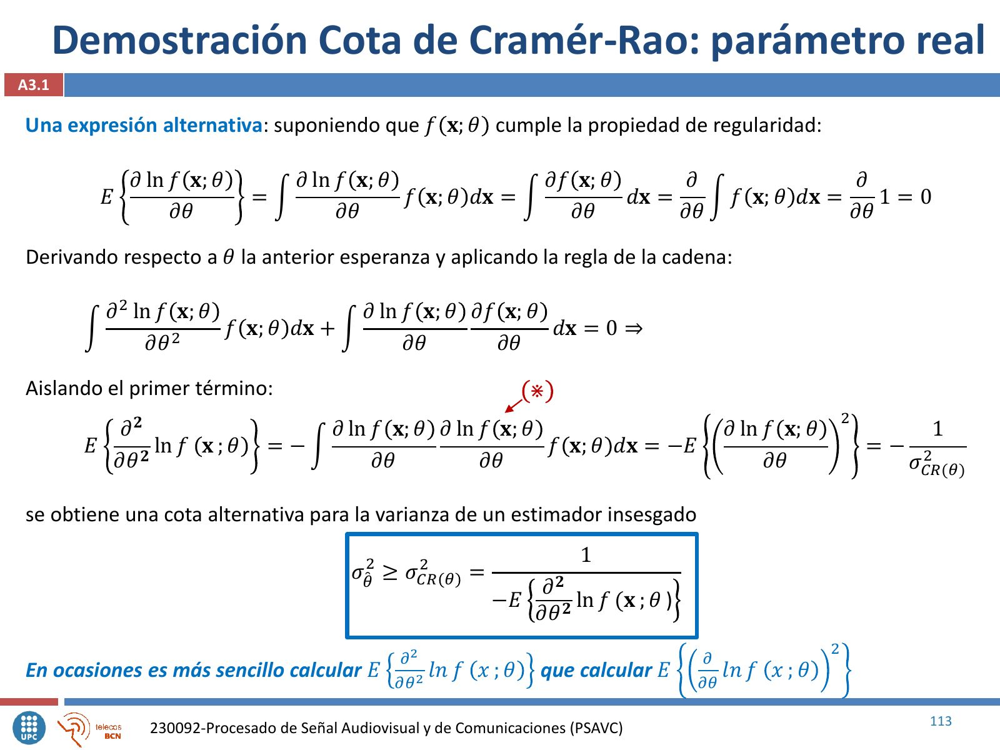

```text
       Demostración Cota de Cramér-Rao: parámetro real
A3.1

Una expresión alternativa: suponiendo que 𝑓𝑓 𝐱𝐱; 𝜃𝜃 cumple la propiedad de regularidad:

               𝜕𝜕 ln 𝑓𝑓 𝐱𝐱; 𝜃𝜃          𝜕𝜕 ln 𝑓𝑓 𝐱𝐱; 𝜃𝜃                    𝜕𝜕𝑓𝑓 𝐱𝐱; 𝜃𝜃         𝜕𝜕                      𝜕𝜕
          𝐸𝐸                       =�                   𝑓𝑓 𝐱𝐱; 𝜃𝜃 𝑑𝑑𝐱𝐱 = �             𝑑𝑑𝐱𝐱 =      � 𝑓𝑓 𝐱𝐱; 𝜃𝜃 𝑑𝑑𝐱𝐱 =      1=0
                     𝜕𝜕𝜕𝜕                     𝜕𝜕𝜕𝜕                             𝜕𝜕𝜕𝜕           𝜕𝜕𝜕𝜕                    𝜕𝜕𝜕𝜕

Derivando respecto a 𝜃𝜃 la anterior esperanza y aplicando la regla de la cadena:

          𝜕𝜕 2 ln 𝑓𝑓 𝐱𝐱; 𝜃𝜃                    𝜕𝜕 ln 𝑓𝑓 𝐱𝐱; 𝜃𝜃 𝜕𝜕𝑓𝑓 𝐱𝐱; 𝜃𝜃
        �                   𝑓𝑓 𝐱𝐱; 𝜃𝜃 𝑑𝑑𝐱𝐱 + �                             𝑑𝑑𝐱𝐱 = 0 ⇒
                𝜕𝜕𝜃𝜃 2                               𝜕𝜕𝜕𝜕          𝜕𝜕𝜕𝜕

Aislando el primer término:                                                    ⋇
                                                                                                                                   2
            𝜕𝜕 𝟐𝟐                       𝜕𝜕 ln 𝑓𝑓 𝐱𝐱; 𝜃𝜃 𝜕𝜕 ln 𝑓𝑓 𝐱𝐱; 𝜃𝜃                                    𝜕𝜕 ln 𝑓𝑓 𝐱𝐱; 𝜃𝜃                     1
        𝐸𝐸         ln 𝑓𝑓 𝐱𝐱 ; 𝜃𝜃   = −�                                 𝑓𝑓 𝐱𝐱; 𝜃𝜃 𝑑𝑑𝐱𝐱 = −𝐸𝐸                                           =−      2
           𝜕𝜕𝜃𝜃 𝟐𝟐                            𝜕𝜕𝜕𝜕            𝜕𝜕𝜕𝜕                                               𝜕𝜕𝜕𝜕                       𝜎𝜎𝐶𝐶𝐶𝐶(𝜃𝜃)

se obtiene una cota alternativa para la varianza de un estimador insesgado
                                                                                    1
                                               𝜎𝜎𝜃𝜃2̑ ≥ 𝜎𝜎𝐶𝐶𝐶𝐶
                                                           2
                                                               𝜃𝜃 =
                                                                            𝜕𝜕 𝟐𝟐
                                                                       −𝐸𝐸         ln 𝑓𝑓 (𝐱𝐱 ; 𝜃𝜃 )
                                                                           𝜕𝜕𝜃𝜃 𝟐𝟐
                                                                                                                               2
                                                      𝜕𝜕2                                              𝜕𝜕
En ocasiones es más sencillo calcular 𝐸𝐸                   𝑙𝑙𝑙𝑙 𝑓𝑓   𝑥𝑥 ; 𝜃𝜃   que calcular 𝐸𝐸             𝑙𝑙𝑙𝑙 𝑓𝑓   𝑥𝑥 ; 𝜃𝜃
                                                     𝜕𝜕𝜃𝜃2                                            𝜕𝜕𝜕𝜕

                  230092-Procesado de Señal Audiovisual y de Comunicaciones (PSAVC)                                                            113
```

## Page 114

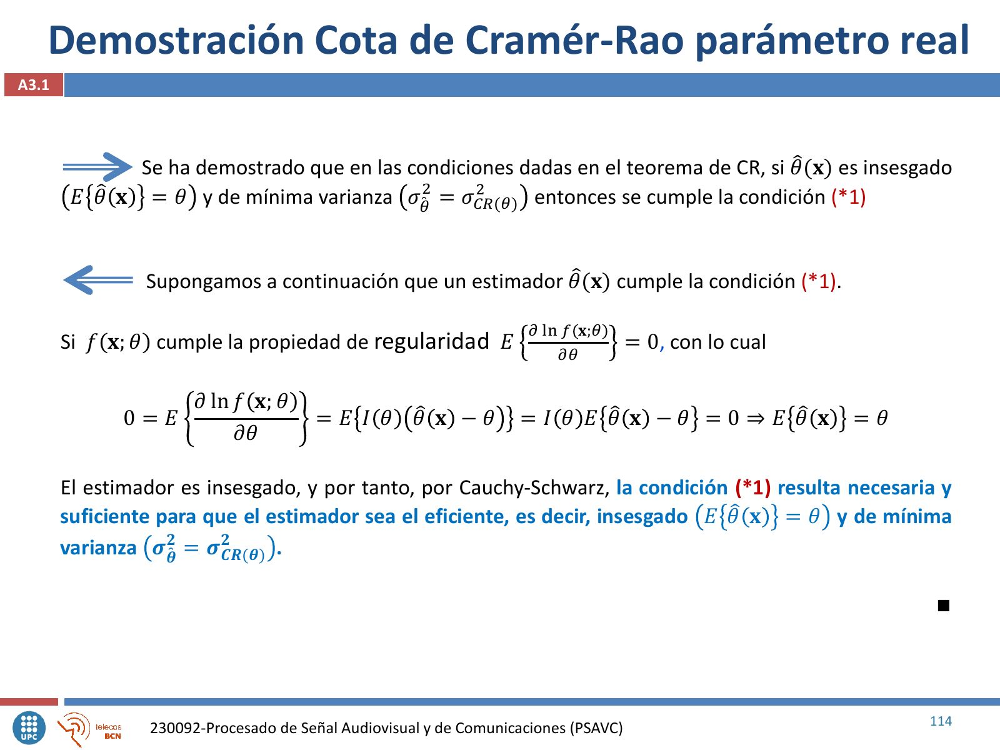

```text
   Demostración Cota de Cramér-Rao parámetro real
A3.1


                                                                                           �
                  Se ha demostrado que en las condiciones dadas en el teorema de CR, si 𝜃𝜃(𝐱𝐱)  es insesgado
        𝐸𝐸 𝜃𝜃� 𝐱𝐱 = 𝜃𝜃 y de mínima varianza 𝜎𝜎𝜃𝜃̑ = 𝜎𝜎𝐶𝐶𝐶𝐶(𝜃𝜃)
                                                2      2
                                                               entonces se cumple la condición (*1)


                Supongamos a continuación que un estimador �
                                                           𝜃𝜃(𝐱𝐱) cumple la condición (*1).

                                                                    𝜕𝜕 ln 𝑓𝑓 𝐱𝐱;𝜃𝜃
       Si 𝑓𝑓 𝐱𝐱; 𝜃𝜃 cumple la propiedad de regularidad 𝐸𝐸                            = 0, con lo cual
                                                                         𝜕𝜕𝜕𝜕

                       𝜕𝜕 ln 𝑓𝑓 𝐱𝐱; 𝜃𝜃
              0 = 𝐸𝐸                     = 𝐸𝐸 𝐼𝐼 𝜃𝜃 𝜃𝜃� 𝐱𝐱 − 𝜃𝜃    = 𝐼𝐼 𝜃𝜃 𝐸𝐸 𝜃𝜃� 𝐱𝐱 − 𝜃𝜃 = 0 ⇒ 𝐸𝐸 𝜃𝜃� 𝐱𝐱   = 𝜃𝜃
                             𝜕𝜕𝜕𝜕

       El estimador es insesgado, y por tanto, por Cauchy-Schwarz, la condición (*1) resulta necesaria y
       suficiente para que el estimador sea el eficiente, es decir, insesgado 𝐸𝐸 𝜃𝜃� 𝐱𝐱 = 𝜃𝜃 y de mínima
       varianza 𝝈𝝈𝟐𝟐𝜽𝜽̑ = 𝝈𝝈𝑪𝑪𝑪𝑪(𝜽𝜽)
                            𝟐𝟐
                                     .

                                                                                                                   ∎


                 230092-Procesado de Señal Audiovisual y de Comunicaciones (PSAVC)                                 114
```

## Page 115

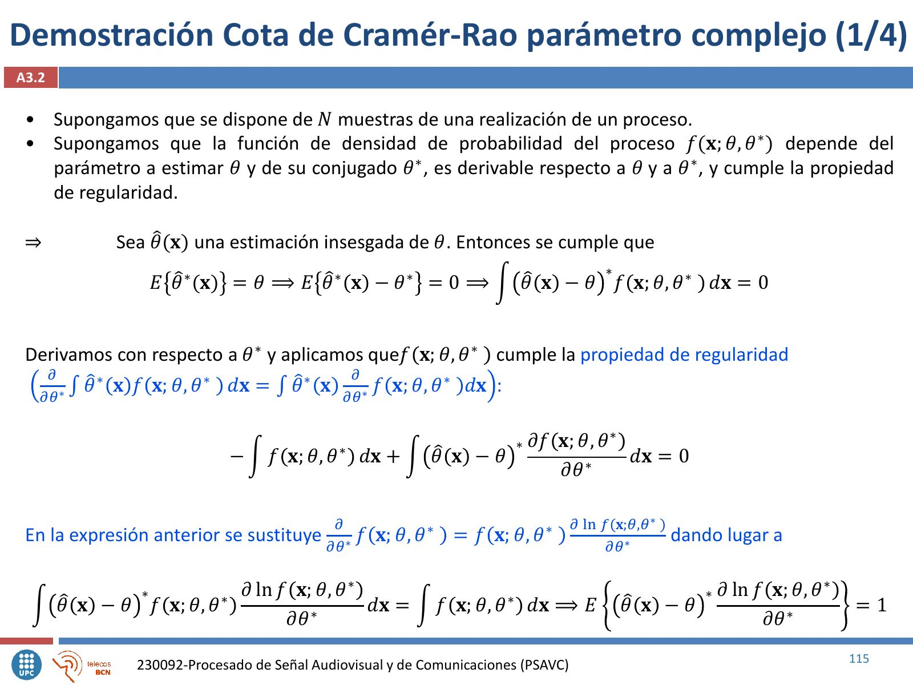

```text
Demostración Cota de Cramér-Rao parámetro complejo (1/4)
A3.2

 • Supongamos que se dispone de 𝑁𝑁 muestras de una realización de un proceso.
 • Supongamos que la función de densidad de probabilidad del proceso 𝑓𝑓(𝐱𝐱; 𝜃𝜃, 𝜃𝜃 ∗ ) depende del
   parámetro a estimar 𝜃𝜃 y de su conjugado 𝜃𝜃 ∗ , es derivable respecto a 𝜃𝜃 y a 𝜃𝜃 ∗ , y cumple la propiedad
   de regularidad.

 ⇒                 �
              Sea 𝜃𝜃(𝐱𝐱) una estimación insesgada de 𝜃𝜃. Entonces se cumple que
                                                                               ∗
                   𝐸𝐸 𝜃𝜃� ∗ (𝐱𝐱) = 𝜃𝜃 ⟹ 𝐸𝐸 𝜃𝜃� ∗ 𝐱𝐱 − 𝜃𝜃 ∗ = 0 ⟹ � 𝜃𝜃� 𝐱𝐱 − 𝜃𝜃 𝑓𝑓 𝐱𝐱; 𝜃𝜃, 𝜃𝜃 ∗ 𝑑𝑑𝐱𝐱 = 0


 Derivamos con respecto a 𝜃𝜃 ∗ y aplicamos que𝑓𝑓 𝐱𝐱; 𝜃𝜃, 𝜃𝜃 ∗ cumple la propiedad de regularidad
   𝜕𝜕                                              𝜕𝜕
      ∗ ∫  �
          𝜃𝜃 ∗
               𝐱𝐱 𝑓𝑓 𝐱𝐱; 𝜃𝜃, 𝜃𝜃 ∗
                                  𝑑𝑑𝐱𝐱 = ∫  �
                                           𝜃𝜃 ∗
                                                𝐱𝐱    ∗ 𝑓𝑓 𝐱𝐱; 𝜃𝜃, 𝜃𝜃
                                                                      ∗
                                                                        𝑑𝑑𝐱𝐱 :
   𝜕𝜕𝜃𝜃                                               𝜕𝜕𝜃𝜃

                                                                                                     ∗
                                                                                 ∗ 𝜕𝜕𝑓𝑓 𝐱𝐱; 𝜃𝜃, 𝜃𝜃
                                  − � 𝑓𝑓 𝐱𝐱; 𝜃𝜃, 𝜃𝜃   ∗
                                                          𝑑𝑑𝐱𝐱 + � 𝜃𝜃� 𝐱𝐱   − 𝜃𝜃                          𝑑𝑑𝐱𝐱 = 0
                                                                                        𝜕𝜕𝜃𝜃 ∗

                                                   𝜕𝜕                                        𝜕𝜕 ln 𝑓𝑓 𝐱𝐱;𝜃𝜃,𝜃𝜃∗
 En la expresión anterior se sustituye                 𝑓𝑓 𝐱𝐱; 𝜃𝜃, 𝜃𝜃 ∗   = 𝑓𝑓 𝐱𝐱; 𝜃𝜃, 𝜃𝜃 ∗                        dando lugar a
                                                 𝜕𝜕𝜃𝜃∗                                              𝜕𝜕𝜃𝜃∗


                ∗                  𝜕𝜕 ln 𝑓𝑓 𝐱𝐱; 𝜃𝜃, 𝜃𝜃 ∗                                                             ∗   𝜕𝜕 ln 𝑓𝑓 𝐱𝐱; 𝜃𝜃, 𝜃𝜃 ∗
  � 𝜃𝜃� 𝐱𝐱 − 𝜃𝜃 𝑓𝑓 𝐱𝐱; 𝜃𝜃, 𝜃𝜃 ∗                 ∗
                                                         𝑑𝑑𝐱𝐱 = � 𝑓𝑓 𝐱𝐱; 𝜃𝜃, 𝜃𝜃 ∗ 𝑑𝑑𝐱𝐱 ⟹ 𝐸𝐸              𝜃𝜃� 𝐱𝐱 − 𝜃𝜃                              =1
                                           𝜕𝜕𝜃𝜃                                                                                  𝜕𝜕𝜃𝜃 ∗

                 230092-Procesado de Señal Audiovisual y de Comunicaciones (PSAVC)                                                               115
```

## Page 116

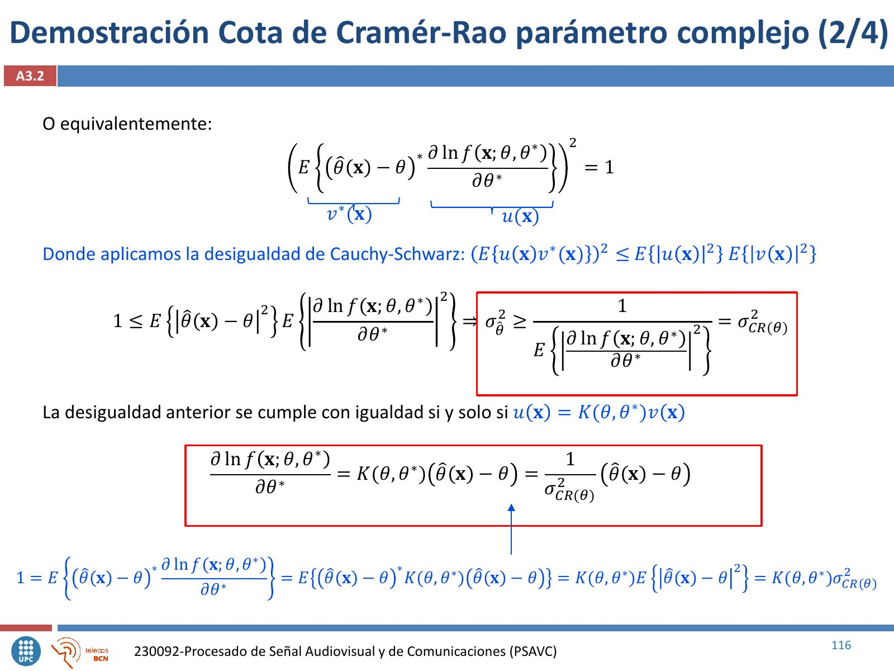

```text
Demostración Cota de Cramér-Rao parámetro complejo (2/4)
A3.2


   O equivalentemente:
                                                                                                     ∗      2
                                                                             ∗ 𝜕𝜕 ln 𝑓𝑓 𝐱𝐱; 𝜃𝜃, 𝜃𝜃
                                                       𝐸𝐸    𝜃𝜃� 𝐱𝐱     − 𝜃𝜃                                    =1
                                                                                       𝜕𝜕𝜃𝜃 ∗
                                                            𝑣𝑣 ∗ (𝐱𝐱)                        𝑢𝑢(𝐱𝐱)
   Donde aplicamos la desigualdad de Cauchy-Schwarz: 𝐸𝐸 𝑢𝑢 𝐱𝐱 𝑣𝑣 ∗ (𝐱𝐱)                                          2
                                                                                                                     ≤ 𝐸𝐸 𝑢𝑢 𝐱𝐱        2
                                                                                                                                            𝐸𝐸 𝑣𝑣 𝐱𝐱      2


                                                                                  2
                                                 2      𝜕𝜕 ln 𝑓𝑓 𝐱𝐱; 𝜃𝜃, 𝜃𝜃 ∗                                        1
              1 ≤ 𝐸𝐸 𝜃𝜃� 𝐱𝐱 − 𝜃𝜃                     𝐸𝐸                               ⇒ 𝜎𝜎𝜃𝜃2̑ ≥                                   2
                                                                                                                                                2
                                                                                                                                           = 𝜎𝜎𝐶𝐶𝐶𝐶(𝜃𝜃)
                                                                𝜕𝜕𝜃𝜃 ∗                                     𝜕𝜕 ln 𝑓𝑓 𝐱𝐱; 𝜃𝜃, 𝜃𝜃 ∗
                                                                                                     𝐸𝐸
                                                                                                                   𝜕𝜕𝜃𝜃 ∗

   La desigualdad anterior se cumple con igualdad si y solo si 𝑢𝑢 𝐱𝐱 = 𝐾𝐾(𝜃𝜃, 𝜃𝜃 ∗ )𝑣𝑣 𝐱𝐱

                                   𝜕𝜕 ln 𝑓𝑓 𝐱𝐱; 𝜃𝜃, 𝜃𝜃 ∗             ∗ �
                                                                                         1
                                                ∗
                                                         = 𝐾𝐾(𝜃𝜃, 𝜃𝜃  ) 𝜃𝜃 𝐱𝐱 − 𝜃𝜃 =    2       𝜃𝜃� 𝐱𝐱 − 𝜃𝜃
                                           𝜕𝜕𝜃𝜃                                      𝜎𝜎𝐶𝐶𝐶𝐶(𝜃𝜃)


                     ∗   𝜕𝜕 ln 𝑓𝑓 𝐱𝐱; 𝜃𝜃, 𝜃𝜃 ∗                        ∗                                                                2
1 = 𝐸𝐸   𝜃𝜃� 𝐱𝐱 − 𝜃𝜃                                 = 𝐸𝐸 𝜃𝜃� 𝐱𝐱 − 𝜃𝜃 𝐾𝐾(𝜃𝜃, 𝜃𝜃 ∗ ) 𝜃𝜃� 𝐱𝐱 − 𝜃𝜃           = 𝐾𝐾(𝜃𝜃, 𝜃𝜃 ∗ )𝐸𝐸 𝜃𝜃� 𝐱𝐱 − 𝜃𝜃 = 𝐾𝐾(𝜃𝜃, 𝜃𝜃 ∗ )𝜎𝜎𝐶𝐶𝐶𝐶
                                                                                                                                                          2
                                                                                                                                                              𝜃𝜃
                                 𝜕𝜕𝜃𝜃 ∗


                  230092-Procesado de Señal Audiovisual y de Comunicaciones (PSAVC)                                                                           116
```

## Page 117

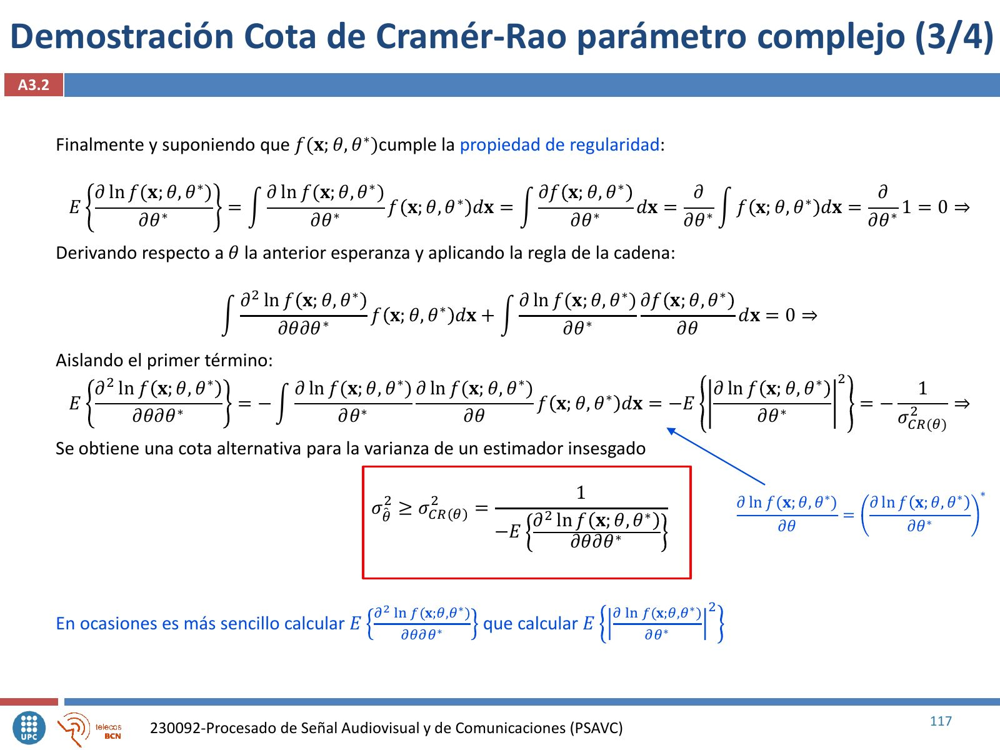

```text
Demostración Cota de Cramér-Rao parámetro complejo (3/4)
A3.2


       Finalmente y suponiendo que 𝑓𝑓(𝐱𝐱; 𝜃𝜃, 𝜃𝜃 ∗ )cumple la propiedad de regularidad:

            𝜕𝜕 ln 𝑓𝑓(𝐱𝐱; 𝜃𝜃, 𝜃𝜃 ∗ )     𝜕𝜕 ln 𝑓𝑓(𝐱𝐱; 𝜃𝜃, 𝜃𝜃 ∗ )               ∗
                                                                                         𝜕𝜕𝑓𝑓 𝐱𝐱; 𝜃𝜃, 𝜃𝜃 ∗          𝜕𝜕                   ∗
                                                                                                                                                    𝜕𝜕
         𝐸𝐸                         = �                         𝑓𝑓 𝐱𝐱; 𝜃𝜃, 𝜃𝜃   𝑑𝑑𝐱𝐱 = �                   𝑑𝑑𝐱𝐱 =        � 𝑓𝑓 𝐱𝐱; 𝜃𝜃, 𝜃𝜃   𝑑𝑑𝐱𝐱 =        1=0⇒
                    𝜕𝜕𝜃𝜃 ∗                      𝜕𝜕𝜃𝜃 ∗                                        𝜕𝜕𝜃𝜃 ∗              𝜕𝜕𝜃𝜃 ∗                          𝜕𝜕𝜃𝜃 ∗
       Derivando respecto a 𝜃𝜃 la anterior esperanza y aplicando la regla de la cadena:

                                    𝜕𝜕 2 ln 𝑓𝑓 𝐱𝐱; 𝜃𝜃, 𝜃𝜃 ∗              ∗
                                                                                   𝜕𝜕 ln 𝑓𝑓(𝐱𝐱; 𝜃𝜃, 𝜃𝜃 ∗ ) 𝜕𝜕𝑓𝑓 𝐱𝐱; 𝜃𝜃, 𝜃𝜃 ∗
                                  �                         𝑓𝑓 𝐱𝐱; 𝜃𝜃, 𝜃𝜃 𝑑𝑑𝐱𝐱 + �                                           𝑑𝑑𝐱𝐱 = 0 ⇒
                                           𝜕𝜕𝜃𝜃𝜃𝜃𝜃𝜃 ∗                                      𝜕𝜕𝜃𝜃 ∗                𝜕𝜕𝜕𝜕
       Aislando el primer término:
                                                                                                                                                    2
            𝜕𝜕 2 ln 𝑓𝑓 𝐱𝐱; 𝜃𝜃, 𝜃𝜃 ∗      𝜕𝜕 ln 𝑓𝑓(𝐱𝐱; 𝜃𝜃, 𝜃𝜃 ∗ ) 𝜕𝜕 ln 𝑓𝑓(𝐱𝐱; 𝜃𝜃, 𝜃𝜃 ∗ )              ∗
                                                                                                                  𝜕𝜕 ln 𝑓𝑓 𝐱𝐱; 𝜃𝜃, 𝜃𝜃 ∗                             1
        𝐸𝐸                          = −�                                                 𝑓𝑓 𝐱𝐱; 𝜃𝜃, 𝜃𝜃 𝑑𝑑𝐱𝐱 = −𝐸𝐸                                       =−         2       ⇒
                   𝜕𝜕𝜕𝜕𝜕𝜕𝜃𝜃 ∗                    𝜕𝜕𝜃𝜃 ∗                  𝜕𝜕𝜕𝜕                                             𝜕𝜕𝜃𝜃 ∗                                𝜎𝜎𝐶𝐶𝐶𝐶(𝜃𝜃)
       Se obtiene una cota alternativa para la varianza de un estimador insesgado

                                                                                                1                              𝜕𝜕 ln 𝑓𝑓(𝐱𝐱; 𝜃𝜃, 𝜃𝜃 ∗ )   𝜕𝜕 ln 𝑓𝑓 𝐱𝐱; 𝜃𝜃, 𝜃𝜃 ∗
                                                                                                                                                                                 ∗
                                                           𝜎𝜎𝜃𝜃2̑ ≥ 𝜎𝜎𝐶𝐶𝐶𝐶
                                                                       2
                                                                           𝜃𝜃 =                                                                        =
                                                                                        𝜕𝜕 2 ln 𝑓𝑓 𝐱𝐱; 𝜃𝜃, 𝜃𝜃 ∗                        𝜕𝜕𝜕𝜕                      𝜕𝜕𝜃𝜃 ∗
                                                                                    −𝐸𝐸
                                                                                               𝜕𝜕𝜕𝜕𝜕𝜕𝜃𝜃 ∗


                                                            𝜕𝜕2 ln 𝑓𝑓 𝐱𝐱;𝜃𝜃,𝜃𝜃 ∗                        𝜕𝜕 ln 𝑓𝑓 𝐱𝐱;𝜃𝜃,𝜃𝜃∗ 2
       En ocasiones es más sencillo calcular 𝐸𝐸                                    que calcular 𝐸𝐸
                                                                 𝜕𝜕𝜕𝜕𝜕𝜕𝜃𝜃 ∗                                   𝜕𝜕𝜃𝜃 ∗


                      230092-Procesado de Señal Audiovisual y de Comunicaciones (PSAVC)                                                                                 117
```

## Page 118

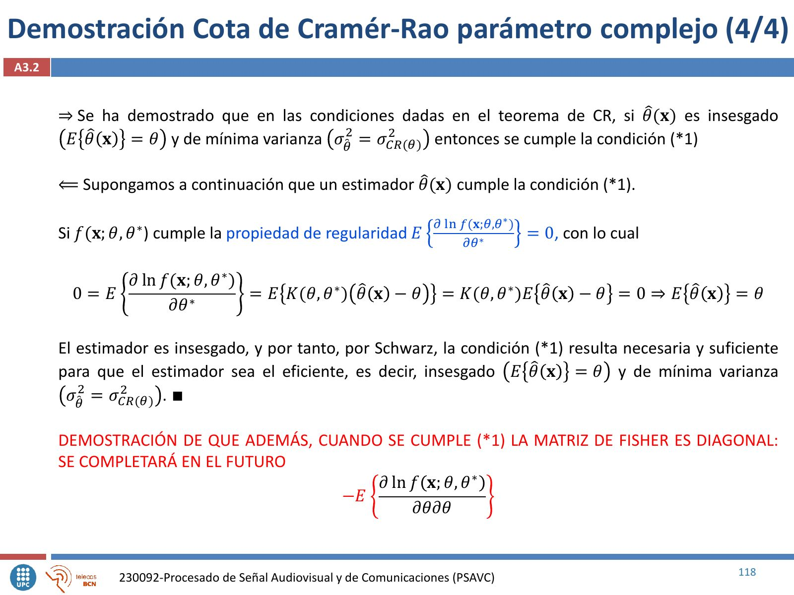

```text
Demostración Cota de Cramér-Rao parámetro complejo (4/4)
A3.2


       ⇒ Se ha demostrado que en las condiciones dadas en el teorema de CR, si 𝜃𝜃(𝐱𝐱)       �     es insesgado
        𝐸𝐸 𝜃𝜃� 𝐱𝐱 = 𝜃𝜃 y de mínima varianza 𝜎𝜎𝜃𝜃2̑ = 𝜎𝜎𝐶𝐶𝐶𝐶(𝜃𝜃)
                                                        2
                                                                entonces se cumple la condición (*1)

                                                     �
       ⟸ Supongamos a continuación que un estimador 𝜃𝜃(𝐱𝐱) cumple la condición (*1).

                    ∗                                                    𝜕𝜕 ln 𝑓𝑓(𝐱𝐱;𝜃𝜃,𝜃𝜃∗ )
       Si 𝑓𝑓(𝐱𝐱; 𝜃𝜃, 𝜃𝜃 ) cumple la propiedad de regularidad 𝐸𝐸                                 = 0, con lo cual
                                                                                𝜕𝜕𝜃𝜃∗

                𝜕𝜕 ln 𝑓𝑓(𝐱𝐱; 𝜃𝜃, 𝜃𝜃 ∗ )
         0 = 𝐸𝐸              ∗
                                        = 𝐸𝐸 𝐾𝐾(𝜃𝜃, 𝜃𝜃 ∗ ) 𝜃𝜃� 𝐱𝐱 − 𝜃𝜃     = 𝐾𝐾(𝜃𝜃, 𝜃𝜃 ∗ )𝐸𝐸 𝜃𝜃� 𝐱𝐱 − 𝜃𝜃 = 0 ⇒ 𝐸𝐸 𝜃𝜃� 𝐱𝐱   = 𝜃𝜃
                        𝜕𝜕𝜃𝜃

       El estimador es insesgado, y por tanto, por Schwarz, la condición (*1) resulta necesaria y suficiente
       para que el estimador sea el eficiente, es decir, insesgado 𝐸𝐸 𝜃𝜃� 𝐱𝐱 = 𝜃𝜃 y de mínima varianza
        𝜎𝜎𝜃𝜃2̑ = 𝜎𝜎𝐶𝐶𝐶𝐶(𝜃𝜃)
                    2
                            .∎

       DEMOSTRACIÓN DE QUE ADEMÁS, CUANDO SE CUMPLE (*1) LA MATRIZ DE FISHER ES DIAGONAL:
       SE COMPLETARÁ EN EL FUTURO
                                         𝜕𝜕 ln 𝑓𝑓 𝐱𝐱; 𝜃𝜃, 𝜃𝜃 ∗
                                     −𝐸𝐸
                                                𝜕𝜕𝜕𝜕𝜕𝜕𝜕𝜕


                 230092-Procesado de Señal Audiovisual y de Comunicaciones (PSAVC)                                         118
```

## Page 119

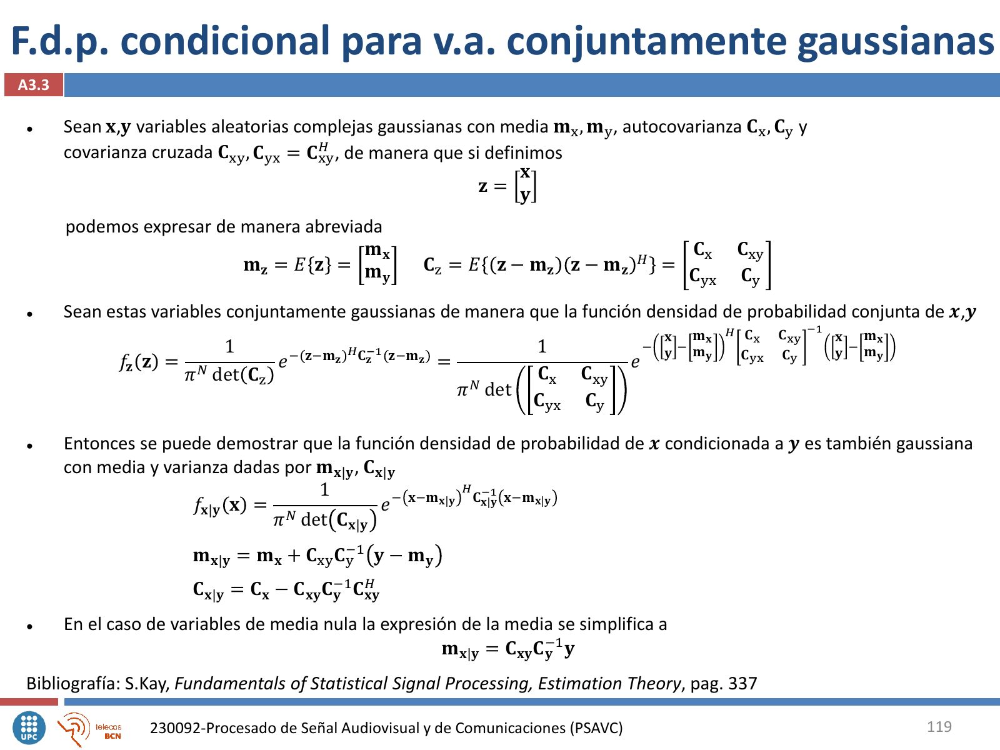

```text
F.d.p. condicional para v.a. conjuntamente gaussianas
A3.3

 ●     Sean 𝐱𝐱,𝐲𝐲 variables aleatorias complejas gaussianas con media 𝐦𝐦x , 𝐦𝐦y , autocovarianza 𝐂𝐂x , 𝐂𝐂y y
       covarianza cruzada 𝐂𝐂xy , 𝐂𝐂yx = 𝐂𝐂𝐻𝐻
                                          xy , de manera que si definimos
                                                                     𝐱𝐱
                                                               𝐳𝐳 = 𝐲𝐲

       podemos expresar de manera abreviada
                                          𝐦𝐦𝐱𝐱                                                            𝐂𝐂x   𝐂𝐂xy
                           𝐦𝐦𝐳𝐳 = 𝐸𝐸 𝐳𝐳 = 𝐦𝐦                    𝐂𝐂z = 𝐸𝐸 𝐳𝐳 − 𝐦𝐦𝐳𝐳 𝐳𝐳 − 𝐦𝐦𝐳𝐳 𝐻𝐻 =
                                             𝐲𝐲                                                          𝐂𝐂yx    𝐂𝐂y
 ●     Sean estas variables conjuntamente gaussianas de manera que la función densidad de probabilidad conjunta de 𝒙𝒙,𝒚𝒚
                                                                                                                              −1
                                                                                                     𝐱𝐱 𝐦𝐦𝐱𝐱 𝐻𝐻 𝐂𝐂x    𝐂𝐂xy        𝐱𝐱 𝐦𝐦𝐱𝐱
                           1                  𝐻𝐻 −1                              1                 − 𝐲𝐲 − 𝐦𝐦
                                                                                                                𝐂𝐂yx    𝐂𝐂y        𝐲𝐲 − 𝐦𝐦𝐲𝐲
              𝑓𝑓𝐳𝐳 𝐳𝐳 = 𝑁𝑁        𝑒𝑒 − 𝐳𝐳−𝐦𝐦𝐳𝐳 𝐂𝐂𝐳𝐳 𝐳𝐳−𝐦𝐦𝐳𝐳 =                                 𝑒𝑒             𝐲𝐲
                       𝜋𝜋 det 𝐂𝐂z                                                𝐂𝐂x   𝐂𝐂xy
                                                                    𝜋𝜋 𝑁𝑁 det
                                                                                𝐂𝐂yx    𝐂𝐂y

 ●     Entonces se puede demostrar que la función densidad de probabilidad de 𝒙𝒙 condicionada a 𝒚𝒚 es también gaussiana
       con media y varianza dadas por 𝐦𝐦𝐱𝐱|𝐲𝐲, 𝐂𝐂𝐱𝐱|𝐲𝐲
                                        1                        𝐻𝐻 −1
                       𝑓𝑓𝐱𝐱|𝐲𝐲 𝐱𝐱 = 𝑁𝑁            𝑒𝑒 − 𝐱𝐱−𝐦𝐦𝐱𝐱|𝐲𝐲 𝐂𝐂𝐱𝐱|𝐲𝐲 𝐱𝐱−𝐦𝐦𝐱𝐱|𝐲𝐲
                                   𝜋𝜋 det 𝐂𝐂𝐱𝐱|𝐲𝐲
                        𝐦𝐦𝐱𝐱|𝐲𝐲 = 𝐦𝐦𝐱𝐱 + 𝐂𝐂xy 𝐂𝐂y−1 𝐲𝐲 − 𝐦𝐦𝐲𝐲
                        𝐂𝐂𝐱𝐱|𝐲𝐲 = 𝐂𝐂𝐱𝐱 − 𝐂𝐂𝐱𝐱𝐱𝐱 𝐂𝐂𝐲𝐲−1 𝐂𝐂𝐻𝐻
                                                         𝐱𝐱𝐱𝐱

 ●     En el caso de variables de media nula la expresión de la media se simplifica a
                                                       𝐦𝐦𝐱𝐱|𝐲𝐲 = 𝐂𝐂𝐱𝐱𝐱𝐱 𝐂𝐂𝐲𝐲−1 𝐲𝐲
 Bibliografía: S.Kay, Fundamentals of Statistical Signal Processing, Estimation Theory, pag. 337

                  230092-Procesado de Señal Audiovisual y de Comunicaciones (PSAVC)                                                            119
```
