# PSAVC 4 Filtrado WIENER QP 2026 G10

- Source PDF: `Teoria/PSAVC 4 Filtrado WIENER QP 2026 G10.pdf`
- PDF title: `PSAVC - Filtro de Wiener`
- Pages: 87
- Note: Transcribed from the embedded PDF text layer. Each page links to a rendered page image so figures, plots, handwriting, and formula layout can be checked against the original.
- Text-layer caveat: `�` marks a glyph that the PDF text layer does not map to Unicode; use the rendered page image for that formula or symbol.

## Page 1


```text
            Tema 4.- Filtro de Wiener


Copyright © Profesorado de la asignatura 230092-PSAVC-ETSETB.


UPC / GPS                   230092 – PSAVC – GRETST - ETSETB
```

## Page 2


```text
Tema 4: Filtro de Wiener

1.   Introducción
2.   Aplicaciones
3.   MSE y ecuaciones normales
4.   Ejemplos de aplicación
5.   Filtro óptimo a partir de las muestras
6.   Conclusiones y ejercicios propuestos


      230092-Procesado de Señal Audiovisual y de Comunicaciones (PSAVC)   2
```

## Page 3

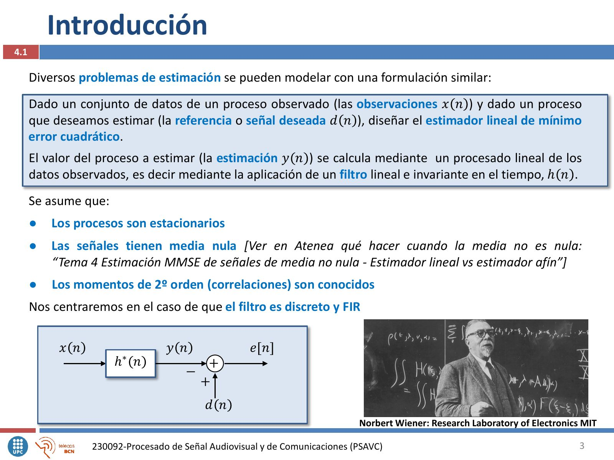

```text
          Introducción
4.1

      Diversos problemas de estimación se pueden modelar con una formulación similar:
      Dado un conjunto de datos de un proceso observado (las observaciones 𝑥𝑥 𝑛𝑛 ) y dado un proceso
      que deseamos estimar (la referencia o señal deseada 𝑑𝑑 𝑛𝑛 ), diseñar el estimador lineal de mínimo
      error cuadrático.
      El valor del proceso a estimar (la estimación 𝑦𝑦 𝑛𝑛 ) se calcula mediante un procesado lineal de los
      datos observados, es decir mediante la aplicación de un filtro lineal e invariante en el tiempo, ℎ 𝑛𝑛 .
      Se asume que:
      ●   Los procesos son estacionarios
      ●   Las señales tienen media nula [Ver en Atenea qué hacer cuando la media no es nula:
          “Tema 4 Estimación MMSE de señales de media no nula - Estimador lineal vs estimador afín”]
      ●   Los momentos de 2º orden (correlaciones) son conocidos
      Nos centraremos en el caso de que el filtro es discreto y FIR


           𝑥𝑥 𝑛𝑛                   𝑦𝑦 𝑛𝑛              𝑒𝑒[𝑛𝑛]
                         ∗
                        ℎ 𝑛𝑛                +
                                       −
                                           +
                                            𝑑𝑑 𝑛𝑛
                                                                              Norbert Wiener: Research Laboratory of Electronics MIT

                   230092-Procesado de Señal Audiovisual y de Comunicaciones (PSAVC)                                            3
```

## Page 4

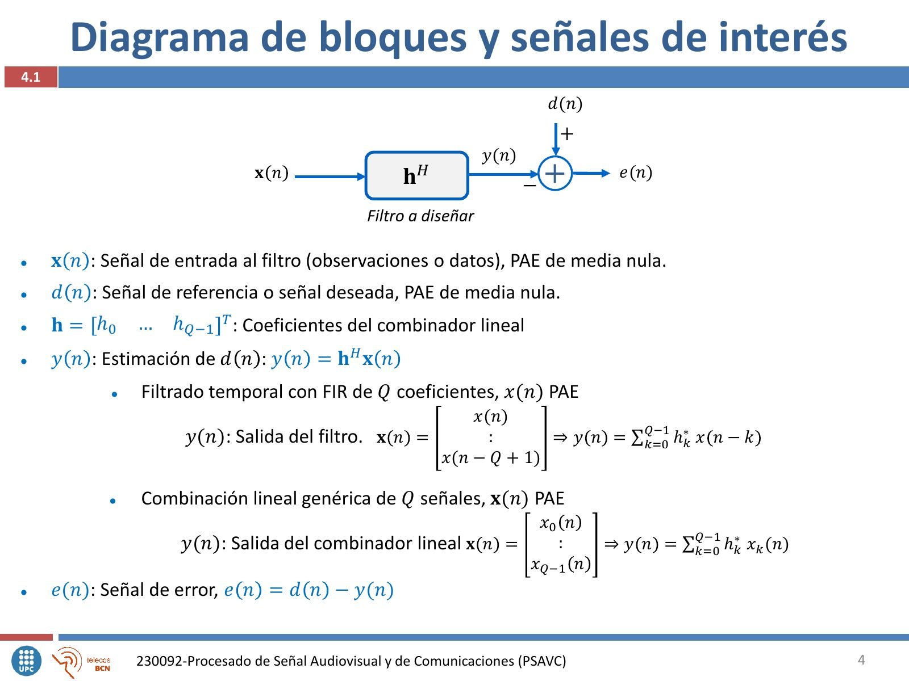

```text
        Diagrama de bloques y señales de interés
4.1
                                                                                    𝑑𝑑(𝑛𝑛)

                                                                                −     +
                                                                       𝑦𝑦(𝑛𝑛)
                                   𝐱𝐱 𝑛𝑛                  𝐡𝐡𝐻𝐻                      +          𝑒𝑒(𝑛𝑛)

                                                    Filtro a diseñar

●     𝐱𝐱 𝑛𝑛 : Señal de entrada al filtro (observaciones o datos), PAE de media nula.
●     𝑑𝑑 𝑛𝑛 : Señal de referencia o señal deseada, PAE de media nula.
●     𝐡𝐡 = ℎ0     …    ℎ𝑄𝑄−1 𝑇𝑇 : Coeficientes del combinador lineal
●     𝑦𝑦 𝑛𝑛 : Estimación de 𝑑𝑑 𝑛𝑛 : 𝑦𝑦 𝑛𝑛 = 𝐡𝐡𝐻𝐻 𝐱𝐱 𝑛𝑛
              ●   Filtrado temporal con FIR de 𝑄𝑄 coeficientes, 𝑥𝑥(𝑛𝑛) PAE
                                                                  𝑥𝑥(𝑛𝑛)
                                                                                       𝑄𝑄−1
                         𝑦𝑦(𝑛𝑛): Salida del filtro. 𝐱𝐱 𝑛𝑛 =          :      ⇒ 𝑦𝑦 𝑛𝑛 = ∑𝑘𝑘=0 ℎ𝑘𝑘∗ 𝑥𝑥 𝑛𝑛 − 𝑘𝑘
                                                            𝑥𝑥(𝑛𝑛 − 𝑄𝑄 + 1)

              ●   Combinación lineal genérica de 𝑄𝑄 señales, 𝐱𝐱(𝑛𝑛) PAE
                                                                       𝑥𝑥0 𝑛𝑛
                                                                                                           𝑄𝑄−1
                        𝑦𝑦(𝑛𝑛): Salida del combinador lineal 𝐱𝐱 𝑛𝑛 =      :                  ⇒ 𝑦𝑦 𝑛𝑛 = ∑𝑘𝑘=0 ℎ𝑘𝑘∗ 𝑥𝑥𝑘𝑘 (𝑛𝑛)
                                                                     𝑥𝑥𝑄𝑄−1 𝑛𝑛
●     𝑒𝑒(𝑛𝑛): Señal de error, 𝑒𝑒 𝑛𝑛 = 𝑑𝑑 𝑛𝑛 − 𝑦𝑦(𝑛𝑛)


                  230092-Procesado de Señal Audiovisual y de Comunicaciones (PSAVC)                                           4
```

## Page 5

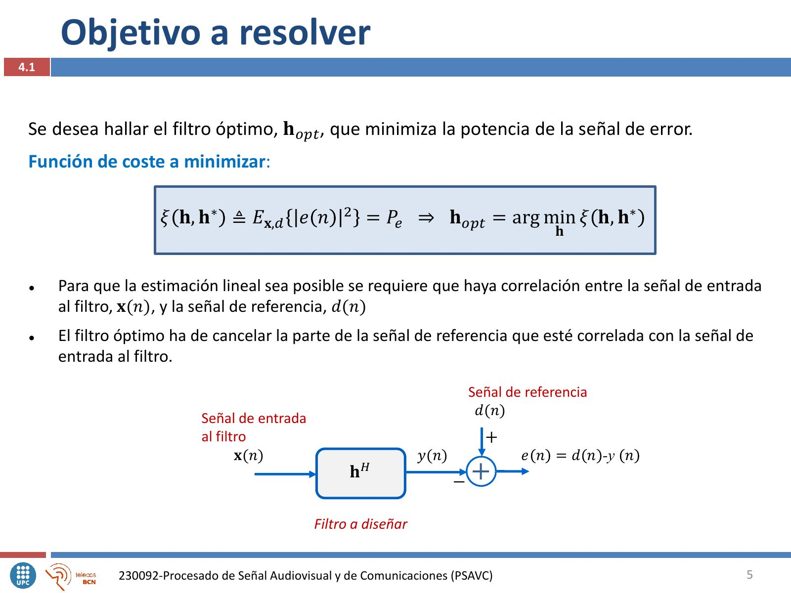

```text
      Objetivo a resolver
4.1


 Se desea hallar el filtro óptimo, 𝐡𝐡𝑜𝑜𝑜𝑜𝑡𝑡 , que minimiza la potencia de la señal de error.
 Función de coste a minimizar:

                     𝜉𝜉 𝐡𝐡, 𝐡𝐡∗ ≜ 𝐸𝐸𝐱𝐱,𝑑𝑑 𝑒𝑒 𝑛𝑛      2     = 𝑃𝑃𝑒𝑒 ⇒ 𝐡𝐡𝑜𝑜𝑜𝑜𝑡𝑡 = arg min 𝜉𝜉 𝐡𝐡, 𝐡𝐡∗
                                                                                            𝐡𝐡


 ●    Para que la estimación lineal sea posible se requiere que haya correlación entre la señal de entrada
      al filtro, 𝐱𝐱(𝑛𝑛), y la señal de referencia, 𝑑𝑑(𝑛𝑛)
 ●    El filtro óptimo ha de cancelar la parte de la señal de referencia que esté correlada con la señal de
      entrada al filtro.
                                                                               Señal de referencia
                                                                                𝑑𝑑(𝑛𝑛)
                            Señal de entrada
                            al filtro
                                                                           −     +
                                   𝐱𝐱(𝑛𝑛)                         𝑦𝑦(𝑛𝑛)               𝑒𝑒 𝑛𝑛 = 𝑑𝑑 𝑛𝑛 -y 𝑛𝑛
                                                      𝐡𝐡 𝐻𝐻
                                                                               +
                                               Filtro a diseñar


              230092-Procesado de Señal Audiovisual y de Comunicaciones (PSAVC)                              5
```

## Page 6


```text
Tema 4: Filtro de Wiener

1.   Introducción
2.   Aplicaciones
3.   MSE y ecuaciones normales
4.   Ejemplos de aplicación
5.   Filtro óptimo a partir de las muestras
6.   Conclusiones y ejercicios propuestos


      230092-Procesado de Señal Audiovisual y de Comunicaciones (PSAVC)   6
```

## Page 7

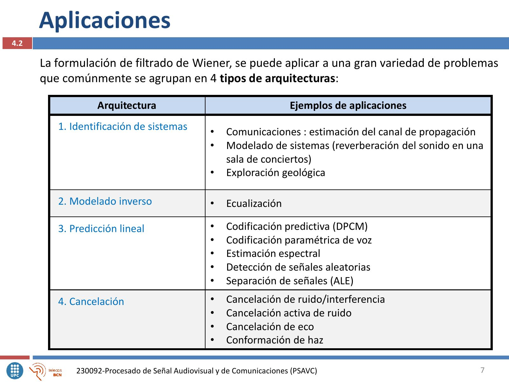

```text
      Aplicaciones
4.2

      La formulación de filtrado de Wiener, se puede aplicar a una gran variedad de problemas
      que comúnmente se agrupan en 4 tipos de arquitecturas:

                  Arquitectura                                        Ejemplos de aplicaciones
         1. Identificación de sistemas           •   Comunicaciones : estimación del canal de propagación
                                                 •   Modelado de sistemas (reverberación del sonido en una
                                                     sala de conciertos)
                                                 •   Exploración geológica

         2. Modelado inverso                     •   Ecualización

         3. Predicción lineal                    •   Codificación predictiva (DPCM)
                                                 •   Codificación paramétrica de voz
                                                 •   Estimación espectral
                                                 •   Detección de señales aleatorias
                                                 •   Separación de señales (ALE)
         4. Cancelación                          •   Cancelación de ruido/interferencia
                                                 •   Cancelación activa de ruido
                                                 •   Cancelación de eco
                                                 •   Conformación de haz

             230092-Procesado de Señal Audiovisual y de Comunicaciones (PSAVC)                           7
```

## Page 8

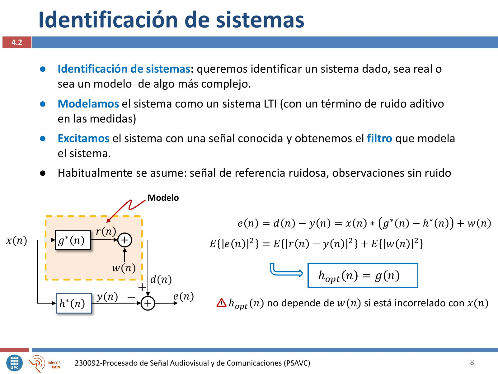

```text
         Identificación de sistemas
 4.2


         ● Identificación de sistemas: queremos identificar un sistema dado, sea real o
           sea un modelo de algo más complejo.
         ● Modelamos el sistema como un sistema LTI (con un término de ruido aditivo
           en las medidas)
         ● Excitamos el sistema con una señal conocida y obtenemos el filtro que modela
           el sistema.
         ● Habitualmente se asume: señal de referencia ruidosa, observaciones sin ruido
                                       Modelo

                                                                𝑒𝑒 𝑛𝑛 = 𝑑𝑑 𝑛𝑛 − 𝑦𝑦 𝑛𝑛 = 𝑥𝑥 𝑛𝑛 ∗ 𝑔𝑔∗ 𝑛𝑛 − ℎ∗ 𝑛𝑛    + 𝑤𝑤 𝑛𝑛
                     𝑟𝑟 𝑛𝑛
𝑥𝑥(𝑛𝑛)      𝑔𝑔∗ 𝑛𝑛             +                         𝐸𝐸 𝑒𝑒 𝑛𝑛   2
                                                                        = 𝐸𝐸 𝑟𝑟 𝑛𝑛 − 𝑦𝑦 𝑛𝑛   2
                                                                                                 + 𝐸𝐸 𝑤𝑤 𝑛𝑛   2


                             𝑤𝑤(𝑛𝑛)
                                       𝑑𝑑(𝑛𝑛)                                       ℎ𝑜𝑜𝑜𝑜𝑜𝑜 𝑛𝑛 = 𝑔𝑔 𝑛𝑛
                                      +
                      𝑦𝑦(𝑛𝑛) −                  𝑒𝑒(𝑛𝑛)
            ℎ∗ 𝑛𝑛                      +                     ℎ𝑜𝑜𝑜𝑜𝑜𝑜 𝑛𝑛 no depende de 𝑤𝑤 𝑛𝑛 si está incorrelado con 𝑥𝑥 𝑛𝑛


                230092-Procesado de Señal Audiovisual y de Comunicaciones (PSAVC)                                    8
```

## Page 9

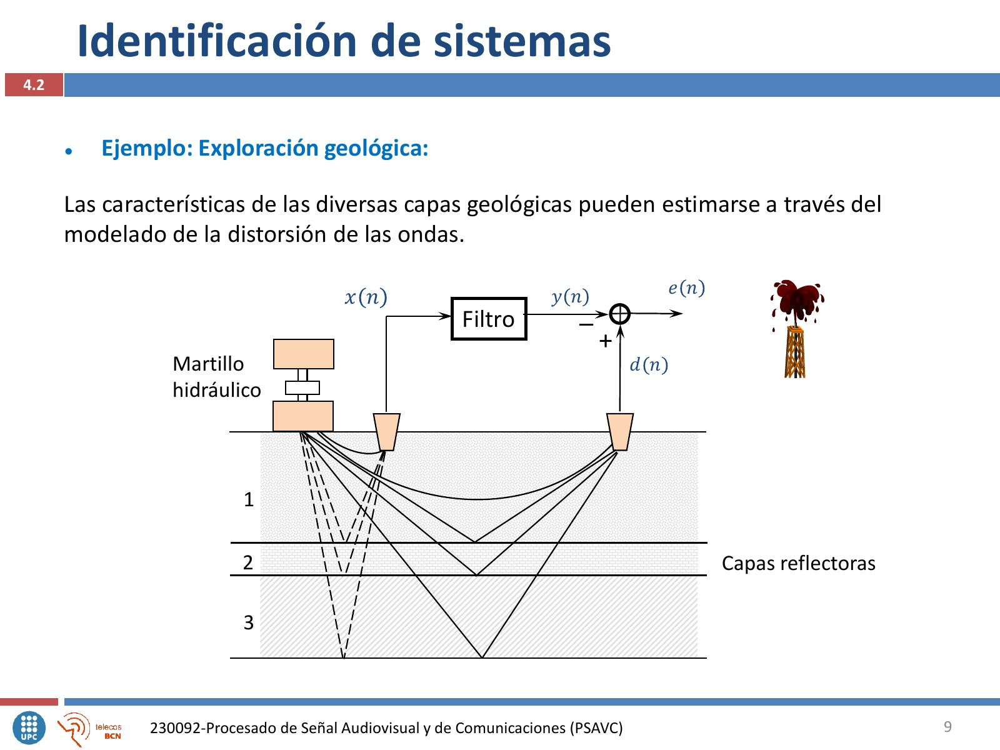

```text
          Identificación de sistemas
4.2


      ●    Ejemplo: Exploración geológica:

      Las características de las diversas capas geológicas pueden estimarse a través del
      modelado de la distorsión de las ondas.

                                                                                           𝑒𝑒 𝑛𝑛
                                         𝑥𝑥 𝑛𝑛                        𝑦𝑦 𝑛𝑛
                                                         Filtro           _
                                                                              +
                  Martillo                                                         𝑑𝑑 𝑛𝑛
                  hidráulico


                           1

                           2                                                                       Capas reflectoras

                           3


               230092-Procesado de Señal Audiovisual y de Comunicaciones (PSAVC)                                       9
```

## Page 10

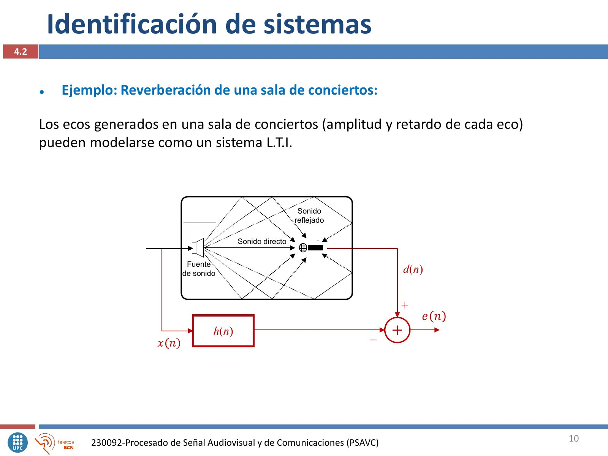

```text
          Identificación de sistemas
4.2


      ●    Ejemplo: Reverberación de una sala de conciertos:

      Los ecos generados en una sala de conciertos (amplitud y retardo de cada eco)
      pueden modelarse como un sistema L.T.I.


                                                                       Sonido
                                                                      reflejado

                                                     Sonido directo


                                       Fuente
                                      de sonido                                           d(n)


                                                                                      +
                                                                                             𝑒𝑒 𝑛𝑛
                                              h(n)                                    +
                              𝑥𝑥 𝑛𝑛                                               _


               230092-Procesado de Señal Audiovisual y de Comunicaciones (PSAVC)                     10
```

## Page 11

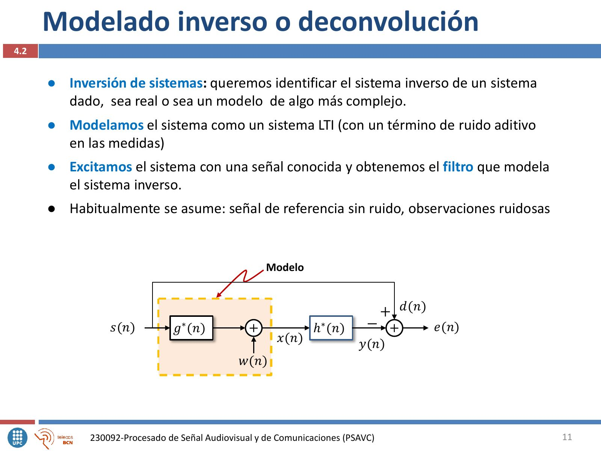

```text
      Modelado inverso o deconvolución
4.2


      ● Inversión de sistemas: queremos identificar el sistema inverso de un sistema
        dado, sea real o sea un modelo de algo más complejo.
      ● Modelamos el sistema como un sistema LTI (con un término de ruido aditivo
        en las medidas)
      ● Excitamos el sistema con una señal conocida y obtenemos el filtro que modela
        el sistema inverso.
      ● Habitualmente se asume: señal de referencia sin ruido, observaciones ruidosas


                                                    Modelo


                                                                            + 𝑑𝑑(𝑛𝑛)
                𝑠𝑠(𝑛𝑛)         𝑔𝑔∗ (𝑛𝑛)         +              ℎ∗ (𝑛𝑛)     − +       𝑒𝑒(𝑛𝑛)
                                                      𝑥𝑥(𝑛𝑛)             𝑦𝑦(𝑛𝑛)
                                             𝑤𝑤(𝑛𝑛)


            230092-Procesado de Señal Audiovisual y de Comunicaciones (PSAVC)                 11
```

## Page 12

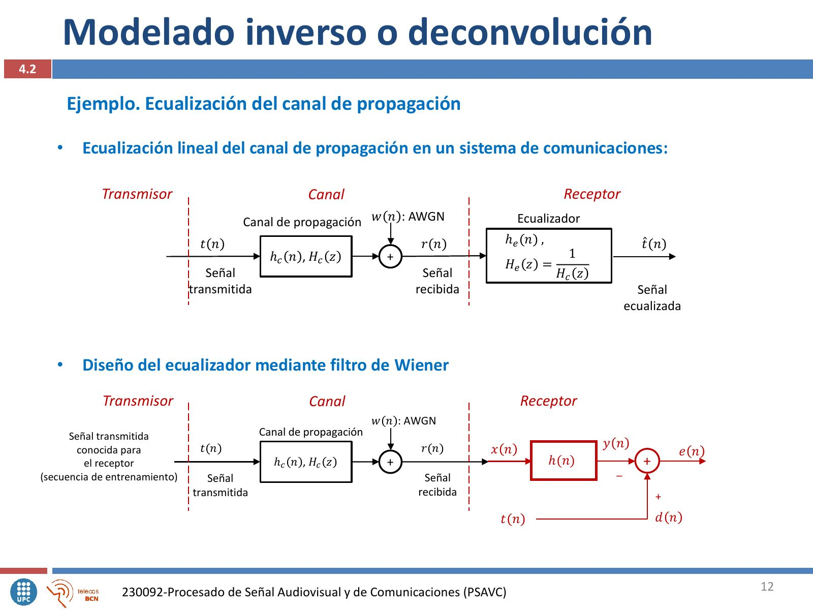

```text
          Modelado inverso o deconvolución
4.2

             Ejemplo. Ecualización del canal de propagación

         •    Ecualización lineal del canal de propagación en un sistema de comunicaciones:

                  Transmisor                                   Canal                                         Receptor
                                              Canal de propagación 𝑤𝑤 𝑛𝑛 : AWGN                      Ecualizador
                                      𝑡𝑡 𝑛𝑛                                        𝑟𝑟 𝑛𝑛        ℎ𝑒𝑒 𝑛𝑛 ,                        𝑡𝑡̂ 𝑛𝑛
                                                     ℎ𝑐𝑐 𝑛𝑛 , 𝐻𝐻𝑐𝑐 𝑧𝑧       +                                  1
                                                                                                𝐻𝐻𝑒𝑒 𝑧𝑧 =
                                        Señal                                      Señal                    𝐻𝐻𝑐𝑐 𝑧𝑧
                                     transmitida                                  recibida                                     Señal
                                                                                                                             ecualizada


         •    Diseño del ecualizador mediante filtro de Wiener
                  Transmisor                                   Canal                                   Receptor
                                                                          𝑤𝑤 𝑛𝑛 : AWGN
            Señal transmitida                      Canal de propagación
             conocida para            𝑡𝑡 𝑛𝑛                                        𝑟𝑟 𝑛𝑛     𝑥𝑥 𝑛𝑛                    𝑦𝑦 𝑛𝑛
                                                                                                                                            𝑒𝑒 𝑛𝑛
               el receptor                            ℎ𝑐𝑐 𝑛𝑛 , 𝐻𝐻𝑐𝑐 𝑧𝑧      +                              ℎ(𝑛𝑛)                +
      (secuencia de entrenamiento)      Señal                                      Señal                                 _
                                     transmitida                                  recibida                                          +
                                                                                               𝑡𝑡 𝑛𝑛                                𝑑𝑑 𝑛𝑛


                      230092-Procesado de Señal Audiovisual y de Comunicaciones (PSAVC)                                                             12
```

## Page 13

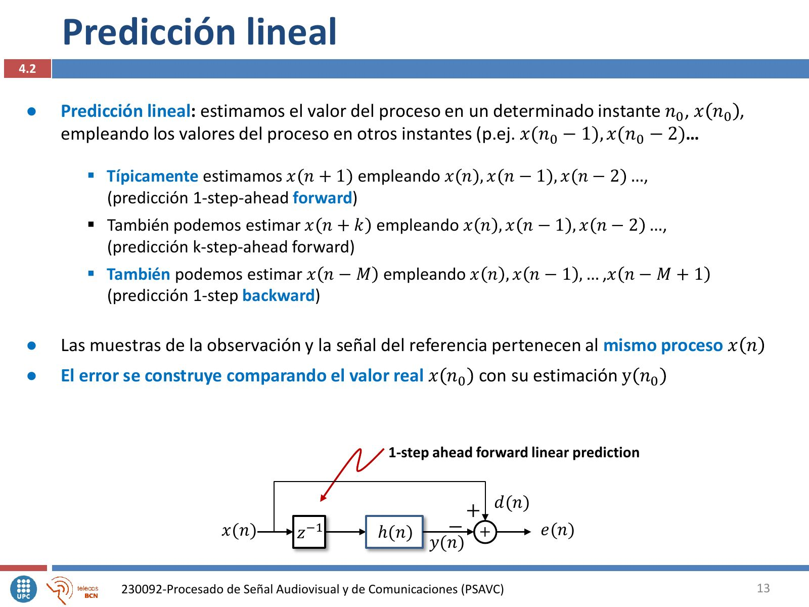

```text
      Predicción lineal
4.2


 ●    Predicción lineal: estimamos el valor del proceso en un determinado instante 𝑛𝑛0 , 𝑥𝑥 𝑛𝑛0 ,
      empleando los valores del proceso en otros instantes (p.ej. 𝑥𝑥(𝑛𝑛0 − 1), 𝑥𝑥(𝑛𝑛0 − 2)…

          Típicamente estimamos 𝑥𝑥 𝑛𝑛 + 1 empleando 𝑥𝑥 𝑛𝑛 , 𝑥𝑥 𝑛𝑛 − 1 , 𝑥𝑥 𝑛𝑛 − 2 …,
           (predicción 1-step-ahead forward)
          También podemos estimar 𝑥𝑥 𝑛𝑛 + 𝑘𝑘 empleando 𝑥𝑥 𝑛𝑛 , 𝑥𝑥 𝑛𝑛 − 1 , 𝑥𝑥 𝑛𝑛 − 2 …,
           (predicción k-step-ahead forward)
          También podemos estimar 𝑥𝑥 𝑛𝑛 − 𝑀𝑀 empleando 𝑥𝑥 𝑛𝑛 , 𝑥𝑥 𝑛𝑛 − 1 , … ,𝑥𝑥 𝑛𝑛 − 𝑀𝑀 + 1
           (predicción 1-step backward)

 ●    Las muestras de la observación y la señal del referencia pertenecen al mismo proceso 𝑥𝑥 𝑛𝑛
 ●    El error se construye comparando el valor real 𝑥𝑥 𝑛𝑛0 con su estimación y 𝑛𝑛0


                                                           1-step ahead forward linear prediction


                                                                           + 𝑑𝑑(𝑛𝑛)
                               𝑥𝑥(𝑛𝑛)      𝑧𝑧 −1         ℎ(𝑛𝑛)       − +              𝑒𝑒(𝑛𝑛)
                                                                  𝑦𝑦(𝑛𝑛)

              230092-Procesado de Señal Audiovisual y de Comunicaciones (PSAVC)                     13
```

## Page 14

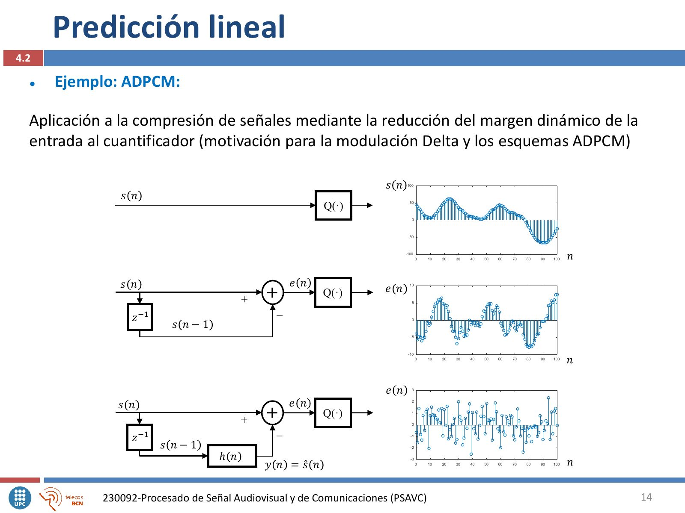

```text
      Predicción lineal
4.2

  ●   Ejemplo: ADPCM:

  Aplicación a la compresión de señales mediante la reducción del margen dinámico de la
  entrada al cuantificador (motivación para la modulación Delta y los esquemas ADPCM)

                                                                              𝑠𝑠 𝑛𝑛   100


               𝑠𝑠 𝑛𝑛
                                                                       Q(·)             50


                                                                                         0


                                                                                       -50


                                                                                      -100
                                                                                             0   10   20   30   40   50   60   70   80   90   100   𝑛𝑛

               𝑠𝑠 𝑛𝑛                                         𝑒𝑒 𝑛𝑛
                                                      +                       𝑒𝑒 𝑛𝑛     10

                                                                       Q(·)
                                                  +                                      5


                        −1
                   𝑧𝑧                                    _                               0
                               𝑠𝑠 𝑛𝑛 − 1
                                                                                        -5


                                                                                       -10
                                                                                             0   10   20   30   40   50   60   70   80   90   100
                                                                                                                                                    𝑛𝑛

                                                                              𝑒𝑒 𝑛𝑛      3


               𝑠𝑠 𝑛𝑛                                         𝑒𝑒 𝑛𝑛                       2


                                                  +   +                Q(·)              1


                                                                                         0

                        −1
                   𝑧𝑧                                   _
                                                                                        -1

                             𝑠𝑠 𝑛𝑛 − 1                                                  -2

                                           ℎ 𝑛𝑛
                                                      𝑦𝑦 𝑛𝑛 = 𝑠𝑠̂ 𝑛𝑛
                                                                                        -3
                                                                                             0   10   20   30   40   50   60   70   80   90   100   𝑛𝑛


            230092-Procesado de Señal Audiovisual y de Comunicaciones (PSAVC)                                                                            14
```

## Page 15

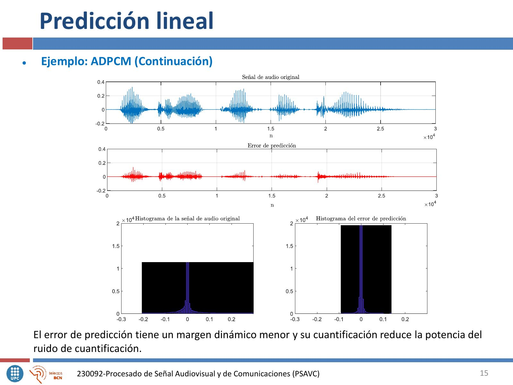

```text
     Predicción lineal
●    Ejemplo: ADPCM (Continuación)


    El error de predicción tiene un margen dinámico menor y su cuantificación reduce la potencia del
    ruido de cuantificación.

             230092-Procesado de Señal Audiovisual y de Comunicaciones (PSAVC)                     15
```

## Page 16

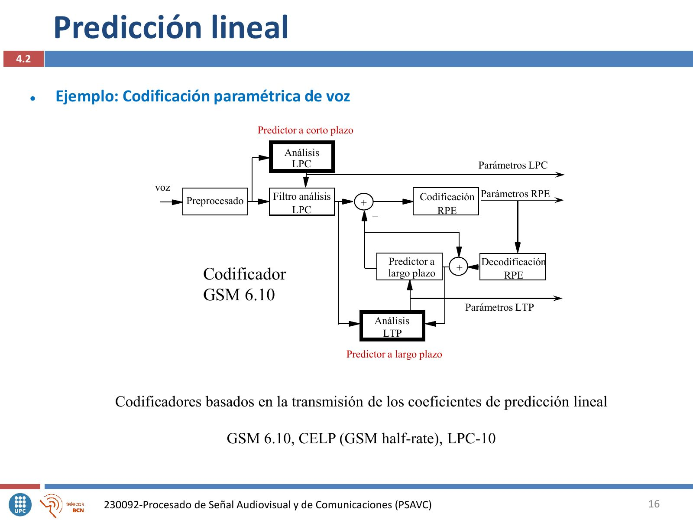

```text
      Predicción lineal
4.2


  ●   Ejemplo: Codificación paramétrica de voz
                                           Predictor a corto plazo

                                                 Análisis
                                                  LPC                                            Parámetros LPC

                      voz
                            Preprocesado      Filtro análisis                       Codificación Parámetros RPE
                                                                     +
                                                   LPC                   _             RPE


                                                                             Predictor a          Decodificación
                                                                                           +
                               Codificador                                   largo plazo              RPE

                               GSM 6.10
                                                                                               Parámetros LTP
                                                                         Análisis
                                                                          LTP
                                                                Predictor a largo plazo


              Codificadores basados en la transmisión de los coeficientes de predicción lineal

                                    GSM 6.10, CELP (GSM half-rate), LPC-10


            230092-Procesado de Señal Audiovisual y de Comunicaciones (PSAVC)                                      16
```

## Page 17

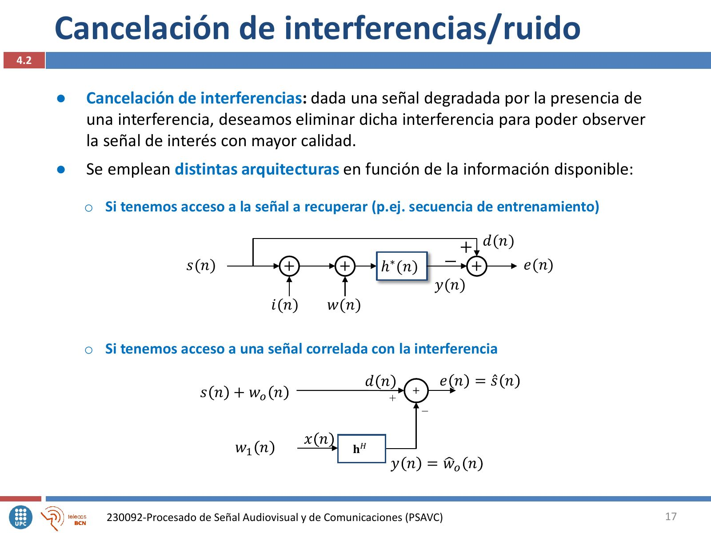

```text
      Cancelación de interferencias/ruido
4.2


      ●   Cancelación de interferencias: dada una señal degradada por la presencia de
          una interferencia, deseamos eliminar dicha interferencia para poder observer
          la señal de interés con mayor calidad.
      ●   Se emplean distintas arquitecturas en función de la información disponible:

          o Si tenemos acceso a la señal a recuperar (p.ej. secuencia de entrenamiento)

                                                                                           + 𝑑𝑑(𝑛𝑛)
                            𝑠𝑠(𝑛𝑛)               +             +          ℎ∗ (𝑛𝑛)         − +       𝑒𝑒(𝑛𝑛)
                                                                                         𝑦𝑦(𝑛𝑛)
                                              𝑖𝑖(𝑛𝑛)       𝑤𝑤(𝑛𝑛)

          o Si tenemos acceso a una señal correlada con la interferencia

                                                                      𝑑𝑑 𝑛𝑛              𝑒𝑒 𝑛𝑛 = 𝑠𝑠̂ 𝑛𝑛
                               𝑠𝑠 𝑛𝑛 + 𝑤𝑤𝑜𝑜 𝑛𝑛                             +
                                                                                 +

                                                                                     _
                                                       𝑥𝑥 𝑛𝑛
                                     𝑤𝑤1 𝑛𝑛                        𝐡𝐡𝐻𝐻
                                                                              𝑦𝑦 𝑛𝑛 = 𝑤𝑤
                                                                                      �𝑜𝑜 𝑛𝑛


             230092-Procesado de Señal Audiovisual y de Comunicaciones (PSAVC)                               17
```

## Page 18

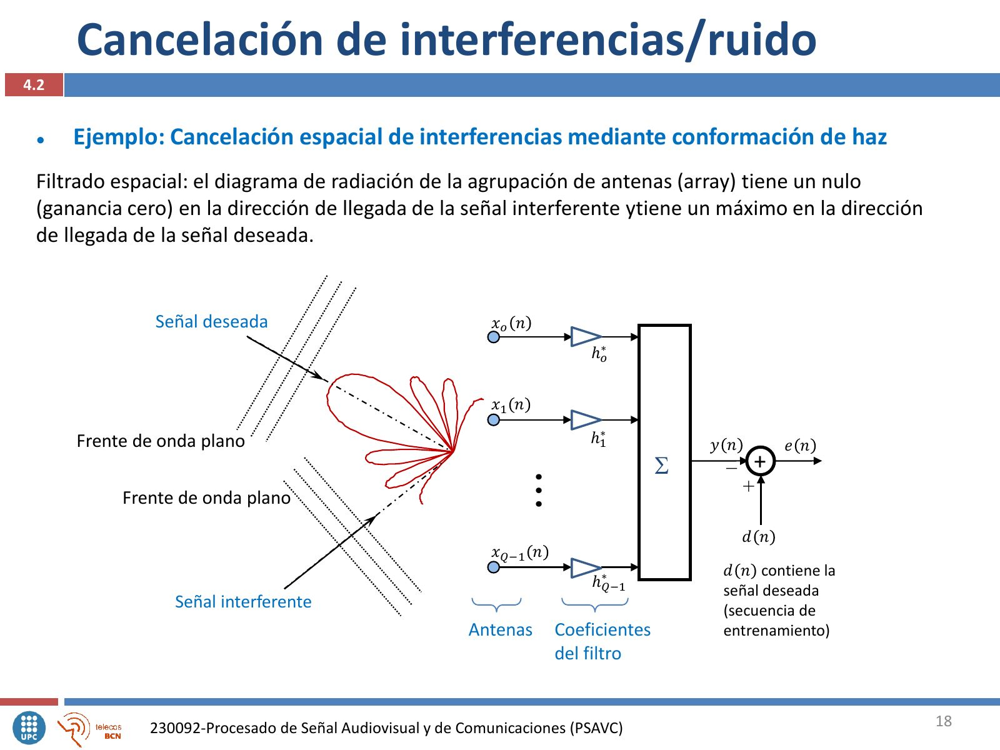

```text
      Cancelación de interferencias/ruido
4.2


 ●    Ejemplo: Cancelación espacial de interferencias mediante conformación de haz
 Filtrado espacial: el diagrama de radiación de la agrupación de antenas (array) tiene un nulo
 (ganancia cero) en la dirección de llegada de la señal interferente ytiene un máximo en la dirección
 de llegada de la señal deseada.


               Señal deseada                                𝑥𝑥𝑜𝑜 𝑛𝑛
                                                                            ℎ𝑜𝑜∗


                                                            𝑥𝑥1 𝑛𝑛

      Frente de onda plano                                                  ℎ1∗            𝑦𝑦 𝑛𝑛           𝑒𝑒 𝑛𝑛
                                                                                       Σ      _      +
           Frente de onda plano
                                                               ⋯                                   +

                                                                                                   𝑑𝑑 𝑛𝑛
                                                            𝑥𝑥𝑄𝑄−1 𝑛𝑛
                                                                             ∗               𝑑𝑑 𝑛𝑛 contiene la
                                                                            ℎ𝑄𝑄−1
                                                                                             señal deseada
                 Señal interferente                                                          (secuencia de
                                                         Antenas        Coeficientes         entrenamiento)
                                                                        del filtro


              230092-Procesado de Señal Audiovisual y de Comunicaciones (PSAVC)                                    18
```

## Page 19

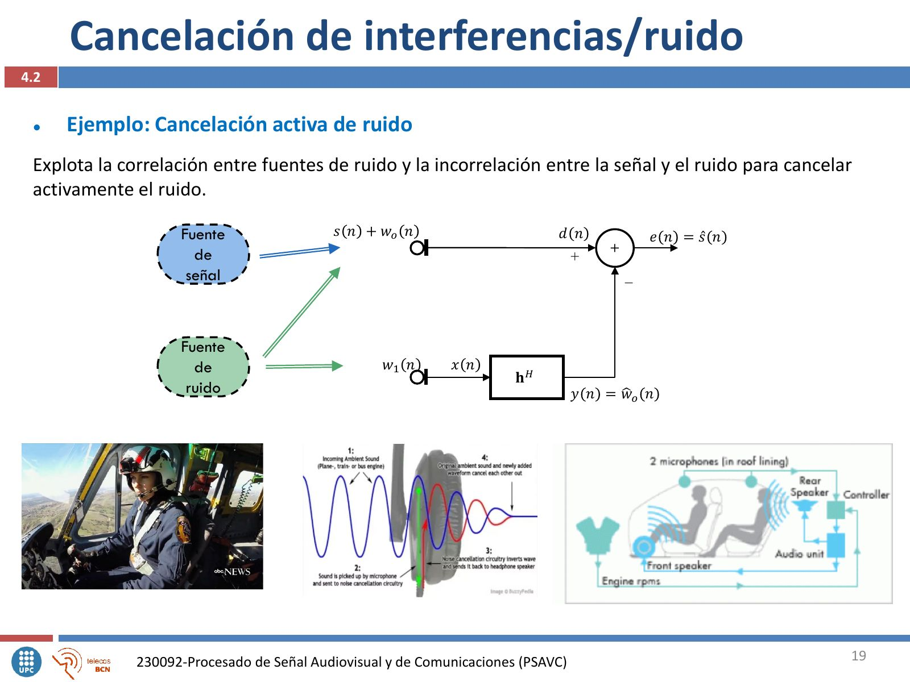

```text
      Cancelación de interferencias/ruido
4.2


 ●    Ejemplo: Cancelación activa de ruido
 Explota la correlación entre fuentes de ruido y la incorrelación entre la señal y el ruido para cancelar
 activamente el ruido.

                    Fuente                 𝑠𝑠 𝑛𝑛 + 𝑤𝑤𝑜𝑜 𝑛𝑛                    𝑑𝑑 𝑛𝑛             𝑒𝑒 𝑛𝑛 = 𝑠𝑠̂ 𝑛𝑛
                      de                                                                +
                                                                                  +
                     señal
                                                                                            _


                    Fuente
                      de                            𝑤𝑤1 𝑛𝑛   𝑥𝑥 𝑛𝑛
                                                                       𝐡𝐡𝐻𝐻
                     ruido                                                        𝑦𝑦 𝑛𝑛 = 𝑤𝑤
                                                                                          �𝑜𝑜 𝑛𝑛


              230092-Procesado de Señal Audiovisual y de Comunicaciones (PSAVC)                                  19
```

## Page 20

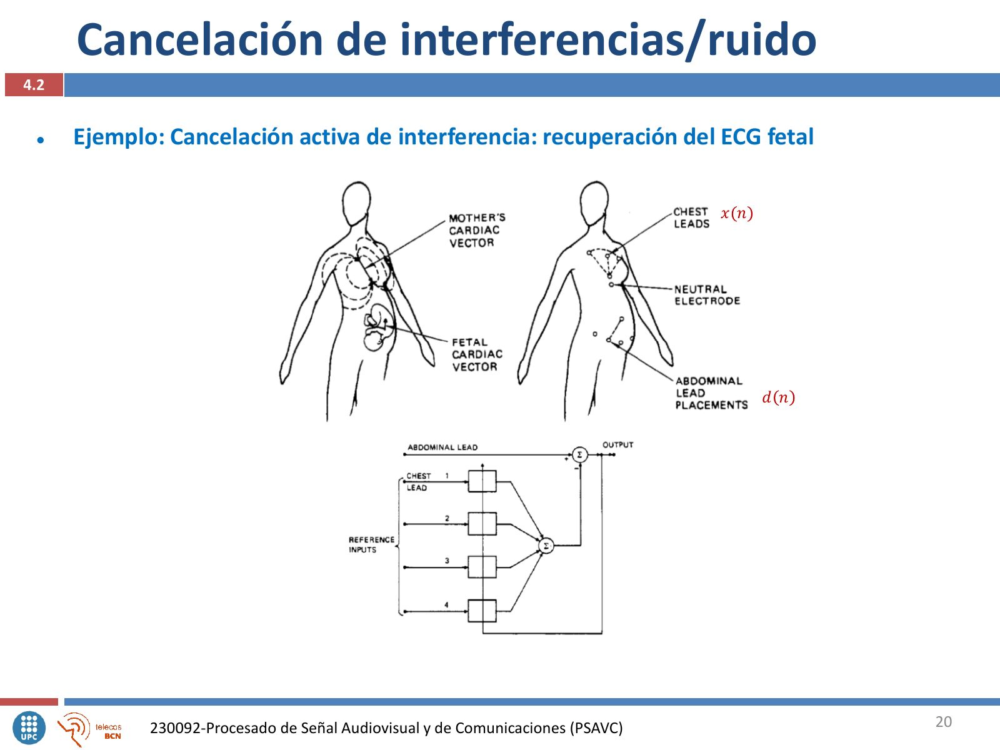

```text
      Cancelación de interferencias/ruido
4.2


 ●    Ejemplo: Cancelación activa de interferencia: recuperación del ECG fetal

                                                                                 𝑥𝑥 𝑛𝑛


                                                                                         𝑑𝑑 𝑛𝑛


             230092-Procesado de Señal Audiovisual y de Comunicaciones (PSAVC)                   20
```

## Page 21

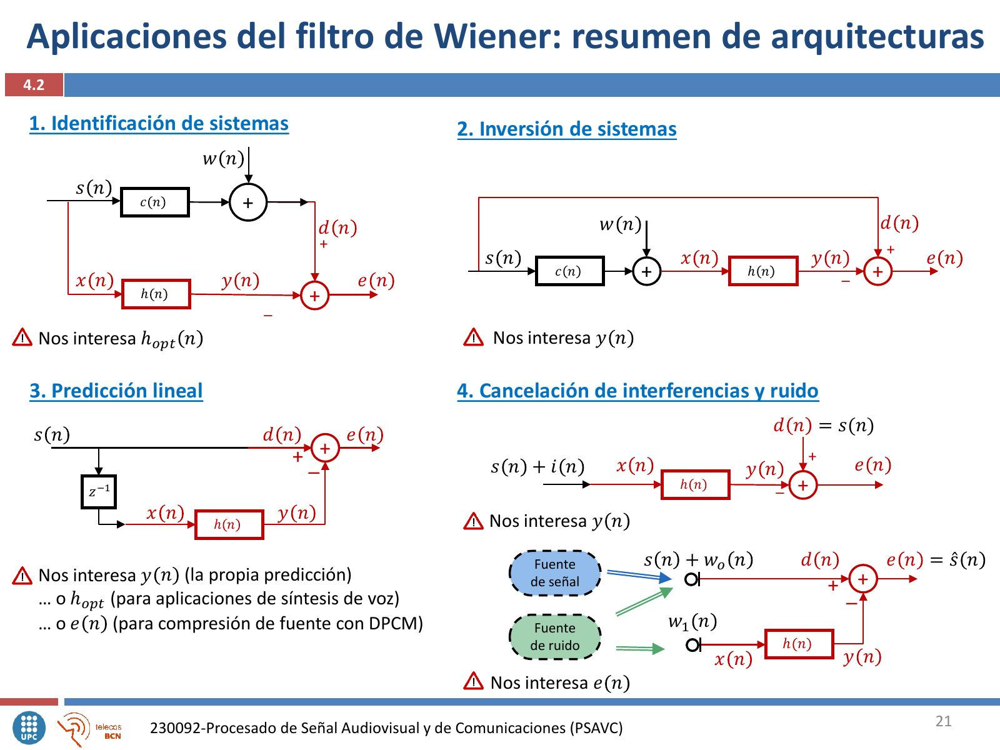

```text
Aplicaciones del filtro de Wiener: resumen de arquitecturas
4.2

1. Identificación de sistemas                                       2. Inversión de sistemas
                            𝑤𝑤 𝑛𝑛
         𝑠𝑠 𝑛𝑛
                   𝑐𝑐 𝑛𝑛            +
                                                    𝑑𝑑 𝑛𝑛                                  𝑤𝑤 𝑛𝑛                                                       𝑑𝑑 𝑛𝑛
                                                    +                                                                                                   +
                                                                       𝑠𝑠 𝑛𝑛                            𝑥𝑥 𝑛𝑛                          𝑦𝑦 𝑛𝑛                   𝑒𝑒 𝑛𝑛
         𝑥𝑥 𝑛𝑛                𝑦𝑦 𝑛𝑛                         𝑒𝑒 𝑛𝑛
                                                                                   𝑐𝑐 𝑛𝑛           +                    ℎ 𝑛𝑛                       +
                   ℎ 𝑛𝑛                             +                                                                                       _

                                        _
  Nos interesa ℎ𝑜𝑜𝑜𝑜𝑜𝑜 𝑛𝑛                                               Nos interesa 𝑦𝑦 𝑛𝑛

3. Predicción lineal                                                4. Cancelación de interferencias y ruido
 𝑠𝑠 𝑛𝑛                                  𝑑𝑑 𝑛𝑛           𝑒𝑒 𝑛𝑛                                                                  𝑑𝑑 𝑛𝑛 = 𝑠𝑠(𝑛𝑛)
                                              + +                      𝑠𝑠 𝑛𝑛 + 𝑖𝑖 𝑛𝑛         𝑥𝑥 𝑛𝑛                                     +
                                                                                                                                                𝑒𝑒 𝑛𝑛
                                                                                                                        𝑦𝑦 𝑛𝑛
           𝑧𝑧 −1                                _                                                       ℎ 𝑛𝑛                       +
                                                                                                                               _
                    𝑥𝑥 𝑛𝑛                   𝑦𝑦 𝑛𝑛                      Nos interesa 𝑦𝑦 𝑛𝑛
                             ℎ 𝑛𝑛

                                                                               Fuente              𝑠𝑠 𝑛𝑛 + 𝑤𝑤𝑜𝑜 𝑛𝑛                 𝑑𝑑 𝑛𝑛                𝑒𝑒 𝑛𝑛 = 𝑠𝑠̂ 𝑛𝑛
  Nos interesa 𝑦𝑦 𝑛𝑛 (la propia predicción)                                    de señal                                                    + +
  … o ℎ𝑜𝑜𝑜𝑜𝑜𝑜 (para aplicaciones de síntesis de voz)
  … o 𝑒𝑒 𝑛𝑛 (para compresión de fuente con DPCM)                                Fuente                 𝑤𝑤1 𝑛𝑛                                  _
                                                                               de ruido                                         ℎ 𝑛𝑛
                                                                                                                𝑥𝑥 𝑛𝑛                          𝑦𝑦 𝑛𝑛
                                                                       Nos interesa 𝑒𝑒 𝑛𝑛

                     230092-Procesado de Señal Audiovisual y de Comunicaciones (PSAVC)                                                                          21
```

## Page 22


```text
Tema 4: Filtro de Wiener

1.   Introducción
2.   Aplicaciones
3.   MSE y ecuaciones normales
4.   Ejemplos de aplicación
5.   Filtro óptimo a partir de las muestras
6.   Conclusiones y ejercicios propuestos


      230092-Procesado de Señal Audiovisual y de Comunicaciones (PSAVC)   22
```

## Page 23

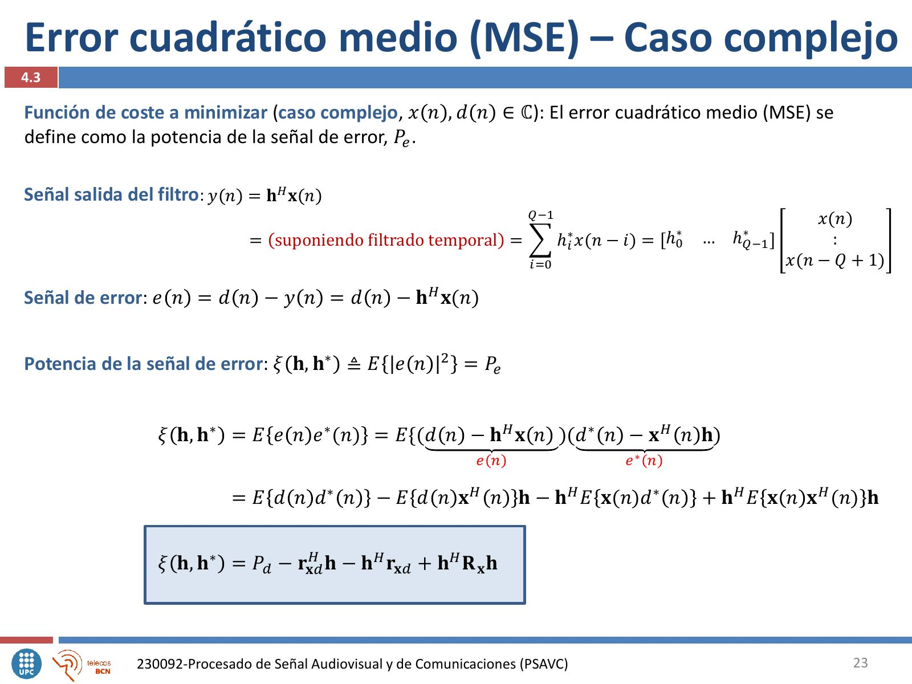

```text
Error cuadrático medio (MSE) – Caso complejo
4.3

Función de coste a minimizar (caso complejo, 𝑥𝑥 𝑛𝑛 , 𝑑𝑑 𝑛𝑛 ∈ ℂ): El error cuadrático medio (MSE) se
define como la potencia de la señal de error, 𝑃𝑃𝑒𝑒 .

Señal salida del filtro: 𝑦𝑦 𝑛𝑛 = 𝐡𝐡𝐻𝐻 𝐱𝐱 𝑛𝑛
                                                                                    𝑄𝑄−1                                              𝑥𝑥(𝑛𝑛)
                                                                                                                         ∗
                                  = suponiendo filtrado temporal                  = � ℎ𝑖𝑖∗ 𝑥𝑥(𝑛𝑛 − 𝑖𝑖) =     ℎ0∗   …    ℎ𝑄𝑄−1            :
                                                                                    𝑖𝑖=0                                        𝑥𝑥(𝑛𝑛 − 𝑄𝑄 + 1)

Señal de error: 𝑒𝑒 𝑛𝑛 = 𝑑𝑑 𝑛𝑛 − 𝑦𝑦 𝑛𝑛 = 𝑑𝑑 𝑛𝑛 − 𝐡𝐡𝐻𝐻 𝐱𝐱(𝑛𝑛)


Potencia de la señal de error: 𝜉𝜉 𝐡𝐡, 𝐡𝐡∗ ≜ 𝐸𝐸 𝑒𝑒 𝑛𝑛                2
                                                                        = 𝑃𝑃𝑒𝑒


                   𝜉𝜉 𝐡𝐡, 𝐡𝐡∗ = 𝐸𝐸 𝑒𝑒 𝑛𝑛 𝑒𝑒 ∗ (𝑛𝑛) = 𝐸𝐸{(𝑑𝑑 𝑛𝑛 − 𝐡𝐡𝐻𝐻 𝐱𝐱 𝑛𝑛 )(𝑑𝑑∗ 𝑛𝑛 − 𝐱𝐱 𝐻𝐻 𝑛𝑛 𝐡𝐡)
                                                                          𝑒𝑒 𝑛𝑛                    𝑒𝑒 ∗ 𝑛𝑛

                               = 𝐸𝐸 𝑑𝑑 𝑛𝑛 𝑑𝑑∗ 𝑛𝑛        − 𝐸𝐸 𝑑𝑑 𝑛𝑛 𝐱𝐱 𝐻𝐻 𝑛𝑛 𝐡𝐡 − 𝐡𝐡𝐻𝐻 𝐸𝐸 𝐱𝐱(𝑛𝑛)𝑑𝑑∗ 𝑛𝑛              + 𝐡𝐡𝐻𝐻 𝐸𝐸 𝐱𝐱 𝑛𝑛 𝐱𝐱 𝐻𝐻 (𝑛𝑛) 𝐡𝐡

                                          𝐻𝐻
                   𝜉𝜉 𝐡𝐡, 𝐡𝐡∗ = 𝑃𝑃𝑑𝑑 − 𝐫𝐫𝐱𝐱𝑑𝑑 𝐡𝐡 − 𝐡𝐡𝐻𝐻 𝐫𝐫𝐱𝐱𝑑𝑑 + 𝐡𝐡𝐻𝐻 𝐑𝐑 𝐱𝐱 𝐡𝐡


                230092-Procesado de Señal Audiovisual y de Comunicaciones (PSAVC)                                                          23
```

## Page 24

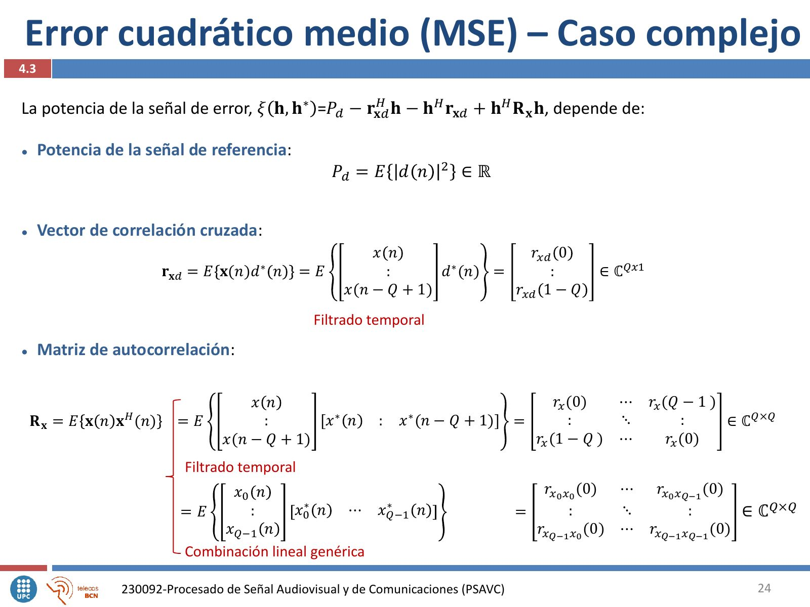

```text
Error cuadrático medio (MSE) – Caso complejo
4.3

                                                        𝐻𝐻
La potencia de la señal de error, 𝜉𝜉 𝐡𝐡, 𝐡𝐡∗ =𝑃𝑃𝑑𝑑 − 𝐫𝐫𝐱𝐱𝑑𝑑 𝐡𝐡 − 𝐡𝐡𝐻𝐻 𝐫𝐫𝐱𝐱𝑑𝑑 + 𝐡𝐡𝐻𝐻 𝐑𝐑 𝐱𝐱 𝐡𝐡, depende de:

●     Potencia de la señal de referencia:
                                                                                  2
                                                                𝑃𝑃𝑑𝑑 = 𝐸𝐸 𝑑𝑑 𝑛𝑛       ∈ℝ


●     Vector de correlación cruzada:
                                                                       𝑥𝑥 𝑛𝑛                    𝑟𝑟𝑥𝑥𝑑𝑑 0
                                                 ∗                                 ∗
                               𝐫𝐫𝐱𝐱𝑑𝑑 = 𝐸𝐸 𝐱𝐱(𝑛𝑛)𝑑𝑑 𝑛𝑛   = 𝐸𝐸             :      𝑑𝑑 (𝑛𝑛) =            :     ∈ ℂ𝑄𝑄𝑄𝑄𝑄
                                                                 𝑥𝑥(𝑛𝑛 − 𝑄𝑄 + 1)           𝑟𝑟𝑥𝑥𝑑𝑑 1 − 𝑄𝑄
                                                           Filtrado temporal
●     Matriz de autocorrelación:

                                                𝑥𝑥 𝑛𝑛                                                 𝑟𝑟𝑥𝑥 (0) ⋯ 𝑟𝑟𝑥𝑥 (𝑄𝑄 − 1 )
                      𝐻𝐻
    𝐑𝐑 𝐱𝐱 = 𝐸𝐸 𝐱𝐱 𝑛𝑛 𝐱𝐱 (𝑛𝑛)     = 𝐸𝐸              :      𝑥𝑥 ∗ 𝑛𝑛      :    ∗
                                                                           𝑥𝑥 (𝑛𝑛 − 𝑄𝑄 + 1)   =            :   ⋱            :   ∈ ℂ𝑄𝑄×𝑄𝑄
                                          𝑥𝑥(𝑛𝑛 − 𝑄𝑄 + 1)                                       𝑟𝑟𝑥𝑥 (1 − 𝑄𝑄 ) ⋯       𝑟𝑟𝑥𝑥 (0)
                                   Filtrado temporal
                                         𝑥𝑥0 𝑛𝑛                                                    𝑟𝑟𝑥𝑥0𝑥𝑥0 (0) ⋯ 𝑟𝑟𝑥𝑥0𝑥𝑥𝑄𝑄−1 (0)
                                                              ∗
                                  = 𝐸𝐸      :     𝑥𝑥0∗ 𝑛𝑛 ⋯ 𝑥𝑥𝑄𝑄−1 𝑛𝑛                         =           :     ⋱           :        ∈ ℂ𝑄𝑄×𝑄𝑄
                                       𝑥𝑥𝑄𝑄−1 𝑛𝑛                                                𝑟𝑟𝑥𝑥𝑄𝑄−1𝑥𝑥0 (0) ⋯ 𝑟𝑟𝑥𝑥𝑄𝑄−1𝑥𝑥𝑄𝑄−1 (0)
                                  Combinación lineal genérica

                     230092-Procesado de Señal Audiovisual y de Comunicaciones (PSAVC)                                                24
```

## Page 25

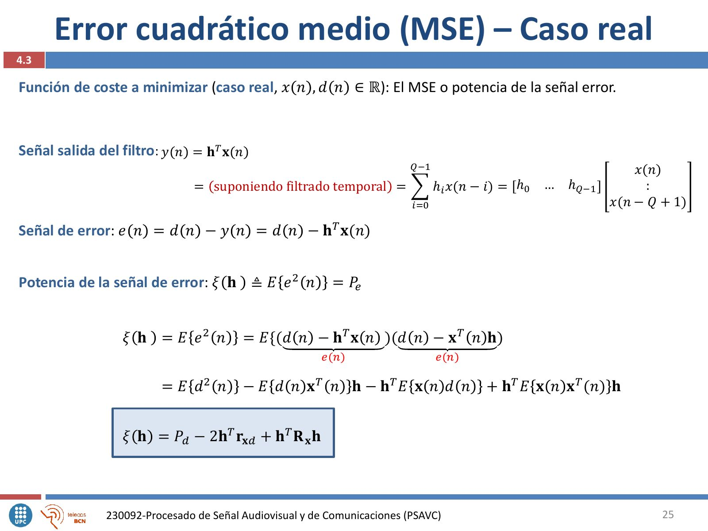

```text
      Error cuadrático medio (MSE) – Caso real
4.3

Función de coste a minimizar (caso real, 𝑥𝑥 𝑛𝑛 , 𝑑𝑑 𝑛𝑛 ∈ ℝ): El MSE o potencia de la señal error.


Señal salida del filtro: 𝑦𝑦 𝑛𝑛 = 𝐡𝐡𝑇𝑇 𝐱𝐱 𝑛𝑛
                                                                             𝑄𝑄−1                                           𝑥𝑥(𝑛𝑛)
                                  = suponiendo filtrado temporal = � ℎ𝑖𝑖 𝑥𝑥(𝑛𝑛 − 𝑖𝑖) = ℎ0               … ℎ𝑄𝑄−1                :
                                                                             𝑖𝑖=0                                     𝑥𝑥(𝑛𝑛 − 𝑄𝑄 + 1)

Señal de error: 𝑒𝑒 𝑛𝑛 = 𝑑𝑑 𝑛𝑛 − 𝑦𝑦 𝑛𝑛 = 𝑑𝑑 𝑛𝑛 − 𝐡𝐡𝑇𝑇 𝐱𝐱(𝑛𝑛)


Potencia de la señal de error: 𝜉𝜉 𝐡𝐡 ≜ 𝐸𝐸 𝑒𝑒 2 𝑛𝑛                  = 𝑃𝑃𝑒𝑒


                   𝜉𝜉 𝐡𝐡 = 𝐸𝐸 𝑒𝑒 2 𝑛𝑛        = 𝐸𝐸{(𝑑𝑑 𝑛𝑛 − 𝐡𝐡𝑇𝑇 𝐱𝐱 𝑛𝑛 )(𝑑𝑑 𝑛𝑛 − 𝐱𝐱 𝑇𝑇 𝑛𝑛 𝐡𝐡)
                                                                 𝑒𝑒 𝑛𝑛              𝑒𝑒 𝑛𝑛

                           = 𝐸𝐸 𝑑𝑑2 𝑛𝑛       − 𝐸𝐸 𝑑𝑑 𝑛𝑛 𝐱𝐱 𝑇𝑇 𝑛𝑛 𝐡𝐡 − 𝐡𝐡𝑇𝑇 𝐸𝐸 𝐱𝐱 𝑛𝑛 𝑑𝑑 𝑛𝑛   + 𝐡𝐡𝑇𝑇 𝐸𝐸 𝐱𝐱 𝑛𝑛 𝐱𝐱 𝑇𝑇 (𝑛𝑛) 𝐡𝐡


                   𝜉𝜉 𝐡𝐡 = 𝑃𝑃𝑑𝑑 − 2𝐡𝐡𝑇𝑇 𝐫𝐫𝐱𝐱𝑑𝑑 + 𝐡𝐡𝑇𝑇 𝐑𝐑 𝐱𝐱 𝐡𝐡


                230092-Procesado de Señal Audiovisual y de Comunicaciones (PSAVC)                                               25
```

## Page 26

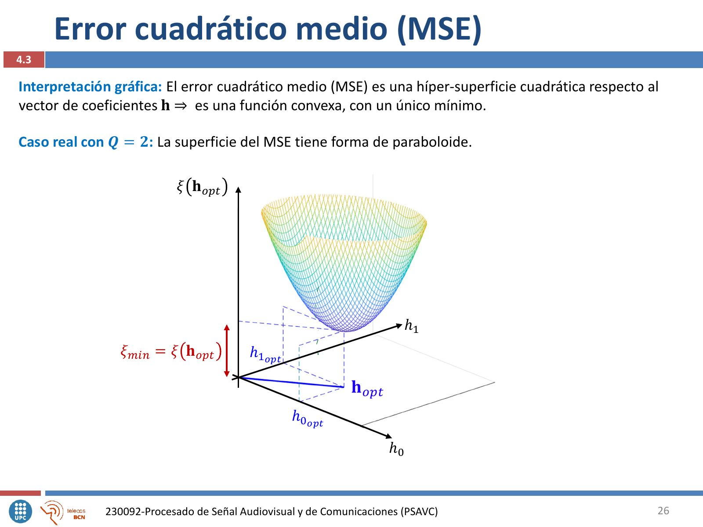

```text
      Error cuadrático medio (MSE)
4.3

Interpretación gráfica: El error cuadrático medio (MSE) es una híper-superficie cuadrática respecto al
vector de coeficientes 𝐡𝐡 ⇒ es una función convexa, con un único mínimo.

Caso real con 𝑸𝑸 = 𝟐𝟐: La superficie del MSE tiene forma de paraboloide.

                             𝜉𝜉 𝐡𝐡𝑜𝑜𝑜𝑜𝑜𝑜


                                                                                 ℎ1
                𝜉𝜉𝑚𝑚𝑚𝑚𝑚𝑚 = 𝜉𝜉 𝐡𝐡𝑜𝑜𝑜𝑜𝑜𝑜     ℎ1𝑜𝑜𝑜𝑜𝑜𝑜

                                                                 𝐡𝐡𝑜𝑜𝑜𝑜𝑜𝑜
                                                      ℎ0𝑜𝑜𝑜𝑜𝑜𝑜

                                                                            ℎ0


             230092-Procesado de Señal Audiovisual y de Comunicaciones (PSAVC)                       26
```

## Page 27

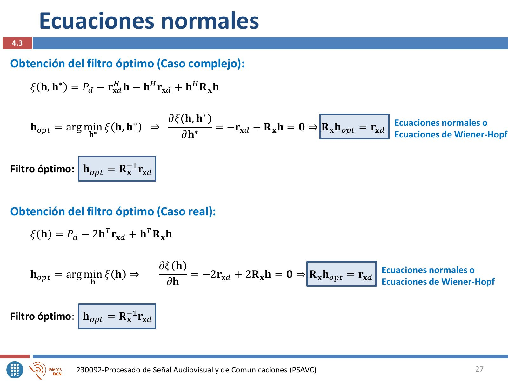

```text
        Ecuaciones normales
4.3

Obtención del filtro óptimo (Caso complejo):
                             𝐻𝐻
      𝜉𝜉 𝐡𝐡, 𝐡𝐡∗ = 𝑃𝑃𝑑𝑑 − 𝐫𝐫𝐱𝐱𝑑𝑑 𝐡𝐡 − 𝐡𝐡𝐻𝐻 𝐫𝐫𝐱𝐱𝑑𝑑 + 𝐡𝐡𝐻𝐻 𝐑𝐑 𝐱𝐱 𝐡𝐡

                                             𝜕𝜕𝜉𝜉 𝐡𝐡, 𝐡𝐡∗
      𝐡𝐡𝑜𝑜𝑜𝑜𝑡𝑡 = arg min 𝜉𝜉 𝐡𝐡, 𝐡𝐡    ∗
                                           ⇒          ∗
                                                          = −𝐫𝐫𝐱𝐱𝑑𝑑 + 𝐑𝐑 𝐱𝐱 𝐡𝐡 = 𝟎𝟎 ⇒ 𝐑𝐑 𝐱𝐱 𝐡𝐡𝑜𝑜𝑜𝑜𝑜𝑜 = 𝐫𝐫𝐱𝐱𝑑𝑑 Ecuaciones normales o
                      ∗ 𝐡𝐡                       𝜕𝜕𝐡𝐡                                                         Ecuaciones de Wiener-Hopf


Filtro óptimo: 𝐡𝐡𝑜𝑜𝑜𝑜𝑡𝑡 = 𝐑𝐑−1
                            𝐱𝐱 𝐫𝐫𝐱𝐱𝑑𝑑


Obtención del filtro óptimo (Caso real):
      𝜉𝜉 𝐡𝐡 = 𝑃𝑃𝑑𝑑 − 2𝐡𝐡𝑇𝑇 𝐫𝐫𝐱𝐱𝑑𝑑 + 𝐡𝐡𝑇𝑇 𝐑𝐑 𝐱𝐱 𝐡𝐡

                                              𝜕𝜕𝜉𝜉 𝐡𝐡
      𝐡𝐡𝑜𝑜𝑜𝑜𝑡𝑡 = arg min 𝜉𝜉 𝐡𝐡 ⇒                      = −2𝐫𝐫𝐱𝐱𝑑𝑑 + 2𝐑𝐑 𝐱𝐱 𝐡𝐡 = 𝟎𝟎 ⇒ 𝐑𝐑 𝐱𝐱 𝐡𝐡𝑜𝑜𝑜𝑜𝑜𝑜 = 𝐫𝐫𝐱𝐱𝑑𝑑 Ecuaciones normales o
                        𝐡𝐡                      𝜕𝜕𝐡𝐡                                                        Ecuaciones de Wiener-Hopf


Filtro óptimo: 𝐡𝐡𝑜𝑜𝑜𝑜𝑡𝑡 = 𝐑𝐑−1
                            𝐱𝐱 𝐫𝐫𝐱𝐱𝑑𝑑


                    230092-Procesado de Señal Audiovisual y de Comunicaciones (PSAVC)                                          27
```

## Page 28

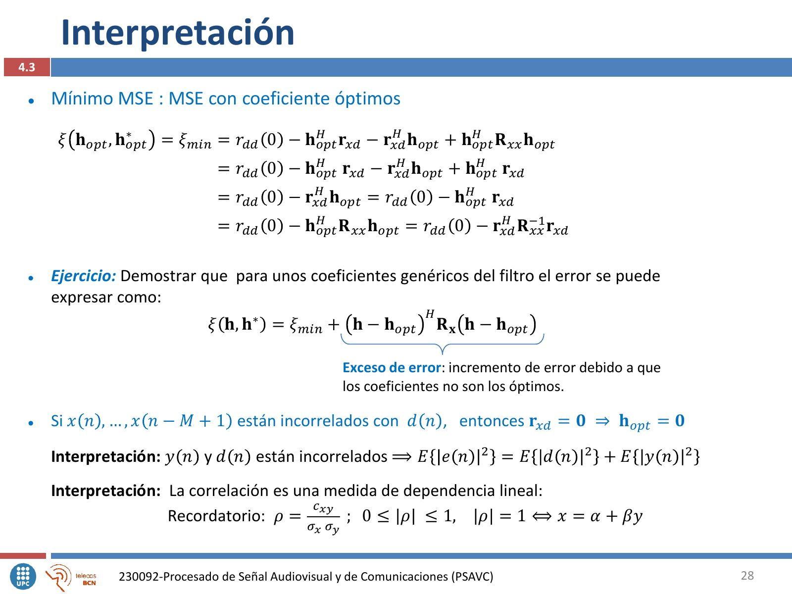

```text
       Interpretación
4.3

 ●    Mínimo MSE : MSE con coeficiente óptimos
                       ∗                                                   𝐻𝐻
       𝜉𝜉 𝐡𝐡𝑜𝑜𝑜𝑜𝑜𝑜 , 𝐡𝐡𝑜𝑜𝑜𝑜𝑜𝑜 = 𝜉𝜉𝑚𝑚𝑚𝑚𝑚𝑚 = 𝑟𝑟𝑑𝑑𝑑𝑑 0 − 𝐡𝐡𝐻𝐻                                  𝐻𝐻
                                                        𝑜𝑜𝑜𝑜𝑜𝑜 𝐫𝐫𝑥𝑥𝑥𝑥 − 𝐫𝐫𝑥𝑥𝑥𝑥 𝐡𝐡𝑜𝑜𝑜𝑜𝑜𝑜 + 𝐡𝐡𝑜𝑜𝑜𝑜𝑜𝑜 𝐑𝐑 𝑥𝑥𝑥𝑥 𝐡𝐡𝑜𝑜𝑜𝑜𝑜𝑜
                                                                           𝐻𝐻
                                         = 𝑟𝑟𝑑𝑑𝑑𝑑 0 − 𝐡𝐡𝐻𝐻                                  𝐻𝐻
                                                        𝑜𝑜𝑜𝑜𝑜𝑜 𝐫𝐫𝑥𝑥𝑥𝑥 − 𝐫𝐫𝑥𝑥𝑥𝑥 𝐡𝐡𝑜𝑜𝑜𝑜𝑜𝑜 + 𝐡𝐡𝑜𝑜𝑜𝑜𝑜𝑜 𝐫𝐫𝑥𝑥𝑥𝑥
                                                         𝐻𝐻
                                         = 𝑟𝑟𝑑𝑑𝑑𝑑 0 − 𝐫𝐫𝑥𝑥𝑥𝑥 𝐡𝐡𝑜𝑜𝑜𝑜𝑜𝑜 = 𝑟𝑟𝑑𝑑𝑑𝑑 0 − 𝐡𝐡𝐻𝐻
                                                                                     𝑜𝑜𝑜𝑜𝑜𝑜 𝐫𝐫𝑥𝑥𝑥𝑥
                                                                                                𝐻𝐻 −1
                                         = 𝑟𝑟𝑑𝑑𝑑𝑑 0 − 𝐡𝐡𝐻𝐻
                                                        𝑜𝑜𝑜𝑜𝑜𝑜 𝐑𝐑 𝑥𝑥𝑥𝑥 𝐡𝐡𝑜𝑜𝑜𝑜𝑜𝑜 = 𝑟𝑟𝑑𝑑𝑑𝑑 0 − 𝐫𝐫𝑥𝑥𝑥𝑥 𝐑𝐑 𝑥𝑥𝑥𝑥 𝐫𝐫𝑥𝑥𝑥𝑥


 ●    Ejercicio: Demostrar que para unos coeficientes genéricos del filtro el error se puede
      expresar como:
                                                                                      𝐻𝐻
                                       𝜉𝜉 𝐡𝐡, 𝐡𝐡∗ = 𝜉𝜉𝑚𝑚𝑚𝑚𝑚𝑚 + 𝐡𝐡 − 𝐡𝐡𝑜𝑜𝑜𝑜𝑡𝑡               𝐑𝐑 𝐱𝐱 𝐡𝐡 − 𝐡𝐡𝑜𝑜𝑜𝑜𝑡𝑡

                                                                         Exceso de error: incremento de error debido a que
                                                                         los coeficientes no son los óptimos.

 ●    Si 𝑥𝑥 𝑛𝑛 , … , 𝑥𝑥 𝑛𝑛 − 𝑀𝑀 + 1 están incorrelados con 𝑑𝑑 𝑛𝑛 , entonces 𝐫𝐫𝑥𝑥𝑥𝑥 = 𝟎𝟎 ⇒ 𝐡𝐡𝑜𝑜𝑜𝑜𝑜𝑜 = 𝟎𝟎
                                                                                                    2                 2                2
      Interpretación: 𝑦𝑦 𝑛𝑛 y 𝑑𝑑 𝑛𝑛 están incorrelados ⟹ 𝐸𝐸 𝑒𝑒 𝑛𝑛                                       = 𝐸𝐸 𝑑𝑑 𝑛𝑛        + 𝐸𝐸 𝑦𝑦 𝑛𝑛
      Interpretación: La correlación es una medida de dependencia lineal:
                                          𝑐𝑐𝑥𝑥𝑥𝑥
                      Recordatorio: 𝜌𝜌 =         ; 0 ≤ 𝜌𝜌 ≤ 1, 𝜌𝜌 = 1 ⟺ 𝑥𝑥 = 𝛼𝛼 + 𝛽𝛽𝛽𝛽
                                                             𝜎𝜎𝑥𝑥 𝜎𝜎𝑦𝑦


                    230092-Procesado de Señal Audiovisual y de Comunicaciones (PSAVC)                                                      28
```

## Page 29

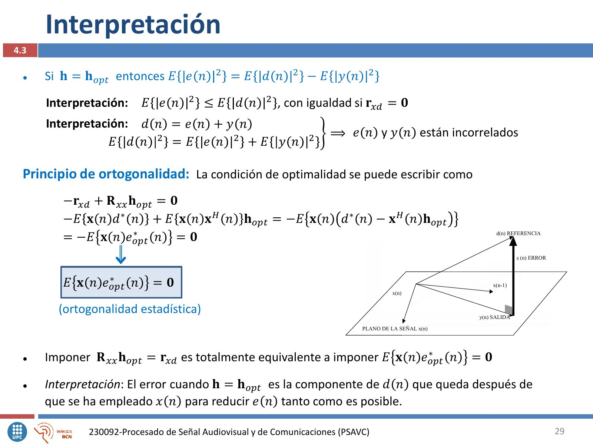

```text
      Interpretación
4.3

                                             2                 2                  2
  ●   Si 𝐡𝐡 = 𝐡𝐡𝑜𝑜𝑜𝑜𝑜𝑜 entonces 𝐸𝐸 𝑒𝑒 𝑛𝑛         = 𝐸𝐸 𝑑𝑑 𝑛𝑛        − 𝐸𝐸 𝑦𝑦 𝑛𝑛
                                       2                2
      Interpretación: 𝐸𝐸 𝑒𝑒 𝑛𝑛             ≤ 𝐸𝐸 𝑑𝑑 𝑛𝑛       , con igualdad si 𝐫𝐫𝑥𝑥𝑥𝑥 = 𝟎𝟎
      Interpretación: 𝑑𝑑 𝑛𝑛 = 𝑒𝑒 𝑛𝑛 + 𝑦𝑦 𝑛𝑛
                                                                   2 �⟹     𝑒𝑒 𝑛𝑛 y 𝑦𝑦 𝑛𝑛 están incorrelados
                 𝐸𝐸 𝑑𝑑 𝑛𝑛 2 = 𝐸𝐸 𝑒𝑒 𝑛𝑛 2 + 𝐸𝐸 𝑦𝑦 𝑛𝑛

  Principio de ortogonalidad: La condición de optimalidad se puede escribir como
         −𝐫𝐫𝑥𝑥𝑥𝑥 + 𝐑𝐑 𝑥𝑥𝑥𝑥 𝐡𝐡𝑜𝑜𝑜𝑜𝑜𝑜 = 𝟎𝟎
         −𝐸𝐸 𝐱𝐱 𝑛𝑛 𝑑𝑑 ∗ 𝑛𝑛 + 𝐸𝐸 𝐱𝐱 𝑛𝑛 𝐱𝐱 𝐻𝐻 𝑛𝑛 𝐡𝐡𝑜𝑜𝑜𝑜𝑜𝑜 = −𝐸𝐸 𝐱𝐱 𝑛𝑛 𝑑𝑑∗ 𝑛𝑛 − 𝐱𝐱 𝐻𝐻 𝑛𝑛 𝐡𝐡𝑜𝑜𝑜𝑜𝑜𝑜
                            ∗
         = −𝐸𝐸 𝐱𝐱 𝑛𝑛 𝑒𝑒𝑜𝑜𝑜𝑜𝑜𝑜      𝑛𝑛 = 𝟎𝟎                                                                       d(n) REFERENCIA


                                                                                                                         ε (n) ERROR


                    ∗
         𝐸𝐸 𝐱𝐱 𝑛𝑛 𝑒𝑒𝑜𝑜𝑜𝑜𝑜𝑜 𝑛𝑛   = 𝟎𝟎                                                                            x(n-1)
                                                                                          x(n)


        (ortogonalidad estadística)                                                                       y(n) SALIDA

                                                                                PLANO DE LA SEÑAL x(n)


                                                                                       ∗
  ●   Imponer 𝐑𝐑 𝑥𝑥𝑥𝑥 𝐡𝐡𝑜𝑜𝑜𝑜𝑜𝑜 = 𝐫𝐫𝑥𝑥𝑥𝑥 es totalmente equivalente a imponer 𝐸𝐸 𝐱𝐱 𝑛𝑛 𝑒𝑒𝑜𝑜𝑜𝑜𝑜𝑜 𝑛𝑛         = 𝟎𝟎

  ●   Interpretación: El error cuando 𝐡𝐡 = 𝐡𝐡𝑜𝑜𝑜𝑜𝑜𝑜 es la componente de 𝑑𝑑 𝑛𝑛 que queda después de
      que se ha empleado 𝑥𝑥 𝑛𝑛 para reducir 𝑒𝑒 𝑛𝑛 tanto como es posible.

               230092-Procesado de Señal Audiovisual y de Comunicaciones (PSAVC)                                                       29
```

## Page 30

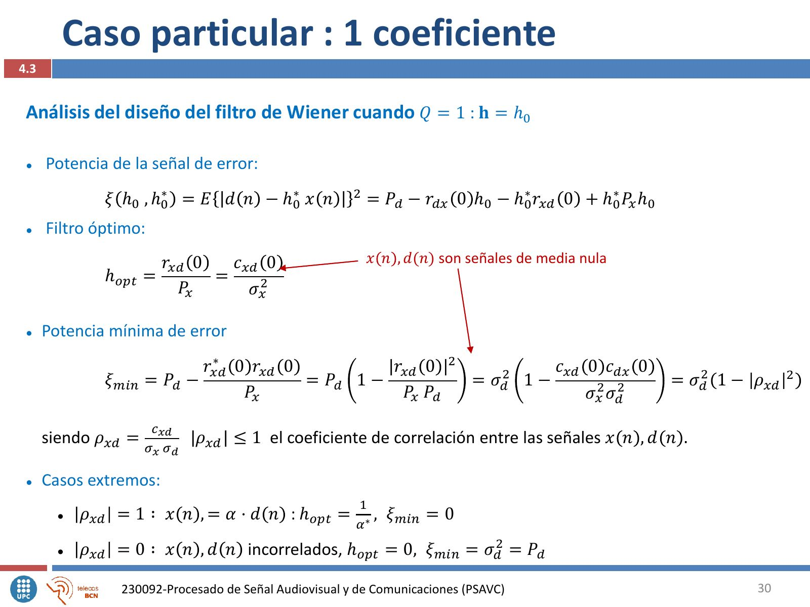

```text
         Caso particular : 1 coeficiente
4.3


 Análisis del diseño del filtro de Wiener cuando 𝑄𝑄 = 1 : 𝐡𝐡 = ℎ0

 ●    Potencia de la señal de error:
                𝜉𝜉 ℎ0 , ℎ0∗ = 𝐸𝐸 𝑑𝑑 𝑛𝑛 − ℎ0∗ 𝑥𝑥 𝑛𝑛          2
                                                                = 𝑃𝑃𝑑𝑑 − 𝑟𝑟𝑑𝑑𝑑𝑑 0 ℎ0 − ℎ0∗ 𝑟𝑟𝑥𝑥𝑥𝑥 0 + ℎ0∗ 𝑃𝑃𝑥𝑥 ℎ0
 ●    Filtro óptimo:
                          𝑟𝑟𝑥𝑥𝑥𝑥 0   𝑐𝑐𝑥𝑥𝑥𝑥 0                   𝑥𝑥 𝑛𝑛 , 𝑑𝑑(𝑛𝑛) son señales de media nula
                ℎ𝑜𝑜𝑜𝑜𝑜𝑜 =          =
                              𝑃𝑃𝑥𝑥       𝜎𝜎𝑥𝑥2

 ●    Potencia mínima de error
                                     ∗
                                  𝑟𝑟𝑥𝑥𝑥𝑥 0 𝑟𝑟𝑥𝑥𝑥𝑥 0            𝑟𝑟𝑥𝑥𝑥𝑥 0 2               𝑐𝑐𝑥𝑥𝑥𝑥 0 𝑐𝑐𝑑𝑑𝑥𝑥 0
                𝜉𝜉𝑚𝑚𝑚𝑚𝑚𝑚 = 𝑃𝑃𝑑𝑑 −                   = 𝑃𝑃𝑑𝑑 1 −              = 𝜎𝜎𝑑𝑑2 1 −                             = 𝜎𝜎𝑑𝑑2 1 − 𝜌𝜌𝑥𝑥𝑥𝑥 2
                                          𝑃𝑃𝑥𝑥                    𝑃𝑃𝑥𝑥 𝑃𝑃𝑑𝑑                    𝜎𝜎𝑥𝑥2 𝜎𝜎𝑑𝑑2
                          𝑐𝑐𝑥𝑥𝑑𝑑
      siendo 𝜌𝜌𝑥𝑥𝑥𝑥 =               𝜌𝜌𝑥𝑥𝑥𝑥 ≤ 1 el coeficiente de correlación entre las señales 𝑥𝑥 𝑛𝑛 , 𝑑𝑑 𝑛𝑛 .
                        𝜎𝜎𝑥𝑥 𝜎𝜎𝑑𝑑

 ●    Casos extremos:
                                                             1
        ●   𝜌𝜌𝑥𝑥𝑥𝑥 = 1 ∶ 𝑥𝑥 𝑛𝑛 , = 𝛼𝛼 · 𝑑𝑑 𝑛𝑛 : ℎ𝑜𝑜𝑜𝑜𝑡𝑡 =        , 𝜉𝜉𝑚𝑚𝑚𝑚𝑚𝑚 = 0
                                                            𝛼𝛼 ∗
        ●   𝜌𝜌𝑥𝑥𝑥𝑥 = 0 ∶ 𝑥𝑥 𝑛𝑛 , 𝑑𝑑 𝑛𝑛 incorrelados, ℎ𝑜𝑜𝑜𝑜𝑜𝑜 = 0, 𝜉𝜉𝑚𝑚𝑚𝑚𝑚𝑚 = 𝜎𝜎𝑑𝑑2 = 𝑃𝑃𝑑𝑑

                  230092-Procesado de Señal Audiovisual y de Comunicaciones (PSAVC)                                               30
```

## Page 31

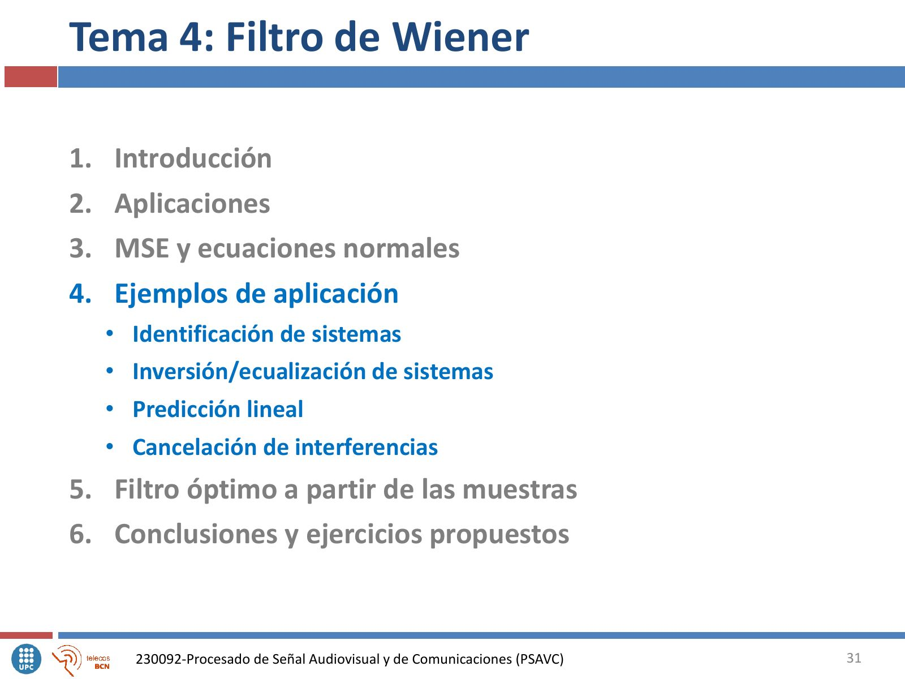

```text
Tema 4: Filtro de Wiener

1.       Introducción
2.       Aplicaciones
3.       MSE y ecuaciones normales
4.       Ejemplos de aplicación
     •    Identificación de sistemas
     •    Inversión/ecualización de sistemas
     •    Predicción lineal
     •    Cancelación de interferencias
5. Filtro óptimo a partir de las muestras
6. Conclusiones y ejercicios propuestos


          230092-Procesado de Señal Audiovisual y de Comunicaciones (PSAVC)   31
```

## Page 32

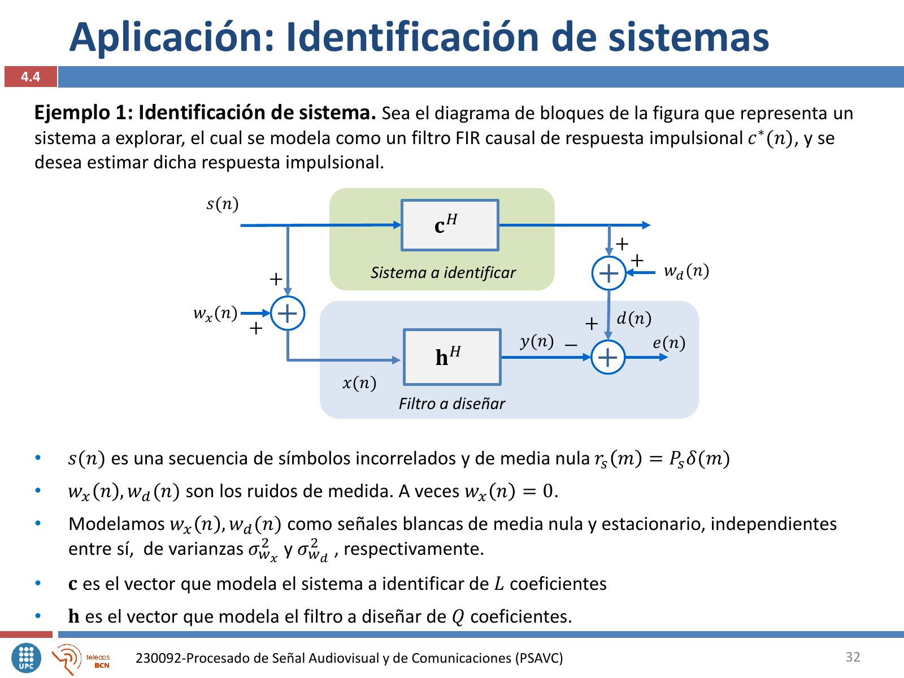

```text
      Aplicación: Identificación de sistemas
4.4

  Ejemplo 1: Identificación de sistema. Sea el diagrama de bloques de la figura que representa un
  sistema a explorar, el cual se modela como un filtro FIR causal de respuesta impulsional 𝑐𝑐 ∗ (𝑛𝑛), y se
  desea estimar dicha respuesta impulsional.

                         𝑠𝑠(𝑛𝑛)
                                                            𝐜𝐜 𝐻𝐻                             +
                                       +                                                  +
                                                  Sistema a identificar                 +          𝑤𝑤𝑑𝑑 (𝑛𝑛)
                                                                                   −
                       𝑤𝑤𝑥𝑥 (𝑛𝑛)
                                   +   +                                               + 𝑑𝑑 𝑛𝑛
                                                                          𝑦𝑦(𝑛𝑛)                  𝑒𝑒(𝑛𝑛)
                                                            𝐡𝐡𝐻𝐻                        +
                                                                                        +
                                              𝑥𝑥(𝑛𝑛)
                                                       Filtro a diseñar


  •   𝑠𝑠(𝑛𝑛) es una secuencia de símbolos incorrelados y de media nula 𝑟𝑟𝑠𝑠 𝑚𝑚 = 𝑃𝑃𝑠𝑠 𝛿𝛿(𝑚𝑚)
  •   𝑤𝑤𝑥𝑥 𝑛𝑛 , 𝑤𝑤𝑑𝑑 (𝑛𝑛) son los ruidos de medida. A veces 𝑤𝑤𝑥𝑥 𝑛𝑛 = 0.
  •   Modelamos 𝑤𝑤𝑥𝑥 𝑛𝑛 , 𝑤𝑤𝑑𝑑 (𝑛𝑛) como señales blancas de media nula y estacionario, independientes
      entre sí, de varianzas 𝜎𝜎𝑤𝑤2𝑥𝑥 y 𝜎𝜎𝑤𝑤2 𝑑𝑑 , respectivamente.
  •   𝐜𝐜 es el vector que modela el sistema a identificar de 𝐿𝐿 coeficientes
  •   𝐡𝐡 es el vector que modela el filtro a diseñar de 𝑄𝑄 coeficientes.
               230092-Procesado de Señal Audiovisual y de Comunicaciones (PSAVC)                               32
```

## Page 33

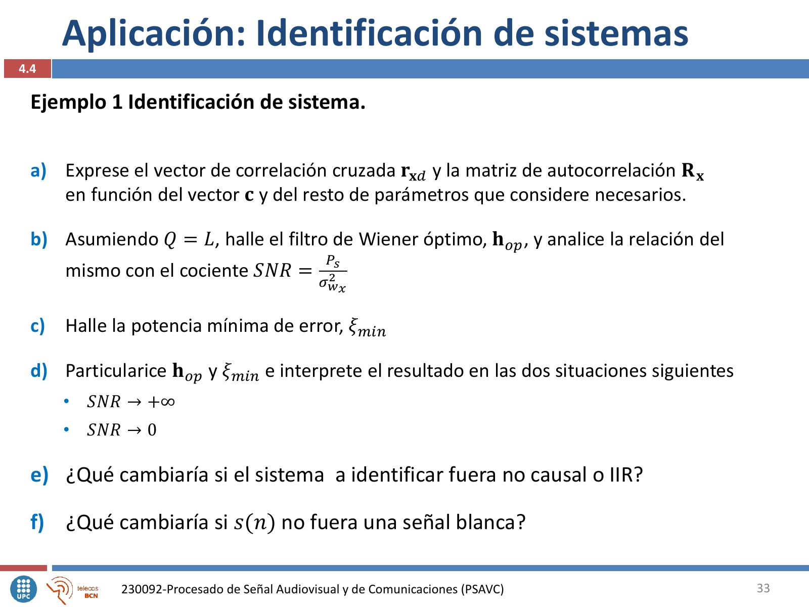

```text
      Aplicación: Identificación de sistemas
4.4

  Ejemplo 1 Identificación de sistema.


  a) Exprese el vector de correlación cruzada 𝐫𝐫𝐱𝐱𝑑𝑑 y la matriz de autocorrelación 𝐑𝐑 𝐱𝐱
     en función del vector 𝐜𝐜 y del resto de parámetros que considere necesarios.

  b) Asumiendo 𝑄𝑄 = 𝐿𝐿, halle el filtro de Wiener óptimo, 𝐡𝐡𝑜𝑜𝑜𝑜 , y analice la relación del
                                                𝑃𝑃
      mismo con el cociente 𝑆𝑆𝑆𝑆𝑆𝑆 = 𝜎𝜎2𝑠𝑠
                                                 𝑤𝑤𝑥𝑥


  c) Halle la potencia mínima de error, 𝜉𝜉𝑚𝑚𝑚𝑚𝑚𝑚

  d) Particularice 𝐡𝐡𝑜𝑜𝑜𝑜 y 𝜉𝜉𝑚𝑚𝑚𝑚𝑚𝑚 e interprete el resultado en las dos situaciones siguientes
      • 𝑆𝑆𝑆𝑆𝑆𝑆 → +∞
      • 𝑆𝑆𝑆𝑆𝑆𝑆 → 0

  e) ¿Qué cambiaría si el sistema a identificar fuera no causal o IIR?

  f) ¿Qué cambiaría si 𝑠𝑠(𝑛𝑛) no fuera una señal blanca?

              230092-Procesado de Señal Audiovisual y de Comunicaciones (PSAVC)                    33
```

## Page 34

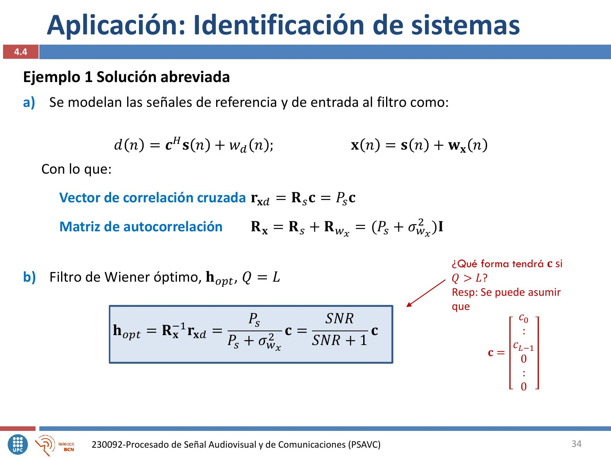

```text
      Aplicación: Identificación de sistemas
4.4

  Ejemplo 1 Solución abreviada
  a) Se modelan las señales de referencia y de entrada al filtro como:

                    𝑑𝑑 𝑛𝑛 = 𝒄𝒄𝐻𝐻 𝐬𝐬 𝑛𝑛 + 𝑤𝑤𝑑𝑑 𝑛𝑛 ;                         𝐱𝐱 𝑛𝑛 = 𝐬𝐬 𝑛𝑛 + 𝐰𝐰𝐱𝐱 𝑛𝑛
      Con lo que:
        Vector de correlación cruzada 𝐫𝐫𝐱𝐱𝑑𝑑 = 𝐑𝐑 𝑠𝑠 𝐜𝐜 = 𝑃𝑃𝑠𝑠 𝐜𝐜
        Matriz de autocorrelación                   𝐑𝐑 𝐱𝐱 = 𝐑𝐑 𝑠𝑠 + 𝐑𝐑 𝑤𝑤𝑥𝑥 = (𝑃𝑃𝑠𝑠 + 𝜎𝜎𝑤𝑤2𝑥𝑥 )𝐈𝐈

                                                                                                    ¿Qué forma tendrá 𝐜𝐜 si
  b) Filtro de Wiener óptimo, 𝐡𝐡𝑜𝑜𝑜𝑜𝑡𝑡 , 𝑄𝑄 = 𝐿𝐿                                                    𝑄𝑄 > 𝐿𝐿?
                                                                                                    Resp: Se puede asumir
                                                                                                    que
                                                    𝑃𝑃𝑠𝑠               𝑆𝑆𝑆𝑆𝑆𝑆                                       𝑐𝑐0
                    𝐡𝐡𝑜𝑜𝑜𝑜𝑡𝑡 = 𝐑𝐑−1
                                 𝐱𝐱 𝐫𝐫𝐱𝐱𝑑𝑑 =                   𝐜𝐜 =            𝐜𝐜                                    :
                                               𝑃𝑃𝑠𝑠 + 𝜎𝜎𝑤𝑤2 𝑥𝑥      𝑆𝑆𝑆𝑆𝑆𝑆 + 1                                   𝑐𝑐
                                                                                                            𝐜𝐜 = 𝐿𝐿−1
                                                                                                                     0
                                                                                                                     :
                                                                                                                     0


              230092-Procesado de Señal Audiovisual y de Comunicaciones (PSAVC)                                               34
```

## Page 35

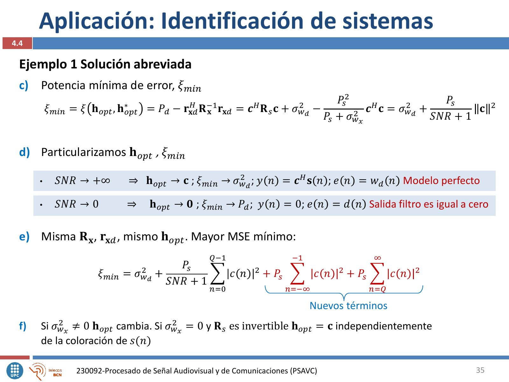

```text
       Aplicación: Identificación de sistemas
4.4

  Ejemplo 1 Solución abreviada
  c) Potencia mínima de error, 𝜉𝜉𝑚𝑚𝑚𝑚𝑚𝑚
                                                            𝐻𝐻 −1                                                𝑃𝑃𝑠𝑠2                            𝑃𝑃𝑠𝑠
           𝜉𝜉𝑚𝑚𝑚𝑚𝑚𝑚 = 𝜉𝜉 𝐡𝐡𝑜𝑜𝑜𝑜𝑡𝑡 , 𝐡𝐡∗𝑜𝑜𝑜𝑜𝑡𝑡   = 𝑃𝑃𝑑𝑑 − 𝐫𝐫𝐱𝐱𝑑𝑑 𝐑𝐑 𝐱𝐱 𝐫𝐫𝐱𝐱𝑑𝑑 = 𝒄𝒄𝐻𝐻 𝐑𝐑 𝑠𝑠 𝐜𝐜 + 𝜎𝜎𝑤𝑤2 𝑑𝑑 −              2
                                                                                                                          𝒄𝒄𝐻𝐻
                                                                                                                               𝐜𝐜 = 𝜎𝜎 2
                                                                                                                                      𝑤𝑤𝑑𝑑 +            𝐜𝐜 2
                                                                                                            𝑃𝑃𝑠𝑠 + 𝜎𝜎𝑤𝑤𝑥𝑥                    𝑆𝑆𝑆𝑆𝑆𝑆 + 1


  d) Particularizamos 𝐡𝐡𝑜𝑜𝑜𝑜𝑡𝑡 , 𝜉𝜉𝑚𝑚𝑚𝑚𝑚𝑚

       •      𝑆𝑆𝑆𝑆𝑆𝑆 → +∞                ⇒ 𝐡𝐡𝑜𝑜𝑜𝑜𝑡𝑡 → 𝐜𝐜 ; 𝜉𝜉𝑚𝑚𝑚𝑚𝑚𝑚 → 𝜎𝜎𝑤𝑤2 𝑑𝑑 ; 𝑦𝑦 𝑛𝑛 = 𝒄𝒄𝐻𝐻 𝐬𝐬 𝑛𝑛 ; 𝑒𝑒 𝑛𝑛 = 𝑤𝑤𝑑𝑑 𝑛𝑛 Modelo perfecto

       •      𝑆𝑆𝑆𝑆𝑆𝑆 → 0                 ⇒       𝐡𝐡𝑜𝑜𝑜𝑜𝑡𝑡 → 𝟎𝟎 ; 𝜉𝜉𝑚𝑚𝑚𝑚𝑚𝑚 → 𝑃𝑃𝑑𝑑 ; 𝑦𝑦 𝑛𝑛 = 0; 𝑒𝑒 𝑛𝑛 = 𝑑𝑑 𝑛𝑛 Salida filtro es igual a cero

  e) Misma 𝐑𝐑 𝐱𝐱 , 𝐫𝐫𝐱𝐱𝑑𝑑 , mismo 𝐡𝐡𝑜𝑜𝑜𝑜𝑡𝑡 . Mayor MSE mínimo:
                                                                    𝑄𝑄−1                       −1                         ∞
                                                         𝑃𝑃𝑠𝑠
                              𝜉𝜉𝑚𝑚𝑚𝑚𝑚𝑚 = 𝜎𝜎𝑤𝑤2 𝑑𝑑 +            � 𝑐𝑐 𝑛𝑛             2
                                                                                       + 𝑃𝑃𝑠𝑠 � 𝑐𝑐 𝑛𝑛           2
                                                                                                                    + 𝑃𝑃𝑠𝑠 � 𝑐𝑐 𝑛𝑛   2
                                                    𝑆𝑆𝑆𝑆𝑆𝑆 + 1
                                                                    𝑛𝑛=0                     𝑛𝑛=−∞                       𝑛𝑛=𝑄𝑄

                                                                                                     Nuevos términos
  f)   Si 𝜎𝜎𝑤𝑤2𝑥𝑥 ≠ 0 𝐡𝐡𝑜𝑜𝑜𝑜𝑡𝑡 cambia. Si 𝜎𝜎𝑤𝑤2𝑥𝑥 = 0 y 𝐑𝐑 𝑠𝑠 es invertible 𝐡𝐡𝑜𝑜𝑜𝑜𝑡𝑡 = 𝐜𝐜 independientemente
       de la coloración de 𝑠𝑠(𝑛𝑛)

                      230092-Procesado de Señal Audiovisual y de Comunicaciones (PSAVC)                                                               35
```

## Page 36

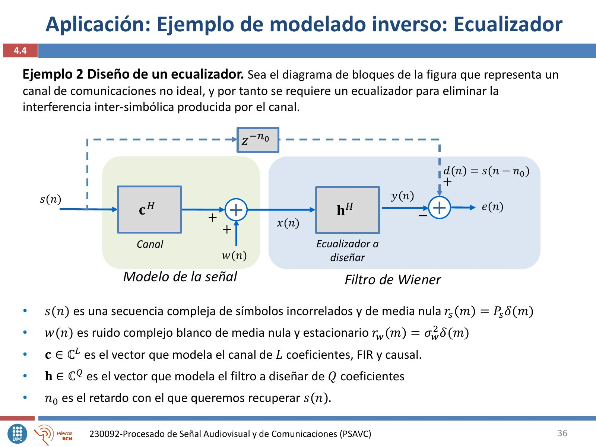

```text
       Aplicación: Ejemplo de modelado inverso: Ecualizador
4.4

  Ejemplo 2 Diseño de un ecualizador. Sea el diagrama de bloques de la figura que representa un
  canal de comunicaciones no ideal, y por tanto se requiere un ecualizador para eliminar la
  interferencia inter-simbólica producida por el canal.

                                                  𝑧𝑧 −𝑛𝑛0
                                                                                                 𝑑𝑑 𝑛𝑛 = 𝑠𝑠(𝑛𝑛 − 𝑛𝑛0 )
                                                                                             −   +
                                          +                                          𝑦𝑦 𝑛𝑛
      𝑠𝑠(𝑛𝑛)
                          𝐜𝐜 𝐻𝐻                +            𝑥𝑥(𝑛𝑛)
                                                                         𝐡𝐡𝐻𝐻                    +        𝑒𝑒(𝑛𝑛)
                                              +
                         Canal                                       Ecualizador a
                                              𝑤𝑤(𝑛𝑛)                    diseñar
                      Modelo de la señal                                  Filtro de Wiener

  •    𝑠𝑠(𝑛𝑛) es una secuencia compleja de símbolos incorrelados y de media nula 𝑟𝑟𝑠𝑠 𝑚𝑚 = 𝑃𝑃𝑠𝑠 𝛿𝛿(𝑚𝑚)
  •    𝑤𝑤(𝑛𝑛) es ruido complejo blanco de media nula y estacionario 𝑟𝑟𝑤𝑤 𝑚𝑚 = 𝜎𝜎𝑤𝑤2 𝛿𝛿(𝑚𝑚)
  •    𝐜𝐜 ∈ ℂ𝐿𝐿 es el vector que modela el canal de 𝐿𝐿 coeficientes, FIR y causal.
  •    𝐡𝐡 ∈ ℂ𝑄𝑄 es el vector que modela el filtro a diseñar de 𝑄𝑄 coeficientes
  •    𝑛𝑛0 es el retardo con el que queremos recuperar 𝑠𝑠 𝑛𝑛 .

               230092-Procesado de Señal Audiovisual y de Comunicaciones (PSAVC)                                         36
```

## Page 37

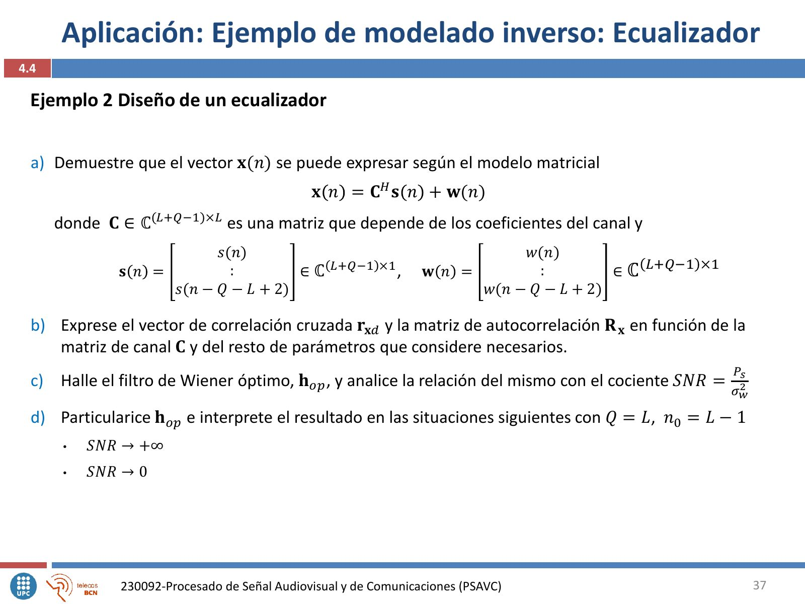

```text
       Aplicación: Ejemplo de modelado inverso: Ecualizador
4.4

  Ejemplo 2 Diseño de un ecualizador


  a) Demuestre que el vector 𝐱𝐱(𝑛𝑛) se puede expresar según el modelo matricial
                                                𝐱𝐱 𝑛𝑛 = 𝐂𝐂𝐻𝐻 𝐬𝐬 𝑛𝑛 + 𝐰𝐰(𝑛𝑛)
      donde 𝐂𝐂 ∈ ℂ 𝐿𝐿+𝑄𝑄−1 ×𝐿𝐿 es una matriz que depende de los coeficientes del canal y
                                𝑠𝑠(𝑛𝑛)                                            𝑤𝑤(𝑛𝑛)
                𝐬𝐬 𝑛𝑛 =            :         ∈ ℂ 𝐿𝐿+𝑄𝑄−1 ×1 ,      𝐰𝐰 𝑛𝑛 =           :          ∈ ℂ 𝐿𝐿+𝑄𝑄−1 ×1
                        𝑠𝑠(𝑛𝑛 − 𝑄𝑄 − 𝐿𝐿 + 2)                               𝑤𝑤(𝑛𝑛 − 𝑄𝑄 − 𝐿𝐿 + 2)

  b) Exprese el vector de correlación cruzada 𝐫𝐫𝐱𝐱𝑑𝑑 y la matriz de autocorrelación 𝐑𝐑 𝐱𝐱 en función de la
     matriz de canal 𝐂𝐂 y del resto de parámetros que considere necesarios.
                                                                                                                  𝑃𝑃𝑠𝑠
  c) Halle el filtro de Wiener óptimo, 𝐡𝐡𝑜𝑜𝑜𝑜 , y analice la relación del mismo con el cociente 𝑆𝑆𝑆𝑆𝑆𝑆 =            2
                                                                                                                 𝜎𝜎𝑤𝑤

  d) Particularice 𝐡𝐡𝑜𝑜𝑜𝑜 e interprete el resultado en las situaciones siguientes con 𝑄𝑄 = 𝐿𝐿, 𝑛𝑛0 = 𝐿𝐿 − 1
       •   𝑆𝑆𝑆𝑆𝑆𝑆 → +∞
       •   𝑆𝑆𝑆𝑆𝑆𝑆 → 0


                230092-Procesado de Señal Audiovisual y de Comunicaciones (PSAVC)                                        37
```

## Page 38

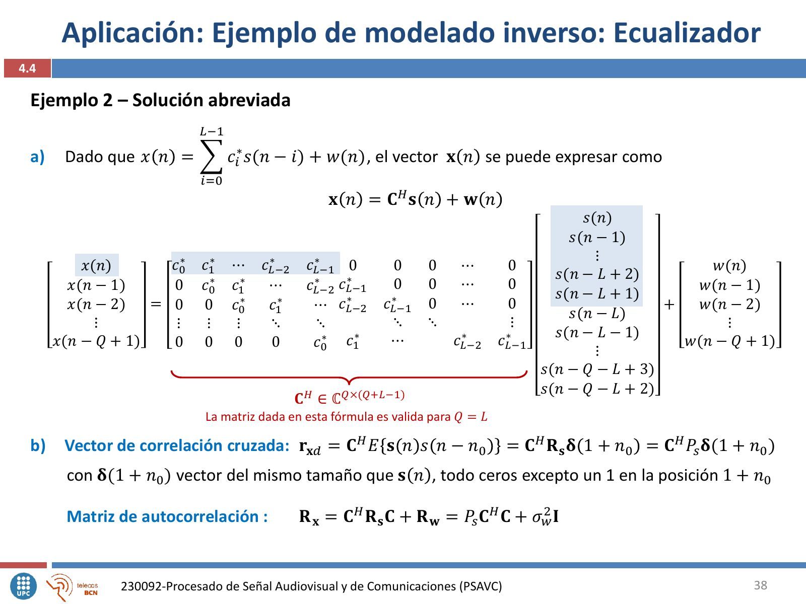

```text
        Aplicación: Ejemplo de modelado inverso: Ecualizador
4.4

  Ejemplo 2 – Solución abreviada
                                𝐿𝐿−1

  a)     Dado que 𝑥𝑥 𝑛𝑛 = � 𝑐𝑐𝑖𝑖∗ 𝑠𝑠(𝑛𝑛 − 𝑖𝑖) + 𝑤𝑤(𝑛𝑛) , el vector 𝐱𝐱 𝑛𝑛 se puede expresar como
                                𝑖𝑖=0
                                                             𝐱𝐱 𝑛𝑛 = 𝐂𝐂𝐻𝐻 𝐬𝐬 𝑛𝑛 + 𝐰𝐰 𝑛𝑛
                                                                                                                  𝑠𝑠(𝑛𝑛)
                                                                                                               𝑠𝑠(𝑛𝑛 − 1)
                                                                                                                     ⋮
             𝑥𝑥(𝑛𝑛)      𝑐𝑐0∗   𝑐𝑐1∗   ⋯        ∗
                                              𝑐𝑐𝐿𝐿−2       ∗
                                                         𝑐𝑐𝐿𝐿−1    0       0      0      ⋯         0                                 𝑤𝑤(𝑛𝑛)
                                                                  ∗                                         𝑠𝑠(𝑛𝑛 − 𝐿𝐿 + 2)
          𝑥𝑥(𝑛𝑛 − 1)      0     𝑐𝑐0∗   𝑐𝑐1∗     ⋯          ∗
                                                         𝑐𝑐𝐿𝐿−2 𝑐𝑐𝐿𝐿−1     0      0      ⋯         0                              𝑤𝑤(𝑛𝑛 − 1)
                                                                  ∗        ∗                                𝑠𝑠(𝑛𝑛 − 𝐿𝐿 + 1)
          𝑥𝑥(𝑛𝑛 − 2)   = 0       0     𝑐𝑐0∗     𝑐𝑐1∗       ⋯ 𝑐𝑐𝐿𝐿−2      𝑐𝑐𝐿𝐿−1   0      ⋯         0                          +   𝑤𝑤(𝑛𝑛 − 2)
                                                                                                               𝑠𝑠(𝑛𝑛 − 𝐿𝐿)
                ⋮         ⋮      ⋮      ⋮        ⋱          ⋱               ⋱     ⋱                ⋮                                   ⋮
                                                                                                            𝑠𝑠(𝑛𝑛 − 𝐿𝐿 − 1)
       𝑥𝑥(𝑛𝑛 − 𝑄𝑄 + 1)    0      0      0        0         𝑐𝑐0∗ 𝑐𝑐1∗       ⋯             ∗
                                                                                       𝑐𝑐𝐿𝐿−2     ∗
                                                                                                𝑐𝑐𝐿𝐿−1                          𝑤𝑤(𝑛𝑛 − 𝑄𝑄 + 1)
                                                                                                                     ⋮
                                                                                                         𝑠𝑠(𝑛𝑛 − 𝑄𝑄 − 𝐿𝐿 + 3)
                                                                                                         𝑠𝑠(𝑛𝑛 − 𝑄𝑄 − 𝐿𝐿 + 2)
                                                       𝐂𝐂𝐻𝐻 ∈ ℂ𝑄𝑄×(𝑄𝑄+𝐿𝐿−1)
                                 La matriz dada en esta fórmula es valida para 𝑄𝑄 = 𝐿𝐿

  b)     Vector de correlación cruzada: 𝐫𝐫𝐱𝐱𝑑𝑑 = 𝐂𝐂𝐻𝐻 𝐸𝐸 𝐬𝐬 𝑛𝑛 𝑠𝑠 𝑛𝑛 − 𝑛𝑛0                        = 𝐂𝐂𝐻𝐻 𝐑𝐑 𝐬𝐬 𝛅𝛅 1 + 𝑛𝑛0 = 𝐂𝐂𝐻𝐻 𝑃𝑃𝑠𝑠 𝛅𝛅(1 + 𝑛𝑛0 )
         con 𝛅𝛅(1 + 𝑛𝑛0 ) vector del mismo tamaño que 𝐬𝐬 𝑛𝑛 , todo ceros excepto un 1 en la posición 1 + 𝑛𝑛0

         Matriz de autocorrelación :                   𝐑𝐑 𝐱𝐱 = 𝐂𝐂𝐻𝐻 𝐑𝐑 𝐬𝐬 𝐂𝐂 + 𝐑𝐑 𝐰𝐰 = 𝑃𝑃𝑠𝑠 𝐂𝐂𝐻𝐻 𝐂𝐂 + 𝜎𝜎𝑤𝑤2 𝐈𝐈


                  230092-Procesado de Señal Audiovisual y de Comunicaciones (PSAVC)                                                           38
```

## Page 39

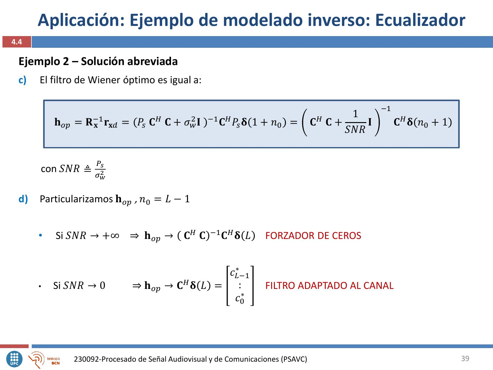

```text
       Aplicación: Ejemplo de modelado inverso: Ecualizador
4.4

  Ejemplo 2 – Solución abreviada
  c)   El filtro de Wiener óptimo es igual a:

                                                                                                          −1
                                                                                                1
           𝐡𝐡𝑜𝑜𝑜𝑜 = 𝐑𝐑−1                 𝐻𝐻      2
                      𝐱𝐱 𝐫𝐫𝐱𝐱𝑑𝑑 = 𝑃𝑃𝑠𝑠 𝐂𝐂 𝐂𝐂 + 𝜎𝜎𝑤𝑤 𝐈𝐈
                                                       −1 𝐻𝐻
                                                         𝐂𝐂 𝑃𝑃𝑠𝑠 𝛅𝛅 1 + 𝑛𝑛0 =       𝐂𝐂𝐻𝐻 𝐂𝐂 +        𝐈𝐈        𝐂𝐂𝐻𝐻 𝛅𝛅 𝑛𝑛0 + 1
                                                                                              𝑆𝑆𝑆𝑆𝑆𝑆


                       𝑃𝑃𝑠𝑠
       con 𝑆𝑆𝑆𝑆𝑆𝑆 ≜      2
                      𝜎𝜎𝑤𝑤


  d)   Particularizamos 𝐡𝐡𝑜𝑜𝑜𝑜 , 𝑛𝑛0 = 𝐿𝐿 − 1


       •   Si 𝑆𝑆𝑆𝑆𝑆𝑆 → +∞ ⇒ 𝐡𝐡𝑜𝑜𝑜𝑜 → 𝐂𝐂𝐻𝐻 𝐂𝐂 −1 𝐂𝐂𝐻𝐻 𝛅𝛅 𝐿𝐿           FORZADOR DE CEROS

                                                         ∗
                                                       𝑐𝑐𝐿𝐿−1
       •   Si 𝑆𝑆𝑆𝑆𝑆𝑆 → 0        ⇒ 𝐡𝐡𝑜𝑜𝑜𝑜 → 𝐂𝐂𝐻𝐻 𝛅𝛅 𝐿𝐿 = :            FILTRO ADAPTADO AL CANAL
                                                         𝑐𝑐0∗


                230092-Procesado de Señal Audiovisual y de Comunicaciones (PSAVC)                                                39
```

## Page 40

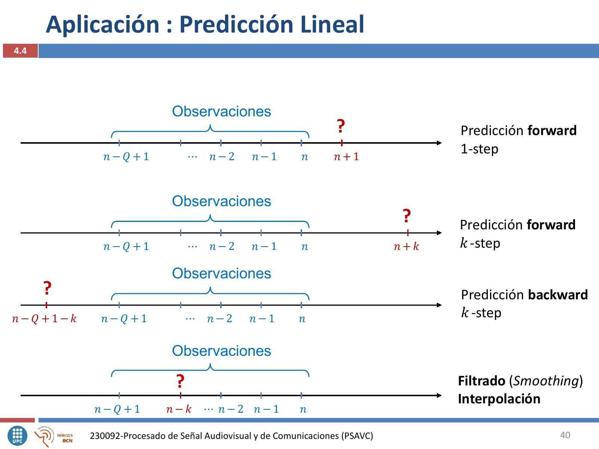

```text
        Aplicación : Predicción Lineal
4.4


                                     Observaciones
                                                                           ?                     Predicción forward
                      𝑛𝑛 − 𝑄𝑄 + 1         ⋯    𝑛𝑛 − 2   𝑛𝑛 − 1     𝑛𝑛     𝑛𝑛 + 1
                                                                                                 1-step


                                     Observaciones
                                                                                         ?       Predicción forward
                      𝑛𝑛 − 𝑄𝑄 + 1         ⋯    𝑛𝑛 − 2   𝑛𝑛 − 1     𝑛𝑛                  𝑛𝑛 + 𝑘𝑘   𝑘𝑘 -step

                                     Observaciones
       ?                                                                                         Predicción backward
𝑛𝑛 − 𝑄𝑄 + 1 − 𝑘𝑘     𝑛𝑛 − 𝑄𝑄 + 1          ⋯   𝑛𝑛 − 2    𝑛𝑛 − 1    𝑛𝑛                             𝑘𝑘 -step

                                     Observaciones

                                      ?                                                          Filtrado (Smoothing)
                                                                                                 Interpolación
                    𝑛𝑛 − 𝑄𝑄 + 1     𝑛𝑛 − 𝑘𝑘   ⋯ 𝑛𝑛 − 2 𝑛𝑛 − 1      𝑛𝑛

                   230092-Procesado de Señal Audiovisual y de Comunicaciones (PSAVC)                             40
```

## Page 41

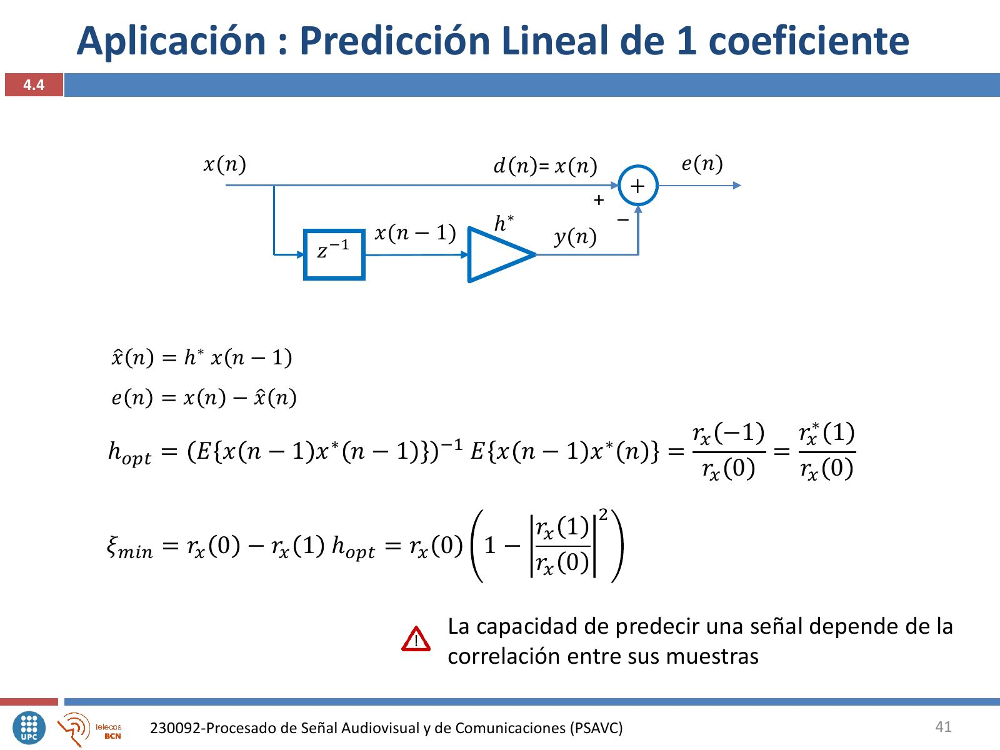

```text
      Aplicación : Predicción Lineal de 1 coeficiente
4.4


                   𝑥𝑥(𝑛𝑛)                                  𝑑𝑑 𝑛𝑛 = 𝑥𝑥(𝑛𝑛)                𝑒𝑒(𝑛𝑛)
                                                                                    +
                                                                        +
                                          𝑥𝑥(𝑛𝑛 − 1)       ℎ∗                   _
                                                                   𝑦𝑦(𝑛𝑛)
                                  𝑧𝑧 −1


       𝑥𝑥� 𝑛𝑛 = ℎ∗ 𝑥𝑥 𝑛𝑛 − 1
       𝑒𝑒 𝑛𝑛 = 𝑥𝑥 𝑛𝑛 − 𝑥𝑥� 𝑛𝑛
                                                                                          𝑟𝑟𝑥𝑥 −1    𝑟𝑟𝑥𝑥∗ 1
       ℎ𝑜𝑜𝑜𝑜𝑜𝑜 = 𝐸𝐸 𝑥𝑥 𝑛𝑛 − 1 𝑥𝑥 ∗ 𝑛𝑛 − 1          −1 𝐸𝐸 𝑥𝑥 𝑛𝑛 − 1 𝑥𝑥 ∗ 𝑛𝑛
                                                                                        =          =
                                                                                            𝑟𝑟𝑥𝑥 0   𝑟𝑟𝑥𝑥 0
                                                                            2
                                                            𝑟𝑟𝑥𝑥 1
       𝜉𝜉𝑚𝑚𝑚𝑚𝑚𝑚 = 𝑟𝑟𝑥𝑥 0 − 𝑟𝑟𝑥𝑥 1 ℎ𝑜𝑜𝑜𝑜𝑜𝑜 = 𝑟𝑟𝑥𝑥 0       1−
                                                            𝑟𝑟𝑥𝑥 0

                                                    La capacidad de predecir una señal depende de la
                                                    correlación entre sus muestras

            230092-Procesado de Señal Audiovisual y de Comunicaciones (PSAVC)                                  41
```

## Page 42

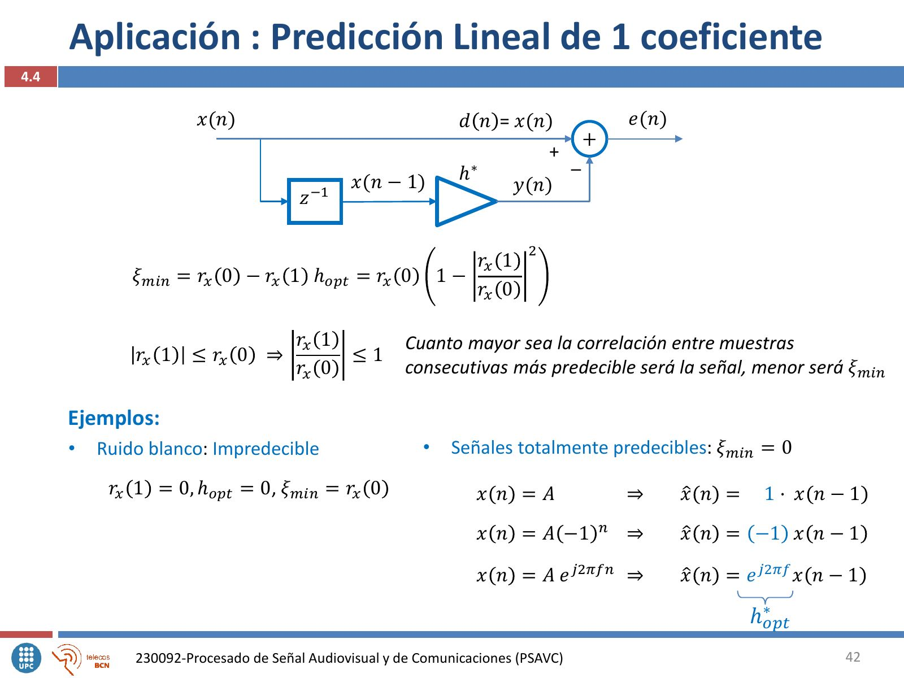

```text
      Aplicación : Predicción Lineal de 1 coeficiente
4.4

                        𝑥𝑥(𝑛𝑛)                                    𝑑𝑑 𝑛𝑛 = 𝑥𝑥(𝑛𝑛)            𝑒𝑒(𝑛𝑛)
                                                                                        +
                                                                                +
                                                𝑥𝑥(𝑛𝑛 − 1)        ℎ∗                _
                                                                         𝑦𝑦(𝑛𝑛)
                                        𝑧𝑧 −1

                                                                            2
                                                                   𝑟𝑟𝑥𝑥 1
              𝜉𝜉𝑚𝑚𝑚𝑚𝑚𝑚 = 𝑟𝑟𝑥𝑥 0 − 𝑟𝑟𝑥𝑥 1 ℎ𝑜𝑜𝑜𝑜𝑜𝑜 = 𝑟𝑟𝑥𝑥 0       1−
                                                                   𝑟𝑟𝑥𝑥 0

                                       𝑟𝑟𝑥𝑥 1           Cuanto mayor sea la correlación entre muestras
               𝑟𝑟𝑥𝑥 1   ≤ 𝑟𝑟𝑥𝑥 0 ⇒              ≤1
                                       𝑟𝑟𝑥𝑥 0           consecutivas más predecible será la señal, menor será 𝜉𝜉𝑚𝑚𝑚𝑚𝑚𝑚

      Ejemplos:
      •   Ruido blanco: Impredecible                        •    Señales totalmente predecibles: 𝜉𝜉𝑚𝑚𝑚𝑚𝑚𝑚 = 0

           𝑟𝑟𝑥𝑥 1 = 0, ℎ𝑜𝑜𝑜𝑜𝑜𝑜 = 0, 𝜉𝜉𝑚𝑚𝑚𝑚𝑚𝑚 = 𝑟𝑟𝑥𝑥 0               𝑥𝑥 𝑛𝑛 = 𝐴𝐴              ⇒        𝑥𝑥� 𝑛𝑛 =     1 · 𝑥𝑥 𝑛𝑛 − 1
                                                                    𝑥𝑥 𝑛𝑛 = 𝐴𝐴 −1 𝑛𝑛 ⇒               𝑥𝑥� 𝑛𝑛 = −1 𝑥𝑥 𝑛𝑛 − 1

                                                                    𝑥𝑥 𝑛𝑛 = 𝐴𝐴 𝑒𝑒 𝑗𝑗𝑗𝑗𝑗𝑗𝑗𝑗𝑗 ⇒        𝑥𝑥� 𝑛𝑛 = 𝑒𝑒 𝑗𝑗𝑗𝑗𝑗𝑗𝑗 𝑥𝑥 𝑛𝑛 − 1
                                                                                                                 ∗
                                                                                                                ℎ𝑜𝑜𝑜𝑜𝑜𝑜
               230092-Procesado de Señal Audiovisual y de Comunicaciones (PSAVC)                                               42
```

## Page 43

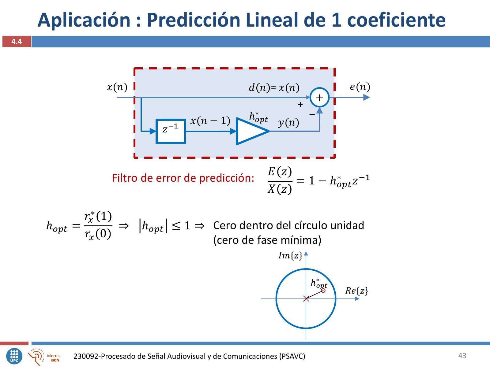

```text
      Aplicación : Predicción Lineal de 1 coeficiente
4.4


                     𝑥𝑥(𝑛𝑛)                                  𝑑𝑑 𝑛𝑛 = 𝑥𝑥(𝑛𝑛)                 𝑒𝑒(𝑛𝑛)
                                                                                     +
                                                                             +
                                                              ∗
                                            𝑥𝑥(𝑛𝑛 − 1)       ℎ𝑜𝑜𝑜𝑜𝑜𝑜             _
                                                                       𝑦𝑦(𝑛𝑛)
                                    𝑧𝑧 −1


                                                                   𝐸𝐸 𝑧𝑧
                      Filtro de error de predicción:                            ∗
                                                                         = 1 − ℎ𝑜𝑜𝑜𝑜𝑜𝑜 𝑧𝑧 −1
                                                                   𝑋𝑋 𝑧𝑧

                𝑟𝑟𝑥𝑥∗ 1
      ℎ𝑜𝑜𝑜𝑜𝑜𝑜 =         ⇒      ℎ𝑜𝑜𝑜𝑜𝑜𝑜 ≤ 1 ⇒ Cero dentro del círculo unidad
                𝑟𝑟𝑥𝑥 0
                                             (cero de fase mínima)
                                                                       𝐼𝐼𝐼𝐼 𝑧𝑧

                                                                                  ∗
                                                                                 ℎ𝑜𝑜𝑜𝑜𝑜𝑜
                                                                                           𝑅𝑅𝑅𝑅 𝑧𝑧


            230092-Procesado de Señal Audiovisual y de Comunicaciones (PSAVC)                        43
```

## Page 44

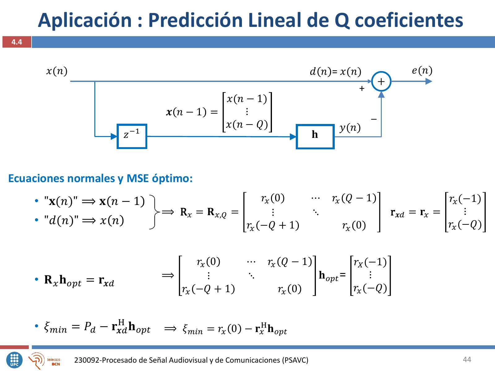

```text
       Aplicación : Predicción Lineal de Q coeficientes
4.4


         𝑥𝑥(𝑛𝑛)                                                                         𝑑𝑑 𝑛𝑛 = 𝑥𝑥(𝑛𝑛)                    𝑒𝑒(𝑛𝑛)
                                                                                                                 +
                                                                                                         +
                                                         𝑥𝑥(𝑛𝑛 − 1)
                                             𝒙𝒙 𝑛𝑛 − 1 =       ⋮
                                                         𝑥𝑥(𝑛𝑛 − 𝑄𝑄)                               𝑦𝑦(𝑛𝑛)    _
                                  𝑧𝑧 −1                                                 𝐡𝐡


Ecuaciones normales y MSE óptimo:
      • "𝐱𝐱(𝑛𝑛)" ⟹ 𝐱𝐱 𝑛𝑛 − 1                                         𝑟𝑟𝑥𝑥 0             ⋯       𝑟𝑟𝑥𝑥 𝑄𝑄 − 1                         𝑟𝑟𝑥𝑥 (−1)
                                            ⟹ R 𝑥𝑥 = 𝐑𝐑 𝑥𝑥,𝑄𝑄 =          ⋮              ⋱                            r𝒙𝒙𝑑𝑑 = 𝐫𝐫𝑥𝑥 =       ⋮
      • "𝑑𝑑(𝑛𝑛)" ⟹ 𝑥𝑥 𝑛𝑛                                        𝑟𝑟𝑥𝑥 −𝑄𝑄 + 1                        𝑟𝑟𝑥𝑥 0                          𝑟𝑟𝑥𝑥 (−𝑄𝑄)


                                                   𝑟𝑟𝑥𝑥 0           ⋯     𝑟𝑟𝑥𝑥 𝑄𝑄 − 1                   𝑟𝑟𝑋𝑋 (−1)
      • 𝐑𝐑 𝑥𝑥 𝐡𝐡𝑜𝑜𝑜𝑜𝑜𝑜 = 𝐫𝐫𝒙𝒙𝑑𝑑             ⟹          ⋮            ⋱                        𝐡𝐡𝑜𝑜𝑜𝑜𝑜𝑜 =       ⋮
                                              𝑟𝑟𝑥𝑥 −𝑄𝑄 + 1                   𝑟𝑟𝑥𝑥 0                     𝑟𝑟𝑥𝑥 (−𝑄𝑄)


                             H
      • 𝜉𝜉𝑚𝑚𝑚𝑚𝑚𝑚 = 𝑃𝑃𝑑𝑑 − 𝐫𝐫𝒙𝒙𝑑𝑑 𝐡𝐡𝑜𝑜𝑜𝑜𝑜𝑜   ⟹ 𝜉𝜉𝑚𝑚𝑚𝑚𝑚𝑚 = 𝑟𝑟𝑥𝑥 0 − 𝐫𝐫𝑥𝑥H 𝐡𝐡𝑜𝑜𝑜𝑜𝑜𝑜

                  230092-Procesado de Señal Audiovisual y de Comunicaciones (PSAVC)                                                     44
```

## Page 45

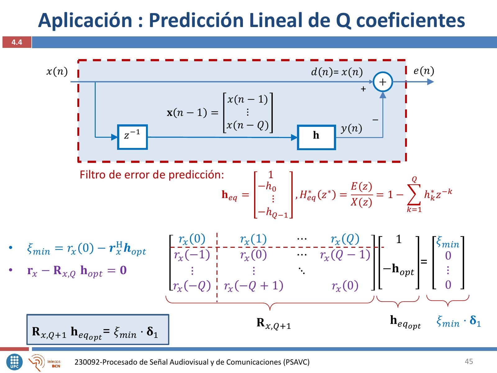

```text
         Aplicación : Predicción Lineal de Q coeficientes
4.4


           𝑥𝑥(𝑛𝑛)                                                                       𝑑𝑑 𝑛𝑛 = 𝑥𝑥(𝑛𝑛)                       𝑒𝑒(𝑛𝑛)
                                                                                                                +
                                                                                                        +
                                                              𝑥𝑥(𝑛𝑛 − 1)
                                                  𝐱𝐱 𝑛𝑛 − 1 =       ⋮
                                                              𝑥𝑥(𝑛𝑛 − 𝑄𝑄)                         𝑦𝑦(𝑛𝑛)    _
                                    𝑧𝑧 −1                                               𝐡𝐡


                      Filtro de error de predicción:                     1                                    𝑄𝑄
                                                                        −ℎ0                    𝐸𝐸(𝑧𝑧)
                                                               𝐡𝐡𝑒𝑒𝑒𝑒 =   ⋮
                                                                                   ∗
                                                                               , 𝐻𝐻𝑒𝑒𝑒𝑒 𝑧𝑧 ∗ =        = 1 − � ℎ𝑘𝑘∗ 𝑧𝑧 −𝑘𝑘
                                                                                               𝑋𝑋(𝑧𝑧)
                                                                        −ℎ𝑄𝑄−1                              𝑘𝑘=1


                                                      𝑟𝑟𝑥𝑥 0        𝑟𝑟𝑥𝑥 (1)        ⋯            𝑟𝑟𝑥𝑥 𝑄𝑄              1     𝜉𝜉𝑚𝑚𝑚𝑚𝑚𝑚
•     𝜉𝜉𝑚𝑚𝑚𝑚𝑚𝑚 = 𝑟𝑟𝑥𝑥 0    − 𝒓𝒓H
                               𝑥𝑥 𝒉𝒉𝑜𝑜𝑜𝑜𝑜𝑜         𝑟𝑟𝑥𝑥 −1          𝑟𝑟𝑥𝑥 0          ⋯        𝑟𝑟𝑥𝑥 𝑄𝑄 − 1                       0
                                                                                                                          =
•     𝐫𝐫𝑥𝑥 − 𝐑𝐑 𝑥𝑥,𝑄𝑄 𝐡𝐡𝑜𝑜𝑜𝑜𝑜𝑜 = 𝟎𝟎                       ⋮              ⋮          ⋱                           −𝐡𝐡𝑜𝑜𝑜𝑜𝑜𝑜      ⋮
                                                   𝑟𝑟𝑥𝑥 −𝑄𝑄    𝑟𝑟𝑥𝑥 −𝑄𝑄 + 1                    𝑟𝑟𝑥𝑥 0                          0


                                                                       𝐑𝐑 𝑥𝑥,𝑄𝑄+1                                   𝐡𝐡𝑒𝑒𝑞𝑞𝑜𝑜𝑜𝑜𝑜𝑜      𝜉𝜉𝑚𝑚𝑚𝑚𝑚𝑚 · 𝛅𝛅1
       𝐑𝐑 𝑥𝑥,𝑄𝑄+1 𝐡𝐡𝑒𝑒𝑞𝑞𝑜𝑜𝑜𝑜𝑜𝑜 = 𝜉𝜉𝑚𝑚𝑚𝑚𝑚𝑚 · 𝛅𝛅1

                    230092-Procesado de Señal Audiovisual y de Comunicaciones (PSAVC)                                                         45
```

## Page 46

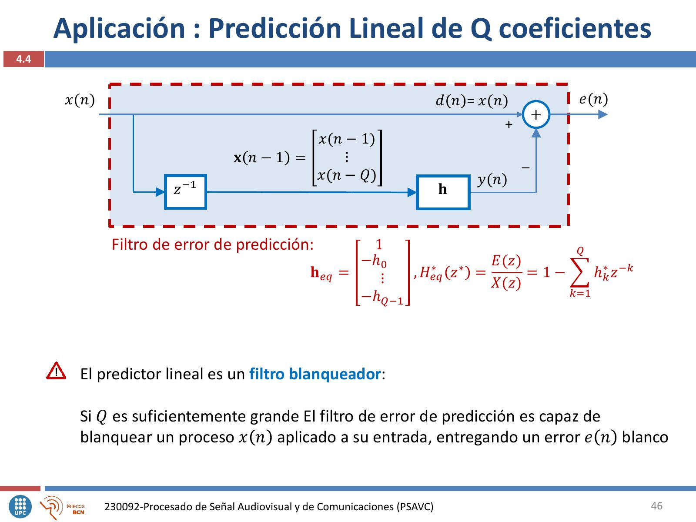

```text
      Aplicación : Predicción Lineal de Q coeficientes
4.4


      𝑥𝑥(𝑛𝑛)                                                                       𝑑𝑑 𝑛𝑛 = 𝑥𝑥(𝑛𝑛)           𝑒𝑒(𝑛𝑛)
                                                                                                        +
                                                                                                +
                                                    𝑥𝑥(𝑛𝑛 − 1)
                                        𝐱𝐱 𝑛𝑛 − 1 =       ⋮
                                                    𝑥𝑥(𝑛𝑛 − 𝑄𝑄)                           𝑦𝑦(𝑛𝑛)    _
                            𝑧𝑧 −1                                                  𝐡𝐡


                Filtro de error de predicción:                   1                                    𝑄𝑄
                                                                −ℎ0                    𝐸𝐸(𝑧𝑧)
                                                       𝐡𝐡𝑒𝑒𝑒𝑒 =   ⋮
                                                                           ∗
                                                                       , 𝐻𝐻𝑒𝑒𝑒𝑒 𝑧𝑧 ∗ =        = 1 − � ℎ𝑘𝑘∗ 𝑧𝑧 −𝑘𝑘
                                                                                       𝑋𝑋(𝑧𝑧)
                                                                −ℎ𝑄𝑄−1                              𝑘𝑘=1


        El predictor lineal es un filtro blanqueador:

        Si 𝑄𝑄 es suficientemente grande El filtro de error de predicción es capaz de
        blanquear un proceso 𝑥𝑥 𝑛𝑛 aplicado a su entrada, entregando un error 𝑒𝑒 𝑛𝑛 blanco


               230092-Procesado de Señal Audiovisual y de Comunicaciones (PSAVC)                                     46
```

## Page 47

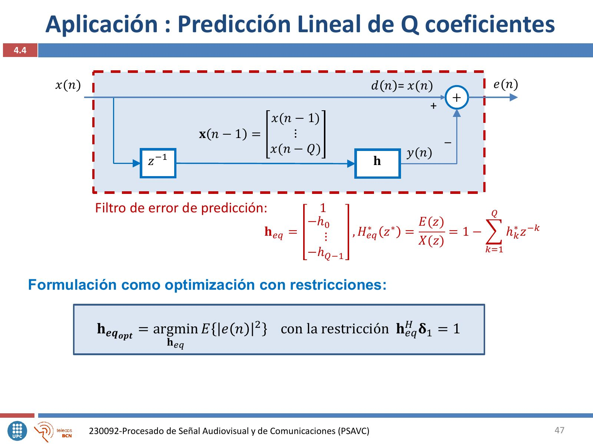

```text
        Aplicación : Predicción Lineal de Q coeficientes
4.4


         𝑥𝑥(𝑛𝑛)                                                                       𝑑𝑑 𝑛𝑛 = 𝑥𝑥(𝑛𝑛)           𝑒𝑒(𝑛𝑛)
                                                                                                           +
                                                                                                   +
                                                         𝑥𝑥(𝑛𝑛 − 1)
                                             𝐱𝐱 𝑛𝑛 − 1 =       ⋮
                                                         𝑥𝑥(𝑛𝑛 − 𝑄𝑄)                         𝑦𝑦(𝑛𝑛)    _
                               𝑧𝑧 −1                                                  𝐡𝐡


                   Filtro de error de predicción:                     1                                    𝑄𝑄
                                                                     −ℎ0                    𝐸𝐸(𝑧𝑧)
                                                            𝐡𝐡𝑒𝑒𝑒𝑒 =   ⋮
                                                                                ∗
                                                                            , 𝐻𝐻𝑒𝑒𝑒𝑒 𝑧𝑧 ∗ =        = 1 − � ℎ𝑘𝑘∗ 𝑧𝑧 −𝑘𝑘
                                                                                            𝑋𝑋(𝑧𝑧)
                                                                     −ℎ𝑄𝑄−1                              𝑘𝑘=1


      Formulación como optimización con restricciones:

                   𝐡𝐡𝒆𝒆𝒆𝒆𝒐𝒐𝒐𝒐𝒐𝒐 = argmin 𝐸𝐸 𝑒𝑒 𝑛𝑛       2
                                                               con la restricción 𝐡𝐡𝐻𝐻
                                                                                    𝑒𝑒𝑒𝑒 𝛅𝛅1 = 1
                                    𝐡𝐡𝑒𝑒𝑒𝑒


                  230092-Procesado de Señal Audiovisual y de Comunicaciones (PSAVC)                                      47
```

## Page 48

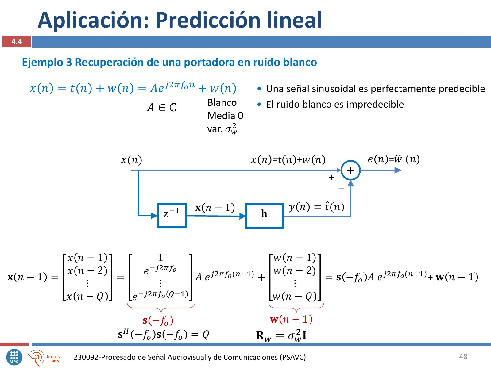

```text
        Aplicación: Predicción lineal
 4.4

   Ejemplo 3 Recuperación de una portadora en ruido blanco

       𝑥𝑥 𝑛𝑛 = 𝑡𝑡 𝑛𝑛 + 𝑤𝑤 𝑛𝑛 = 𝐴𝐴𝑒𝑒 𝑗𝑗𝑗𝑗𝑗𝑓𝑓𝑜𝑜 𝑛𝑛 + 𝑤𝑤 𝑛𝑛            • Una señal sinusoidal es perfectamente predecible
                                       𝐴𝐴 ∈ ℂ         Blanco        • El ruido blanco es impredecible
                                                      Media 0
                                                      var. 𝜎𝜎𝑤𝑤2

                              𝑥𝑥(𝑛𝑛)                               𝑥𝑥 𝑛𝑛 =t(𝑛𝑛)+𝑤𝑤(𝑛𝑛)               𝑒𝑒 𝑛𝑛 =𝑤𝑤
                                                                                                            � (𝑛𝑛)
                                                                                                 +
                                                                                         +
                                                                                             _
                                                   𝐱𝐱 𝑛𝑛 − 1                            ̂
                                                                              𝑦𝑦 𝑛𝑛 = 𝑡𝑡(𝑛𝑛)
                                          𝑧𝑧 −1                      𝐡𝐡


            𝑥𝑥 𝑛𝑛 − 1             1                                 𝑤𝑤 𝑛𝑛 − 1
            𝑥𝑥(𝑛𝑛 − 2)       𝑒𝑒 −𝑗𝑗𝑗𝑗𝑗𝑓𝑓𝑜𝑜                          𝑤𝑤(𝑛𝑛 − 2)
𝐱𝐱 𝑛𝑛 − 1 =            =                    𝐴𝐴 𝑒𝑒 𝑗𝑗𝑗𝑗𝑗𝑓𝑓𝑜𝑜(𝑛𝑛−1) +            = 𝐬𝐬 −𝑓𝑓𝑜𝑜 𝐴𝐴 𝑒𝑒 𝑗𝑗𝑗𝑗𝑗𝑓𝑓𝑜𝑜(𝑛𝑛−1) + 𝐰𝐰 𝑛𝑛 − 1
                  ⋮                ⋮                                      ⋮
            𝑥𝑥 𝑛𝑛 − 𝑄𝑄      −𝑗𝑗𝑗𝑗𝑗𝑓𝑓   𝑄𝑄−1                         𝑤𝑤 𝑛𝑛 − 𝑄𝑄
                         𝑒𝑒         𝑜𝑜


                                   𝐬𝐬 −𝑓𝑓𝑜𝑜                               𝐰𝐰 𝑛𝑛 − 1
                             𝐬𝐬𝐻𝐻 −𝑓𝑓𝑜𝑜 𝐬𝐬 −𝑓𝑓𝑜𝑜 = 𝑄𝑄               𝐑𝐑 𝒘𝒘 = 𝜎𝜎𝑤𝑤2 𝐈𝐈
                 230092-Procesado de Señal Audiovisual y de Comunicaciones (PSAVC)                                     48
```

## Page 49

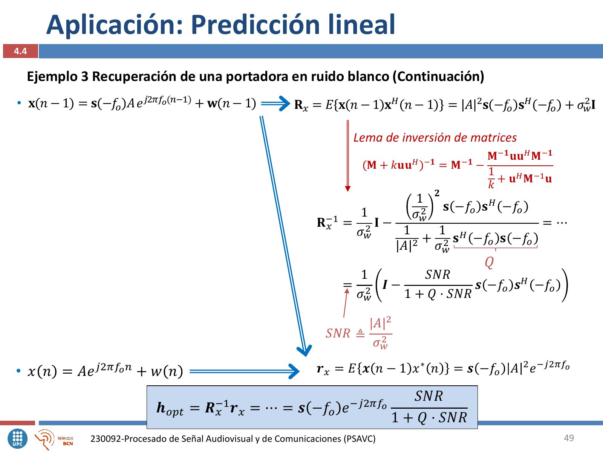

```text
      Aplicación: Predicción lineal
4.4

  Ejemplo 3 Recuperación de una portadora en ruido blanco (Continuación)
• 𝐱𝐱 𝑛𝑛 − 1 = 𝐬𝐬 −𝑓𝑓𝑜𝑜 𝐴𝐴 𝑒𝑒𝑗𝑗𝑗𝑗𝑗𝑓𝑓𝑜𝑜(𝑛𝑛−1) + 𝐰𝐰 𝑛𝑛 − 1        𝐑𝐑𝑥𝑥 = 𝐸𝐸 𝐱𝐱 𝑛𝑛 − 1 𝐱𝐱𝐻𝐻 𝑛𝑛 − 1          = 𝐴𝐴 2𝐬𝐬 −𝑓𝑓𝑜𝑜 𝐬𝐬𝐻𝐻 −𝑓𝑓𝑜𝑜 + 𝜎𝜎𝑤𝑤2𝐈𝐈

                                                                              Lema de inversión de matrices
                                                                                              𝐻𝐻 −𝟏𝟏          −𝟏𝟏
                                                                                                                      𝐌𝐌−𝟏𝟏 𝐮𝐮𝐮𝐮𝐻𝐻 𝐌𝐌−𝟏𝟏
                                                                                𝐌𝐌 + 𝑘𝑘𝐮𝐮𝐮𝐮            = 𝐌𝐌         −
                                                                                                                      1
                                                                                                                         + 𝐮𝐮𝐻𝐻 𝐌𝐌−1 𝐮𝐮
                                                                                                                      𝑘𝑘
                                                                                      1 𝟐𝟐
                                                                           1           2   𝐬𝐬 −𝑓𝑓𝑜𝑜 𝐬𝐬𝐻𝐻 −𝑓𝑓𝑜𝑜
                                                                                     𝜎𝜎𝑤𝑤
                                                                    𝐑𝐑−1
                                                                      𝑥𝑥 = 2 𝐈𝐈 − 1                             =⋯
                                                                          𝜎𝜎𝑤𝑤            1 𝐻𝐻
                                                                                        +     𝐬𝐬 −𝑓𝑓𝑜𝑜 𝐬𝐬 −𝑓𝑓𝑜𝑜
                                                                                  𝐴𝐴 2 𝜎𝜎𝑤𝑤2
                                                                                                                      𝑄𝑄
                                                                               1           𝑆𝑆𝑆𝑆𝑆𝑆
                                                                          =     2
                                                                                   𝑰𝑰 −                 𝒔𝒔 −𝑓𝑓𝑜𝑜 𝒔𝒔𝐻𝐻 −𝑓𝑓𝑜𝑜
                                                                              𝜎𝜎𝑤𝑤      1 + 𝑄𝑄 · 𝑆𝑆𝑆𝑆𝑆𝑆

                                                                              𝐴𝐴 2
                                                                      𝑆𝑆𝑆𝑆𝑆𝑆 ≜ 2
                                                                              𝜎𝜎𝑤𝑤

• 𝑥𝑥 𝑛𝑛 = 𝐴𝐴𝑒𝑒 𝑗𝑗𝑗𝑗𝑗𝑓𝑓𝑜𝑜 𝑛𝑛 + 𝑤𝑤 𝑛𝑛                                 𝒓𝒓𝑥𝑥 = 𝐸𝐸 𝒙𝒙 𝑛𝑛 − 1 𝑥𝑥 ∗ 𝑛𝑛          = 𝒔𝒔 −𝑓𝑓𝑜𝑜 𝐴𝐴 2 𝑒𝑒 −𝑗𝑗𝑗𝑗𝑗𝑓𝑓𝑜𝑜

                                                                                        𝑆𝑆𝑆𝑆𝑆𝑆
                                𝒉𝒉𝑜𝑜𝑜𝑜𝑜𝑜 = 𝑹𝑹−1
                                             𝑥𝑥 𝒓𝒓𝑥𝑥 = ⋯ = 𝒔𝒔 −𝑓𝑓𝑜𝑜 𝑒𝑒
                                                                       −𝑗𝑗𝑗𝑗𝑗𝑓𝑓𝑜𝑜
                                                                                     1 + 𝑄𝑄 · 𝑆𝑆𝑆𝑆𝑆𝑆
                 230092-Procesado de Señal Audiovisual y de Comunicaciones (PSAVC)                                                         49
```

## Page 50

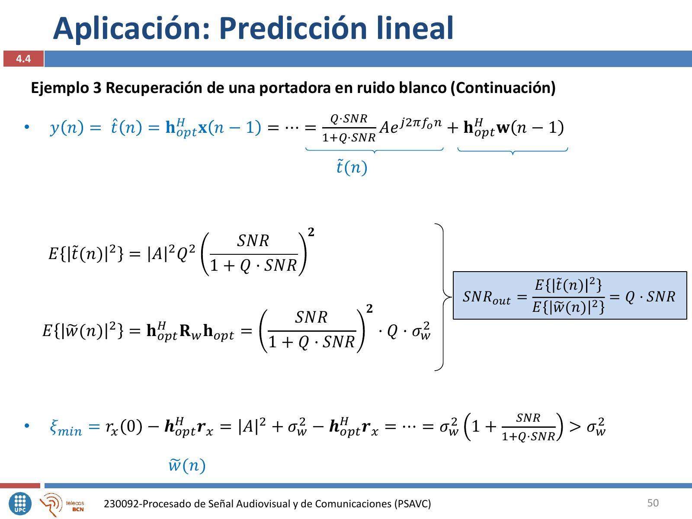

```text
       Aplicación: Predicción lineal
4.4

     Ejemplo 3 Recuperación de una portadora en ruido blanco (Continuación)
                                                              𝑄𝑄·𝑆𝑆𝑆𝑆𝑆𝑆
 •     𝑦𝑦 𝑛𝑛 = 𝑡𝑡̂ 𝑛𝑛 = 𝐡𝐡𝐻𝐻
                          𝑜𝑜𝑜𝑜𝑜𝑜 𝐱𝐱 𝑛𝑛 − 1 = ⋯ =                         𝐴𝐴𝑒𝑒 𝑗𝑗𝑗𝑗𝑗𝑓𝑓𝑜𝑜𝑛𝑛 + 𝐡𝐡𝐻𝐻
                                                                                              𝑜𝑜𝑜𝑜𝑜𝑜 𝐰𝐰 𝑛𝑛 − 1
                                                             1+𝑄𝑄·𝑆𝑆𝑆𝑆𝑆𝑆

                                                               ̃𝑡𝑡(𝑛𝑛)


                                                        𝟐𝟐
                                        𝑆𝑆𝑆𝑆𝑆𝑆
            ̃
       𝐸𝐸 𝑡𝑡(𝑛𝑛) 2 = 𝐴𝐴 2 𝑄𝑄 2
                                     1 + 𝑄𝑄 · 𝑆𝑆𝑆𝑆𝑆𝑆
                                                                                                               ̃
                                                                                                          𝐸𝐸 𝑡𝑡(𝑛𝑛) 2
                                                                                          𝑆𝑆𝑆𝑆𝑅𝑅𝑜𝑜𝑜𝑜𝑜𝑜 =              = 𝑄𝑄 · 𝑆𝑆𝑆𝑆𝑆𝑆
                                                                      𝟐𝟐                                 𝐸𝐸 �𝑤𝑤(𝑛𝑛) 2
                                              𝑆𝑆𝑆𝑆𝑆𝑆
         𝑤𝑤(𝑛𝑛) 2
      𝐸𝐸 �          = 𝐡𝐡𝐻𝐻    𝐑𝐑 𝐡𝐡
                        𝑜𝑜𝑜𝑜𝑜𝑜 𝑤𝑤 𝑜𝑜𝑜𝑜𝑜𝑜 =                                 · 𝑄𝑄 · 𝜎𝜎𝑤𝑤2
                                           1 + 𝑄𝑄 · 𝑆𝑆𝑆𝑆𝑆𝑆


                                                                                                    𝑆𝑆𝑆𝑆𝑆𝑆
 •     𝜉𝜉𝑚𝑚𝑚𝑚𝑚𝑚 = 𝑟𝑟𝑥𝑥 0 − 𝒉𝒉𝐻𝐻              2    2      𝐻𝐻                  2
                             𝑜𝑜𝑜𝑜𝑜𝑜 𝒓𝒓𝑥𝑥 = 𝐴𝐴 + 𝜎𝜎𝑤𝑤 − 𝒉𝒉𝑜𝑜𝑜𝑜𝑜𝑜 𝒓𝒓𝑥𝑥 = ⋯ = 𝜎𝜎𝑤𝑤 1 +                              > 𝜎𝜎𝑤𝑤2
                                                                                                  1+𝑄𝑄·𝑆𝑆𝑆𝑆𝑆𝑆

                            𝑤𝑤(𝑛𝑛)
                            �

                230092-Procesado de Señal Audiovisual y de Comunicaciones (PSAVC)                                            50
```

## Page 51

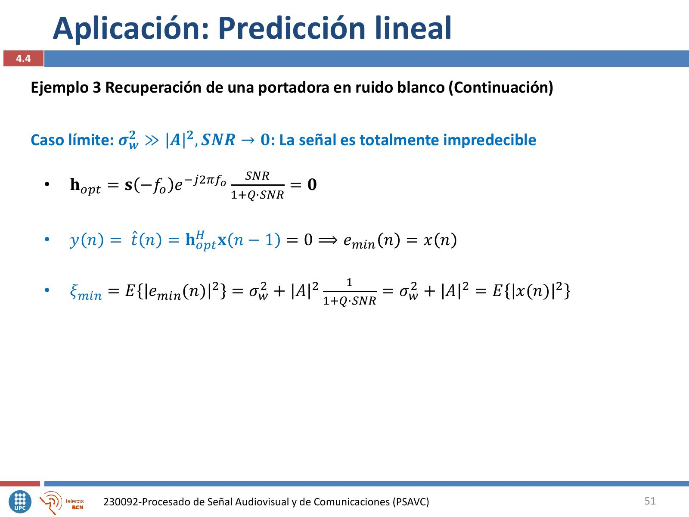

```text
          Aplicación: Predicción lineal
4.4

  Ejemplo 3 Recuperación de una portadora en ruido blanco (Continuación)


  Caso límite: 𝝈𝝈𝟐𝟐𝒘𝒘 ≫ 𝑨𝑨 𝟐𝟐 , 𝑺𝑺𝑺𝑺𝑺𝑺 → 𝟎𝟎: La señal es totalmente impredecible

                                                 𝑆𝑆𝑆𝑆𝑆𝑆
      •    𝐡𝐡𝑜𝑜𝑜𝑜𝑜𝑜 = 𝐬𝐬 −𝑓𝑓𝑜𝑜 𝑒𝑒 −𝑗𝑗𝑗𝑗𝑗𝑓𝑓𝑜𝑜               = 𝟎𝟎
                                               1+𝑄𝑄·𝑆𝑆𝑆𝑆𝑆𝑆


      •    𝑦𝑦 𝑛𝑛 = 𝑡𝑡̂ 𝑛𝑛 = 𝐡𝐡𝐻𝐻
                              𝑜𝑜𝑜𝑜𝑜𝑜 𝐱𝐱 𝑛𝑛 − 1 = 0 ⟹ 𝑒𝑒𝑚𝑚𝑚𝑚𝑚𝑚 𝑛𝑛 = 𝑥𝑥 𝑛𝑛

                                                                      1
      •    𝜉𝜉𝑚𝑚𝑚𝑚𝑚𝑚 = 𝐸𝐸 𝑒𝑒𝑚𝑚𝑚𝑚𝑚𝑚 (𝑛𝑛) 2 = 𝜎𝜎𝑤𝑤2 + 𝐴𝐴 2                       = 𝜎𝜎𝑤𝑤2 +   𝐴𝐴 2 = 𝐸𝐸 𝑥𝑥(𝑛𝑛) 2
                                                                  1+𝑄𝑄·𝑆𝑆𝑆𝑆𝑆𝑆


                  230092-Procesado de Señal Audiovisual y de Comunicaciones (PSAVC)                            51
```

## Page 52

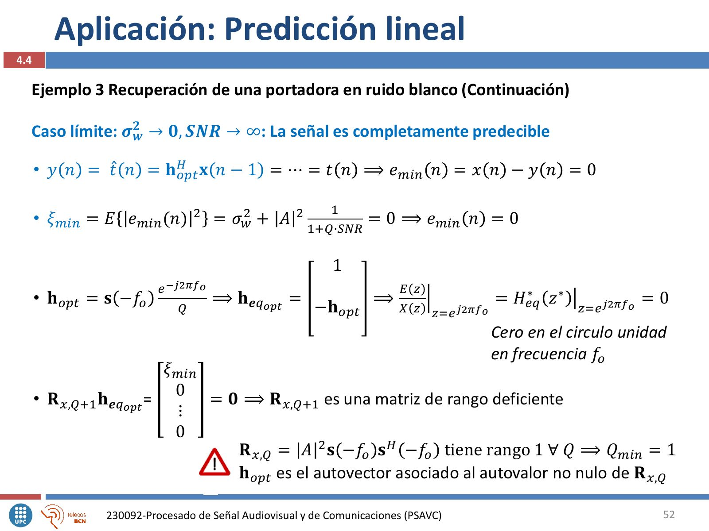

```text
          Aplicación: Predicción lineal
4.4

  Ejemplo 3 Recuperación de una portadora en ruido blanco (Continuación)

  Caso límite: 𝝈𝝈𝟐𝟐𝒘𝒘 → 𝟎𝟎, 𝑺𝑺𝑺𝑺𝑺𝑺 → ∞: La señal es completamente predecible

      • 𝑦𝑦 𝑛𝑛 = 𝑡𝑡̂ 𝑛𝑛 = 𝐡𝐡𝐻𝐻
                           𝑜𝑜𝑜𝑜𝑜𝑜 𝐱𝐱 𝑛𝑛 − 1 = ⋯ = 𝑡𝑡 𝑛𝑛 ⟹ 𝑒𝑒𝑚𝑚𝑚𝑚𝑚𝑚 𝑛𝑛 = 𝑥𝑥 𝑛𝑛 − 𝑦𝑦 𝑛𝑛 = 0

                                                                1
      • 𝜉𝜉𝑚𝑚𝑚𝑚𝑚𝑚 = 𝐸𝐸 𝑒𝑒𝑚𝑚𝑚𝑚𝑚𝑚 (𝑛𝑛) 2 = 𝜎𝜎𝑤𝑤2 + 𝐴𝐴 2 1+𝑄𝑄·𝑆𝑆𝑆𝑆𝑆𝑆 = 0 ⟹ 𝑒𝑒𝑚𝑚𝑚𝑚𝑚𝑚 𝑛𝑛 = 0

                                                                1
                            𝑒𝑒 −𝑗𝑗𝑗𝑗𝑗𝑓𝑓𝑜𝑜                                    𝐸𝐸 𝑧𝑧                      ∗      ∗ �
      • 𝐡𝐡𝑜𝑜𝑜𝑜𝑜𝑜 = 𝐬𝐬 −𝑓𝑓𝑜𝑜               ⟹ 𝐡𝐡𝒆𝒆𝑞𝑞𝑜𝑜𝑜𝑜𝑜𝑜 =               ⟹         �               = 𝐻𝐻𝑒𝑒𝑒𝑒 𝑧𝑧                    =0
                                  𝑄𝑄                         −𝐡𝐡𝑜𝑜𝑜𝑜𝑜𝑜       𝑋𝑋 𝑧𝑧 𝑧𝑧=𝑒𝑒 𝑗𝑗𝑗𝑗𝑗𝑓𝑓𝑜𝑜                𝑧𝑧=𝑒𝑒 𝑗𝑗𝑗𝑗𝑗𝑓𝑓𝑜𝑜
                                                                                               Cero en el circulo unidad
                                                                                               en frecuencia 𝑓𝑓𝑜𝑜
                                  𝜉𝜉𝑚𝑚𝑚𝑚𝑚𝑚
                                     0
      • 𝐑𝐑 𝑥𝑥,𝑄𝑄+1 𝐡𝐡𝒆𝒆𝑞𝑞𝑜𝑜𝑜𝑜𝑜𝑜 =          = 𝟎𝟎 ⟹ 𝐑𝐑 𝑥𝑥,𝑄𝑄+1 es una matriz de rango deficiente
                                     ⋮
                                     0
                                               𝐑𝐑 𝑥𝑥,𝑄𝑄 = 𝐴𝐴 2 𝐬𝐬 −𝑓𝑓𝑜𝑜 𝐬𝐬 𝐻𝐻 −𝑓𝑓𝑜𝑜 tiene rango 1 ∀ 𝑄𝑄 ⟹ 𝑄𝑄𝑚𝑚𝑚𝑚𝑚𝑚 = 1
                                               𝐡𝐡𝑜𝑜𝑜𝑜𝑜𝑜 es el autovector asociado al autovalor no nulo de 𝐑𝐑 𝑥𝑥,𝑄𝑄

                    230092-Procesado de Señal Audiovisual y de Comunicaciones (PSAVC)                                             52
```

## Page 53

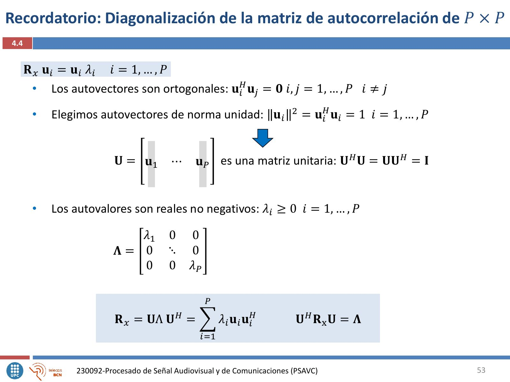

```text
Recordatorio: Diagonalización de la matriz de autocorrelación de 𝑃𝑃 × 𝑃𝑃
4.4


      𝐑𝐑 𝑥𝑥 𝐮𝐮𝑖𝑖 = 𝐮𝐮𝑖𝑖 𝜆𝜆𝑖𝑖   𝑖𝑖 = 1, … , 𝑃𝑃
        •     Los autovectores son ortogonales: 𝐮𝐮𝐻𝐻
                                                  𝑖𝑖 𝐮𝐮𝑗𝑗 = 𝟎𝟎 𝑖𝑖, 𝑗𝑗 = 1, … , 𝑃𝑃 𝑖𝑖 ≠ 𝑗𝑗

        •     Elegimos autovectores de norma unidad: 𝐮𝐮𝑖𝑖 2 = 𝐮𝐮𝐻𝐻
                                                                𝑖𝑖 𝐮𝐮𝑖𝑖 = 1 𝑖𝑖 = 1, … , 𝑃𝑃


                                𝐔𝐔 = 𝐮𝐮1        ⋯     𝐮𝐮𝑃𝑃 es una matriz unitaria: 𝐔𝐔 𝐻𝐻 𝐔𝐔 = 𝐔𝐔𝐔𝐔𝐻𝐻 = 𝐈𝐈


        •     Los autovalores son reales no negativos: 𝜆𝜆𝑖𝑖 ≥ 0 𝑖𝑖 = 1, … , 𝑃𝑃

                                    𝜆𝜆1         0    0
                               𝚲𝚲 = 0           ⋱    0
                                     0          0   𝜆𝜆𝑃𝑃

                                                           𝑃𝑃

                                𝐑𝐑 𝑥𝑥 = 𝐔𝐔Λ 𝐔𝐔𝐻𝐻 = � 𝜆𝜆𝑖𝑖 𝐮𝐮𝑖𝑖 𝐮𝐮𝐻𝐻
                                                                 𝑖𝑖              𝐔𝐔 𝐻𝐻 𝐑𝐑 x 𝐔𝐔 = 𝚲𝚲
                                                       𝑖𝑖=1


                      230092-Procesado de Señal Audiovisual y de Comunicaciones (PSAVC)                     53
```

## Page 54

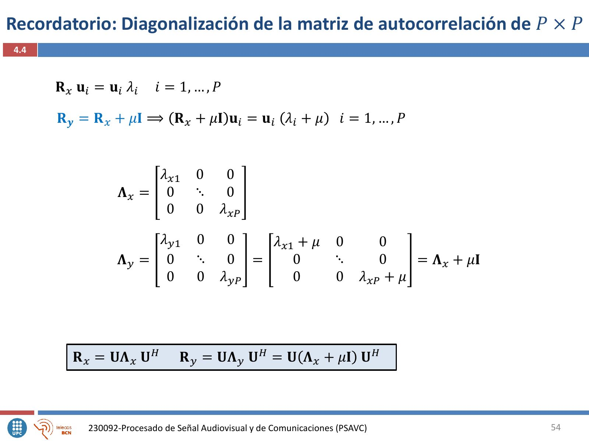

```text
Recordatorio: Diagonalización de la matriz de autocorrelación de 𝑃𝑃 × 𝑃𝑃
4.4


      𝐑𝐑 𝑥𝑥 𝐮𝐮𝑖𝑖 = 𝐮𝐮𝑖𝑖 𝜆𝜆𝑖𝑖   𝑖𝑖 = 1, … , 𝑃𝑃

      𝐑𝐑 𝒚𝒚 = 𝐑𝐑 𝑥𝑥 + 𝜇𝜇𝐈𝐈 ⟹ 𝐑𝐑 𝑥𝑥 + 𝜇𝜇𝐈𝐈 𝐮𝐮𝑖𝑖 = 𝐮𝐮𝑖𝑖 𝜆𝜆𝑖𝑖 + 𝜇𝜇         𝑖𝑖 = 1, … , 𝑃𝑃


                             𝜆𝜆𝑥𝑥1     0      0
                      𝚲𝚲𝑥𝑥 = 0         ⋱      0
                               0       0    𝜆𝜆𝑥𝑥𝑃𝑃

                             𝜆𝜆𝑦𝑦1     0   0    𝜆𝜆𝑥𝑥1 + 𝜇𝜇             0           0
                      𝚲𝚲𝑦𝑦 = 0         ⋱ 0 =         0                 ⋱           0     = 𝚲𝚲𝑥𝑥 + 𝜇𝜇𝐈𝐈
                               0       0 𝜆𝜆𝑦𝑦𝑃𝑃      0                 0     𝜆𝜆𝑥𝑥𝑃𝑃 + 𝜇𝜇


          𝐑𝐑 𝑥𝑥 = 𝐔𝐔𝚲𝚲𝑥𝑥 𝐔𝐔𝐻𝐻       𝐑𝐑 𝑦𝑦 = 𝐔𝐔𝚲𝚲𝑦𝑦 𝐔𝐔𝐻𝐻 = 𝐔𝐔 𝚲𝚲𝑥𝑥 + 𝜇𝜇𝐈𝐈 𝐔𝐔𝐻𝐻


              230092-Procesado de Señal Audiovisual y de Comunicaciones (PSAVC)                          54
```

## Page 55

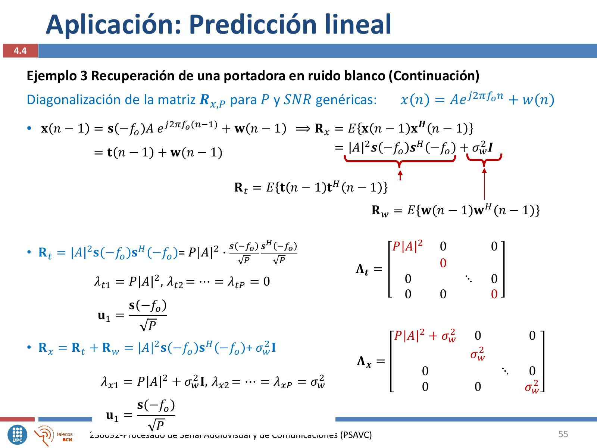

```text
      Aplicación: Predicción lineal
4.4

  Ejemplo 3 Recuperación de una portadora en ruido blanco (Continuación)
  Diagonalización de la matriz 𝑹𝑹𝑥𝑥,𝑃𝑃 para 𝑃𝑃 y 𝑆𝑆𝑆𝑆𝑆𝑆 genéricas:                               𝑥𝑥 𝑛𝑛 = 𝐴𝐴𝑒𝑒 𝑗𝑗𝑗𝑗𝑗𝑓𝑓𝑜𝑜 𝑛𝑛 + 𝑤𝑤 𝑛𝑛
  • 𝐱𝐱 𝑛𝑛 − 1 = 𝐬𝐬 −𝑓𝑓𝑜𝑜 𝐴𝐴 𝑒𝑒 𝑗𝑗𝑗𝑗𝑗𝑓𝑓𝑜𝑜(𝑛𝑛−1) + 𝐰𝐰 𝑛𝑛 − 1 ⟹ 𝐑𝐑 𝑥𝑥 = 𝐸𝐸 𝐱𝐱 𝑛𝑛 − 1 𝐱𝐱 𝑯𝑯 𝑛𝑛 − 1
                   = 𝐭𝐭 𝑛𝑛 − 1 + 𝐰𝐰(𝑛𝑛 − 1)                                       = 𝐴𝐴 2 𝒔𝒔 −𝑓𝑓𝑜𝑜 𝒔𝒔𝐻𝐻 −𝑓𝑓𝑜𝑜 + 𝜎𝜎𝑤𝑤2 𝑰𝑰


                                                           𝐑𝐑 𝑡𝑡 = 𝐸𝐸 𝐭𝐭 𝑛𝑛 − 1 𝐭𝐭 𝐻𝐻 𝑛𝑛 − 1
                                                                                          𝐑𝐑 𝑤𝑤 = 𝐸𝐸 𝐰𝐰 𝑛𝑛 − 1 𝐰𝐰 𝐻𝐻 𝑛𝑛 − 1

               2
  • 𝐑𝐑 𝑡𝑡 = 𝐴𝐴 𝐬𝐬 −𝑓𝑓𝑜𝑜 𝐬𝐬   𝐻𝐻
                                  −𝑓𝑓𝑜𝑜 = 𝑃𝑃 𝐴𝐴    2
                                                       ·
                                                         𝒔𝒔 −𝑓𝑓𝑜𝑜 𝒔𝒔𝐻𝐻 −𝑓𝑓𝑜𝑜                    𝑃𝑃 𝐴𝐴 2   0               0
                                                             𝑃𝑃        𝑃𝑃                                 0
                                                                                       𝚲𝚲𝒕𝒕 =
                                   2
                   𝜆𝜆𝑡𝑡𝑡 = 𝑃𝑃 𝐴𝐴 , 𝜆𝜆𝑡𝑡2 = ⋯ = 𝜆𝜆𝑡𝑡𝑡𝑡 = 0                                         0               ⋱       0
                                                                                                  0       0               0
                           𝐬𝐬 −𝑓𝑓𝑜𝑜
                   𝐮𝐮1 =
                                  𝑃𝑃
                                                                                                𝑃𝑃 𝐴𝐴 2 + 𝜎𝜎𝑤𝑤2    0               0
                                   2          𝐻𝐻
  • 𝐑𝐑 𝑥𝑥 = 𝐑𝐑 𝑡𝑡 + 𝐑𝐑 𝑤𝑤 = 𝐴𝐴 𝐬𝐬 −𝑓𝑓𝑜𝑜 𝐬𝐬             −𝑓𝑓𝑜𝑜 + 𝜎𝜎𝑤𝑤2 𝐈𝐈                                           𝜎𝜎𝑤𝑤2
                                                                                       𝚲𝚲𝒙𝒙 =
                                                                                                      0                       ⋱    0
                    𝜆𝜆𝑥𝑥𝑥 = 𝑃𝑃 𝐴𝐴 2 + 𝜎𝜎𝑤𝑤2 𝐈𝐈, 𝜆𝜆𝑥𝑥2 = ⋯ = 𝜆𝜆𝑥𝑥𝑥𝑥 = 𝜎𝜎𝑤𝑤2                            0               0           𝜎𝜎𝑤𝑤2
                             𝐬𝐬 −𝑓𝑓𝑜𝑜
                     𝐮𝐮1 =
                                   𝑃𝑃
                230092-Procesado de Señal Audiovisual y de Comunicaciones (PSAVC)                                                         55
```

## Page 56

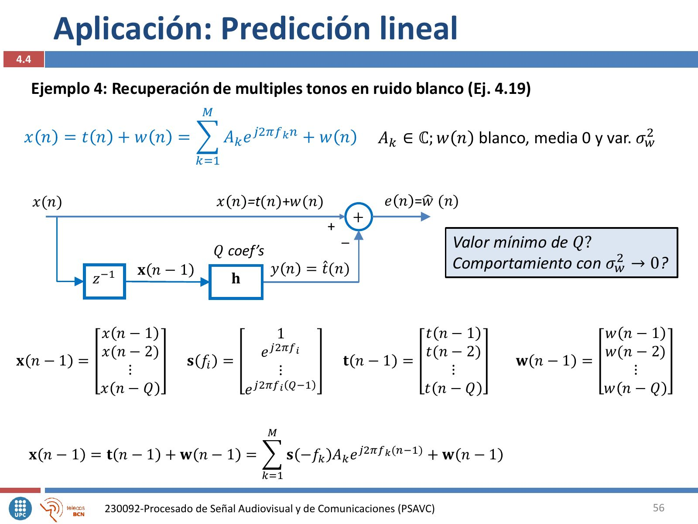

```text
          Aplicación: Predicción lineal
4.4

  Ejemplo 4: Recuperación de multiples tonos en ruido blanco (Ej. 4.19)
                                    𝑀𝑀

 𝑥𝑥 𝑛𝑛 = 𝑡𝑡 𝑛𝑛 + 𝑤𝑤 𝑛𝑛 = � 𝐴𝐴𝑘𝑘 𝑒𝑒 𝑗𝑗𝑗𝑗𝑗𝑓𝑓𝑘𝑘 𝑛𝑛 + 𝑤𝑤 𝑛𝑛                          𝐴𝐴𝑘𝑘 ∈ ℂ; 𝑤𝑤 𝑛𝑛 blanco, media 0 y var. 𝜎𝜎𝑤𝑤2
                                   𝑘𝑘=1


      𝑥𝑥(𝑛𝑛)                             𝑥𝑥 𝑛𝑛 =t(𝑛𝑛)+𝑤𝑤(𝑛𝑛)                      𝑒𝑒 𝑛𝑛 =𝑤𝑤
                                                                                         � (𝑛𝑛)
                                                                             +
                                                                     +
                                      𝑄𝑄 coef’s                                              Valor mínimo de 𝑄𝑄?
                                                                         _
                       𝐱𝐱 𝑛𝑛 − 1                         𝑦𝑦 𝑛𝑛 = ̂𝑡𝑡(𝑛𝑛)                     Comportamiento con 𝜎𝜎𝑤𝑤2 → 0?
               𝑧𝑧 −1                       𝐡𝐡


            𝑥𝑥 𝑛𝑛 − 1                                      1                         𝑡𝑡 𝑛𝑛 − 1                    𝑤𝑤 𝑛𝑛 − 1
            𝑥𝑥(𝑛𝑛 − 2)                                   𝑗𝑗𝑗𝑗𝑗𝑓𝑓𝑖𝑖                   𝑡𝑡(𝑛𝑛 − 2)                   𝑤𝑤(𝑛𝑛 − 2)
                                                    𝑒𝑒
𝐱𝐱 𝑛𝑛 − 1 =                      𝐬𝐬 𝑓𝑓𝑖𝑖 =                               𝐭𝐭 𝑛𝑛 − 1 =                  𝐰𝐰 𝑛𝑛 − 1 =
                  ⋮                                        ⋮                               ⋮                            ⋮
            𝑥𝑥 𝑛𝑛 − 𝑄𝑄                          𝑒𝑒 𝑗𝑗𝑗𝑗𝑗𝑓𝑓𝑖𝑖 𝑄𝑄−1                    𝑡𝑡 𝑛𝑛 − 𝑄𝑄                   𝑤𝑤 𝑛𝑛 − 𝑄𝑄

                                                     𝑀𝑀

  𝐱𝐱 𝑛𝑛 − 1 = 𝐭𝐭 𝑛𝑛 − 1 + 𝐰𝐰 𝑛𝑛 − 1 = � 𝐬𝐬 −𝑓𝑓𝑘𝑘 𝐴𝐴𝑘𝑘 𝑒𝑒 𝑗𝑗𝑗𝑗𝑗𝑓𝑓𝑘𝑘 (𝑛𝑛−1) + 𝐰𝐰 𝑛𝑛 − 1
                                                    𝑘𝑘=1

                 230092-Procesado de Señal Audiovisual y de Comunicaciones (PSAVC)                                          56
```

## Page 57

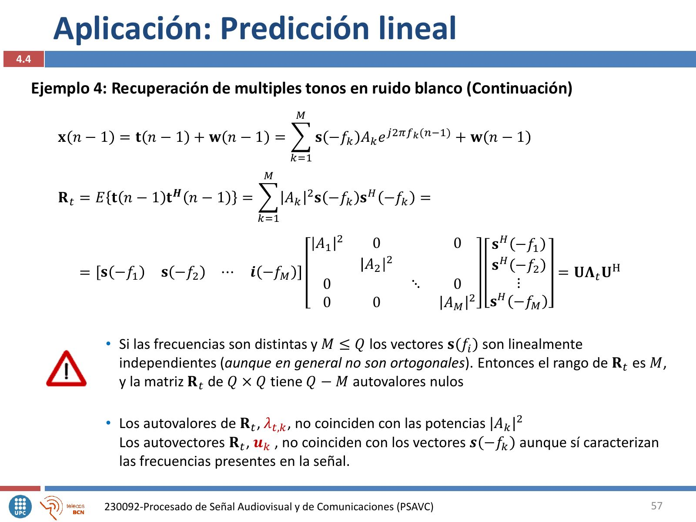

```text
      Aplicación: Predicción lineal
4.4

  Ejemplo 4: Recuperación de multiples tonos en ruido blanco (Continuación)
                                                       𝑀𝑀

      𝐱𝐱 𝑛𝑛 − 1 = 𝐭𝐭 𝑛𝑛 − 1 + 𝐰𝐰 𝑛𝑛 − 1 = � 𝐬𝐬 −𝑓𝑓𝑘𝑘 𝐴𝐴𝑘𝑘 𝑒𝑒 𝑗𝑗𝑗𝜋𝜋𝑓𝑓𝑘𝑘 (𝑛𝑛−1) + 𝐰𝐰 𝑛𝑛 − 1
                                                      𝑘𝑘=1
                                              𝑀𝑀

      𝐑𝐑 𝑡𝑡 = 𝐸𝐸 𝐭𝐭 𝑛𝑛 − 1 𝐭𝐭 𝑯𝑯 𝑛𝑛 − 1   = � 𝐴𝐴𝑘𝑘 2 𝐬𝐬 −𝑓𝑓𝑘𝑘 𝐬𝐬𝐻𝐻 −𝑓𝑓𝑘𝑘 =
                                             𝑘𝑘=1

                                                             𝐴𝐴1 2     0            0        𝐬𝐬𝐻𝐻 −𝑓𝑓1
                                                                     𝐴𝐴2 2                   𝐬𝐬𝐻𝐻 −𝑓𝑓2
          = 𝐬𝐬 −𝑓𝑓1       𝐬𝐬 −𝑓𝑓2     ⋯    𝒊𝒊 −𝑓𝑓𝑀𝑀                                                      = 𝐔𝐔𝚲𝚲𝑡𝑡 𝐔𝐔 H
                                                              0              ⋱       0            ⋮
                                                                                               𝐻𝐻
                                                              0       0            𝐴𝐴𝑀𝑀 2   𝐬𝐬 −𝑓𝑓𝑀𝑀

               • Si las frecuencias son distintas y 𝑀𝑀 ≤ 𝑄𝑄 los vectores 𝐬𝐬 𝑓𝑓𝑖𝑖 son linealmente
                 independientes (aunque en general no son ortogonales). Entonces el rango de 𝐑𝐑 𝑡𝑡 es 𝑀𝑀,
                 y la matriz 𝐑𝐑 𝑡𝑡 de 𝑄𝑄 × 𝑄𝑄 tiene 𝑄𝑄 − 𝑀𝑀 autovalores nulos

               • Los autovalores de 𝐑𝐑 𝑡𝑡 , 𝜆𝜆𝑡𝑡,𝑘𝑘 , no coinciden con las potencias 𝐴𝐴𝑘𝑘 2
                 Los autovectores 𝐑𝐑 𝑡𝑡 , 𝒖𝒖𝑘𝑘 , no coinciden con los vectores 𝒔𝒔 −𝑓𝑓𝑘𝑘 aunque sí caracterizan
                 las frecuencias presentes en la señal.

               230092-Procesado de Señal Audiovisual y de Comunicaciones (PSAVC)                                         57
```

## Page 58

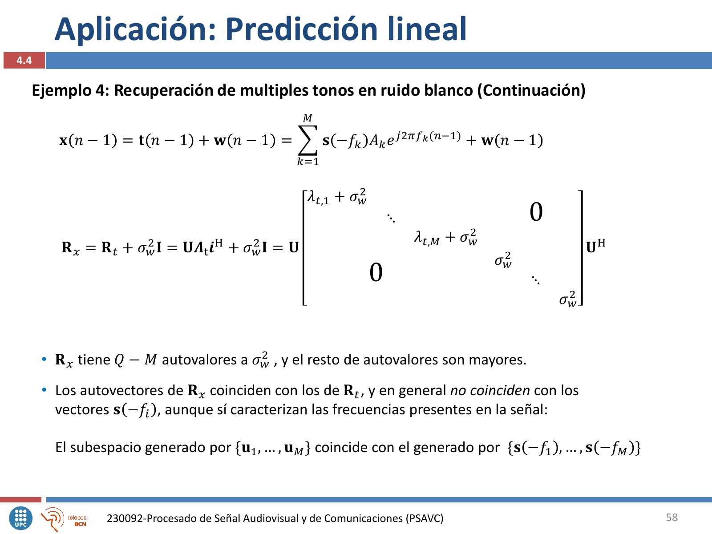

```text
        Aplicación: Predicción lineal
4.4

  Ejemplo 4: Recuperación de multiples tonos en ruido blanco (Continuación)
                                                                𝑀𝑀

         𝐱𝐱 𝑛𝑛 − 1 = 𝐭𝐭 𝑛𝑛 − 1 + 𝐰𝐰 𝑛𝑛 − 1 = � 𝐬𝐬 −𝑓𝑓𝑘𝑘 𝐴𝐴𝑘𝑘 𝑒𝑒 𝑗𝑗𝑗𝜋𝜋𝑓𝑓𝑘𝑘 (𝑛𝑛−1) + 𝐰𝐰 𝑛𝑛 − 1
                                                            𝑘𝑘=1


                                                                𝜆𝜆𝑡𝑡,1 + 𝜎𝜎𝑤𝑤2
                                                                                     ⋱                             0
                                                                                         𝜆𝜆𝑡𝑡,𝑀𝑀 + 𝜎𝜎𝑤𝑤2
         𝐑𝐑 𝑥𝑥 = 𝐑𝐑 𝑡𝑡 + 𝜎𝜎𝑤𝑤2 𝐈𝐈 = 𝐔𝐔𝜦𝜦t 𝒊𝒊H + 𝜎𝜎𝑤𝑤2 𝐈𝐈 = 𝐔𝐔                                                                  𝐔𝐔 H
                                                                                                           𝜎𝜎𝑤𝑤2
                                                                                 0                                 ⋱
                                                                                                                       𝜎𝜎𝑤𝑤2


      • 𝐑𝐑 𝑥𝑥 tiene 𝑄𝑄 − 𝑀𝑀 autovalores a 𝜎𝜎𝑤𝑤2 , y el resto de autovalores son mayores.
      • Los autovectores de 𝐑𝐑 𝑥𝑥 coinciden con los de 𝐑𝐑 𝑡𝑡 , y en general no coinciden con los
        vectores 𝐬𝐬 −𝑓𝑓𝑖𝑖 , aunque sí caracterizan las frecuencias presentes en la señal:

        El subespacio generado por {𝐮𝐮1 , … , 𝐮𝐮𝑀𝑀 } coincide con el generado por {𝐬𝐬 −𝑓𝑓1 , … , 𝐬𝐬 −𝑓𝑓𝑀𝑀 }


                  230092-Procesado de Señal Audiovisual y de Comunicaciones (PSAVC)                                                   58
```

## Page 59

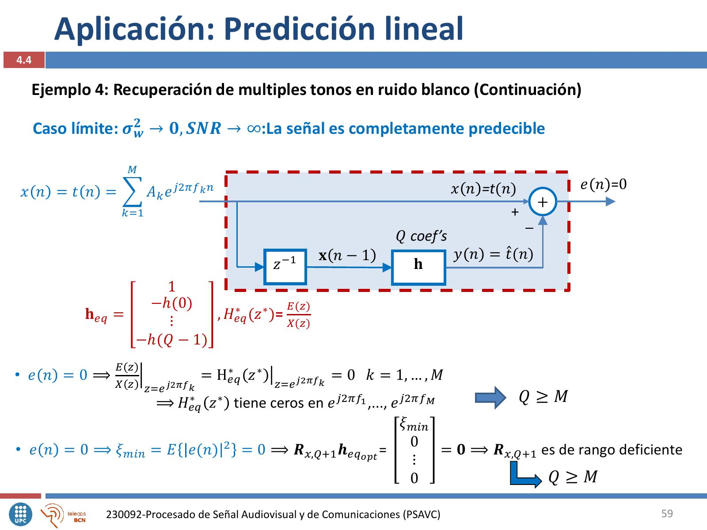

```text
         Aplicación: Predicción lineal
4.4

  Ejemplo 4: Recuperación de multiples tonos en ruido blanco (Continuación)

      Caso límite: 𝝈𝝈𝟐𝟐𝒘𝒘 → 𝟎𝟎, 𝑺𝑺𝑺𝑺𝑺𝑺 → ∞:La señal es completamente predecible

                     𝑀𝑀

𝑥𝑥 𝑛𝑛 = 𝑡𝑡 𝑛𝑛 = � 𝐴𝐴𝑘𝑘 𝑒𝑒 𝑗𝑗𝑗𝑗𝑗𝑓𝑓𝑘𝑘 𝑛𝑛                                                        𝑥𝑥 𝑛𝑛 =t(𝑛𝑛)           𝑒𝑒 𝑛𝑛 =0
                                                                                                                 +
                    𝑘𝑘=1                                                                                 +
                                                                                𝑄𝑄 coef’s                    _
                                                               𝐱𝐱 𝑛𝑛 − 1                                ̂
                                                                                              𝑦𝑦 𝑛𝑛 = 𝑡𝑡(𝑛𝑛)
                                                     𝑧𝑧 −1                          𝐡𝐡
                          1
                       −ℎ(0)          ∗       ∗    𝐸𝐸(𝑧𝑧)
             𝐡𝐡𝑒𝑒𝑒𝑒 =     ⋮      , 𝐻𝐻𝑒𝑒𝑒𝑒 (𝑧𝑧   )=
                                                   𝑋𝑋(𝑧𝑧)
                      −ℎ(𝑄𝑄 − 1)
                  𝐸𝐸 𝑧𝑧
• 𝑒𝑒 𝑛𝑛 = 0 ⟹           �                    ∗
                                        = H𝑒𝑒𝑒𝑒  𝑧𝑧 ∗ �𝑧𝑧=𝑒𝑒 𝑗𝑗𝑗𝑗𝑗𝑓𝑓𝑘𝑘 = 0 𝑘𝑘 = 1, … , 𝑀𝑀
                  𝑋𝑋 𝑧𝑧 𝑧𝑧=𝑒𝑒 𝑗𝑗𝑗𝑗𝑗𝑓𝑓𝑘𝑘
                           ⟹ 𝐻𝐻𝑒𝑒𝑒𝑒  ∗
                                         𝑧𝑧 ∗ tiene ceros en 𝑒𝑒 𝑗𝑗𝑗𝑗𝑗𝑓𝑓1 ,..., 𝑒𝑒 𝑗𝑗𝑗𝑗𝑗𝑓𝑓𝑀𝑀              𝑄𝑄 ≥ 𝑀𝑀
                                                                             𝜉𝜉𝑚𝑚𝑚𝑚𝑚𝑚
                                                                                0
• 𝑒𝑒 𝑛𝑛 = 0 ⟹ 𝜉𝜉𝑚𝑚𝑚𝑚𝑚𝑚 = 𝐸𝐸 𝑒𝑒(𝑛𝑛) 2          = 0 ⟹ 𝑹𝑹𝑥𝑥,𝑄𝑄+1 𝒉𝒉𝑒𝑒𝑞𝑞𝑜𝑜𝑜𝑜𝑜𝑜 =          = 𝟎𝟎 ⟹ 𝑹𝑹𝑥𝑥,𝑄𝑄+1 es de rango deficiente
                                                                                ⋮
                                                                                0                       𝑄𝑄 ≥ 𝑀𝑀

                 230092-Procesado de Señal Audiovisual y de Comunicaciones (PSAVC)                                              59
```

## Page 60

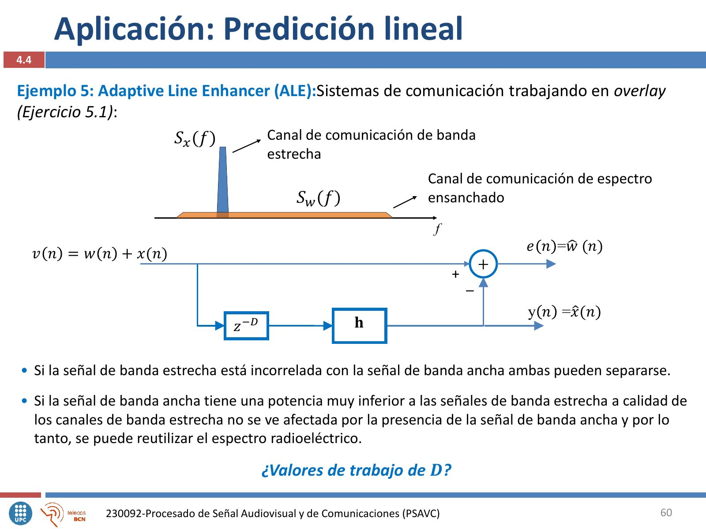

```text
         Aplicación: Predicción lineal
4.4

Ejemplo 5: Adaptive Line Enhancer (ALE):Sistemas de comunicación trabajando en overlay
(Ejercicio 5.1):
                     𝑆𝑆𝑥𝑥 (𝑓𝑓)  Canal de comunicación de banda
                                                    estrecha
                                                                               Canal de comunicación de espectro
                                                        𝑆𝑆𝑤𝑤 (𝑓𝑓)              ensanchado
                                                                                 f
      𝑣𝑣 𝑛𝑛 = 𝑤𝑤 𝑛𝑛 + 𝑥𝑥(𝑛𝑛)                                                                     𝑒𝑒 𝑛𝑛 =𝑤𝑤
                                                                                                        � (𝑛𝑛)
                                                                                             +
                                                                                     +
                                                                                         _
                                                                                                 y 𝑛𝑛 = �
                                                                                                       𝑥𝑥(𝑛𝑛)
                                         𝑧𝑧   −𝐷𝐷                   𝐡𝐡


• Si la señal de banda estrecha está incorrelada con la señal de banda ancha ambas pueden separarse.
• Si la señal de banda ancha tiene una potencia muy inferior a las señales de banda estrecha a calidad de
  los canales de banda estrecha no se ve afectada por la presencia de la señal de banda ancha y por lo
  tanto, se puede reutilizar el espectro radioeléctrico.

                                                    ¿Valores de trabajo de 𝑫𝑫?

                 230092-Procesado de Señal Audiovisual y de Comunicaciones (PSAVC)                                 60
```

## Page 61

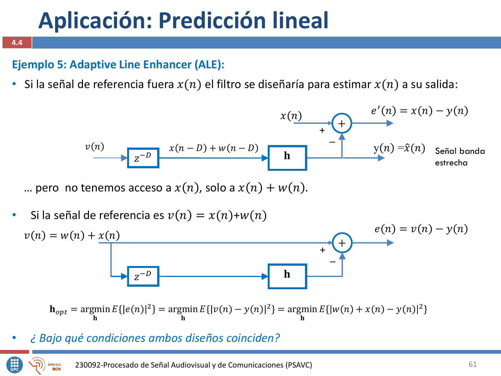

```text
         Aplicación: Predicción lineal
4.4

Ejemplo 5: Adaptive Line Enhancer (ALE):
• Si la señal de referencia fuera 𝑥𝑥(𝑛𝑛) el filtro se diseñaría para estimar 𝑥𝑥(𝑛𝑛) a su salida:

                                                                              𝑥𝑥 𝑛𝑛                    𝑒𝑒 ′ 𝑛𝑛 = 𝑥𝑥 𝑛𝑛 − 𝑦𝑦 𝑛𝑛
                                                                                                   +
                                                                                           +
                     𝑣𝑣 𝑛𝑛                      𝑥𝑥 𝑛𝑛 − 𝐷𝐷 + 𝑤𝑤 𝑛𝑛 − 𝐷𝐷                        _       y 𝑛𝑛 = �
                                                                                                             𝑥𝑥(𝑛𝑛) Señal banda
                                   𝑧𝑧   −𝐷𝐷                                    𝐡𝐡
                                                                                                                      estrecha

      … pero no tenemos acceso a 𝑥𝑥 𝑛𝑛 , solo a 𝑥𝑥 𝑛𝑛 + 𝑤𝑤 𝑛𝑛 .

•      Si la señal de referencia es 𝑣𝑣 𝑛𝑛 = 𝑥𝑥(𝑛𝑛)+𝑤𝑤(𝑛𝑛)
                                                                                                       𝑒𝑒 𝑛𝑛 = 𝑣𝑣 𝑛𝑛 − 𝑦𝑦 𝑛𝑛
      𝑣𝑣 𝑛𝑛 = 𝑤𝑤 𝑛𝑛 + 𝑥𝑥 𝑛𝑛
                                                                                                   +
                                                                                           +
                                                                                               _
                                   𝑧𝑧 −𝐷𝐷                                      𝐡𝐡

                                         2                                2                                       2
           𝐡𝐡𝑜𝑜𝑜𝑜𝑜𝑜 = argmin 𝐸𝐸 𝑒𝑒 𝑛𝑛         = argmin 𝐸𝐸 𝑣𝑣 𝑛𝑛 − 𝑦𝑦 𝑛𝑛       = argmin 𝐸𝐸 𝑤𝑤 𝑛𝑛 + 𝑥𝑥 𝑛𝑛 − 𝑦𝑦 𝑛𝑛
                       𝐡𝐡                          𝐡𝐡                                 𝐡𝐡


•      ¿ Bajo qué condiciones ambos diseños coinciden?

                  230092-Procesado de Señal Audiovisual y de Comunicaciones (PSAVC)                                              61
```

## Page 62

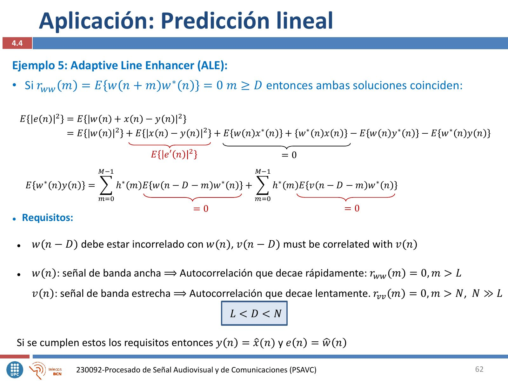

```text
            Aplicación: Predicción lineal
4.4

Ejemplo 5: Adaptive Line Enhancer (ALE):
• Si 𝑟𝑟𝑤𝑤𝑤𝑤 𝑚𝑚 = 𝐸𝐸 𝑤𝑤 𝑛𝑛 + 𝑚𝑚 𝑤𝑤 ∗ 𝑛𝑛                     = 0 𝑚𝑚 ≥ 𝐷𝐷 entonces ambas soluciones coinciden:

                 2
    𝐸𝐸 𝑒𝑒 𝑛𝑛         = 𝐸𝐸 𝑤𝑤 𝑛𝑛 + 𝑥𝑥 𝑛𝑛 − 𝑦𝑦 𝑛𝑛 2
                     = 𝐸𝐸 𝑤𝑤 𝑛𝑛 2 + 𝐸𝐸 𝑥𝑥 𝑛𝑛 − 𝑦𝑦 𝑛𝑛       2
                                                               + 𝐸𝐸 𝑤𝑤 𝑛𝑛 𝑥𝑥 ∗ 𝑛𝑛   + 𝑤𝑤 ∗ 𝑛𝑛 𝑥𝑥 𝑛𝑛   − 𝐸𝐸 𝑤𝑤 𝑛𝑛 𝑦𝑦 ∗ 𝑛𝑛   − 𝐸𝐸 𝑤𝑤 ∗ 𝑛𝑛 𝑦𝑦 𝑛𝑛
                                                       2
                                           𝐸𝐸 𝑒𝑒′ 𝑛𝑛                                =0
                             𝑀𝑀−1                                          𝑀𝑀−1

        𝐸𝐸 𝑤𝑤 ∗ 𝑛𝑛 𝑦𝑦 𝑛𝑛   = � ℎ∗ 𝑚𝑚 𝐸𝐸 𝑤𝑤 𝑛𝑛 − 𝐷𝐷 − 𝑚𝑚 𝑤𝑤 ∗ 𝑛𝑛         + � ℎ∗ 𝑚𝑚 𝐸𝐸 𝑣𝑣 𝑛𝑛 − 𝐷𝐷 − 𝑚𝑚 𝑤𝑤 ∗ 𝑛𝑛
                             𝑚𝑚=0                                          𝑚𝑚=0
                                                       =0                                             =0
●       Requisitos:

    ●     𝑤𝑤 𝑛𝑛 − 𝐷𝐷 debe estar incorrelado con 𝑤𝑤 𝑛𝑛 , 𝑣𝑣 𝑛𝑛 − 𝐷𝐷 must be correlated with 𝑣𝑣 𝑛𝑛

    ●     𝑤𝑤 𝑛𝑛 : señal de banda ancha ⟹ Autocorrelación que decae rápidamente: 𝑟𝑟𝑤𝑤𝑤𝑤 𝑚𝑚 = 0, 𝑚𝑚 > 𝐿𝐿
          𝑣𝑣 𝑛𝑛 : señal de banda estrecha ⟹ Autocorrelación que decae lentamente. 𝑟𝑟𝑣𝑣𝑣𝑣 𝑚𝑚 = 0, 𝑚𝑚 > 𝑁𝑁, 𝑁𝑁 ≫ 𝐿𝐿
                                                                   𝐿𝐿 < 𝐷𝐷 < 𝑁𝑁

                                                        𝑥𝑥(𝑛𝑛) y 𝑒𝑒 𝑛𝑛 = 𝑤𝑤
    Si se cumplen estos los requisitos entonces 𝑦𝑦 𝑛𝑛 = �                � 𝑛𝑛

                       230092-Procesado de Señal Audiovisual y de Comunicaciones (PSAVC)                                                  62
```

## Page 63

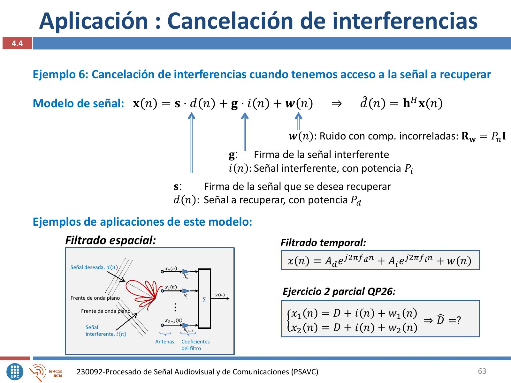

```text
       Aplicación : Cancelación de interferencias
4.4


      Ejemplo 6: Cancelación de interferencias cuando tenemos acceso a la señal a recuperar

      Modelo de señal: 𝐱𝐱 𝑛𝑛 = 𝐬𝐬 · 𝑑𝑑 𝑛𝑛 + 𝐠𝐠 · 𝑖𝑖 𝑛𝑛 + 𝒘𝒘 𝑛𝑛                                             ⇒        𝑑𝑑̂ 𝑛𝑛 = 𝐡𝐡𝐻𝐻 𝐱𝐱 𝑛𝑛

                                                                                             𝒘𝒘 𝑛𝑛 : Ruido con comp. incorreladas: 𝐑𝐑 𝐰𝐰 = 𝑃𝑃𝑛𝑛 𝐈𝐈
                                                                               𝐠𝐠: Firma de la señal interferente
                                                                               𝑖𝑖 𝑛𝑛 : Señal interferente, con potencia 𝑃𝑃𝑖𝑖
                                                 𝐬𝐬:     Firma de la señal que se desea recuperar
                                                 𝑑𝑑 𝑛𝑛 : Señal a recuperar, con potencia 𝑃𝑃𝑑𝑑
      Ejemplos de aplicaciones de este modelo:
           Filtrado espacial:                                                              Filtrado temporal:

             Señal deseada, 𝑑𝑑 𝑛𝑛           𝑥𝑥𝑜𝑜 𝑛𝑛
                                                                                             𝑥𝑥 𝑛𝑛 = 𝐴𝐴𝑑𝑑 𝑒𝑒 𝑗𝑗𝑗𝑗𝑗𝑓𝑓𝑑𝑑 𝑛𝑛 + 𝐴𝐴𝑖𝑖 𝑒𝑒 𝑗𝑗𝑗𝑗𝑗𝑓𝑓𝑖𝑖 𝑛𝑛 + 𝑤𝑤 𝑛𝑛
                                                        ℎ𝑜𝑜∗


                                                                                            Ejercicio 2 parcial QP26:
                                            𝑥𝑥1 𝑛𝑛
                                                        ℎ1∗            𝑦𝑦 𝑛𝑛
             Frente de onda plano                               Σ
                                             ⋯
                 Frente de onda plano
                                                                                              𝑥𝑥 𝑛𝑛 = 𝐷𝐷 + 𝑖𝑖 𝑛𝑛 + 𝑤𝑤1 𝑛𝑛    � =?
                                            𝑥𝑥𝑄𝑄−1 𝑛𝑛                                        � 1                           ⇒ 𝐷𝐷
                   Señal
                   interferente, 𝑖𝑖 𝑛𝑛
                                                         ∗
                                                        ℎ𝑄𝑄−1                                 𝑥𝑥2 𝑛𝑛 = 𝐷𝐷 + 𝑖𝑖 𝑛𝑛 + 𝑤𝑤2 𝑛𝑛
                                         Antenas        Coeficientes
                                                        del filtro


               230092-Procesado de Señal Audiovisual y de Comunicaciones (PSAVC)                                                                           63
```

## Page 64

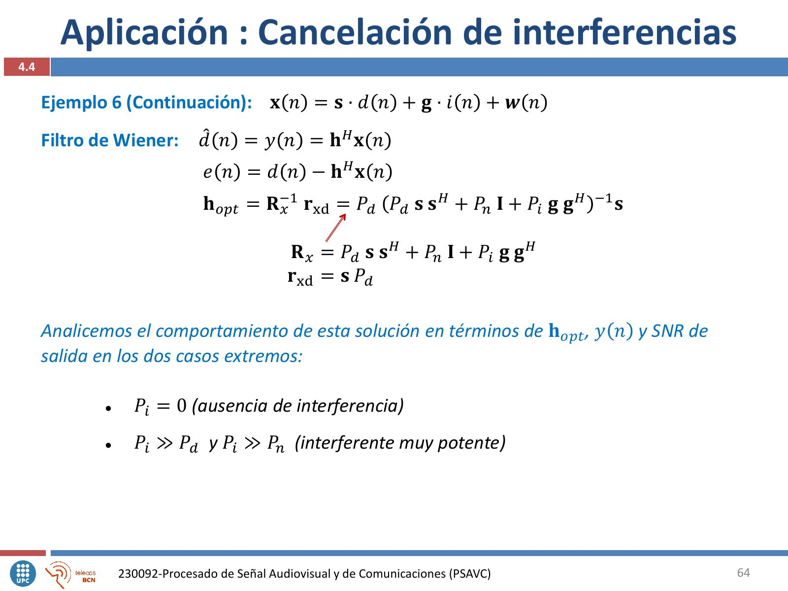

```text
        Aplicación : Cancelación de interferencias
4.4

      Ejemplo 6 (Continuación): 𝐱𝐱 𝑛𝑛 = 𝐬𝐬 · 𝑑𝑑 𝑛𝑛 + 𝐠𝐠 · 𝑖𝑖 𝑛𝑛 + 𝒘𝒘 𝑛𝑛
      Filtro de Wiener:         𝑑𝑑̂ 𝑛𝑛 = 𝑦𝑦 𝑛𝑛 = 𝐡𝐡𝐻𝐻 𝐱𝐱 𝑛𝑛
                                𝑒𝑒 𝑛𝑛 = 𝑑𝑑 𝑛𝑛 − 𝐡𝐡𝐻𝐻 𝐱𝐱 𝑛𝑛
                                𝐡𝐡𝑜𝑜𝑜𝑜𝑜𝑜 = 𝐑𝐑−1                       𝐻𝐻
                                             𝑥𝑥 𝐫𝐫xd = 𝑃𝑃𝑑𝑑 𝑃𝑃𝑑𝑑 𝐬𝐬 𝐬𝐬 + 𝑃𝑃𝑛𝑛 𝐈𝐈 + 𝑃𝑃𝑖𝑖 𝐠𝐠 𝐠𝐠
                                                                                              𝐻𝐻 −1 𝐬𝐬


                                                𝐑𝐑 𝑥𝑥 = 𝑃𝑃𝑑𝑑 𝐬𝐬 𝐬𝐬 𝐻𝐻 + 𝑃𝑃𝑛𝑛 𝐈𝐈 + 𝑃𝑃𝑖𝑖 𝐠𝐠 𝐠𝐠 𝐻𝐻
                                               𝐫𝐫xd = 𝐬𝐬 𝑃𝑃𝑑𝑑

      Analicemos el comportamiento de esta solución en términos de 𝐡𝐡𝑜𝑜𝑜𝑜𝑜𝑜 , 𝑦𝑦 𝑛𝑛 y SNR de
      salida en los dos casos extremos:

              ●     𝑃𝑃𝑖𝑖 = 0 (ausencia de interferencia)
              ●     𝑃𝑃𝑖𝑖 ≫ 𝑃𝑃𝑑𝑑 y 𝑃𝑃𝑖𝑖 ≫ 𝑃𝑃𝑛𝑛 (interferente muy potente)


                  230092-Procesado de Señal Audiovisual y de Comunicaciones (PSAVC)                      64
```

## Page 65

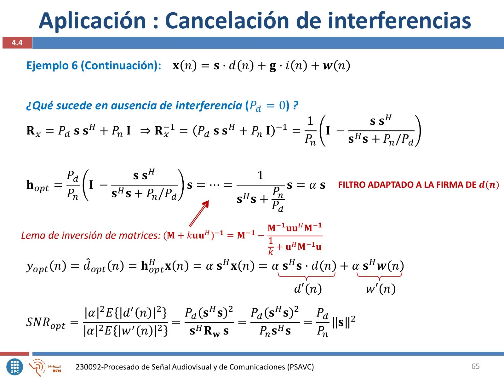

```text
         Aplicación : Cancelación de interferencias
4.4

      Ejemplo 6 (Continuación): 𝐱𝐱 𝑛𝑛 = 𝐬𝐬 · 𝑑𝑑 𝑛𝑛 + 𝐠𝐠 · 𝑖𝑖 𝑛𝑛 + 𝒘𝒘 𝑛𝑛


      ¿Qué sucede en ausencia de interferencia (𝑃𝑃𝑑𝑑 = 0) ?
                                                                                              𝐻𝐻
                                                                          1             𝐬𝐬 𝐬𝐬
      𝐑𝐑 𝑥𝑥 = 𝑃𝑃𝑑𝑑 𝐬𝐬 𝐬𝐬 𝐻𝐻 + 𝑃𝑃𝑛𝑛 𝐈𝐈 ⇒ 𝐑𝐑−1             𝐻𝐻
                                          𝑥𝑥 = 𝑃𝑃𝑑𝑑 𝐬𝐬 𝐬𝐬 + 𝑃𝑃𝑛𝑛 𝐈𝐈
                                                                    −1 =      𝐈𝐈 − 𝐻𝐻
                                                                         𝑃𝑃𝑛𝑛     𝐬𝐬 𝐬𝐬 + 𝑃𝑃𝑛𝑛 /𝑃𝑃𝑑𝑑

                 𝑃𝑃𝑑𝑑           𝐬𝐬 𝐬𝐬 𝐻𝐻                      1
      𝐡𝐡𝑜𝑜𝑜𝑜𝑜𝑜 =      𝐈𝐈 − 𝐻𝐻                𝐬𝐬 = ⋯ =                 𝐬𝐬 = 𝛼𝛼 𝐬𝐬                  FILTRO ADAPTADO A LA FIRMA DE 𝒅𝒅 𝒏𝒏
                 𝑃𝑃𝑛𝑛     𝐬𝐬 𝐬𝐬 + 𝑃𝑃𝑛𝑛 /𝑃𝑃𝑑𝑑                     𝑃𝑃𝑛𝑛
                                                      𝐬𝐬 𝐻𝐻 𝐬𝐬 +
                                                                 𝑃𝑃𝑑𝑑
                                                                             𝐌𝐌−𝟏𝟏 𝐮𝐮𝐮𝐮𝐻𝐻 𝐌𝐌−𝟏𝟏
  Lema de inversión de matrices: 𝐌𝐌 + 𝑘𝑘𝐮𝐮𝐮𝐮         𝐻𝐻 −𝟏𝟏
                                                              = 𝐌𝐌   −𝟏𝟏
                                                                           −
                                                                             1
                                                                                + 𝐮𝐮𝐻𝐻 𝐌𝐌−1 𝐮𝐮
                                                                             𝑘𝑘
      𝑦𝑦𝑜𝑜𝑜𝑜𝑜𝑜 𝑛𝑛 = 𝑑𝑑̂ 𝑜𝑜𝑜𝑜𝑜𝑜 𝑛𝑛 = 𝐡𝐡𝐻𝐻                  𝐻𝐻            𝐻𝐻                 𝐻𝐻
                                      𝑜𝑜𝑜𝑜𝑜𝑜 𝐱𝐱 𝑛𝑛 = 𝛼𝛼 𝐬𝐬 𝐱𝐱 𝑛𝑛 = 𝛼𝛼 𝐬𝐬 𝐬𝐬 · 𝑑𝑑 𝑛𝑛 + 𝛼𝛼 𝐬𝐬 𝒘𝒘 𝑛𝑛

                                                                                      𝑑𝑑′ 𝑛𝑛            𝑤𝑤𝑤 𝑛𝑛
                     𝛼𝛼 2 𝐸𝐸 𝑑𝑑 ′ 𝑛𝑛 2   𝑃𝑃𝑑𝑑 𝐬𝐬 𝐻𝐻 𝐬𝐬 2 𝑃𝑃𝑑𝑑 𝐬𝐬 𝐻𝐻 𝐬𝐬 2 𝑃𝑃𝑑𝑑      2
      𝑆𝑆𝑆𝑆𝑅𝑅𝑜𝑜𝑜𝑜𝑜𝑜 =                   =                 =               =      𝐬𝐬
                     𝛼𝛼 2 𝐸𝐸 𝑤𝑤 ′ 𝑛𝑛 2    𝐬𝐬 𝐻𝐻 𝐑𝐑 𝐰𝐰 𝐬𝐬    𝑃𝑃𝑛𝑛 𝐬𝐬𝐻𝐻 𝐬𝐬   𝑃𝑃𝑛𝑛

                  230092-Procesado de Señal Audiovisual y de Comunicaciones (PSAVC)                                            65
```

## Page 66

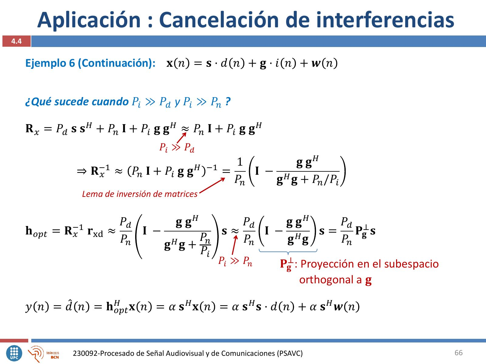

```text
         Aplicación : Cancelación de interferencias
4.4

      Ejemplo 6 (Continuación): 𝐱𝐱 𝑛𝑛 = 𝐬𝐬 · 𝑑𝑑 𝑛𝑛 + 𝐠𝐠 · 𝑖𝑖 𝑛𝑛 + 𝒘𝒘 𝑛𝑛


      ¿Qué sucede cuando 𝑃𝑃𝑖𝑖 ≫ 𝑃𝑃𝑑𝑑 y 𝑃𝑃𝑖𝑖 ≫ 𝑃𝑃𝑛𝑛 ?

      𝐑𝐑 𝑥𝑥 = 𝑃𝑃𝑑𝑑 𝐬𝐬 𝐬𝐬 𝐻𝐻 + 𝑃𝑃𝑛𝑛 𝐈𝐈 + 𝑃𝑃𝑖𝑖 𝐠𝐠 𝐠𝐠 𝐻𝐻 ≈ 𝑃𝑃𝑛𝑛 𝐈𝐈 + 𝑃𝑃𝑖𝑖 𝐠𝐠 𝐠𝐠 𝐻𝐻
                                               𝑃𝑃𝑖𝑖 ≫ 𝑃𝑃𝑑𝑑
                                                                               𝐻𝐻
                                                            1            𝐠𝐠 𝐠𝐠
                     ⇒ 𝐑𝐑−1
                         𝑥𝑥 ≈ 𝑃𝑃𝑛𝑛 𝐈𝐈 + 𝑃𝑃𝑖𝑖 𝐠𝐠 𝐠𝐠
                                                   𝐻𝐻 −1 =      𝐈𝐈 − 𝐻𝐻
                                                           𝑃𝑃𝑛𝑛     𝐠𝐠 𝐠𝐠 + 𝑃𝑃𝑛𝑛 /𝑃𝑃𝑖𝑖
                       Lema de inversión de matrices

                              𝑃𝑃           𝐠𝐠 𝐠𝐠 𝐻𝐻              𝑃𝑃          𝐠𝐠  𝐠𝐠 𝐻𝐻     𝑃𝑃𝑑𝑑 ⊥
                   −1           𝑑𝑑                                  𝑑𝑑
      𝐡𝐡𝑜𝑜𝑜𝑜𝑜𝑜 = 𝐑𝐑 𝑥𝑥 𝐫𝐫xd ≈      𝐈𝐈 −                    𝐬𝐬 ≈        𝐈𝐈 − 𝐻𝐻 𝐬𝐬 = 𝐏𝐏𝐠𝐠 𝐬𝐬
                              𝑃𝑃𝑛𝑛        𝐻𝐻        𝑃𝑃𝑛𝑛         𝑃𝑃 𝑛𝑛       𝐠𝐠 𝐠𝐠         𝑃𝑃𝑛𝑛
                                        𝐠𝐠 𝐠𝐠 + 𝑃𝑃
                                                       𝑖𝑖
                                                          𝑃𝑃𝑖𝑖 ≫ 𝑃𝑃𝑛𝑛      𝐏𝐏𝐠𝐠⊥ : Proyección en el subespacio
                                                                                  orthogonal a 𝐠𝐠

      𝑦𝑦 𝑛𝑛 = 𝑑𝑑̂ 𝑛𝑛 = 𝐡𝐡𝐻𝐻                  𝐻𝐻            𝐻𝐻                 𝐻𝐻
                         𝑜𝑜𝑜𝑜𝑜𝑜 𝐱𝐱 𝑛𝑛 = 𝛼𝛼 𝐬𝐬 𝐱𝐱 𝑛𝑛 = 𝛼𝛼 𝐬𝐬 𝐬𝐬 · 𝑑𝑑 𝑛𝑛 + 𝛼𝛼 𝐬𝐬 𝒘𝒘 𝑛𝑛


                    230092-Procesado de Señal Audiovisual y de Comunicaciones (PSAVC)                            66
```

## Page 67

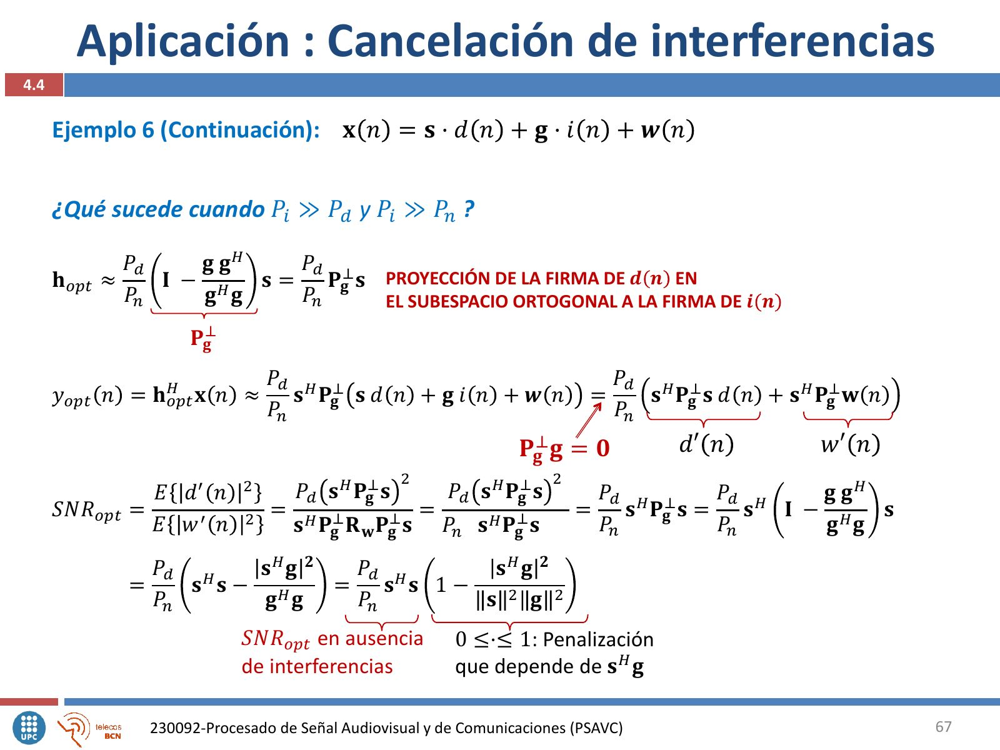

```text
         Aplicación : Cancelación de interferencias
4.4

      Ejemplo 6 (Continuación): 𝐱𝐱 𝑛𝑛 = 𝐬𝐬 · 𝑑𝑑 𝑛𝑛 + 𝐠𝐠 · 𝑖𝑖 𝑛𝑛 + 𝒘𝒘 𝑛𝑛


      ¿Qué sucede cuando 𝑃𝑃𝑖𝑖 ≫ 𝑃𝑃𝑑𝑑 y 𝑃𝑃𝑖𝑖 ≫ 𝑃𝑃𝑛𝑛 ?

                 𝑃𝑃𝑑𝑑     𝐠𝐠 𝐠𝐠 𝐻𝐻 𝑃𝑃𝑑𝑑
      𝐡𝐡𝑜𝑜𝑜𝑜𝑜𝑜 ≈      𝐈𝐈 − 𝐻𝐻 𝐬𝐬 = 𝐏𝐏𝐠𝐠⊥ 𝐬𝐬 PROYECCIÓN DE LA FIRMA DE 𝒅𝒅 𝒏𝒏 EN
                 𝑃𝑃𝑛𝑛     𝐠𝐠 𝐠𝐠    𝑃𝑃𝑛𝑛     EL SUBESPACIO ORTOGONAL A LA FIRMA DE 𝒊𝒊 𝒏𝒏
                         𝐏𝐏𝐠𝐠⊥
                                       𝑃𝑃𝑑𝑑 𝐻𝐻 ⊥                                         𝑃𝑃𝑑𝑑 𝐻𝐻 ⊥
      𝑦𝑦𝑜𝑜𝑜𝑜𝑜𝑜 𝑛𝑛 = 𝐡𝐡𝐻𝐻
                      𝑜𝑜𝑜𝑜𝑜𝑜 𝐱𝐱 𝑛𝑛 ≈        𝐬𝐬 𝐏𝐏𝐠𝐠 𝐬𝐬 𝑑𝑑 𝑛𝑛 + 𝐠𝐠 𝑖𝑖 𝑛𝑛 + 𝒘𝒘 𝑛𝑛      =        𝐬𝐬 𝐏𝐏𝐠𝐠 𝐬𝐬 𝑑𝑑 𝑛𝑛 + 𝐬𝐬𝐻𝐻 𝐏𝐏𝐠𝐠⊥ 𝐰𝐰 𝑛𝑛
                                       𝑃𝑃𝑛𝑛                                              𝑃𝑃𝑛𝑛
                                                                         𝐏𝐏𝐠𝐠⊥ 𝐠𝐠 = 𝟎𝟎            𝑑𝑑′ 𝑛𝑛                𝑤𝑤𝑤 𝑛𝑛
                                                         2                      2
                     𝐸𝐸 𝑑𝑑′ 𝑛𝑛 2   𝑃𝑃𝑑𝑑 𝐬𝐬𝐻𝐻 𝐏𝐏𝐠𝐠⊥ 𝐬𝐬      𝑃𝑃𝑑𝑑 𝐬𝐬𝐻𝐻 𝐏𝐏𝐠𝐠⊥ 𝐬𝐬        𝑃𝑃𝑑𝑑 𝐻𝐻 ⊥     𝑃𝑃𝑑𝑑 𝐻𝐻     𝐠𝐠 𝐠𝐠 𝐻𝐻
      𝑆𝑆𝑆𝑆𝑅𝑅𝑜𝑜𝑜𝑜𝑜𝑜 =              = 𝐻𝐻 ⊥                 =                          = 𝐬𝐬 𝐏𝐏𝐠𝐠 𝐬𝐬 =      𝐬𝐬 𝐈𝐈 − 𝐻𝐻 𝐬𝐬
                     𝐸𝐸 𝑤𝑤 ′ 𝑛𝑛 2  𝐬𝐬 𝐏𝐏𝐠𝐠 𝐑𝐑 𝐰𝐰 𝐏𝐏𝐠𝐠⊥ 𝐬𝐬 𝑃𝑃𝑛𝑛 𝐬𝐬𝐻𝐻 𝐏𝐏𝐠𝐠⊥ 𝐬𝐬         𝑃𝑃𝑛𝑛          𝑃𝑃𝑛𝑛        𝐠𝐠 𝐠𝐠
                   𝑃𝑃𝑑𝑑 𝐻𝐻     𝐬𝐬𝐻𝐻 𝐠𝐠 𝟐𝟐  𝑃𝑃𝑑𝑑 𝐻𝐻      𝐬𝐬𝐻𝐻 𝐠𝐠 𝟐𝟐
                 =      𝐬𝐬 𝐬𝐬 − 𝐻𝐻        = 𝐬𝐬 𝐬𝐬 1 −
                   𝑃𝑃𝑛𝑛         𝐠𝐠 𝐠𝐠      𝑃𝑃𝑛𝑛       𝐬𝐬 2 𝐠𝐠 2
                                 𝑆𝑆𝑆𝑆𝑅𝑅𝑜𝑜𝑜𝑜𝑜𝑜 en ausencia       0 ≤·≤ 1: Penalización
                                 de interferencias              que depende de 𝐬𝐬𝐻𝐻 𝐠𝐠

                    230092-Procesado de Señal Audiovisual y de Comunicaciones (PSAVC)                                               67
```

## Page 68

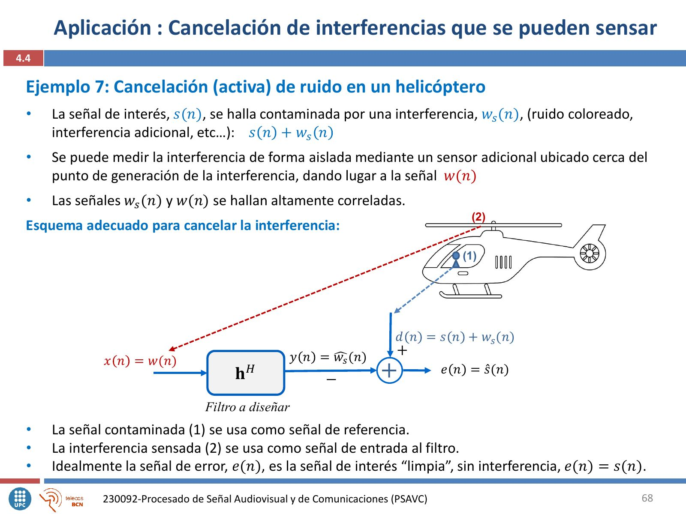

```text
      Aplicación : Cancelación de interferencias que se pueden sensar
4.4

  Ejemplo 7: Cancelación (activa) de ruido en un helicóptero
  •   La señal de interés, 𝑠𝑠(𝑛𝑛), se halla contaminada por una interferencia, 𝑤𝑤𝑠𝑠 (𝑛𝑛), (ruido coloreado,
      interferencia adicional, etc…): 𝑠𝑠 𝑛𝑛 + 𝑤𝑤𝑠𝑠 𝑛𝑛
  •   Se puede medir la interferencia de forma aislada mediante un sensor adicional ubicado cerca del
      punto de generación de la interferencia, dando lugar a la señal 𝑤𝑤(𝑛𝑛)
  •   Las señales 𝑤𝑤𝑠𝑠 (𝑛𝑛) y 𝑤𝑤(𝑛𝑛) se hallan altamente correladas.
                                                                                         (2)
  Esquema adecuado para cancelar la interferencia:
                                                                                       (1)


                                                                         𝑑𝑑 𝑛𝑛 = 𝑠𝑠 𝑛𝑛 + 𝑤𝑤𝑠𝑠 (𝑛𝑛)
                                                             −           +
               𝑥𝑥 𝑛𝑛 = 𝑤𝑤(𝑛𝑛)                         𝑦𝑦 𝑛𝑛 = 𝑤𝑤
                                                              �𝑠𝑠 (𝑛𝑛)
                                         𝐡𝐡𝐻𝐻                            +         𝑒𝑒 𝑛𝑛 = ̂𝑠𝑠(𝑛𝑛)

                                   Filtro a diseñar
  •   La señal contaminada (1) se usa como señal de referencia.
  •   La interferencia sensada (2) se usa como señal de entrada al filtro.
  •   Idealmente la señal de error, 𝑒𝑒(𝑛𝑛), es la señal de interés “limpia”, sin interferencia, 𝑒𝑒(𝑛𝑛) = 𝑠𝑠(𝑛𝑛).

               230092-Procesado de Señal Audiovisual y de Comunicaciones (PSAVC)                               68
```

## Page 69

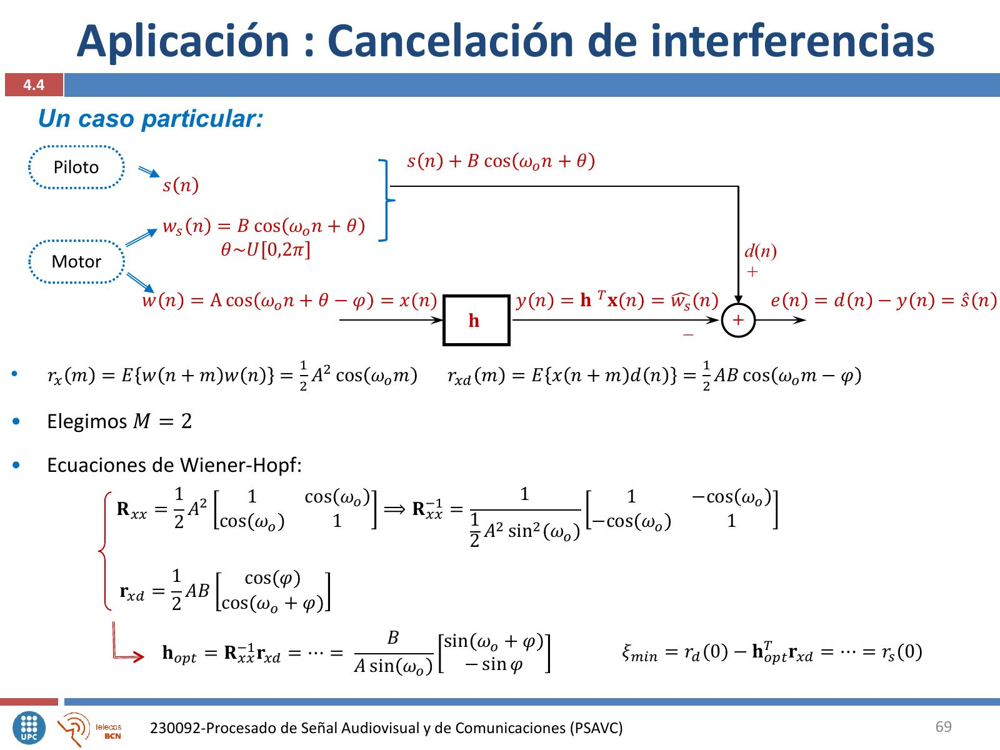

```text
             Aplicación : Cancelación de interferencias
    4.4

     Un caso particular:
          Piloto                                                  𝑠𝑠 𝑛𝑛 + 𝐵𝐵 cos 𝜔𝜔𝑜𝑜 𝑛𝑛 + 𝜃𝜃
                         𝑠𝑠 𝑛𝑛

                         𝑤𝑤𝑠𝑠 𝑛𝑛 = 𝐵𝐵 cos 𝜔𝜔𝑜𝑜 𝑛𝑛 + 𝜃𝜃
                                 𝜃𝜃~𝑈𝑈 0,2𝜋𝜋                                                                          d(n)
          Motor
                                                                                                                       +
                      𝑤𝑤 𝑛𝑛 = A cos 𝜔𝜔𝑜𝑜 𝑛𝑛 + 𝜃𝜃 − 𝜑𝜑 = 𝑥𝑥(𝑛𝑛)                    𝑦𝑦 𝑛𝑛 = 𝐡𝐡 𝑇𝑇 𝐱𝐱 𝑛𝑛 = 𝑤𝑤
                                                                                                        �𝑠𝑠 𝑛𝑛           𝑒𝑒 𝑛𝑛 = 𝑑𝑑 𝑛𝑛 − 𝑦𝑦 𝑛𝑛 = 𝑠𝑠̂ 𝑛𝑛
                                                                           𝐡𝐡                                        +
                                                                                                             _
                                               1                                                                 1
•         𝑟𝑟𝑥𝑥 𝑚𝑚 = 𝐸𝐸 𝑤𝑤 𝑛𝑛 + 𝑚𝑚 𝑤𝑤 𝑛𝑛     = 𝐴𝐴2 cos 𝜔𝜔𝑜𝑜 𝑚𝑚           𝑟𝑟𝑥𝑥𝑥𝑥 𝑚𝑚 = 𝐸𝐸 𝑥𝑥 𝑛𝑛 + 𝑚𝑚 𝑑𝑑 𝑛𝑛      = 𝐴𝐴𝐴𝐴 cos 𝜔𝜔𝑜𝑜 𝑚𝑚 − 𝜑𝜑
                                               2                                                                 2

•         Elegimos 𝑀𝑀 = 2
•         Ecuaciones de Wiener-Hopf:
                            1       1           cos 𝜔𝜔𝑜𝑜                          1                1          −cos 𝜔𝜔𝑜𝑜
                   𝐑𝐑 𝑥𝑥𝑥𝑥 = 𝐴𝐴2                              ⟹ 𝐑𝐑−1
                                                                  𝑥𝑥𝑥𝑥 =
                            2    cos 𝜔𝜔𝑜𝑜          1                       1 2 2                −cos 𝜔𝜔𝑜𝑜        1
                                                                             𝐴𝐴 sin 𝜔𝜔𝑜𝑜
                                                                           2
                           1       cos 𝜑𝜑
                   𝐫𝐫𝑥𝑥𝑥𝑥 = 𝐴𝐴𝐴𝐴
                           2     cos 𝜔𝜔𝑜𝑜 + 𝜑𝜑
                                                               𝐵𝐵       sin 𝜔𝜔𝑜𝑜 + 𝜑𝜑
                         𝐡𝐡𝑜𝑜𝑜𝑜𝑜𝑜 = 𝐑𝐑−1
                                      𝑥𝑥𝑥𝑥 𝐫𝐫𝑥𝑥𝑥𝑥 = ⋯ =                                            𝜉𝜉𝑚𝑚𝑚𝑚𝑚𝑚 = 𝑟𝑟𝑑𝑑 0 − 𝐡𝐡𝑇𝑇𝑜𝑜𝑜𝑜𝑜𝑜 𝐫𝐫𝑥𝑥𝑥𝑥 = ⋯ = 𝑟𝑟𝑠𝑠 0
                                                          𝐴𝐴 sin 𝜔𝜔𝑜𝑜      − sin 𝜑𝜑


                        230092-Procesado de Señal Audiovisual y de Comunicaciones (PSAVC)                                                               69
```

## Page 70

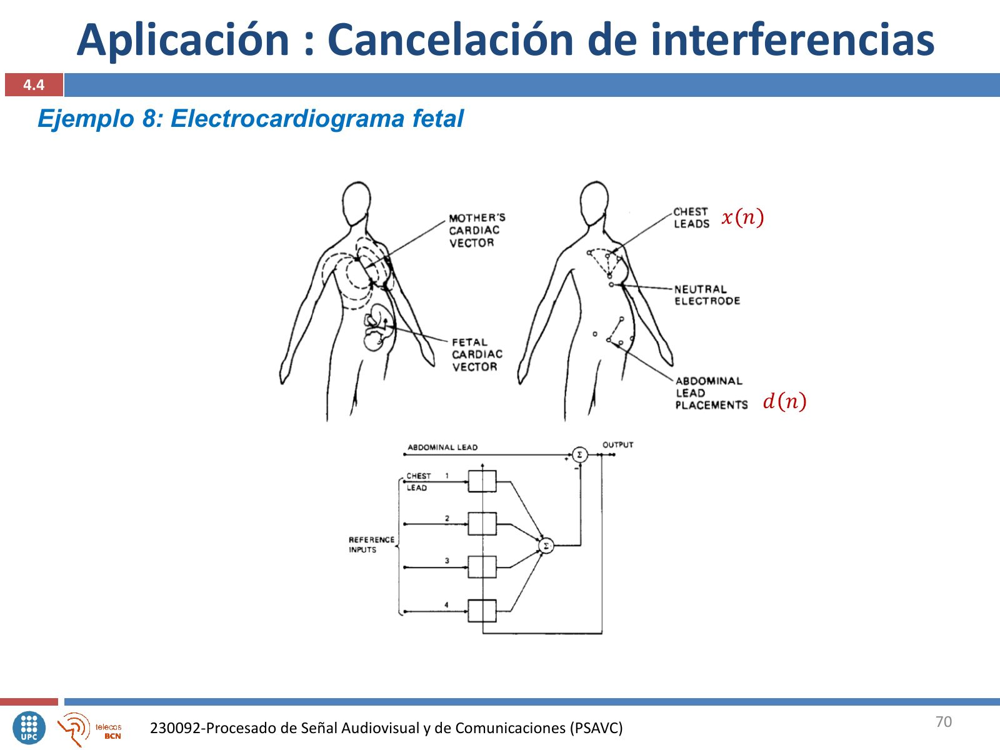

```text
      Aplicación : Cancelación de interferencias
4.4

 Ejemplo 8: Electrocardiograma fetal


                                                                              𝑥𝑥 𝑛𝑛


                                                                                      𝑑𝑑 𝑛𝑛


          230092-Procesado de Señal Audiovisual y de Comunicaciones (PSAVC)                   70
```

## Page 71

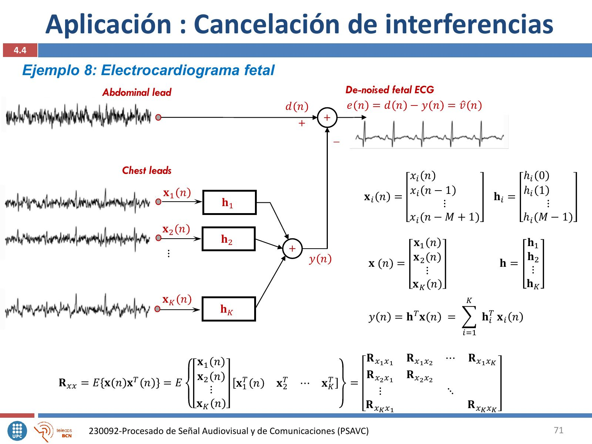

```text
      Aplicación : Cancelación de interferencias
4.4

 Ejemplo 8: Electrocardiograma fetal
                   Abdominal lead                                                                     De-noised fetal ECG
                                                                                𝑑𝑑 𝑛𝑛                 𝑒𝑒 𝑛𝑛 = 𝑑𝑑 𝑛𝑛 − 𝑦𝑦 𝑛𝑛 = 𝑣𝑣� 𝑛𝑛
                                                                                   +         +

                                                                                                  _

                         Chest leads                                                                                 𝑥𝑥𝑖𝑖 𝑛𝑛                                ℎ𝑖𝑖 0
                                     𝐱𝐱1 𝑛𝑛                                                                          𝑥𝑥 𝑛𝑛 − 1                              ℎ𝑖𝑖 1
                                                                                                          𝐱𝐱 𝑖𝑖 𝑛𝑛 = 𝑖𝑖                           𝐡𝐡𝑖𝑖 =
                                                           𝐡𝐡1                                                                ⋮                                   ⋮
                                                                                                                     𝑥𝑥𝑖𝑖 𝑛𝑛 − 𝑀𝑀 + 1                       ℎ𝑖𝑖 𝑀𝑀 − 1
                                     𝐱𝐱 2 𝑛𝑛
                                                       𝐡𝐡2                                                         𝐱𝐱1 𝑛𝑛                                   𝐡𝐡1
                                      ⋮                                              +
                                                                                          𝑦𝑦 𝑛𝑛                    𝐱𝐱 𝑛𝑛                                    𝐡𝐡
                                                                                                           𝐱𝐱 𝑛𝑛 = 2                                   𝐡𝐡 = 2
                                                                                                                        ⋮                                    ⋮
                                                                                                                   𝐱𝐱 𝐾𝐾 𝑛𝑛                                 𝐡𝐡𝐾𝐾
                                     𝐱𝐱 𝐾𝐾 𝑛𝑛                                                                                           𝐾𝐾
                                                       𝐡𝐡𝐾𝐾
                                                                                                           𝑦𝑦 𝑛𝑛 = 𝐡𝐡𝑇𝑇 𝐱𝐱 𝑛𝑛 = � 𝐡𝐡𝑇𝑇𝑖𝑖 𝐱𝐱 𝑖𝑖 𝑛𝑛
                                                                                                                                       𝑖𝑖=1


                                                𝐱𝐱1 𝑛𝑛                                                  𝐑𝐑 𝑥𝑥1𝑥𝑥1     𝐑𝐑 𝑥𝑥1 𝑥𝑥2   ⋯    𝐑𝐑 𝑥𝑥1 𝑥𝑥𝐾𝐾
                                                𝐱𝐱 2 𝑛𝑛                                                 𝐑𝐑 𝑥𝑥2𝑥𝑥1     𝐑𝐑 𝑥𝑥2 𝑥𝑥2
       𝐑𝐑 𝑥𝑥𝑥𝑥 = 𝐸𝐸 𝐱𝐱 𝑛𝑛 𝐱𝐱 𝑇𝑇 𝑛𝑛   = 𝐸𝐸                        𝐱𝐱1𝑇𝑇 𝑛𝑛   𝐱𝐱 2𝑇𝑇            𝑇𝑇
                                                                                         ⋯ 𝐱𝐱 𝐾𝐾      =
                                                     ⋮                                                       ⋮                     ⋱
                                                𝐱𝐱 𝐾𝐾 𝑛𝑛                                                𝐑𝐑 𝑥𝑥𝐾𝐾 𝑥𝑥1                     𝐑𝐑 𝑥𝑥𝐾𝐾 𝑥𝑥𝐾𝐾

               230092-Procesado de Señal Audiovisual y de Comunicaciones (PSAVC)                                                                                    71
```

## Page 72


```text
Tema 4: Filtro de Wiener

1.   Introducción
2.   Aplicaciones
3.   MSE y ecuaciones normales
4.   Ejemplos de aplicación
5.   Filtro óptimo a partir de las muestras
6.   Conclusiones y ejercicios propuestos


      230092-Procesado de Señal Audiovisual y de Comunicaciones (PSAVC)   72
```

## Page 73

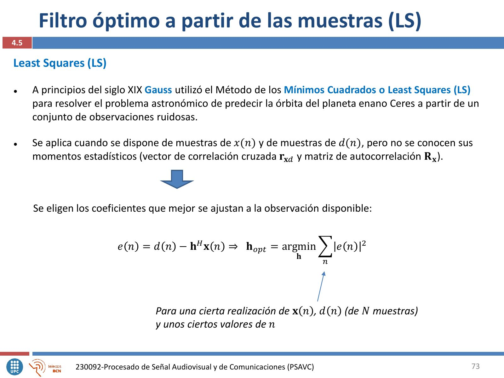

```text
       Filtro óptimo a partir de las muestras (LS)
4.5

Least Squares (LS)

●     A principios del siglo XIX Gauss utilizó el Método de los Mínimos Cuadrados o Least Squares (LS)
      para resolver el problema astronómico de predecir la órbita del planeta enano Ceres a partir de un
      conjunto de observaciones ruidosas.

●     Se aplica cuando se dispone de muestras de 𝑥𝑥(𝑛𝑛) y de muestras de 𝑑𝑑(𝑛𝑛), pero no se conocen sus
      momentos estadísticos (vector de correlación cruzada 𝐫𝐫𝐱𝐱𝑑𝑑 y matriz de autocorrelación 𝐑𝐑 𝐱𝐱 ).


      Se eligen los coeficientes que mejor se ajustan a la observación disponible:


                          𝑒𝑒 𝑛𝑛 = 𝑑𝑑 𝑛𝑛 − 𝐡𝐡𝐻𝐻 𝐱𝐱 𝑛𝑛 ⇒ 𝐡𝐡𝑜𝑜𝑜𝑜𝑡𝑡 = argmin � 𝑒𝑒 𝑛𝑛        2
                                                                           𝐡𝐡
                                                                                   𝑛𝑛


                                    Para una cierta realización de 𝐱𝐱 𝑛𝑛 , 𝑑𝑑 𝑛𝑛 (de 𝑁𝑁 muestras)
                                    y unos ciertos valores de 𝑛𝑛


               230092-Procesado de Señal Audiovisual y de Comunicaciones (PSAVC)                      73
```

## Page 74

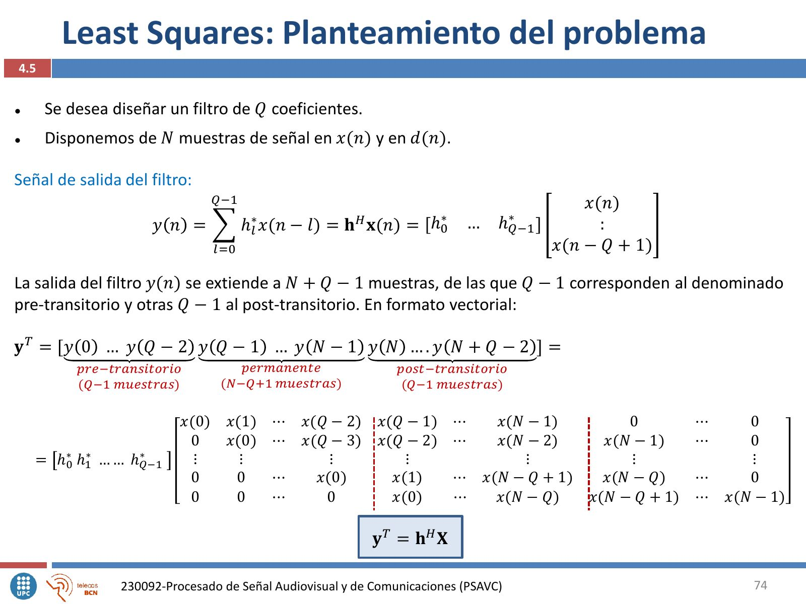

```text
        Least Squares: Planteamiento del problema
4.5


●     Se desea diseñar un filtro de 𝑄𝑄 coeficientes.
●     Disponemos de 𝑁𝑁 muestras de señal en 𝑥𝑥(𝑛𝑛) y en 𝑑𝑑(𝑛𝑛).

Señal de salida del filtro:
                                            𝑄𝑄−1                                                                         𝑥𝑥(𝑛𝑛)
                                                                                                            ∗
                              𝑦𝑦 𝑛𝑛       = � ℎ𝑙𝑙∗ 𝑥𝑥(𝑛𝑛 − 𝑙𝑙) = 𝐡𝐡𝐻𝐻 𝐱𝐱(𝑛𝑛) =          ℎ0∗       …        ℎ𝑄𝑄−1            :
                                            𝑙𝑙=0                                                                   𝑥𝑥(𝑛𝑛 − 𝑄𝑄 + 1)

La salida del filtro 𝑦𝑦(𝑛𝑛) se extiende a 𝑁𝑁 + 𝑄𝑄 − 1 muestras, de las que 𝑄𝑄 − 1 corresponden al denominado
pre-transitorio y otras 𝑄𝑄 − 1 al post-transitorio. En formato vectorial:

𝐲𝐲 𝑇𝑇 = [𝑦𝑦 0 … 𝑦𝑦 𝑄𝑄 − 2 𝑦𝑦 𝑄𝑄 − 1 … 𝑦𝑦 𝑁𝑁 − 1 𝑦𝑦 𝑁𝑁 … . 𝑦𝑦 𝑁𝑁 + 𝑄𝑄 − 2 ] =
          𝑝𝑝𝑝𝑝𝑝𝑝−𝑡𝑡𝑡𝑡𝑡𝑡𝑡𝑡𝑡𝑡𝑡𝑡𝑡𝑡𝑡𝑡𝑡𝑡𝑡𝑡𝑡𝑡           𝑝𝑝𝑝𝑝𝑝𝑝𝑝𝑝𝑝𝑝𝑝𝑝𝑝𝑝𝑝𝑝𝑝𝑝𝑝𝑝         𝑝𝑝𝑝𝑝𝑝𝑝𝑝𝑝−𝑡𝑡𝑡𝑡𝑡𝑡𝑡𝑡𝑡𝑡𝑡𝑡𝑡𝑡𝑡𝑡𝑡𝑡𝑡𝑡𝑡𝑡
          (𝑄𝑄−1 𝑚𝑚𝑚𝑚𝑚𝑚𝑚𝑚𝑚𝑚𝑚𝑚𝑚𝑚𝑚𝑚)             (𝑁𝑁−𝑄𝑄+1 𝑚𝑚𝑚𝑚𝑚𝑚𝑚𝑚𝑚𝑚𝑚𝑚𝑚𝑚𝑚𝑚)        (𝑄𝑄−1 𝑚𝑚𝑚𝑚𝑚𝑚𝑚𝑚𝑚𝑚𝑚𝑚𝑚𝑚𝑚𝑚)

                                      𝑥𝑥(0) 𝑥𝑥(1) ⋯ 𝑥𝑥(𝑄𝑄 − 2) 𝑥𝑥(𝑄𝑄 − 1)                     ⋯    𝑥𝑥(𝑁𝑁 − 1)           0            ⋯      0
                                        0   𝑥𝑥(0) ⋯ 𝑥𝑥(𝑄𝑄 − 3) 𝑥𝑥(𝑄𝑄 − 2)                     ⋯    𝑥𝑥(𝑁𝑁 − 2)      𝑥𝑥(𝑁𝑁 − 1)        ⋯      0
                   ∗
    = ℎ0∗ ℎ1∗ … … ℎ𝑄𝑄−1                  ⋮     ⋮          ⋮          ⋮                                   ⋮               ⋮                  ⋮
                                        0     0   ⋯    𝑥𝑥(0)      𝑥𝑥(1)                       ⋯ 𝑥𝑥(𝑁𝑁 − 𝑄𝑄 + 1)    𝑥𝑥(𝑁𝑁 − 𝑄𝑄)       ⋯      0
                                        0     0   ⋯      0        𝑥𝑥(0)                       ⋯    𝑥𝑥(𝑁𝑁 − 𝑄𝑄)  𝑥𝑥(𝑁𝑁 − 𝑄𝑄 + 1)      ⋯ 𝑥𝑥(𝑁𝑁 − 1)

                                                                           𝐲𝐲 𝑇𝑇 = 𝐡𝐡𝐻𝐻 𝐗𝐗

                      230092-Procesado de Señal Audiovisual y de Comunicaciones (PSAVC)                                                     74
```

## Page 75

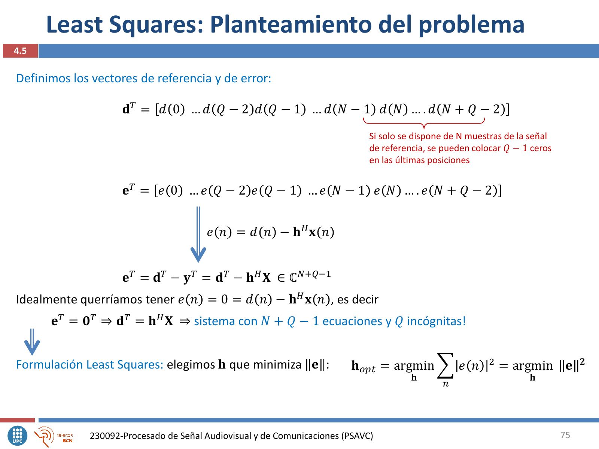

```text
      Least Squares: Planteamiento del problema
4.5

Definimos los vectores de referencia y de error:

                     𝐝𝐝𝑇𝑇 = 𝑑𝑑 0 … 𝑑𝑑 𝑄𝑄 − 2 𝑑𝑑 𝑄𝑄 − 1 … 𝑑𝑑 𝑁𝑁 − 1 𝑑𝑑 𝑁𝑁 … . 𝑑𝑑 𝑁𝑁 + 𝑄𝑄 − 2
                                                                              Si solo se dispone de N muestras de la señal
                                                                              de referencia, se pueden colocar 𝑄𝑄 − 1 ceros
                                                                              en las últimas posiciones


                     𝐞𝐞𝑇𝑇 = 𝑒𝑒 0 … 𝑒𝑒 𝑄𝑄 − 2 𝑒𝑒 𝑄𝑄 − 1 … 𝑒𝑒 𝑁𝑁 − 1 𝑒𝑒 𝑁𝑁 … . 𝑒𝑒 𝑁𝑁 + 𝑄𝑄 − 2


                                        𝑒𝑒 𝑛𝑛 = 𝑑𝑑 𝑛𝑛 − 𝐡𝐡𝐻𝐻 𝐱𝐱 𝑛𝑛


                     𝐞𝐞𝑇𝑇 = 𝐝𝐝𝑇𝑇 − 𝐲𝐲 𝑇𝑇 = 𝐝𝐝𝑇𝑇 − 𝐡𝐡𝐻𝐻 𝐗𝐗 ∈ ℂ𝑁𝑁+𝑄𝑄−1
Idealmente querríamos tener 𝑒𝑒 𝑛𝑛 = 0 = 𝑑𝑑 𝑛𝑛 − 𝐡𝐡𝐻𝐻 𝐱𝐱 𝑛𝑛 , es decir
      𝐞𝐞𝑇𝑇 = 𝟎𝟎𝑇𝑇 ⇒ 𝐝𝐝𝑇𝑇 = 𝐡𝐡𝐻𝐻 𝐗𝐗 ⇒ sistema con 𝑁𝑁 + 𝑄𝑄 − 1 ecuaciones y 𝑄𝑄 incógnitas!


Formulación Least Squares: elegimos 𝐡𝐡 que minimiza 𝐞𝐞 :                  𝐡𝐡𝑜𝑜𝑜𝑜𝑡𝑡 = argmin � 𝑒𝑒 𝑛𝑛        2
                                                                                                               = argmin 𝐞𝐞 𝟐𝟐
                                                                                        𝐡𝐡                           𝐡𝐡
                                                                                                𝑛𝑛


              230092-Procesado de Señal Audiovisual y de Comunicaciones (PSAVC)                                               75
```

## Page 76

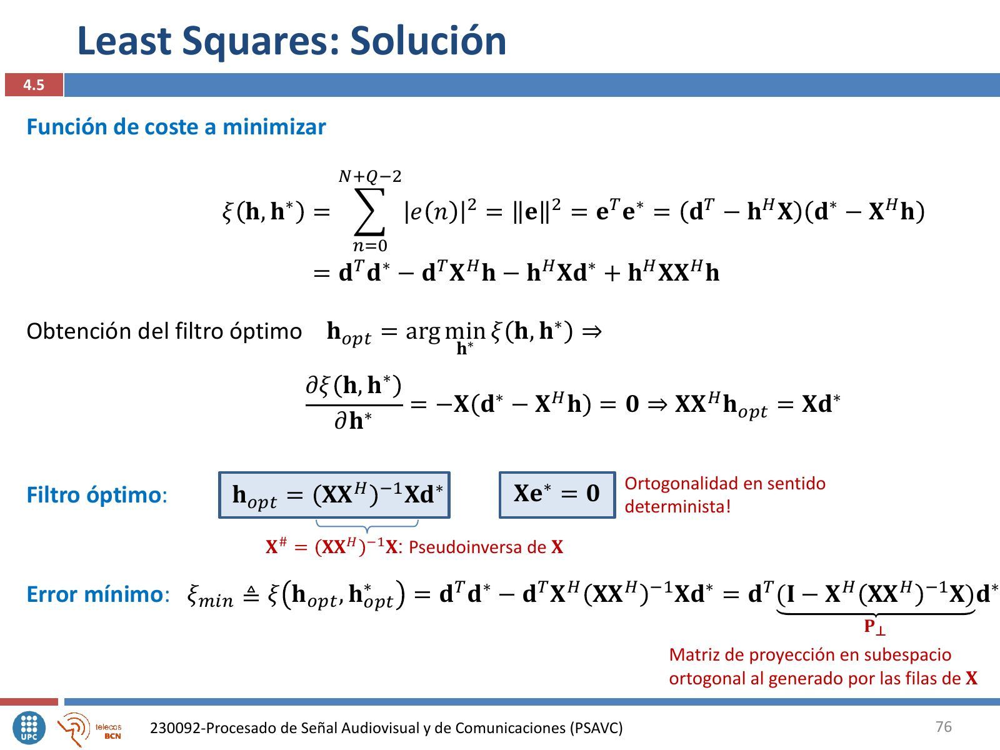

```text
      Least Squares: Solución
4.5

Función de coste a minimizar
                                        𝑁𝑁+𝑄𝑄−2

                         𝜉𝜉 𝐡𝐡, 𝐡𝐡∗ = � 𝑒𝑒 𝑛𝑛             2
                                                              = 𝐞𝐞 2 = 𝐞𝐞𝑇𝑇 𝐞𝐞∗ = 𝐝𝐝𝑇𝑇 − 𝐡𝐡𝐻𝐻 𝐗𝐗 𝐝𝐝∗ − 𝐗𝐗 𝐻𝐻 𝐡𝐡
                                         𝑛𝑛=0
                                     = 𝐝𝐝𝑇𝑇 𝐝𝐝∗ − 𝐝𝐝𝑇𝑇 𝐗𝐗 𝐻𝐻 𝐡𝐡 − 𝐡𝐡𝐻𝐻 𝐗𝐗𝐝𝐝∗ + 𝐡𝐡𝐻𝐻 𝐗𝐗𝐗𝐗 𝐻𝐻 𝐡𝐡

Obtención del filtro óptimo 𝐡𝐡𝑜𝑜𝑜𝑜𝑡𝑡 = arg min
                                            ∗
                                               𝜉𝜉 𝐡𝐡, 𝐡𝐡∗ ⇒
                                                         𝐡𝐡

                                    𝜕𝜕𝜉𝜉 𝐡𝐡, 𝐡𝐡∗
                                             ∗
                                                 = −𝐗𝐗 𝐝𝐝∗ − 𝐗𝐗 𝐻𝐻 𝐡𝐡 = 𝟎𝟎 ⇒ 𝐗𝐗𝐗𝐗 𝐻𝐻 𝐡𝐡𝑜𝑜𝑜𝑜𝑡𝑡 = 𝐗𝐗𝐝𝐝∗
                                        𝜕𝜕𝐡𝐡

                                                                                   Ortogonalidad en sentido
Filtro óptimo:            𝐡𝐡𝑜𝑜𝑜𝑜𝑡𝑡 = 𝐗𝐗𝐗𝐗 𝐻𝐻 −1 𝐗𝐗𝐝𝐝∗            𝐗𝐗𝐞𝐞∗ = 𝟎𝟎        determinista!

                               𝐗𝐗 # = 𝐗𝐗𝐗𝐗 𝐻𝐻 −1 𝐗𝐗: Pseudoinversa de 𝐗𝐗

Error mínimo: 𝜉𝜉𝑚𝑚𝑚𝑚𝑚𝑚 ≜ 𝜉𝜉 𝐡𝐡𝑜𝑜𝑜𝑜𝑡𝑡 , 𝐡𝐡∗𝑜𝑜𝑜𝑜𝑡𝑡 = 𝐝𝐝𝑇𝑇 𝐝𝐝∗ − 𝐝𝐝𝑇𝑇 𝐗𝐗 𝐻𝐻 𝐗𝐗𝐗𝐗 𝐻𝐻 −1 𝐗𝐗𝐝𝐝∗ = 𝐝𝐝𝑇𝑇 (𝐈𝐈 − 𝐗𝐗 𝐻𝐻 𝐗𝐗𝐗𝐗 𝐻𝐻 −1 𝐗𝐗)𝐝𝐝∗
                                                                                                                 𝐏𝐏⊥
                                                                                        Matriz de proyección en subespacio
                                                                                        ortogonal al generado por las filas de 𝐗𝐗

               230092-Procesado de Señal Audiovisual y de Comunicaciones (PSAVC)                                           76
```

## Page 77

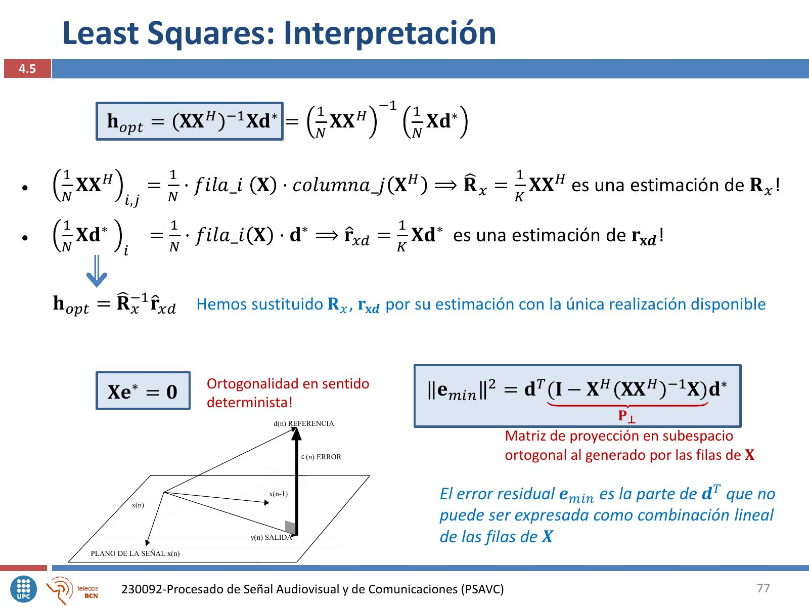

```text
       Least Squares: Interpretación
4.5


                                                                      1          −1 1
               𝐡𝐡𝑜𝑜𝑜𝑜𝑡𝑡 =             𝐗𝐗𝐗𝐗 𝐻𝐻 −1 𝐗𝐗𝐝𝐝∗ =                 𝐗𝐗𝐗𝐗 𝐻𝐻       𝐗𝐗𝐝𝐝∗
                                                                      𝑁𝑁            𝑁𝑁

       1                 1                                                                          1
●         𝐗𝐗𝐗𝐗 𝐻𝐻       = · 𝑓𝑓𝑓𝑓𝑓𝑓𝑓𝑓_𝑖𝑖                                             � 𝑥𝑥 = 𝐗𝐗𝐗𝐗 𝐻𝐻 es una estimación de 𝐑𝐑 𝑥𝑥 !
                                                     𝐗𝐗 · 𝑐𝑐𝑐𝑐𝑐𝑐𝑐𝑐𝑐𝑐𝑐𝑐𝑐𝑐_𝑗𝑗 𝐗𝐗 𝐻𝐻 ⟹ 𝐑𝐑
       𝑁𝑁         𝑖𝑖,𝑗𝑗  𝑁𝑁                                                                         𝐾𝐾
       1                            1                                             1
●         𝐗𝐗𝐝𝐝∗                 =      · 𝑓𝑓𝑓𝑓𝑓𝑓𝑓𝑓_𝑖𝑖 𝐗𝐗      · 𝐝𝐝∗ ⟹ 𝐫𝐫�𝑥𝑥𝑥𝑥 = 𝐗𝐗𝐝𝐝∗ es una estimación de 𝐫𝐫𝐱𝐱𝒅𝒅 !
       𝑁𝑁           𝑖𝑖              𝑁𝑁                                            𝐾𝐾


      𝐡𝐡𝑜𝑜𝑜𝑜𝑡𝑡 = �
                 𝐑𝐑−1 �𝑥𝑥𝑥𝑥 Hemos sustituido 𝐑𝐑 𝑥𝑥 , 𝐫𝐫𝐱𝐱𝒅𝒅 por su estimación con la única realización disponible
                   𝑥𝑥 𝐫𝐫


                                           Ortogonalidad en sentido                     𝐞𝐞𝑚𝑚𝑚𝑚𝑚𝑚 2 = 𝐝𝐝𝑇𝑇 (𝐈𝐈 − 𝐗𝐗 𝐻𝐻 𝐗𝐗𝐗𝐗 𝐻𝐻 −1 𝐗𝐗)𝐝𝐝∗
                𝐗𝐗𝐞𝐞∗ = 𝟎𝟎                 determinista!
                                                           d(n) REFERENCIA
                                                                                                                     𝐏𝐏⊥
                                                                                                   Matriz de proyección en subespacio
                                                                   ε (n) ERROR                     ortogonal al generado por las filas de 𝐗𝐗


                         x(n)
                                                          x(n-1)                         El error residual 𝒆𝒆𝑚𝑚𝑚𝑚𝑚𝑚 es la parte de 𝒅𝒅𝑇𝑇 que no
                                                                                         puede ser expresada como combinación lineal
                                                   y(n) SALIDA                           de las filas de 𝑿𝑿
            PLANO DE LA SEÑAL x(n)


                   230092-Procesado de Señal Audiovisual y de Comunicaciones (PSAVC)                                                           77
```

## Page 78

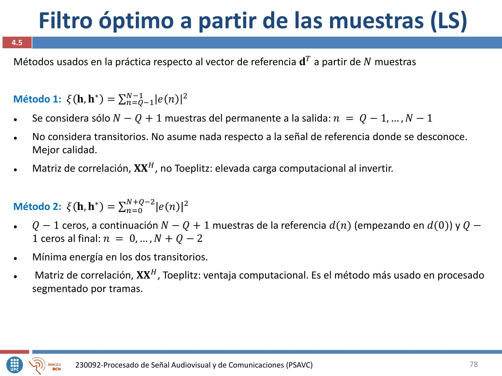

```text
       Filtro óptimo a partir de las muestras (LS)
4.5

Métodos usados en la práctica respecto al vector de referencia 𝐝𝐝𝑇𝑇 a partir de 𝑁𝑁 muestras


Método 1: 𝜉𝜉 𝐡𝐡, 𝐡𝐡∗ = ∑𝑁𝑁−1
                        𝑛𝑛=𝑄𝑄−1 𝑒𝑒 𝑛𝑛
                                               2

●     Se considera sólo 𝑁𝑁 − 𝑄𝑄 + 1 muestras del permanente a la salida: 𝑛𝑛 = 𝑄𝑄 − 1, … , 𝑁𝑁 − 1
●     No considera transitorios. No asume nada respecto a la señal de referencia donde se desconoce.
      Mejor calidad.
●     Matriz de correlación, 𝐗𝐗𝐗𝐗 𝐻𝐻 , no Toeplitz: elevada carga computacional al invertir.

                             𝑁𝑁+𝑄𝑄−2
Método 2: 𝜉𝜉 𝐡𝐡, 𝐡𝐡∗ = ∑𝑛𝑛=0           𝑒𝑒 𝑛𝑛   2

●     𝑄𝑄 − 1 ceros, a continuación 𝑁𝑁 − 𝑄𝑄 + 1 muestras de la referencia 𝑑𝑑(𝑛𝑛) (empezando en 𝑑𝑑(0)) y 𝑄𝑄 −
      1 ceros al final: 𝑛𝑛 = 0, … , 𝑁𝑁 + 𝑄𝑄 − 2
●     Mínima energía en los dos transitorios.
●      Matriz de correlación, 𝐗𝐗𝐗𝐗 𝐻𝐻 , Toeplitz: ventaja computacional. Es el método más usado en procesado
      segmentado por tramas.


                230092-Procesado de Señal Audiovisual y de Comunicaciones (PSAVC)                       78
```

## Page 79

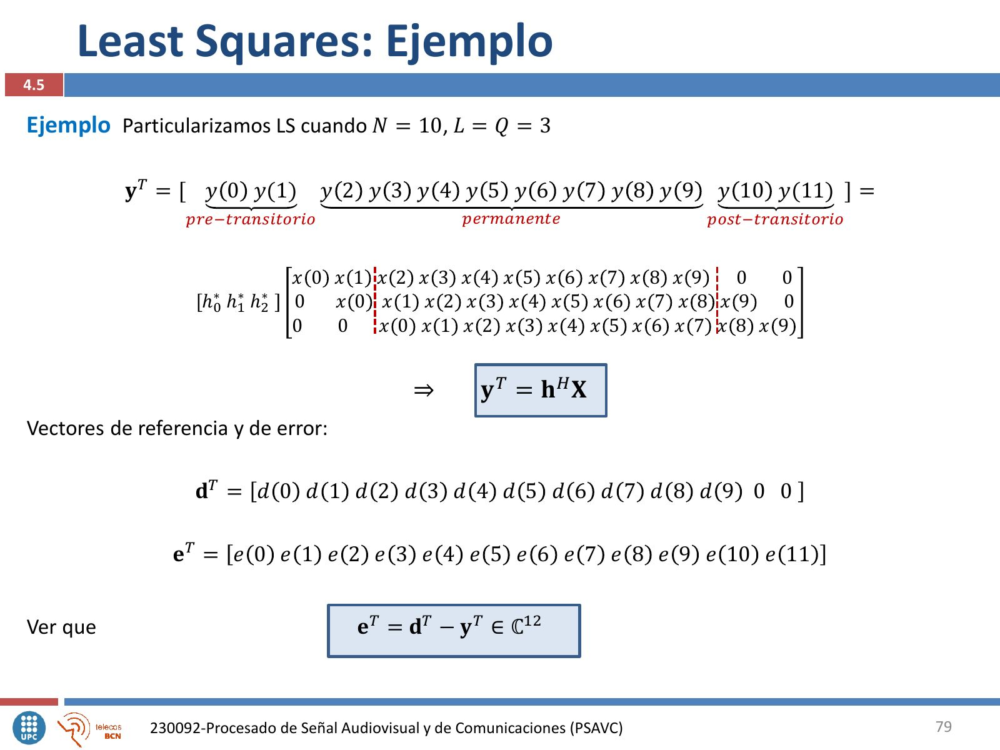

```text
      Least Squares: Ejemplo
4.5

Ejemplo Particularizamos LS cuando 𝑁𝑁 = 10, 𝐿𝐿 = 𝑄𝑄 = 3

           𝐲𝐲 𝑇𝑇 = [ 𝑦𝑦 0 𝑦𝑦(1)                   𝑦𝑦 2 𝑦𝑦 3 𝑦𝑦 4 𝑦𝑦 5 𝑦𝑦 6 𝑦𝑦 7 𝑦𝑦 8 𝑦𝑦 9     𝑦𝑦 10 𝑦𝑦(11) ] =
                  𝑝𝑝𝑝𝑝𝑝𝑝−𝑡𝑡𝑡𝑡𝑡𝑡𝑡𝑡𝑡𝑡𝑡𝑡𝑡𝑡𝑡𝑡𝑡𝑡𝑡𝑡𝑡𝑡                    𝑝𝑝𝑝𝑝𝑝𝑝𝑝𝑝𝑝𝑝𝑝𝑝𝑝𝑝𝑝𝑝𝑝𝑝𝑝𝑝     𝑝𝑝𝑝𝑝𝑝𝑝𝑝𝑝−𝑡𝑡𝑡𝑡𝑡𝑡𝑡𝑡𝑡𝑡𝑡𝑡𝑡𝑡𝑡𝑡𝑡𝑡𝑡𝑡𝑡𝑡


                                         𝑥𝑥 0 𝑥𝑥 1 𝑥𝑥 2 𝑥𝑥 3 𝑥𝑥 4 𝑥𝑥 5 𝑥𝑥 6 𝑥𝑥 7 𝑥𝑥 8 𝑥𝑥 9    0    0
                     ℎ0∗ ℎ1∗ ℎ2∗         0    𝑥𝑥 0 𝑥𝑥 1 𝑥𝑥 2 𝑥𝑥 3 𝑥𝑥 4 𝑥𝑥 5 𝑥𝑥 6 𝑥𝑥 7 𝑥𝑥 8 𝑥𝑥 9     0
                                         0     0   𝑥𝑥 0 𝑥𝑥 1 𝑥𝑥 2 𝑥𝑥 3 𝑥𝑥 4 𝑥𝑥 5 𝑥𝑥 6 𝑥𝑥 7 𝑥𝑥 8 𝑥𝑥 9


                                                            ⇒         𝐲𝐲 𝑇𝑇 = 𝐡𝐡𝐻𝐻 𝐗𝐗
Vectores de referencia y de error:

                    𝐝𝐝𝑇𝑇 = 𝑑𝑑 0 𝑑𝑑 1 𝑑𝑑 2 𝑑𝑑 3 𝑑𝑑 4 𝑑𝑑 5 𝑑𝑑 6 𝑑𝑑 7 𝑑𝑑 8 𝑑𝑑 9 0 0

                𝐞𝐞𝑇𝑇 = 𝑒𝑒 0 𝑒𝑒 1 𝑒𝑒 2 𝑒𝑒 3 𝑒𝑒 4 𝑒𝑒 5 𝑒𝑒 6 𝑒𝑒 7 𝑒𝑒 8 𝑒𝑒 9 𝑒𝑒 10 𝑒𝑒 11


Ver que                                              𝐞𝐞𝑇𝑇 = 𝐝𝐝𝑇𝑇 − 𝐲𝐲 𝑇𝑇 ∈ ℂ12


             230092-Procesado de Señal Audiovisual y de Comunicaciones (PSAVC)                                                79
```

## Page 80

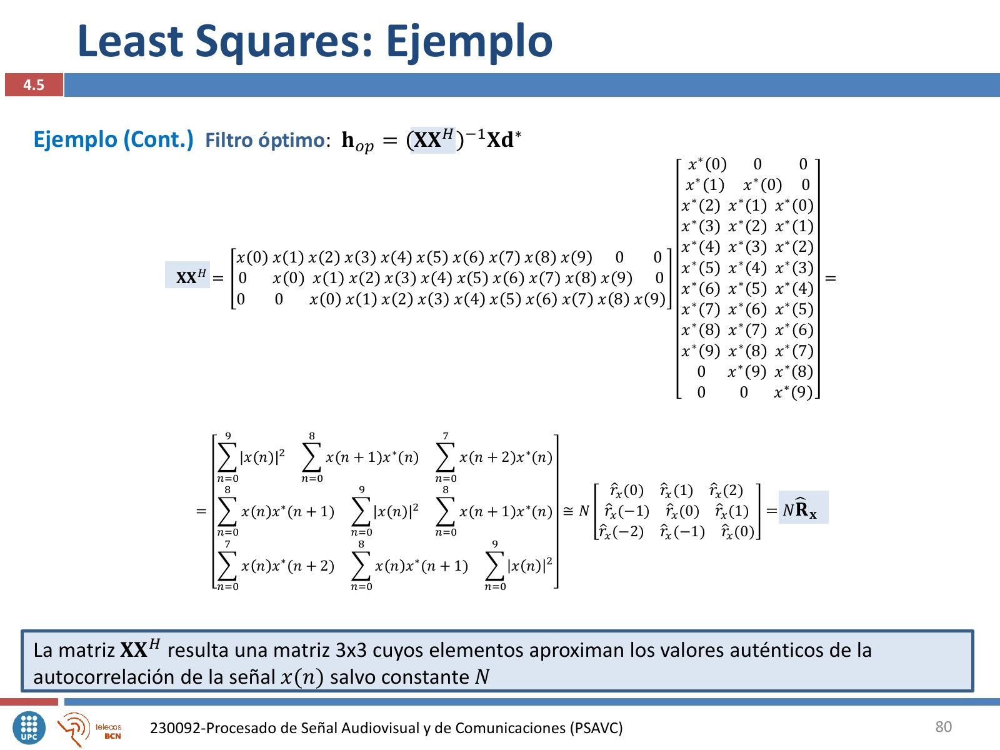

```text
      Least Squares: Ejemplo
4.5


 Ejemplo (Cont.) Filtro óptimo: 𝐡𝐡𝑜𝑜𝑜𝑜 = 𝐗𝐗𝐗𝐗 𝐻𝐻 −1 𝐗𝐗𝐝𝐝∗
                                                                                                           𝑥𝑥 ∗ 0     0      0
                                                                                                             ∗        ∗
                                                                                                          𝑥𝑥 1      𝑥𝑥 0     0
                                                                                                         𝑥𝑥 ∗ 2 𝑥𝑥 ∗ 1 𝑥𝑥 ∗ 0
                                                                                                         𝑥𝑥 ∗ 3 𝑥𝑥 ∗ 2 𝑥𝑥 ∗ 1
                                                                                                         𝑥𝑥 ∗ 4 𝑥𝑥 ∗ 3 𝑥𝑥 ∗ 2
                        𝑥𝑥 0 𝑥𝑥 1 𝑥𝑥 2 𝑥𝑥 3 𝑥𝑥 4 𝑥𝑥 5 𝑥𝑥 6 𝑥𝑥 7 𝑥𝑥 8 𝑥𝑥 9    0    0
                    𝐻𝐻                                                                                   𝑥𝑥 ∗ 5 𝑥𝑥 ∗ 4 𝑥𝑥 ∗ 3
                 𝐗𝐗𝐗𝐗 = 0    𝑥𝑥 0 𝑥𝑥 1 𝑥𝑥 2 𝑥𝑥 3 𝑥𝑥 4 𝑥𝑥 5 𝑥𝑥 6 𝑥𝑥 7 𝑥𝑥 8 𝑥𝑥 9     0                                           =
                                                                                                         𝑥𝑥 ∗ 6 𝑥𝑥 ∗ 5 𝑥𝑥 ∗ 4
                        0     0   𝑥𝑥 0 𝑥𝑥 1 𝑥𝑥 2 𝑥𝑥 3 𝑥𝑥 4 𝑥𝑥 5 𝑥𝑥 6 𝑥𝑥 7 𝑥𝑥 8 𝑥𝑥 9
                                                                                                         𝑥𝑥 ∗ 7 𝑥𝑥 ∗ 6 𝑥𝑥 ∗ 5
                                                                                                         𝑥𝑥 ∗ 8 𝑥𝑥 ∗ 7 𝑥𝑥 ∗ 6
                                                                                                         𝑥𝑥 ∗ 9 𝑥𝑥 ∗ 8 𝑥𝑥 ∗ 7
                                                                                                             0 𝑥𝑥 ∗ 9 𝑥𝑥 ∗ 8
                                                                                                             0     0    𝑥𝑥 ∗ 9

                          9             8                      7
                                   2                  ∗
                         � 𝑥𝑥 𝑛𝑛       � 𝑥𝑥 𝑛𝑛 + 1 𝑥𝑥 (𝑛𝑛)    � 𝑥𝑥 𝑛𝑛 + 2 𝑥𝑥 ∗ (𝑛𝑛)
                         𝑛𝑛=0          𝑛𝑛=0                   𝑛𝑛=0
                           8                    9               8                             𝑟𝑟�𝑥𝑥 (0) 𝑟𝑟�𝑥𝑥 (1) 𝑟𝑟�𝑥𝑥 (2)
                    = � 𝑥𝑥 𝑛𝑛 𝑥𝑥 ∗ (𝑛𝑛 + 1)    � 𝑥𝑥 𝑛𝑛    2
                                                              � 𝑥𝑥 𝑛𝑛 + 1 𝑥𝑥 ∗ (𝑛𝑛) ≅ 𝑁𝑁 𝑟𝑟�𝑥𝑥 (−1) 𝑟𝑟�𝑥𝑥 (0) 𝑟𝑟�𝑥𝑥 (1) = 𝑁𝑁�
                                                                                                                            𝐑𝐑 𝐱𝐱
                         𝑛𝑛=0                  𝑛𝑛=0           𝑛𝑛=0                       𝑟𝑟�𝑥𝑥 (−2) 𝑟𝑟�𝑥𝑥 (−1) 𝑟𝑟�𝑥𝑥 (0)
                           7                     8                      9
                                   ∗                      ∗                      2
                         � 𝑥𝑥 𝑛𝑛 𝑥𝑥 (𝑛𝑛 + 2)   � 𝑥𝑥 𝑛𝑛 𝑥𝑥 (𝑛𝑛 + 1)    � 𝑥𝑥 𝑛𝑛
                         𝑛𝑛=0                  𝑛𝑛=0                   𝑛𝑛=0


 La matriz 𝐗𝐗𝐗𝐗 𝐻𝐻 resulta una matriz 3x3 cuyos elementos aproximan los valores auténticos de la
 autocorrelación de la señal 𝑥𝑥(𝑛𝑛) salvo constante 𝑁𝑁

              230092-Procesado de Señal Audiovisual y de Comunicaciones (PSAVC)                                                     80
```

## Page 81

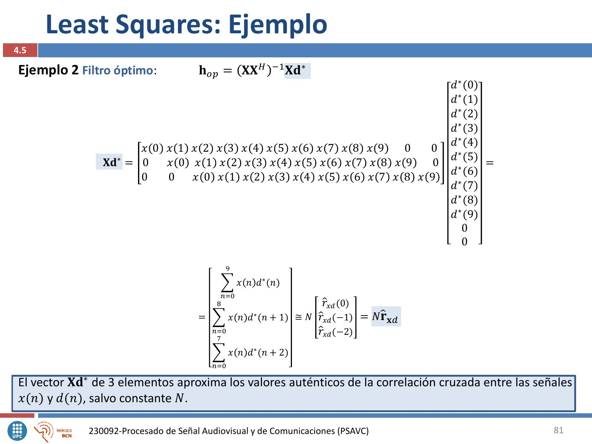

```text
      Least Squares: Ejemplo
4.5

 Ejemplo 2 Filtro óptimo:              𝐡𝐡𝑜𝑜𝑜𝑜 = 𝐗𝐗𝐗𝐗 𝐻𝐻 −1 𝐗𝐗𝐝𝐝∗
                                                                                            𝑑𝑑 ∗ (0)
                                                                                            𝑑𝑑 ∗ (1)
                                                                                            𝑑𝑑 ∗ (2)
                                                                                            𝑑𝑑 ∗ (3)
                                                                                            𝑑𝑑 ∗ (4)
                        𝑥𝑥 0 𝑥𝑥 1 𝑥𝑥 2 𝑥𝑥 3 𝑥𝑥 4 𝑥𝑥 5 𝑥𝑥 6 𝑥𝑥 7 𝑥𝑥 8 𝑥𝑥 9    0    0
                    ∗                                                                       𝑑𝑑 ∗ (5)
                 𝐗𝐗𝐝𝐝 = 0    𝑥𝑥 0 𝑥𝑥 1 𝑥𝑥 2 𝑥𝑥 3 𝑥𝑥 4 𝑥𝑥 5 𝑥𝑥 6 𝑥𝑥 7 𝑥𝑥 8 𝑥𝑥 9     0                 =
                        0     0   𝑥𝑥 0 𝑥𝑥 1 𝑥𝑥 2 𝑥𝑥 3 𝑥𝑥 4 𝑥𝑥 5 𝑥𝑥 6 𝑥𝑥 7 𝑥𝑥 8 𝑥𝑥 9         𝑑𝑑 ∗ (6)
                                                                                            𝑑𝑑 ∗ (7)
                                                                                            𝑑𝑑 ∗ (8)
                                                                                            𝑑𝑑 ∗ (9)
                                                                                                0
                                                                                                0

                                               9

                                            � 𝑥𝑥 𝑛𝑛 𝑑𝑑∗ (𝑛𝑛)
                                            𝑛𝑛=0
                                           8                          𝑟𝑟�𝑥𝑥𝑑𝑑 (0)
                                                                   �𝑥𝑥𝑥𝑥 (−1) = 𝑁𝑁�𝐫𝐫𝐱𝐱𝑑𝑑
                                       = � 𝑥𝑥 𝑛𝑛 𝑑𝑑∗ (𝑛𝑛 + 1) ≅ 𝑁𝑁 𝑟𝑟
                                         𝑛𝑛=0                      𝑟𝑟�𝑥𝑥𝑥𝑥 (−2)
                                           7

                                          � 𝑥𝑥 𝑛𝑛 𝑑𝑑∗ (𝑛𝑛 + 2)
                                          𝑛𝑛=0

 El vector 𝐗𝐗𝐝𝐝∗ de 3 elementos aproxima los valores auténticos de la correlación cruzada entre las señales
 𝑥𝑥(𝑛𝑛) y 𝑑𝑑(𝑛𝑛), salvo constante 𝑁𝑁.

              230092-Procesado de Señal Audiovisual y de Comunicaciones (PSAVC)                          81
```

## Page 82

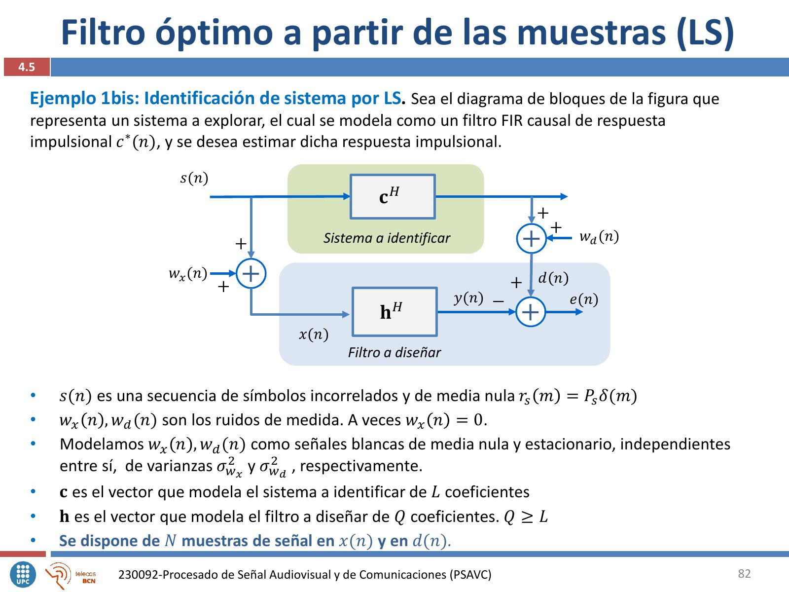

```text
      Filtro óptimo a partir de las muestras (LS)
4.5

  Ejemplo 1bis: Identificación de sistema por LS. Sea el diagrama de bloques de la figura que
  representa un sistema a explorar, el cual se modela como un filtro FIR causal de respuesta
  impulsional 𝑐𝑐 ∗ (𝑛𝑛), y se desea estimar dicha respuesta impulsional.

                        𝑠𝑠(𝑛𝑛)
                                                           𝐜𝐜 𝐻𝐻                             +
                                      +                                                  +
                                                 Sistema a identificar                 +          𝑤𝑤𝑑𝑑 (𝑛𝑛)
                                                                                  −
                      𝑤𝑤𝑥𝑥 (𝑛𝑛)
                                  +   +                                               + 𝑑𝑑 𝑛𝑛
                                                                         𝑦𝑦(𝑛𝑛)                  𝑒𝑒(𝑛𝑛)
                                                           𝐡𝐡𝐻𝐻                        +
                                                                                       +
                                             𝑥𝑥(𝑛𝑛)
                                                      Filtro a diseñar

  •   𝑠𝑠(𝑛𝑛) es una secuencia de símbolos incorrelados y de media nula 𝑟𝑟𝑠𝑠 𝑚𝑚 = 𝑃𝑃𝑠𝑠 𝛿𝛿(𝑚𝑚)
  •   𝑤𝑤𝑥𝑥 𝑛𝑛 , 𝑤𝑤𝑑𝑑 (𝑛𝑛) son los ruidos de medida. A veces 𝑤𝑤𝑥𝑥 𝑛𝑛 = 0.
  •   Modelamos 𝑤𝑤𝑥𝑥 𝑛𝑛 , 𝑤𝑤𝑑𝑑 (𝑛𝑛) como señales blancas de media nula y estacionario, independientes
      entre sí, de varianzas 𝜎𝜎𝑤𝑤2𝑥𝑥 y 𝜎𝜎𝑤𝑤2 𝑑𝑑 , respectivamente.
  •   𝐜𝐜 es el vector que modela el sistema a identificar de 𝐿𝐿 coeficientes
  •   𝐡𝐡 es el vector que modela el filtro a diseñar de 𝑄𝑄 coeficientes. 𝑄𝑄 ≥ 𝐿𝐿
  •   Se dispone de 𝑁𝑁 muestras de señal en 𝑥𝑥(𝑛𝑛) y en 𝑑𝑑(𝑛𝑛).
              230092-Procesado de Señal Audiovisual y de Comunicaciones (PSAVC)                               82
```

## Page 83

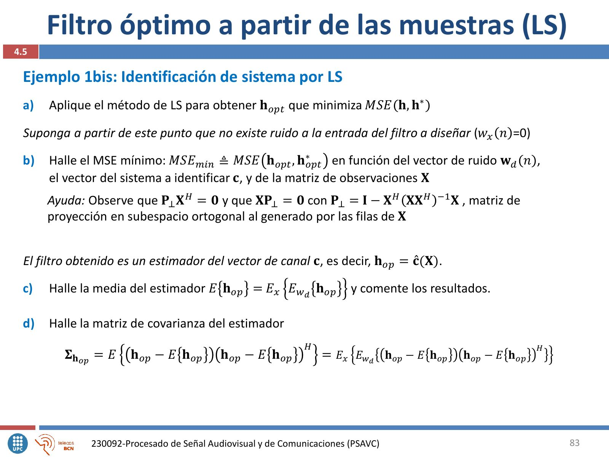

```text
       Filtro óptimo a partir de las muestras (LS)
4.5

  Ejemplo 1bis: Identificación de sistema por LS
  a)   Aplique el método de LS para obtener 𝐡𝐡𝑜𝑜𝑜𝑜𝑡𝑡 que minimiza 𝑀𝑀𝑀𝑀𝑀𝑀 𝐡𝐡, 𝐡𝐡∗

  Suponga a partir de este punto que no existe ruido a la entrada del filtro a diseñar (𝑤𝑤𝑥𝑥 𝑛𝑛 =0)

  b)   Halle el MSE mínimo: 𝑀𝑀𝑀𝑀𝑀𝑀𝑚𝑚𝑚𝑚𝑚𝑚 ≜ 𝑀𝑀𝑀𝑀𝑀𝑀 𝐡𝐡𝑜𝑜𝑜𝑜𝑡𝑡 , 𝐡𝐡∗𝑜𝑜𝑜𝑜𝑡𝑡 en función del vector de ruido 𝐰𝐰𝑑𝑑 𝑛𝑛 ,
       el vector del sistema a identificar 𝐜𝐜, y de la matriz de observaciones 𝐗𝐗
       Ayuda: Observe que 𝐏𝐏⊥ 𝐗𝐗 𝐻𝐻 = 𝟎𝟎 y que 𝐗𝐗𝐏𝐏⊥ = 𝟎𝟎 con 𝐏𝐏⊥ = 𝐈𝐈 − 𝐗𝐗 𝐻𝐻 𝐗𝐗𝐗𝐗 𝐻𝐻 −1 𝐗𝐗 , matriz de
       proyección en subespacio ortogonal al generado por las filas de 𝐗𝐗


  El filtro obtenido es un estimador del vector de canal 𝐜𝐜, es decir, 𝐡𝐡𝑜𝑜𝑜𝑜 = ̂𝐜𝐜(𝐗𝐗).

  c)   Halle la media del estimador 𝐸𝐸 𝐡𝐡𝑜𝑜𝑜𝑜 = 𝐸𝐸𝑥𝑥 𝐸𝐸𝑤𝑤𝑑𝑑 𝐡𝐡𝑜𝑜𝑜𝑜              y comente los resultados.

  d)   Halle la matriz de covarianza del estimador
                                                                    𝐻𝐻                                                           𝐻𝐻
          𝚺𝚺𝐡𝐡𝑜𝑜𝑜𝑜 = 𝐸𝐸   𝐡𝐡𝑜𝑜𝑜𝑜 − 𝐸𝐸 𝐡𝐡𝑜𝑜𝑜𝑜   𝐡𝐡𝑜𝑜𝑜𝑜 − 𝐸𝐸 𝐡𝐡𝑜𝑜𝑜𝑜        = 𝐸𝐸𝑥𝑥 𝐸𝐸𝑤𝑤𝑑𝑑 𝐡𝐡𝑜𝑜𝑜𝑜 − 𝐸𝐸 𝐡𝐡𝑜𝑜𝑜𝑜   𝐡𝐡𝑜𝑜𝑜𝑜 − 𝐸𝐸 𝐡𝐡𝑜𝑜𝑜𝑜


                230092-Procesado de Señal Audiovisual y de Comunicaciones (PSAVC)                                                     83
```

## Page 84

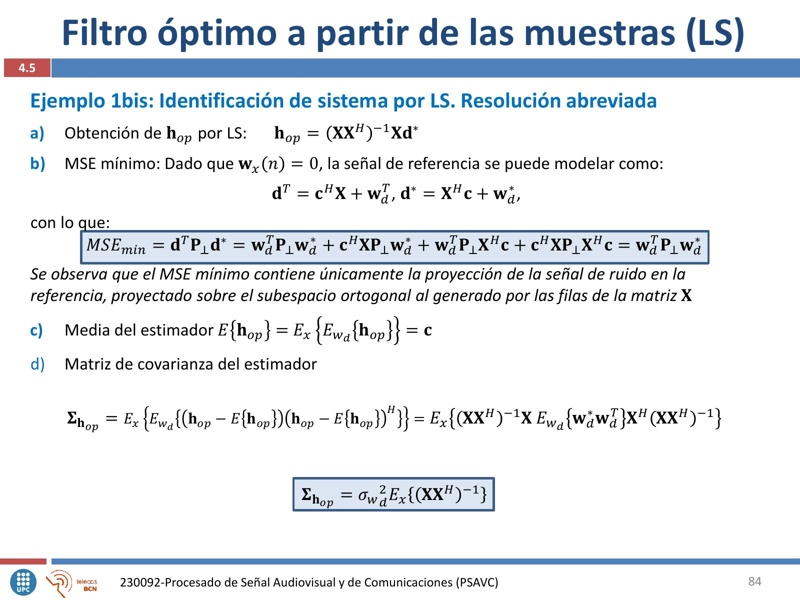

```text
        Filtro óptimo a partir de las muestras (LS)
4.5

  Ejemplo 1bis: Identificación de sistema por LS. Resolución abreviada
  a)    Obtención de 𝐡𝐡𝑜𝑜𝑜𝑜 por LS:                  𝐡𝐡𝑜𝑜𝑜𝑜 = 𝐗𝐗𝐗𝐗 𝐻𝐻 −1 𝐗𝐗𝐝𝐝∗
  b)    MSE mínimo: Dado que 𝐰𝐰𝑥𝑥 𝑛𝑛 = 0, la señal de referencia se puede modelar como:
                                                     𝐝𝐝𝑇𝑇 = 𝐜𝐜 𝐻𝐻 𝐗𝐗 + 𝐰𝐰𝑑𝑑𝑇𝑇 , 𝐝𝐝∗ = 𝐗𝐗 𝐻𝐻 𝐜𝐜 + 𝐰𝐰𝑑𝑑∗ ,
  con lo que:
          𝑀𝑀𝑀𝑀𝐸𝐸𝑚𝑚𝑚𝑚𝑚𝑚 = 𝐝𝐝𝑇𝑇 𝐏𝐏⊥ 𝐝𝐝∗ = 𝐰𝐰𝑑𝑑𝑇𝑇 𝐏𝐏⊥ 𝐰𝐰𝑑𝑑∗ + 𝐜𝐜 𝐻𝐻 𝐗𝐗𝐏𝐏⊥ 𝐰𝐰𝑑𝑑∗ + 𝐰𝐰𝑑𝑑𝑇𝑇 𝐏𝐏⊥ 𝐗𝐗 𝐻𝐻 𝐜𝐜 + 𝐜𝐜 𝐻𝐻 𝐗𝐗𝐏𝐏⊥ 𝐗𝐗 𝐻𝐻 𝐜𝐜 = 𝐰𝐰𝑑𝑑𝑇𝑇 𝐏𝐏⊥ 𝐰𝐰𝑑𝑑∗
  Se observa que el MSE mínimo contiene únicamente la proyección de la señal de ruido en la
  referencia, proyectado sobre el subespacio ortogonal al generado por las filas de la matriz 𝐗𝐗
  c)    Media del estimador 𝐸𝐸 𝐡𝐡𝑜𝑜𝑜𝑜 = 𝐸𝐸𝑥𝑥 𝐸𝐸𝑤𝑤𝑑𝑑 𝐡𝐡𝑜𝑜𝑜𝑜                        = 𝐜𝐜
  d)    Matriz de covarianza del estimador

                                                                             𝐻𝐻
         𝚺𝚺𝐡𝐡𝑜𝑜𝑜𝑜 = 𝐸𝐸𝑥𝑥 𝐸𝐸𝑤𝑤𝑑𝑑 𝐡𝐡𝑜𝑜𝑜𝑜 − 𝐸𝐸 𝐡𝐡𝑜𝑜𝑜𝑜      𝐡𝐡𝑜𝑜𝑜𝑜 − 𝐸𝐸 𝐡𝐡𝑜𝑜𝑜𝑜         = 𝐸𝐸𝑥𝑥 𝐗𝐗𝐗𝐗 𝐻𝐻 −1 𝐗𝐗 𝐸𝐸𝑤𝑤𝑑𝑑 𝐰𝐰𝑑𝑑∗ 𝐰𝐰𝑑𝑑𝑇𝑇 𝐗𝐗 𝐻𝐻 𝐗𝐗𝐗𝐗 𝐻𝐻 −1


                                                           𝚺𝚺𝐡𝐡𝑜𝑜𝑜𝑜 = 𝜎𝜎𝑤𝑤 2𝑑𝑑 𝐸𝐸𝑥𝑥 𝐗𝐗𝐗𝐗 𝐻𝐻 −1


                    230092-Procesado de Señal Audiovisual y de Comunicaciones (PSAVC)                                                          84
```

## Page 85


```text
Tema 4: Filtro de Wiener

1.   Introducción
2.   Aplicaciones
3.   MSE y ecuaciones normales
4.   Ejemplos de aplicación
5.   Filtro óptimo a partir de las muestras
6.   Conclusiones y ejercicios propuestos


      230092-Procesado de Señal Audiovisual y de Comunicaciones (PSAVC)   85
```

## Page 86

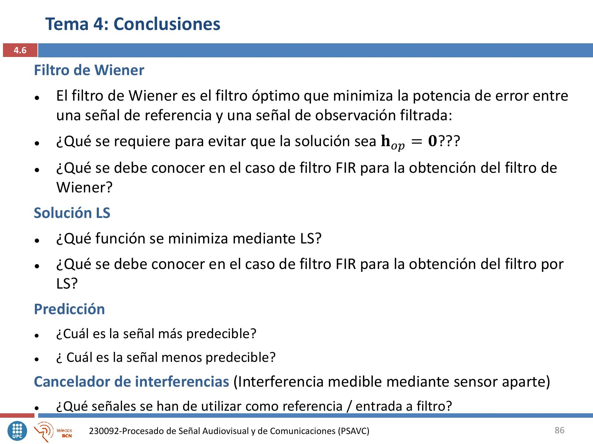

```text
          Tema 4: Conclusiones
4.6

      Filtro de Wiener
      ●    El filtro de Wiener es el filtro óptimo que minimiza la potencia de error entre
           una señal de referencia y una señal de observación filtrada:
      ●    ¿Qué se requiere para evitar que la solución sea 𝐡𝐡𝑜𝑜𝑜𝑜 = 𝟎𝟎???
      ●    ¿Qué se debe conocer en el caso de filtro FIR para la obtención del filtro de
           Wiener?
      Solución LS
      ●    ¿Qué función se minimiza mediante LS?
      ●    ¿Qué se debe conocer en el caso de filtro FIR para la obtención del filtro por
           LS?
      Predicción
      ●    ¿Cuál es la señal más predecible?
      ●    ¿ Cuál es la señal menos predecible?
      Cancelador de interferencias (Interferencia medible mediante sensor aparte)
      ●    ¿Qué señales se han de utilizar como referencia / entrada a filtro?
                230092-Procesado de Señal Audiovisual y de Comunicaciones (PSAVC)      86
```

## Page 87


```text
        Tema 4: Ejercicios Propuestos
 4.6

   Ejercicios recomendados de la Colección de ejercicios del Tema 4 (Metacurs en Atenea)

• Predicción lineal:                                      • Inversión de sistemas:
   • Se recomienda hacer: 9,10,11,19,22                      • Se recomienda hacer: 24
   • También podéis hacer: 3,5,6,8,14,17 (excepto apdo a)
                                                          • Filtrado con restricciones:
• Cancelación de interferencias:                             • Se recomienda hacer: 13,22
   • Se recomienda hacer: 2,12 (relacionado con 5.7, que     • También podéis hacer: 8
      es más interesante),13,22
   • También podéis hacer: 20 (omitir apdo c))            • Filtrado en base a datos (Least Squares):
                                                             • Se recomienda hacer: 2, 21 (continuación de 3.29)
• Identificación de sistemas:                                • También podéis hacer: 8
   • Se recomienda hacer: 15, 18 (omitir apdos 4-5), 21
      (continuación de 3.29)                              • Otras aplicaciones:
                                                             • Se recomienda hacer: 16


   Quedan fuera de temario para este cuatrimestre los ejercicios siguientes de la colección :
          1,4,7,17(apdo a),18 (apdos 4-5), 20 (apdo c) ,23, 24 (apdos c-f),


   Además, se recomienda realizar los ejercicios de los exámenes parciales y finales del tema de estimación
   disponibles en el metacurs de Atenea.


                 230092-Procesado de Señal Audiovisual y de Comunicaciones (PSAVC)                            87
```
