# PSAVC 5 Filtrado Adaptativo QP 20026 G10

- Source PDF: `Teoria/PSAVC 5 Filtrado Adaptativo QP 20026 G10.pdf`
- PDF title: `T2 - La señal en el dominio temporal o espacial`
- Pages: 72
- Note: Transcribed from the embedded PDF text layer. Each page links to a rendered page image so figures, plots, handwriting, and formula layout can be checked against the original.
- Text-layer caveat: `�` marks a glyph that the PDF text layer does not map to Unicode; use the rendered page image for that formula or symbol.

## Page 1


```text
            Tema 5.- Filtrado Adaptativo


Copyright © Profesorado de la asignatura 230092-PSAVC-ETSETB.


UPC / GPS                   230092 – PSAVC – GRETST - ETSETB
```

## Page 2

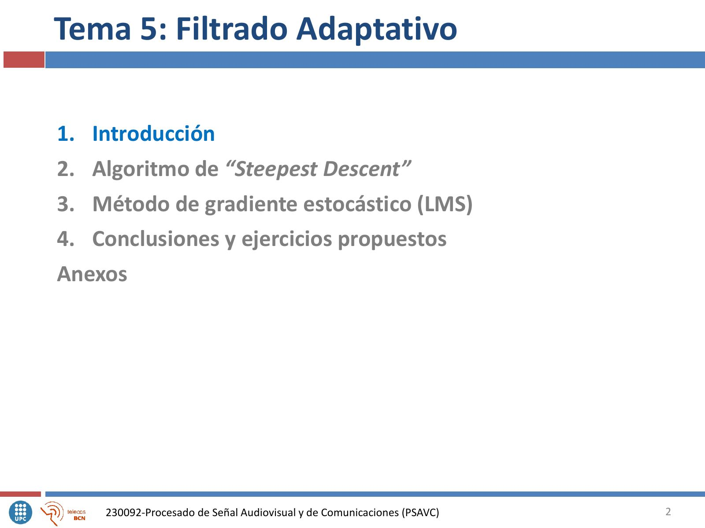

```text
Tema 5: Filtrado Adaptativo

1. Introducción
2. Algoritmo de “Steepest Descent”
3. Método de gradiente estocástico (LMS)
4. Conclusiones y ejercicios propuestos
Anexos


    230092-Procesado de Señal Audiovisual y de Comunicaciones (PSAVC)   2
```

## Page 3

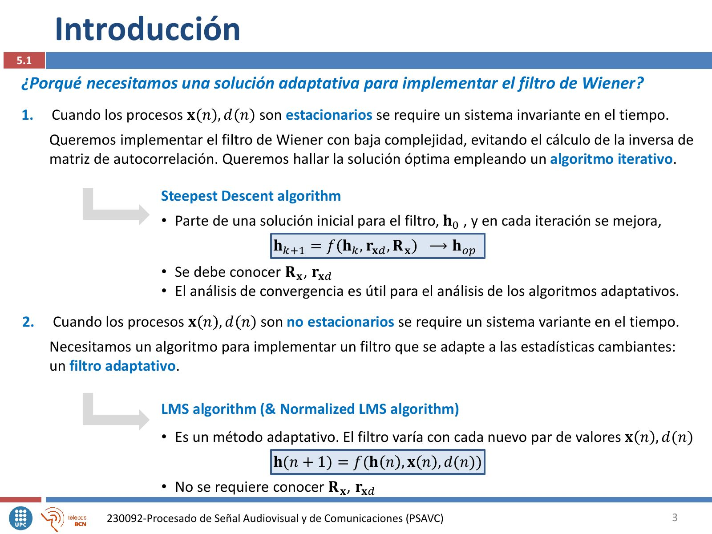

```text
      Introducción
5.1

¿Porqué necesitamos una solución adaptativa para implementar el filtro de Wiener?
1.    Cuando los procesos 𝐱𝐱 𝑛𝑛 , 𝑑𝑑 𝑛𝑛 son estacionarios se require un sistema invariante en el tiempo.
      Queremos implementar el filtro de Wiener con baja complejidad, evitando el cálculo de la inversa de
      matriz de autocorrelación. Queremos hallar la solución óptima empleando un algoritmo iterativo.

                        Steepest Descent algorithm
                        • Parte de una solución inicial para el filtro, 𝐡𝐡0 , y en cada iteración se mejora,
                                              𝐡𝐡𝑘𝑘+1 = 𝑓𝑓 𝐡𝐡𝑘𝑘 , 𝐫𝐫𝐱𝐱𝑑𝑑 , 𝐑𝐑 𝐱𝐱   ⟶ 𝐡𝐡𝑜𝑜𝑜𝑜
                        • Se debe conocer 𝐑𝐑 𝐱𝐱 , 𝐫𝐫𝐱𝐱𝑑𝑑
                        • El análisis de convergencia es útil para el análisis de los algoritmos adaptativos.
 2.   Cuando los procesos 𝐱𝐱 𝑛𝑛 , 𝑑𝑑 𝑛𝑛 son no estacionarios se require un sistema variante en el tiempo.
      Necesitamos un algoritmo para implementar un filtro que se adapte a las estadísticas cambiantes:
      un filtro adaptativo.

                        LMS algorithm (& Normalized LMS algorithm)
                        • Es un método adaptativo. El filtro varía con cada nuevo par de valores 𝐱𝐱 𝑛𝑛 , 𝑑𝑑(𝑛𝑛)
                                              𝐡𝐡(𝑛𝑛 + 1) = 𝑓𝑓(𝐡𝐡 𝑛𝑛 , 𝐱𝐱 𝑛𝑛 , 𝑑𝑑(𝑛𝑛))
                        • No se requiere conocer 𝐑𝐑 𝐱𝐱 , 𝐫𝐫𝐱𝐱𝑑𝑑
              230092-Procesado de Señal Audiovisual y de Comunicaciones (PSAVC)                                3
```

## Page 4

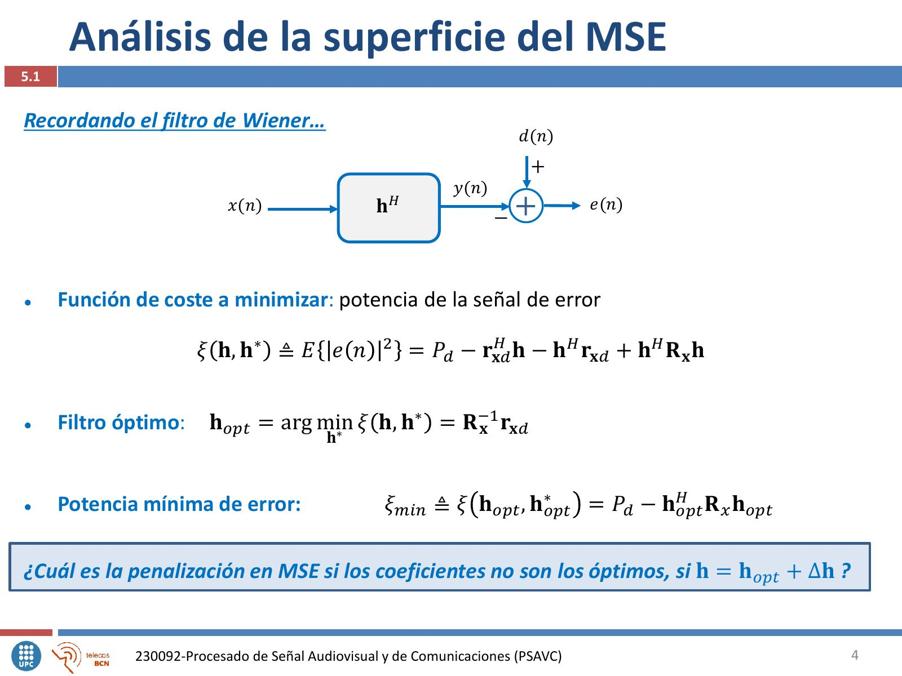

```text
       Análisis de la superficie del MSE
5.1


Recordando el filtro de Wiener…
                                                                             𝑑𝑑(𝑛𝑛)

                                                                         −     +
                                                                𝑦𝑦(𝑛𝑛)
                            𝑥𝑥(𝑛𝑛)                𝐡𝐡𝐻𝐻
                                                                             +        𝑒𝑒(𝑛𝑛)


●     Función de coste a minimizar: potencia de la señal de error
                                                                    𝐻𝐻
                       𝜉𝜉 𝐡𝐡, 𝐡𝐡∗ ≜ 𝐸𝐸 𝑒𝑒 𝑛𝑛       2     = 𝑃𝑃𝑑𝑑 − 𝐫𝐫𝐱𝐱𝑑𝑑 𝐡𝐡 − 𝐡𝐡𝐻𝐻 𝐫𝐫𝐱𝐱𝑑𝑑 + 𝐡𝐡𝐻𝐻 𝐑𝐑 𝐱𝐱 𝐡𝐡


●     Filtro óptimo:     𝐡𝐡𝑜𝑜𝑜𝑜𝑡𝑡 = arg min
                                         ∗
                                            𝜉𝜉 𝐡𝐡, 𝐡𝐡∗ = 𝐑𝐑−1
                                                           𝐱𝐱 𝐫𝐫𝐱𝐱𝑑𝑑
                                           𝐡𝐡


●     Potencia mínima de error:                    𝜉𝜉𝑚𝑚𝑚𝑚𝑚𝑚 ≜ 𝜉𝜉 𝐡𝐡𝑜𝑜𝑜𝑜𝑡𝑡 , 𝐡𝐡∗𝑜𝑜𝑜𝑜𝑡𝑡 = 𝑃𝑃𝑑𝑑 − 𝐡𝐡𝐻𝐻
                                                                                                 𝑜𝑜𝑜𝑜𝑜𝑜 𝐑𝐑 𝑥𝑥 𝐡𝐡𝑜𝑜𝑜𝑜𝑜𝑜


¿Cuál es la penalización en MSE si los coeficientes no son los óptimos, si 𝐡𝐡 = 𝐡𝐡𝑜𝑜𝑜𝑜𝑡𝑡 + Δ𝐡𝐡 ?


              230092-Procesado de Señal Audiovisual y de Comunicaciones (PSAVC)                                          4
```

## Page 5

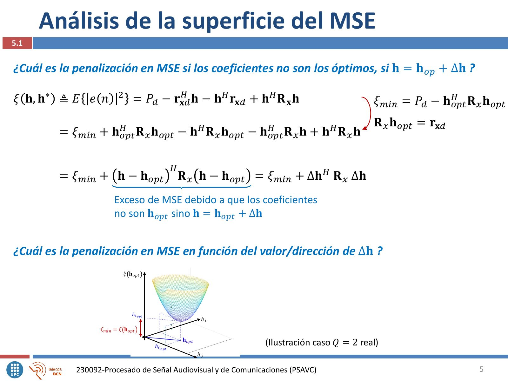

```text
      Análisis de la superficie del MSE
5.1


¿Cuál es la penalización en MSE si los coeficientes no son los óptimos, si 𝐡𝐡 = 𝐡𝐡𝑜𝑜𝑜𝑜 + Δ𝐡𝐡 ?

                                                     𝐻𝐻
𝜉𝜉 𝐡𝐡, 𝐡𝐡∗ ≜ 𝐸𝐸 𝑒𝑒 𝑛𝑛            2        = 𝑃𝑃𝑑𝑑 − 𝐫𝐫𝐱𝐱𝑑𝑑 𝐡𝐡 − 𝐡𝐡𝐻𝐻 𝐫𝐫𝐱𝐱𝑑𝑑 + 𝐡𝐡𝐻𝐻 𝐑𝐑 𝐱𝐱 𝐡𝐡                              𝜉𝜉𝑚𝑚𝑚𝑚𝑚𝑚 = 𝑃𝑃𝑑𝑑 − 𝐡𝐡𝐻𝐻
                                                                                                                                            𝑜𝑜𝑜𝑜𝑜𝑜 𝐑𝐑 𝑥𝑥 𝐡𝐡𝑜𝑜𝑜𝑜𝑜𝑜

                                                                                                                        𝐑𝐑 𝑥𝑥 𝐡𝐡𝑜𝑜𝑜𝑜𝑜𝑜 = 𝐫𝐫𝐱𝐱𝑑𝑑
          = 𝜉𝜉𝑚𝑚𝑚𝑚𝑚𝑚 + 𝐡𝐡𝐻𝐻                        𝐻𝐻                  𝐻𝐻                  𝐻𝐻
                         𝑜𝑜𝑜𝑜𝑜𝑜 𝐑𝐑 𝑥𝑥 𝐡𝐡𝑜𝑜𝑜𝑜𝑜𝑜 − 𝐡𝐡 𝐑𝐑 𝑥𝑥 𝐡𝐡𝑜𝑜𝑜𝑜𝑜𝑜 − 𝐡𝐡𝑜𝑜𝑜𝑜𝑜𝑜 𝐑𝐑 𝑥𝑥 𝐡𝐡 + 𝐡𝐡 𝐑𝐑 𝑥𝑥 𝐡𝐡


                                                                𝐻𝐻
          = 𝜉𝜉𝑚𝑚𝑚𝑚𝑚𝑚 + 𝐡𝐡 − 𝐡𝐡𝑜𝑜𝑜𝑜𝑜𝑜                                 𝐑𝐑 𝑥𝑥 𝐡𝐡 − 𝐡𝐡𝑜𝑜𝑜𝑜𝑜𝑜 = 𝜉𝜉𝑚𝑚𝑚𝑚𝑚𝑚 + Δ𝐡𝐡𝐻𝐻 𝐑𝐑 𝑥𝑥 Δ𝐡𝐡
                              Exceso de MSE debido a que los coeficientes
                              no son 𝐡𝐡𝑜𝑜𝑜𝑜𝑜𝑜 sino 𝐡𝐡 = 𝐡𝐡𝑜𝑜𝑜𝑜𝑡𝑡 + Δ𝐡𝐡


¿Cuál es la penalización en MSE en función del valor/dirección de Δ𝐡𝐡 ?
                                    𝜉𝜉 𝐡𝐡𝑜𝑜𝑜𝑜𝑜𝑜


                                          ℎ1𝑜𝑜𝑜𝑜𝑜𝑜
                                                                                  ℎ1
                      𝜉𝜉𝑚𝑚𝑚𝑚𝑚𝑚 = 𝜉𝜉 𝐡𝐡𝑜𝑜𝑜𝑜𝑜𝑜

                                                     ℎ0𝑜𝑜𝑜𝑜𝑜𝑜
                                                                      𝐡𝐡𝑜𝑜𝑜𝑜𝑜𝑜
                                                                                           (Ilustración caso 𝑄𝑄 = 2 real)
                                                                                 ℎ0

               230092-Procesado de Señal Audiovisual y de Comunicaciones (PSAVC)                                                                        5
```

## Page 6

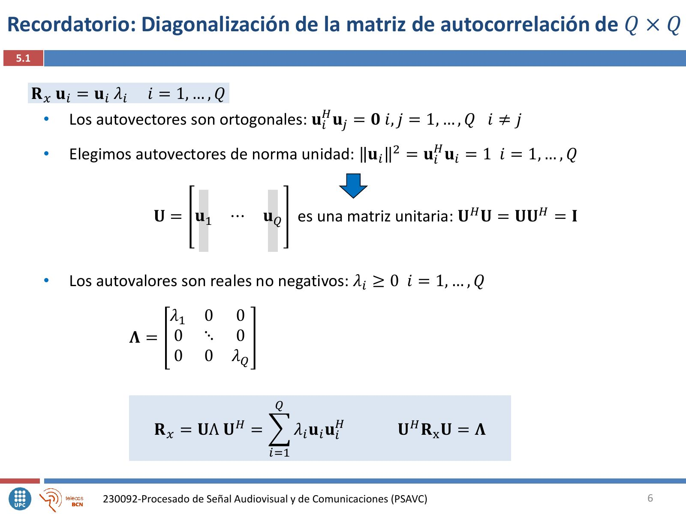

```text
Recordatorio: Diagonalización de la matriz de autocorrelación de 𝑄𝑄 × 𝑄𝑄
5.1


      𝐑𝐑 𝑥𝑥 𝐮𝐮𝑖𝑖 = 𝐮𝐮𝑖𝑖 𝜆𝜆𝑖𝑖     𝑖𝑖 = 1, … , 𝑄𝑄
        •     Los autovectores son ortogonales: 𝐮𝐮𝐻𝐻
                                                  𝑖𝑖 𝐮𝐮𝑗𝑗 = 𝟎𝟎 𝑖𝑖, 𝑗𝑗 = 1, … , 𝑄𝑄 𝑖𝑖 ≠ 𝑗𝑗

        •     Elegimos autovectores de norma unidad: 𝐮𝐮𝑖𝑖 2 = 𝐮𝐮𝐻𝐻
                                                                𝑖𝑖 𝐮𝐮𝑖𝑖 = 1 𝑖𝑖 = 1, … , 𝑄𝑄


                                  𝐔𝐔 = 𝐮𝐮1        ⋯   𝐮𝐮𝑄𝑄 es una matriz unitaria: 𝐔𝐔 𝐻𝐻 𝐔𝐔 = 𝐔𝐔𝐔𝐔𝐻𝐻 = 𝐈𝐈


        •     Los autovalores son reales no negativos: 𝜆𝜆𝑖𝑖 ≥ 0 𝑖𝑖 = 1, … , 𝑄𝑄

                                    𝜆𝜆1    0 0
                               𝚲𝚲 = 0      ⋱ 0
                                     0     0 𝜆𝜆𝑄𝑄

                                                        𝑄𝑄

                                  𝐑𝐑 𝑥𝑥 = 𝐔𝐔Λ 𝐔𝐔𝐻𝐻 = � 𝜆𝜆𝑖𝑖 𝐮𝐮𝑖𝑖 𝐮𝐮𝐻𝐻
                                                                   𝑖𝑖            𝐔𝐔 𝐻𝐻 𝐑𝐑 x 𝐔𝐔 = 𝚲𝚲
                                                       𝑖𝑖=1


                      230092-Procesado de Señal Audiovisual y de Comunicaciones (PSAVC)                     6
```

## Page 7

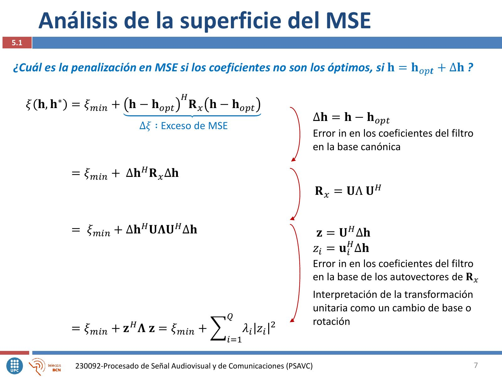

```text
         Análisis de la superficie del MSE
5.1


¿Cuál es la penalización en MSE si los coeficientes no son los óptimos, si 𝐡𝐡 = 𝐡𝐡𝑜𝑜𝑜𝑜𝒕𝒕 + Δ𝐡𝐡 ?

                                                𝐻𝐻
      𝜉𝜉 𝐡𝐡, 𝐡𝐡∗ = 𝜉𝜉𝑚𝑚𝑚𝑚𝑚𝑚 + 𝐡𝐡 − 𝐡𝐡𝑜𝑜𝑜𝑜𝑜𝑜          𝐑𝐑 𝑥𝑥 𝐡𝐡 − 𝐡𝐡𝑜𝑜𝑜𝑜𝑜𝑜
                                                                                  ∆𝐡𝐡 = 𝐡𝐡 − 𝐡𝐡𝑜𝑜𝑜𝑜𝑜𝑜
                                   Δ𝜉𝜉 ∶ Exceso de MSE
                                                                                  Error in en los coeficientes del filtro
                                                                                  en la base canónica

                 = 𝜉𝜉𝑚𝑚𝑚𝑚𝑚𝑚 + ∆𝐡𝐡𝐻𝐻 𝐑𝐑 𝑥𝑥 ∆𝐡𝐡
                                                                                      𝐑𝐑 𝑥𝑥 = 𝐔𝐔Λ 𝐔𝐔 𝐻𝐻


                 = 𝜉𝜉𝑚𝑚𝑚𝑚𝑚𝑚 + ∆𝐡𝐡𝐻𝐻 𝐔𝐔𝐔𝐔𝐔𝐔𝐻𝐻 ∆𝐡𝐡                                   𝐳𝐳 = 𝐔𝐔𝐻𝐻 ∆𝐡𝐡
                                                                                  𝑧𝑧𝑖𝑖 = 𝐮𝐮𝐻𝐻
                                                                                           𝑖𝑖 ∆𝐡𝐡
                                                                                  Error in en los coeficientes del filtro
                                                                                  en la base de los autovectores de 𝐑𝐑 𝑥𝑥
                                                                                  Interpretación de la transformación
                                                                                  unitaria como un cambio de base o
                                                               𝑄𝑄
                                                                                  rotación
                 = 𝜉𝜉𝑚𝑚𝑚𝑚𝑚𝑚 + 𝐳𝐳 𝐻𝐻 𝚲𝚲 𝐳𝐳 = 𝜉𝜉𝑚𝑚𝑚𝑚𝑚𝑚 + �            𝜆𝜆𝑖𝑖 𝑧𝑧𝑖𝑖 2
                                                               𝑖𝑖=1

                  230092-Procesado de Señal Audiovisual y de Comunicaciones (PSAVC)                                         7
```

## Page 8

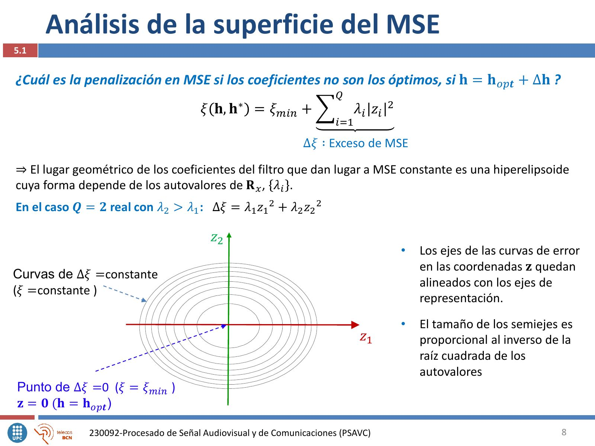

```text
      Análisis de la superficie del MSE
5.1


¿Cuál es la penalización en MSE si los coeficientes no son los óptimos, si 𝐡𝐡 = 𝐡𝐡𝑜𝑜𝑜𝑜𝒕𝒕 + Δ𝐡𝐡 ?
                                                                        𝑄𝑄
                                         𝜉𝜉 𝐡𝐡, 𝐡𝐡∗   = 𝜉𝜉𝑚𝑚𝑚𝑚𝑚𝑚 + �         𝜆𝜆𝑖𝑖 𝑧𝑧𝑖𝑖 2
                                                                        𝑖𝑖=1
                                                                 Δ𝜉𝜉 ∶ Exceso de MSE

⇒ El lugar geométrico de los coeficientes del filtro que dan lugar a MSE constante es una hiperelipsoide
cuya forma depende de los autovalores de 𝐑𝐑 𝑥𝑥 , 𝜆𝜆𝑖𝑖 .
En el caso 𝑸𝑸 = 𝟐𝟐 real con 𝜆𝜆2 > 𝜆𝜆1 : Δ𝜉𝜉 = 𝜆𝜆1 𝑧𝑧1 2 + 𝜆𝜆2 𝑧𝑧2 2

                                            𝑧𝑧2
                                                                                           •   Los ejes de las curvas de error
                                                                                               en las coordenadas 𝐳𝐳 quedan
Curvas de Δ𝜉𝜉 =constante
                                                                                               alineados con los ejes de
(𝜉𝜉 =constante )
                                                                                               representación.
                                                                                           •   El tamaño de los semiejes es
                                                                               𝑧𝑧1             proporcional al inverso de la
                                                                                               raíz cuadrada de los
                                                                                               autovalores
Punto de Δ𝜉𝜉 =0 (𝜉𝜉 = 𝜉𝜉𝑚𝑚𝑚𝑚𝑚𝑚 )
𝐳𝐳 = 𝟎𝟎 (𝐡𝐡 = 𝐡𝐡𝑜𝑜𝑜𝑜𝒕𝒕 )

                230092-Procesado de Señal Audiovisual y de Comunicaciones (PSAVC)                                         8
```

## Page 9

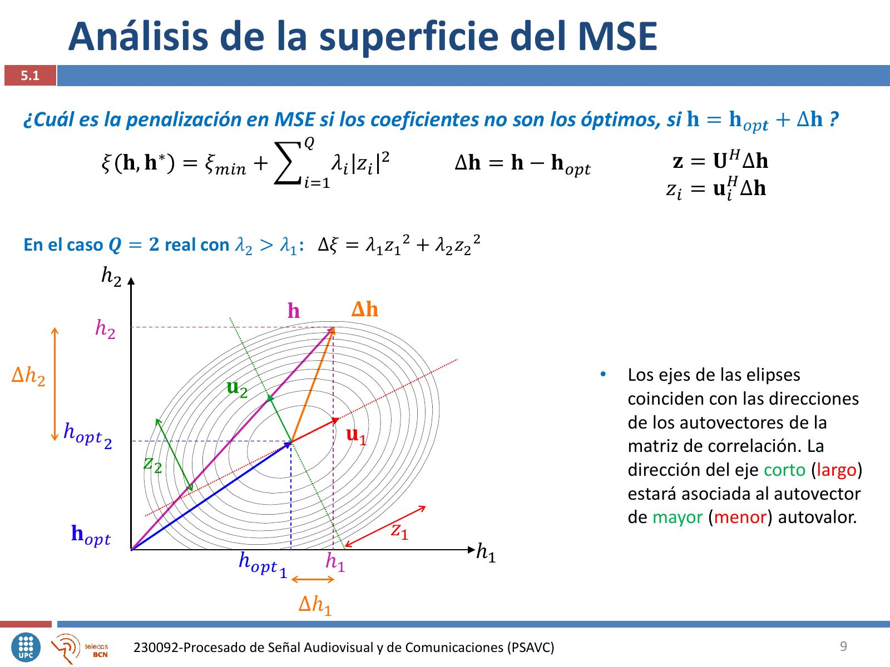

```text
       Análisis de la superficie del MSE
5.1


 ¿Cuál es la penalización en MSE si los coeficientes no son los óptimos, si 𝐡𝐡 = 𝐡𝐡𝑜𝑜𝑜𝑜𝒕𝒕 + Δ𝐡𝐡 ?
                                               𝑄𝑄
             𝜉𝜉 𝐡𝐡, 𝐡𝐡∗   = 𝜉𝜉𝑚𝑚𝑚𝑚𝑚𝑚 + �            𝜆𝜆𝑖𝑖 𝑧𝑧𝑖𝑖 2       ∆𝐡𝐡 = 𝐡𝐡 − 𝐡𝐡𝑜𝑜𝑜𝑜𝑜𝑜             𝐳𝐳 = 𝐔𝐔𝐻𝐻 ∆𝐡𝐡
                                               𝑖𝑖=1                                                  𝑧𝑧𝑖𝑖 = 𝐮𝐮𝐻𝐻
                                                                                                              𝑖𝑖 ∆𝐡𝐡


 En el caso 𝑸𝑸 = 𝟐𝟐 real con 𝜆𝜆2 > 𝜆𝜆1 : Δ𝜉𝜉 = 𝜆𝜆1 𝑧𝑧1 2 + 𝜆𝜆2 𝑧𝑧2 2
            ℎ2
                                          𝐡𝐡             𝚫𝚫𝚫𝚫
           ℎ2

Δℎ2                                                                                         •   Los ejes de las elipses
                                𝐮𝐮2
                                                                                                coinciden con las direcciones
      ℎ𝑜𝑜𝑜𝑜𝑜𝑜 2                                                                                 de los autovectores de la
                                                      𝐮𝐮1
                                                                                                matriz de correlación. La
                   𝑧𝑧2                                                                          dirección del eje corto (largo)
                                                                                                estará asociada al autovector
                                                                                                de mayor (menor) autovalor.
       𝐡𝐡𝑜𝑜𝑜𝑜𝑜𝑜                                                 𝑧𝑧1
                                  ℎ𝑜𝑜𝑜𝑜𝑜𝑜 1         ℎ1                  ℎ1

                                              Δℎ1
                  230092-Procesado de Señal Audiovisual y de Comunicaciones (PSAVC)                                        9
```

## Page 10

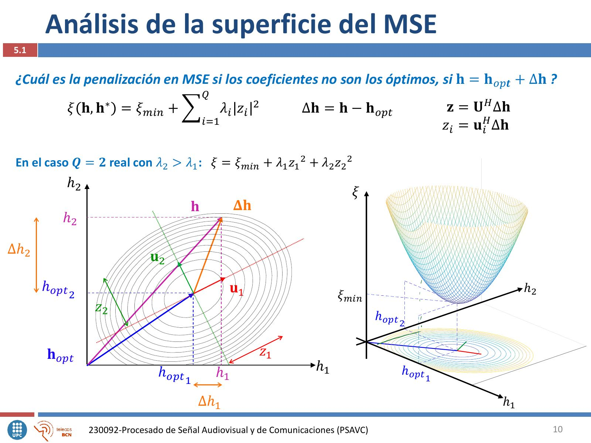

```text
       Análisis de la superficie del MSE
5.1


 ¿Cuál es la penalización en MSE si los coeficientes no son los óptimos, si 𝐡𝐡 = 𝐡𝐡𝑜𝑜𝑜𝑜𝒕𝒕 + Δ𝐡𝐡 ?
                                                𝑄𝑄
              𝜉𝜉 𝐡𝐡, 𝐡𝐡∗   = 𝜉𝜉𝑚𝑚𝑚𝑚𝑚𝑚 + �            𝜆𝜆𝑖𝑖 𝑧𝑧𝑖𝑖 2       ∆𝐡𝐡 = 𝐡𝐡 − 𝐡𝐡𝑜𝑜𝑜𝑜𝑜𝑜                    𝐳𝐳 = 𝐔𝐔𝐻𝐻 ∆𝐡𝐡
                                                𝑖𝑖=1                                                         𝑧𝑧𝑖𝑖 = 𝐮𝐮𝐻𝐻
                                                                                                                      𝑖𝑖 ∆𝐡𝐡


 En el caso 𝑸𝑸 = 𝟐𝟐 real con 𝜆𝜆2 > 𝜆𝜆1 : 𝜉𝜉 = 𝜉𝜉𝑚𝑚𝑚𝑚𝑚𝑚 + 𝜆𝜆1 𝑧𝑧1 2 + 𝜆𝜆2 𝑧𝑧2 2
             ℎ2
                                                                                  𝜉𝜉
                                           𝐡𝐡             𝚫𝚫𝚫𝚫
            ℎ2

Δℎ2
                                 𝐮𝐮2

       ℎ𝑜𝑜𝑜𝑜𝑜𝑜 2                                       𝐮𝐮1                                                                     ℎ2
                                                                              𝜉𝜉𝑚𝑚𝑚𝑚𝑚𝑚
                    𝑧𝑧2
                                                                                         ℎ𝑜𝑜𝑜𝑜𝑜𝑜 2

        𝐡𝐡𝑜𝑜𝑜𝑜𝑜𝑜                                                 𝑧𝑧1
                                   ℎ𝑜𝑜𝑜𝑜𝑜𝑜 1         ℎ1                  ℎ1                      ℎ𝑜𝑜𝑜𝑜𝑜𝑜 1

                                               Δℎ1                                                                        ℎ1

                   230092-Procesado de Señal Audiovisual y de Comunicaciones (PSAVC)                                                10
```

## Page 11

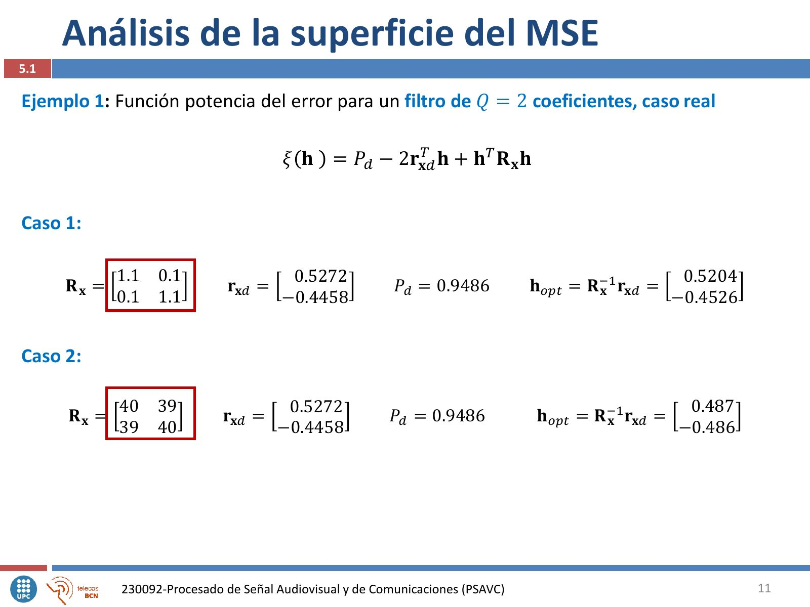

```text
      Análisis de la superficie del MSE
5.1

Ejemplo 1: Función potencia del error para un filtro de 𝑄𝑄 = 2 coeficientes, caso real

                                                               𝑇𝑇
                                             𝜉𝜉 𝐡𝐡 = 𝑃𝑃𝑑𝑑 − 2𝐫𝐫𝐱𝐱𝑑𝑑 𝐡𝐡 + 𝐡𝐡𝑇𝑇 𝐑𝐑 𝐱𝐱 𝐡𝐡


Caso 1:

                1.1   0.1                     0.5272                                                                 0.5204
      𝐑𝐑 𝐱𝐱 =                     𝐫𝐫𝐱𝐱𝑑𝑑 =                     𝑃𝑃𝑑𝑑 = 0.9486         𝐡𝐡𝑜𝑜𝑜𝑜𝑡𝑡 = 𝐑𝐑−1
                                                                                                  𝐱𝐱 𝐫𝐫𝐱𝐱𝑑𝑑 =
                0.1   1.1                    −0.4458                                                                −0.4526


Caso 2:

                40    39                      0.5272                                                                 0.487
      𝐑𝐑 𝐱𝐱 =                    𝐫𝐫𝐱𝐱𝑑𝑑 =                     𝑃𝑃𝑑𝑑 = 0.9486              𝐡𝐡𝑜𝑜𝑜𝑜𝑡𝑡 = 𝐑𝐑−1
                                                                                                      𝐱𝐱 𝐫𝐫𝐱𝐱𝑑𝑑 =
                39    40                     −0.4458                                                                −0.486


                230092-Procesado de Señal Audiovisual y de Comunicaciones (PSAVC)                                             11
```

## Page 12

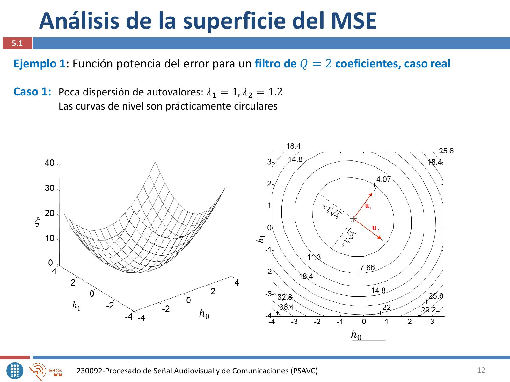

```text
      Análisis de la superficie del MSE
5.1

Ejemplo 1: Función potencia del error para un filtro de 𝑄𝑄 = 2 coeficientes, caso real

Caso 1: Poca dispersión de autovalores: 𝜆𝜆1 = 1, 𝜆𝜆2 = 1.2
         Las curvas de nivel son prácticamente circulares


                                             ℎ0
                                                                                 ℎ0


             230092-Procesado de Señal Audiovisual y de Comunicaciones (PSAVC)           12
```

## Page 13

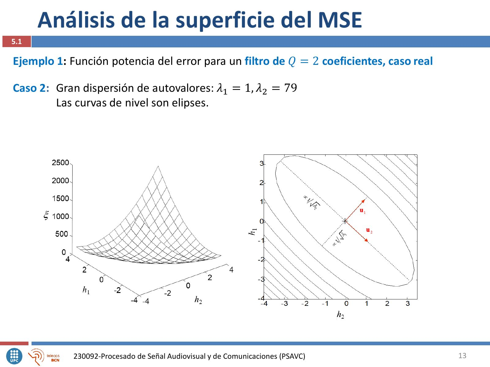

```text
      Análisis de la superficie del MSE
5.1

Ejemplo 1: Función potencia del error para un filtro de 𝑄𝑄 = 2 coeficientes, caso real

Caso 2: Gran dispersión de autovalores: 𝜆𝜆1 = 1, 𝜆𝜆2 = 79
        Las curvas de nivel son elipses.


            230092-Procesado de Señal Audiovisual y de Comunicaciones (PSAVC)            13
```

## Page 14

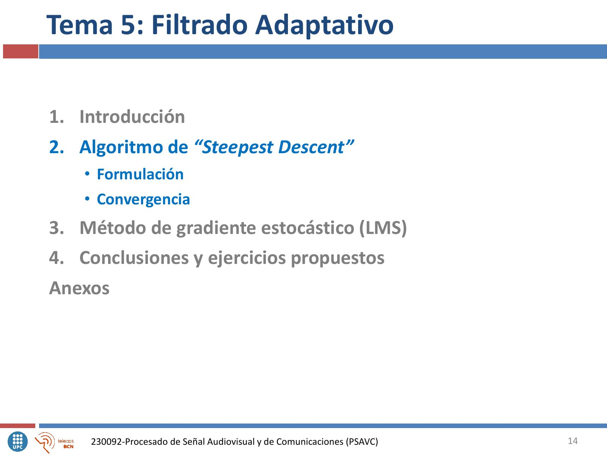

```text
Tema 5: Filtrado Adaptativo

1. Introducción
2. Algoritmo de “Steepest Descent”
   • Formulación
   • Convergencia
3. Método de gradiente estocástico (LMS)
4. Conclusiones y ejercicios propuestos
Anexos


    230092-Procesado de Señal Audiovisual y de Comunicaciones (PSAVC)   14
```

## Page 15

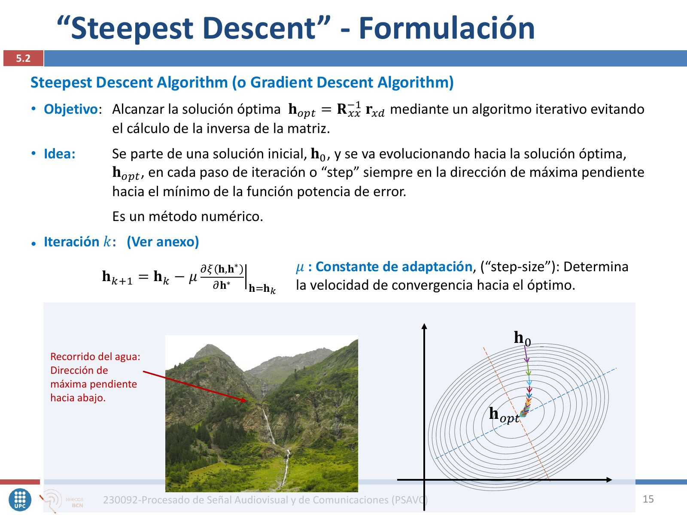

```text
           “Steepest Descent” - Formulación
5.2

      Steepest Descent Algorithm (o Gradient Descent Algorithm)
      • Objetivo: Alcanzar la solución óptima 𝐡𝐡𝑜𝑜𝑜𝑜𝑜𝑜 = 𝐑𝐑−1
                                                           𝑥𝑥𝑥𝑥 𝐫𝐫𝑥𝑥𝑥𝑥 mediante un algoritmo iterativo evitando
                  el cálculo de la inversa de la matriz.
      • Idea:          Se parte de una solución inicial, 𝐡𝐡0 , y se va evolucionando hacia la solución óptima,
                       𝐡𝐡𝑜𝑜𝑜𝑜𝑡𝑡 , en cada paso de iteración o “step” siempre en la dirección de máxima pendiente
                       hacia el mínimo de la función potencia de error.
                       Es un método numérico.
      ●   Iteración 𝑘𝑘: (Ver anexo)
                                         𝜕𝜕𝜉𝜉 𝐡𝐡,𝐡𝐡∗             𝜇𝜇 : Constante de adaptación, (“step-size”): Determina
                    𝐡𝐡𝑘𝑘+1 = 𝐡𝐡𝑘𝑘 − 𝜇𝜇               �
                                             𝜕𝜕𝐡𝐡∗     𝐡𝐡=𝐡𝐡𝑘𝑘   la velocidad de convergencia hacia el óptimo.


                                                                                                      𝐡𝐡0
          Recorrido del agua:
          Dirección de
          máxima pendiente
          hacia abajo.
                                                                                                𝐡𝐡𝑜𝑜𝑜𝑜𝑜𝑜


                     230092-Procesado de Señal Audiovisual y de Comunicaciones (PSAVC)                                    15
```

## Page 16

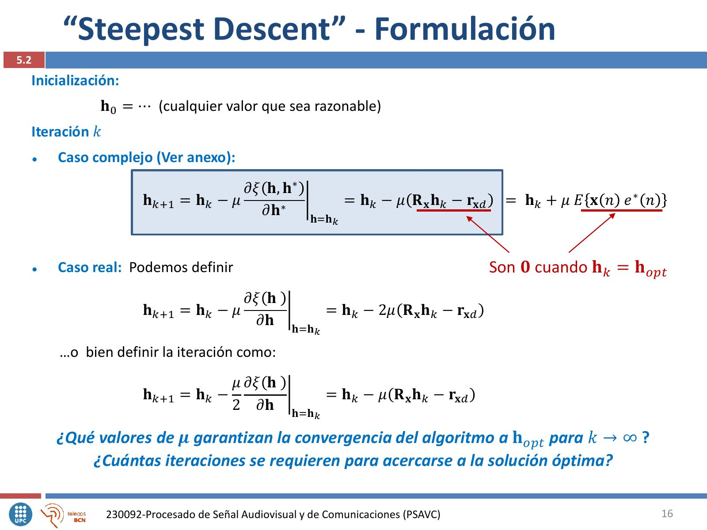

```text
           “Steepest Descent” - Formulación
5.2
      Inicialización:
                 𝐡𝐡0 = ⋯ (cualquier valor que sea razonable)
      Iteración 𝑘𝑘
      ●   Caso complejo (Ver anexo):
                                               𝜕𝜕𝜉𝜉 𝐡𝐡, 𝐡𝐡∗
                            𝐡𝐡𝑘𝑘+1 = 𝐡𝐡𝑘𝑘 − 𝜇𝜇              �       = 𝐡𝐡𝑘𝑘 − 𝜇𝜇 𝐑𝐑 𝐱𝐱 𝐡𝐡𝑘𝑘 − 𝐫𝐫𝐱𝐱𝑑𝑑     = 𝐡𝐡𝑘𝑘 + 𝜇𝜇 𝐸𝐸 𝐱𝐱 𝑛𝑛 𝑒𝑒 ∗ 𝑛𝑛
                                                   𝜕𝜕𝐡𝐡∗      𝐡𝐡=𝐡𝐡 𝑘𝑘


      ●   Caso real: Podemos definir                                                                  Son 𝟎𝟎 cuando 𝐡𝐡𝑘𝑘 = 𝐡𝐡𝑜𝑜𝑜𝑜𝑜𝑜
                                                 𝜕𝜕𝜉𝜉 𝐡𝐡
                            𝐡𝐡𝑘𝑘+1 = 𝐡𝐡𝑘𝑘 − 𝜇𝜇           �     = 𝐡𝐡𝑘𝑘 − 2𝜇𝜇 𝐑𝐑 𝐱𝐱 𝐡𝐡𝑘𝑘 − 𝐫𝐫𝐱𝐱𝑑𝑑
                                                    𝜕𝜕𝐡𝐡 𝐡𝐡=𝐡𝐡
                                                               𝑘𝑘

          …o bien definir la iteración como:
                                              𝜇𝜇 𝜕𝜕𝜉𝜉 𝐡𝐡
                            𝐡𝐡𝑘𝑘+1 = 𝐡𝐡𝑘𝑘 −              � = 𝐡𝐡𝑘𝑘 − 𝜇𝜇 𝐑𝐑 𝐱𝐱 𝐡𝐡𝑘𝑘 − 𝐫𝐫𝐱𝐱𝑑𝑑
                                              2 𝜕𝜕𝐡𝐡 𝐡𝐡=𝐡𝐡
                                                               𝑘𝑘

          ¿Qué valores de 𝝁𝝁 garantizan la convergencia del algoritmo a 𝐡𝐡𝑜𝑜𝑜𝑜𝑜𝑜 para 𝑘𝑘 → ∞ ?
              ¿Cuántas iteraciones se requieren para acercarse a la solución óptima?

                     230092-Procesado de Señal Audiovisual y de Comunicaciones (PSAVC)                                                 16
```

## Page 17

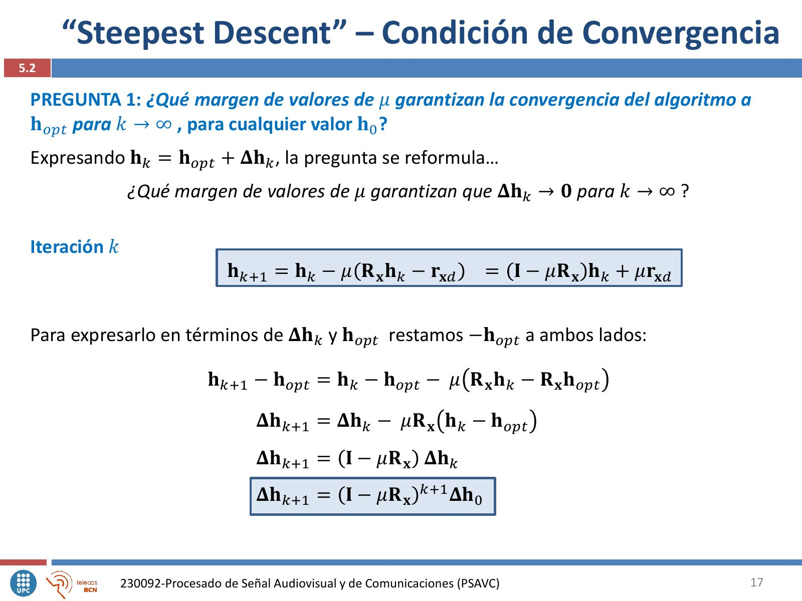

```text
      “Steepest Descent” – Condición de Convergencia
5.2

  PREGUNTA 1: ¿Qué margen de valores de 𝜇𝜇 garantizan la convergencia del algoritmo a
  𝐡𝐡𝑜𝑜𝑜𝑜𝑜𝑜 para 𝑘𝑘 → ∞ , para cualquier valor 𝐡𝐡0 ?
  Expresando 𝐡𝐡𝑘𝑘 = 𝐡𝐡𝑜𝑜𝑜𝑜𝑡𝑡 + 𝚫𝚫𝐡𝐡𝑘𝑘 , la pregunta se reformula…
                  ¿Qué margen de valores de 𝜇𝜇 garantizan que 𝚫𝚫𝚫𝚫𝑘𝑘 → 𝟎𝟎 para 𝑘𝑘 → ∞ ?

  Iteración 𝑘𝑘
                                   𝐡𝐡𝑘𝑘+1 = 𝐡𝐡𝑘𝑘 − 𝜇𝜇 𝐑𝐑 𝐱𝐱 𝐡𝐡𝑘𝑘 − 𝐫𝐫𝐱𝐱𝑑𝑑      = 𝐈𝐈 − 𝜇𝜇𝐑𝐑 𝐱𝐱 𝐡𝐡𝑘𝑘 + 𝜇𝜇𝐫𝐫𝐱𝐱𝑑𝑑


  Para expresarlo en términos de 𝚫𝚫𝐡𝐡𝑘𝑘 y 𝐡𝐡𝑜𝑜𝑜𝑜𝑡𝑡 restamos −𝐡𝐡𝑜𝑜𝑜𝑜𝑜𝑜 a ambos lados:

                               𝐡𝐡𝑘𝑘+1 − 𝐡𝐡𝑜𝑜𝑜𝑜𝑜𝑜 = 𝐡𝐡𝑘𝑘 − 𝐡𝐡𝑜𝑜𝑜𝑜𝑜𝑜 − 𝜇𝜇 𝐑𝐑 𝐱𝐱 𝐡𝐡𝑘𝑘 − 𝐑𝐑 𝐱𝐱 𝐡𝐡𝑜𝑜𝑜𝑜𝑜𝑜

                                        𝚫𝚫𝐡𝐡𝑘𝑘+1 = 𝚫𝚫𝐡𝐡𝑘𝑘 − 𝜇𝜇𝐑𝐑 𝐱𝐱 𝐡𝐡𝑘𝑘 − 𝐡𝐡𝑜𝑜𝑜𝑜𝑜𝑜
                                        𝚫𝚫𝐡𝐡𝑘𝑘+1 = 𝐈𝐈 − 𝜇𝜇𝐑𝐑 𝐱𝐱 𝚫𝚫𝐡𝐡𝑘𝑘
                                        𝚫𝚫𝐡𝐡𝑘𝑘+1 = 𝐈𝐈 − 𝜇𝜇𝐑𝐑 𝐱𝐱 𝑘𝑘+1 𝚫𝚫𝐡𝐡0


                 230092-Procesado de Señal Audiovisual y de Comunicaciones (PSAVC)                              17
```

## Page 18

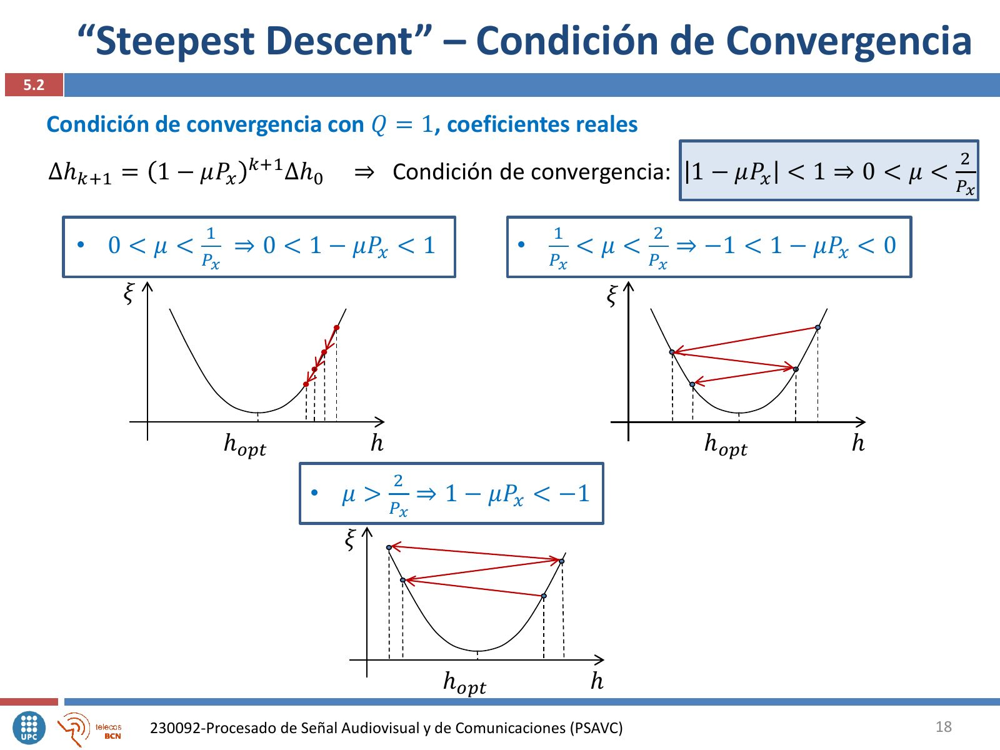

```text
        “Steepest Descent” – Condición de Convergencia
5.2

      Condición de convergencia con 𝑄𝑄 = 1, coeficientes reales
                                                                                                                  2
      Δℎ𝑘𝑘+1 = 1 − 𝜇𝜇𝑃𝑃𝑥𝑥 𝑘𝑘+1 Δℎ0            ⇒ Condición de convergencia: 1 − 𝜇𝜇𝑃𝑃𝑥𝑥 < 1 ⇒ 0 < 𝜇𝜇 <
                                                                                                                 𝑃𝑃𝑥𝑥

                          1                                              1          2
        • 0 < 𝜇𝜇 <               ⇒ 0 < 1 − 𝜇𝜇𝑃𝑃𝑥𝑥 < 1               •        < 𝜇𝜇 < ⇒ −1 < 1 − 𝜇𝜇𝑃𝑃𝑥𝑥 < 0
                         𝑃𝑃𝑥𝑥                                           𝑃𝑃𝑥𝑥       𝑃𝑃𝑥𝑥
             𝜉𝜉                                                                   𝜉𝜉


                                ℎ𝑜𝑜𝑜𝑜𝑜𝑜          ℎ                                     ℎ𝑜𝑜𝑜𝑜𝑜𝑜      ℎ
                                                      2
                                          • 𝜇𝜇 >          ⇒ 1 − 𝜇𝜇𝑃𝑃𝑥𝑥 < −1
                                                     𝑃𝑃𝑥𝑥
                                            𝜉𝜉


                                                          ℎ𝑜𝑜𝑜𝑜𝑜𝑜             ℎ
                  230092-Procesado de Señal Audiovisual y de Comunicaciones (PSAVC)                         18
```

## Page 19

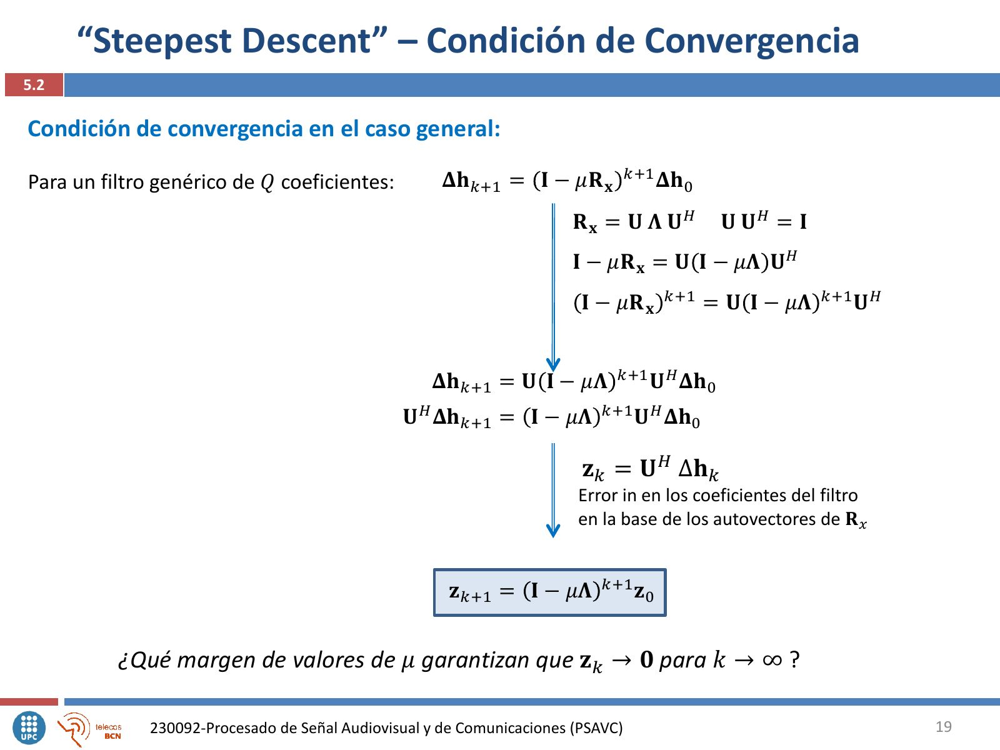

```text
      “Steepest Descent” – Condición de Convergencia
5.2

Condición de convergencia en el caso general:

Para un filtro genérico de 𝑄𝑄 coeficientes:           𝚫𝚫𝐡𝐡𝑘𝑘+1 = 𝐈𝐈 − 𝜇𝜇𝐑𝐑 𝐱𝐱 𝑘𝑘+1 𝚫𝚫𝐡𝐡0
                                                                        𝐑𝐑 𝐱𝐱 = 𝐔𝐔 𝚲𝚲 𝐔𝐔𝐻𝐻     𝐔𝐔 𝐔𝐔 𝐻𝐻 = 𝐈𝐈
                                                                        𝐈𝐈 − 𝜇𝜇𝐑𝐑 𝐱𝐱 = 𝐔𝐔 𝐈𝐈 − 𝜇𝜇𝚲𝚲 𝐔𝐔 𝐻𝐻
                                                                         𝐈𝐈 − 𝜇𝜇𝐑𝐑 𝐱𝐱 𝑘𝑘+1 = 𝐔𝐔 𝐈𝐈 − 𝜇𝜇𝚲𝚲 𝑘𝑘+1 𝐔𝐔 𝐻𝐻


                                                    𝚫𝚫𝐡𝐡𝑘𝑘+1 = 𝐔𝐔 𝐈𝐈 − 𝜇𝜇𝚲𝚲 𝑘𝑘+1 𝐔𝐔 𝐻𝐻 𝚫𝚫𝐡𝐡0
                                                𝐔𝐔 𝐻𝐻 𝚫𝚫𝐡𝐡𝑘𝑘+1 = 𝐈𝐈 − 𝜇𝜇𝚲𝚲 𝑘𝑘+1 𝐔𝐔 𝐻𝐻 𝚫𝚫𝐡𝐡0

                                                                         𝐳𝐳𝑘𝑘 = 𝐔𝐔 𝐻𝐻 ∆𝐡𝐡𝑘𝑘
                                                                         Error in en los coeficientes del filtro
                                                                         en la base de los autovectores de 𝐑𝐑 𝑥𝑥


                                                       𝐳𝐳𝑘𝑘+1 = 𝐈𝐈 − 𝜇𝜇𝚲𝚲 𝑘𝑘+1 𝐳𝐳0


          ¿Qué margen de valores de 𝜇𝜇 garantizan que 𝐳𝐳𝑘𝑘 → 𝟎𝟎 para 𝑘𝑘 → ∞ ?

              230092-Procesado de Señal Audiovisual y de Comunicaciones (PSAVC)                                        19
```

## Page 20

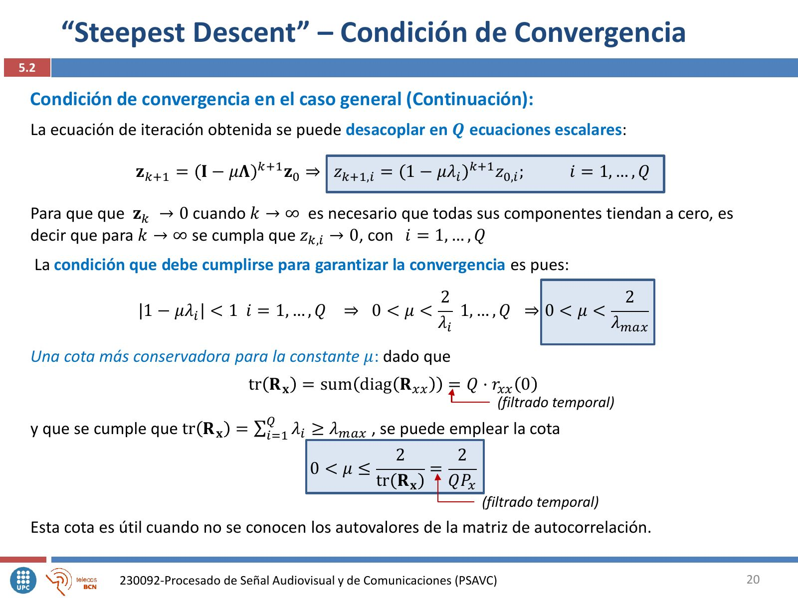

```text
      “Steepest Descent” – Condición de Convergencia
5.2

  Condición de convergencia en el caso general (Continuación):
  La ecuación de iteración obtenida se puede desacoplar en 𝑸𝑸 ecuaciones escalares:

                 𝐳𝐳𝑘𝑘+1 = 𝐈𝐈 − 𝜇𝜇𝚲𝚲 𝑘𝑘+1 𝐳𝐳0 ⇒ 𝑧𝑧𝑘𝑘+1,𝑖𝑖 = 1 − 𝜇𝜇𝜆𝜆𝑖𝑖 𝑘𝑘+1 𝑧𝑧0,𝑖𝑖 ;           𝑖𝑖 = 1, … , 𝑄𝑄

  Para que que 𝐳𝐳𝑘𝑘 → 0 cuando 𝑘𝑘 → ∞ es necesario que todas sus componentes tiendan a cero, es
  decir que para 𝑘𝑘 → ∞ se cumpla que 𝑧𝑧𝑘𝑘,𝑖𝑖 → 0, con 𝑖𝑖 = 1, … , 𝑄𝑄
  La condición que debe cumplirse para garantizar la convergencia es pues:
                                                                      2                           2
                   1 − 𝜇𝜇𝜆𝜆𝑖𝑖 < 1 𝑖𝑖 = 1, … , 𝑄𝑄 ⇒ 0 < 𝜇𝜇 <               1, … , 𝑄𝑄 ⇒ 0 < 𝜇𝜇 <
                                                                     𝜆𝜆𝑖𝑖                      𝜆𝜆𝑚𝑚𝑚𝑚𝑚𝑚
  Una cota más conservadora para la constante 𝜇𝜇: dado que
                                     tr 𝐑𝐑 𝐱𝐱 = sum diag 𝐑𝐑 𝑥𝑥𝑥𝑥       = 𝑄𝑄 · 𝑟𝑟𝑥𝑥𝑥𝑥 0
                                                                                   (filtrado temporal)
                                        𝑄𝑄
  y que se cumple que tr 𝐑𝐑 𝐱𝐱 = ∑𝑖𝑖=1 𝜆𝜆𝑖𝑖 ≥ 𝜆𝜆𝑚𝑚𝑚𝑚𝑚𝑚 , se puede emplear la cota
                                                              2         2
                                               0 < 𝜇𝜇 ≤             =
                                                           tr 𝐑𝐑 𝐱𝐱   𝑄𝑄𝑃𝑃𝑥𝑥
                                                                               (filtrado temporal)
  Esta cota es útil cuando no se conocen los autovalores de la matriz de autocorrelación.

               230092-Procesado de Señal Audiovisual y de Comunicaciones (PSAVC)                               20
```

## Page 21

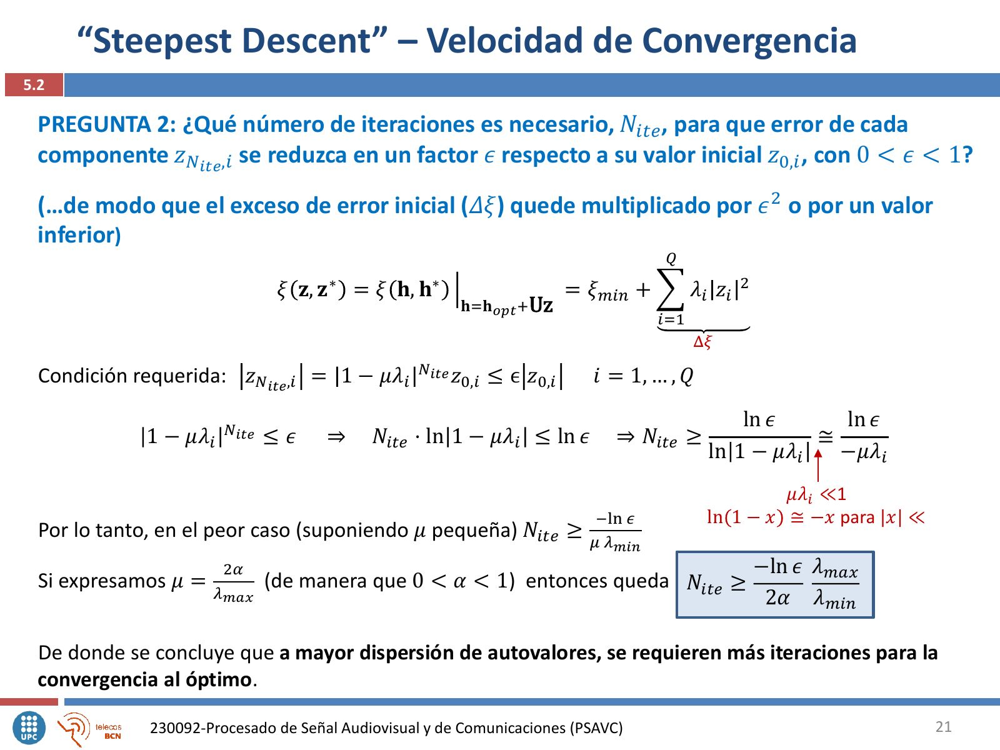

```text
       “Steepest Descent” – Velocidad de Convergencia
5.2

  PREGUNTA 2: ¿Qué número de iteraciones es necesario, 𝑁𝑁𝑖𝑖𝑖𝑖𝑖𝑖 , para que error de cada
  componente 𝑧𝑧𝑁𝑁𝑖𝑖𝑖𝑖𝑖𝑖,𝑖𝑖 se reduzca en un factor 𝜖𝜖 respecto a su valor inicial 𝑧𝑧0,𝑖𝑖 , con 0 < 𝜖𝜖 < 1?

  (…de modo que el exceso de error inicial (𝛥𝛥𝛥𝛥) quede multiplicado por 𝜖𝜖 2 o por un valor
  inferior)
                                                                                                        𝑄𝑄

                                       𝜉𝜉 𝐳𝐳, 𝐳𝐳 ∗ = 𝜉𝜉 𝐡𝐡, 𝐡𝐡∗ �                     = 𝜉𝜉𝑚𝑚𝑚𝑚𝑚𝑚 + � 𝜆𝜆𝑖𝑖 𝑧𝑧𝑖𝑖 2
                                                                    𝐡𝐡=𝐡𝐡𝑜𝑜𝑜𝑜𝑡𝑡 +Uz
                                                                                                       𝑖𝑖=1
                                                                                                              Δ𝜉𝜉

  Condición requerida: 𝑧𝑧𝑁𝑁𝑖𝑖𝑖𝑖𝑖𝑖 ,𝑖𝑖 = 1 − 𝜇𝜇𝜆𝜆𝑖𝑖 𝑁𝑁𝑖𝑖𝑖𝑖𝑖𝑖 𝑧𝑧0,𝑖𝑖 ≤ ϵ 𝑧𝑧0,𝑖𝑖             𝑖𝑖 = 1, … , 𝑄𝑄
                                                                                                                    ln 𝜖𝜖       ln 𝜖𝜖
                 1 − 𝜇𝜇𝜆𝜆𝑖𝑖 𝑁𝑁𝑖𝑖𝑖𝑖𝑖𝑖 ≤ 𝜖𝜖     ⇒     𝑁𝑁𝑖𝑖𝑖𝑖𝑖𝑖 · ln 1 − 𝜇𝜇𝜆𝜆𝑖𝑖 ≤ ln 𝜖𝜖          ⇒ 𝑁𝑁𝑖𝑖𝑖𝑖𝑖𝑖 ≥                    ≅
                                                                                                                ln 1 − 𝜇𝜇𝜆𝜆𝑖𝑖   −𝜇𝜇𝜆𝜆𝑖𝑖
                                                                                                                          𝜇𝜇𝜆𝜆𝑖𝑖 ≪1
                                                                                          −ln 𝜖𝜖                ln 1 − 𝑥𝑥 ≅ −𝑥𝑥 para 𝑥𝑥 ≪
  Por lo tanto, en el peor caso (suponiendo 𝜇𝜇 pequeña) 𝑁𝑁𝑖𝑖𝑖𝑖𝑖𝑖 ≥
                                                                                         𝜇𝜇 𝜆𝜆𝑚𝑚𝑚𝑚𝑚𝑚
                             2𝛼𝛼                                                                                     −ln 𝜖𝜖 𝜆𝜆𝑚𝑚𝑚𝑚𝑚𝑚
  Si expresamos 𝜇𝜇 =                  (de manera que 0 < 𝛼𝛼 < 1) entonces queda 𝑁𝑁𝑖𝑖𝑖𝑖𝑖𝑖 ≥
                           𝜆𝜆𝑚𝑚𝑚𝑚𝑚𝑚                                                                                   2𝛼𝛼 𝜆𝜆𝑚𝑚𝑚𝑚𝑚𝑚

  De donde se concluye que a mayor dispersión de autovalores, se requieren más iteraciones para la
  convergencia al óptimo.

                  230092-Procesado de Señal Audiovisual y de Comunicaciones (PSAVC)                                                         21
```

## Page 22

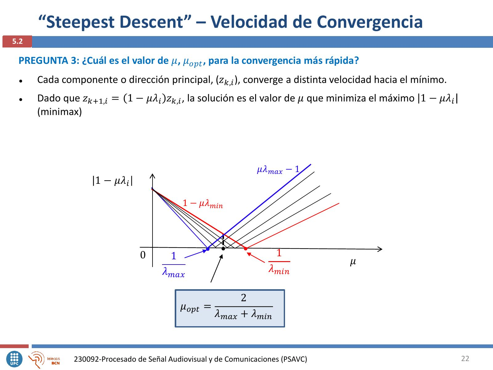

```text
      “Steepest Descent” – Velocidad de Convergencia
5.2

 PREGUNTA 3: ¿Cuál es el valor de 𝜇𝜇, 𝜇𝜇𝑜𝑜𝑜𝑜𝑡𝑡 , para la convergencia más rápida?
 ●    Cada componente o dirección principal, (𝑧𝑧𝑘𝑘,𝑖𝑖 ), converge a distinta velocidad hacia el mínimo.
 ●    Dado que 𝑧𝑧𝑘𝑘+1,𝑖𝑖 = 1 − 𝜇𝜇𝜆𝜆𝑖𝑖 𝑧𝑧𝑘𝑘,𝑖𝑖 , la solución es el valor de 𝜇𝜇 que minimiza el máximo 1 − 𝜇𝜇𝜆𝜆𝑖𝑖
      (minimax)


                                                                       𝜇𝜇𝜆𝜆𝑚𝑚𝑚𝑚𝑚𝑚 − 1
                    1 − 𝜇𝜇𝜆𝜆𝑖𝑖

                                              1 − 𝜇𝜇𝜆𝜆𝑚𝑚𝑚𝑚𝑚𝑚


                                 0        1                                    1
                                                                                        𝜇𝜇
                                       𝜆𝜆𝑚𝑚𝑚𝑚𝑚𝑚                           𝜆𝜆𝑚𝑚𝑚𝑚𝑚𝑚

                                                                  2
                                              𝜇𝜇𝑜𝑜𝑜𝑜𝑡𝑡 =
                                                         𝜆𝜆𝑚𝑚𝑚𝑚𝑚𝑚 + 𝜆𝜆𝑚𝑚𝑚𝑚𝑚𝑚


               230092-Procesado de Señal Audiovisual y de Comunicaciones (PSAVC)                                  22
```

## Page 23

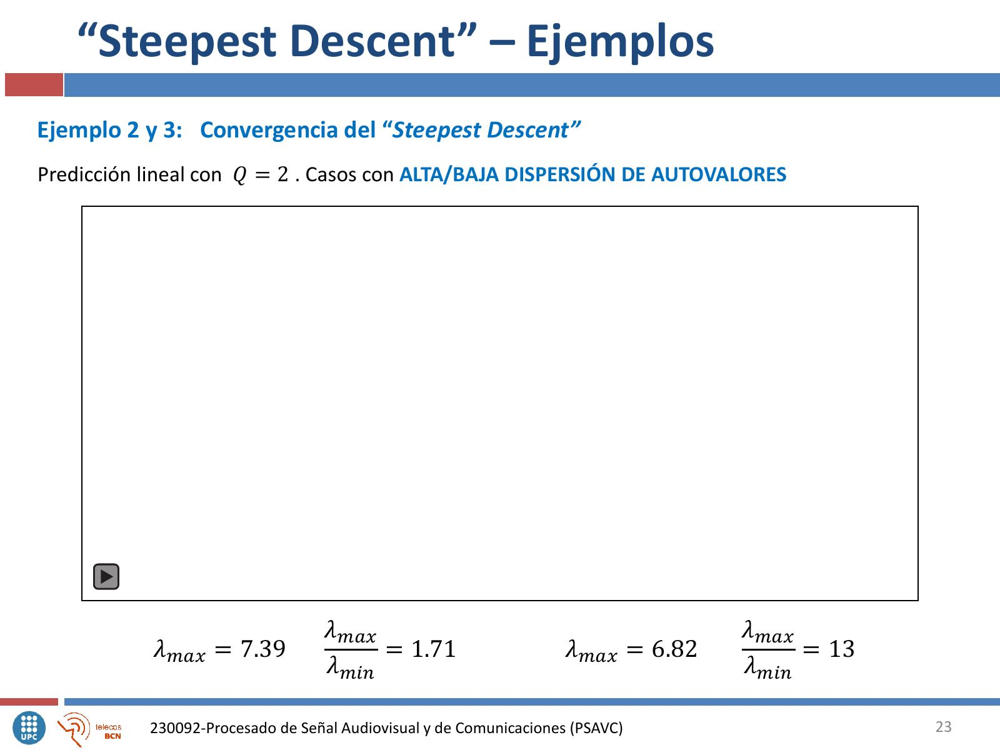

```text
   “Steepest Descent” – Ejemplos
Ejemplo 2 y 3: Convergencia del “Steepest Descent”
Predicción lineal con 𝑄𝑄 = 2 . Casos con ALTA/BAJA DISPERSIÓN DE AUTOVALORES

                            Ejemplo 2                                          Ejemplo 3


                                  𝜆𝜆𝑚𝑚𝑚𝑚𝑚𝑚                                            𝜆𝜆𝑚𝑚𝑚𝑚𝑚𝑚
           𝜆𝜆𝑚𝑚𝑚𝑚𝑚𝑚 = 7.39                 = 1.71                   𝜆𝜆𝑚𝑚𝑚𝑚𝑚𝑚 = 6.82            = 13
                                  𝜆𝜆𝑚𝑚𝑚𝑚𝑚𝑚                                            𝜆𝜆𝑚𝑚𝑚𝑚𝑚𝑚

           230092-Procesado de Señal Audiovisual y de Comunicaciones (PSAVC)                          23
```

## Page 24

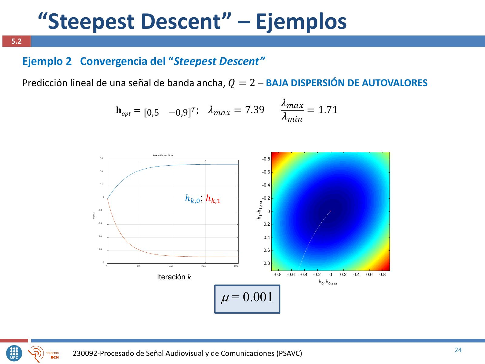

```text
         “Steepest Descent” – Ejemplos
5.2

      Ejemplo 2 Convergencia del “Steepest Descent”
      Predicción lineal de una señal de banda ancha, 𝑄𝑄 = 2 – BAJA DISPERSIÓN DE AUTOVALORES
                                                                                                                               𝜆𝜆𝑚𝑚𝑚𝑚𝑚𝑚
                                               𝐡𝐡𝑜𝑜𝑜𝑜𝑡𝑡 = 0,5 −0,9 𝑇𝑇 ; 𝜆𝜆𝑚𝑚𝑚𝑚𝑚𝑚 = 7.39                                                 = 1.71
                                                                                                                               𝜆𝜆𝑚𝑚𝑖𝑖𝑖𝑖


                                                          Evolución del filtro
                                 0.6
                                                                                                                  -0.8

                                 0.4
                                                                                                                  -0.6

                                 0.2
                                                                                                                  -0.4

                                       0
                                                                                 ℎ𝑘𝑘,0 ; ℎ𝑘𝑘,1                    -0.2

                                -0.2
                                                                                                          h1-h1,opt    0
                     Amplitud

                                -0.4
                                                                                                                      0.2

                                -0.6
                                                                                                                      0.4

                                -0.8
                                                                                                                      0.6

                                                                                                                      0.8
                                   -1

                                           0        500                  1000         1500         2000

                                                                     Iteración
                                                                                                                            -0.8   -0.6   -0.4   -0.2   0      0.2   0.4   0.6   0.8
                                                              Iteración 𝑘𝑘
                                                                                                                                                   h0-h0,opt

                                                                                                 µ = 0.001


                230092-Procesado de Señal Audiovisual y de Comunicaciones (PSAVC)                                                                                                      24
```

## Page 25

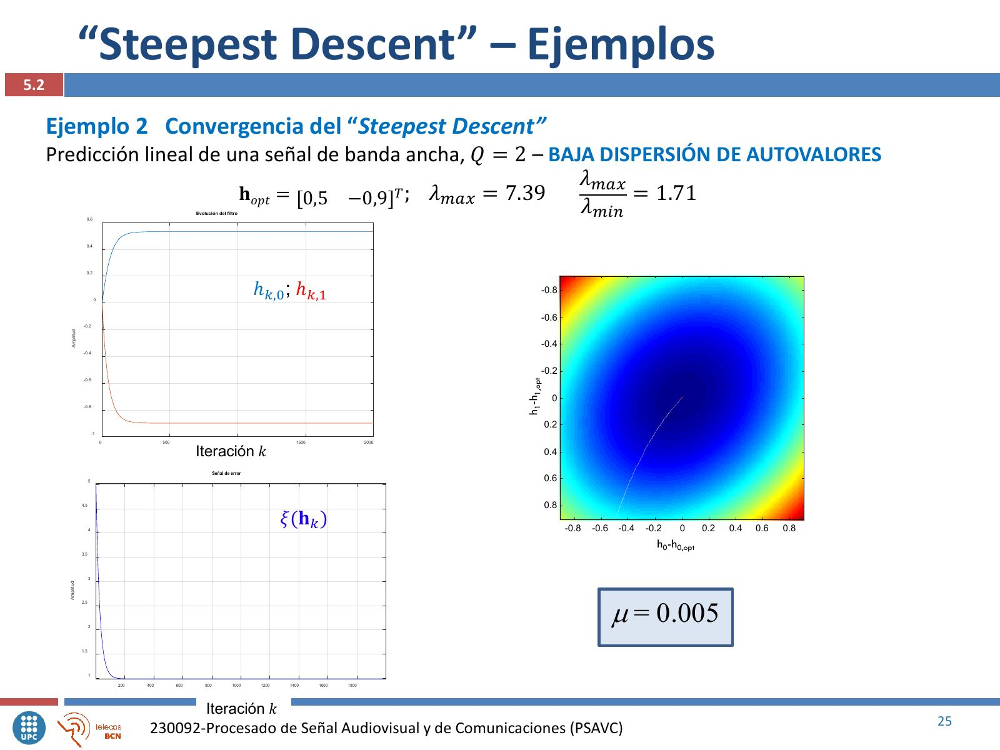

```text
                    “Steepest Descent” – Ejemplos
5.2

      Ejemplo 2 Convergencia del “Steepest Descent”
      Predicción lineal de una señal de banda ancha, 𝑄𝑄 = 2 – BAJA DISPERSIÓN DE AUTOVALORES
                                                                     𝜆𝜆𝑚𝑚𝑚𝑚𝑚𝑚
                            𝐡𝐡𝑜𝑜𝑜𝑜𝑡𝑡 = 0,5 −0,9 𝑇𝑇 ; 𝜆𝜆𝑚𝑚𝑚𝑚𝑚𝑚 = 7.39          = 1.71
                      0.6
                                                                     𝜆𝜆𝑚𝑚𝑖𝑖𝑖𝑖
                                                               Evolución del filtro


                      0.4


                      0.2


                               0
                                                                                           ℎ𝑘𝑘,0 ; ℎ𝑘𝑘,1                                  -0.8

                                                                                                                                          -0.6
                     -0.2


         Amplitud
                                                                                                                                          -0.4
                     -0.4


                                                                                                                                          -0.2
                     -0.6


                     -0.8
                                                                                                                                  h1-h1,opt    0

                                                                                                                                              0.2
                              -1

                                   0               500                           1000                 1500                 2000

                                                               Iteración 𝑘𝑘 Iteración                                                         0.4

                                                                         Señal de error
                          5                                                                                                                   0.6

                    4.5                                                                                                                       0.8

                          4
                                                                                                   𝜉𝜉(𝐡𝐡𝑘𝑘 )                                        -0.8   -0.6   -0.4   -0.2   0      0.2   0.4   0.6   0.8
                                                                                                                                                                           h0-h0,opt
                    3.5


                          3


        Amplitud


                                                                                                                                                                  µ = 0.005
                    2.5


                          2


                    1.5


                          1

                                       200   400         600       800             1000     1200    1400     1600   1800

                                                                               iteración

                                                                   Iteración 𝑘𝑘
                                              230092-Procesado de Señal Audiovisual y de Comunicaciones (PSAVC)                                                                                                25
```

## Page 26

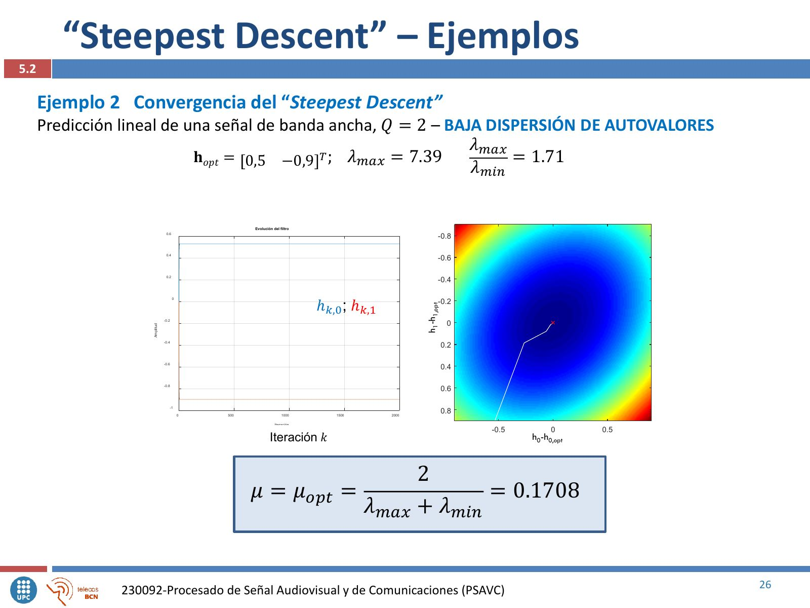

```text
         “Steepest Descent” – Ejemplos
5.2

      Ejemplo 2 Convergencia del “Steepest Descent”
      Predicción lineal de una señal de banda ancha, 𝑄𝑄 = 2 – BAJA DISPERSIÓN DE AUTOVALORES
                                                                     𝜆𝜆𝑚𝑚𝑚𝑚𝑚𝑚
                            𝐡𝐡𝑜𝑜𝑜𝑜𝑡𝑡 = 0,5 −0,9 𝑇𝑇 ; 𝜆𝜆𝑚𝑚𝑚𝑚𝑚𝑚 = 7.39          = 1.71
                                                                     𝜆𝜆𝑚𝑚𝑖𝑖𝑖𝑖


                                                     Evolución del filtro

                                                                                                           -0.8
                                 0.6


                                                                                                           -0.6
                                 0.4


                                                                                                           -0.4
                                 0.2


                                                                            ℎ𝑘𝑘,0 ; ℎ𝑘𝑘,1                  -0.2
                                       0


                                -0.2                                                               h1-h1,opt    0
                     Amplitud


                                                                                                               0.2
                                -0.4


                                                                                                               0.4
                                -0.6


                                                                                                               0.6
                                -0.8


                                   -1

                                           0   500                  1000        1500        2000
                                                                                                               0.8
                                                                Iteración
                                                                                                                     -0.5        0      0.5
                                                             Iteración 𝑘𝑘                                                   h0-h0,opt


                                                                              2
                                                     𝜇𝜇 = 𝜇𝜇𝑜𝑜𝑜𝑜𝑡𝑡 =                     = 0.1708
                                                                     𝜆𝜆𝑚𝑚𝑚𝑚𝑚𝑚 + 𝜆𝜆𝑚𝑚𝑚𝑚𝑚𝑚


                230092-Procesado de Señal Audiovisual y de Comunicaciones (PSAVC)                                                             26
```

## Page 27

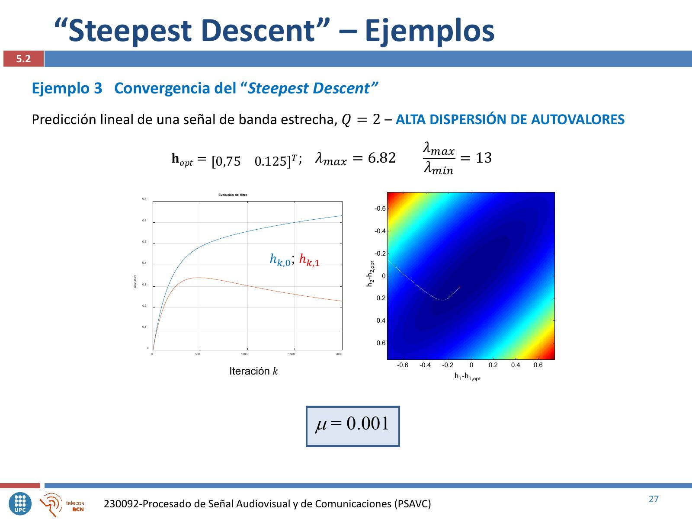

```text
         “Steepest Descent” – Ejemplos
5.2

      Ejemplo 3 Convergencia del “Steepest Descent”
      Predicción lineal de una señal de banda estrecha, 𝑄𝑄 = 2 – ALTA DISPERSIÓN DE AUTOVALORES
                                                                                                                                𝜆𝜆𝑚𝑚𝑚𝑚𝑚𝑚
                                              𝐡𝐡𝑜𝑜𝑜𝑜𝑡𝑡 = 0,75 0.125 𝑇𝑇 ; 𝜆𝜆𝑚𝑚𝑚𝑚𝑚𝑚 = 6.82                                                 = 13
                                                                                                                                𝜆𝜆𝑚𝑚𝑖𝑖𝑖𝑖
                                                        Evolución del filtro
                                0.7


                                                                                                              -0.6
                                0.6


                                                                                                              -0.4
                                0.5


                                                                                                              -0.2
                                                                               ℎ𝑘𝑘,0 ; ℎ𝑘𝑘,1
                                                                                                      h2-h2,opt
                                0.4


                                                                                                                   0
                     Amplitud   0.3


                                                                                                                  0.2
                                0.2


                                                                                                                  0.4
                                0.1


                                                                                                                  0.6
                                      0

                                          0       500                  1000        1500        2000

                                                                   Iteración
                                                                                                                        -0.6   -0.4   -0.2        0      0.2   0.4   0.6
                                                               Iteración 𝑘𝑘                                                                  h1-h1,opt


                                                                                          µ = 0.001


                230092-Procesado de Señal Audiovisual y de Comunicaciones (PSAVC)                                                                                          27
```

## Page 28

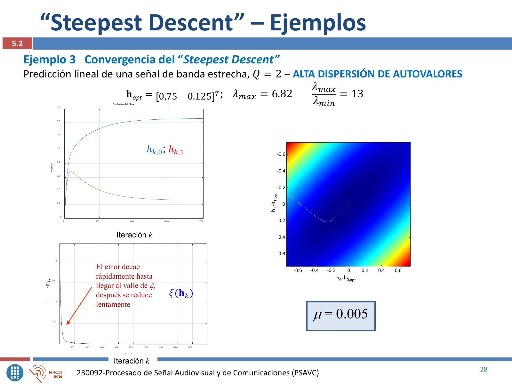

```text
         “Steepest Descent” – Ejemplos
5.2

      Ejemplo 3 Convergencia del “Steepest Descent”
      Predicción lineal de una señal de banda estrecha, 𝑄𝑄 = 2 – ALTA DISPERSIÓN DE AUTOVALORES
                                                                        𝜆𝜆𝑚𝑚𝑚𝑚𝑚𝑚
                             𝐡𝐡𝑜𝑜𝑜𝑜𝑡𝑡 = 0,75 0.125 𝑇𝑇 ; 𝜆𝜆𝑚𝑚𝑚𝑚𝑚𝑚 = 6.82          = 13
                                     0.8
                                                                        𝜆𝜆𝑚𝑚𝑖𝑖𝑖𝑖
                                                                             Evolución del filtro


                                     0.7


                                     0.6


                                     0.5
                                                                                                      ℎ𝑘𝑘,0 ; ℎ𝑘𝑘,1                                    -0.6
                                     0.4


                     Amplitud
                                                                                                                                                       -0.4
                                     0.3


                                     0.2                                                                                                               -0.2


                                     0.1
                                                                                                                                               h1-h1,opt    0

                                           0

                                               0                 500                        1000                  1500                  2000               0.2
                                                                               Potencia del
                                                                                        Iteración


                                                                               Iteración
                                                                               error
                                                                                Señal de error
                                                                                               𝑘𝑘                                                          0.4


                                                                                                                                                           0.6
                                 3


                                                                 El error decae                                                                                  -0.6   -0.4   -0.2        0      0.2   0.4   0.6
                                                                 rápidamente hasta                                                                                                    h0-h0,opt
          ξ                2.5

                                                                 llegar al valle de ξ,
                                                                 después se reduce                                       𝜉𝜉(𝐡𝐡𝑘𝑘 )
          Amplitud

                                                                 lentamente
                                 2


                           1.5
                                                                                                                                                                         µ = 0.005
                                                   200     400         600     800          1000    1200   1400           1600   1800

                                                                                        iteración


                                                                             Iteración 𝑘𝑘
                                                         230092-Procesado de Señal Audiovisual y de Comunicaciones (PSAVC)                                                                                          28
```

## Page 29


```text
         “Steepest Descent” – Ejemplos
5.2

      Ejemplo 3 Convergencia del “Steepest Descent”
      Predicción lineal de una señal de banda estrecha, 𝑄𝑄 = 2 – ALTA DISPERSIÓN DE AUTOVALORES
                                                                        𝜆𝜆𝑚𝑚𝑚𝑚𝑚𝑚
                             𝐡𝐡𝑜𝑜𝑜𝑜𝑡𝑡 = 0,75 0.125 𝑇𝑇 ; 𝜆𝜆𝑚𝑚𝑚𝑚𝑚𝑚 = 6.82          = 13
                                                                        𝜆𝜆𝑚𝑚𝑖𝑖𝑖𝑖
                                                                                                                                             Ambos modos convergen a
                                                                                                                                             la misma velocidad

                                                   Evolución del filtro


                                                                                                         -0.6
                                  0.8


                                  0.7                                                                    -0.4

                                  0.6

                                                                               ℎ𝑘𝑘,0 ; ℎ𝑘𝑘,1             -0.2


                                                                                                 h1-h1,opt
                                  0.5


                                                                                                              0
                       Amplitud
                                  0.4


                                  0.3                                                                        0.2

                                  0.2

                                                                                                             0.4
                                  0.1


                                                                                                             0.6
                                        0   20     40                     60      80      100

                                                              Iteración

                                                          Iteración 𝑘𝑘                                             -0.6   -0.4   -0.2    0
                                                                                                                                    h0-h0,opt
                                                                                                                                                0.2   0.4   0.6

               La escala es distinta

                                                                                                2
                                                 𝜇𝜇 = 𝜇𝜇𝑜𝑜𝑜𝑜𝑡𝑡 =                                           = 0.2731
                                                                                       𝜆𝜆𝑚𝑚𝑚𝑚𝑚𝑚 + 𝜆𝜆𝑚𝑚𝑚𝑚𝑚𝑚


                230092-Procesado de Señal Audiovisual y de Comunicaciones (PSAVC)                                                                                      29
```

## Page 30

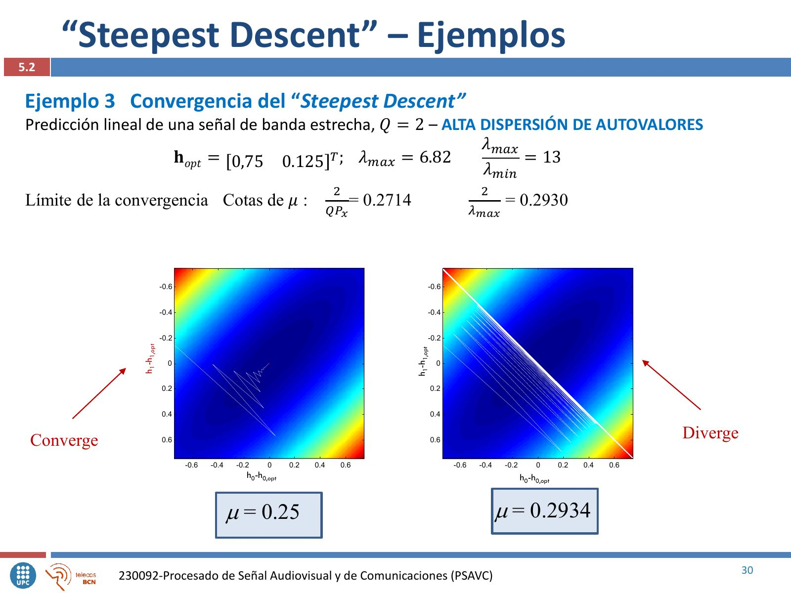

```text
      “Steepest Descent” – Ejemplos
5.2

 Ejemplo 3 Convergencia del “Steepest Descent”
 Predicción lineal de una señal de banda estrecha, 𝑄𝑄 = 2 – ALTA DISPERSIÓN DE AUTOVALORES
                                                                  𝜆𝜆𝑚𝑚𝑚𝑚𝑚𝑚
                       𝐡𝐡𝑜𝑜𝑜𝑜𝑡𝑡 = 0,75 0.125 𝑇𝑇 ; 𝜆𝜆𝑚𝑚𝑚𝑚𝑚𝑚 = 6.82          = 13
                                                                  𝜆𝜆𝑚𝑚𝑚𝑚𝑚𝑚
                                                                                2                                           2
 Límite de la convergencia Cotas de 𝜇𝜇 :                                             = 0.2714                                       = 0.2930
                                                                              𝑄𝑄𝑃𝑃𝑥𝑥                                     𝜆𝜆𝑚𝑚𝑚𝑚𝑚𝑚


                             -0.6                                                                       -0.6


                             -0.4                                                                       -0.4


                             -0.2                                                                       -0.2


                 h1-h1,opt     0                                                                h1-h1,opt    0


                             0.2                                                                            0.2


                             0.4                                                                            0.4


  Converge                   0.6                                                                            0.6
                                                                                                                                                                         Diverge
                                    -0.6   -0.4    -0.2     0     0.2   0.4     0.6                               -0.6     -0.4     -0.2       0       0.2   0.4   0.6
                                                      h0-h0,opt                                                                            h0-h0,opt


                                                  µ = 0.25                                                                        µ = 0.2934

             230092-Procesado de Señal Audiovisual y de Comunicaciones (PSAVC)                                                                                                     30
```

## Page 31

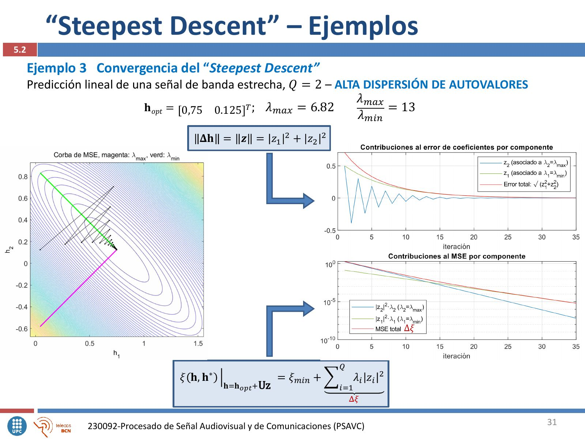

```text
         “Steepest Descent” – Ejemplos
5.2

      Ejemplo 3 Convergencia del “Steepest Descent”
      Predicción lineal de una señal de banda estrecha, 𝑄𝑄 = 2 – ALTA DISPERSIÓN DE AUTOVALORES
                                                                        𝜆𝜆𝑚𝑚𝑚𝑚𝑚𝑚
                             𝐡𝐡𝑜𝑜𝑜𝑜𝑡𝑡 = 0,75 0.125 𝑇𝑇 ; 𝜆𝜆𝑚𝑚𝑚𝑚𝑚𝑚 = 6.82          = 13
                                                                        𝜆𝜆𝑚𝑚𝑖𝑖𝑖𝑖
                                          𝚫𝚫𝐡𝐡 = 𝒛𝒛 = 𝑧𝑧1 2 + 𝑧𝑧2 2


                                                                                                     Δ𝜉𝜉


                                                                                  𝑄𝑄
                                            ∗
                                     𝜉𝜉 𝐡𝐡, 𝐡𝐡 �                     = 𝜉𝜉𝑚𝑚𝑚𝑚𝑚𝑚 + �    𝜆𝜆𝑖𝑖 𝑧𝑧𝑖𝑖 2
                                                   𝐡𝐡=𝐡𝐡𝑜𝑜𝑜𝑜𝑡𝑡 +Uz                𝑖𝑖=1
                                                                                     Δ𝜉𝜉


                230092-Procesado de Señal Audiovisual y de Comunicaciones (PSAVC)                          31
```

## Page 32

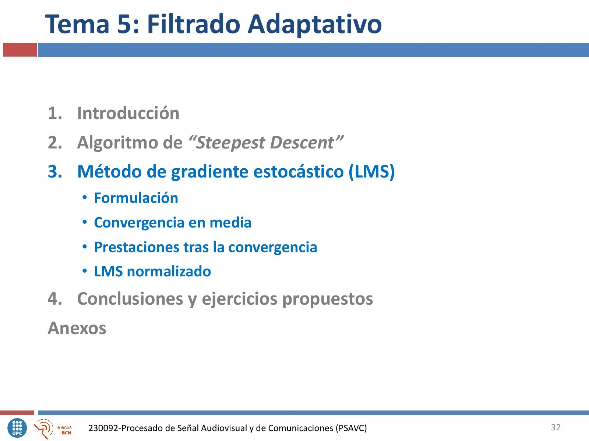

```text
Tema 5: Filtrado Adaptativo

1. Introducción
2. Algoritmo de “Steepest Descent”
3. Método de gradiente estocástico (LMS)
    • Formulación
    • Convergencia en media
    • Prestaciones tras la convergencia
    • LMS normalizado
4. Conclusiones y ejercicios propuestos
Anexos


    230092-Procesado de Señal Audiovisual y de Comunicaciones (PSAVC)   32
```

## Page 33

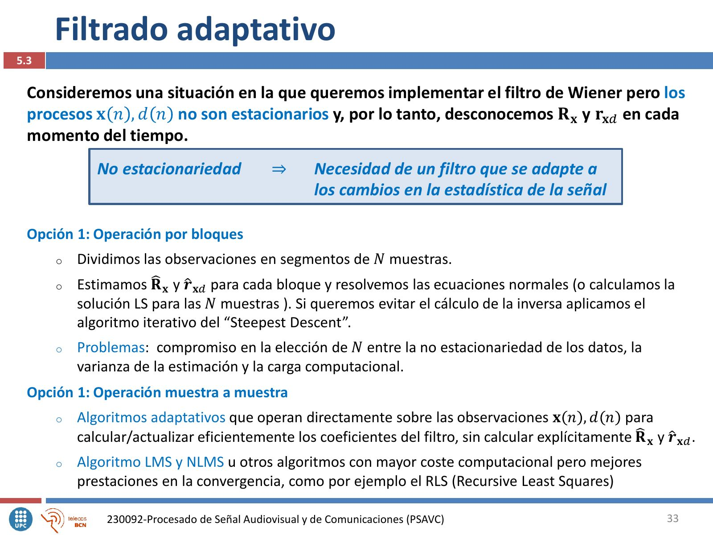

```text
      Filtrado adaptativo
5.3

  Consideremos una situación en la que queremos implementar el filtro de Wiener pero los
  procesos 𝐱𝐱 𝑛𝑛 , 𝑑𝑑 𝑛𝑛 no son estacionarios y, por lo tanto, desconocemos 𝐑𝐑 𝐱𝐱 y 𝐫𝐫𝐱𝐱𝑑𝑑 en cada
  momento del tiempo.
             No estacionariedad               ⇒       Necesidad de un filtro que se adapte a
                                                      los cambios en la estadística de la señal

  Opción 1: Operación por bloques
      o   Dividimos las observaciones en segmentos de 𝑁𝑁 muestras.
      o   Estimamos 𝐑𝐑� 𝐱𝐱 y �𝒓𝒓𝐱𝐱𝑑𝑑 para cada bloque y resolvemos las ecuaciones normales (o calculamos la
          solución LS para las 𝑁𝑁 muestras ). Si queremos evitar el cálculo de la inversa aplicamos el
          algoritmo iterativo del “Steepest Descent”.
      o   Problemas: compromiso en la elección de 𝑁𝑁 entre la no estacionariedad de los datos, la
          varianza de la estimación y la carga computacional.
  Opción 1: Operación muestra a muestra
      o   Algoritmos adaptativos que operan directamente sobre las observaciones 𝐱𝐱 𝑛𝑛 , 𝑑𝑑 𝑛𝑛 para
                                                                                                      � 𝐱𝐱 y �𝒓𝒓𝐱𝐱𝑑𝑑 .
          calcular/actualizar eficientemente los coeficientes del filtro, sin calcular explícitamente 𝐑𝐑
      o   Algoritmo LMS y NLMS u otros algoritmos con mayor coste computacional pero mejores
          prestaciones en la convergencia, como por ejemplo el RLS (Recursive Least Squares)

               230092-Procesado de Señal Audiovisual y de Comunicaciones (PSAVC)                                33
```

## Page 34

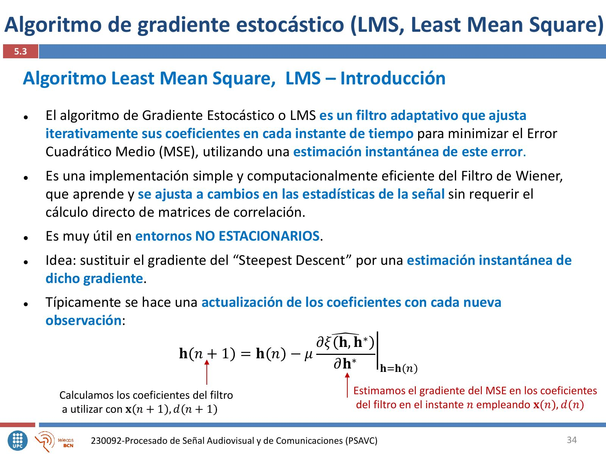

```text
Algoritmo de gradiente estocástico (LMS, Least Mean Square)
5.3

  Algoritmo Least Mean Square, LMS – Introducción
  ●   El algoritmo de Gradiente Estocástico o LMS es un filtro adaptativo que ajusta
      iterativamente sus coeficientes en cada instante de tiempo para minimizar el Error
      Cuadrático Medio (MSE), utilizando una estimación instantánea de este error.
  ●   Es una implementación simple y computacionalmente eficiente del Filtro de Wiener,
      que aprende y se ajusta a cambios en las estadísticas de la señal sin requerir el
      cálculo directo de matrices de correlación.
  ●   Es muy útil en entornos NO ESTACIONARIOS.
  ●   Idea: sustituir el gradiente del “Steepest Descent” por una estimación instantánea de
      dicho gradiente.
  ●   Típicamente se hace una actualización de los coeficientes con cada nueva
      observación:
                                                  𝜕𝜕𝜉𝜉�𝐡𝐡, 𝐡𝐡∗
                           𝐡𝐡 𝑛𝑛 + 1 = 𝐡𝐡 𝑛𝑛 − 𝜇𝜇              �
                                                      𝜕𝜕𝐡𝐡 ∗
                                                                𝐡𝐡=𝐡𝐡 𝑛𝑛

        Calculamos los coeficientes del filtro                           Estimamos el gradiente del MSE en los coeficientes
        a utilizar con 𝐱𝐱 𝑛𝑛 + 1 , 𝑑𝑑 𝑛𝑛 + 1                             del filtro en el instante 𝑛𝑛 empleando 𝐱𝐱 𝑛𝑛 , 𝑑𝑑 𝑛𝑛

              230092-Procesado de Señal Audiovisual y de Comunicaciones (PSAVC)                                       34
```

## Page 35

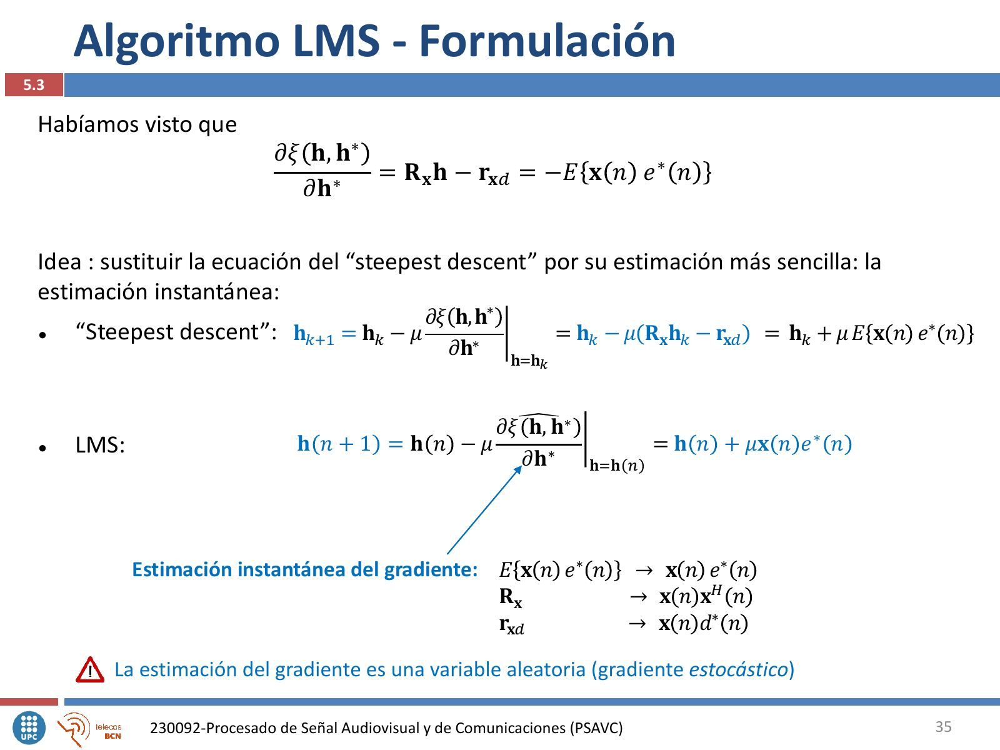

```text
      Algoritmo LMS - Formulación
5.3

  Habíamos visto que
                                𝜕𝜕𝜉𝜉 𝐡𝐡, 𝐡𝐡∗                                    ∗
                                             = 𝐑𝐑 𝐱𝐱 𝐡𝐡 − 𝐫𝐫𝐱𝐱𝑑𝑑 = −𝐸𝐸 𝐱𝐱 𝑛𝑛 𝑒𝑒   𝑛𝑛
                                    𝜕𝜕𝐡𝐡∗

  Idea : sustituir la ecuación del “steepest descent” por su estimación más sencilla: la
  estimación instantánea:
                                             𝜕𝜕𝜉𝜉 𝐡𝐡, 𝐡𝐡∗
  ●   “Steepest descent”: 𝐡𝐡𝑘𝑘+1 = 𝐡𝐡𝑘𝑘 − 𝜇𝜇              �  = 𝐡𝐡𝑘𝑘 − 𝜇𝜇 𝐑𝐑𝐱𝐱𝐡𝐡𝑘𝑘 − 𝐫𝐫𝐱𝐱𝑑𝑑           = 𝐡𝐡𝑘𝑘 + 𝜇𝜇 𝐸𝐸 𝐱𝐱 𝑛𝑛 𝑒𝑒∗ 𝑛𝑛
                                                 𝜕𝜕𝐡𝐡∗ 𝐡𝐡=𝐡𝐡
                                                                    𝑘𝑘


                                                          𝜕𝜕𝜉𝜉�𝐡𝐡, 𝐡𝐡∗
  ●   LMS:                         𝐡𝐡 𝑛𝑛 + 1 = 𝐡𝐡 𝑛𝑛 − 𝜇𝜇              �          = 𝐡𝐡 𝑛𝑛 + 𝜇𝜇𝐱𝐱 𝑛𝑛 𝑒𝑒 ∗ 𝑛𝑛
                                                              𝜕𝜕𝐡𝐡∗
                                                                         𝐡𝐡=𝐡𝐡 𝑛𝑛


             Estimación instantánea del gradiente: 𝐸𝐸 𝐱𝐱 𝑛𝑛 𝑒𝑒∗ 𝑛𝑛                 → 𝐱𝐱 𝑛𝑛 𝑒𝑒∗ 𝑛𝑛
                                                   𝐑𝐑𝐱𝐱                            → 𝐱𝐱 𝑛𝑛 𝐱𝐱𝐻𝐻 𝑛𝑛
                                                   𝐫𝐫𝐱𝐱𝑑𝑑                          → 𝐱𝐱 𝑛𝑛 𝑑𝑑∗ 𝑛𝑛

          La estimación del gradiente es una variable aleatoria (gradiente estocástico)

               230092-Procesado de Señal Audiovisual y de Comunicaciones (PSAVC)                                            35
```

## Page 36

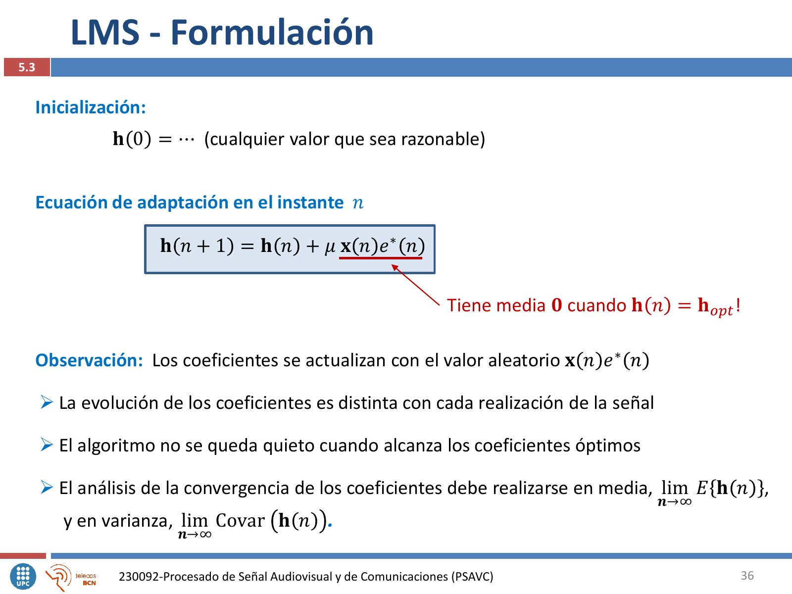

```text
          LMS - Formulación
5.3


      Inicialización:
                𝐡𝐡 0 = ⋯ (cualquier valor que sea razonable)


      Ecuación de adaptación en el instante 𝑛𝑛

                        𝐡𝐡 𝑛𝑛 + 1 = 𝐡𝐡 𝑛𝑛 + 𝜇𝜇 𝐱𝐱 𝑛𝑛 𝑒𝑒 ∗ 𝑛𝑛

                                                                         Tiene media 𝟎𝟎 cuando 𝐡𝐡 𝑛𝑛 = 𝐡𝐡𝑜𝑜𝑜𝑜𝑜𝑜 !

      Observación: Los coeficientes se actualizan con el valor aleatorio 𝐱𝐱 𝑛𝑛 𝑒𝑒 ∗ 𝑛𝑛

       La evolución de los coeficientes es distinta con cada realización de la señal

       El algoritmo no se queda quieto cuando alcanza los coeficientes óptimos

       El análisis de la convergencia de los coeficientes debe realizarse en media, lim 𝐸𝐸 𝐡𝐡 𝑛𝑛 ,
                                                                                                     𝒏𝒏→∞
         y en varianza, lim Covar 𝐡𝐡 𝑛𝑛 .
                           𝒏𝒏→∞

                 230092-Procesado de Señal Audiovisual y de Comunicaciones (PSAVC)                              36
```

## Page 37

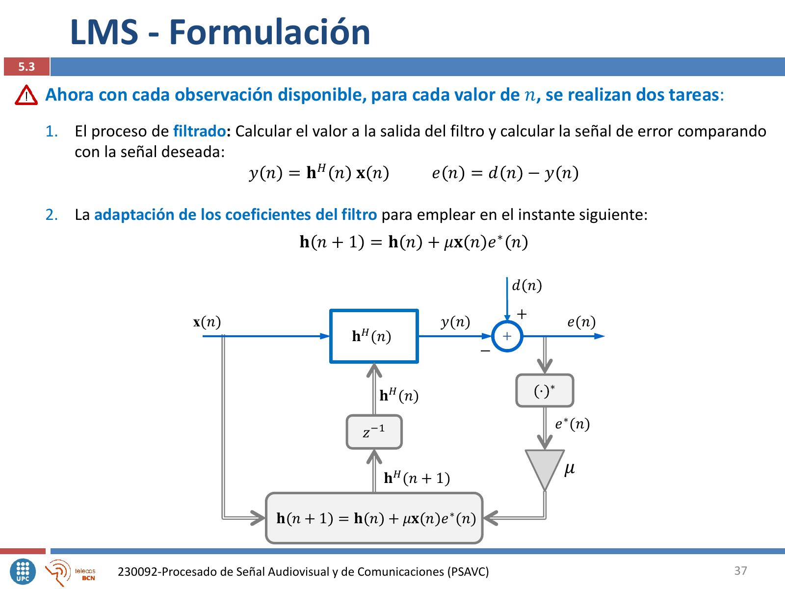

```text
         LMS - Formulación
5.3

      Ahora con cada observación disponible, para cada valor de 𝑛𝑛, se realizan dos tareas:
      1. El proceso de filtrado: Calcular el valor a la salida del filtro y calcular la señal de error comparando
         con la señal deseada:
                                   𝑦𝑦 𝑛𝑛 = 𝐡𝐡𝐻𝐻 𝑛𝑛 𝐱𝐱 𝑛𝑛        𝑒𝑒 𝑛𝑛 = 𝑑𝑑 𝑛𝑛 − 𝑦𝑦 𝑛𝑛

      2. La adaptación de los coeficientes del filtro para emplear en el instante siguiente:
                                               𝐡𝐡 𝑛𝑛 + 1 = 𝐡𝐡 𝑛𝑛 + 𝜇𝜇𝐱𝐱 𝑛𝑛 𝑒𝑒 ∗ 𝑛𝑛

                                                                                         𝑑𝑑 𝑛𝑛

                                                                                     −       +
                             x(𝑛𝑛)                                          𝑦𝑦(𝑛𝑛)                     𝑒𝑒(𝑛𝑛)
                                                          𝐻𝐻
                                                        𝐡𝐡 (𝑛𝑛)                          +


                                                                𝐡𝐡𝐻𝐻 (𝑛𝑛)                        · ∗

                                                               −1                                  𝑒𝑒 ∗ (𝑛𝑛)
                                                          𝑧𝑧

                                                                                                       𝜇𝜇
                                                                 𝐡𝐡𝐻𝐻 (𝑛𝑛 + 1)

                                           𝐡𝐡 𝑛𝑛 + 1 = 𝐡𝐡 𝑛𝑛 + 𝜇𝜇𝐱𝐱 𝑛𝑛 𝑒𝑒 ∗ (𝑛𝑛)


                230092-Procesado de Señal Audiovisual y de Comunicaciones (PSAVC)                               37
```

## Page 38

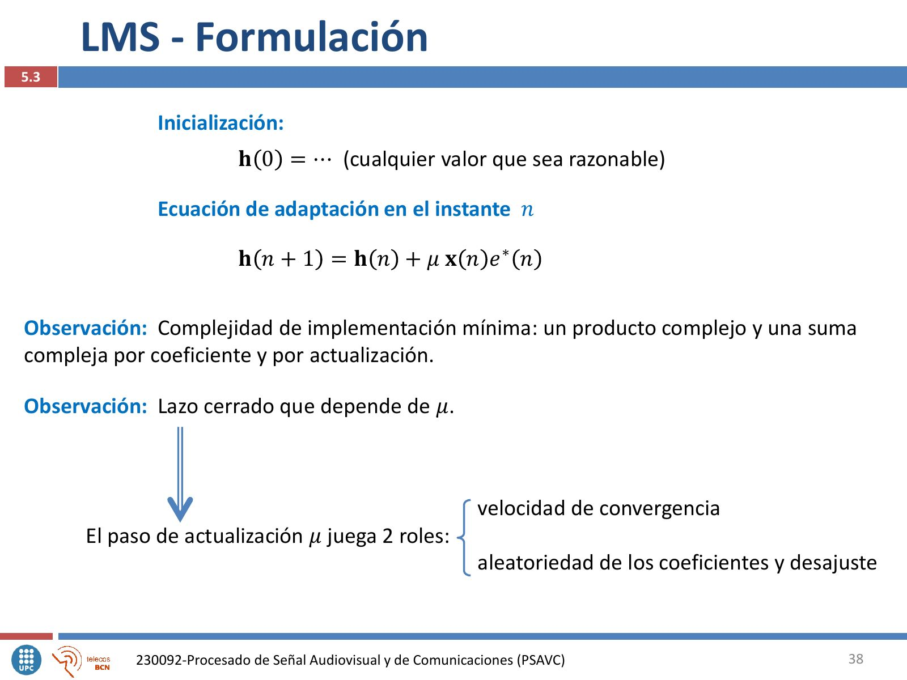

```text
      LMS - Formulación
5.3


              Inicialización:
                          𝐡𝐡 0 = ⋯ (cualquier valor que sea razonable)

              Ecuación de adaptación en el instante 𝑛𝑛

                          𝐡𝐡 𝑛𝑛 + 1 = 𝐡𝐡 𝑛𝑛 + 𝜇𝜇 𝐱𝐱 𝑛𝑛 𝑒𝑒 ∗ 𝑛𝑛


Observación: Complejidad de implementación mínima: un producto complejo y una suma
compleja por coeficiente y por actualización.

Observación: Lazo cerrado que depende de 𝜇𝜇.


                                                              velocidad de convergencia
      El paso de actualización 𝜇𝜇 juega 2 roles:
                                                              aleatoriedad de los coeficientes y desajuste


           230092-Procesado de Señal Audiovisual y de Comunicaciones (PSAVC)                          38
```

## Page 39

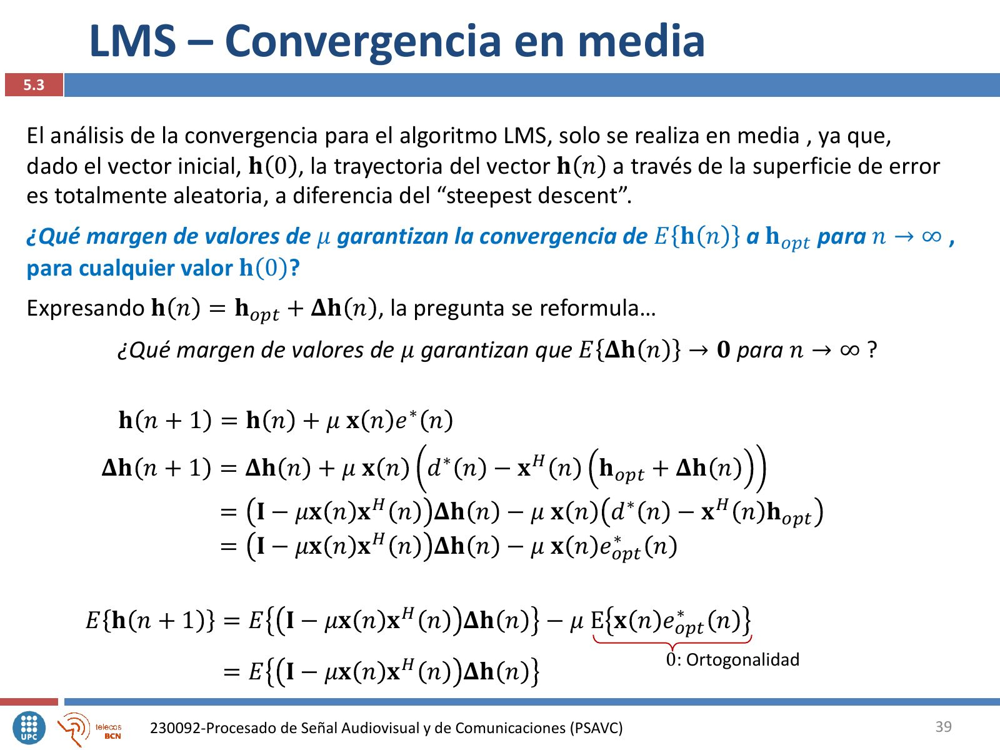

```text
      LMS – Convergencia en media
5.3


El análisis de la convergencia para el algoritmo LMS, solo se realiza en media , ya que,
dado el vector inicial, 𝐡𝐡 0 , la trayectoria del vector 𝐡𝐡 𝑛𝑛 a través de la superficie de error
es totalmente aleatoria, a diferencia del “steepest descent”.
¿Qué margen de valores de 𝜇𝜇 garantizan la convergencia de 𝐸𝐸 𝐡𝐡 𝑛𝑛                            a 𝐡𝐡𝑜𝑜𝑜𝑜𝑜𝑜 para 𝑛𝑛 → ∞ ,
para cualquier valor 𝐡𝐡 0 ?
Expresando 𝐡𝐡 𝑛𝑛 = 𝐡𝐡𝑜𝑜𝑜𝑜𝑡𝑡 + 𝚫𝚫𝐡𝐡 𝑛𝑛 , la pregunta se reformula…
         ¿Qué margen de valores de 𝜇𝜇 garantizan que 𝐸𝐸 𝚫𝚫𝐡𝐡 𝑛𝑛                       → 𝟎𝟎 para 𝑛𝑛 → ∞ ?

         𝐡𝐡 𝑛𝑛 + 1 = 𝐡𝐡 𝑛𝑛 + 𝜇𝜇 𝐱𝐱 𝑛𝑛 𝑒𝑒 ∗ 𝑛𝑛
       𝚫𝚫𝐡𝐡 𝑛𝑛 + 1 = 𝚫𝚫𝐡𝐡 𝑛𝑛 + 𝜇𝜇 𝐱𝐱 𝑛𝑛            𝑑𝑑 ∗ 𝑛𝑛 − 𝐱𝐱 𝐻𝐻 𝑛𝑛     𝐡𝐡𝑜𝑜𝑜𝑜𝑡𝑡 + 𝚫𝚫𝐡𝐡 𝑛𝑛
                      = 𝐈𝐈 − 𝜇𝜇𝐱𝐱 𝑛𝑛 𝐱𝐱 𝐻𝐻 𝑛𝑛 𝚫𝚫𝐡𝐡 𝑛𝑛 − 𝜇𝜇 𝐱𝐱 𝑛𝑛 𝑑𝑑 ∗ 𝑛𝑛 − 𝐱𝐱 𝐻𝐻 𝑛𝑛 𝐡𝐡𝑜𝑜𝑜𝑜𝑡𝑡
                                                                   ∗
                      = 𝐈𝐈 − 𝜇𝜇𝐱𝐱 𝑛𝑛 𝐱𝐱 𝐻𝐻 𝑛𝑛 𝚫𝚫𝐡𝐡 𝑛𝑛 − 𝜇𝜇 𝐱𝐱 𝑛𝑛 𝑒𝑒𝑜𝑜𝑜𝑜𝑜𝑜 𝑛𝑛

                                                                                  ∗
      𝐸𝐸 𝐡𝐡 𝑛𝑛 + 1    = 𝐸𝐸 𝐈𝐈 − 𝜇𝜇𝐱𝐱 𝑛𝑛 𝐱𝐱 𝐻𝐻 𝑛𝑛 𝚫𝚫𝐡𝐡 𝑛𝑛           − 𝜇𝜇 E 𝐱𝐱 𝑛𝑛 𝑒𝑒𝑜𝑜𝑜𝑜𝑜𝑜 𝑛𝑛
                                                                                   0: Ortogonalidad
                       = 𝐸𝐸 𝐈𝐈 − 𝜇𝜇𝐱𝐱 𝑛𝑛 𝐱𝐱 𝐻𝐻 𝑛𝑛 𝚫𝚫𝐡𝐡 𝑛𝑛

             230092-Procesado de Señal Audiovisual y de Comunicaciones (PSAVC)                                      39
```

## Page 40

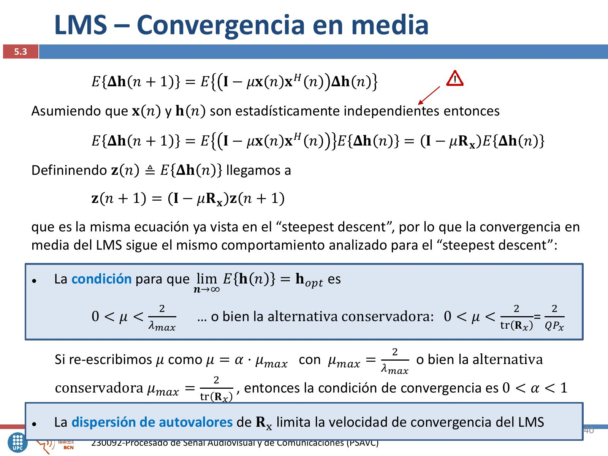

```text
          LMS – Convergencia en media
5.3


                𝐸𝐸 𝚫𝚫𝐡𝐡 𝑛𝑛 + 1         = 𝐸𝐸 𝐈𝐈 − 𝜇𝜇𝐱𝐱 𝑛𝑛 𝐱𝐱 𝐻𝐻 𝑛𝑛 𝚫𝚫𝐡𝐡 𝑛𝑛
      Asumiendo que 𝐱𝐱 𝑛𝑛 y 𝐡𝐡 𝑛𝑛 son estadísticamente independientes entonces
                𝐸𝐸 𝚫𝚫𝐡𝐡 𝑛𝑛 + 1         = 𝐸𝐸 𝐈𝐈 − 𝜇𝜇𝐱𝐱 𝑛𝑛 𝐱𝐱 𝐻𝐻 𝑛𝑛      𝐸𝐸 𝚫𝚫𝐡𝐡 𝑛𝑛          = 𝐈𝐈 − 𝜇𝜇𝐑𝐑 𝐱𝐱 𝐸𝐸 𝚫𝚫𝐡𝐡 𝑛𝑛
      Defininendo 𝐳𝐳 𝑛𝑛 ≜ 𝐸𝐸 𝚫𝚫𝐡𝐡 𝑛𝑛            llegamos a
                𝐳𝐳 𝑛𝑛 + 1 = 𝐈𝐈 − 𝜇𝜇𝐑𝐑 𝐱𝐱 𝐳𝐳 𝑛𝑛 + 1
      que es la misma ecuación ya vista en el “steepest descent”, por lo que la convergencia en
      media del LMS sigue el mismo comportamiento analizado para el “steepest descent”:

      ●   La condición para que lim 𝐸𝐸 𝐡𝐡 𝑛𝑛              = 𝐡𝐡𝑜𝑜𝑜𝑜𝑜𝑜 es
                                        𝒏𝒏→∞
                               2                                                                                2       2
                0 < 𝜇𝜇 <                 … o bien la alternativa conservadora: 0 < 𝜇𝜇 <                              =
                            𝜆𝜆𝑚𝑚𝑚𝑚𝑚𝑚                                                                         tr 𝐑𝐑 𝑥𝑥 𝑄𝑄𝑃𝑃𝑥𝑥

                                                                                       2
          Si re-escribimos 𝜇𝜇 como 𝜇𝜇 = 𝛼𝛼 · 𝜇𝜇𝑚𝑚𝑚𝑚𝑚𝑚 con 𝜇𝜇𝑚𝑚𝑚𝑚𝑚𝑚 =                           o bien la alternativa
                                                                                    𝜆𝜆𝑚𝑚𝑚𝑚𝑚𝑚
                                            2
          conservadora 𝜇𝜇𝑚𝑚𝑚𝑚𝑚𝑚 =                   , entonces la condición de convergencia es 0 < 𝛼𝛼 < 1
                                         tr 𝐑𝐑 𝑥𝑥

      ●   La dispersión de autovalores de 𝐑𝐑 x limita la velocidad de convergencia del LMS                                     40
                230092-Procesado de Señal Audiovisual y de Comunicaciones (PSAVC)
```

## Page 41

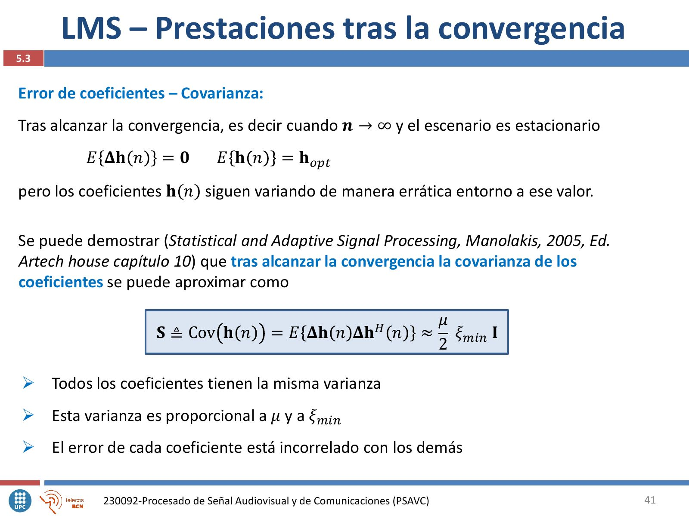

```text
       LMS – Prestaciones tras la convergencia
5.3


Error de coeficientes – Covarianza:
Tras alcanzar la convergencia, es decir cuando 𝒏𝒏 → ∞ y el escenario es estacionario
          𝐸𝐸 𝚫𝚫𝐡𝐡 𝑛𝑛    = 𝟎𝟎       𝐸𝐸 𝐡𝐡 𝑛𝑛     = 𝐡𝐡𝑜𝑜𝑜𝑜𝑜𝑜
pero los coeficientes 𝐡𝐡 𝑛𝑛 siguen variando de manera errática entorno a ese valor.

Se puede demostrar (Statistical and Adaptive Signal Processing, Manolakis, 2005, Ed.
Artech house capítulo 10) que tras alcanzar la convergencia la covarianza de los
coeficientes se puede aproximar como

                                                                                 𝜇𝜇
                       𝐒𝐒 ≜ Cov 𝐡𝐡 𝑛𝑛         = 𝐸𝐸 𝚫𝚫𝐡𝐡 𝑛𝑛 𝚫𝚫𝐡𝐡𝐻𝐻 𝑛𝑛        ≈       𝜉𝜉    𝐈𝐈
                                                                                 2 𝑚𝑚𝑚𝑚𝑚𝑚

  Todos los coeficientes tienen la misma varianza
  Esta varianza es proporcional a 𝜇𝜇 y a 𝜉𝜉𝑚𝑚𝑚𝑚𝑚𝑚
  El error de cada coeficiente está incorrelado con los demás

             230092-Procesado de Señal Audiovisual y de Comunicaciones (PSAVC)                 41
```

## Page 42

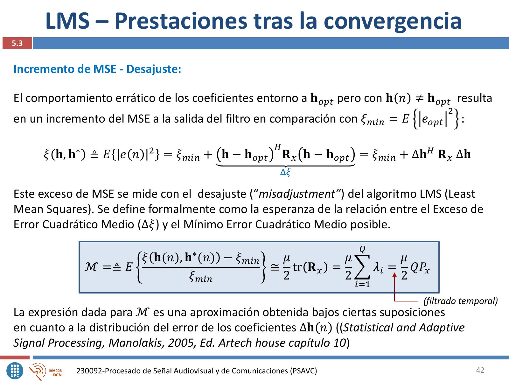

```text
      LMS – Prestaciones tras la convergencia
5.3


Incremento de MSE - Desajuste:

El comportamiento errático de los coeficientes entorno a 𝐡𝐡𝑜𝑜𝑜𝑜𝑜𝑜 pero con 𝐡𝐡 𝑛𝑛 ≠ 𝐡𝐡𝑜𝑜𝑜𝑜𝑜𝑜 resulta
                                                                                                                 2
en un incremento del MSE a la salida del filtro en comparación con 𝜉𝜉𝑚𝑚𝑚𝑚𝑚𝑚 = 𝐸𝐸 𝑒𝑒𝑜𝑜𝑜𝑜𝑜𝑜                            :

                                                                  𝐻𝐻
      𝜉𝜉 𝐡𝐡, 𝐡𝐡∗ ≜ 𝐸𝐸 𝑒𝑒 𝑛𝑛     2   = 𝜉𝜉𝑚𝑚𝑚𝑚𝑚𝑚 + 𝐡𝐡 − 𝐡𝐡𝑜𝑜𝑜𝑜𝑜𝑜         𝐑𝐑 𝑥𝑥 𝐡𝐡 − 𝐡𝐡𝑜𝑜𝑜𝑜𝑜𝑜 = 𝜉𝜉𝑚𝑚𝑚𝑚𝑚𝑚 + Δ𝐡𝐡𝐻𝐻 𝐑𝐑 𝑥𝑥 Δ𝐡𝐡
                                                                   Δ𝜉𝜉

Este exceso de MSE se mide con el desajuste (“misadjustment”) del algoritmo LMS (Least
Mean Squares). Se define formalmente como la esperanza de la relación entre el Exceso de
Error Cuadrático Medio (Δ𝜉𝜉) y el Mínimo Error Cuadrático Medio posible.
                                                                                          𝑄𝑄
                       𝜉𝜉 𝐡𝐡(𝑛𝑛), 𝐡𝐡∗ (𝑛𝑛) − 𝜉𝜉𝑚𝑚𝑚𝑚𝑚𝑚  𝜇𝜇         𝜇𝜇       𝜇𝜇
               ℳ =≜ 𝐸𝐸                                ≅ tr 𝐑𝐑 𝑥𝑥 = � 𝜆𝜆𝑖𝑖 = 𝑄𝑄𝑃𝑃𝑥𝑥
                                   𝜉𝜉𝑚𝑚𝑚𝑚𝑚𝑚            2          2        2
                                                                                         𝑖𝑖=1
                                                                                                          (filtrado temporal)
La expresión dada para ℳ es una aproximación obtenida bajos ciertas suposiciones
en cuanto a la distribución del error de los coeficientes Δ𝐡𝐡 𝑛𝑛 ((Statistical and Adaptive
Signal Processing, Manolakis, 2005, Ed. Artech house capítulo 10)

             230092-Procesado de Señal Audiovisual y de Comunicaciones (PSAVC)                                            42
```

## Page 43

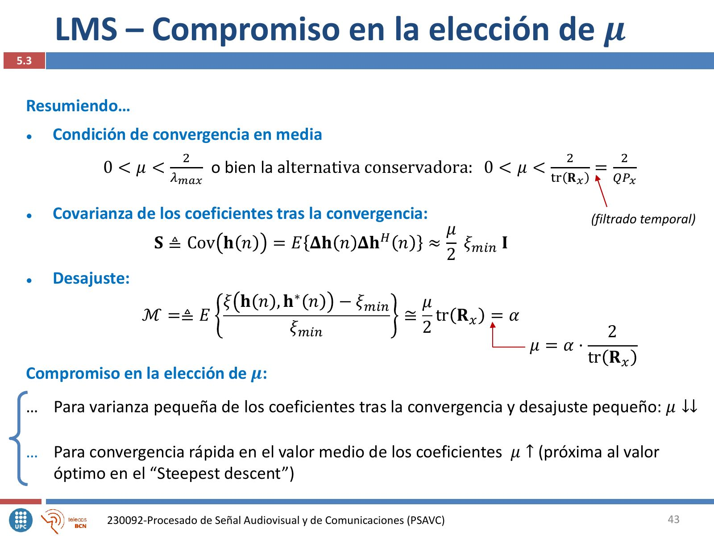

```text
      LMS – Compromiso en la elección de 𝝁𝝁
5.3


 Resumiendo…
 ●    Condición de convergencia en media
                            2                                                                   2             2
             0 < 𝜇𝜇 < 𝜆𝜆            o bien la alternativa conservadora: 0 < 𝜇𝜇 <                        =
                           𝑚𝑚𝑚𝑚𝑚𝑚                                                            tr 𝐑𝐑 𝑥𝑥       𝑄𝑄𝑃𝑃𝑥𝑥

 ●    Covarianza de los coeficientes tras la convergencia:                                              (filtrado temporal)
                                                                           𝜇𝜇
                      𝐒𝐒 ≜ Cov 𝐡𝐡 𝑛𝑛        = 𝐸𝐸 𝚫𝚫𝐡𝐡 𝑛𝑛 𝚫𝚫𝐡𝐡𝐻𝐻 𝑛𝑛        ≈ 𝜉𝜉𝑚𝑚𝑚𝑚𝑚𝑚 𝐈𝐈
                                                                           2
 ●    Desajuste:
                           𝜉𝜉 𝐡𝐡 𝑛𝑛 , 𝐡𝐡∗ 𝑛𝑛 − 𝜉𝜉𝑚𝑚𝑚𝑚𝑚𝑚  𝜇𝜇
                   ℳ =≜ 𝐸𝐸                              ≅ tr 𝐑𝐑 𝑥𝑥 = 𝛼𝛼
                                       𝜉𝜉𝑚𝑚𝑚𝑚𝑚𝑚          2                                             2
                                                                                          𝜇𝜇 = 𝛼𝛼 ·
                                                                                                    tr 𝐑𝐑 𝑥𝑥
 Compromiso en la elección de 𝝁𝝁:
 … Para varianza pequeña de los coeficientes tras la convergencia y desajuste pequeño: 𝜇𝜇 ↓↓

 … Para convergencia rápida en el valor medio de los coeficientes 𝜇𝜇 ↑ (próxima al valor
   óptimo en el “Steepest descent”)

             230092-Procesado de Señal Audiovisual y de Comunicaciones (PSAVC)                                       43
```

## Page 44

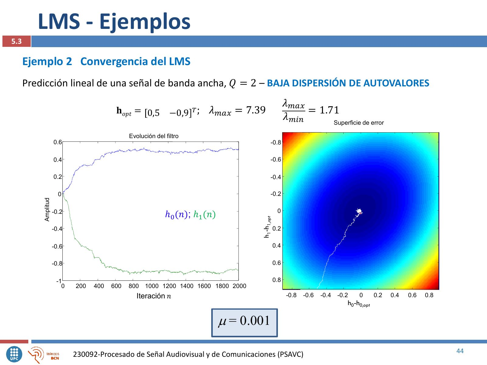

```text
         LMS - Ejemplos
5.3

      Ejemplo 2 Convergencia del LMS
      Predicción lineal de una señal de banda ancha, 𝑄𝑄 = 2 – BAJA DISPERSIÓN DE AUTOVALORES
                                                                                                        𝜆𝜆𝑚𝑚𝑚𝑚𝑚𝑚
                                         𝐡𝐡𝑜𝑜𝑜𝑜𝑡𝑡 = 0,5 −0,9 𝑇𝑇 ; 𝜆𝜆𝑚𝑚𝑚𝑚𝑚𝑚 = 7.39                                = 1.71
                                                                                                        𝜆𝜆𝑚𝑚𝑖𝑖𝑖𝑖      Superficie de error

                                              Evolución del filtro
                     0.6                                                                     -0.8

                     0.4                                                                     -0.6

                     0.2                                                                     -0.4

                       0                                                                     -0.2


          Amplitud   -0.2
                                                            ℎ0 (𝑛𝑛); ℎ1 (𝑛𝑛)                       0

                     -0.4                                                             h1-h1,opt   0.2

                     -0.6                                                                         0.4

                     -0.8                                                                         0.6


                      -1                                                                          0.8
                        0   200   400   600   800     1000 1200 1400 1600 1800 2000
                                                    Iteración
                                                Iteración 𝑛𝑛                                             -0.8   -0.6   -0.4   -0.2   0       0.2   0.4   0.6   0.8
                                                                                                                                 h0-h0,opt

                                                                               µ = 0.001

                            230092-Procesado de Señal Audiovisual y de Comunicaciones (PSAVC)                                                                        44
```

## Page 45

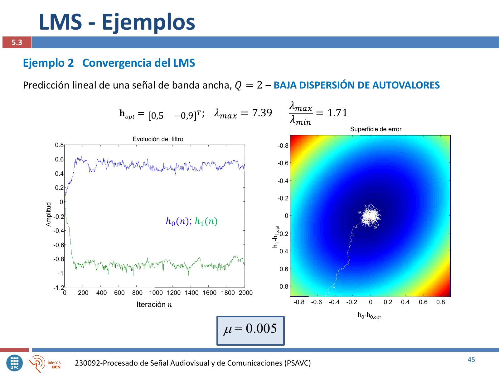

```text
         LMS - Ejemplos
5.3

      Ejemplo 2 Convergencia del LMS
      Predicción lineal de una señal de banda ancha, 𝑄𝑄 = 2 – BAJA DISPERSIÓN DE AUTOVALORES
                                                                                                       𝜆𝜆𝑚𝑚𝑚𝑚𝑚𝑚
                                          𝐡𝐡𝑜𝑜𝑜𝑜𝑡𝑡 = 0,5 −0,9 𝑇𝑇 ; 𝜆𝜆𝑚𝑚𝑚𝑚𝑚𝑚 = 7.39                              = 1.71
                                                                                                       𝜆𝜆𝑚𝑚𝑖𝑖𝑖𝑖
                                                                                                                              Superficie de error
                                               Evolución del filtro
                     0.8                                                                     -0.8

                     0.6
                                                                                             -0.6
                     0.4
                                                                                             -0.4
                     0.2
                                                                                             -0.2
                       0

          Amplitud   -0.2                                                                          0
                                                            ℎ0 (𝑛𝑛); ℎ1 (𝑛𝑛)
                                                                                       h1-h1,opt
                     -0.4                                                                      0.2
                     -0.6
                                                                                               0.4
                     -0.8
                                                                                               0.6
                      -1

                     -1.2                                                                      0.8
                         0   200   400   600   800     1000 1200 1400 1600 1800 2000
                                                     Iteración                                          -0.8   -0.6   -0.4   -0.2       0       0.2   0.4   0.6   0.8
                                                Iteración 𝑛𝑛
                                                                                                                                    h0-h0,opt

                                                                               µ = 0.005

                             230092-Procesado de Señal Audiovisual y de Comunicaciones (PSAVC)                                                                          45
```

## Page 46

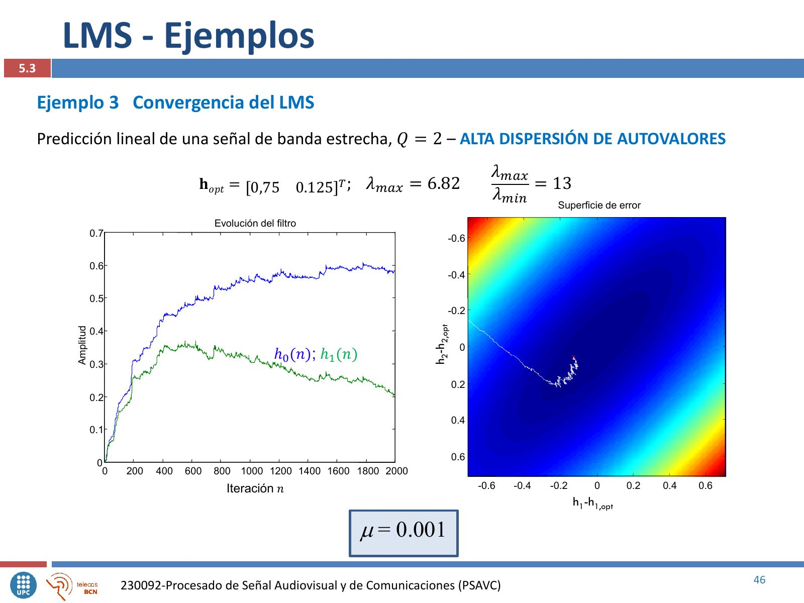

```text
         LMS - Ejemplos
5.3

      Ejemplo 3 Convergencia del LMS
      Predicción lineal de una señal de banda estrecha, 𝑄𝑄 = 2 – ALTA DISPERSIÓN DE AUTOVALORES
                                                                                                           𝜆𝜆𝑚𝑚𝑚𝑚𝑚𝑚
                                          𝐡𝐡𝑜𝑜𝑜𝑜𝑡𝑡 = 0,75 0.125 𝑇𝑇 ; 𝜆𝜆𝑚𝑚𝑚𝑚𝑚𝑚 = 6.82                                = 13
                                                                                                           𝜆𝜆𝑚𝑚𝑖𝑖𝑖𝑖
                                                                                                                       Superficie de error
                                              Evolución del filtro
                     0.7                                                                      -0.6

                     0.6
                                                                                              -0.4

                     0.5
                                                                                              -0.2


                                                                                      h2-h2,opt
                     0.4

          Amplitud                                          ℎ0 (𝑛𝑛); ℎ1 (𝑛𝑛)
                                                                                                   0
                     0.3
                                                                                                  0.2
                     0.2

                                                                                                  0.4
                     0.1

                                                                                                  0.6
                      0
                       0    200   400   600   800     1000 1200 1400 1600 1800 2000
                                                    Iteración                                           -0.6   -0.4   -0.2       0       0.2   0.4   0.6
                                                Iteración 𝑛𝑛
                                                                                                                             h1-h1,opt

                                                                               µ = 0.001

                           230092-Procesado de Señal Audiovisual y de Comunicaciones (PSAVC)                                                               46
```

## Page 47

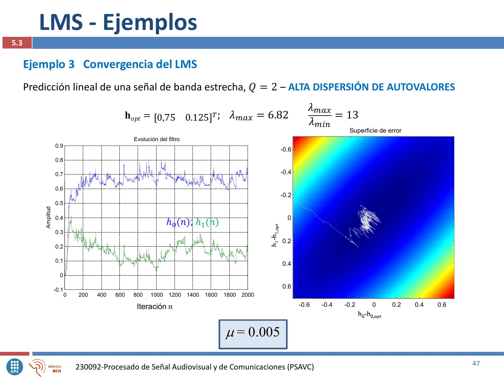

```text
         LMS - Ejemplos
5.3

      Ejemplo 3 Convergencia del LMS
      Predicción lineal de una señal de banda estrecha, 𝑄𝑄 = 2 – ALTA DISPERSIÓN DE AUTOVALORES
                                                                                                                             𝜆𝜆𝑚𝑚𝑚𝑚𝑚𝑚
                                                  𝐡𝐡𝑜𝑜𝑜𝑜𝑡𝑡 = 0,75 0.125 𝑇𝑇 ; 𝜆𝜆𝑚𝑚𝑚𝑚𝑚𝑚 = 6.82                                          = 13
                                                                                                                             𝜆𝜆𝑚𝑚𝑖𝑖𝑖𝑖
                                                                                                                                         Superficie de error
                                                    Evolución del filtro
                     0.9
                                                                                                                   -0.6
                     0.8

                     0.7                                                                                           -0.4

                     0.6
                                                                                                                   -0.2
                     0.5


          Amplitud
                     0.4                                                                                             0
                                                                  ℎ0 (𝑛𝑛); ℎ1 (𝑛𝑛)
                                                                                                       h1-h1,opt
                     0.3
                                                                                                                   0.2
                     0.2

                     0.1
                                                                                                                   0.4
                       0

                     -0.1
                                                                                                                   0.6
                            0   200   400   600     800      1000 1200     1400   1600   1800   2000
                                                          Iteración
                                                     Iteración 𝑛𝑛                                                         -0.6   -0.4   -0.2        0      0.2   0.4   0.6
                                                                                                                                               h0-h0,opt

                                                                                         µ = 0.005

                                230092-Procesado de Señal Audiovisual y de Comunicaciones (PSAVC)                                                                            47
```

## Page 48

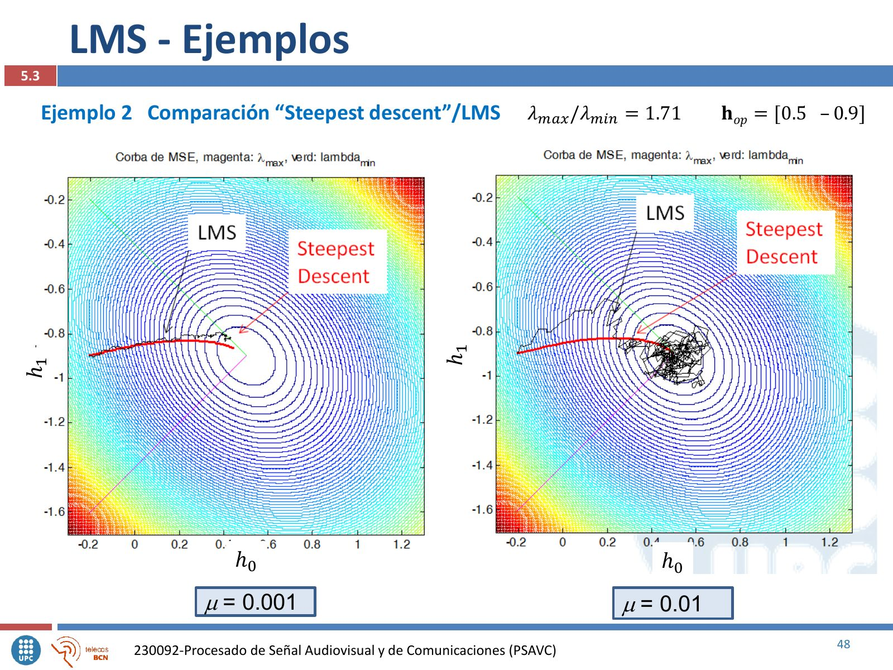

```text
        LMS - Ejemplos
5.3

      Ejemplo 2 Comparación “Steepest descent”/LMS                        𝜆𝜆𝑚𝑚𝑚𝑚𝑚𝑚 /𝜆𝜆𝑚𝑚𝑖𝑖𝑖𝑖 = 1.71   𝐡𝐡𝑜𝑜𝑜𝑜 = [0.5 – 0.9]


ℎ1ℎ1                                                         ℎ1


                             ℎ0                                                                ℎ0
                        µ = 0.001                                                        µ = 0.01
              230092-Procesado de Señal Audiovisual y de Comunicaciones (PSAVC)                                      48
```

## Page 49

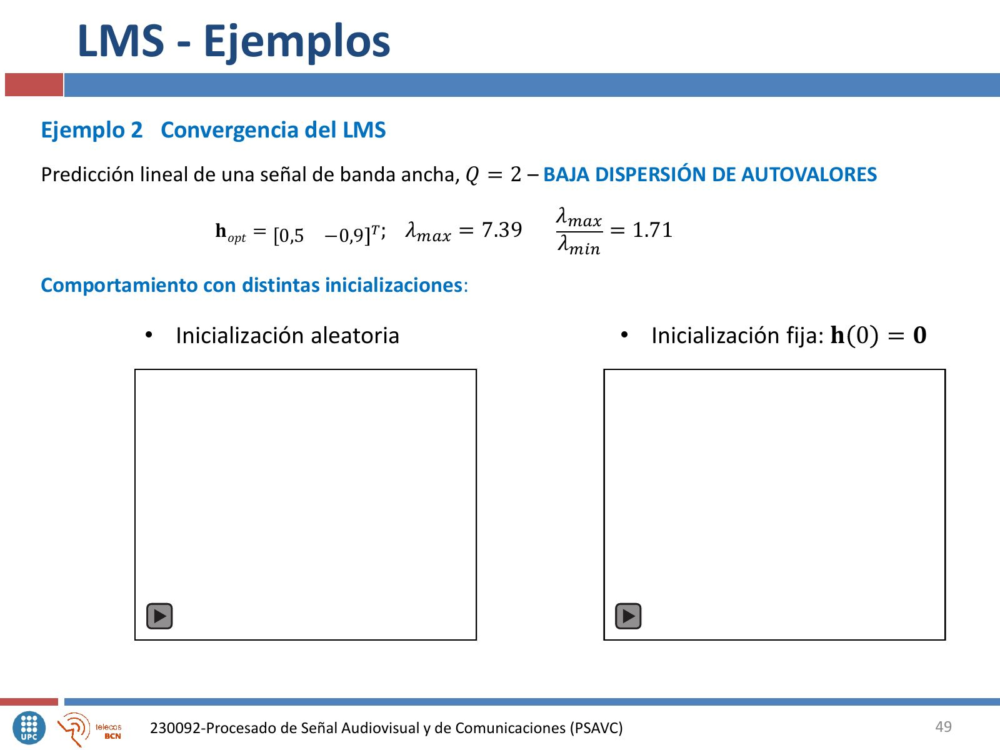

```text
   LMS - Ejemplos
Ejemplo 2 Convergencia del LMS
Predicción lineal de una señal de banda ancha, 𝑄𝑄 = 2 – BAJA DISPERSIÓN DE AUTOVALORES
                                                                  𝜆𝜆𝑚𝑚𝑚𝑚𝑚𝑚
                    𝐡𝐡𝑜𝑜𝑜𝑜𝑡𝑡 = 0,5 −0,9 𝑇𝑇 ; 𝜆𝜆𝑚𝑚𝑚𝑚𝑚𝑚 = 7.39               = 1.71
                                                                  𝜆𝜆𝑚𝑚𝑖𝑖𝑖𝑖
Comportamiento con distintas inicializaciones:

           • Inicialización aleatoria                                      • Inicialización fija: 𝐡𝐡 0 = 𝟎𝟎


           230092-Procesado de Señal Audiovisual y de Comunicaciones (PSAVC)                                  49
```

## Page 50

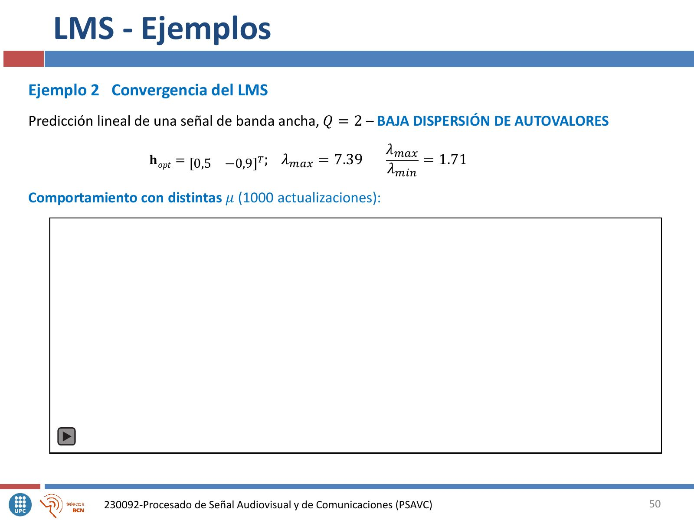

```text
   LMS - Ejemplos
Ejemplo 2 Convergencia del LMS
Predicción lineal de una señal de banda ancha, 𝑄𝑄 = 2 – BAJA DISPERSIÓN DE AUTOVALORES
                                                                  𝜆𝜆𝑚𝑚𝑚𝑚𝑚𝑚
                    𝐡𝐡𝑜𝑜𝑜𝑜𝑡𝑡 = 0,5 −0,9 𝑇𝑇 ; 𝜆𝜆𝑚𝑚𝑚𝑚𝑚𝑚 = 7.39               = 1.71
                                                                  𝜆𝜆𝑚𝑚𝑖𝑖𝑖𝑖
Comportamiento con distintas 𝜇𝜇 (1000 actualizaciones):


           230092-Procesado de Señal Audiovisual y de Comunicaciones (PSAVC)             50
```

## Page 51

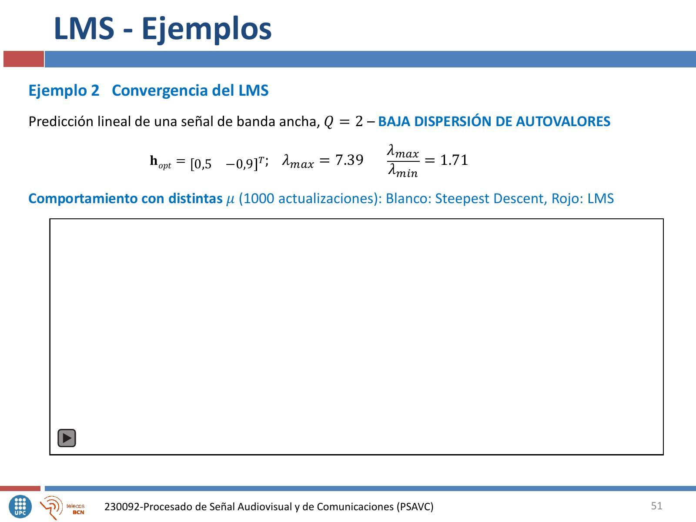

```text
   LMS - Ejemplos
Ejemplo 2 Convergencia del LMS
Predicción lineal de una señal de banda ancha, 𝑄𝑄 = 2 – BAJA DISPERSIÓN DE AUTOVALORES
                                                                  𝜆𝜆𝑚𝑚𝑚𝑚𝑚𝑚
                    𝐡𝐡𝑜𝑜𝑜𝑜𝑡𝑡 = 0,5 −0,9 𝑇𝑇 ; 𝜆𝜆𝑚𝑚𝑚𝑚𝑚𝑚 = 7.39               = 1.71
                                                                  𝜆𝜆𝑚𝑚𝑖𝑖𝑖𝑖
Comportamiento con distintas 𝜇𝜇 (1000 actualizaciones): Blanco: Steepest Descent, Rojo: LMS


           230092-Procesado de Señal Audiovisual y de Comunicaciones (PSAVC)                  51
```

## Page 52

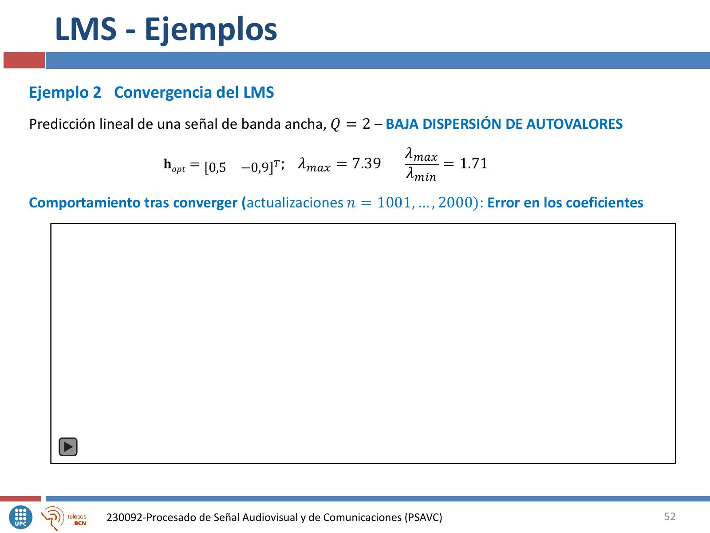

```text
   LMS - Ejemplos
Ejemplo 2 Convergencia del LMS
Predicción lineal de una señal de banda ancha, 𝑄𝑄 = 2 – BAJA DISPERSIÓN DE AUTOVALORES
                                                                    𝜆𝜆𝑚𝑚𝑚𝑚𝑚𝑚
                      𝐡𝐡𝑜𝑜𝑜𝑜𝑡𝑡 = 0,5 −0,9 𝑇𝑇 ; 𝜆𝜆𝑚𝑚𝑚𝑚𝑚𝑚 = 7.39               = 1.71
                                                                    𝜆𝜆𝑚𝑚𝑖𝑖𝑖𝑖
Comportamiento tras converger (actualizaciones 𝑛𝑛 = 1001, … , 2000): Error en los coeficientes


           230092-Procesado de Señal Audiovisual y de Comunicaciones (PSAVC)                     52
```

## Page 53

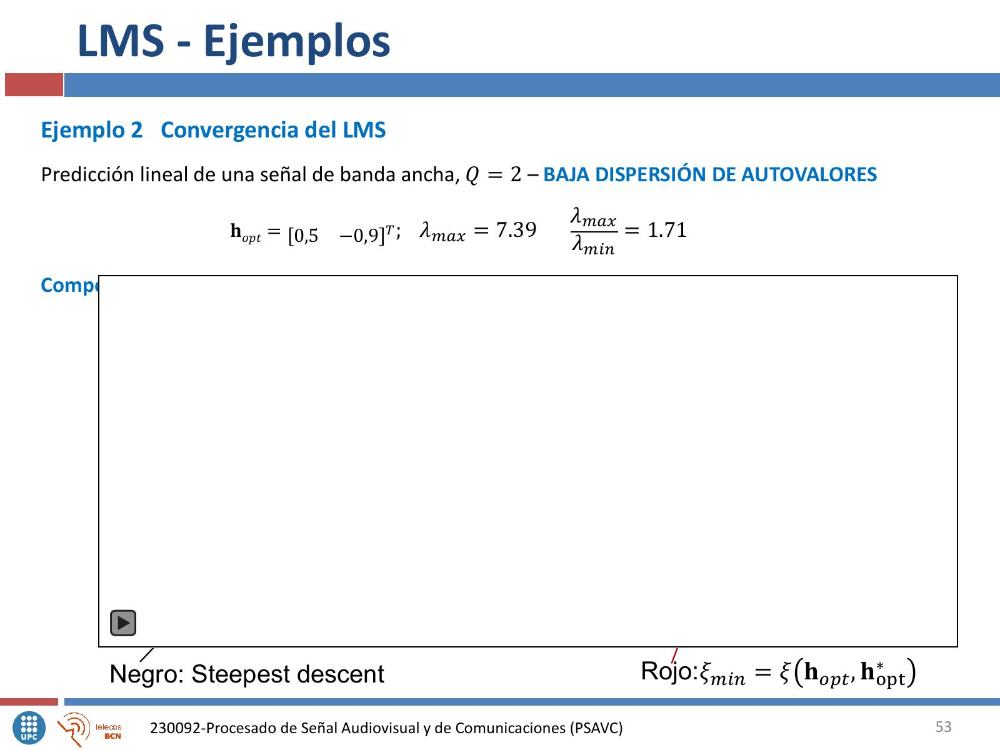

```text
   LMS - Ejemplos
Ejemplo 2 Convergencia del LMS
Predicción lineal de una señal de banda ancha, 𝑄𝑄 = 2 – BAJA DISPERSIÓN DE AUTOVALORES
                                                                    𝜆𝜆𝑚𝑚𝑚𝑚𝑚𝑚
                      𝐡𝐡𝑜𝑜𝑜𝑜𝑡𝑡 = 0,5 −0,9 𝑇𝑇 ; 𝜆𝜆𝑚𝑚𝑚𝑚𝑚𝑚 = 7.39               = 1.71
                                                                    𝜆𝜆𝑚𝑚𝑖𝑖𝑖𝑖
Comportamiento en convergencia:


       Negro: Steepest descent                                                 Rojo:𝜉𝜉𝑚𝑚𝑚𝑚𝑚𝑚 = 𝜉𝜉 𝐡𝐡𝑜𝑜𝑜𝑜𝑜𝑜 , 𝐡𝐡∗opt

           230092-Procesado de Señal Audiovisual y de Comunicaciones (PSAVC)                                          53
```

## Page 54

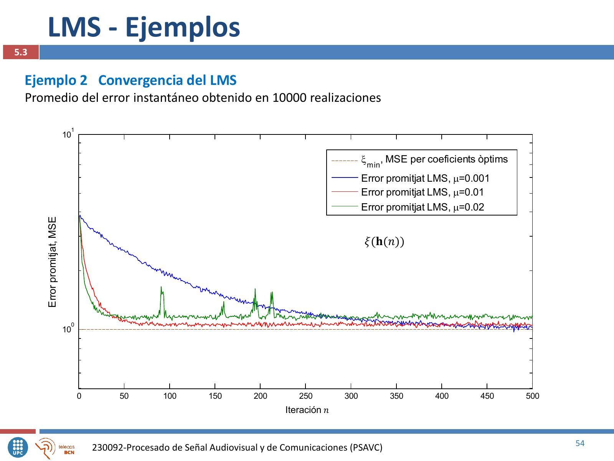

```text
         LMS - Ejemplos
5.3

  Ejemplo 2 Convergencia del LMS
  Promedio del error instantáneo obtenido en 10000 realizaciones

                              1
                             10


                                                                                                      ξ         , MSE per coeficients òptims
                                                                                                          min
                                                                                                      Error promitjat LMS, µ=0.001
                                                                                                      Error promitjat LMS, µ=0.01
                                                                                                      Error promitjat LMS, µ=0.02


      Error promitjat, MSE
                                                                                                      𝜉𝜉(𝐡𝐡(𝑛𝑛))


                              0
                             10


                                  0         50       100        150       200       250         300               350       400      450       500
                                                                                  Iteració 𝑛𝑛
                                                                                 Iteración


                                      230092-Procesado de Señal Audiovisual y de Comunicaciones (PSAVC)                                              54
```

## Page 55

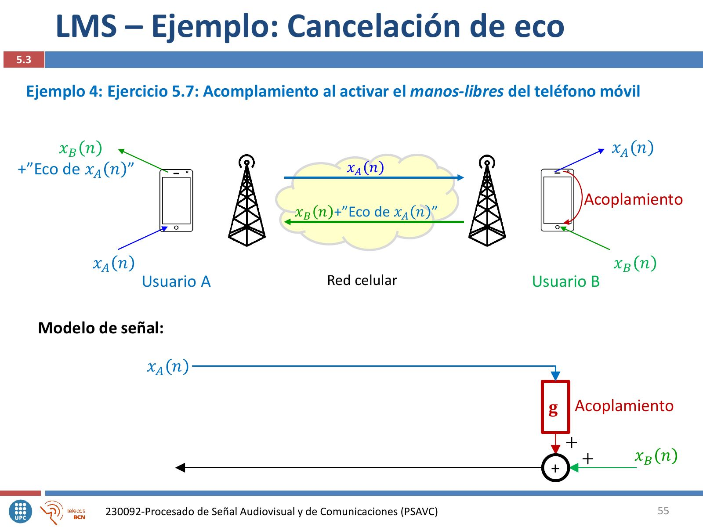

```text
        LMS – Ejemplo: Cancelación de eco
5.3

 Ejemplo 4: Ejercicio 5.7: Acomplamiento al activar el manos-libres del teléfono móvil


     𝑥𝑥𝐵𝐵 𝑛𝑛                                                                                    𝑥𝑥𝐴𝐴 𝑛𝑛
+”Eco de 𝑥𝑥𝐴𝐴 𝑛𝑛 ”                                           𝑥𝑥𝐴𝐴 𝑛𝑛

                                                                                            Acoplamiento
                                                   𝑥𝑥𝐵𝐵 𝑛𝑛 +”Eco de 𝑥𝑥𝐴𝐴 𝑛𝑛 ”


            𝑥𝑥𝐴𝐴 𝑛𝑛                                                                             𝑥𝑥𝐵𝐵 𝑛𝑛
                      Usuario A                          Red celular              Usuario B

      Modelo de señal:

                      𝑥𝑥𝐴𝐴 𝑛𝑛

                                                                                    𝐠𝐠 Acoplamiento
                                                                                        +
                                                                                            +       𝑥𝑥𝐵𝐵 𝑛𝑛
                                                                                    +

              230092-Procesado de Señal Audiovisual y de Comunicaciones (PSAVC)                           55
```

## Page 56

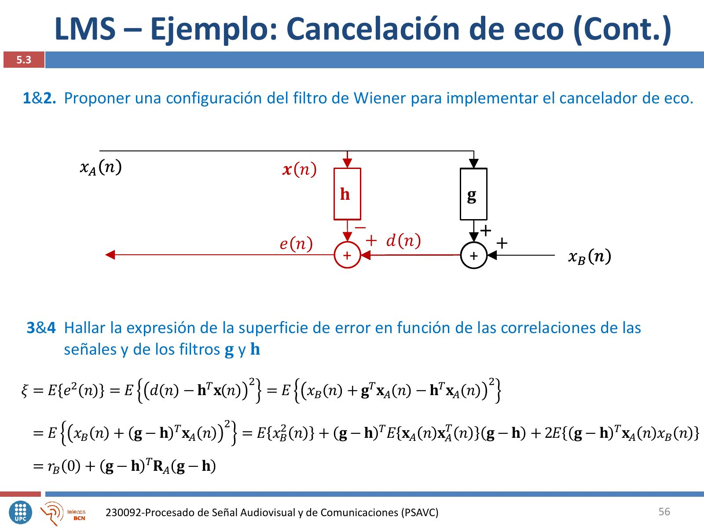

```text
         LMS – Ejemplo: Cancelación de eco (Cont.)
5.3


 1&2. Proponer una configuración del filtro de Wiener para implementar el cancelador de eco.


              𝑥𝑥𝐴𝐴 𝑛𝑛                                  𝒙𝒙 𝑛𝑛
                                                                    𝐡𝐡                         𝐠𝐠
                                                                         −                          +
                                                      𝑒𝑒 𝑛𝑛               + 𝑑𝑑 𝑛𝑛                       +
                                                                     +                          +                  𝑥𝑥𝐵𝐵 𝑛𝑛


  3&4 Hallar la expresión de la superficie de error en función de las correlaciones de las
      señales y de los filtros 𝐠𝐠 y 𝐡𝐡
                                                2                                                   2
𝜉𝜉 = 𝐸𝐸 𝑒𝑒2 𝑛𝑛      = 𝐸𝐸   𝑑𝑑 𝑛𝑛 − 𝐡𝐡𝑇𝑇𝐱𝐱 𝑛𝑛        = 𝐸𝐸      𝑥𝑥𝐵𝐵 𝑛𝑛 + 𝐠𝐠𝑇𝑇𝐱𝐱𝐴𝐴 𝑛𝑛 − 𝐡𝐡𝑇𝑇𝐱𝐱𝐴𝐴 𝑛𝑛

                                           2
      = 𝐸𝐸   𝑥𝑥𝐵𝐵 𝑛𝑛 + 𝐠𝐠 − 𝐡𝐡 𝑇𝑇𝐱𝐱𝐴𝐴 𝑛𝑛       = 𝐸𝐸 𝑥𝑥𝐵𝐵2 𝑛𝑛 + 𝐠𝐠 − 𝐡𝐡 𝑇𝑇𝐸𝐸 𝐱𝐱𝐴𝐴 𝑛𝑛 𝐱𝐱𝐴𝐴𝑇𝑇 𝑛𝑛       𝐠𝐠 − 𝐡𝐡 + 2𝐸𝐸 𝐠𝐠 − 𝐡𝐡 𝑇𝑇𝐱𝐱𝐴𝐴 𝑛𝑛 𝑥𝑥𝐵𝐵 𝑛𝑛

      = 𝑟𝑟𝐵𝐵 0 + 𝐠𝐠 − 𝐡𝐡 𝑇𝑇𝐑𝐑𝐴𝐴 𝐠𝐠 − 𝐡𝐡

                   230092-Procesado de Señal Audiovisual y de Comunicaciones (PSAVC)                                                 56
```

## Page 57

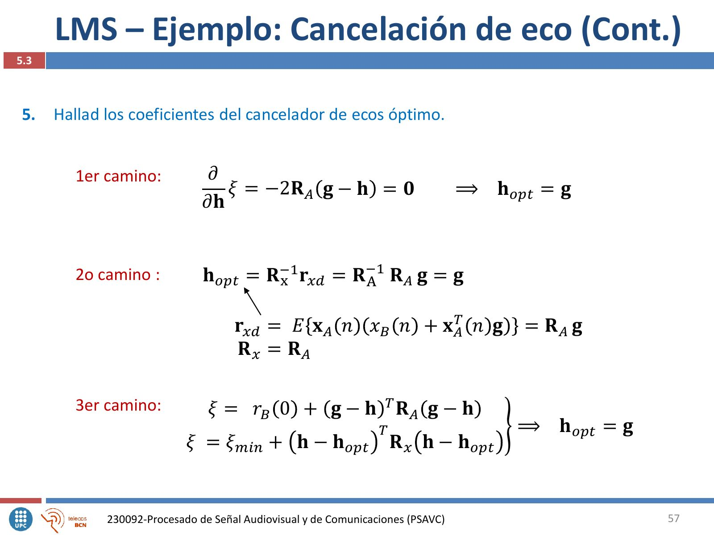

```text
      LMS – Ejemplo: Cancelación de eco (Cont.)
5.3


 5.   Hallad los coeficientes del cancelador de ecos óptimo.


        1er camino:             𝜕𝜕
                                    𝜉𝜉 = −2𝐑𝐑𝐴𝐴 𝐠𝐠 − 𝐡𝐡 = 𝟎𝟎                     ⟹ 𝐡𝐡𝑜𝑜𝑜𝑜𝑜𝑜 = 𝐠𝐠
                               𝜕𝜕𝐡𝐡


                                                         −1
        2o camino :            𝐡𝐡𝑜𝑜𝑜𝑜𝑜𝑜 = 𝐑𝐑−1
                                            x 𝐫𝐫𝑥𝑥𝑥𝑥 = 𝐑𝐑 A 𝐑𝐑𝐴𝐴 𝐠𝐠 = 𝐠𝐠


                                     𝐫𝐫𝑥𝑥𝑥𝑥 = 𝐸𝐸 𝐱𝐱𝐴𝐴 𝑛𝑛 𝑥𝑥𝐵𝐵 𝑛𝑛 + 𝐱𝐱𝐴𝐴𝑇𝑇 𝑛𝑛 𝐠𝐠               = 𝐑𝐑𝐴𝐴 𝐠𝐠
                                      𝐑𝐑 𝑥𝑥 = 𝐑𝐑𝐴𝐴

        3er camino:             𝜉𝜉 = 𝑟𝑟𝐵𝐵 0 + 𝐠𝐠 − 𝐡𝐡 𝑇𝑇 𝐑𝐑𝐴𝐴 𝐠𝐠 − 𝐡𝐡
                                                                 𝑇𝑇                         � ⟹ 𝐡𝐡𝑜𝑜𝑜𝑜𝑜𝑜 = 𝐠𝐠
                            𝜉𝜉 = 𝜉𝜉𝑚𝑚𝑚𝑚𝑚𝑚 + 𝐡𝐡 − 𝐡𝐡𝑜𝑜𝑜𝑜𝑜𝑜             𝐑𝐑 𝑥𝑥 𝐡𝐡 − 𝐡𝐡𝑜𝑜𝑜𝑜𝑜𝑜


             230092-Procesado de Señal Audiovisual y de Comunicaciones (PSAVC)                                  57
```

## Page 58

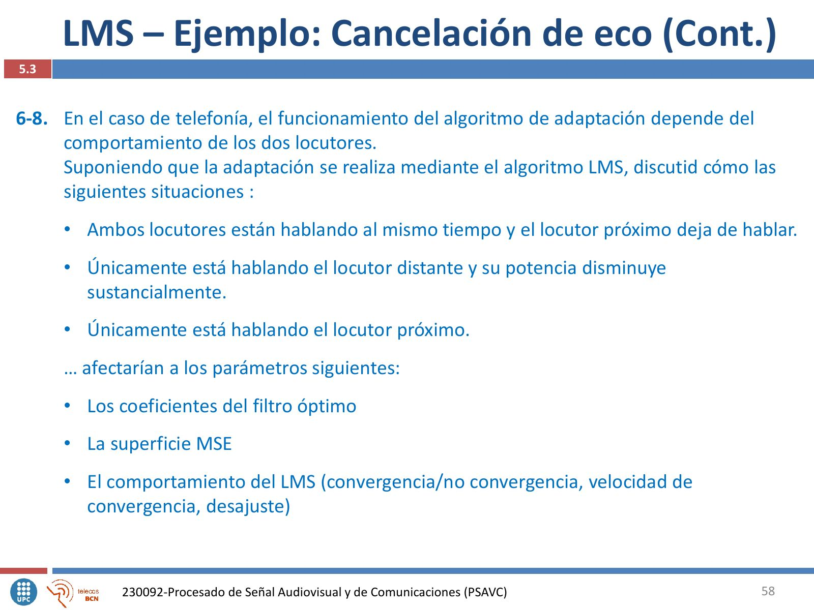

```text
      LMS – Ejemplo: Cancelación de eco (Cont.)
5.3


6-8. En el caso de telefonía, el funcionamiento del algoritmo de adaptación depende del
     comportamiento de los dos locutores.
     Suponiendo que la adaptación se realiza mediante el algoritmo LMS, discutid cómo las
     siguientes situaciones :
      • Ambos locutores están hablando al mismo tiempo y el locutor próximo deja de hablar.
      • Únicamente está hablando el locutor distante y su potencia disminuye
        sustancialmente.
      • Únicamente está hablando el locutor próximo.
      … afectarían a los parámetros siguientes:
      • Los coeficientes del filtro óptimo
      • La superficie MSE
      • El comportamiento del LMS (convergencia/no convergencia, velocidad de
        convergencia, desajuste)


             230092-Procesado de Señal Audiovisual y de Comunicaciones (PSAVC)         58
```

## Page 59

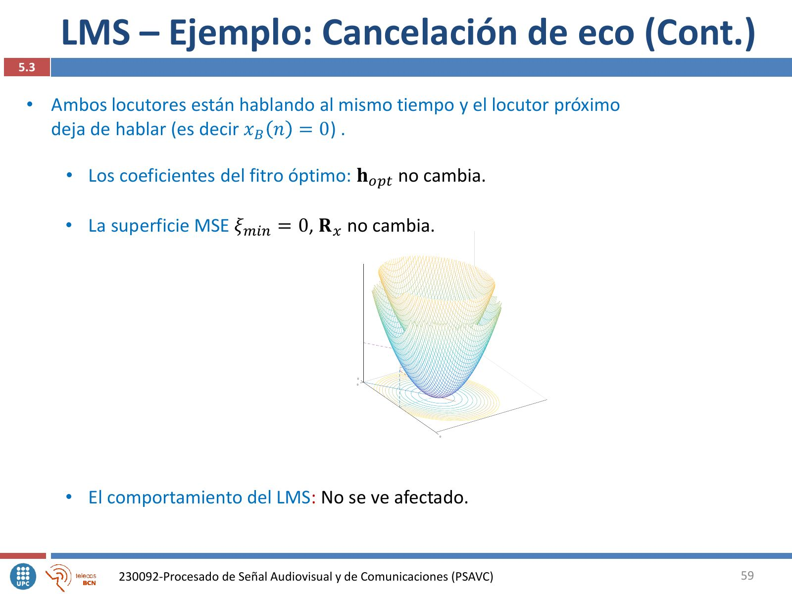

```text
      LMS – Ejemplo: Cancelación de eco (Cont.)
5.3


 • Ambos locutores están hablando al mismo tiempo y el locutor próximo
   deja de hablar (es decir 𝑥𝑥𝐵𝐵 𝑛𝑛 = 0) .

      • Los coeficientes del fitro óptimo: 𝐡𝐡𝑜𝑜𝑜𝑜𝑜𝑜 no cambia.

      • La superficie MSE 𝜉𝜉𝑚𝑚𝑚𝑚𝑚𝑚 = 0, 𝐑𝐑 𝑥𝑥 no cambia.


                                                      0

                                                      0


                                                                    0


      • El comportamiento del LMS: No se ve afectado.


             230092-Procesado de Señal Audiovisual y de Comunicaciones (PSAVC)   59
```

## Page 60

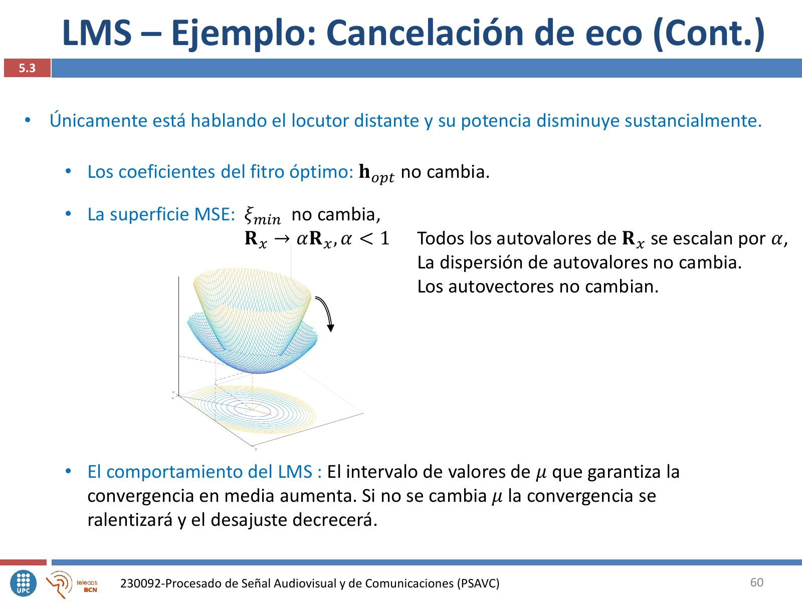

```text
      LMS – Ejemplo: Cancelación de eco (Cont.)
5.3


• Únicamente está hablando el locutor distante y su potencia disminuye sustancialmente.

      • Los coeficientes del fitro óptimo: 𝐡𝐡𝑜𝑜𝑜𝑜𝑜𝑜 no cambia.

      • La superficie MSE: 𝜉𝜉𝑚𝑚𝑚𝑚𝑚𝑚 no cambia,
                           𝐑𝐑 𝑥𝑥 → 𝛼𝛼𝐑𝐑 𝑥𝑥 , 𝛼𝛼 < 1            Todos los autovalores de 𝐑𝐑 𝑥𝑥 se escalan por 𝛼𝛼,
                                                               La dispersión de autovalores no cambia.
                                                               Los autovectores no cambian.


                     0

                     0


                                    0


      • El comportamiento del LMS : El intervalo de valores de 𝜇𝜇 que garantiza la
        convergencia en media aumenta. Si no se cambia 𝜇𝜇 la convergencia se
        ralentizará y el desajuste decrecerá.


             230092-Procesado de Señal Audiovisual y de Comunicaciones (PSAVC)                            60
```

## Page 61

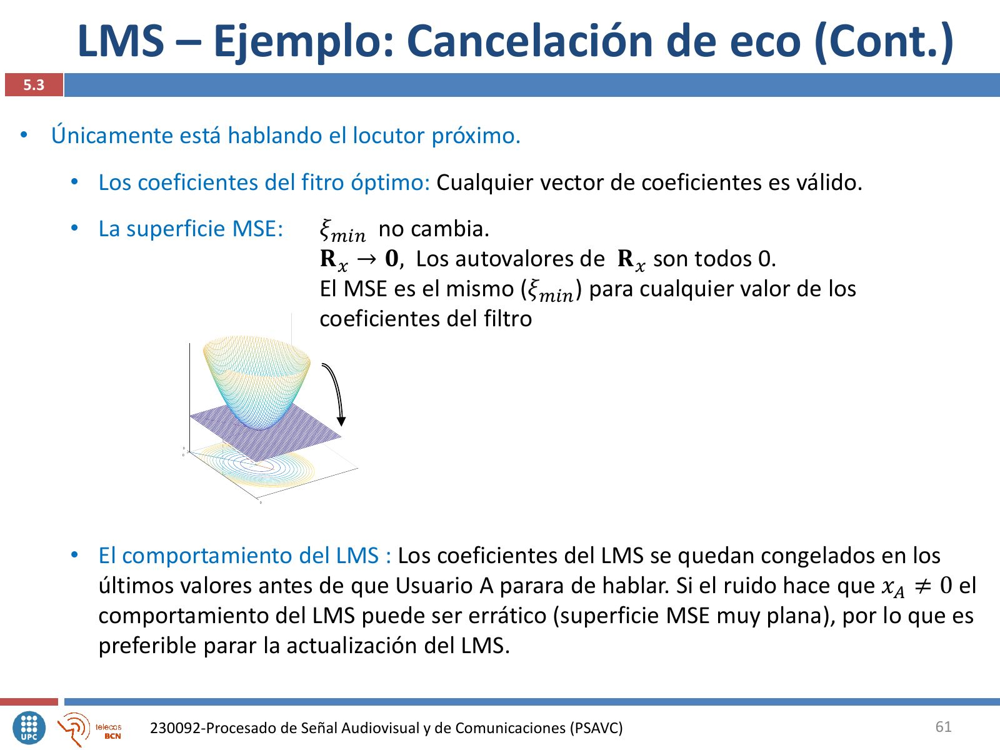

```text
      LMS – Ejemplo: Cancelación de eco (Cont.)
5.3


• Únicamente está hablando el locutor próximo.
      • Los coeficientes del fitro óptimo: Cualquier vector de coeficientes es válido.
      • La superficie MSE:           𝜉𝜉𝑚𝑚𝑚𝑚𝑚𝑚 no cambia.
                                     𝐑𝐑 𝑥𝑥 → 𝟎𝟎, Los autovalores de 𝐑𝐑 𝑥𝑥 son todos 0.
                                     El MSE es el mismo (𝜉𝜉𝑚𝑚𝑚𝑚𝑚𝑚 ) para cualquier valor de los
                                     coeficientes del filtro


                  0

                  0


                             0


      • El comportamiento del LMS : Los coeficientes del LMS se quedan congelados en los
        últimos valores antes de que Usuario A parara de hablar. Si el ruido hace que 𝑥𝑥𝐴𝐴 ≠ 0 el
        comportamiento del LMS puede ser errático (superficie MSE muy plana), por lo que es
        preferible parar la actualización del LMS.


              230092-Procesado de Señal Audiovisual y de Comunicaciones (PSAVC)                   61
```

## Page 62

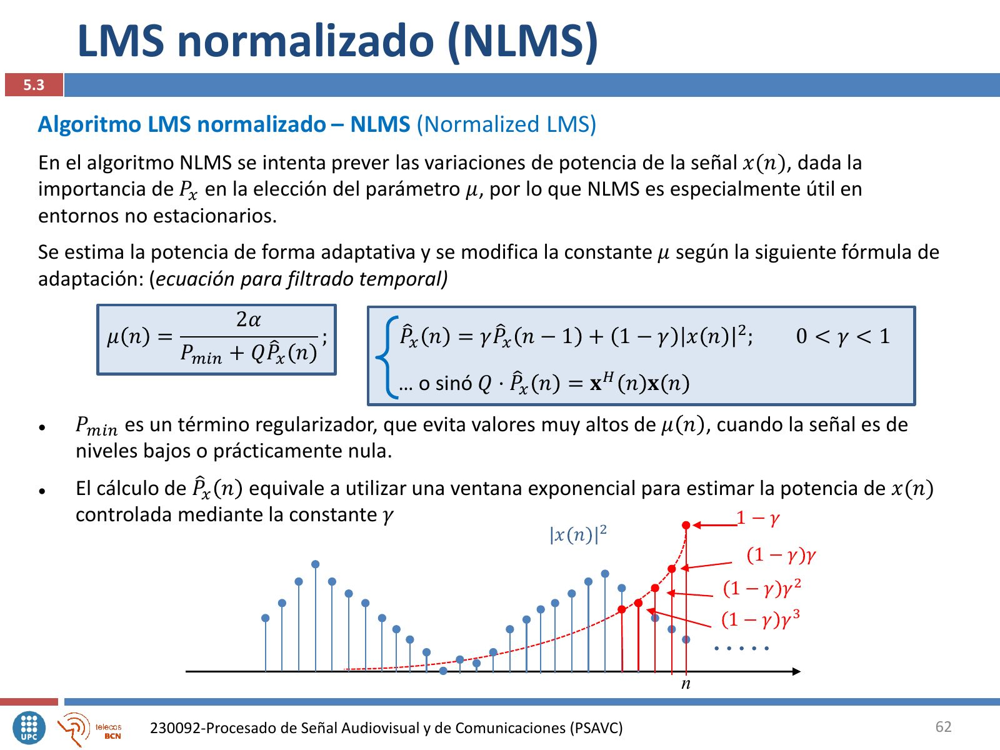

```text
      LMS normalizado (NLMS)
5.3

  Algoritmo LMS normalizado – NLMS (Normalized LMS)
  En el algoritmo NLMS se intenta prever las variaciones de potencia de la señal 𝑥𝑥(𝑛𝑛), dada la
  importancia de 𝑃𝑃𝑥𝑥 en la elección del parámetro 𝜇𝜇, por lo que NLMS es especialmente útil en
  entornos no estacionarios.
  Se estima la potencia de forma adaptativa y se modifica la constante 𝜇𝜇 según la siguiente fórmula de
  adaptación: (ecuación para filtrado temporal)
                            2𝛼𝛼
         𝜇𝜇 𝑛𝑛 =                            ;   𝑃𝑃�𝑥𝑥 𝑛𝑛 = 𝛾𝛾𝑃𝑃�𝑥𝑥 𝑛𝑛 − 1 + 1 − 𝛾𝛾 𝑥𝑥 𝑛𝑛    2
                                                                                                ;         0 < 𝛾𝛾 < 1
                   𝑃𝑃𝑚𝑚𝑚𝑚𝑚𝑚 + 𝑄𝑄 𝑃𝑃�𝑥𝑥 𝑛𝑛
                                                … o sinó 𝑄𝑄 · 𝑃𝑃�𝑥𝑥 𝑛𝑛 = 𝐱𝐱 𝐻𝐻 𝑛𝑛 𝐱𝐱 𝑛𝑛
  ●   𝑃𝑃𝑚𝑚𝑚𝑚𝑚𝑚 es un término regularizador, que evita valores muy altos de 𝜇𝜇 𝑛𝑛 , cuando la señal es de
      niveles bajos o prácticamente nula.
  ●   El cálculo de 𝑃𝑃�𝑥𝑥 𝑛𝑛 equivale a utilizar una ventana exponencial para estimar la potencia de 𝑥𝑥(𝑛𝑛)
      controlada mediante la constante 𝛾𝛾                                            1 − 𝛾𝛾
                                                                             2
                                                                     𝑥𝑥 𝑛𝑛
                                                                                                    1 − 𝛾𝛾 𝛾𝛾
                                                                                           1 − 𝛾𝛾 𝛾𝛾 2
                                                                                           1 − 𝛾𝛾 𝛾𝛾 3
                                                                                          .....
                                                                                      n

              230092-Procesado de Señal Audiovisual y de Comunicaciones (PSAVC)                                        62
```

## Page 63

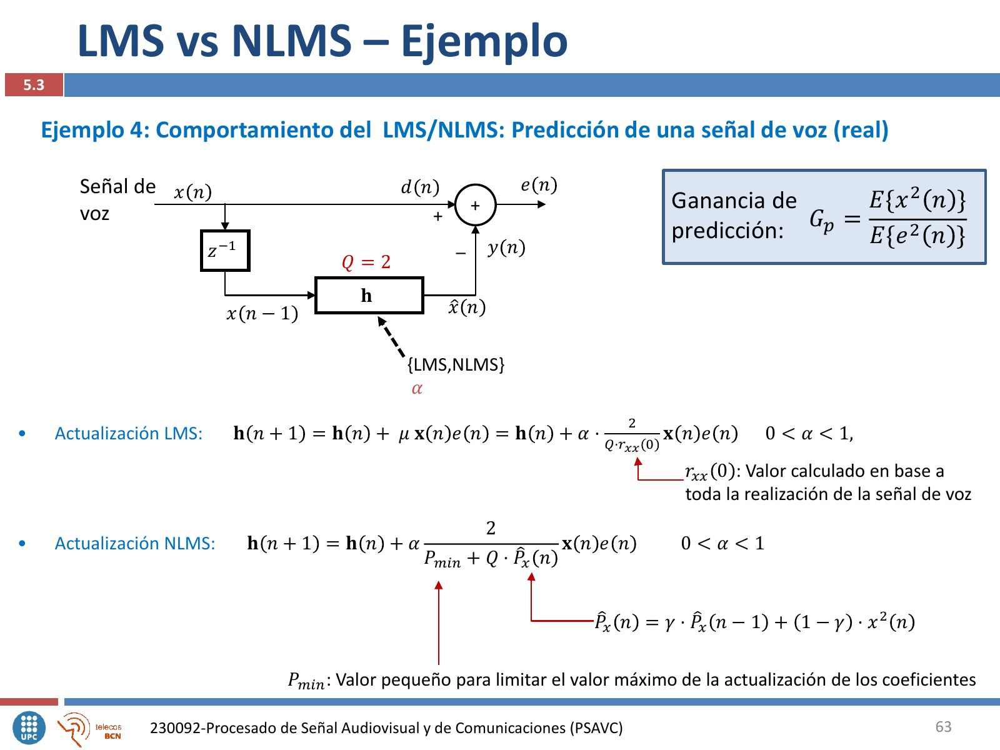

```text
        LMS vs NLMS – Ejemplo
5.3

    Ejemplo 4: Comportamiento del LMS/NLMS: Predicción de una señal de voz (real)

         Señal de 𝑥𝑥 𝑛𝑛                                 𝑑𝑑 𝑛𝑛                        𝑒𝑒 𝑛𝑛
         voz                                                             +                                        Ganancia de        𝐸𝐸{𝑥𝑥 2 𝑛𝑛 }
                                                                +
                                                                                                                  predicción: 𝐺𝐺𝑝𝑝 = 𝐸𝐸{𝑒𝑒 2 𝑛𝑛 }
                           𝑧𝑧 −1                                             𝑦𝑦 𝑛𝑛
                                               𝑄𝑄 = 2                _
                                                 𝐡𝐡
                              𝑥𝑥 𝑛𝑛 − 1                             𝑥𝑥� 𝑛𝑛

                                                        {LMS,NLMS}
                                                         𝛼𝛼
                                                                                                        2
•     Actualización LMS:       𝐡𝐡 𝑛𝑛 + 1 = 𝐡𝐡 𝑛𝑛 + 𝜇𝜇 𝐱𝐱 𝑛𝑛 𝑒𝑒 𝑛𝑛 = 𝐡𝐡 𝑛𝑛 + 𝛼𝛼 ·                                 𝐱𝐱 𝑛𝑛 𝑒𝑒 𝑛𝑛   0 < 𝛼𝛼 < 1,
                                                                                                   𝑄𝑄·𝑟𝑟𝑥𝑥𝑥𝑥 0
                                                                                                                    𝑟𝑟𝑥𝑥𝑥𝑥 0 : Valor calculado en base a
                                                                                                                    toda la realización de la señal de voz
                                                                             2
•     Actualización NLMS:          𝐡𝐡 𝑛𝑛 + 1 = 𝐡𝐡 𝑛𝑛 + 𝛼𝛼                                    𝐱𝐱 𝑛𝑛 𝑒𝑒 𝑛𝑛           0 < 𝛼𝛼 < 1
                                                            𝑃𝑃𝑚𝑚𝑚𝑚𝑚𝑚 + 𝑄𝑄 · 𝑃𝑃�𝑥𝑥 𝑛𝑛


                                                                                                  𝑃𝑃�𝑥𝑥 𝑛𝑛 = 𝛾𝛾 · 𝑃𝑃�𝑥𝑥 𝑛𝑛 − 1 + 1 − 𝛾𝛾 · 𝑥𝑥 2 𝑛𝑛

                                        𝑃𝑃𝑚𝑚𝑚𝑚𝑚𝑚 : Valor pequeño para limitar el valor máximo de la actualización de los coeficientes

                 230092-Procesado de Señal Audiovisual y de Comunicaciones (PSAVC)                                                                   63
```

## Page 64

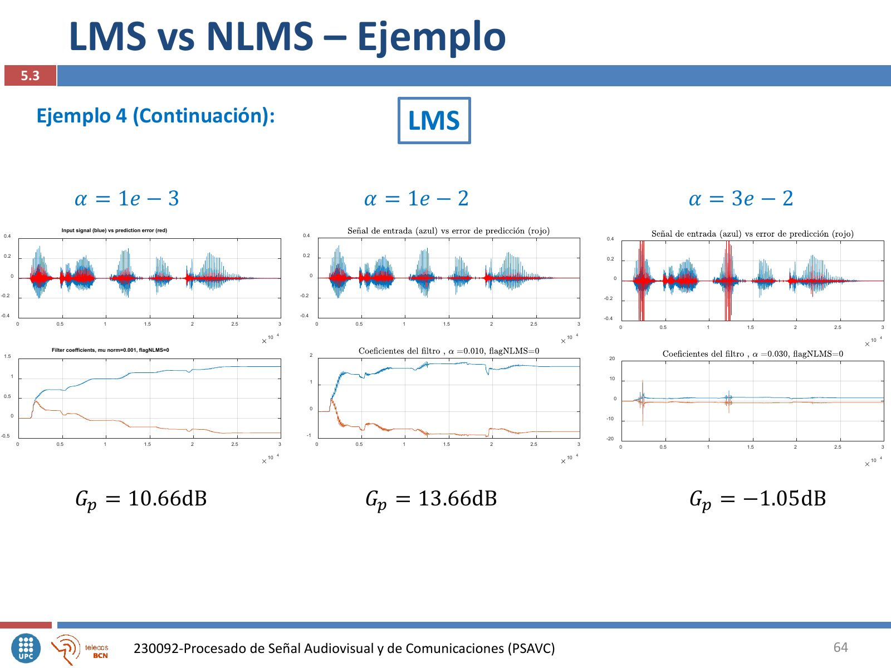

```text
                            LMS vs NLMS – Ejemplo
               5.3

                 Ejemplo 4 (Continuación):                                                                              LMS

                             𝛼𝛼 = 1𝑒𝑒 − 3                                                                       𝛼𝛼 = 1𝑒𝑒 − 2                                            𝛼𝛼 = 3𝑒𝑒 − 2
                        Input signal (blue) vs prediction error (red)
 0.4                                                                                        0.4
                                                                                                                                                    0.4


 0.2                                                                                        0.2
                                                                                                                                                    0.2


       0                                                                                          0
                                                                                                                                                          0


-0.2                                                                                       -0.2
                                                                                                                                                   -0.2


-0.4                                                                                       -0.4
                                                                                                                                                   -0.4
           0          0.5                1                 1.5          2   2.5        3              0   0.5       1     1.5   2   2.5        3
                                                                                                                                                              0   0.5     1   1.5   2    2.5        3
                                                                                       4                                                       4
                                                                                  10                                                      10                                                        4
                                                                                                                                                                                               10

                     Filter coefficients, mu norm=0.001, flagNLMS=0
 1.5                                                                                              2
                                                                                                                                                     20


       1                                                                                                                                             10
                                                                                                  1

 0.5
                                                                                                                                                          0

                                                                                                  0
       0
                                                                                                                                                    -10


-0.5                                                                                          -1
                                                                                                                                                    -20
           0          0.5                1                 1.5          2   2.5        3              0   0.5       1     1.5   2   2.5        3
                                                                                                                                                              0   0.5     1   1.5   2    2.5        3
                                                                                       4                                                       4
                                                                                  10                                                      10                                                        4
                                                                                                                                                                                               10


                             𝐺𝐺𝑝𝑝 = 10.66dB                                                                     𝐺𝐺𝑝𝑝 = 13.66dB                                          𝐺𝐺𝑝𝑝 = −1.05dB


                                                      230092-Procesado de Señal Audiovisual y de Comunicaciones (PSAVC)                                                                  64
```

## Page 65

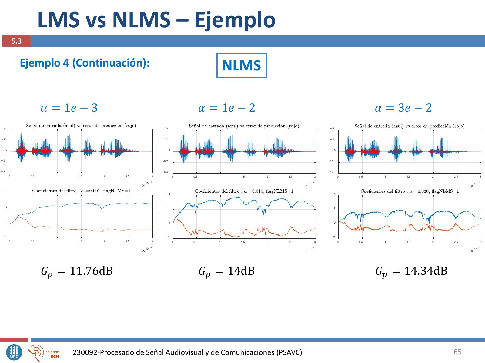

```text
                           LMS vs NLMS – Ejemplo
               5.3

                 Ejemplo 4 (Continuación):                                                   NLMS

                           𝛼𝛼 = 1𝑒𝑒 − 3                                              𝛼𝛼 = 1𝑒𝑒 − 2                                           𝛼𝛼 = 3𝑒𝑒 − 2
 0.4                                                             0.4                                                    0.4


 0.2                                                             0.2                                                    0.2


       0                                                               0                                                      0


-0.2                                                            -0.2                                                   -0.2


-0.4                                                            -0.4                                                   -0.4
           0         0.5      1    1.5    2      2.5        3              0   0.5       1    1.5   2   2.5        3              0   0.5     1   1.5   2    2.5        3
                                                            4                                                      4                                                    4
                                                       10                                                     10                                                   10


       2                                                               2                                                      4


       1                                                               1                                                      2


       0                                                               0                                                      0


   -1                                                              -1                                                     -2
           0         0.5      1    1.5    2      2.5        3              0   0.5       1    1.5   2   2.5        3              0   0.5     1   1.5   2    2.5        3
                                                            4                                                      4                                                    4
                                                       10                                                     10                                                   10


                           𝐺𝐺𝑝𝑝 = 11.76dB                                            𝐺𝐺𝑝𝑝 = 14dB                                            𝐺𝐺𝑝𝑝 = 14.34dB


                                  230092-Procesado de Señal Audiovisual y de Comunicaciones (PSAVC)                                                          65
```

## Page 66

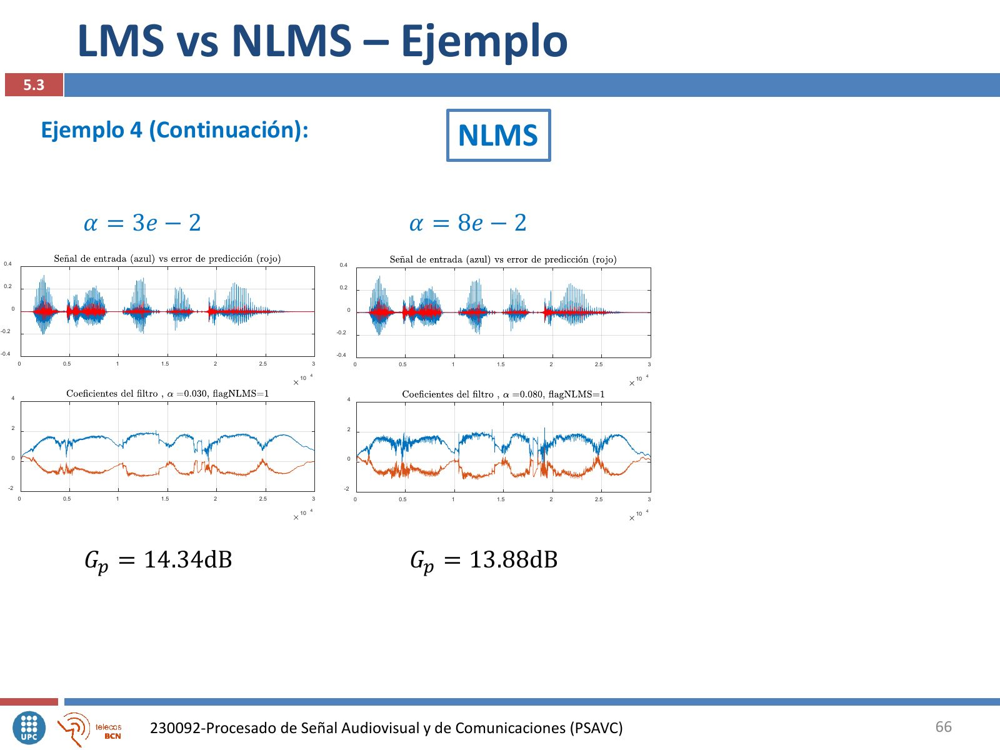

```text
                           LMS vs NLMS – Ejemplo
               5.3

                 Ejemplo 4 (Continuación):                                                   NLMS

                           𝛼𝛼 = 3𝑒𝑒 − 2                                              𝛼𝛼 = 8𝑒𝑒 − 2
 0.4                                                             0.4


 0.2                                                             0.2


       0                                                               0


-0.2                                                            -0.2


-0.4                                                            -0.4
           0         0.5      1    1.5    2      2.5        3              0   0.5       1    1.5   2   2.5        3
                                                            4                                                      4
                                                       10                                                     10


       4                                                               4


       2                                                               2


       0                                                               0


   -2                                                              -2
           0         0.5      1    1.5    2      2.5        3              0   0.5       1    1.5   2   2.5        3
                                                            4                                                      4
                                                       10                                                     10


                           𝐺𝐺𝑝𝑝 = 14.34dB                                            𝐺𝐺𝑝𝑝 = 13.88dB


                                  230092-Procesado de Señal Audiovisual y de Comunicaciones (PSAVC)                    66
```

## Page 67

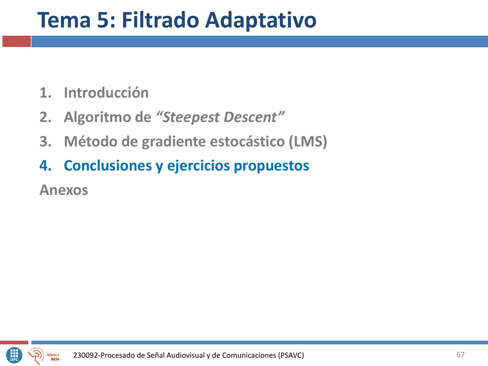

```text
Tema 5: Filtrado Adaptativo

1. Introducción
2. Algoritmo de “Steepest Descent”
3. Método de gradiente estocástico (LMS)
4. Conclusiones y ejercicios propuestos
Anexos


    230092-Procesado de Señal Audiovisual y de Comunicaciones (PSAVC)   67
```

## Page 68

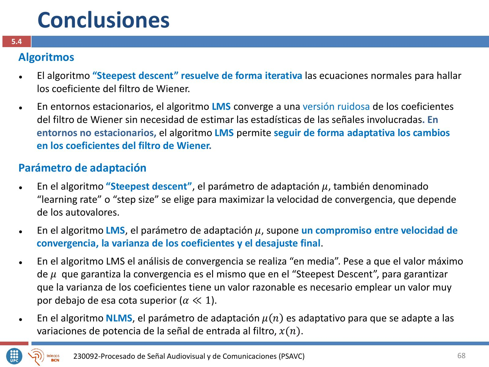

```text
      Conclusiones
5.4

  Algoritmos
  ●   El algoritmo “Steepest descent” resuelve de forma iterativa las ecuaciones normales para hallar
      los coeficiente del filtro de Wiener.
  ●   En entornos estacionarios, el algoritmo LMS converge a una versión ruidosa de los coeficientes
      del filtro de Wiener sin necesidad de estimar las estadísticas de las señales involucradas. En
      entornos no estacionarios, el algoritmo LMS permite seguir de forma adaptativa los cambios
      en los coeficientes del filtro de Wiener.

  Parámetro de adaptación
  ●   En el algoritmo “Steepest descent”, el parámetro de adaptación 𝜇𝜇, también denominado
      “learning rate” o “step size” se elige para maximizar la velocidad de convergencia, que depende
      de los autovalores.
  ●   En el algoritmo LMS, el parámetro de adaptación 𝜇𝜇, supone un compromiso entre velocidad de
      convergencia, la varianza de los coeficientes y el desajuste final.
  ●   En el algoritmo LMS el análisis de convergencia se realiza “en media”. Pese a que el valor máximo
      de 𝜇𝜇 que garantiza la convergencia es el mismo que en el “Steepest Descent”, para garantizar
      que la varianza de los coeficientes tiene un valor razonable es necesario emplear un valor muy
      por debajo de esa cota superior (𝛼𝛼 ≪ 1).
  ●   En el algoritmo NLMS, el parámetro de adaptación 𝜇𝜇 𝑛𝑛 es adaptativo para que se adapte a las
      variaciones de potencia de la señal de entrada al filtro, 𝑥𝑥(𝑛𝑛).

              230092-Procesado de Señal Audiovisual y de Comunicaciones (PSAVC)                         68
```

## Page 69

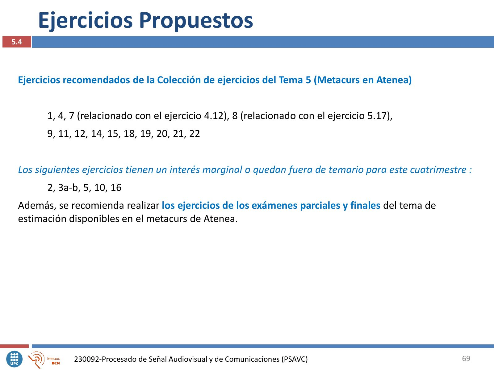

```text
      Ejercicios Propuestos
5.4


 Ejercicios recomendados de la Colección de ejercicios del Tema 5 (Metacurs en Atenea)


       1, 4, 7 (relacionado con el ejercicio 4.12), 8 (relacionado con el ejercicio 5.17),
       9, 11, 12, 14, 15, 18, 19, 20, 21, 22


 Los siguientes ejercicios tienen un interés marginal o quedan fuera de temario para este cuatrimestre :
       2, 3a-b, 5, 10, 16
 Además, se recomienda realizar los ejercicios de los exámenes parciales y finales del tema de
 estimación disponibles en el metacurs de Atenea.


             230092-Procesado de Señal Audiovisual y de Comunicaciones (PSAVC)                       69
```

## Page 70


```text
Tema 5: Filtrado Adaptativo

1. Introducción
2. Algoritmo de “Steepest Descent”
3. Método de gradiente estocástico (LMS)
4. Conclusiones y ejercicios propuestos
Anexos


    230092-Procesado de Señal Audiovisual y de Comunicaciones (PSAVC)   70
```

## Page 71

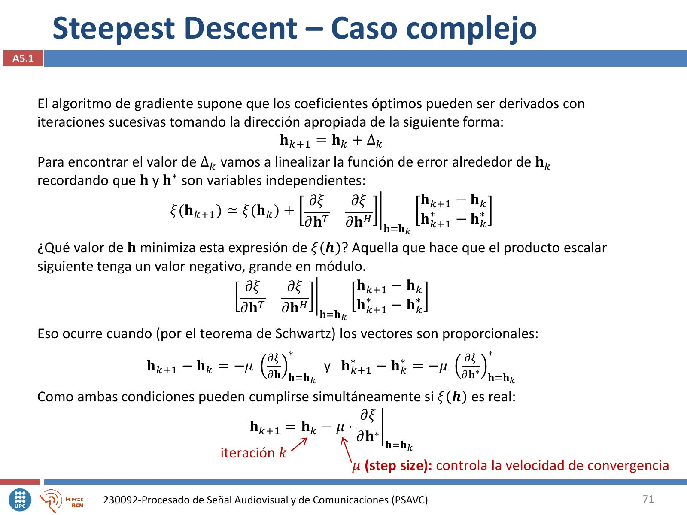

```text
         Steepest Descent – Caso complejo
A5.1


       El algoritmo de gradiente supone que los coeficientes óptimos pueden ser derivados con
       iteraciones sucesivas tomando la dirección apropiada de la siguiente forma:
                                                    𝐡𝐡𝑘𝑘+1 = 𝐡𝐡𝑘𝑘 + Δ𝑘𝑘
       Para encontrar el valor de Δ𝑘𝑘 vamos a linealizar la función de error alrededor de 𝐡𝐡𝑘𝑘
       recordando que 𝐡𝐡 y 𝐡𝐡∗ son variables independientes:
                                                          𝜕𝜕𝜕𝜕    𝜕𝜕𝜕𝜕       𝐡𝐡𝑘𝑘+1 − 𝐡𝐡𝑘𝑘
                             𝜉𝜉(𝐡𝐡𝑘𝑘+1 ) ≃ 𝜉𝜉(𝐡𝐡𝑘𝑘 ) +                 �       ∗        ∗
                                                         𝜕𝜕𝐡𝐡𝑇𝑇 𝜕𝜕𝐡𝐡𝐻𝐻 𝐡𝐡=𝐡𝐡 𝐡𝐡𝑘𝑘+1 − 𝐡𝐡𝑘𝑘
                                                                                 𝑘𝑘
       ¿Qué valor de 𝐡𝐡 minimiza esta expresión de 𝜉𝜉 𝒉𝒉 ? Aquella que hace que el producto escalar
       siguiente tenga un valor negativo, grande en módulo.
                                         𝜕𝜕𝜕𝜕   𝜕𝜕𝜕𝜕        𝐡𝐡𝑘𝑘+1 − 𝐡𝐡𝑘𝑘
                                                      �
                                        𝜕𝜕𝐡𝐡𝑇𝑇 𝜕𝜕𝐡𝐡𝐻𝐻       𝐡𝐡∗𝑘𝑘+1 − 𝐡𝐡∗𝑘𝑘
                                                                𝐡𝐡=𝐡𝐡𝑘𝑘
       Eso ocurre cuando (por el teorema de Schwartz) los vectores son proporcionales:
                                                 𝜕𝜕𝜕𝜕 ∗                                       𝜕𝜕𝜕𝜕 ∗
                         𝐡𝐡𝑘𝑘+1 − 𝐡𝐡𝑘𝑘 = −𝜇𝜇                     y   𝐡𝐡∗𝑘𝑘+1 − 𝐡𝐡∗𝑘𝑘 = −𝜇𝜇
                                                 𝜕𝜕𝜕𝜕 𝐡𝐡=𝐡𝐡𝑘𝑘                                𝜕𝜕𝐡𝐡∗ 𝐡𝐡=𝐡𝐡𝑘𝑘

       Como ambas condiciones pueden cumplirse simultáneamente si 𝜉𝜉 𝒉𝒉 es real:
                                                            𝜕𝜕𝜉𝜉
                                      𝐡𝐡𝑘𝑘+1 = 𝐡𝐡𝑘𝑘 − 𝜇𝜇 · ∗ �
                                                           𝜕𝜕𝐡𝐡 𝐡𝐡=𝐡𝐡
                                 iteración 𝑘𝑘                        𝑘𝑘

                                                          𝜇𝜇 (step size): controla la velocidad de convergencia

                 230092-Procesado de Señal Audiovisual y de Comunicaciones (PSAVC)                           71
```

## Page 72

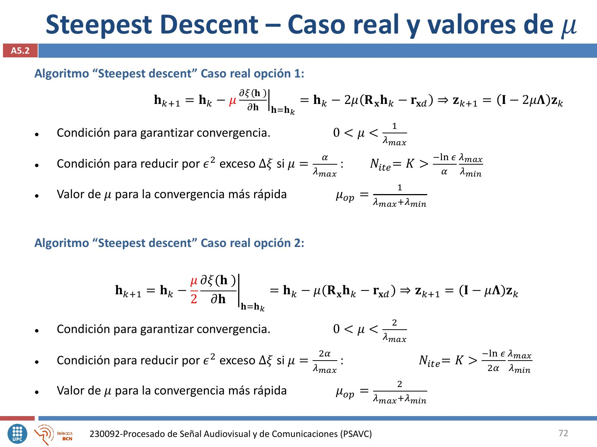

```text
           Steepest Descent – Caso real y valores de 𝜇𝜇
A5.2

       Algoritmo “Steepest descent” Caso real opción 1:
                                                    𝜕𝜕𝜉𝜉 𝐡𝐡
                               𝐡𝐡𝑘𝑘+1 = 𝐡𝐡𝑘𝑘 − 𝜇𝜇           �       = 𝐡𝐡𝑘𝑘 − 2𝜇𝜇 𝐑𝐑 𝐱𝐱 𝐡𝐡𝑘𝑘 − 𝐫𝐫𝐱𝐱𝑑𝑑           ⇒ 𝐳𝐳𝑘𝑘+1 = 𝐈𝐈 − 2𝜇𝜇𝚲𝚲 𝐳𝐳𝑘𝑘
                                                       𝜕𝜕𝐡𝐡 𝐡𝐡=𝐡𝐡𝑘𝑘
                                                                                               1
       ●   Condición para garantizar convergencia.                            0 < 𝜇𝜇 <
                                                                                            𝜆𝜆𝑚𝑚𝑚𝑚𝑚𝑚
                                                                         𝛼𝛼                                   −ln 𝜖𝜖 𝜆𝜆𝑚𝑚𝑚𝑚𝑚𝑚
       ●   Condición para reducir por 𝜖𝜖 2 exceso Δ𝜉𝜉 si 𝜇𝜇 =                    :       𝑁𝑁𝑖𝑖𝑖𝑖𝑖𝑖 = 𝐾𝐾 >
                                                                      𝜆𝜆𝑚𝑚𝑚𝑚𝑚𝑚                                 𝛼𝛼 𝜆𝜆𝑚𝑚𝑚𝑚𝑚𝑚
                                                                                                  1
       ●   Valor de 𝜇𝜇 para la convergencia más rápida                        𝜇𝜇𝑜𝑜𝑜𝑜 =
                                                                                         𝜆𝜆𝑚𝑚𝑚𝑚𝑚𝑚 +𝜆𝜆𝑚𝑚𝑚𝑚𝑚𝑚


       Algoritmo “Steepest descent” Caso real opción 2:

                                        𝜇𝜇 𝜕𝜕𝜉𝜉 𝐡𝐡
                      𝐡𝐡𝑘𝑘+1 = 𝐡𝐡𝑘𝑘 −              � = 𝐡𝐡𝑘𝑘 − 𝜇𝜇 𝐑𝐑 𝐱𝐱 𝐡𝐡𝑘𝑘 − 𝐫𝐫𝐱𝐱𝑑𝑑 ⇒ 𝐳𝐳𝑘𝑘+1 = 𝐈𝐈 − 𝜇𝜇𝚲𝚲 𝐳𝐳𝑘𝑘
                                        2 𝜕𝜕𝐡𝐡 𝐡𝐡=𝐡𝐡
                                                         𝑘𝑘
                                                                                               2
       ●   Condición para garantizar convergencia.                            0 < 𝜇𝜇 <
                                                                                            𝜆𝜆𝑚𝑚𝑚𝑚𝑚𝑚
                                                                        2𝛼𝛼                                                 −ln 𝜖𝜖 𝜆𝜆𝑚𝑚𝑚𝑚𝑚𝑚
       ●   Condición para reducir por 𝜖𝜖 2 exceso Δ𝜉𝜉 si 𝜇𝜇 =                    :                      𝑁𝑁𝑖𝑖𝑖𝑖𝑖𝑖 = 𝐾𝐾 >
                                                                      𝜆𝜆𝑚𝑚𝑚𝑚𝑚𝑚                                               2𝛼𝛼 𝜆𝜆𝑚𝑚𝑚𝑚𝑚𝑚
                                                                                                  2
       ●   Valor de 𝜇𝜇 para la convergencia más rápida                        𝜇𝜇𝑜𝑜𝑜𝑜 =
                                                                                         𝜆𝜆𝑚𝑚𝑚𝑚𝑚𝑚 +𝜆𝜆𝑚𝑚𝑚𝑚𝑚𝑚


                 230092-Procesado de Señal Audiovisual y de Comunicaciones (PSAVC)                                                            72
```
