# Tema 1 Procesos Discretos QP26 G10

- Source PDF: `Teoria/Tema 1 Procesos Discretos QP26 G10.pdf`
- PDF title: `PSAVC - Tema 1: Procesos discretos`
- Pages: 80
- Note: Transcribed from the embedded PDF text layer. Each page links to a rendered page image so figures, plots, handwriting, and formula layout can be checked against the original.
- Text-layer caveat: `�` marks a glyph that the PDF text layer does not map to Unicode; use the rendered page image for that formula or symbol.

## Page 1


```text
        Tema 1.-

        Procesos Aleatorios (PA) en
        tiempo discreto


Copyright © Profesorado de la asignatura 230092-PSAVC-ETSETB.


   UPC / GPS                    230092 – PSAVC – GRETST - ETSETB
```

## Page 2


```text
 Tema 1: PA en tiempo discreto

1.   Notación vectorial

2.   Variable aleatoria

3.   Proceso aleatorio estacionario

4.   La matriz de correlación

5.   Optimización con variable compleja y con restricciones


        230092-Procesado de Señal Audiovisual y de Comunicaciones (PSAVC)   2
```

## Page 3

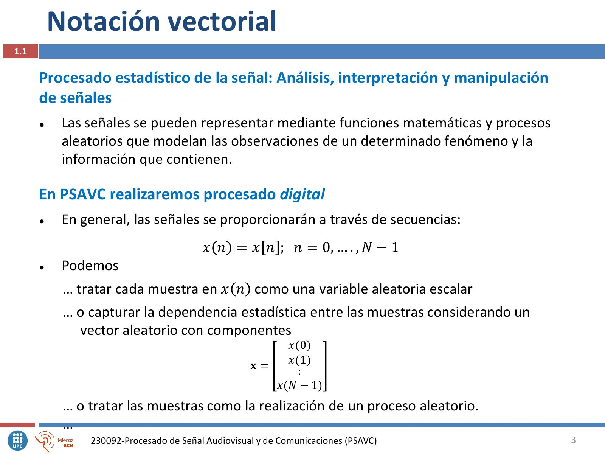

```text
          Notación vectorial
1.1

      Procesado estadístico de la señal: Análisis, interpretación y manipulación
      de señales
      ●    Las señales se pueden representar mediante funciones matemáticas y procesos
           aleatorios que modelan las observaciones de un determinado fenómeno y la
           información que contienen.

      En PSAVC realizaremos procesado digital
      ●    En general, las señales se proporcionarán a través de secuencias:
                                        𝑥𝑥 𝑛𝑛 = 𝑥𝑥 𝑛𝑛 ; 𝑛𝑛 = 0, … . , 𝑁𝑁 − 1
      ●    Podemos
           … tratar cada muestra en 𝑥𝑥 𝑛𝑛 como una variable aleatoria escalar
           … o capturar la dependencia estadística entre las muestras considerando un
             vector aleatorio con componentes
                                                           𝑥𝑥(0)
                                                   𝐱𝐱 =    𝑥𝑥(1)
                                                              :
                                                        𝑥𝑥(𝑁𝑁 − 1)
           … o tratar las muestras como la realización de un proceso aleatorio.
           …
               230092-Procesado de Señal Audiovisual y de Comunicaciones (PSAVC)         3
```

## Page 4

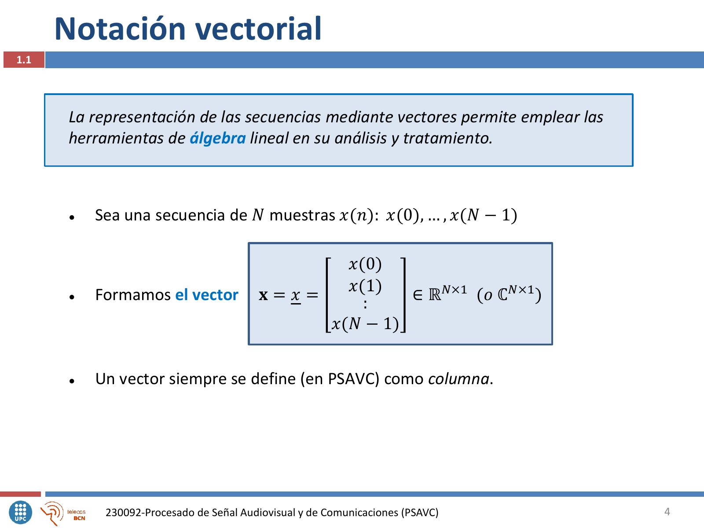

```text
      Notación vectorial
1.1


      La representación de las secuencias mediante vectores permite emplear las
      herramientas de álgebra lineal en su análisis y tratamiento.


      ●   Sea una secuencia de 𝑁𝑁 muestras 𝑥𝑥(𝑛𝑛): 𝑥𝑥(0), … , 𝑥𝑥(𝑁𝑁 − 1)

                                                     𝑥𝑥(0)
                                                     𝑥𝑥(1)
      ●   Formamos el vector            𝐱𝐱 = 𝑥𝑥 =       :    ∈ ℝ𝑁𝑁×1 (𝑜𝑜 ℂ𝑁𝑁×1 )
                                                  𝑥𝑥(𝑁𝑁 − 1)


      ●   Un vector siempre se define (en PSAVC) como columna.


           230092-Procesado de Señal Audiovisual y de Comunicaciones (PSAVC)       4
```

## Page 5

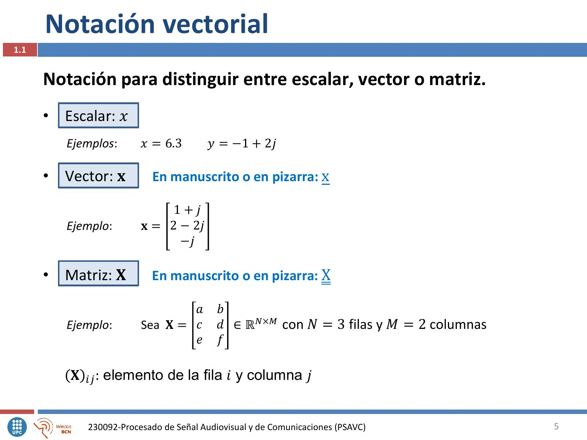

```text
      Notación vectorial
1.1


      Notación para distinguir entre escalar, vector o matriz.
      • Escalar: 𝑥𝑥
         Ejemplos:       𝑥𝑥 = 6.3       𝑦𝑦 = −1 + 2𝑗𝑗

      • Vector: 𝐱𝐱          En manuscrito o en pizarra: x

                               1 + 𝑗𝑗
         Ejemplo:        𝐱𝐱 = 2 − 2𝑗𝑗
                                −𝑗𝑗

      • Matriz: 𝐗𝐗          En manuscrito o en pizarra: �
                                                        X

                                  𝑎𝑎       𝑏𝑏
         Ejemplo:        Sea 𝐗𝐗 = 𝑐𝑐       𝑑𝑑 ∈ ℝ𝑁𝑁×𝑀𝑀 con 𝑁𝑁 = 3 filas y 𝑀𝑀 = 2 columnas
                                  𝑒𝑒       𝑓𝑓

          𝐗𝐗 𝑖𝑖𝑖𝑖 : elemento de la fila 𝑖𝑖 y columna 𝑗𝑗


             230092-Procesado de Señal Audiovisual y de Comunicaciones (PSAVC)              5
```

## Page 6

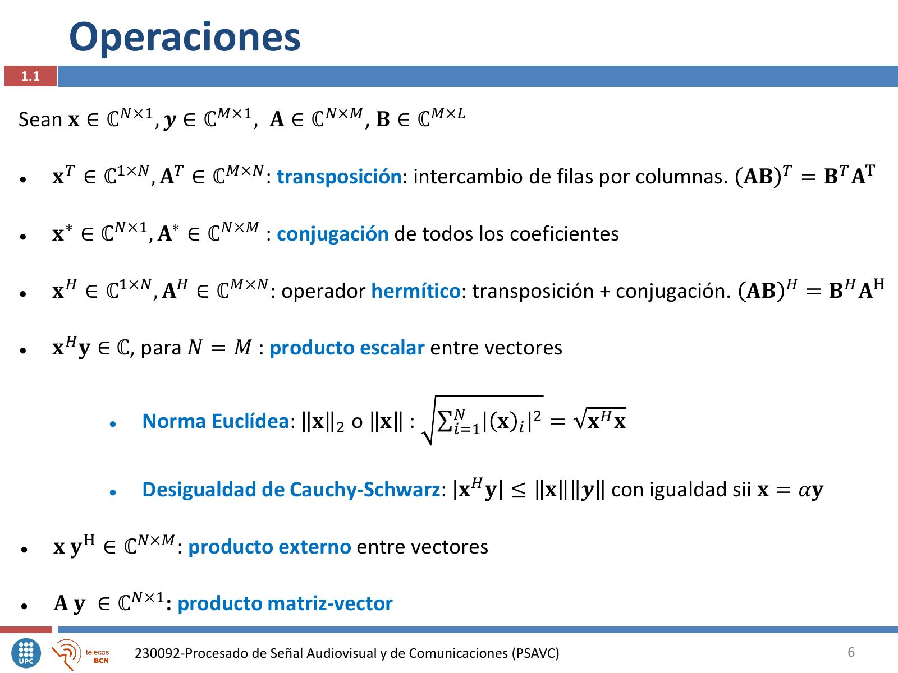

```text
       Operaciones
1.1


Sean 𝐱𝐱 ∈ ℂ𝑁𝑁×1 , 𝒚𝒚 ∈ ℂ𝑀𝑀×1 , 𝐀𝐀 ∈ ℂ𝑁𝑁×𝑀𝑀 , 𝐁𝐁 ∈ ℂ𝑀𝑀×𝐿𝐿

●     𝐱𝐱 𝑇𝑇 ∈ ℂ1×𝑁𝑁 , 𝐀𝐀𝑇𝑇 ∈ ℂ𝑀𝑀×𝑁𝑁 : transposición: intercambio de filas por columnas. 𝐀𝐀𝐀𝐀 𝑇𝑇 = 𝐁𝐁 𝑇𝑇 𝐀𝐀T

●     𝐱𝐱 ∗ ∈ ℂ𝑁𝑁×1 , 𝐀𝐀∗ ∈ ℂ𝑁𝑁×𝑀𝑀 : conjugación de todos los coeficientes

●     𝐱𝐱 𝐻𝐻 ∈ ℂ1×𝑁𝑁 , 𝐀𝐀𝐻𝐻 ∈ ℂ𝑀𝑀×𝑁𝑁 : operador hermítico: transposición + conjugación. 𝐀𝐀𝐀𝐀 𝐻𝐻 = 𝐁𝐁 𝐻𝐻 𝐀𝐀H

●     𝐱𝐱 𝐻𝐻 𝐲𝐲 ∈ ℂ, para 𝑁𝑁 = 𝑀𝑀 : producto escalar entre vectores


            ●    Norma Euclídea: 𝐱𝐱 2 o 𝐱𝐱 : ∑𝑁𝑁
                                              𝑖𝑖=1 𝐱𝐱 𝑖𝑖
                                                         2 = 𝐱𝐱 𝐻𝐻 𝐱𝐱


            ●    Desigualdad de Cauchy-Schwarz: 𝐱𝐱 𝐻𝐻 𝐲𝐲 ≤ 𝐱𝐱                       𝒚𝒚 con igualdad sii 𝐱𝐱 = 𝛼𝛼𝐲𝐲

●     𝐱𝐱 𝐲𝐲 H ∈ ℂ𝑁𝑁×𝑀𝑀 : producto externo entre vectores

●     𝐀𝐀 𝐲𝐲 ∈ ℂ𝑁𝑁×1 : producto matriz-vector

                230092-Procesado de Señal Audiovisual y de Comunicaciones (PSAVC)                                   6
```

## Page 7

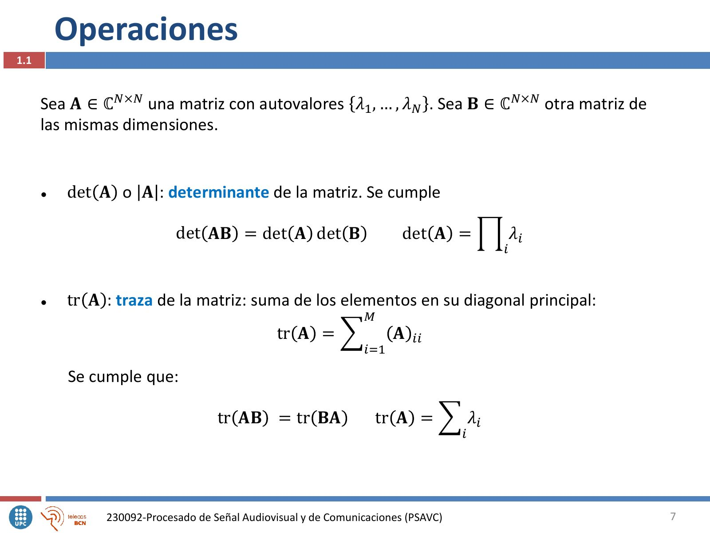

```text
          Operaciones
1.1


      Sea 𝐀𝐀 ∈ ℂ𝑁𝑁×𝑁𝑁 una matriz con autovalores 𝜆𝜆1 , … , 𝜆𝜆𝑁𝑁 . Sea 𝐁𝐁 ∈ ℂ𝑁𝑁×𝑁𝑁 otra matriz de
      las mismas dimensiones.


      ●   det 𝐀𝐀 o 𝐀𝐀 : determinante de la matriz. Se cumple

                            det 𝐀𝐀𝐀𝐀 = det 𝐀𝐀 det 𝐁𝐁                     det 𝐀𝐀 = � 𝜆𝜆𝑖𝑖
                                                                                        𝑖𝑖


      ●   tr 𝐀𝐀 : traza de la matriz: suma de los elementos en su diagonal principal:
                                                                𝑀𝑀
                                               tr 𝐀𝐀 = �               𝐀𝐀 𝑖𝑖𝑖𝑖
                                                                𝑖𝑖=1

          Se cumple que:

                                    tr 𝐀𝐀𝐁𝐁 = tr 𝐁𝐁𝐀𝐀                tr 𝐀𝐀 = � 𝜆𝜆𝑖𝑖
                                                                                   𝑖𝑖


               230092-Procesado de Señal Audiovisual y de Comunicaciones (PSAVC)                   7
```

## Page 8

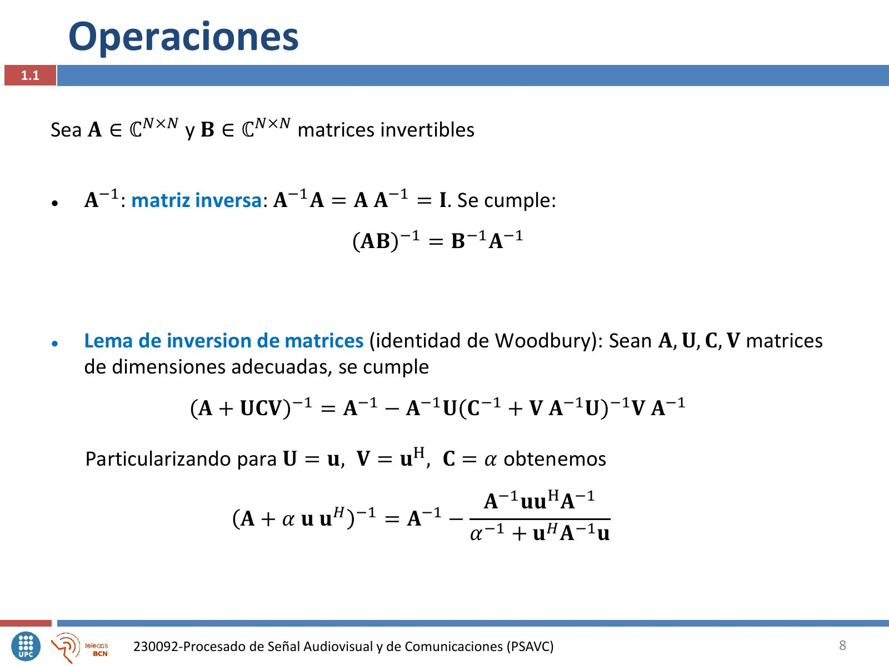

```text
          Operaciones
1.1


      Sea 𝐀𝐀 ∈ ℂ𝑁𝑁×𝑁𝑁 y 𝐁𝐁 ∈ ℂ𝑁𝑁×𝑁𝑁 matrices invertibles


      ●   𝐀𝐀−1 : matriz inversa: 𝐀𝐀−1 𝐀𝐀 = 𝐀𝐀 𝐀𝐀−1 = 𝐈𝐈. Se cumple:
                                                  𝐀𝐀𝐀𝐀 −1 = 𝐁𝐁 −1 𝐀𝐀−1


      ●   Lema de inversion de matrices (identidad de Woodbury): Sean 𝐀𝐀, 𝐔𝐔, 𝐂𝐂, 𝐕𝐕 matrices
          de dimensiones adecuadas, se cumple
                         𝐀𝐀 + 𝐔𝐔𝐔𝐔𝐔𝐔 −1 = 𝐀𝐀−1 − 𝐀𝐀−1 𝐔𝐔 𝐂𝐂 −1 + 𝐕𝐕 𝐀𝐀−1 𝐔𝐔 −1 𝐕𝐕 𝐀𝐀−1

          Particularizando para 𝐔𝐔 = 𝐮𝐮, 𝐕𝐕 = 𝐮𝐮H , 𝐂𝐂 = 𝛼𝛼 obtenemos
                                                                     𝐀𝐀−1 𝐮𝐮𝐮𝐮H 𝐀𝐀−1
                               𝐀𝐀 + 𝛼𝛼 𝐮𝐮 𝐮𝐮𝐻𝐻 −1 = 𝐀𝐀−1 −
                                                                  𝛼𝛼 −1 + 𝐮𝐮𝐻𝐻 𝐀𝐀−1 𝐮𝐮


               230092-Procesado de Señal Audiovisual y de Comunicaciones (PSAVC)                8
```

## Page 9

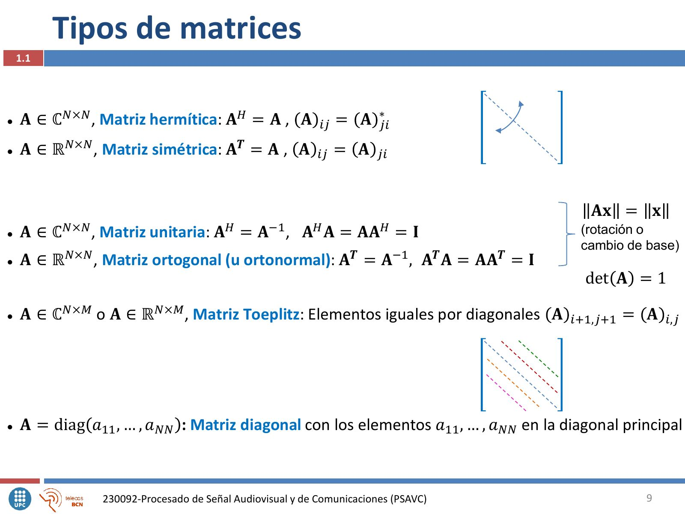

```text
          Tipos de matrices
    1.1


●   𝐀𝐀 ∈ ℂ𝑁𝑁×𝑁𝑁 , Matriz hermítica: 𝐀𝐀𝐻𝐻 = 𝐀𝐀 , 𝐀𝐀 𝑖𝑖𝑖𝑖 = 𝐀𝐀 ∗𝑗𝑗𝑗𝑗
●   𝐀𝐀 ∈ ℝ𝑁𝑁×𝑁𝑁 , Matriz simétrica: 𝐀𝐀𝑻𝑻 = 𝐀𝐀 , 𝐀𝐀 𝑖𝑖𝑖𝑖 = 𝐀𝐀 𝑗𝑗𝑗𝑗


                                                                                               𝐀𝐀𝐱𝐱 = 𝐱𝐱
●   𝐀𝐀 ∈ ℂ𝑁𝑁×𝑁𝑁 , Matriz unitaria: 𝐀𝐀𝐻𝐻 = 𝐀𝐀−1 , 𝐀𝐀𝐻𝐻 𝐀𝐀 = 𝐀𝐀𝐀𝐀𝐻𝐻 = 𝐈𝐈                       (rotación o
                                                                                             cambio de base)
●   𝐀𝐀 ∈ ℝ𝑁𝑁×𝑁𝑁 , Matriz ortogonal (u ortonormal): 𝐀𝐀𝑻𝑻 = 𝐀𝐀−1 , 𝐀𝐀𝑻𝑻 𝐀𝐀 = 𝐀𝐀𝐀𝐀𝑻𝑻 = 𝐈𝐈
                                                                                              det 𝐀𝐀 = 1

●   𝐀𝐀 ∈ ℂ𝑁𝑁×𝑀𝑀 o 𝐀𝐀 ∈ ℝ𝑁𝑁×𝑀𝑀 , Matriz Toeplitz: Elementos iguales por diagonales 𝐀𝐀 𝑖𝑖+1,𝑗𝑗+1 = 𝐀𝐀 𝑖𝑖,𝑗𝑗


●   𝐀𝐀 = diag 𝑎𝑎11 , … , 𝑎𝑎𝑁𝑁𝑁𝑁 : Matriz diagonal con los elementos 𝑎𝑎11 , … , 𝑎𝑎𝑁𝑁𝑁𝑁 en la diagonal principal


                 230092-Procesado de Señal Audiovisual y de Comunicaciones (PSAVC)                      9
```

## Page 10

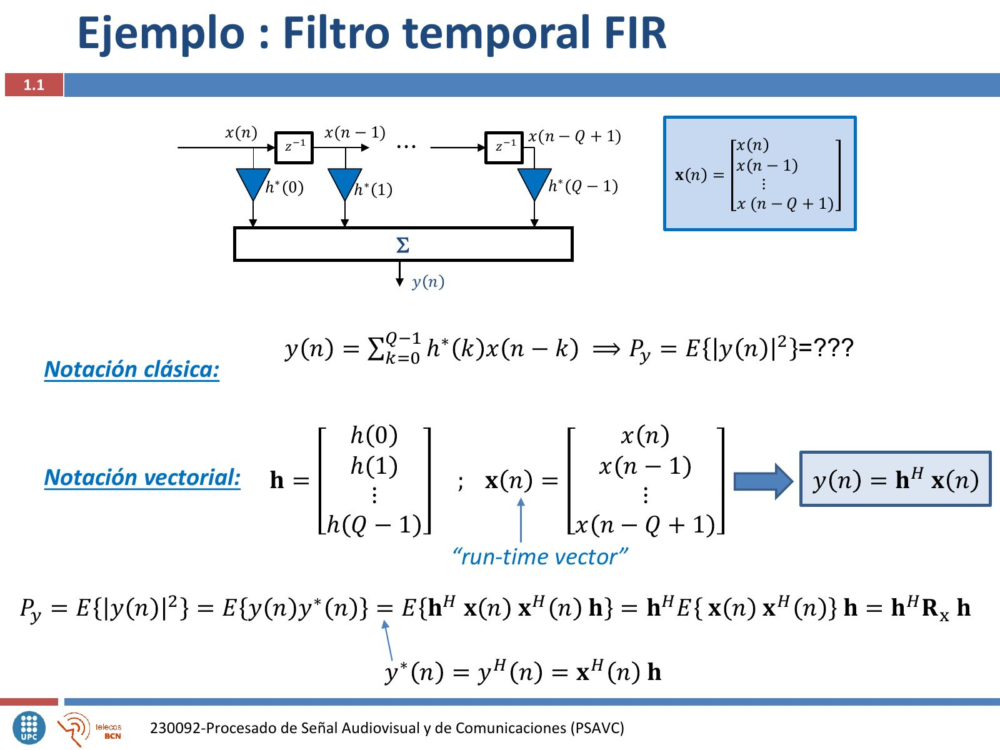

```text
      Ejemplo : Filtro temporal FIR
1.1

                            𝑥𝑥(𝑛𝑛)             𝑥𝑥(𝑛𝑛 − 1)                           𝑥𝑥(𝑛𝑛 − 𝑄𝑄 + 1)
                                       𝑧𝑧 −1                ⋯               𝑧𝑧 −1                             𝑥𝑥 𝑛𝑛
                                                                                                              𝑥𝑥 𝑛𝑛 − 1
                                                                                                      𝐱𝐱 𝑛𝑛 =
                                     ℎ∗ 0          ℎ∗ 1                                ℎ∗ 𝑄𝑄 − 1                   ⋮
                                                                                                              𝑥𝑥 (𝑛𝑛 − 𝑄𝑄 + 1)

                                                            Σ
                                                                𝑦𝑦 𝑛𝑛


                                                        𝑄𝑄−1
                                       𝑦𝑦 𝑛𝑛 = ∑𝑘𝑘=0 ℎ∗ 𝑘𝑘 𝑥𝑥 𝑛𝑛 − 𝑘𝑘 ⟹ 𝑃𝑃𝑦𝑦 = 𝐸𝐸 𝑦𝑦 𝑛𝑛                              2 =???
  Notación clásica:

                                            ℎ 0                                           𝑥𝑥 𝑛𝑛
  Notación vectorial:                       ℎ 1                                        𝑥𝑥 𝑛𝑛 − 1
                                     𝐡𝐡 =                                ; 𝐱𝐱 𝑛𝑛 =                                        𝑦𝑦 𝑛𝑛 = 𝐡𝐡𝐻𝐻 𝐱𝐱 𝑛𝑛
                                              ⋮                                              ⋮
                                          ℎ 𝑄𝑄 − 1                                  𝑥𝑥 𝑛𝑛 − 𝑄𝑄 + 1
                                                                        “run-time vector”
                    2
𝑃𝑃𝑦𝑦 = 𝐸𝐸 𝑦𝑦 𝑛𝑛         = 𝐸𝐸 𝑦𝑦 𝑛𝑛 𝑦𝑦 ∗ 𝑛𝑛             = 𝐸𝐸 𝐡𝐡𝐻𝐻 𝐱𝐱 𝑛𝑛 𝐱𝐱 𝐻𝐻 𝑛𝑛 𝐡𝐡 = 𝐡𝐡𝐻𝐻 𝐸𝐸 𝐱𝐱 𝑛𝑛 𝐱𝐱 𝐻𝐻 𝑛𝑛                      𝐡𝐡 = 𝐡𝐡𝐻𝐻 𝐑𝐑 x 𝐡𝐡

                                                        𝑦𝑦 ∗ 𝑛𝑛 = 𝑦𝑦 𝐻𝐻 𝑛𝑛 = 𝐱𝐱 𝐻𝐻 𝑛𝑛 𝐡𝐡

                  230092-Procesado de Señal Audiovisual y de Comunicaciones (PSAVC)
```

## Page 11

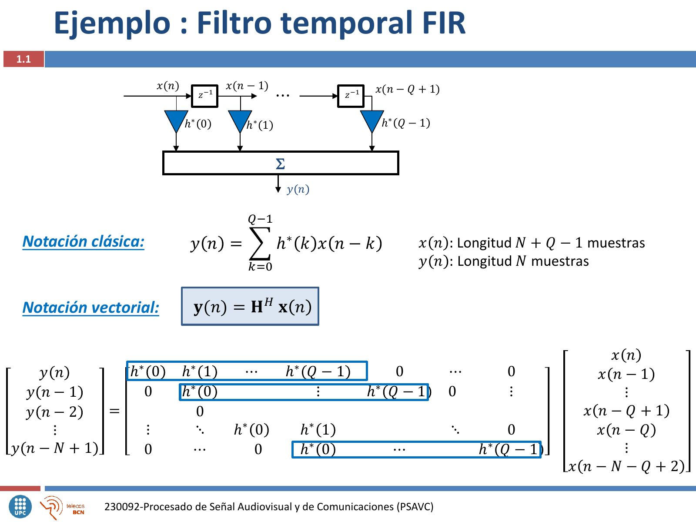

```text
       Ejemplo : Filtro temporal FIR
1.1

                            𝑥𝑥(𝑛𝑛)                𝑥𝑥(𝑛𝑛 − 1)                             𝑥𝑥(𝑛𝑛 − 𝑄𝑄 + 1)
                                          𝑧𝑧 −1                ⋯                𝑧𝑧 −1


                                     ℎ∗ 0             ℎ∗ 1                                ℎ∗ 𝑄𝑄 − 1


                                                               Σ
                                                                   𝑦𝑦 𝑛𝑛

                                                       𝑄𝑄−1
 Notación clásica:                    𝑦𝑦 𝑛𝑛 = � ℎ∗ 𝑘𝑘 𝑥𝑥 𝑛𝑛 − 𝑘𝑘                                  𝑥𝑥 𝑛𝑛 : Longitud 𝑁𝑁 + 𝑄𝑄 − 1 muestras
                                                       𝑘𝑘=0                                       𝑦𝑦 𝑛𝑛 : Longitud 𝑁𝑁 muestras


 Notación vectorial:                  𝐲𝐲(𝑛𝑛) = 𝐇𝐇 𝐻𝐻 𝐱𝐱 𝑛𝑛

                                                                                                                                    𝑥𝑥 𝑛𝑛
                       ∗              ∗                              ∗
      𝑦𝑦 𝑛𝑛           ℎ 0            ℎ 1              ⋯            ℎ 𝑄𝑄 − 1                 0              ⋯       0             𝑥𝑥 𝑛𝑛 − 1
   𝑦𝑦 𝑛𝑛 − 1           0             ℎ∗ 0                              ⋮                ℎ∗ 𝑄𝑄 − 1          0       ⋮                   ⋮
   𝑦𝑦 𝑛𝑛 − 2     =                     0                                                                                      𝑥𝑥 𝑛𝑛 − 𝑄𝑄 + 1
         ⋮              ⋮              ⋱           ℎ∗ 0                  ℎ∗ 1                              ⋱       0             𝑥𝑥 𝑛𝑛 − 𝑄𝑄
𝑦𝑦 𝑛𝑛 − 𝑁𝑁 + 1          0             ⋯               0                  ℎ∗ 0                ⋯                 ℎ∗ 𝑄𝑄 − 1               ⋮
                                                                                                                           𝑥𝑥 𝑛𝑛 − 𝑁𝑁 − 𝑄𝑄 + 2

                 230092-Procesado de Señal Audiovisual y de Comunicaciones (PSAVC)
```

## Page 12

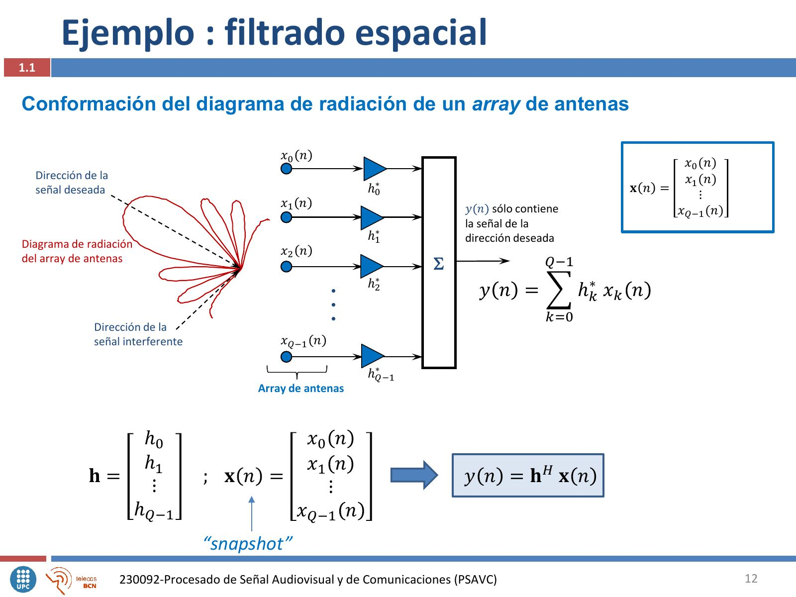

```text
       Ejemplo : filtrado espacial
1.1

Conformación del diagrama de radiación de un array de antenas

                                               𝑥𝑥0 𝑛𝑛
                                                                                                                𝑥𝑥0 (𝑛𝑛)
  Dirección de la                                                                                               𝑥𝑥1 (𝑛𝑛)
  señal deseada                                                ℎ0∗                                    𝐱𝐱 𝑛𝑛 =
                                                                                                                    ⋮
                                               𝑥𝑥1 𝑛𝑛                          𝑦𝑦 𝑛𝑛 sólo contiene            𝑥𝑥𝑄𝑄−1 (𝑛𝑛)
                                                                               la señal de la
                                                               ℎ1∗             dirección deseada
Diagrama de radiación
                                               𝑥𝑥2 𝑛𝑛
del array de antenas
                                                                          Σ                    𝑄𝑄−1
                                                               ℎ2∗
                                                           •                     𝑦𝑦 𝑛𝑛 = � ℎ𝑘𝑘∗ 𝑥𝑥𝑘𝑘 𝑛𝑛
                                                           •
                                                           •                                   𝑘𝑘=0
              Dirección de la
              señal interferente               𝑥𝑥𝑄𝑄−1 𝑛𝑛

                                                                ∗
                                                               ℎ𝑄𝑄−1
                                           Array de antenas


                  ℎ0                           𝑥𝑥0 𝑛𝑛
                  ℎ1                           𝑥𝑥1 𝑛𝑛
            𝐡𝐡 =                   ; 𝐱𝐱 𝑛𝑛 =                                   𝑦𝑦 𝑛𝑛 = 𝐡𝐡𝐻𝐻 𝐱𝐱 𝑛𝑛
                   ⋮                              ⋮
                 ℎ𝑄𝑄−1                       𝑥𝑥𝑄𝑄−1 𝑛𝑛
                                   “snapshot”
                    230092-Procesado de Señal Audiovisual y de Comunicaciones (PSAVC)                                       12
```

## Page 13

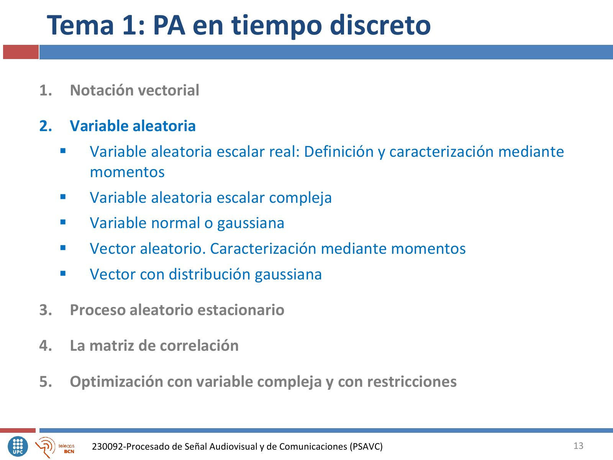

```text
 Tema 1: PA en tiempo discreto
1.    Notación vectorial

2.    Variable aleatoria
      Variable aleatoria escalar real: Definición y caracterización mediante
        momentos
      Variable aleatoria escalar compleja
      Variable normal o gaussiana
      Vector aleatorio. Caracterización mediante momentos
      Vector con distribución gaussiana

3.    Proceso aleatorio estacionario

4.    La matriz de correlación

5.    Optimización con variable compleja y con restricciones


         230092-Procesado de Señal Audiovisual y de Comunicaciones (PSAVC)      13
```

## Page 14

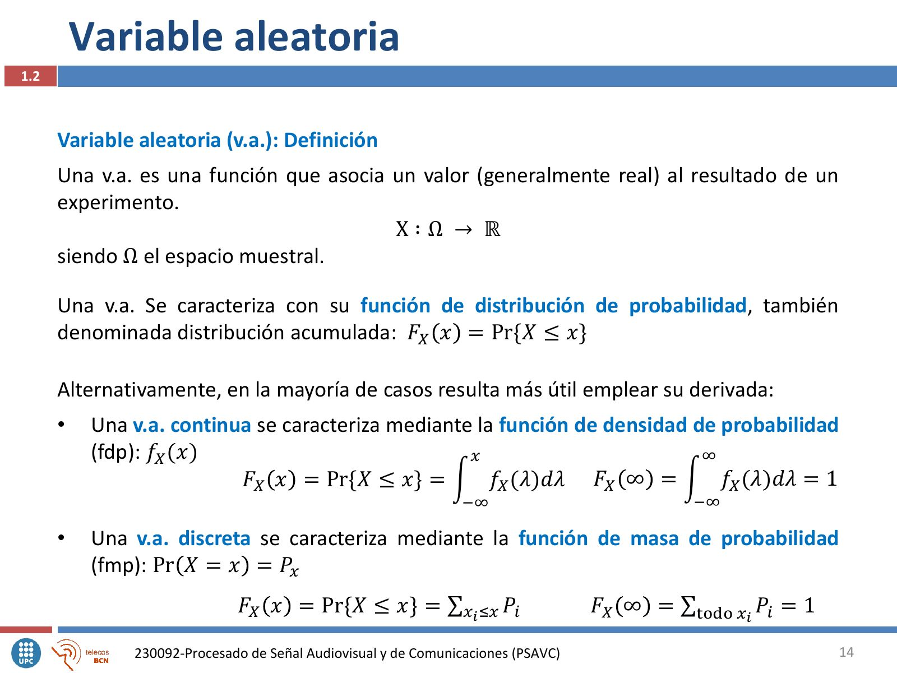

```text
          Variable aleatoria
1.2


      Variable aleatoria (v.a.): Definición
      Una v.a. es una función que asocia un valor (generalmente real) al resultado de un
      experimento.
                                         X∶Ω → ℝ
      siendo Ω el espacio muestral.

      Una v.a. Se caracteriza con su función de distribución de probabilidad, también
      denominada distribución acumulada: 𝐹𝐹𝑋𝑋 𝑥𝑥 = Pr{𝑋𝑋 ≤ 𝑥𝑥}

      Alternativamente, en la mayoría de casos resulta más útil emplear su derivada:
      •    Una v.a. continua se caracteriza mediante la función de densidad de probabilidad
           (fdp): 𝑓𝑓𝑋𝑋 (𝑥𝑥)                          𝑥𝑥                       ∞
                            𝐹𝐹𝑋𝑋 𝑥𝑥 = Pr{𝑋𝑋 ≤ 𝑥𝑥} = � 𝑓𝑓𝑋𝑋 (𝜆𝜆)𝑑𝑑𝑑𝑑 𝐹𝐹𝑋𝑋 ∞ = � 𝑓𝑓𝑋𝑋 (𝜆𝜆)𝑑𝑑𝑑𝑑 = 1
                                                                 −∞                            −∞

      •    Una v.a. discreta se caracteriza mediante la función de masa de probabilidad
           (fmp): Pr 𝑋𝑋 = 𝑥𝑥 = 𝑃𝑃𝑥𝑥
                              𝐹𝐹𝑋𝑋 𝑥𝑥 = Pr{𝑋𝑋 ≤ 𝑥𝑥} = ∑𝑥𝑥𝑖𝑖 ≤𝑥𝑥 𝑃𝑃𝑖𝑖               𝐹𝐹𝑋𝑋 ∞ = ∑todo 𝑥𝑥𝑖𝑖 𝑃𝑃𝑖𝑖 = 1

               230092-Procesado de Señal Audiovisual y de Comunicaciones (PSAVC)                                  14
```

## Page 15

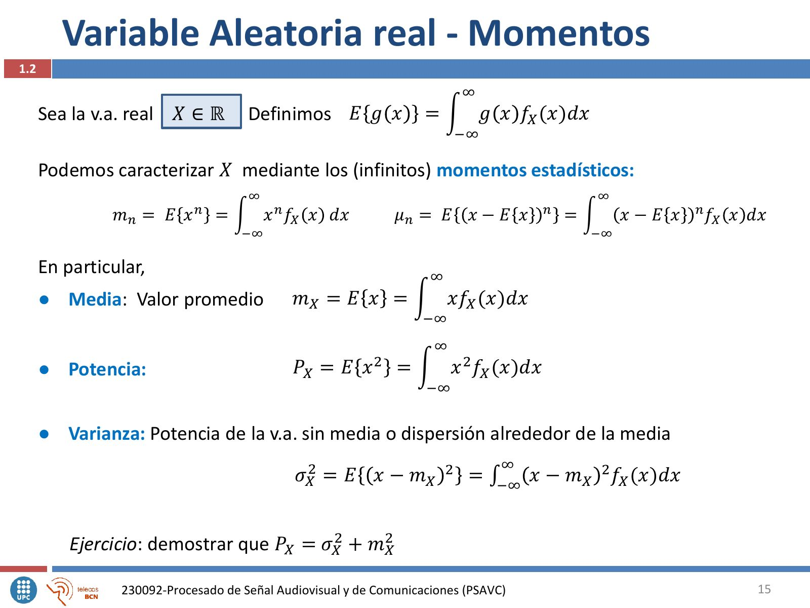

```text
         Variable Aleatoria real - Momentos
1.2
                                                                          ∞
      Sea la v.a. real 𝑋𝑋 ∈ ℝ          Definimos 𝐸𝐸 𝑔𝑔 𝑥𝑥           = � 𝑔𝑔 𝑥𝑥 𝑓𝑓𝑋𝑋 (𝑥𝑥)𝑑𝑑𝑑𝑑
                                                                         −∞

      Podemos caracterizar 𝑋𝑋 mediante los (infinitos) momentos estadísticos:
                                       ∞                                                      ∞
                              𝑛𝑛           𝑛𝑛                                           𝑛𝑛                      𝑛𝑛
               𝑚𝑚𝑛𝑛 = 𝐸𝐸 𝑥𝑥        = � 𝑥𝑥 𝑓𝑓𝑋𝑋 𝑥𝑥 𝑑𝑑𝑑𝑑         𝜇𝜇𝑛𝑛 = 𝐸𝐸 𝑥𝑥 − 𝐸𝐸 𝑥𝑥          =�    𝑥𝑥 − 𝐸𝐸 𝑥𝑥        𝑓𝑓𝑋𝑋 𝑥𝑥 𝑑𝑑𝑑𝑑
                                      −∞                                                      −∞

      En particular,                                                 ∞
      ● Media: Valor promedio                   𝑚𝑚𝑋𝑋 = 𝐸𝐸 𝑥𝑥 = � 𝑥𝑥𝑓𝑓𝑋𝑋 (𝑥𝑥)𝑑𝑑𝑑𝑑
                                                                   −∞
                                                                     ∞
      ● Potencia:                               𝑃𝑃𝑋𝑋 = 𝐸𝐸 𝑥𝑥 2 = � 𝑥𝑥 2 𝑓𝑓𝑋𝑋 (𝑥𝑥)𝑑𝑑𝑑𝑑
                                                                    −∞


      ● Varianza: Potencia de la v.a. sin media o dispersión alrededor de la media
                                                                                 ∞
                                                𝜎𝜎𝑋𝑋2 = 𝐸𝐸 𝑥𝑥 − 𝑚𝑚𝑋𝑋 2 = ∫−∞ 𝑥𝑥 − 𝑚𝑚𝑋𝑋 2 𝑓𝑓𝑋𝑋 (𝑥𝑥)𝑑𝑑𝑑𝑑


          Ejercicio: demostrar que 𝑃𝑃𝑋𝑋 = 𝜎𝜎𝑋𝑋2 + 𝑚𝑚𝑋𝑋2

                 230092-Procesado de Señal Audiovisual y de Comunicaciones (PSAVC)                                             15
```

## Page 16

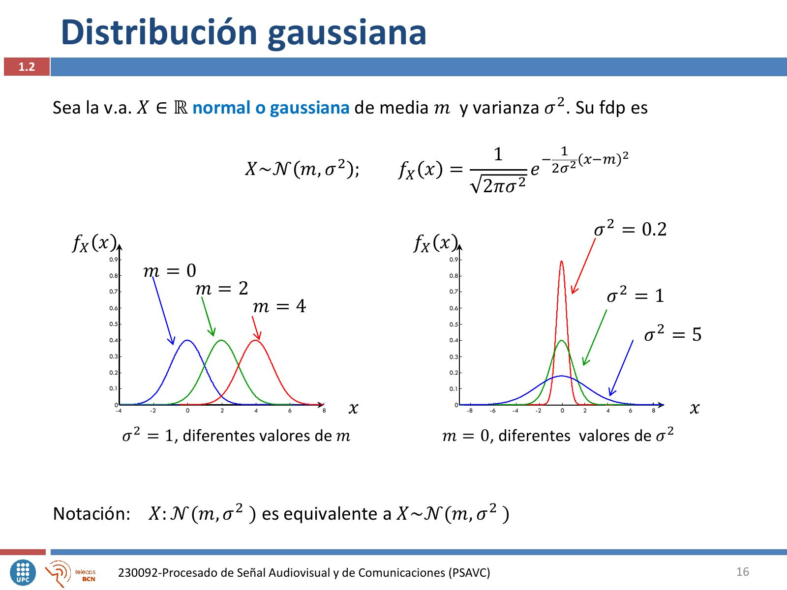

```text
      Distribución gaussiana
1.2


      Sea la v.a. 𝑋𝑋 ∈ ℝ normal o gaussiana de media 𝑚𝑚 y varianza 𝜎𝜎 2 . Su fdp es

                                                           2
                                                                                            1            1
                                                                                                       − 2 𝑥𝑥−𝑚𝑚 2
                                          𝑋𝑋~𝒩𝒩 𝑚𝑚, 𝜎𝜎 ;            𝑓𝑓𝑋𝑋 𝑥𝑥 =                        𝑒𝑒 2𝜎𝜎
                                                                                          2𝜋𝜋𝜎𝜎 2

                                                                                                                  𝜎𝜎 2 = 0.2
        𝑓𝑓𝑋𝑋 𝑥𝑥                                                        𝑓𝑓𝑋𝑋 𝑥𝑥
                  0.9                                                        0.9

                  0.8      𝑚𝑚 = 0                                            0.8

                  0.7            𝑚𝑚 = 2                                      0.7
                                                                                                                   𝜎𝜎 2 = 1
                  0.6                      𝑚𝑚 = 4                            0.6


                                                                                                                           𝜎𝜎 2 = 5
                  0.5                                                        0.5

                  0.4                                                        0.4

                  0.3                                                        0.3

                  0.2                                                        0.2

                  0.1                                                        0.1

                   0
                   -4       -2   0    2    4     6     8       𝑥𝑥                0
                                                                                     -8    -6   -4   -2   0   2    4   6    8    𝑥𝑥
                        𝜎𝜎 2 = 1, diferentes valores de 𝑚𝑚                  𝑚𝑚 = 0, diferentes valores de 𝜎𝜎 2


      Notación: 𝑋𝑋: 𝒩𝒩(𝑚𝑚, 𝜎𝜎 2 ) es equivalente a 𝑋𝑋~𝒩𝒩(𝑚𝑚, 𝜎𝜎 2 )

                    230092-Procesado de Señal Audiovisual y de Comunicaciones (PSAVC)                                                 16
```

## Page 17

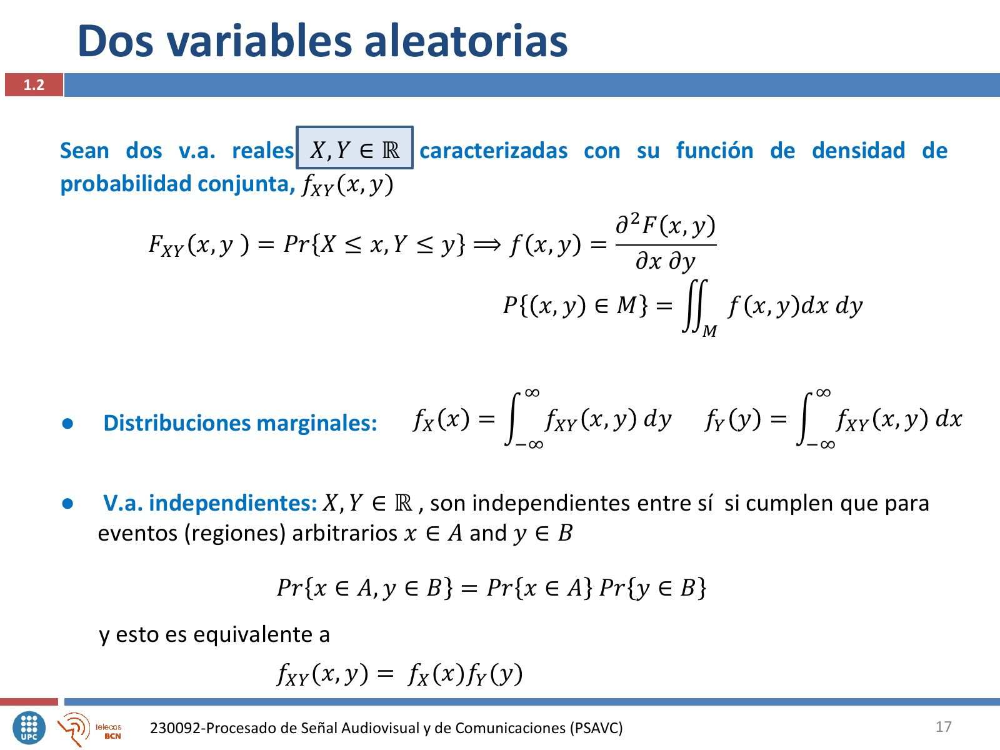

```text
          Dos variables aleatorias
1.2


      Sean dos v.a. reales 𝑋𝑋, 𝑌𝑌 ∈ ℝ caracterizadas con su función de densidad de
      probabilidad conjunta, 𝑓𝑓𝑋𝑋𝑋𝑋 (𝑥𝑥, 𝑦𝑦)
                                                                   𝜕𝜕 2 𝐹𝐹 𝑥𝑥, 𝑦𝑦
               𝐹𝐹𝑋𝑋𝑋𝑋 𝑥𝑥, 𝑦𝑦 = 𝑃𝑃𝑃𝑃 𝑋𝑋 ≤ 𝑥𝑥, 𝑌𝑌 ≤ 𝑦𝑦 ⟹ 𝑓𝑓 𝑥𝑥, 𝑦𝑦 =
                                                                      𝜕𝜕𝜕𝜕 𝜕𝜕𝜕𝜕
                                                                 𝑃𝑃 𝑥𝑥, 𝑦𝑦 ∈ 𝑀𝑀 = � 𝑓𝑓 𝑥𝑥, 𝑦𝑦 𝑑𝑑𝑑𝑑 𝑑𝑑𝑑𝑑
                                                                                     𝑀𝑀


                                                                    ∞                             ∞
      ●    Distribuciones marginales:               𝑓𝑓𝑋𝑋 𝑥𝑥 = � 𝑓𝑓𝑋𝑋𝑋𝑋 𝑥𝑥, 𝑦𝑦 𝑑𝑑𝑑𝑑    𝑓𝑓𝑌𝑌 𝑦𝑦 = � 𝑓𝑓𝑋𝑋𝑋𝑋 𝑥𝑥, 𝑦𝑦 𝑑𝑑𝑑𝑑
                                                                   −∞                            −∞


      ●    V.a. independientes: 𝑋𝑋, 𝑌𝑌 ∈ ℝ , son independientes entre sí si cumplen que para
           eventos (regiones) arbitrarios 𝑥𝑥 ∈ 𝐴𝐴 and 𝑦𝑦 ∈ 𝐵𝐵

                                 𝑃𝑃𝑃𝑃 𝑥𝑥 ∈ 𝐴𝐴, 𝑦𝑦 ∈ 𝐵𝐵 = 𝑃𝑃𝑃𝑃 𝑥𝑥 ∈ 𝐴𝐴 𝑃𝑃𝑃𝑃 𝑦𝑦 ∈ 𝐵𝐵
           y esto es equivalente a
                                 𝑓𝑓𝑋𝑋𝑋𝑋 (𝑥𝑥, 𝑦𝑦) = 𝑓𝑓𝑋𝑋 (𝑥𝑥)𝑓𝑓𝑌𝑌 (𝑦𝑦)

                230092-Procesado de Señal Audiovisual y de Comunicaciones (PSAVC)                               17
```

## Page 18

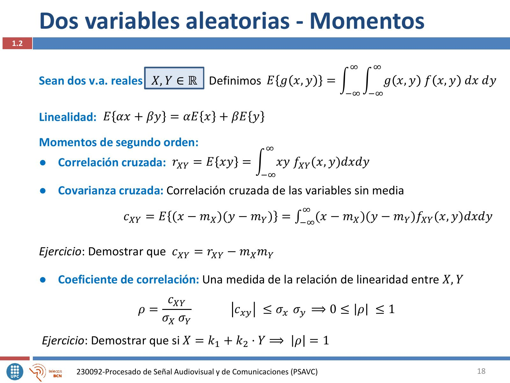

```text
      Dos variables aleatorias - Momentos
1.2

                                                                                      ∞    ∞
      Sean dos v.a. reales 𝑋𝑋, 𝑌𝑌 ∈ ℝ Definimos 𝐸𝐸 𝑔𝑔 𝑥𝑥, 𝑦𝑦                      = � � 𝑔𝑔 𝑥𝑥, 𝑦𝑦 𝑓𝑓 𝑥𝑥, 𝑦𝑦 𝑑𝑑𝑑𝑑 𝑑𝑑𝑑𝑑
                                                                                     −∞ −∞

      Linealidad: 𝐸𝐸 𝛼𝛼𝛼𝛼 + 𝛽𝛽𝛽𝛽 = 𝛼𝛼𝐸𝐸 𝑥𝑥 + 𝛽𝛽𝐸𝐸 𝑦𝑦
      Momentos de segundo orden:                                ∞
      ● Correlación cruzada: 𝑟𝑟𝑋𝑋𝑋𝑋 = 𝐸𝐸 𝑥𝑥𝑥𝑥 = � 𝑥𝑥𝑥𝑥 𝑓𝑓𝑋𝑋𝑋𝑋 (𝑥𝑥, 𝑦𝑦)𝑑𝑑𝑑𝑑𝑑𝑑𝑑𝑑
                                                               −∞
      ● Covarianza cruzada: Correlación cruzada de las variables sin media
                                                                          ∞
                          𝑐𝑐𝑋𝑋𝑋𝑋 = 𝐸𝐸 (𝑥𝑥 − 𝑚𝑚𝑋𝑋 )(𝑦𝑦 − 𝑚𝑚𝑌𝑌 ) = ∫−∞(𝑥𝑥 − 𝑚𝑚𝑋𝑋 )(𝑦𝑦 − 𝑚𝑚𝑌𝑌 )𝑓𝑓𝑋𝑋𝑋𝑋 (𝑥𝑥, 𝑦𝑦)𝑑𝑑𝑑𝑑𝑑𝑑𝑑𝑑

      Ejercicio: Demostrar que 𝑐𝑐𝑋𝑋𝑋𝑋 = 𝑟𝑟𝑋𝑋𝑋𝑋 − 𝑚𝑚𝑋𝑋 𝑚𝑚𝑌𝑌

      ● Coeficiente de correlación: Una medida de la relación de linearidad entre 𝑋𝑋, 𝑌𝑌
                                     𝑐𝑐𝑋𝑋𝑋𝑋
                              𝜌𝜌 =                      𝑐𝑐𝑥𝑥𝑥𝑥 ≤ 𝜎𝜎𝑥𝑥 𝜎𝜎𝑦𝑦 ⟹ 0 ≤ 𝜌𝜌 ≤ 1
                                   𝜎𝜎𝑋𝑋 𝜎𝜎𝑌𝑌
      Ejercicio: Demostrar que si 𝑋𝑋 = 𝑘𝑘1 + 𝑘𝑘2 · 𝑌𝑌 ⟹ 𝜌𝜌 = 1

              230092-Procesado de Señal Audiovisual y de Comunicaciones (PSAVC)                                 18
```

## Page 19

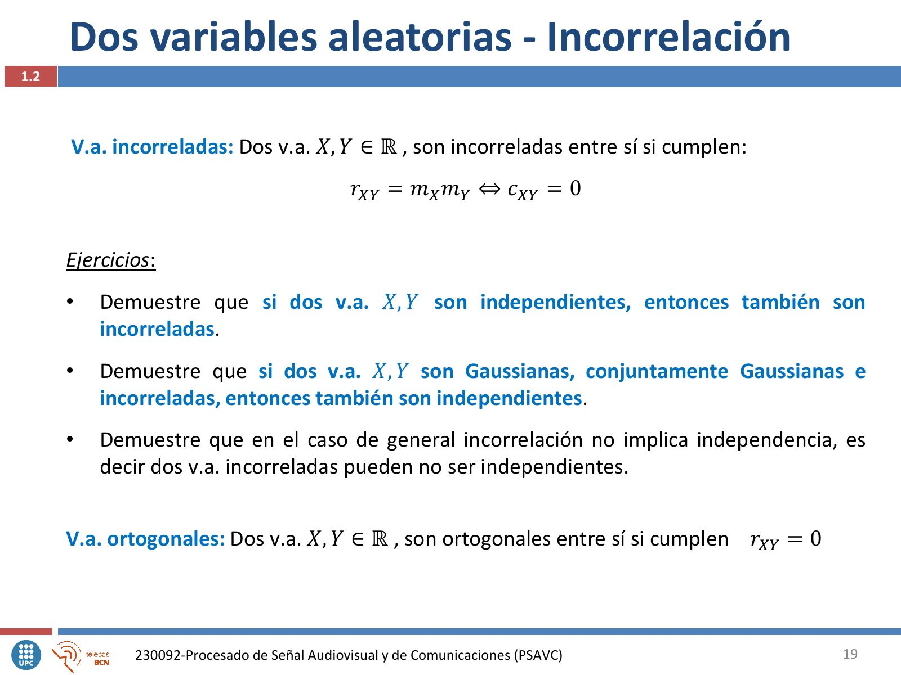

```text
      Dos variables aleatorias - Incorrelación
1.2


      V.a. incorreladas: Dos v.a. 𝑋𝑋, 𝑌𝑌 ∈ ℝ , son incorreladas entre sí si cumplen:
                                              𝑟𝑟𝑋𝑋𝑋𝑋 = 𝑚𝑚𝑋𝑋 𝑚𝑚𝑌𝑌 ⇔ 𝑐𝑐𝑋𝑋𝑋𝑋 = 0


      Ejercicios:
      •   Demuestre que si dos v.a. 𝑋𝑋, 𝑌𝑌 son independientes, entonces también son
          incorreladas.
      •   Demuestre que si dos v.a. 𝑋𝑋, 𝑌𝑌 son Gaussianas, conjuntamente Gaussianas e
          incorreladas, entonces también son independientes.
      •   Demuestre que en el caso de general incorrelación no implica independencia, es
          decir dos v.a. incorreladas pueden no ser independientes.


      V.a. ortogonales: Dos v.a. 𝑋𝑋, 𝑌𝑌 ∈ ℝ , son ortogonales entre sí si cumplen 𝑟𝑟𝑋𝑋𝑋𝑋 = 0


              230092-Procesado de Señal Audiovisual y de Comunicaciones (PSAVC)                19
```

## Page 20

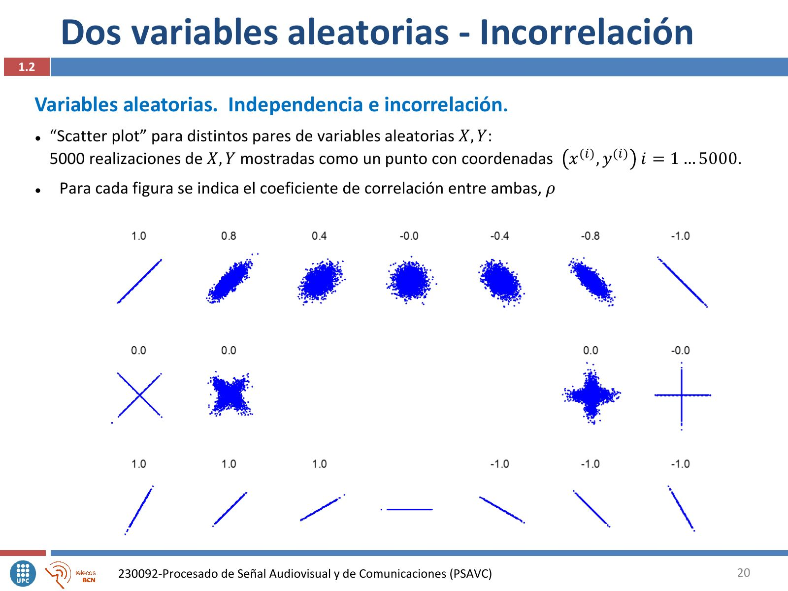

```text
       Dos variables aleatorias - Incorrelación
1.2


  Variables aleatorias. Independencia e incorrelación.
  ●   “Scatter plot” para distintos pares de variables aleatorias 𝑋𝑋, 𝑌𝑌:
      5000 realizaciones de 𝑋𝑋, 𝑌𝑌 mostradas como un punto con coordenadas 𝑥𝑥 (𝑖𝑖) , 𝑦𝑦 (𝑖𝑖) 𝑖𝑖 = 1 … 5000.
  ●    Para cada figura se indica el coeficiente de correlación entre ambas, 𝜌𝜌


               230092-Procesado de Señal Audiovisual y de Comunicaciones (PSAVC)                          20
```

## Page 21

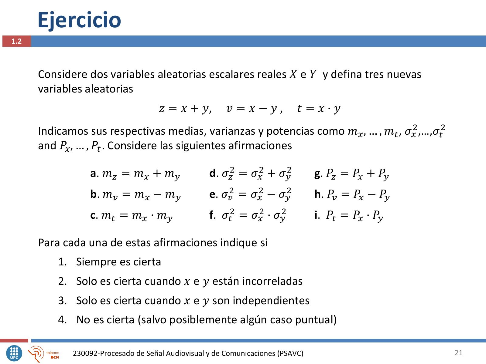

```text
      Ejercicio
1.2


      Considere dos variables aleatorias escalares reales 𝑋𝑋 e 𝑌𝑌 y defina tres nuevas
      variables aleatorias
                                     𝑧𝑧 = 𝑥𝑥 + 𝑦𝑦,      𝑣𝑣 = 𝑥𝑥 − 𝑦𝑦 ,        𝑡𝑡 = 𝑥𝑥 · 𝑦𝑦
      Indicamos sus respectivas medias, varianzas y potencias como 𝑚𝑚𝑥𝑥 , … , 𝑚𝑚𝑡𝑡 , 𝜎𝜎𝑥𝑥2 ,…,𝜎𝜎𝑡𝑡2
      and 𝑃𝑃𝑥𝑥 , … , 𝑃𝑃𝑡𝑡 . Considere las siguientes afirmaciones

                 a. 𝑚𝑚𝑧𝑧 = 𝑚𝑚𝑥𝑥 + 𝑚𝑚𝑦𝑦             d. 𝜎𝜎𝑧𝑧2 = 𝜎𝜎𝑥𝑥2 + 𝜎𝜎𝑦𝑦2       g. 𝑃𝑃𝑧𝑧 = 𝑃𝑃𝑥𝑥 + 𝑃𝑃𝑦𝑦
                 b. 𝑚𝑚𝑣𝑣 = 𝑚𝑚𝑥𝑥 − 𝑚𝑚𝑦𝑦             e. 𝜎𝜎𝑣𝑣2 = 𝜎𝜎𝑥𝑥2 − 𝜎𝜎𝑦𝑦2       h. 𝑃𝑃𝑣𝑣 = 𝑃𝑃𝑥𝑥 − 𝑃𝑃𝑦𝑦
                 c. 𝑚𝑚𝑡𝑡 = 𝑚𝑚𝑥𝑥 · 𝑚𝑚𝑦𝑦             f. 𝜎𝜎𝑡𝑡2 = 𝜎𝜎𝑥𝑥2 · 𝜎𝜎𝑦𝑦2       i. 𝑃𝑃𝑡𝑡 = 𝑃𝑃𝑥𝑥 · 𝑃𝑃𝑦𝑦

      Para cada una de estas afirmaciones indique si
          1. Siempre es cierta
          2. Solo es cierta cuando 𝑥𝑥 e 𝑦𝑦 están incorreladas
          3. Solo es cierta cuando 𝑥𝑥 e 𝑦𝑦 son independientes
          4. No es cierta (salvo posiblemente algún caso puntual)

             230092-Procesado de Señal Audiovisual y de Comunicaciones (PSAVC)                            21
```

## Page 22

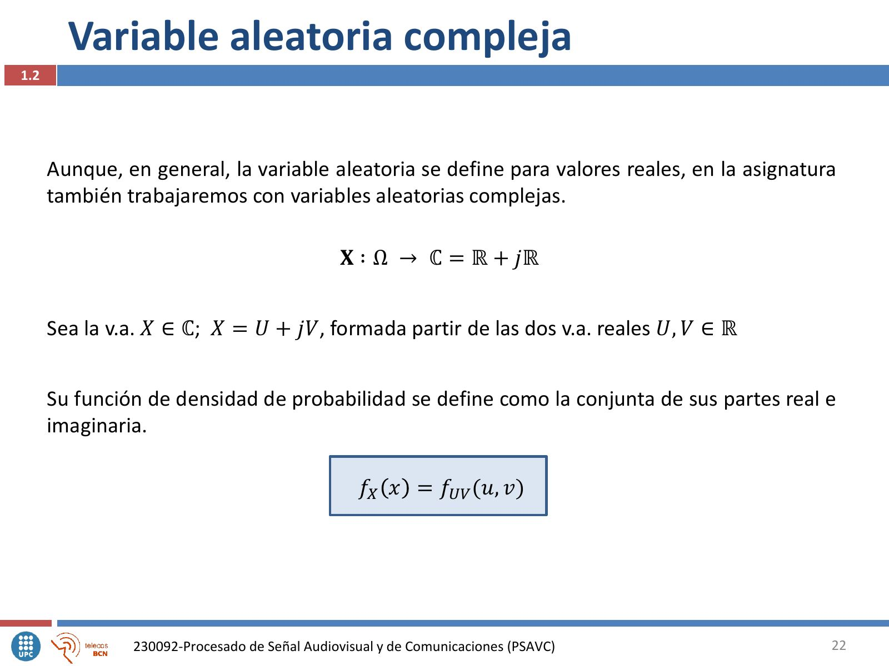

```text
        Variable aleatoria compleja
1.2


      Aunque, en general, la variable aleatoria se define para valores reales, en la asignatura
      también trabajaremos con variables aleatorias complejas.

                                               𝐗𝐗 ∶ Ω → ℂ = ℝ + 𝑗𝑗𝑗


      Sea la v.a. 𝑋𝑋 ∈ ℂ; 𝑋𝑋 = 𝑈𝑈 + 𝑗𝑗𝑗𝑗, formada partir de las dos v.a. reales 𝑈𝑈, 𝑉𝑉 ∈ ℝ


      Su función de densidad de probabilidad se define como la conjunta de sus partes real e
      imaginaria.

                                                  𝑓𝑓𝑋𝑋 𝑥𝑥 = 𝑓𝑓𝑈𝑈𝑈𝑈 (𝑢𝑢, 𝑣𝑣)


                230092-Procesado de Señal Audiovisual y de Comunicaciones (PSAVC)             22
```

## Page 23

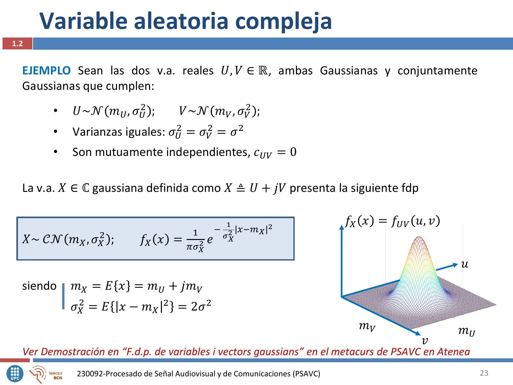

```text
      Variable aleatoria compleja
1.2


  EJEMPLO Sean las dos v.a. reales 𝑈𝑈, 𝑉𝑉 ∈ ℝ, ambas Gaussianas y conjuntamente
  Gaussianas que cumplen:
         •    𝑈𝑈~𝒩𝒩 𝑚𝑚𝑈𝑈 , 𝜎𝜎𝑈𝑈2 ;        𝑉𝑉~𝒩𝒩 𝑚𝑚𝑉𝑉 , 𝜎𝜎𝑉𝑉2 ;
         •    Varianzas iguales: 𝜎𝜎𝑈𝑈2 = 𝜎𝜎𝑉𝑉2 = 𝜎𝜎 2
         •    Son mutuamente independientes, 𝑐𝑐𝑈𝑈𝑈𝑈 = 0

  La v.a. 𝑋𝑋 ∈ ℂ gaussiana definida como 𝑋𝑋 ≜ 𝑈𝑈 + 𝑗𝑗𝑗𝑗 presenta la siguiente fdp

                                                         1                         𝑓𝑓𝑋𝑋 𝑥𝑥 = 𝑓𝑓𝑈𝑈𝑈𝑈 𝑢𝑢, 𝑣𝑣
                                              1        − 2 𝑥𝑥−𝑚𝑚𝑋𝑋 2
  𝑋𝑋~ 𝒞𝒞𝒞𝒞 𝑚𝑚𝑋𝑋 , 𝜎𝜎𝑋𝑋2 ;      𝑓𝑓𝑋𝑋 𝑥𝑥 =        2 𝑒𝑒
                                                        𝜎𝜎𝑋𝑋
                                            𝜋𝜋𝜎𝜎𝑋𝑋
                                                                                                             𝑢𝑢
                                                                                                                    𝑢𝑢
  siendo      𝑚𝑚𝑋𝑋 = 𝐸𝐸 𝑥𝑥 = 𝑚𝑚𝑈𝑈 + 𝑗𝑗𝑚𝑚𝑉𝑉
              𝜎𝜎𝑋𝑋2 = 𝐸𝐸 𝑥𝑥 − 𝑚𝑚𝑋𝑋 2 = 2𝜎𝜎 2
                                                                                      𝑚𝑚𝑉𝑉                   𝑚𝑚𝑈𝑈
                                                                                                      𝑣𝑣
  Ver Demostración en “F.d.p. de variables i vectors gaussians” en el metacurs de PSAVC en Atenea
               230092-Procesado de Señal Audiovisual y de Comunicaciones (PSAVC)                                    23
```

## Page 24

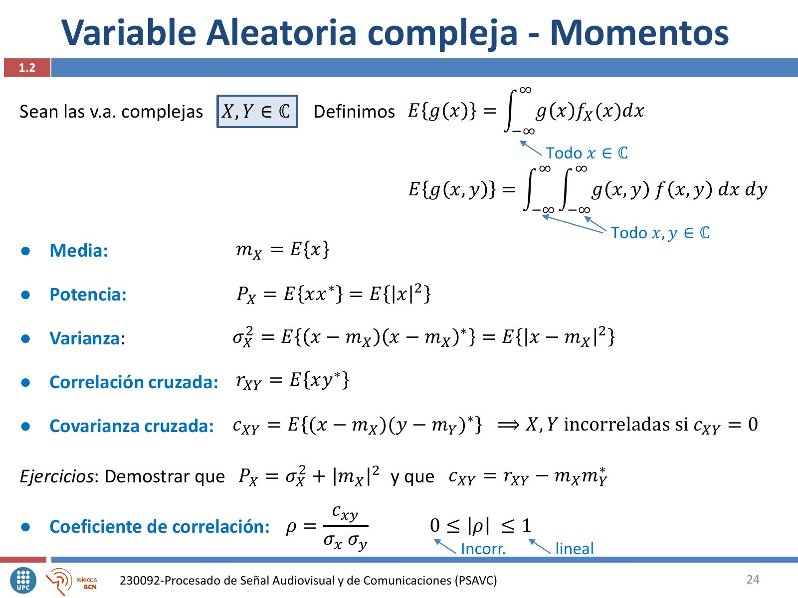

```text
      Variable Aleatoria compleja - Momentos
1.2
                                                                                   ∞
Sean las v.a. complejas 𝑋𝑋, 𝑌𝑌 ∈ ℂ            Definimos 𝐸𝐸 𝑔𝑔 𝑥𝑥             = � 𝑔𝑔 𝑥𝑥 𝑓𝑓𝑋𝑋 (𝑥𝑥)𝑑𝑑𝑑𝑑
                                                                                  −∞
                                                                                       Todo 𝑥𝑥 ∈ ℂ
                                                                                       ∞     ∞
                                                              𝐸𝐸 𝑔𝑔 𝑥𝑥, 𝑦𝑦       = � � 𝑔𝑔 𝑥𝑥, 𝑦𝑦 𝑓𝑓 𝑥𝑥, 𝑦𝑦 𝑑𝑑𝑑𝑑 𝑑𝑑𝑑𝑑
                                                                                    −∞ −∞
                                                                                                    Todo 𝑥𝑥, 𝑦𝑦 ∈ ℂ
● Media:                         𝑚𝑚𝑋𝑋 = 𝐸𝐸 𝑥𝑥

● Potencia:                      𝑃𝑃𝑋𝑋 = 𝐸𝐸 𝑥𝑥𝑥𝑥 ∗ = 𝐸𝐸 𝑥𝑥 2

● Varianza:                     𝜎𝜎𝑋𝑋2 = 𝐸𝐸 𝑥𝑥 − 𝑚𝑚𝑋𝑋 𝑥𝑥 − 𝑚𝑚𝑋𝑋 ∗ = 𝐸𝐸 𝑥𝑥 − 𝑚𝑚𝑋𝑋 2

● Correlación cruzada: 𝑟𝑟𝑋𝑋𝑋𝑋 = 𝐸𝐸 𝑥𝑥𝑦𝑦 ∗

● Covarianza cruzada: 𝑐𝑐𝑋𝑋𝑋𝑋 = 𝐸𝐸 (𝑥𝑥 − 𝑚𝑚𝑋𝑋 )(𝑦𝑦 − 𝑚𝑚𝑌𝑌 )∗                    ⟹ 𝑋𝑋, 𝑌𝑌 incorreladas si 𝑐𝑐𝑋𝑋𝑋𝑋 = 0

Ejercicios: Demostrar que 𝑃𝑃𝑋𝑋 = 𝜎𝜎𝑋𝑋2 + 𝑚𝑚𝑋𝑋 2 y que 𝑐𝑐𝑋𝑋𝑋𝑋 = 𝑟𝑟𝑋𝑋𝑋𝑋 − 𝑚𝑚𝑋𝑋 𝑚𝑚𝑌𝑌∗
                                     𝑐𝑐𝑥𝑥𝑥𝑥
● Coeficiente de correlación: 𝜌𝜌 =                                0 ≤ 𝜌𝜌 ≤ 1
                                   𝜎𝜎𝑥𝑥 𝜎𝜎𝑦𝑦                           Incorr.             lineal
             230092-Procesado de Señal Audiovisual y de Comunicaciones (PSAVC)                                        24
```

## Page 25

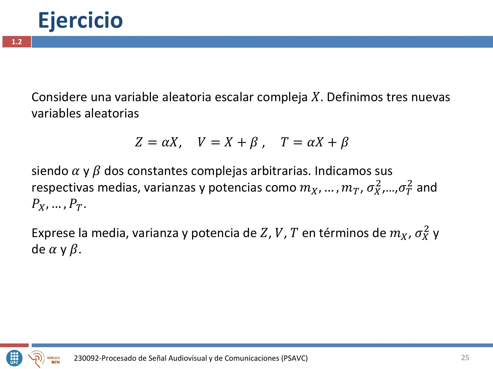

```text
       Ejercicio
1.2


      Considere una variable aleatoria escalar compleja 𝑋𝑋. Definimos tres nuevas
      variables aleatorias

                               𝑍𝑍 = 𝛼𝛼𝑋𝑋,       𝑉𝑉 = 𝑋𝑋 + 𝛽𝛽 ,         𝑇𝑇 = 𝛼𝛼𝑋𝑋 + 𝛽𝛽

      siendo 𝛼𝛼 y 𝛽𝛽 dos constantes complejas arbitrarias. Indicamos sus
      respectivas medias, varianzas y potencias como 𝑚𝑚𝑋𝑋 , … , 𝑚𝑚 𝑇𝑇 , 𝜎𝜎𝑋𝑋2 ,…,𝜎𝜎𝑇𝑇2 and
      𝑃𝑃𝑋𝑋 , … , 𝑃𝑃𝑇𝑇 .

      Exprese la media, varianza y potencia de 𝑍𝑍, 𝑉𝑉, 𝑇𝑇 en términos de 𝑚𝑚𝑋𝑋 , 𝜎𝜎𝑋𝑋2 y
      de 𝛼𝛼 y 𝛽𝛽.


              230092-Procesado de Señal Audiovisual y de Comunicaciones (PSAVC)              25
```

## Page 26

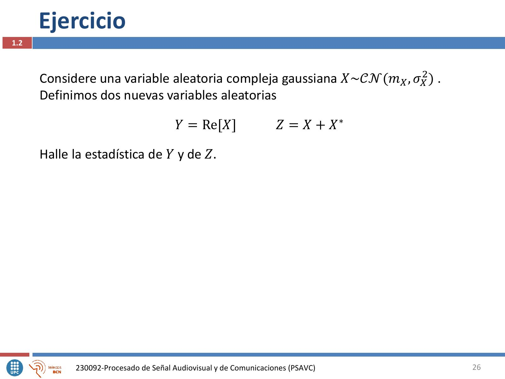

```text
      Ejercicio
1.2


      Considere una variable aleatoria compleja gaussiana 𝑋𝑋~𝒞𝒞𝒞𝒞(𝑚𝑚𝑋𝑋 , 𝜎𝜎𝑋𝑋2 ) .
      Definimos dos nuevas variables aleatorias

                                       𝑌𝑌 = Re[𝑋𝑋]                 𝑍𝑍 = 𝑋𝑋 + 𝑋𝑋 ∗

      Halle la estadística de 𝑌𝑌 y de 𝑍𝑍.


             230092-Procesado de Señal Audiovisual y de Comunicaciones (PSAVC)       26
```

## Page 27

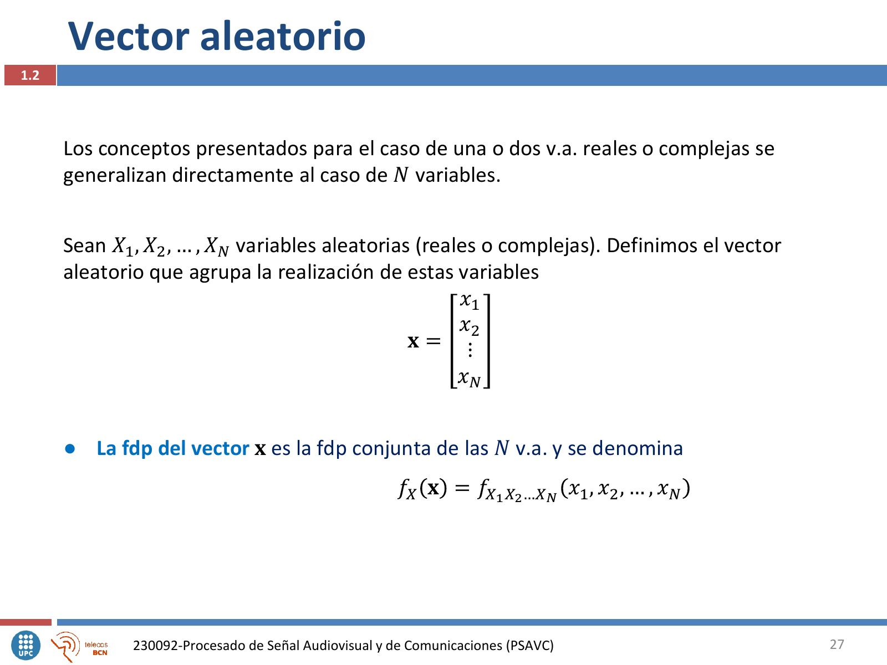

```text
      Vector aleatorio
1.2


      Los conceptos presentados para el caso de una o dos v.a. reales o complejas se
      generalizan directamente al caso de 𝑁𝑁 variables.


      Sean 𝑋𝑋1 , 𝑋𝑋2 , … , 𝑋𝑋𝑁𝑁 variables aleatorias (reales o complejas). Definimos el vector
      aleatorio que agrupa la realización de estas variables
                                                          𝑥𝑥1
                                                          𝑥𝑥2
                                                    𝐱𝐱 = ⋮
                                                          𝑥𝑥𝑁𝑁


      ● La fdp del vector 𝐱𝐱 es la fdp conjunta de las 𝑁𝑁 v.a. y se denomina
                                                      𝑓𝑓𝑋𝑋 𝐱𝐱 = 𝑓𝑓𝑋𝑋1𝑋𝑋2…𝑋𝑋𝑁𝑁 𝑥𝑥1 , 𝑥𝑥2 , … , 𝑥𝑥𝑁𝑁


              230092-Procesado de Señal Audiovisual y de Comunicaciones (PSAVC)                      27
```

## Page 28

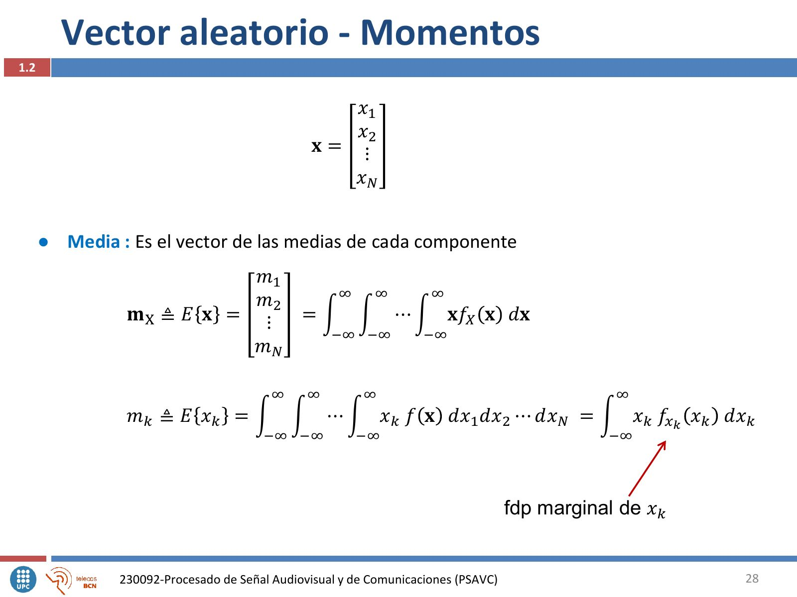

```text
        Vector aleatorio - Momentos
1.2


                                                    𝑥𝑥1
                                                    𝑥𝑥2
                                               𝐱𝐱 = ⋮
                                                    𝑥𝑥𝑁𝑁


      ● Media : Es el vector de las medias de cada componente
                              𝑚𝑚1
                                    ∞  ∞  ∞
                              𝑚𝑚2
                𝐦𝐦X ≜ 𝐸𝐸 𝐱𝐱 = ⋮ = � � ⋯ � 𝐱𝐱𝑓𝑓𝑋𝑋 𝐱𝐱 𝑑𝑑𝐱𝐱
                                   −∞ −∞ −∞
                              𝑚𝑚𝑁𝑁

                                         ∞     ∞        ∞                                       ∞
                𝑚𝑚𝑘𝑘 ≜ 𝐸𝐸 𝑥𝑥𝑘𝑘 = � � ⋯ � 𝑥𝑥𝑘𝑘 𝑓𝑓 𝐱𝐱 𝑑𝑑𝑥𝑥1 𝑑𝑑𝑥𝑥2 ⋯ 𝑑𝑑𝑥𝑥𝑁𝑁 = � 𝑥𝑥𝑘𝑘 𝑓𝑓𝑥𝑥𝑘𝑘 𝑥𝑥𝑘𝑘 𝑑𝑑𝑥𝑥𝑘𝑘
                                       −∞ −∞           −∞                                      −∞


                                                                                   fdp marginal de 𝑥𝑥𝑘𝑘


               230092-Procesado de Señal Audiovisual y de Comunicaciones (PSAVC)                          28
```

## Page 29

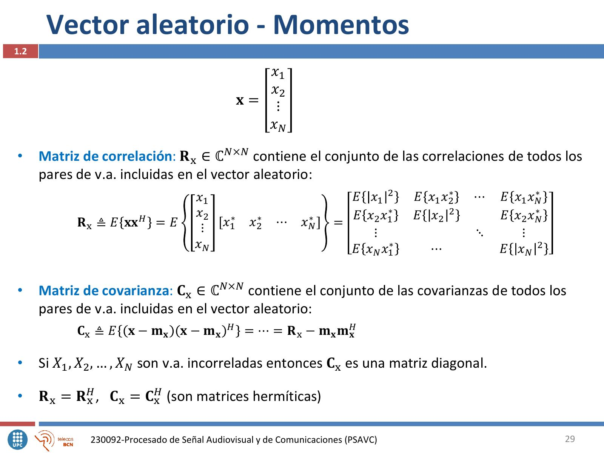

```text
       Vector aleatorio - Momentos
1.2

                                                       𝑥𝑥1
                                                       𝑥𝑥2
                                                  𝐱𝐱 = ⋮
                                                       𝑥𝑥𝑁𝑁

•     Matriz de correlación: 𝐑𝐑 x ∈ ℂ𝑁𝑁×𝑁𝑁 contiene el conjunto de las correlaciones de todos los
      pares de v.a. incluidas en el vector aleatorio:
                                      𝑥𝑥1                                𝐸𝐸 𝑥𝑥1 2       𝐸𝐸 𝑥𝑥1 𝑥𝑥2∗   ⋯   𝐸𝐸 𝑥𝑥1 𝑥𝑥𝑁𝑁∗
                                      𝑥𝑥2     ∗                          𝐸𝐸 𝑥𝑥2 𝑥𝑥1∗    𝐸𝐸 𝑥𝑥2 2          𝐸𝐸 𝑥𝑥2 𝑥𝑥𝑁𝑁∗
            𝐑𝐑 x ≜ 𝐸𝐸 𝐱𝐱𝐱𝐱 𝐻𝐻 = 𝐸𝐸      ⋮  𝑥𝑥1      𝑥𝑥2∗   ⋯   𝑥𝑥𝑁𝑁∗   =
                                                                              ⋮                       ⋱        ⋮
                                      𝑥𝑥𝑁𝑁                               𝐸𝐸 𝑥𝑥𝑁𝑁 𝑥𝑥1∗       ⋯             𝐸𝐸 𝑥𝑥𝑁𝑁 2


•     Matriz de covarianza: 𝐂𝐂x ∈ ℂ𝑁𝑁×𝑁𝑁 contiene el conjunto de las covarianzas de todos los
      pares de v.a. incluidas en el vector aleatorio:
            𝐂𝐂x ≜ 𝐸𝐸 𝐱𝐱 − 𝐦𝐦𝐱𝐱 𝐱𝐱 − 𝐦𝐦𝐱𝐱 𝐻𝐻 = ⋯ = 𝐑𝐑 x − 𝐦𝐦𝐱𝐱 𝐦𝐦𝐻𝐻
                                                                𝐱𝐱


•     Si 𝑋𝑋1 , 𝑋𝑋2 , … , 𝑋𝑋𝑁𝑁 son v.a. incorreladas entonces 𝐂𝐂x es una matriz diagonal.

•     𝐑𝐑 x = 𝐑𝐑𝐻𝐻          𝐻𝐻
               x , 𝐂𝐂x = 𝐂𝐂x (son matrices hermíticas)


               230092-Procesado de Señal Audiovisual y de Comunicaciones (PSAVC)                                         29
```

## Page 30

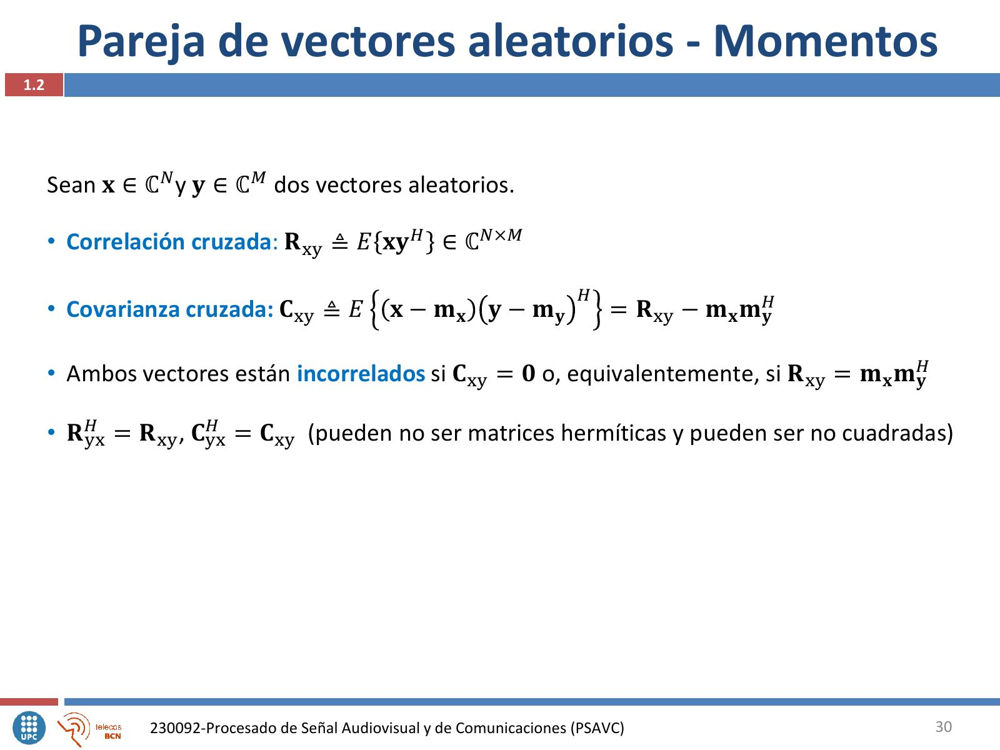

```text
         Pareja de vectores aleatorios - Momentos
1.2


      Sean 𝐱𝐱 ∈ ℂ𝑁𝑁 y 𝐲𝐲 ∈ ℂ𝑀𝑀 dos vectores aleatorios.

      • Correlación cruzada: 𝐑𝐑 xy ≜ 𝐸𝐸 𝐱𝐱𝐲𝐲 𝐻𝐻 ∈ ℂ𝑁𝑁×𝑀𝑀

                                                                          𝐻𝐻
      • Covarianza cruzada: 𝐂𝐂xy ≜ 𝐸𝐸           𝐱𝐱 − 𝐦𝐦𝐱𝐱 𝐲𝐲 − 𝐦𝐦𝐲𝐲            = 𝐑𝐑 xy − 𝐦𝐦𝐱𝐱 𝐦𝐦𝐻𝐻
                                                                                                𝐲𝐲


      • Ambos vectores están incorrelados si 𝐂𝐂xy = 𝟎𝟎 o, equivalentemente, si 𝐑𝐑 xy = 𝐦𝐦𝐱𝐱 𝐦𝐦𝐻𝐻
                                                                                              𝐲𝐲

      • 𝐑𝐑𝐻𝐻             𝐻𝐻
          yx = 𝐑𝐑 xy , 𝐂𝐂yx = 𝐂𝐂xy (pueden no ser matrices hermíticas y pueden ser no cuadradas)


                230092-Procesado de Señal Audiovisual y de Comunicaciones (PSAVC)                    30
```

## Page 31

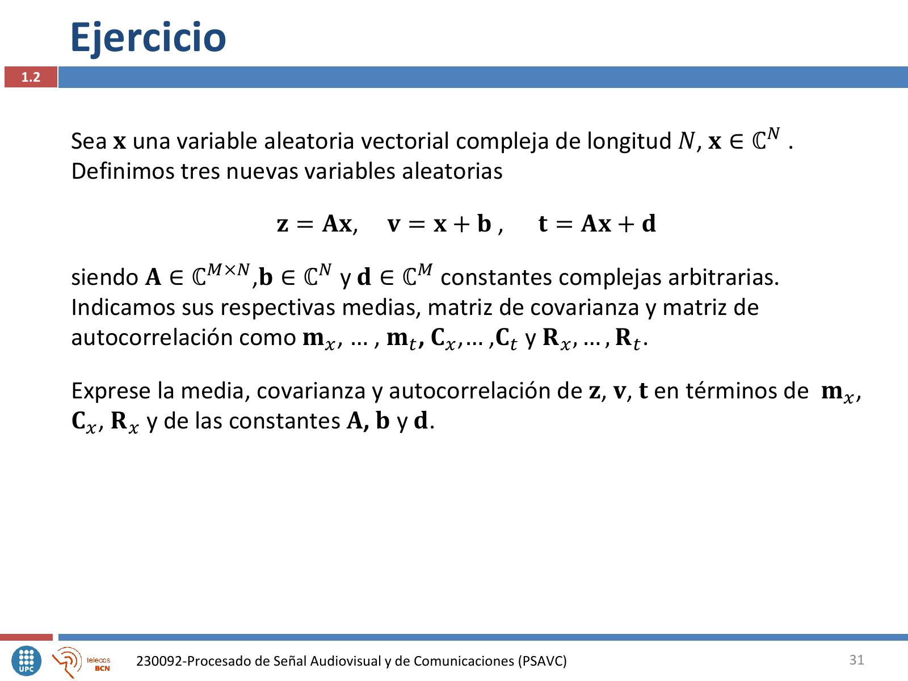

```text
      Ejercicio
1.2


      Sea 𝐱𝐱 una variable aleatoria vectorial compleja de longitud 𝑁𝑁, 𝐱𝐱 ∈ ℂ𝑁𝑁 .
      Definimos tres nuevas variables aleatorias

                                 𝐳𝐳 = 𝚨𝚨𝚨𝚨,      𝐯𝐯 = 𝐱𝐱 + 𝐛𝐛 ,         𝐭𝐭 = 𝚨𝚨𝚨𝚨 + 𝐝𝐝

      siendo 𝚨𝚨 ∈ ℂ𝑀𝑀×𝑁𝑁 ,𝐛𝐛 ∈ ℂ𝑁𝑁 y 𝐝𝐝 ∈ ℂ𝑀𝑀 constantes complejas arbitrarias.
      Indicamos sus respectivas medias, matriz de covarianza y matriz de
      autocorrelación como 𝐦𝐦𝑥𝑥 , … , 𝐦𝐦𝑡𝑡 , 𝐂𝐂𝑥𝑥 ,… ,𝐂𝐂𝑡𝑡 y 𝐑𝐑 𝑥𝑥 , … , 𝐑𝐑 𝑡𝑡 .

      Exprese la media, covarianza y autocorrelación de 𝐳𝐳, 𝐯𝐯, 𝐭𝐭 en términos de 𝐦𝐦𝑥𝑥 ,
      𝐂𝐂𝑥𝑥 , 𝐑𝐑 𝑥𝑥 y de las constantes 𝚨𝚨, 𝐛𝐛 y 𝐝𝐝.


            230092-Procesado de Señal Audiovisual y de Comunicaciones (PSAVC)            31
```

## Page 32

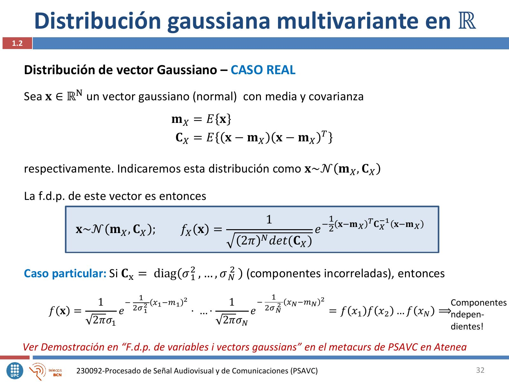

```text
       Distribución gaussiana multivariante en ℝ
1.2


      Distribución de vector Gaussiano – CASO REAL
      Sea 𝐱𝐱 ∈ ℝN un vector gaussiano (normal) con media y covarianza
                                                 𝐦𝐦𝑋𝑋 = 𝐸𝐸 𝐱𝐱
                                                  𝐂𝐂𝑋𝑋 = 𝐸𝐸 𝐱𝐱 − 𝐦𝐦𝑋𝑋 𝐱𝐱 − 𝐦𝐦𝑋𝑋 𝑇𝑇

      respectivamente. Indicaremos esta distribución como 𝐱𝐱~𝒩𝒩 𝐦𝐦𝑋𝑋 , 𝐂𝐂𝑋𝑋

      La f.d.p. de este vector es entonces
                                                                                  1                1             −1
                                                                                                  − 𝐱𝐱−𝐦𝐦𝑋𝑋 𝑇𝑇 𝐂𝐂𝑋𝑋 𝐱𝐱−𝐦𝐦𝑋𝑋
                𝐱𝐱~𝒩𝒩 𝐦𝐦𝑋𝑋 , 𝐂𝐂𝑋𝑋 ;                𝑓𝑓𝑋𝑋 𝐱𝐱 =                                   𝑒𝑒  2
                                                                    2𝜋𝜋 𝑁𝑁 𝑑𝑑𝑑𝑑𝑑𝑑(𝐂𝐂𝑋𝑋 )

      Caso particular: Si 𝐂𝐂x = diag 𝜎𝜎 21 , … , 𝜎𝜎 𝑁𝑁2 (componentes incorreladas), entonces
                                        1                                           1
                      1            −          𝑥𝑥 −𝑚𝑚1 2
                                       2𝜎𝜎 21 1
                                                                1             −           𝑥𝑥 −𝑚𝑚𝑁𝑁 2
                                                                                  2𝜎𝜎 𝑁𝑁2 𝑁𝑁
                                                                                                                                  Componentes
           𝑓𝑓 𝐱𝐱 =            𝑒𝑒                        · …·             𝑒𝑒                          = 𝑓𝑓 𝑥𝑥1 𝑓𝑓 𝑥𝑥2   … 𝑓𝑓 𝑥𝑥𝑁𝑁 ⟹ndepen-
                     2𝜋𝜋𝜎𝜎1                                    2𝜋𝜋𝜎𝜎𝑁𝑁
                                                                                                                                  dientes!

  Ver Demostración en “F.d.p. de variables i vectors gaussians” en el metacurs de PSAVC en Atenea

                230092-Procesado de Señal Audiovisual y de Comunicaciones (PSAVC)                                                       32
```

## Page 33

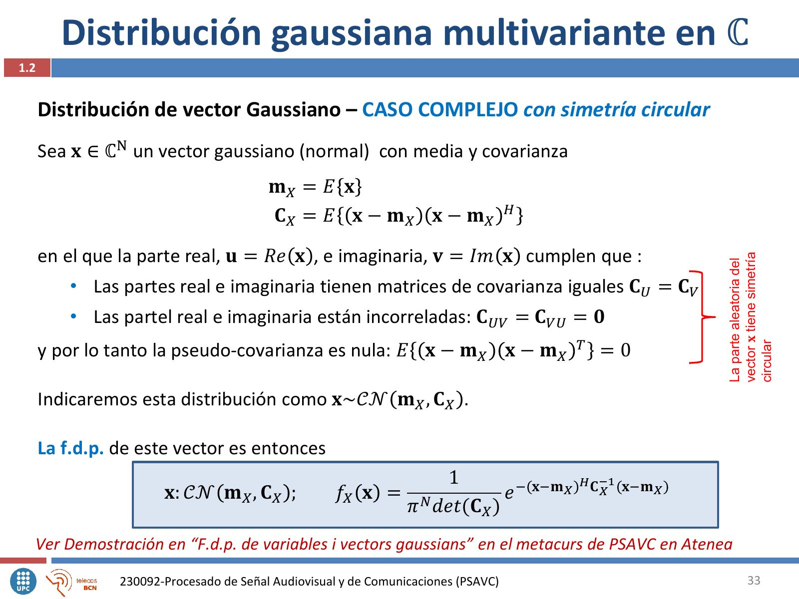

```text
         Distribución gaussiana multivariante en ℂ
1.2


      Distribución de vector Gaussiano – CASO COMPLEJO con simetría circular
      Sea 𝐱𝐱 ∈ ℂN un vector gaussiano (normal) con media y covarianza
                                         𝐦𝐦𝑋𝑋 = 𝐸𝐸 𝐱𝐱
                                          𝐂𝐂𝑋𝑋 = 𝐸𝐸 𝐱𝐱 − 𝐦𝐦𝑋𝑋 𝐱𝐱 − 𝐦𝐦𝑋𝑋 𝐻𝐻

      en el que la parte real, 𝐮𝐮 = 𝑅𝑅𝑅𝑅 𝐱𝐱 , e imaginaria, 𝐯𝐯 = 𝐼𝐼𝐼𝐼 𝐱𝐱 cumplen que :
                                                                                                                    La parte aleatoria del
          • Las partes real e imaginaria tienen matrices de covarianza iguales 𝐂𝐂𝑈𝑈 = 𝐂𝐂𝑉𝑉
                                                                                                                    vector 𝐱𝐱 tiene simetría
          • Las partel real e imaginaria están incorreladas: 𝐂𝐂𝑈𝑈𝑈𝑈 = 𝐂𝐂𝑉𝑉𝑉𝑉 = 𝟎𝟎
                                                                                                                    circular
      y por lo tanto la pseudo-covarianza es nula: 𝐸𝐸 𝐱𝐱 − 𝐦𝐦𝑋𝑋 𝐱𝐱 − 𝐦𝐦𝑋𝑋 𝑇𝑇 = 0

      Indicaremos esta distribución como 𝐱𝐱~𝒞𝒞𝒞𝒞 𝐦𝐦𝑋𝑋 , 𝐂𝐂𝑋𝑋 .

      La f.d.p. de este vector es entonces
                                                                          1                            −1
                                                                                        − 𝐱𝐱−𝐦𝐦𝑋𝑋 𝐻𝐻 𝐂𝐂𝑋𝑋 𝐱𝐱−𝐦𝐦𝑋𝑋
                       𝐱𝐱: 𝒞𝒞𝒞𝒞 𝐦𝐦𝑋𝑋 , 𝐂𝐂𝑋𝑋 ;       𝑓𝑓𝑋𝑋 𝐱𝐱 =                        𝑒𝑒
                                                                 𝜋𝜋 𝑁𝑁 𝑑𝑑𝑑𝑑𝑑𝑑(𝐂𝐂𝑋𝑋 )
  Ver Demostración en “F.d.p. de variables i vectors gaussians” en el metacurs de PSAVC en Atenea

                230092-Procesado de Señal Audiovisual y de Comunicaciones (PSAVC)                                           33
```

## Page 34

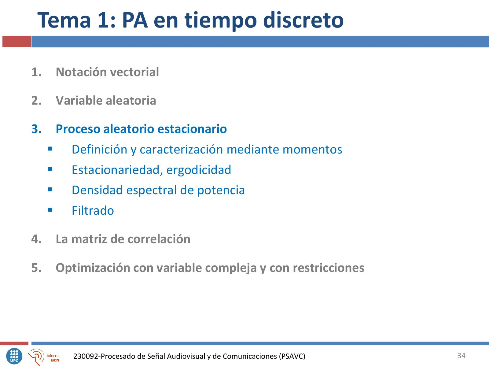

```text
 Tema 1: PA en tiempo discreto
1.    Notación vectorial

2.    Variable aleatoria

3.    Proceso aleatorio estacionario
      Definición y caracterización mediante momentos
      Estacionariedad, ergodicidad
      Densidad espectral de potencia
      Filtrado

4.    La matriz de correlación

5.    Optimización con variable compleja y con restricciones


         230092-Procesado de Señal Audiovisual y de Comunicaciones (PSAVC)   34
```

## Page 35

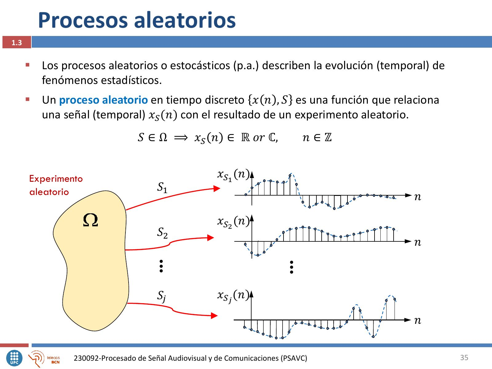

```text
        Procesos aleatorios
1.3

       Los procesos aleatorios o estocásticos (p.a.) describen la evolución (temporal) de
        fenómenos estadísticos.
       Un proceso aleatorio en tiempo discreto 𝑥𝑥 𝑛𝑛 , 𝑆𝑆 es una función que relaciona
        una señal (temporal) 𝑥𝑥𝑆𝑆 (𝑛𝑛) con el resultado de un experimento aleatorio.
                                𝑆𝑆 ∈ Ω ⟹ 𝑥𝑥𝑆𝑆 𝑛𝑛 ∈ ℝ 𝑜𝑜𝑜𝑜 ℂ,                  𝑛𝑛 ∈ ℤ


      Experimento                                     𝑥𝑥𝑆𝑆1 (𝑛𝑛)
      aleatorio                       𝑆𝑆1
                                                                                       𝑛𝑛
                                                      𝑥𝑥𝑆𝑆2 (𝑛𝑛)
                                      𝑆𝑆2
                                                                                       𝑛𝑛
                                   ···                                  ···
                                      𝑆𝑆𝑗𝑗            𝑥𝑥𝑆𝑆𝑗𝑗 (𝑛𝑛)

                                                                                       𝑛𝑛

               230092-Procesado de Señal Audiovisual y de Comunicaciones (PSAVC)             35
```

## Page 36

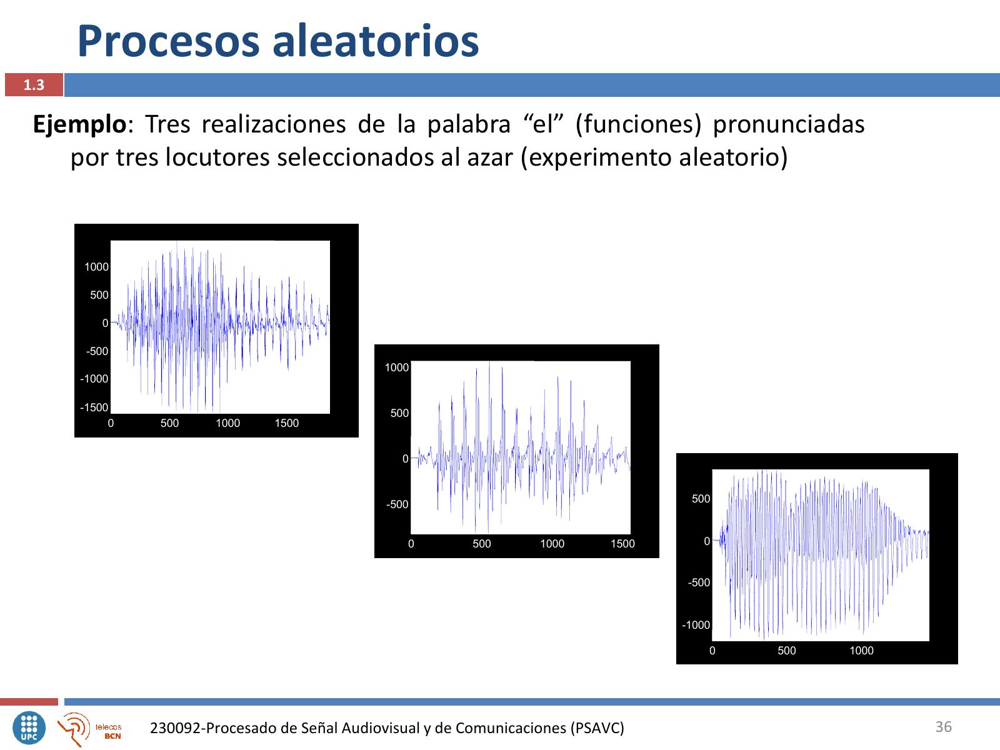

```text
      Procesos aleatorios
1.3

 Ejemplo: Tres realizaciones de la palabra “el” (funciones) pronunciadas
    por tres locutores seleccionados al azar (experimento aleatorio)


      1000

       500

         0

       -500
                                               1000
      -1000

      -1500
                                               500
           0    500     1000    1500


                                                 0


                                               -500                                   500


                                                  0        500      1000      1500      0


                                                                                      -500


                                                                                     -1000

                                                                                         0   500   1000


               230092-Procesado de Señal Audiovisual y de Comunicaciones (PSAVC)                          36
```

## Page 37

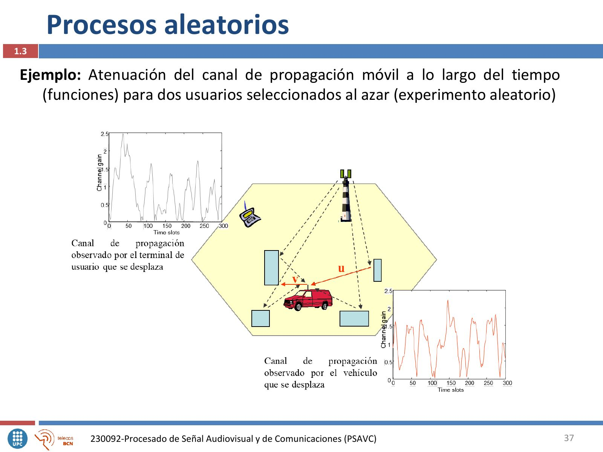

```text
      Procesos aleatorios
1.3

 Ejemplo: Atenuación del canal de propagación móvil a lo largo del tiempo
    (funciones) para dos usuarios seleccionados al azar (experimento aleatorio)


           230092-Procesado de Señal Audiovisual y de Comunicaciones (PSAVC)      37
```

## Page 38

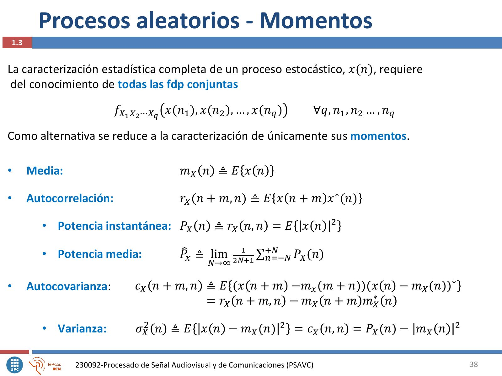

```text
        Procesos aleatorios - Momentos
1.3


La caracterización estadística completa de un proceso estocástico, 𝑥𝑥(𝑛𝑛), requiere
 del conocimiento de todas las fdp conjuntas

                         𝑓𝑓𝑋𝑋1𝑋𝑋2⋯𝑋𝑋𝑞𝑞 𝑥𝑥(𝑛𝑛1 ), 𝑥𝑥(𝑛𝑛2 ), … , 𝑥𝑥(𝑛𝑛𝑞𝑞 )       ∀𝑞𝑞, 𝑛𝑛1 , 𝑛𝑛2 … , 𝑛𝑛𝑞𝑞

Como alternativa se reduce a la caracterización de únicamente sus momentos.

•     Media:                               𝑚𝑚𝑋𝑋 𝑛𝑛 ≜ 𝐸𝐸 𝑥𝑥 𝑛𝑛

•     Autocorrelación:                     𝑟𝑟𝑋𝑋 (𝑛𝑛 + 𝑚𝑚, 𝑛𝑛) ≜ 𝐸𝐸 𝑥𝑥 𝑛𝑛 + 𝑚𝑚 𝑥𝑥 ∗ (𝑛𝑛)

        • Potencia instantánea: 𝑃𝑃𝑋𝑋 𝑛𝑛 ≜ 𝑟𝑟𝑋𝑋 𝑛𝑛, 𝑛𝑛 = 𝐸𝐸 𝑥𝑥 𝑛𝑛                    2


        • Potencia media:                  𝑃𝑃�𝑥𝑥 ≜ lim 2𝑁𝑁+1
                                                         1
                                                             ∑+𝑁𝑁
                                                              𝑛𝑛=−𝑁𝑁 𝑃𝑃𝑋𝑋 (𝑛𝑛)
                                                   𝑁𝑁→∞

•     Autocovarianza:          𝑐𝑐𝑋𝑋 𝑛𝑛 + 𝑚𝑚, 𝑛𝑛 ≜ 𝐸𝐸 (𝑥𝑥 𝑛𝑛 + 𝑚𝑚 −𝑚𝑚𝑥𝑥 (𝑚𝑚 + 𝑛𝑛))(𝑥𝑥 𝑛𝑛 − 𝑚𝑚𝑋𝑋 (𝑛𝑛))∗
                                                = 𝑟𝑟𝑋𝑋 𝑛𝑛 + 𝑚𝑚, 𝑛𝑛 − 𝑚𝑚𝑋𝑋 𝑛𝑛 + 𝑚𝑚 𝑚𝑚𝑋𝑋∗ 𝑛𝑛

        • Varianza:            𝜎𝜎𝑋𝑋2 𝑛𝑛 ≜ 𝐸𝐸 𝑥𝑥 𝑛𝑛 − 𝑚𝑚𝑋𝑋 (𝑛𝑛) 2 = 𝑐𝑐𝑋𝑋 𝑛𝑛, 𝑛𝑛 = 𝑃𝑃𝑋𝑋 (𝑛𝑛) − 𝑚𝑚𝑋𝑋 𝑛𝑛     2


               230092-Procesado de Señal Audiovisual y de Comunicaciones (PSAVC)                             38
```

## Page 39

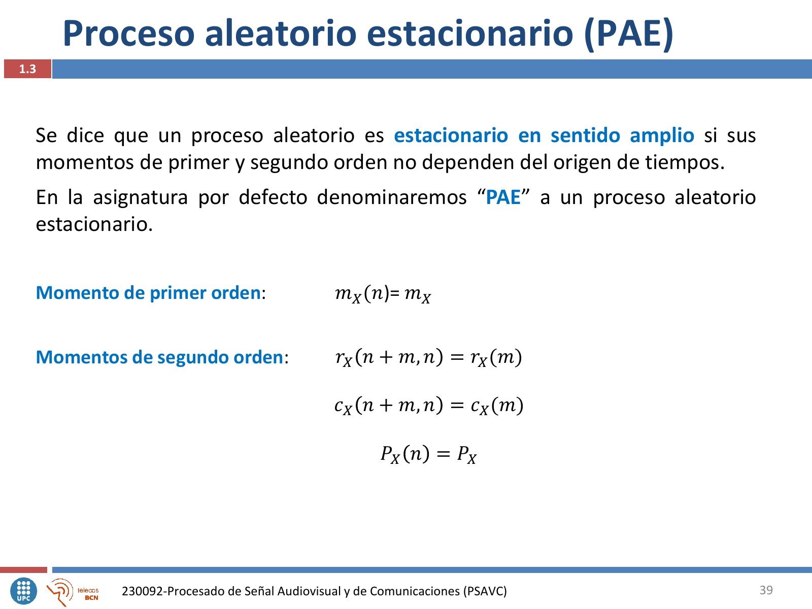

```text
      Proceso aleatorio estacionario (PAE)
1.3


  Se dice que un proceso aleatorio es estacionario en sentido amplio si sus
  momentos de primer y segundo orden no dependen del origen de tiempos.
  En la asignatura por defecto denominaremos “PAE” a un proceso aleatorio
  estacionario.


  Momento de primer orden:                   𝑚𝑚𝑋𝑋 (𝑛𝑛)= 𝑚𝑚𝑋𝑋


  Momentos de segundo orden:                  𝑟𝑟𝑋𝑋 𝑛𝑛 + 𝑚𝑚, 𝑛𝑛 = 𝑟𝑟𝑋𝑋 (𝑚𝑚)

                                             𝑐𝑐𝑋𝑋 𝑛𝑛 + 𝑚𝑚, 𝑛𝑛 = 𝑐𝑐𝑋𝑋 (𝑚𝑚)

                                                     𝑃𝑃𝑋𝑋 𝑛𝑛 = 𝑃𝑃𝑋𝑋


          230092-Procesado de Señal Audiovisual y de Comunicaciones (PSAVC)   39
```

## Page 40

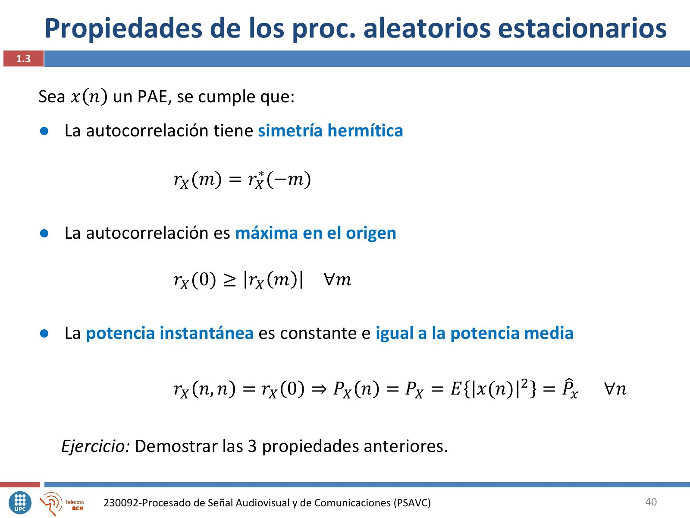

```text
      Propiedades de los proc. aleatorios estacionarios
1.3


      Sea 𝑥𝑥 𝑛𝑛 un PAE, se cumple que:
      ● La autocorrelación tiene simetría hermítica

                           𝑟𝑟𝑋𝑋 (𝑚𝑚) = 𝑟𝑟𝑋𝑋∗ (−𝑚𝑚)

      ● La autocorrelación es máxima en el origen

                           𝑟𝑟𝑋𝑋 (0) ≥ 𝑟𝑟𝑋𝑋 𝑚𝑚            ∀𝑚𝑚

      ● La potencia instantánea es constante e igual a la potencia media

                           𝑟𝑟𝑋𝑋 𝑛𝑛, 𝑛𝑛 = 𝑟𝑟𝑋𝑋 0 ⇒ 𝑃𝑃𝑋𝑋 𝑛𝑛 = 𝑃𝑃𝑋𝑋 = 𝐸𝐸 𝑥𝑥(𝑛𝑛) 2 = 𝑃𝑃�𝑥𝑥   ∀𝑛𝑛

        Ejercicio: Demostrar las 3 propiedades anteriores.

              230092-Procesado de Señal Audiovisual y de Comunicaciones (PSAVC)                40
```

## Page 41

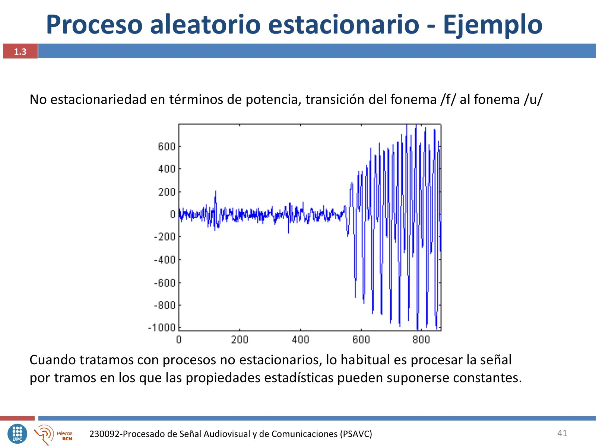

```text
        Proceso aleatorio estacionario - Ejemplo
1.3


      No estacionariedad en términos de potencia, transición del fonema /f/ al fonema /u/


      Cuando tratamos con procesos no estacionarios, lo habitual es procesar la señal
      por tramos en los que las propiedades estadísticas pueden suponerse constantes.


               230092-Procesado de Señal Audiovisual y de Comunicaciones (PSAVC)            41
```

## Page 42

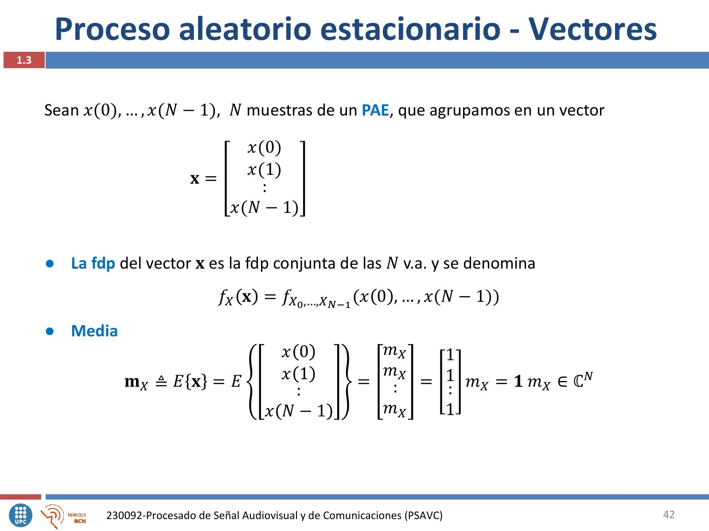

```text
       Proceso aleatorio estacionario - Vectores
1.3


      Sean 𝑥𝑥(0), … , 𝑥𝑥(𝑁𝑁 − 1), 𝑁𝑁 muestras de un PAE, que agrupamos en un vector

                                      𝑥𝑥(0)
                              𝐱𝐱 =    𝑥𝑥(1)
                                         :
                                   𝑥𝑥(𝑁𝑁 − 1)


      ● La fdp del vector 𝐱𝐱 es la fdp conjunta de las 𝑁𝑁 v.a. y se denomina
                                   𝑓𝑓𝑋𝑋 𝐱𝐱 = 𝑓𝑓𝑋𝑋0,…,𝑋𝑋𝑁𝑁−1 (𝑥𝑥 0 , … , 𝑥𝑥(𝑁𝑁 − 1))
      ● Media
                                               𝑥𝑥 0             𝑚𝑚𝑋𝑋  1
                                               𝑥𝑥 1             𝑚𝑚
                 𝐦𝐦𝑋𝑋 ≜ 𝐸𝐸 𝐱𝐱 = 𝐸𝐸                            = :𝑋𝑋 = 1: 𝑚𝑚𝑋𝑋 = 𝟏𝟏 𝑚𝑚𝑋𝑋 ∈ ℂ𝑁𝑁
                                                  :
                                            𝑥𝑥 𝑁𝑁 − 1           𝑚𝑚𝑋𝑋  1


              230092-Procesado de Señal Audiovisual y de Comunicaciones (PSAVC)                 42
```

## Page 43

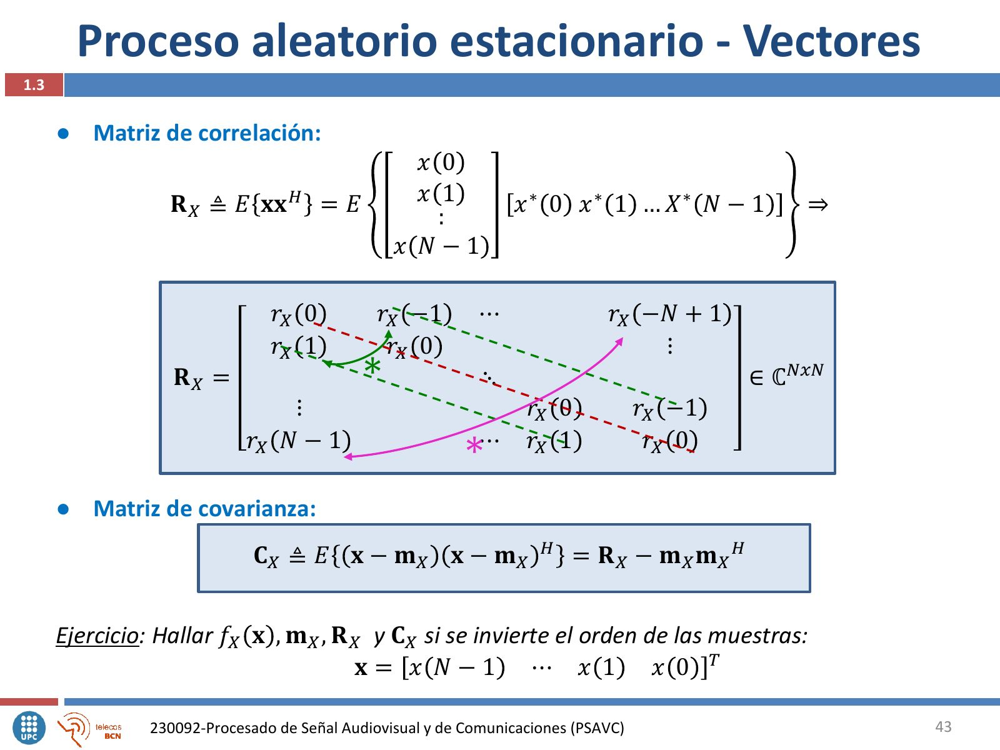

```text
        Proceso aleatorio estacionario - Vectores
1.3


      ● Matriz de correlación:
                                                    𝑥𝑥 0
                   𝐑𝐑𝑋𝑋 ≜ 𝐸𝐸 𝐱𝐱𝐱𝐱 𝐻𝐻 = 𝐸𝐸           𝑥𝑥 1         𝑥𝑥 ∗ 0 𝑥𝑥 ∗ 1 … 𝑋𝑋 ∗ 𝑁𝑁 − 1         ⇒
                                                       :
                                                 𝑥𝑥 𝑁𝑁 − 1

                                𝑟𝑟𝑋𝑋 0         𝑟𝑟𝑋𝑋 −1       ⋯                𝑟𝑟𝑋𝑋 −𝑁𝑁 + 1
                                𝑟𝑟𝑋𝑋 1           𝑟𝑟𝑋𝑋 0                              ⋮
                   𝐑𝐑𝑋𝑋 =                    ∗               ⋱                                 ∈ ℂ𝑁𝑁𝑥𝑥𝑥𝑥
                                    ⋮                              𝑟𝑟𝑋𝑋 0           𝑟𝑟𝑋𝑋 −1
                             𝑟𝑟𝑋𝑋 𝑁𝑁 − 1                   ∗⋯      𝑟𝑟𝑋𝑋 1             𝑟𝑟𝑋𝑋 0

      ● Matriz de covarianza:
                              𝐂𝐂𝑋𝑋 ≜ 𝐸𝐸 𝐱𝐱 − 𝐦𝐦𝑋𝑋 𝐱𝐱 − 𝐦𝐦𝑋𝑋 𝐻𝐻 = 𝐑𝐑𝑋𝑋 − 𝐦𝐦𝑋𝑋 𝐦𝐦𝑋𝑋 𝐻𝐻


      Ejercicio: Hallar 𝑓𝑓𝑋𝑋 𝐱𝐱 , 𝐦𝐦𝑋𝑋 , 𝐑𝐑𝑋𝑋 y 𝐂𝐂𝑋𝑋 si se invierte el orden de las muestras:
                                            𝐱𝐱 = 𝑥𝑥 𝑁𝑁 − 1 ⋯ 𝑥𝑥 1 𝑥𝑥 0 𝑇𝑇

                230092-Procesado de Señal Audiovisual y de Comunicaciones (PSAVC)                          43
```

## Page 44

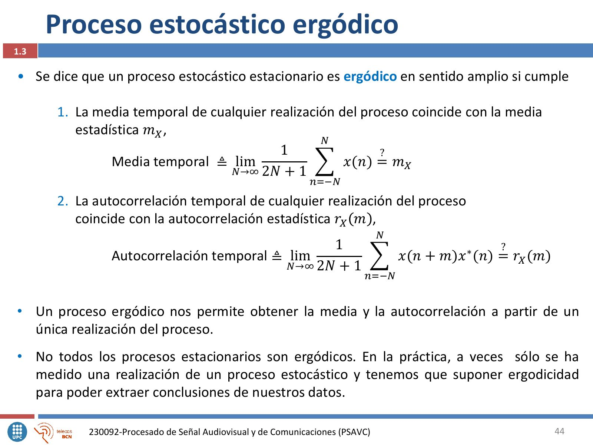

```text
      Proceso estocástico ergódico
1.3

• Se dice que un proceso estocástico estacionario es ergódico en sentido amplio si cumple

      1. La media temporal de cualquier realización del proceso coincide con la media
         estadística 𝑚𝑚𝑋𝑋 ,
                                                 𝑁𝑁
                                          1                ?
               Media temporal ≜ lim             � 𝑥𝑥(𝑛𝑛) = 𝑚𝑚𝑋𝑋
                                 𝑁𝑁→∞ 2𝑁𝑁 + 1
                                                             𝑛𝑛=−𝑁𝑁
      2. La autocorrelación temporal de cualquier realización del proceso
         coincide con la autocorrelación estadística 𝑟𝑟𝑋𝑋 𝑚𝑚 ,
                                                                               𝑁𝑁
                                                   1                           ?
                Autocorrelación temporal ≜ lim          � 𝑥𝑥(𝑛𝑛 + 𝑚𝑚)𝑥𝑥 ∗ (𝑛𝑛) = 𝑟𝑟𝑋𝑋 (𝑚𝑚)
                                           𝑁𝑁→∞ 2𝑁𝑁 + 1
                                                                          𝑛𝑛=−𝑁𝑁


• Un proceso ergódico nos permite obtener la media y la autocorrelación a partir de un
  única realización del proceso.
• No todos los procesos estacionarios son ergódicos. En la práctica, a veces sólo se ha
  medido una realización de un proceso estocástico y tenemos que suponer ergodicidad
  para poder extraer conclusiones de nuestros datos.

           230092-Procesado de Señal Audiovisual y de Comunicaciones (PSAVC)                 44
```

## Page 45

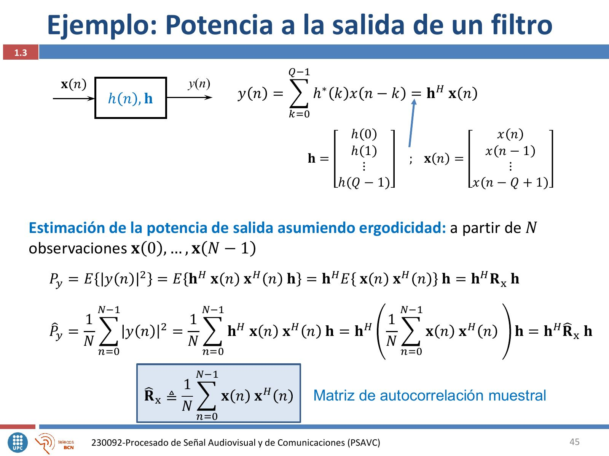

```text
        Ejemplo: Potencia a la salida de un filtro
1.3
                                                               𝑄𝑄−1
          𝐱𝐱 𝑛𝑛                         y(n)
                      ℎ 𝑛𝑛 , 𝐡𝐡                    𝑦𝑦 𝑛𝑛 = � ℎ∗ 𝑘𝑘 𝑥𝑥 𝑛𝑛 − 𝑘𝑘 = 𝐡𝐡𝐻𝐻 𝐱𝐱 𝑛𝑛
                                                               𝑘𝑘=0
                                                                          ℎ 0                           𝑥𝑥 𝑛𝑛
                                                                          ℎ 1                        𝑥𝑥 𝑛𝑛 − 1
                                                                   𝐡𝐡 =                 ; 𝐱𝐱 𝑛𝑛 =
                                                                            ⋮                              ⋮
                                                                        ℎ 𝑄𝑄 − 1                  𝑥𝑥 𝑛𝑛 − 𝑄𝑄 + 1


      Estimación de la potencia de salida asumiendo ergodicidad: a partir de 𝑁𝑁
      observaciones 𝐱𝐱 0 , … , 𝐱𝐱 𝑁𝑁 − 1
                             2
        𝑃𝑃𝑦𝑦 = 𝐸𝐸 𝑦𝑦 𝑛𝑛           = 𝐸𝐸 𝐡𝐡𝐻𝐻 𝐱𝐱 𝑛𝑛 𝐱𝐱 𝐻𝐻 𝑛𝑛 𝐡𝐡 = 𝐡𝐡𝐻𝐻 𝐸𝐸 𝐱𝐱 𝑛𝑛 𝐱𝐱 𝐻𝐻 𝑛𝑛        𝐡𝐡 = 𝐡𝐡𝐻𝐻 𝐑𝐑 x 𝐡𝐡
                    𝑁𝑁−1                   𝑁𝑁−1                                        𝑁𝑁−1
                  1                     1                                  1
        𝑃𝑃�𝑦𝑦 =      � 𝑦𝑦 𝑛𝑛      2 =      � 𝐡𝐡𝐻𝐻 𝐱𝐱 𝑛𝑛 𝐱𝐱 𝐻𝐻 𝑛𝑛 𝐡𝐡 = 𝐡𝐡𝐻𝐻    � 𝐱𝐱 𝑛𝑛 𝐱𝐱 𝐻𝐻 𝑛𝑛                         � x 𝐡𝐡
                                                                                                             𝐡𝐡 = 𝐡𝐡𝐻𝐻 𝐑𝐑
                  𝑁𝑁                    𝑁𝑁                                 𝑁𝑁
                    𝑛𝑛=0                   𝑛𝑛=0                                        𝑛𝑛=0

                                          𝑁𝑁−1
                                       1
                              �x ≜
                              𝐑𝐑          � 𝐱𝐱 𝑛𝑛 𝐱𝐱 𝐻𝐻 𝑛𝑛            Matriz de autocorrelación muestral
                                       𝑁𝑁
                                          𝑛𝑛=0

                   230092-Procesado de Señal Audiovisual y de Comunicaciones (PSAVC)                                    45
```

## Page 46

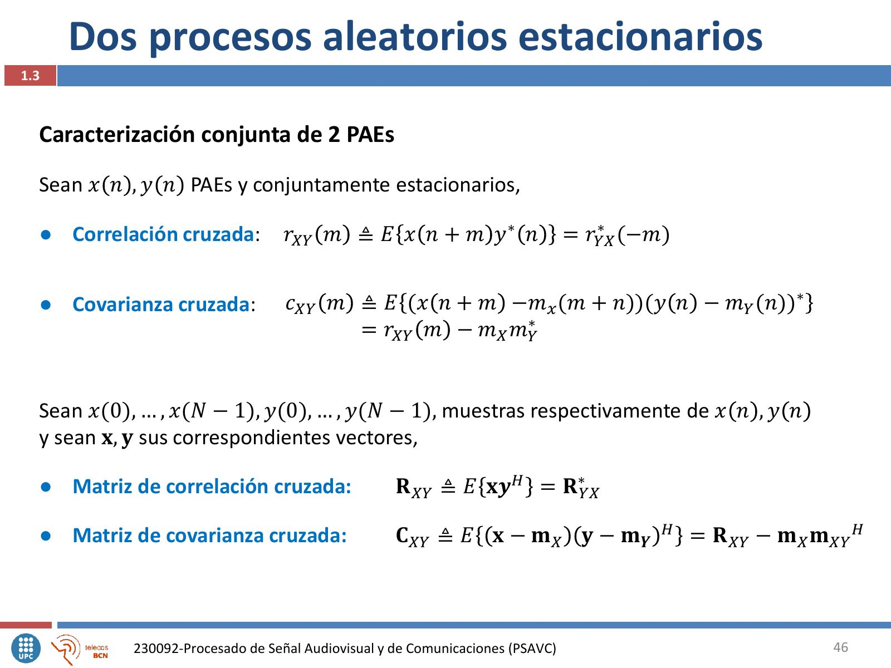

```text
      Dos procesos aleatorios estacionarios
1.3


  Caracterización conjunta de 2 PAEs

  Sean 𝑥𝑥 𝑛𝑛 , 𝑦𝑦 𝑛𝑛 PAEs y conjuntamente estacionarios,
                                                                                      ∗
  ● Correlación cruzada:            𝑟𝑟𝑋𝑋𝑌𝑌 𝑚𝑚 ≜ 𝐸𝐸 𝑥𝑥 𝑛𝑛 + 𝑚𝑚 𝑦𝑦 ∗ 𝑛𝑛            = 𝑟𝑟𝑌𝑌𝑌𝑌 (−𝑚𝑚)


  ● Covarianza cruzada:             𝑐𝑐𝑋𝑋𝑌𝑌 𝑚𝑚 ≜ 𝐸𝐸 (𝑥𝑥 𝑛𝑛 + 𝑚𝑚 −𝑚𝑚𝑥𝑥 (𝑚𝑚 + 𝑛𝑛))(𝑦𝑦 𝑛𝑛 − 𝑚𝑚𝑌𝑌 (𝑛𝑛))∗
                                              = 𝑟𝑟𝑋𝑋𝑋𝑋 𝑚𝑚 − 𝑚𝑚𝑋𝑋 𝑚𝑚𝑌𝑌∗


  Sean 𝑥𝑥(0), … , 𝑥𝑥(𝑁𝑁 − 1), 𝑦𝑦(0), … , 𝑦𝑦(𝑁𝑁 − 1), muestras respectivamente de 𝑥𝑥 𝑛𝑛 , 𝑦𝑦 𝑛𝑛
  y sean 𝐱𝐱, 𝐲𝐲 sus correspondientes vectores,

  ● Matriz de correlación cruzada:                   𝐑𝐑𝑋𝑋𝑌𝑌 ≜ 𝐸𝐸 𝐱𝐱𝒚𝒚𝐻𝐻 = 𝐑𝐑∗𝑌𝑌𝑋𝑋

  ● Matriz de covarianza cruzada:                    𝐂𝐂𝑋𝑋𝑋𝑋 ≜ 𝐸𝐸 𝐱𝐱 − 𝐦𝐦𝑋𝑋 𝐲𝐲 − 𝐦𝐦𝒀𝒀 𝐻𝐻 = 𝐑𝐑𝑋𝑋𝑋𝑋 − 𝐦𝐦𝑋𝑋 𝐦𝐦𝑋𝑋𝑋𝑋 𝐻𝐻


             230092-Procesado de Señal Audiovisual y de Comunicaciones (PSAVC)                               46
```

## Page 47

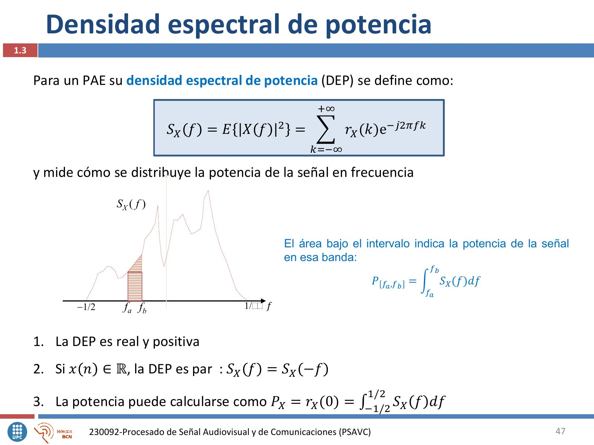

```text
        Densidad espectral de potencia
1.3


      Para un PAE su densidad espectral de potencia (DEP) se define como:
                                                                    +∞
                                                            2
                                𝑆𝑆𝑋𝑋 𝑓𝑓 = 𝐸𝐸 𝑋𝑋 𝑓𝑓              = � 𝑟𝑟𝑋𝑋 (𝑘𝑘)e−𝑗𝑗2𝜋𝜋𝜋𝜋𝜋𝜋
                                                                  𝑘𝑘=−∞

      y mide cómo se distribuye la potencia de la señal en frecuencia

                     SX ( f )


                                                            El área bajo el intervalo indica la potencia de la señal
                                                            en esa banda:
                                                                                                   𝑓𝑓𝑏𝑏
                                                                                   𝑃𝑃 𝑓𝑓𝑎𝑎,𝑓𝑓𝑏𝑏 = � 𝑆𝑆𝑋𝑋 (𝑓𝑓)𝑑𝑑𝑑𝑑
                                                                                                 𝑓𝑓𝑎𝑎
             −1/2      fa fb                      1/   𝑓𝑓


      1. La DEP es real y positiva
      2. Si 𝑥𝑥 𝑛𝑛 ∈ ℝ, la DEP es par : 𝑆𝑆𝑋𝑋 𝑓𝑓 = 𝑆𝑆𝑋𝑋 −𝑓𝑓
                                                                               1/2
      3. La potencia puede calcularse como 𝑃𝑃𝑋𝑋 = 𝑟𝑟𝑋𝑋 (0) = ∫−1/2 𝑆𝑆𝑋𝑋 𝑓𝑓 𝑑𝑑𝑑𝑑
               230092-Procesado de Señal Audiovisual y de Comunicaciones (PSAVC)                                    47
```

## Page 48

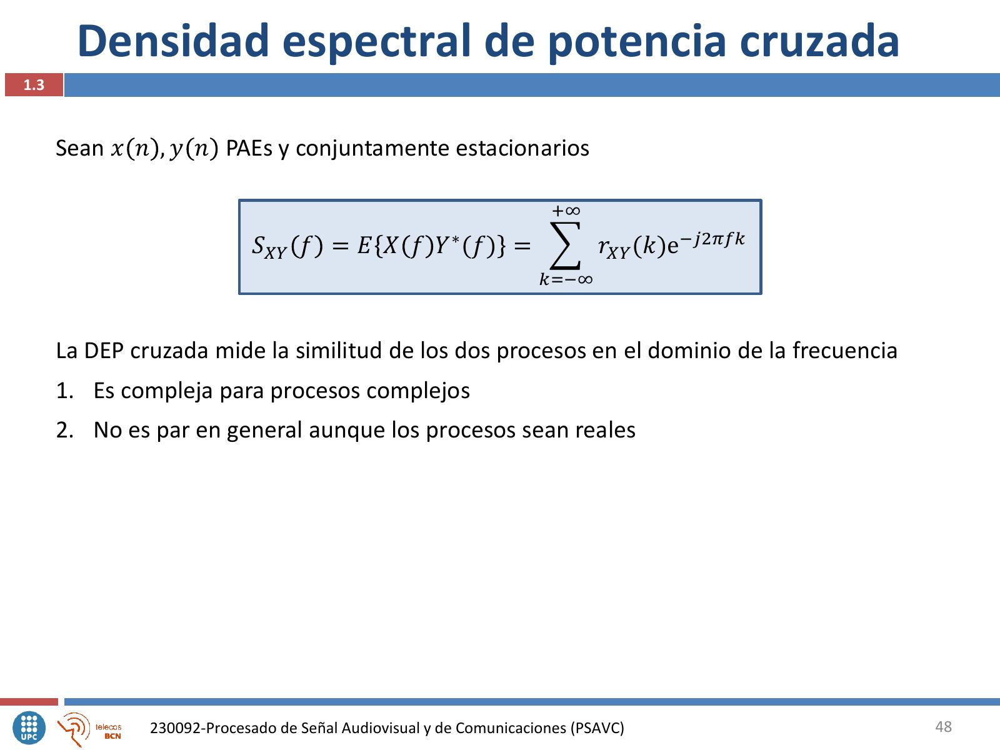

```text
        Densidad espectral de potencia cruzada
1.3


      Sean 𝑥𝑥 𝑛𝑛 , 𝑦𝑦 𝑛𝑛 PAEs y conjuntamente estacionarios

                                                                     +∞

                             𝑆𝑆𝑋𝑋𝑌𝑌 𝑓𝑓 = 𝐸𝐸 𝑋𝑋 𝑓𝑓 𝑌𝑌 ∗ (𝑓𝑓) = � 𝑟𝑟𝑋𝑋𝑌𝑌 (𝑘𝑘)e−𝑗𝑗2𝜋𝜋𝜋𝜋𝜋𝜋
                                                                    𝑘𝑘=−∞


      La DEP cruzada mide la similitud de los dos procesos en el dominio de la frecuencia
      1. Es compleja para procesos complejos
      2. No es par en general aunque los procesos sean reales


               230092-Procesado de Señal Audiovisual y de Comunicaciones (PSAVC)            48
```

## Page 49

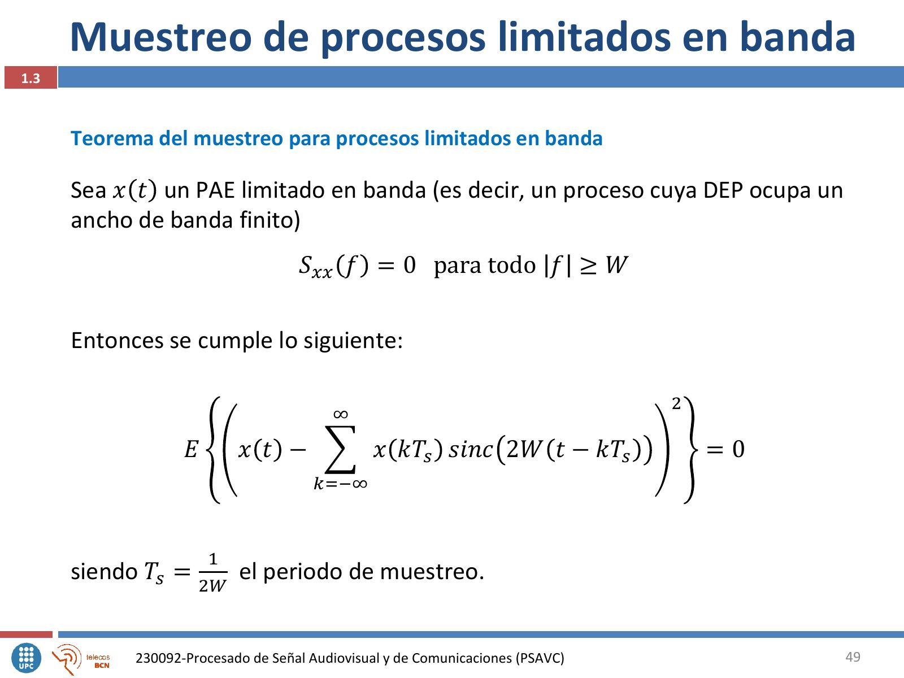

```text
      Muestreo de procesos limitados en banda
1.3


      Teorema del muestreo para procesos limitados en banda

      Sea 𝑥𝑥 𝑡𝑡 un PAE limitado en banda (es decir, un proceso cuya DEP ocupa un
      ancho de banda finito)
                                    𝑆𝑆𝑥𝑥𝑥𝑥 𝑓𝑓 = 0 para todo 𝑓𝑓 ≥ 𝑊𝑊

      Entonces se cumple lo siguiente:

                                                                                2
                                         ∞

                   𝐸𝐸      𝑥𝑥 𝑡𝑡 − � 𝑥𝑥 𝑘𝑘𝑇𝑇𝑠𝑠 𝑠𝑠𝑠𝑠𝑠𝑠𝑠𝑠 2𝑊𝑊 𝑡𝑡 − 𝑘𝑘𝑇𝑇𝑠𝑠             =0
                                      𝑘𝑘=−∞


                       1
      siendo 𝑇𝑇𝑠𝑠 =       el periodo de muestreo.
                      2𝑊𝑊


            230092-Procesado de Señal Audiovisual y de Comunicaciones (PSAVC)            49
```

## Page 50

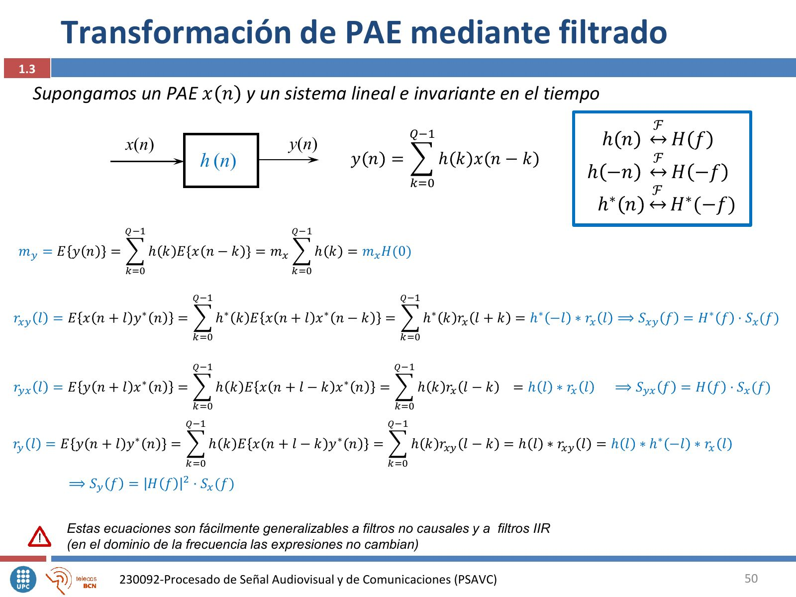

```text
          Transformación de PAE mediante filtrado
 1.3

    Supongamos un PAE 𝑥𝑥 𝑛𝑛 y un sistema lineal e invariante en el tiempo
                                                                                                                                 ℱ
                                                                                    𝑄𝑄−1
                        x(n)                              y(n)                                                          ℎ 𝑛𝑛 ↔ 𝐻𝐻 𝑓𝑓
                                           h (n)                     𝑦𝑦 𝑛𝑛 = � ℎ 𝑘𝑘 𝑥𝑥 𝑛𝑛 − 𝑘𝑘                                   ℱ
                                                                                    𝑘𝑘=0
                                                                                                                    ℎ −𝑛𝑛 ↔ 𝐻𝐻 −𝑓𝑓
                                                                                                                                 ℱ
                                                                                                                        ℎ∗ 𝑛𝑛 ↔ 𝐻𝐻 ∗ (−𝑓𝑓)
                        𝑄𝑄 −1                             𝑄𝑄−1

 𝑚𝑚𝑦𝑦 = 𝐸𝐸 𝑦𝑦 𝑛𝑛     = � ℎ 𝑘𝑘 𝐸𝐸{𝑥𝑥 𝑛𝑛 − 𝑘𝑘 } = 𝑚𝑚𝑥𝑥 � ℎ 𝑘𝑘 = 𝑚𝑚𝑥𝑥 𝐻𝐻(0)
                        𝑘𝑘=0                              𝑘𝑘=0

                                          𝑄𝑄−1                                  𝑄𝑄−1
                            ∗                     ∗              ∗
𝑟𝑟𝑥𝑥𝑥𝑥 𝑙𝑙 = 𝐸𝐸 𝑥𝑥 𝑛𝑛 + 𝑙𝑙 𝑦𝑦 𝑛𝑛      = � ℎ 𝑘𝑘 𝐸𝐸 𝑥𝑥 𝑛𝑛 + 𝑙𝑙 𝑥𝑥 𝑛𝑛 − 𝑘𝑘       = � ℎ∗ 𝑘𝑘 𝑟𝑟𝑥𝑥 𝑙𝑙 + 𝑘𝑘 = ℎ∗ −𝑙𝑙 ∗ 𝑟𝑟𝑥𝑥 𝑙𝑙 ⟹ 𝑆𝑆𝑥𝑥𝑥𝑥 𝑓𝑓 = 𝐻𝐻 ∗ 𝑓𝑓 · 𝑆𝑆𝑥𝑥 (𝑓𝑓)
                                          𝑘𝑘=0                                  𝑘𝑘=0

                                          𝑄𝑄−1                                 𝑄𝑄−1

𝑟𝑟𝑦𝑦𝑦𝑦 𝑙𝑙 = 𝐸𝐸 𝑦𝑦 𝑛𝑛 + 𝑙𝑙 𝑥𝑥 ∗ 𝑛𝑛    = � ℎ 𝑘𝑘 𝐸𝐸 𝑥𝑥 𝑛𝑛 + 𝑙𝑙 − 𝑘𝑘 𝑥𝑥 ∗ 𝑛𝑛    = � ℎ 𝑘𝑘 𝑟𝑟𝑥𝑥 𝑙𝑙 − 𝑘𝑘    = ℎ 𝑙𝑙 ∗ 𝑟𝑟𝑥𝑥 𝑙𝑙     ⟹ 𝑆𝑆𝑦𝑦𝑦𝑦 𝑓𝑓 = 𝐻𝐻 𝑓𝑓 · 𝑆𝑆𝑥𝑥 (𝑓𝑓)
                                          𝑘𝑘=0                                 𝑘𝑘=0
                                      𝑄𝑄−1                                   𝑄𝑄−1

𝑟𝑟𝑦𝑦 𝑙𝑙 = 𝐸𝐸 𝑦𝑦 𝑛𝑛 + 𝑙𝑙 𝑦𝑦 ∗ 𝑛𝑛     = � ℎ 𝑘𝑘 𝐸𝐸 𝑥𝑥 𝑛𝑛 + 𝑙𝑙 − 𝑘𝑘 𝑦𝑦 ∗ 𝑛𝑛    = � ℎ 𝑘𝑘 𝑟𝑟𝑥𝑥𝑥𝑥 𝑙𝑙 − 𝑘𝑘 = ℎ 𝑙𝑙 ∗ 𝑟𝑟𝑥𝑥𝑥𝑥 𝑙𝑙 = ℎ 𝑙𝑙 ∗ ℎ∗ −𝑙𝑙 ∗ 𝑟𝑟𝑥𝑥 𝑙𝑙
                                      𝑘𝑘=0                                   𝑘𝑘=0
                                      2
            ⟹ 𝑆𝑆𝑦𝑦 𝑓𝑓 = 𝐻𝐻 𝑓𝑓             · 𝑆𝑆𝑥𝑥 (𝑓𝑓)


           Estas ecuaciones son fácilmente generalizables a filtros no causales y a filtros IIR
           (en el dominio de la frecuencia las expresiones no cambian)

                       230092-Procesado de Señal Audiovisual y de Comunicaciones (PSAVC)                                                           50
```

## Page 51

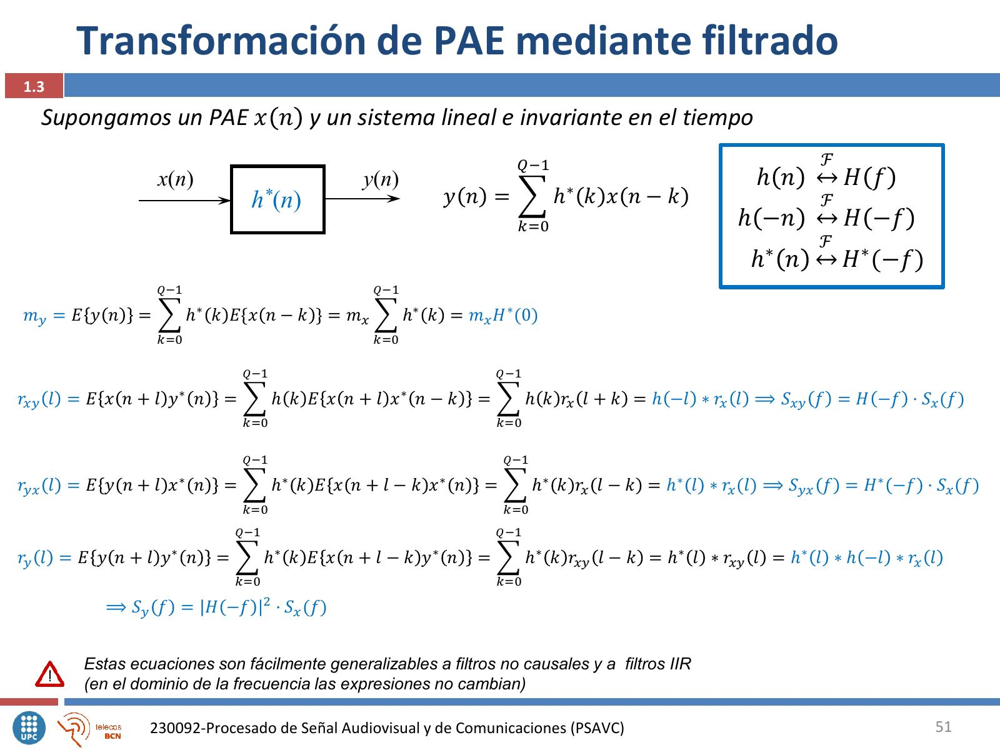

```text
          Transformación de PAE mediante filtrado
1.3

    Supongamos un PAE 𝑥𝑥 𝑛𝑛 y un sistema lineal e invariante en el tiempo
                                                                                  𝑄𝑄−1                                           ℱ
                        x(n)                                   y(n)                                                    ℎ 𝑛𝑛 ↔ 𝐻𝐻 𝑓𝑓
                                         h*(n)                         𝑦𝑦 𝑛𝑛 = � ℎ∗ 𝑘𝑘 𝑥𝑥 𝑛𝑛 − 𝑘𝑘                                ℱ
                                                                                  𝑘𝑘=0                              ℎ −𝑛𝑛 ↔ 𝐻𝐻 −𝑓𝑓
                                                                                                                                 ℱ
                                                                                                                      ℎ∗   𝑛𝑛 ↔ 𝐻𝐻 ∗ (−𝑓𝑓)
                        𝑄𝑄−1                                    𝑄𝑄−1

𝑚𝑚𝑦𝑦 = 𝐸𝐸 𝑦𝑦 𝑛𝑛      = � ℎ∗ 𝑘𝑘 𝐸𝐸{𝑥𝑥 𝑛𝑛 − 𝑘𝑘 } = 𝑚𝑚𝑥𝑥 � ℎ∗ 𝑘𝑘 = 𝑚𝑚𝑥𝑥 𝐻𝐻 ∗ (0)
                        𝑘𝑘=0                                    𝑘𝑘=0

                                       𝑄𝑄−1                                   𝑄𝑄−1

𝑟𝑟𝑥𝑥𝑥𝑥 𝑙𝑙 = 𝐸𝐸 𝑥𝑥 𝑛𝑛 + 𝑙𝑙 𝑦𝑦 ∗ 𝑛𝑛    = � ℎ 𝑘𝑘 𝐸𝐸 𝑥𝑥 𝑛𝑛 + 𝑙𝑙 𝑥𝑥 ∗ 𝑛𝑛 − 𝑘𝑘    = � ℎ 𝑘𝑘 𝑟𝑟𝑥𝑥 𝑙𝑙 + 𝑘𝑘 = ℎ −𝑙𝑙 ∗ 𝑟𝑟𝑥𝑥 𝑙𝑙 ⟹ 𝑆𝑆𝑥𝑥𝑥𝑥 𝑓𝑓 = 𝐻𝐻 −𝑓𝑓 · 𝑆𝑆𝑥𝑥 (𝑓𝑓)
                                       𝑘𝑘=0                                   𝑘𝑘=0

                                       𝑄𝑄−1                                    𝑄𝑄−1

𝑟𝑟𝑦𝑦𝑦𝑦 𝑙𝑙 = 𝐸𝐸 𝑦𝑦 𝑛𝑛 + 𝑙𝑙 𝑥𝑥 ∗ 𝑛𝑛    = � ℎ∗ 𝑘𝑘 𝐸𝐸 𝑥𝑥 𝑛𝑛 + 𝑙𝑙 − 𝑘𝑘 𝑥𝑥 ∗ 𝑛𝑛    = � ℎ∗ 𝑘𝑘 𝑟𝑟𝑥𝑥 𝑙𝑙 − 𝑘𝑘 = ℎ∗ 𝑙𝑙 ∗ 𝑟𝑟𝑥𝑥 (𝑙𝑙) ⟹ 𝑆𝑆𝑦𝑦𝑦𝑦 𝑓𝑓 = 𝐻𝐻 ∗ −𝑓𝑓 · 𝑆𝑆𝑥𝑥 (𝑓𝑓)
                                       𝑘𝑘=0                                    𝑘𝑘=0
                                      𝑄𝑄−1                                    𝑄𝑄−1

𝑟𝑟𝑦𝑦 𝑙𝑙 = 𝐸𝐸 𝑦𝑦 𝑛𝑛 + 𝑙𝑙 𝑦𝑦 ∗ 𝑛𝑛     = � ℎ∗ 𝑘𝑘 𝐸𝐸 𝑥𝑥 𝑛𝑛 + 𝑙𝑙 − 𝑘𝑘 𝑦𝑦 ∗ 𝑛𝑛    = � ℎ∗ 𝑘𝑘 𝑟𝑟𝑥𝑥𝑥𝑥 𝑙𝑙 − 𝑘𝑘 = ℎ∗ 𝑙𝑙 ∗ 𝑟𝑟𝑥𝑥𝑥𝑥 𝑙𝑙 = ℎ∗ 𝑙𝑙 ∗ ℎ −𝑙𝑙 ∗ 𝑟𝑟𝑥𝑥 𝑙𝑙
                                      𝑘𝑘=0                                    𝑘𝑘=0
                                             2
               ⟹ 𝑆𝑆𝑦𝑦 𝑓𝑓 = 𝐻𝐻 −𝑓𝑓                · 𝑆𝑆𝑥𝑥 (𝑓𝑓)


           Estas ecuaciones son fácilmente generalizables a filtros no causales y a filtros IIR
           (en el dominio de la frecuencia las expresiones no cambian)

                       230092-Procesado de Señal Audiovisual y de Comunicaciones (PSAVC)                                                           51
```

## Page 52

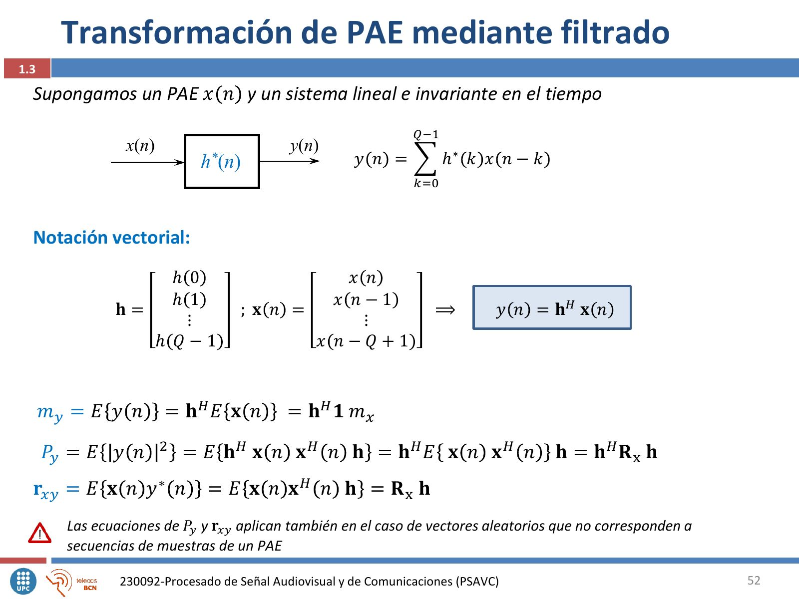

```text
         Transformación de PAE mediante filtrado
1.3

  Supongamos un PAE 𝑥𝑥 𝑛𝑛 y un sistema lineal e invariante en el tiempo
                                                                    𝑄𝑄−1
                   x(n)                        y(n)
                                h*(n)                     𝑦𝑦 𝑛𝑛 = � ℎ∗ 𝑘𝑘 𝑥𝑥 𝑛𝑛 − 𝑘𝑘
                                                                    𝑘𝑘=0


  Notación vectorial:
                        ℎ 0                             𝑥𝑥 𝑛𝑛
                        ℎ 1                          𝑥𝑥 𝑛𝑛 − 1
                 𝐡𝐡 =                   ; 𝐱𝐱 𝑛𝑛 =                       ⟹         𝑦𝑦 𝑛𝑛 = 𝐡𝐡𝐻𝐻 𝐱𝐱 𝑛𝑛
                          ⋮                                ⋮
                      ℎ 𝑄𝑄 − 1                    𝑥𝑥 𝑛𝑛 − 𝑄𝑄 + 1


      𝑚𝑚𝑦𝑦 = 𝐸𝐸 𝑦𝑦 𝑛𝑛     = 𝐡𝐡𝐻𝐻 𝐸𝐸 𝐱𝐱 𝑛𝑛     = 𝐡𝐡𝐻𝐻 𝟏𝟏 𝑚𝑚𝑥𝑥
                          2
      𝑃𝑃𝑦𝑦 = 𝐸𝐸 𝑦𝑦 𝑛𝑛         = 𝐸𝐸 𝐡𝐡𝐻𝐻 𝐱𝐱 𝑛𝑛 𝐱𝐱 𝐻𝐻 𝑛𝑛 𝐡𝐡 = 𝐡𝐡𝐻𝐻 𝐸𝐸 𝐱𝐱 𝑛𝑛 𝐱𝐱 𝐻𝐻 𝑛𝑛         𝐡𝐡 = 𝐡𝐡𝐻𝐻 𝐑𝐑 x 𝐡𝐡
  𝐫𝐫𝑥𝑥𝑥𝑥 = 𝐸𝐸 𝐱𝐱 𝑛𝑛 𝑦𝑦 ∗ 𝑛𝑛      = 𝐸𝐸 𝐱𝐱 𝑛𝑛 𝐱𝐱 𝐻𝐻 𝑛𝑛 𝐡𝐡 = 𝐑𝐑 x 𝐡𝐡
          Las ecuaciones de 𝑃𝑃𝑦𝑦 y 𝐫𝐫𝑥𝑥𝑥𝑥 aplican también en el caso de vectores aleatorios que no corresponden a
          secuencias de muestras de un PAE

                  230092-Procesado de Señal Audiovisual y de Comunicaciones (PSAVC)                                 52
```

## Page 53

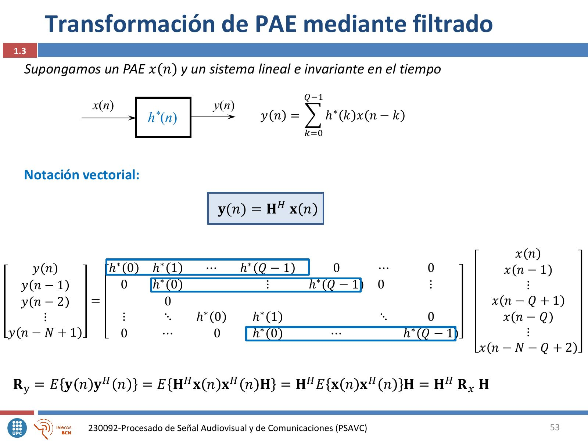

```text
       Transformación de PAE mediante filtrado
 1.3

   Supongamos un PAE 𝑥𝑥 𝑛𝑛 y un sistema lineal e invariante en el tiempo
                                                                   𝑄𝑄−1
                  x(n)                        y(n)
                              h*(n)                        𝑦𝑦 𝑛𝑛 = � ℎ∗ 𝑘𝑘 𝑥𝑥 𝑛𝑛 − 𝑘𝑘
                                                                   𝑘𝑘=0


   Notación vectorial:

                                                𝐲𝐲(𝑛𝑛) = 𝐇𝐇 𝐻𝐻 𝐱𝐱 𝑛𝑛


                                                                                                             𝑥𝑥 𝑛𝑛
                         ∗       ∗                    ∗
      𝑦𝑦 𝑛𝑛          ℎ 0        ℎ 1         ⋯        ℎ 𝑄𝑄 − 1          0             ⋯        0           𝑥𝑥 𝑛𝑛 − 1
   𝑦𝑦 𝑛𝑛 − 1          0         ℎ∗ 0                     ⋮             ∗
                                                                    ℎ 𝑄𝑄 − 1         0        ⋮                 ⋮
   𝑦𝑦 𝑛𝑛 − 2     =                0                                                                    𝑥𝑥 𝑛𝑛 − 𝑄𝑄 + 1
         ⋮               ⋮        ⋱       ℎ∗ 0            ℎ∗ 1                       ⋱      0             𝑥𝑥 𝑛𝑛 − 𝑄𝑄
𝑦𝑦 𝑛𝑛 − 𝑁𝑁 + 1           0       ⋯           0            ℎ∗ 0             ⋯              ∗
                                                                                         ℎ 𝑄𝑄 − 1               ⋮
                                                                                                    𝑥𝑥 𝑛𝑛 − 𝑁𝑁 − 𝑄𝑄 + 2

𝐑𝐑 y = 𝐸𝐸 𝐲𝐲 𝑛𝑛 𝐲𝐲 𝐻𝐻 𝑛𝑛     = 𝐸𝐸 𝐇𝐇 𝐻𝐻 𝐱𝐱 𝑛𝑛 𝐱𝐱 𝐻𝐻 𝑛𝑛 𝐇𝐇 = 𝐇𝐇𝐻𝐻 𝐸𝐸 𝐱𝐱 𝑛𝑛 𝐱𝐱 𝐻𝐻 𝑛𝑛 𝐇𝐇 = 𝐇𝐇 𝐻𝐻 𝐑𝐑 𝑥𝑥 𝐇𝐇

                 230092-Procesado de Señal Audiovisual y de Comunicaciones (PSAVC)                                53
```

## Page 54

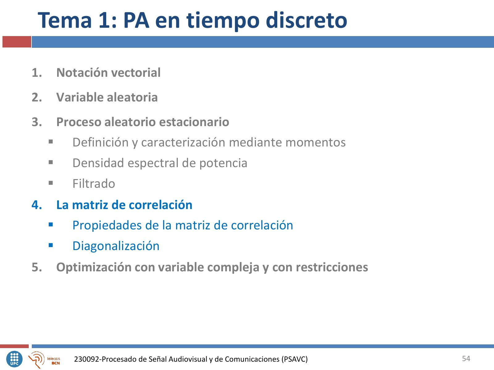

```text
 Tema 1: PA en tiempo discreto
1.    Notación vectorial
2.    Variable aleatoria
3.    Proceso aleatorio estacionario
      Definición y caracterización mediante momentos
      Densidad espectral de potencia
      Filtrado
4.    La matriz de correlación
      Propiedades de la matriz de correlación
      Diagonalización
5.    Optimización con variable compleja y con restricciones


         230092-Procesado de Señal Audiovisual y de Comunicaciones (PSAVC)   54
```

## Page 55

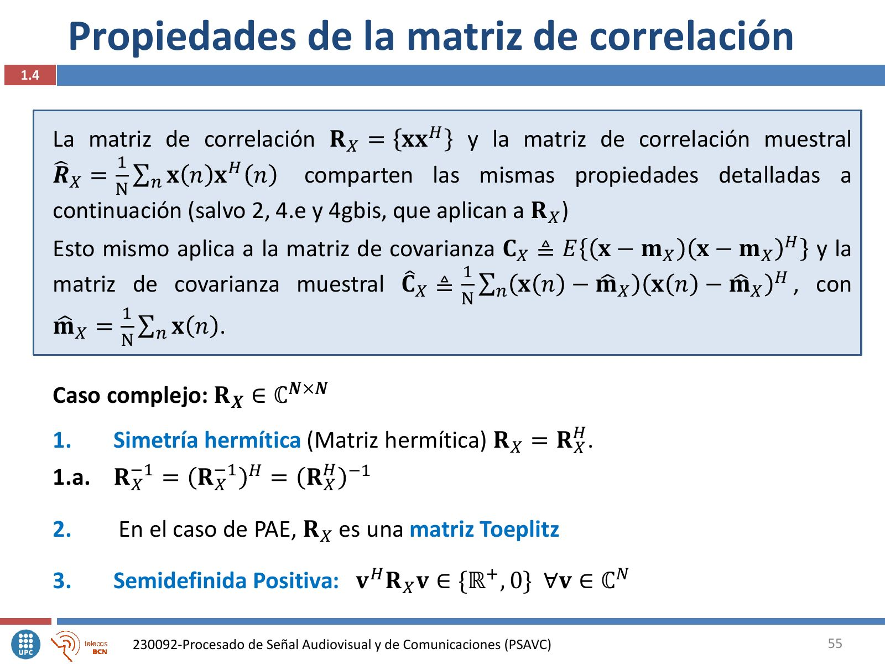

```text
       Propiedades de la matriz de correlación
1.4


      La matriz de correlación 𝐑𝐑𝑋𝑋 = 𝐱𝐱𝐱𝐱 𝐻𝐻 y la matriz de correlación muestral
      � 𝑋𝑋 = 1 ∑𝑛𝑛 𝐱𝐱 𝑛𝑛 𝐱𝐱 𝐻𝐻 𝑛𝑛 comparten las mismas propiedades detalladas a
      𝑹𝑹
             N
      continuación (salvo 2, 4.e y 4gbis, que aplican a 𝐑𝐑𝑋𝑋 )
      Esto mismo aplica a la matriz de covarianza 𝐂𝐂𝑋𝑋 ≜ 𝐸𝐸 𝐱𝐱 − 𝐦𝐦𝑋𝑋 𝐱𝐱 − 𝐦𝐦𝑋𝑋 𝐻𝐻 y la
                                              1
      matriz de covarianza muestral 𝐂𝐂�𝑋𝑋 ≜ ∑𝑛𝑛 𝐱𝐱 𝑛𝑛 − 𝐦𝐦                � 𝑋𝑋 𝐻𝐻 , con
                                                            � 𝑋𝑋 𝐱𝐱 𝑛𝑛 − 𝐦𝐦
                                                                N
             1
       � 𝑋𝑋 = ∑𝑛𝑛 𝐱𝐱 𝑛𝑛 .
      𝐦𝐦
             N


      Caso complejo: 𝐑𝐑 𝑿𝑿 ∈ ℂ𝑵𝑵×𝑵𝑵
      1.    Simetría hermítica (Matriz hermítica) 𝐑𝐑𝑋𝑋 = 𝐑𝐑𝐻𝐻
                                                           𝑋𝑋 .
      1.a. 𝐑𝐑−1     −1 𝐻𝐻
             𝑋𝑋 = 𝐑𝐑 𝑋𝑋   = 𝐑𝐑𝐻𝐻
                              𝑋𝑋
                                 −1


      2.     En el caso de PAE, 𝐑𝐑𝑋𝑋 es una matriz Toeplitz

      3.    Semidefinida Positiva: 𝐯𝐯 𝐻𝐻 𝐑𝐑𝑋𝑋 𝐯𝐯 ∈ {ℝ+ , 0} ∀𝐯𝐯 ∈ ℂ𝑁𝑁

              230092-Procesado de Señal Audiovisual y de Comunicaciones (PSAVC)     55
```

## Page 56

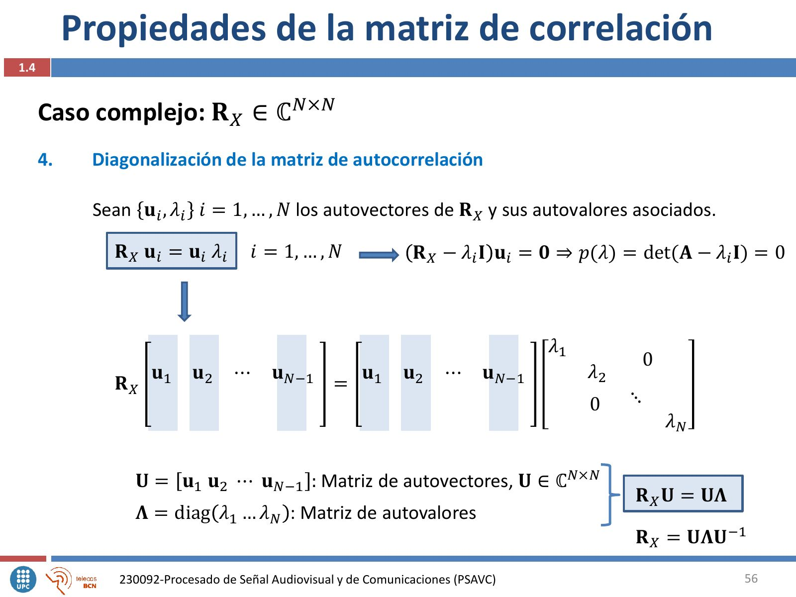

```text
           Propiedades de la matriz de correlación
1.4


      Caso complejo: 𝐑𝐑𝑋𝑋 ∈ ℂ𝑁𝑁×𝑁𝑁
      4.    Diagonalización de la matriz de autocorrelación

            Sean 𝐮𝐮𝑖𝑖 , 𝜆𝜆𝑖𝑖 𝑖𝑖 = 1, … , 𝑁𝑁 los autovectores de 𝐑𝐑𝑋𝑋 y sus autovalores asociados.

              𝐑𝐑𝑋𝑋 𝐮𝐮𝑖𝑖 = 𝐮𝐮𝑖𝑖 𝜆𝜆𝑖𝑖   𝑖𝑖 = 1, … , 𝑁𝑁             𝐑𝐑𝑋𝑋 − 𝜆𝜆𝑖𝑖 𝐈𝐈 𝐮𝐮𝑖𝑖 = 𝟎𝟎 ⇒ 𝑝𝑝(𝜆𝜆) = det(𝐀𝐀 − 𝜆𝜆𝑖𝑖 𝐈𝐈) = 0


                                                                                      𝜆𝜆1
                                                                                                      0
                     𝐮𝐮1    𝐮𝐮2       ⋯   𝐮𝐮𝑁𝑁−1        𝐮𝐮1    𝐮𝐮2     ⋯     𝐮𝐮𝑁𝑁−1         𝜆𝜆2
              𝐑𝐑𝑋𝑋                                 =
                                                                                            0     ⋱
                                                                                                          𝜆𝜆𝑁𝑁


                 𝐔𝐔 = 𝐮𝐮1 𝐮𝐮2 ⋯ 𝐮𝐮𝑁𝑁−1 : Matriz de autovectores, 𝐔𝐔 ∈ ℂ𝑁𝑁×𝑁𝑁
                                                                                                   𝐑𝐑𝑋𝑋 𝐔𝐔 = 𝐔𝐔𝚲𝚲
                 𝚲𝚲 = diag 𝜆𝜆1 … 𝜆𝜆𝑁𝑁 : Matriz de autovalores
                                                                                                   𝐑𝐑𝑋𝑋 = 𝐔𝐔𝚲𝚲𝐔𝐔−1

               230092-Procesado de Señal Audiovisual y de Comunicaciones (PSAVC)                                    56
```

## Page 57

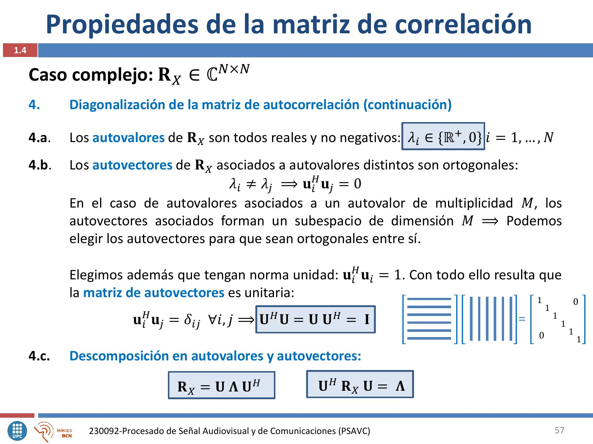

```text
           Propiedades de la matriz de correlación
1.4

      Caso complejo: 𝐑𝐑𝑋𝑋 ∈ ℂ𝑁𝑁×𝑁𝑁
      4.     Diagonalización de la matriz de autocorrelación (continuación)

      4.a.   Los autovalores de 𝐑𝐑𝑋𝑋 son todos reales y no negativos: 𝜆𝜆𝑖𝑖 ∈ {ℝ+ , 0} 𝑖𝑖 = 1, … , 𝑁𝑁
      4.b.   Los autovectores de 𝐑𝐑𝑋𝑋 asociados a autovalores distintos son ortogonales:
                                        𝜆𝜆𝑖𝑖 ≠ 𝜆𝜆𝑗𝑗 ⟹ 𝐮𝐮𝐻𝐻
                                                        𝑖𝑖 𝐮𝐮𝑗𝑗 = 0
             En el caso de autovalores asociados a un autovalor de multiplicidad 𝑀𝑀, los
             autovectores asociados forman un subespacio de dimensión 𝑀𝑀 ⟹ Podemos
             elegir los autovectores para que sean ortogonales entre sí.

             Elegimos además que tengan norma unidad: 𝐮𝐮𝐻𝐻
                                                        𝑖𝑖 𝐮𝐮𝑖𝑖 = 1. Con todo ello resulta que
             la matriz de autovectores es unitaria:                                       1                      0
                                                                                                     1
                          𝐮𝐮𝐻𝐻                           𝐻𝐻         𝐻𝐻
                            𝑖𝑖 𝐮𝐮𝑗𝑗 = 𝛿𝛿𝑖𝑖𝑖𝑖 ∀𝑖𝑖, 𝑗𝑗 ⟹ 𝐔𝐔 𝐔𝐔 = 𝐔𝐔 𝐔𝐔 = 𝐈𝐈                    =           1
                                                                                                             1
                                                                                                 0               1
                                                                                                                     1
      4.c.   Descomposición en autovalores y autovectores:

                                    𝐑𝐑𝑋𝑋 = 𝐔𝐔 𝚲𝚲 𝐔𝐔 𝐻𝐻              𝐔𝐔 𝐻𝐻 𝐑𝐑𝑋𝑋 𝐔𝐔 = 𝚲𝚲

                230092-Procesado de Señal Audiovisual y de Comunicaciones (PSAVC)                        57
```

## Page 58

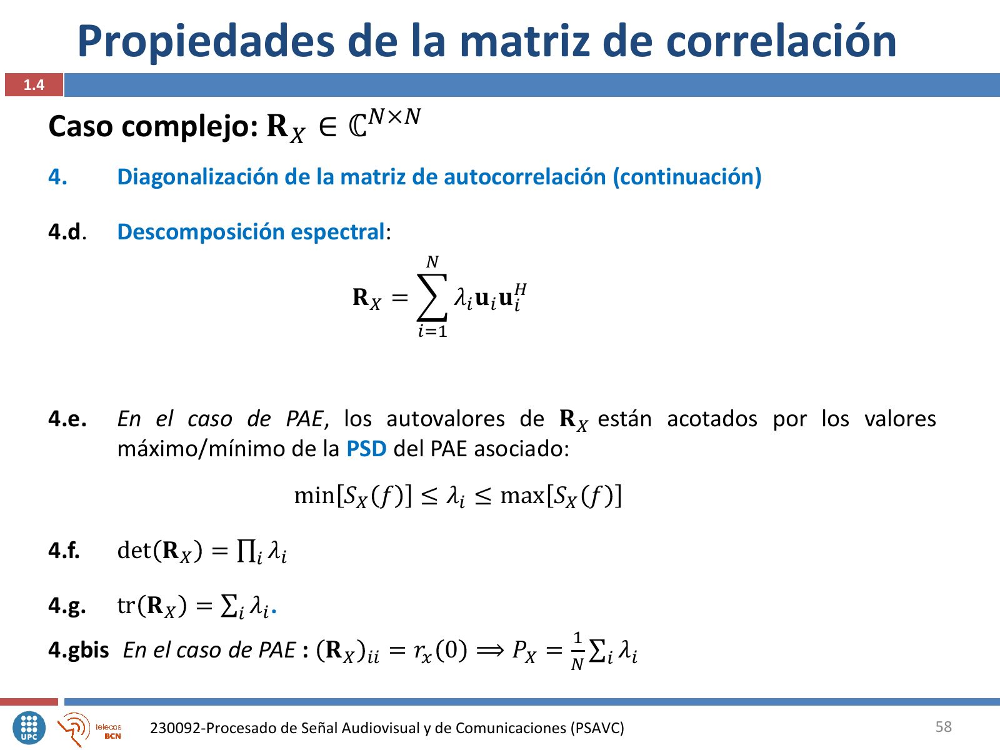

```text
           Propiedades de la matriz de correlación
1.4

      Caso complejo: 𝐑𝐑𝑋𝑋 ∈ ℂ𝑁𝑁×𝑁𝑁
      4.     Diagonalización de la matriz de autocorrelación (continuación)

      4.d.   Descomposición espectral:
                                                      𝑁𝑁

                                            𝐑𝐑𝑋𝑋 = � 𝜆𝜆𝑖𝑖 𝐮𝐮𝑖𝑖 𝐮𝐮𝐻𝐻
                                                                 𝑖𝑖
                                                     𝑖𝑖=1


      4.e.   En el caso de PAE, los autovalores de 𝐑𝐑𝑋𝑋 están acotados por los valores
             máximo/mínimo de la PSD del PAE asociado:
                                    min 𝑆𝑆𝑋𝑋 𝑓𝑓       ≤ 𝜆𝜆𝑖𝑖 ≤ max 𝑆𝑆𝑋𝑋 𝑓𝑓

      4.f.   det 𝐑𝐑𝑋𝑋 = ∏𝑖𝑖 𝜆𝜆𝑖𝑖

      4.g.   tr 𝐑𝐑𝑋𝑋 = ∑𝑖𝑖 𝜆𝜆𝑖𝑖 .
                                                                          1
      4.gbis En el caso de PAE : 𝐑𝐑𝑋𝑋 𝑖𝑖𝑖𝑖 = 𝑟𝑟𝑥𝑥 0 ⟹ 𝑃𝑃𝑋𝑋 = 𝑁𝑁 ∑𝑖𝑖 𝜆𝜆𝑖𝑖


                 230092-Procesado de Señal Audiovisual y de Comunicaciones (PSAVC)   58
```

## Page 59

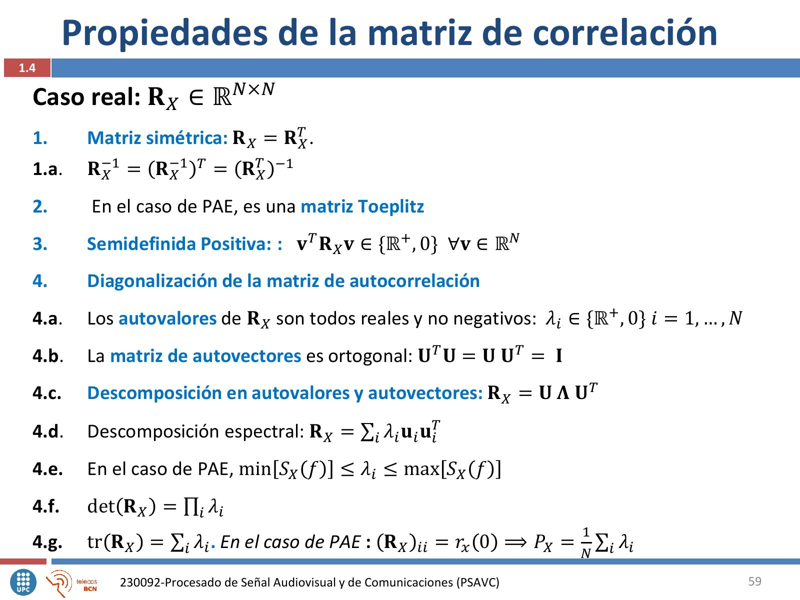

```text
         Propiedades de la matriz de correlación
1.4

  Caso real: 𝐑𝐑𝑋𝑋 ∈ ℝ𝑁𝑁×𝑁𝑁
  1.      Matriz simétrica: 𝐑𝐑𝑋𝑋 = 𝐑𝐑𝑇𝑇𝑋𝑋 .
  1.a.    𝐑𝐑−1     −1 𝑇𝑇
            𝑋𝑋 = 𝐑𝐑𝑋𝑋    = 𝐑𝐑𝑇𝑇𝑋𝑋 −1
  2.      En el caso de PAE, es una matriz Toeplitz
  3.      Semidefinida Positiva: : 𝐯𝐯 𝑇𝑇 𝐑𝐑𝑋𝑋 𝐯𝐯 ∈ {ℝ+ , 0} ∀𝐯𝐯 ∈ ℝ𝑁𝑁
  4.      Diagonalización de la matriz de autocorrelación
  4.a.    Los autovalores de 𝐑𝐑𝑋𝑋 son todos reales y no negativos: 𝜆𝜆𝑖𝑖 ∈ {ℝ+ , 0} 𝑖𝑖 = 1, … , 𝑁𝑁
  4.b.    La matriz de autovectores es ortogonal: 𝐔𝐔𝑇𝑇 𝐔𝐔 = 𝐔𝐔 𝐔𝐔𝑇𝑇 = 𝐈𝐈
  4.c.    Descomposición en autovalores y autovectores: 𝐑𝐑𝑋𝑋 = 𝐔𝐔 𝚲𝚲 𝐔𝐔 𝑇𝑇
  4.d.    Descomposición espectral: 𝐑𝐑𝑋𝑋 = ∑𝑖𝑖 𝜆𝜆𝑖𝑖 𝐮𝐮𝑖𝑖 𝐮𝐮𝑇𝑇𝑖𝑖
  4.e.    En el caso de PAE, min 𝑆𝑆𝑋𝑋 𝑓𝑓           ≤ 𝜆𝜆𝑖𝑖 ≤ max 𝑆𝑆𝑋𝑋 𝑓𝑓
  4.f.    det 𝐑𝐑𝑋𝑋 = ∏𝑖𝑖 𝜆𝜆𝑖𝑖
                                                                                  1
  4.g.    tr 𝐑𝐑𝑋𝑋 = ∑𝑖𝑖 𝜆𝜆𝑖𝑖 . En el caso de PAE : 𝐑𝐑𝑋𝑋 𝑖𝑖𝑖𝑖 = 𝑟𝑟𝑥𝑥 0 ⟹ 𝑃𝑃𝑋𝑋 =      ∑ 𝜆𝜆
                                                                                  𝑁𝑁 𝑖𝑖 𝑖𝑖
              230092-Procesado de Señal Audiovisual y de Comunicaciones (PSAVC)                     59
```

## Page 60

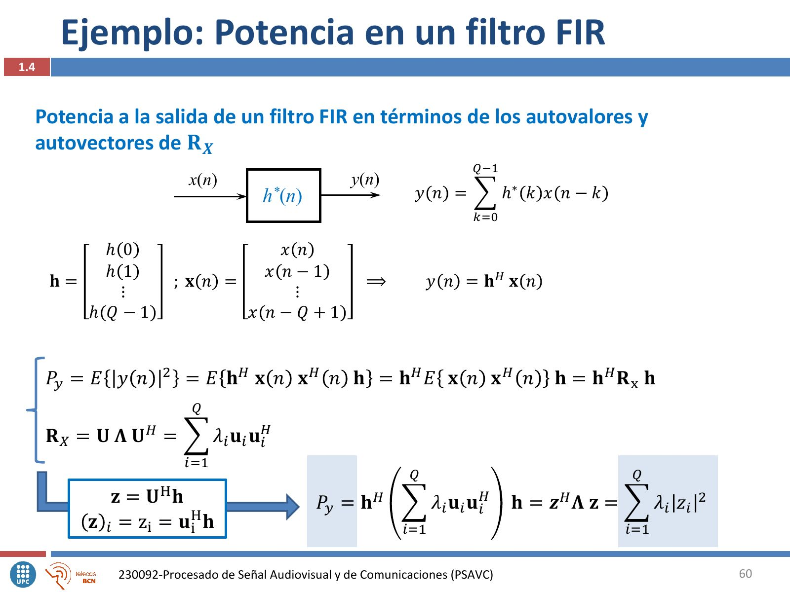

```text
        Ejemplo: Potencia en un filtro FIR
1.4


  Potencia a la salida de un filtro FIR en términos de los autovalores y
  autovectores de 𝐑𝐑 𝑿𝑿
                                                                               𝑄𝑄−1
                              x(n)                       y(n)
                                          h*(n)                     𝑦𝑦 𝑛𝑛 = � ℎ∗ 𝑘𝑘 𝑥𝑥 𝑛𝑛 − 𝑘𝑘
                                                                               𝑘𝑘=0

             ℎ 0                            𝑥𝑥 𝑛𝑛
             ℎ 1                         𝑥𝑥 𝑛𝑛 − 1
      𝐡𝐡 =                  ; 𝐱𝐱 𝑛𝑛 =                      ⟹            𝑦𝑦 𝑛𝑛 = 𝐡𝐡𝐻𝐻 𝐱𝐱 𝑛𝑛
               ⋮                               ⋮
           ℎ 𝑄𝑄 − 1                   𝑥𝑥 𝑛𝑛 − 𝑄𝑄 + 1


                        2
      𝑃𝑃𝑦𝑦 = 𝐸𝐸 𝑦𝑦 𝑛𝑛        = 𝐸𝐸 𝐡𝐡𝐻𝐻 𝐱𝐱 𝑛𝑛 𝐱𝐱 𝐻𝐻 𝑛𝑛 𝐡𝐡 = 𝐡𝐡𝐻𝐻 𝐸𝐸 𝐱𝐱 𝑛𝑛 𝐱𝐱 𝐻𝐻 𝑛𝑛            𝐡𝐡 = 𝐡𝐡𝐻𝐻 𝐑𝐑 x 𝐡𝐡
                              𝑄𝑄

      𝐑𝐑𝑋𝑋 = 𝐔𝐔 𝚲𝚲 𝐔𝐔𝐻𝐻 = � 𝜆𝜆𝑖𝑖 𝐮𝐮𝑖𝑖 𝐮𝐮𝐻𝐻
                                        𝑖𝑖
                             𝑖𝑖=1
                                                                   𝑄𝑄                                     𝑄𝑄
                 𝐳𝐳 = 𝐔𝐔 H 𝐡𝐡                      𝑃𝑃𝑦𝑦 = 𝐡𝐡𝐻𝐻 � 𝜆𝜆𝑖𝑖 𝐮𝐮𝑖𝑖 𝐮𝐮𝐻𝐻       𝐡𝐡 = 𝒛𝒛𝐻𝐻 𝚲𝚲 𝐳𝐳 = � 𝜆𝜆𝑖𝑖 𝑧𝑧𝑖𝑖 2
                                                                             𝑖𝑖
            𝐳𝐳 𝑖𝑖 = zi = 𝐮𝐮H  i 𝐡𝐡                                𝑖𝑖=1                                  𝑖𝑖=1


                 230092-Procesado de Señal Audiovisual y de Comunicaciones (PSAVC)                                      60
```

## Page 61

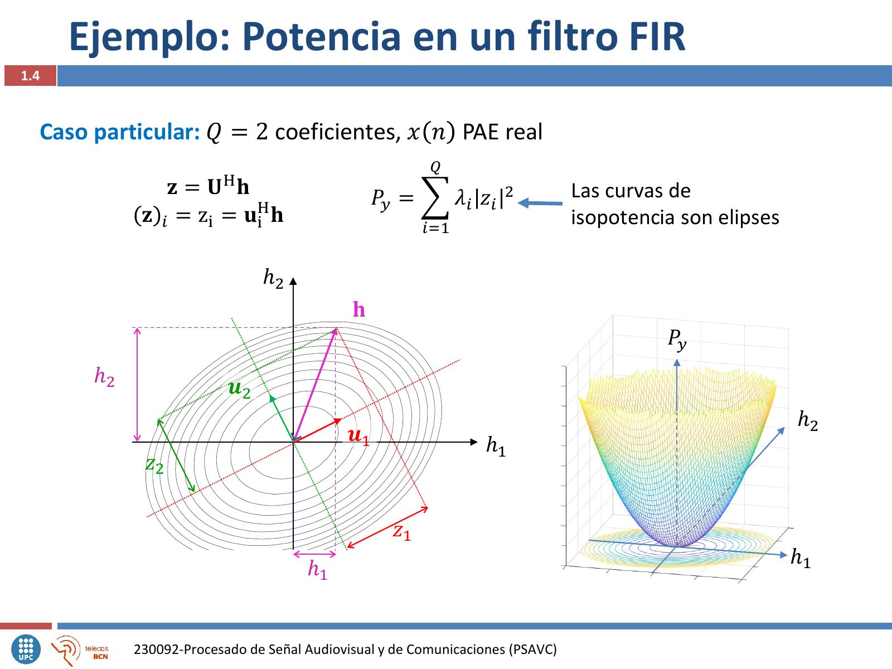

```text
      Ejemplo: Potencia en un filtro FIR
1.4


  Caso particular: 𝑄𝑄 = 2 coeficientes, 𝑥𝑥 𝑛𝑛 PAE real
                                                            𝑄𝑄
                         H
                  𝐳𝐳 = 𝐔𝐔 𝐡𝐡                      𝑃𝑃𝑦𝑦 = � 𝜆𝜆𝑖𝑖 𝑧𝑧𝑖𝑖 2          Las curvas de
             𝐳𝐳 𝑖𝑖 = zi = 𝐮𝐮Hi 𝐡𝐡                          𝑖𝑖=1
                                                                                isopotencia son elipses

                                ℎ2
                                             𝐡𝐡
                                                                                          𝑃𝑃𝑦𝑦
       ℎ2
                          𝒖𝒖2
                                                                                                          ℎ2
                                            𝒖𝒖1                   ℎ1
             𝑧𝑧2

                                                     𝑧𝑧1
                                                                                                          ℎ1
                                      ℎ1


            230092-Procesado de Señal Audiovisual y de Comunicaciones (PSAVC)
```

## Page 62

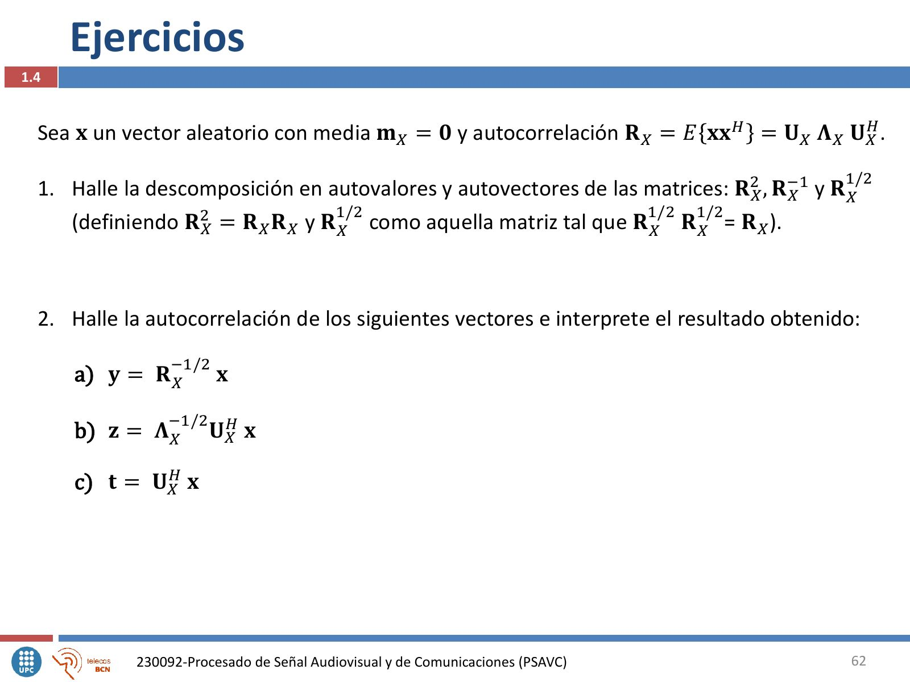

```text
      Ejercicios
1.4


  Sea 𝐱𝐱 un vector aleatorio con media 𝐦𝐦𝑋𝑋 = 𝟎𝟎 y autocorrelación 𝐑𝐑𝑋𝑋 = 𝐸𝐸 𝐱𝐱𝐱𝐱 𝐻𝐻 = 𝐔𝐔𝑋𝑋 𝚲𝚲𝑋𝑋 𝐔𝐔𝑋𝑋𝐻𝐻 .
                                                                                                    1/2
  1. Halle la descomposición en autovalores y autovectores de las matrices: 𝐑𝐑2𝑋𝑋 , 𝐑𝐑−1  𝑋𝑋 y 𝐑𝐑𝑋𝑋
                                       1/2                              1/2 1/2
     (definiendo 𝐑𝐑2𝑋𝑋 = 𝐑𝐑𝑋𝑋 𝐑𝐑𝑋𝑋 y 𝐑𝐑𝑋𝑋 como aquella matriz tal que 𝐑𝐑𝑋𝑋 𝐑𝐑𝑋𝑋 = 𝐑𝐑𝑋𝑋 ).


  2. Halle la autocorrelación de los siguientes vectores e interprete el resultado obtenido:
                   −1/2
      a) 𝐲𝐲 = 𝐑𝐑𝑋𝑋         𝐱𝐱
                  −1/2
      b) 𝐳𝐳 = 𝚲𝚲𝑋𝑋        𝐔𝐔𝑋𝑋𝐻𝐻 𝐱𝐱

      c) 𝐭𝐭 = 𝐔𝐔𝑋𝑋𝐻𝐻 𝐱𝐱


              230092-Procesado de Señal Audiovisual y de Comunicaciones (PSAVC)                     62
```

## Page 63

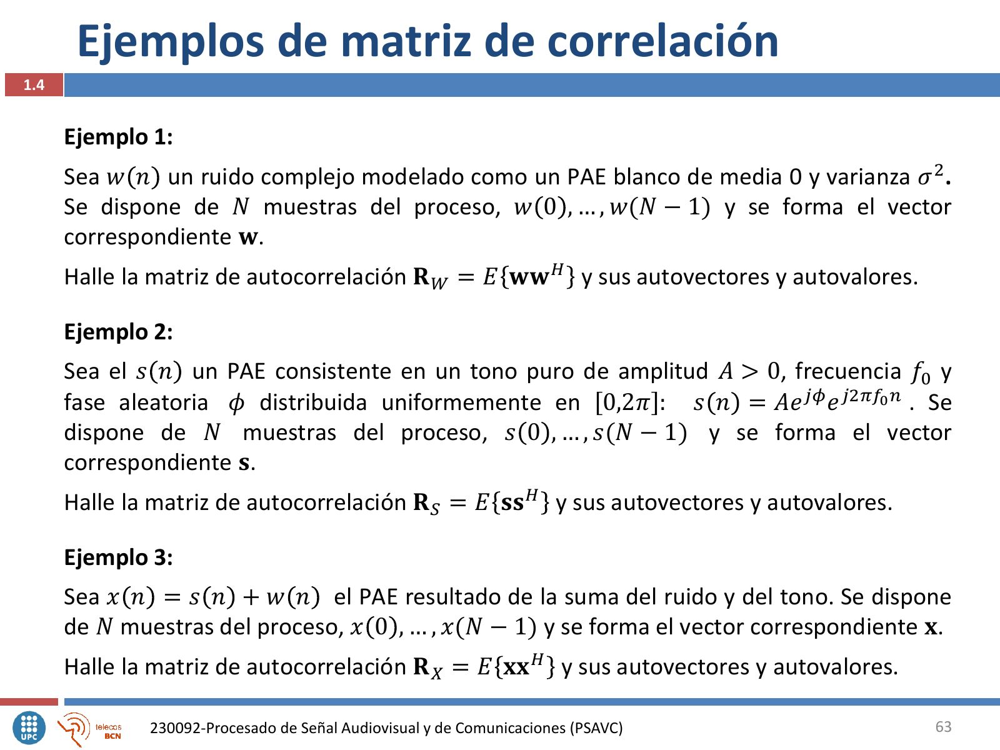

```text
       Ejemplos de matriz de correlación
1.4


      Ejemplo 1:
      Sea 𝑤𝑤 𝑛𝑛 un ruido complejo modelado como un PAE blanco de media 0 y varianza 𝜎𝜎 2 .
      Se dispone de 𝑁𝑁 muestras del proceso, 𝑤𝑤 0 , … , 𝑤𝑤(𝑁𝑁 − 1) y se forma el vector
      correspondiente 𝐰𝐰.
      Halle la matriz de autocorrelación 𝐑𝐑 𝑊𝑊 = 𝐸𝐸 𝐰𝐰𝐰𝐰 𝐻𝐻 y sus autovectores y autovalores.

      Ejemplo 2:
      Sea el 𝑠𝑠 𝑛𝑛 un PAE consistente en un tono puro de amplitud 𝐴𝐴 > 0, frecuencia 𝑓𝑓0 y
      fase aleatoria 𝜙𝜙 distribuida uniformemente en 0,2𝜋𝜋 : 𝑠𝑠 𝑛𝑛 = 𝐴𝐴𝑒𝑒 𝑗𝑗𝑗𝑗 𝑒𝑒 𝑗𝑗2𝜋𝜋𝑓𝑓0 𝑛𝑛 . Se
      dispone de 𝑁𝑁 muestras del proceso, 𝑠𝑠 0 , … , 𝑠𝑠(𝑁𝑁 − 1) y se forma el vector
      correspondiente 𝐬𝐬.
      Halle la matriz de autocorrelación 𝐑𝐑𝑆𝑆 = 𝐸𝐸 𝐬𝐬𝐬𝐬 𝐻𝐻 y sus autovectores y autovalores.

      Ejemplo 3:
      Sea 𝑥𝑥 𝑛𝑛 = 𝑠𝑠 𝑛𝑛 + 𝑤𝑤 𝑛𝑛 el PAE resultado de la suma del ruido y del tono. Se dispone
      de 𝑁𝑁 muestras del proceso, 𝑥𝑥 0 , … , 𝑥𝑥(𝑁𝑁 − 1) y se forma el vector correspondiente 𝐱𝐱.
      Halle la matriz de autocorrelación 𝐑𝐑𝑋𝑋 = 𝐸𝐸 𝐱𝐱𝐱𝐱 𝐻𝐻 y sus autovectores y autovalores.

              230092-Procesado de Señal Audiovisual y de Comunicaciones (PSAVC)                 63
```

## Page 64

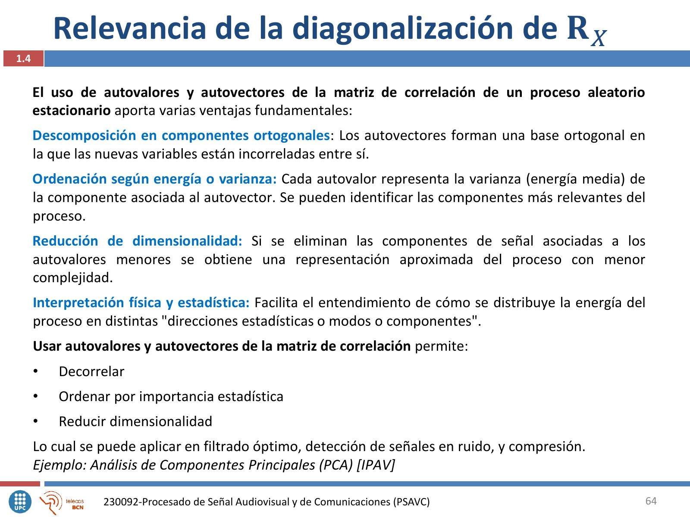

```text
          Relevancia de la diagonalización de 𝐑𝐑𝑋𝑋
1.4


      El uso de autovalores y autovectores de la matriz de correlación de un proceso aleatorio
      estacionario aporta varias ventajas fundamentales:
      Descomposición en componentes ortogonales: Los autovectores forman una base ortogonal en
      la que las nuevas variables están incorreladas entre sí.
      Ordenación según energía o varianza: Cada autovalor representa la varianza (energía media) de
      la componente asociada al autovector. Se pueden identificar las componentes más relevantes del
      proceso.
      Reducción de dimensionalidad: Si se eliminan las componentes de señal asociadas a los
      autovalores menores se obtiene una representación aproximada del proceso con menor
      complejidad.
      Interpretación física y estadística: Facilita el entendimiento de cómo se distribuye la energía del
      proceso en distintas "direcciones estadísticas o modos o componentes".
      Usar autovalores y autovectores de la matriz de correlación permite:
      •   Decorrelar
      •   Ordenar por importancia estadística
      •   Reducir dimensionalidad
      Lo cual se puede aplicar en filtrado óptimo, detección de señales en ruido, y compresión.
      Ejemplo: Análisis de Componentes Principales (PCA) [IPAV]

                 230092-Procesado de Señal Audiovisual y de Comunicaciones (PSAVC)                      64
```

## Page 65

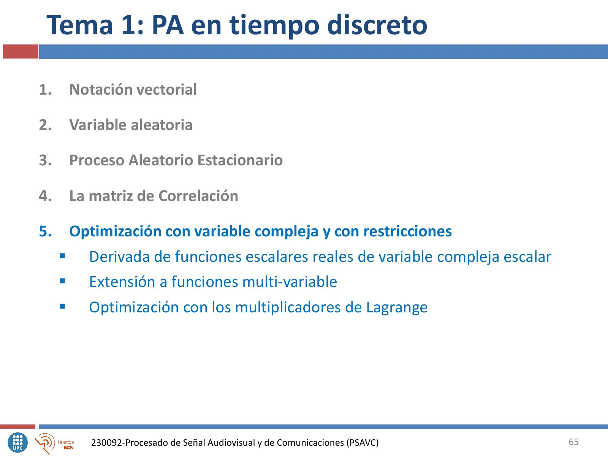

```text
 Tema 1: PA en tiempo discreto
1.    Notación vectorial

2.    Variable aleatoria

3.    Proceso Aleatorio Estacionario

4.    La matriz de Correlación

5.    Optimización con variable compleja y con restricciones
      Derivada de funciones escalares reales de variable compleja escalar
      Extensión a funciones multi-variable
      Optimización con los multiplicadores de Lagrange


         230092-Procesado de Señal Audiovisual y de Comunicaciones (PSAVC)   65
```

## Page 66

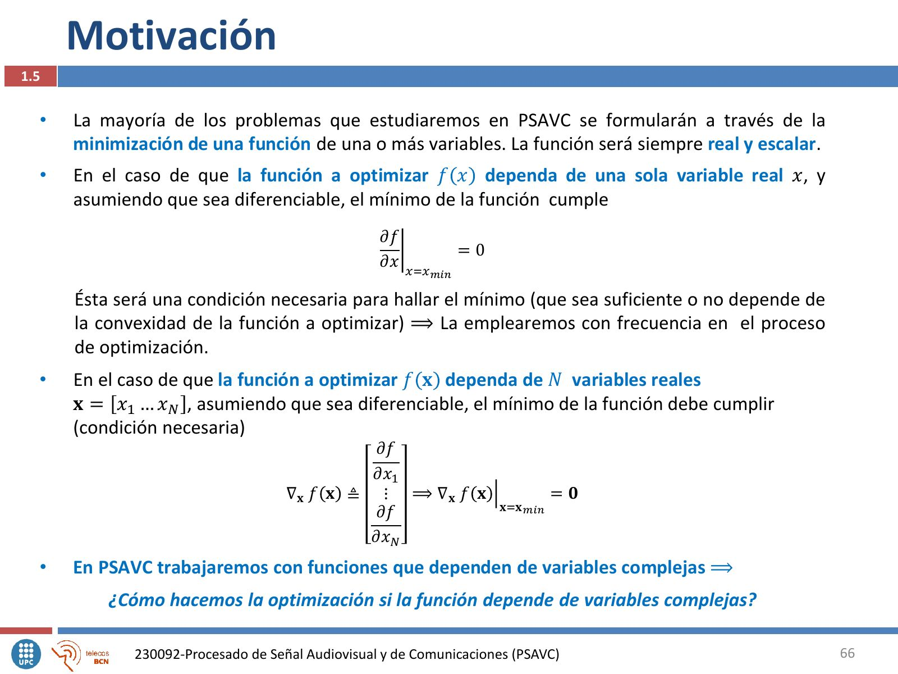

```text
      Motivación
1.5


  •   La mayoría de los problemas que estudiaremos en PSAVC se formularán a través de la
      minimización de una función de una o más variables. La función será siempre real y escalar.
  •   En el caso de que la función a optimizar 𝑓𝑓 𝑥𝑥 dependa de una sola variable real 𝑥𝑥, y
      asumiendo que sea diferenciable, el mínimo de la función cumple
                                                  𝜕𝜕𝜕𝜕
                                                       �            =0
                                                  𝜕𝜕𝜕𝜕 𝑥𝑥=𝑥𝑥
                                                           𝑚𝑚𝑚𝑚𝑚𝑚

      Ésta será una condición necesaria para hallar el mínimo (que sea suficiente o no depende de
      la convexidad de la función a optimizar) ⟹ La emplearemos con frecuencia en el proceso
      de optimización.
  •   En el caso de que la función a optimizar 𝑓𝑓 𝐱𝐱 dependa de 𝑁𝑁 variables reales
      𝐱𝐱 = 𝑥𝑥1 … 𝑥𝑥𝑁𝑁 , asumiendo que sea diferenciable, el mínimo de la función debe cumplir
      (condición necesaria)
                                                 𝜕𝜕𝜕𝜕
                                                𝜕𝜕𝑥𝑥1
                                    ∇𝐱𝐱 𝑓𝑓 𝐱𝐱 ≜ ⋮ ⟹ ∇𝐱𝐱 𝑓𝑓 𝐱𝐱 �              = 𝟎𝟎
                                                 𝜕𝜕𝜕𝜕           𝐱𝐱=𝐱𝐱 𝑚𝑚𝑚𝑚𝑚𝑚

                                               𝜕𝜕𝑥𝑥𝑁𝑁
  •   En PSAVC trabajaremos con funciones que dependen de variables complejas ⟹
          ¿Cómo hacemos la optimización si la función depende de variables complejas?

             230092-Procesado de Señal Audiovisual y de Comunicaciones (PSAVC)                      66
```

## Page 67

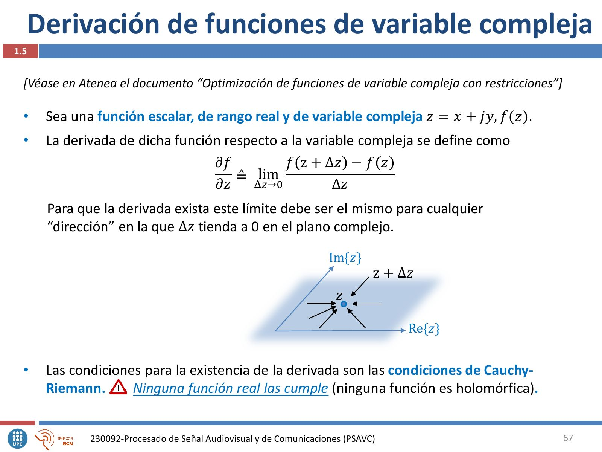

```text
      Derivación de funciones de variable compleja
1.5


  [Véase en Atenea el documento “Optimización de funciones de variable compleja con restricciones”]

  •    Sea una función escalar, de rango real y de variable compleja 𝑧𝑧 = 𝑥𝑥 + 𝑗𝑗𝑗𝑗, 𝑓𝑓(𝑧𝑧).
  •    La derivada de dicha función respecto a la variable compleja se define como
                                  𝜕𝜕𝜕𝜕         𝑓𝑓 z + Δ𝑧𝑧 − 𝑓𝑓 𝑧𝑧
                                       ≜ lim
                                  𝜕𝜕𝜕𝜕   Δ𝑧𝑧→0         Δ𝑧𝑧
       Para que la derivada exista este límite debe ser el mismo para cualquier
       “dirección” en la que Δ𝑧𝑧 tienda a 0 en el plano complejo.

                                                                    Im{𝑧𝑧}
                                                                              z + Δ𝑧𝑧
                                                                      𝑧𝑧

                                                                                    Re{𝑧𝑧}


  •    Las condiciones para la existencia de la derivada son las condiciones de Cauchy-
       Riemann.      Ninguna función real las cumple (ninguna función es holomórfica).


              230092-Procesado de Señal Audiovisual y de Comunicaciones (PSAVC)                       67
```

## Page 68

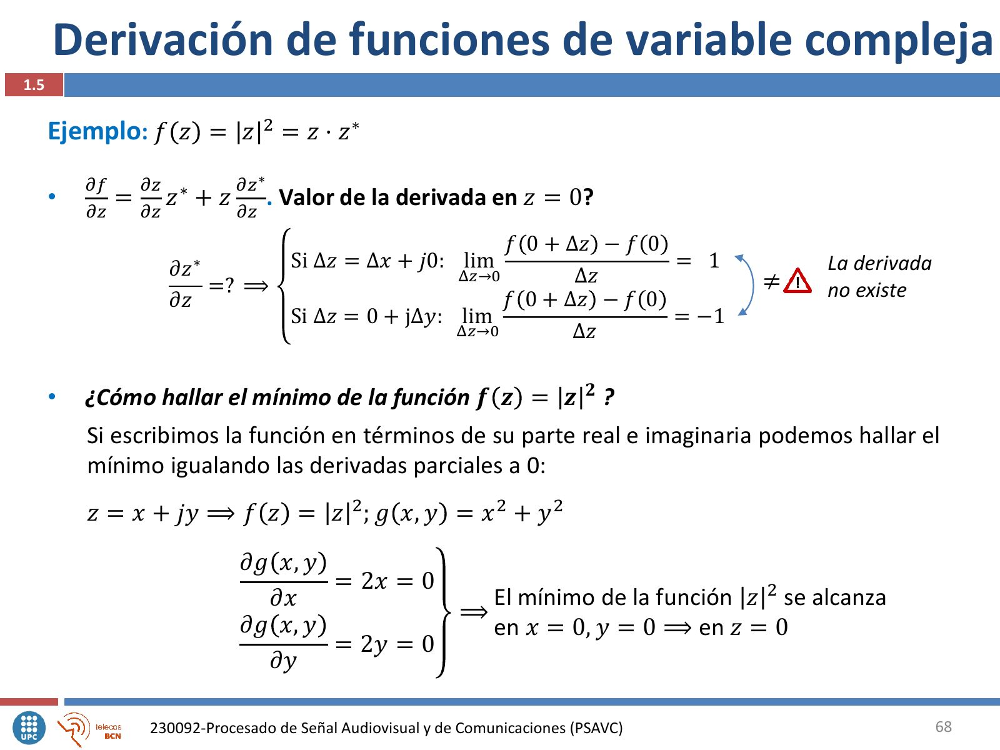

```text
      Derivación de funciones de variable compleja
1.5

      Ejemplo: 𝑓𝑓 𝑧𝑧 = 𝑧𝑧 2 = 𝑧𝑧 · 𝑧𝑧 ∗
          𝜕𝜕𝜕𝜕  𝜕𝜕𝜕𝜕 ∗   𝜕𝜕𝑧𝑧 ∗
      •        = 𝑧𝑧 + 𝑧𝑧 𝜕𝜕𝜕𝜕 . Valor de la derivada en 𝑧𝑧 = 0?
          𝜕𝜕𝜕𝜕  𝜕𝜕𝜕𝜕
                                                      𝑓𝑓 0 + Δ𝑧𝑧 − 𝑓𝑓 0
                   𝜕𝜕𝑧𝑧∗            Si Δ𝑧𝑧 = Δ𝑥𝑥 + 𝑗𝑗0: lim             = 1              La derivada
                        =? ⟹
                                                Δ𝑧𝑧→0         Δ𝑧𝑧                    ≠
                   𝜕𝜕𝜕𝜕                               𝑓𝑓 0 + Δ𝑧𝑧 − 𝑓𝑓 0                  no existe
                             Si Δ𝑧𝑧 = 0 + jΔ𝑦𝑦: lim                     = −1
                                                Δ𝑧𝑧→0         Δ𝑧𝑧


      •   ¿Cómo hallar el mínimo de la función 𝒇𝒇 𝒛𝒛 = 𝒛𝒛 𝟐𝟐 ?
          Si escribimos la función en términos de su parte real e imaginaria podemos hallar el
          mínimo igualando las derivadas parciales a 0:
          𝑧𝑧 = 𝑥𝑥 + 𝑗𝑗𝑗𝑗 ⟹ 𝑓𝑓 𝑧𝑧 = 𝑧𝑧 2 ; 𝑔𝑔 𝑥𝑥, 𝑦𝑦 = 𝑥𝑥 2 + 𝑦𝑦 2
                             𝜕𝜕𝜕𝜕 𝑥𝑥, 𝑦𝑦
                                         = 2𝑥𝑥 = 0
                                 𝜕𝜕𝜕𝜕                El mínimo de la función 𝑧𝑧 2 se alcanza
                                                   ⟹
                             𝜕𝜕𝜕𝜕 𝑥𝑥, 𝑦𝑦             en 𝑥𝑥 = 0, 𝑦𝑦 = 0 ⟹ en 𝑧𝑧 = 0
                                         = 2𝑦𝑦 = 0
                                 𝜕𝜕𝑦𝑦

                 230092-Procesado de Señal Audiovisual y de Comunicaciones (PSAVC)                     68
```

## Page 69

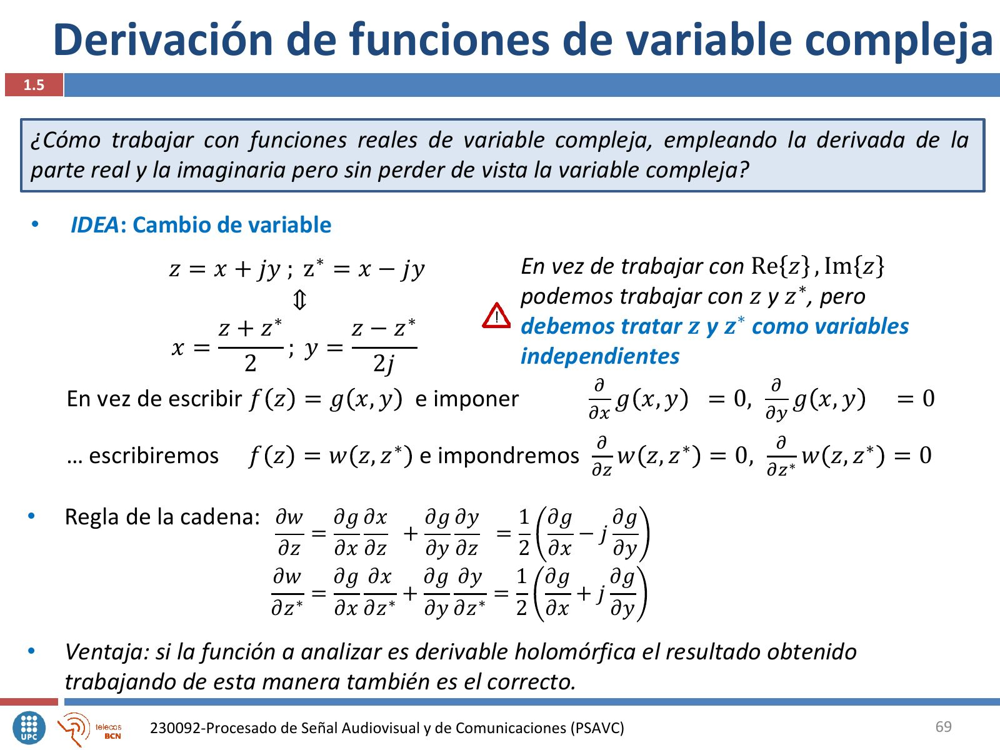

```text
      Derivación de funciones de variable compleja
1.5


 ¿Cómo trabajar con funciones reales de variable compleja, empleando la derivada de la
 parte real y la imaginaria pero sin perder de vista la variable compleja?

 •    IDEA: Cambio de variable
                𝑧𝑧 = 𝑥𝑥 + 𝑗𝑗𝑗𝑗 ; z ∗ = 𝑥𝑥 − 𝑗𝑗𝑗𝑗     En 𝑧𝑧
                                                        vez de 1 trabajar𝑗𝑗 con  𝑥𝑥 Re 𝑧𝑧 , Im 𝑧𝑧
                                                           ∗ =
                                 ⇕                   podemos
                                                        𝑧𝑧             −𝑗𝑗 𝑦𝑦
                                                                 trabajar
                                                                  1            con 𝑧𝑧 y 𝑧𝑧 ∗ , pero
                                                                                    ∗
                      𝑧𝑧 + 𝑧𝑧 ∗        𝑧𝑧 − 𝑧𝑧 ∗     debemos tratar  𝐀𝐀; 𝐀𝐀𝒛𝒛𝐻𝐻y𝐀𝐀𝒛𝒛 =como
                                                                                       2𝐈𝐈 variables
                𝑥𝑥 =            ; 𝑦𝑦 =               independientes
                         2                2𝑗𝑗
                                                             𝜕𝜕                         𝜕𝜕
      En vez de escribir 𝑓𝑓 𝑧𝑧 = 𝑔𝑔 𝑥𝑥, 𝑦𝑦 e imponer            𝑔𝑔 𝑥𝑥, 𝑦𝑦 = 0,             𝑔𝑔 𝑥𝑥, 𝑦𝑦 =0
                                                                           𝜕𝜕𝜕𝜕       𝜕𝜕𝑦𝑦
                                                                            𝜕𝜕          𝜕𝜕
      … escribiremos        𝑓𝑓 𝑧𝑧 = 𝑤𝑤 𝑧𝑧, 𝑧𝑧 ∗ e impondremos 𝜕𝜕𝑧𝑧 𝑤𝑤 𝑧𝑧, 𝑧𝑧 ∗ = 0, 𝜕𝜕𝑧𝑧 ∗ 𝑤𝑤 𝑧𝑧, 𝑧𝑧 ∗ = 0

•     Regla de la cadena: 𝜕𝜕𝜕𝜕         𝜕𝜕𝜕𝜕 𝜕𝜕𝜕𝜕   𝜕𝜕𝜕𝜕 𝜕𝜕𝜕𝜕   1 𝜕𝜕𝜕𝜕      𝜕𝜕𝜕𝜕
                                     =           +           =        − 𝑗𝑗
                                𝜕𝜕𝜕𝜕 𝜕𝜕𝜕𝜕 𝜕𝜕𝜕𝜕     𝜕𝜕𝜕𝜕 𝜕𝜕𝜕𝜕   2 𝜕𝜕𝜕𝜕      𝜕𝜕𝜕𝜕
                               𝜕𝜕𝜕𝜕 𝜕𝜕𝜕𝜕 𝜕𝜕𝜕𝜕 𝜕𝜕𝜕𝜕 𝜕𝜕𝜕𝜕        1 𝜕𝜕𝜕𝜕      𝜕𝜕𝜕𝜕
                                     =           +           =        + 𝑗𝑗
                               𝜕𝜕𝑧𝑧 ∗ 𝜕𝜕𝜕𝜕 𝜕𝜕𝑧𝑧 ∗ 𝜕𝜕𝜕𝜕 𝜕𝜕𝑧𝑧 ∗ 2 𝜕𝜕𝜕𝜕       𝜕𝜕𝜕𝜕

•     Ventaja: si la función a analizar es derivable holomórfica el resultado obtenido
      trabajando de esta manera también es el correcto.
               230092-Procesado de Señal Audiovisual y de Comunicaciones (PSAVC)                             69
```

## Page 70

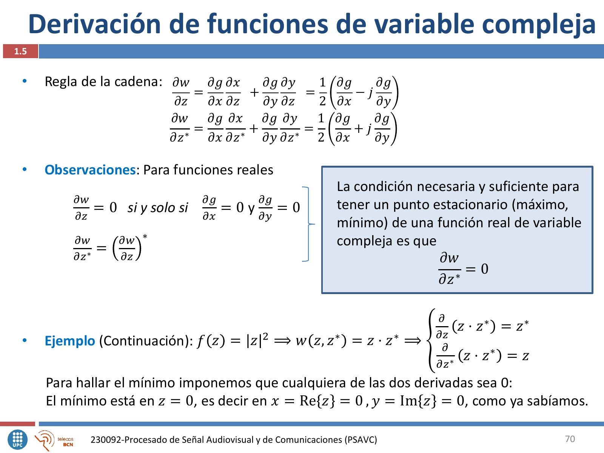

```text
      Derivación de funciones de variable compleja
1.5


 •     Regla de la cadena: 𝜕𝜕𝜕𝜕         𝜕𝜕𝜕𝜕 𝜕𝜕𝜕𝜕   𝜕𝜕𝜕𝜕 𝜕𝜕𝜕𝜕   1 𝜕𝜕𝜕𝜕      𝜕𝜕𝜕𝜕
                                      =           +           =        − 𝑗𝑗
                                 𝜕𝜕𝜕𝜕 𝜕𝜕𝜕𝜕 𝜕𝜕𝜕𝜕     𝜕𝜕𝜕𝜕 𝜕𝜕𝜕𝜕   2 𝜕𝜕𝜕𝜕      𝜕𝜕𝜕𝜕
                                𝜕𝜕𝜕𝜕 𝜕𝜕𝜕𝜕 𝜕𝜕𝜕𝜕 𝜕𝜕𝜕𝜕 𝜕𝜕𝜕𝜕        1 𝜕𝜕𝜕𝜕      𝜕𝜕𝜕𝜕
                                      =           +           =        + 𝑗𝑗
                                𝜕𝜕𝑧𝑧 ∗ 𝜕𝜕𝜕𝜕 𝜕𝜕𝑧𝑧 ∗ 𝜕𝜕𝜕𝜕 𝜕𝜕𝑧𝑧 ∗ 2 𝜕𝜕𝜕𝜕       𝜕𝜕𝜕𝜕

 •     Observaciones: Para funciones reales
                                                                      La condición necesaria y suficiente para
           𝜕𝜕𝜕𝜕                         𝜕𝜕𝑔𝑔    𝜕𝜕𝜕𝜕
                =0     si y solo si          =0y =0                   tener un punto estacionario (máximo,
           𝜕𝜕𝜕𝜕                         𝜕𝜕𝑥𝑥    𝜕𝜕𝑦𝑦
                                                                      mínimo) de una función real de variable
           𝜕𝜕𝜕𝜕       𝜕𝜕𝜕𝜕 ∗                                          compleja es que
                  =
           𝜕𝜕𝑧𝑧 ∗     𝜕𝜕𝑧𝑧                                                            𝜕𝜕𝜕𝜕
                                                                                             =0
                                                                                      𝜕𝜕𝑧𝑧 ∗

                                                                                      𝜕𝜕
                                                                                              𝑧𝑧 · 𝑧𝑧 ∗ = 𝑧𝑧 ∗
 •     Ejemplo (Continuación): 𝑓𝑓 𝑧𝑧 =             𝑧𝑧 2 ⟹ 𝑤𝑤 𝑧𝑧, 𝑧𝑧 ∗ = 𝑧𝑧 · 𝑧𝑧 ∗ ⟹ �𝜕𝜕𝜕𝜕𝜕𝜕
                                                                                            ∗   𝑧𝑧 · 𝑧𝑧 ∗ = 𝑧𝑧
                                                                                     𝜕𝜕𝑧𝑧
       Para hallar el mínimo imponemos que cualquiera de las dos derivadas sea 0:
       El mínimo está en 𝑧𝑧 = 0, es decir en 𝑥𝑥 = Re 𝑧𝑧 = 0 , 𝑦𝑦 = Im 𝑧𝑧 = 0, como ya sabíamos.

               230092-Procesado de Señal Audiovisual y de Comunicaciones (PSAVC)                                 70
```

## Page 71

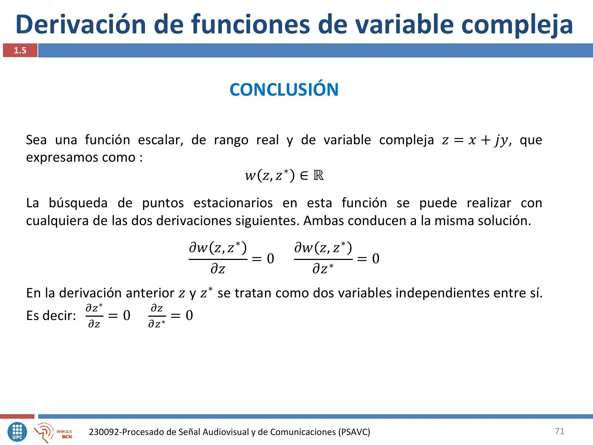

```text
Derivación de funciones de variable compleja
1.5


                                              CONCLUSIÓN

  Sea una función escalar, de rango real y de variable compleja 𝑧𝑧 = 𝑥𝑥 + 𝑗𝑗𝑗𝑗, que
  expresamos como :
                                  𝑤𝑤 𝑧𝑧, 𝑧𝑧 ∗ ∈ ℝ
  La búsqueda de puntos estacionarios en esta función se puede realizar con
  cualquiera de las dos derivaciones siguientes. Ambas conducen a la misma solución.
                                     𝜕𝜕𝑤𝑤 𝑧𝑧, 𝑧𝑧 ∗           𝜕𝜕𝑤𝑤 𝑧𝑧, 𝑧𝑧 ∗
                                                   =0                      =0
                                         𝜕𝜕𝜕𝜕                    𝜕𝜕𝑧𝑧 ∗
  En la derivación anterior 𝑧𝑧 y 𝑧𝑧 ∗ se tratan como dos variables independientes entre sí.
              𝜕𝜕𝑧𝑧 ∗        𝜕𝜕𝜕𝜕
  Es decir:          =0           =0
               𝜕𝜕𝜕𝜕        𝜕𝜕𝑧𝑧 ∗


              230092-Procesado de Señal Audiovisual y de Comunicaciones (PSAVC)               71
```

## Page 72

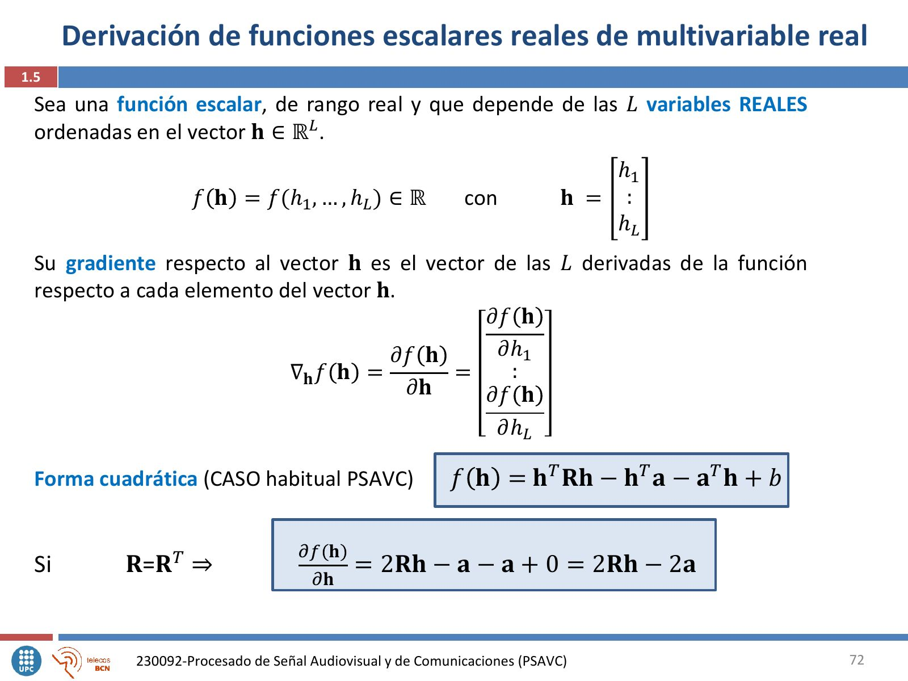

```text
       Derivación de funciones escalares reales de multivariable real
1.5
  Sea una función escalar, de rango real y que depende de las 𝐿𝐿 variables REALES
  ordenadas en el vector 𝐡𝐡 ∈ ℝ𝐿𝐿 .
                                                                                ℎ1
                    𝑓𝑓 𝐡𝐡 = 𝑓𝑓(ℎ1 , … , ℎ𝐿𝐿 ) ∈ ℝ            con           𝐡𝐡 = :
                                                                                ℎ𝐿𝐿
  Su gradiente respecto al vector 𝐡𝐡 es el vector de las 𝐿𝐿 derivadas de la función
  respecto a cada elemento del vector 𝐡𝐡.
                                                  𝜕𝜕𝜕𝜕 𝐡𝐡
                                        𝜕𝜕𝑓𝑓 𝐡𝐡     𝜕𝜕ℎ1
                            ∇𝐡𝐡 𝑓𝑓 𝐡𝐡 =         =     :
                                           𝜕𝜕𝐡𝐡   𝜕𝜕𝜕𝜕 𝐡𝐡
                                                    𝜕𝜕ℎ𝐿𝐿

  Forma cuadrática (CASO habitual PSAVC)                   𝑓𝑓 𝐡𝐡 = 𝐡𝐡𝑇𝑇 𝐑𝐑𝐡𝐡 − 𝐡𝐡𝑇𝑇 𝐚𝐚 − 𝐚𝐚𝑇𝑇 𝐡𝐡 + 𝑏𝑏

                                    𝜕𝜕𝜕𝜕 𝐡𝐡
  Si       𝐑𝐑=𝐑𝐑𝑇𝑇 ⇒                          = 2𝐑𝐑𝐑𝐑 − 𝐚𝐚 − 𝐚𝐚 + 0 = 2𝐑𝐑𝐑𝐑 − 2𝐚𝐚
                                      𝜕𝜕𝐡𝐡


            230092-Procesado de Señal Audiovisual y de Comunicaciones (PSAVC)                           72
```

## Page 73

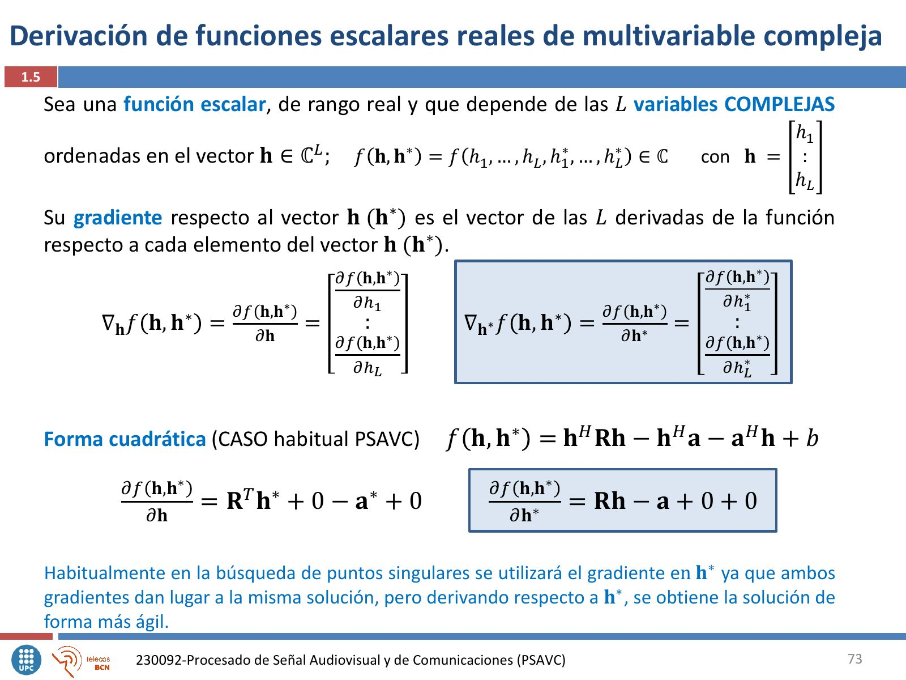

```text
Derivación de funciones escalares reales de multivariable compleja
1.5
      Sea una función escalar, de rango real y que depende de las 𝐿𝐿 variables COMPLEJAS
                                                                                                                                 ℎ1
      ordenadas en el vector 𝐡𝐡 ∈ ℂ𝐿𝐿              ;      𝑓𝑓 𝐡𝐡, 𝐡𝐡   ∗
                                                                          = 𝑓𝑓 ℎ1 , … , ℎ𝐿𝐿 , ℎ1∗ , … , ℎ𝐿𝐿∗   ∈ℂ       con 𝐡𝐡 = :
                                                                                                                                 ℎ𝐿𝐿
      Su gradiente respecto al vector 𝐡𝐡 (𝐡𝐡∗ ) es el vector de las 𝐿𝐿 derivadas de la función
      respecto a cada elemento del vector 𝐡𝐡 (𝐡𝐡∗ ).
                                                       𝜕𝜕𝜕𝜕 𝐡𝐡,𝐡𝐡∗                                                      𝜕𝜕𝜕𝜕 𝐡𝐡,𝐡𝐡∗
                                                           𝜕𝜕ℎ1                                                             𝜕𝜕ℎ1∗
                                 𝜕𝜕𝑓𝑓 𝐡𝐡,𝐡𝐡∗                                                         𝜕𝜕𝜕𝜕 𝐡𝐡,𝐡𝐡∗
             ∇𝐡𝐡   𝑓𝑓 𝐡𝐡, 𝐡𝐡∗   = 𝜕𝜕𝐡𝐡         =            :                   ∇𝐡𝐡∗ 𝑓𝑓 𝐡𝐡, 𝐡𝐡∗     = 𝜕𝜕𝐡𝐡∗         =        :
                                                       𝜕𝜕𝜕𝜕 𝐡𝐡,𝐡𝐡∗                                                      𝜕𝜕𝜕𝜕 𝐡𝐡,𝐡𝐡∗
                                                          𝜕𝜕ℎ𝐿𝐿                                                            𝜕𝜕ℎ𝐿𝐿∗


      Forma cuadrática (CASO habitual PSAVC)                                 𝑓𝑓 𝐡𝐡, 𝐡𝐡∗ = 𝐡𝐡𝐻𝐻 𝐑𝐑𝐡𝐡 − 𝐡𝐡𝐻𝐻 𝐚𝐚 − 𝐚𝐚𝐻𝐻 𝐡𝐡 + 𝑏𝑏
               𝜕𝜕𝜕𝜕 𝐡𝐡,𝐡𝐡∗           𝑇𝑇 ∗                    ∗                      𝜕𝜕𝜕𝜕 𝐡𝐡,𝐡𝐡∗
                                = 𝐑𝐑 𝐡𝐡 + 0 − 𝐚𝐚 + 0                                              = 𝐑𝐑𝐑𝐑 − 𝐚𝐚 + 0 + 0
                   𝜕𝜕𝐡𝐡                                                                 𝜕𝜕𝐡𝐡∗


      Habitualmente en la búsqueda de puntos singulares se utilizará el gradiente en 𝐡𝐡∗ ya que ambos
      gradientes dan lugar a la misma solución, pero derivando respecto a 𝐡𝐡∗ , se obtiene la solución de
      forma más ágil.
                    230092-Procesado de Señal Audiovisual y de Comunicaciones (PSAVC)                                                  73
```

## Page 74

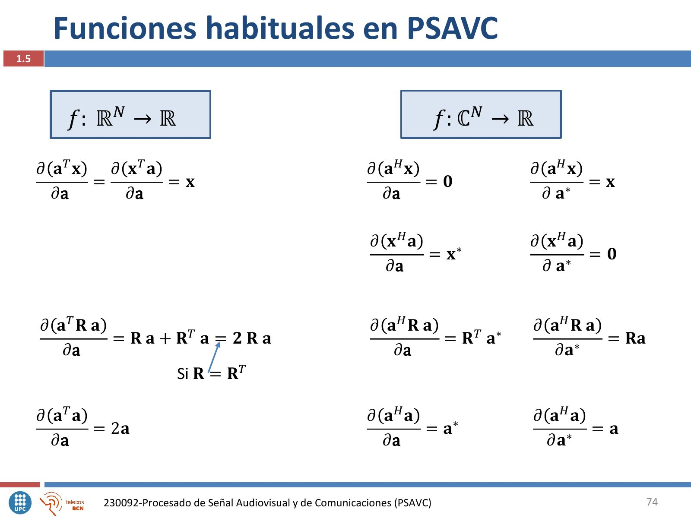

```text
         Funciones habituales en PSAVC
1.5


           𝑓𝑓: ℝ𝑁𝑁 → ℝ                                                                𝑓𝑓: ℂ𝑁𝑁 → ℝ

      𝜕𝜕 𝐚𝐚𝑇𝑇 𝐱𝐱   𝜕𝜕 𝐱𝐱 𝑇𝑇 𝐚𝐚                                        𝜕𝜕 𝐚𝐚𝐻𝐻 𝐱𝐱                 𝜕𝜕 𝐚𝐚𝐻𝐻 𝐱𝐱
                 =             = 𝐱𝐱                                              = 𝟎𝟎                       = 𝐱𝐱
         𝜕𝜕a          𝜕𝜕a                                                𝜕𝜕a                       𝜕𝜕 𝐚𝐚∗

                                                                      𝜕𝜕 𝐱𝐱 𝐻𝐻 𝐚𝐚                𝜕𝜕 𝐱𝐱 𝐻𝐻 𝐚𝐚
                                                                                  = 𝐱𝐱 ∗                     = 𝟎𝟎
                                                                         𝜕𝜕a                       𝜕𝜕 𝐚𝐚∗


      𝜕𝜕 𝐚𝐚𝑇𝑇 𝐑𝐑 𝐚𝐚                                                   𝜕𝜕 𝐚𝐚𝐻𝐻 𝐑𝐑 𝐚𝐚              𝜕𝜕 𝐚𝐚𝐻𝐻 𝐑𝐑 𝐚𝐚
                    = 𝐑𝐑 𝐚𝐚 + 𝐑𝐑𝑇𝑇 𝐚𝐚 = 𝟐𝟐 𝐑𝐑 𝐚𝐚                                    = 𝐑𝐑𝑇𝑇 𝐚𝐚∗                 = 𝐑𝐑𝐑𝐑
          𝜕𝜕a                                                             𝜕𝜕a                        𝜕𝜕𝐚𝐚∗
                              Si 𝐑𝐑 = 𝐑𝐑𝑇𝑇

      𝜕𝜕 𝐚𝐚𝑇𝑇 𝐚𝐚                                                      𝜕𝜕 𝐚𝐚𝐻𝐻 𝐚𝐚                 𝜕𝜕 𝐚𝐚𝐻𝐻 𝐚𝐚
                 = 2𝐚𝐚                                                           = 𝐚𝐚∗                      = 𝐚𝐚
         𝜕𝜕a                                                             𝜕𝜕a                        𝜕𝜕𝐚𝐚∗


                  230092-Procesado de Señal Audiovisual y de Comunicaciones (PSAVC)                                 74
```

## Page 75

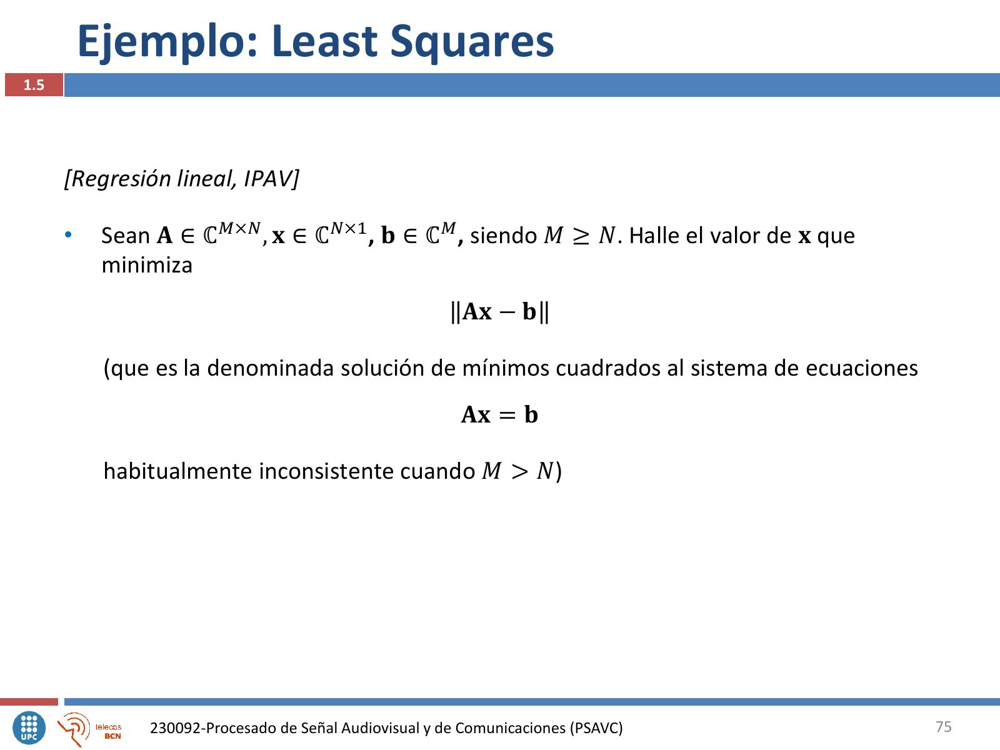

```text
          Ejemplo: Least Squares
1.5


      [Regresión lineal, IPAV]

      •    Sean 𝐀𝐀 ∈ ℂ𝑀𝑀×𝑁𝑁 , 𝐱𝐱 ∈ ℂ𝑁𝑁×1, 𝐛𝐛 ∈ ℂ𝑀𝑀 , siendo 𝑀𝑀 ≥ 𝑁𝑁. Halle el valor de 𝐱𝐱 que
           minimiza
                                                          𝐀𝐀𝐀𝐀 − 𝐛𝐛

           (que es la denominada solución de mínimos cuadrados al sistema de ecuaciones
                                                          𝐀𝐀𝐀𝐀 = 𝐛𝐛

           habitualmente inconsistente cuando 𝑀𝑀 > 𝑁𝑁)


                230092-Procesado de Señal Audiovisual y de Comunicaciones (PSAVC)               75
```

## Page 76

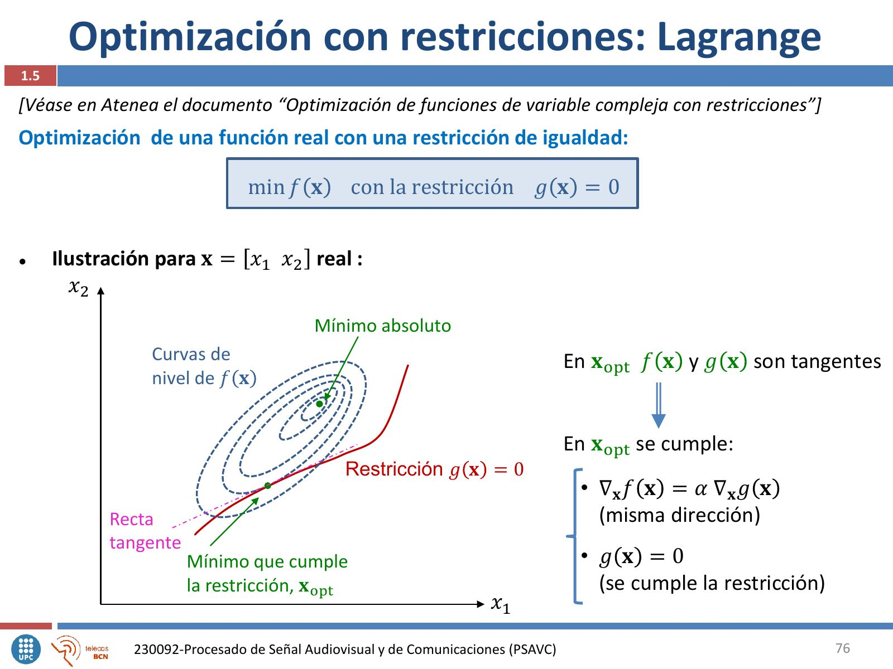

```text
       Optimización con restricciones: Lagrange
1.5

[Véase en Atenea el documento “Optimización de funciones de variable compleja con restricciones”]
Optimización de una función real con una restricción de igualdad:

                                min 𝑓𝑓 𝐱𝐱       con la restricción 𝑔𝑔 𝐱𝐱 = 0


●     Ilustración para 𝐱𝐱 = 𝑥𝑥1 𝑥𝑥2 real :
        𝑥𝑥2
                                          Mínimo absoluto
                 Curvas de                                                         En 𝐱𝐱 opt 𝑓𝑓 𝐱𝐱 y 𝑔𝑔 𝐱𝐱 son tangentes
                 nivel de 𝑓𝑓 𝐱𝐱


                                                                                   En 𝐱𝐱 opt se cumple:
                                               Restricción 𝑔𝑔 𝐱𝐱 = 0
                                                                                     • ∇𝐱𝐱 𝑓𝑓 𝐱𝐱 = 𝛼𝛼 ∇𝐱𝐱 𝑔𝑔 𝐱𝐱
            Recta                                                                      (misma dirección)
            tangente
                       Mínimo que cumple                                             • 𝑔𝑔 𝐱𝐱 = 0
                       la restricción, 𝐱𝐱 opt                                          (se cumple la restricción)
                                                                     𝑥𝑥1

               230092-Procesado de Señal Audiovisual y de Comunicaciones (PSAVC)                                    76
```

## Page 77

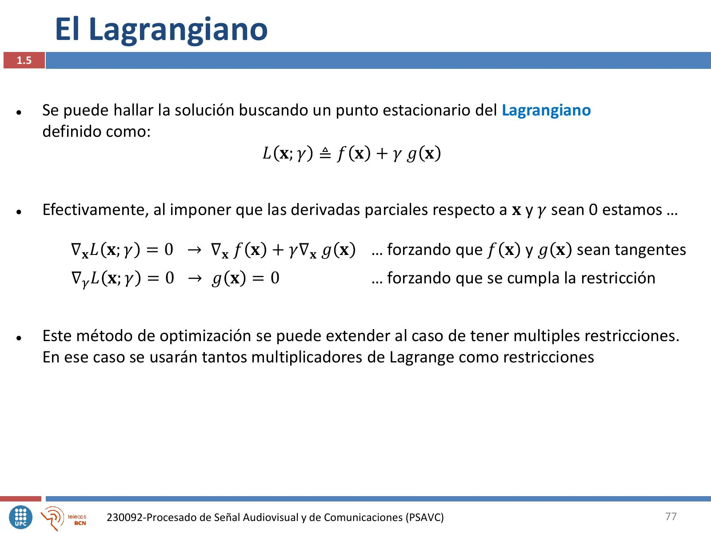

```text
       El Lagrangiano
1.5


●     Se puede hallar la solución buscando un punto estacionario del Lagrangiano
      definido como:
                                     𝐿𝐿 𝐱𝐱; 𝛾𝛾 ≜ 𝑓𝑓 𝐱𝐱 + 𝛾𝛾 𝑔𝑔 𝐱𝐱


●     Efectivamente, al imponer que las derivadas parciales respecto a 𝐱𝐱 y 𝛾𝛾 sean 0 estamos …

          ∇𝐱𝐱 𝐿𝐿 𝐱𝐱; 𝛾𝛾 = 0 → ∇𝐱𝐱 𝑓𝑓 𝐱𝐱 + 𝛾𝛾∇𝐱𝐱 𝑔𝑔 𝐱𝐱            … forzando que 𝑓𝑓 𝐱𝐱 y 𝑔𝑔 𝐱𝐱 sean tangentes
          ∇𝛾𝛾 𝐿𝐿 𝐱𝐱; 𝛾𝛾 = 0 → 𝑔𝑔 𝐱𝐱 = 0                          … forzando que se cumpla la restricción


●     Este método de optimización se puede extender al caso de tener multiples restricciones.
      En ese caso se usarán tantos multiplicadores de Lagrange como restricciones


               230092-Procesado de Señal Audiovisual y de Comunicaciones (PSAVC)                           77
```

## Page 78

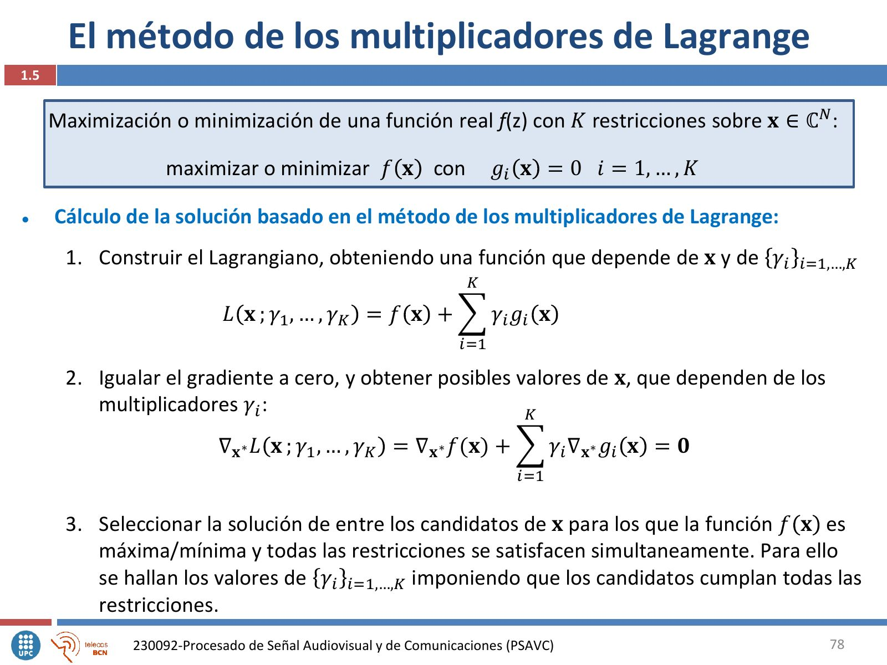

```text
        El método de los multiplicadores de Lagrange
1.5


      Maximización o minimización de una función real f(z) con 𝐾𝐾 restricciones sobre 𝐱𝐱 ∈ ℂ𝑁𝑁 :

                    maximizar o minimizar 𝑓𝑓 𝐱𝐱 con                     𝑔𝑔𝑖𝑖 𝐱𝐱 = 0 𝑖𝑖 = 1, … , 𝐾𝐾

●     Cálculo de la solución basado en el método de los multiplicadores de Lagrange:
       1. Construir el Lagrangiano, obteniendo una función que depende de 𝐱𝐱 y de 𝛾𝛾𝑖𝑖 𝑖𝑖=1,…,𝐾𝐾
                                                                  𝐾𝐾

                            𝐿𝐿 𝐱𝐱 ; 𝛾𝛾1 , … , 𝛾𝛾𝐾𝐾 = 𝑓𝑓 𝐱𝐱 + � 𝛾𝛾𝑖𝑖 𝑔𝑔𝑖𝑖 𝐱𝐱
                                                                 𝑖𝑖=1

       2. Igualar el gradiente a cero, y obtener posibles valores de 𝐱𝐱, que dependen de los
          multiplicadores 𝛾𝛾𝑖𝑖 :                           𝐾𝐾

                            ∇𝐱𝐱∗ 𝐿𝐿 𝐱𝐱 ; 𝛾𝛾1 , … , 𝛾𝛾𝐾𝐾 = ∇ 𝐱𝐱∗ 𝑓𝑓(𝐱𝐱) + � 𝛾𝛾𝑖𝑖 ∇𝐱𝐱∗ 𝑔𝑔𝑖𝑖 𝐱𝐱 = 𝟎𝟎
                                                                           𝑖𝑖=1


       3. Seleccionar la solución de entre los candidatos de 𝐱𝐱 para los que la función 𝑓𝑓 𝐱𝐱 es
          máxima/mínima y todas las restricciones se satisfacen simultaneamente. Para ello
          se hallan los valores de 𝛾𝛾𝑖𝑖 𝑖𝑖=1,…,𝐾𝐾 imponiendo que los candidatos cumplan todas las
          restricciones.
               230092-Procesado de Señal Audiovisual y de Comunicaciones (PSAVC)                     78
```

## Page 79

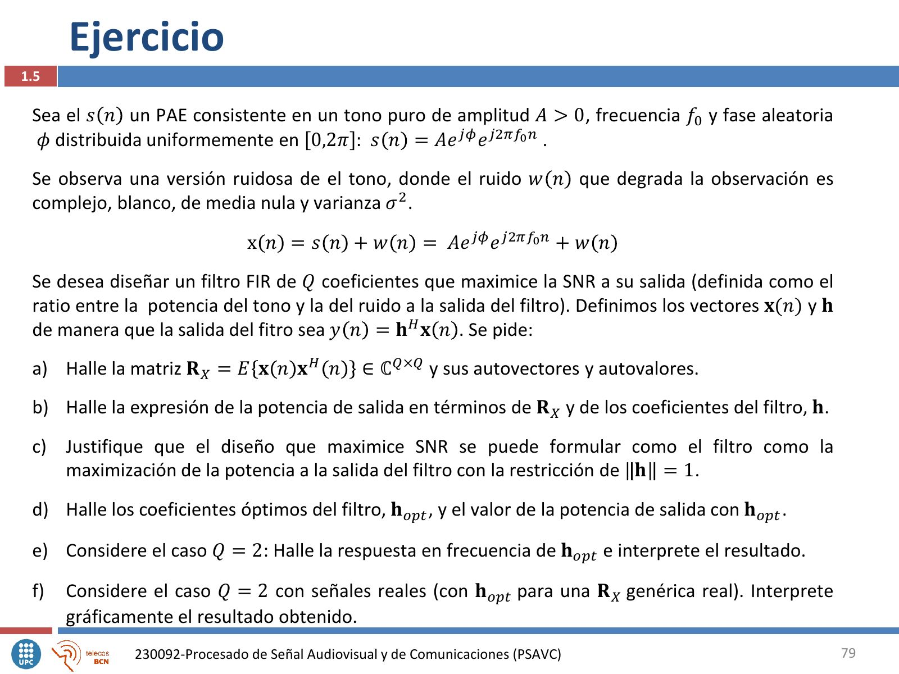

```text
      Ejercicio
1.5

 Sea el 𝑠𝑠 𝑛𝑛 un PAE consistente en un tono puro de amplitud 𝐴𝐴 > 0, frecuencia 𝑓𝑓0 y fase aleatoria
 𝜙𝜙 distribuida uniformemente en 0,2𝜋𝜋 : 𝑠𝑠 𝑛𝑛 = 𝐴𝐴𝑒𝑒 𝑗𝑗𝑗𝑗 𝑒𝑒 𝑗𝑗2𝜋𝜋𝑓𝑓0 𝑛𝑛 .
 Se observa una versión ruidosa de el tono, donde el ruido 𝑤𝑤 𝑛𝑛 que degrada la observación es
 complejo, blanco, de media nula y varianza 𝜎𝜎 2 .
                                x 𝑛𝑛 = 𝑠𝑠 𝑛𝑛 + 𝑤𝑤 𝑛𝑛 = 𝐴𝐴𝑒𝑒 𝑗𝑗𝑗𝑗 𝑒𝑒 𝑗𝑗2𝜋𝜋𝑓𝑓0 𝑛𝑛 + 𝑤𝑤 𝑛𝑛
 Se desea diseñar un filtro FIR de 𝑄𝑄 coeficientes que maximice la SNR a su salida (definida como el
 ratio entre la potencia del tono y la del ruido a la salida del filtro). Definimos los vectores 𝐱𝐱(𝑛𝑛) y 𝐡𝐡
 de manera que la salida del fitro sea 𝑦𝑦 𝑛𝑛 = 𝐡𝐡𝐻𝐻 𝐱𝐱 𝑛𝑛 . Se pide:
 a) Halle la matriz 𝐑𝐑𝑋𝑋 = 𝐸𝐸 𝐱𝐱 𝑛𝑛 𝐱𝐱 𝐻𝐻 𝑛𝑛     ∈ ℂ𝑄𝑄×𝑄𝑄 y sus autovectores y autovalores.
 b) Halle la expresión de la potencia de salida en términos de 𝐑𝐑𝑋𝑋 y de los coeficientes del filtro, 𝐡𝐡.
 c) Justifique que el diseño que maximice SNR se puede formular como el filtro como la
    maximización de la potencia a la salida del filtro con la restricción de 𝐡𝐡 = 1.
 d) Halle los coeficientes óptimos del filtro, 𝐡𝐡𝑜𝑜𝑜𝑜𝑜𝑜 , y el valor de la potencia de salida con 𝐡𝐡𝑜𝑜𝑜𝑜𝑜𝑜 .

 e) Considere el caso 𝑄𝑄 = 2: Halle la respuesta en frecuencia de 𝐡𝐡𝑜𝑜𝑜𝑜𝑜𝑜 e interprete el resultado.

 f)   Considere el caso 𝑄𝑄 = 2 con señales reales (con 𝐡𝐡𝑜𝑜𝑜𝑜𝑜𝑜 para una 𝐑𝐑𝑋𝑋 genérica real). Interprete
      gráficamente el resultado obtenido.
               230092-Procesado de Señal Audiovisual y de Comunicaciones (PSAVC)                               79
```

## Page 80

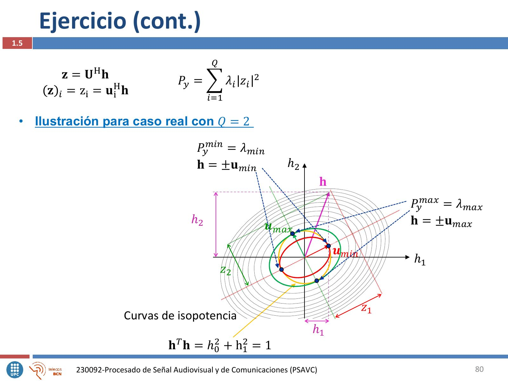

```text
      Ejercicio (cont.)
1.5

                                                  𝑄𝑄
                 H
           𝐳𝐳 = 𝐔𝐔 𝐡𝐡                   𝑃𝑃𝑦𝑦 = � 𝜆𝜆𝑖𝑖 𝑧𝑧𝑖𝑖 2
      𝐳𝐳 𝑖𝑖 = zi = 𝐮𝐮Hi 𝐡𝐡                       𝑖𝑖=1

 • Ilustración para caso real con 𝑄𝑄 = 2

                                             𝑃𝑃𝑦𝑦𝑚𝑚𝑚𝑚𝑚𝑚 = 𝜆𝜆𝑚𝑚𝑚𝑚𝑚𝑚
                                             𝐡𝐡 = ±𝐮𝐮𝑚𝑚𝑚𝑚𝑚𝑚            ℎ2
                                                                                 𝐡𝐡
                                                                                                       𝑃𝑃𝑦𝑦𝑚𝑚𝑚𝑚𝑚𝑚 = 𝜆𝜆𝑚𝑚𝑚𝑚𝑚𝑚
                                            ℎ2                                                         𝐡𝐡 = ±𝐮𝐮𝑚𝑚𝑚𝑚𝑚𝑚
                                                                 𝒖𝒖𝑚𝑚𝑚𝑚𝑚𝑚
                                                                                      𝒖𝒖𝑚𝑚𝑚𝑚𝑚𝑚
                                                                                                       ℎ1
                                                       𝑧𝑧2

                                                                                                 𝑧𝑧1
                         Curvas de isopotencia
                                                                            ℎ1
                                     𝐡𝐡𝑇𝑇 𝐡𝐡 = ℎ02 + h12 = 1
             230092-Procesado de Señal Audiovisual y de Comunicaciones (PSAVC)                                           80
```
