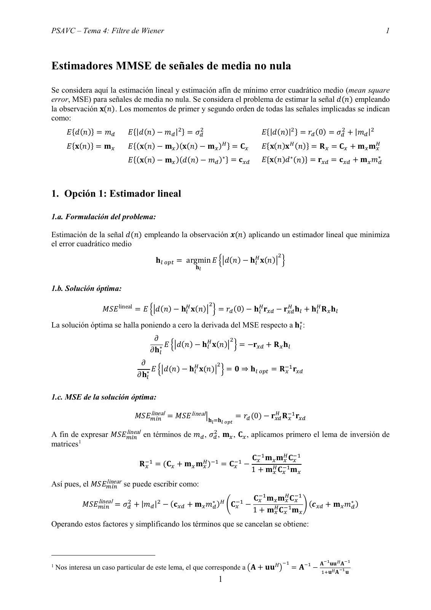
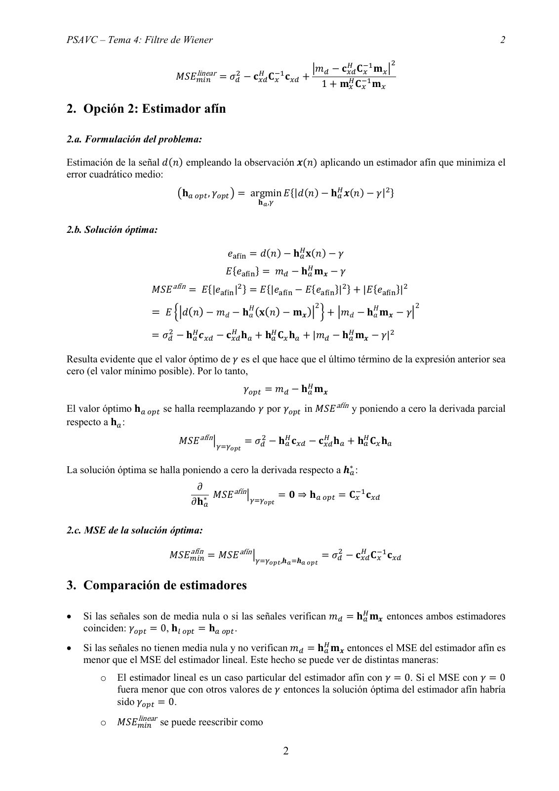
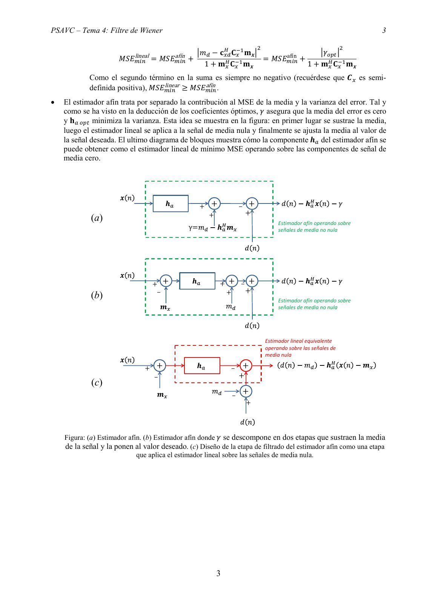

# Tema 4 Estimación MMSE de señales de media no nula - Estimador lineal vs estimador afín

- Source PDF: `Teoria/Tema 4 Estimación MMSE de señales de media no nula - Estimador lineal vs estimador afín.pdf`
- PDF title: `1`
- Pages: 3
- Note: Transcribed from the embedded PDF text layer. Each page links to a rendered page image so figures, plots, handwriting, and formula layout can be checked against the original.
- Text-layer caveat: `�` marks a glyph that the PDF text layer does not map to Unicode; use the rendered page image for that formula or symbol.

## Page 1



```text
PSAVC – Tema 4: Filtre de Wiener                                                                                                                    1


Estimadores MMSE de señales de media no nula
Se considera aquí la estimación lineal y estimación afín de mínimo error cuadrático medio (mean square
error, MSE) para señales de media no nula. Se considera el problema de estimar la señal 𝑑𝑑(𝑛𝑛) empleando
la observación 𝐱𝐱(𝑛𝑛). Los momentos de primer y segundo orden de todas las señales implicadas se indican
como:
        𝐸𝐸{𝑑𝑑(𝑛𝑛)} = 𝑚𝑚𝑑𝑑       𝐸𝐸{|𝑑𝑑(𝑛𝑛) − 𝑚𝑚𝑑𝑑 |2 } = 𝜎𝜎𝑑𝑑2                                  𝐸𝐸{|𝑑𝑑(𝑛𝑛)|2 } = 𝑟𝑟𝑑𝑑 (0) = 𝜎𝜎𝑑𝑑2 + |𝑚𝑚𝑑𝑑 |2
        𝐸𝐸{𝐱𝐱(𝑛𝑛)} = 𝐦𝐦𝑥𝑥       𝐸𝐸{(𝐱𝐱(𝑛𝑛) − 𝐦𝐦𝑥𝑥 )(𝐱𝐱(𝑛𝑛) − 𝐦𝐦𝑥𝑥 )𝐻𝐻 } = 𝐂𝐂𝑥𝑥                  𝐸𝐸{𝐱𝐱(𝑛𝑛)𝐱𝐱 𝐻𝐻 (𝑛𝑛)} = 𝐑𝐑 𝑥𝑥 = 𝐂𝐂𝑥𝑥 + 𝐦𝐦𝑥𝑥 𝐦𝐦𝐻𝐻
                                                                                                                                             𝑥𝑥

                                𝐸𝐸{(𝐱𝐱(𝑛𝑛) − 𝐦𝐦𝑥𝑥 )(𝑑𝑑(𝑛𝑛) − 𝑚𝑚𝑑𝑑 )∗ } = 𝐜𝐜𝑥𝑥𝑥𝑥                 𝐸𝐸{𝐱𝐱(𝑛𝑛)𝑑𝑑∗ (𝑛𝑛)} = 𝐫𝐫𝑥𝑥𝑥𝑥 = 𝐜𝐜𝑥𝑥𝑥𝑥 + 𝐦𝐦𝑥𝑥 𝑚𝑚𝑑𝑑∗


1. Opción 1: Estimador lineal

1.a. Formulación del problema:

Estimación de la señal 𝑑𝑑(𝑛𝑛) empleando la observación 𝒙𝒙(𝑛𝑛) aplicando un estimador lineal que minimiza
el error cuadrático medio
                                                                                                        2
                                           𝐡𝐡𝑙𝑙 𝑜𝑜𝑜𝑜𝑜𝑜 = argmin 𝐸𝐸 ��𝑑𝑑(𝑛𝑛) − 𝐡𝐡𝐻𝐻
                                                                                𝑙𝑙 𝐱𝐱(𝑛𝑛)� �
                                                             𝐡𝐡𝑙𝑙


1.b. Solución óptima:
                                                                    2
                     𝑀𝑀𝑀𝑀𝑀𝑀 lineal = 𝐸𝐸 ��𝑑𝑑(𝑛𝑛) − 𝐡𝐡𝐻𝐻                          𝐻𝐻             𝐻𝐻           𝐻𝐻
                                                     𝑙𝑙 𝐱𝐱(𝑛𝑛)� � = 𝑟𝑟𝑑𝑑 (0) − 𝐡𝐡𝑙𝑙 𝐫𝐫𝑥𝑥𝑥𝑥 − 𝐫𝐫𝑥𝑥𝑥𝑥 𝐡𝐡𝑙𝑙 + 𝐡𝐡𝑙𝑙 𝐑𝐑 𝑥𝑥 𝐡𝐡𝑙𝑙

La solución óptima se halla poniendo a cero la derivada del MSE respecto a 𝐡𝐡∗𝑙𝑙 :
                                           𝜕𝜕                   𝐻𝐻        2
                                              ∗ 𝐸𝐸 ��𝑑𝑑(𝑛𝑛) − 𝐡𝐡𝑙𝑙 𝐱𝐱(𝑛𝑛)� � = −𝐫𝐫𝑥𝑥𝑥𝑥 + 𝐑𝐑 𝑥𝑥 𝐡𝐡𝑙𝑙
                                         𝜕𝜕𝐡𝐡𝑙𝑙
                                     𝜕𝜕                   𝐻𝐻        2                         −1
                                        ∗ 𝐸𝐸 ��𝑑𝑑(𝑛𝑛) − 𝐡𝐡𝑙𝑙 𝐱𝐱(𝑛𝑛)� � = 𝟎𝟎 ⇒ 𝐡𝐡𝑙𝑙 𝑜𝑜𝑜𝑜𝑜𝑜 = 𝐑𝐑 𝑥𝑥 𝐫𝐫𝑥𝑥𝑥𝑥
                                   𝜕𝜕𝐡𝐡𝑙𝑙

1.c. MSE de la solución óptima:
                                        lineal
                                  𝑀𝑀𝑀𝑀𝑀𝑀𝑚𝑚𝑚𝑚𝑚𝑚 = 𝑀𝑀𝑀𝑀𝑀𝑀 lineal �𝐡𝐡 =𝐡𝐡                               𝐻𝐻 −1
                                                                                     = 𝑟𝑟𝑑𝑑 (0) − 𝐫𝐫𝑥𝑥𝑥𝑥 𝐑𝐑 𝑥𝑥 𝐫𝐫𝑥𝑥𝑥𝑥
                                                                    𝑙𝑙   𝑙𝑙 𝑜𝑜𝑜𝑜𝑜𝑜

                        lineal
A fin de expresar 𝑀𝑀𝑀𝑀𝑀𝑀𝑚𝑚𝑖𝑖𝑖𝑖 en términos de 𝑚𝑚𝑑𝑑 , 𝜎𝜎𝑑𝑑2 , 𝐦𝐦𝑥𝑥 , 𝐂𝐂𝑥𝑥 , aplicamos primero el lema de inversión de
matrices 1

                                                          𝐻𝐻 −1
                                                                                            𝐂𝐂𝑥𝑥−1 𝐦𝐦𝑥𝑥 𝐦𝐦𝐻𝐻    −1
                                                                                                           𝑥𝑥 𝐂𝐂𝑥𝑥
                                    𝐑𝐑−1
                                      𝑥𝑥 = (𝐂𝐂𝑥𝑥 + 𝐦𝐦𝑥𝑥 𝐦𝐦𝑥𝑥 )  = 𝐂𝐂𝑥𝑥−1 −
                                                                                            1 + 𝐦𝐦𝐻𝐻      −1
                                                                                                     𝑥𝑥 𝐂𝐂𝑥𝑥 𝐦𝐦𝑥𝑥
                   linear
Así pues, el 𝑀𝑀𝑀𝑀𝑀𝑀𝑚𝑚𝑚𝑚𝑚𝑚 se puede escribir como:

                   lineal                                                                   𝐂𝐂𝑥𝑥−1 𝐦𝐦𝑥𝑥 𝐦𝐦𝐻𝐻    −1
                                                                                                           𝑥𝑥 𝐂𝐂𝑥𝑥
             𝑀𝑀𝑀𝑀𝑀𝑀𝑚𝑚𝑚𝑚𝑚𝑚 = 𝜎𝜎𝑑𝑑2 + |𝑚𝑚𝑑𝑑 |2 − (𝐜𝐜𝑥𝑥𝑥𝑥 + 𝐦𝐦𝑥𝑥 𝑚𝑚𝑑𝑑∗ )𝐻𝐻 �𝐂𝐂𝑥𝑥−1 −                                     (𝒄𝒄        ∗)
                                                                                                           −1 𝐦𝐦 � 𝑥𝑥𝑥𝑥 + 𝐦𝐦𝑥𝑥 𝑚𝑚𝑑𝑑
                                                                                            1 + 𝐦𝐦𝐻𝐻    𝐂𝐂
                                                                                                     𝑥𝑥 𝑥𝑥         𝑥𝑥

Operando estos factores y simplificando los términos que se cancelan se obtiene:


                                                                                                            −1       −1       𝐀𝐀−1 𝐮𝐮𝐮𝐮𝐻𝐻𝐀𝐀−1
1
    Nos interesa un caso particular de este lema, el que corresponde a �𝐀𝐀 + 𝐮𝐮𝐮𝐮𝐻𝐻 �                            = 𝐀𝐀     −             −1
                                                                                                                               1+𝐮𝐮𝐻𝐻 𝐀𝐀 𝐮𝐮
                                                                         1
```

## Page 2



```text
PSAVC – Tema 4: Filtre de Wiener                                                                                                 2

                                                                                                    𝐻𝐻 −1             2
                                    linear                                  �𝑚𝑚𝑑𝑑               − 𝐜𝐜𝑥𝑥𝑥𝑥 𝐂𝐂𝑥𝑥 𝐦𝐦𝑥𝑥 �
                             𝑀𝑀𝑀𝑀𝑀𝑀𝑚𝑚𝑚𝑚𝑚𝑚    = 𝜎𝜎𝑑𝑑2 − 𝐜𝐜𝑥𝑥𝑥𝑥
                                                         𝐻𝐻 −1
                                                              𝐂𝐂𝑥𝑥 𝐜𝐜𝑥𝑥𝑥𝑥 +
                                                                                              1 + 𝐦𝐦𝑥𝑥 𝐂𝐂𝑥𝑥−1 𝐦𝐦𝑥𝑥
                                                                                                     𝐻𝐻


2. Opción 2: Estimador afín

2.a. Formulación del problema:

Estimación de la señal 𝑑𝑑(𝑛𝑛) empleando la observación 𝒙𝒙(𝑛𝑛) aplicando un estimador afín que minimiza el
error cuadrático medio:
                                                                                               2
                              �𝐡𝐡𝑎𝑎 𝑜𝑜𝑜𝑜𝑜𝑜 , 𝛾𝛾𝑜𝑜𝑜𝑜𝑜𝑜 � = argmin 𝐸𝐸{|𝑑𝑑(𝑛𝑛) − 𝐡𝐡𝐻𝐻
                                                                                𝑎𝑎 𝒙𝒙(𝑛𝑛) − 𝛾𝛾| }
                                                             𝐡𝐡𝑎𝑎 ,𝛾𝛾


2.b. Solución óptima:

                                               𝑒𝑒afín = 𝑑𝑑(𝑛𝑛) − 𝐡𝐡𝐻𝐻
                                                                   𝑎𝑎 𝐱𝐱(𝑛𝑛) − 𝛾𝛾

                                               𝐸𝐸{𝑒𝑒afín } = 𝑚𝑚𝑑𝑑 − 𝐡𝐡𝐻𝐻
                                                                      𝑎𝑎 𝐦𝐦𝒙𝒙 − 𝛾𝛾

                      𝑀𝑀𝑀𝑀𝑀𝑀 afín = 𝐸𝐸{|𝑒𝑒afín |2 } = 𝐸𝐸{|𝑒𝑒afín − 𝐸𝐸{𝑒𝑒afín }|2 } + |𝐸𝐸{𝑒𝑒afín }|2
                                                                                         2                                   2
                      = 𝐸𝐸 ��𝑑𝑑(𝑛𝑛) − 𝑚𝑚𝑑𝑑 − 𝐡𝐡𝐻𝐻𝑎𝑎 (𝐱𝐱(𝑛𝑛) − 𝐦𝐦𝒙𝒙 )� � + �𝑚𝑚𝑑𝑑 − 𝐡𝐡𝐻𝐻𝑎𝑎 𝐦𝐦𝒙𝒙 − 𝛾𝛾�

                      = 𝜎𝜎𝑑𝑑2 − 𝐡𝐡𝐻𝐻            𝐻𝐻            𝐻𝐻                       𝐻𝐻
                                  𝑎𝑎 𝒄𝒄𝑥𝑥𝑥𝑥 − 𝐜𝐜𝑥𝑥𝑥𝑥 𝐡𝐡𝑎𝑎 + 𝐡𝐡𝑎𝑎 𝐂𝐂𝑥𝑥 𝐡𝐡𝑎𝑎 + |𝑚𝑚𝑑𝑑 − 𝐡𝐡𝑎𝑎 𝐦𝐦𝒙𝒙 − 𝛾𝛾|
                                                                                                     2


Resulta evidente que el valor óptimo de 𝛾𝛾 es el que hace que el último término de la expresión anterior sea
cero (el valor mínimo posible). Por lo tanto,
                                                         𝛾𝛾𝑜𝑜𝑜𝑜𝑜𝑜 = 𝑚𝑚𝑑𝑑 − 𝐡𝐡𝐻𝐻
                                                                             𝑎𝑎 𝐦𝐦𝒙𝒙

El valor óptimo 𝐡𝐡𝑎𝑎 𝑜𝑜𝑜𝑜𝑜𝑜 se halla reemplazando 𝛾𝛾 por 𝛾𝛾𝑜𝑜𝑜𝑜𝑜𝑜 in 𝑀𝑀𝑀𝑀𝑀𝑀 afín y poniendo a cero la derivada parcial
respecto a 𝐡𝐡𝑎𝑎 :
                              𝑀𝑀𝑀𝑀𝑀𝑀 afín �𝛾𝛾=𝛾𝛾         = 𝜎𝜎𝑑𝑑2 − 𝐡𝐡𝐻𝐻            𝐻𝐻            𝐻𝐻
                                                                     𝑎𝑎 𝐜𝐜𝑥𝑥𝑥𝑥 − 𝐜𝐜𝑥𝑥𝑥𝑥 𝐡𝐡𝑎𝑎 + 𝐡𝐡𝑎𝑎 𝐂𝐂𝑥𝑥 𝐡𝐡𝑎𝑎
                                                𝑜𝑜𝑜𝑜𝑜𝑜


La solución óptima se halla poniendo a cero la derivada respecto a 𝒉𝒉∗𝑎𝑎 :
                                    𝜕𝜕
                                          𝑀𝑀𝑀𝑀𝑀𝑀 afín �𝛾𝛾=𝛾𝛾 = 𝟎𝟎 ⇒ 𝐡𝐡𝑎𝑎 𝑜𝑜𝑜𝑜𝑜𝑜 = 𝐂𝐂𝑥𝑥−1 𝐜𝐜𝑥𝑥𝑥𝑥
                                  𝜕𝜕𝐡𝐡∗𝑎𝑎                   𝑜𝑜𝑜𝑜𝑜𝑜


2.c. MSE de la solución óptima:
                                 afín
                           𝑀𝑀𝑀𝑀𝑀𝑀𝑚𝑚𝑚𝑚𝑚𝑚 = 𝑀𝑀𝑀𝑀𝑀𝑀 afín �𝛾𝛾=𝛾𝛾                                  = 𝜎𝜎𝑑𝑑2 − 𝐜𝐜𝑥𝑥𝑥𝑥
                                                                                                          𝐻𝐻 −1
                                                                                                               𝐂𝐂𝑥𝑥 𝐜𝐜𝑥𝑥𝑥𝑥
                                                                  𝑜𝑜𝑜𝑜𝑜𝑜 ,𝒉𝒉𝑎𝑎 =𝒉𝒉𝑎𝑎 𝑜𝑜𝑜𝑜𝑜𝑜


3. Comparación de estimadores

•   Si las señales son de media nula o si las señales verifican 𝑚𝑚𝑑𝑑 = 𝐡𝐡𝐻𝐻
                                                                         𝑎𝑎 𝐦𝐦𝒙𝒙 entonces ambos estimadores
    coinciden: 𝛾𝛾𝑜𝑜𝑜𝑜𝑜𝑜 = 0, 𝐡𝐡𝑙𝑙 𝑜𝑜𝑜𝑜𝑜𝑜 = 𝐡𝐡𝑎𝑎 𝑜𝑜𝑜𝑜𝑜𝑜 .
•   Si las señales no tienen media nula y no verifican 𝑚𝑚𝑑𝑑 = 𝐡𝐡𝐻𝐻
                                                                𝑎𝑎 𝐦𝐦𝒙𝒙 entonces el MSE del estimador afín es
    menor que el MSE del estimador lineal. Este hecho se puede ver de distintas maneras:
         o   El estimador lineal es un caso particular del estimador afín con 𝛾𝛾 = 0. Si el MSE con 𝛾𝛾 = 0
             fuera menor que con otros valores de 𝛾𝛾 entonces la solución óptima del estimador afín habría
             sido 𝛾𝛾𝑜𝑜𝑜𝑜𝑜𝑜 = 0.
                   linear
         o   𝑀𝑀𝑀𝑀𝑀𝑀𝑚𝑚𝑚𝑚𝑚𝑚 se puede reescribir como

                                                                         2
```

## Page 3



```text
PSAVC – Tema 4: Filtre de Wiener                                                                                            3

                                                                 𝐻𝐻 −1             2                                   2
                             lineal            afín    �𝑚𝑚𝑑𝑑 − 𝐜𝐜𝑥𝑥𝑥𝑥 𝐂𝐂𝑥𝑥 𝐦𝐦𝒙𝒙 �         afín
                                                                                                       �𝛾𝛾𝑜𝑜𝑜𝑜𝑜𝑜 �
                      𝑀𝑀𝑀𝑀𝑀𝑀𝑚𝑚𝑚𝑚𝑚𝑚    = 𝑀𝑀𝑀𝑀𝑀𝑀𝑚𝑚𝑚𝑚𝑚𝑚 +            𝐻𝐻    −1        = 𝑀𝑀𝑀𝑀𝑀𝑀𝑚𝑚𝑚𝑚𝑚𝑚 +
                                                         1 + 𝐦𝐦𝑥𝑥 𝐂𝐂𝑥𝑥 𝐦𝐦𝒙𝒙                        1 + 𝐦𝐦𝐻𝐻      −1
                                                                                                           𝑥𝑥 𝐂𝐂𝑥𝑥 𝐦𝐦𝒙𝒙

            Como el segundo término en la suma es siempre no negativo (recuérdese que 𝑪𝑪𝑥𝑥 es semi-
                                      linear         afín
            definida positiva), 𝑀𝑀𝑀𝑀𝑀𝑀𝑚𝑚𝑚𝑚𝑚𝑚 ≥ 𝑀𝑀𝑀𝑀𝑀𝑀𝑚𝑚𝑚𝑚𝑚𝑚 .
•   El estimador afín trata por separado la contribución al MSE de la media y la varianza del error. Tal y
    como se ha visto en la deducción de los coeficientes óptimos, 𝛾𝛾 asegura que la media del error es cero
    y 𝐡𝐡𝑎𝑎 𝑜𝑜𝑜𝑜𝑜𝑜 minimiza la varianza. Esta idea se muestra en la figura: en primer lugar se sustrae la media,
    luego el estimador lineal se aplica a la señal de media nula y finalmente se ajusta la media al valor de
    la señal deseada. El ultimo diagrama de bloques muestra cómo la componente 𝒉𝒉𝑎𝑎 del estimador afín se
    puede obtener como el estimador lineal de mínimo MSE operando sobre las componentes de señal de
    media cero.


                                                           +   +           ‒   +
                                                                               +
             (a)                                               +
                                                                                            Estimador afín operando sobre
                                                      γ=                                    señales de media no nula


                                      + +                          + + ‒ +
                                                                        +
             (b)                       ‒                            +
                                                                                            Estimador afín operando sobre
                                                                                            señales de media no nula


                                                                                       Estimador lineal equivalente
                                                                                       operando sobre las señales de
                                                                                       media nula

                                 +      +                              ‒       +
                                       ‒                                   +
             (c)
                                                                       ‒
                                                                               +
                                                                               +


    Figura: (a) Estimador afín. (b) Estimador afín donde 𝛾𝛾 se descompone en dos etapas que sustraen la media
    de la señal y la ponen al valor deseado. (c) Diseño de la etapa de filtrado del estimador afín como una etapa
                             que aplica el estimador lineal sobre las señales de media nula.


                                                                   3
```
